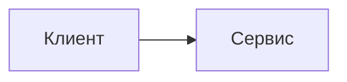

# КПО — конспект лекций

Конспект по конструированию программного обеспечения на [VitePress](https://vitepress.dev). Примеры кода на Kotlin, C#, Java и Go с общей переключалкой языка и интерактивным Kotlin Playground.

## Команды

```sh
npm install       # установка зависимостей
npm run dev       # дев-сервер
npm run build     # сборка в .vitepress/dist
npm run preview   # просмотр собранного сайта
```

## Структура контента

```
index.md               — главная (hero)
intro.md               — вступительная лекция + демо возможностей
lectures/LecN/         — папка лекции N
  ├─ vitepress.md      — публикуемая страница (ЕДИНСТВЕННОЕ, что попадает на сайт)
  ├─ assets/           — картинки страницы (слайды и т.п.)
  └─ …                 — черновики, транскрипты, видео: только для редактора,
                         в сборку и в git не попадают (см. .gitignore и srcExclude)
extras/NN.md           — дополнения (плоский файл или папка с vitepress.md)
extras/index.md        — страница «О дополнениях»
conclusion.md          — заключение
```

Боковая панель, навигация и чистые URL строятся автоматически (`.vitepress/lib/content.ts`):

- **добавить лекцию** — создать папку `lectures/Lec15/` с `vitepress.md` (или плоский файл `lectures/15.md`), ничего настраивать не нужно; страница получит URL `/lectures/15`;
- **заголовок пункта** берётся из frontmatter `title`, иначе из первого `# H1`, иначе «Лекция NN»;
- **переупорядочить** — номер берётся из имени папки/файла или из `order` во frontmatter;
- картинки внутри `vitepress.md` подключаются относительными путями: ``.

## Переключалка языков: `::: multi-code`

````md
::: multi-code "Заголовок примера" {default=kotlin playground=off}

```kotlin
fun main() = println("Привет")
```

```csharp
Console.WriteLine("Привет");
```

:::
````

- Внутри контейнера — только fence-блоки (` ```kotlin `, ` ```csharp `, ` ```java `, ` ```go `; алиасы `kt`, `cs` понимаются).
- Языки можно указывать не все: если глобально выбранного языка в блоке нет, показывается язык по умолчанию.
- `{default=go}` — язык по умолчанию для блока (иначе первый).
- `{playground=off}` — отключить Kotlin Playground для этого блока.
- Выбранный читателем язык общий для всего сайта и хранится в localStorage (`kpo:code-language`), как и режим playground (`kpo:playground-mode`).

## Текст для конкретного языка

Блок, видимый только при выбранном языке (внутри — любой markdown):

```md
::: only kotlin
> Пояснение, актуальное только для Kotlin.
:::
```

Вставка внутри предложения — компонент `<LangOnly>`:

```md
Программа завершается вызовом <LangOnly lang="go">`os.Exit(0)`</LangOnly>.
```

Показ управляется атрибутом `html[data-kpo-lang]` чистым CSS — секции переключаются мгновенно вместе с примерами кода.

## Диаграммы Mermaid

````md

````

Рендер на клиенте (библиотека грузится лениво только на страницах с диаграммами), палитра следует светлой/тёмной теме сайта.

## Темы и палитра

Единственный источник цветов кода — `.vitepress/lib/palette.ts` (светлая — IntelliJ Light, тёмная — Darcula/New UI). Из него собираются:

- две кастомные Shiki-темы (`.vitepress/lib/shikiThemes.ts`) для статической подсветки;
- CSS-переменные `--kpo-code-*` (`.vitepress/lib/paletteCss.ts`) для CodeMirror в Kotlin Playground.

Поэтому статический код и playground всегда окрашены одинаково, а смена темы не пере-инициализирует редактор. Переменные интерфейса — в `.vitepress/theme/styles/vars.css`.

## Публикация на GitHub Pages — пошагово

1. **Репозиторий.** Код должен лежать в GitHub-репозитории с именем `KPO`
   (имя обязано совпадать с `base: '/KPO/'` в `.vitepress/config.mts`;
   если репозиторий называется иначе — поменяйте `base`).
2. **Ветка.** Workflow `.github/workflows/deploy.yml` запускается при пуше
   в ветку `master` (основная ветка этого репозитория). Если ваша основная
   ветка называется иначе, поправьте `branches: [master]` в workflow.
3. **Включить Pages.** На GitHub: *Settings → Pages → Build and deployment →
   Source: **GitHub Actions***. Больше ничего настраивать не нужно.
4. **Запушить.** Любой пуш в основную ветку собирает сайт (`npm ci` +
   `vitepress build`) и публикует его. Прогресс виден во вкладке *Actions*.
5. **Адрес.** Сайт появится на `https://<логин>.github.io/KPO/`
   (для этого репозитория — https://kert0n.github.io/KPO/).

Замечания:

- публичный репозиторий публикуется на Pages бесплатно; для приватного нужен GitHub Pro;
- первый деплой после включения Pages может занять пару минут;
- проверить сборку локально перед пушем: `npm run build && npm run preview`.
