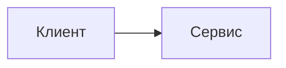

# КПО — конспект лекций

Интерактивный конспект по конструированию программного обеспечения на [VitePress](https://vitepress.dev). Сайт поддерживает многоязычные примеры кода, Kotlin Playground, Mermaid-диаграммы, адаптивные таблицы и регрессионно проверенный mobile layout.

## Требования

- Node 24 (`>=24 <25`);
- npm;
- Chromium browsers для Playwright UI tests.

Скрипты `prebuild`, `pretest` и `pretest:ui` проверяют major-версию Node, чтобы локальные проверки не проходили случайно на Node 20/26.

## Команды

```sh
npm ci            # чистая установка зависимостей
npm run dev       # дев-сервер
npm run build     # сборка в .vitepress/dist
npm run preview   # просмотр собранного сайта
npm run test      # unit-тесты markdown/theme моделей
npm run test:ui   # browser-регрессии Playwright
```

Полный локальный прогон перед изменениями в layout/theme:

```sh
npm run test
npm run build
npm run test:ui
```

## Структура контента

```text
index.md               — главная (hero)
intro.md               — onboarding по возможностям сайта
lectures/LecN/         — папка лекции N
  ├─ vitepress.md      — публикуемая страница (ЕДИНСТВЕННОЕ, что попадает на сайт)
  ├─ assets/           — картинки страницы (слайды и т.п.)
  └─ …                 — черновики, транскрипты, видео: только для редактора,
                         в сборку и в git не попадают (см. .gitignore и srcExclude)
extras/NN.md           — дополнение плоским файлом
extras/NN/vitepress.md — дополнение папкой, если нужны assets/черновики
extras/index.md        — страница «О дополнениях»
conclusion.md          — заключение
```

Боковая панель, навигация и чистые URL строятся автоматически (`.vitepress/lib/content.ts`):

- **добавить лекцию** — создать папку `lectures/Lec15/` с `vitepress.md` (или плоский файл `lectures/15.md`), ничего настраивать не нужно; страница получит URL `/lectures/15`;
- **заголовок пункта** берётся из frontmatter `title`, иначе из первого `# H1`, иначе «Лекция NN»;
- **переупорядочить** — номер берётся из имени папки/файла или из `order` во frontmatter;
- картинки внутри `vitepress.md` подключаются относительными путями: ``.

## Переключалка языков: `::: multi-code`

````md
::: multi-code "Заголовок примера" {default=kotlin playground=off}

```kotlin
fun main() = println("Привет")
```

```csharp
Console.WriteLine("Привет");
```

:::
````

- Внутри контейнера — только fence-блоки (` ```kotlin `, ` ```csharp `, ` ```java `, ` ```go `; алиасы `kt`, `cs` понимаются).
- Языки можно указывать не все: если глобально выбранного языка в блоке нет, показывается первый язык блока.
- `{default=go}` — авторский язык по умолчанию для этого блока. Он сильнее сохранённого глобального языка, пока пользователь не кликнул именно в этот блок.
- `{playground=off}` — жёстко отключить Kotlin Playground для этого блока: глобальный режим playground его не включит.
- Выбранный читателем язык общий для всего сайта и хранится в localStorage (`kpo:code-language`), как и режим playground (`kpo:playground-mode`).

Поведение default-ов:

- до первого клика в конкретном блоке `{default=...}` защищён и перебивает сохранённый глобальный язык;
- после клика в этом блоке он присоединяется к глобальному выбору и дальше переключается вместе с остальными совместимыми блоками;
- другие блоки с author default остаются защищёнными, пока пользователь не кликнет именно в них;
- блоки без author default всегда следуют глобальному языку, если такой язык есть в блоке;
- если глобального языка в блоке нет, используется author default, initial language или первый язык блока.

## Отдельный Kotlin-код для Playground

Если код для чтения должен быть коротким, а интерактивная версия требует `main`, тестовых данных или вывода, добавьте отдельный fence `kotlin playground`:

````md
::: multi-code "Заголовок примера"

```kotlin
data class User(val id: Int, val name: String)
```

```kotlin playground
data class User(val id: Int, val name: String)

fun main() {
    println(User(1, "Ада"))
}
```

```go
type User struct {
    ID   int
    Name string
}
```

:::
````

`kotlin playground` не становится отдельной вкладкой и не считается дублем Kotlin. Он используется только как исходник интерактивного редактора. Если такого fence нет, Playground берёт обычный `kotlin`-код. `{playground=off}` отключает оба варианта.

## Текст для конкретного языка

Блок, видимый только при выбранном языке (внутри — любой markdown):

```md
::: only kotlin
> Пояснение, актуальное только для Kotlin.
:::
```

Вставка внутри предложения — компонент `<LangOnly>`:

```md
Программа завершается вызовом <LangOnly lang="go">`os.Exit(0)`</LangOnly>.
```

Показ управляется атрибутом `html[data-kpo-lang]` чистым CSS — секции переключаются мгновенно вместе с примерами кода.

## Диаграммы Mermaid

````md

````

Mermaid рендерится на клиенте: библиотека грузится лениво только на страницах с диаграммами. Палитра следует light/dark теме сайта через theme tokens.

Диаграммы участвуют в общем content layout contract:

- Mermaid-блок получает wide lane и локальный scroll, если диаграмма шире доступного места;
- auto-scale старается вписать диаграмму, но не увеличивает маленькие диаграммы выше 100%;
- wide diagrams начинают локальный overflow из центра, а не с левого края;
- кнопки масштаба появляются при hover/focus или когда у диаграммы есть локальный overflow;
- при скрытом левом sidebar включается focused-wide mode: правый outline не занимает место, а Mermaid/table/code получают расширенную центрированную полосу.

## Markdown-таблицы

Markdown-таблицы получают adaptive layout:

- `fit` — таблица помещается без вмешательства;
- `wrap` — таблица шире контейнера, но колонки ещё достаточно широкие, поэтому текст переносится;
- `scroll` — таблица слишком плотная, поэтому scroll появляется внутри блока.

Сам `<table>` остаётся нативной таблицей. Горизонтальный scroll страницы считается багом.

## Особые блоки и overflow

Тема явно разделяет контент на две полосы:

- **prose lane** — обычные абзацы, заголовки, списки, цитаты, `::: tip`, `::: warning`, `::: details` и другие custom containers. Они остаются в читаемой колонке и переносят длинные ссылки/inline-code.
- **wide lane** — Mermaid, `multi-code`, одиночные fence-блоки, markdown-таблицы, Kotlin Playground и image-only paragraphs. Они центрируются в доступной области и владеют своим локальным scroll, если контент шире экрана.

Инвариант: страница не должна получать горизонтальный scroll. Широкий контент скроллится только внутри своего блока; глобальный `overflow-x: hidden` не используется как маскировка layout-багов.

## Темы и палитра

Единственный источник цветов кода — `.vitepress/lib/palette.ts` (светлая — IntelliJ Light, тёмная — Darcula/New UI). Из него собираются:

- две кастомные Shiki-темы (`.vitepress/lib/shikiThemes.ts`) для статической подсветки;
- CSS-переменные `--kpo-code-*` (`.vitepress/lib/paletteCss.ts`) для CodeMirror в Kotlin Playground.

Поэтому статический код и playground всегда окрашены одинаково, а смена темы не пере-инициализирует редактор. Переменные интерфейса — в `.vitepress/theme/styles/vars.css`.

## Тесты

Unit-тесты покрывают чистые модели и markdown pipeline:

- markdown-плагины;
- code block model и persistent state;
- Mermaid scale/scroll/theme models;
- adaptive table model;
- content block model.

Browser-регрессии Playwright покрывают пользовательское поведение:

- language/default semantics;
- playground hard gate;
- Mermaid rendering, zoom, dark theme и text fit;
- sidebar URL stability;
- footer date format;
- mobile page overflow sweep;
- adaptive tables wrap-before-scroll;
- wide lane centering.

## Публикация на GitHub Pages — пошагово

1. **Репозиторий.** Код должен лежать в GitHub-репозитории с именем `KPO`
   (имя обязано совпадать с `base: '/KPO/'` в `.vitepress/config.mts`;
   если репозиторий называется иначе — поменяйте `base`).
2. **Ветка.** Workflow `.github/workflows/deploy.yml` запускается при пуше
   в ветку `master` (основная ветка этого репозитория). Если ваша основная
   ветка называется иначе, поправьте `branches: [master]` в workflow.
3. **Включить Pages.** На GitHub: *Settings → Pages → Build and deployment →
   Source: **GitHub Actions***. Больше ничего настраивать не нужно.
4. **Запушить.** Любой пуш в основную ветку собирает сайт (`npm ci` +
   `vitepress build`) и публикует его. Прогресс виден во вкладке *Actions*.
5. **Адрес.** Сайт появится на `https://<логин>.github.io/KPO/`
   (для этого репозитория — https://kert0n.github.io/KPO/).

Замечания:

- публичный репозиторий публикуется на Pages бесплатно; для приватного нужен GitHub Pro;
- первый деплой после включения Pages может занять пару минут;
- проверить сборку локально перед пушем: `npm run build && npm run preview`.

## Лицензия

Проект распространяется по GNU General Public License v3.0 or later (`GPL-3.0-or-later`). См. [LICENSE](./LICENSE).

Лицензия применяется к исходному коду темы, markdown-плагинам, конфигурации и учебным материалам репозитория, если для отдельного файла явно не указано иное. Сторонние зависимости, шрифты и библиотеки сохраняют собственные лицензии.

Выбрана GPLv3-or-later: проект является статическим учебным сайтом, а не SaaS/backend и не переиспользуемой библиотекой, поэтому AGPL и LGPL здесь хуже подходят. GPLv2 не нужна, потому в проекте нет GPLv2-only совместимости, ради которой стоило бы выбирать старую редакцию.
