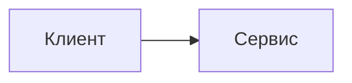

# КПО — конспект курса

Интерактивный сайт курса «Конструирование программного обеспечения» на VitePress. В репозитории лежат 14 лекций-компаньонов, вводная страница, заключение, дополнительная песочница для практики и технические материалы темы.

Сайт поддерживает примеры на Kotlin, C#, Java и Go, Kotlin Playground, Mermaid-диаграммы, MathJax, адаптивные таблицы, Ask AI prompt-copy workflow и регрессионные UI-тесты.

## Требования

- Node >=24;
- npm;
- Chromium browsers для Playwright UI tests.

Файл `.node-version` содержит `24`. Скрипты `prebuild`, `pretest` и `pretest:ui` проверяют major-версию Node перед локальными проверками.

## Команды

```sh
npm ci
npm run dev
npm run typecheck
npm run test
npm run audit
npm run build
npm run test:ui
npm run pdf
```

Дополнительные команды:

```sh
npm run preview
npm run dev:host
npm run preview:host
npm run pdf:published
```

`npm run pdf` собирает сайт, поднимает локальный `vitepress preview` и экспортирует курс в `output/pdf/kpo-course.pdf`. `npm run pdf:published` использует опубликованный сайт `https://kert0n.github.io/KPO/`.

## Структура курса

```text
content/home/vitepress.md                    — главная страница
content/intro/vitepress.md                   — как читать курс и пользоваться возможностями сайта
content/conclusion/vitepress.md              — финальная карта повторения и практика
content/lectures/LecN/vitepress.md           — публикуемая страница лекции N
content/lectures/LecN/assets/                — изображения лекции
content/lectures/_template/                  — скрытая заготовка новой лекции
content/extras/index/vitepress.md            — landing page дополнительных материалов
content/extras/01/vitepress.md               — публичная песочница для практики
content/extras/NN/vitepress.md               — дополнительная тема N
content/extras/_template/                    — скрытая заготовка дополнительной темы
content/service-pages/ui-contract/vitepress.md — синтетическая страница для UI-регрессий
content/service-pages/_internal/             — внутренние markdown-документы, не публикуются
```

VitePress собирает страницы только из `content/`. Каждая публичная страница — папка с `vitepress.md`; root markdown не является учебным контентом сайта. Папки, начинающиеся с `_`, не попадают в sidebar и дополнительно исключены из сборки через `srcExclude`. `content/service-pages/ui-contract/vitepress.md` не является учебным контентом: это контрактная страница для проверки темы. Синтетические кейсы из нее не нужно переносить в лекции ради покрытия UI.

## Как читать

Начните с `/intro`, затем проходите лекции по порядку. Каждая лекция самостоятельна: можно открыть нужную тему напрямую и вернуться к вводной странице только за описанием интерфейса. Для экспериментов используйте `/extras/01`: туда удобно переносить фрагменты кода из лекций, менять правила и запускать Kotlin-версии в Playground.

## Как добавить лекцию

```sh
cp -R content/lectures/_template content/lectures/Lec15
```

Затем отредактируйте `content/lectures/Lec15/vitepress.md`:

- `title` во frontmatter;
- `order`;
- H1;
- ссылки, диаграммы и примеры.

Папочная страница получит чистый URL `/lectures/15`. Sidebar, nav и rewrites строятся автоматически в `.vitepress/lib/content.ts`.

## Как добавить extra

```sh
cp -R content/extras/_template content/extras/NN
```

Затем отредактируйте `content/extras/NN/vitepress.md`:

- `title` во frontmatter;
- `order`;
- H1;
- практические задания и ссылки.

Папочная страница получит URL по номеру каталога. Плоские файлы `extras/NN.md` больше не поддерживаются: extra должен быть папкой с `vitepress.md`.

## Авторские возможности Markdown

### Многоязычные примеры

````md
::: multi-code "Заголовок примера"

```kotlin
fun main() = println("Привет")
```

```csharp
Console.WriteLine("Привет");
```

:::
````

Поддерживаются `kotlin`, `csharp`, `java`, `go` и алиасы `kt`, `cs`. Выбранный язык хранится в `localStorage` как `kpo:code-language`. Если блок должен начинаться с Kotlin, просто поставьте Kotlin fence первым. Не добавляйте `{default=kotlin}` как boilerplate: `default` означает защищённый авторский override и будет сильнее сохранённого выбора пользователя до первого клика в этом конкретном блоке.

Опция `{playground=off}` отключает Kotlin Playground для конкретного блока:

````md
::: multi-code "Фрагмент API" {playground=off}

```kotlin
interface Repository<T> {
    fun save(value: T)
}
```

```java
interface Repository<T> {
    void save(T value);
}
```

:::
````

Авторский default используйте только когда конкретный пример действительно лучше открыть на другом языке:

````md
::: multi-code "Горутина проще всего видна на Go" {default=go playground=off}

```kotlin
thread {
    println("work")
}
```

```go
go func() {
    fmt.Println("work")
}()
```

:::
````

Такой блок покажет Go до первого клика в нём. После клика он присоединится к общему глобальному выбору языка; остальные untouched author-default блоки останутся защищены.

Для запускаемой версии Kotlin можно добавить отдельный fence:

````md
```kotlin playground
fun main() {
    println("Запускаемый пример")
}
```
````

### Текст для конкретного языка

```md
::: only kotlin
Пояснение, видимое только при выбранном Kotlin.
:::
```

Для коротких вставок внутри предложения используйте `<LangOnly lang="go">...</LangOnly>`.

### Mermaid

````md

````

Mermaid рендерится на клиенте. Build-time lint ловит частые ошибки Mermaid 11, включая использование classDiagram-стрелок внутри `flowchart`/`graph`.

## PDF export

Экспорт реализован собственным Playwright-скриптом `scripts/export-pdf.mjs`. Он:

- экспортирует явный список публичных route в стабильном порядке;
- не включает главную страницу, служебные страницы, скрытые template folders и черновики;
- ждет Mermaid и MathJax;
- падает, если на странице появился `.kpo-mermaid__error`;
- сохраняет отдельные страницы в `output/pdf/pages/`;
- объединяет итоговый файл через `pdf-lib`.

```sh
npm run pdf
npm run pdf:published
```

Для визуальной проверки PDF удобно поставить Poppler:

```sh
brew install poppler
pdfinfo output/pdf/kpo-course.pdf
mkdir -p output/pdf/preview
pdftoppm -png -f 1 -l 5 output/pdf/kpo-course.pdf output/pdf/preview/page
```

Сгенерированные PDF игнорируются через `.gitignore`.

## Тесты

Unit-тесты покрывают markdown pipeline и чистые модели темы:

```sh
npm run test
```

TypeScript, security audit, unit-тесты и сборка объединены в полный локальный gate:

```sh
npm run verify
npm run verify:full
npm run format:check:tracked
```

Browser- и visual-регрессии Playwright проверяют только служебные fixture-страницы; учебные лекции и extras проверяются отдельными content-gates:

```sh
npm run build
npm run test:ui
npm run content:check
```

Перед публикацией используйте полный прогон:

```sh
npm exec --yes --package=node@24 -- npm run test
npm exec --yes --package=node@24 -- npm run verify
npm exec --yes --package=node@24 -- npm run test:ui
npm run pdf
```

Порядок обновления npm, Gradle и GitHub Actions, правила совместимости major-версий и разбор конфликтов Dependabot описаны в [`docs/dependency-maintenance.md`](docs/dependency-maintenance.md).

## Публикация на GitHub Pages

Workflow `.github/workflows/deploy.yml` собирает сайт при пуше в `master` и публикует `.vitepress/dist` через GitHub Pages. Репозиторий должен называться `KPO`, потому что в `.vitepress/config.mts` задан `base: '/KPO/'`.

Адрес опубликованного сайта: https://kert0n.github.io/KPO/

## Лицензия

Проект распространяется по GNU General Public License v3.0 or later (`GPL-3.0-or-later`). См. [LICENSE](./LICENSE).
