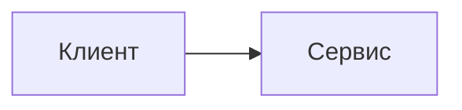

# КПО — конспект курса

Интерактивный сайт курса «Конструирование программного обеспечения» на VitePress. В репозитории лежат 14 лекций-компаньонов, вводная страница, заключение, дополнительная песочница для практики и технические материалы темы.

Сайт поддерживает примеры на Kotlin, C#, Java и Go, Kotlin Playground, Mermaid-диаграммы, MathJax, адаптивные таблицы, Ask AI prompt-copy workflow и регрессионные UI-тесты.

## Требования

- Node >=24;
- npm;
- Chromium browsers для Playwright UI tests.

Файл `.node-version` содержит `24`. Скрипты `prebuild`, `pretest` и `pretest:ui` проверяют major-версию Node перед локальными проверками.

## Команды

```sh
npm ci
npm run dev
npm run test
npm run build
npm run test:ui
npm run pdf
```

Дополнительные команды:

```sh
npm run preview
npm run pdf:published
```

`npm run pdf` собирает сайт, поднимает локальный `vitepress preview` и экспортирует курс в `output/pdf/kpo-course.pdf`. `npm run pdf:published` использует опубликованный сайт `https://kert0n.github.io/KPO/`.

## Структура курса

```text
index.md                    — главная страница
intro.md                    — как читать курс и пользоваться возможностями сайта
lectures/LecN/vitepress.md  — публикуемая страница лекции N
lectures/LecN/assets/       — изображения лекции
lectures/_template/         — скрытая заготовка новой лекции
extras/index.md             — landing page дополнительных материалов
extras/01.md                — публичная песочница для практики
extras/_template/           — скрытая заготовка дополнительной темы
conclusion.md               — финальная карта повторения и практика
test-fixtures/ui-contract.md — синтетическая страница для UI-регрессий
```

Папки, начинающиеся с `_`, не попадают в sidebar и дополнительно исключены из сборки через `srcExclude`. `test-fixtures/ui-contract.md` не является учебным контентом: это контрактная страница для проверки темы. Синтетические кейсы из нее не нужно переносить в лекции ради покрытия UI.

## Как читать

Начните с `intro.md`, затем проходите лекции по порядку. Каждая лекция самостоятельна: можно открыть нужную тему напрямую и вернуться к вводной странице только за описанием интерфейса. Для экспериментов используйте `/extras/01`: туда удобно переносить фрагменты кода из лекций, менять правила и запускать Kotlin-версии в Playground.

## Как добавить лекцию

```sh
cp -R lectures/_template lectures/Lec15
```

Затем отредактируйте `lectures/Lec15/vitepress.md`:

- `title` во frontmatter;
- `order`;
- H1;
- ссылки, диаграммы и примеры.

Папочная страница получит чистый URL `/lectures/15`. Sidebar, nav и rewrites строятся автоматически в `.vitepress/lib/content.ts`.

## Как добавить extra

```sh
cp -R extras/_template extras/NN
```

Затем отредактируйте `extras/NN/vitepress.md`:

- `title` во frontmatter;
- `order`;
- H1;
- практические задания и ссылки.

Папочная страница получит URL по номеру каталога. Плоский файл `extras/NN.md` тоже поддерживается, если для темы не нужны assets и черновики.

## Авторские возможности Markdown

### Многоязычные примеры

````md
::: multi-code "Заголовок примера" {default=kotlin playground=off}

```kotlin
fun main() = println("Привет")
```

```csharp
Console.WriteLine("Привет");
```

:::
````

Поддерживаются `kotlin`, `csharp`, `java`, `go` и алиасы `kt`, `cs`. Выбранный язык хранится в `localStorage` как `kpo:code-language`. Опция `{playground=off}` отключает Kotlin Playground для конкретного блока.

Для запускаемой версии Kotlin можно добавить отдельный fence:

````md
```kotlin playground
fun main() {
    println("Запускаемый пример")
}
```
````

### Текст для конкретного языка

```md
::: only kotlin
Пояснение, видимое только при выбранном Kotlin.
:::
```

Для коротких вставок внутри предложения используйте `<LangOnly lang="go">...</LangOnly>`.

### Mermaid

````md

````

Mermaid рендерится на клиенте. Build-time lint ловит частые ошибки Mermaid 11, включая использование classDiagram-стрелок внутри `flowchart`/`graph`.

## PDF export

Экспорт реализован собственным Playwright-скриптом `scripts/export-pdf.mjs`. Он:

- экспортирует явный список публичных route в стабильном порядке;
- не включает главную страницу, retired extras routes, `test-fixtures`, скрытые template folders и черновики;
- ждет Mermaid и MathJax;
- падает, если на странице появился `.kpo-mermaid__error`;
- сохраняет отдельные страницы в `output/pdf/pages/`;
- объединяет итоговый файл через `pdf-lib`.

```sh
npm run pdf
npm run pdf:published
```

Для визуальной проверки PDF удобно поставить Poppler:

```sh
brew install poppler
pdfinfo output/pdf/kpo-course.pdf
mkdir -p output/pdf/preview
pdftoppm -png -f 1 -l 5 output/pdf/kpo-course.pdf output/pdf/preview/page
```

Сгенерированные PDF игнорируются через `.gitignore`.

## Тесты

Unit-тесты покрывают markdown pipeline и чистые модели темы:

```sh
npm run test
```

Browser-регрессии Playwright проверяют реальные страницы:

```sh
npm run build
npm run test:ui
```

Перед публикацией используйте полный прогон:

```sh
npm exec --yes --package=node@24 -- npm run test
npm exec --yes --package=node@24 -- npm run build
npm exec --yes --package=node@24 -- npm run test:ui
npm run pdf
```

## Публикация на GitHub Pages

Workflow `.github/workflows/deploy.yml` собирает сайт при пуше в `master` и публикует `.vitepress/dist` через GitHub Pages. Репозиторий должен называться `KPO`, потому что в `.vitepress/config.mts` задан `base: '/KPO/'`.

Адрес опубликованного сайта: https://kert0n.github.io/KPO/

## Лицензия

Проект распространяется по GNU General Public License v3.0 or later (`GPL-3.0-or-later`). См. [LICENSE](./LICENSE).
