# Лекция 1. Введение в КПО

## О чем это?

Конструирование программного обеспечения - это работа не cтолько про создание программы, а с формой будущей системы: ее
объектами, зависимостями, границами ответственности и, как следствие, **способностью меняться**.

Эта лекция вводит базовый понятия курса:
парадигмы, отношения между типами, интерфейсы, наследование, SOLID, GRASP и практические эвристики простого дизайна.

::: tip Главная идея лекции
Конструирование ПО - это управление стоимостью изменений. Хороший дизайн не делает систему сложной заранее, но оставляет
ей понятные точки расширения там, где изменения действительно вероятны.
:::

::: tip Как работать с примерами
Kotlin-вкладки в многоязычных примерах подготовлены как небольшие запускаемые программы для Playground. Их можно менять
прямо на странице: подставлять другие реализации, ломать инварианты, добавлять новый тип и сразу смотреть, что
происходит в выводе.
:::

## Цели

После этой статьи вы должны уметь:

- отличать простое написание кода от конструирования программного обеспечения;
- объяснять, почему парадигмы программирования полезны именно как ограничения;
- различать наследование, ассоциацию, композицию, агрегацию и реализацию интерфейса;
- выбирать между наследованием, композицией и интерфейсом;
- объяснять смысл SOLID и GRASP без механического заучивания аббревиатур;
- видеть границу между полезной абстракцией и overengineering;
- применять KISS, DRY, YAGNI, BDUF и бритву Оккама как практические ограничители дизайна.

## Зачем КПО

Курс КПО можно воспринимать как "системный дизайн на минималках": мы не уходим глубоко в каждую отдельную область, а
строим карту местности. На будущих дисциплинах вы подробнее разберете базы данных, клиент-серверные приложения,
распределенные системы, тестирование и DevOps. Здесь важнее увидеть общую траекторию: как от доменной модели и отдельных
классов перейти к приложению, которое можно тестировать, развивать, разворачивать и сопровождать.

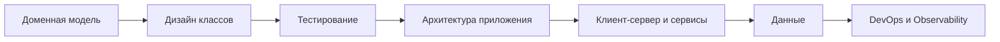

Практический результат курса - не набор терминов, а инженерная привычка задавать вопросы:

- что в этой задаче действительно меняется;
- от чего зависит мой код;
- можно ли заменить деталь без переписывания бизнес-логики;
- где абстракция помогает, а где она только маскирует простую задачу.

## Сквозная история курса

### Мотивация

Чем больше я программирую тем глубже, убеждаюсь в народной мудрости:
> Нет ничего более постоянного, чем временное.

Это кажется абсурдом, поэтому я приведу пример на котором, надеюсь, станет понятно что я имею в виду.

#### Ситуация

К вам приходит начальник и ставит задачу "Нужно сделать нужно сделать простенькую _временную_ программку, которая
разошлет клиентам смску о чем-нибудь, пусть это будет закрытие одного из магазинов".

#### Наивное решение

Казалось бы ничего сложного. И мы пишем простую программку в один файл, которая делает именно это. Один запрос к БД, и
отправления сообщений
через библиотеку. Дело в шляпе ждем премию )

#### Акт 2

Но на следующий день к вам приходит все тот же начальник и говорит: "Тут такое дело, у нас не у всех клиентов заполнен
номер телефона, сам понимаешь не все заполняют. Короче нужно отправить еще эмейлы. Спасибо."

И вот мы смотрим на наш простенький sql и программку в один файл, вздыхаем и понимаем, что все нужно будет переписать с
нуля. Как запрос который теперь стал сильно сложнее, так и программке дополнительное разветвление на способ отправки.
Печально, но к концу дня - вы снова справились.

#### Акт 3

- У нас там еще один магазин закрывается - сделай возможность нескольких уведомлений через определенный срок.
- Нам сказали в базе клиенты из разных городов нам нужно уведомлять только тех что в одном городе. Сроки горят.
  Выручишь?
- Владелец сказал этим клиентам отправлять ничего нельзя. Исправь.
- Слушай мне тут такая идея пришла, а что если в уведомлении написать новый ближайший к ним магазин на основе их
  домашнего адреса. Поправь, пожалуйста, там делов на 2 минуты.

#### Мораль

Возможно, вам может показаться что это слишком абсурдная ситуация, но я вас уверяю такое случается сплошь и рядом, как в
бигтехах, так и в маленьких конторах. Наш курс учит проектировать приложения так, чтобы при каждом новом требовании вам
не приходилось писать приложение заново. К сожалению, предугадать все невозможно, но есть устойчивые best-practice
которые позволяют при минимальных усилиях сильно улучшить процесс.

### Так к чему это.

В дальнейшем, в курсе мы часто будем снова и снова возвращаться к одному и тому же движению. Сначала появляется
маленькое приложение:
тип данных, функция, сервис, простой сценарий. Затем приходит изменение: другой способ хранения, новый канал связи,
тестовая подмена, внешнее API, распределенная транзакция или production-инцидент. В этот момент становится видно, где
код был просто написан, а где он был сконструирован.

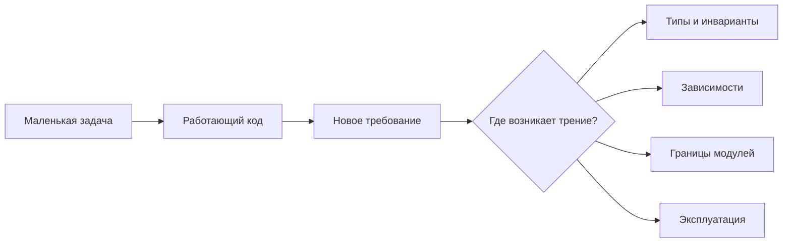

## Код и изменения

Работающий код - минимальное требование.

Конструирование ПО отвечает на вопрос: насколько дорого будет внести это изменение?

Если изменение требует правки одного изолированного класса, дизайн помогает. Если изменение тянет за собой цепочку
исправлений в разных модулях, дизайн либо отсутствует, либо выбран неудачно.

Архитектура часто не выглядит срочной. Функцию можно показать заказчику быстрее, чем аккуратную границу между доменной
логикой и инфраструктурой. Но долгосрочно именно эти границы определяют, будет ли вы и команда кранчить в ночь с пятницы
на субботу или спать. И будет ли бизнес терять деньги на багах и костылях которые были написаны в тихую московскую ночь.

## Парадигмы

Почему это важно для конструирования? Потому что выбор парадигмы определяет, какие ошибки компилятор ловит за вас, а
какие останутся ловушками в production. Если вы пишете на языке с мутабельным состоянием как на функциональном —
получите неожиданные баги. Если пишете на Go как на Java с наследованием — боретесь с языком вместо задачи. Парадигма —
это не мода и не лагерь, а инструмент, который ограничивает хаос в выбранном направлении.

Парадигма - это не столько о наборе приемов и том, что она разрешает, а скорее отом что она запрещает или ограничивает.
Ограничение снижает хаос: программист не может делать "как угодно", зато получает более предсказуемый код.

| Парадигма      | Что ограничивает                                 | Что дает                                       |
|----------------|--------------------------------------------------|------------------------------------------------|
| Структурная    | Произвольный переход потока через `goto`         | Читаемый контроль выполнения                   |
| Функциональная | Изменяемое состояние и побочные эффекты          | Предсказуемость и композицию вычислений        |
| ООП            | Прямую работу с деталями и данными без контракта | Моделирование объектов, отношений и контрактов |

Современные языки в основном мультипарадигмальны. Kotlin, C#, Java и Go позволяют писать императивный код, использовать
объекты, функции, интерфейсы и композицию. Поэтому вопрос не в том, какая парадигма "победила", а в том, какой
инструмент подходит к текущей части задачи.

В Kotlin функциональный стиль хорошо виден в `map`, `filter`, `fold`, `data class`, `sealed interface` и неизменяемых
`val`. При этом язык остается объектно-ориентированным: классы, интерфейсы и инкапсуляция никуда не исчезают.

В C# мультипарадигмальность видна в LINQ, `record`-типах, интерфейсах, async/await и классической объектной модели. Один
и тот же доменный код может сочетать объекты и функциональные преобразования коллекций.

В Java объектная модель исторически центральная, но современные версии языка добавили `record`, `sealed`, stream API и
lambda-выражения. Это не отменяет ООП, а расширяет способы выражать модель.

Go — живое доказательство того, что ООП не требует наследования. В Go нет классов и иерархий, но есть структуры, методы
и интерфейсы. Полиморфизм достигается через implicit interfaces: тип автоматически реализует интерфейс, если у него есть
нужные методы. Нет `extends`, нет `implements` — только поведение. Это радикально другой взгляд на объектный дизайн, и
он работает: стандартная библиотека Go полностью построена на этом подходе.

::: only kotlin
Kotlin выделяется среди четырёх языков курса тем, как далеко он заходит в объединении парадигм. `sealed interface`
даёт алгебраические типы для type-safe ветвлений без `instanceof`. `data class` решает проблему value-объектов, которая
в Java требовала десятки строк boilerplate. `by` delegation позволяет композицию вместо наследования на уровне
синтаксиса.
Всё это — не замена ООП, а его расширение функциональными идеями.
:::

## Минимум ООП

Для курса нам важно не повторить весь первый год ООП, а зафиксировать минимальную модель:

- класс или структура описывает тип данных;
- объект или значение - конкретный экземпляр типа;
- состояние - данные внутри объекта;
- поведение - операции, которые объект умеет выполнять;
- инвариант - правило, которое должно оставаться истинным;
- публичный контракт - то, что внешний код может ожидать от объекта.

Например, email - не просто строка. Если в домене нужна гарантия, что email содержит `@`, лучше выразить это в отдельном
типе и держать инвариант рядом с данными.

::: details Кто такой ваш инвариант?
> Инвариант - выражение, определяющее непротиворечивое внутреннее состояние объекта.

Проще говоря, инвариант - это правило, условие которое никогда не нарушается. 
Например, пока персонаж жив его хп больше 0. Или, в другой формулировке, если персонаж мертв то у него <=0 хп.
:::

::: multi-code "Минимальный доменный тип"

```kotlin
@JvmInline
value class Email(val value: String) {
    init {
        require("@" in value) { "Invalid email: $value" }
    }
}

data class User(
    val id: String,
    val email: Email
)
```

```kotlin playground
@JvmInline
value class Email(val value: String) {
    init {
        require("@" in value) { "Invalid email: $value" }
    }
}

data class User(
    val id: String,
    val email: Email
)

fun main() {
    val user = User("u-1", Email("alice@example.com"))
    println("Created user: ${user.id}, ${user.email.value}")

    val invalid = runCatching { Email("not-an-email") }
    println("Invalid email accepted: ${invalid.isSuccess}")
    println("Validation error: ${invalid.exceptionOrNull()?.message}")
}
```

```csharp
public readonly record struct Email
{
    public string Value { get; }

    public Email(string value)
    {
        if (!value.Contains('@'))
            throw new ArgumentException($"Invalid email: {value}");

        Value = value;
    }
}

public sealed record User(string Id, Email Email);
```

```java
record Email(String value) {
    Email {
        if (!value.contains("@")) {
            throw new IllegalArgumentException("Invalid email: " + value);
        }
    }
}

record User(String id, Email email) {
}
```

```go
package main

import (
    "fmt"
    "strings"
)

type Email string

func NewEmail(value string) (Email, error) {
    if !strings.Contains(value, "@") {
        return "", fmt.Errorf("invalid email: %s", value)
    }
    return Email(value), nil
}

type User struct {
    ID    string
    Email Email
}
```

:::

Что важно: типы нужны не ради "красивой объектности". Они помогают зафиксировать смысл и защитить бизнес-правила от
случайного нарушения.

Конкретно в данном случае, это означает, что даже если какой-то сотрудник поддержки в своем бесконечном уме догадается
вставить прямо в БД неправильный email ваша программа не упадет.

## Связи важнее классов

В маленькой программе можно смотреть на классы отдельно. В большом приложении больше показывают связи, как типы связаны между собой.
Ошибочный выбор связи часто дороже, чем ошибка внутри одного метода.

## Отношения между типами

Основные отношения, которые понадобятся уже в первой лекции:

- наследование - тип является частным случаем другого типа;
- ассоциация - объект знает о другом объекте;
- агрегация - объект использует зависимость, полученную извне;
- композиция - объект владеет частью и управляет ее жизненным циклом;
- реализация интерфейса - тип умеет выполнять контракт.

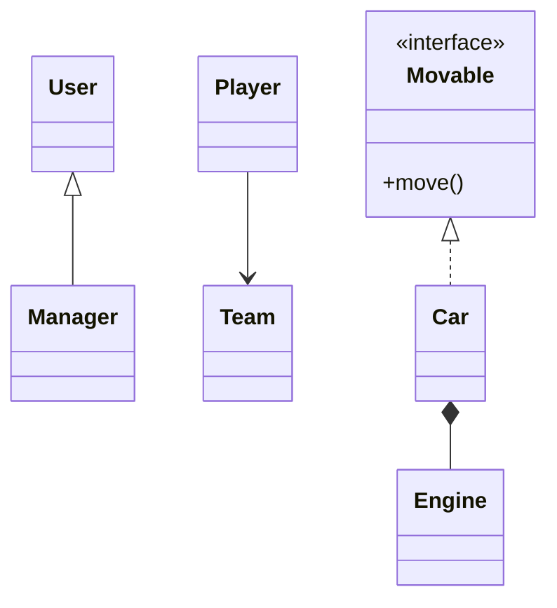

| Связь        | Как читать                        | Кто создает зависимость | Кто управляет жизненным циклом | Типичная цена            |
|--------------|-----------------------------------|-------------------------|--------------------------------|--------------------------|
| Наследование | `Manager` является `User`         | Типовая иерархия        | Родитель задает контракт       | Очень жесткая связь      |
| Ассоциация   | `Player` знает `Team`             | Внешний код или поле    | Не обязательно владелец        | Умеренная связанность    |
| Композиция   | `Car` владеет `Engine`            | Сам владелец            | Владелец                       | Жесткая связь частей     |
| Агрегация    | `Car` использует внешний `Engine` | Внешний код             | Внешний код                    | Гибкость, нужна инъекция |
| Реализация   | `Car` умеет `Movable`             | Тип реализует контракт  | Не связано с владением         | Гибкость через интерфейс |

## Наследование

Наследование выражает отношение `is-a`: потомок должен быть настоящим частным случаем родителя. Если код ожидает `User`,
он должен корректно работать с `Manager`, не проверяя "а вдруг это особый потомок".

::: warning Наследование не запрещено
Проблема не в самом наследовании, а в ложном наследовании. Если связь не является строгим `is-a`, лучше искать
композицию, агрегацию или интерфейс.
:::

::: multi-code "Наследование"

```kotlin
open class User(
    val id: String,
    val name: String
)

class Manager(
    id: String,
    name: String,
    val department: String
) : User(id, name)
```

```kotlin playground
open class User(
    val id: String,
    val name: String
)

class Manager(
    id: String,
    name: String,
    val department: String
) : User(id, name)

fun main() {
    val manager = Manager("u-1", "Ada", "Platform")
    println("${manager.name}: ${manager.department}")
}
```

```csharp
public class User
{
    public required string Id { get; init; }
    public required string Name { get; init; }
}

public sealed class Manager : User
{
    public required string Department { get; init; }
}
```

```java
class User {
    final String id;
    final String name;

    User(String id, String name) {
        this.id = id;
        this.name = name;
    }
}

class Manager extends User {
    final String department;

    Manager(String id, String name, String department) {
        super(id, name);
        this.department = department;
    }
}
```

```go
type User struct {
    ID   string
    Name string
}

type Manager struct {
    User
    Department string
}
```

:::

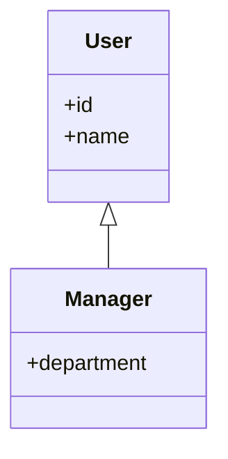

Этот пример учебный. В реальной системе роль "менеджер" часто лучше моделировать не наследованием, а правами, ролями или
отдельной сущностью `EmployeeProfile`. Наследование стоит выбирать только после вопроса: "можно ли любого потомка
безопасно использовать там, где ждут родителя?"

## Ассоциация

Ассоциация означает, что один объект хранит ссылку на другой или получает его для выполнения операции. Он не обязательно
владеет этим объектом.

::: multi-code "Ассоциация"

```kotlin
class Team(val name: String)

class Player(
    val name: String,
    val team: Team
)
```

```kotlin playground
class Team(val name: String)

class Player(
    val name: String,
    val team: Team
)

fun main() {
    val team = Team("Falcons")
    val player = Player("Mira", team)
    println("${player.name}: ${player.team.name}")
}
```

```csharp
public sealed record Team(string Name);

public sealed record Player(string Name, Team Team);
```

```java
record Team(String name) {
}

record Player(String name, Team team) {
}
```

```go
type Team struct {
    Name string
}

type Player struct {
    Name string
    Team *Team
}
```

:::

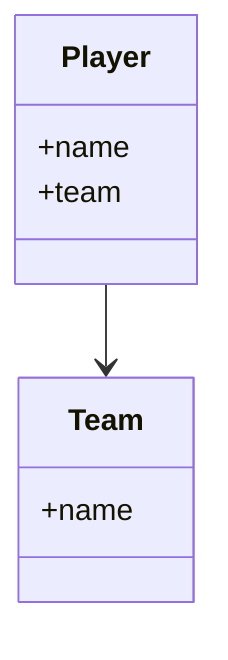

Ассоциация полезна, когда объекту нужно знать контекст: игрок знает команду, заказ знает клиента, платеж знает счет.
Опасность возникает, если ассоциаций слишком много: объект начинает знать слишком большую часть системы.

## Композиция

Композиция - более жесткая связь. Владелец создает часть и управляет ее жизненным циклом. Если исчезает владелец, часть
обычно не имеет самостоятельного смысла в модели.

::: multi-code "Композиция"

```kotlin
class ElectricEngine {
    fun start() = "engine started"
}

class Car {
    private val engine = ElectricEngine()

    fun start(): String = engine.start()
}
```

```kotlin playground
class ElectricEngine {
    fun start() = "engine started"
}

class Car {
    private val engine = ElectricEngine()

    fun start(): String = engine.start()
}

fun main() {
    val car = Car()
    println(car.start())
    println("Engine is created inside Car, so swapping it requires changing Car.")
}
```

```csharp
public sealed class ElectricEngine
{
    public string Start() => "engine started";
}

public sealed class Car
{
    private readonly ElectricEngine engine = new();

    public string Start() => engine.Start();
}
```

```java
class ElectricEngine {
    String start() {
        return "engine started";
    }
}

class Car {
    private final ElectricEngine engine = new ElectricEngine();

    String start() {
        return engine.start();
    }
}
```

```go
type ElectricEngine struct{}

func (ElectricEngine) Start() string {
    return "engine started"
}

type Car struct {
    engine ElectricEngine
}

func (c Car) Start() string {
    return c.engine.Start()
}
```

:::

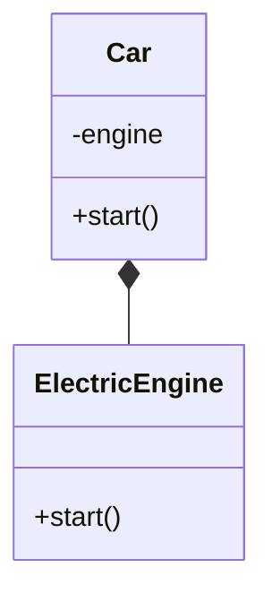

Композиция хорошо выражает "часть целого", но снижает заменяемость. Если завтра появится `DieselEngine`, класс `Car`
придется менять. Иногда это нормально; иногда это сигнал перейти к агрегации и интерфейсу.

## Агрегация

Агрегация означает, что объект использует другой объект, но не создает его сам. Это первый шаг к dependency injection:
зависимость приходит через конструктор, свойство или метод.

::: multi-code "Агрегация"

```kotlin
interface Engine {
    fun start(): String
}

class ElectricEngine : Engine {
    override fun start() = "electric engine started"
}

class DieselEngine : Engine {
    override fun start() = "diesel engine started"
}

class Car(private val engine: Engine) {
    fun start(): String = engine.start()
}
```

```kotlin playground
interface Engine {
    fun start(): String
}

class ElectricEngine : Engine {
    override fun start() = "electric engine started"
}

class DieselEngine : Engine {
    override fun start() = "diesel engine started"
}

class Car(private val engine: Engine) {
    fun start(): String = engine.start()
}

fun main() {
    val electricCar = Car(ElectricEngine())
    val dieselCar = Car(DieselEngine())

    println(electricCar.start())
    println(dieselCar.start())
    println("Car did not change; only the injected Engine changed.")
}
```

```csharp
public interface IEngine
{
    string Start();
}

public sealed class ElectricEngine : IEngine
{
    public string Start() => "electric engine started";
}

public sealed class Car(IEngine engine)
{
    public string Start() => engine.Start();
}
```

```java
interface Engine {
    String start();
}

class ElectricEngine implements Engine {
    public String start() {
        return "electric engine started";
    }
}

class Car {
    private final Engine engine;

    Car(Engine engine) {
        this.engine = engine;
    }

    String start() {
        return engine.start();
    }
}
```

```go
type Engine interface {
    Start() string
}

type ElectricEngine struct{}

func (ElectricEngine) Start() string {
    return "electric engine started"
}

type Car struct {
    engine Engine
}

func (c Car) Start() string {
    return c.engine.Start()
}
```

:::

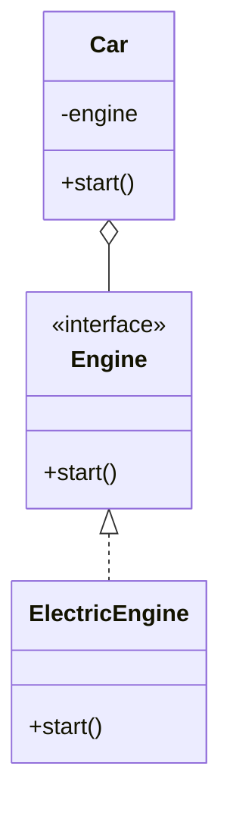

Агрегация удобнее для тестирования и расширения. В тесте можно передать fake-двигатель, а в продакшене - реальную
реализацию. Цена - больше типов и необходимость явно собирать объектный граф.

### Инфографика

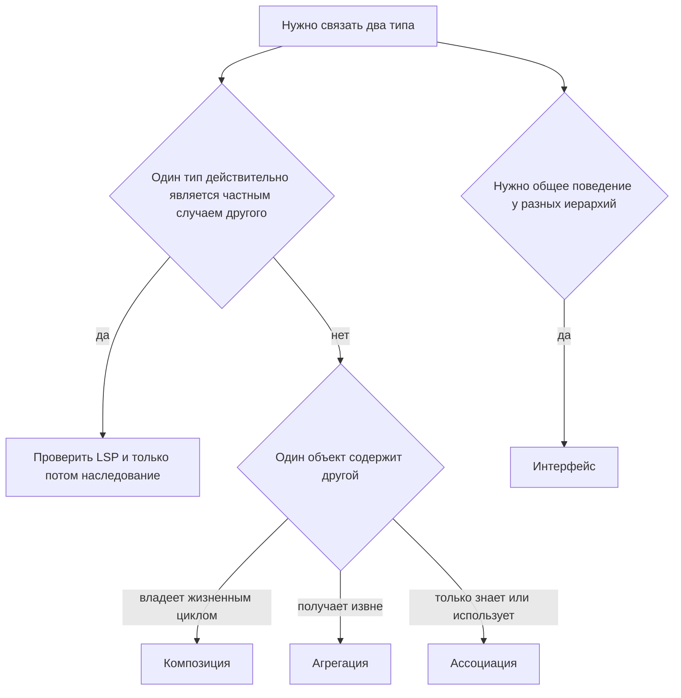

Эта схема не заменяет мозг, но помогает не начинать с наследования по инерции. Наследование - самый жесткий вариант
связи: потомок наследует не только полезное поведение, но и ожидания, ограничения, историю изменений родителя. Но об этом дальше.


## Интерфейсы

Интерфейс описывает контракт: какие операции доступны и что внешний код вправе ожидать. Реализаторы интерфейса не
обязаны быть родственниками.

Например, автомобиль, велосипед и лифт не являются частными случаями одного простого базового класса. Но все они могут "
двигаться". Это способность, а не родство.

::: multi-code "Реализация интерфейса"

```kotlin
interface Movable {
    fun move(): String
}

class Car : Movable {
    override fun move() = "car moves"
}

class Elevator : Movable {
    override fun move() = "elevator moves"
}

fun start(movable: Movable) {
    println(movable.move())
}
```

```kotlin playground
interface Movable {
    fun move(): String
}

class Car : Movable {
    override fun move() = "car moves"
}

class Elevator : Movable {
    override fun move() = "elevator moves"
}

fun start(movable: Movable) {
    println(movable.move())
}

fun main() {
    val objects: List<Movable> = listOf(Car(), Elevator())
    objects.forEach(::start)
}
```

```csharp
public interface IMovable
{
    string Move();
}

public sealed class Car : IMovable
{
    public string Move() => "car moves";
}

public sealed class Elevator : IMovable
{
    public string Move() => "elevator moves";
}
```

```java
interface Movable {
    String move();
}

class Car implements Movable {
    public String move() {
        return "car moves";
    }
}

class Elevator implements Movable {
    public String move() {
        return "elevator moves";
    }
}
```

```go
type Movable interface {
    Move() string
}

type Car struct{}

func (Car) Move() string {
    return "car moves"
}

type Elevator struct{}

func (Elevator) Move() string {
    return "elevator moves"
}
```

:::

::: only go
В Go тип реализует интерфейс неявно: если у типа есть метод `Move() string`, он уже подходит под `Movable`. Не нужно
писать `implements`.
:::

Интерфейс полезен, когда внешний код хочет работать с возможностью, а не с конкретным классом. Это снижает связанность и
готовит почву для DIP.

## Класс или интерфейс

Практическое правило:

- если нужно общее поведение у разных иерархий - начните с интерфейса;
- если есть настоящее родство, общее состояние и частичная реализация - возможен абстрактный класс;
- если сомневаетесь, не создавайте абстракцию заранее.

| Вопрос                                     | Интерфейс            | Абстрактный класс   |
|--------------------------------------------|----------------------|---------------------|
| Нужно общее поведение без родства?         | Да                   | Обычно нет          |
| Нужно общее состояние?                     | Нет                  | Да                  |
| Нужна частичная реализация алгоритма?      | Иногда, но осторожно | Да                  |
| Есть настоящая иерархия?                   | Может дополнять      | Да                  |
| Нужна множественная реализация контрактов? | Да                   | Нет или ограниченно |

Абстрактный класс удобен для шаблонного алгоритма: общая последовательность шагов фиксирована, а часть шагов
переопределяется потомками. 
Интерфейс удобен для способности: печатать, двигаться, сохранять, отправлять уведомление.

:::tip Rule of thumb 
_Абстрактный_ класс - это некоторый объект в иерархии наследования, но настолько _абстрактный_, что создавать его никогда не понадобится.

Интерфейс же это контракт, тот кто его _реализует_ - умеет _реализовывать нечто_.
:::
## LSP

Принцип подстановки Лисков его создательница сформулировала так:

::: tip Алгебра настигла нас
Пусть `φ(x)` — свойство, доказуемое для объектов `x` типа `T`.

Если `S` является подтипом `T`, то это свойство должно также выполняться
для объектов `y` типа `S`.

$$
\begin{aligned}
S <: T
&\quad\Longrightarrow\quad
(\forall x : T,\ \varphi(x)) \\
&\quad\Rightarrow\quad
(\forall y : S,\ \varphi(y))
\end{aligned}
$$

Где:

- `T` — супертип;
- `S` — подтип;
- `S <: T` — `S` является подтипом `T`;
- `φ(x)` — доказуемое свойство объекта типа `T`.
:::


Переводя с алгебраического на простой смертный: если код работает с базовым типом, он не должен ломаться при
передаче потомка. Потомок обязан сохранять контракт родителя.

Классический пример - квадрат и прямоугольник. В математике квадрат является прямоугольником. В программе наследование
может оказаться ошибкой, если у `Rectangle` есть независимые `setWidth` и `setHeight`, а `Square` вынужден менять оба
измерения одновременно.

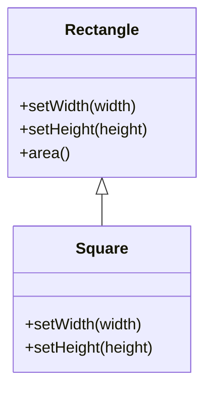

Проблема не в формуле площади. Проблема в контракте: внешний код ожидает, что ширину и высоту прямоугольника можно
менять независимо.

Сначала посмотрим на проблему — мутабельный `MutableSquare`, который наследует `MutableRectangle`, ломает ожидания
вызывающего кода. Потом посмотрим на решение — общий интерфейс `Shape` без ложной иерархии. Playground ниже показывает
обе ситуации: нарушение LSP и его исправление.

::: multi-code "LSP: площадь фигуры"

```kotlin
interface Shape {
    fun area(): Int
}

data class Rectangle(val width: Int, val height: Int) : Shape {
    override fun area(): Int = width * height
}

data class Square(val side: Int) : Shape {
    override fun area(): Int = side * side
}
```

```kotlin playground
open class MutableRectangle(
    private var width: Int,
    private var height: Int
) {
    open fun setWidth(value: Int) {
        width = value
    }

    open fun setHeight(value: Int) {
        height = value
    }

    fun area(): Int = width * height
}

class MutableSquare(side: Int) : MutableRectangle(side, side) {
    private var sideValue: Int = side

    override fun setWidth(value: Int) {
        sideValue = value
        super.setWidth(value)
        super.setHeight(value)
    }

    override fun setHeight(value: Int) {
        setWidth(value)
    }
}

fun resizeToFiveByTen(rectangle: MutableRectangle): Int {
    rectangle.setWidth(5)
    rectangle.setHeight(10)
    return rectangle.area()
}

interface Shape {
    fun area(): Int
}

data class Rectangle(val width: Int, val height: Int) : Shape {
    override fun area(): Int = width * height
}

data class Square(val side: Int) : Shape {
    override fun area(): Int = side * side
}

fun main() {
    println("Rectangle area: ${resizeToFiveByTen(MutableRectangle(1, 1))}")
    println("Square through rectangle API: ${resizeToFiveByTen(MutableSquare(1))}")
    println("Expected 50, but square gives 100: LSP is broken.")

    val shapes: List<Shape> = listOf(Rectangle(5, 10), Square(10))
    println("Safe areas through Shape: ${shapes.map { it.area() }}")
}
```

```csharp
public interface IShape
{
    int Area();
}

public sealed record Rectangle(int Width, int Height) : IShape
{
    public int Area() => Width * Height;
}

public sealed record Square(int Side) : IShape
{
    public int Area() => Side * Side;
}
```

```java
interface Shape {
    int area();
}

record Rectangle(int width, int height) implements Shape {
    public int area() {
        return width * height;
    }
}

record Square(int side) implements Shape {
    public int area() {
        return side * side;
    }
}
```

```go
type Shape interface {
    Area() int
}

type Rectangle struct {
    Width  int
    Height int
}

func (r Rectangle) Area() int {
    return r.Width * r.Height
}

type Square struct {
    Side int
}

func (s Square) Area() int {
    return s.Side * s.Side
}
```

:::

Здесь `Rectangle` и `Square` не наследуются друг от друга. Они оба реализуют общий контракт `Shape`. Мы сохранили
полиморфизм, но убрали ложную иерархию.

## Баланс абстракций

Если абстракций слишком мало, код быстро становится жестким. Высокоуровневые правила зависят от конкретных деталей:
консоли, базы данных, файловой системы, HTTP-клиента. Любая замена детали тянет правки по всей системе.

Если абстракций слишком много, проект становится трудным для чтения. Появляются интерфейсы без альтернативных
реализаций, фабрики без причины, слои без ответственности. Такой проект тоже дорогой: новый разработчик тратит время не
на бизнес-задачу, а на расшифровку лишней конструкции.

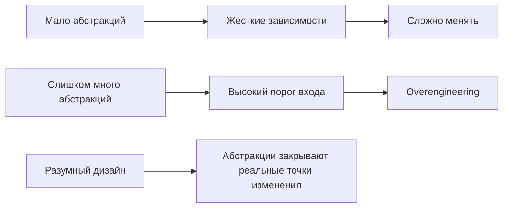

Вводите абстракцию, когда она решает назревшую проблему:

- появилась вторая реализация;
- нужно тестировать код без реальной инфраструктуры;
- бизнес-правило не должно зависеть от способа хранения или вывода;
- изменение детали уже заставляет менять слишком много мест.

## SOLID

SOLID - это язык разговора о дизайне классов и зависимостей. Его не нужно применять как чек-лист "добавить пять
паттернов". Принципы помогают объяснить, почему один дизайн легче менять, чем другой.

| Буква | Принцип               | Главный вопрос                                     |
|-------|-----------------------|----------------------------------------------------|
| S     | Single Responsibility | У класса одна причина измениться?                  |
| O     | Open/Closed           | Можно расширить поведение без правки старого кода? |
| L     | Liskov Substitution   | Потомок сохраняет контракт родителя?               |
| I     | Interface Segregation | Клиент зависит только от нужных методов?           |
| D     | Dependency Inversion  | Высокоуровневый код зависит от абстракций?         |

В этой статье порядок будет таким: SRP, LSP, ISP, DIP, OCP. Принцип открытости-закрытости проще понять после DIP, потому
что расширяемость часто достигается зависимостью от абстракций.

### Сквозной пример

Дальше держите в голове один предметный пример: система уведомлений учебного сервиса. Она должна сообщать студенту о
событиях: регистрации, изменении расписания, результате проверки работы. Сначала достаточно email, потом появляются SMS,
push и голосовые сообщения.

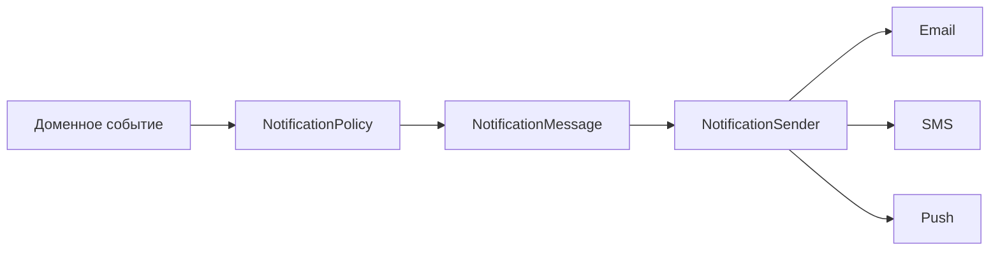

Этот пример покажет, почему один большой класс быстро нарушает SRP, один большой интерфейс нарушает ISP, а зависимость
бизнес-логики от конкретного SMTP-клиента нарушает DIP.

### SRP

Рассмотрим `NotificationService`. Один класс содержит выбор канала, форматирование, отправку, retry и
логирование. Каждый из этих аспектов меняется по разным причинам и в разное время. Это нарушение SRP.

Single Responsibility Principle часто переводят как "у класса должна быть одна ответственность". Более точная
формулировка: у класса должна быть одна причина для изменения.

Причина изменения обычно приходит от роли или процесса. Бухгалтер просит изменить расчет премий. Директор просит другой
формат отчета. Пользователь просит другую навигацию. Если все эти изменения попадают в один класс, класс делает слишком
много.

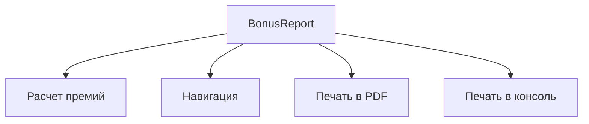

Лучше разделить причины:

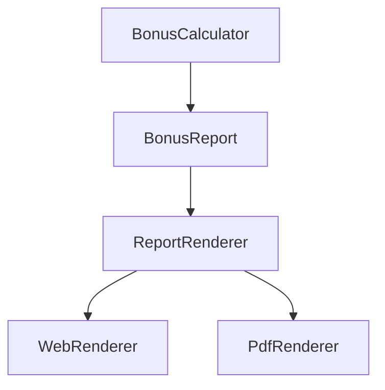

Теперь изменение формата вывода не трогает расчет премий, а изменение формулы премии не трогает PDF.

Бухгалтер говорит изменить BonusCalculator, Директор PdfRender, а пользователь WebRenderer.

### LSP в SOLID

LSP уже был разобран на фигурах, но в SOLID он выполняет отдельную роль: защищает полиморфизм. Если потомок заставляет
внешний код проверять конкретный тип, наследование перестало быть надежной абстракцией.

Признаки возможного нарушения:

- потомок кидает `NotSupportedException` в методе родителя;
- потомок требует дополнительных предусловий, которых нет у родителя;
- потомок возвращает результат, нарушающий ожидания от родителя;
- тесты базового типа не проходят для потомка.

:::tip Rule of thumb
Потомок всегда _расширяет_ родителя. 
::: 
### ISP

Interface Segregation Principle говорит: клиент не должен зависеть от методов, которые он не использует.

Плохой симптом - интерфейс, который заставляет часть реализаций писать пустые методы или выбрасывать
`NotImplementedException`. Например, email имеет subject, SMS обычно нет, голосовое сообщение не имеет текстового тела в
том же смысле.

::: multi-code "ISP: маленькие интерфейсы сообщений"

```kotlin
interface Message {
    val recipient: String
}

interface TextMessage : Message {
    val text: String
}

interface SubjectMessage : TextMessage {
    val subject: String
}

data class Email(
    override val recipient: String,
    override val subject: String,
    override val text: String
) : SubjectMessage

data class Sms(
    override val recipient: String,
    override val text: String
) : TextMessage
```

```kotlin playground
interface Message {
    val recipient: String
}

interface TextMessage : Message {
    val text: String
}

interface SubjectMessage : TextMessage {
    val subject: String
}

data class Email(
    override val recipient: String,
    override val subject: String,
    override val text: String
) : SubjectMessage

data class Sms(
    override val recipient: String,
    override val text: String
) : TextMessage

fun describe(message: Message): String = when (message) {
    is SubjectMessage -> "subject='${message.subject}', text='${message.text}'"
    is TextMessage -> "text='${message.text}'"
    else -> "recipient='${message.recipient}'"
}

fun main() {
    val messages: List<Message> = listOf(
        Email("student@example.com", "Schedule", "Lecture moved"),
        Sms("+79990000000", "Lecture moved")
    )

    messages.forEach { println(describe(it)) }
    println("Sms is not forced to have a fake subject.")
}
```

```csharp
public interface IMessage
{
    string Recipient { get; }
}

public interface ITextMessage : IMessage
{
    string Text { get; }
}

public interface ISubjectMessage : ITextMessage
{
    string Subject { get; }
}

public sealed record Email(
    string Recipient,
    string Subject,
    string Text
) : ISubjectMessage;

public sealed record Sms(
    string Recipient,
    string Text
) : ITextMessage;
```

```java
interface Message {
    String recipient();
}

interface TextMessage extends Message {
    String text();
}

interface SubjectMessage extends TextMessage {
    String subject();
}

record Email(String recipient, String subject, String text) implements SubjectMessage {
}

record Sms(String recipient, String text) implements TextMessage {
}
```

```go
type Message interface {
    Recipient() string
}

type TextMessage interface {
    Message
    Text() string
}

type SubjectMessage interface {
    TextMessage
    Subject() string
}

type Email struct {
    To      string
    Topic   string
    Content string
}

func (e Email) Recipient() string { return e.To }
func (e Email) Subject() string   { return e.Topic }
func (e Email) Text() string      { return e.Content }
```

:::

Маленькие интерфейсы позволяют типу реализовать ровно тот контракт, который ему подходит. Это снижает связанность и
делает модель честнее.

### DIP

Dependency Inversion Principle - ключ к следующей лекции про внедрение зависимостей
([Лекция 2, раздел DIP и DI](/lectures/02#dip-и-di)). Формулировка:

- высокоуровневые модули не должны зависеть от низкоуровневых модулей;
- оба должны зависеть от абстракций;
- абстракции не должны зависеть от деталей;
- детали должны зависеть от абстракций.

Высокоуровневый код - это бизнес-правила и use cases. Низкоуровневый код - консоль, база данных, PDF, HTML, HTTP,
файловая система. Бизнес-правило не должно знать, куда именно печатается результат.

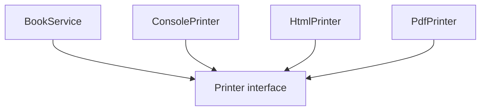

::: multi-code "DIP: сервис зависит от принтера как абстракции"

```kotlin
interface Printer {
    fun print(text: String)
}

class ConsolePrinter : Printer {
    override fun print(text: String) {
        println(text)
    }
}

class BufferPrinter : Printer {
    val lines = mutableListOf<String>()

    override fun print(text: String) {
        lines += text
    }
}

class BookService(private val printer: Printer) {
    fun printTitle(title: String) {
        printer.print("Book: $title")
    }
}
```

```kotlin playground
interface Printer {
    fun print(text: String)
}

class ConsolePrinter : Printer {
    override fun print(text: String) {
        println(text)
    }
}

class BufferPrinter : Printer {
    val lines = mutableListOf<String>()

    override fun print(text: String) {
        lines += text
    }
}

class BookService(private val printer: Printer) {
    fun printTitle(title: String) {
        printer.print("Book: $title")
    }
}

fun main() {
    BookService(ConsolePrinter()).printTitle("Clean Architecture")

    val buffer = BufferPrinter()
    BookService(buffer).printTitle("Domain-Driven Design")
    println("Captured in test double: ${buffer.lines}")
}
```

```csharp
public interface IPrinter
{
    void Print(string text);
}

public sealed class ConsolePrinter : IPrinter
{
    public void Print(string text) => Console.WriteLine(text);
}

public sealed class BookService(IPrinter printer)
{
    public void PrintTitle(string title)
    {
        printer.Print($"Book: {title}");
    }
}
```

```java
interface Printer {
    void print(String text);
}

class ConsolePrinter implements Printer {
    public void print(String text) {
        System.out.println(text);
    }
}

class BookService {
    private final Printer printer;

    BookService(Printer printer) {
        this.printer = printer;
    }

    void printTitle(String title) {
        printer.print("Book: " + title);
    }
}
```

```go
type Printer interface {
    Print(text string)
}

type ConsolePrinter struct{}

func (ConsolePrinter) Print(text string) {
    fmt.Println(text)
}

type BookService struct {
    printer Printer
}

func (s BookService) PrintTitle(title string) {
    s.printer.Print("Book: " + title)
}
```

:::

Главная идея: `BookService` не знает, консоль это, HTML или PDF. Он знает только контракт `Printer`.

### OCP

Open/Closed Principle звучит противоречиво: класс должен быть открыт для расширения, но закрыт для модификации. На
практике это значит: новые возможности добавляются новыми типами или реализациями, а стабильный код не переписывается
каждый раз.

Плохой вариант: `Cookbook` содержит методы `prepareMashedPotatoes`, `prepareSalad`, потом `prepareSoup`, потом
`preparePasta`. Каждый новый рецепт меняет старый класс.

Хороший вариант: `Cookbook` умеет приготовить любой `Recipe`.

::: multi-code "OCP: рецепты расширяют поведение"

```kotlin
interface Recipe {
    fun cook(): String
}

class MashedPotatoes : Recipe {
    override fun cook() = "Boil potatoes and mash them"
}

class Salad : Recipe {
    override fun cook() = "Slice vegetables and mix"
}

class Soup : Recipe {
    override fun cook() = "Boil vegetables in broth"
}

class Cookbook {
    fun prepare(recipe: Recipe): String = recipe.cook()
}
```

```kotlin playground
interface Recipe {
    fun cook(): String
}

class MashedPotatoes : Recipe {
    override fun cook() = "Boil potatoes and mash them"
}

class Salad : Recipe {
    override fun cook() = "Slice vegetables and mix"
}

class Soup : Recipe {
    override fun cook() = "Boil vegetables in broth"
}

class Cookbook {
    fun prepare(recipe: Recipe): String = recipe.cook()
}

fun main() {
    val cookbook = Cookbook()
    val recipes: List<Recipe> = listOf(MashedPotatoes(), Salad(), Soup())

    recipes.forEach { println(cookbook.prepare(it)) }
    println("Cookbook stayed unchanged when Soup appeared.")
}
```

```csharp
public interface IRecipe
{
    string Cook();
}

public sealed class MashedPotatoes : IRecipe
{
    public string Cook() => "Boil potatoes and mash them";
}

public sealed class Salad : IRecipe
{
    public string Cook() => "Slice vegetables and mix";
}

public sealed class Cookbook
{
    public string Prepare(IRecipe recipe) => recipe.Cook();
}
```

```java
interface Recipe {
    String cook();
}

class MashedPotatoes implements Recipe {
    public String cook() {
        return "Boil potatoes and mash them";
    }
}

class Salad implements Recipe {
    public String cook() {
        return "Slice vegetables and mix";
    }
}

class Cookbook {
    String prepare(Recipe recipe) {
        return recipe.cook();
    }
}
```

```go
type Recipe interface {
    Cook() string
}

type MashedPotatoes struct{}

func (MashedPotatoes) Cook() string {
    return "Boil potatoes and mash them"
}

type Salad struct{}

func (Salad) Cook() string {
    return "Slice vegetables and mix"
}

type Cookbook struct{}

func (Cookbook) Prepare(recipe Recipe) string {
    return recipe.Cook()
}
```

:::

OCP часто достигается через DIP: стабильный код зависит от абстракции, а новые детали приходят в виде новых реализаций.

## GRASP

GRASP - более прикладной набор принципов назначения ответственностей. В первой лекции достаточно зафиксировать две идеи:

- High Cohesion - внутри класса должны быть тесно связанные обязанности;
- Low Coupling - между классами должно быть как можно меньше лишних знаний друг о друге.

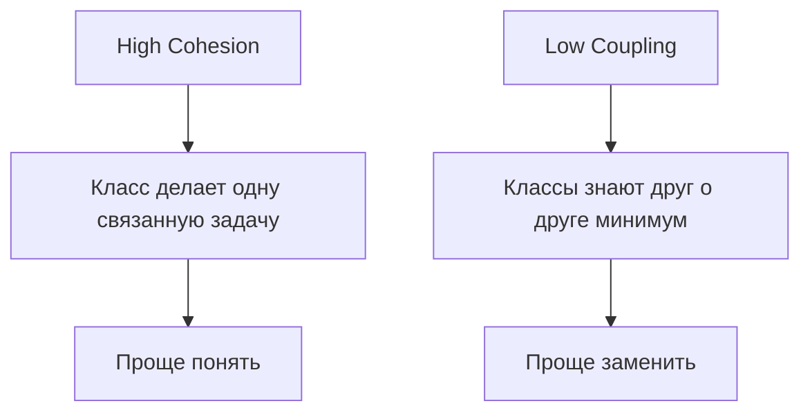

Разберём на конкретном примере. Вот класс с низкой сцепленностью — он занимается всем сразу:

```kotlin
class OrderManager {
    fun calculateTotal(items: List<Item>): Int = items.sumOf { it.price }
    fun sendConfirmationEmail(email: String, orderId: String) { /* SMTP logic */ }
    fun generatePdfInvoice(orderId: String): ByteArray { /* PDF rendering */ }
    fun logOrderEvent(event: String) { /* file I/O */ }
}
```

У этого класса четыре причины меняться: бизнес-правила расчёта, формат писем, шаблон PDF и формат логов. High Cohesion
подсказывает разделить его на части, каждая из которых делает одну связанную задачу:

```kotlin
class OrderCalculator {
    fun total(items: List<Item>): Int = items.sumOf { it.price }
}

class OrderNotifier(private val mailer: Mailer) {
    fun confirmOrder(email: String, orderId: String) { /* ... */ }
}
```

Теперь изменение формата письма не затрагивает расчёт цен. Low Coupling при этом достигается через интерфейсы:
`OrderNotifier` зависит от `Mailer`, а не от `SmtpMailer`.

SOLID и GRASP не конфликтуют. Они часто описывают одну инженерную цель разными словами:

| Идея GRASP           | Похожая идея SOLID | Практический эффект                                |
|----------------------|--------------------|----------------------------------------------------|
| High Cohesion        | SRP                | Класс проще понять и менять                        |
| Low Coupling         | ISP, DIP           | Детали проще заменить                              |
| Polymorphism         | LSP, OCP           | Новое поведение добавляется через новые реализации |
| Protected Variations | DIP, OCP           | Вероятные изменения закрыты абстракцией            |

Не нужно стремиться к нулевой связанности. Если объекты вообще никак не связаны, они не образуют систему. Цель - убрать
лишнюю связанность и оставить только осмысленные публичные контракты.

## Простые эвристики

SOLID и GRASP помогают строить гибкий дизайн. Но гибкость легко превратить в чрезмерную сложность. Поэтому нужны
ограничители.

| Принцип | Что запрещает                       | Практический вопрос                                      |
|---------|-------------------------------------|----------------------------------------------------------|
| KISS    | Лишнюю сложность                    | Можно ли сделать проще без потери смысла?                |
| DRY     | Дублирование знания                 | Если правило изменится, сколько мест придется править?   |
| YAGNI   | Функции "на будущее"                | Это нужно сейчас или только кажется полезным?            |
| BDUF    | Полное проектирование всего заранее | Мы планируем ближайший шаг или пытаемся предсказать все? |
| Occam   | Лишние сущности                     | Эта абстракция реально объясняет задачу?                 |

Пример: интернет-магазин дает скидку 10% при сумме заказа от 1000 рублей. Правило простое — одна формула. Но
разработчик решает «подготовиться к будущему» и строит абстракцию:

```kotlin
interface DiscountStrategy {
    fun apply(total: Int): Int
}

class ThresholdDiscount(
    private val threshold: Int,
    private val percent: Int
) : DiscountStrategy {
    override fun apply(total: Int): Int =
        if (total >= threshold) total * (100 - percent) / 100 else total
}

class DiscountFactory {
    fun create(type: String): DiscountStrategy = when (type) {
        "threshold" -> ThresholdDiscount(1000, 10)
        else -> throw IllegalArgumentException("Unknown: $type")
    }
}
```

Три класса, один `when`, и единственный вариант — `"threshold"`. YAGNI говорит: пока нет второй стратегии скидки,
достаточно функции:

::: multi-code "KISS и YAGNI: простая скидка"

```kotlin
fun applyDiscount(total: Int): Int =
    if (total >= 1000) total * 90 / 100 else total
```

```kotlin playground
fun applyDiscount(total: Int): Int =
    if (total >= 1000) total * 90 / 100 else total

fun main() {
    listOf(500, 1000, 1500).forEach { total ->
        println("total=$total -> after discount=${applyDiscount(total)}")
    }
}
```

```csharp
static int ApplyDiscount(int total) =>
    total >= 1000 ? total * 90 / 100 : total;
```

```java
static int applyDiscount(int total) {
    return total >= 1000 ? total * 90 / 100 : total;
}
```

```go
func ApplyDiscount(total int) int {
    if total >= 1000 {
        return total * 90 / 100
    }
    return total
}
```

:::

Когда появится вторая стратегия скидки — тогда и появится интерфейс. Если правило расчёта используется в десяти местах,
DRY подсказывает вынести его в одну функцию, чтобы изменение правила не размазывалось по проекту.

BDUF не говорит "не планируй". Он говорит: не пытайся полностью спроектировать все приложение на двадцать спринтов
вперед. Планируй ближайший архитектурно значимый шаг и оставляй систему достаточно простой.

## Чеклист класса

Мини-чеклист проектирования класса:

1. Какую задачу решает класс?
2. Кто может потребовать изменить этот класс?
3. Какие зависимости класс создает сам?
4. Можно ли заменить зависимость без правки класса?
5. Есть ли наследование, которое может нарушить LSP?
6. Не слишком ли крупный интерфейс?
7. Не добавлена ли гибкость "на всякий случай"?
8. Есть ли дублирование бизнес-правила?
9. Можно ли объяснить дизайн без рисунка на пять уровней абстракции?

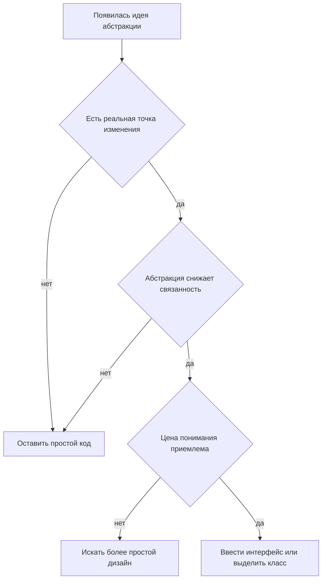

## Переход к следующей лекции

Вы уже видели, что `BookService` зависит от `Printer`, а не от `ConsolePrinter`. Но кто создаст нужную реализацию? Если
`BookService` сам напишет `ConsolePrinter()` — мы вернулись к проблеме из начала лекции: бизнес-класс снова знает о
деталях инфраструктуры, и подменить зависимость для теста не получится без правки самого класса.

DIP говорит *от чего* зависеть. Но не отвечает *как* передать зависимость и *где* собрать объектный граф. Именно этот
вопрос открывает [Лекцию 2 про DI](/lectures/02#проблема): dependency injection — это механика, которая превращает
принцип DIP в работающий код.

## Резюме

- Парадигмы дают не только возможности, но и ограничения.
- В ООП для дизайна важнее не классы сами по себе, а отношения между ними.
- Наследование применять можно, но осторожно: нужна строгая связь `is-a` и соблюдение LSP.
- Ассоциация, композиция и агрегация выражают разные уровни владения и связанности.
- Интерфейс описывает способность или контракт, а не родство.
- SOLID и GRASP помогают удерживать код изменяемым.
- KISS, DRY, YAGNI, BDUF и бритва Оккама защищают от ненужной сложности.
- Хороший дизайн находится между отсутствием абстракций и overengineering.

## Дополнительное чтение

Эти материалы помогут повторить базовые понятия ООП, принципы дизайна и связь простоты с архитектурными решениями.

### ООП и архитектурный контекст

- [Вспомнить ООП](https://habr.com/ru/articles/463125/) — вводное повторение основных идей объектно-ориентированного программирования.
- [Чистая архитектура: краткий пересказ](https://habr.com/ru/articles/443058/) — обзор тезисов книги для первого знакомства.

### Принципы дизайна

- [Принципы SOLID](https://medium.com/webbdev/solid-4ffc018077da) — краткое изложение пяти принципов проектирования.
- [Бритва Оккама, KISS, YAGNI, BDUF](https://habr.com/ru/articles/925208/) — разбор эвристик, которые ограничивают лишнюю сложность.

## Вопросы для самопроверки

1. Почему наследование создает более жесткую связь, чем ассоциация?
2. Чем композиция отличается от агрегации?
3. Когда интерфейс лучше абстрактного класса?
4. Почему квадрат-наследник прямоугольника может нарушить LSP?
5. Что значит "одна причина для изменения" в SRP?
6. Как ISP связан с `NotImplementedException`?
7. Почему DIP важен для тестирования?
8. Как DIP помогает OCP?
9. Чем высокая сцепленность отличается от высокой связанности?
10. Как понять, что абстракция появилась преждевременно?
11. Чем DRY опасен, если применять его слишком рано?
12. Как YAGNI ограничивает overengineering?

## Мини-практика

Представьте сервис уведомлений:

- он отправляет email, SMS и голосовые сообщения;
- email имеет тему и текст;
- SMS имеет только текст;
- голосовое сообщение имеет ссылку на аудиофайл;
- бизнес-логика хочет отправить уведомление, но не должна знать детали каждого канала.

Задание:

1. Выделите маленькие интерфейсы вместо одного большого `NotificationMessage`.
2. Отделите бизнес-логику отправки от конкретных каналов.
3. Объясните, где в решении применены SRP, ISP и DIP.
4. Проверьте, не добавили ли вы абстракции, которые пока не нужны.

Если после решения у вас появился класс, который одновременно выбирает канал, форматирует сообщение, отправляет его и
пишет лог, вернитесь к SRP. Если появился интерфейс с методами `sendEmail`, `sendSms`, `sendVoice`, вернитесь к ISP.
Если бизнес-правило создает `SmtpClient` напрямую, вернитесь к DIP.
