# Лекция 10. Семантика клиент-серверного и межсервисного обмена

Клиент-серверное приложение редко состоит из одного процесса. Браузер или мобильное приложение обращается к backend,
backend ходит в базу данных, один сервис вызывает другой, а часть операций уходит во внешние системы: платежные шлюзы,
почтовые провайдеры, склады, сервисы доставки. В такой системе важно не только "по какому протоколу отправить запрос",
но и "какие правила общения нужны бизнес-процессу".

Эта лекция разбирает именно семантику обмена: кто кого ждет, когда операция считается завершенной, где хранится результат
и что делать с ошибками. Протоколы и технологии важны, но они идут после этого решения.

::: tip Главная идея лекции
Синхронность или асинхронность определяется не названием технологии, а правилами взаимодействия: кто кого ждет, где
фиксируется результат, как обрабатываются ошибки и повторные попытки.
:::

Материал написан как самостоятельный конспект. Если вы пропустили лекцию, начните отсюда: после чтения вы должны уметь
разложить клиент-серверный обмен по уровням, прочитать HTTP-запрос, спроектировать простой REST API и понять, когда
REST, GraphQL, WebSocket, SOAP или gRPC действительно уместны.

## Сквозной сценарий

Представьте backend интернет-магазина. Пользователь открывает карточку товара, оформляет заказ, ждет подтверждение
оплаты, получает уведомления о статусе доставки, а администратор смотрит аналитический экран. Один и тот же backend не
обязан использовать один стиль обмена для всех задач.

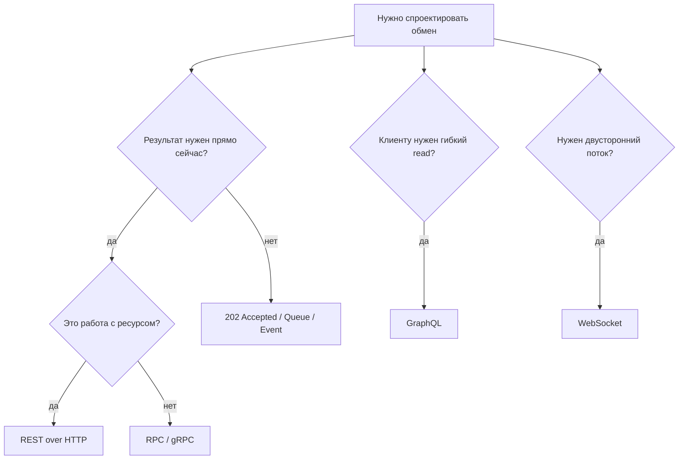

Эта схема не заменяет проектирование, но задает порядок вопросов. Сначала выбирается семантика бизнес-сценария, потом
форма API, и только после этого конкретный фреймворк или библиотека.

## Worked example: один backend, четыре разных контракта

### Ситуация

Пользователь открывает карточку товара, создает заказ, запускает долгую оплату и смотрит живой статус доставки. Все это
делает один backend, но операции ведут себя по-разному.

### Наивное решение

Сделать все как набор `POST /doSomething`: `POST /getProduct`, `POST /createOrder`, `POST /pay`, `POST /deliveryStatus`.
Статусы всегда `200 OK`, ошибки лежат в JSON-поле `success: false`, долгая оплата держит HTTP-соединение открытым.

### Что ломается

Клиент, кэш, retry и observability не понимают смысл операций. Чтение нельзя безопасно кешировать. Повтор оплаты может
создать дубль. Долгий запрос упирается в таймауты. Live status превращается в частый polling без ясного контракта.

### Улучшение

Карточку товара читать через cacheable `GET`, создание заказа оформить как ресурсный `POST`, долгую оплату принять через
`202 Accepted` и job resource, живой статус доставки отдавать через WebSocket/SSE или аккуратный polling contract.

### Почему это работает

API-подход выбирается не по модности технологии, а по семантике бизнес-сценария: нужно ли ждать, можно ли повторить,
где живет результат и как клиент узнает об изменении.

## Цели

После этой статьи вы должны уметь:

- отличать семантику обмена от протокола и архитектурного стиля;
- объяснять синхронное, асинхронное и реактивное взаимодействие;
- читать базовую структуру HTTP-запроса и HTTP-ответа;
- выбирать HTTP-метод и статус ответа под конкретную операцию;
- проектировать простой REST API вокруг ресурсов, а не вокруг случайных методов;
- объяснять `stateless`, `idempotency`, `cacheability` и версионирование API;
- понимать, когда REST, GraphQL, WebSocket, SOAP, RPC, gRPC и tRPC подходят лучше или хуже;
- видеть, почему HTTP можно использовать и для синхронной, и для асинхронной бизнес-семантики.

## Четыре уровня обмена

В обсуждениях клиент-серверной разработки часто смешивают разные уровни: "REST протокол", "асинхронный gRPC",
"синхронный HTTP", "GraphQL как архитектура". Так говорить удобно в быту, но для проектирования это опасно: можно
выбрать технологию и не решить главный вопрос о поведении системы.

| Уровень | Вопрос | Примеры |
|---------|--------|---------|
| Семантика | Кто кого ждет и как приходит результат? | sync, async, reactive |
| Протокол | По каким правилам передаются сообщения? | HTTP, WebSocket, gRPC поверх HTTP/2 |
| Стиль/API-модель | Как проектируем внешний контракт? | REST, RPC, GraphQL |
| Инструменты | Чем это реализуем? | Ktor, ASP.NET, Spring, `net/http`, Swagger UI |

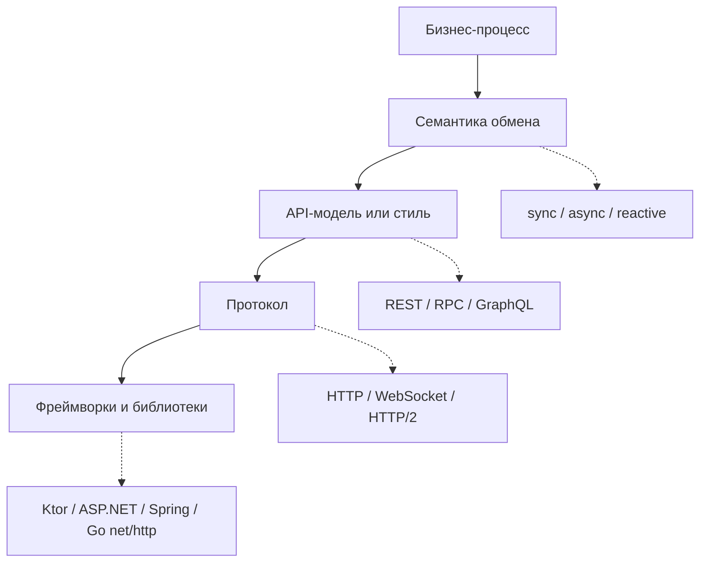

Хороший порядок принятия решений такой:

1. Понять бизнес-сценарий.
2. Выбрать семантику: нужно ждать результат сейчас или можно принять задачу в работу.
3. Выбрать API-модель: ресурсный REST, процедурный RPC, клиентский язык запросов GraphQL или поток сообщений.
4. Выбрать протокол и инструменты, которые не мешают выбранной семантике.

## Синхронное взаимодействие

Синхронное взаимодействие - это обмен, где вызывающая сторона не может продолжить сценарий без ответа. Клиент отправляет
запрос, сервер выполняет работу и возвращает результат. Клиент получает либо успех, либо ошибку, и только после этого
принимает следующее решение.

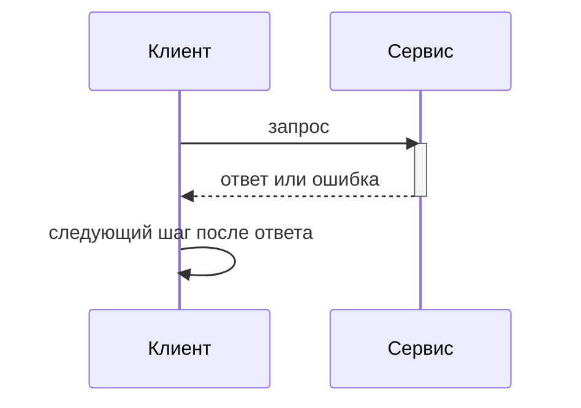

Такой обмен подходит, когда результат нужен прямо сейчас:

- пользователь хочет удалить заказ, а сервис должен сначала проверить права;
- корзина проверяет наличие товара перед оформлением заказа;
- backend запрашивает профиль пользователя, без которого нельзя собрать страницу;
- сервис заказов вызывает сервис цен, потому что итоговая сумма нужна до оплаты.

Плюсы синхронного подхода:

- проще читать и отлаживать поток выполнения;
- легче объяснить причинно-следственную цепочку;
- проще вернуть пользователю конкретную ошибку;
- меньше инфраструктуры: часто достаточно HTTP-клиента и endpoint-а.

Минусы:

- вызывающая сторона зависит от доступности сервера;
- долгий серверный ответ ухудшает отзывчивость клиента;
- при перегрузке одного сервиса ожидание распространяется на другие;
- нужны таймауты, retry и ограничение параллельных вызовов, иначе система может "зависнуть" на ожиданиях.

::: warning Не путайте с блокировкой потока
"Синхронное взаимодействие" в этой лекции - это бизнес-семантика обмена. Реальный код может использовать `async/await`,
корутины или неблокирующий I/O, но если следующий шаг невозможен без ответа сервера, сценарий все равно синхронный.
:::

## Асинхронное взаимодействие

Асинхронное взаимодействие - это обмен, где вызывающая сторона передает команду или сообщение и не ждет финальный
результат прямо в этом же запросе. Она может получить подтверждение приема, продолжить работу, а результат появится
позже: в очереди, отдельном ресурсе, callback-е, уведомлении или событии.

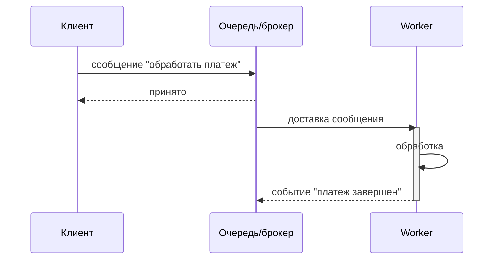

Асинхронный подход подходит, когда:

- операция долгая: формирование отчета, экспорт, обработка видео;
- результат не нужен для немедленного продолжения UI;
- нужно переживать временную недоступность получателя;
- нужны очереди, повторы, ограничение нагрузки и независимое масштабирование обработчиков;
- один факт должен быть обработан несколькими потребителями.

Цена асинхронности: сложнее проектировать состояния, отлаживать порядок сообщений и объяснять пользователю
промежуточные статусы. Полная картина async-обмена: брокеры, consumer groups, DLQ и exactly-once семантика —
в [Лекции 11](/lectures/11).

## Реактивное взаимодействие

Реактивная модель близка к асинхронной, но результат не приходится постоянно спрашивать. Клиент подписывается на поток
событий, а сервер сам присылает изменения, когда они происходят. Это push-модель.

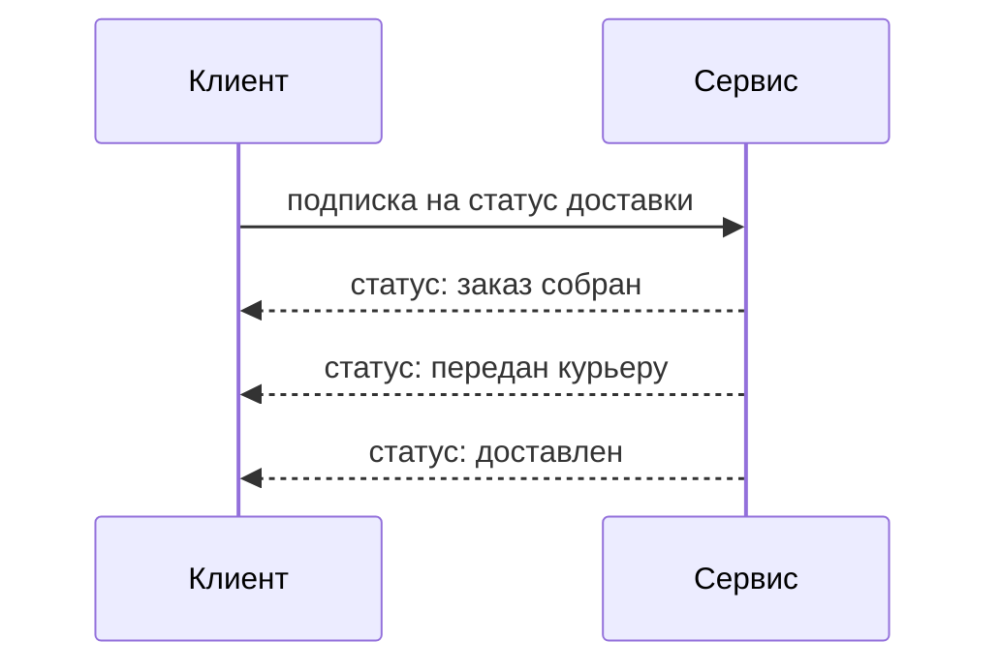

Типичные примеры:

- чат и уведомления;
- live dashboard с метриками;
- биржевые котировки;
- статус доставки;
- многопользовательские игры;
- collaborative editing.

Реактивность часто реализуют через WebSocket, Server-Sent Events или потоковые возможности gRPC. Но сама идея снова
семантическая: клиент не опрашивает сервер вручную, а получает события по подписке.

## Request-response, request-reply, polling и callback

Названия похожи, но обозначают разные формы обмена.

| Модель | Как работает | Где встречается |
|--------|--------------|-----------------|
| Request-response | Запрос и финальный ответ в одной операции | Обычный HTTP `GET /orders/o-1` |
| Request-reply | Запрос принят, финальный ответ может прийти отдельным сообщением | Очереди сообщений, RPC поверх message bus |
| Polling | Клиент периодически спрашивает статус | `GET /jobs/{id}` каждые несколько секунд |
| Callback/webhook | Сервер сам вызывает заранее указанный URL клиента | платежные шлюзы, интеграции доставки |
| Message bus | Сообщения идут через брокер, потребители обрабатывают их независимо | Kafka, RabbitMQ, NATS |

Важная мысль: request-response часто ассоциируется с синхронностью, но поверх HTTP можно построить и асинхронный
сценарий, если ответ означает только "принято в обработку".

## Как выбрать семантику

| Вопрос | Обычно sync | Обычно async/reactive |
|--------|-------------|-----------------------|
| Нужен результат прямо сейчас? | да | нет |
| Операция долгая? | нет | да |
| Можно продолжать UI без результата? | нет | да |
| Нужны повторы и устойчивость к падению сервиса? | иногда | часто |
| Важна простота отладки? | да | сложнее |
| Нужно много независимых обработчиков события? | редко | часто |
| Пользователь должен видеть живые обновления? | редко | reactive |

Примеры выбора:

- проверка прав перед удалением заказа - синхронно, потому что без ответа нельзя удалять;
- формирование отчета - асинхронно, потому что отчет может строиться минуты;
- чат или статус доставки - реактивно, потому что клиенту нужны события по мере появления;
- платеж - часто асинхронно, потому что участвуют внешние системы, повторные попытки и eventual consistency;
- получение карточки товара - обычно синхронно, потому что это обычное чтение данных для текущего экрана.

## HTTP как прикладной протокол

HTTP - прикладной протокол обмена сообщениями. Он описывает, как клиент формирует запрос, как сервер формирует ответ,
какие есть методы, заголовки, статусы и правила передачи тела сообщения. Для backend-разработчика обычно достаточно
понимать HTTP на уровне приложения: как выглядит запрос, какой метод выбран, какие заголовки переданы и какой статус
вернул сервер.

HTTP-запрос состоит из:

- стартовой строки: метод, путь и версия протокола;
- заголовков: метаданные запроса;
- пустой строки;
- тела запроса, если оно нужно.

```http
POST /api/orders HTTP/1.1
Host: example.com
Content-Type: application/json
Accept: application/json

{"productId":"p-42","quantity":2}
```

HTTP-ответ состоит из:

- строки статуса: версия протокола, код и причина;
- заголовков ответа;
- пустой строки;
- тела ответа, если оно нужно.

```http
HTTP/1.1 201 Created
Content-Type: application/json
Location: /api/orders/o-100

{"id":"o-100","status":"created"}
```

`Content-Type` говорит, что находится в теле сообщения. `Accept` говорит, какой формат клиент готов принять. Сейчас для
API чаще всего используют JSON, но HTTP не ограничивается JSON: можно передавать HTML, XML, файлы, бинарные данные,
потоки и другие форматы.

## HTTP-методы

Метод показывает намерение клиента. Сервер технически может сделать что угодно на любой метод, но тогда контракт станет
непредсказуемым для других разработчиков и инструментов.

| Метод | Смысл | Safe | Idempotent | Пример |
|-------|-------|------|------------|--------|
| `GET` | прочитать ресурс | да | да | `GET /orders/o-1` |
| `POST` | создать ресурс или запустить действие | нет | нет | `POST /orders` |
| `PUT` | заменить состояние ресурса целиком | нет | да | `PUT /orders/o-1` |
| `PATCH` | частично изменить ресурс | нет | зависит от операции | `PATCH /orders/o-1` |
| `DELETE` | удалить ресурс | нет | да | `DELETE /orders/o-1` |

`Safe` означает, что метод не должен менять состояние сервера. `GET` можно повторять, кешировать и предзагружать без
страха случайно удалить данные.

`Idempotent` означает, что повтор одного и того же запроса приводит к тому же итоговому состоянию. Например, повторный
`PUT /cart/items/p-42` с количеством `2` оставит количество равным `2`, а повторный `POST /orders` может создать второй
заказ.

::: warning Типичная ошибка
`GET /deleteOrder?id=42` технически может работать, но ломает ожидания HTTP и REST. Робот, кеш, браузерный prefetch или
разработчик будут считать `GET` безопасным чтением, а не изменением данных.
:::

## HTTP-статусы

Вернёмся к сквозному сценарию. Карточка товара: `GET /products/42` → `200 OK`. Создание заказа: `POST /orders` → `201
Created`. Несуществующий товар: `GET /products/999` → `404 Not Found`. Каждый код несёт семантику для клиента, кэша и
middleware.

Статус - короткий машинно-читаемый итог обработки запроса. Тело ответа может содержать подробности, но клиент сначала
ориентируется на статус.

| Группа | Смысл | Примеры |
|--------|-------|---------|
| `1xx` | информационные ответы | `100 Continue` |
| `2xx` | успешная обработка | `200 OK`, `201 Created`, `202 Accepted`, `204 No Content` |
| `3xx` | перенаправления | `301 Moved Permanently`, `304 Not Modified` |
| `4xx` | ошибка на стороне клиента или запроса | `400 Bad Request`, `401 Unauthorized`, `403 Forbidden`, `404 Not Found`, `409 Conflict`, `422 Unprocessable Content` |
| `5xx` | ошибка на стороне сервера | `500 Internal Server Error`, `503 Service Unavailable` |

Частые статусы в API:

| Статус | Когда использовать |
|--------|--------------------|
| `200 OK` | запрос успешно выполнен, обычно есть тело ответа |
| `201 Created` | создан новый ресурс, полезно вернуть `Location` |
| `202 Accepted` | запрос принят, но финальная обработка будет позже |
| `204 No Content` | успешно, но тело ответа не нужно |
| `400 Bad Request` | запрос синтаксически или структурно неверен |
| `401 Unauthorized` | клиент не аутентифицирован |
| `403 Forbidden` | клиент известен, но прав недостаточно |
| `404 Not Found` | ресурс не найден |
| `409 Conflict` | конфликт состояния, например версия уже изменилась |
| `422 Unprocessable Content` | данные понятны, но не проходят бизнес-валидацию |
| `500 Internal Server Error` | непредвиденная ошибка сервера |
| `503 Service Unavailable` | сервис временно недоступен или перегружен |

`202 Accepted` особенно важен для этой лекции: это способ сказать "я принял задачу, но результат будет не в этом ответе".

## Асинхронность поверх HTTP

HTTP часто используют в синхронной модели: клиент отправил запрос и получил финальный ответ. Сравните два подхода:

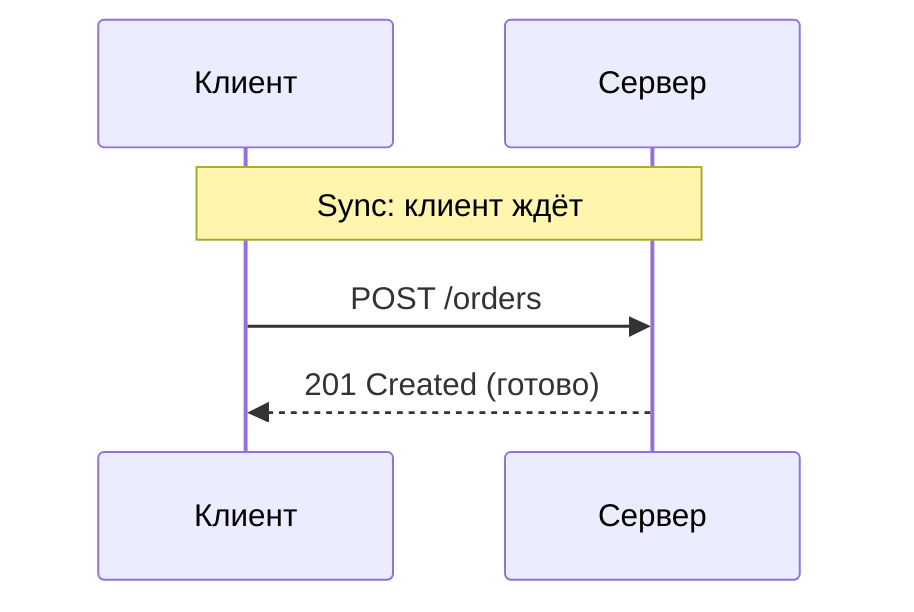

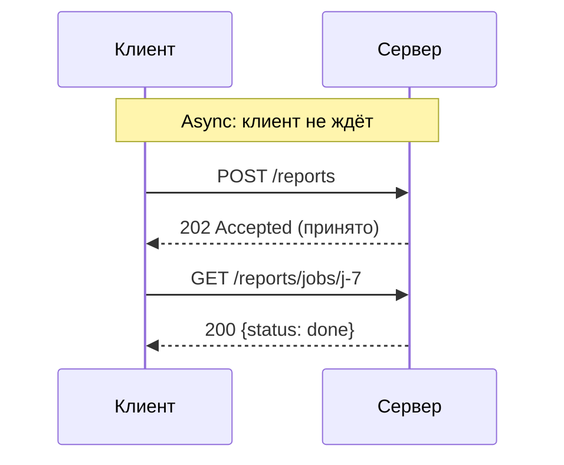

Но тот же HTTP можно
использовать для асинхронной бизнес-семантики.

Представим формирование отчета:

1. Клиент запускает отчет: `POST /reports`.
2. Сервер быстро отвечает `202 Accepted` и возвращает `jobId`.
3. Клиент продолжает работу.
4. Клиент периодически спрашивает `GET /reports/jobs/{jobId}`.
5. Когда статус `done`, клиент скачивает `GET /reports/{reportId}`.

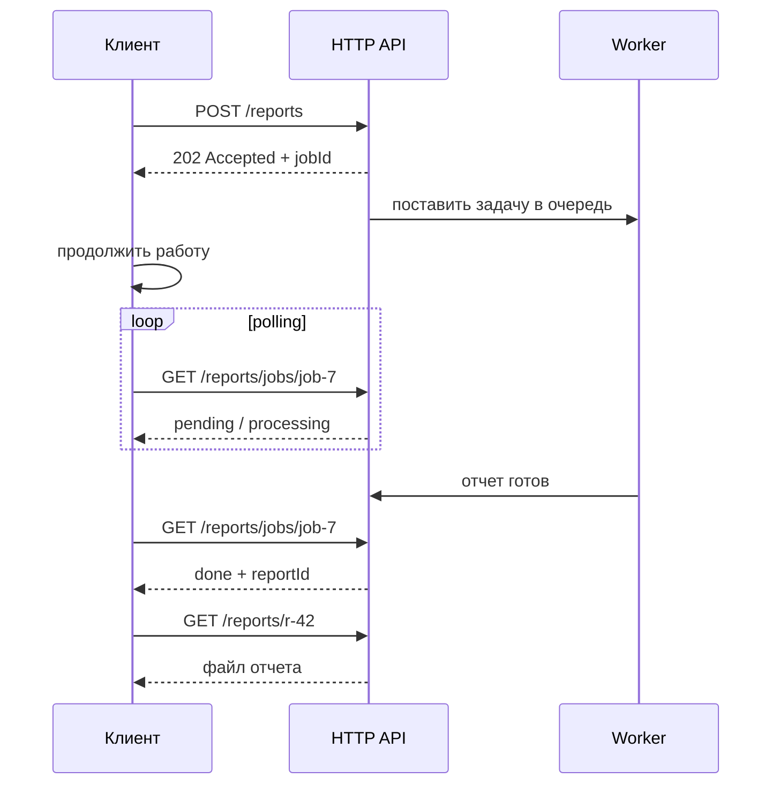

| Шаг | Endpoint | Метод | Успешный статус | Смысл |
|-----|----------|-------|-----------------|-------|
| Запустить отчет | `/api/v1/reports` | `POST` | `202` | задача принята |
| Проверить задачу | `/api/v1/reports/jobs/{jobId}` | `GET` | `200` | текущий статус |
| Скачать отчет | `/api/v1/reports/{reportId}` | `GET` | `200` | готовый результат |
| Отменить задачу | `/api/v1/reports/jobs/{jobId}` | `DELETE` | `204` | отмена, если еще можно |

Ответ на запуск может выглядеть так:

```http
HTTP/1.1 202 Accepted
Content-Type: application/json
Location: /api/v1/reports/jobs/job-7

{"jobId":"job-7","status":"pending"}
```

::: warning Типичная ошибка
Асинхронность не появляется от слова Kafka, gRPC или HTTP. Она появляется из контракта: "запрос принят, результат будет
позже". Технология только помогает реализовать этот контракт удобнее или надежнее.
:::

Вместо polling можно использовать callback или webhook: клиент при запуске задачи передает URL, а сервер вызывает его,
когда работа завершена. Это снимает постоянные опросы, но добавляет другие задачи: безопасность callback URL, повторные
попытки доставки и проверку подписи события.

## REST API

REST - архитектурный стиль, а не отдельный сетевой протокол. В обычной web-разработке REST API строят поверх HTTP:
ресурсы выражают через URL, действия - через HTTP-методы, состояние результата - через HTTP-статусы, представление
ресурса - через JSON или XML.

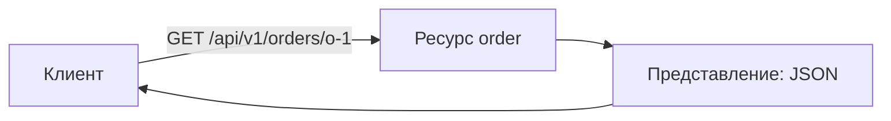

Основные идеи RESTful API:

- resource-oriented design: проектируем ресурсы, например `orders`, `users`, `reports`;
- representation: ресурс передается в виде представления, чаще всего JSON;
- stateless: каждый запрос самодостаточен для обработки;
- uniform interface: методы и статусы имеют ожидаемый смысл;
- layered system: клиент не обязан знать, сколько слоев за API;
- cacheability: ответы должны явно позволять или запрещать кеширование;
- idempotency: повтор некоторых запросов должен быть безопасен для итогового состояния;
- versioning: контракт меняется аккуратно, без поломки старых клиентов;
- documentation: API должен быть описан как внешний контракт.

Пример REST-дизайна для ресурса `orders`:

| Операция | Endpoint | Метод | Успех |
|----------|----------|-------|-------|
| список заказов | `/api/v1/orders` | `GET` | `200` |
| один заказ | `/api/v1/orders/{id}` | `GET` | `200` / `404` |
| создать заказ | `/api/v1/orders` | `POST` | `201` |
| заменить заказ | `/api/v1/orders/{id}` | `PUT` | `200` / `204` |
| изменить статус | `/api/v1/orders/{id}` | `PATCH` | `200` |
| удалить заказ | `/api/v1/orders/{id}` | `DELETE` | `204` |

Плохой и хороший вариант одной операции:

| Плохо | Почему плохо | Лучше |
|-------|--------------|-------|
| `GET /deleteOrder?id=42` | `GET` выглядит как чтение, а URL похож на команду | `DELETE /orders/42` |
| `POST /getOrders` | чтение замаскировано под создание/команду | `GET /orders` |
| `POST /updateOrderStatus` | операция описана глаголом, ресурс спрятан | `PATCH /orders/42` |

REST не запрещает действия вообще. Иногда действие действительно является доменной командой: например, `POST
/orders/{id}/cancel`. Но если обычный CRUD можно выразить ресурсами и стандартными методами, лучше начать с них.

Минимальный CRUD для `/orders` — роутер + обработчики:

::: multi-code "REST CRUD: /orders"

```kotlin
// Ktor
fun Application.orderRoutes(repo: OrderRepository) {
    routing {
        get("/orders") { call.respond(repo.findAll()) }
        get("/orders/{id}") {
            val order = repo.findById(call.parameters["id"]!!)
            if (order != null) call.respond(order) else call.respond(HttpStatusCode.NotFound)
        }
        post("/orders") {
            val cmd = call.receive<CreateOrderRequest>()
            val order = repo.create(cmd)
            call.respond(HttpStatusCode.Created, order)
        }
        delete("/orders/{id}") {
            repo.delete(call.parameters["id"]!!)
            call.respond(HttpStatusCode.NoContent)
        }
    }
}
```

```csharp
// ASP.NET Minimal API
app.MapGet("/orders", (OrderRepository repo) => repo.FindAll());
app.MapGet("/orders/{id}", (string id, OrderRepository repo) =>
    repo.FindById(id) is { } order ? Results.Ok(order) : Results.NotFound());
app.MapPost("/orders", (CreateOrderRequest cmd, OrderRepository repo) =>
    Results.Created($"/orders/{cmd.Id}", repo.Create(cmd)));
app.MapDelete("/orders/{id}", (string id, OrderRepository repo) =>
    { repo.Delete(id); return Results.NoContent(); });
```

```go
// net/http
mux := http.NewServeMux()
mux.HandleFunc("GET /orders", func(w http.ResponseWriter, r *http.Request) {
    json.NewEncoder(w).Encode(repo.FindAll())
})
mux.HandleFunc("GET /orders/{id}", func(w http.ResponseWriter, r *http.Request) {
    order, ok := repo.FindByID(r.PathValue("id"))
    if !ok { http.NotFound(w, r); return }
    json.NewEncoder(w).Encode(order)
})
mux.HandleFunc("POST /orders", func(w http.ResponseWriter, r *http.Request) {
    var cmd CreateOrderRequest
    json.NewDecoder(r.Body).Decode(&cmd)
    order := repo.Create(cmd)
    w.WriteHeader(http.StatusCreated)
    json.NewEncoder(w).Encode(order)
})
```

:::

## Stateless

`Stateless` означает, что сервер не должен требовать скрытого контекста из предыдущего HTTP-запроса, чтобы понять
текущий. Каждый запрос должен нести достаточную информацию: кто пользователь, к какому ресурсу он обращается, что именно
он хочет изменить.

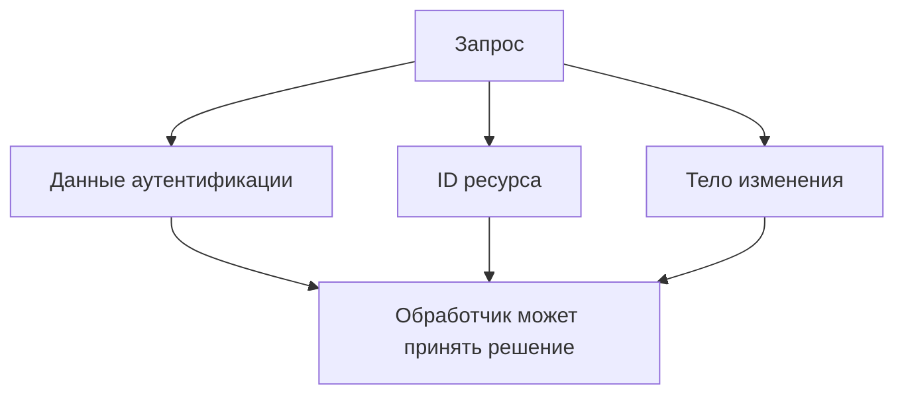

Stateless не означает, что у приложения нет состояния. Заказы, пользователи, корзины и платежи хранятся в базе данных.
Смысл в другом: сервер не должен зависеть от неявной памяти разговора вроде "пользователь на прошлом запросе выбрал
корзину, поэтому теперь можно писать просто add item".

Плохо:

```http
POST /cart/current/items HTTP/1.1

{"productId":"p-42"}
```

Если "current" зависит от скрытого состояния на сервере, клиенту и другим сервисам сложно понять, какая корзина будет
изменена.

Лучше:

```http
POST /carts/cart-15/items HTTP/1.1
Authorization: Bearer <token>
Content-Type: application/json

{"productId":"p-42","quantity":1}
```

## Idempotency

Idempotency важна из-за сетевой реальности. Клиент отправил запрос, сервер успел его выполнить, но ответ потерялся.
Клиент повторяет запрос. Что должно произойти?

Для `PUT` итоговое состояние должно остаться тем же:

```http
PUT /cart/items/p-42 HTTP/1.1
Content-Type: application/json

{"quantity":2}
```

Повтор такого запроса снова установит количество `2`, а не добавит еще `2`.

Для `POST /orders` повтор может создать два заказа. Поэтому для платежей, заказов и команд часто используют
`Idempotency-Key`: клиент отправляет уникальный ключ операции, а сервер при повторе возвращает результат уже выполненной
операции.

```http
POST /payments HTTP/1.1
Idempotency-Key: 9f4b6f2d-2f5d-4f23-9e79-8e6b2f5d41ad
Content-Type: application/json

{"orderId":"o-100","amount":5990}
```

::: tip Практическое правило
Если клиент будет делать retry, сначала решите, что повтор запроса означает для состояния системы. Без этого retry может
создать дубликаты заказов, платежей или сообщений.
:::

Серверная сторона idempotency key: проверить → обработать или вернуть cached:

::: multi-code "Idempotency key: handler на сервере"

```kotlin
fun handlePayment(key: String, request: PaymentRequest): PaymentResult {
    val existing = idempotencyStore.find(key)
    if (existing != null) return existing

    val result = paymentService.charge(request)
    idempotencyStore.save(key, result)
    return result
}
```

```csharp
public PaymentResult HandlePayment(string key, PaymentRequest request)
{
    if (_store.TryGet(key, out var existing))
        return existing;

    var result = _paymentService.Charge(request);
    _store.Save(key, result);
    return result;
}
```

```go
func (h *PaymentHandler) HandlePayment(key string, req PaymentRequest) (PaymentResult, error) {
    if existing, ok := h.store.Find(key); ok {
        return existing, nil
    }
    result, err := h.service.Charge(req)
    if err != nil {
        return PaymentResult{}, err
    }
    h.store.Save(key, result)
    return result, nil
}
```

:::

## Cacheability

Кеширование снижает нагрузку и ускоряет чтение, но оно должно быть явным. Обычно кешируют `GET`-ответы, потому что они
не меняют состояние. Сервер управляет кешированием через заголовки:

```http
HTTP/1.1 200 OK
Cache-Control: public, max-age=60
ETag: "orders-page-v4"
Content-Type: application/json

{"items":[{"id":"o-1","status":"paid"}]}
```

Клиент или промежуточный кеш может использовать такой ответ 60 секунд. Для персональных данных, корзин и финансовых
операций кеширование нужно ограничивать:

```http
Cache-Control: no-store
```

RESTful API не обязан кешировать все. Он должен ясно сообщать, что можно кешировать, а что нельзя.

## Версионирование API

API - контракт с клиентами. Если мобильное приложение уже установлено у пользователей, сервер нельзя просто переписать
так, будто старых клиентов не существует. Версионирование помогает развивать контракт постепенно.

Распространенные варианты:

| Способ | Пример | Комментарий |
|--------|--------|-------------|
| Версия в URL | `/api/v1/orders` | просто читать, часто используют в учебных и публичных API |
| Версия в заголовке | `Accept: application/vnd.company.v2+json` | чище URL, но сложнее для новичков и ручного тестирования |
| Совместимые изменения без версии | добавить необязательное поле | лучший вариант, когда можно не ломать клиентов |

Ломающие изменения:

- переименовать поле ответа;
- удалить endpoint;
- изменить смысл статуса;
- сделать обязательным поле, которого старые клиенты не отправляют.

Неломающие изменения:

- добавить новое необязательное поле;
- добавить новый endpoint;
- расширить enum при условии, что старые клиенты умеют обрабатывать неизвестные значения.

## HTTP-клиент на разных языках

Следующий пример показывает одну и ту же идею: отправить `GET`, проверить статус и получить тело ответа. Реальный код
парсинга JSON зависит от библиотек, поэтому здесь акцент на HTTP-семантике.

::: multi-code "HTTP-клиент: получить заказ"

```kotlin
import java.net.URI
import java.net.http.HttpClient
import java.net.http.HttpRequest
import java.net.http.HttpResponse

val client = HttpClient.newHttpClient()
val request = HttpRequest.newBuilder()
    .uri(URI.create("https://api.example.com/orders/o-100"))
    .header("Accept", "application/json")
    .GET()
    .build()

val response = client.send(request, HttpResponse.BodyHandlers.ofString())

if (response.statusCode() == 200) {
    println(response.body())
} else {
    error("Unexpected status: ${response.statusCode()}")
}
```

```kotlin playground
data class Response(
    val status: Int,
    val body: String
)

class FakeHttpClient {
    fun get(path: String): Response {
        return when (path) {
            "/orders/o-100" -> Response(200, """{"id":"o-100","status":"paid"}""")
            else -> Response(404, """{"error":"not found"}""")
        }
    }
}

fun main() {
    val client = FakeHttpClient()
    val response = client.get("/orders/o-100")

    if (response.status == 200) {
        println("Order loaded: ${response.body}")
    } else {
        println("Request failed: ${response.status}")
    }
}
```

```csharp
using var client = new HttpClient();

using var request = new HttpRequestMessage(
    HttpMethod.Get,
    "https://api.example.com/orders/o-100"
);
request.Headers.Accept.ParseAdd("application/json");

using var response = await client.SendAsync(request);

if (response.StatusCode == System.Net.HttpStatusCode.OK)
{
    var body = await response.Content.ReadAsStringAsync();
    Console.WriteLine(body);
}
else
{
    throw new InvalidOperationException($"Unexpected status: {(int)response.StatusCode}");
}
```

```java
import java.net.URI;
import java.net.http.HttpClient;
import java.net.http.HttpRequest;
import java.net.http.HttpResponse;

public class Main {
    public static void main(String[] args) throws Exception {
        var client = HttpClient.newHttpClient();
        var request = HttpRequest.newBuilder()
            .uri(URI.create("https://api.example.com/orders/o-100"))
            .header("Accept", "application/json")
            .GET()
            .build();

        var response = client.send(request, HttpResponse.BodyHandlers.ofString());

        if (response.statusCode() == 200) {
            System.out.println(response.body());
        } else {
            throw new IllegalStateException("Unexpected status: " + response.statusCode());
        }
    }
}
```

```go
package main

import (
    "fmt"
    "io"
    "net/http"
)

func main() {
    req, err := http.NewRequest(http.MethodGet, "https://api.example.com/orders/o-100", nil)
    if err != nil {
        panic(err)
    }
    req.Header.Set("Accept", "application/json")

    resp, err := http.DefaultClient.Do(req)
    if err != nil {
        panic(err)
    }
    defer resp.Body.Close()

    body, err := io.ReadAll(resp.Body)
    if err != nil {
        panic(err)
    }

    if resp.StatusCode == http.StatusOK {
        fmt.Println(string(body))
    } else {
        panic(fmt.Sprintf("unexpected status: %d", resp.StatusCode))
    }
}
```

:::

::: only kotlin
В Kotlin для реальных проектов часто берут Ktor Client, Retrofit или Spring `WebClient`, но базовая модель остается той
же: метод, URL, заголовки, тело, статус.
:::

::: only csharp
В C# важно переиспользовать `HttpClient` или `IHttpClientFactory`, а не создавать новый клиент на каждый запрос в
нагруженном серверном коде.
:::

::: only java
В Java стандартный `java.net.http.HttpClient` появился в современной стандартной библиотеке, но в Spring-проектах часто
используют `RestClient` или `WebClient`.
:::

::: only go
Go — единственный из четырёх языков, где полноценный HTTP-сервер пишется без фреймворка. `net/http` покрывает
маршрутизацию, middleware, TLS и graceful shutdown. Для production-кода обязательно настраивают таймауты.
:::

::: only kotlin
Ktor `suspend fun` делает async HTTP-вызовы синтаксически неотличимыми от sync — нет callback hell и `CompletableFuture`
chain. Внутри `suspend` функция приостанавливается без блокировки потока.
:::

## Endpoint на разных языках

Теперь посмотрим на серверную сторону: `POST /orders` создает заказ, возвращает `201 Created`, добавляет `Location` и
отдает представление нового ресурса. Это фреймворковые фрагменты, поэтому Playground для Kotlin отключен.

::: multi-code "REST endpoint: создать заказ" {playground=off}

```kotlin
import io.ktor.http.HttpHeaders
import io.ktor.http.HttpStatusCode
import io.ktor.server.application.call
import io.ktor.server.request.receive
import io.ktor.server.response.header
import io.ktor.server.response.respond
import io.ktor.server.routing.Route
import io.ktor.server.routing.post

data class CreateOrderRequest(val productId: String, val quantity: Int)
data class OrderResponse(val id: String, val status: String)

fun Route.orderRoutes(service: OrderService) {
    post("/api/v1/orders") {
        val request = call.receive<CreateOrderRequest>()
        val order = service.create(request.productId, request.quantity)

        call.response.header(HttpHeaders.Location, "/api/v1/orders/${order.id}")
        call.respond(HttpStatusCode.Created, OrderResponse(order.id, order.status))
    }
}
```

```csharp
public sealed record CreateOrderRequest(string ProductId, int Quantity);
public sealed record OrderResponse(string Id, string Status);

app.MapPost("/api/v1/orders", (
    CreateOrderRequest request,
    OrderService service
) =>
{
    var order = service.Create(request.ProductId, request.Quantity);
    var response = new OrderResponse(order.Id, order.Status);

    return Results.Created($"/api/v1/orders/{order.Id}", response);
});
```

```java
import java.net.URI;
import org.springframework.http.ResponseEntity;
import org.springframework.web.bind.annotation.PostMapping;
import org.springframework.web.bind.annotation.RequestBody;
import org.springframework.web.bind.annotation.RequestMapping;
import org.springframework.web.bind.annotation.RestController;

record CreateOrderRequest(String productId, int quantity) {}
record OrderResponse(String id, String status) {}

@RestController
@RequestMapping("/api/v1/orders")
class OrderController {
    private final OrderService service;

    OrderController(OrderService service) {
        this.service = service;
    }

    @PostMapping
    ResponseEntity<OrderResponse> create(@RequestBody CreateOrderRequest request) {
        var order = service.create(request.productId(), request.quantity());
        var body = new OrderResponse(order.id(), order.status());

        return ResponseEntity
            .created(URI.create("/api/v1/orders/" + order.id()))
            .body(body);
    }
}
```

```go
package main

import (
    "encoding/json"
    "fmt"
    "net/http"
)

type CreateOrderRequest struct {
    ProductID string `json:"productId"`
    Quantity  int    `json:"quantity"`
}

type OrderResponse struct {
    ID     string `json:"id"`
    Status string `json:"status"`
}

func createOrderHandler(service OrderService) http.HandlerFunc {
    return func(w http.ResponseWriter, r *http.Request) {
        if r.Method != http.MethodPost {
            http.Error(w, "method not allowed", http.StatusMethodNotAllowed)
            return
        }

        var req CreateOrderRequest
        if err := json.NewDecoder(r.Body).Decode(&req); err != nil {
            http.Error(w, "bad request", http.StatusBadRequest)
            return
        }

        order := service.Create(req.ProductID, req.Quantity)
        w.Header().Set("Location", fmt.Sprintf("/api/v1/orders/%s", order.ID))
        w.Header().Set("Content-Type", "application/json")
        w.WriteHeader(http.StatusCreated)
        json.NewEncoder(w).Encode(OrderResponse{ID: order.ID, Status: order.Status})
    }
}
```

:::

## Документирование API

API без документации превращается в набор догадок. Документация должна описывать контракт: endpoints, методы, параметры,
форматы запросов и ответов, статусы, ошибки и требования к аутентификации.

OpenAPI - распространенный формат описания HTTP API. Swagger UI - популярный интерфейс, который строит интерактивную
документацию по OpenAPI-описанию. Postman удобен для ручного тестирования, но он не заменяет контракт: коллекция
запросов показывает примеры, а OpenAPI описывает ожидаемую форму API.

Минимальный фрагмент OpenAPI для чтения заказа:

```yaml
openapi: 3.1.0
info:
  title: Orders API
  version: 1.0.0
paths:
  /api/v1/orders/{id}:
    get:
      summary: Get order by id
      parameters:
        - name: id
          in: path
          required: true
          schema:
            type: string
      responses:
        "200":
          description: Order found
          content:
            application/json:
              schema:
                $ref: "#/components/schemas/Order"
        "404":
          description: Order not found
components:
  schemas:
    Order:
      type: object
      required: [id, status]
      properties:
        id:
          type: string
        status:
          type: string
```

## SOAP

SOAP - это протокол и набор строгих правил для XML-сообщений. Он часто связан с WSDL, где описывается контракт сервиса:
какие операции есть, какие XML-структуры они принимают и возвращают. SOAP исторически широко использовался в enterprise
и legacy-интеграциях.

Упрощенный SOAP envelope:

```xml
<soap:Envelope xmlns:soap="http://schemas.xmlsoap.org/soap/envelope/">
  <soap:Body>
    <GetOrderRequest xmlns="https://example.com/orders">
      <OrderId>o-100</OrderId>
    </GetOrderRequest>
  </soap:Body>
</soap:Envelope>
```

SOAP может работать поверх разных транспортов, хотя на практике часто встречается поверх HTTP. Его сильная сторона -
строгий контракт и развитые enterprise-возможности. Слабая - многословный XML и высокая сложность для простых web API.

::: details Когда SOAP все еще встречается
SOAP часто остается в банковских, государственных, страховых и корпоративных системах, где интеграции создавались давно,
а контракт и совместимость важнее удобства ручного чтения. Новые публичные web API чаще делают REST, GraphQL или gRPC,
но уметь распознавать SOAP полезно.
:::

## GraphQL

Мобильному приложению нужны 3 поля из Order, а REST отдаёт 47. Dashboard собирает данные из 3 ресурсов — 3
HTTP-запроса. GraphQL решает оба случая одним запросом: клиент сам описывает, какие поля ему нужны.

GraphQL - язык запросов и runtime-модель для API. Обычно клиент отправляет запрос на одну endpoint-точку, например
`/graphql`, а в теле описывает, какие поля ему нужны.

```graphql
query {
  order(id: "o-1") {
    id
    status
    items {
      productName
      quantity
    }
  }
}
```

В REST backend заранее проектирует набор endpoint-ов и форму каждого ответа. В GraphQL backend предоставляет схему, а
клиент выбирает нужные поля в рамках этой схемы.

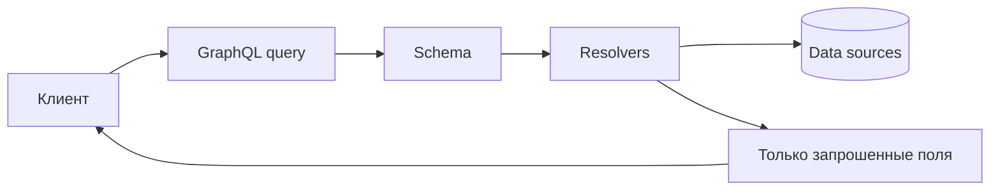

GraphQL помогает, когда:

- разным экранам нужны разные наборы полей;
- REST endpoint-ы начинают плодиться из-за overfetching и underfetching;
- frontend-команда хочет гибко собирать данные без постоянных новых endpoint-ов.

Цена GraphQL:

- сложнее кешировать обычными HTTP-кешами;
- нужно ограничивать глубину и стоимость запросов;
- легко получить N+1 проблему в resolver-ах;
- авторизация становится тоньше, потому что проверять нужно не только endpoint, но и поля;
- схема становится отдельным важным контрактом.

## WebSocket

WebSocket - протокол долгоживущего двунаправленного соединения. Сначала клиент и сервер делают handshake, после чего
оба могут отправлять сообщения без нового HTTP-запроса на каждое событие.

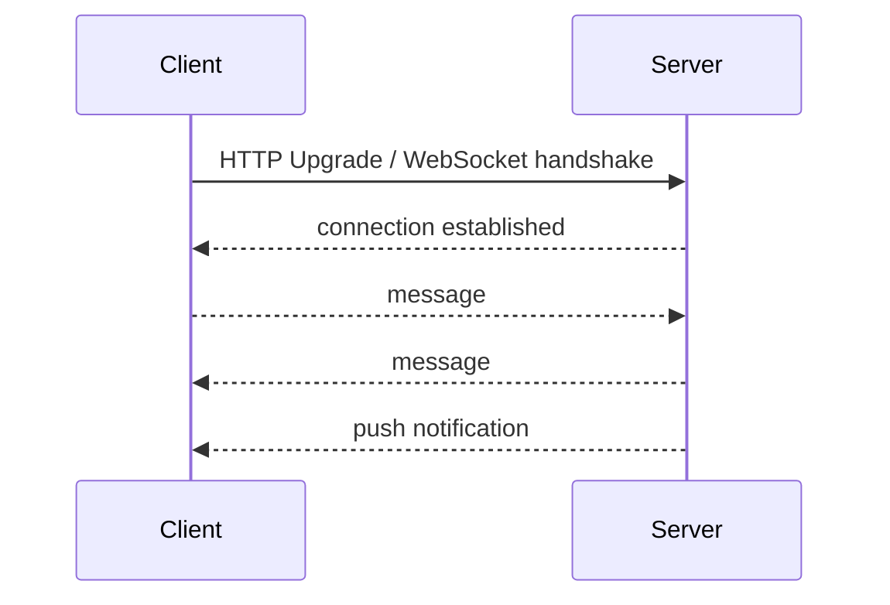

WebSocket подходит для:

- чатов;
- live dashboard;
- multiplayer;
- уведомлений;
- совместного редактирования;
- потоковых статусов, где polling слишком дорогой или медленный.

Он не заменяет REST для обычного CRUD. У WebSocket появляются свои инженерные задачи: восстановление соединения,
heartbeat, backpressure, авторизация соединения, масштабирование по нескольким экземплярам сервера и доставка сообщений
подписчикам.

## RPC, gRPC и tRPC

RPC - модель "удаленный вызов процедуры". Клиентский код выглядит так, будто вызывает обычный метод, но фактически
запрос уходит на другой процесс или сервис.

gRPC - популярная RPC-реализация. В ней контракт обычно описывают в `.proto`-файле, затем генерируют серверные и
клиентские stubs для нужных языков. Сообщения сериализуются через Protocol Buffers, а транспорт обычно работает поверх
HTTP/2.

```proto
syntax = "proto3";

service OrderService {
  rpc GetOrder(GetOrderRequest) returns (OrderResponse);
}

message GetOrderRequest {
  string id = 1;
}

message OrderResponse {
  string id = 1;
  string status = 2;
}
```

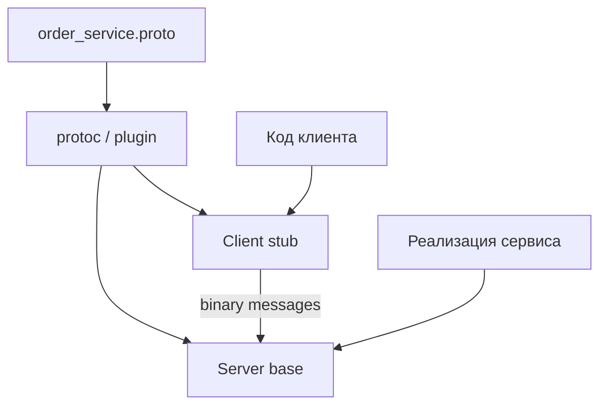

gRPC часто удобен между микросервисами:

- строгий schema-first контракт;
- генерация кода для разных языков;
- компактный бинарный формат;
- unary-вызовы и streaming;
- хорошая производительность для service-to-service обмена.

Ограничения:

- хуже подходит для простого публичного API, который должен удобно дергаться из браузера и читаться руками;
- сложнее отлаживать без специальных инструментов, потому что сообщения бинарные;
- контракт требует дисциплины миграций `.proto`.

tRPC - RPC-подход из TypeScript-экосистемы. Он полезен, когда frontend и backend написаны на TypeScript и команда хочет
получить type-safe API без отдельного schema-файла. Для курса важнее сама идея: RPC проектирует API вокруг процедур, а
REST - вокруг ресурсов.

## Сравнение подходов

| Подход | Что это | Типично где | Сильные стороны | Слабые стороны |
|--------|---------|-------------|-----------------|----------------|
| HTTP + REST | стиль API поверх HTTP | публичные API, web/mobile backend | простота, совместимость | overfetching/underfetching, ручное версионирование |
| Async HTTP | семантика поверх HTTP | долгие задачи | просто внедрить без брокера | polling или callback усложняют контракт |
| SOAP | XML-протокол и строгий контракт | legacy enterprise | формальный контракт, зрелые enterprise-интеграции | тяжеловесность, многословность |
| GraphQL | язык запросов и runtime | frontend-heavy API | клиент выбирает поля | сложность backend, кеша и защиты |
| WebSocket | двунаправленное соединение | realtime | push и низкая задержка | управление соединениями |
| gRPC | RPC framework | service-to-service | скорость, schema-first, генерация клиентов | хуже для простых браузерных публичных API |

Практическая картина в обычном проекте часто такая:

- между frontend и backend - HTTP + REST;
- между микросервисами - REST или gRPC;
- для долгих операций - async HTTP, очередь или message bus;
- для событий и потоков - WebSocket, SSE или streaming;
- для сложных frontend-запросов - GraphQL;
- для legacy-интеграций - иногда SOAP.

## Частые ошибки

::: warning Частые ошибки проектирования обмена
- Считать REST протоколом. REST - стиль, обычно поверх HTTP.
- Считать HTTP всегда синхронным по бизнес-семантике. HTTP может вернуть `202 Accepted` и job resource.
- Делать изменение данных через `GET`.
- Возвращать `200 OK` на все: успех, ошибку валидации, отсутствие прав и внутреннюю ошибку.
- Хранить критичный workflow в скрытом серверном состоянии между запросами.
- Путать `PUT` и `PATCH`.
- Не продумывать retry и idempotency для платежей, заказов и команд.
- Проектировать REST endpoint-ы как глаголы вместо ресурсов.
- Выбирать GraphQL, WebSocket или gRPC только потому, что технология выглядит современной.
:::

## Проверочный список проектирования API

Перед тем как писать код обмена, пройдите короткий список:

1. Что является бизнес-операцией: чтение, команда, событие или подписка?
2. Нужен ли финальный результат прямо сейчас?
3. Что произойдет, если сервис-получатель временно недоступен?
4. Можно ли повторить запрос без дубликатов?
5. Как клиент узнает об ошибке?
6. Как клиент узнает о завершении долгой операции?
7. Какой ресурс меняется?
8. Какой метод и статус лучше выражают смысл операции?
9. Нужно ли кеширование?
10. Как контракт будет документирован и версионирован?

## Итоги

Семантика обмена выбирается по бизнес-процессу. Если следующий шаг невозможен без ответа, нужен синхронный сценарий. Если
операция долгая, ненадежная или может выполняться позже, лучше проектировать асинхронный сценарий. Если клиенту нужны
живые события, подходит реактивная модель.

Протокол помогает или мешает, но не определяет все сам. HTTP удобно использовать для обычного request-response, но на
нем же можно построить асинхронный контракт через `202 Accepted`, job resource, polling или callback. REST - не протокол,
а стиль проектирования ресурсного API. gRPC чаще удобен между сервисами, WebSocket - для живого двустороннего канала,
GraphQL - когда клиенту нужна гибкая форма запроса, SOAP - то, что важно узнавать в legacy-интеграциях.

Главный инженерный навык здесь - не выучить список технологий, а уметь сказать: "в этой операции вызывающая сторона
должна ждать" или "здесь достаточно принять задачу и вернуть результат позже", а уже затем выбрать подходящий API и
протокол.

## Дополнительное чтение

Материалы помогают сравнить синхронные и асинхронные семантики, а затем отдельно пройтись по распространенным API-подходам.

### Семантика взаимодействия

- [Синхронное vs асинхронное взаимодействие](https://vc.ru/id1788045/709274-sinhronnoe-vs-asinhronnoe-vybiraem-podhod-k-vzaimodeistviyu-mikroservisov) — вводный материал о выборе подхода.
- [Синхронное и асинхронное взаимодействие микросервисов](https://habr.com/ru/companies/oleg-bunin/articles/543946/) — более глубокий разбор.
- [Межсервисное взаимодействие кратко](https://university.ylab.io/articles/tpost/j9l5xdbxs1-mezhservisnoe-vzaimodeistvie) — короткая обзорная статья.
- [Клиент-серверное и межсервисное взаимодействие](https://habr.com/ru/articles/729528/) — расширенный обзор вариантов.

### API-подходы

- [REST API](https://blog.skillfactory.ru/glossary/rest-api/) — базовое описание REST.
- [gRPC](https://yandex.cloud/ru/docs/glossary/grpc?utm_referrer=https%3A%2F%2Fwww.google.com%2F) — справка по gRPC.
- [SOAP API](https://blog.skillfactory.ru/glossary/soap-api/) — вводное описание SOAP.
- [GraphQL](https://blog.skillfactory.ru/kak-novichku-nachat-polzovatsya-graphql-i-zachem-eto-nuzhno/) — зачем нужен GraphQL и как начать.
- [WebSocket](https://blog.skillfactory.ru/glossary/websocket/) — базовое описание WebSocket.
- [Webhooks](https://www.mango-office.ru/journal/for-marketing/osnovy/webhook-i-kak-ego-ispolzovat/) — как работают webhook-интеграции.
- [REST API vs GraphQL](https://academy.mediasoft.team/article/rest-api-vs-graphql-vybiraem-arkhitekturu-obsheniya-fronta-i-beka-dlya-prilozheniya/) — сравнение подходов для frontend-backend обмена.

## Вопросы для самопроверки

1. Почему синхронность и асинхронность - это семантика сценария, а не название протокола?
2. Когда `202 Accepted` честнее, чем долгий `200 OK`?
3. Почему изменение данных через `GET` ломает ожидания клиента, кэша и инфраструктуры?
4. Чем REST отличается от RPC?
5. Когда GraphQL помогает frontend-команде, а когда усложняет backend без достаточной пользы?
6. Почему WebSocket не заменяет REST для обычного CRUD?
7. Для каких service-to-service сценариев gRPC может быть удобнее JSON-over-HTTP?
8. Что нужно решить до выбора фреймворка endpoint-ов?

## Мини-практика

Спроектируйте API для оформления заказа из сквозного сценария.

Нужно описать четыре операции:

- показать карточку товара;
- создать заказ;
- запустить оплату, которая может занять несколько минут;
- показывать клиенту живой статус доставки.

Для каждой операции выберите:

1. семантику: synchronous, asynchronous или reactive;
2. API-форму: REST resource, RPC method, GraphQL query/mutation, WebSocket/SSE stream;
3. ключевые HTTP-статусы или типы сообщений;
4. retry/idempotency-правило;
5. способ документирования контракта.

Если для всех четырех операций получился один и тот же стиль обмена, проверьте решение еще раз: разные бизнес-сценарии
часто требуют разных контрактов.

Когда "позже" становится не исключением, а нормальной частью архитектуры, появляются брокеры, очереди, топики,
повторная доставка и DLQ. Это следующий шаг: [асинхронное межсервисное взаимодействие](/lectures/11#способы-взаимодеиствия-сервисов).
