# Лекция 11. Асинхронное межсервисное взаимодействие

Эта лекция разбирает, как сервисы взаимодействуют не прямым ожиданием ответа, а через сообщения: очереди, брокеры,
топики, события и фоновые обработчики. В прошлой лекции основной фокус был на синхронном взаимодействии: HTTP, REST,
gRPC и request-response. Здесь мы смотрим на другую семантику: сервис может отправить сообщение, продолжить работу, а
другой сервис обработает это сообщение позже.

Материал написан как самостоятельный компаньон к лекции. Если вы пропустили занятие, начните отсюда: после чтения вы
должны понимать, зачем вообще нужны очереди, чем Kafka отличается от RabbitMQ на уровне сценариев, почему
`exactly-once` нельзя просто "включить настройкой" и какие вопросы надо задать перед выбором брокера.

Следующая лекция продолжит эту тему со стороны надежности бизнес-процессов: Saga, orchestration, choreography,
Outbox, Inbox и двухфазный коммит. В этой лекции мы подготовим базовый словарь и инженерную карту решений.

::: tip Главная идея лекции
Асинхронное взаимодействие не делает систему автоматически надежной. Оно меняет форму связности: сервисы меньше знают
друг о друге, но больше зависят от брокера, контракта сообщения, наблюдаемости и политики обработки ошибок.
:::

::: tip Как работать с примерами
Примеры даны на Kotlin, C#, Java и Go. Для Kotlin там, где пример можно запустить без внешней инфраструктуры, есть
отдельная Playground-версия с `main`. Она длиннее статического фрагмента, зато ее можно менять и запускать прямо на
странице.
:::

## Сквозной сценарий

В [Лекции 10](/lectures/10#асинхронное-взаимодеиствие) мы уже видели операцию, которая не обязана завершаться в том же
ответе. Теперь развернем ее в полноценный поток: `Order Service` принимает заказ, публикует событие, `Payment Worker`
обрабатывает оплату, `Notification Service` отправляет письмо, а оператор должен увидеть, если сообщения застряли.

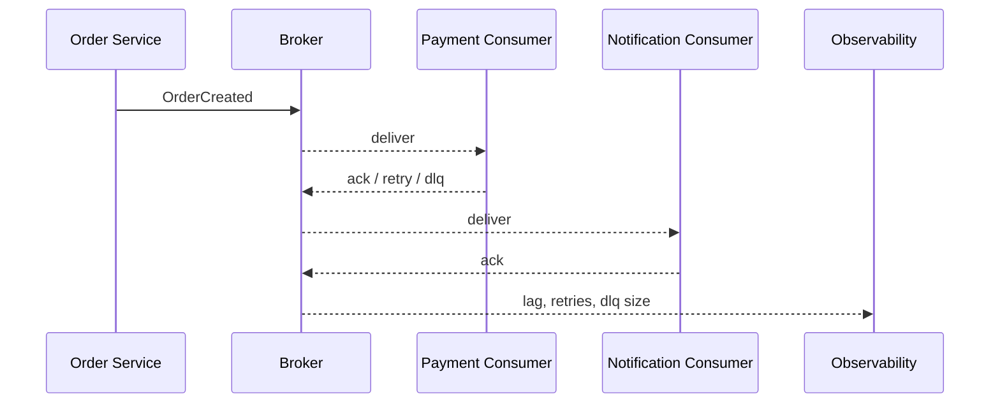

Главная мысль сценария: отправить сообщение легко, а сделать обработку предсказуемой сложнее. Нужно решить контракт
сообщения, стратегию ack, retry, дедупликацию, порядок, DLQ и метрики. Надежная публикация события после локального
`commit` появится в [Лекции 12](/lectures/12#transaction-outbox); здесь мы готовим словарь и варианты взаимодействия.

## Worked example: сообщение отправили, но процесс не стал надежным

### Ситуация

`Order Service` публикует `OrderCreated`, `Payment Consumer` списывает деньги, `Notification Consumer` отправляет письмо.
В обычный день все работает. В день распродажи broker начинает отдавать дубли, а один consumer падает после списания, но
до `ack`.

### Наивное решение

Считать, что broker "доставит ровно один раз", а consumer может просто выполнить действие и подтвердить сообщение. Если
что-то пошло не так, отправить сообщение в DLQ и когда-нибудь посмотреть.

### Что ломается

Платеж может примениться дважды. DLQ растет без владельца. Порядок сообщений по одному заказу теряется. У оператора нет
метрики, которая объясняет, сколько заказов застряло и почему.

### Улучшение

Ввести контракт сообщения с `messageId`, `correlationId`, version и business key, сделать consumer идемпотентным,
выбрать порядок по `orderId`, описать retry/DLQ policy и вывести lag/retry/DLQ metrics.

### Почему это работает

Асинхронность снижает связанность по времени, но переносит надежность в контракт, обработчик и эксплуатацию. Брокер
только транспорт; бизнес-эффект должен быть защищен приложением.

## Цели

После этой статьи вы должны уметь:

- отличать синхронную и асинхронную семантику от конкретного протокола;
- объяснять, почему распределенный монолит часто хуже обычного монолита;
- выбирать между direct call, worker queue, publish-subscribe и event stream;
- понимать термины `producer`, `broker`, `topic`, `queue`, `consumer`, `ack`, `retry`, `dead letter queue`;
- объяснять `at-most-once`, `at-least-once` и `effectively-once`;
- сравнивать Kafka, RabbitMQ, облачные очереди, NATS, ZeroMQ, Tarantool и DB-backed queues;
- проектировать базовый контракт сообщения;
- понимать, какие метрики очереди нужно мониторить в эксплуатации.

## От монолита к микросервисам

Асинхронное взаимодействие появляется не само по себе. Обычно оно становится заметным, когда приложение разбивают на
несколько процессов: сервис заказов, сервис оплат, сервис доставки, сервис уведомлений. Теперь обычный вызов метода
превратился в сетевое взаимодействие, а сеть добавила задержки, таймауты, частичные отказы и необходимость думать о
доставке сообщений.

### Модульный монолит не враг

Монолит - это не всегда плохо. Если код внутри одного процесса хорошо разделен на модули, зависимости направлены
осознанно, а бизнес-правила отделены от инфраструктуры, такой монолит может быть проще, дешевле и надежнее набора
сервисов.

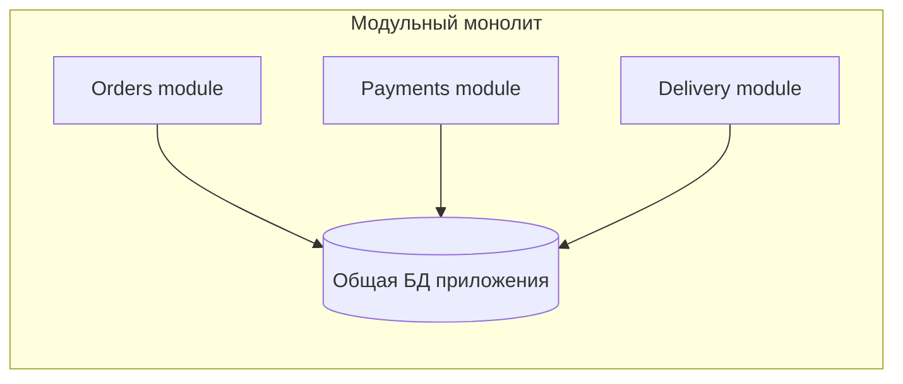

Главное преимущество модульного монолита - локальность. Вызов метода дешевый, транзакция обычно одна, отладка проще.
Главный риск - границы модулей легко нарушить, потому что технически весь код рядом.

### Распределенный монолит

Первая интуитивная ошибка при переходе к микросервисам - взять классы или модули из монолита и вынести их в отдельные
процессы без пересмотра границ. Получается распределенный монолит: сервисов много, но связность осталась монолитной.

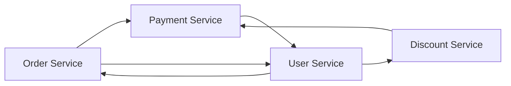

::: warning Распределенность не заменяет архитектуру
Если внутри монолита были плохие границы, вынос классов в отдельные процессы обычно добавит сеть, задержки, отказы и
сложность деплоя, но не исправит связность.
:::

Распределенный монолит обычно хуже обычного монолита:

- изменения по-прежнему требуют синхронных правок в нескольких местах;
- сервисы знают внутренние детали друг друга;
- отказ одного сервиса легко ломает цепочку вызовов;
- latency растет из-за сети;
- локальная разработка и onboarding становятся сложнее;
- горизонтальное масштабирование ограничено общей связностью.

### Слоеные микросервисы

Один из промежуточных подходов - слоеные микросервисы. Система делится не по бизнес-возможностям, а по слоям:
клиентский слой, backend for frontend, бизнес API, domain API, data/infrastructure.

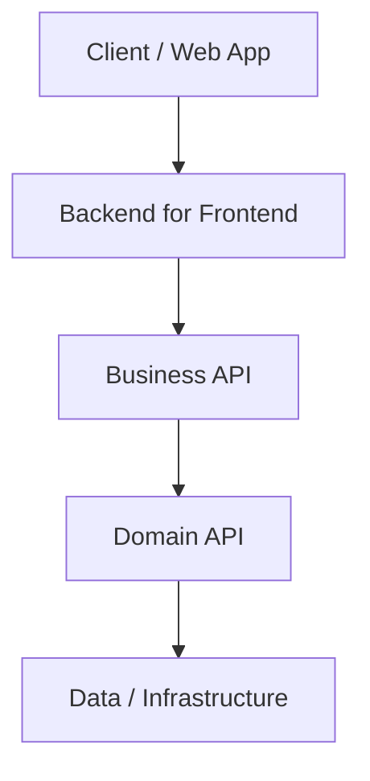

Такой подход может помочь большой организации постепенно разложить огромный монолит и снизить хаос миграций. Но это не
идеальная микросервисная архитектура: бизнес-сценарий все равно проходит через несколько слоев, а сервисы часто остаются
зависимыми друг от друга.

### Feature-based и domain-based

Feature-based подход выделяет сервис под отдельную функцию: история заказов, оформление покупки, генерация отчета.
Он понятен и часто встречается, но со временем может привести к большому количеству мелких сервисов, которые плохо
соответствуют устойчивым бизнес-границам.

Domain-based подход опирается на DDD и bounded context. Граница сервиса проводится вокруг смысловой области, где термины
и правила имеют согласованное значение: продажи, постпродажное обслуживание, склад, биллинг.

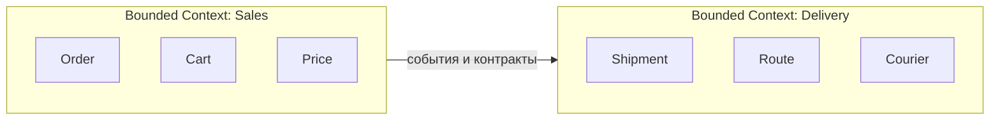

Хорошая граница сервиса не обязана быть маленькой. Она должна быть автономной: команда может менять внутреннюю модель
сервиса, не переписывая соседние сервисы.

### Stateless и stateful

Еще один разрез - хранит ли сервис состояние между запросами.

| Тип | Как работает | Где удобно | Главный риск |
|---|---|---|---|
| Stateless | Каждый запрос содержит весь нужный контекст или получает его из хранилища | HTTP API, простое горизонтальное масштабирование | Больше обращений к БД и больше данных в запросах |
| Stateful | Сервис держит часть контекста в памяти или локальном состоянии | корзины, сессии, долгие процессы, акторные модели | сложнее переносить нагрузку и восстанавливаться после отказа |

Stateless легче масштабировать инфраструктурно. Stateful может быть удобнее для сценариев, где контекст дорогой и часто
используется, но требует более серьезной стратегии восстановления.

## Способы взаимодействия сервисов

Сервисы могут обмениваться данными по-разному. Важно не выбирать технологию первой, а понять, какая семантика нужна
бизнес-сценарию.

| Способ | Когда подходит | Главный риск |
|---|---|---|
| HTTP/gRPC | нужен немедленный ответ | каскадные отказы |
| Queue | задача может выполниться позже | сложнее отладка и доставка |
| Pub-sub | много независимых подписчиков | версии событий |
| Event stream | аудит, replay, аналитика | порядок, retention, consumer lag |
| Shared DB | почти никогда между микросервисами | общая схема ломает автономность |
| Файловый обмен | большие редкие выгрузки, интеграция старых систем | задержки, ручная поддержка форматов |

Общая база данных между микросервисами почти всегда антипаттерн. Если два сервиса напрямую читают и пишут одни таблицы,
они становятся связаны схемой БД сильнее, чем REST-контрактом. Очередь поверх БД - другое дело: там БД используется как
технический механизм хранения сообщений, а не как общая доменная модель нескольких сервисов.

## Синхронность и асинхронность

Синхронность и асинхронность - это семантика взаимодействия, а не название протокола. HTTP чаще используют синхронно,
но поверх HTTP можно отправлять асинхронные команды. Брокер сообщений чаще используют асинхронно, но поверх брокера
можно построить request-reply.

Синхронный вызов:

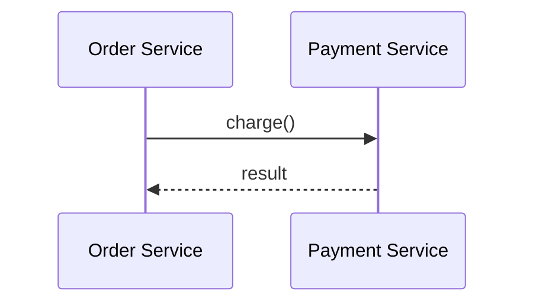

Отправитель ждет ответ. Это удобно, если без результата нельзя продолжать: например, пользователь нажал "Оплатить", и
интерфейсу нужно показать успех или ошибку.

Асинхронная очередь:

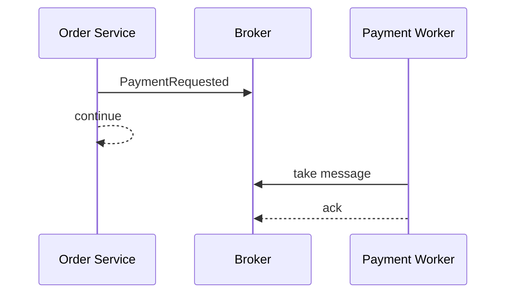

Отправитель не ждет выполнения работы. Он фиксирует намерение или событие, а обработчик выполнит задачу позже.

::: warning Асинхронность не подходит везде
Если бизнес-сценарий обязан немедленно знать результат, прямой HTTP/gRPC может быть проще и честнее. Очередь полезна,
когда допустима задержка, нужен буфер, есть независимые подписчики или требуется переживать временную недоступность
получателя.
:::

## Термины Message Bus

Message Bus - архитектурная идея: сервисы обмениваются сообщениями через общий коммуникационный слой, а не вызывают
друг друга напрямую. Конкретная реализация может быть Kafka, RabbitMQ, NATS, облачная очередь или собственный брокер.

Основные термины:

- `message` - единица передачи данных;
- `event` - сообщение о факте, который уже произошел: `OrderCreated`;
- `command` - сообщение с просьбой выполнить действие: `ChargePayment`;
- `broker` - инфраструктурный компонент, который принимает, хранит и доставляет сообщения;
- `queue` - очередь, из которой сообщение обычно забирает один consumer;
- `topic` - логический канал публикации сообщений;
- `exchange` - сущность RabbitMQ, которая маршрутизирует сообщения в очереди;
- `partition` - часть топика Kafka, внутри которой сохраняется порядок;
- `producer` или `publisher` - отправитель сообщения;
- `consumer` или `subscriber` - получатель сообщения;
- `ack` - подтверждение успешной обработки;
- `nack` - отказ от обработки или сигнал ошибки;
- `retry` - повторная попытка обработки;
- `DLQ` - dead letter queue, очередь сообщений, которые не удалось обработать штатно;
- `consumer group` - группа обработчиков, которые совместно читают поток сообщений;
- `offset` - позиция consumer в логе сообщений, особенно важна в Kafka;
- `pull delivery` - consumer сам запрашивает следующую порцию сообщений;
- `push delivery` - broker сам отправляет сообщения подписчику;
- `backpressure` - ситуация, когда получатель не успевает за отправителем и системе нужен способ замедлить поток.

Жизнь сообщения в типичном брокере:

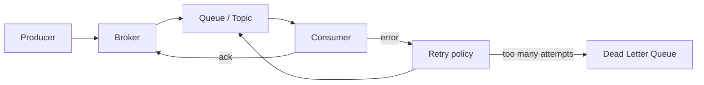

### Push и pull

В pull-модели consumer сам забирает сообщения. Это удобно, когда обработчик хочет контролировать темп: взял пачку,
обработал, подтвердил offset или `ack`, затем запросил следующую. Такая модель хорошо сочетается с backpressure: если
consumer устал, он просто реже читает.

В push-модели broker сам доставляет сообщения подписчику. Это может давать меньшую задержку и более простой код
подписчика, но требует аккуратных лимитов: сколько сообщений можно держать "в полете", что делать с медленным
подписчиком, когда считать сообщение доставленным.

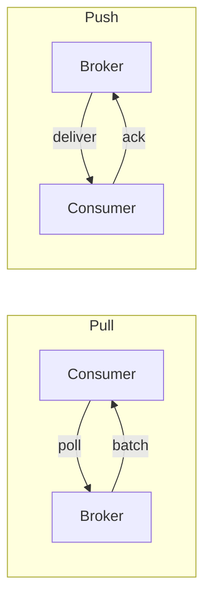

## Контракт сообщения

Сообщение - это публичный контракт между сервисами. Оно должно быть стабильнее внутренней модели отправителя. Если
сервис заказов переименовал поле внутри своей БД, подписчики не должны ломаться автоматически.

Хорошее сообщение обычно содержит:

- `messageId` для дедупликации;
- `occurredAt` для времени события;
- `schemaVersion` для эволюции формата;
- `correlationId` для трассировки бизнес-сценария;
- бизнес-идентификатор, например `orderId`;
- payload с данными события.

::: multi-code "Контракт сообщения OrderCreated" {default=kotlin}

```kotlin
data class OrderCreated(
    val messageId: String,
    val occurredAt: String,
    val schemaVersion: Int,
    val correlationId: String,
    val orderId: String,
    val customerId: String,
    val totalCents: Long
)
```

```kotlin playground
data class OrderCreated(
    val messageId: String,
    val occurredAt: String,
    val schemaVersion: Int,
    val correlationId: String,
    val orderId: String,
    val customerId: String,
    val totalCents: Long
) {
    fun toWireString(): String =
        listOf(
            "messageId=$messageId",
            "occurredAt=$occurredAt",
            "schemaVersion=$schemaVersion",
            "correlationId=$correlationId",
            "orderId=$orderId",
            "customerId=$customerId",
            "totalCents=$totalCents"
        ).joinToString(";")
}

fun main() {
    val event = OrderCreated(
        messageId = "msg-001",
        occurredAt = "2026-07-05T10:15:30Z",
        schemaVersion = 1,
        correlationId = "checkout-777",
        orderId = "ord-42",
        customerId = "cust-9",
        totalCents = 129900
    )

    println(event)
    println(event.toWireString())
}
```

```csharp
public sealed record OrderCreated(
    string MessageId,
    string OccurredAt,
    int SchemaVersion,
    string CorrelationId,
    string OrderId,
    string CustomerId,
    long TotalCents);
```

```java
public record OrderCreated(
    String messageId,
    String occurredAt,
    int schemaVersion,
    String correlationId,
    String orderId,
    String customerId,
    long totalCents
) {
}
```

```go
package main

type OrderCreated struct {
    MessageID     string
    OccurredAt    string
    SchemaVersion int
    CorrelationID string
    OrderID       string
    CustomerID    string
    TotalCents    int64
}
```

:::

::: only kotlin
В Kotlin для контрактов удобно использовать `data class`. Для внешнего wire-формата в реальном проекте обычно добавляют
сериализацию через `kotlinx.serialization`, Jackson или Avro/Protobuf, но сама идея контракта от библиотеки не зависит.
:::

::: only csharp
В C# `record` хорошо подходит для неизменяемого сообщения: он короткий, сравнивается по значению и явно показывает, что
это DTO-контракт.
:::

::: only java
В Java `record` удобен для сообщений начиная с современных версий языка. Если проект использует старую Java, аналог
часто делают обычным immutable-классом.
:::

::: only go
В Go контракт обычно выражают структурой. Для внешнего формата поля часто снабжают тегами `json`, `avro` или protobuf,
но здесь они опущены, чтобы не привязывать пример к библиотеке.
:::

### Эволюция контракта

События живут дольше кода, который их впервые опубликовал. У события могут быть старые подписчики, отложенные сообщения
в очереди, replay из Kafka и аналитические потребители, которые обновляются не в тот же день.

Практические правила:

- добавлять новые необязательные поля безопаснее, чем переименовывать старые;
- удаление поля должно проходить через период совместимости;
- `schemaVersion` нужен не для красоты, а чтобы consumer мог выбрать правильный разбор.

```kotlin
// v1: исходный контракт
data class OrderCreatedV1(val orderId: String, val amount: Int)

// v2: добавлено optional поле — backward-compatible
data class OrderCreatedV2(val orderId: String, val amount: Int, val currency: String? = null)

// consumer v2 читает v1 сообщение: currency = null, обработка продолжается
```

Ключевое правило:
- событие должно описывать внешний факт, а не внутреннюю таблицу отправителя;
- подписчик не должен зависеть от полей, которые не входят в публичный контракт.

::: warning Не публикуйте ORM-модель как событие
Если сообщение совпадает с текущей таблицей или внутренним классом entity, любое изменение хранения превращается в
изменение публичного API. Для межсервисного взаимодействия лучше иметь отдельный DTO-контракт.
:::

Иногда пример нужен как архитектурный фрагмент, а не как запускаемая программа. Например, сервис приложения не должен
знать, Kafka у него под капотом, RabbitMQ или облачная очередь. Ему достаточно порта публикации.

::: multi-code "Порт публикации сообщения" {default=kotlin playground=off}

```kotlin
interface MessagePublisher {
    fun publish(topic: String, message: OrderCreated)
}
```

```csharp
public interface IMessagePublisher
{
    void Publish(string topic, OrderCreated message);
}
```

```java
interface MessagePublisher {
    void publish(String topic, OrderCreated message);
}
```

```go
package main

type MessagePublisher interface {
    Publish(topic string, message OrderCreated)
}
```

:::

## Очередь задач: put-take

Worker queue решает задачу "положить работу в очередь, чтобы один из обработчиков ее выполнил". Это не широковещательное
событие. Если нужно отправить одно письмо, его не должны отправить пять workers одновременно.

Типичный поток:

1. Producer кладет задачу в очередь.
2. Один consumer забирает задачу.
3. Consumer выполняет работу.
4. Consumer отправляет `ack`.
5. Если работа завершилась ошибкой, сообщение уходит на retry или в DLQ.

Ключевой вопрос worker queue - когда отправлять `ack`. Если подтвердить сообщение до выполнения работы, при падении
worker задача потеряется. Если подтвердить после выполнения, задача может выполниться, но `ack` не дойдет до broker, и
сообщение придет повторно. Поэтому `at-least-once` почти всегда требует идемпотентной обработки.

| Момент `ack` | Что выигрываем | Что рискуем получить |
|---|---|---|
| До обработки | почти нет дублей | потеря задачи при падении worker |
| После обработки | меньше риск потери | повторная обработка после сбоя |
| После записи результата и дедупликации | контролируемый бизнес-эффект | нужна надежная таблица/хранилище обработанных сообщений |

::: multi-code "Очередь задач in-memory" {default=kotlin}

```kotlin
data class Job(val id: String, val payload: String)

class JobQueue {
    private val jobs = ArrayDeque<Job>()

    fun put(job: Job) {
        jobs.addLast(job)
    }

    fun take(): Job? = jobs.removeFirstOrNull()
}
```

```kotlin playground
data class Job(val id: String, val payload: String)

class JobQueue {
    private val jobs = ArrayDeque<Job>()

    fun put(job: Job) {
        jobs.addLast(job)
    }

    fun take(): Job? = jobs.removeFirstOrNull()
}

fun worker(name: String, queue: JobQueue) {
    while (true) {
        val job = queue.take() ?: return
        println("$name handled ${job.id}: ${job.payload}")
    }
}

fun main() {
    val queue = JobQueue()
    queue.put(Job("job-1", "send email"))
    queue.put(Job("job-2", "generate invoice"))
    queue.put(Job("job-3", "resize image"))

    worker("worker-a", queue)
    worker("worker-b", queue)
}
```

```csharp
using System;
using System.Collections.Generic;

public sealed record Job(string Id, string Payload);

public sealed class JobQueue
{
    private readonly Queue<Job> jobs = new();

    public void Put(Job job) => jobs.Enqueue(job);

    public Job? Take() => jobs.Count == 0 ? null : jobs.Dequeue();
}
```

```java
import java.util.ArrayDeque;
import java.util.Queue;

record Job(String id, String payload) {
}

final class JobQueue {
    private final Queue<Job> jobs = new ArrayDeque<>();

    void put(Job job) {
        jobs.add(job);
    }

    Job take() {
        return jobs.poll();
    }
}
```

```go
package main

type Job struct {
    ID      string
    Payload string
}

type JobQueue struct {
    jobs []Job
}

func (q *JobQueue) Put(job Job) {
    q.jobs = append(q.jobs, job)
}

func (q *JobQueue) Take() (Job, bool) {
    if len(q.jobs) == 0 {
        return Job{}, false
    }
    job := q.jobs[0]
    q.jobs = q.jobs[1:]
    return job, true
}
```

:::

In-memory пример не является брокером. Он показывает только семантику: один producer, очередь, несколько потенциальных
workers и обработка каждой задачи одним worker.

## Publish-subscribe

Publish-subscribe нужен, когда одно событие должно быть интересно нескольким независимым подписчикам. Например,
`OrderPaid` могут слушать:

- `DeliveryService`, чтобы начать доставку;
- `BonusService`, чтобы начислить бонусы;
- `AnalyticsService`, чтобы обновить отчеты;
- `NotificationService`, чтобы отправить письмо.

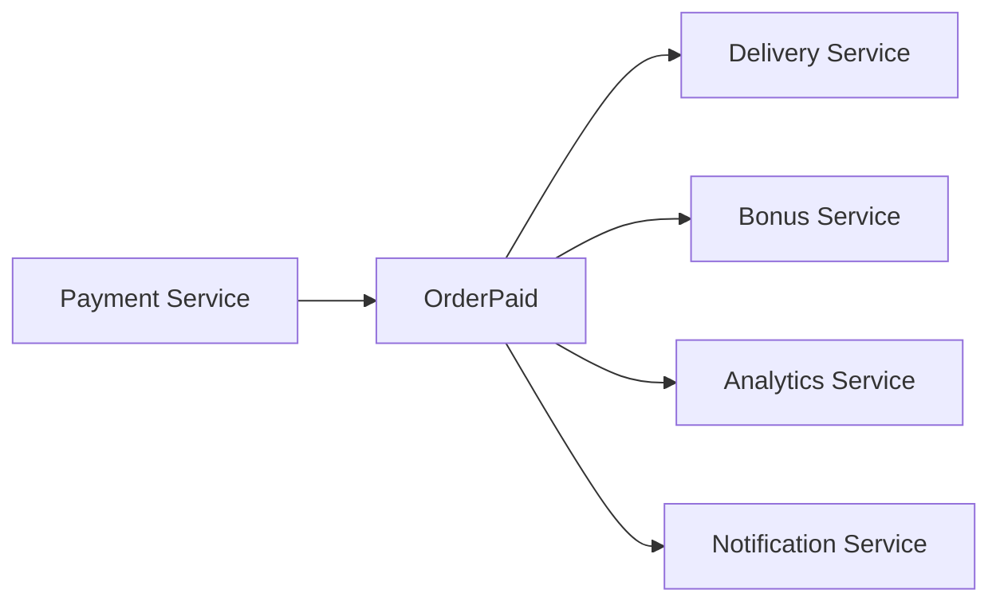

Отличие от worker queue принципиальное: в worker queue обработчик конкурирует за задачу, а в pub-sub каждый подписчик
получает свою логическую копию события.

::: multi-code "Publish-subscribe in-memory" {default=kotlin}

```kotlin
class EventBus {
    private val subscribers = mutableListOf<(String) -> Unit>()

    fun subscribe(handler: (String) -> Unit) {
        subscribers += handler
    }

    fun publish(event: String) {
        subscribers.forEach { it(event) }
    }
}
```

```kotlin playground
class EventBus {
    private val subscribers = mutableListOf<(String) -> Unit>()

    fun subscribe(handler: (String) -> Unit) {
        subscribers += handler
    }

    fun publish(event: String) {
        subscribers.forEach { it(event) }
    }
}

fun main() {
    val bus = EventBus()

    bus.subscribe { event -> println("Delivery sees $event") }
    bus.subscribe { event -> println("Bonus sees $event") }
    bus.subscribe { event -> println("Analytics sees $event") }

    bus.publish("OrderPaid(orderId=ord-42)")
}
```

```csharp
using System;
using System.Collections.Generic;

public sealed class EventBus
{
    private readonly List<Action<string>> subscribers = new();

    public void Subscribe(Action<string> handler) => subscribers.Add(handler);

    public void Publish(string message)
    {
        foreach (var handler in subscribers)
            handler(message);
    }
}
```

```java
import java.util.ArrayList;
import java.util.List;
import java.util.function.Consumer;

final class EventBus {
    private final List<Consumer<String>> subscribers = new ArrayList<>();

    void subscribe(Consumer<String> handler) {
        subscribers.add(handler);
    }

    void publish(String event) {
        subscribers.forEach(handler -> handler.accept(event));
    }
}
```

```go
package main

type Handler func(string)

type EventBus struct {
    subscribers []Handler
}

func (b *EventBus) Subscribe(handler Handler) {
    b.subscribers = append(b.subscribers, handler)
}

func (b *EventBus) Publish(event string) {
    for _, handler := range b.subscribers {
        handler(event)
    }
}
```

:::

В реальном брокере pub-sub также требует думать о версиях событий. Если событие читают пять сервисов, изменение формата
должно быть обратно совместимым или сопровождаться версионированием.

## Request-reply поверх брокера

Очереди не запрещают синхронную семантику. Можно отправить запрос в очередь, указать `correlationId` и `replyTo`, а
потом ждать ответ из другой очереди.

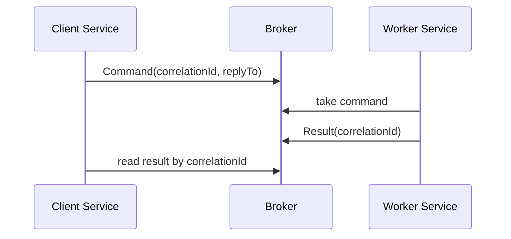

Такой подход оправдан, когда вся интеграция уже построена вокруг брокера или получатель временно недоступен, но
отправителю все равно нужен ответ в пределах таймаута. Однако это не главный сценарий Message Bus. Если сервису нужен
немедленный результат и нет особых причин использовать брокер, HTTP/gRPC обычно проще для отладки, трассировки и
понимания потока управления.

## Зачем нужны очереди

Очередь - это не только "связать микросервисы". Она решает несколько разных инженерных задач.

### Распределение нагрузки

Если есть несколько workers разной мощности, очередь позволяет каждому брать столько задач, сколько он успевает
обработать. Это ближе к честному распределению ресурсов, чем к наивному round-robin без учета реальной скорости.

### Сглаживание пиков

Очередь работает как буфер между всплеском запросов и ограниченной производительностью обработчиков.

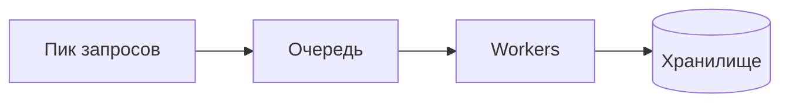

Если во время экзамена студенты массово отправляют решения, система может принять запросы быстро, поставить тяжелую
проверку в очередь и обработать ее по мере доступности вычислительных ресурсов.

### Отложенные и фоновые задачи

Некоторые операции не должны блокировать пользователя: отправка письма, генерация отчета, пересчет аналитики, загрузка
данных в DWH. Их удобно выполнять фоновыми workers.

### Изоляция медленного сервиса

Если `NotificationService` временно тормозит, `OrderService` не обязан ждать каждую отправку письма. Он публикует
событие, а уведомления догоняют позже.

### Retry после временных отказов

Сеть, внешние API и базы данных иногда временно недоступны. Очередь дает место, где можно сохранить работу до повторной
попытки.

### Интеграция разных систем

Очереди часто связывают системы с разным стеком, скоростью релизов и требованиями к доступности: банковский контур,
склад, CRM, биллинг, аналитика.

### Новые архитектурные стили

Event sourcing, event streaming и потоковая аналитика опираются на идею последовательности событий. Это уже не просто
"поставить задачу в очередь", а хранить историю фактов и строить из нее состояние.

## Гарантии доставки

Самый опасный миф про брокеры: "поставим очередь, и сообщения будут доставляться ровно один раз". В распределенной
системе всегда есть моменты неопределенности: producer отправил сообщение, но не получил подтверждение; consumer
обработал сообщение, но не успел отправить `ack`; брокер записал сообщение на лидер, но реплика отстала.

Проблема двух генералов в инженерной форме звучит так: если подтверждение само передается по ненадежной сети, участники
не могут получить абсолютную уверенность, что обе стороны знают один и тот же факт. Поэтому надежность строят не одной
магической гарантией, а комбинацией: durable broker, retries, idempotency, deduplication, транзакционные паттерны и
наблюдаемость.

| Семантика | Что обещает | Что может пойти не так | Как жить |
|---|---|---|---|
| At-most-once | не будет дублей | можно потерять сообщение | только для неважных событий |
| At-least-once | сообщение не потеряется без попытки | возможны дубли | idempotency key |
| Effectively-once | эффект применяется один раз | нужна своя логика | дедупликация + транзакции |

`Exactly-once` в документации конкретных систем обычно означает ограниченную гарантию внутри определенного контура:
например, между producer, брокером и stream processor при правильных настройках. Это не значит, что внешний платежный
провайдер, ваша БД и email-сервис тоже автоматически применят эффект один раз.

### Идемпотентный consumer

Практический способ жить с `at-least-once` - сделать обработчик идемпотентным. Если сообщение пришло повторно, обработчик
узнает `messageId` и не применит бизнес-эффект второй раз.

::: multi-code "Идемпотентный consumer" {default=kotlin}

```kotlin
class PaymentConsumer {
    private val processed = mutableSetOf<String>()

    fun handle(messageId: String, orderId: String): String {
        if (!processed.add(messageId)) return "duplicate skipped"
        return "payment captured for $orderId"
    }
}
```

```kotlin playground
class PaymentConsumer {
    private val processed = mutableSetOf<String>()

    fun handle(messageId: String, orderId: String): String {
        if (!processed.add(messageId)) {
            return "duplicate skipped: $messageId"
        }

        return "payment captured for $orderId by $messageId"
    }
}

fun main() {
    val consumer = PaymentConsumer()
    println(consumer.handle("msg-1", "ord-42"))
    println(consumer.handle("msg-1", "ord-42"))
    println(consumer.handle("msg-2", "ord-42"))
}
```

```csharp
using System.Collections.Generic;

public sealed class PaymentConsumer
{
    private readonly HashSet<string> processed = new();

    public string Handle(string messageId, string orderId)
    {
        if (!processed.Add(messageId))
            return "duplicate skipped";

        return $"payment captured for {orderId}";
    }
}
```

```java
import java.util.HashSet;
import java.util.Set;

final class PaymentConsumer {
    private final Set<String> processed = new HashSet<>();

    String handle(String messageId, String orderId) {
        if (!processed.add(messageId)) {
            return "duplicate skipped";
        }
        return "payment captured for " + orderId;
    }
}
```

```go
package main

type PaymentConsumer struct {
    processed map[string]bool
}

func NewPaymentConsumer() *PaymentConsumer {
    return &PaymentConsumer{processed: map[string]bool{}}
}

func (c *PaymentConsumer) Handle(messageID string, orderID string) string {
    if c.processed[messageID] {
        return "duplicate skipped"
    }
    c.processed[messageID] = true
    return "payment captured for " + orderID
}
```

:::

В продакшене `processed` должен быть не локальным `Set`, а надежным хранилищем с атомарной проверкой и записью. Иначе
после рестарта сервиса память очистится, и дубликаты снова станут опасными.

## Ошибки обработки

Ошибки сообщений бывают разными.

| Тип ошибки | Пример | Что делать |
|---|---|---|
| Transient | временно недоступен внешний API | retry с задержкой |
| Permanent | неверный формат сообщения | DLQ и разбор причины |
| Poison message | сообщение каждый раз ломает consumer | ограничить attempts и отправить в DLQ |
| Overload | consumers не успевают | масштабировать workers или снижать publish rate |

Retry без ограничений опасен. Одно плохое сообщение может бесконечно возвращаться в очередь и мешать обработке нормальных
сообщений.

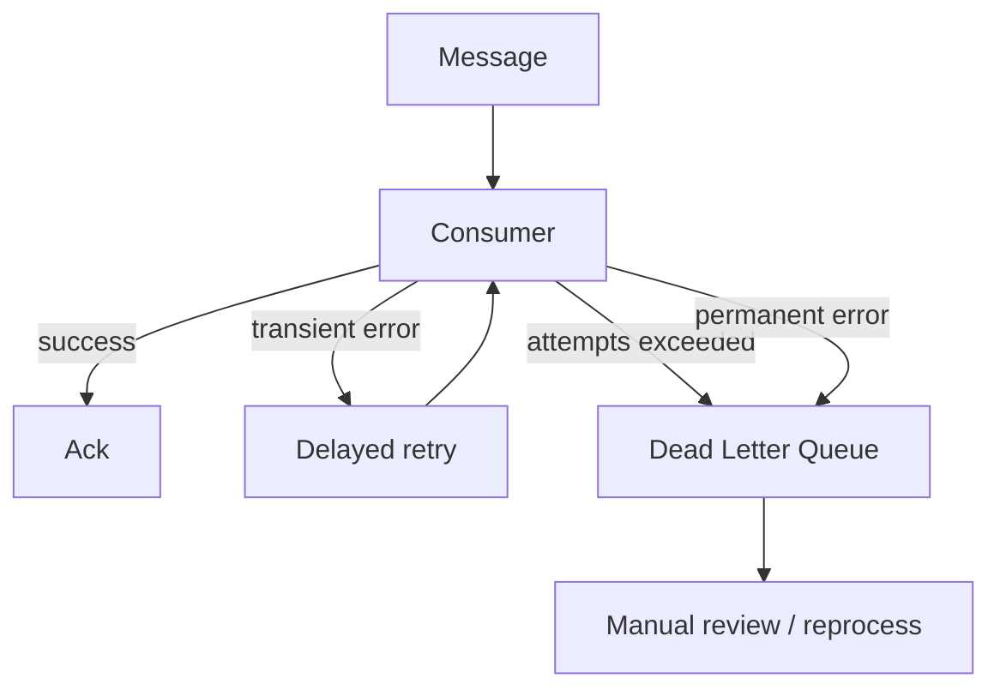

::: multi-code "Retry policy как чистая функция" {default=kotlin}

```kotlin
fun nextDelaySeconds(attempt: Int): Int? =
    when (attempt) {
        1 -> 5
        2 -> 30
        3 -> 120
        else -> null
    }
```

```kotlin playground
fun nextDelaySeconds(attempt: Int): Int? =
    when (attempt) {
        1 -> 5
        2 -> 30
        3 -> 120
        else -> null
    }

fun main() {
    for (attempt in 1..5) {
        val delay = nextDelaySeconds(attempt)
        if (delay == null) {
            println("attempt $attempt -> send to DLQ")
        } else {
            println("attempt $attempt -> retry after ${delay}s")
        }
    }
}
```

```csharp
int? NextDelaySeconds(int attempt) => attempt switch
{
    1 => 5,
    2 => 30,
    3 => 120,
    _ => null
};
```

```java
final class RetryPolicy {
    static Integer nextDelaySeconds(int attempt) {
        return switch (attempt) {
            case 1 -> 5;
            case 2 -> 30;
            case 3 -> 120;
            default -> null;
        };
    }
}
```

```go
package main

func NextDelaySeconds(attempt int) (int, bool) {
    switch attempt {
    case 1:
        return 5, true
    case 2:
        return 30, true
    case 3:
        return 120, true
    default:
        return 0, false
    }
}
```

:::

Приоритетные очереди добавляют отдельный риск: starvation. Если высокоприоритетные сообщения идут постоянно, низкий
приоритет может никогда не дойти до обработки. Поэтому за возрастом старейшего сообщения нужно следить отдельно.

::: warning DLQ - не мусорная корзина
Dead letter queue нужна для диагностики и восстановления. Если сообщения попадают туда регулярно, команда должна видеть
алерт, причину и план: исправить producer, поправить consumer, переиграть сообщения или признать их некорректными.
:::

## Порядок сообщений

Порядок сообщений кажется простой темой только до параллелизма. Одна очередь может давать FIFO, но как только consumers
несколько, глобальный порядок обработки становится сложнее.

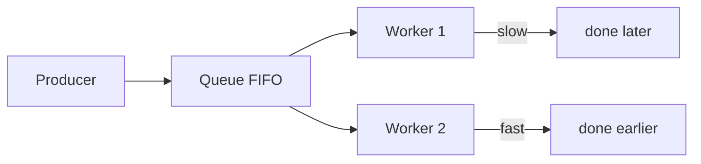

Kafka сохраняет порядок внутри partition. Если события одного заказа должны идти строго как
`OrderCreated -> OrderPaid -> OrderShipped`, их обычно отправляют с одним ordering key, например `orderId`. Тогда все
события одного заказа попадают в одну partition.

Компромисс простой:

- строгий порядок всего ограничивает параллелизм;
- порядок внутри ключа масштабируется лучше;
- отсутствие требований к порядку дает максимум throughput;
- если порядок важен, это нужно явно записывать в контракте.

## Репликация и отказоустойчивость брокера

Очередь сама может стать единой точкой отказа. Если broker один и он упал, producer не может отправить сообщение, а
consumer не может его прочитать.

### Single instance

Один брокер прост в настройке, но дает низкую доступность и надежность. Подходит для локальной разработки, обучения и
некритичных систем.

### Multi instance без репликации

Несколько независимых очередей повышают доступность части системы, но не сохраняют сообщения при потере конкретного
инстанса. Если сообщение лежало только на одном узле, отказ этого узла его уничтожит.

### Leader-follower replication

Более надежная схема - лидер принимает запись, а реплики получают копии.

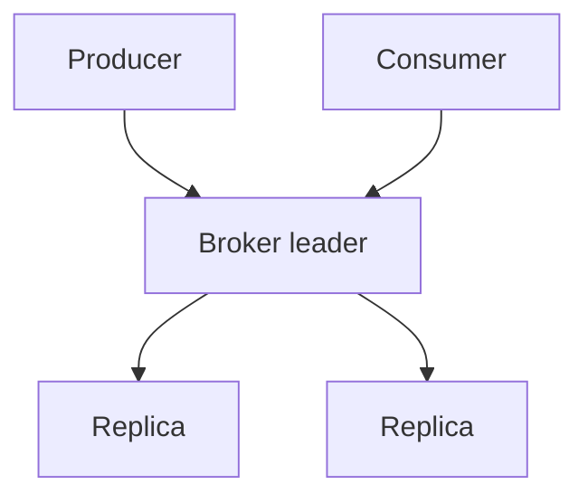

Если лидер падает, одна из реплик может стать новым лидером. Но важны детали: успела ли реплика получить сообщение,
нужен ли `ack` от всех реплик или от большинства, что происходит при разделении сети.

### Quorum

Quorum-подход требует подтверждения от большинства узлов. Это повышает консистентность, но может снизить доступность:
если кластер разделился на части и большинство недоступно, запись может остановиться. Такой сетевой раскол часто
называют split brain: разные части кластера временно видят разную картину мира.

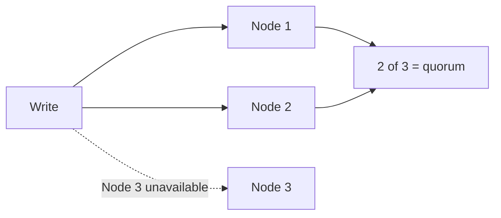

Нет бесплатной надежности. Больше реплик обычно означает больше сетевого обмена, больше latency, сложнее эксплуатацию и
больше сценариев восстановления.

### Retention и durability

Durability отвечает на вопрос "переживет ли сообщение отказ". Retention отвечает на вопрос "как долго сообщение хранится".
В RabbitMQ сообщение после успешного `ack` обычно исчезает из очереди. В Kafka сообщение может храниться по времени или
размеру лога, даже если consumers его уже прочитали. Поэтому Kafka удобна для replay, аудита и повторного построения
проекций.

## Протоколы и классы решений

Абстрактные паттерны consumer-а одинаковы для любого брокера: ack, retry, DLQ, идемпотентность. Теперь посмотрим, как
конкретные брокеры реализуют эти гарантии.

Протокол описывает правила обмена: формат команд, соединение, подтверждения, маршрутизацию. Брокер - конкретная система,
которая реализует одну или несколько моделей.

| Протокол или класс | Инженерный смысл |
|---|---|
| AMQP | классический протокол брокеров сообщений, часто ассоциируется с RabbitMQ |
| MQTT | легкий pub-sub для IoT и нестабильных сетей |
| Kafka protocol | работа с distributed log, partitions, offsets и consumer groups |
| HTTP API / SQS-like | простая интеграция с облачной очередью через HTTP API |
| NATS | легкий messaging с низкой задержкой, есть расширения для persistence |
| ZeroMQ | библиотека messaging-паттернов поверх сокетов, не полноценный managed broker |

Нельзя выбрать протокол только по популярности. Нужно смотреть на модель доставки, порядок, хранение, replay,
операционную сложность и поддержку нужных клиентов.

Кроме решений, которые разбираются ниже подробнее, в продуктах встречаются ActiveMQ, NSQ, Beanstalkd и другие брокеры.
Их стоит оценивать по тем же вопросам: порядок, подтверждения, replay, задержки, эксплуатация и поведение при отказах.

## Kafka

100 тыс. событий в день и 3 consumer-а, каждый читает в своём темпе. Queue не подходит — прочитанное сообщение исчезает.
Нужен лог, из которого каждый читает независимо. Именно это и делает Kafka.

Kafka лучше думать не как о "просто очереди", а как о распределенном commit log. Producer пишет сообщения в topic,
topic делится на partitions, consumer group читает сообщения и хранит offset.

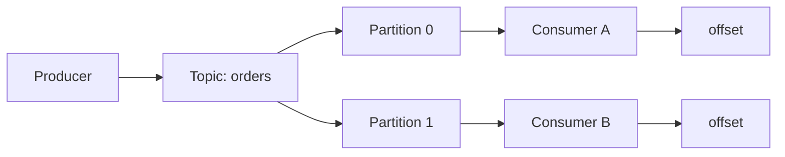

Сильные стороны Kafka:

- высокая пропускная способность;
- replay сообщений;
- хранение истории по retention;
- consumer groups;
- хорошая модель для event streaming, аудита, логов, метрик, CDC и аналитики;
- порядок внутри partition.

Ограничения:

- нет естественной произвольной приоритизации сообщений;
- requeue конкретного сообщения устроен иначе, чем в классических брокерах;
- строгий порядок требует аккуратно выбирать key и partitions;
- эксплуатация кластера требует понимания репликации, retention, lag и дисков.

Kafka часто выбирают, когда события являются ценным потоком данных, а не просто одноразовыми задачами.

## RabbitMQ

RabbitMQ - классический message broker. Producer отправляет сообщение в exchange, exchange по routing key отправляет его
в одну или несколько queues, consumers читают очереди и подтверждают обработку.

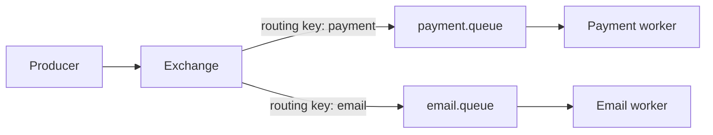

Типы exchange определяют маршрутизацию:

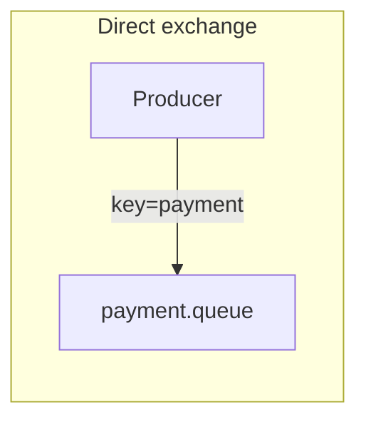

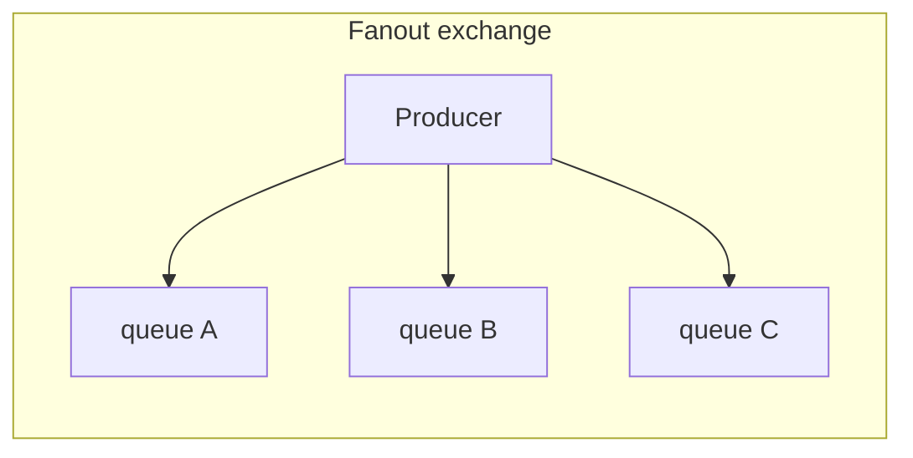

```mermaid
flowchart LR
    subgraph Topic["Topic exchange"]
        T_P["Producer"] -->|"order.*"| T_Q1["order.queue"]
        T_P -->|"order.payment"| T_Q2["payment.queue"]
    end
```

Сильные стороны RabbitMQ:

- гибкая маршрутизация через exchanges;
- ack/nack и requeue;
- fanout, direct, topic routing;
- delayed и retry-сценарии через плагины или отдельные очереди;
- priority queues;
- quorum queues для более надежного хранения;
- удобен для фоновых задач и workflow.

Ограничения:

- replay исторического потока не является основной моделью;
- высокая пропускная способность возможна, но Kafka обычно сильнее именно как потоковый лог;
- сложные routing/retry-схемы требуют дисциплины, иначе конфигурация становится неочевидной.

RabbitMQ часто выбирают, когда нужна рабочая очередь, маршрутизация задач, приоритеты, retries и управляемая доставка
сообщений конкретным обработчикам.

### Kafka и RabbitMQ в одном сравнении

| Вопрос | Kafka | RabbitMQ |
|---|---|---|
| Базовая модель | распределенный лог событий | брокер сообщений и очередей |
| Что происходит после чтения | сообщение остается до истечения retention | сообщение обычно удаляется после `ack` |
| Replay | естественный сценарий | не основная модель |
| Приоритеты | не естественная модель | поддерживаются priority queues |
| Routing | через topics, keys и partitions | через exchanges и routing keys |
| Повтор конкретной задачи | чаще отдельный retry topic/process | `nack`, requeue, retry queues |
| Типичный сценарий | event streaming, аудит, аналитика, CDC | фоновые задачи, workflow, маршрутизация команд |

## Tarantool, DB-backed queues, Redis и PgQueue

Очередь можно построить поверх хранилища: PostgreSQL, Redis, Tarantool или специализированного модуля вроде Tarantool
Queue. Это не то же самое, что "двум микросервисам пользоваться общей БД". В queue-over-DB хранилище является внутренней
деталью брокера или очереди, а сервисы общаются через контракт сообщений.

Когда это может быть разумно:

- нужен нестандартный алгоритм: особая приоритизация, сложная выборка, специфический put-back;
- очередь должна быть близко к данным;
- нагрузка умеренная, а дополнительный брокер слишком дорог операционно;
- команда хорошо понимает выбранное хранилище.

Риски:

- самим проектировать retry, DLQ, дедупликацию и retention;
- самим мониторить рост очереди;
- легко превратить очередь в скрытую общую БД;
- производительность и блокировки могут стать проблемой.

Своя очередь оправдана не потому, что "написать очередь легко", а потому, что готовые брокеры действительно не покрывают
важное требование.

## NATS и ZeroMQ

NATS и ZeroMQ ближе к lightweight messaging, чем к тяжёлому брокеру. Выбирать их стоит, когда модель совпадает
с задачей: низкая задержка, простая pub-sub коммуникация и понятные требования к потере сообщений.

::: details NATS и ZeroMQ подробнее

**NATS** хорош для сервисной коммуникации с низкой задержкой. Core NATS — at-most-once (fire-and-forget).
JetStream добавляет persistence и replay, приближая NATS к Kafka по модели, но с меньшей операционной
сложностью. NATS часто выбирают для service mesh и request-reply сценариев внутри кластера.

**ZeroMQ** — это скорее библиотека messaging-паттернов, чем managed broker. Она помогает строить push-pull,
pub-sub и request-reply поверх сетевых соединений, но durability, retry и мониторинг придётся проектировать
самому. Подходит для embedded-сценариев и нестандартных топологий.
:::

## Облачные очереди

Облачные очереди вроде Amazon SQS-like решений, Yandex Message Queue, CloudAMQP и аналогов снимают часть операционной
нагрузки. Не нужно самостоятельно поднимать кластер, планировать диски, чинить репликацию и обновлять брокер.

Плюсы:

- быстрый старт;
- управляемая доступность;
- готовые метрики;
- интеграция с IAM, логами и облачной инфраструктурой;
- меньше DevOps-нагрузки.

Минусы:

- vendor lock-in;
- стоимость на больших объемах;
- ограничения конкретного API;
- latency до облака;
- особенности локальной разработки и тестирования.

Если система уже живет в облаке, управляемая очередь часто является прагматичным первым выбором. Если требования
упираются в throughput, replay или сложную маршрутизацию, нужно сравнивать с Kafka/RabbitMQ отдельно.

## Матрица выбора

| Требование | Предпочтение |
|---|---|
| Нужен немедленный ответ | HTTP/gRPC |
| Фоновая задача | RabbitMQ или cloud queue |
| Много событий, replay, аналитика | Kafka |
| Приоритеты, delayed retry, routing | RabbitMQ |
| Очень низкая задержка, lightweight messaging | NATS |
| Нестандартный алгоритм очереди | Tarantool/custom |
| Минимум DevOps | cloud queue |
| Потеря сообщений допустима | простое messaging/socket-style решение |
| Дубли недопустимы на уровне бизнес-эффекта | idempotent consumer + deduplication, не "магический broker" |

Эта таблица не заменяет нагрузочное тестирование и proof of concept. Она помогает выбрать направление, чтобы не сравнивать
все со всем.

## Producer → consumer: end-to-end

Полный поток: producer публикует `OrderCreated`, consumer получает и обрабатывает:

::: multi-code "Producer → Consumer: OrderCreated" {default=kotlin}

```kotlin
// Producer
data class OrderCreatedEvent(val orderId: String, val amount: Int)

fun onOrderCreated(order: Order, publisher: MessagePublisher) {
    publisher.publish("orders.created", OrderCreatedEvent(order.id, order.amount))
}

// Consumer
class OrderCreatedHandler(private val invoiceService: InvoiceService) {
    fun handle(event: OrderCreatedEvent) {
        invoiceService.createInvoice(event.orderId, event.amount)
    }
}
```

```csharp
// Producer
public sealed record OrderCreatedEvent(string OrderId, int Amount);

public void OnOrderCreated(Order order, IMessagePublisher publisher) =>
    publisher.Publish("orders.created", new OrderCreatedEvent(order.Id, order.Amount));

// Consumer
public sealed class OrderCreatedHandler(IInvoiceService invoiceService)
{
    public void Handle(OrderCreatedEvent @event) =>
        invoiceService.CreateInvoice(@event.OrderId, @event.Amount);
}
```

```go
type OrderCreatedEvent struct {
    OrderID string `json:"orderId"`
    Amount  int    `json:"amount"`
}

// Producer
func OnOrderCreated(order Order, pub MessagePublisher) error {
    return pub.Publish("orders.created", OrderCreatedEvent{
        OrderID: order.ID, Amount: order.Amount,
    })
}

// Consumer
func HandleOrderCreated(event OrderCreatedEvent, invoiceSvc InvoiceService) error {
    return invoiceSvc.CreateInvoice(event.OrderID, event.Amount)
}
```

:::

::: only kotlin
Kotlin корутины и Go горутины — два подхода к concurrent consumer. Kotlin `suspend` работает поверх thread pool,
Go горутины — нативные green threads. Для consumer это означает разный стиль параллельной обработки:

```kotlin
// Kotlin: concurrent consumer через корутины
suspend fun consumeMessages(channel: Channel<Message>) = coroutineScope {
    repeat(10) { // 10 параллельных обработчиков
        launch {
            for (message in channel) {
                processMessage(message)
            }
        }
    }
}
```
:::

::: only go
```go
// Go: concurrent consumer через горутины
func consume(messages <-chan Message, workers int) {
    var wg sync.WaitGroup
    for i := 0; i < workers; i++ {
        wg.Add(1)
        go func() {
            defer wg.Done()
            for msg := range messages {
                processMessage(msg)
            }
        }()
    }
    wg.Wait()
}
```

Горутины стартуют за наносекунды и занимают ~2KB стека. 10 000 параллельных consumer-ов — нормальная ситуация в Go.
:::

::: only csharp
В .NET стандартный способ реализовать consumer — `BackgroundService` (или `IHostedService`):

```csharp
public sealed class OrderConsumer : BackgroundService
{
    private readonly IMessageSubscriber _subscriber;
    private readonly IServiceScopeFactory _scopeFactory;

    protected override async Task ExecuteAsync(CancellationToken stoppingToken)
    {
        await foreach (var message in _subscriber.SubscribeAsync("orders.created", stoppingToken))
        {
            using var scope = _scopeFactory.CreateScope();
            var handler = scope.ServiceProvider.GetRequiredService<OrderCreatedHandler>();
            handler.Handle(message);
        }
    }
}
```

`BackgroundService` автоматически стартует с хостом и корректно останавливается при shutdown — не нужен ручной
lifecycle management.
:::

## Наблюдаемость

Очередь без мониторинга превращается в скрытый накопитель проблем. Пользователь видит "заявка принята", а внутри системы
сообщения могут часами лежать без обработки.

Минимальный чеклист метрик:

- `queue depth` - сколько сообщений ожидает обработки;
- `consumer lag` - насколько consumers отстали от producer;
- `publish rate` - скорость публикации;
- `consume rate` - скорость обработки;
- `processing latency` - время обработки одного сообщения;
- `retry count` - количество повторов;
- `DLQ size` - размер dead letter queue;
- `oldest message age` - возраст самого старого сообщения;
- `broker disk usage` - занятое место;
- `broker memory usage` - память брокера;
- `consumer error rate` - доля ошибок обработки.

```mermaid
flowchart TD
    Metrics["Queue metrics"] --> Depth["Depth"]
    Metrics --> Lag["Consumer lag"]
    Metrics --> Latency["Latency"]
    Metrics --> Retries["Retries"]
    Metrics --> DLQ["DLQ size"]
    Metrics --> Disk["Disk usage"]
```

Алерт только на падение broker-процесса недостаточен. Очередь может быть "здорова", но бесполезна, если consumers
отстали на три часа или DLQ растет быстрее, чем команда успевает разбирать причины.

## Практический мини-дизайн

Рассмотрим оформление заказа.

Сервисы:

- `OrderService` - принимает заказ и хранит его состояние;
- `PaymentService` - обрабатывает оплату;
- `DeliveryService` - планирует доставку;
- `NotificationService` - отправляет уведомления;
- `AnalyticsService` - строит отчеты.

Поток:

1. `OrderService` принимает HTTP-запрос от клиента.
2. `OrderService` сохраняет заказ.
3. `OrderService` публикует `OrderCreated`.
4. `PaymentService` обрабатывает оплату.
5. `PaymentService` публикует `OrderPaid` или `PaymentFailed`.
6. `DeliveryService`, `NotificationService` и `AnalyticsService` реагируют независимо.

```mermaid
sequenceDiagram
    participant Client
    participant Orders as OrderService
    participant Broker
    participant Payments as PaymentService
    participant Delivery as DeliveryService
    participant Notifications as NotificationService
    participant Analytics as AnalyticsService

    Client->>Orders: POST /orders
    Orders-->>Client: 202 Accepted
    Orders->>Broker: OrderCreated
    Payments->>Broker: consume OrderCreated
    Payments->>Broker: OrderPaid
    Delivery->>Broker: consume OrderPaid
    Notifications->>Broker: consume OrderPaid
    Analytics->>Broker: consume OrderPaid
```

В этой схеме `OrderService` не знает адреса `DeliveryService` и `AnalyticsService`. Нового подписчика можно добавить без
изменения `OrderService`, если он понимает контракт события.

Важное ограничение: надежная публикация события после записи заказа в БД - отдельная задача. Если заказ сохранился, а
публикация `OrderCreated` не удалась, система может потерять бизнес-событие. Полноценное решение этого разрыва обычно
строят через Outbox, который подробно разбирается в следующей лекции.

## Проверочный список проектирования

Перед выбором брокера полезно пройтись по вопросам:

- сообщение является командой или событием;
- нужен один обработчик или много независимых подписчиков;
- можно ли продолжить работу без немедленного ответа;
- допустима ли потеря сообщения;
- допустимы ли дубли;
- важен ли порядок и в какой границе: глобально, по заказу, по пользователю;
- нужен ли replay;
- как долго хранить сообщения;
- что делать после трех неудачных попыток;
- где будет дедупликация;
- кто смотрит DLQ;
- какие метрики и алерты обязательны;
- что произойдет при падении broker leader;
- как локально тестировать интеграцию.

Если на эти вопросы нет ответа, выбор "Kafka или RabbitMQ" преждевременен.

## Итоги

Микросервисы ценны не количеством процессов, а автономными границами. Если границы плохие, сеть только усилит проблемы.

Асинхронность снижает связанность по времени: отправитель может продолжить работу, а получатель обработает сообщение
позже. Цена - доставка, порядок, дубли, retries, DLQ, мониторинг и более сложная отладка.

Message Bus - не один протокол и не один продукт. Kafka, RabbitMQ, NATS, облачные очереди и custom queues решают разные
задачи. Kafka сильна как потоковый лог с replay, RabbitMQ - как гибкий брокер задач и маршрутизации, облачные очереди -
как быстрый managed-вариант, NATS/ZeroMQ - как lightweight messaging, Tarantool/custom - как путь для специфичных
алгоритмов.

`Exactly-once` в реальной бизнес-системе обычно заменяют на `effectively-once`: сообщение может прийти повторно, но
бизнес-эффект применяется один раз благодаря идемпотентности, дедупликации и аккуратным транзакционным границам.

Следующая лекция продолжит тему надежности: [Transaction Outbox](/lectures/12#transaction-outbox),
[Inbox](/lectures/12#transaction-inbox), [Saga](/lectures/12#saga), orchestration, choreography и почему двухфазный
коммит редко является хорошим универсальным ответом для микросервисов.

## Дополнительное чтение

Подборка расширяет тему микросервисных паттернов, брокеров сообщений и распределенной инфраструктуры.

### Архитектурные паттерны

- [Паттерны микросервисной архитектуры](https://habr.com/ru/articles/904954/) — Strangler Fig, API Gateway, Service Mesh и другие паттерны, не вошедшие в лекцию.
- [API Gateway](https://youtu.be/Wo06fWiT5HI) — видеоразбор паттерна.
- [Взаимодействие в распределенной инфраструктуре](https://habr.com/ru/companies/sberbank/articles/669456/) — общая теория распределенного взаимодействия.

### Очереди и Kafka

- [Зачем нужны очереди сообщений в микросервисной архитектуре](https://cloud.vk.com/blog/zachem-nuzhny-ocheredi-soobshcheniy-v-mikroservisnoy-arkhitekture/) — практическая мотивация очередей.
- [Kafka простыми словами](https://youtu.be/ikinze1zVVY) — короткое видео на 15 минут.
- [Kafka за 90 минут](https://www.youtube.com/watch?v=_I1juKE7oaI) — видео с примерами кода.

## Вопросы для самопроверки

1. Чем модульный монолит отличается от распределенного монолита?
2. Почему асинхронность уменьшает связанность по времени, но не отменяет связанность по контракту?
3. Чем command message отличается от event message?
4. Почему idempotent consumer важнее обещания "exactly once" от брокера?
5. Когда Kafka естественнее RabbitMQ, а когда RabbitMQ естественнее Kafka?
6. Что такое DLQ и почему она не должна быть "мусорной корзиной без владельца"?
7. В какой границе обычно стоит сохранять порядок сообщений?
8. Какие метрики очереди должны попасть в production dashboard?

## Мини-практика

Возьмите процесс `OrderCreated -> PaymentProcessed -> DeliveryScheduled`.

1. Опишите контракты трех сообщений: имя, ключ маршрутизации, `messageId`, версия, минимальный payload.
2. Решите, какие consumers могут обрабатывать сообщения параллельно, а какие требуют порядка по `orderId`.
3. Нарисуйте retry-политику: сколько попыток, какая задержка, когда сообщение уходит в DLQ.
4. Выпишите метрики, по которым дежурный поймет, что обработка заказов отстала.
5. Отдельно отметьте место, где публикация события после записи в БД может потеряться.

Последний пункт намеренно оставляет проблему открытой: надежное соединение локальной транзакции и публикации события
разбирается в [Лекции 12](/lectures/12#transaction-outbox).
