# Лекция 12. Паттерны отказоустойчивости при межсервисном взаимодействии

Отказоустойчивость в межсервисном взаимодействии - это способность системы сохранять корректное бизнес-состояние, когда
сеть тормозит, сервисы падают, сообщения приходят повторно, ответы теряются, а несколько пользователей одновременно
пытаются изменить один и тот же ресурс.

В монолите многие такие проблемы прячутся за обычной транзакцией базы данных: начали транзакцию, записали заказ,
списали оплату, зарезервировали товар, сделали `commit` или `rollback`. В микросервисах эта простая граница исчезает:
каждый сервис владеет своей базой, своей транзакцией и своим временем отказа. Поэтому нам нужны архитектурные паттерны,
которые не возвращают магический глобальный ACID, но делают сбои управляемыми.

::: tip Главная идея лекции
В распределенной системе нельзя "просто вызвать другой сервис" и получить ACID на всю цепочку. Надежность появляется из
набора решений: локальные транзакции, Transaction Outbox, идемпотентные потребители, Saga, компенсации, таймауты,
повторы и наблюдаемость.
:::

::: tip Как работать с примерами
Kotlin-примеры подготовлены в двух версиях: короткая вкладка для чтения и отдельная `kotlin playground`-версия с
`main`, тестовыми данными и выводом. Включите Playground и меняйте сценарии отказов прямо в примерах.
:::

## Цели

После этой статьи вы должны уметь:

- объяснять разницу между локальной и распределенной транзакцией;
- различать strong, eventual, causal и read-your-writes consistency;
- понимать CAP как выбор поведения при сетевом разделении, а не как лозунг "выберите любые две буквы";
- видеть типовые точки отказа в цепочке `Order -> Payment -> Inventory`;
- выбирать между синхронным вызовом, брокером, Transaction Outbox, Inbox, Saga и 2PC;
- проектировать идемпотентного потребителя сообщений;
- объяснять, почему Saga не дает Isolation;
- сводить опасные сценарии к false negative вместо false positive;
- формулировать минимальный эксплуатационный чеклист для таких процессов.

## Сквозной пример

Будем держать в голове два домена.

Первый - интернет-магазин:

- `Order Service` создает заказ;
- `Payment Service` списывает деньги;
- `Inventory Service` резервирует товар.

Второй - travel booking, который удобнее для Saga:

- `Flight Service` бронирует билет;
- `Hotel Service` бронирует номер;
- `Car Service` резервирует автомобиль;
- `Payment Service` списывает оплату или делает возврат.

Успешный сценарий магазина выглядит просто:

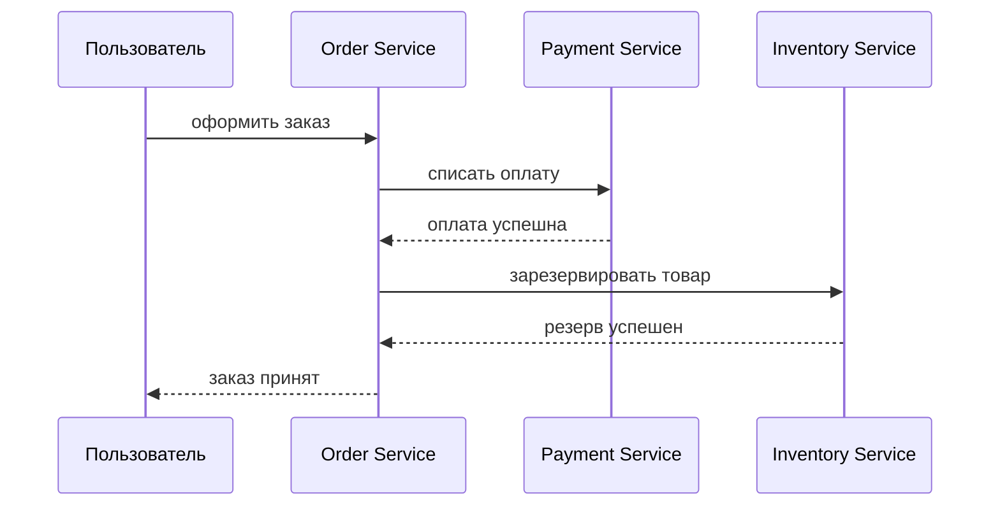

Но эта диаграмма скрывает главное: каждый прямоугольник - отдельный процесс, отдельная база данных и отдельная точка
отказа. В реальной системе любое сообщение на стрелке может прийти позже, прийти дважды, не прийти совсем или прийти
после того, как отправитель уже откатил свою локальную транзакцию.

## Worked example: заказ сохранен, событие потеряно

### Ситуация

`Order Service` создает заказ в своей базе и должен сообщить остальным сервисам, что заказ появился. Локальная запись
прошла успешно, но публикация `OrderCreated` в broker упала по timeout.

### Наивное решение

Сначала записать заказ, потом сразу вызвать broker API. Если broker недоступен, вернуть ошибку пользователю или
попробовать повторить в памяти процесса.

### Что ломается

Если процесс упал после `commit`, но до публикации, заказ остается в базе без события. Если повторить весь request,
можно создать дубль. Если вернуть ошибку пользователю после успешной записи, пользователь повторит операцию, хотя часть
системы уже изменилась.

### Улучшение

Записывать заказ и outbox-запись в одной локальной транзакции. Отдельный relay читает outbox и публикует событие
повторяемо. Consumers защищаются Inbox/idempotency, потому что outbox обычно дает at-least-once delivery.

### Почему это работает

Outbox не возвращает глобальный ACID. Он честно ограничивает атомарность локальной базой и делает публикацию события
восстанавливаемой после падения процесса.

## Архитектуры и транзакционные границы

В монолите, модульном монолите и микросервисах меняется не только способ деплоя. Меняется граница, внутри которой можно
надежно сказать: "либо применилось все, либо не применилось ничего".

| Архитектура | Процесс | База данных | Транзакционная граница | Риск рассогласования | Эксплуатационная сложность |
|-------------|---------|-------------|-------------------------|----------------------|----------------------------|
| Монолит | Один процесс | Обычно одна БД | Одна транзакция БД | Низкий | Низкая |
| Модульный монолит | Один процесс, несколько модулей | Обычно одна БД | Чаще всего одна транзакция БД | Низкий или средний, если модули используют разные хранилища | Средняя |
| Микросервисы | Несколько процессов | БД на сервис | Локальная транзакция внутри одного сервиса | Высокий | Высокая |

Микросервисы дают независимое масштабирование, независимые релизы и отдельные границы владения. Цена - потеря простой
глобальной транзакции. Если операция затрагивает несколько сервисов, ее корректность уже нельзя целиком переложить на
СУБД.

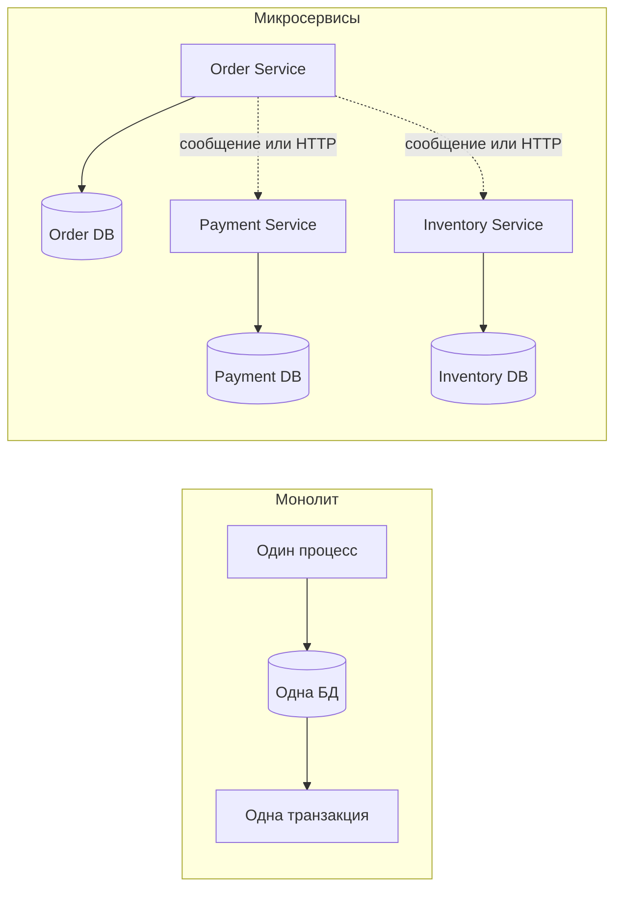

## ACID и CAP

ACID - это свойства транзакционной системы:

- **Atomicity** - операция применяется целиком или не применяется совсем;
- **Consistency** - после транзакции данные остаются в допустимом состоянии;
- **Isolation** - параллельные транзакции не должны видеть опасные промежуточные эффекты друг друга;
- **Durability** - зафиксированное изменение не теряется после сбоя.

Внутри одного сервиса эти свойства обычно обеспечивает база данных. Например, `Order Service` может в одной транзакции
создать заказ и записать строку в таблицу `outbox`. Но база `Order Service` не может атомарно закоммитить изменения в
базе `Payment Service`, если это отдельное хранилище.

CAP относится к распределенным системам и становится особенно важной при сетевом разделении. Если часть узлов перестала
видеть другую часть, система должна выбрать поведение:

- **Consistency** - не отдавать ответ, пока нельзя гарантировать согласованное состояние;
- **Availability** - продолжать отвечать, даже если ответ может быть основан на неполной информации;
- **Partition tolerance** - переживать сам факт сетевого разделения.

::: warning Важное уточнение
CAP не означает, что архитекторы один раз выбирают любые две буквы и забывают о третьей. Практический вопрос точнее:
"что делает конкретная операция, когда сеть разделилась?" Для оплаты, бронирования и чтения каталога ответы могут быть
разными.
:::

| Свойство ACID | В одной БД | В цепочке микросервисов | Чем обычно приближают |
|---------------|------------|--------------------------|-----------------------|
| Atomicity | Сильная гарантия `commit/rollback` | Нет автоматической глобальной гарантии | Saga, компенсации, 2PC в специальных случаях |
| Consistency | Проверяется ограничениями и транзакцией | Обычно eventual consistency | События, ретраи, outbox, проверки инвариантов |
| Isolation | Настраивается уровнем изоляции БД | Нарушается между параллельными процессами | Резервы, блокировки, версии, проектирование false negative |
| Durability | Журнал БД и commit | Только внутри каждого участника | Локальные транзакции, outbox, журнал Saga |

## Модели согласованности

Представьте: пользователь оформил заказ, обновил страницу — а заказа нет. Через 3 секунды он появляется. Баг? Нет,
если система работает на eventual consistency и пользователь попал на реплику, которая ещё не получила событие.
Согласованность — это не одно свойство, а семейство моделей, и выбор модели определяет, какие «странности» пользователь
может увидеть.

| Модель | Что означает | Пример |
|--------|--------------|--------|
| Strong consistency | После записи все читатели сразу видят новое значение | Оплата списана, и любой запрос состояния заказа сразу видит `Paid` |
| Eventual consistency | Если новые изменения прекратятся, все участники со временем придут к одному состоянию | Заказ создан сейчас, оплата появится через событие через несколько секунд |
| Causal consistency | Причинно связанные события видны в правильном порядке | Нельзя увидеть `PaymentCaptured`, не увидев связанный `OrderCreated` |
| Read-your-writes | Пользователь после своей записи видит свой результат | Пользователь оформил заказ и на странице статуса видит именно свой новый заказ |

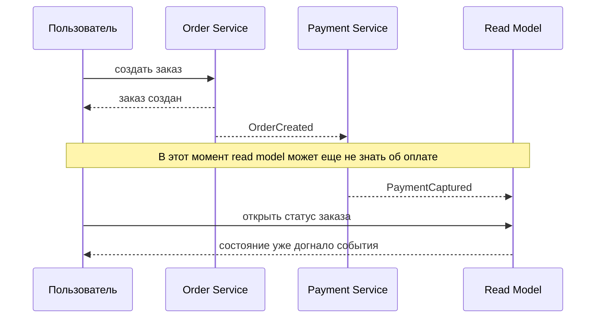

В микросервисах чаще всего приходится жить с eventual consistency. Это не ошибка сама по себе. Ошибка - притворяться,
что eventual consistency ведет себя как strong consistency.

## Где ломается межсервисное взаимодействие

Распределенная система ломается не только когда сервис "упал". Часто ломается промежуток между двумя правильными
локальными действиями.

| Сценарий | Что произошло | Чем опасно | Что применять |
|----------|---------------|------------|---------------|
| Заказ сохранен, событие не отправлено | `Order DB` получила `commit`, брокер недоступен | Оплата никогда не начнется | Transaction Outbox |
| Событие отправлено, локальная транзакция откатилась | Сообщение ушло раньше `commit` | Деньги списаны за несуществующий заказ | Публиковать событие только после локальной фиксации через Outbox |
| Сообщение доставлено дважды | Повтор, retry, потеря ack | Двойное списание | Idempotency, Inbox, deduplication |
| Ответ потерялся | Payment списал деньги, но ответ не дошел до Order | Отправитель не знает, повторять ли операцию | Idempotency key, запрос статуса, retry с тем же ключом |
| Downstream недоступен | Payment или Inventory не отвечает | Поток зависает или накапливает ошибки | Timeout, retry с backoff, circuit breaker |
| Два пользователя конкурируют за ресурс | Оба хотят последний товар или автомобиль | Ложное обещание ресурса | Резервирование, версии, false negative стратегия |

Код, в котором двойная запись прячется за невинной последовательностью вызовов:

::: multi-code "Dual write: save → publish — точка отказа между ними" {default=kotlin}

```kotlin
fun createOrder(order: Order) {
    db.save(order)           // commit прошёл
    broker.publish("OrderCreated", order.id)  // broker timeout → событие потеряно
}
```

```csharp
public void CreateOrder(Order order)
{
    _db.Save(order);           // commit прошёл
    _broker.Publish("OrderCreated", order.Id);  // broker timeout → событие потеряно
}
```

```java
void createOrder(Order order) {
    db.save(order);           // commit прошёл
    broker.publish("OrderCreated", order.id()); // broker timeout → событие потеряно
}
```

```go
func (s *OrderService) CreateOrder(order Order) error {
    s.db.Save(order)           // commit прошёл
    return s.broker.Publish("OrderCreated", order.ID) // broker timeout → событие потеряно
}
```

:::

Решение — Transaction Outbox: запись заказа и outbox-события в одной локальной транзакции (см. [раздел ниже](#transaction-outbox)).

Пример опасной двойной записи на диаграмме:

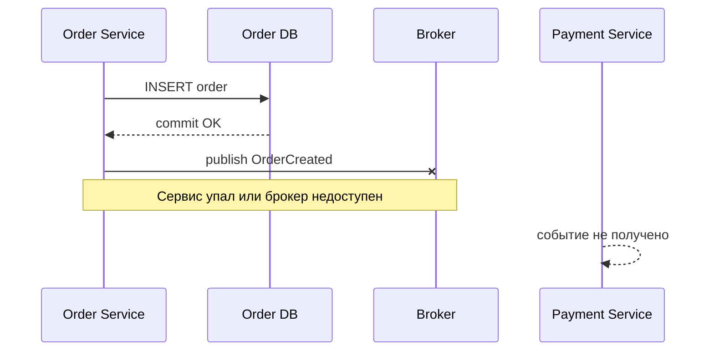

Пример еще хуже: событие ушло до того, как локальная транзакция действительно зафиксировалась.

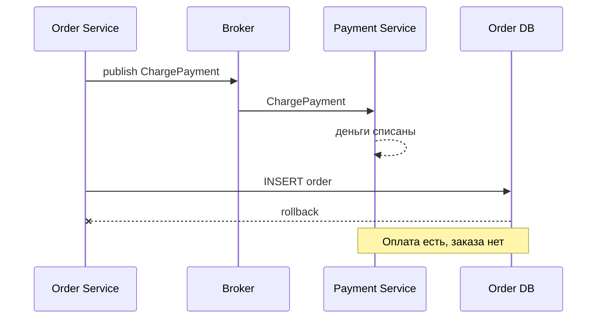

Карта решений:

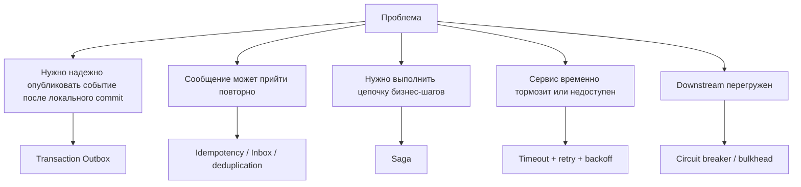

Timeout, retry, circuit breaker и bulkhead важны, но в этой лекции они идут как поддерживающие техники. Они помогают
пережить временную недоступность, но сами не решают проблему согласованности данных.

## Синхронный вызов или брокер

До выбора конкретного паттерна нужно решить, как сервисы вообще общаются. Синхронный HTTP/gRPC-вызов и асинхронное
сообщение через брокер решают разные задачи.

| Критерий | Синхронный вызов | Сообщение через брокер |
|----------|------------------|------------------------|
| Ответ пользователю | Можно сразу вернуть результат downstream-сервиса | Чаще возвращается промежуточный статус |
| Связность | Отправитель зависит от доступности получателя прямо сейчас | Получатель может обработать событие позже |
| Отказы | Нужны timeout, retry, circuit breaker | Нужны outbox, idempotency, DLQ, мониторинг lag |
| Подходит для | Быстрых запросов и чтения текущего состояния | Событий, фоновых процессов и eventual consistency |
| Главный риск | Каскадная задержка или падение цепочки | Дубли, отставание, сложнее отлаживать порядок событий |

Правило грубое, но полезное: если пользователю действительно нужен немедленный ответ от другого сервиса, синхронный
вызов может быть уместен. Если нужно надежно сообщить о факте и можно обработать его позже, лучше подходит событие через
брокер. При этом оба варианта требуют идемпотентности: HTTP-запрос тоже могут повторить после таймаута, хотя первое
выполнение уже успело изменить состояние.

## Гарантии доставки сообщений

Когда сервисы общаются через брокер, важно различать гарантию доставки и гарантию бизнес-эффекта.

| Гарантия | Что обещает | Что не обещает | Что должен сделать потребитель |
|----------|-------------|----------------|--------------------------------|
| `at most once` | Сообщение будет обработано ноль или один раз | Что оно вообще дойдет | Смириться с потерей или не использовать для важных команд |
| `at least once` | Сообщение будет доставлено хотя бы один раз | Что дублей не будет | Сделать обработку идемпотентной |
| `exactly once` | В ограниченном контексте платформа может убрать часть дублей | Сквозную бизнес-гарантию для всех БД, API и побочных эффектов | Все равно проектировать идемпотентные операции |

`at least once` - практический стандарт для важных событий. Но он сразу приводит к требованию: потребитель обязан
переживать повторную доставку.

::: warning Exactly once
Фраза "exactly once" опасна без контекста. У конкретного брокера или стриминговой платформы могут быть транзакционные
механизмы, но они не делают автоматически идемпотентными внешние API, платежные шлюзы, email-рассылки и записи в чужие
базы данных.
:::

## Идемпотентность

Идемпотентная операция может быть выполнена несколько раз с тем же ключом, но бизнес-эффект будет как от одного
выполнения. Для платежа это значит: повтор сообщения с тем же `idempotencyKey` не должен списать деньги второй раз.

Дедупликация сообщения и идемпотентность близки, но это не одно и то же:

- дедупликация говорит "этот `messageId` уже видели";
- идемпотентность говорит "эта бизнес-операция с этим `idempotencyKey` уже применена".

На практике часто нужны оба ключа: `messageId` для транспорта и `idempotencyKey` для бизнес-действия.

| Ситуация | Что может совпасть | Что проверять |
|---|---|---|
| Брокер доставил одно и то же сообщение повторно | `messageId` | Таблица/хранилище обработанных сообщений |
| Клиент повторил команду после timeout | `idempotencyKey` | Бизнес-операция уже применена или находится в процессе |
| Сообщение переупаковали и отправили заново | `messageId` может измениться | `idempotencyKey` должен остаться тем же |
| Разные платежи одного заказа | `orderId` совпадает | У каждого списания должен быть свой ключ операции |

::: only kotlin
В учебном примере ключи лежат в `mutableSet`, но в реальной системе это должна быть устойчивая запись в БД или
специализированном хранилище. Иначе рестарт процесса забудет, что операция уже была применена.
:::

::: only csharp
В C# такую проверку часто оформляют вокруг handler-а: транзакция читает/пишет запись idempotency, вызывает доменную
операцию и фиксирует результат. Простая in-memory коллекция годится только для демонстрации.
:::

::: only java
В Java/Spring важно не прятать идемпотентность в listener-е как случайный `Set`. Обычно нужен repository/table с
уникальным индексом по ключу операции, чтобы параллельные consumer-ы не применили эффект дважды.
:::

::: only go
В Go consumer часто проще устроен явно: handler получает команду, открывает транзакцию, проверяет ключ и только потом
делает side effect. Главное - не держать дедупликацию только в памяти goroutine.
:::

::: multi-code "Idempotent consumer: оплата списывается один раз" {default=kotlin}

```kotlin
data class PaymentCommand(
    val messageId: String,
    val idempotencyKey: String,
    val orderId: String,
    val amount: Int
)

class PaymentConsumer {
    private val processedKeys = mutableSetOf<String>()
    private val charges = mutableListOf<String>()

    fun handle(command: PaymentCommand) {
        if (!processedKeys.add(command.idempotencyKey)) return
        charges += "charged ${command.amount} for ${command.orderId}"
    }
}
```

```kotlin playground
data class PaymentCommand(
    val messageId: String,
    val idempotencyKey: String,
    val orderId: String,
    val amount: Int
)

class PaymentConsumer {
    private val processedKeys = mutableSetOf<String>()
    private val charges = mutableListOf<String>()

    fun handle(command: PaymentCommand) {
        if (!processedKeys.add(command.idempotencyKey)) {
            println("duplicate ignored: ${command.idempotencyKey}")
            return
        }

        charges += "charged ${command.amount} for ${command.orderId}"
        println("payment captured: ${command.amount}")
    }

    fun report(): List<String> = charges.toList()
}

fun main() {
    val consumer = PaymentConsumer()
    val first = PaymentCommand("msg-1", "pay-order-42", "order-42", 300)
    val duplicate = first.copy(messageId = "msg-2")

    consumer.handle(first)
    consumer.handle(duplicate)

    println("charges: ${consumer.report()}")
}
```

```csharp
public sealed record PaymentCommand(
    string MessageId,
    string IdempotencyKey,
    string OrderId,
    int Amount
);

public sealed class PaymentConsumer
{
    private readonly HashSet<string> _processedKeys = new();
    private readonly List<string> _charges = new();

    public void Handle(PaymentCommand command)
    {
        if (!_processedKeys.Add(command.IdempotencyKey))
            return;

        _charges.Add($"charged {command.Amount} for {command.OrderId}");
    }
}
```

```java
import java.util.ArrayList;
import java.util.HashSet;
import java.util.List;
import java.util.Set;

record PaymentCommand(
    String messageId,
    String idempotencyKey,
    String orderId,
    int amount
) {}

final class PaymentConsumer {
    private final Set<String> processedKeys = new HashSet<>();
    private final List<String> charges = new ArrayList<>();

    void handle(PaymentCommand command) {
        if (!processedKeys.add(command.idempotencyKey())) {
            return;
        }

        charges.add("charged " + command.amount() + " for " + command.orderId());
    }
}
```

```go
package main

import "fmt"

type PaymentCommand struct {
    MessageID      string
    IdempotencyKey string
    OrderID        string
    Amount         int
}

type PaymentConsumer struct {
    processedKeys map[string]bool
    charges       []string
}

func NewPaymentConsumer() *PaymentConsumer {
    return &PaymentConsumer{processedKeys: map[string]bool{}}
}

func (c *PaymentConsumer) Handle(command PaymentCommand) {
    if c.processedKeys[command.IdempotencyKey] {
        return
    }
    c.processedKeys[command.IdempotencyKey] = true
    c.charges = append(c.charges, fmt.Sprintf("charged %d for %s", command.Amount, command.OrderID))
}
```

:::

В реальной системе множество `processedKeys` должно быть не in-memory, а в надежном хранилище с уникальным индексом.
Иначе после рестарта сервис забудет, какие операции уже применял.

## Transaction Outbox

Проблема двойной записи возникает, когда одна бизнес-операция требует двух независимых действий:

1. сохранить данные в своей БД;
2. отправить событие в брокер.

Между этими действиями сервис может упасть. Transaction Outbox решает это так: бизнес-данные и исходящее сообщение
записываются в одной локальной транзакции одной БД. Отдельный ретранслятор позже прочитает outbox и отправит сообщение в
брокер.

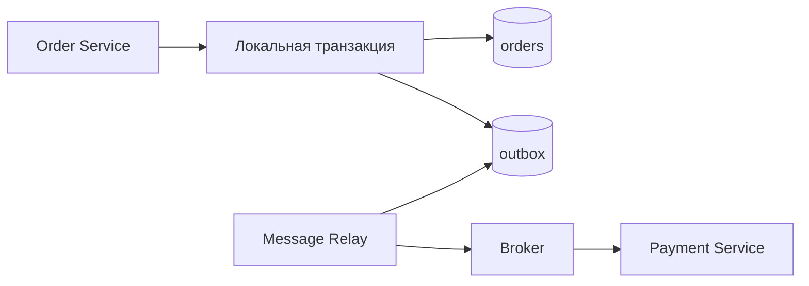

Типичная outbox-запись:

| Поле | Зачем нужно |
|------|-------------|
| `id` | Уникальный идентификатор сообщения |
| `aggregateId` | ID сущности, например заказа |
| `type` | Тип события: `OrderCreated`, `PaymentRequested` |
| `payload` | Данные события |
| `createdAt` | Когда событие записали |
| `publishedAt` | Когда ретранслятор отправил событие |
| `attempts` | Сколько раз пытались отправить |

::: multi-code "Transaction Outbox: заказ и событие в одной локальной транзакции" {default=kotlin}

```kotlin
data class Order(val id: String, val amount: Int)
data class OutboxMessage(
    val id: String,
    val aggregateId: String,
    val type: String,
    val payload: String
)

class OrderRepository {
    val orders = mutableListOf<Order>()
    val outbox = mutableListOf<OutboxMessage>()

    fun createOrder(order: Order) = transaction {
        orders += order
        outbox += OutboxMessage(
            id = "msg-${order.id}",
            aggregateId = order.id,
            type = "OrderCreated",
            payload = "amount=${order.amount}"
        )
    }

    private fun transaction(block: () -> Unit) = block()
}
```

```kotlin playground
data class Order(val id: String, val amount: Int)
data class OutboxMessage(
    val id: String,
    val aggregateId: String,
    val type: String,
    val payload: String,
    var published: Boolean = false
)

class OrderRepository {
    val orders = mutableListOf<Order>()
    val outbox = mutableListOf<OutboxMessage>()

    fun createOrder(order: Order) = transaction {
        orders += order
        outbox += OutboxMessage(
            id = "msg-${order.id}",
            aggregateId = order.id,
            type = "OrderCreated",
            payload = "amount=${order.amount}"
        )
    }

    private fun transaction(block: () -> Unit) {
        block()
    }
}

class Relay(private val repository: OrderRepository) {
    fun publishPending() {
        repository.outbox
            .filterNot { it.published }
            .forEach { message ->
                println("published ${message.type} for ${message.aggregateId}")
                message.published = true
            }
    }
}

fun main() {
    val repository = OrderRepository()
    repository.createOrder(Order("order-42", 300))

    println("orders: ${repository.orders}")
    println("outbox before relay: ${repository.outbox}")

    Relay(repository).publishPending()
    println("outbox after relay: ${repository.outbox}")
}
```

```csharp
public sealed record Order(string Id, int Amount);

public sealed record OutboxMessage(
    string Id,
    string AggregateId,
    string Type,
    string Payload
);

public sealed class OrderRepository
{
    public List<Order> Orders { get; } = new();
    public List<OutboxMessage> Outbox { get; } = new();

    public void CreateOrder(Order order) => Transaction(() =>
    {
        Orders.Add(order);
        Outbox.Add(new OutboxMessage(
            $"msg-{order.Id}",
            order.Id,
            "OrderCreated",
            $"amount={order.Amount}"
        ));
    });

    private static void Transaction(Action block) => block();
}
```

```java
import java.util.ArrayList;
import java.util.List;

record Order(String id, int amount) {}

record OutboxMessage(
    String id,
    String aggregateId,
    String type,
    String payload
) {}

final class OrderRepository {
    final List<Order> orders = new ArrayList<>();
    final List<OutboxMessage> outbox = new ArrayList<>();

    void createOrder(Order order) {
        transaction(() -> {
            orders.add(order);
            outbox.add(new OutboxMessage(
                "msg-" + order.id(),
                order.id(),
                "OrderCreated",
                "amount=" + order.amount()
            ));
        });
    }

    private void transaction(Runnable block) {
        block.run();
    }
}
```

```go
package main

import "fmt"

type Order struct {
    ID     string
    Amount int
}

type OutboxMessage struct {
    ID          string
    AggregateID string
    Type        string
    Payload     string
}

type OrderRepository struct {
    Orders []Order
    Outbox []OutboxMessage
}

func (r *OrderRepository) CreateOrder(order Order) {
    transaction(func() {
        r.Orders = append(r.Orders, order)
        r.Outbox = append(r.Outbox, OutboxMessage{
            ID:          "msg-" + order.ID,
            AggregateID: order.ID,
            Type:        "OrderCreated",
            Payload:     fmt.Sprintf("amount=%d", order.Amount),
        })
    })
}

func transaction(block func()) {
    block()
}
```

:::

Outbox не делает распределенную транзакцию. Он решает более узкую, но критичную задачу: если локальная транзакция
зафиксировалась, событие о ней не исчезнет бесследно. При этом ретранслятор может отправить сообщение повторно, поэтому
потребитель все равно должен быть идемпотентным.

## Ретранслятор сообщений

Полный поток: приложение пишет в outbox внутри транзакции → relay забирает → публикует в broker → помечает как
отправленное:

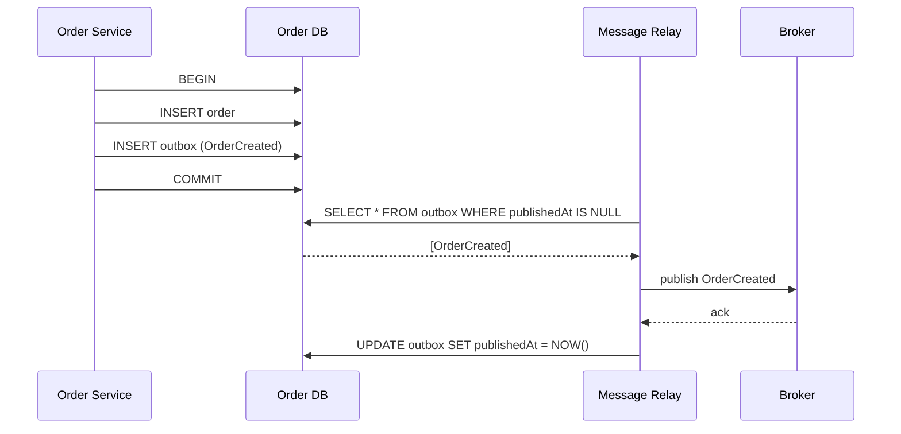

Ретранслятор читает outbox и публикует сообщения в брокер. Есть два распространенных подхода.

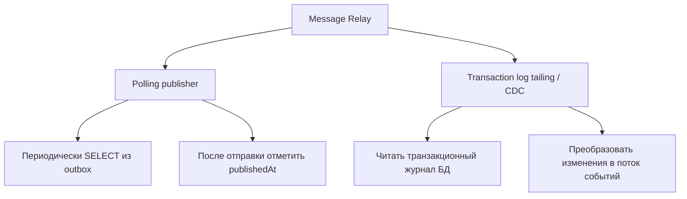

| Подход | Простота | Задержка | Нагрузка на БД | Требования к БД | Эксплуатационная сложность |
|--------|----------|----------|----------------|-----------------|----------------------------|
| Polling publisher | Высокая | Зависит от интервала опроса | Может быть заметной при частом polling | Нужна обычная таблица outbox | Низкая или средняя |
| Transaction log tailing / CDC | Ниже | Обычно меньше | Меньше лишних запросов к outbox | БД должна отдавать журнал изменений | Средняя или высокая |

CDC-подход часто строят через связку вроде Debezium + Kafka + PostgreSQL/MySQL. Это хороший промышленный вариант, но
для понимания паттерна важнее не конкретный инструмент, а сама идея: событие появляется из того же транзакционного
журнала, который подтверждает изменение данных.

::: details Что делать с уже опубликованными outbox-сообщениями
Обычно их не удаляют сразу после публикации. Более практично ставить `publishedAt`, хранить количество попыток,
последнюю ошибку и периодически архивировать старые записи. Это помогает расследовать инциденты и безопасно повторять
публикацию.
:::

## Transaction Inbox

Transaction Inbox - парный паттерн для потребителя. Если Outbox хранит исходящие сообщения, Inbox хранит уже принятые
сообщения или ключи бизнес-операций.

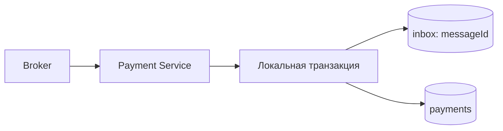

Идея простая:

1. потребитель получает сообщение;
2. в локальной транзакции проверяет, есть ли `messageId` или `idempotencyKey` в inbox;
3. если нет - выполняет бизнес-действие и записывает ключ;
4. если есть - подтверждает сообщение без повторного бизнес-действия.

Inbox не заменяет идемпотентность доменной операции, но дает удобное место для дедупликации.

## Распределенные транзакции и 2PC

Saga отказывается от глобальной атомарности ради автономности сервисов. Но иногда бизнес требует более строгой
согласованности — например, когда оба участника ДОЛЖНЫ закоммитить одновременно или не закоммитить вовсе. Two-phase
commit пытается приблизить распределенную операцию к обычной транзакции. Появляется координатор, который разговаривает
с участниками в две фазы.

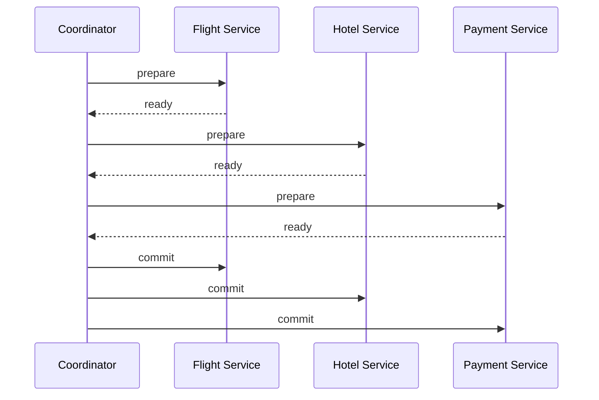

Плюсы 2PC:

- модель понятна;
- координатор явно знает всех участников;
- можно получить поведение ближе к атомарности и изоляции.

Минусы:

- координатор становится критичным компонентом процесса;
- участники держат блокировки между `prepare` и `commit`;
- вся операция ждет самого медленного участника;
- участники должны поддерживать совместимый протокол;
- плохо подходит для независимых высоконагруженных микросервисов и внешних API.

Главная опасность — координатор отказал между `prepare` и `commit`. Участники уже ответили `ready` и держат
блокировки, но команды `commit` не было:

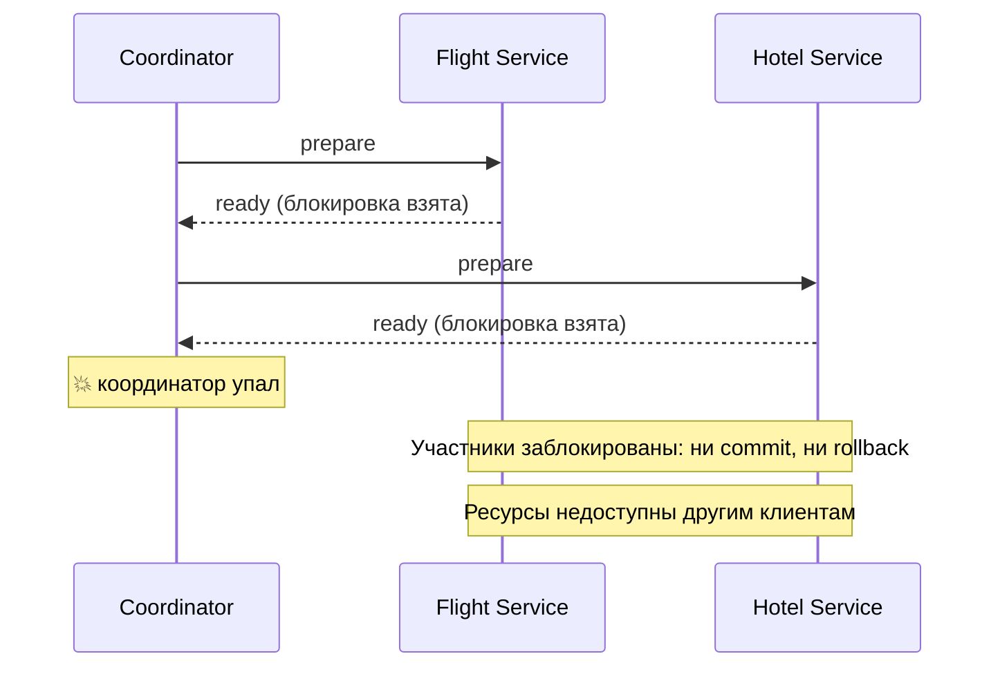

2PC нужно знать, потому что это важная точка сравнения. Но в типичных микросервисных бизнес-процессах чаще выбирают
Saga: она слабее по гарантиям изоляции, зато лучше соответствует автономным сервисам.

## Saga

Пользователь бронирует отпуск: рейс Москва→Стамбул, отель на 5 ночей, автомобиль на месте. Три сервиса, три
локальные транзакции. Рейс подтверждён, отель подтверждён, а автомобилей на эти даты не осталось. Что делать
с рейсом и отелем? Откатить. Но это не `ROLLBACK` — каждый сервис уже закоммитил своё в свою базу.

Saga — это цепочка локальных транзакций. Каждый шаг делает свое действие в своем сервисе. Если следующий шаг не удался,
уже выполненные шаги отменяются компенсационными операциями.

Компенсация — не `rollback` базы данных. Это новая бизнес-операция: отменить бронь, вернуть деньги, освободить резерв.
Она тоже может упасть, поэтому для Saga нужны retries, журнал состояния и наблюдаемость.

| Шаг | Локальная транзакция | Компенсация |
|-----|----------------------|-------------|
| 1 | `BookFlight` | `CancelFlight` |
| 2 | `BookHotel` | `CancelHotel` |
| 3 | `ReserveCar` | `ReleaseCar` |
| 4 | `ChargePayment` | `RefundPayment` |

::: multi-code "Saga with compensation" {default=kotlin}

```kotlin
class SagaStep(
    val name: String,
    val execute: () -> Unit,
    val compensate: () -> Unit
)

fun runSaga(steps: List<SagaStep>) {
    val completed = mutableListOf<SagaStep>()

    try {
        for (step in steps) {
            step.execute()
            completed += step
        }
    } catch (error: RuntimeException) {
        completed.asReversed().forEach { it.compensate() }
        throw error
    }
}
```

```kotlin playground
class SagaStep(
    val name: String,
    val execute: () -> Unit,
    val compensate: () -> Unit
)

fun runSaga(steps: List<SagaStep>) {
    val completed = mutableListOf<SagaStep>()

    try {
        for (step in steps) {
            println("execute ${step.name}")
            step.execute()
            completed += step
        }
        println("saga completed")
    } catch (error: RuntimeException) {
        println("failed: ${error.message}")
        completed.asReversed().forEach { step ->
            println("compensate ${step.name}")
            step.compensate()
        }
    }
}

fun main() {
    val successful = listOf(
        SagaStep("BookFlight", execute = {}, compensate = { println("CancelFlight") }),
        SagaStep("BookHotel", execute = {}, compensate = { println("CancelHotel") }),
        SagaStep("ReserveCar", execute = {}, compensate = { println("ReleaseCar") })
    )

    val failed = listOf(
        SagaStep("BookFlight", execute = {}, compensate = { println("CancelFlight") }),
        SagaStep("BookHotel", execute = { error("no rooms") }, compensate = { println("CancelHotel") }),
        SagaStep("ReserveCar", execute = {}, compensate = { println("ReleaseCar") })
    )

    println("success case")
    runSaga(successful)

    println()
    println("failure case")
    runSaga(failed)
}
```

```csharp
public sealed record SagaStep(
    string Name,
    Action Execute,
    Action Compensate
);

public static void RunSaga(IEnumerable<SagaStep> steps)
{
    var completed = new Stack<SagaStep>();

    try
    {
        foreach (var step in steps)
        {
            step.Execute();
            completed.Push(step);
        }
    }
    catch
    {
        while (completed.TryPop(out var step))
            step.Compensate();

        throw;
    }
}
```

```java
import java.util.ArrayDeque;
import java.util.List;

record SagaStep(String name, Runnable execute, Runnable compensate) {}

final class SagaRunner {
    static void runSaga(List<SagaStep> steps) {
        var completed = new ArrayDeque<SagaStep>();

        try {
            for (var step : steps) {
                step.execute().run();
                completed.push(step);
            }
        } catch (RuntimeException error) {
            while (!completed.isEmpty()) {
                completed.pop().compensate().run();
            }
            throw error;
        }
    }
}
```

```go
package main

type SagaStep struct {
    Name       string
    Execute    func() error
    Compensate func()
}

func RunSaga(steps []SagaStep) error {
    completed := []SagaStep{}

    for _, step := range steps {
        if err := step.Execute(); err != nil {
            for i := len(completed) - 1; i >= 0; i-- {
                completed[i].Compensate()
            }
            return err
        }
        completed = append(completed, step)
    }

    return nil
}
```

:::

Учебный пример выше показывает идею, но промышленная Saga не должна жить только в памяти процесса. Ей нужен устойчивый
журнал: `sagaId`, текущий шаг, выполненные шаги, попытки, последняя ошибка, дедлайны и состояние компенсаций.

## Choreography и Orchestration

Saga бывает двух основных видов.

**Choreography**: сервисы публикуют события и сами реагируют на события соседей. Центрального управляющего процесса нет.

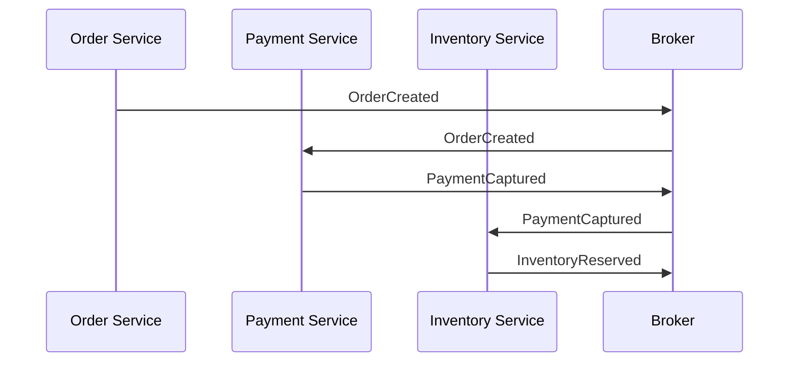

**Orchestration**: отдельный orchestrator хранит состояние процесса и явно вызывает следующий шаг.

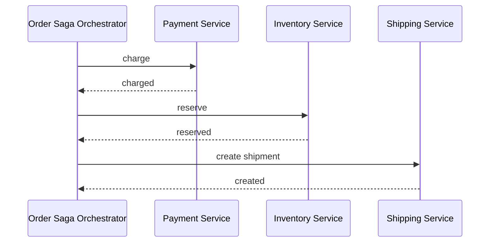

| Критерий | Choreography | Orchestration |
|----------|--------------|---------------|
| Где логика процесса | Размазана по участникам | В отдельном orchestrator |
| Связность | Через события | Через команды orchestrator |
| Наблюдаемость всего процесса | Сложнее | Проще |
| Изменение порядка шагов | Требует правок нескольких сервисов | Чаще правится в orchestrator |
| Когда выбирать | Короткий стабильный процесс | Длинный или часто меняющийся процесс |

Если бизнес-процесс уже стабилен и шагов мало, choreography может быть естественной. Если шагов много, правила часто
меняются или нужна хорошая операционная видимость, orchestration обычно практичнее.

Упрощённый orchestrator хранит журнал и умеет продолжить или откатить процесс после рестарта:

::: multi-code "Saga Orchestrator с журналом состояния" {default=kotlin}

```kotlin
enum class StepStatus { PENDING, DONE, COMPENSATED }

data class SagaLog(val sagaId: String, val steps: MutableList<StepEntry>)
data class StepEntry(val name: String, var status: StepStatus = StepStatus.PENDING)

class SagaOrchestrator(
    private val sagaId: String,
    private val steps: List<SagaStep>
) {
    private val log = SagaLog(sagaId, steps.map { StepEntry(it.name) }.toMutableList())

    fun run(): Result<Unit> = runCatching {
        for ((i, step) in steps.withIndex()) {
            step.execute()
            log.steps[i].status = StepStatus.DONE
        }
    }.onFailure { compensate() }

    private fun compensate() {
        log.steps.filter { it.status == StepStatus.DONE }
            .reversed()
            .forEachIndexed { i, entry ->
                steps.first { it.name == entry.name }.compensate()
                entry.status = StepStatus.COMPENSATED
            }
    }
}
```

```csharp
public sealed class SagaOrchestrator
{
    private readonly string _sagaId;
    private readonly List<(SagaStep Step, string Status)> _log = new();

    public SagaOrchestrator(string sagaId, IEnumerable<SagaStep> steps)
    {
        _sagaId = sagaId;
        _log.AddRange(steps.Select(s => (s, "pending")));
    }

    public void Run()
    {
        try
        {
            for (var i = 0; i < _log.Count; i++)
            {
                _log[i].Step.Execute();
                _log[i] = (_log[i].Step, "done");
            }
        }
        catch { Compensate(); throw; }
    }

    private void Compensate()
    {
        foreach (var entry in _log.Where(e => e.Status == "done").Reverse())
            entry.Step.Compensate();
    }
}
```

```go
type stepStatus int
const (
    pending stepStatus = iota
    done
    compensated
)

type sagaEntry struct {
    Step   SagaStep
    Status stepStatus
}

func RunOrchestrated(sagaID string, steps []SagaStep) error {
    log := make([]sagaEntry, len(steps))
    for i, s := range steps {
        log[i] = sagaEntry{Step: s, Status: pending}
    }

    for i := range log {
        if err := log[i].Step.Execute(); err != nil {
            for j := i - 1; j >= 0; j-- {
                if log[j].Status == done {
                    log[j].Step.Compensate()
                    log[j].Status = compensated
                }
            }
            return err
        }
        log[i].Status = done
    }
    return nil
}
```

:::

## Saga и ACID

Saga не возвращает полноценный ACID на всю распределенную операцию. Она дает другой набор гарантий.

| Свойство | Что происходит в Saga |
|----------|-----------------------|
| Atomicity | Достигается бизнес-компенсациями, но не мгновенно и не бесплатно |
| Consistency | Обычно eventual: система приходит к допустимому состоянию после всех шагов или компенсаций |
| Isolation | Не гарантируется: параллельные Saga могут видеть промежуточные состояния |
| Durability | Зависит от локальных транзакций, outbox, inbox и устойчивого журнала Saga |

Поэтому формулировка "Saga гарантирует атомарность на 100%" слишком сильная. Точнее так: Saga стремится к
бизнес-атомарности, но для этого компенсации должны быть надежными, повторяемыми и наблюдаемыми.

## Проблема изоляции

Главная слабость Saga - отсутствие Isolation. Две параллельные Saga могут конкурировать за один ресурс и видеть состояния,
которые потом будут компенсированы.

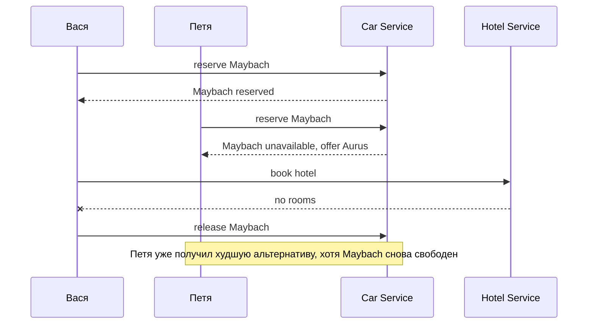

Это false negative: система могла бы дать лучший ресурс, но отказала или предложила худшую альтернативу. Неприятно, но
обычно приемлемо.

Опаснее false positive: система обещала ресурс, которого потом не окажется.

| Тип ошибки | Пример | Почему это важно |
|------------|--------|------------------|
| False negative | Пользователю сказали "Maybach недоступен", хотя позже он освободился | Пользователь может расстроиться, но система не дала ложного обещания |
| False positive | Пользователю подтвердили Maybach, а при получении машины ее нет | Нарушено доверие, нужны возвраты, компенсации и поддержка |

Как паттерны лекции связаны с этими понятиями:

- **Outbox + idempotent consumer** → false negative at worst: событие может задержаться (retry поможет), но не обработается дважды.
- **Saga с компенсацией** → может дать false negative (отмена уже подтверждённого ресурса), но не false positive (ресурс, которого нет).
- **Резервирование с TTL** → false negative (ресурс занят резервом, который скоро истечёт), зато не false positive.

Практическое правило: проектируйте бизнес-сценарий так, чтобы при неопределенности система предпочитала ожидание,
предварительный статус, альтернативу или честный отказ, а не уверенное обещание того, что еще не подтверждено.

::: only go
Go's `if err != nil` делает каждую точку отказа ВИДИМОЙ. В exception-based языках compensation часто теряется в
цепочке `catch`-блоков. В Go компенсационная логика пишется рядом с вызовом и не может быть случайно проглочена:

```go
ticket, err := flightService.Book(req)
if err != nil {
    return fmt.Errorf("flight: %w", err)
}
hotel, err := hotelService.Book(req)
if err != nil {
    flightService.Cancel(ticket.ID) // компенсация видна сразу
    return fmt.Errorf("hotel: %w", err)
}
```
:::

::: only csharp
В C# библиотека **Polly** реализует retry, circuit breaker, timeout, bulkhead и fallback как composable policies:

```csharp
var retryPolicy = Policy
    .Handle<HttpRequestException>()
    .WaitAndRetryAsync(3, attempt => TimeSpan.FromSeconds(Math.Pow(2, attempt)));

var circuitBreaker = Policy
    .Handle<HttpRequestException>()
    .CircuitBreakerAsync(5, TimeSpan.FromSeconds(30));

var combined = Policy.WrapAsync(retryPolicy, circuitBreaker);
var result = await combined.ExecuteAsync(() => httpClient.GetAsync("/api/orders"));
```

Polly v8+ (через `Microsoft.Extensions.Http.Resilience`) интегрируется с `IHttpClientFactory` из коробки.
:::

::: only kotlin
Kotlin `Result` и `runCatching` дают чистую цепочку compensation без вложенных try/catch:

```kotlin
fun bookTrip(req: BookingRequest): Result<Trip> = runCatching {
    val flight = flightService.book(req).getOrThrow()
    val hotel = runCatching { hotelService.book(req) }
        .onFailure { flightService.cancel(flight.id) }
        .getOrThrow()
    Trip(flight, hotel)
}
```

Каждый `onFailure` — точка компенсации. `Result` не прячет ошибку, а делает её значением, с которым можно работать
функционально.
:::

## Практические правила выбора паттерна

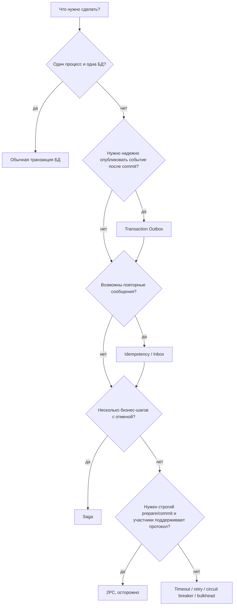

| Симптом | Паттерн | Что остается проверить |
|---------|---------|------------------------|
| Событие может не уйти после локального commit | Transaction Outbox | Как ретранслятор повторяет публикацию и как помечает успех |
| Потребитель может получить дубль | Idempotency, Inbox | Где хранится ключ и есть ли уникальный индекс |
| Нужна цепочка шагов с отменой | Saga | Есть ли компенсация у каждого необратимого шага |
| Нужно ждать внешний сервис | Timeout + retry | Не усилит ли retry нагрузку и есть ли backoff |
| Downstream начинает массово падать | Circuit breaker | Что отвечает сервис в открытом состоянии |
| Один ресурс бронируют параллельно | Резервирование, версии, false negative | Не появится ли false positive для пользователя |

## Наблюдаемость и эксплуатация

Паттерн без наблюдаемости часто превращается в скрытую очередь проблем. Минимальный набор технических маркеров:

- `correlationId` - связывает пользовательский запрос, события и логи;
- `messageId` - идентифицирует конкретное сообщение;
- `idempotencyKey` - идентифицирует бизнес-операцию;
- `sagaId` - идентифицирует экземпляр долгого процесса;
- `attempts` и `lastError` - показывают, что ретраи действительно происходят;
- dead-letter queue - место для сообщений, которые не удалось обработать автоматически;
- алерты на старые outbox-записи и застрявшие Saga steps.

::: warning Операционный долг
Если в системе есть Outbox или Saga, но нет экрана, метрики или хотя бы запроса для поиска застрявших записей, то
команда узнает о проблеме от пользователя. Для финансовых и заказных сценариев это слишком поздно.
:::

## Чеклист проектирования

Перед запуском межсервисного сценария ответьте на вопросы:

- что является локальной транзакцией в каждом сервисе;
- какие события публикуются после успешного `commit`;
- где хранится outbox и кто его читает;
- какой `messageId` используется для дедупликации транспорта;
- какой `idempotencyKey` используется для бизнес-операции;
- что происходит при повторе того же сообщения;
- что происходит при потере ответа от downstream;
- какая компенсация есть у каждого шага Saga;
- какие компенсации необратимы или частично обратимы;
- где хранится состояние Saga;
- что увидит оператор, если процесс застрял;
- какие сценарии должны завершаться false negative, а какие вообще нельзя допускать.

## Резюме

- В монолите согласованность часто держится на одной транзакции БД; в микросервисах такой границы нет.
- ACID надежен внутри локальной транзакции, но не распространяется автоматически на несколько сервисов.
- CAP полезнее понимать как выбор поведения конкретной операции при сетевом разделении.
- Eventual consistency нормальна, если пользовательский сценарий и инварианты спроектированы под нее.
- Transaction Outbox решает проблему надежной публикации события после локального `commit`.
- Outbox не отменяет дубли: потребители должны быть идемпотентными.
- Inbox помогает хранить уже обработанные сообщения и ключи операций.
- 2PC дает более строгую модель, но плохо подходит для многих автономных микросервисных сценариев.
- Saga строит бизнес-атомарность через локальные транзакции и компенсации.
- Saga не дает Isolation, поэтому опасные сценарии нужно сводить к false negative, а не false positive.
- Надежность межсервисного взаимодействия - это не одна библиотека, а набор паттернов, данных и эксплуатационных
  процедур.

После того как система научилась надежно менять состояние, появляется следующий вопрос: как быстро и удобно это состояние
читать. Кэш, projection и CQRS read model разбираются в [Лекции 13](/lectures/13#от-кэша-к-cqrs).

## Дополнительное чтение

Материалы углубляют тему распределенных транзакций, Transactional Outbox и Saga.

### Распределенные транзакции

- [Распределенные транзакции в условиях микросервисной архитектуры](https://www.youtube.com/watch?v=P98oMiVCnq8) — видео, которое легло в основу лекции.
- [Паттерн Outbox](https://habr.com/ru/companies/lamoda/articles/678932/) — статья о надежной публикации событий через outbox.
- [Saga: хореография и оркестрация](https://youtu.be/9vMAr9agz4k?list=PLt91xr-Pp57TN4-UN1F6JqqwhaI1T6E0b) — видео о вариантах организации Saga.

## Вопросы для самопроверки

1. Почему запись в БД и отправка события в брокер не образуют одну атомарную операцию?
2. Как Transaction Outbox меняет порядок действий при создании заказа?
3. Почему `at least once` почти всегда требует идемпотентного потребителя?
4. Чем `messageId` отличается от `idempotencyKey`?
5. Почему Inbox не является полной заменой доменной идемпотентности?
6. В чем различие между 2PC и Saga?
7. Почему компенсация в Saga не равна `rollback`?
8. Когда choreography будет проще orchestration?
9. Почему Saga не гарантирует Isolation?
10. Что хуже для пользователя: false negative или false positive при бронировании ресурса? Почему?

## Мини-практика

Спроектируйте оформление заказа с сервисами `Order`, `Payment` и `Inventory`.

Опишите:

- какие локальные транзакции выполняет каждый сервис;
- какие события попадают в outbox;
- какие `messageId` и `idempotencyKey` нужны;
- где потребители используют Inbox;
- какие компенсации нужны, если оплата прошла, а товара нет;
- что происходит, если сообщение об оплате пришло дважды;
- что происходит, если `Inventory Service` недоступен 30 секунд;
- какой сценарий будет false negative, а какой false positive.
