# Лекция 14. DevOps, SRE и Observability

Заключительная лекция связывает несколько тем, которые обычно оказываются рядом с разработкой: поставка изменений,
эксплуатация, надежность, безопасность и наблюдаемость. Разработчик не обязан быть DevOps-, SRE- или
DevSecOps-инженером, но он обязан понимать, как его код попадает к пользователю и как команда узнает, что с этим кодом
что-то пошло не так.

Материал написан как самостоятельная статья. Если вы пропустили лекцию, начните отсюда: после чтения вы должны понимать
базовый словарь DevOps и Observability, различать смежные роли и видеть, какие инженерные решения нужно закладывать уже
на уровне приложения.

::: tip Главная идея лекции
DevOps снижает стоимость доставки изменений. Observability снижает стоимость понимания проблем в production. Вместе они
помогают команде быстрее выпускать продукт и быстрее разбираться с последствиями реальной эксплуатации.
:::

::: tip Как работать с примерами
Kotlin-примеры, которые можно выполнить, имеют отдельную интерактивную версию для Playground. Статическая вкладка обычно
короче и показывает идею, а Playground содержит `main`, тестовые данные и вывод.
:::

## Сквозной production-сценарий

Соберем весь курс в один путь изменения. Разработчик меняет правило скидки в доменной модели, добавляет тест, обновляет
API-контракт, собирает container image, выкатывает сервис, а после релиза команда видит рост latency в оплатах и
разбирает инцидент по логам, метрикам и трейсам. DevOps, SRE и Observability здесь не отдельная "инфраструктурная
надстройка", а продолжение инженерного дизайна.

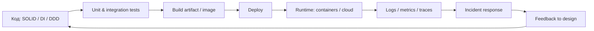

Связи с предыдущими лекциями прямые: DI делает код тестируемым
([Лекция 2](/lectures/02#di-и-тесты)), тесты попадают в pipeline
([Лекция 3](/lectures/03#зачем-разработчику-тестирование)), контейнеры дают воспроизводимый runtime
([Лекция 9](/lectures/09#docker)), API и очереди требуют понятных контрактов
([Лекция 10](/lectures/10#четыре-уровня-обмена), [Лекция 11](/lectures/11#контракт-сообщения)), Saga/Outbox требуют
операторской видимости ([Лекция 12](/lectures/12#наблюдаемость-и-эксплуатация)), а кэш/CQRS должны иметь метрики
([Лекция 13](/lectures/13#метрики-кэша)).

## Worked example: релиз прошел, но заказ перестал оформляться

### Ситуация

Команда выкатила изменение скидки. Unit tests прошли, image собрался, deploy завершился. Через 20 минут поддержка пишет,
что часть заказов зависает на оплате, но серверы "живы".

### Наивное решение

Смотреть только uptime и CPU. Если процесс не упал, считать релиз успешным. Логи писать свободным текстом без
correlation id, метрики держать только системные, trace context не прокидывать во внешний payment call.

### Что ломается

Нельзя быстро понять, проблема в API, payment gateway, очереди, read model или новом правиле скидки. Alert либо молчит,
либо шумит. Rollback страшно делать, потому что непонятно, какие заказы уже изменили состояние.

### Улучшение

Связать pipeline, observability и rollback strategy: тесты проверяют правило, deploy имеет health/readiness, сервис
пишет structured logs с correlation id, метрики показывают checkout latency/error rate, traces показывают путь запроса,
а runbook описывает действия при росте payment latency или DLQ.

### Почему это работает

Production - продолжение дизайна. Если в коде есть DI, API-контракты, брокеры, Saga и read models, у каждого решения
должен быть эксплуатационный сигнал и понятный способ безопасно уменьшить ущерб.

## Цели

После этой статьи вы должны уметь:

- объяснять, зачем появился DevOps и какую проблему он решает;
- отличать DevOps как культуру от DevOps-инженера как роли;
- описывать типовой путь изменения от commit до production;
- понимать CI, CD, pipeline, Infrastructure as Code, контейнеризацию и GitOps;
- различать DevOps, SRE, Platform Engineering, Cloud Engineering, DevSecOps и MLOps;
- объяснять monitoring, observability, logs, metrics, traces, alerts, SLI, SLO, SLA и error budget;
- понимать, какие сигналы должен отдавать сервис, чтобы его можно было сопровождать;
- видеть, где безопасность должна встраиваться в процесс разработки, а не появляться в самом конце.

## Почему старый процесс ломался

Классическая проблема разработки не в том, что люди не хотят работать вместе. Проблема в том, что процесс часто устроен
так, будто команды могут долго работать отдельно, а потом безболезненно соединить результаты. Разработчики пишут код,
эксплуатация узнает о требованиях к окружению перед релизом, безопасность приходит на приемку, бизнес долго не видит
работающий продукт.

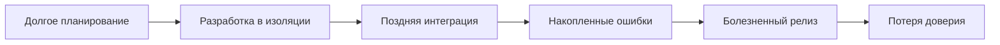

Разрыв проявляется по-разному для разных участников.

| Участник | Что обычно болело | Чего хотелось |
|---|---|---|
| Разработчики | дедлайны, ручные релизы, "у меня работает" | быстро получить feedback и не чинить окружение вручную |
| Эксплуатация | невоспроизводимые серверы, неясные требования, ночные выкладки | описанное окружение и предсказуемый релиз |
| Безопасность | подключение перед сдачей, игнорирование некритичных замечаний | раннее участие и автоматические проверки |
| Бизнес | неизвестные сроки, рост стоимости, поздняя демонстрация результата | частые поставки и понятный риск |

DevOps появился как ответ на этот разрыв. Смысл не в новой должности, а в изменении системы работы: участники процесса
должны раньше видеть проблемы, чаще интегрироваться и автоматизировать повторяемые действия.

## DevOps: культура, практики и роль

DevOps можно рассматривать на трех уровнях:

- культура сотрудничества между разработкой, эксплуатацией, безопасностью и бизнесом;
- набор инженерных практик для сборки, тестирования, поставки и эксплуатации;
- роль DevOps-инженера, который помогает автоматизировать этот путь.

DevOps-инженер не равен "переименованный администратор" и не равен "человек, который чинит все". В хорошей команде он
проектирует и поддерживает механизмы поставки: pipeline, окружения, секреты, инфраструктуру, мониторинг и интеграцию с
облачными или внутренними платформами. Но ответственность за работоспособность продукта не исчезает у разработчиков.

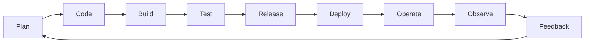

| Практика | Что дает | Типичный результат |
|---|---|---|
| CI | частую интеграцию изменений | сборка и тесты на каждый merge request |
| Continuous Delivery | готовность выпускать в любой момент | релизный артефакт и проверенный staging |
| Continuous Deployment | автоматический выпуск после успешных проверок | production обновляется без ручного gate |
| Infrastructure as Code | воспроизводимое окружение | Terraform, Kubernetes manifests, Helm charts |
| Контейнеризация | одинаковый runtime между средами | OCI image, Dockerfile, image registry |
| Управление конфигурацией | отделение настроек от кода | config maps, environment variables, feature flags |
| Управление секретами | безопасное хранение ключей | Vault, cloud secret manager, sealed secrets |
| Observability | диагностику production | метрики, логи, трейсы, дашборды, алерты |
| Security scanning | раннее обнаружение уязвимостей | SAST, dependency scan, image scan |

## Pipeline от commit до production

Pipeline - это формализованный путь изменения. Он не должен быть набором героических ручных действий. Если команда
каждый раз вспоминает, какие команды запускать перед релизом, процесс еще не стал инженерным.

```mermaid
flowchart LR
    Commit["Commit"] --> Checkout["Checkout"]
    Checkout --> Build["Build"]
    Build --> Unit["Unit tests"]
    Unit --> Static["Static analysis"]
    Static --> Dependencies["Dependency scan"]
    Dependencies --> Package["Package image"]
    Package --> Integration["Integration tests"]
    Integration --> Staging["Deploy to staging"]
    Staging --> Smoke["Smoke tests"]
    Smoke --> Production["Deploy to production"]
```

Пример pipeline ниже намеренно упрощен. Он показывает не синтаксис конкретной CI-системы, а типовую последовательность
этапов.

```yaml
name: service-delivery

on:
  push:
    branches: [main]
  pull_request:

jobs:
  verify:
    steps:
      - checkout
      - run: ./gradlew test
      - run: ./gradlew detekt
      - run: ./tools/scan-dependencies.sh

  package:
    needs: verify
    steps:
      - run: docker build -t registry.example.com/order-service:${COMMIT_SHA} .
      - run: docker push registry.example.com/order-service:${COMMIT_SHA}

  deploy-staging:
    needs: package
    steps:
      - run: ./deploy staging ${COMMIT_SHA}
      - run: ./smoke-tests staging

  deploy-production:
    needs: deploy-staging
    steps:
      - run: ./deploy production ${COMMIT_SHA}
```

::: warning Pipeline не спасает плохой дизайн
Pipeline быстрее показывает проблемы, но не делает архитектуру автоматически хорошей. Если сервис нельзя протестировать,
настроить или откатить без ручных правок, автоматизация только подчеркнет этот долг.
:::

## Контейнеризация

Подробно Docker и container runtime разбирались в [Лекции 9](/lectures/09#docker). Здесь — только контекст для pipeline.

Контейнеризация решает ключевую DevOps-проблему: артефакт, который прошел проверки в pipeline, можно тем же
способом запустить в staging и production.

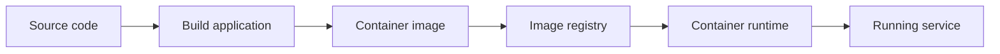

| Понятие | Что означает |
|---|---|
| Image | неизменяемый шаблон с приложением и зависимостями |
| Container | запущенный экземпляр image |
| Registry | хранилище images, из которого окружения забирают артефакты |
| Runtime | среда, которая запускает контейнеры |
| Orchestrator | система, которая управляет множеством контейнеров, например Kubernetes |

Важно не путать контейнер с виртуальной машиной. Контейнер обычно легче и быстрее стартует, но разделяет ядро хоста.
Поэтому безопасность, лимиты ресурсов, сетевые политики и обновление base image остаются инженерной ответственностью.

## Infrastructure as Code и GitOps

Infrastructure as Code означает, что окружение описывается в виде версионируемых файлов. Команда работает не с
воспоминанием "что когда-то настроили на сервере", а с desired state: каким окружение должно быть.

| Подход | Как меняется система | Риск |
|---|---|---|
| Ручная настройка | инженер заходит на сервер и выполняет команды | невозможно уверенно повторить и проверить |
| Скрипты | действия автоматизированы, но часто императивны | легче повторить, но сложнее понять итоговое состояние |
| IaC | описано желаемое состояние | можно review, versioning, rollback и сравнение drift |
| GitOps | Git становится источником истины для окружения | контроллер постоянно сверяет cluster с Git |

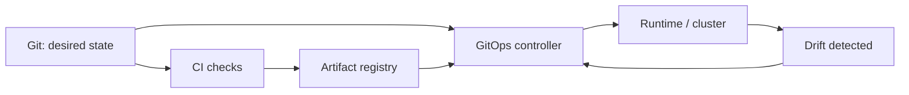

GitOps обычно держится на четырех идеях:

- инфраструктура и приложения описаны декларативно;
- Git является источником правды;
- изменения применяются автоматически через контроллер или агент;
- фактическое состояние постоянно сравнивается с желаемым.

::: details Почему простой deploy-скрипт еще не GitOps
Deploy-скрипт может быть полезен, но он обычно отвечает на вопрос "какие команды выполнить". GitOps отвечает на другой
вопрос: "каким должно быть состояние системы и кто гарантирует, что оно таким остается". Поэтому GitOps-контроллер
важен не только для первого деплоя, но и для обнаружения drift: ручных изменений, сбоев и расхождения конфигураций.
:::

## Смежные роли

DevOps ≠ SRE ≠ Platform Engineer. Границы зависят от компании: в стартапе один человек покрывает всё, в крупной
организации каждая зона — отдельная команда. Для разработчика важно знать, КТО отвечает за конкретную проблему.

::: details Сравнительная таблица ролей

| Роль | Главный фокус | Что автоматизирует | Типичные артефакты | Метрики успеха | Где пересекается с разработчиком |
|---|---|---|---|---|---|
| DevOps Engineer | поставка изменений | build, test, deploy, окружения | pipeline, IaC, images, release flow | deployment frequency, lead time, change failure rate, MTTR | сборка, релиз, конфигурация |
| SRE | надежность production | диагностика, алерты, incident response | SLO, error budget, dashboards, runbooks | availability, latency, error budget burn | метрики, логи, graceful degradation |
| Platform Engineer | внутренняя платформа | self-service для команд | templates, portal, paved road, service catalog | time to first deploy, adoption, developer experience | шаблоны сервисов, runtime-контракты |
| Cloud Engineer | облачная инфраструктура | сети, IAM, managed services | cloud accounts, network policies, storage, compute | cost, reliability, compliance | выбор managed-сервисов и ограничений |
| DevSecOps Engineer | безопасность в delivery | проверки безопасности в pipeline | SAST/SCA/DAST gates, policies, reports | fixed vulnerabilities, policy compliance | зависимости, секреты, threat model |
| MLOps Engineer | жизненный цикл моделей | training, registry, deployment, model monitoring | feature pipeline, model registry, drift reports | model quality, reproducibility, deployment speed | сервисинг модели, API, мониторинг качества |

:::

## SRE и надежность как инженерная дисциплина

CI/CD доставляет код в production. Но КАК мы узнаём, что код РАБОТАЕТ в production? Для этого нужны метрики
надёжности — и именно здесь DevOps передаёт эстафету SRE.

Site Reliability Engineering переводит надежность из абстрактного желания "чтобы не падало" в измеримые цели. Для этого
используются SLI, SLO, SLA и error budget.

- **SLI** - конкретный индикатор уровня сервиса, например доля успешных HTTP-запросов.
- **SLO** - целевое значение SLI, например 99.9% успешных запросов за 30 дней.
- **SLA** - внешнее соглашение с пользователем или заказчиком, часто с финансовыми последствиями.
- **Error budget** - допустимый объем ошибок: если SLO 99.9%, то 0.1% запросов могут завершиться неуспешно.

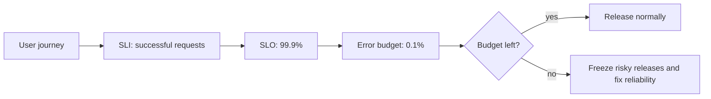

::: multi-code "Расчет error budget" {default=kotlin}

```kotlin
data class Slo(val targetPercent: Double) {
    fun allowedFailures(totalRequests: Long): Long =
        (totalRequests * (100.0 - targetPercent) / 100.0).toLong()
}
```

```kotlin playground
data class Slo(val targetPercent: Double) {
    fun allowedFailures(totalRequests: Long): Long =
        (totalRequests * (100.0 - targetPercent) / 100.0).toLong()

    fun remainingBudget(totalRequests: Long, failedRequests: Long): Long =
        allowedFailures(totalRequests) - failedRequests
}

fun main() {
    val slo = Slo(99.9)
    val total = 1_000_000L
    val failed = 650L

    println("SLO: ${slo.targetPercent}%")
    println("Allowed failures: ${slo.allowedFailures(total)}")
    println("Failed requests: $failed")
    println("Remaining budget: ${slo.remainingBudget(total, failed)}")
}
```

```csharp
public sealed record Slo(double TargetPercent)
{
    public long AllowedFailures(long totalRequests) =>
        (long)(totalRequests * (100.0 - TargetPercent) / 100.0);

    public long RemainingBudget(long totalRequests, long failedRequests) =>
        AllowedFailures(totalRequests) - failedRequests;
}

var slo = new Slo(99.9);
Console.WriteLine(slo.RemainingBudget(1_000_000, 650));
```

```java
record Slo(double targetPercent) {
    long allowedFailures(long totalRequests) {
        return (long) (totalRequests * (100.0 - targetPercent) / 100.0);
    }

    long remainingBudget(long totalRequests, long failedRequests) {
        return allowedFailures(totalRequests) - failedRequests;
    }
}

public class Main {
    public static void main(String[] args) {
        var slo = new Slo(99.9);
        System.out.println(slo.remainingBudget(1_000_000, 650));
    }
}
```

```go
package main

import "fmt"

type SLO struct {
    TargetPercent float64
}

func (s SLO) AllowedFailures(totalRequests int64) int64 {
    return int64(float64(totalRequests) * (100.0 - s.TargetPercent) / 100.0)
}

func (s SLO) RemainingBudget(totalRequests, failedRequests int64) int64 {
    return s.AllowedFailures(totalRequests) - failedRequests
}

func main() {
    slo := SLO{TargetPercent: 99.9}
    fmt.Println(slo.RemainingBudget(1_000_000, 650))
}
```

:::

## Monitoring: black box и white box

Monitoring отвечает на вопрос: "известная проверка показала проблему или нет?" В простом виде выделяют black box и
white box мониторинг.

| Тип | Что видит | Что не видит | Примеры | Когда полезен |
|---|---|---|---|---|
| Black box | поведение снаружи | внутреннюю причину | HTTP probe, ping, synthetic transaction | проверить, доступен ли сервис пользователю |
| White box | внутренние сигналы | пользовательский путь целиком | CPU, memory, queue depth, app metrics | понять, что происходит внутри компонента |

Если балансировщик отвечает на `GET /health`, это еще не доказывает, что пользователь может оформить заказ. Заказ может
ломаться из-за платежного сервиса, базы данных, очереди или ошибки авторизации. Поэтому black box и white box не
заменяют друг друга.

::: multi-code "Health check result" {default=kotlin}

```kotlin
enum class HealthStatus { UP, DEGRADED, DOWN }

data class HealthCheckResult(
    val service: String,
    val status: HealthStatus,
    val details: String
)
```

```kotlin playground
enum class HealthStatus { UP, DEGRADED, DOWN }

data class HealthCheckResult(
    val service: String,
    val status: HealthStatus,
    val details: String
)

fun overallStatus(results: List<HealthCheckResult>): HealthStatus =
    when {
        results.any { it.status == HealthStatus.DOWN } -> HealthStatus.DOWN
        results.any { it.status == HealthStatus.DEGRADED } -> HealthStatus.DEGRADED
        else -> HealthStatus.UP
    }

fun main() {
    val checks = listOf(
        HealthCheckResult("api", HealthStatus.UP, "accepting requests"),
        HealthCheckResult("payments", HealthStatus.DEGRADED, "high latency")
    )

    println("Overall status: ${overallStatus(checks)}")
    checks.forEach { println("${it.service}: ${it.status} (${it.details})") }
}
```

```csharp
public enum HealthStatus { Up, Degraded, Down }

public sealed record HealthCheckResult(
    string Service,
    HealthStatus Status,
    string Details
);

HealthStatus OverallStatus(IEnumerable<HealthCheckResult> results)
{
    if (results.Any(r => r.Status == HealthStatus.Down)) return HealthStatus.Down;
    if (results.Any(r => r.Status == HealthStatus.Degraded)) return HealthStatus.Degraded;
    return HealthStatus.Up;
}
```

```java
enum HealthStatus { UP, DEGRADED, DOWN }

record HealthCheckResult(
    String service,
    HealthStatus status,
    String details
) {}

static HealthStatus overallStatus(List<HealthCheckResult> results) {
    if (results.stream().anyMatch(r -> r.status() == HealthStatus.DOWN)) {
        return HealthStatus.DOWN;
    }
    if (results.stream().anyMatch(r -> r.status() == HealthStatus.DEGRADED)) {
        return HealthStatus.DEGRADED;
    }
    return HealthStatus.UP;
}
```

```go
package main

type HealthStatus string

const (
    Up       HealthStatus = "UP"
    Degraded HealthStatus = "DEGRADED"
    Down     HealthStatus = "DOWN"
)

type HealthCheckResult struct {
    Service string
    Status  HealthStatus
    Details string
}
```

:::

## Observability

Observability - это способность понять внутреннее состояние системы по внешним сигналам, которые она отдает. Monitoring
чаще работает с заранее известными проверками. Observability нужна, когда вопрос еще не сформулирован точно: "почему
пользователи иногда не могут оплатить заказ?", "почему p95 latency вырос только у одного региона?", "почему сервис
ошибается после миграции, хотя health check зеленый?"

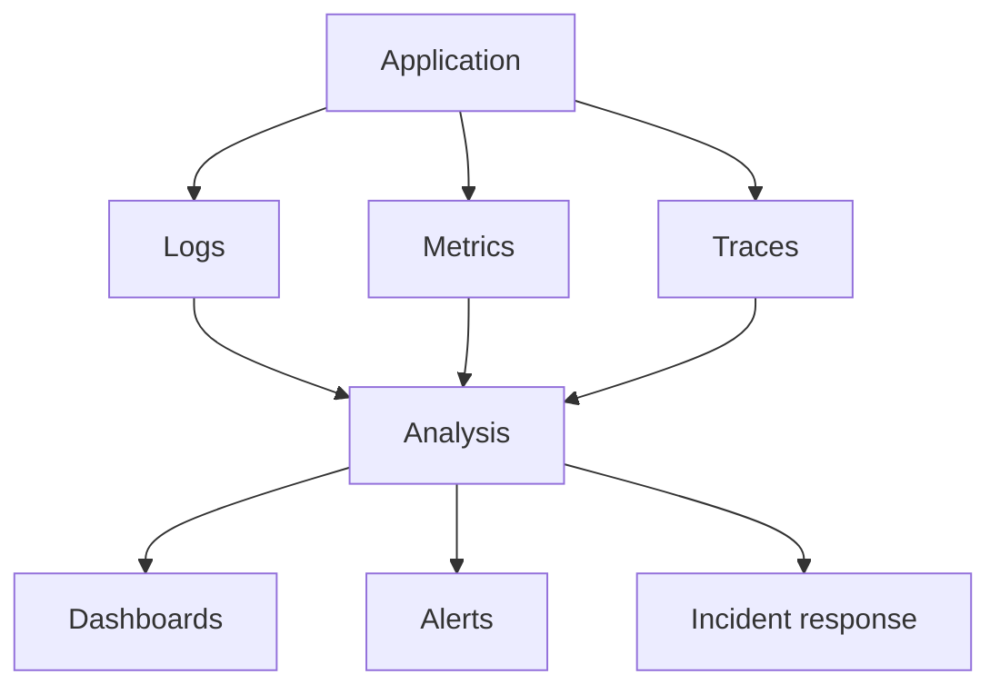

OpenTelemetry важен как vendor-neutral подход: приложение может отдавать telemetry в едином формате, а команда уже
выбирает backend для хранения и визуализации. Это снижает зависимость от конкретного инструмента.

::: only kotlin
В Kotlin/JVM observability приходит через JVM-экосистему: Micrometer, OpenTelemetry SDK/agent, логгеры вроде
Logback. Особенность корутин: trace context живёт в `CoroutineContext`, не в `ThreadLocal`. Стандартный MDC
теряет trace id при переключении dispatcher-а. Поэтому нужна специальная интеграция:

```kotlin
val tracingContext = MDCContext() // kotlinx-coroutines-slf4j
withContext(Dispatchers.IO + tracingContext) {
    logger.info("payment processing") // MDC.get("traceId") доступен
    paymentService.charge(order)
}
```

Без `MDCContext` (или `opentelemetry-kotlin`) логи внутри `withContext` потеряют trace id.
:::

::: only csharp
В .NET базовые building blocks - `ILogger`, `Activity`, `Meter` и OpenTelemetry integration. Хорошая практика: писать
структурированные поля, а не собирать единственную строку, которую потом трудно фильтровать.
:::

::: only java
В Java часто используют Micrometer, OpenTelemetry Java agent и logging MDC для correlation/trace id. Риск типичный:
метрики и логи легко добавить технически, но без единого набора labels они плохо помогают при инциденте.
:::

::: only go
Go 1.21+ имеет `slog` в стандартной библиотеке — structured logging без внешних зависимостей. Это уникально среди
четырёх языков курса:

```go
import "log/slog"

func HandleOrder(ctx context.Context, orderID string) {
    slog.InfoContext(ctx, "processing order",
        "order_id", orderID,
        "trace_id", trace.SpanFromContext(ctx).SpanContext().TraceID().String(),
    )
}
```

Trace id прокидывается через `context.Context` — тот же механизм, что и для cancellation и timeout.
Middleware → handler → repository — контекст проходит явно, и каждая функция видит, какие данные она несёт.
:::

## Метрики

Логи рассказывают, что произошло с конкретным запросом. Метрики показывают, что происходит с системой СЕЙЧАС.
50 логов с ошибками могут означать 50 разных пользователей или 1 пользователя с 50 retry. Без счётчиков, гистограмм
и дашбордов это невозможно отличить.

Метрика — числовой сигнал во времени. Обычно встречаются три базовых типа:

| Тип | Что измеряет | Пример |
|---|---|---|
| Counter | только растущее количество событий | `http_requests_total` |
| Gauge | текущее значение | `queue_size`, `memory_used_bytes` |
| Histogram | распределение значений | `http_request_duration_seconds` |

Для пользовательских запросов часто используют RED:

- **Rate** - сколько запросов приходит;
- **Errors** - сколько запросов завершается ошибкой;
- **Duration** - сколько запросы выполняются.

Для ресурсов часто используют USE:

- **Utilization** - насколько ресурс занят;
- **Saturation** - есть ли очередь и нехватка ресурса;
- **Errors** - есть ли ошибки ресурса.

::: warning Не каждый высокий график должен будить человека
Высокая CPU сама по себе не всегда проблема. Если сервис держит SLO, очередь не растет и пользователи не страдают, это
может быть нормальная утилизация ресурса. Алерт нужен там, где требуется действие.
:::

::: multi-code "Измерение duration и status" {default=kotlin}

```kotlin
interface Metrics {
    fun incrementCounter(name: String, tags: Map<String, String>)
    fun recordDuration(name: String, millis: Long, tags: Map<String, String>)
}
```

```kotlin playground
interface Metrics {
    fun incrementCounter(name: String, tags: Map<String, String>)
    fun recordDuration(name: String, millis: Long, tags: Map<String, String>)
}

class InMemoryMetrics : Metrics {
    private val counters = mutableMapOf<String, Int>()
    private val durations = mutableListOf<Pair<String, Long>>()

    override fun incrementCounter(name: String, tags: Map<String, String>) {
        val key = "$name$tags"
        counters[key] = (counters[key] ?: 0) + 1
    }

    override fun recordDuration(name: String, millis: Long, tags: Map<String, String>) {
        durations += "$name$tags" to millis
    }

    fun printSnapshot() {
        println("Counters:")
        counters.forEach { (key, value) -> println("  $key = $value") }
        println("Durations:")
        durations.forEach { (key, value) -> println("  $key = ${value}ms") }
    }
}

fun handleRequest(path: String, status: Int, durationMillis: Long, metrics: Metrics) {
    val tags = mapOf("path" to path, "status" to status.toString())
    metrics.incrementCounter("http_requests_total", tags)
    metrics.recordDuration("http_request_duration", durationMillis, tags)
}

fun main() {
    val metrics = InMemoryMetrics()
    handleRequest("/orders", 200, 42, metrics)
    handleRequest("/orders", 500, 170, metrics)
    metrics.printSnapshot()
}
```

```csharp
public interface IMetrics
{
    void IncrementCounter(string name, IReadOnlyDictionary<string, string> tags);
    void RecordDuration(string name, long millis, IReadOnlyDictionary<string, string> tags);
}

public static void HandleRequest(string path, int status, long durationMillis, IMetrics metrics)
{
    var tags = new Dictionary<string, string>
    {
        ["path"] = path,
        ["status"] = status.ToString()
    };

    metrics.IncrementCounter("http_requests_total", tags);
    metrics.RecordDuration("http_request_duration", durationMillis, tags);
}
```

```java
interface Metrics {
    void incrementCounter(String name, Map<String, String> tags);
    void recordDuration(String name, long millis, Map<String, String> tags);
}

static void handleRequest(String path, int status, long durationMillis, Metrics metrics) {
    var tags = Map.of(
        "path", path,
        "status", Integer.toString(status)
    );

    metrics.incrementCounter("http_requests_total", tags);
    metrics.recordDuration("http_request_duration", durationMillis, tags);
}
```

```go
package main

import "fmt"

type Metrics interface {
    IncrementCounter(name string, tags map[string]string)
    RecordDuration(name string, millis int64, tags map[string]string)
}

func HandleRequest(path string, status int, durationMillis int64, metrics Metrics) {
    tags := map[string]string{
        "path":   path,
        "status": fmt.Sprintf("%d", status),
    }

    metrics.IncrementCounter("http_requests_total", tags)
    metrics.RecordDuration("http_request_duration", durationMillis, tags)
}
```

:::

## Логи

Лог - запись о событии. Простейший лог выглядит как строка текста, но для production-систем чаще полезнее
структурированные логи: у каждой записи есть поля, по которым можно фильтровать и агрегировать.

Важные идентификаторы:

- **request id** - идентификатор конкретного входящего запроса;
- **correlation id** - идентификатор бизнес-операции, которая может пройти через несколько запросов;
- **trace id** - идентификатор распределенной трассы.

| Уровень | Когда использовать | Пример |
|---|---|---|
| trace | максимально подробная диагностика | вход в низкоуровневый метод |
| debug | диагностика при разработке и расследовании | выбранная ветка алгоритма |
| info | нормальное значимое событие | заказ создан |
| warn | подозрительная ситуация без немедленного отказа | повторная попытка платежа |
| error | операция завершилась ошибкой | не удалось списать оплату |

Для сбора и обработки логов часто используют Fluent Bit или Fluentd, Logstash, Elasticsearch, ClickHouse, Loki, Grafana
и Kibana. Инструменты меняются, но контур обычно похож: собрать, распарсить, сохранить, визуализировать, при
необходимости породить алерт.

::: multi-code "Структурированный лог события заказа" {default=kotlin}

```kotlin
data class OrderEvent(
    val orderId: String,
    val status: String,
    val traceId: String,
    val amount: Int
)
```

```kotlin playground
data class OrderEvent(
    val orderId: String,
    val status: String,
    val traceId: String,
    val amount: Int
)

fun OrderEvent.toLogLine(): String =
    """{"event":"order_status_changed","orderId":"$orderId","status":"$status","traceId":"$traceId","amount":$amount}"""

fun main() {
    val event = OrderEvent(
        orderId = "ord-42",
        status = "PAYMENT_RETRY",
        traceId = "trace-abc",
        amount = 1500
    )

    println(event.toLogLine())
}
```

```csharp
public sealed record OrderEvent(
    string OrderId,
    string Status,
    string TraceId,
    int Amount
);

var orderEvent = new OrderEvent("ord-42", "PAYMENT_RETRY", "trace-abc", 1500);
Console.WriteLine(
    $$"""{"event":"order_status_changed","orderId":"{{orderEvent.OrderId}}","status":"{{orderEvent.Status}}","traceId":"{{orderEvent.TraceId}}","amount":{{orderEvent.Amount}}}"""
);
```

```java
record OrderEvent(
    String orderId,
    String status,
    String traceId,
    int amount
) {
    String toLogLine() {
        return """
            {"event":"order_status_changed","orderId":"%s","status":"%s","traceId":"%s","amount":%d}
            """.formatted(orderId, status, traceId, amount).trim();
    }
}
```

```go
package main

import "fmt"

type OrderEvent struct {
    OrderID string
    Status  string
    TraceID string
    Amount  int
}

func (e OrderEvent) LogLine() string {
    return fmt.Sprintf(
        `{"event":"order_status_changed","orderId":"%s","status":"%s","traceId":"%s","amount":%d}`,
        e.OrderID,
        e.Status,
        e.TraceID,
        e.Amount,
    )
}
```

:::

## Трейсинг

P95 latency checkout выросла с 200ms до 400ms. Без trace это выглядит как «медленный backend». С trace видно:
180ms из дополнительных 200 тратятся на timeout к payment gateway, а 20ms — на retry. Место расследования
мгновенно меняется с «Order Service» на «Payment Service → Bank API».

Трейсинг показывает путь запроса через систему. Это особенно важно в микросервисах: пользователь видит один запрос, а
внутри он может пройти через gateway, несколько сервисов, брокер сообщений и базу данных.

- **Trace** — вся трасса одной операции.
- **Span** — отдельный участок работы внутри trace.
- **Trace id** — идентификатор всей трассы.
- **Span id** — идентификатор конкретного span.
- **Parent span** — span, который вызвал текущий span.

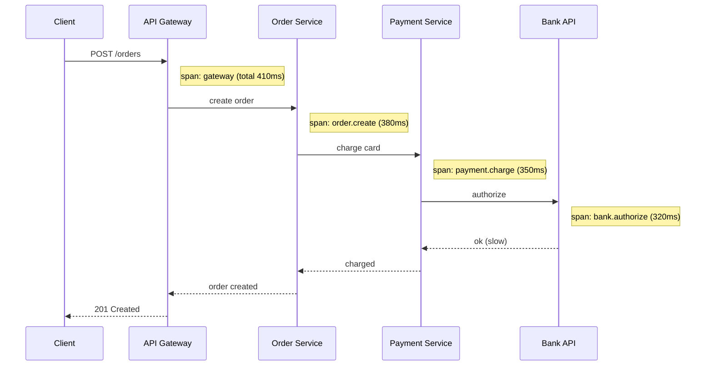

Без трейсинга команда может видеть только "Order Service медленный". С трейсингом видно, что Order Service большую
часть времени ждал Payment Service, а Payment Service ждал Bank API. Это меняет место расследования.

::: multi-code "Ручная модель span" {default=kotlin}

```kotlin
data class Span(
    val traceId: String,
    val spanId: String,
    val parentSpanId: String?,
    val name: String,
    val durationMillis: Long
)
```

```kotlin playground
data class Span(
    val traceId: String,
    val spanId: String,
    val parentSpanId: String?,
    val name: String,
    val durationMillis: Long
)

fun printTrace(spans: List<Span>) {
    val byParent = spans.groupBy { it.parentSpanId }

    fun printChildren(parentId: String?, indent: String) {
        for (span in byParent[parentId].orEmpty()) {
            println("$indent${span.name}: ${span.durationMillis}ms")
            printChildren(span.spanId, "$indent  ")
        }
    }

    printChildren(null, "")
}

fun main() {
    val trace = listOf(
        Span("t-1", "s-1", null, "POST /orders", 210),
        Span("t-1", "s-2", "s-1", "OrderService.create", 180),
        Span("t-1", "s-3", "s-2", "PaymentService.charge", 150),
        Span("t-1", "s-4", "s-3", "payments_db.insert", 120)
    )

    printTrace(trace)
}
```

```csharp
public sealed record Span(
    string TraceId,
    string SpanId,
    string? ParentSpanId,
    string Name,
    long DurationMillis
);

static void PrintTrace(IEnumerable<Span> spans)
{
    foreach (var span in spans.OrderBy(s => s.ParentSpanId ?? ""))
    {
        Console.WriteLine($"{span.Name}: {span.DurationMillis}ms");
    }
}
```

```java
record Span(
    String traceId,
    String spanId,
    String parentSpanId,
    String name,
    long durationMillis
) {}

static void printTrace(List<Span> spans) {
    for (var span : spans) {
        System.out.println(span.name() + ": " + span.durationMillis() + "ms");
    }
}
```

```go
package main

import "fmt"

type Span struct {
    TraceID        string
    SpanID         string
    ParentSpanID   string
    Name           string
    DurationMillis int64
}

func PrintTrace(spans []Span) {
    for _, span := range spans {
        fmt.Printf("%s: %dms\n", span.Name, span.DurationMillis)
    }
}
```

:::

Инструменты трейсинга: Zipkin, Jaeger, OpenTelemetry, Grafana Tempo и облачные APM-сервисы. Конкретный backend не так
важен, как наличие сквозных идентификаторов и единых правил передачи контекста между сервисами.

## Алерты

Алерт - это не просто красная лампочка. Хороший алерт требует действия. Если никто не должен проснуться, открыть
runbook или создать задачу, это, вероятно, не page-алерт, а сигнал для дашборда или дневного анализа.

| Приоритет | Реакция | Пример |
|---|---|---|
| P1 | разбудить дежурного немедленно | пользователи массово не могут оплатить заказ |
| P2 | обработать в рабочее время или текущей сменой | error budget быстро сгорает, но деградация частичная |
| P3 | визуализировать или создать backlog item | растет использование диска, но запас еще большой |

::: warning Алерт, на который не реагируют, вреден
Если система постоянно присылает сигналы, которые команда игнорирует, она обучает людей не доверять алертам. Лучше
меньше алертов, но каждый должен иметь владельца, порог, инструкцию и понятное действие.
:::

::: multi-code "Классификация алерта" {default=kotlin}

```kotlin
enum class AlertTarget { PAGE_NOW, BUSINESS_HOURS, DASHBOARD_ONLY }

data class ServiceSignal(
    val userImpact: Boolean,
    val errorBudgetBurnRate: Double,
    val actionable: Boolean
)
```

```kotlin playground
enum class AlertTarget { PAGE_NOW, BUSINESS_HOURS, DASHBOARD_ONLY }

data class ServiceSignal(
    val userImpact: Boolean,
    val errorBudgetBurnRate: Double,
    val actionable: Boolean
)

fun classify(signal: ServiceSignal): AlertTarget =
    when {
        !signal.actionable -> AlertTarget.DASHBOARD_ONLY
        signal.userImpact && signal.errorBudgetBurnRate >= 2.0 -> AlertTarget.PAGE_NOW
        signal.errorBudgetBurnRate >= 1.0 -> AlertTarget.BUSINESS_HOURS
        else -> AlertTarget.DASHBOARD_ONLY
    }

fun main() {
    val paymentFailure = ServiceSignal(
        userImpact = true,
        errorBudgetBurnRate = 3.4,
        actionable = true
    )

    val highCpu = ServiceSignal(
        userImpact = false,
        errorBudgetBurnRate = 0.2,
        actionable = false
    )

    println("Payment failure: ${classify(paymentFailure)}")
    println("High CPU without impact: ${classify(highCpu)}")
}
```

```csharp
public enum AlertTarget { PageNow, BusinessHours, DashboardOnly }

public sealed record ServiceSignal(
    bool UserImpact,
    double ErrorBudgetBurnRate,
    bool Actionable
);

static AlertTarget Classify(ServiceSignal signal) =>
    signal switch
    {
        { Actionable: false } => AlertTarget.DashboardOnly,
        { UserImpact: true, ErrorBudgetBurnRate: >= 2.0 } => AlertTarget.PageNow,
        { ErrorBudgetBurnRate: >= 1.0 } => AlertTarget.BusinessHours,
        _ => AlertTarget.DashboardOnly
    };
```

```java
enum AlertTarget { PAGE_NOW, BUSINESS_HOURS, DASHBOARD_ONLY }

record ServiceSignal(
    boolean userImpact,
    double errorBudgetBurnRate,
    boolean actionable
) {}

static AlertTarget classify(ServiceSignal signal) {
    if (!signal.actionable()) return AlertTarget.DASHBOARD_ONLY;
    if (signal.userImpact() && signal.errorBudgetBurnRate() >= 2.0) {
        return AlertTarget.PAGE_NOW;
    }
    if (signal.errorBudgetBurnRate() >= 1.0) {
        return AlertTarget.BUSINESS_HOURS;
    }
    return AlertTarget.DASHBOARD_ONLY;
}
```

```go
package main

type AlertTarget string

const (
    PageNow       AlertTarget = "PAGE_NOW"
    BusinessHours AlertTarget = "BUSINESS_HOURS"
    DashboardOnly AlertTarget = "DASHBOARD_ONLY"
)

type ServiceSignal struct {
    UserImpact          bool
    ErrorBudgetBurnRate float64
    Actionable          bool
}

func Classify(signal ServiceSignal) AlertTarget {
    if !signal.Actionable {
        return DashboardOnly
    }
    if signal.UserImpact && signal.ErrorBudgetBurnRate >= 2.0 {
        return PageNow
    }
    if signal.ErrorBudgetBurnRate >= 1.0 {
        return BusinessHours
    }
    return DashboardOnly
}
```

:::

## Incident response и postmortem

Инцидент - это ситуация, где система не выполняет ожидания пользователей или бизнеса. Хорошая команда не только тушит
пожар, но и улучшает систему после него.

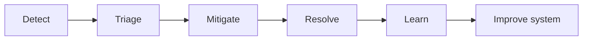

Blameless postmortem не означает, что никто не отвечал за действия. Он означает, что разбор ищет системные причины:
почему ошибка была возможна, почему ее не заметили раньше, почему rollback был сложным, почему runbook не помог.

| Плохой разбор | Хороший разбор |
|---|---|
| ищет виноватого | ищет условия, которые сделали ошибку вероятной |
| заканчивается фразой "быть внимательнее" | заканчивается изменениями в проверках, инструментах и процессе |
| скрывает неудобные факты | фиксирует timeline и решения |
| не имеет владельцев follow-up | назначает конкретные действия и сроки |

## DevSecOps

DevSecOps встраивает безопасность в поток разработки. Это не отдельная проверка перед релизом, а постоянная обратная
связь: разработчик видит проблему с зависимостью, секретом или конфигурацией тогда, когда исправить ее еще дешево.

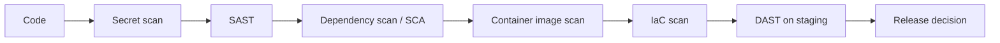

Основные практики:

| Практика | Что проверяет | Где встраивается | Конкретный пример |
|---|---|---|---|
| SAST | уязвимые паттерны в исходном коде | merge request, CI | `OrderRepository.kt:42` — SQL injection через string concatenation |
| SCA / dependency scanning | уязвимости и лицензии зависимостей | CI, dependency update bot | CVE-2024-XXXX в `jackson-databind:2.14.0` — remote code execution |
| Secret scanning | случайно закоммиченные ключи | pre-commit, repository scan, CI | `config.yaml` содержит `STRIPE_SECRET_KEY=sk_live_...` |
| Container image scanning | уязвимости в base image и пакетах | после сборки image | base image `node:18-alpine` содержит 3 HIGH-severity CVE |
| DAST | поведение работающего приложения снаружи | staging или test environment | `POST /api/orders` уязвим к CSRF — нет проверки origin |
| IaC scanning | небезопасные настройки инфраструктуры | review Terraform/Kubernetes manifests | S3 bucket с `public-read` ACL — данные доступны без авторизации |
| Compliance checks | соответствие политикам и стандартам | pipeline gates, audit reports | Сервис не прошёл audit log requirements для PCI DSS |


| Security как блокер в конце | Security как постоянная обратная связь |
|---|---|
| проблемы находятся перед сдачей | проблемы находятся при разработке |
| исправления дорогие и конфликтные | исправления попадают в обычный flow |
| безопасность воспринимается как внешняя команда | безопасность становится частью engineering quality |
| compliance собирают вручную | evidence собирается pipeline и системами учета |

## Platform Engineering

Platform Engineering делает внутреннюю платформу продуктом для разработчиков. Идея проста: если каждая команда заново
собирает репозиторий, pipeline, деплой, секреты, метрики и runbook, организация теряет время и получает разные уровни
качества. Платформа предлагает paved road - стандартный удобный путь.

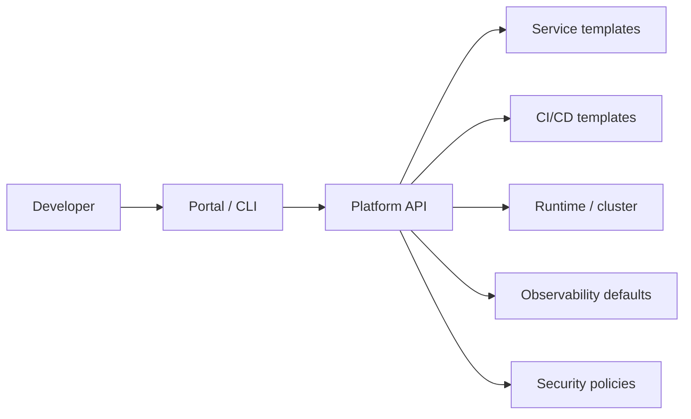

Self-service сценарий может выглядеть так:

1. Разработчик выбирает шаблон сервиса.
2. Платформа создает репозиторий, базовый код, pipeline и окружения.
3. Сервис сразу получает стандартные health checks, метрики, логи, trace propagation и security policies.
4. Команда меняет бизнес-логику, а не собирает инфраструктурный скелет с нуля.

DevOps чаще строит и обслуживает процесс поставки. Platform Engineering упаковывает платформенные возможности в
внутренний продукт, которым разработчики пользуются самостоятельно.

## MLOps и почему это отдельная ветка

MLOps похож на DevOps по цели: быстрее и надежнее доводить результат до production. Но объект поставки сложнее. У
обычного сервиса главный артефакт - код и image. У ML-системы важны еще данные, признаки, модель, метрики качества и
дрейф данных.

| Область | DevOps | MLOps |
|---|---|---|
| Основной артефакт | приложение, image, конфигурация | модель, dataset, feature pipeline, serving code |
| Versioning | код и инфраструктура | код, данные, признаки, модель |
| Pipeline | build-test-deploy | train-validate-register-deploy-monitor |
| Production-риск | ошибки, latency, availability | ошибки сервиса плюс degradation качества модели |
| Monitoring | RED/USE, logs, traces | telemetry сервиса плюс data drift и model performance |

## Что должен делать обычный разработчик

Даже если в команде есть отдельные DevOps-, SRE- и security-специалисты, разработчик влияет на сопровождаемость системы
каждым сервисом и каждой библиотекой.

Практический минимум:

- добавлять health endpoint, который проверяет не только процесс, но и критичные зависимости;
- писать структурированные логи с request id, correlation id или trace id;
- прокидывать trace context во внешние вызовы;
- отдавать важные бизнес- и технические метрики;
- не хранить секреты в коде и конфигурации репозитория;
- понимать, что делает pipeline и какие проверки блокируют merge;
- писать миграции так, чтобы rollout и rollback были возможны;
- проектировать деградацию: что делать, если зависимость недоступна;
- обсуждать SLO пользовательских сценариев, а не только uptime сервера.

Эти требования связаны со всем курсом. Архитектура, микросервисы, отказоустойчивость, паттерны данных и тестирование
становятся практичными только тогда, когда систему можно собрать, развернуть, наблюдать и безопасно изменить.

## Ретроспектива курса

Вы начали с одного класса, который делал всё сам. Теперь этот класс тестируется, внедряет зависимости, следует
паттернам, живёт в bounded context, деплоится в контейнере и наблюдается через логи, метрики и трейсы.

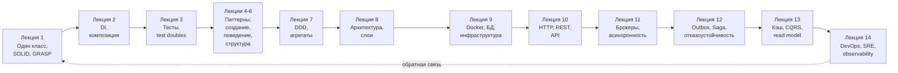

Каждая лекция добавляла уровень сложности — и каждый следующий уровень делал предыдущие решения практичнее. DI
без тестов — формальность. Тесты без pipeline — ручной труд. Pipeline без observability — слепой деплой. Observability
без хорошей архитектуры — шум вместо сигнала.

## Итоги

DevOps ускоряет и стабилизирует поставку изменений. SRE переводит надежность в измеримые цели и помогает управлять
риском через SLO и error budget. Observability дает материал для диагностики production: метрики показывают тенденции,
логи дают события, трейсы показывают путь запроса. DevSecOps встраивает безопасность в поток разработки. Platform
Engineering снижает когнитивную нагрузку команд, превращая инфраструктурные практики в удобный внутренний продукт.

Разработчик не обязан быть специалистом во всех этих областях. Но он обязан писать код так, чтобы его можно было
собрать, проверить, развернуть, наблюдать, защитить и сопровождать.

Так курс замыкается на первой идее: конструирование ПО — это управление стоимостью изменений. В начале это были классы,
интерфейсы и зависимости. В конце — pipeline, SLO, инциденты и обратная связь из production. Между ними нет разрыва:
плохо выбранная граница в коде становится сложным тестом, сложным деплоем, сложной диагностикой и дорогим изменением.

## Вопросы для самопроверки

1. Чем DevOps как культура отличается от должности "DevOps-инженер"?
2. Почему pipeline должен давать обратную связь раньше production?
3. Чем SLO отличается от обычного "у нас uptime 99.9%"?
4. Почему alert должен требовать действия, а не просто сообщать интересный факт?
5. Как метрики, логи и трейсы отвечают на разные диагностические вопросы?
6. Почему blameless postmortem не означает отсутствие ответственности?
7. Что разработчик должен заложить в сервис, чтобы SRE мог его сопровождать?
8. Как решения из лекций про DI, API, брокеры, Saga и CQRS проявляются в эксплуатации?

## Мини-практика

Соберите production-чеклист для сервиса заказов, который проходил через несколько лекций курса.

Минимальный состав:

- pipeline stages от commit до production;
- health check и readiness check;
- три технические метрики и две бизнес-метрики;
- структура логов с correlation id или trace id;
- один distributed trace для сценария оформления заказа;
- SLO для пользовательского сценария;
- alert, который требует действия;
- rollback или feature flag strategy;
- runbook для роста очереди или DLQ;
- security checks, которые должны блокировать merge.

Проверьте результат простым вопросом: если заказ перестал оформляться в пятницу вечером, сможет ли дежурный понять,
что сломалось, кого позвать и как безопасно уменьшить ущерб?

## Источники для дальнейшего чтения

- [DORA metrics](https://dora.dev/guides/dora-metrics/)
- [Google SRE: Implementing SLOs](https://sre.google/workbook/implementing-slos/)
- [Google SRE: Alerting on SLOs](https://sre.google/workbook/alerting-on-slos/)
- [OpenTelemetry documentation](https://opentelemetry.io/docs/)
- [OWASP DevSecOps Guideline](https://owasp.org/www-project-devsecops-guideline/)
- [OpenGitOps principles](https://opengitops.dev/)
- [CNCF Platforms White Paper](https://tag-app-delivery.cncf.io/whitepapers/platforms/)
- [Google Cloud: Practitioners Guide to MLOps](https://services.google.com/fh/files/misc/practitioners_guide_to_mlops_whitepaper.pdf)
