# Лекция 2. Внедрение зависимостей

Зависимость в коде - это любой внешний объект, функция, сервис, источник данных или инфраструктурная деталь, без которой
класс не может выполнить свою работу. В первой лекции мы говорили о DIP: высокоуровневый код должен зависеть от
абстракций, а не от конкретных реализаций. Во второй лекции нужен следующий шаг: понять, как эти абстракции попадают в
объекты на практике.

Эта статья написана как самостоятельный материал. Если вы пропустили занятие, начните отсюда: к концу вы должны видеть,
где код связан с конкретикой, чем DIP отличается от DI, почему конструктор обычно лучше сеттера, где опасен
Service Locator, что делает DI-контейнер и почему все это важно для тестирования.

::: tip Главная идея лекции
DIP говорит, от чего должен зависеть код. DI показывает, как передать эту зависимость в объект. DI-контейнер
автоматизирует сборку графа объектов, но не отменяет ответственность за дизайн.
:::

::: tip Как работать с Kotlin-примерами
В Kotlin-вкладках статический код оставлен коротким. Если включен Playground, некоторые примеры запускаются как
отдельные
маленькие программы: можно менять реализацию зависимости, порядок вызовов и lifecycle, чтобы увидеть проблему в выводе.
:::

## Сквозной сценарий

Учебный пример `Car` и `Engine` намеренно маленький: он убирает шум фреймворков и показывает саму связь. Но держите в
голове реальное приложение. В нем `OrderService` должен сохранить заказ, списать оплату, записать лог, отправить событие
и получить текущее время. Если сервис сам создает `PostgresOrderRepository`, `StripePaymentGateway`, `SystemClock` и
`KafkaPublisher`, он становится трудно тестируемым и плохо переносимым между production, staging и локальным запуском.

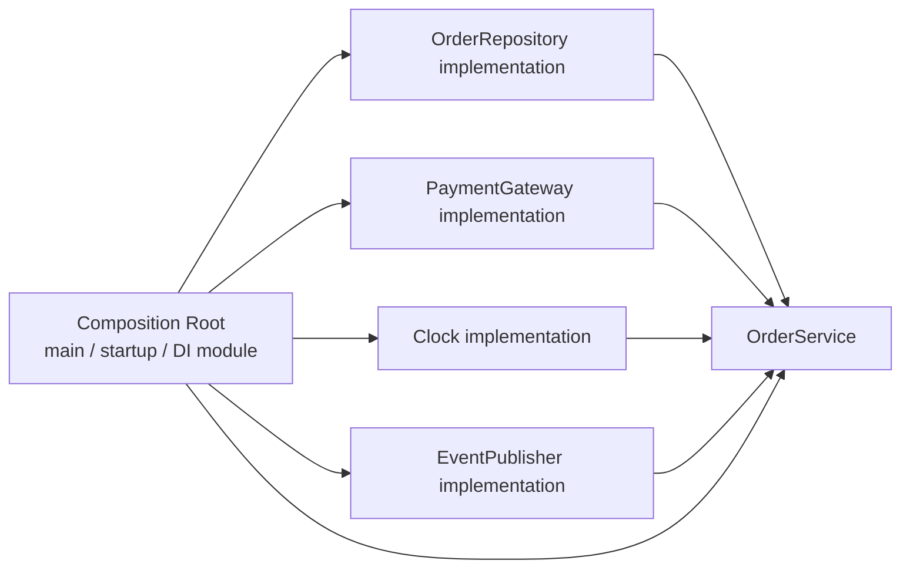

Поэтому лекция движется от маленького `Car` к главному практическому правилу: бизнес-класс должен получать зависимости
явно, а выбор инфраструктуры должен происходить на верхнем уровне приложения.

## Worked example: микромодель и production-аналог

### Ситуация

`Car` нужен `Engine`, а `OrderService` нужны repository, payment gateway, clock и event publisher. Масштаб разный, но
вопрос один: кто выбирает конкретную реализацию зависимости?

### Наивное решение

`Car` создает `GasEngine`, а `OrderService` создает `PostgresOrderRepository` и `StripePaymentGateway` прямо в
конструкторе. Код быстро запускается, но класс теперь знает и бизнес-правило, и инфраструктуру.

### Что ломается

Тест с fake engine или fake payment gateway становится трудным. Локальный запуск требует production-like зависимостей.
Замена Stripe на sandbox или Postgres на in-memory storage превращается в изменение бизнес-класса.

### Улучшение

Передать зависимости через constructor injection, а выбор конкретных реализаций вынести в composition root. В маленькой
программе это `main`, во фреймворке - startup/module/application context.

### Почему это работает

DI не делает код "более объектно-ориентированным" автоматически. Он делает границу выбора явной: бизнес-класс описывает,
что ему нужно, а верхний уровень приложения решает, чем это будет реализовано в production, тесте или локальном запуске.

## Цели

После этой статьи вы должны уметь:

- отличать DIP, DI и DI-контейнер;
- видеть скрытую зависимость от конкретного класса;
- объяснять, почему интерфейс сам по себе не гарантирует слабую связанность;
- выбирать constructor injection как вариант по умолчанию;
- понимать риски setter, property и interface injection;
- объяснять, почему Service Locator часто превращается в антипаттерн;
- понимать роль Composition Root;
- различать transient, singleton и scoped lifecycle;
- видеть, почему DI упрощает unit-тестирование.

## Проблема

Представим класс `Car`. Ему нужен двигатель. Если `Car` сам создает `GasEngine`, то он знает слишком много: не только о
том, что двигатель должен уметь запускаться, но и о конкретной реализации. Такая связь мешает заменить двигатель на
электрический, тестовый или любой другой.

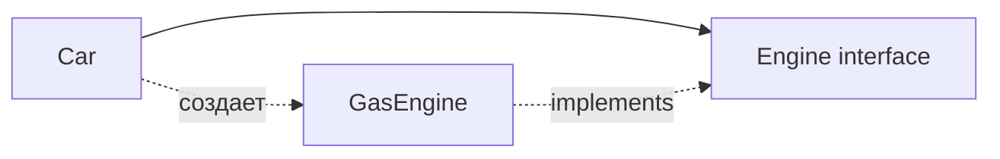

На диаграмме может казаться, что `Car` зависит от интерфейса. Но если внутри класса написано создание конкретной
реализации, фактическая зависимость остается на `GasEngine`. Интерфейс здесь есть, но точка выбора реализации спрятана
не там, где ее удобно контролировать.

Главный вопрос лекции: где должен создаваться объект-зависимость и как передать его в класс, который этой зависимостью
пользуется?

## DIP и DI

DIP, DI и DI-контейнер часто звучат рядом, но отвечают на разные вопросы.

| Понятие      | Отвечает на вопрос               | Пример                                      |
|--------------|----------------------------------|---------------------------------------------|
| DIP          | От чего должен зависеть код?     | `Car` зависит от `Engine`, а не `GasEngine` |
| DI           | Как объект получает зависимость? | `Engine` передается в конструктор           |
| DI-контейнер | Кто собирает граф объектов?      | Контейнер создает `Car`, `Engine`, сервисы  |

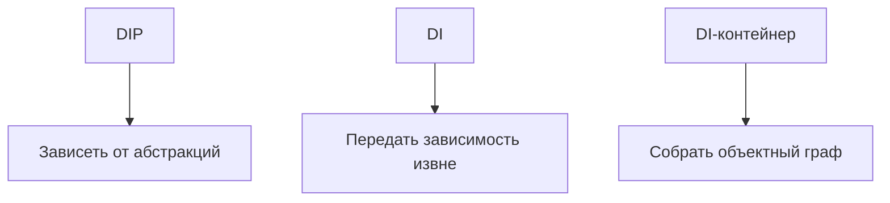

DIP - принцип проектирования. Он говорит: бизнес-логика не должна зависеть от деталей вроде консоли, базы данных,
файловой системы, HTTP-клиента или конкретного двигателя.

DI - способ выполнить этот принцип в коде. Вместо того чтобы создавать зависимость внутри класса, мы передаем уже
созданный объект снаружи.

DI-контейнер - инструмент, который автоматизирует этот процесс: регистрирует реализации, создает объекты и передает их в
конструкторы. Контейнер помогает, но плохую декомпозицию он не исправит.

## Первый пример

Начнем с правильной формы: `Car` знает только контракт `Engine`. Конкретная реализация выбирается снаружи.

:::: multi-code "Car зависит от Engine" {default=kotlin}

```kotlin
interface Engine {
    fun start(): String
}

class Car(private val engine: Engine) {
    fun drive(): String = "Car: ${engine.start()}"
}
```

```kotlin playground
interface Engine {
    fun start(): String
}

class GasEngine : Engine {
    override fun start() = "gas engine started"
}

class ElectricEngine : Engine {
    override fun start() = "electric engine started"
}

class Car(private val engine: Engine) {
    fun drive(): String = "Car: ${engine.start()}"
}

fun main() {
    val gasCar = Car(GasEngine())
    val electricCar = Car(ElectricEngine())

    println(gasCar.drive())
    println(electricCar.drive())
}
```

```csharp
public interface IEngine
{
    string Start();
}

public sealed class Car
{
    private readonly IEngine engine;

    public Car(IEngine engine)
    {
        this.engine = engine;
    }

    public string Drive() => $"Car: {engine.Start()}";
}
```

```java
interface Engine {
    String start();
}

final class Car {
    private final Engine engine;

    Car(Engine engine) {
        this.engine = engine;
    }

    String drive() {
        return "Car: " + engine.start();
    }
}
```

```go
type Engine interface {
    Start() string
}

type Car struct {
    engine Engine
}

func NewCar(engine Engine) Car {
    return Car{engine: engine}
}

func (c Car) Drive() string {
    return "Car: " + c.engine.Start()
}
```

::::

В Kotlin Playground можно поменять `GasEngine()` на `ElectricEngine()` или добавить третий двигатель. Класс `Car` при
этом не меняется. Это и есть практическая польза зависимости от абстракции.

## Скрытая связь

Теперь рассмотрим вариант, который выглядит почти правильно, но нарушает идею. Поле имеет тип `Engine`, однако объект
создается внутри класса.

:::: multi-code "Скрытая зависимость" {default=kotlin}

```kotlin
class Car {
    private val engine: Engine = GasEngine()

    fun drive(): String = "Car: ${engine.start()}"
}
```

```kotlin playground
interface Engine {
    fun start(): String
}

class GasEngine : Engine {
    override fun start() = "gas engine started"
}

class ElectricEngine : Engine {
    override fun start() = "electric engine started"
}

class Car {
    private val engine: Engine = GasEngine()

    fun drive(): String = "Car: ${engine.start()}"
}

fun main() {
    val car = Car()
    println(car.drive())
    println("Try to switch to ElectricEngine without editing Car: impossible.")
}
```

```csharp
public sealed class Car
{
    private readonly IEngine engine = new GasEngine();

    public string Drive() => $"Car: {engine.Start()}";
}
```

```java
final class Car {
    private final Engine engine = new GasEngine();

    String drive() {
        return "Car: " + engine.start();
    }
}
```

```go
type Car struct {
    engine Engine
}

func NewCar() Car {
    return Car{engine: GasEngine{}}
}
```

::::

Проблема не в самом операторе создания объекта. Проблема в месте, где он используется. Если `Car` сам выбирает
`GasEngine`, то выбор реализации зашит в высокоуровневый класс. Чтобы поменять двигатель, придется менять `Car`.

## Способы DI

Зависимость нужно как-то передать в объект. Все способы решают одну задачу, но отличаются по моменту, когда зависимость
становится доступной, и по тому, насколько явно она видна в API класса. Выбор способа определяет, можно ли создать
объект в невалидном состоянии и насколько просто будет подставить тестовую реализацию.

Зависимость можно передать в объект несколькими способами. Они не равнозначны.

| Способ                | Когда использовать                          | Риск                                               |
|-----------------------|---------------------------------------------|----------------------------------------------------|
| Constructor injection | Обязательные зависимости                    | Длинный конструктор показывает перегруженный класс |
| Method injection      | Зависимость нужна только для одной операции | Зависимость не часть состояния объекта             |
| Setter injection      | Опциональная или поздняя зависимость        | Объект может быть использован до настройки         |
| Property injection    | Иногда во фреймворках                       | Скрытая обязательность, null-состояния             |
| Interface injection   | Legacy/редкий случай                        | Зависимость плохо видна из API                     |

Практическое правило простое: если зависимость обязательна для нормальной работы объекта, начинайте с конструктора.

## Конструктор

Constructor injection - вариант по умолчанию. Объект нельзя создать без обязательных зависимостей, а список зависимостей
виден сразу в API класса.

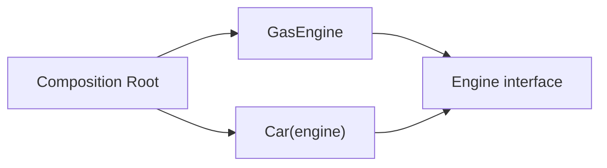

У этого способа есть полезный побочный эффект: если конструктор требует слишком много зависимостей, это заметно. Часто
такой класс нарушает SRP и делает слишком много.

:::: multi-code "Constructor injection" {default=kotlin}

```kotlin
class Car(private val engine: Engine) {
    fun start(): String = engine.start()
}

val car = Car(GasEngine())
```

```kotlin playground
interface Engine {
    fun start(): String
}

class GasEngine : Engine {
    override fun start() = "real engine started"
}

class FakeEngine(private val result: String) : Engine {
    override fun start() = result
}

class Car(private val engine: Engine) {
    fun start(): String = "Car: ${engine.start()}"
}

fun main() {
    val productionCar = Car(GasEngine())
    val testCar = Car(FakeEngine("fake engine for test"))

    println(productionCar.start())
    println(testCar.start())
}
```

```csharp
public sealed class Car
{
    private readonly IEngine engine;

    public Car(IEngine engine)
    {
        this.engine = engine;
    }

    public string Start() => engine.Start();
}

var car = new Car(new GasEngine());
```

```java
final class Car {
    private final Engine engine;

    Car(Engine engine) {
        this.engine = engine;
    }

    String start() {
        return engine.start();
    }
}

var car = new Car(new GasEngine());
```

```go
type Car struct {
    engine Engine
}

func NewCar(engine Engine) Car {
    return Car{engine: engine}
}

car := NewCar(GasEngine{})
```

::::

В playground видно, что тестовая машина получает `FakeEngine`, а промышленный код получает `GasEngine`. `Car` не знает,
какая реализация передана.

## Метод

Method injection подходит, когда зависимость нужна только для одной операции. В этом случае нет смысла хранить ее в
поле: достаточно передать объект параметром метода.

:::: multi-code "Method injection" {default=kotlin}

```kotlin
class TripPlanner {
    fun plan(route: String, weather: WeatherProvider): String {
        return "$route: ${weather.forecast()}"
    }
}
```

```kotlin playground
interface WeatherProvider {
    fun forecast(): String
}

class SunnyWeather : WeatherProvider {
    override fun forecast() = "sunny, normal route"
}

class StormWeather : WeatherProvider {
    override fun forecast() = "storm, choose safe route"
}

class TripPlanner {
    fun plan(route: String, weather: WeatherProvider): String {
        return "$route -> ${weather.forecast()}"
    }
}

fun main() {
    val planner = TripPlanner()

    println(planner.plan("Campus to library", SunnyWeather()))
    println(planner.plan("Campus to library", StormWeather()))
}
```

```csharp
public sealed class TripPlanner
{
    public string Plan(string route, IWeatherProvider weather)
    {
        return $"{route}: {weather.Forecast()}";
    }
}
```

```java
final class TripPlanner {
    String plan(String route, WeatherProvider weather) {
        return route + ": " + weather.forecast();
    }
}
```

```go
type TripPlanner struct{}

func (TripPlanner) Plan(route string, weather WeatherProvider) string {
    return route + ": " + weather.Forecast()
}
```

::::

Метод хорош, если зависимость не является частью устойчивого состояния объекта. Если каждый метод класса требует один и
тот же сервис, лучше вернуться к конструктору.

## Setter

Setter injection позволяет создать объект, а зависимость назначить позже. Это полезно для действительно опциональных
зависимостей или runtime-перенастройки. Но для обязательных зависимостей это опасно: объект существует в неполном
состоянии.

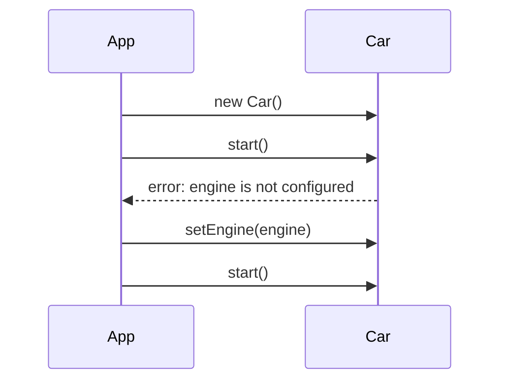

:::: multi-code "Setter injection" {default=kotlin}

```kotlin
class Car {
    private var engine: Engine? = null

    fun setEngine(engine: Engine) {
        this.engine = engine
    }
}
```

```kotlin playground
interface Engine {
    fun start(): String
}

class GasEngine : Engine {
    override fun start() = "gas engine started"
}

class Car {
    private var engine: Engine? = null

    fun setEngine(engine: Engine) {
        this.engine = engine
    }

    fun start(): String {
        val configured = engine ?: return "error: engine is not configured"
        return "Car: ${configured.start()}"
    }
}

fun main() {
    val car = Car()

    println(car.start())

    car.setEngine(GasEngine())
    println(car.start())
}
```

```csharp
public sealed class Car
{
    private IEngine? engine;

    public void SetEngine(IEngine engine)
    {
        this.engine = engine;
    }
}
```

```java
final class Car {
    private Engine engine;

    void setEngine(Engine engine) {
        this.engine = engine;
    }
}
```

```go
type Car struct {
    engine Engine
}

func (c *Car) SetEngine(engine Engine) {
    c.engine = engine
}
```

::::

Если dependency обязательна, setter заставляет писать защитный код и помнить порядок вызовов. Поэтому setter injection
лучше оставлять для зависимостей, отсутствие которых действительно допустимо.

## Свойство (property injection)

Property injection — разновидность мутабельной инъекции, как и setter. Зависимость назначается через свойство после
создания объекта. Риск тот же: объект может быть создан и использован до настройки. Оба варианта (setter и property)
стоит применять только когда зависимость действительно необязательная или этого требует фреймворк.

::: only csharp
В C# property injection иногда встречается во фреймворках, но обязательные зависимости лучше оставлять в конструкторе:
`public OrderService(IRepository repository)`.
:::

::: only kotlin
В Kotlin похожий стиль через `lateinit var` компилируется, но переносит ошибку в runtime: если свойство не назначили,
объект упадет при первом обращении.
:::

::: only java
В Java обязательные зависимости обычно выражают через конструктор и `final`-поля. Аннотационная injection-магия удобна
во фреймворках, но если по конструктору не видно обязательных зависимостей, класс сложнее понять и протестировать.
:::

## Interface Injection

Interface injection - более редкий вариант. Объект реализует специальный интерфейс, через который контейнер или внешний
код передает зависимость.

Идея выглядит так: если класс реализует `EngineAware`, то ему можно вызвать `setEngine(engine)`. Проблема в том, что
зависимость хуже видна из основного API. По конструктору может казаться, что класс ни от чего не зависит, хотя после
создания контейнер должен дополнительно пройтись по специальным интерфейсам.

Этот подход исторически встречался в некоторых контейнерах и фреймворках, но для учебного и прикладного дизайна его
нужно воспринимать как исключение. Если зависимость обязательна, конструктор обычно честнее.

::: only go
В Go интерфейс реализуется неявно: типу достаточно иметь методы с нужными сигнатурами. Поэтому сама идея "реализовать
специальный интерфейс ради внедрения" там выглядит иначе и встречается реже, чем простая передача зависимости в
конструктор-функцию.
:::

## Composition Root

Composition Root - место, где приложение собирает объектный граф. В консольной программе это обычно `main`. В web
приложении - startup/bootstrap/configuration. Важно, что бизнес-классы не должны знать, кто именно их собрал.

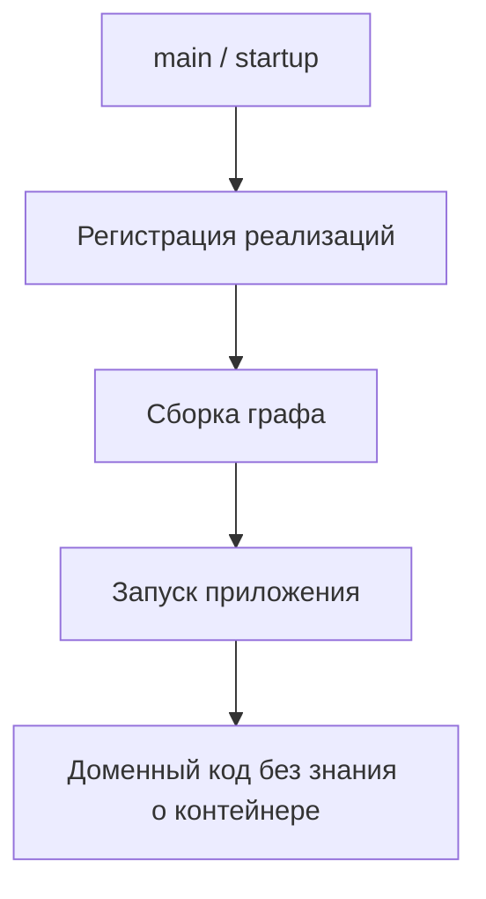

Composition Root отвечает за выбор конкретных реализаций. Вот как выглядит ручная сборка для `OrderService` из
сквозного сценария:

```kotlin
fun main() {
    val repository: OrderRepository = PostgresOrderRepository(connectionString)
    val gateway: PaymentGateway = StripePaymentGateway(apiKey)
    val clock: Clock = SystemClock()
    val publisher: EventPublisher = KafkaPublisher(brokerUrl)

    val service = OrderService(repository, gateway, clock, publisher)
    // запуск HTTP-сервера, передающего service в handlers
}
```

В тесте тот же `OrderService` собирается с другими реализациями:

```kotlin
val service = OrderService(
    InMemoryOrderRepository(),
    FakePaymentGateway(),
    FixedClock(Instant.parse("2025-01-15T10:00:00Z")),
    SpyEventPublisher()
)
```

Главная граница: контейнер или ручная сборка остаются наверху. Доменный код получает уже готовые зависимости.

::: only kotlin
В Kotlin без фреймворка composition root часто выглядит как обычная функция `main`, которая создает реализации и
передает их в конструкторы. В серверных фреймворках эту роль может выполнять модуль DI, например Koin:

```kotlin
val appModule = module {
    single<Clock> { SystemClock() }
    single<OrderRepository> { PostgresOrderRepository(get()) }
    factory { OrderService(get(), get()) }
}

fun main() {
    startKoin { modules(appModule) }
}
```

`single` = singleton, `factory` = transient, `get()` = автоматический resolve по типу. Доменный объект при этом не
должен импортировать контейнер — он по-прежнему получает зависимости через конструктор.

Для ленивой инициализации Kotlin предлагает делегат `by lazy`:

```kotlin
val heavyService: HeavyService by lazy { HeavyService(config) }
```

Объект будет создан при первом обращении. Это удобно для lifecycle management без контейнера.
:::

::: only csharp
В ASP.NET Core composition root обычно находится в `Program.cs`. Полный пример регистрации и использования:

```csharp
var builder = WebApplication.CreateBuilder(args);

builder.Services.AddSingleton<IClock, SystemClock>();
builder.Services.AddScoped<IOrderRepository, PostgresOrderRepository>();
builder.Services.AddScoped<IPaymentGateway, StripePaymentGateway>();
builder.Services.AddTransient<OrderService>();

var app = builder.Build();
```

Контроллеры и сервисы получают зависимости через конструкторы — контейнер рекурсивно собирает граф. Важно не передавать
`IServiceProvider` в доменную модель как скрытый Service Locator.
:::

::: only java
В Spring роль composition root частично берет на себя application context: `@Configuration`, `@Bean`, component scanning.
Но это не отменяет дизайна. Если бизнес-класс дергает `ApplicationContext.getBean(...)`, он снова становится зависимым
от контейнера, а не только от своего контракта.
:::

::: only go
В Go чаще встречается manual wiring: функция `main` создает реализации и передает их в конструкторы вроде
`NewOrderService(repo, gateway, clock)`. Это многословнее контейнера, зато зависимости видны как обычный код и проще
отлаживаются.

Для опциональных зависимостей в Go используют паттерн **functional options** — главную Go-идиому для DI:

```go
type Server struct {
    logger Logger
    timeout time.Duration
}

type Option func(*Server)

func WithLogger(l Logger) Option {
    return func(s *Server) { s.logger = l }
}

func WithTimeout(d time.Duration) Option {
    return func(s *Server) { s.timeout = d }
}

func NewServer(opts ...Option) *Server {
    s := &Server{logger: defaultLogger, timeout: 30 * time.Second}
    for _, opt := range opts {
        opt(s)
    }
    return s
}
```

Конструктор принимает произвольный набор опций, каждая настраивает одну зависимость. Это заменяет и setter injection, и
builder pattern — без мутабельного промежуточного состояния.
:::

## Service Locator

Service Locator - объект или глобальный механизм, который хранит или создает сервисы. Клиентский код обращается к нему
сам и просит нужную зависимость.

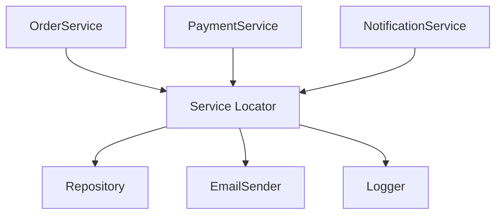

Формально локатор может спрятать конкретную реализацию. `OrderService` не создает `SqlRepository` напрямую, а просит
локатор дать `Repository`. Но появляется другая проблема: `OrderService` теперь зависит от локатора. Если локатор
доступен отовсюду, он становится глобальной точкой, через которую любой класс может достать любой сервис.

## Риск локатора

Главный риск Service Locator - скрытые зависимости. Конструктор класса выглядит простым, но внутри метода может
оказаться вызов `ServiceLocator.resolve(...)`. По API класса уже не видно, что ему нужны репозиторий, валидатор, логгер
или платежный шлюз.

:::: multi-code "Service Locator скрывает зависимости" {default=kotlin}

```kotlin
class OrderProcessor {
    fun process(orderId: String): String {
        val validator = ServiceLocator.validator()
        return validator.validate(orderId)
    }
}
```

```kotlin playground
interface Validator {
    fun validate(orderId: String): String
}

class StrictValidator : Validator {
    override fun validate(orderId: String): String =
        if (orderId.startsWith("ORD-")) "valid: $orderId" else "invalid: $orderId"
}

class AlwaysValidValidator : Validator {
    override fun validate(orderId: String) = "valid in test: $orderId"
}

object ServiceLocator {
    var validator: Validator = StrictValidator()
}

class OrderProcessor {
    fun process(orderId: String): String {
        return ServiceLocator.validator.validate(orderId)
    }
}

fun main() {
    val processor = OrderProcessor()

    println(processor.process("BAD-1"))

    ServiceLocator.validator = AlwaysValidValidator()
    println(processor.process("BAD-1"))

    ServiceLocator.validator = StrictValidator()
    println("Global state restored manually.")
}
```

```csharp
public sealed class OrderProcessor
{
    public string Process(string orderId)
    {
        var validator = ServiceLocator.Resolve<IValidator>();
        return validator.Validate(orderId);
    }
}
```

```java
final class OrderProcessor {
    String process(String orderId) {
        var validator = ServiceLocator.resolve(Validator.class);
        return validator.validate(orderId);
    }
}
```

```go
type OrderProcessor struct{}

func (OrderProcessor) Process(orderID string) string {
    validator := ServiceLocatorValidator()
    return validator.Validate(orderID)
}
```

::::

Playground показывает неприятный эффект: тестовая подмена меняет глобальное состояние. Если забыть вернуть его обратно,
следующий сценарий будет выполняться уже с другой зависимостью. В большом проекте такие ошибки трудно искать.

## Где можно

Service Locator не обязан быть катастрофой, если он ограничен верхним уровнем приложения. Если локатор используется
только в Composition Root для создания объектов, а дальше зависимости передаются через конструкторы, доменный код
остается
чистым.

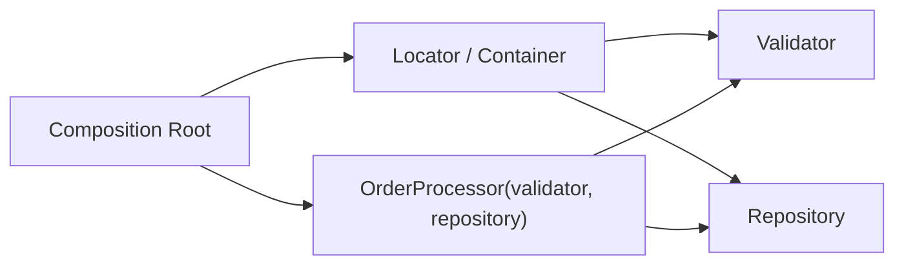

Разница не в том, есть ли внутри контейнера словарь сервисов. Разница в том, кто к нему обращается. Если к нему
обращается только Composition Root, зависимости остаются явными. Если к нему обращается любой бизнес-класс, зависимости
размазываются по системе.

## DI-контейнер

В `main()` с пятью зависимостями ручная сборка работает отлично. Но представьте production-приложение: 50 сервисов, у
каждого 3-7 зависимостей, часть из них общие. Граф объектов становится лесом, а `main()` превращается в сотню строк
`val x = X(a, b, c)`. DI-контейнер решает эту проблему: он берёт на себя рекурсивную сборку графа по зарегистрированным
правилам.

DI-контейнер автоматизирует сборку объектного графа. Обычно он умеет:

- регистрировать соответствие интерфейса и реализации;
- создавать объекты с учетом их конструкторов;
- рекурсивно собирать зависимости зависимостей;
- управлять временем жизни объектов;
- отдавать готовый корневой объект приложению.

| Подход          | Кто просит зависимость                         | Где видна зависимость         |
|-----------------|------------------------------------------------|-------------------------------|
| DI              | Внешний код передает объекту                   | В конструкторе/методе         |
| Service Locator | Сам объект просит локатор                      | Скрыта внутри метода          |
| DI-контейнер    | Composition Root просит контейнер собрать граф | В регистрации и конструкторах |

DI-контейнер может быть реализован через идеи Service Locator внутри себя. Это нормально: пользователю контейнера не
дают обращаться к внутреннему локатору из любого места. Опасность начинается, когда контейнер передают в доменные классы
и используют как `resolve` внутри бизнес-методов.

:::: multi-code "Ручная сборка графа" {default=kotlin}

```kotlin
val repository: OrderRepository = InMemoryOrderRepository()
val service = OrderService(repository)
```

```kotlin playground
interface OrderRepository {
    fun save(id: String)
    fun all(): List<String>
}

class InMemoryOrderRepository : OrderRepository {
    private val orders = mutableListOf<String>()

    override fun save(id: String) {
        orders += id
    }

    override fun all(): List<String> = orders.toList()
}

class OrderService(private val repository: OrderRepository) {
    fun register(id: String) {
        repository.save(id)
    }

    fun report(): String = repository.all().joinToString(prefix = "orders: ")
}

fun main() {
    val repository: OrderRepository = InMemoryOrderRepository()
    val service = OrderService(repository)

    service.register("ORD-1")
    service.register("ORD-2")

    println(service.report())
}
```

```csharp
IOrderRepository repository = new InMemoryOrderRepository();
var service = new OrderService(repository);
```

```java
OrderRepository repository = new InMemoryOrderRepository();
var service = new OrderService(repository);
```

```go
var repository OrderRepository = NewInMemoryOrderRepository()
service := NewOrderService(repository)
```

::::

Ручная сборка полезна для понимания. DI-контейнер делает то же самое, только автоматически и централизованно.

## Lifecycle

Контейнер не только создает зависимости. Он еще решает, сколько живет созданный объект.

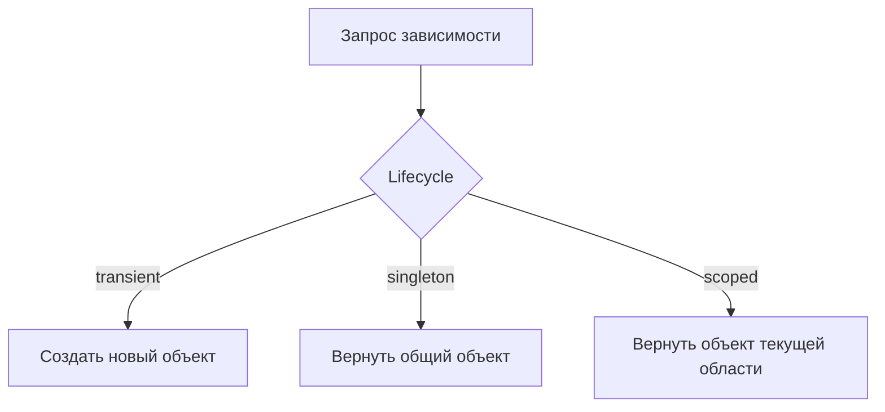

Основные варианты:

| Lifecycle | Что означает                        | Когда подходит                              |
|-----------|-------------------------------------|---------------------------------------------|
| Transient | Каждый запрос получает новый объект | Легкие stateless-сервисы                    |
| Singleton | Один объект на приложение           | Конфигурация, кеши, общие read-only сервисы |
| Scoped    | Один объект на область              | Web-request, транзакция, единица работы     |

Singleton опасен, если объект хранит изменяемое пользовательское состояние. Transient может быть дорогим, если объект
тяжело создавать. Scoped нужен там, где несколько сервисов в рамках одной операции должны разделять общий контекст.

::: warning Captive dependency — классический баг lifecycle
Singleton-сервис получает scoped `DbContext` через конструктор. Поскольку singleton живёт вечно, он держит один и тот же
`DbContext` для всех запросов. Результат: разные пользователи видят данные друг друга, соединение к БД не возвращается
в пул, а спустя тысячу запросов приложение падает с `ObjectDisposedException`. Правило: зависимость не должна жить
дольше, чем объект, который её использует.
:::

:::: multi-code "Transient и singleton" {default=kotlin}

```kotlin
class Counter {
    val id: Int = nextId()
}
```

```kotlin playground
class Container {
    private val factories = mutableMapOf<String, () -> Any>()

    fun <T : Any> registerTransient(key: String, factory: () -> T) {
        factories[key] = factory
    }

    fun <T : Any> registerSingleton(key: String, factory: () -> T) {
        val instance: T by lazy(factory)
        factories[key] = { instance }
    }

    @Suppress("UNCHECKED_CAST")
    fun <T : Any> resolve(key: String): T {
        return factories.getValue(key)() as T
    }
}

class Counter {
    val id: Int = nextId()

    companion object {
        private var current = 0

        fun nextId(): Int {
            current += 1
            return current
        }
    }
}

fun main() {
    val container = Container()

    container.registerTransient("transientCounter") { Counter() }
    container.registerSingleton("singletonCounter") { Counter() }

    val transientA = container.resolve<Counter>("transientCounter")
    val transientB = container.resolve<Counter>("transientCounter")

    val singletonA = container.resolve<Counter>("singletonCounter")
    val singletonB = container.resolve<Counter>("singletonCounter")

    println("transient ids: ${transientA.id}, ${transientB.id}")
    println("singleton ids: ${singletonA.id}, ${singletonB.id}")
}
```

```csharp
services.AddTransient<ICounter, RandomCounter>();
services.AddSingleton<IClock, SystemClock>();
services.AddScoped<IUnitOfWork, UnitOfWork>();
```

```java
container.registerTransient(Counter.class, Counter::new);
container.registerSingleton(Clock.class, SystemClock::new);
container.registerScoped(UnitOfWork.class, UnitOfWork::new);
```

```go
container.RegisterTransient("counter", NewCounter)
container.RegisterSingleton("clock", NewSystemClock)
container.RegisterScoped("unitOfWork", NewUnitOfWork)
```

::::

В playground transient-объекты получают разные `id`, а singleton возвращает один и тот же объект. Это простая модель
того,
что делает реальный контейнер.

## DI и тесты

DI напрямую связан с тестированием. Unit-тест должен проверять маленький кусок логики без реальной базы данных, HTTP,
файловой системы или платежного шлюза. Если зависимости передаются извне, их можно заменить fake-реализациями.

Эта связь подробно раскрывается в [Лекции 3](/lectures/03#тестируемость-кода-и-зависимости). Сейчас важно увидеть
механику: DI не пишут "ради тестов", но хороший DI делает тесты естественным следствием дизайна. Если тесту приходится
поднимать половину приложения, проблема часто не в тестовом фреймворке, а в скрытых зависимостях и неправильно выбранных
границах.

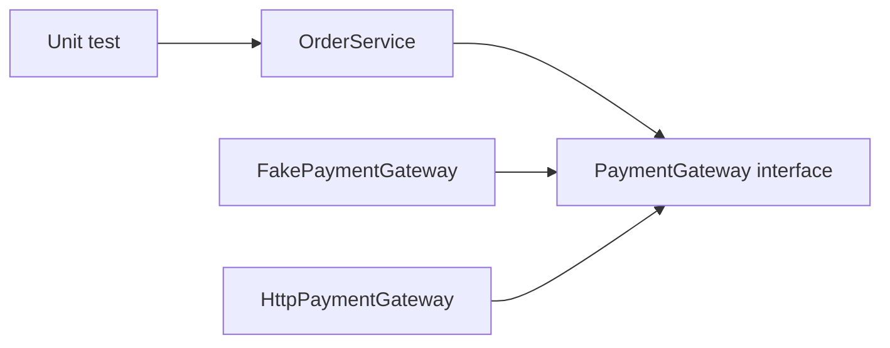

:::: multi-code "Fake для теста" {default=kotlin}

```kotlin
class OrderService(private val payment: PaymentGateway) {
    fun pay(orderId: String, amount: Int): String {
        return payment.charge(orderId, amount)
    }
}
```

```kotlin playground
interface PaymentGateway {
    fun charge(orderId: String, amount: Int): String
}

class HttpPaymentGateway : PaymentGateway {
    override fun charge(orderId: String, amount: Int): String {
        return "real HTTP payment for $orderId: $amount"
    }
}

class FakePaymentGateway : PaymentGateway {
    val charged = mutableListOf<String>()

    override fun charge(orderId: String, amount: Int): String {
        charged += "$orderId:$amount"
        return "fake payment accepted"
    }
}

class OrderService(private val payment: PaymentGateway) {
    fun pay(orderId: String, amount: Int): String {
        require(amount > 0) { "amount must be positive" }
        return payment.charge(orderId, amount)
    }
}

fun main() {
    val fake = FakePaymentGateway()
    val service = OrderService(fake)

    println(service.pay("ORD-42", 100))
    println("captured calls: ${fake.charged}")
}
```

```csharp
public sealed class OrderService
{
    private readonly IPaymentGateway payment;

    public OrderService(IPaymentGateway payment)
    {
        this.payment = payment;
    }

    public string Pay(string orderId, int amount)
    {
        return payment.Charge(orderId, amount);
    }
}
```

```java
final class OrderService {
    private final PaymentGateway payment;

    OrderService(PaymentGateway payment) {
        this.payment = payment;
    }

    String pay(String orderId, int amount) {
        return payment.charge(orderId, amount);
    }
}
```

```go
type OrderService struct {
    payment PaymentGateway
}

func NewOrderService(payment PaymentGateway) OrderService {
    return OrderService{payment: payment}
}

func (s OrderService) Pay(orderID string, amount int) string {
    return s.payment.Charge(orderID, amount)
}
```

::::

В следующей лекции тестирование будет отдельной темой. Сейчас важно зафиксировать связь: если класс сам создает реальные
зависимости, его трудно тестировать изолированно. Если зависимости внедряются, тест может подставить fake или mock.

## Частые ошибки

- Интерфейс создан, но конкретная реализация все равно создается внутри класса.
- Контейнер передается в доменный сервис и используется как `resolve` внутри бизнес-методов.
- Все зависимости регистрируются как singleton без анализа состояния.
- Setter используется для обязательной зависимости.
- Класс требует слишком много зависимостей, но это маскируется контейнером.
- DI используется как способ спрятать плохую декомпозицию.
- Абстракция вводится без второй реализации, тестовой подмены или реальной точки изменения.
- Service Locator применяется не в Composition Root, а в произвольных местах приложения.

Два примера, которые стоит узнавать в коде:

**Ambient context** — зависимость прячется в статическом свойстве:

```kotlin
class OrderService {
    fun process(orderId: String) {
        val now = TimeProvider.current.now()  // скрытая зависимость
        // ...
    }
}
```

Тест не может подменить `TimeProvider.current` без глобальной мутации. Решение: передать `Clock` через конструктор.

**Constructor over-injection** — конструктор с 8+ зависимостями:

```kotlin
class OrderService(
    private val repo: OrderRepository,
    private val payment: PaymentGateway,
    private val inventory: InventoryService,
    private val pricing: PricingService,
    private val notification: NotificationSender,
    private val audit: AuditLogger,
    private val metrics: MetricsCollector,
    private val featureFlags: FeatureFlagService
)
```

Это не проблема DI — это сигнал нарушения SRP. Класс координирует слишком много. Решение: разделить ответственности
(например, вынести `OrderPricingService` и `OrderNotificationService`).

## Чеклист

Перед тем как добавить зависимость, задайте себе вопросы:

1. Кто создает зависимость?
2. Видна ли зависимость в API класса?
3. Можно ли заменить реализацию без правки бизнес-класса?
4. Можно ли протестировать класс без реальной инфраструктуры?
5. Не передается ли контейнер внутрь доменной логики?
6. Правильный ли lifecycle выбран?
7. Не слишком ли много зависимостей у класса?

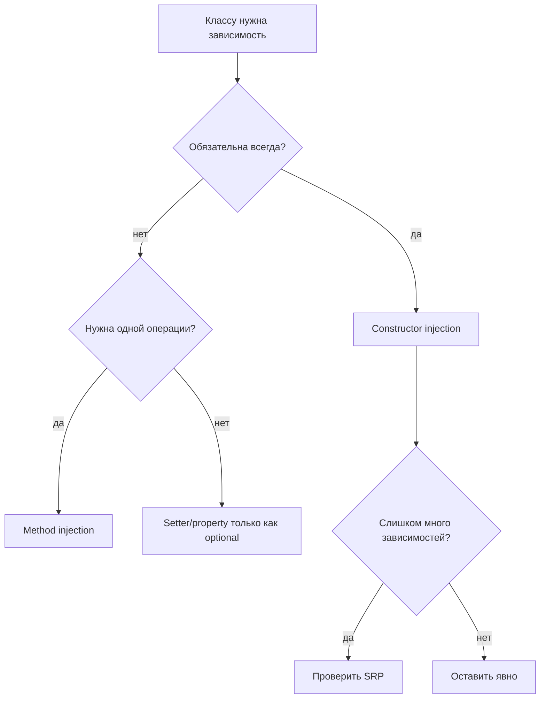

## Резюме

- DIP задает направление зависимости: высокоуровневый код зависит от абстракций.
- DI передает зависимость извне, вместо создания внутри класса.
- Constructor injection обычно лучший вариант для обязательных зависимостей.
- Setter и property injection требуют осторожности, потому что создают неполное состояние.
- Service Locator опасен скрытыми зависимостями и глобальным состоянием.
- DI-контейнер полезен в Composition Root, но не должен протекать в доменную логику.
- Lifecycle влияет на поведение программы: transient, singleton и scoped дают разные гарантии.
- DI делает тестирование естественным, потому что реальные реализации можно заменить fake или mock.

## Дополнительное чтение

Материалы закрывают основные варианты передачи зависимостей, Service Locator и жизненный цикл объектов в контейнере.

### DI и Service Locator

- [Внедрение зависимостей](https://topjava.ru/blog/back-to-basics-dependency-injection) — базовое объяснение dependency injection.
- [Service Locator](https://sergeyteplyakov.blogspot.com/2013/03/di-service-locator.html) — разбор подхода и его последствий для дизайна.
- [Отличие Dependency Injection от Service Locator](https://habr.com/ru/articles/465395/) — сравнение двух способов получения зависимостей.

### Жизненный цикл зависимостей

- [Жизненный цикл зависимостей](https://metanit.com/sharp/dotnet/1.3.php) — singleton, scoped и transient на примере .NET.

## Самопроверка

1. Почему `private val engine: Engine = GasEngine()` все еще нарушает DIP?
2. Чем DIP отличается от DI?
3. Почему constructor injection считается вариантом по умолчанию?
4. Когда method injection лучше constructor injection?
5. Чем setter injection опасен для обязательных зависимостей?
6. Почему property injection может скрывать ошибку настройки объекта?
7. Что такое Composition Root?
8. Почему Service Locator похож на глобальный объект?
9. Чем DI-контейнер отличается от прямого Service Locator в бизнес-коде?
10. Чем transient отличается от singleton?
11. Почему singleton опасен для изменяемого состояния?
12. Как DI помогает писать unit tests?

## Мини-практика

Есть `ReportService`, который внутри создает `FileReportWriter`, `ConsoleLogger` и `SystemClock`.

Нужно:

1. Выделить интерфейсы `ReportWriter`, `Logger`, `Clock`.
2. Переписать `ReportService` на constructor injection.
3. Собрать объект в `main` или другом Composition Root.
4. Добавить fake writer для теста.
5. Объяснить, где в вашем решении DIP, где DI, а где Composition Root.

Стартовый вариант намеренно плохой:

:::: multi-code "Мини-практика: исходный код" {default=kotlin}

```kotlin
class ReportService {
    private val writer = FileReportWriter()
    private val logger = ConsoleLogger()
    private val clock = SystemClock()
}
```

```csharp
public sealed class ReportService
{
    private readonly FileReportWriter writer = new();
    private readonly ConsoleLogger logger = new();
    private readonly SystemClock clock = new();
}
```

```java
final class ReportService {
    private final FileReportWriter writer = new FileReportWriter();
    private final ConsoleLogger logger = new ConsoleLogger();
    private final SystemClock clock = new SystemClock();
}
```

```go
type ReportService struct {
    writer FileReportWriter
    logger ConsoleLogger
    clock  SystemClock
}
```

::::

Цель упражнения - не написать больше интерфейсов, а переместить выбор инфраструктурных деталей из бизнес-класса в точку
сборки приложения.

## Переход к следующей лекции

На этой странице мы увидели, как `FakeEngine` подменяет настоящий двигатель, а `FakePaymentGateway` — реальный
платёжный шлюз. Это были тестовые двойники (test doubles). Но мы ещё не обсуждали, как *правильно* их использовать:
когда fake лучше mock, почему spy надёжнее verify-цепочки, и как написать тест, который переживёт рефакторинг без
поломки. Именно эти вопросы раскрывает [Лекция 3 про юнит-тестирование](/lectures/03#тестируемость-кода-и-зависимости) —
DI делает код тестируемым, но качество тестов определяет уже другая дисциплина.
