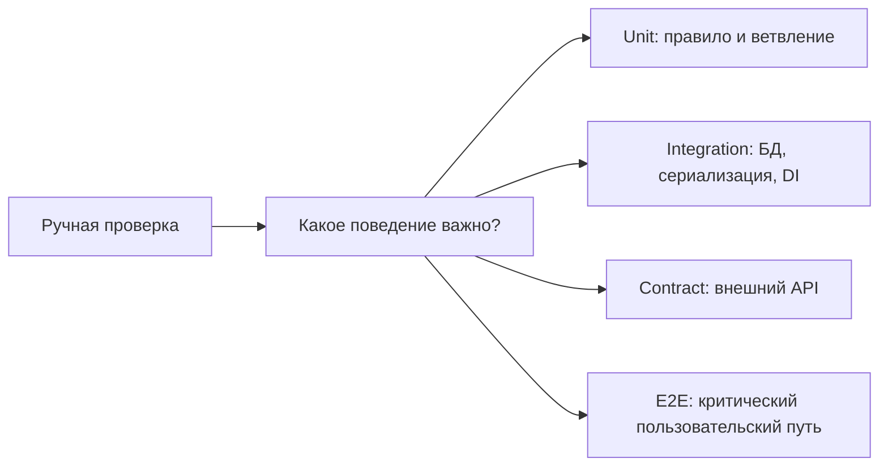
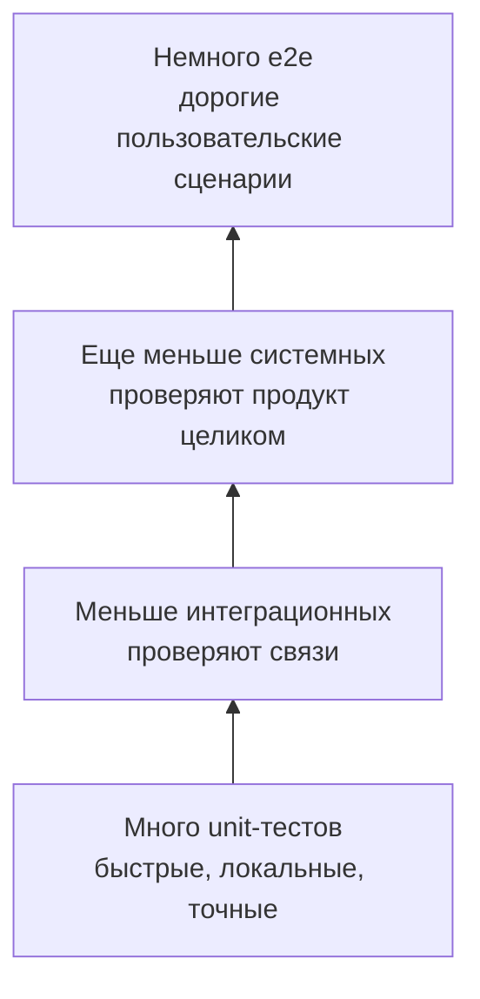
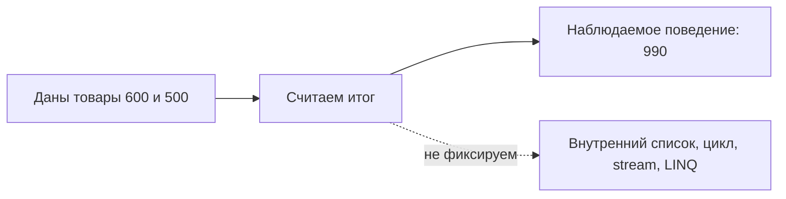
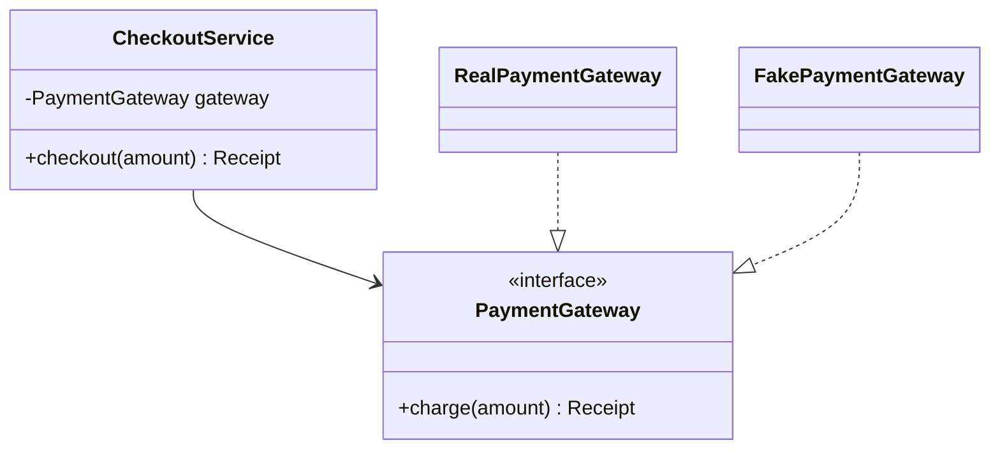
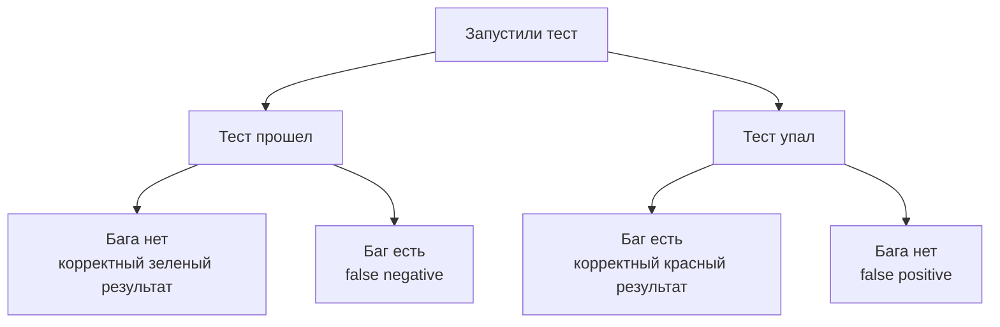
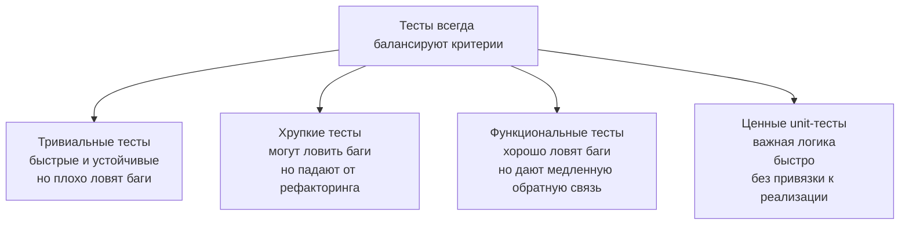
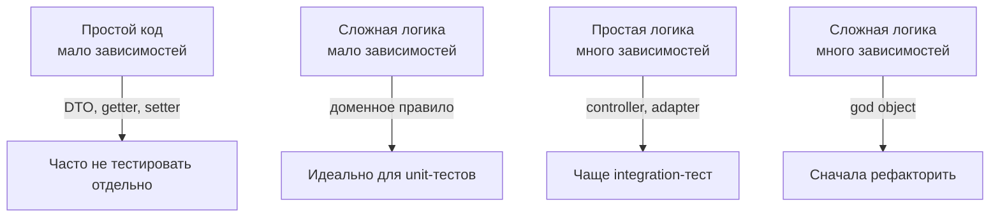
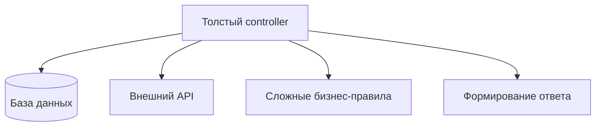
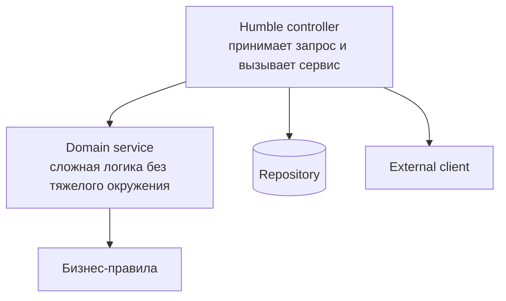

# Лекция 3. Принципы эффективного юнит-тестирования

Эта лекция - самостоятельный конспект о том, как разработчику писать полезные unit-тесты. Она не требует, чтобы вы
помнили устную лекцию: сначала разберем, зачем вообще нужны тесты, затем отделим unit-тесты от других уровней
тестирования, а после этого перейдем к качеству тестов, тестовым двойникам, DI и мокированию зависимостей.

После прочтения вы должны уметь:

- объяснить, чем unit-тест отличается от интеграционного и функционального теста;
- написать простой тест по правилу Arrange-Act-Assert;
- понять, что именно проверяет тест: выход, состояние или взаимодействие;
- отличить stub, fake, spy и mock;
- увидеть хрупкий тест, который привязан к реализации;
- решить, что тестировать unit-тестами, что проверять интеграционно, а что сначала рефакторить;
- выбрать, какие зависимости мокать, а какие лучше проверять настоящими тестами.

## Сквозной сценарий

В [Лекции 2](/lectures/02#di-и-тесты) мы передали `FakePaymentGateway` в `OrderService` вместо реального шлюза — это
был тестовый двойник. Но мы не обсуждали, *как* написать тест, который использует этот fake правильно. Теперь
`OrderService` считает итог заказа, проверяет скидку, обращается к платежному шлюзу и публикует событие. Первый импульс —
открыть приложение вручную, нажать кнопку "Оплатить" и посмотреть, что случится. Это полезно один раз, но плохо работает
как инженерная обратная связь: ручная проверка медленная, неполная и зависит от внешних систем.

В этой лекции мы будем постепенно сужать вопрос. Вместо "работает ли все приложение?" спросим:

- правильно ли считается скидка при заданных товарах;
- вызывает ли сервис платеж только после успешной валидации;
- что делать, если внешний API оплаты недоступен;
- какие проверки оставить unit-тестами, а какие вынести на интеграционный уровень.



## Worked example: хрупкий тест против теста поведения

### Ситуация

`OrderService` должен применить скидку, если сумма заказа больше порога. Пользователю неважно, как метод внутри
разбивает вычисление на private-функции; важно, какой итог он получит.

### Наивное решение

Написать тест, который проверяет, что `OrderService` вызвал внутренний helper или dependency ровно один раз. Такой тест
может пройти, даже если итоговая сумма неверна, и упасть после безвредного рефакторинга.

### Что ломается

Тест начинает охранять реализацию, а не поведение. Разработчик меняет порядок вызовов, выносит часть логики в value
object или объединяет два helper-а, и тест падает, хотя пользовательский результат не изменился.

### Улучшение

Сформулировать Arrange-Act-Assert вокруг наблюдаемого результата: подготовить заказ, выполнить расчет, проверить итог и
важные side effects на границе системы. Interaction проверять только там, где само взаимодействие является поведением:
например, платеж не должен уйти при невалидном заказе.

### Почему это работает

Хороший unit-тест дает свободу менять внутреннюю форму кода. Он фиксирует договоренность с внешним миром: результат,
состояние или важное взаимодействие на границе процесса.

## Зачем разработчику тестирование

Тестирование - это не отдельная фаза, где кто-то после разработчика пытается доказать, что программа сломана. Для
разработчика тесты прежде всего дают обратную связь: изменил код, запустил проверку, быстро понял, осталась ли система в
ожидаемом состоянии.

Чем позже найдена ошибка, тем дороже ее исправление. Ошибка, пойманная локальным unit-тестом, обычно исправляется за
минуты: контекст еще в голове, затронутый участок кода рядом. Ошибка, найденная отделом тестирования, уже превращается в
баг-репорт, triage, назначение исполнителя и повторную проверку. Ошибка в production добавляет пользователей, данные,
поддержку, релизы исправлений и репутационный ущерб.


Исторически отношение к тестированию менялось вместе со сложностью программ. Пока программы были небольшими, казалось
реалистичным вручную проверить основные входы и выходы. Когда систем стало больше, появился отдельный процесс
тестирования. Затем стало понятно, что качество нельзя "добавить в конце": его нужно обеспечивать на каждом этапе
разработки. Unit-тесты занимают в этой картине самое раннее место - они помогают разработчику обнаружить ошибку до того,
как код попадет к другим людям и системам.

::: tip Практический смысл
Хороший тест - это не доказательство, что багов больше нет. Это дешевый способ быстро узнать, что важное поведение
системы все еще работает.
:::

## Карта видов тестирования

Для разработчика главное разделение — по уровню: что именно проверяет тест и сколько инфраструктуры ему нужно. Три
уровня, которые вам реально нужно понимать: unit, integration и e2e.

Обычно уровни тестирования объясняют пирамидой. Внизу много быстрых дешевых тестов, наверху меньше дорогих и медленных
тестов, которые зато ближе к реальному пользовательскому сценарию.

::: details Полная карта классификаций
Тестирование классифицируют по разным признакам. Эти классификации не конкурируют: один и тот же тест может быть
автоматизированным, динамическим, функциональным, white-box и unit-тестом одновременно.

| Признак           | Варианты                          | Что отличает                                                                                     |
|-------------------|-----------------------------------|--------------------------------------------------------------------------------------------------|
| Характер сценария | Позитивное / негативное           | Проверяем ожидаемый успешный путь или реакцию на ошибку, сбой, неверные данные.                  |
| Запуск кода       | Статическое / динамическое        | Анализируем код без запуска или выполняем программу.                                             |
| Автоматизация     | Ручное / автоматизированное       | Человек проходит сценарий сам или сценарий выполняет инструмент.                                 |
| Требования        | Функциональное / нефункциональное | Проверяем поведение продукта или свойства вроде скорости, удобства, безопасности.                |
| Знание системы    | Black box / gray box / white box  | Тестировщик не знает внутренности, знает часть контракта или работает с кодом.                   |
| Уровень           | Unit / integration / system / e2e | Проверяем маленькую единицу поведения, связь модулей, систему целиком или пользовательский путь. |
:::



::: warning Не превращайте пирамиду в лозунг
Пирамида не означает, что все нужно проверять unit-тестами. Она говорит, что дорогие проверки не должны быть первым и
единственным способом узнать, что код сломан.
:::

## Что такое unit-тест

Unit-тест проверяет небольшую единицу наблюдаемого поведения в изоляции от ненужного окружения. Важно слово
"поведения": unit - это не обязательно один класс или один метод. Иногда единицей является функция, иногда доменный
объект, иногда небольшая группа классов, которые вместе реализуют правило предметной области.

Unit-тест должен быть быстрым, повторяемым и понятным. Он не должен требовать реальной сети, внешнего API, общей базы
данных, ручной подготовки окружения или специального порядка запуска.

| Уровень      | Что проверяет                                  | Обычно хорошо подходит для                                | Главный риск                                  |
|--------------|------------------------------------------------|-----------------------------------------------------------|-----------------------------------------------|
| Unit         | Небольшое поведение в контролируемом окружении | Доменная логика, расчеты, правила валидации, ветвления    | Слишком много моков и привязка к реализации   |
| Integration  | Совместную работу нескольких компонентов       | Репозитории с БД, сериализация, DI-конфигурация, адаптеры | Медленнее и сложнее в подготовке              |
| Functional   | Сценарий с точки зрения требования             | "Пользователь оформляет заказ", "сервис принимает платеж" | Ошибка найдена, но причина может быть далеко  |
| System / e2e | Реальную систему почти целиком                 | Критические пользовательские пути                         | Дорого поддерживать, медленная обратная связь |

::: tip Короткое определение
Unit-тест хорош, когда быстро отвечает на конкретный вопрос о поведении: "при таких условиях этот участок системы делает
то, что должен?".
:::

## Первый пример: один тест по правилу 3A

Правило 3A делит тест на три видимых шага:

- Arrange - подготовить данные и зависимости;
- Act - выполнить проверяемое действие;
- Assert - проверить результат.

Ниже один и тот же пример: корзина дает скидку 10%, если сумма заказа достигла 1000.

::: multi-code "Unit-тест по правилу 3A"

```kotlin
import kotlin.test.Test
import kotlin.test.assertEquals

class CartTest {
    @Test
    fun appliesDiscountForLargeOrder() {
        // Arrange
        val cart = Cart()
        cart.add(600)
        cart.add(500)

        // Act
        val total = cart.total()

        // Assert
        assertEquals(990, total)
    }
}

class Cart {
    private val prices = mutableListOf<Int>()

    fun add(price: Int) {
        prices += price
    }

    fun total(): Int {
        val sum = prices.sum()
        return if (sum >= 1000) (sum * 0.9).toInt() else sum
    }
}
```

```kotlin playground
import kotlin.test.assertEquals

class Cart {
    private val prices = mutableListOf<Int>()

    fun add(price: Int) {
        prices += price
    }

    fun total(): Int {
        val sum = prices.sum()
        return if (sum >= 1000) (sum * 0.9).toInt() else sum
    }
}

fun main() {
    // Arrange
    val cart = Cart()
    cart.add(600)
    cart.add(500)

    // Act
    val total = cart.total()

    // Assert
    assertEquals(990, total)
    println("Test passed: total = $total")
}
```

```csharp
using System.Collections.Generic;
using System.Linq;
using Xunit;

public class CartTests
{
    [Fact]
    public void AppliesDiscountForLargeOrder()
    {
        // Arrange
        var cart = new Cart();
        cart.Add(600);
        cart.Add(500);

        // Act
        var total = cart.Total();

        // Assert
        Assert.Equal(990, total);
    }
}

public class Cart
{
    private readonly List<int> prices = new();

    public void Add(int price) => prices.Add(price);

    public int Total()
    {
        var sum = prices.Sum();
        return sum >= 1000 ? (int)(sum * 0.9) : sum;
    }
}
```

```java
import org.junit.jupiter.api.Test;
import java.util.ArrayList;
import java.util.List;

import static org.junit.jupiter.api.Assertions.assertEquals;

class CartTest {
    @Test
    void appliesDiscountForLargeOrder() {
        // Arrange
        Cart cart = new Cart();
        cart.add(600);
        cart.add(500);

        // Act
        int total = cart.total();

        // Assert
        assertEquals(990, total);
    }
}

class Cart {
    private final List<Integer> prices = new ArrayList<>();

    void add(int price) {
        prices.add(price);
    }

    int total() {
        int sum = prices.stream().mapToInt(Integer::intValue).sum();
        return sum >= 1000 ? (int)(sum * 0.9) : sum;
    }
}
```

```go
package cart

import "testing"

func TestAppliesDiscountForLargeOrder(t *testing.T) {
    // Arrange
    cart := NewCart()
    cart.Add(600)
    cart.Add(500)

    // Act
    total := cart.Total()

    // Assert
    if total != 990 {
        t.Fatalf("expected 990, got %d", total)
    }
}

type Cart struct {
    prices []int
}

func NewCart() *Cart {
    return &Cart{}
}

func (c *Cart) Add(price int) {
    c.prices = append(c.prices, price)
}

func (c *Cart) Total() int {
    sum := 0
    for _, price := range c.prices {
        sum += price
    }
    if sum >= 1000 {
        return int(float64(sum) * 0.9)
    }
    return sum
}
```

:::

Этот тест не утверждает, что внутри `Cart` должна быть `MutableList`, `ArrayList`, массив или SQL-таблица. Он утверждает
наблюдаемое поведение: если в корзине товары на 600 и 500, итог должен быть 990. Именно поэтому такой тест переживет
рефакторинг внутреннего хранения, но упадет при изменении бизнес-правила скидки.



::: warning Не прячьте смысл теста
Даже если язык позволяет записать подготовку, действие и проверку в одну строку, такой тест сложнее читать и сложнее
чинить. Тест - это документация поведения, а документация должна быть разборчивой.
:::

::: only kotlin
> **Kotlin.** В реальном проекте такой тест обычно лежит в `src/test` и запускается через Gradle или Maven. Playground
> здесь нужен только для живой демонстрации идеи Arrange-Act-Assert.
:::

::: only csharp
> **C#.** Атрибут `[Fact]` - форма xUnit для теста без параметров. Для набора входных данных обычно используют
> параметризованные тесты.
:::

::: only java
> **Java.** В JUnit 5 тестовый метод помечается `@Test`, а проверки часто импортируются статически из
> `org.junit.jupiter.api.Assertions`.
:::

::: only go
> **Go.** Стандартный пакет `testing` считает тестом функцию вида `TestXxx(t *testing.T)`. Ошибка фиксируется через
> `t.Fatal`, `t.Fatalf` или похожие методы.
>
> Самый характерный Go-паттерн тестирования — **table-driven tests**. Вместо отдельной функции на каждый случай, все
> входы и ожидаемые результаты собираются в таблицу:
>
> ```go
> func TestApplyDiscount(t *testing.T) {
>     tests := []struct {
>         name     string
>         total    int
>         expected int
>     }{
>         {"below threshold", 500, 500},
>         {"at threshold", 1000, 900},
>         {"above threshold", 1500, 1350},
>     }
>     for _, tt := range tests {
>         t.Run(tt.name, func(t *testing.T) {
>             got := ApplyDiscount(tt.total)
>             if got != tt.expected {
>                 t.Errorf("ApplyDiscount(%d) = %d, want %d", tt.total, got, tt.expected)
>             }
>         })
>     }
> }
> ```
>
> `t.Run` создаёт подтест для каждой строки — при падении видно, какой именно случай сломался.
:::

### Параметризованные тесты

Когда одну и ту же логику нужно проверить на нескольких наборах данных, каждый язык предлагает свой механизм. Вместо
дублирования тестовых функций, данные собираются в таблицу:

::: multi-code "Параметризованные тесты" {default=kotlin}

```kotlin
import org.junit.jupiter.params.ParameterizedTest
import org.junit.jupiter.params.provider.CsvSource
import kotlin.test.assertEquals

class DiscountTest {
    @ParameterizedTest
    @CsvSource("500,500", "1000,900", "1500,1350")
    fun appliesDiscount(total: Int, expected: Int) {
        assertEquals(expected, applyDiscount(total))
    }
}

fun applyDiscount(total: Int): Int =
    if (total >= 1000) total * 90 / 100 else total
```

```csharp
using Xunit;

public class DiscountTests
{
    [Theory]
    [InlineData(500, 500)]
    [InlineData(1000, 900)]
    [InlineData(1500, 1350)]
    public void AppliesDiscount(int total, int expected)
    {
        Assert.Equal(expected, ApplyDiscount(total));
    }

    static int ApplyDiscount(int total) =>
        total >= 1000 ? total * 90 / 100 : total;
}
```

```java
import org.junit.jupiter.params.ParameterizedTest;
import org.junit.jupiter.params.provider.CsvSource;

import static org.junit.jupiter.api.Assertions.assertEquals;

class DiscountTest {
    @ParameterizedTest
    @CsvSource({"500,500", "1000,900", "1500,1350"})
    void appliesDiscount(int total, int expected) {
        assertEquals(expected, applyDiscount(total));
    }

    static int applyDiscount(int total) {
        return total >= 1000 ? total * 90 / 100 : total;
    }
}
```

```go
func TestApplyDiscount(t *testing.T) {
    tests := []struct {
        total, expected int
    }{
        {500, 500}, {1000, 900}, {1500, 1350},
    }
    for _, tt := range tests {
        got := ApplyDiscount(tt.total)
        if got != tt.expected {
            t.Errorf("ApplyDiscount(%d) = %d, want %d",
                tt.total, got, tt.expected)
        }
    }
}
```

:::

::: only kotlin
> **Kotlin.** Помимо JUnit `@ParameterizedTest`, библиотека Kotest предлагает другой DSL:
>
> ```kotlin
> class DiscountSpec : StringSpec({
>     "applies 10% discount above threshold" {
>         applyDiscount(1500) shouldBe 1350
>     }
>     "no discount below threshold" {
>         applyDiscount(500) shouldBe 500
>     }
> })
> ```
>
> `shouldBe` читается как утверждение на естественном языке. Выбор между `kotlin.test` и Kotest — вопрос вкуса команды.
:::

::: only csharp
> **C#.** `[Fact]` — тест без параметров. `[Theory]` с `[InlineData]` — параметризованный тест. Для сложных данных
> есть `[MemberData]` и `[ClassData]`, позволяющие передавать объекты вместо примитивов.
:::

## Что именно проверяет тест

Тесты отличаются не только уровнем, но и тем, что они наблюдают.

| Стиль             | Что проверяем                                      | Когда подходит                                                      | Риск                                                   |
|-------------------|----------------------------------------------------|---------------------------------------------------------------------|--------------------------------------------------------|
| Output-based      | Вернулся правильный результат для заданного входа  | Чистые функции, расчеты, форматирование, правила предметной области | Можно пропустить важные побочные эффекты               |
| State-based       | Объект или хранилище перешли в нужное состояние    | Агрегаты, коллекции, команды, меняющие состояние                    | Можно начать проверять слишком много деталей           |
| Interaction-based | Была выполнена нужная коммуникация между объектами | Уведомления, отправка события, вызов внешнего шлюза                 | Самый хрупкий стиль, если проверяет внутренний процесс |

Output-based тест обычно самый устойчивый: он не знает, как код получил результат, и проверяет только наблюдаемое
поведение.

::: multi-code "Output-based: проверяем результат"

```kotlin
import kotlin.test.Test
import kotlin.test.assertEquals

class PriceFormatterTest {
    @Test
    fun formatsPriceWithCurrency() {
        val formatted = PriceFormatter.format(1250, "RUB")

        assertEquals("1250 RUB", formatted)
    }
}

object PriceFormatter {
    fun format(amount: Int, currency: String): String = "$amount $currency"
}
```

```kotlin playground
import kotlin.test.assertEquals

object PriceFormatter {
    fun format(amount: Int, currency: String): String = "$amount $currency"
}

fun main() {
    val formatted = PriceFormatter.format(1250, "RUB")
    assertEquals("1250 RUB", formatted)
    println(formatted)
}
```

```csharp
using Xunit;

public class PriceFormatterTests
{
    [Fact]
    public void FormatsPriceWithCurrency()
    {
        var formatted = PriceFormatter.Format(1250, "RUB");

        Assert.Equal("1250 RUB", formatted);
    }
}

public static class PriceFormatter
{
    public static string Format(int amount, string currency) => $"{amount} {currency}";
}
```

```java
import org.junit.jupiter.api.Test;

import static org.junit.jupiter.api.Assertions.assertEquals;

class PriceFormatterTest {
    @Test
    void formatsPriceWithCurrency() {
        String formatted = PriceFormatter.format(1250, "RUB");

        assertEquals("1250 RUB", formatted);
    }
}

class PriceFormatter {
    static String format(int amount, String currency) {
        return amount + " " + currency;
    }
}
```

```go
package pricing

import (
    "fmt"
    "testing"
)

func TestFormatsPriceWithCurrency(t *testing.T) {
    formatted := FormatPrice(1250, "RUB")

    if formatted != "1250 RUB" {
        t.Fatalf("expected %q, got %q", "1250 RUB", formatted)
    }
}

func FormatPrice(amount int, currency string) string {
    return fmt.Sprintf("%d %s", amount, currency)
}
```

:::

::: details State-based: проверяем состояние
State-based тест полезен, когда смысл операции именно в изменении состояния.

```kotlin
import kotlin.test.Test
import kotlin.test.assertTrue

class OrderTest {
    @Test
    fun marksOrderAsPaid() {
        val order = Order()

        order.markPaid()

        assertTrue(order.isPaid)
    }
}

class Order {
    var isPaid: Boolean = false
        private set

    fun markPaid() {
        isPaid = true
    }
}
```

:::

::: details Interaction-based: проверяем взаимодействие
Interaction-based тест нужен, когда результатом поведения является коммуникация с зависимостью: например, отправить
уведомление после оплаты.

```kotlin
import kotlin.test.Test
import kotlin.test.assertEquals

class OrderServiceTest {
    @Test
    fun sendsNotificationAfterPayment() {
        val notifier = SpyNotifier()
        val service = OrderService(notifier)

        service.pay("order-1")

        assertEquals(listOf("order-1"), notifier.sentOrderIds)
    }
}

interface Notifier {
    fun sendPaymentReceived(orderId: String)
}

class SpyNotifier : Notifier {
    val sentOrderIds = mutableListOf<String>()

    override fun sendPaymentReceived(orderId: String) {
        sentOrderIds += orderId
    }
}

class OrderService(private val notifier: Notifier) {
    fun pay(orderId: String) {
        notifier.sendPaymentReceived(orderId)
    }
}
```

:::

## Тестируемость кода и зависимости

Связь с лекцией 2 прямая: DIP и DI нужны не только ради красивой архитектуры. Они делают код проверяемым. Если класс сам
создает зависимость через `new`, достает ее из Service Locator или читает глобальную конфигурацию, тесту трудно
подставить управляемое поведение.

Плохой вариант:

```kotlin
class CheckoutService {
    private val gateway = RealPaymentGateway()

    fun checkout(amount: Int): Receipt {
        return gateway.charge(amount)
    }
}
```

Здесь тест не может заменить `RealPaymentGateway` без специальных приемов. Если настоящий шлюз ходит в сеть, unit-тест
перестает быть unit-тестом.

Хороший вариант: сервис зависит от интерфейса, а конкретная реализация приходит извне.



::: multi-code "DI делает сервис тестируемым" {playground=off}

```kotlin
data class Receipt(val id: String, val amount: Int)

interface PaymentGateway {
    fun charge(amount: Int): Receipt
}

class CheckoutService(private val gateway: PaymentGateway) {
    fun checkout(amount: Int): Receipt {
        require(amount > 0) { "amount must be positive" }
        return gateway.charge(amount)
    }
}
```

```csharp
using System;

public record Receipt(string Id, int Amount);

public interface IPaymentGateway
{
    Receipt Charge(int amount);
}

public class CheckoutService
{
    private readonly IPaymentGateway gateway;

    public CheckoutService(IPaymentGateway gateway)
    {
        this.gateway = gateway;
    }

    public Receipt Checkout(int amount)
    {
        if (amount <= 0) throw new ArgumentException("amount must be positive");
        return gateway.Charge(amount);
    }
}
```

```java
record Receipt(String id, int amount) {}

interface PaymentGateway {
    Receipt charge(int amount);
}

class CheckoutService {
    private final PaymentGateway gateway;

    CheckoutService(PaymentGateway gateway) {
        this.gateway = gateway;
    }

    Receipt checkout(int amount) {
        if (amount <= 0) {
            throw new IllegalArgumentException("amount must be positive");
        }
        return gateway.charge(amount);
    }
}
```

```go
type Receipt struct {
    ID     string
    Amount int
}

type PaymentGateway interface {
    Charge(amount int) Receipt
}

type CheckoutService struct {
    gateway PaymentGateway
}

func NewCheckoutService(gateway PaymentGateway) CheckoutService {
    return CheckoutService{gateway: gateway}
}

func (s CheckoutService) Checkout(amount int) Receipt {
    if amount <= 0 {
        panic("amount must be positive")
    }
    return s.gateway.Charge(amount)
}
```

:::

::: multi-code "Kotlin: fake gateway в unit-тесте" {default=kotlin}

```kotlin
import kotlin.test.Test
import kotlin.test.assertEquals

class CheckoutServiceTest {
    @Test
    fun returnsReceiptFromPaymentGateway() {
        val gateway = FakePaymentGateway()
        val service = CheckoutService(gateway)

        val receipt = service.checkout(1500)

        assertEquals(Receipt("test-receipt", 1500), receipt)
    }
}

class FakePaymentGateway : PaymentGateway {
    override fun charge(amount: Int): Receipt = Receipt("test-receipt", amount)
}
```

```kotlin playground
import kotlin.test.assertEquals

data class Receipt(val id: String, val amount: Int)

interface PaymentGateway {
    fun charge(amount: Int): Receipt
}

class CheckoutService(private val gateway: PaymentGateway) {
    fun checkout(amount: Int): Receipt {
        require(amount > 0) { "amount must be positive" }
        return gateway.charge(amount)
    }
}

class FakePaymentGateway : PaymentGateway {
    override fun charge(amount: Int): Receipt = Receipt("test-receipt", amount)
}

fun main() {
    val gateway = FakePaymentGateway()
    val service = CheckoutService(gateway)

    val receipt = service.checkout(1500)

    assertEquals(Receipt("test-receipt", 1500), receipt)
    println("Test passed: $receipt")
}
```

```csharp
using Xunit;

public class CheckoutServiceTests
{
    [Fact]
    public void ReturnsReceiptFromPaymentGateway()
    {
        var gateway = new FakePaymentGateway();
        var service = new CheckoutService(gateway);

        var receipt = service.Checkout(1500);

        Assert.Equal(new Receipt("test-receipt", 1500), receipt);
    }
}

public class FakePaymentGateway : IPaymentGateway
{
    public Receipt Charge(int amount) => new("test-receipt", amount);
}
```

```java
import org.junit.jupiter.api.Test;

import static org.junit.jupiter.api.Assertions.assertEquals;

class CheckoutServiceTest {
    @Test
    void returnsReceiptFromPaymentGateway() {
        PaymentGateway gateway = new FakePaymentGateway();
        CheckoutService service = new CheckoutService(gateway);

        Receipt receipt = service.checkout(1500);

        assertEquals(new Receipt("test-receipt", 1500), receipt);
    }
}

class FakePaymentGateway implements PaymentGateway {
    public Receipt charge(int amount) {
        return new Receipt("test-receipt", amount);
    }
}
```

```go
package checkout

import "testing"

func TestReturnsReceiptFromPaymentGateway(t *testing.T) {
    gateway := FakePaymentGateway{}
    service := NewCheckoutService(gateway)

    receipt := service.Checkout(1500)

    if receipt != (Receipt{ID: "test-receipt", Amount: 1500}) {
        t.Fatalf("unexpected receipt: %+v", receipt)
    }
}

type FakePaymentGateway struct{}

func (FakePaymentGateway) Charge(amount int) Receipt {
    return Receipt{ID: "test-receipt", Amount: amount}
}
```

:::

## Test doubles: fake, stub, mock

Тестовый двойник — объект, который заменяет настоящую зависимость в тесте. В разговоре часто говорят "мок" про любой
двойник, но для точности полезно различать роли. Проще всего увидеть разницу через историю нарастающих потребностей:

1. Сначала конструктор требует `Logger`, но в тесте логирование неважно. Нужен объект, который просто компилируется — это **dummy** (`NoOpLogger`).
2. Потом тесту нужна валюта, но реальный API курсов недоступен. Нужен объект, который *отвечает заранее* — это **stub** (`StubExchangeRates(rate = 90)`).
3. Тест становится сложнее: нужен полноценный репозиторий, который хранит и отдаёт данные, но без настоящей БД. Нужна *упрощённая рабочая реализация* — это **fake** (`InMemoryOrderRepository`).
4. Теперь важно знать, *что именно* тестируемый код отправил во внешний сервис. Нужен объект, который *запоминает вызовы* — это **spy** (`SpyMailer` с полем `sent`).
5. Наконец, нужно убедиться, что метод `send` был вызван *ровно один раз с конкретным аргументом*. Нужен объект, который *проверяет ожидание* — это **mock**.

| Вид двойника | Что делает                                                                 | Пример                                                        |
|--------------|----------------------------------------------------------------------------|---------------------------------------------------------------|
| Dummy        | Передается только потому, что параметр обязателен; в тесте не используется | `NoOpLogger` для конструктора                                 |
| Fake         | Рабочая упрощенная реализация                                              | In-memory repository вместо настоящей БД                      |
| Stub         | Возвращает заранее заданные ответы                                         | Курс валют всегда равен 90                                    |
| Spy          | Запоминает, как с ним взаимодействовали                                    | Список отправленных уведомлений                               |
| Mock         | Проверяет ожидаемое взаимодействие                                         | "Метод `send` должен быть вызван один раз с таким сообщением" |

Главное различие для этой лекции: stub помогает подготовить состояние мира, mock проверяет взаимодействие. Если тест
падает из-за ответа stub, проблема обычно в проверяемой логике. Если тест падает из-за mock, проблема может быть как в
логике, так и в слишком жестком ожидании внутреннего процесса.

::: multi-code "Stub и spy в одном сценарии" {default=kotlin}

```kotlin
import kotlin.test.Test
import kotlin.test.assertEquals

class InvoiceServiceTest {
    @Test
    fun sendsInvoiceWithConvertedAmount() {
        val rates = StubExchangeRates(rate = 90)
        val mailer = SpyMailer()
        val service = InvoiceService(rates, mailer)

        service.sendInvoice("client@example.com", dollars = 10)

        assertEquals(listOf("client@example.com:900"), mailer.sent)
    }
}

interface ExchangeRates {
    fun usdToRub(): Int
}

class StubExchangeRates(private val rate: Int) : ExchangeRates {
    override fun usdToRub(): Int = rate
}

class SpyMailer {
    val sent = mutableListOf<String>()

    fun send(email: String, body: String) {
        sent += "$email:$body"
    }
}

class InvoiceService(
    private val rates: ExchangeRates,
    private val mailer: SpyMailer
) {
    fun sendInvoice(email: String, dollars: Int) {
        val rubles = dollars * rates.usdToRub()
        mailer.send(email, rubles.toString())
    }
}
```

```kotlin playground
import kotlin.test.assertEquals

interface ExchangeRates {
    fun usdToRub(): Int
}

class StubExchangeRates(private val rate: Int) : ExchangeRates {
    override fun usdToRub(): Int = rate
}

class SpyMailer {
    val sent = mutableListOf<String>()

    fun send(email: String, body: String) {
        sent += "$email:$body"
    }
}

class InvoiceService(
    private val rates: ExchangeRates,
    private val mailer: SpyMailer
) {
    fun sendInvoice(email: String, dollars: Int) {
        val rubles = dollars * rates.usdToRub()
        mailer.send(email, rubles.toString())
    }
}

fun main() {
    val rates = StubExchangeRates(rate = 90)
    val mailer = SpyMailer()
    val service = InvoiceService(rates, mailer)

    service.sendInvoice("client@example.com", dollars = 10)

    assertEquals(listOf("client@example.com:900"), mailer.sent)
    println(mailer.sent)
}
```

```csharp
using Xunit;

public class InvoiceServiceTests
{
    [Fact]
    public void SendsInvoiceWithConvertedAmount()
    {
        var rates = new StubExchangeRates(90);
        var mailer = new SpyMailer();
        var service = new InvoiceService(rates, mailer);

        service.SendInvoice("client@example.com", 10);

        Assert.Equal(new[] { "client@example.com:900" }, mailer.Sent);
    }
}

public interface IExchangeRates
{
    int UsdToRub();
}

public class StubExchangeRates : IExchangeRates
{
    private readonly int rate;

    public StubExchangeRates(int rate) => this.rate = rate;

    public int UsdToRub() => rate;
}

public class SpyMailer
{
    public List<string> Sent { get; } = new();

    public void Send(string email, string body) => Sent.Add($"{email}:{body}");
}

public class InvoiceService
{
    private readonly IExchangeRates rates;
    private readonly SpyMailer mailer;

    public InvoiceService(IExchangeRates rates, SpyMailer mailer)
    {
        this.rates = rates;
        this.mailer = mailer;
    }

    public void SendInvoice(string email, int dollars)
    {
        var rubles = dollars * rates.UsdToRub();
        mailer.Send(email, rubles.ToString());
    }
}
```

```java
import org.junit.jupiter.api.Test;
import java.util.List;

import static org.junit.jupiter.api.Assertions.assertEquals;

class InvoiceServiceTest {
    @Test
    void sendsInvoiceWithConvertedAmount() {
        StubExchangeRates rates = new StubExchangeRates(90);
        SpyMailer mailer = new SpyMailer();
        InvoiceService service = new InvoiceService(rates, mailer);

        service.sendInvoice("client@example.com", 10);

        assertEquals(List.of("client@example.com:900"), mailer.sent());
    }
}

interface ExchangeRates {
    int usdToRub();
}

class StubExchangeRates implements ExchangeRates {
    private final int rate;

    StubExchangeRates(int rate) {
        this.rate = rate;
    }

    public int usdToRub() {
        return rate;
    }
}

class SpyMailer {
    private final List<String> sent = new java.util.ArrayList<>();

    void send(String email, String body) {
        sent.add(email + ":" + body);
    }

    List<String> sent() {
        return sent;
    }
}

class InvoiceService {
    private final ExchangeRates rates;
    private final SpyMailer mailer;

    InvoiceService(ExchangeRates rates, SpyMailer mailer) {
        this.rates = rates;
        this.mailer = mailer;
    }

    void sendInvoice(String email, int dollars) {
        int rubles = dollars * rates.usdToRub();
        mailer.send(email, Integer.toString(rubles));
    }
}
```

```go
package invoice

import (
    "strconv"
    "testing"
)

func TestSendsInvoiceWithConvertedAmount(t *testing.T) {
    rates := StubExchangeRates{Rate: 90}
    mailer := &SpyMailer{}
    service := NewInvoiceService(rates, mailer)

    service.SendInvoice("client@example.com", 10)

    if len(mailer.Sent) != 1 || mailer.Sent[0] != "client@example.com:900" {
        t.Fatalf("unexpected sent messages: %#v", mailer.Sent)
    }
}

type ExchangeRates interface {
    UsdToRub() int
}

type StubExchangeRates struct {
    Rate int
}

func (r StubExchangeRates) UsdToRub() int {
    return r.Rate
}

type SpyMailer struct {
    Sent []string
}

func (m *SpyMailer) Send(email string, body string) {
    m.Sent = append(m.Sent, email+":"+body)
}

type InvoiceService struct {
    rates ExchangeRates
    mailer *SpyMailer
}

func NewInvoiceService(rates ExchangeRates, mailer *SpyMailer) InvoiceService {
    return InvoiceService{rates: rates, mailer: mailer}
}

func (s InvoiceService) SendInvoice(email string, dollars int) {
    rubles := dollars * s.rates.UsdToRub()
    s.mailer.Send(email, strconv.Itoa(rubles))
}
```

:::

::: warning Не мокайте все подряд
Если каждый соседний объект заменен mock-объектом, тест начинает проверять не поведение системы, а текущий сценарий
вызовов. Такой тест часто ломается при нормальном рефакторинге.
:::

## Хрупкие тесты и ложные срабатывания

Тест полезен, когда его результату можно доверять. Есть две неприятные ошибки обратной связи:

- false positive - тест упал, но продукт не сломан;
- false negative - тест прошел, но в продукте есть баг.



False negative опасен тем, что баг уходит дальше. False positive опасен тем, что команда перестает доверять тестам:
"опять упало что-то неважное". После этого даже настоящий красный тест начинают игнорировать.

Классический источник false positive - тестирование внутренней реализации вместо наблюдаемого результата. Представим,
что есть HTML-renderer сообщения. Плохой тест проверяет, что renderer вызвал `renderHeader`, потом `renderBody`, потом
`renderFooter`. После рефакторинга renderer может начать собирать секции другим способом, но итоговый HTML останется
верным. Такой тест упадет без поломки продукта.

Плохая идея:

```kotlin
// Хрупко: тест знает порядок внутренних вызовов.
verify(renderer).renderHeader(message)
verify(renderer).renderBody(message)
verify(renderer).renderFooter(message)
```

Более устойчивый тест проверяет *результат*, а не *процесс*:

```kotlin
import kotlin.test.Test
import kotlin.test.assertContains

class MessageRendererTest {
    @Test
    fun rendersMessageAsHtml() {
        val renderer = MessageRenderer()

        val html = renderer.render(Message("Hello", "Text"))

        assertContains(html, "<h1>Hello</h1>")
        assertContains(html, "<main>Text</main>")
    }
}
```

Теперь представьте рефакторинг: разработчик объединил `renderHeader` и `renderBody` в один метод `renderContent`.
Хрупкий тест с `verify` упал — хотя итоговый HTML не изменился. Устойчивый тест прошёл, потому что он проверяет
наблюдаемый результат. Именно это делает его ценным.

::: warning Главный признак хрупкости
Если после рефакторинга без изменения внешнего поведения тест нужно переписывать, тест слишком сильно привязан к
реализации.
:::

## Четыре критерия хорошего unit-теста

Качество набора тестов нельзя надежно измерить только процентом покрытия. Coverage показывает, какие строки выполнялись,
но не говорит, проверили ли мы важное поведение и сможет ли тест пережить рефакторинг.

Хороший unit-тест балансирует четыре критерия:

| Критерий                    | Вопрос для самопроверки                                                  | Признак проблемы                                                            |
|-----------------------------|--------------------------------------------------------------------------|-----------------------------------------------------------------------------|
| Защита от багов             | Этот тест может поймать реальную ошибку в важной логике?                 | Тест проверяет getter, setter или очевидный конструктор.                    |
| Устойчивость к рефакторингу | Упадет ли тест, если реализация изменится, а поведение останется тем же? | Тест проверяет порядок внутренних вызовов без причины.                      |
| Быстрая обратная связь      | Можно ли запускать тест часто и локально?                                | Тест ходит в сеть, долго поднимает окружение или зависит от очереди.        |
| Простота поддержки          | Понятно ли по имени и структуре, что сломалось?                          | В тесте много setup-кода, несколько несвязанных assert и непонятные данные. |



Конкретный пример trade-off: тест с mock проверяет, что `OrderService` вызвал `repository.save(order)` ровно один раз
с конкретным аргументом. Это хорошая защита от бага (если `save` не вызовется — тест поймает). Но тест привязан к
реализации: если разработчик вынесет сохранение в `UnitOfWork` и вызовет `unitOfWork.commit()`, тест сломается, хотя
заказ по-прежнему сохраняется. Тест, проверяющий *результат* через fake repository (`assertEquals(order, repo.findById(id))`),
устойчивее к рефакторингу, но может пропустить баг, если fake некорректно имитирует real storage.

::: tip Как относиться к coverage
Низкое покрытие важной бизнес-логики - тревожный сигнал. Высокое покрытие само по себе не доказывает качество: можно
выполнить 90% строк и почти ничего не проверить.
:::

## Что тестировать, а что сначала менять

Не весь код одинаково полезно покрывать unit-тестами. Удобная модель - посмотреть на две оси: сложность логики и число
зависимостей.



| Тип кода                                  | Пример                                                 | Что делать                                                  |
|-------------------------------------------|--------------------------------------------------------|-------------------------------------------------------------|
| Простой код без зависимостей              | DTO, простые свойства, очевидный mapping               | Не тратить отдельный unit-тест без причины.                 |
| Сложная логика без зависимостей           | Расчет скидки, правила допуска, переходы статусов      | Покрывать unit-тестами в первую очередь.                    |
| Простой orchestration-код с зависимостями | Controller, handler, adapter                           | Проверять интеграционно или небольшими interaction-тестами. |
| Сложный код с большим числом зависимостей | God object, толстый controller, сервис на тысячу строк | Сначала разделить ответственность, потом тестировать части. |

Пример из практики: два модуля могут быть корректны по отдельности, но ломаться на границе. Один модуль считает высоту
относительно уровня моря, другой - относительно поверхности. Или одна система передает сантиметры, другая ожидает дюймы.
Такие ошибки не всегда ловятся unit-тестами отдельных классов: для границ нужны интеграционные проверки.

## Humble Object

Humble Object - прием, который помогает тестировать код, смешавший сложную логику и сложное окружение. Идея простая:
оставить "скромному" объекту взаимодействие с окружением, а важную логику вынести в отдельный объект без тяжелых
зависимостей.

До рефакторинга:



После рефакторинга:



Конкретный пример. До рефакторинга — метод читает файл И считает статистику:

```kotlin
class ReportGenerator {
    fun generate(path: String): String {
        val lines = File(path).readLines()         // I/O
        val total = lines.sumOf { it.toInt() }     // logic
        val avg = total / lines.size               // logic
        return "total=$total, avg=$avg"             // formatting
    }
}
```

Тестировать `generate` без настоящего файла невозможно. После рефакторинга — чистая функция отдельно, тонкая обёртка
с I/O отдельно:

```kotlin
data class Stats(val total: Int, val avg: Int)

fun computeStats(values: List<Int>): Stats {
    val total = values.sum()
    return Stats(total, total / values.size)
}

class ReportGenerator {
    fun generate(path: String): String {
        val values = File(path).readLines().map { it.toInt() }
        val stats = computeStats(values)
        return "total=${stats.total}, avg=${stats.avg}"
    }
}
```

Теперь `computeStats` тестируется мгновенно без файловой системы, а `ReportGenerator` — humble object, который только
связывает I/O и логику.

В MVC это проявляется естественно: controller не должен быть местом, где живет вся предметная область. Он связывает
входной запрос, модель и ответ. Сложные правила уходят в модель или доменный сервис, где их можно быстро проверить
unit-тестами.

::: tip Практическое правило
Если для unit-теста приходится создавать половину приложения, тест подсказывает архитектурную проблему. Часто это не
"сложно написать тест", а "сложно пользоваться этим кодом отдельно".
:::

## Когда мокать зависимости

Вокруг моков есть несколько школ.

London school чаще предлагает мокать изменяемые зависимости, чтобы тестировать объект почти полностью в изоляции. Это
дает быстрые и точные unit-тесты, но повышает риск хрупкости.

Classic school чаще предлагает проверять реальные внутренние объекты вместе, а мокать только внешние процессы. Это
делает тест ближе к поведению, но иногда усложняет setup.

Подход, который популяризирует Владимир Хориков (Khorikov), предлагает смотреть не только на "внутреннее" и "внешнее",
а на управляемость зависимости. Практичный компромисс формулируется так:

- управляемая зависимость принадлежит вашему приложению, и ее состояние является частью вашей системы;
- неуправляемая зависимость принадлежит внешнему миру, и вы не контролируете ее поведение.

| Зависимость                      | Мокать в unit-тесте?                                                                | Чем проверять дополнительно                                   |
|----------------------------------|-------------------------------------------------------------------------------------|---------------------------------------------------------------|
| База данных приложения           | Обычно нет для проверки репозитория; да, если тестируем чистую доменную логику выше | Интеграционные тесты репозитория и транзакций                 |
| Файловая система приложения      | Зависит от роли; часто лучше временная директория                                   | Интеграционные тесты работы с файлами                         |
| Сторонний API оплаты             | Да                                                                                  | Contract/integration тесты адаптера с sandbox или fake server |
| Message bus / внешняя очередь    | Да для unit-теста отправителя                                                       | Интеграционные тесты публикации события                       |
| Clock/random                     | Подменять контролируемой абстракцией                                                | Unit-тесты граничных дат и случайных веток                    |
| In-memory repository             | Можно использовать как fake                                                         | Unit-тесты сценариев, где не важны SQL и транзакции           |
| Value object / доменная сущность | Не мокать                                                                           | Проверять настоящими unit-тестами                             |

Для курса можно держаться такого правила: мокайте то, что находится за границей процесса или делает тест медленным,
нестабильным и недетерминированным. Не мокайте собственную доменную модель ради "чистой изоляции": тогда тест начнет
проверять договоренности между моками, а не бизнес-поведение.

::: warning Мок - инструмент, а не цель
Если тест проще и надежнее с настоящим объектом, используйте настоящий объект. Mock оправдан, когда без него тест
становится медленным, недетерминированным или начинает трогать внешний мир.
:::

## Практический чеклист перед коммитом

Перед тем как оставить тест в проекте, проверьте его как обычный production-код:

- название теста описывает поведение, а не имя метода;
- структура Arrange-Act-Assert читается без расшифровки;
- один тест проверяет одну идею;
- данные в тесте минимальны, но объясняют сценарий;
- нет реальной сети, времени, рандома и общей базы без явного контроля;
- test double выбран по роли: stub готовит ответ, spy/mock проверяет взаимодействие, fake упрощает инфраструктуру;
- тест не зависит от порядка внутренних вызовов без важной причины;
- падение теста объясняет, что именно сломалось;
- тест можно запускать локально часто и быстро;
- при рефакторинге без изменения поведения тест не должен требовать переписывания.

## Итоги

Unit-тесты нужны не для красивого процента покрытия. Их главная ценность - быстрая и надежная обратная связь о важном
поведении системы.

Ключевые идеи лекции:

- тестирование - часть разработки, потому что ранняя ошибка дешевле поздней;
- unit-тест проверяет небольшую единицу поведения, а не обязательно один класс;
- Arrange-Act-Assert делает тест читаемым;
- output-based тесты обычно устойчивее interaction-based тестов;
- DI и интерфейсы позволяют подставлять controlled dependencies в тестах;
- stub, fake, spy и mock решают разные задачи;
- хороший тест ловит реальные баги, быстро запускается, легко поддерживается и не ломается от рефакторинга;
- сложный код с большим числом зависимостей сначала нужно разделить, а не героически покрывать моками;
- неуправляемые внешние зависимости обычно мокают, собственную доменную модель обычно тестируют настоящей.

На семинаре эти идеи обычно закрепляются через конкретный тестовый фреймворк: как создать тестовый проект, как запускать
тесты автоматически и как постепенно довести тесты до CI/CD. Production-путь этих проверок вернется в
[Лекции 14](/lectures/14#pipeline-от-commit-до-production), где тесты станут частью pipeline от commit до production.

## Дополнительное чтение

Подборка помогает повторить общую карту тестирования и отдельно углубиться в unit-тесты.

### Виды и уровни тестирования

- [Виды тестирования](https://ru.hexlet.io/blog/posts/vidy-testirovaniya) — самая простая вводная карта этапов и видов тестирования.
- [Общие сведения о тестировании](https://habr.com/ru/articles/549054/) — более подробный обзор терминов и подходов.

### Unit-тестирование

- [Знакомство с юнит-тестами](https://habr.com/ru/articles/169381/) — стартовая статья о назначении и устройстве unit-тестов.
- [Принципы эффективного unit-тестирования](https://software-testing.ru/library/testing/testing-automation/3894-unit-tests1) — материал о качествах полезных unit-тестов.

## Вопросы для самопроверки

1. Почему unit-тест проверяет единицу поведения, а не обязательно один метод или один класс?
2. Чем Arrange-Act-Assert помогает читать тест через полгода после написания?
3. Почему output-based test обычно устойчивее interaction-based test?
4. В чем разница между stub, fake, spy и mock?
5. Почему не стоит мокать собственную доменную модель без сильной причины?
6. Когда controller или adapter лучше проверять интеграционным тестом, а не unit-тестом?
7. Как DI из [Лекции 2](/lectures/02#di-и-тесты) помогает тестируемости, но не заменяет хороший дизайн?
8. Что означает фраза "тест проверяет поведение, а не реализацию"?

## Мини-практика

Продолжите сценарий `OrderService` из начала лекции.

1. Выберите одно бизнес-правило заказа: скидка, минимальная сумма, запрет оплаты отмененного заказа или расчет доставки.
2. Запишите один тест в формате Arrange-Act-Assert без привязки к конкретному фреймворку.
3. Отдельно выпишите, какие зависимости в этом тесте будут настоящими объектами, какие fake, а какие mock.
4. Проверьте тест вопросом: "если я переименую private method или изменю порядок внутренних вызовов, тест должен упасть?"

Если ответ на последний вопрос "да", тест, скорее всего, слишком сильно привязан к реализации. Вернитесь к разделу
[Что именно проверяет тест](/lectures/03#что-именно-проверяет-тест) и переформулируйте assert через наблюдаемое
поведение.
