# Лекция 4. Паттерны проектирования GoF: порождающие паттерны

Эта лекция открывает блок про паттерны проектирования. Если вы пропустили занятие, начните с главной мысли: паттерн
не является готовым куском кода и не является алгоритмом. Паттерн - это именованное проектное решение для часто
повторяющейся проблемы. Он помогает быстрее объяснить замысел, увидеть риски и выбрать форму кода, которая будет
легче расширяться.

В этой лекции мы рассматриваем порождающие паттерны GoF:

- **Factory Method** - переносит создание одного продукта в отдельный фабричный метод.
- **Abstract Factory** - создает семейства связанных продуктов и не дает смешать несовместимые варианты.
- **Builder** - собирает сложный объект пошагово.
- **Prototype** - создает новый объект копированием существующего.
- **Singleton** - ограничивает класс одним экземпляром, но в современной разработке чаще рассматривается как решение с
  серьезными недостатками.

## Сквозной сценарий

Будем смотреть на паттерны через рост одного приложения. Сначала логистический сервис умеет доставлять грузовиком. Затем
появляется доставка кораблем, потом разные семейства UI-виджетов для web и desktop, затем сложный отчет с десятком
опциональных настроек, потом нужно быстро клонировать похожие документы. В каждой точке проблема одна и та же:
клиентский код начинает слишком много знать о создании объектов.

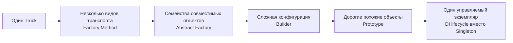

Порождающие паттерны не делают приложение автоматически лучше. Они полезны, когда создание объекта стало отдельной
ответственностью: выбор реализации, проверка совместимости, пошаговая сборка, копирование или управление жизненным
циклом.

## Worked example: создание документа становится отдельной задачей

### Ситуация

Сервис заказов сначала печатает один простой receipt. Потом появляются invoice, delivery note, разные шаблоны для
юридических лиц, локализация и тестовые документы с минимальным набором полей.

### Наивное решение

Добавить большой `when`/`switch` в месте печати: если `receipt`, создать один объект; если `invoice`, создать другой;
если страна `DE`, добавить еще поля; если тест, пропустить часть валидации. Создание смешивается с бизнес-сценарием.

### Что ломается

Код, который должен "оформить заказ", начинает знать детали шаблонов, обязательных полей и совместимости форматов.
Новый документ требует менять старый сценарий. Тесты становятся длинными, потому что валидный объект трудно собрать.

### Улучшение

Выделить создание в отдельную роль: фабрика выбирает тип документа, abstract factory не смешивает семейства шаблонов,
builder собирает сложный документ по шагам, prototype помогает клонировать похожий документ.

### Почему это работает

Порождающий паттерн нужен не потому, что объект создается. Он нужен, когда решение о создании стало самостоятельной
политикой: выбор класса, совместимость семейства, порядок сборки, копирование или lifecycle.

## Что такое паттерн

Паттерн проектирования описывает не конкретную реализацию, а устойчивую форму решения: какие роли участвуют, как они
связаны и какую проблему эта структура снимает. Поэтому один и тот же паттерн в учебнике, в Kotlin-проекте, в C#-сервисе
и в Go-библиотеке может выглядеть по-разному.

Паттерны полезны по трем причинам.

| Причина                | Что это дает в команде                                                              |
|------------------------|-------------------------------------------------------------------------------------|
| Общий словарь          | Фраза "здесь фабричный метод" быстрее объясняет идею, чем длинное описание классов. |
| Опыт типовых проблем   | Паттерн показывает, какие проблемы в принципе возникают при росте кода.             |
| Стандартизация решений | Код легче читать, если распространенная проблема решена распространенным способом.  |

::: tip Важно
Паттерн нужно применять не потому, что он известный, а потому что в коде уже есть конкретная сила, которую он уменьшает:
жесткая зависимость от классов, разрастание `if`, сложный конструктор, дорогая инициализация или глобальное состояние.
:::

### Паттерн - не трафарет

Слово "шаблон" иногда создает неправильное ожидание: будто есть образец, который надо механически перенести в проект.
Это опасное понимание. В реальном коде паттерн почти всегда адаптируется:

- интерфейсы могут заменяться абстрактными классами, функциями или делегатами;
- отдельный класс "директор" в Builder может отсутствовать;
- фабрика может быть обычной функцией, если язык и масштаб задачи это позволяют;
- создание объектов может быть передано DI-контейнеру, но идея управления зависимостями остается той же.

Поэтому при изучении паттернов полезнее задавать не вопрос "как переписать пример из книги", а вопросы:

1. Какая проблема здесь возникает?
2. Какие зависимости сейчас мешают изменять код?
3. Какие роли предлагает паттерн?
4. Какая цена у решения: больше классов, больше абстракций, сложнее отладка?

### Откуда взялись GoF-паттерны

GoF означает Gang of Four - "Банда четырех": Эрих Гамма, Ричард Хелм, Ральф Джонсон и Джон Влиссидес. В 1994 году они
систематизировали и описали 23 паттерна объектно-ориентированного проектирования. Они не "изобрели" эти идеи с нуля:
многие решения уже появлялись в проектах до книги. Ценность книги в том, что она дала этим решениям имена, структуру и
общую классификацию.

## Классификация паттернов GoF

GoF делит паттерны на три большие группы.

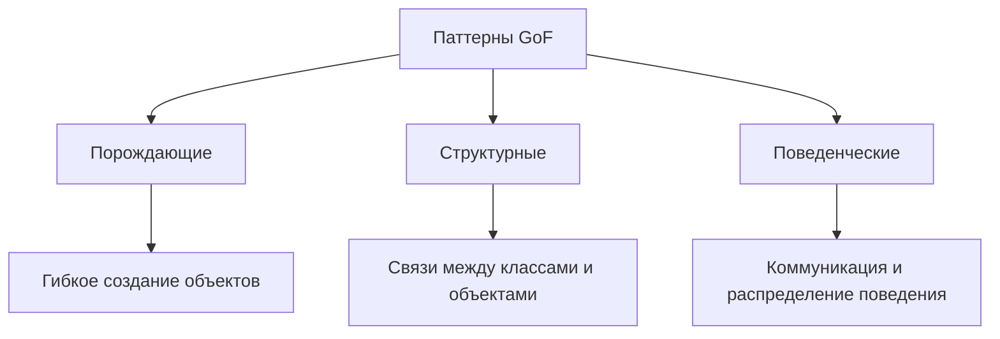

| Группа        | Главный вопрос                                                 | Примеры                                                         |
|---------------|----------------------------------------------------------------|-----------------------------------------------------------------|
| Порождающие   | Как создавать объекты, не привязывая код к конкретным классам? | Factory Method, Abstract Factory, Builder, Prototype, Singleton |
| Структурные   | Как собрать классы и объекты в удобную структуру?              | Adapter, Decorator, Facade, Composite                           |
| Поведенческие | Как распределить поведение и взаимодействие?                   | Strategy, State, Observer, Template Method                      |

::: warning Не путайте Factory Method и Template Method
В исходной лекционной речи местами звучало "шаблонный метод" там, где речь фактически шла о **Factory Method**.
В GoF это разные паттерны. Factory Method относится к порождающим паттернам и отвечает за создание продукта. Template
Method относится к поведенческим паттернам и задает каркас алгоритма, шаги которого переопределяют подклассы.
:::

## Зачем нужны порождающие паттерны

Самый простой способ создать объект - вызвать конструктор.

```kotlin
val sender = SmtpEmailSender("smtp.example.com", 587, "user", "password")
```

Проблема начинается, когда такой вызов появляется внутри бизнес-логики. Класс, который должен, например, оформить заказ,
вдруг начинает знать:

- какой конкретный класс отправляет email;
- какие параметры нужны этому классу;
- как выбирать реализацию для тестов, разработки и продакшена;
- как переиспользовать дорогие зависимости;
- что делать, когда способов доставки уведомлений станет несколько.

Порождающие паттерны выносят решение о создании объекта из кода, который этим объектом пользуется.

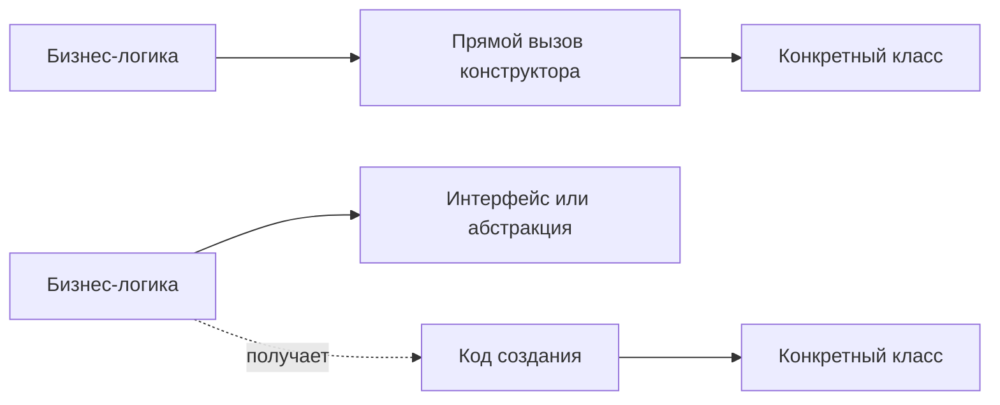

Главная цель не в том, чтобы "запретить `new`". Конструктор все равно где-то будет вызван. Цель в том, чтобы этот вызов
оказался в месте, где выбор конкретного класса действительно уместен: в фабрике, сборщике, композиционном корне
приложения или DI-контейнере.

### Связь с SOLID и тестированием

Порождающие паттерны особенно тесно связаны с принципами из предыдущих лекций.

| Принцип       | Как помогают порождающие паттерны                                  |
|---------------|--------------------------------------------------------------------|
| DIP           | Клиент зависит от интерфейса продукта, а не от конкретного класса. |
| OCP           | Новый продукт можно добавить без переписывания клиентской логики.  |
| SRP           | Логика создания отделяется от логики использования.                |
| Тестируемость | В тестах можно подменить фабрику, билдер или прототип.             |

::: details Когда паттерн уже встроен в язык или фреймворк
Многие идеи GoF стали частью современных языков и библиотек. В Python есть `copy`, в C# и Java есть стандартные способы
копирования и сериализации, во многих веб-фреймворках широко используется Builder, а жизненным циклом объектов часто
управляет DI-контейнер. Это не отменяет паттерны: просто часть ручной работы взял на себя инструмент.
:::

::: only kotlin
В Kotlin часть задач Builder снимают именованные аргументы, default-параметры и `data class.copy`. Но если объект
собирается из нескольких шагов с проверками и зависимостями, отдельный Builder или factory все еще может быть честнее.
:::

::: only csharp
В C# `record`, object initializer и optional parameters часто заменяют учебный Builder для простых DTO. Для объектов с
инвариантами лучше не открывать все свойства на запись, а оставить создание в конструкторе, фабрике или явном builder-е.
:::

::: only java
В Java Builder по-прежнему популярен, потому что без именованных аргументов длинные конструкторы плохо читаются. `record`
удобен для неизменяемых значений, но не заменяет фабрику, если нужно выбрать одну из нескольких реализаций интерфейса.
:::

::: only go
В Go часто используют простые функции-конструкторы и functional options: `NewClient(WithTimeout(...), WithLogger(...))`.
Это не GoF Builder в классическом виде, но решает ту же проблему управляемой конфигурации без телескопического
конструктора.
:::

## Factory Method

**Factory Method** определяет общий интерфейс создания продукта, но оставляет подклассам или конкретным создателям
решение о том, какой класс продукта инстанцировать.

Иначе говоря: клиентский код просит "создай мне объект с нужным интерфейсом", но не знает, будет ли это грузовик,
корабль, тестовая заглушка или другой вариант.

### Проблема

Представим логистическое приложение. В первой версии оно доставляет грузы только грузовиками.

```kotlin
class LogisticsService {
    fun planDelivery(cargoId: String) {
        val transport = Truck()
        transport.deliver(cargoId)
    }
}
```

Пока есть только `Truck`, код кажется нормальным. Затем бизнес просит добавить доставку кораблем, позже самолетом, потом
появляются региональные правила. Самый очевидный путь - добавить условные операторы.

```kotlin
val transport =
    if (type == "road") Truck()
    else if (type == "sea") Ship()
    else Airplane()
```

Такой код плохо растет:

- бизнес-логика начинает отвечать за выбор классов;
- каждое новое транспортное средство заставляет менять старый код;
- тестам сложнее подменить реальный транспорт;
- конструкторы разных классов могут потребовать разные зависимости.

### Решение

Вынесем создание транспорта в отдельную роль - `Logistics`. Конкретная логистика знает, какой транспорт ей нужен.
Клиент работает с абстракциями: `Logistics` и `Transport`.

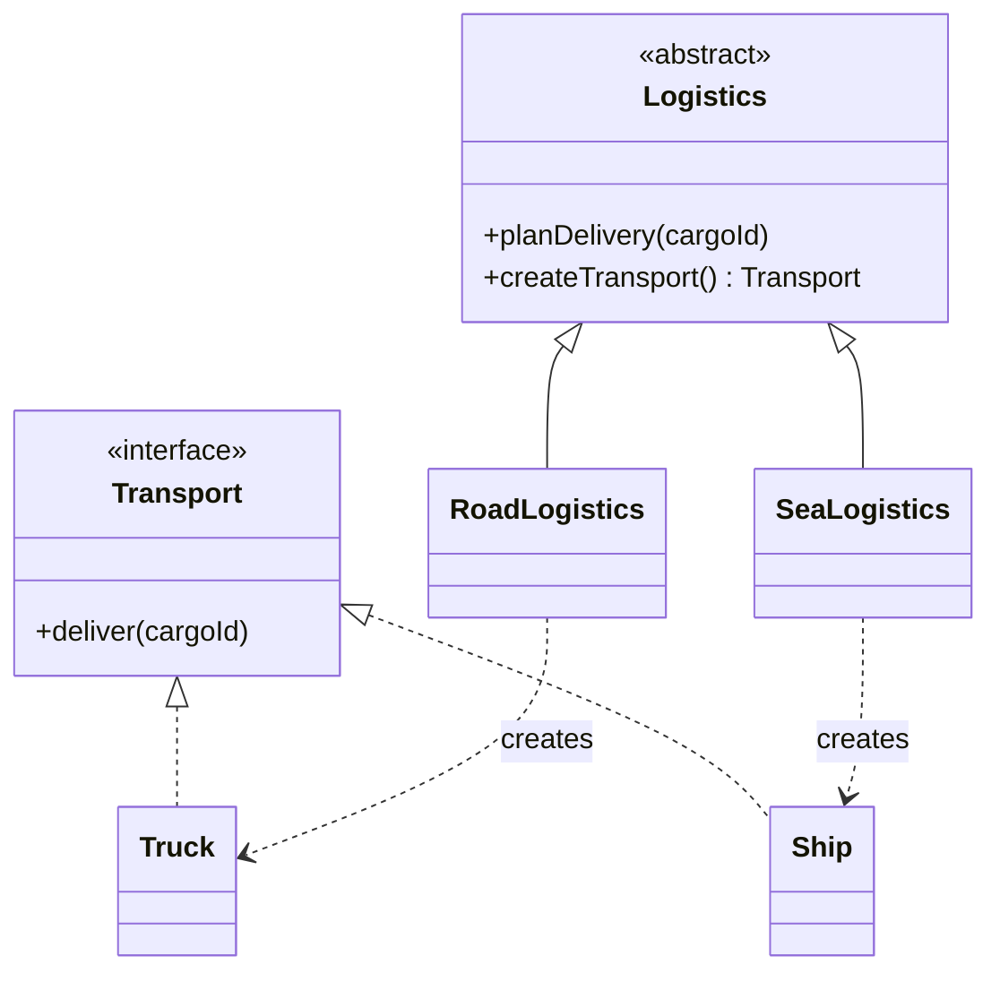

Ключевая идея: метод `planDelivery` может быть общим, а выбор конкретного продукта переносится в `createTransport`.

::: multi-code "Factory Method: логистика" {default=kotlin playground=off}

```kotlin
interface Transport {
    fun deliver(cargoId: String)
}

class Truck : Transport {
    override fun deliver(cargoId: String) {
        println("Груз $cargoId доставлен по дороге")
    }
}

class Ship : Transport {
    override fun deliver(cargoId: String) {
        println("Груз $cargoId доставлен морем")
    }
}

abstract class Logistics {
    fun planDelivery(cargoId: String) {
        val transport = createTransport()
        transport.deliver(cargoId)
    }

    protected abstract fun createTransport(): Transport
}

class RoadLogistics : Logistics() {
    override fun createTransport(): Transport = Truck()
}

class SeaLogistics : Logistics() {
    override fun createTransport(): Transport = Ship()
}
```

```csharp
public interface ITransport
{
    void Deliver(string cargoId);
}

public sealed class Truck : ITransport
{
    public void Deliver(string cargoId) =>
        Console.WriteLine($"Груз {cargoId} доставлен по дороге");
}

public sealed class Ship : ITransport
{
    public void Deliver(string cargoId) =>
        Console.WriteLine($"Груз {cargoId} доставлен морем");
}

public abstract class Logistics
{
    public void PlanDelivery(string cargoId)
    {
        var transport = CreateTransport();
        transport.Deliver(cargoId);
    }

    protected abstract ITransport CreateTransport();
}

public sealed class RoadLogistics : Logistics
{
    protected override ITransport CreateTransport() => new Truck();
}

public sealed class SeaLogistics : Logistics
{
    protected override ITransport CreateTransport() => new Ship();
}
```

```java
interface Transport {
    void deliver(String cargoId);
}

final class Truck implements Transport {
    public void deliver(String cargoId) {
        System.out.println("Груз " + cargoId + " доставлен по дороге");
    }
}

final class Ship implements Transport {
    public void deliver(String cargoId) {
        System.out.println("Груз " + cargoId + " доставлен морем");
    }
}

abstract class Logistics {
    public void planDelivery(String cargoId) {
        Transport transport = createTransport();
        transport.deliver(cargoId);
    }

    protected abstract Transport createTransport();
}

final class RoadLogistics extends Logistics {
    protected Transport createTransport() { return new Truck(); }
}

final class SeaLogistics extends Logistics {
    protected Transport createTransport() { return new Ship(); }
}
```

```go
type Transport interface {
    Deliver(cargoID string)
}

type Truck struct{}
func (Truck) Deliver(cargoID string) {}

type Ship struct{}
func (Ship) Deliver(cargoID string) {}

type Logistics interface {
    CreateTransport() Transport
}

type RoadLogistics struct{}
func (RoadLogistics) CreateTransport() Transport { return Truck{} }

type SeaLogistics struct{}
func (SeaLogistics) CreateTransport() Transport { return Ship{} }

func PlanDelivery(logistics Logistics, cargoID string) {
    transport := logistics.CreateTransport()
    transport.Deliver(cargoID)
}
```

:::

### Где выбирается конкретная фабрика

Factory Method не отменяет необходимость выбрать конкретный вариант. Он переносит выбор ближе к старту сценария:
конфигурации, обработчику команды, composition root или точке подключения модуля.

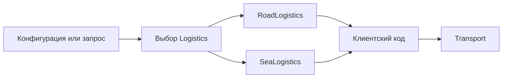

::: multi-code "Factory Method: использование" {default=kotlin playground=off}

```kotlin
fun logisticsFor(routeType: String): Logistics =
    when (routeType) {
        "road" -> RoadLogistics()
        "sea" -> SeaLogistics()
        else -> error("Неизвестный тип маршрута: $routeType")
    }

fun main() {
    val logistics = logisticsFor("sea")
    logistics.planDelivery("ORD-42")
}
```

```csharp
static Logistics LogisticsFor(string routeType) =>
    routeType switch
    {
        "road" => new RoadLogistics(),
        "sea" => new SeaLogistics(),
        _ => throw new ArgumentException($"Неизвестный тип маршрута: {routeType}")
    };

var logistics = LogisticsFor("sea");
logistics.PlanDelivery("ORD-42");
```

```java
static Logistics logisticsFor(String routeType) {
    return switch (routeType) {
        case "road" -> new RoadLogistics();
        case "sea" -> new SeaLogistics();
        default -> throw new IllegalArgumentException("Неизвестный тип маршрута: " + routeType);
    };
}

Logistics logistics = logisticsFor("sea");
logistics.planDelivery("ORD-42");
```

```go
func LogisticsFor(routeType string) Logistics {
    switch routeType {
    case "road":
        return RoadLogistics{}
    case "sea":
        return SeaLogistics{}
    default:
        panic("unknown route type")
    }
}

logistics := LogisticsFor("sea")
PlanDelivery(logistics, "ORD-42")
```

:::

### Применимость

Factory Method хорошо подходит, когда:

- клиентский код не должен зависеть от конкретных классов создаваемых объектов;
- заранее неизвестно, какие продукты появятся позже;
- библиотека или фреймворк должны позволять пользователю добавить собственный тип продукта;
- в тестах нужно подменять реальный продукт фейковым;
- создание продукта требует отдельной логики: кеширования, выбора зависимостей, проверки доступности ресурсов.

### Плюсы и минусы

| Плюсы                                                       | Минусы                                                         |
|-------------------------------------------------------------|----------------------------------------------------------------|
| Убирает прямую зависимость клиента от конкретного продукта. | Добавляет новые классы или функции создания.                   |
| Выносит создание продукта в одно место.                     | Может привести к параллельным иерархиям `Product` и `Creator`. |
| Упрощает расширение новыми продуктами.                      | Для маленьких задач может быть избыточен.                      |
| Помогает тестированию через подмену создателя или продукта. | Не решает сам по себе проблему выбора нужной фабрики.          |

::: warning Типичная ошибка
Не стоит создавать Factory Method для каждого простого `data class` или DTO. Если объект тривиален, не имеет вариантов
создания и не создает зависимости в бизнес-логике, обычный конструктор проще и понятнее.
:::

## Abstract Factory

**Abstract Factory** предоставляет интерфейс для создания семейства связанных объектов, не раскрывая их конкретные
классы.

Factory Method обычно создает один продукт. Abstract Factory создает несколько продуктов, которые должны быть
совместимы друг с другом.

### Проблема

Представим интернет-магазин мебели. На странице нужно показывать кресло, диван и столик в одном стиле: модерн,
викторианский или лофт. Если клиент выбрал стиль "модерн", нельзя случайно создать модерн-кресло и викторианский столик.
Эти объекты разные по типам, но образуют одно семейство.

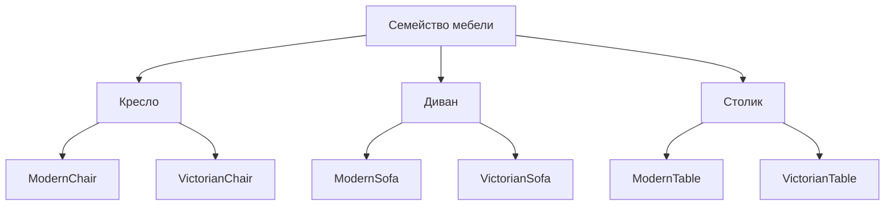

Если создавать каждый объект отдельно, легко ошибиться:

```kotlin
val chair = ModernChair()
val sofa = ModernSofa()
val table = VictorianTable() // несовместимый стиль
```

### Решение

Создадим фабрику, которая отвечает за целое семейство. `ModernFurnitureFactory` создает только модерн-продукты,
`VictorianFurnitureFactory` - только викторианские.

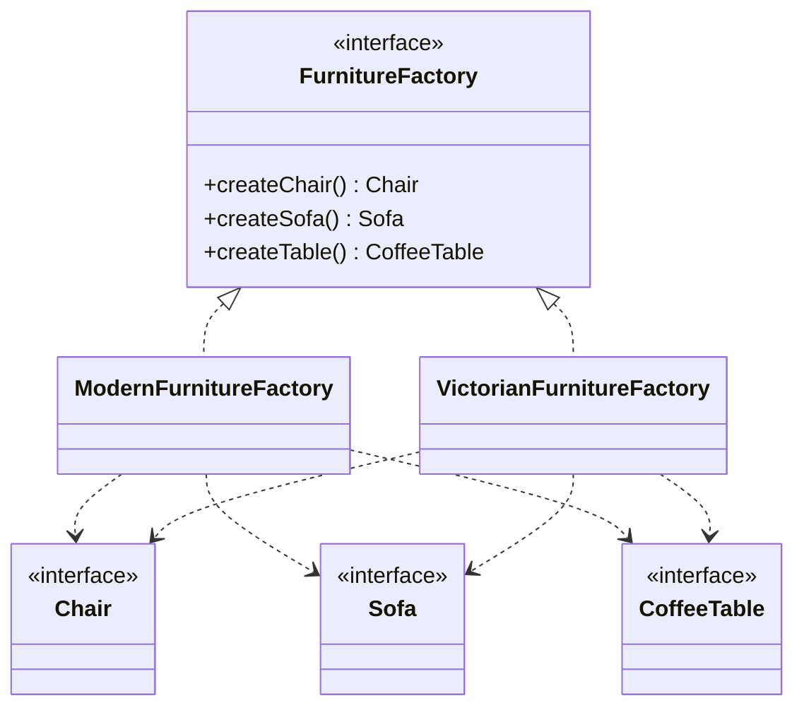

::: multi-code "Abstract Factory: семейство мебели" {default=kotlin playground=off}

```kotlin
interface Chair {
    fun sitOn(): String
}

interface Sofa {
    fun lieOn(): String
}

interface CoffeeTable {
    fun placeCup(): String
}

interface FurnitureFactory {
    fun createChair(): Chair
    fun createSofa(): Sofa
    fun createTable(): CoffeeTable
}

class ModernChair : Chair {
    override fun sitOn() = "Сидим в современном кресле"
}

class ModernSofa : Sofa {
    override fun lieOn() = "Лежим на современном диване"
}

class ModernTable : CoffeeTable {
    override fun placeCup() = "Ставим чашку на современный столик"
}

class ModernFurnitureFactory : FurnitureFactory {
    override fun createChair(): Chair = ModernChair()
    override fun createSofa(): Sofa = ModernSofa()
    override fun createTable(): CoffeeTable = ModernTable()
}

class VictorianChair : Chair {
    override fun sitOn() = "Сидим в викторианском кресле"
}

class VictorianSofa : Sofa {
    override fun lieOn() = "Лежим на викторианском диване"
}

class VictorianTable : CoffeeTable {
    override fun placeCup() = "Ставим чашку на викторианский столик"
}

class VictorianFurnitureFactory : FurnitureFactory {
    override fun createChair(): Chair = VictorianChair()
    override fun createSofa(): Sofa = VictorianSofa()
    override fun createTable(): CoffeeTable = VictorianTable()
}
```

```csharp
public interface IChair
{
    string SitOn();
}

public interface ISofa
{
    string LieOn();
}

public interface ICoffeeTable
{
    string PlaceCup();
}

public interface IFurnitureFactory
{
    IChair CreateChair();
    ISofa CreateSofa();
    ICoffeeTable CreateTable();
}

public sealed class ModernChair : IChair
{
    public string SitOn() => "Сидим в современном кресле";
}

public sealed class ModernSofa : ISofa
{
    public string LieOn() => "Лежим на современном диване";
}

public sealed class ModernTable : ICoffeeTable
{
    public string PlaceCup() => "Ставим чашку на современный столик";
}

public sealed class ModernFurnitureFactory : IFurnitureFactory
{
    public IChair CreateChair() => new ModernChair();
    public ISofa CreateSofa() => new ModernSofa();
    public ICoffeeTable CreateTable() => new ModernTable();
}

public sealed class VictorianChair : IChair
{
    public string SitOn() => "Сидим в викторианском кресле";
}

public sealed class VictorianSofa : ISofa
{
    public string LieOn() => "Лежим на викторианском диване";
}

public sealed class VictorianTable : ICoffeeTable
{
    public string PlaceCup() => "Ставим чашку на викторианский столик";
}

public sealed class VictorianFurnitureFactory : IFurnitureFactory
{
    public IChair CreateChair() => new VictorianChair();
    public ISofa CreateSofa() => new VictorianSofa();
    public ICoffeeTable CreateTable() => new VictorianTable();
}
```

```java
interface Chair {
    String sitOn();
}

interface Sofa {
    String lieOn();
}

interface CoffeeTable {
    String placeCup();
}

interface FurnitureFactory {
    Chair createChair();
    Sofa createSofa();
    CoffeeTable createTable();
}

final class ModernChair implements Chair {
    public String sitOn() { return "Сидим в современном кресле"; }
}

final class ModernSofa implements Sofa {
    public String lieOn() { return "Лежим на современном диване"; }
}

final class ModernTable implements CoffeeTable {
    public String placeCup() { return "Ставим чашку на современный столик"; }
}

final class ModernFurnitureFactory implements FurnitureFactory {
    public Chair createChair() { return new ModernChair(); }
    public Sofa createSofa() { return new ModernSofa(); }
    public CoffeeTable createTable() { return new ModernTable(); }
}

final class VictorianChair implements Chair {
    public String sitOn() { return "Сидим в викторианском кресле"; }
}

final class VictorianSofa implements Sofa {
    public String lieOn() { return "Лежим на викторианском диване"; }
}

final class VictorianTable implements CoffeeTable {
    public String placeCup() { return "Ставим чашку на викторианский столик"; }
}

final class VictorianFurnitureFactory implements FurnitureFactory {
    public Chair createChair() { return new VictorianChair(); }
    public Sofa createSofa() { return new VictorianSofa(); }
    public CoffeeTable createTable() { return new VictorianTable(); }
}
```

```go
type Chair interface {
    SitOn() string
}

type Sofa interface {
    LieOn() string
}

type CoffeeTable interface {
    PlaceCup() string
}

type FurnitureFactory interface {
    CreateChair() Chair
    CreateSofa() Sofa
    CreateTable() CoffeeTable
}

type ModernChair struct{}
func (ModernChair) SitOn() string { return "Сидим в современном кресле" }

type ModernSofa struct{}
func (ModernSofa) LieOn() string { return "Лежим на современном диване" }

type ModernTable struct{}
func (ModernTable) PlaceCup() string { return "Ставим чашку на современный столик" }

type ModernFurnitureFactory struct{}
func (ModernFurnitureFactory) CreateChair() Chair { return ModernChair{} }
func (ModernFurnitureFactory) CreateSofa() Sofa { return ModernSofa{} }
func (ModernFurnitureFactory) CreateTable() CoffeeTable { return ModernTable{} }

type VictorianChair struct{}
func (VictorianChair) SitOn() string { return "Сидим в викторианском кресле" }

type VictorianSofa struct{}
func (VictorianSofa) LieOn() string { return "Лежим на викторианском диване" }

type VictorianTable struct{}
func (VictorianTable) PlaceCup() string { return "Ставим чашку на викторианский столик" }

type VictorianFurnitureFactory struct{}
func (VictorianFurnitureFactory) CreateChair() Chair { return VictorianChair{} }
func (VictorianFurnitureFactory) CreateSofa() Sofa { return VictorianSofa{} }
func (VictorianFurnitureFactory) CreateTable() CoffeeTable { return VictorianTable{} }
```

:::

Клиентский код получает фабрику и больше не принимает решений о конкретных классах.

::: multi-code "Abstract Factory: клиент" {default=kotlin playground=off}

```kotlin
class RoomPage(private val factory: FurnitureFactory) {
    fun render(): List<String> {
        val chair = factory.createChair()
        val sofa = factory.createSofa()
        val table = factory.createTable()

        return listOf(chair.sitOn(), sofa.lieOn(), table.placeCup())
    }
}
```

```csharp
public sealed class RoomPage
{
    private readonly IFurnitureFactory _factory;

    public RoomPage(IFurnitureFactory factory)
    {
        _factory = factory;
    }

    public IReadOnlyList<string> Render()
    {
        var chair = _factory.CreateChair();
        var sofa = _factory.CreateSofa();
        var table = _factory.CreateTable();

        return [chair.SitOn(), sofa.LieOn(), table.PlaceCup()];
    }
}
```

```java
final class RoomPage {
    private final FurnitureFactory factory;

    RoomPage(FurnitureFactory factory) {
        this.factory = factory;
    }

    List<String> render() {
        Chair chair = factory.createChair();
        Sofa sofa = factory.createSofa();
        CoffeeTable table = factory.createTable();
        return List.of(chair.sitOn(), sofa.lieOn(), table.placeCup());
    }
}
```

```go
func RenderRoom(factory FurnitureFactory) []string {
    chair := factory.CreateChair()
    sofa := factory.CreateSofa()
    table := factory.CreateTable()

    return []string{chair.SitOn(), sofa.LieOn(), table.PlaceCup()}
}
```

:::

Выбор конкретной фабрики остается отдельным решением. Обычно он происходит один раз на границе сценария: по настройке,
параметру запроса, платформе или выбранной теме.

```kotlin
fun furnitureFactory(style: String): FurnitureFactory =
    when (style) {
        "modern" -> ModernFurnitureFactory()
        "victorian" -> VictorianFurnitureFactory()
        else -> error("Неизвестный стиль мебели: $style")
    }

val page = RoomPage(furnitureFactory("victorian"))
```

### Factory Method или Abstract Factory

| Вопрос                           | Factory Method                                     | Abstract Factory                                                     |
|----------------------------------|----------------------------------------------------|----------------------------------------------------------------------|
| Сколько типов продуктов создаем? | Обычно один.                                       | Несколько связанных типов.                                           |
| Что важно сохранить?             | Независимость от конкретного класса продукта.      | Совместимость продуктов внутри семейства.                            |
| Что сложнее добавить?            | Новый продукт обычно добавляется новым создателем. | Новый тип продукта требует изменить интерфейс фабрики и все фабрики. |
| Типичный пример                  | `RoadLogistics` создает `Truck`.                   | `ModernFactory` создает `Chair`, `Sofa`, `Table`.                    |

### Применимость

Abstract Factory применима, когда:

- нужно создавать семейства связанных объектов;
- нельзя смешивать продукты из разных семейств;
- бизнес-логика должна работать с абстрактными продуктами;
- в системе уже есть несколько фабричных методов, и они начали логически объединяться в набор;
- вариант семейства выбирается конфигурацией, платформой, темой интерфейса, тарифом или типом клиента.

### Плюсы и минусы

| Плюсы                                                 | Минусы                                                        |
|-------------------------------------------------------|---------------------------------------------------------------|
| Гарантирует совместимость продуктов одного семейства. | Усложняет структуру проекта.                                  |
| Изолирует код создания от клиента.                    | Требует реализовать все продукты в каждой фабрике.            |
| Упрощает замену целой линейки продуктов.              | Новый тип продукта меняет интерфейс фабрики и все реализации. |
| Поддерживает OCP для добавления новых семейств.       | Может быть избыточна, если продукты не связаны по смыслу.     |

::: warning Типичная ошибка
Не называйте любую функцию создания "абстрактной фабрикой". Если создается один объект, это ближе к Factory Method или
простой фабричной функции. Abstract Factory нужна именно тогда, когда есть семейство связанных продуктов.
:::

## Builder

**Builder** отделяет пошаговое конструирование сложного объекта от его представления. Один и тот же процесс сборки может
создавать разные варианты объекта.

### Проблема телескопического конструктора

Иногда объект имеет много параметров, часть из которых необязательна.

```kotlin
class Report(
    val title: String,
    val author: String?,
    val includeCharts: Boolean,
    val includeAppendix: Boolean,
    val format: String,
    val watermark: String?,
    val pageSize: String
)
```

Вызов такого конструктора быстро становится нечитаемым.

```kotlin
val report = Report("Продажи", null, true, false, "pdf", null, "A4")
```

Проблемы:

- непонятно, что означает каждый аргумент;
- легко перепутать параметры одинакового типа;
- появляются перегруженные конструкторы для разных комбинаций;
- часть объекта может требовать последовательных шагов подготовки;
- нужно запретить получение невалидного промежуточного состояния.

### Решение

Builder предоставляет понятные шаги сборки. Клиент вызывает только те шаги, которые нужны для конкретного результата.
Если порядок шагов важен и повторяется, его можно вынести в отдельного **директора**.

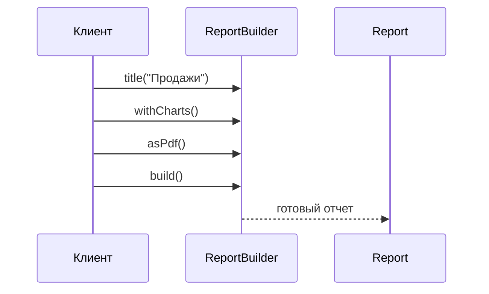

::: multi-code "Builder: отчет" {default=kotlin playground=off}

```kotlin
data class Report(
    val title: String,
    val author: String?,
    val includeCharts: Boolean,
    val includeAppendix: Boolean,
    val format: String,
    val watermark: String?,
    val pageSize: String
)

class ReportBuilder {
    private var title: String? = null
    private var author: String? = null
    private var includeCharts = false
    private var includeAppendix = false
    private var format = "html"
    private var watermark: String? = null
    private var pageSize = "A4"

    fun title(value: String) = apply { title = value }
    fun author(value: String) = apply { author = value }
    fun withCharts() = apply { includeCharts = true }
    fun withAppendix() = apply { includeAppendix = true }
    fun asPdf() = apply { format = "pdf" }
    fun watermark(value: String) = apply { watermark = value }
    fun pageSize(value: String) = apply { pageSize = value }

    fun build(): Report {
        val requiredTitle = title ?: error("Report title is required")
        return Report(requiredTitle, author, includeCharts, includeAppendix, format, watermark, pageSize)
    }
}

val report = ReportBuilder()
    .title("Продажи")
    .author("Аналитический отдел")
    .withCharts()
    .asPdf()
    .build()
```

```csharp
public sealed record Report(
    string Title,
    string? Author,
    bool IncludeCharts,
    bool IncludeAppendix,
    string Format,
    string? Watermark,
    string PageSize);

public sealed class ReportBuilder
{
    private string? _title;
    private string? _author;
    private bool _includeCharts;
    private bool _includeAppendix;
    private string _format = "html";
    private string? _watermark;
    private string _pageSize = "A4";

    public ReportBuilder Title(string value) { _title = value; return this; }
    public ReportBuilder Author(string value) { _author = value; return this; }
    public ReportBuilder WithCharts() { _includeCharts = true; return this; }
    public ReportBuilder WithAppendix() { _includeAppendix = true; return this; }
    public ReportBuilder AsPdf() { _format = "pdf"; return this; }
    public ReportBuilder Watermark(string value) { _watermark = value; return this; }
    public ReportBuilder PageSize(string value) { _pageSize = value; return this; }

    public Report Build()
    {
        if (_title is null) throw new InvalidOperationException("Report title is required");
        return new Report(_title, _author, _includeCharts, _includeAppendix, _format, _watermark, _pageSize);
    }
}

var report = new ReportBuilder()
    .Title("Продажи")
    .Author("Аналитический отдел")
    .WithCharts()
    .AsPdf()
    .Build();
```

```java
record Report(
    String title,
    String author,
    boolean includeCharts,
    boolean includeAppendix,
    String format,
    String watermark,
    String pageSize
) {}

final class ReportBuilder {
    private String title;
    private String author;
    private boolean includeCharts;
    private boolean includeAppendix;
    private String format = "html";
    private String watermark;
    private String pageSize = "A4";

    ReportBuilder title(String value) { title = value; return this; }
    ReportBuilder author(String value) { author = value; return this; }
    ReportBuilder withCharts() { includeCharts = true; return this; }
    ReportBuilder withAppendix() { includeAppendix = true; return this; }
    ReportBuilder asPdf() { format = "pdf"; return this; }
    ReportBuilder watermark(String value) { watermark = value; return this; }
    ReportBuilder pageSize(String value) { pageSize = value; return this; }

    Report build() {
        if (title == null) throw new IllegalStateException("Report title is required");
        return new Report(title, author, includeCharts, includeAppendix, format, watermark, pageSize);
    }
}
```

```go
type Report struct {
    Title          string
    Author         string
    IncludeCharts  bool
    IncludeAppendix bool
    Format         string
    Watermark      string
    PageSize       string
}

type ReportBuilder struct {
    report Report
}

func NewReportBuilder() *ReportBuilder {
    return &ReportBuilder{report: Report{Format: "html", PageSize: "A4"}}
}

func (b *ReportBuilder) Title(value string) *ReportBuilder {
    b.report.Title = value
    return b
}

func (b *ReportBuilder) WithCharts() *ReportBuilder {
    b.report.IncludeCharts = true
    return b
}

func (b *ReportBuilder) AsPDF() *ReportBuilder {
    b.report.Format = "pdf"
    return b
}

func (b *ReportBuilder) Build() Report {
    if b.report.Title == "" {
        panic("report title is required")
    }
    return b.report
}
```

:::

::: only go
В Go вместо классического Builder часто используют **functional options** — функции, каждая из которых настраивает одно
поле. Сравните:

```go
// Классический Builder (как выше)
report := NewReportBuilder().
    Title("Продажи").
    WithCharts().
    AsPDF().
    Build()

// Functional options — нет отдельного типа Builder
report := NewReport(
    WithTitle("Продажи"),
    WithCharts(),
    AsPDF(),
)
```

Functional options проще: не нужен отдельный тип Builder, нет мутабельного промежуточного состояния, и `NewReport`
остаётся единственной точкой создания. Классический Builder оправдан, когда нужна валидация по шагам или когда один
builder создаёт разные представления (PDF, HTML, DOCX).
:::

::: only kotlin
Kotlin `apply` и `also` дают **builder-подобный** синтаксис без отдельного класса:

```kotlin
val config = ServerConfig().apply {
    host = "api.example.com"
    port = 8080
    maxConnections = 100
}
```

Это удобно для простых конфигурационных объектов. Но если нужна валидация в `build()`, пошаговая сборка или создание
неизменяемого результата из изменяемого процесса — полноценный Builder всё ещё лучше.
:::

### Директор

Директор не обязателен. Он нужен, когда в приложении есть повторяемые сценарии сборки.

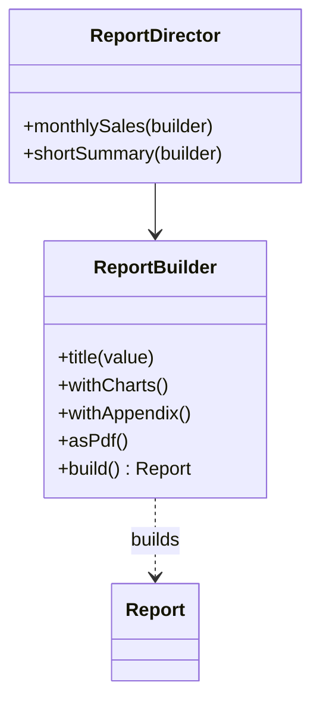

```kotlin
class ReportDirector {
    fun monthlySales(): Report =
        ReportBuilder()
            .title("Ежемесячные продажи")
            .withCharts()
            .withAppendix()
            .asPdf()
            .build()

    fun shortSummary(): Report =
        ReportBuilder()
            .title("Краткая сводка")
            .build()
}
```

### Builder и неизменяемость

Частая хорошая практика: Builder изменяемый, а результат - неизменяемый. Это дает удобную сборку и безопасный готовый
объект.


### Применимость

Builder подходит, когда:

- конструктор разрастается до множества параметров;
- есть несколько валидных конфигураций одного объекта;
- объект должен собираться по шагам;
- разные продукты создаются похожей последовательностью шагов;
- нужно защитить готовый объект от частично заполненного состояния;
- в коде много перегруженных конструкторов ради разных комбинаций параметров.

### Плюсы и минусы

| Плюсы                                                | Минусы                                                       |
|------------------------------------------------------|--------------------------------------------------------------|
| Делает создание сложного объекта читаемым.           | Добавляет отдельный класс или несколько классов.             |
| Позволяет валидировать результат в `build()`.        | Может скрыть слишком сложную модель вместо ее упрощения.     |
| Убирает телескопические конструкторы.                | Для простых объектов выглядит тяжелее обычного конструктора. |
| Поддерживает разные сценарии сборки через директора. | Изменяемый builder нужно аккуратно переиспользовать.         |

::: warning Типичная ошибка
Builder не должен превращаться в контейнер для всей бизнес-логики объекта. Его задача - собрать валидный объект.
Поведение
готового объекта должно оставаться в самом объекте или в соответствующем сервисе.
:::

## Prototype

Builder собирает сложный объект по шагам из ничего. Но что если нужный объект уже существует, и требуется получить
похожий с небольшими изменениями? Копировать вручную каждое поле — дорого и хрупко: при добавлении нового поля легко
забыть его скопировать. Prototype решает эту задачу.

**Prototype** создает новые объекты путем копирования существующего объекта-прототипа.

### Проблема

Иногда новый объект почти совпадает с уже существующим. Например:

- пользователь редактирует форму, и изменения можно отменить;
- нужно быстро создать много похожих игровых объектов;
- создание объекта дорогое: он содержит подготовленные настройки, кеши или структуру зависимостей;
- код не должен знать конкретный класс объекта, но должен уметь получить его копию.

Простое присваивание переменной не создает копию ссылочного объекта.

```kotlin
val original = Document("Договор", listOf("Раздел 1"))
val copy = original
```

Теперь `original` и `copy` указывают на один объект. Если объект изменяемый, изменение через одну переменную будет видно
через другую.

### Решение

Объект сам предоставляет операцию копирования. Клиент не знает конкретный класс и не повторяет сложную инициализацию.

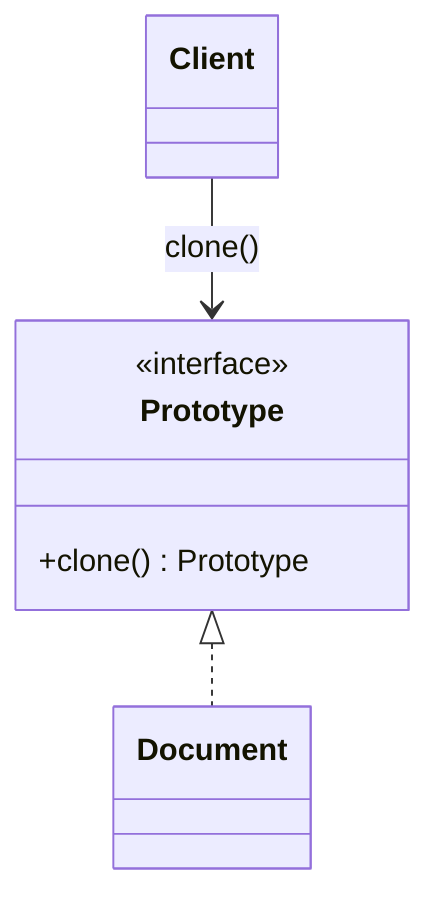

::: multi-code "Prototype: копирование документа" {default=kotlin playground=off}

```kotlin
interface Prototype<T> {
    fun clone(): T
}

data class Document(
    val title: String,
    val sections: MutableList<String>
) : Prototype<Document> {
    override fun clone(): Document =
        Document(title, sections.toMutableList())
}

val draft = Document("Договор", mutableListOf("Предмет договора"))
val editableCopy = draft.clone()
editableCopy.sections += "Сроки"
```

```csharp
public interface IPrototype<out T>
{
    T Clone();
}

public sealed class Document : IPrototype<Document>
{
    public string Title { get; }
    public List<string> Sections { get; }

    public Document(string title, List<string> sections)
    {
        Title = title;
        Sections = sections;
    }

    public Document Clone() =>
        new Document(Title, new List<string>(Sections));
}

var draft = new Document("Договор", ["Предмет договора"]);
var editableCopy = draft.Clone();
editableCopy.Sections.Add("Сроки");
```

```java
final class Document {
    private final String title;
    private final List<String> sections;

    Document(String title, List<String> sections) {
        this.title = title;
        this.sections = sections;
    }

    Document copy() {
        return new Document(title, new ArrayList<>(sections));
    }
}

Document draft = new Document("Договор", new ArrayList<>(List.of("Предмет договора")));
Document editableCopy = draft.copy();
```

```go
type Document struct {
    Title    string
    Sections []string
}

func (d Document) Clone() Document {
    sections := make([]string, len(d.Sections))
    copy(sections, d.Sections)
    return Document{Title: d.Title, Sections: sections}
}

draft := Document{Title: "Договор", Sections: []string{"Предмет договора"}}
editableCopy := draft.Clone()
editableCopy.Sections = append(editableCopy.Sections, "Сроки")
```

:::

::: only kotlin
Kotlin решил Prototype элегантнее других языков курса. Любой `data class` автоматически получает метод `copy()` с
именованными параметрами — можно скопировать объект, изменив только нужные поля:

```kotlin
data class Config(val host: String, val port: Int, val debug: Boolean)

val production = Config("api.example.com", 443, debug = false)
val staging = production.copy(host = "staging.example.com", debug = true)
```

Для плоских (без вложенных мутабельных объектов) `data class` это покрывает 90% сценариев Prototype без единого
дополнительного интерфейса.
:::

### Поверхностное и глубокое копирование

Самая важная тема в Prototype - глубина копирования.

| Вид копирования | Что копируется                                                | Риск                                                  |
|-----------------|---------------------------------------------------------------|-------------------------------------------------------|
| Поверхностное   | Новый объект, но вложенные ссылочные объекты остаются общими. | Копия может случайно изменить состояние оригинала.    |
| Глубокое        | Новый объект и новые копии вложенных изменяемых объектов.     | Реализация сложнее, особенно при циклических ссылках. |

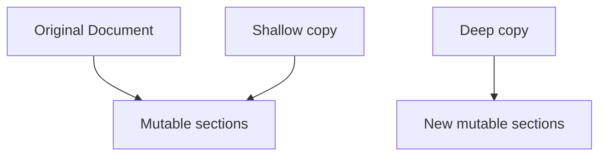

Вот конкретный баг shallow copy:

```kotlin
data class Order(val id: String, val items: MutableList<String>)

val original = Order("ORD-1", mutableListOf("Widget"))
val copy = original.copy()  // shallow: items — тот же список!

copy.items += "Gadget"
println(original.items) // [Widget, Gadget] — оригинал изменился!
```

Решение: при копировании явно создать новый список — `original.copy(items = original.items.toMutableList())`.

::: warning Типичная ошибка
Если у объекта есть изменяемые коллекции или вложенные ссылочные объекты, недостаточно скопировать только верхний
объект.
Нужно явно решить, какие вложенные данные должны быть общими, а какие должны копироваться.
:::

### Применимость

Prototype подходит, когда:

- создание объекта дорогое, а копирование дешевле;
- нужны похожие объекты с небольшими различиями;
- клиентский код не должен зависеть от конкретного класса объекта;
- объект уже находится в нужном runtime-состоянии, и это состояние нужно взять за основу;
- нужно реализовать сценарий "редактировать копию и отменить изменения".

### Плюсы и минусы

| Плюсы                                                      | Минусы                                                                             |
|------------------------------------------------------------|------------------------------------------------------------------------------------|
| Убирает повторяющуюся инициализацию похожих объектов.      | Глубокое копирование может быть сложным.                                           |
| Позволяет копировать объект без знания конкретного класса. | Циклические ссылки требуют специальных правил.                                     |
| Может ускорить создание объектов.                          | Нужно документировать, что именно копируется.                                      |
| Удобен для undo/cancel-сценариев.                          | Копирование ресурсов вроде файловых дескрипторов и соединений не всегда корректно. |

## Singleton

Prototype решает задачу «создать похожий объект». Но бывают объекты, которые *нельзя* создавать многократно: пул
соединений, конфигурация приложения, глобальный счётчик метрик. Здесь задача противоположная — не «создать ещё один»,
а «убедиться, что он ровно один».

**Singleton** гарантирует, что у класса есть только один экземпляр, и предоставляет глобальную точку доступа к нему.

В GoF это порождающий паттерн, потому что он контролирует создание объекта. В современной разработке Singleton часто
критикуют: он легко превращается в глобальное состояние, усложняет тестирование и плохо сочетается с многопоточностью,
если реализован наивно.

### Структура

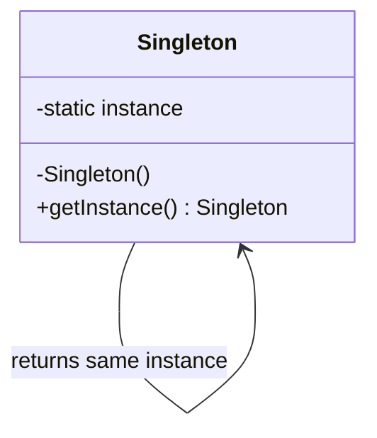

Минимальная идея выглядит так:

```kotlin
class AppSettings private constructor() {
    companion object {
        private var instance: AppSettings? = null

        fun getInstance(): AppSettings {
            if (instance == null) {
                instance = AppSettings()
            }
            return instance!!
        }
    }
}
```

На первый взгляд код простой: конструктор закрыт, экземпляр хранится статически, `getInstance()` возвращает один и тот
же объект. Но у этой версии сразу несколько проблем.

### Проблемы Singleton

| Проблема             | Почему это важно                                                                 |
|----------------------|----------------------------------------------------------------------------------|
| Глобальное состояние | Любой код может получить объект и изменить его; зависимости становятся неявными. |
| Сложное тестирование | Тесты начинают влиять друг на друга через общий экземпляр.                       |
| Многопоточность      | Два потока могут одновременно увидеть `instance == null` и создать два объекта.  |
| Скрытые зависимости  | По конструктору класса не видно, что он использует Singleton.                    |
| Жизненный цикл       | Непонятно, когда объект создается и когда освобождает ресурсы.                   |

Конкретный пример проблемы тестирования:

```kotlin
// Тест A
AppSettings.getInstance().currency = "USD"
assert(service.formatTotal(100) == "100 USD") // ✅

// Тест B (запускается после A)
// Ожидает дефолтный currency = "RUB", но Singleton помнит "USD" из теста A!
assert(service.formatTotal(100) == "100 RUB") // ❌ получили "100 USD"
```

Тесты перестают быть независимыми. Порядок запуска влияет на результат. В параллельном запуске результаты становятся
недетерминированными.

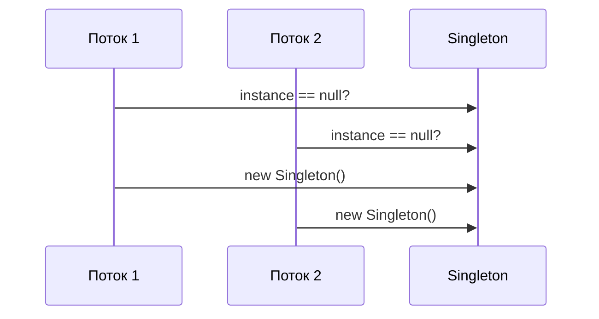

::: warning Singleton не равен "один объект в приложении"
Иногда объект действительно должен существовать в единственном экземпляре: конфигурация, пул соединений, клиент к
внешней
системе. Но это не означает, что класс обязан сам быть Singleton. Часто лучше создать обычный класс и поручить
управление
его жизненным циклом DI-контейнеру или композиционному корню приложения.
:::

### Современная альтернатива: управление жизненным циклом

Вместо того чтобы зашивать глобальный доступ в класс, можно передавать зависимость явно.

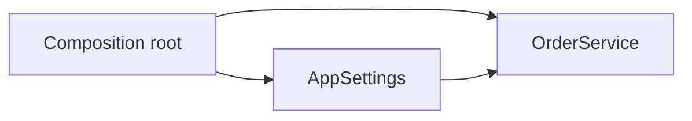

```kotlin
class AppSettings(val currency: String)

class OrderService(private val settings: AppSettings) {
    fun formatTotal(amount: Int): String = "$amount ${settings.currency}"
}

fun main() {
    val settings = AppSettings("RUB")
    val service = OrderService(settings)
}
```

Такой подход сохраняет возможность иметь один объект настроек в приложении, но зависимости становятся явными и легко
подменяются в тестах.

### Когда Singleton все же встречается

Singleton можно встретить:

- в старых кодовых базах;
- в реализациях логгеров и конфигураций;
- в SDK, где авторы скрывают управление клиентом;
- в объектах, представляющих stateless-сервис, хотя и там часто достаточно обычной функции или DI;
- в инфраструктурном коде, где жизненный цикл строго контролируется.

### Плюсы и минусы

| Плюсы                                        | Минусы                                               |
|----------------------------------------------|------------------------------------------------------|
| Гарантирует одну точку доступа к экземпляру. | Вводит глобальное состояние.                         |
| Может лениво создавать дорогой объект.       | Усложняет тестирование и параллельный запуск тестов. |
| Иногда удобен для инфраструктуры.            | Требует потокобезопасной реализации.                 |
| Контролирует создание объекта внутри класса. | Скрывает зависимости от читателя кода.               |

::: tip Практическое правило
Если хочется сделать Singleton, сначала попробуйте обычный класс + явное внедрение зависимости. Если нужен один
экземпляр,
задайте singleton-жизненный цикл в DI-контейнере или создайте объект один раз в composition root.
:::

## Как выбирать порождающий паттерн

Начинайте не с названия паттерна, а с проблемы.

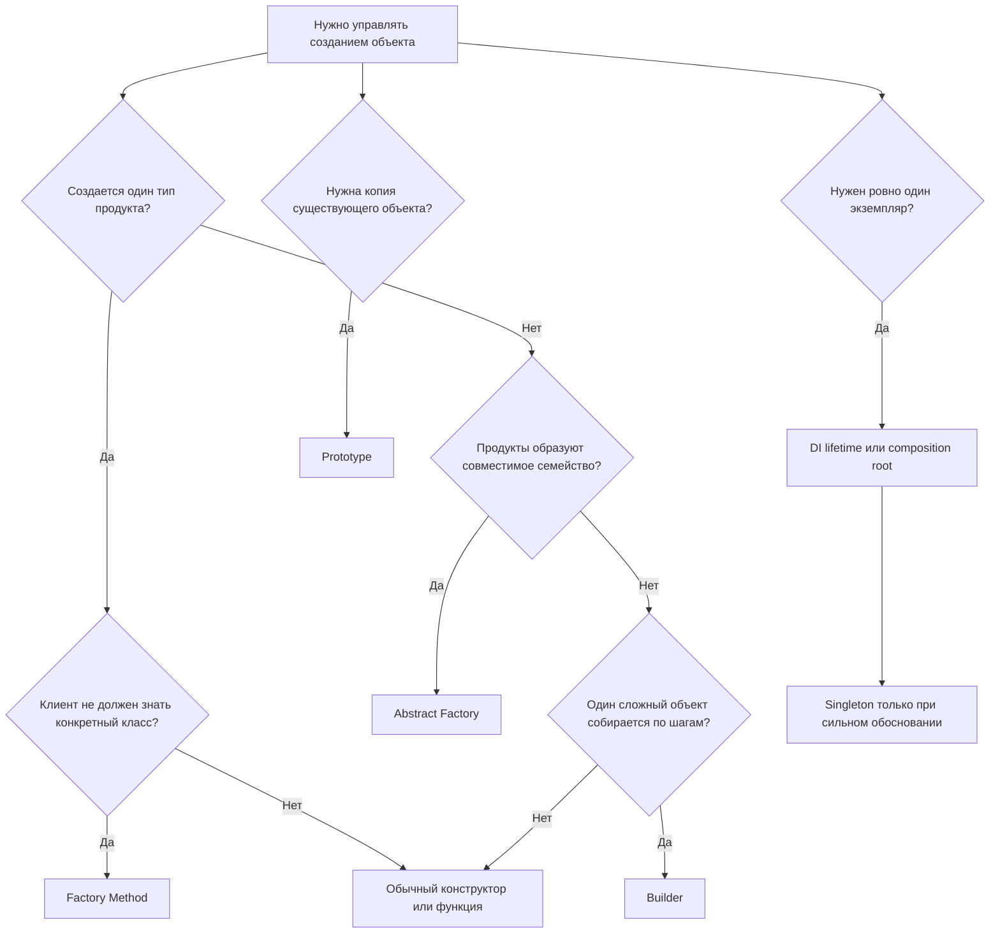

::: details Таблица выбора (альтернативный формат)

| Ситуация                                                         | Подходящий вариант                    |
|------------------------------------------------------------------|---------------------------------------|
| Есть один интерфейс продукта и несколько реализаций.             | Factory Method                        |
| Нужно создать кресло, диван и столик одного стиля.               | Abstract Factory                      |
| Конструктор стал длинным и нечитаемым.                           | Builder                               |
| Нужно редактировать копию объекта и уметь отменить изменения.    | Prototype                             |
| Нужно переиспользовать заранее подготовленный объект как основу. | Prototype                             |
| Нужен один экземпляр сервиса в приложении.                       | DI lifetime, не обязательно Singleton |
| Нужно просто создать маленький объект с 2-3 полями.              | Обычный конструктор                   |

:::

## Частые ошибки при применении паттернов

### Применять паттерн "на будущее"

Если сейчас нет вариативности, дорогого создания, длинного конструктора или семейства продуктов, паттерн может только
увеличить кодовую базу. Это нарушение YAGNI: добавлена гибкость, которой никто не пользуется.

### Считать паттерн заменой архитектурного мышления

Паттерн не исправляет плохие границы модулей. Если классы знают слишком много друг о друге, фабрика может только
переместить проблему. Сначала нужно понять ответственность объектов и направление зависимостей.

### Смешивать роли

Плохо, когда фабрика не только создает объект, но и выполняет бизнес-операции, пишет в базу, отправляет уведомления и
решает политику доступа. Тогда она становится скрытым сервисом с неясной ответственностью.

### Игнорировать цену абстракций

Каждый интерфейс, фабрика и билдер увеличивают объем кода. Это нормально, если они покупают расширяемость, тестируемость
или читаемость. Если они ничего не покупают, код стал сложнее без причины.

## Итоги лекции

Порождающие паттерны отвечают за управляемое создание объектов. Они не уничтожают конструкторы, а переносят решение о
конкретном классе, параметрах и жизненном цикле в более подходящее место.

Главные выводы:

- Factory Method нужен, когда клиенту нужен продукт через общий интерфейс, а конкретный класс выбирается отдельно.
- Abstract Factory нужна, когда создается семейство связанных продуктов и важно не смешивать варианты.
- Builder нужен, когда объект сложно инициализировать одним понятным конструктором.
- Prototype нужен, когда новый объект удобно получить копированием существующего состояния.
- Singleton контролирует единственный экземпляр, но часто проигрывает явному внедрению зависимостей и DI-контейнеру.

Следующая лекция переключает внимание с создания объектов на поведение. После вопроса "кто создает транспорт, отчет или
документ?" почти сразу появляется вопрос "как менять алгоритм, состояние, подписчиков и действия без разрастания
условных операторов?". Это тема [поведенческих паттернов](/lectures/05#strategy).

## Дополнительное чтение

Эти источники можно использовать как справочник по порождающим паттернам и как место для сравнения реализаций.

### Порождающие паттерны

- [Порождающие паттерны на Refactoring Guru](https://refactoringguru.cn/ru/design-patterns/creational-patterns) — теоретическое изложение паттернов с примерами на разных языках.
- [Порождающие паттерны на Metanit](https://metanit.com/sharp/patterns/2.1.php) — примеры на C#.
- [Краткий конспект про все паттерны](https://habr.com/ru/articles/210288/) — обзор GoF-паттернов в одном материале.

### Видео

- [Курс Avito о практиках и паттернах кода](https://avito.tech/patterns#seasons) — видеокурс с практическими разборами.

## Самопроверка

Ответьте на вопросы без подсказок. Если ответ неочевиден, вернитесь к соответствующему разделу.

1. Почему паттерн нельзя воспринимать как готовый алгоритм?
2. Чем Factory Method отличается от обычного вызова конструктора?
3. Почему Abstract Factory защищает от смешивания несовместимых продуктов?
4. Когда Builder лучше длинного конструктора?
5. Чем поверхностное копирование отличается от глубокого?
6. Почему Singleton усложняет тестирование?
7. В каком месте приложения обычно должен решаться вопрос о конкретной фабрике?
8. Когда лучше не применять порождающий паттерн вообще?

## Мини-практика

Вернитесь к сценарию заказа из этой лекции и спроектируйте создание объекта `OrderDocument`.

Требования:

- документ может быть `invoice`, `receipt` или `delivery-note`;
- для каждого типа нужен свой набор полей и шаблон;
- часть полей обязательна, часть зависит от страны и способа оплаты;
- в тестах нужно создавать короткие валидные документы без длинного setup;
- в будущем появятся PDF и HTML-версии.

Сделайте три шага:

1. Решите, где достаточно обычного конструктора или named/default arguments.
2. Выберите место, где уместен Factory Method или Abstract Factory.
3. Покажите, какую часть сложной инициализации стоит вынести в Builder.

Проверьте себя: если выбранный паттерн не уменьшил количество условных операторов, не защитил совместимость семейства
объектов и не сделал создание читаемее, возможно, обычный код здесь лучше паттерна.
