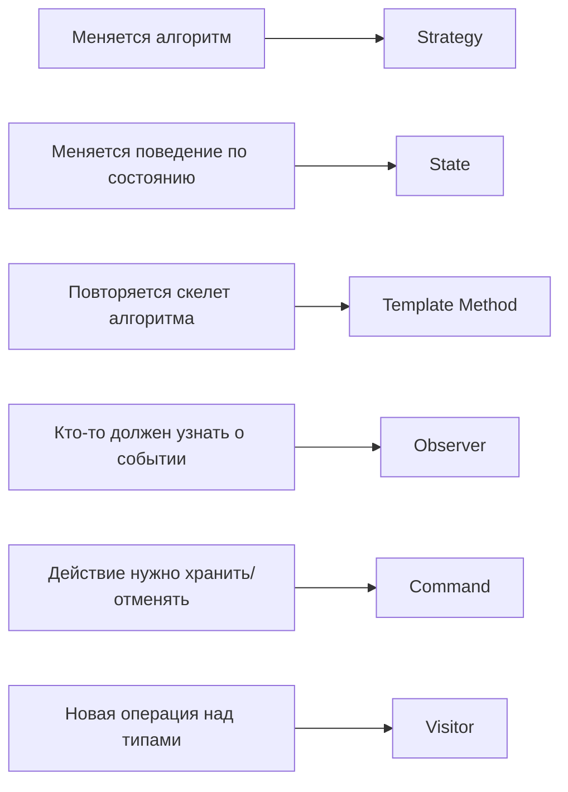
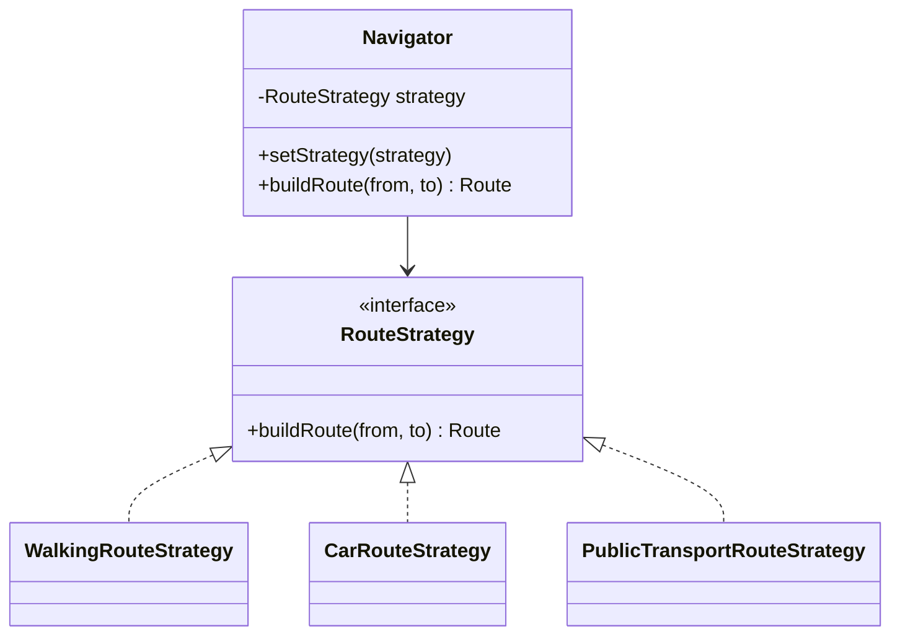
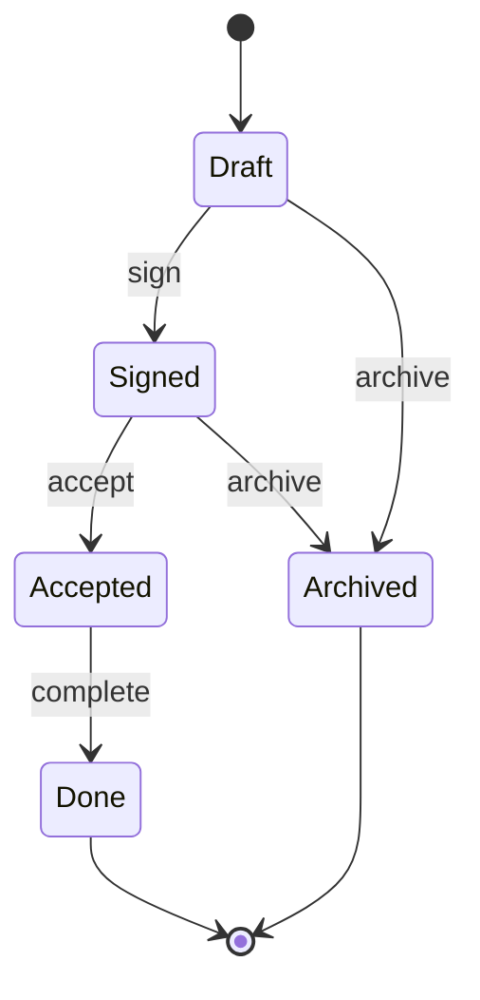
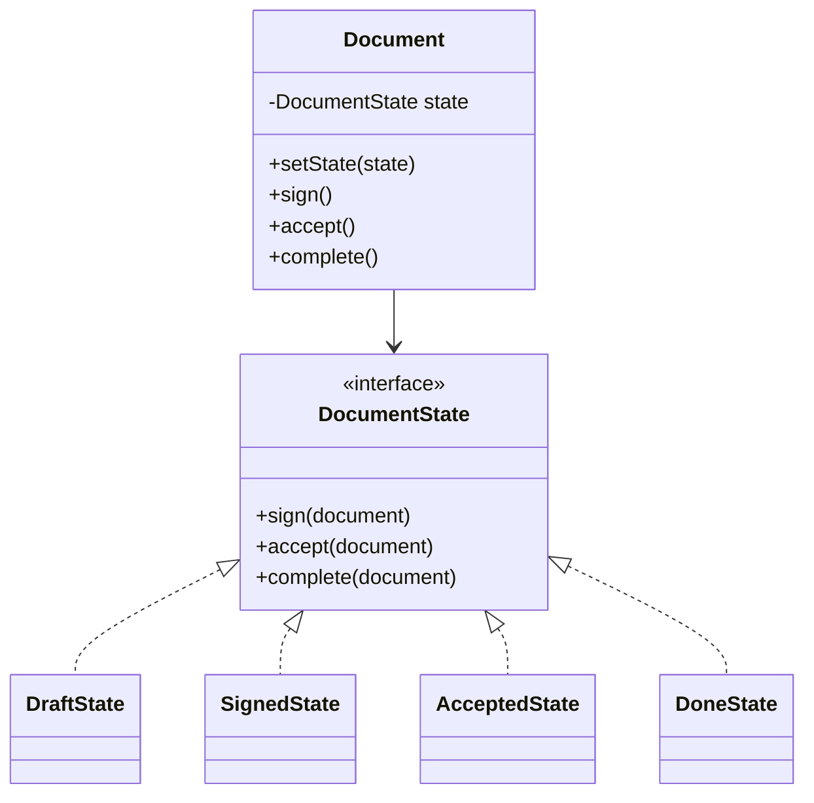
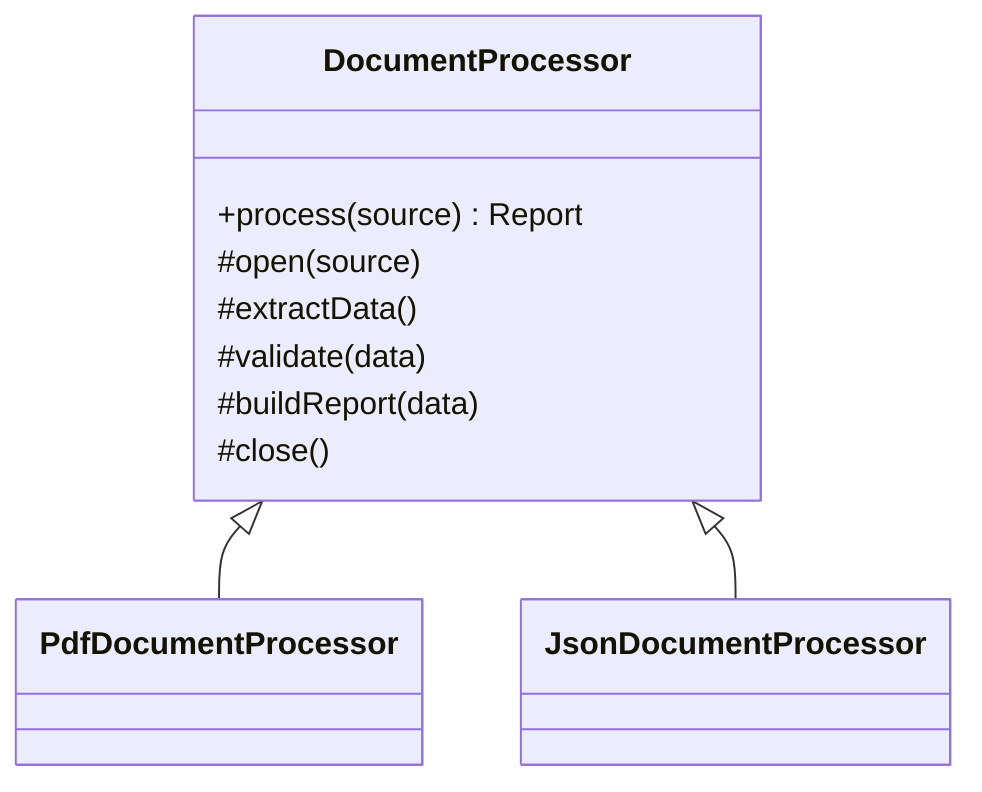
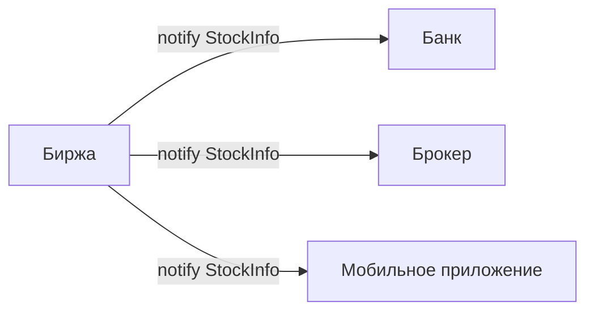
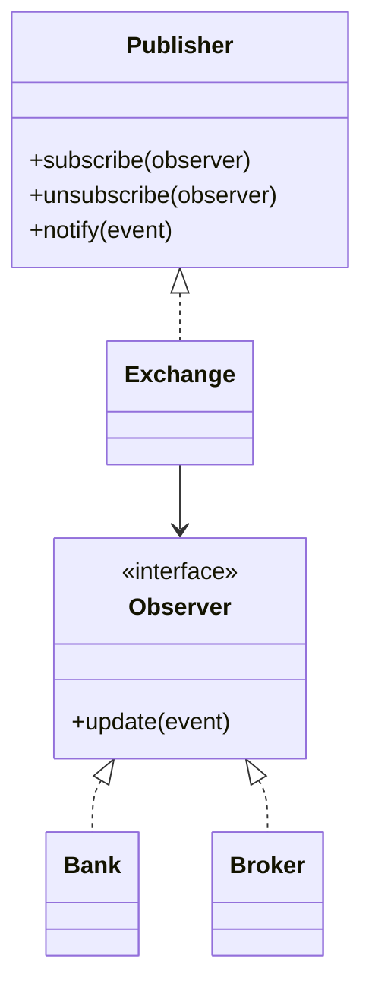
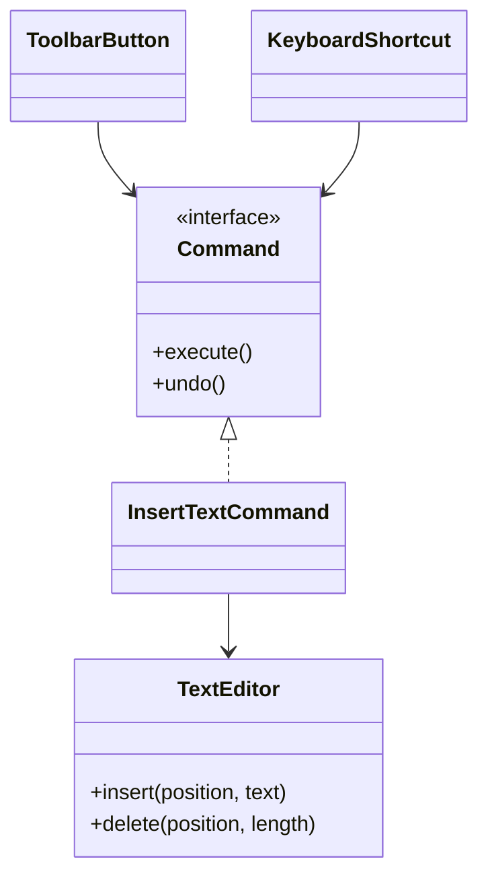
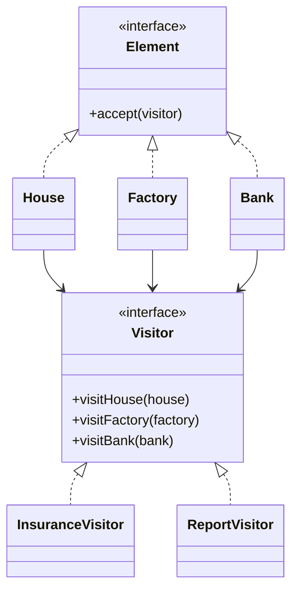

# Лекция 5. Поведенческие паттерны проектирования

Поведенческие паттерны отвечают за то, **как объекты общаются, распределяют обязанности и запускают поведение друг друга**.
Если порождающие паттерны помогают гибко создавать объекты, а структурные - удобно связывать классы и объекты в
композиции, то поведенческие паттерны работают с динамикой программы: выбором алгоритма, переходами состояния,
уведомлениями, командами и операциями над объектными структурами.

Главная мысль этой лекции: во многих задачах поведение полезно сделать явной сущностью. Алгоритм можно вынести в
стратегию, состояние - в отдельный объект состояния, действие - в команду, реакцию на событие - в подписчика, а новую
операцию над иерархией - в посетителя. Такой ход часто уменьшает связанность и помогает соблюдать Open/Closed Principle,
но почти всегда платит за это дополнительными типами и большей архитектурной дисциплиной.

В этой лекции разберем шесть поведенческих паттернов:

- **Strategy** - выбирает один из взаимозаменяемых алгоритмов.
- **State** - меняет поведение объекта при изменении его внутреннего состояния.
- **Template Method** - фиксирует скелет алгоритма, оставляя подклассам отдельные шаги.
- **Observer** - уведомляет подписчиков об изменениях без жесткой связи с ними.
- **Command** - превращает действие в объект, который можно передавать, хранить, отменять и запускать позже.
- **Visitor** - добавляет новые операции к стабильной иерархии элементов.

## Сквозной сценарий

В этой лекции удобно представить одно приложение навигации и доставки. Пользователь выбирает способ построения маршрута,
документ заказа проходит состояния, образовательный курс строится по повторяющемуся шаблону, биржевой модуль рассылает
обновления подписчикам, редактор хранит действия для undo, а страховая система добавляет новый отчет по уже существующим
типам клиентов.



Общий ход один: поведение перестает быть спрятанным внутри большого `if` или одного класса и получает собственную форму.
Дальше важно не перепутать форму с целью: функция, объект, интерфейс, делегат или callback могут быть разными
реализациями одной идеи.

## Worked example: один `if` превращается в модель поведения

### Ситуация

В навигационном приложении сначала есть один способ построить маршрут. Потом появляются "самый быстрый", "самый дешевый"
и "без платных дорог". Еще позже заказ доставки получает состояния, а действия оператора нужно сохранять для audit log.

### Наивное решение

Оставить один большой сервис с ветками `if`: по типу маршрута выбрать алгоритм, по статусу заказа проверить допустимые
действия, после каждого действия вручную вызвать уведомления и записать лог.

### Что ломается

Каждая новая ветка меняет старый метод. Алгоритмы смешиваются с состояниями, уведомлениями и историей действий. Тест
одного правила требует собрать весь сервис, а ошибка в одном сценарии легко ломает другой.

### Улучшение

Сделать поведение явным: алгоритм маршрута становится Strategy, жизненный цикл заказа - State, уведомления - Observer,
действие оператора - Command. Не все нужно применять сразу; паттерн появляется только там, где соответствующая сила уже
видна в коде.

### Почему это работает

Поведенческие паттерны дают имени не классу, а намерению. Если команда говорит "это Strategy", она сообщает: здесь
меняется алгоритм. Если говорит "это State", она сообщает: здесь правила зависят от текущего состояния и переходов.

## Где поведенческие паттерны в GoF

Поведенческие паттерны — третья группа GoF (полную классификацию см. в
[Лекции 4](/lectures/04#классификация-паттернов-gof)). Ниже — только то, что важно для этой лекции.

| Паттерн | Что выносит в отдельную роль | Главный симптом | Цена |
|---------|------------------------------|-----------------|------|
| Strategy | Вариант алгоритма | Один класс содержит много веток выбора алгоритма | Клиент должен понимать, какую стратегию выбрать |
| State | Поведение конкретного состояния | Объект меняет поведение по состоянию, а `if` множатся | Больше классов состояний и переходов |
| Template Method | Изменяемые шаги алгоритма | Несколько классов повторяют общий порядок действий | Жесткая связь через наследование |
| Observer | Реакцию на событие | Неизвестно, кто должен реагировать на изменение | Нужно управлять подписками и порядком уведомлений |
| Command | Действие или запрос | Одно действие вызывается из разных мест или должно откатываться | Сложнее модель выполнения и хранения команд |
| Visitor | Операцию над иерархией | Операций много, а типы элементов меняются редко | Трудно добавлять новые типы элементов |

::: tip Практическое правило
Поведенческий паттерн стоит рассматривать не тогда, когда "хочется применить паттерн", а когда в коде уже видна сила:
разрастающиеся условные операторы, повторяющийся алгоритм, жесткая связь отправителя и получателя, неуправляемые
события или операции, размазанные по иерархии классов.
:::

::: only kotlin
В Kotlin часть Strategy/Command можно выразить функциями высшего порядка. Но если поведению нужны имя, состояние,
валидация, логирование или сериализация, отдельный тип становится понятнее простой lambda.
:::

::: only csharp
В C# рядом с классическими интерфейсами часто используют делегаты, события и `Func<>`/`Action<>`. Это снижает церемонию,
но не отменяет вопроса: является ли поведение самостоятельной доменной сущностью или всего лишь callback-ом.
:::

::: only java
В Java после lambda-выражений многие маленькие Strategy выглядят как функциональные интерфейсы. Для крупных алгоритмов
с зависимостями и состоянием явный класс остается более читаемым и тестируемым.
:::

::: only go
В Go Strategy часто выглядит как интерфейс с одной операцией или как функция-тип. Command может быть обычной структурой
с методом `Execute`, если действие нужно хранить, логировать или передавать между слоями.
:::

## Strategy

**Strategy** выносит алгоритм в отдельный объект и позволяет контексту использовать разные варианты этого алгоритма через
общий интерфейс. Контекст не знает деталей конкретной стратегии: он только делегирует ей работу.

### Проблема

Представим навигатор. В первой версии он строит только пешие маршруты. Затем появляются маршруты на автомобиле,
общественном транспорте и самокате. Самый простой путь - добавить в `Navigator` условный оператор:

```kotlin
when (mode) {
    "walk" -> buildWalkingRoute(from, to)
    "car" -> buildCarRoute(from, to)
    "public" -> buildPublicTransportRoute(from, to)
    "scooter" -> buildScooterRoute(from, to)
}
```

Пока вариантов мало, код кажется терпимым. Но со временем у каждого режима появляются свои ограничения: пробки,
стоимость, расписание, запреты проезда, погодные условия. Класс навигатора начинает отвечать не за навигацию как
координацию, а за все алгоритмы сразу.

### Решение

Вынесем построение маршрута в интерфейс `RouteStrategy`. Навигатор станет контекстом: он хранит текущую стратегию и
делегирует ей построение маршрута. При смене режима пользовательского интерфейса можно заменить стратегию в runtime, не
создавая новый навигатор.



Роли паттерна:

| Роль | Ответственность |
|------|-----------------|
| Context | Хранит ссылку на стратегию и вызывает ее |
| Strategy | Задает общий интерфейс алгоритма |
| ConcreteStrategy | Реализует конкретный вариант алгоритма |
| Client | Создает стратегию и передает ее контексту |

::: multi-code "Strategy: навигатор"

```kotlin
data class Point(val name: String)
data class Route(val description: String)

interface RouteStrategy {
    fun buildRoute(from: Point, to: Point): Route
}

class WalkingRouteStrategy : RouteStrategy {
    override fun buildRoute(from: Point, to: Point): Route =
        Route("Пешком: ${from.name} -> ${to.name}")
}

class CarRouteStrategy : RouteStrategy {
    override fun buildRoute(from: Point, to: Point): Route =
        Route("На автомобиле с учетом пробок: ${from.name} -> ${to.name}")
}

class Navigator(private var strategy: RouteStrategy) {
    fun setStrategy(strategy: RouteStrategy) {
        this.strategy = strategy
    }

    fun buildRoute(from: Point, to: Point): Route =
        strategy.buildRoute(from, to)
}
```

```kotlin playground
data class Point(val name: String)
data class Route(val description: String)

interface RouteStrategy {
    fun buildRoute(from: Point, to: Point): Route
}

class WalkingRouteStrategy : RouteStrategy {
    override fun buildRoute(from: Point, to: Point): Route =
        Route("Пешком: ${from.name} -> ${to.name}")
}

class CarRouteStrategy : RouteStrategy {
    override fun buildRoute(from: Point, to: Point): Route =
        Route("На автомобиле с учетом пробок: ${from.name} -> ${to.name}")
}

class PublicTransportRouteStrategy : RouteStrategy {
    override fun buildRoute(from: Point, to: Point): Route =
        Route("На транспорте с пересадками: ${from.name} -> ${to.name}")
}

class Navigator(private var strategy: RouteStrategy) {
    fun setStrategy(strategy: RouteStrategy) {
        this.strategy = strategy
    }

    fun buildRoute(from: Point, to: Point): Route =
        strategy.buildRoute(from, to)
}

fun main() {
    val home = Point("Дом")
    val office = Point("Офис")
    val navigator = Navigator(WalkingRouteStrategy())

    println(navigator.buildRoute(home, office).description)
    navigator.setStrategy(CarRouteStrategy())
    println(navigator.buildRoute(home, office).description)
    navigator.setStrategy(PublicTransportRouteStrategy())
    println(navigator.buildRoute(home, office).description)
}
```

```csharp
public record Point(string Name);
public record Route(string Description);

public interface IRouteStrategy
{
    Route BuildRoute(Point from, Point to);
}

public sealed class WalkingRouteStrategy : IRouteStrategy
{
    public Route BuildRoute(Point from, Point to) =>
        new($"Пешком: {from.Name} -> {to.Name}");
}

public sealed class CarRouteStrategy : IRouteStrategy
{
    public Route BuildRoute(Point from, Point to) =>
        new($"На автомобиле с учетом пробок: {from.Name} -> {to.Name}");
}

public sealed class Navigator
{
    private IRouteStrategy _strategy;

    public Navigator(IRouteStrategy strategy) => _strategy = strategy;

    public void SetStrategy(IRouteStrategy strategy) => _strategy = strategy;

    public Route BuildRoute(Point from, Point to) =>
        _strategy.BuildRoute(from, to);
}
```

```java
record Point(String name) {}
record Route(String description) {}

interface RouteStrategy {
    Route buildRoute(Point from, Point to);
}

final class WalkingRouteStrategy implements RouteStrategy {
    public Route buildRoute(Point from, Point to) {
        return new Route("Пешком: " + from.name() + " -> " + to.name());
    }
}

final class CarRouteStrategy implements RouteStrategy {
    public Route buildRoute(Point from, Point to) {
        return new Route("На автомобиле с учетом пробок: " + from.name() + " -> " + to.name());
    }
}

final class Navigator {
    private RouteStrategy strategy;

    Navigator(RouteStrategy strategy) {
        this.strategy = strategy;
    }

    void setStrategy(RouteStrategy strategy) {
        this.strategy = strategy;
    }

    Route buildRoute(Point from, Point to) {
        return strategy.buildRoute(from, to);
    }
}
```

```go
package main

type Point struct {
	Name string
}

type Route struct {
	Description string
}

type RouteStrategy interface {
	BuildRoute(from Point, to Point) Route
}

type WalkingRouteStrategy struct{}

func (WalkingRouteStrategy) BuildRoute(from Point, to Point) Route {
	return Route{Description: "Пешком: " + from.Name + " -> " + to.Name}
}

type CarRouteStrategy struct{}

func (CarRouteStrategy) BuildRoute(from Point, to Point) Route {
	return Route{Description: "На автомобиле с учетом пробок: " + from.Name + " -> " + to.Name}
}

type Navigator struct {
	strategy RouteStrategy
}

func NewNavigator(strategy RouteStrategy) *Navigator {
	return &Navigator{strategy: strategy}
}

func (n *Navigator) SetStrategy(strategy RouteStrategy) {
	n.strategy = strategy
}

func (n *Navigator) BuildRoute(from Point, to Point) Route {
	return n.strategy.BuildRoute(from, to)
}
```

:::

### Strategy и DI

Strategy иногда путают с dependency injection, потому что в обоих случаях объект получает зависимость извне. Разница в
намерении.

| Вопрос | Strategy | DI |
|--------|----------|----|
| Что меняется? | Алгоритм поведения | Зависимость, нужная объекту для работы |
| Когда часто меняется? | Во время работы программы | При сборке приложения или создании объекта |
| Кто выбирает вариант? | Клиентский код, пользовательский сценарий, runtime-логика | Composition root, контейнер, конфигурация |
| Пример | Переключить маршрут с пешего на автомобильный | Передать реальный или тестовый репозиторий |

### Когда применять

- Внутри объекта нужны разные варианты одного алгоритма.
- Есть похожие классы, которые отличаются только поведением.
- Детали алгоритма не должны попадать в контекст.
- Большой условный оператор выбирает ветку алгоритма по типу, режиму или настройке.

### Плюсы и минусы

| Плюсы | Минусы |
|-------|--------|
| Алгоритмы изолированы от контекста | Появляется больше классов |
| Стратегию можно менять в runtime | Клиент должен понимать различия стратегий |
| Легче добавлять новые алгоритмы без изменения контекста | Для простых двух веток паттерн может быть избыточен |
| Наследование заменяется делегированием | Нужна дисциплина именования и организации стратегий |

::: warning Типичная ошибка
Не стоит превращать каждую маленькую ветку `if` в стратегию. Strategy полезна, когда варианты поведения самостоятельны,
растут независимо и имеют общий смысловой интерфейс. Если ветка локальная и вряд ли будет расширяться, обычный условный
оператор может быть проще и честнее.
:::

## State

**State** похож на Strategy внешне: контекст тоже хранит ссылку на объект с поведением. Но смысл другой. В Strategy
клиент выбирает алгоритм. В State объект ведет себя по-разному из-за своего внутреннего состояния, а переходы между
состояниями становятся частью модели.

### Проблема

Документ может быть черновиком, подписанным документом, принятым к исполнению и завершенным документом. Нельзя выполнить
документ, который еще не подписан. Нельзя подписать уже завершенный документ. Если всю логику держать в одном классе,
быстро появляется набор похожих проверок:

```kotlin
fun sign() {
    if (status == "draft") {
        status = "signed"
    } else {
        error("Подписать можно только черновик")
    }
}

fun accept() {
    if (status == "signed") {
        status = "accepted"
    } else {
        error("Принять можно только подписанный документ")
    }
}
```

Когда состояний и действий становится больше, проверки расползаются по методам. Добавление промежуточного состояния
заставляет перепроверять весь класс.

### Решение

Каждое состояние становится отдельным объектом. Контекст `Document` хранит текущее состояние и делегирует ему действия.
Состояние может решить, допустимо ли действие, и перевести документ в следующее состояние.





Роли паттерна:

| Роль | Ответственность |
|------|-----------------|
| Context | Объект, состояние которого меняется |
| State | Общий интерфейс действий, зависящих от состояния |
| ConcreteState | Поведение и переходы конкретного состояния |
| Client | Работает с контекстом, не выбирая ветки вручную |

::: multi-code "State: документ"

```kotlin
interface DocumentState {
    val name: String
    fun sign(document: Document) = error("Нельзя подписать из состояния $name")
    fun accept(document: Document) = error("Нельзя принять из состояния $name")
    fun complete(document: Document) = error("Нельзя завершить из состояния $name")
}

class Document(initialState: DocumentState) {
    var state: DocumentState = initialState
        private set

    fun changeState(next: DocumentState) {
        state = next
    }

    fun sign() = state.sign(this)
    fun accept() = state.accept(this)
    fun complete() = state.complete(this)
}

class DraftState : DocumentState {
    override val name = "Черновик"
    override fun sign(document: Document) = document.changeState(SignedState())
}

class SignedState : DocumentState {
    override val name = "Подписан"
    override fun accept(document: Document) = document.changeState(AcceptedState())
}

class AcceptedState : DocumentState {
    override val name = "Принят"
    override fun complete(document: Document) = document.changeState(DoneState())
}

class DoneState : DocumentState {
    override val name = "Завершен"
}
```

```kotlin playground
interface DocumentState {
    val name: String
    fun sign(document: Document) = println("Нельзя подписать из состояния $name")
    fun accept(document: Document) = println("Нельзя принять из состояния $name")
    fun complete(document: Document) = println("Нельзя завершить из состояния $name")
}

class Document(initialState: DocumentState) {
    var state: DocumentState = initialState
        private set

    fun changeState(next: DocumentState) {
        println("${state.name} -> ${next.name}")
        state = next
    }

    fun sign() = state.sign(this)
    fun accept() = state.accept(this)
    fun complete() = state.complete(this)
}

class DraftState : DocumentState {
    override val name = "Черновик"
    override fun sign(document: Document) = document.changeState(SignedState())
}

class SignedState : DocumentState {
    override val name = "Подписан"
    override fun accept(document: Document) = document.changeState(AcceptedState())
}

class AcceptedState : DocumentState {
    override val name = "Принят"
    override fun complete(document: Document) = document.changeState(DoneState())
}

class DoneState : DocumentState {
    override val name = "Завершен"
}

fun main() {
    val document = Document(DraftState())
    document.accept()
    document.sign()
    document.accept()
    document.complete()
    document.sign()
}
```

```csharp
public interface IDocumentState
{
    string Name { get; }
    void Sign(Document document) => throw new InvalidOperationException($"Нельзя подписать из состояния {Name}");
    void Accept(Document document) => throw new InvalidOperationException($"Нельзя принять из состояния {Name}");
    void Complete(Document document) => throw new InvalidOperationException($"Нельзя завершить из состояния {Name}");
}

public sealed class Document
{
    public IDocumentState State { get; private set; }

    public Document(IDocumentState initialState) => State = initialState;

    public void ChangeState(IDocumentState next) => State = next;
    public void Sign() => State.Sign(this);
    public void Accept() => State.Accept(this);
    public void Complete() => State.Complete(this);
}

public sealed class DraftState : IDocumentState
{
    public string Name => "Черновик";
    public void Sign(Document document) => document.ChangeState(new SignedState());
}

public sealed class SignedState : IDocumentState
{
    public string Name => "Подписан";
    public void Accept(Document document) => document.ChangeState(new AcceptedState());
}

public sealed class AcceptedState : IDocumentState
{
    public string Name => "Принят";
    public void Complete(Document document) => document.ChangeState(new DoneState());
}

public sealed class DoneState : IDocumentState
{
    public string Name => "Завершен";
}
```

```java
interface DocumentState {
    String name();

    default void sign(Document document) {
        throw new IllegalStateException("Нельзя подписать из состояния " + name());
    }

    default void accept(Document document) {
        throw new IllegalStateException("Нельзя принять из состояния " + name());
    }

    default void complete(Document document) {
        throw new IllegalStateException("Нельзя завершить из состояния " + name());
    }
}

final class Document {
    private DocumentState state;

    Document(DocumentState initialState) {
        state = initialState;
    }

    void changeState(DocumentState next) {
        state = next;
    }

    void sign() { state.sign(this); }
    void accept() { state.accept(this); }
    void complete() { state.complete(this); }
}

final class DraftState implements DocumentState {
    public String name() { return "Черновик"; }
    public void sign(Document document) { document.changeState(new SignedState()); }
}

final class SignedState implements DocumentState {
    public String name() { return "Подписан"; }
    public void accept(Document document) { document.changeState(new AcceptedState()); }
}
```

```go
package main

import "fmt"

type DocumentState interface {
	Name() string
	Sign(document *Document) error
	Accept(document *Document) error
	Complete(document *Document) error
}

type Document struct {
	state DocumentState
}

func NewDocument(initialState DocumentState) *Document {
	return &Document{state: initialState}
}

func (d *Document) ChangeState(next DocumentState) {
	d.state = next
}

func (d *Document) Sign() error     { return d.state.Sign(d) }
func (d *Document) Accept() error   { return d.state.Accept(d) }
func (d *Document) Complete() error { return d.state.Complete(d) }

type DraftState struct{}

func (DraftState) Name() string { return "Черновик" }
func (DraftState) Sign(document *Document) error {
	document.ChangeState(SignedState{})
	return nil
}
func (s DraftState) Accept(*Document) error   { return fmt.Errorf("нельзя принять из состояния %s", s.Name()) }
func (s DraftState) Complete(*Document) error { return fmt.Errorf("нельзя завершить из состояния %s", s.Name()) }

type SignedState struct{}

func (SignedState) Name() string { return "Подписан" }
func (SignedState) Sign(*Document) error { return fmt.Errorf("уже подписан") }
func (SignedState) Accept(document *Document) error {
	document.ChangeState(AcceptedState{})
	return nil
}
func (SignedState) Complete(*Document) error { return fmt.Errorf("сначала нужно принять документ") }

type AcceptedState struct{}
```

:::

### Кто отвечает за переходы

Есть два распространенных варианта.

| Вариант | Как работает | Когда удобен |
|---------|--------------|--------------|
| Переходы внутри состояний | `DraftState.sign()` переводит документ в `SignedState` | Правила переходов тесно связаны с состояниями |
| Переходы в контексте | Состояние только разрешает действие, а `Document` выбирает следующее состояние | Нужно централизованно логировать, валидировать или хранить переходы |

В учебном примере переходы живут в состояниях: так лучше видно сам паттерн. В промышленном коде часто добавляют
таблицу переходов, доменные события, аудит или отдельный workflow engine.

### Когда применять

- Поведение объекта заметно меняется в зависимости от состояния.
- Состояний достаточно много, и у каждого есть свои допустимые действия.
- Переходы меняются чаще, чем остальной контекст.
- В классе уже есть похожие условные операторы по одному и тому же полю `status`, `state` или `mode`.

### Плюсы и минусы

| Плюсы | Минусы |
|-------|--------|
| Логика состояния локализована | Много маленьких классов |
| Контекст освобождается от больших условных операторов | Сложнее увидеть всю машину состояний в одном месте |
| Легче добавлять промежуточные состояния | Для двух стабильных состояний избыточен |
| Недопустимые действия можно описывать явно | Нужно следить за консистентностью переходов |

::: warning State не нужен для каждого enum
Если объект имеет два-три стабильных состояния и простые переходы, enum и понятные проверки могут быть лучше. State
окупается, когда состояние несет самостоятельное поведение, а не просто хранит подпись в базе данных.
:::

### State и Strategy

| Вопрос | Strategy | State |
|--------|----------|-------|
| Что меняется? | Вариант алгоритма | Внутреннее состояние объекта |
| Кто обычно выбирает объект поведения? | Клиент или пользовательский сценарий | Сам контекст или текущее состояние |
| Есть ли переходы? | Обычно нет | Да, это центральная часть паттерна |
| Пример | Выбрать способ построения маршрута | Документ переходит из черновика в подписанный |

## Template Method

State экстернализирует поведение, зависящее от состояния. Но что если алгоритм *фиксирован*, а различаются лишь отдельные
шаги? Например, обработка любого документа идёт по одной схеме, но PDF, JSON и XML извлекают данные по-разному. Здесь
менять нужно не весь алгоритм и не состояние, а конкретные шаги внутри общего скелета.

**Template Method** задает скелет алгоритма в базовом классе, а отдельные шаги оставляет подклассам. Порядок шагов
фиксирован, но некоторые шаги могут быть абстрактными, иметь реализацию по умолчанию или быть hooks - необязательными
точками расширения.

### Проблема

Допустим, есть несколько обработчиков документов: PDF, JSON и XML. Общий процесс одинаковый:

1. открыть источник;
2. извлечь данные;
3. проверить данные;
4. построить отчет;
5. закрыть источник.

Различается в основном извлечение данных. Если скопировать весь алгоритм в каждый класс, то любое изменение общего шага
придется повторять во всех обработчиках.

### Решение

Базовый класс фиксирует метод `process()`. Он вызывает шаги в нужном порядке. Подклассы переопределяют только то, что
действительно отличается.



Виды шагов:

| Вид шага | Что означает |
|----------|--------------|
| Абстрактный шаг | Подкласс обязан дать реализацию |
| Шаг с реализацией по умолчанию | Подкласс может использовать готовое поведение |
| Hook | Пустой или минимальный метод, который подкласс переопределяет при необходимости |

::: multi-code "Template Method: образовательный процесс"

```kotlin
abstract class EducationProcess {
    fun study() {
        enroll()
        learn()
        passExams()
        afterExams()
        receiveDocument()
    }

    protected abstract fun enroll()
    protected abstract fun learn()

    protected open fun passExams() {
        println("Сдать итоговую аттестацию")
    }

    protected open fun afterExams() {}

    protected abstract fun receiveDocument()
}

class UniversityEducation : EducationProcess() {
    override fun enroll() = println("Сдать вступительные экзамены")
    override fun learn() = println("Пройти семестры, зачеты и практику")
    override fun afterExams() = println("Защитить выпускную работу")
    override fun receiveDocument() = println("Получить диплом")
}
```

```kotlin playground
abstract class EducationProcess {
    fun study() {
        enroll()
        learn()
        passExams()
        afterExams()
        receiveDocument()
    }

    protected abstract fun enroll()
    protected abstract fun learn()

    protected open fun passExams() {
        println("Сдать итоговую аттестацию")
    }

    protected open fun afterExams() {}

    protected abstract fun receiveDocument()
}

class SchoolEducation : EducationProcess() {
    override fun enroll() = println("Поступить в школу")
    override fun learn() = println("Изучать школьную программу")
    override fun receiveDocument() = println("Получить аттестат")
}

class UniversityEducation : EducationProcess() {
    override fun enroll() = println("Сдать вступительные экзамены")
    override fun learn() = println("Пройти семестры, зачеты и практику")
    override fun afterExams() = println("Защитить выпускную работу")
    override fun receiveDocument() = println("Получить диплом")
}

fun main() {
    val processes = listOf(SchoolEducation(), UniversityEducation())
    processes.forEach {
        it.study()
        println("---")
    }
}
```

```csharp
public abstract class EducationProcess
{
    public void Study()
    {
        Enroll();
        Learn();
        PassExams();
        AfterExams();
        ReceiveDocument();
    }

    protected abstract void Enroll();
    protected abstract void Learn();

    protected virtual void PassExams() =>
        Console.WriteLine("Сдать итоговую аттестацию");

    protected virtual void AfterExams() {}

    protected abstract void ReceiveDocument();
}

public sealed class UniversityEducation : EducationProcess
{
    protected override void Enroll() => Console.WriteLine("Сдать вступительные экзамены");
    protected override void Learn() => Console.WriteLine("Пройти семестры, зачеты и практику");
    protected override void AfterExams() => Console.WriteLine("Защитить выпускную работу");
    protected override void ReceiveDocument() => Console.WriteLine("Получить диплом");
}
```

```java
abstract class EducationProcess {
    public final void study() {
        enroll();
        learn();
        passExams();
        afterExams();
        receiveDocument();
    }

    protected abstract void enroll();
    protected abstract void learn();

    protected void passExams() {
        System.out.println("Сдать итоговую аттестацию");
    }

    protected void afterExams() {}

    protected abstract void receiveDocument();
}

final class UniversityEducation extends EducationProcess {
    protected void enroll() { System.out.println("Сдать вступительные экзамены"); }
    protected void learn() { System.out.println("Пройти семестры, зачеты и практику"); }
    protected void afterExams() { System.out.println("Защитить выпускную работу"); }
    protected void receiveDocument() { System.out.println("Получить диплом"); }
}
```

```go
package main

import "fmt"

type EducationSteps interface {
	Enroll()
	Learn()
	PassExams()
	AfterExams()
	ReceiveDocument()
}

func Study(steps EducationSteps) {
	steps.Enroll()
	steps.Learn()
	steps.PassExams()
	steps.AfterExams()
	steps.ReceiveDocument()
}

type UniversityEducation struct{}

func (UniversityEducation) Enroll()          { fmt.Println("Сдать вступительные экзамены") }
func (UniversityEducation) Learn()           { fmt.Println("Пройти семестры, зачеты и практику") }
func (UniversityEducation) PassExams()       { fmt.Println("Сдать итоговую аттестацию") }
func (UniversityEducation) AfterExams()      { fmt.Println("Защитить выпускную работу") }
func (UniversityEducation) ReceiveDocument() { fmt.Println("Получить диплом") }
```

:::

::: only go
В Go нет наследования, поэтому Template Method выглядит иначе: шаги передаются как функции в структуру или как аргументы
к функции-каркасу.

```go
type Pipeline struct {
    Extract func() []byte
    Validate func([]byte) error
}

func (p Pipeline) Run() error {
    data := p.Extract()
    return p.Validate(data)
}
```

Это композиция вместо наследования — Go-идиома для того же намерения.
:::

::: only go
State machine в Go часто реализуют через знаменитый паттерн Rob Pike — `stateFn`:

```go
type stateFn func(ctx *Context) stateFn

func run(ctx *Context) {
    for state := startState; state != nil; {
        state = state(ctx)
    }
}
```

Каждое состояние — функция, возвращающая следующее состояние. Nil означает конец. Нет интерфейсов, нет классов — только
функции и переходы. Этот паттерн используется в `text/template`, `encoding/json` и многих Go-проектах.
:::

::: warning Template Method легко нарушает LSP
Если подкласс меняет смысл шага так, что общий алгоритм перестает быть корректным, клиент уже не может безопасно
использовать подкласс вместо базового класса. Поэтому шаблонный метод часто делают `final`/непереопределяемым, а
подклассам оставляют только заранее выбранные шаги.
:::

### Когда применять

- У нескольких классов одинаковый порядок действий, но отдельные шаги отличаются.
- Нужно убрать дублирование общего алгоритма.
- Подклассы должны расширять алгоритм, не меняя его структуру.
- В базовом классе есть полезная общая реализация части шагов.

### Плюсы и минусы

| Плюсы | Минусы |
|-------|--------|
| Переиспользуется общий каркас алгоритма | Жесткая связь через наследование |
| Общие шаги меняются в одном месте | Новый сценарий может не вписаться в старый скелет |
| Подклассы переопределяют только отличия | С ростом числа шагов алгоритм трудно поддерживать |
| Порядок выполнения централизован | Неправильное переопределение может нарушить LSP |

### Template Method и Strategy

| Вопрос | Template Method | Strategy |
|--------|-----------------|----------|
| Основной механизм | Наследование | Композиция и делегирование |
| Что фиксировано? | Порядок шагов алгоритма | Интерфейс алгоритма |
| Что меняется? | Отдельные шаги в подклассах | Весь алгоритм-стратегия |
| Runtime-замена | Обычно нет | Обычно да |

## Observer

**Observer** связывает объект-издатель и набор подписчиков. Когда состояние издателя меняется, он уведомляет только тех,
кто подписался на событие. Издатель не знает конкретные классы подписчиков: он знает только интерфейс наблюдателя.

### Проблема

В UI часто есть модель данных и элементы интерфейса. Коллекция пользователей изменилась - список на экране должен
перерисоваться. Курс валют изменился - банк должен обновить табло, а брокер решить, покупать или продавать. Но издатель
не должен быть жестко связан со всеми потенциальными получателями.

Плохой вариант - заставить издателя напрямую вызывать конкретные классы:

```kotlin
bank.updateRates(info)
broker.analyze(info)
mobileApp.sendPush(info)
```

Такой код знает слишком много. Добавление нового получателя заставляет менять издателя.

### Решение

Издатель хранит список наблюдателей. Наблюдатель реализует общий метод `update`. При изменении состояния издатель
проходит по списку и вызывает `update` у каждого подписчика.





::: multi-code "Observer: биржа и подписчики"

```kotlin
data class StockInfo(val usd: Double, val eur: Double)

interface Observer {
    fun update(info: StockInfo)
}

class Exchange {
    private val observers = mutableSetOf<Observer>()

    fun subscribe(observer: Observer) {
        observers += observer
    }

    fun unsubscribe(observer: Observer) {
        observers -= observer
    }

    fun publish(info: StockInfo) {
        observers.forEach { it.update(info) }
    }
}

class Bank : Observer {
    override fun update(info: StockInfo) {
        println("Банк обновил курс EUR: ${info.eur}")
    }
}
```

```kotlin playground
data class StockInfo(val usd: Double, val eur: Double)

interface Observer {
    fun update(info: StockInfo)
}

class Exchange {
    private val observers = mutableSetOf<Observer>()

    fun subscribe(observer: Observer) {
        observers += observer
    }

    fun unsubscribe(observer: Observer) {
        observers -= observer
    }

    fun publish(info: StockInfo) {
        println("Биржа публикует USD=${info.usd}, EUR=${info.eur}")
        observers.toList().forEach { it.update(info) }
    }
}

class Bank : Observer {
    override fun update(info: StockInfo) {
        println("Банк обновил курс EUR: ${info.eur}")
    }
}

class Broker(private val name: String) : Observer {
    override fun update(info: StockInfo) {
        if (info.usd > 95.0) {
            println("$name продает доллары")
        } else {
            println("$name ждет")
        }
    }
}

fun main() {
    val exchange = Exchange()
    val bank = Bank()
    val broker = Broker("Брокер")

    exchange.subscribe(bank)
    exchange.subscribe(broker)
    exchange.publish(StockInfo(94.0, 101.0))

    exchange.unsubscribe(broker)
    exchange.publish(StockInfo(97.0, 104.0))
}
```

```csharp
public record StockInfo(double Usd, double Eur);

public interface IObserver
{
    void Update(StockInfo info);
}

public sealed class Exchange
{
    private readonly HashSet<IObserver> _observers = new();

    public void Subscribe(IObserver observer) => _observers.Add(observer);
    public void Unsubscribe(IObserver observer) => _observers.Remove(observer);

    public void Publish(StockInfo info)
    {
        foreach (var observer in _observers.ToArray())
        {
            observer.Update(info);
        }
    }
}

public sealed class Bank : IObserver
{
    public void Update(StockInfo info) =>
        Console.WriteLine($"Банк обновил курс EUR: {info.Eur}");
}
```

```java
import java.util.ArrayList;
import java.util.List;

record StockInfo(double usd, double eur) {}

interface Observer {
    void update(StockInfo info);
}

final class Exchange {
    private final List<Observer> observers = new ArrayList<>();

    void subscribe(Observer observer) {
        observers.add(observer);
    }

    void unsubscribe(Observer observer) {
        observers.remove(observer);
    }

    void publish(StockInfo info) {
        for (Observer observer : List.copyOf(observers)) {
            observer.update(info);
        }
    }
}

final class Bank implements Observer {
    public void update(StockInfo info) {
        System.out.println("Банк обновил курс EUR: " + info.eur());
    }
}
```

```go
package main

import "fmt"

type StockInfo struct {
	USD float64
	EUR float64
}

type Observer interface {
	Update(info StockInfo)
}

type Exchange struct {
	observers []Observer
}

func (e *Exchange) Subscribe(observer Observer) {
	e.observers = append(e.observers, observer)
}

func (e *Exchange) Publish(info StockInfo) {
	for _, observer := range e.observers {
		observer.Update(info)
	}
}

type Bank struct{}

func (Bank) Update(info StockInfo) {
	fmt.Println("Банк обновил курс EUR:", info.EUR)
}
```

:::

### Push и Pull

| Модель | Как работает | Плюсы | Минусы |
|--------|--------------|-------|--------|
| Push | Издатель передает данные события в `update(event)` | Подписчику не нужно лезть обратно в издателя | Нужно заранее спроектировать объект события |
| Pull | Издатель сообщает "я изменился", а подписчик сам читает нужные поля | Подписчик берет только нужные данные | Подписчик сильнее знает издателя |

В UI и доменных событиях чаще используют push: событие несет данные, которые нужны для реакции.

### Когда применять

- После изменения одного объекта должны реагировать другие объекты.
- Заранее неизвестно, какие именно объекты будут подписчиками.
- Подписка и отписка нужны во время работы программы.
- Нужно ослабить связь между источником события и получателями.

### Плюсы и минусы

| Плюсы | Минусы |
|-------|--------|
| Издатель не зависит от конкретных подписчиков | Порядок уведомлений может быть неочевидным |
| Подписчики подключаются и отключаются в runtime | Забытые подписки могут удерживать объекты в памяти |
| Новые реакции добавляются без изменения издателя | Ошибка одного подписчика может повлиять на цепочку уведомлений |
| Хорошо подходит для UI и событийной модели | Сложнее отлаживать цепочки реакций |

::: warning Следите за жизненным циклом подписок
Если подписчик живет меньше издателя, его нужно отписывать или использовать механизм слабых ссылок/автоматического
освобождения. Иначе издатель будет удерживать ссылку на объект, который уже не должен участвовать в работе программы.
:::

## Command

Observer оповещает о событии — «что-то произошло». Command делает следующий шаг: превращает *действие* в самостоятельный
объект, который можно передать, положить в очередь, отменить или повторить.

**Command** превращает запрос или действие в объект. Такой объект можно передать в другой класс, положить в очередь,
сохранить, выполнить позже, повторить или отменить.

### Проблема

Одно и то же действие "сохранить документ" может запускаться из кнопки toolbar, пункта меню, контекстного меню и
комбинации клавиш `Ctrl+S`. Если каждый элемент UI напрямую знает бизнес-логику сохранения, логика дублируется и UI
становится связанным с получателем операции.

Похожая идея есть в ресторане: клиент произносит заказ, официант фиксирует его на бумаге, а повар выполняет позже.
Заказ стал объектом: его можно положить в очередь и обработать не сразу.

### Решение

Вводится интерфейс `Command` с методом `execute`. Если нужна отмена, добавляют `undo`. Конкретная команда знает
получателя (`Receiver`) и вызывает у него нужную бизнес-операцию. Инициатор (`Invoker`) хранит команду и запускает ее, не
зная деталей получателя.



Роли паттерна:

| Роль | Ответственность |
|------|-----------------|
| Command | Общий интерфейс действия |
| ConcreteCommand | Хранит параметры действия и ссылку на получателя |
| Receiver | Содержит бизнес-логику, которую нужно выполнить |
| Invoker | Запускает команду, не зная деталей |
| Client | Создает команду и связывает ее с получателем |

::: multi-code "Command: текстовый редактор"

```kotlin
interface Command {
    fun execute()
    fun undo()
}

class TextEditor {
    private val content = StringBuilder()

    fun insert(position: Int, text: String) {
        content.insert(position, text)
    }

    fun delete(position: Int, length: Int) {
        content.delete(position, position + length)
    }

    override fun toString(): String = content.toString()
}

class InsertTextCommand(
    private val editor: TextEditor,
    private val position: Int,
    private val text: String
) : Command {
    override fun execute() = editor.insert(position, text)
    override fun undo() = editor.delete(position, text.length)
}
```

```kotlin playground
interface Command {
    fun execute()
    fun undo()
}

class TextEditor {
    private val content = StringBuilder()

    fun insert(position: Int, text: String) {
        content.insert(position, text)
    }

    fun delete(position: Int, length: Int) {
        content.delete(position, position + length)
    }

    override fun toString(): String = content.toString()
}

class InsertTextCommand(
    private val editor: TextEditor,
    private val position: Int,
    private val text: String
) : Command {
    override fun execute() = editor.insert(position, text)
    override fun undo() = editor.delete(position, text.length)
}

class CommandHistory {
    private val history = ArrayDeque<Command>()

    fun run(command: Command) {
        command.execute()
        history.addLast(command)
    }

    fun undoLast() {
        history.removeLastOrNull()?.undo()
    }
}

fun main() {
    val editor = TextEditor()
    val history = CommandHistory()

    history.run(InsertTextCommand(editor, 0, "Hello"))
    history.run(InsertTextCommand(editor, 5, ", world"))
    println(editor)

    history.undoLast()
    println(editor)
}
```

```csharp
public interface ICommand
{
    void Execute();
    void Undo();
}

public sealed class TextEditor
{
    private readonly StringBuilder _content = new();

    public void Insert(int position, string text) =>
        _content.Insert(position, text);

    public void Delete(int position, int length) =>
        _content.Remove(position, length);

    public override string ToString() => _content.ToString();
}

public sealed class InsertTextCommand : ICommand
{
    private readonly TextEditor _editor;
    private readonly int _position;
    private readonly string _text;

    public InsertTextCommand(TextEditor editor, int position, string text)
    {
        _editor = editor;
        _position = position;
        _text = text;
    }

    public void Execute() => _editor.Insert(_position, _text);
    public void Undo() => _editor.Delete(_position, _text.Length);
}
```

```java
interface Command {
    void execute();
    void undo();
}

final class TextEditor {
    private final StringBuilder content = new StringBuilder();

    void insert(int position, String text) {
        content.insert(position, text);
    }

    void delete(int position, int length) {
        content.delete(position, position + length);
    }

    public String toString() {
        return content.toString();
    }
}

final class InsertTextCommand implements Command {
    private final TextEditor editor;
    private final int position;
    private final String text;

    InsertTextCommand(TextEditor editor, int position, String text) {
        this.editor = editor;
        this.position = position;
        this.text = text;
    }

    public void execute() { editor.insert(position, text); }
    public void undo() { editor.delete(position, text.length()); }
}
```

```go
package main

import "strings"

type Command interface {
	Execute()
	Undo()
}

type TextEditor struct {
	content strings.Builder
}

func (e *TextEditor) Insert(text string) {
	e.content.WriteString(text)
}

func (e *TextEditor) DeleteLast(length int) {
	current := e.content.String()
	e.content.Reset()
	e.content.WriteString(current[:len(current)-length])
}

func (e *TextEditor) String() string {
	return e.content.String()
}

type InsertTextCommand struct {
	editor *TextEditor
	text   string
}

func (c InsertTextCommand) Execute() {
	c.editor.Insert(c.text)
}

func (c InsertTextCommand) Undo() {
	c.editor.DeleteLast(len(c.text))
}
```

:::

### Command и callback

Callback тоже можно передать и вызвать позже. Command нужен, когда у действия появляется собственная модель:

| Нужно | Callback | Command |
|-------|----------|---------|
| Просто выполнить функцию позже | Подходит | Может быть избыточен |
| Хранить параметры и получателя | Можно, но неявно | Естественно |
| Отменять действие | Неудобно | Встроено через `undo` |
| Логировать, сериализовать, ставить в очередь | Сложнее | Обычно проще |
| Объединять команды в макрокоманды | Сложнее | Естественно |

### Когда применять

- Одно действие должно запускаться из разных мест интерфейса.
- Нужны undo/redo.
- Нужен отложенный запуск или очередь команд.
- Нужно логировать историю действий.
- Нужно отделить инициатора действия от получателя.

### Плюсы и минусы

| Плюсы | Минусы |
|-------|--------|
| Инициатор не зависит от получателя | Появляется много классов команд |
| Команды можно хранить и запускать позже | Undo требует аккуратного хранения состояния |
| Удобно строить историю, очереди, макрокоманды | Сериализация команд может быть сложной |
| Поддерживает транзакционный стиль | Для простых UI-кнопок может быть избыточен |

::: warning Команда не равна распределенной транзакции
Если команда сериализуется и отправляется в другой сервис, это еще не гарантирует атомарность, идемпотентность и
безопасный откат. Для распределенных сценариев отдельно проектируют идентификаторы команд, повторы, дедупликацию,
компенсирующие действия и обработку частичных сбоев.
:::

## Visitor

У вас 5 типов клиентов и 3 отчёта. Каждый новый отчёт — это 5 новых `if`. Добавить четвёртый отчёт — ещё 5. Visitor
меняет эту математику: новая операция = один новый класс, а не N правок по всей иерархии.

**Visitor** добавляет новые операции к объектной структуре без помещения этих операций внутрь классов элементов. Это
особенно полезно для деревьев и стабильных иерархий: AST, документов, UI-деревьев, моделей отчетов.

### Проблема

Есть несколько типов объектов: дом, фабрика и банк. Для каждого типа нужно выполнить операцию страхового агента. Потом
появится другая операция: построить отчет, рассчитать риск, экспортировать данные. Если добавлять все операции прямо в
классы элементов, они быстро превратятся в набор несвязанных методов.

При этом иерархия элементов стабильна: новые типы зданий появляются редко, а новые операции над ними появляются часто.

### Решение

Элемент получает метод `accept(visitor)`. Внутри `accept` элемент вызывает подходящий метод посетителя, передавая себя:
`visitor.visitHouse(this)`. Это называется **double dispatch**: сначала клиент выбирает элемент и вызывает `accept`, затем
сам элемент выбирает правильную перегрузку/метод посетителя по своему конкретному типу.



::: multi-code "Visitor: страховой агент и отчет"

```kotlin
interface Building {
    fun accept(visitor: BuildingVisitor)
}

class House(val owner: String) : Building {
    override fun accept(visitor: BuildingVisitor) = visitor.visitHouse(this)
}

class Factory(val title: String) : Building {
    override fun accept(visitor: BuildingVisitor) = visitor.visitFactory(this)
}

interface BuildingVisitor {
    fun visitHouse(house: House)
    fun visitFactory(factory: Factory)
}

class InsuranceVisitor : BuildingVisitor {
    override fun visitHouse(house: House) {
        println("Предложить ${house.owner} страхование имущества")
    }

    override fun visitFactory(factory: Factory) {
        println("Предложить ${factory.title} страхование от простоя")
    }
}
```

```kotlin playground
interface Building {
    fun accept(visitor: BuildingVisitor)
}

class House(val owner: String) : Building {
    override fun accept(visitor: BuildingVisitor) = visitor.visitHouse(this)
}

class Factory(val title: String) : Building {
    override fun accept(visitor: BuildingVisitor) = visitor.visitFactory(this)
}

class Bank(val title: String) : Building {
    override fun accept(visitor: BuildingVisitor) = visitor.visitBank(this)
}

interface BuildingVisitor {
    fun visitHouse(house: House)
    fun visitFactory(factory: Factory)
    fun visitBank(bank: Bank)
}

class InsuranceVisitor : BuildingVisitor {
    override fun visitHouse(house: House) {
        println("Предложить ${house.owner} страхование имущества")
    }

    override fun visitFactory(factory: Factory) {
        println("Предложить ${factory.title} страхование от пожара и простоя")
    }

    override fun visitBank(bank: Bank) {
        println("Предложить ${bank.title} страхование финансовых рисков")
    }
}

class ReportVisitor : BuildingVisitor {
    private val rows = mutableListOf<String>()

    override fun visitHouse(house: House) {
        rows += "Дом владельца ${house.owner}"
    }

    override fun visitFactory(factory: Factory) {
        rows += "Фабрика ${factory.title}"
    }

    override fun visitBank(bank: Bank) {
        rows += "Банк ${bank.title}"
    }

    fun report(): String = rows.joinToString("\n")
}

fun main() {
    val buildings: List<Building> = listOf(
        House("Анна"),
        Factory("Северный завод"),
        Bank("Городской банк")
    )

    val insurance = InsuranceVisitor()
    buildings.forEach { it.accept(insurance) }

    val report = ReportVisitor()
    buildings.forEach { it.accept(report) }
    println("---")
    println(report.report())
}
```

```csharp
public interface IBuilding
{
    void Accept(IBuildingVisitor visitor);
}

public sealed class House : IBuilding
{
    public string Owner { get; }
    public House(string owner) => Owner = owner;
    public void Accept(IBuildingVisitor visitor) => visitor.VisitHouse(this);
}

public sealed class Factory : IBuilding
{
    public string Title { get; }
    public Factory(string title) => Title = title;
    public void Accept(IBuildingVisitor visitor) => visitor.VisitFactory(this);
}

public interface IBuildingVisitor
{
    void VisitHouse(House house);
    void VisitFactory(Factory factory);
}

public sealed class InsuranceVisitor : IBuildingVisitor
{
    public void VisitHouse(House house) =>
        Console.WriteLine($"Предложить {house.Owner} страхование имущества");

    public void VisitFactory(Factory factory) =>
        Console.WriteLine($"Предложить {factory.Title} страхование от простоя");
}
```

```java
interface Building {
    void accept(BuildingVisitor visitor);
}

final class House implements Building {
    final String owner;

    House(String owner) {
        this.owner = owner;
    }

    public void accept(BuildingVisitor visitor) {
        visitor.visitHouse(this);
    }
}

final class Factory implements Building {
    final String title;

    Factory(String title) {
        this.title = title;
    }

    public void accept(BuildingVisitor visitor) {
        visitor.visitFactory(this);
    }
}

interface BuildingVisitor {
    void visitHouse(House house);
    void visitFactory(Factory factory);
}

final class InsuranceVisitor implements BuildingVisitor {
    public void visitHouse(House house) {
        System.out.println("Предложить " + house.owner + " страхование имущества");
    }

    public void visitFactory(Factory factory) {
        System.out.println("Предложить " + factory.title + " страхование от простоя");
    }
}
```

```go
package main

import "fmt"

type Building interface {
	Accept(visitor BuildingVisitor)
}

type House struct {
	Owner string
}

func (h House) Accept(visitor BuildingVisitor) {
	visitor.VisitHouse(h)
}

type Factory struct {
	Title string
}

func (f Factory) Accept(visitor BuildingVisitor) {
	visitor.VisitFactory(f)
}

type BuildingVisitor interface {
	VisitHouse(house House)
	VisitFactory(factory Factory)
}

type InsuranceVisitor struct{}

func (InsuranceVisitor) VisitHouse(house House) {
	fmt.Println("Предложить", house.Owner, "страхование имущества")
}

func (InsuranceVisitor) VisitFactory(factory Factory) {
	fmt.Println("Предложить", factory.Title, "страхование от простоя")
}
```

:::

### Когда применять

- Нужно выполнить операцию над всеми элементами сложной структуры: деревом, AST, документом, UI.
- Операции над элементами часто добавляются, а типы элементов меняются редко.
- Не хочется засорять классы элементов несвязанными операциями.
- Операция должна накапливать состояние во время обхода.

### Плюсы и минусы

| Плюсы | Минусы |
|-------|--------|
| Новые операции добавляются отдельными посетителями | Новый тип элемента требует изменить интерфейс посетителя |
| Родственные операции собраны в одном классе | Элементы должны заранее поддерживать `accept` |
| Посетитель может накапливать состояние обхода | Может раскрывать внутренности элементов |
| Хорошо работает со стабильными деревьями объектов | Для простой иерархии выглядит тяжеловесно |

::: only kotlin
В Kotlin `sealed interface` + `when` решает ту же задачу без церемонии `accept`/`visit`. Компилятор проверяет
exhaustiveness — забытый тип элемента = ошибка компиляции:

```kotlin
sealed interface Building
data class House(val owner: String) : Building
data class Factory(val title: String) : Building

fun insure(b: Building): String = when (b) {
    is House -> "Предложить ${b.owner} страхование имущества"
    is Factory -> "Предложить ${b.title} страхование от простоя"
    // новый тип Building → компилятор заставит добавить ветку
}
```

Это «Expression Problem наоборот»: добавить новый тип легко (sealed), но новая операция — это новая функция с `when`,
а не новый класс-visitor.
:::

::: warning Главный tradeoff Visitor
Visitor удобен, когда операции меняются чаще, чем типы элементов. Если в системе постоянно появляются новые типы
элементов, Visitor будет болезненным: каждый новый тип заставит менять интерфейс посетителя и все существующие
посетители.
:::

## Как выбрать паттерн

| Ситуация | Вероятный паттерн |
|----------|-------------------|
| Есть разные варианты одного алгоритма | Strategy |
| Поведение зависит от текущего состояния и есть правила переходов | State |
| Есть общий скелет алгоритма, но разные шаги | Template Method |
| Нужно реагировать на событие без жесткой связи источника и получателей | Observer |
| Действие нужно представить объектом, хранить, отменять или запускать позже | Command |
| Иерархия элементов стабильна, а операции над ней добавляются часто | Visitor |

### Короткие сравнения

| Пара | Как различать |
|------|---------------|
| Strategy vs State | Strategy выбирает алгоритм извне; State моделирует внутреннее состояние и переходы |
| Strategy vs Template Method | Strategy использует композицию и заменяет весь алгоритм; Template Method использует наследование и фиксирует порядок шагов |
| Observer vs Command | Observer сообщает о событии многим подписчикам; Command представляет одно действие как объект |
| Command vs Strategy | Оба экстернализируют поведение, но Strategy заменяет *алгоритм* (как считать), а Command инкапсулирует *действие* (что сделать), добавляя undo, очередь и историю |
| Visitor vs полиморфизм | Полиморфизм удобен, когда поведение принадлежит самому элементу; Visitor удобен, когда операций много и они не должны жить внутри элементов |

::: details Почему поведенческие паттерны часто похожи
Многие из них используют одну и ту же техническую идею: заменить ветвление или прямой вызов объектом с общим
интерфейсом. Отличается не форма кода, а намерение. Strategy отвечает за выбор алгоритма, State - за состояние и
переходы, Command - за действие как значение, Observer - за уведомление подписчиков, Visitor - за внешнюю операцию над
структурой, Template Method - за фиксированный скелет алгоритма.
:::

## Итоги

Поведенческие паттерны помогают управлять изменяемым поведением программы. Они особенно полезны, когда прямой код уже
начинает плохо расти: условные операторы разрастаются, отправители слишком много знают о получателях, один алгоритм
копируется по классам, действие нужно отложить или отменить, а новая операция не должна засорять существующую иерархию.

После этой лекции нужно уметь:

- объяснить, какую проблему решает каждый из шести паттернов;
- отличить Strategy от State и Template Method;
- увидеть, когда Observer подходит лучше прямых вызовов;
- понять, зачем Command делает действие объектом;
- назвать главный tradeoff Visitor;
- оценить цену паттерна и отказаться от него, если обычный код проще.

После этой лекции у нас появились объекты поведения: стратегии, состояния, команды, наблюдатели. Следующий вопрос -
как соединять уже существующие объекты, если интерфейсы несовместимы, подсистема слишком сложна или к объекту нужно
добавить поведение без наследования. Это переход к [структурным паттернам](/lectures/06#adapter).

## Дополнительное чтение

Материалы подходят для повторения поведенческих паттернов и сравнения примеров с кодом лекции.

### Поведенческие паттерны

- [Поведенческие паттерны на Refactoring Guru](https://refactoringguru.cn/ru/design-patterns/behavioral-patterns) — теоретическое описание блока GoF.
- [Поведенческие паттерны на Metanit](https://metanit.com/sharp/patterns/3.1.php) — примеры на C#.

### Видео

- [Курс Avito о практиках и паттернах кода](https://avito.tech/patterns#seasons) — видеокурс с практическими разборами.

## Самопроверка

1. В навигатор добавляют новый способ построения маршрута, но сам `Navigator` не должен меняться. Какой паттерн подходит?

::: details Ответ
Strategy. Новый способ маршрутизации становится новой реализацией `RouteStrategy`, а навигатор продолжает работать через
общий интерфейс.
:::

2. Документ можно подписать только из состояния черновика, принять только после подписания и завершить только после
принятия. Какой паттерн лучше всего моделирует это поведение?

::: details Ответ
State. Важны не просто варианты алгоритма, а допустимые действия и переходы между состояниями.
:::

3. Чем Strategy отличается от Template Method?

::: details Ответ
Strategy заменяет весь алгоритм через композицию и обычно может меняться в runtime. Template Method фиксирует порядок
шагов в базовом классе, а подклассы переопределяют отдельные шаги.
:::

4. Почему Observer снижает связанность между издателем и подписчиками?

::: details Ответ
Издатель знает только интерфейс наблюдателя и список подписчиков. Он не зависит от конкретных классов `Bank`, `Broker`
или UI-контролов.
:::

5. В приложении нужно поддержать undo/redo для действий пользователя. Какой паттерн стоит рассмотреть?

::: details Ответ
Command. Каждое действие можно представить объектом с `execute` и `undo`, а затем хранить историю выполненных команд.
:::

6. Почему Visitor неудобен, если часто появляются новые типы элементов?

::: details Ответ
Новый тип элемента требует добавить новый метод в интерфейс посетителя и обновить все существующие реализации
посетителей.
:::

7. Когда State будет избыточным?

::: details Ответ
Когда состояний мало, переходы простые и почти не меняются. В таком случае enum и несколько явных проверок могут быть
понятнее набора классов состояний.
:::

8. Что опасного в забытых подписках Observer?

::: details Ответ
Издатель может продолжать хранить ссылку на подписчика. Это мешает освобождению объекта и может вызывать реакции у
объекта, который уже не должен участвовать в сценарии.
:::

9. Почему Command не равен обычному callback?

::: details Ответ
Callback обычно только выполняет функцию. Command делает действие отдельной моделью: с параметрами, получателем,
историей, отменой, логированием или постановкой в очередь.
:::

10. Что объединяет все паттерны этой лекции?

::: details Ответ
Они распределяют поведение между объектами и уменьшают прямую связанность. Часто они заменяют большой условный оператор
или прямой вызов объектом с понятной ролью и общим интерфейсом.
:::

## Мини-практика

Продолжите историю приложения доставки из лекции.

Система должна:

- выбирать способ расчета маршрута: самый быстрый, самый дешевый, с минимальным числом пересадок;
- переводить заказ между состояниями `Draft`, `Paid`, `Packed`, `Shipped`, `Delivered`, `Cancelled`;
- отправлять уведомления клиенту, складу и аналитике;
- хранить действия оператора для последующего audit log;
- поддержать экспорт дерева документов в PDF и HTML.

Разложите требования по паттернам:

1. Где нужен Strategy, а где State?
2. Где Observer лучше прямого вызова конкретных сервисов?
3. Где Command дает больше пользы, чем обычный callback?
4. Где Visitor оправдан, а где проще оставить полиморфизм?

После выбора добавьте по одному аргументу против каждого паттерна. Это упражнение важно: хороший инженер умеет не
только узнать паттерн, но и отказаться от него, если цена выше пользы.
