# Лекция 6. Структурные паттерны проектирования

Эта лекция завершает блок GoF-паттернов перед переходом к более крупным архитектурным решениям: DDD, слоям,
гексагональной и чистой архитектуре, клиент-серверному взаимодействию. Если вы пропустили занятие, начните с главной
идеи: **структурные паттерны описывают, как связывать классы и объекты в более удобные конструкции**.

В порождающих паттернах главный вопрос был "как создавать объекты". В поведенческих - "как распределять поведение и
коммуникацию". В структурных вопрос другой:

> Как соединить уже существующие объекты так, чтобы клиентский код стал проще, стабильнее или экономнее?

В этой лекции подробно разбираются пять структурных паттернов:

| Паттерн       | Коротко                                                                      |
|---------------|-------------------------------------------------------------------------------|
| **Adapter**   | Делает несовместимый объект совместимым с ожидаемым интерфейсом.              |
| **Facade**    | Дает простой вход в сложную подсистему.                                       |
| **Proxy**     | Подставляет заместителя перед реальным объектом и контролирует доступ к нему. |
| **Decorator** | Добавляет поведение объекту через оборачивание, а не через наследование.      |
| **Flyweight** | Экономит память, разделяя общее состояние между множеством похожих объектов.  |

В конце есть сравнение похожих паттернов и короткая справка по двум структурным паттернам GoF, которые не были
центральной темой лекции: **Bridge** и **Composite**.

## Сквозной сценарий

Представим приложение для обработки заказов. Оно подключает сторонний биржевой клиент, оформляет заказ через несколько
подсистем, лениво загружает тяжелое изображение товара, добавляет к отправке уведомления логирование и ретраи, а на
экране каталога держит тысячи похожих частиц/иконок. Во всех случаях код как будто "оборачивает" другой объект, но
причины разные.

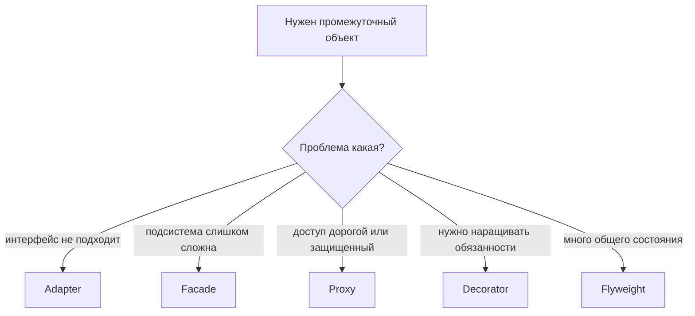

Эта лекция поэтому не про запоминание UML. Она про инженерный диагноз: по коду обертки часто похожи, но ошибка в выборе
намерения приводит к плохим границам. Decorator, который на самом деле управляет доступом, путает читателя; Facade,
который принимает бизнес-решения, превращается в божественный объект.

## Worked example: одинаковая обертка, разные причины

### Ситуация

Сервис отчетов должен подключить внешний PDF SDK, спрятать сложный pipeline генерации, лениво создать тяжелый клиент и
добавить retry, метрики и audit log.

### Наивное решение

Создать один класс `ReportPdfWrapper`, который и переводит интерфейс SDK, и решает порядок генерации, и кеширует клиент,
и пишет метрики, и повторяет вызовы. Название "wrapper" ничего не объясняет, но класс постепенно становится центром всех
изменений.

### Что ломается

Нельзя понять, зачем существует обертка. Если retry работает неправильно, приходится читать код адаптации SDK. Если
меняется порядок генерации, задевается lazy initialization. Тесты становятся широкими, потому что роли смешаны.

### Улучшение

Развести намерения: Adapter согласует интерфейс SDK с `ReportExporter`, Facade дает один вход в сложный сценарий,
Proxy лениво создает тяжелый клиент, Decorator добавляет retry/metrics/audit отдельными слоями.

### Почему это работает

Структурный паттерн читается по причине существования промежуточного объекта. Форма "класс хранит ссылку на другой
класс" почти одинаковая, но архитектурное сообщение разное.

## Карта структурных паттернов

Структурные паттерны — последняя группа GoF (классификацию см. в
[Лекции 4](/lectures/04#классификация-паттернов-gof)). Они часто используют одну и ту же базовую технику - **композицию** или **агрегацию**. Объект хранит
ссылку на другой объект и делегирует ему часть работы. Из-за этого схемы Adapter, Proxy и Decorator могут выглядеть
похожими. Отличать их нужно не по форме диаграммы, а по проблеме, которую они решают.

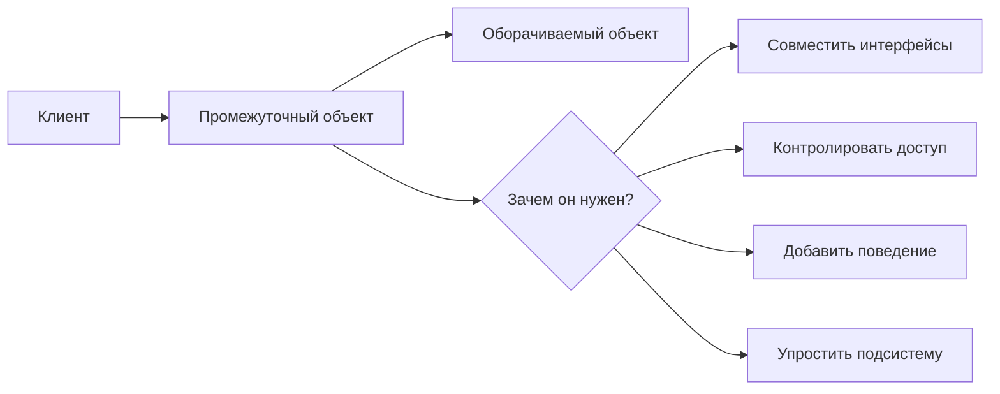

::: tip Практическое правило
Когда два структурных паттерна похожи по коду, спрашивайте: "какую боль я убираю?" Несовместимость интерфейсов -
Adapter. Сложность подсистемы - Facade. Дорогой или защищаемый объект - Proxy. Нужны комбинации дополнительных
обязанностей - Decorator. Слишком много одинаковых данных в памяти - Flyweight.
:::

::: only kotlin
В Kotlin Decorator и Adapter часто выглядят компактнее из-за делегирования и коротких data/value-типов, но смысл не
меняется: класс-обертка должен явно показывать, какую проблему он решает.
:::

::: only csharp
В C# Decorator часто встречается вокруг сервисов DI-контейнера, middleware и pipeline-обработчиков. Proxy может быть
динамическим, но учебно полезнее сначала увидеть явный класс, который контролирует доступ к реальному объекту.
:::

::: only java
В Java структурные паттерны хорошо видны в стандартной библиотеке: `InputStream`-цепочки похожи на Decorator, facade
часто появляется над сложной подсистемой, а proxy может создаваться через reflection. Но автоматическая генерация proxy
не отменяет архитектурного намерения.
:::

::: only go
В Go обертки обычно проще: структура хранит интерфейс и реализует тот же или адаптированный контракт. Благодаря
неявным интерфейсам Adapter иногда появляется без отдельной иерархии классов, но граница совместимости все равно должна
быть явной.
:::

### Общий словарь

В описаниях паттернов будут повторяться несколько терминов.

| Термин                  | Что означает                                                                 |
|-------------------------|-------------------------------------------------------------------------------|
| **Client**              | Код, который пользуется объектами и не должен знать лишние детали.            |
| **Interface**           | Контракт, через который клиент работает с объектом.                           |
| **Composition**         | Объект владеет вложенным объектом и обычно сам управляет его жизненным циклом. |
| **Aggregation**         | Объект хранит ссылку на внешний объект, но не обязательно владеет им.          |
| **Delegation**          | Метод одного объекта вызывает метод другого объекта.                          |
| **Wrapper**             | Объект-обертка: Adapter, Proxy или Decorator.                                 |
| **Subsystem**           | Набор классов, которые вместе выполняют сложную работу.                       |
| **Intrinsic state**     | Внутреннее разделяемое состояние в Flyweight.                                 |
| **Extrinsic state**     | Внешнее уникальное состояние, которое передается легковесу извне.             |

## Adapter

**Adapter** нужен, когда клиентский код ожидает один интерфейс, а полезный объект предоставляет другой интерфейс.
Паттерн создает промежуточный объект, который выглядит для клиента как ожидаемый тип, но внутри вызывает методы
адаптируемого объекта.

### Проблема

Представим приложение, которое строит финансовые графики. Внутренний код умеет работать с источниками котировок через
интерфейс `MarketDataProvider`: запросил тикер - получил цены. Затем команда покупает библиотеку биржевой аналитики,
которая умеет отдавать данные, но в другом виде: метод называется иначе, формат ответа другой, типы не совпадают.

Плохие варианты:

- переписать весь клиентский код под новую библиотеку;
- изменить стороннюю библиотеку, хотя она закрыта или обновляется отдельно;
- добавить в клиентский код условные ветки "если это старая система, делай так, если новая - иначе".

Adapter сохраняет клиентский контракт и прячет несовместимость в отдельном классе.

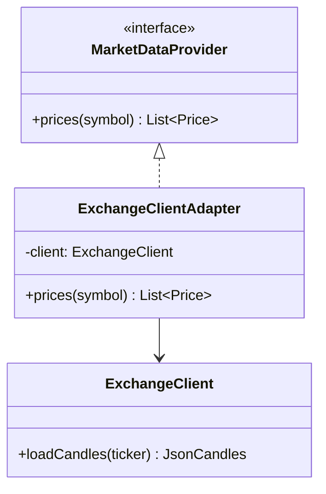

### Решение

Адаптер выполняет две работы:

1. реализует интерфейс, знакомый клиенту;
2. хранит ссылку на объект с несовместимым интерфейсом и переводит вызовы.

::: multi-code "Adapter: биржевой клиент" {playground=off}

```kotlin
data class PricePoint(val time: String, val value: Double)

interface MarketDataProvider {
    fun prices(symbol: String): List<PricePoint>
}

class ExchangeClient {
    fun loadCandles(ticker: String): List<Map<String, Any>> =
        listOf(
            mapOf("timestamp" to "10:00", "close" to 101.5),
            mapOf("timestamp" to "10:01", "close" to 102.0)
        )
}

class ExchangeClientAdapter(
    private val client: ExchangeClient
) : MarketDataProvider {
    override fun prices(symbol: String): List<PricePoint> =
        client.loadCandles(symbol).map { candle ->
            PricePoint(
                time = candle["timestamp"] as String,
                value = candle["close"] as Double
            )
        }
}

class Chart(private val provider: MarketDataProvider) {
    fun render(symbol: String) {
        val points = provider.prices(symbol)
        println("Rendering ${points.size} points for $symbol")
    }
}
```

```csharp
public sealed record PricePoint(string Time, decimal Value);

public interface IMarketDataProvider
{
    IReadOnlyList<PricePoint> Prices(string symbol);
}

public sealed class ExchangeClient
{
    public IReadOnlyList<Dictionary<string, object>> LoadCandles(string ticker) =>
        new[]
        {
            new Dictionary<string, object> { ["timestamp"] = "10:00", ["close"] = 101.5m },
            new Dictionary<string, object> { ["timestamp"] = "10:01", ["close"] = 102.0m }
        };
}

public sealed class ExchangeClientAdapter : IMarketDataProvider
{
    private readonly ExchangeClient _client;

    public ExchangeClientAdapter(ExchangeClient client)
    {
        _client = client;
    }

    public IReadOnlyList<PricePoint> Prices(string symbol) =>
        _client.LoadCandles(symbol)
            .Select(candle => new PricePoint(
                (string)candle["timestamp"],
                (decimal)candle["close"]))
            .ToList();
}

public sealed class Chart
{
    private readonly IMarketDataProvider _provider;

    public Chart(IMarketDataProvider provider)
    {
        _provider = provider;
    }

    public void Render(string symbol)
    {
        var points = _provider.Prices(symbol);
        Console.WriteLine($"Rendering {points.Count} points for {symbol}");
    }
}
```

```java
import java.util.List;
import java.util.Map;

record PricePoint(String time, double value) {}

interface MarketDataProvider {
    List<PricePoint> prices(String symbol);
}

final class ExchangeClient {
    List<Map<String, Object>> loadCandles(String ticker) {
        return List.of(
            Map.of("timestamp", "10:00", "close", 101.5),
            Map.of("timestamp", "10:01", "close", 102.0)
        );
    }
}

final class ExchangeClientAdapter implements MarketDataProvider {
    private final ExchangeClient client;

    ExchangeClientAdapter(ExchangeClient client) {
        this.client = client;
    }

    public List<PricePoint> prices(String symbol) {
        return client.loadCandles(symbol).stream()
            .map(candle -> new PricePoint(
                (String)candle.get("timestamp"),
                (Double)candle.get("close")))
            .toList();
    }
}
```

```go
type PricePoint struct {
    Time  string
    Value float64
}

type MarketDataProvider interface {
    Prices(symbol string) []PricePoint
}

type ExchangeClient struct{}

func (ExchangeClient) LoadCandles(ticker string) []map[string]any {
    return []map[string]any{
        {"timestamp": "10:00", "close": 101.5},
        {"timestamp": "10:01", "close": 102.0},
    }
}

type ExchangeClientAdapter struct {
    client ExchangeClient
}

func (a ExchangeClientAdapter) Prices(symbol string) []PricePoint {
    candles := a.client.LoadCandles(symbol)
    points := make([]PricePoint, 0, len(candles))

    for _, candle := range candles {
        points = append(points, PricePoint{
            Time:  candle["timestamp"].(string),
            Value: candle["close"].(float64),
        })
    }

    return points
}
```

:::

Клиенту не нужно знать, что данные пришли из `ExchangeClient`. Он продолжает зависеть от `MarketDataProvider`.

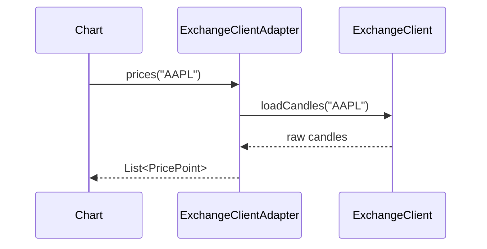

### Adapter как альтернатива наследованию

Адаптер не всегда только "переводчик форматов". Иногда он позволяет добавить недостающую функцию к объекту, который
нельзя изменить наследованием:

- класс находится в сторонней библиотеке;
- класс `final` или `sealed`;
- наследование нарушило бы модель предметной области;
- нужно совместить несколько вызовов адаптируемого объекта в один метод клиентского интерфейса.

### Object Adapter и Class Adapter

В GoF обычно различают две формы Adapter.

| Форма              | Как устроена                                             | Когда встречается |
|--------------------|----------------------------------------------------------|-------------------|
| **Object Adapter** | Адаптер хранит ссылку на адаптируемый объект.            | Самый частый вариант в современных языках. |
| **Class Adapter**  | Адаптер наследуется от адаптируемого класса и целевого типа. | Возможен не везде, зависит от множественного наследования и ограничений языка. |

В этой лекции используется Object Adapter, потому что он лучше сочетается с композицией, DI и тестированием. Он не
требует менять иерархии классов и позволяет адаптировать уже созданный объект.

::: warning Типичная ошибка
Не превращайте Adapter в место для новой бизнес-логики. Его ответственность - совместимость интерфейсов и техническое
преобразование. Если в адаптере появляются правила предметной области, клиентский код становится зависимым от скрытого
поведения, которое трудно тестировать и переиспользовать.
:::

### Применимость

Adapter подходит, когда:

- нужно использовать сторонний класс, но его интерфейс не совпадает с интерфейсом приложения;
- старый клиентский код нельзя или дорого менять;
- нужно подключить несколько существующих классов к единому контракту;
- несовместимость локальна и ее можно изолировать в небольшом классе;
- требуется перевод форматов, единиц измерения, имен методов или моделей данных.

### Плюсы и минусы

| Плюсы                                                        | Минусы                                                          |
|--------------------------------------------------------------|-----------------------------------------------------------------|
| Клиент не зависит от стороннего интерфейса.                  | Появляется дополнительный класс и дополнительный вызов.         |
| Преобразование находится в одном месте.                      | Слишком толстый адаптер становится скрытым сервисом.            |
| Легче заменить внешнюю библиотеку.                           | Ошибки маппинга могут быть незаметны без тестов.                |
| Старый код продолжает работать с прежним контрактом.         | Иногда проще изменить интерфейс клиента, если он еще не устоялся. |

## Facade

**Facade** предоставляет простой интерфейс к сложной подсистеме. В отличие от Adapter, он обычно не делает несовместимый
объект совместимым с другим интерфейсом. Его задача - снизить сложность использования.

### Проблема

Пусть у нас есть подсистема оформления заказа. Для одного сценария "купить товар" нужно:

1. проверить наличие товара;
2. зарезервировать позицию на складе;
3. списать деньги;
4. создать доставку;
5. отправить уведомление.

Если каждый клиент будет вызывать эти шаги вручную, появятся проблемы:

- клиенты начнут дублировать последовательность вызовов;
- один клиент забудет шаг или поменяет порядок;
- клиентский код станет зависеть от большого числа классов подсистемы;
- внутренние изменения подсистемы будут ломать внешних клиентов.

Facade дает клиенту одну понятную точку входа.

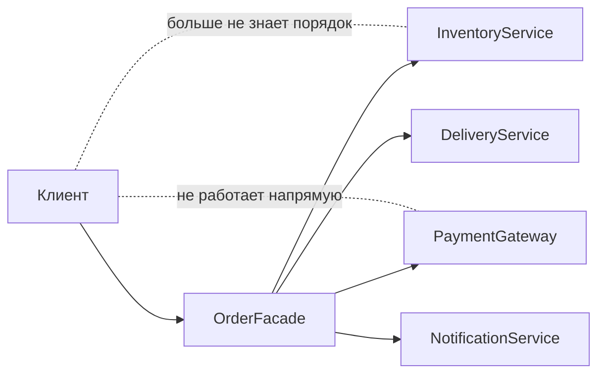

### Решение

Фасад не обязан скрывать подсистему полностью. Часто классы подсистемы остаются доступными для сложных сценариев, а
фасад покрывает самые частые и безопасные сценарии.

::: multi-code "Facade: оформление заказа" {playground=off}

```kotlin
data class OrderRequest(
    val customerId: String,
    val sku: String,
    val quantity: Int
)

data class OrderReceipt(val orderId: String)

class InventoryService {
    fun reserve(sku: String, quantity: Int): String = "reservation-$sku-$quantity"
}

class PaymentGateway {
    fun charge(customerId: String, reservationId: String): String =
        "payment-$customerId-$reservationId"
}

class DeliveryService {
    fun schedule(customerId: String, reservationId: String): String =
        "delivery-$customerId-$reservationId"
}

class NotificationService {
    fun sendOrderCreated(customerId: String, orderId: String) {
        println("Order $orderId notification sent to $customerId")
    }
}

class OrderFacade(
    private val inventory: InventoryService,
    private val payments: PaymentGateway,
    private val delivery: DeliveryService,
    private val notifications: NotificationService
) {
    fun placeOrder(request: OrderRequest): OrderReceipt {
        val reservationId = inventory.reserve(request.sku, request.quantity)
        val paymentId = payments.charge(request.customerId, reservationId)
        val deliveryId = delivery.schedule(request.customerId, reservationId)
        val orderId = "$paymentId-$deliveryId"

        notifications.sendOrderCreated(request.customerId, orderId)

        return OrderReceipt(orderId)
    }
}
```

```csharp
public sealed record OrderRequest(string CustomerId, string Sku, int Quantity);
public sealed record OrderReceipt(string OrderId);

public sealed class InventoryService
{
    public string Reserve(string sku, int quantity) => $"reservation-{sku}-{quantity}";
}

public sealed class PaymentGateway
{
    public string Charge(string customerId, string reservationId) =>
        $"payment-{customerId}-{reservationId}";
}

public sealed class DeliveryService
{
    public string Schedule(string customerId, string reservationId) =>
        $"delivery-{customerId}-{reservationId}";
}

public sealed class NotificationService
{
    public void SendOrderCreated(string customerId, string orderId) =>
        Console.WriteLine($"Order {orderId} notification sent to {customerId}");
}

public sealed class OrderFacade
{
    private readonly InventoryService _inventory;
    private readonly PaymentGateway _payments;
    private readonly DeliveryService _delivery;
    private readonly NotificationService _notifications;

    public OrderFacade(
        InventoryService inventory,
        PaymentGateway payments,
        DeliveryService delivery,
        NotificationService notifications)
    {
        _inventory = inventory;
        _payments = payments;
        _delivery = delivery;
        _notifications = notifications;
    }

    public OrderReceipt PlaceOrder(OrderRequest request)
    {
        var reservationId = _inventory.Reserve(request.Sku, request.Quantity);
        var paymentId = _payments.Charge(request.CustomerId, reservationId);
        var deliveryId = _delivery.Schedule(request.CustomerId, reservationId);
        var orderId = $"{paymentId}-{deliveryId}";

        _notifications.SendOrderCreated(request.CustomerId, orderId);

        return new OrderReceipt(orderId);
    }
}
```

:::

Фасад особенно полезен, когда последовательность шагов важнее отдельных операций. Он превращает "знай пять подсистем и
правильный порядок" в "вызови `placeOrder`".

### Фасад и слои

Фасад часто становится границей между слоями или модулями. Например, UI не должен знать детали платежей, склада и
доставки. Он вызывает фасад приложения, а тот координирует внутренние сервисы.

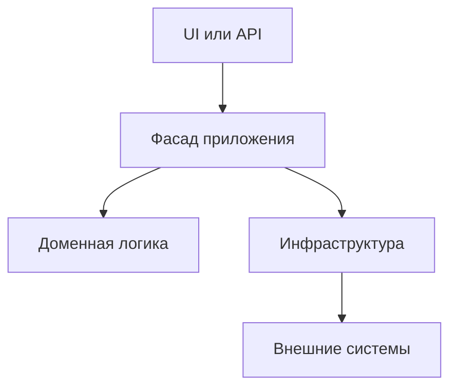

Это не означает, что любой сервис приложения - Facade. Фасад уместен, когда он действительно упрощает сложную
подсистему и скрывает порядок взаимодействия.

### Риск божественного объекта

Главный риск Facade - превратить его в класс, через который проходит все приложение. Сначала у него один метод
`placeOrder`, потом `cancelOrder`, затем `refund`, `changeAddress`, `exportReports`, `recalculateDiscounts`, и через
месяц фасад знает обо всех классах системы.

Как избежать:

- делать фасады под сценарии или ограниченные части подсистемы;
- не помещать в фасад бизнес-правила, если для них есть доменная модель или отдельный сервис;
- не запрещать прямой доступ к подсистемам там, где нужен расширенный сценарий;
- выделять несколько фасадов вместо одного универсального.

::: tip Практическое правило
Хороший фасад похож на удобную кнопку для частого сценария. Плохой фасад похож на единственный вход во всю систему.
:::

### Применимость

Facade подходит, когда:

- подсистема сложна, а клиентам нужна только часть возможностей;
- нужно зафиксировать правильную последовательность вызовов;
- хочется уменьшить количество зависимостей у клиентского кода;
- подсистему нужно отделить от внешнего слоя;
- есть повторяющийся сценарий, который постоянно собирается вручную.

### Плюсы и минусы

| Плюсы                                                   | Минусы                                                    |
|---------------------------------------------------------|-----------------------------------------------------------|
| Упрощает клиентский код.                                | Может стать божественным объектом.                       |
| Снижает связанность с внутренними классами подсистемы.  | Может скрыть важные детали и ошибки проектирования.      |
| Централизует порядок сложного сценария.                 | Излишне общий фасад быстро получает слишком много методов. |
| Упрощает замену или переработку подсистемы.             | Не решает сам по себе проблему плохой внутренней модели.  |

::: only go
В Go Facade — это по сути хорошо спроектированный пакет. Экспортированные функции формируют простой API, а
неэкспортированные типы и функции скрыты от клиента. Дополнительного класса-фасада не нужно — границы пакета уже
выполняют эту роль.
:::

## Proxy

Facade упрощает интерфейс подсистемы. Proxy решает другую задачу — контролирует *доступ* к объекту: отложенная загрузка,
проверка прав, логирование, кеширование.

**Proxy** предоставляет объект-заместитель с тем же интерфейсом, что и реальный объект. Клиент думает, что работает с
обычным сервисом, но вызов сначала проходит через прокси.

Proxy отличается от Adapter тем, что интерфейс обычно **не меняется**. Заместитель реализует тот же контракт, что и
реальный объект. Его цель - контролировать доступ, создание, удаленный вызов, кеширование, логирование или другие
технические аспекты.

### Проблема

Представим сервис загрузки фотографий. Оригинал в высоком качестве дорогой:

- файл большой;
- может лежать в удаленном хранилище;
- нужен только когда пользователь открыл фото полностью;
- на странице списка достаточно превью.

Если сразу создавать и загружать реальные объекты, приложение будет медленным и прожорливым. Proxy позволяет дать
клиенту объект с тем же интерфейсом, но отложить дорогую работу до момента, когда она действительно нужна.

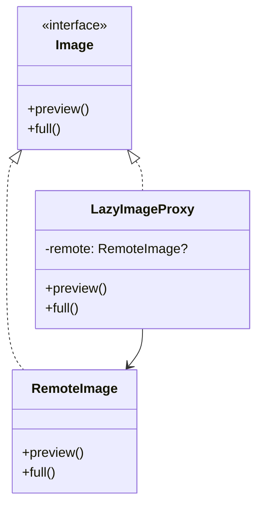

### Решение

::: multi-code "Proxy: ленивая загрузка изображения" {playground=off}

```kotlin
interface Image {
    fun preview(): ByteArray
    fun full(): ByteArray
}

class RemoteImage(private val id: String) : Image {
    init {
        println("Opening remote connection for $id")
    }

    override fun preview(): ByteArray =
        "small-$id".encodeToByteArray()

    override fun full(): ByteArray =
        "large-$id".encodeToByteArray()
}

class LazyImageProxy(private val id: String) : Image {
    private var realImage: RemoteImage? = null
    private val cachedPreview: ByteArray = "cached-preview-$id".encodeToByteArray()

    override fun preview(): ByteArray = cachedPreview

    override fun full(): ByteArray {
        val image = realImage ?: RemoteImage(id).also { realImage = it }
        return image.full()
    }
}

class Gallery(private val images: List<Image>) {
    fun renderList() {
        images.forEach { it.preview() }
    }

    fun open(index: Int): ByteArray =
        images[index].full()
}
```

```csharp
public interface IImage
{
    byte[] Preview();
    byte[] Full();
}

public sealed class RemoteImage : IImage
{
    private readonly string _id;

    public RemoteImage(string id)
    {
        _id = id;
        Console.WriteLine($"Opening remote connection for {id}");
    }

    public byte[] Preview() => Encoding.UTF8.GetBytes($"small-{_id}");

    public byte[] Full() => Encoding.UTF8.GetBytes($"large-{_id}");
}

public sealed class LazyImageProxy : IImage
{
    private readonly string _id;
    private readonly byte[] _cachedPreview;
    private RemoteImage? _realImage;

    public LazyImageProxy(string id)
    {
        _id = id;
        _cachedPreview = Encoding.UTF8.GetBytes($"cached-preview-{id}");
    }

    public byte[] Preview() => _cachedPreview;

    public byte[] Full()
    {
        _realImage ??= new RemoteImage(_id);
        return _realImage.Full();
    }
}
```

:::

В списке галереи прокси отдает кешированное превью. Реальный удаленный объект создается только при вызове `full`.

### Виды Proxy

| Вид прокси             | Что делает                                                                                  |
|------------------------|----------------------------------------------------------------------------------------------|
| **Virtual Proxy**      | Откладывает создание тяжелого объекта до первого реального использования.                    |
| **Protection Proxy**   | Проверяет права доступа перед вызовом реального объекта.                                     |
| **Remote Proxy**       | Представляет удаленный объект локальным интерфейсом.                                         |
| **Logging Proxy**      | Записывает обращения к сервису, не меняя сервис.                                             |
| **Caching Proxy**      | Возвращает кешированные результаты и обращается к реальному объекту только при необходимости. |
| **Smart Reference**    | Управляет жизненным циклом, подсчетом ссылок или освобождением ресурса.                      |

### Proxy и DI

Proxy часто полезен вместе с DI-контейнером. Класс получает зависимость по интерфейсу, но контейнер может подставить не
реальный сервис, а прокси:

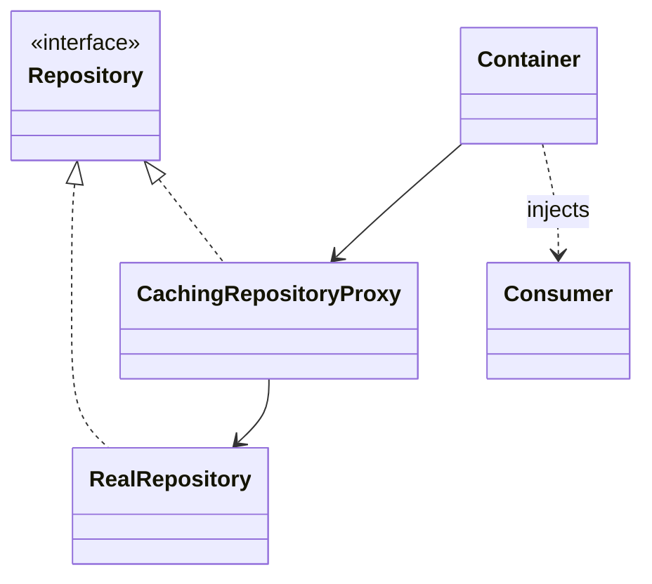

Код потребителя не меняется. Это позволяет добавлять кеширование, авторизацию или логирование вокруг сервиса без
переписывания бизнес-логики.

::: warning Типичная ошибка
Если прокси начинает менять смысл результата, а не контролировать доступ к реальному объекту, он перестает быть
прозрачным заместителем. Клиент ожидает, что `IRepository` работает одинаково независимо от того, стоит ли перед ним
прокси.
:::

### Применимость

Proxy подходит, когда:

- реальный объект дорого создавать или загружать;
- нужно контролировать доступ к объекту;
- объект находится на удаленной машине, а клиенту нужен локальный контракт;
- требуется логировать вызовы без изменения сервиса;
- нужно кешировать результаты;
- нужно управлять жизненным циклом ресурса.

### Плюсы и минусы

| Плюсы                                                   | Минусы                                                        |
|---------------------------------------------------------|---------------------------------------------------------------|
| Контроль доступа незаметен для клиента.                 | Увеличивается количество классов.                             |
| Можно отложить создание тяжелого объекта.               | Появляется дополнительная задержка на прокси-логику.          |
| Легко добавить логирование, кеширование, авторизацию.   | Отладка сложнее: вызов проходит через промежуточный объект.   |
| Реальный объект можно заменить удаленным представлением. | Непрозрачный прокси может нарушить ожидания клиентского кода. |

## Decorator

**Decorator** добавляет объекту новые обязанности через оборачивание. Он позволяет комбинировать поведение во время
выполнения программы, не создавая огромную иерархию наследования.

### Проблема

Представим сервис уведомлений. Сначала он отправляет email. Потом бизнес просит SMS. Затем Slack. Затем Telegram. Потом
нужно "email + SMS", "email + Slack", "email + SMS + Slack", "только Telegram для тестового контура".

Если решать наследованием, быстро получится комбинаторный взрыв:

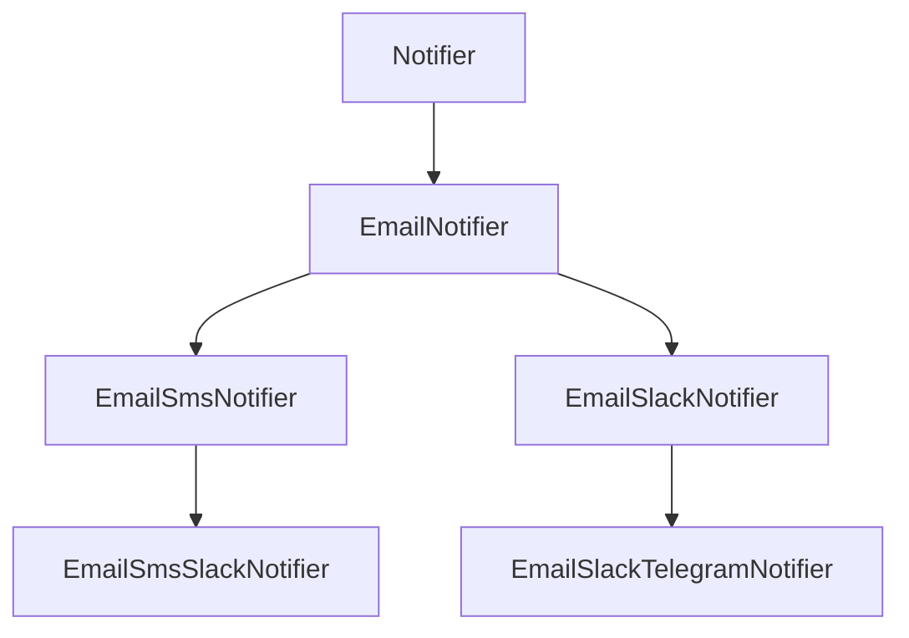

Проблема не в том, что наследование запрещено. Проблема в том, что наследование фиксирует комбинацию на уровне класса.
Decorator собирает комбинацию из маленьких оберток.

### Решение

У базового компонента и всех декораторов общий интерфейс. Каждый декоратор хранит ссылку на компонент и добавляет свое
поведение до или после делегирования.

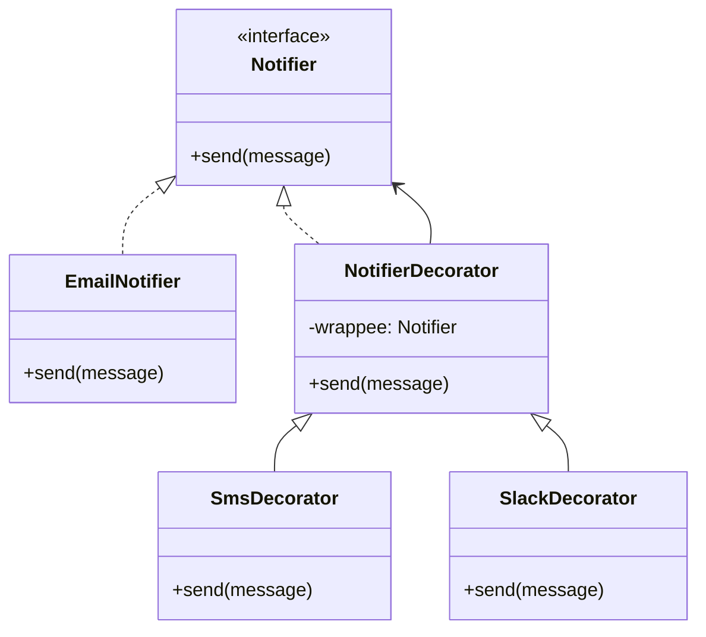

::: multi-code "Decorator: уведомления" {playground=off}

```kotlin
interface Notifier {
    fun send(message: String)
}

class EmailNotifier(private val email: String) : Notifier {
    override fun send(message: String) {
        println("Email to $email: $message")
    }
}

abstract class NotifierDecorator(
    private val wrappee: Notifier
) : Notifier {
    override fun send(message: String) {
        wrappee.send(message)
    }
}

class SmsDecorator(
    wrappee: Notifier,
    private val phone: String
) : NotifierDecorator(wrappee) {
    override fun send(message: String) {
        super.send(message)
        println("SMS to $phone: $message")
    }
}

class SlackDecorator(
    wrappee: Notifier,
    private val channel: String
) : NotifierDecorator(wrappee) {
    override fun send(message: String) {
        super.send(message)
        println("Slack $channel: $message")
    }
}

fun main() {
    val notifier: Notifier =
        SlackDecorator(
            SmsDecorator(
                EmailNotifier("user@example.com"),
                phone = "+79990000000"
            ),
            channel = "#orders"
        )

    notifier.send("Order created")
}
```

```csharp
public interface INotifier
{
    void Send(string message);
}

public sealed class EmailNotifier : INotifier
{
    private readonly string _email;

    public EmailNotifier(string email)
    {
        _email = email;
    }

    public void Send(string message) =>
        Console.WriteLine($"Email to {_email}: {message}");
}

public abstract class NotifierDecorator : INotifier
{
    private readonly INotifier _wrappee;

    protected NotifierDecorator(INotifier wrappee)
    {
        _wrappee = wrappee;
    }

    public virtual void Send(string message)
    {
        _wrappee.Send(message);
    }
}

public sealed class SmsDecorator : NotifierDecorator
{
    private readonly string _phone;

    public SmsDecorator(INotifier wrappee, string phone) : base(wrappee)
    {
        _phone = phone;
    }

    public override void Send(string message)
    {
        base.Send(message);
        Console.WriteLine($"SMS to {_phone}: {message}");
    }
}

public sealed class SlackDecorator : NotifierDecorator
{
    private readonly string _channel;

    public SlackDecorator(INotifier wrappee, string channel) : base(wrappee)
    {
        _channel = channel;
    }

    public override void Send(string message)
    {
        base.Send(message);
        Console.WriteLine($"Slack {_channel}: {message}");
    }
}
```

```java
interface Notifier {
    void send(String message);
}

final class EmailNotifier implements Notifier {
    private final String email;

    EmailNotifier(String email) {
        this.email = email;
    }

    public void send(String message) {
        System.out.println("Email to " + email + ": " + message);
    }
}

abstract class NotifierDecorator implements Notifier {
    private final Notifier wrappee;

    protected NotifierDecorator(Notifier wrappee) {
        this.wrappee = wrappee;
    }

    public void send(String message) {
        wrappee.send(message);
    }
}

final class SmsDecorator extends NotifierDecorator {
    private final String phone;

    SmsDecorator(Notifier wrappee, String phone) {
        super(wrappee);
        this.phone = phone;
    }

    public void send(String message) {
        super.send(message);
        System.out.println("SMS to " + phone + ": " + message);
    }
}
```

```go
type Notifier interface {
    Send(message string)
}

type EmailNotifier struct {
    Email string
}

func (n EmailNotifier) Send(message string) {
    fmt.Printf("Email to %s: %s\n", n.Email, message)
}

type SmsDecorator struct {
    Wrappee Notifier
    Phone   string
}

func (d SmsDecorator) Send(message string) {
    d.Wrappee.Send(message)
    fmt.Printf("SMS to %s: %s\n", d.Phone, message)
}

type SlackDecorator struct {
    Wrappee Notifier
    Channel string
}

func (d SlackDecorator) Send(message string) {
    d.Wrappee.Send(message)
    fmt.Printf("Slack %s: %s\n", d.Channel, message)
}
```

:::

Клиент видит только `Notifier`. Ему не важно, перед ним чистый `EmailNotifier` или цепочка из трех декораторов.

### Важность порядка

Порядок декораторов может иметь значение. Например:

```kotlin
val a = LoggingDecorator(CachingDecorator(repository))
val b = CachingDecorator(LoggingDecorator(repository))
```

В первом варианте логироваться будут все обращения, включая попадания в кеш. Во втором - логирование может сработать
только при обращении к реальному репозиторию, если кеш перехватывает вызов раньше. Поэтому цепочку декораторов нужно
собирать осознанно.

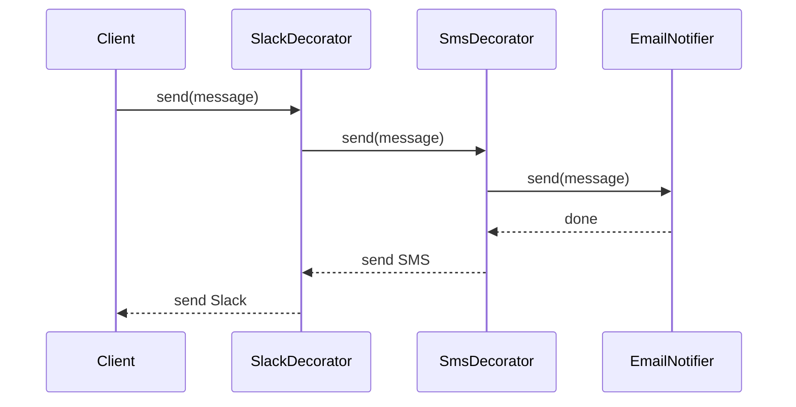

### Decorator и наследование

Наследование хорошо, когда новая сущность действительно является частным случаем старой сущности и иерархия стабильна.
Decorator лучше, когда:

- добавляемые обязанности независимы;
- обязанности нужно включать и выключать в runtime;
- комбинаций слишком много для наследования;
- нельзя изменить или наследовать исходный класс;
- нужно соблюдать Open/Closed Principle: добавлять поведение новыми классами, не меняя старые.

::: only kotlin
Kotlin `by` делает Decorator почти бесплатным — все методы интерфейса делегируются автоматически, а вы переопределяете
только нужные:

```kotlin
class LoggingNotifier(
    private val inner: Notifier
) : Notifier by inner {
    override fun send(msg: String) {
        println("Sending: $msg")
        inner.send(msg)
    }
}
```

В Java и C# каждый метод интерфейса нужно делегировать вручную. В Go embedding struct делает то же самое, что Kotlin
`by`, но без интерфейса: встроенное поле «продвигает» все методы автоматически.
:::

::: warning Типичная ошибка
Decorator не должен расширять публичный интерфейс так, что клиенту придется знать конкретный класс декоратора. Если
клиент вынужден привести `Notifier` к `SmsDecorator`, общий интерфейс перестал быть полезным.
:::

### Применимость

Decorator подходит, когда:

- нужно добавлять обязанности объектам на лету;
- обязанности можно комбинировать в разных наборах;
- наследование приводит к слишком большому числу классов;
- есть общий интерфейс компонента;
- добавляемое поведение можно выполнить до или после вызова вложенного объекта.

### Плюсы и минусы

| Плюсы                                                   | Минусы                                                       |
|---------------------------------------------------------|--------------------------------------------------------------|
| Гибче наследования для комбинаций поведения.            | Много маленьких классов.                                     |
| Поведение можно добавлять в runtime.                    | Важен порядок оборачивания.                                  |
| Каждый декоратор имеет узкую ответственность.           | Сложнее понять финальное поведение по одной переменной.      |
| Можно комбинировать несколько обязанностей.             | Конфигурация цепочки может стать отдельной сложной задачей.  |

## Flyweight

Decorator *добавляет* поведение обёртками. Flyweight решает противоположную задачу — *экономит*, разделяя общее состояние
между множеством похожих объектов.

**Flyweight** экономит память, когда в программе создается очень много похожих объектов. Паттерн разделяет состояние на
две части:

- **внутреннее состояние** - одинаковое для многих объектов, хранится в разделяемом легковесе;
- **внешнее состояние** - уникальное для конкретного случая, передается в методы или хранится отдельно.

### Проблема

Представим игру или систему визуализации, где на экране десятки тысяч частиц: пули, осколки, искры. У каждой частицы
есть координаты и скорость, но у многих совпадает спрайт, цвет, размер, тип анимации. Если хранить одинаковый спрайт и
настройки в каждом объекте, память расходуется впустую.

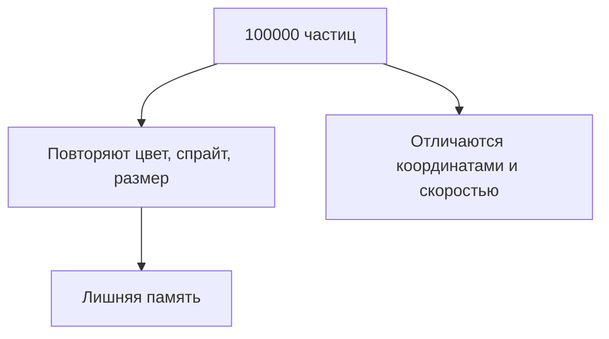

Flyweight предлагает вынести повторяющееся состояние в общий объект.

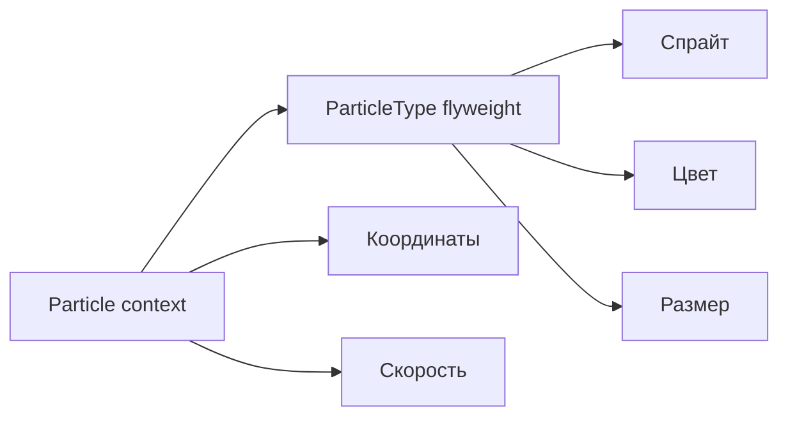

Условная оценка помогает понять смысл паттерна. Если у 100000 частиц каждая хранит спрайт, цвет и параметры анимации
как собственные поля, повторяющаяся часть умножается на 100000. Если вынести ее в `ParticleType`, то 100000 объектов
хранят только координаты, скорость и ссылку на общий тип.

| Подход        | Что хранит каждая частица                  | Что разделяется       |
|---------------|---------------------------------------------|-----------------------|
| Без Flyweight | координаты, скорость, спрайт, цвет, размер | почти ничего          |
| С Flyweight   | координаты, скорость, ссылка на тип        | спрайт, цвет, размер  |

### Решение

::: multi-code "Flyweight: частицы" {playground=off}

```kotlin
data class Sprite(val path: String)

class ParticleType(
    val name: String,
    val sprite: Sprite,
    val color: String
) {
    fun draw(x: Int, y: Int) {
        println("Draw $name at $x:$y with ${sprite.path} and $color")
    }
}

class ParticleTypeFactory {
    private val types = mutableMapOf<String, ParticleType>()

    fun get(name: String, spritePath: String, color: String): ParticleType =
        types.getOrPut("$name|$spritePath|$color") {
            ParticleType(name, Sprite(spritePath), color)
        }
}

data class Particle(
    val x: Int,
    val y: Int,
    val speedX: Int,
    val speedY: Int,
    val type: ParticleType
) {
    fun draw() {
        type.draw(x, y)
    }
}

class ParticleSystem(
    private val factory: ParticleTypeFactory = ParticleTypeFactory()
) {
    private val particles = mutableListOf<Particle>()

    fun addBullet(x: Int, y: Int, speedX: Int, speedY: Int) {
        val type = factory.get("bullet", "sprites/bullet.png", "yellow")
        particles += Particle(x, y, speedX, speedY, type)
    }
}
```

```csharp
public sealed record Sprite(string Path);

public sealed class ParticleType
{
    public string Name { get; }
    public Sprite Sprite { get; }
    public string Color { get; }

    public ParticleType(string name, Sprite sprite, string color)
    {
        Name = name;
        Sprite = sprite;
        Color = color;
    }

    public void Draw(int x, int y) =>
        Console.WriteLine($"Draw {Name} at {x}:{y} with {Sprite.Path} and {Color}");
}

public sealed class ParticleTypeFactory
{
    private readonly Dictionary<string, ParticleType> _types = new();

    public ParticleType Get(string name, string spritePath, string color)
    {
        var key = $"{name}|{spritePath}|{color}";
        if (!_types.TryGetValue(key, out var type))
        {
            type = new ParticleType(name, new Sprite(spritePath), color);
            _types[key] = type;
        }

        return type;
    }
}

public sealed record Particle(
    int X,
    int Y,
    int SpeedX,
    int SpeedY,
    ParticleType Type)
{
    public void Draw() => Type.Draw(X, Y);
}
```

:::

`Particle` хранит координаты, скорость и ссылку на тип. `ParticleType` хранит тяжелые или повторяющиеся данные.
Фабрика гарантирует, что одинаковые типы переиспользуются.

### Внутреннее и внешнее состояние

| Состояние       | Где хранится                       | Пример для частиц                         |
|-----------------|------------------------------------|-------------------------------------------|
| Внутреннее      | В разделяемом легковесе            | спрайт, цвет, размер, тип анимации        |
| Внешнее         | В контексте или передается в метод | координаты, скорость, направление, время  |

Ключевая сложность Flyweight - правильно провести границу. Если вынести наружу слишком мало, экономии не будет. Если
вынести слишком много, код станет неудобным и начнет постоянно собирать контекст.

### Когда Flyweight действительно нужен

В современной разработке Flyweight применяют реже, чем Adapter, Facade, Proxy и Decorator. Причина простая: память стала
дешевле, а сложность кода осталась дорогой. Но паттерн все еще полезен там, где объектов очень много:

- графические редакторы и игровые движки;
- текстовые редакторы, где символы или стили переиспользуются;
- карты, тайлы, маркеры, геометрические примитивы;
- системы мониторинга и визуализации с огромным числом похожих элементов;
- интернирование строк и других неизменяемых значений.

::: warning Не применяйте Flyweight "на всякий случай"
Перед внедрением нужны измерения: профилирование памяти, оценка числа объектов и понимание, какая часть состояния
повторяется. Без этого Flyweight почти всегда преждевременная оптимизация.
:::

### Применимость

Flyweight подходит, когда одновременно выполняются условия:

- в приложении создается очень много похожих объектов;
- из-за этого реально не хватает памяти или растет давление на GC;
- значительная часть состояния повторяется;
- повторяющееся состояние можно сделать неизменяемым;
- внешнее состояние можно хранить или вычислять отдельно;
- выигрыш в памяти важнее усложнения кода.

### Плюсы и минусы

| Плюсы                                      | Минусы                                                           |
|--------------------------------------------|------------------------------------------------------------------|
| Сильно снижает расход памяти.              | Усложняет модель объектов.                                       |
| Переиспользует тяжелые неизменяемые данные. | Нужно аккуратно разделять внутреннее и внешнее состояние.        |
| Может уменьшить нагрузку на сборщик мусора. | Иногда тратит больше CPU на поиск легковеса и сборку контекста.  |
| Хорошо работает с фабрикой и кешем.         | Без профилирования легко решить несуществующую проблему.         |

::: only kotlin
В Kotlin `object` идеален для Flyweight-фабрик: единственный экземпляр хранит кеш типов частиц. А `value class` создаёт
compile-time обёртку без аллокации — ещё один способ снизить расход памяти.
:::

::: only java
`Integer.valueOf()` — встроенный Flyweight в Java: значения от -128 до 127 кешируются и переиспользуются. `String.intern()`
работает аналогично для строк.
:::

::: only csharp
В C# string interning (`string.Intern()`) — встроенный Flyweight. Для пользовательских типов `readonly record struct`
даёт value-семантику без кучи, что часто снимает саму потребность в Flyweight.
:::

::: only go
`sync.Pool` в Go — механизм переиспользования объектов, похожий на Flyweight, но ориентированный на снижение нагрузки
на GC. Пул не гарантирует, что объект останется — сборщик мусора может очистить его. Для неизменяемых shared-данных
достаточно обычного пакетного `var`.
:::

## Как различать похожие паттерны

Самая частая сложность этой лекции - Adapter, Proxy и Decorator выглядят как обертки. Facade тоже иногда выглядит как
обертка над подсистемой. Разница в намерении.

| Паттерн       | Что есть внутри                    | Интерфейс для клиента                         | Главная цель                              |
|---------------|-------------------------------------|-----------------------------------------------|-------------------------------------------|
| Adapter       | Несовместимый объект                | Ожидаемый клиентом интерфейс                  | Совместить разные интерфейсы              |
| Facade        | Несколько классов подсистемы        | Новый простой интерфейс                       | Упростить сложную подсистему              |
| Proxy         | Реальный объект с тем же контрактом | Обычно тот же интерфейс, что у реального типа | Контролировать доступ или жизненный цикл  |
| Decorator     | Компонент с тем же контрактом       | Тот же интерфейс                              | Добавить комбинируемое поведение          |
| Flyweight     | Разделяемое внутреннее состояние    | Не обязательно обертка                        | Сэкономить память                         |

### Быстрый алгоритм выбора

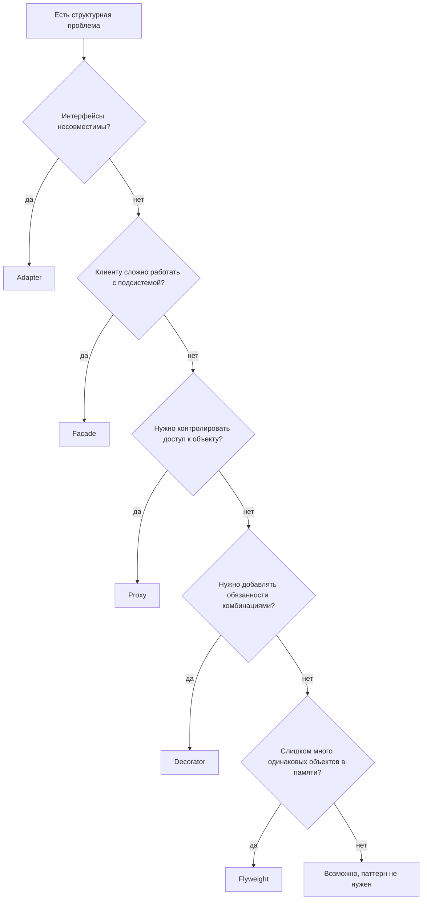

### Примеры различий на одной задаче

Допустим, есть `PaymentService`.

| Ситуация                                                                 | Паттерн       |
|--------------------------------------------------------------------------|---------------|
| Новый платежный провайдер имеет метод `makeCharge`, а приложение ждет `pay`. | Adapter       |
| Для оплаты нужно вызвать антифрод, банк, склад, чек и уведомления.        | Facade        |
| Перед оплатой нужно проверить права или не создавать тяжелый клиент банка. | Proxy         |
| К оплате нужно динамически добавлять логирование, метрики, retry, trace.  | Decorator     |
| В памяти миллионы одинаковых описаний валют, комиссий или тарифов.        | Flyweight     |

::: tip Главная проверка
Если вы можете объяснить паттерн фразой "он просто оборачивает объект", объяснение еще не закончено. Нужно добавить:
"оборачивает, чтобы ...". Именно продолжение определяет паттерн.
:::

### Пограничные случаи

Иногда один и тот же технический прием можно описать разными паттернами. Например, логирование вокруг репозитория может
выглядеть и как Proxy, и как Decorator. В таких случаях выбирайте название по намерению.

| Ситуация                                                         | Лучше назвать |
|------------------------------------------------------------------|---------------|
| Логирование добавлено как одна из независимых опций цепочки.     | Decorator     |
| Логирование встроено в заместителя, который контролирует сервис. | Proxy         |
| Кеш скрывает дорогой удаленный вызов и сохраняет тот же контракт. | Proxy         |
| Кеш является одной из настраиваемых оберток рядом с retry/trace. | Decorator     |

Название паттерна должно помогать читателю понять проектное решение. Если слово "Proxy" лучше объясняет контроль
доступа, используйте его. Если слово "Decorator" лучше объясняет цепочку независимых добавок, используйте его.

## Bridge и Composite: что осталось за рамками основной лекции

В GoF есть семь структурных паттернов. В этой лекции подробно разобраны Adapter, Facade, Proxy, Decorator и Flyweight.
Для общей карты нужно хотя бы понимать, где находятся Bridge и Composite.

### Bridge

**Bridge** разделяет абстракцию и реализацию так, чтобы их можно было развивать независимо. Он полезен, когда есть две
оси изменений. Например, фигуры и способы рисования:

- фигуры: круг, прямоугольник, текст;
- платформы отрисовки: Canvas, SVG, PDF.

Без Bridge можно получить классы `CanvasCircle`, `SvgCircle`, `PdfCircle`, `CanvasRectangle`, `SvgRectangle` и так
далее. Bridge предлагает хранить реализацию отрисовки внутри абстракции фигуры.

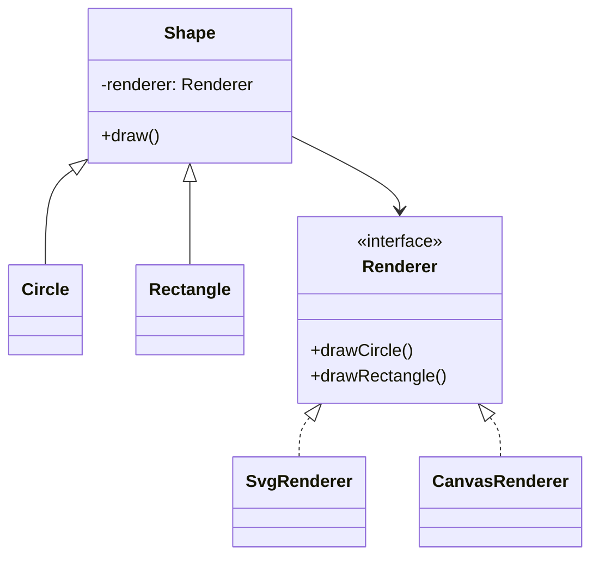

Bridge часто появляется в библиотеках, где нельзя позволить двум независимым иерархиям перемножаться.

### Composite

**Composite** представляет дерево объектов так, чтобы клиент мог одинаково работать с отдельным элементом и группой
элементов. Классические примеры: файловая система, UI-дерево, меню, организационная структура.

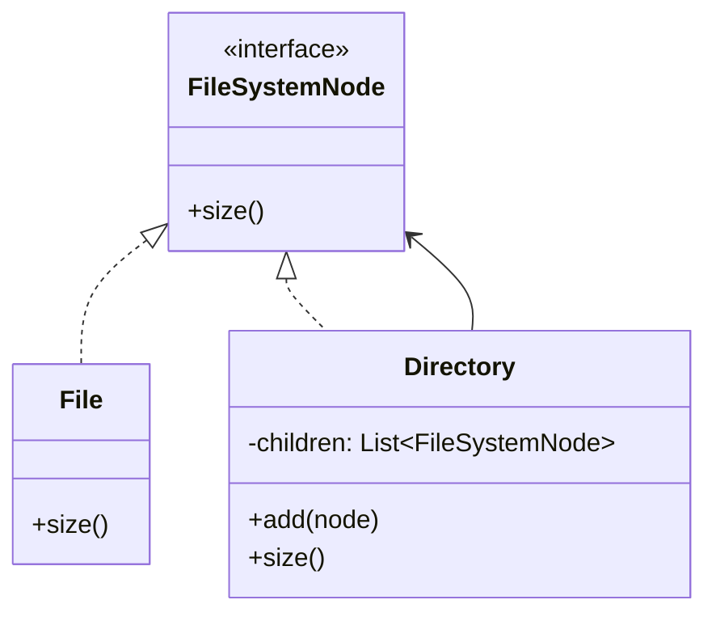

Composite полезен, когда алгоритм должен обходить дерево, не проверяя на каждом шаге "это лист или контейнер?".

## Связь с SOLID

Структурные паттерны не заменяют SOLID, а часто являются конкретными способами применить эти принципы.

| Принцип | Связь со структурными паттернами |
|---------|----------------------------------|
| SRP     | Adapter изолирует преобразование, Facade изолирует сценарий, Decorator держит одну добавку в одном классе. |
| OCP     | Decorator и Proxy добавляют поведение без изменения исходного сервиса. Adapter подключает новый тип без переписывания клиента. |
| LSP     | Proxy и Decorator должны быть взаимозаменяемы с реальным компонентом через общий интерфейс. |
| ISP     | Facade может дать клиенту узкий интерфейс вместо большой подсистемы. |
| DIP     | Клиент зависит от абстракции: `Notifier`, `Repository`, `MarketDataProvider`, а не от конкретной реализации. |

::: warning Не используйте паттерн вместо проектирования
Паттерн не исправит неверную границу ответственности. Например, Facade может временно спрятать сложную подсистему, но
не сделает ее хорошей моделью. Decorator может добавить логирование, но не должен маскировать непредсказуемые побочные
эффекты исходного объекта.
:::

## Разбор сценария

Разберите ситуацию и выберите паттерн.

1. Приложение работает с интерфейсом `ReportExporter`, а новая библиотека умеет только `generatePdf`.
2. Для создания отчета нужно вызвать сбор данных, шаблонизатор, генератор PDF, файловое хранилище и email-рассылку.
3. Генератор PDF очень тяжелый, и его нужно создавать только при первой реальной генерации.
4. К генератору нужно по конфигурации добавлять метрики, логирование и retry.
5. В отчете миллионы ячеек, но большинство из них используют один из 20 повторяющихся стилей.

Ответ:

| Ситуация | Паттерн   | Почему |
|----------|-----------|--------|
| 1        | Adapter   | Совмещает интерфейс приложения с интерфейсом библиотеки. |
| 2        | Facade    | Прячет сложный порядок работы подсистемы за одним сценарием. |
| 3        | Proxy     | Откладывает создание тяжелого объекта. |
| 4        | Decorator | Добавляет независимые обязанности цепочкой. |
| 5        | Flyweight | Разделяет повторяющиеся стили между множеством ячеек. |

## Итоги

Структурные паттерны помогают не "нарисовать красивую UML-диаграмму", а управлять связями между объектами.

- **Adapter** нужен, когда полезный объект не подходит по интерфейсу.
- **Facade** нужен, когда клиенту не стоит знать сложность подсистемы.
- **Proxy** нужен, когда доступ к реальному объекту нужно контролировать.
- **Decorator** нужен, когда поведение нужно добавлять комбинациями.
- **Flyweight** нужен, когда множество похожих объектов расходует слишком много памяти.

Главный навык после этой лекции - не запоминать диаграммы механически, а видеть проблему. У разных паттернов могут быть
похожие связи между классами, но разные причины существования.

На этом блок GoF-паттернов закрывается. Дальше курс поднимает масштаб: если паттерны помогали управлять созданием,
поведением и связями отдельных объектов, то [DDD](/lectures/07#зачем-ddd) и
[enterprise-архитектуры](/lectures/08#зачем-вообще-архитектура) будут отвечать на вопрос, где проходят границы смысла,
модулей и приложения целиком.

## Дополнительное чтение

Подборка помогает повторить структурные паттерны и увидеть альтернативные примеры их реализации.

### Структурные паттерны

- [Структурные паттерны на Refactoring Guru](https://refactoringguru.cn/ru/design-patterns/structural-patterns) — теоретическое описание блока GoF.
- [Структурные паттерны на Metanit](https://metanit.com/sharp/patterns/4.1.php) — примеры на C#.

### Видео

- [Курс Avito о практиках и паттернах кода](https://avito.tech/patterns#seasons) — видеокурс с практическими разборами.

## Вопросы для самопроверки

Ответьте на вопросы без подсказок:

1. Чем структурные паттерны отличаются от порождающих и поведенческих?
2. Почему Adapter не должен менять смысл операции, а только согласовывать интерфейсы?
3. Чем Proxy отличается от Decorator, если оба могут выглядеть как обертка?
4. Почему Facade может стать божественным объектом?
5. Как Decorator заменяет комбинаторное наследование?
6. В чем разница между внутренним и внешним состоянием Flyweight?
7. Почему Flyweight не стоит применять без профилирования?
8. Как структурные паттерны связаны с композицией, агрегацией и SOLID?

## Мини-практика

Продолжите сценарий отчета из разбора выше, но без готового ответа.

Нужно подключить новый внешний сервис экспорта:

- приложение ожидает `ReportExporter.export(report)`;
- SDK внешнего поставщика дает только `PdfClient.render(template, data)`;
- вызов дорогой, поэтому клиент нужно создавать лениво;
- в production нужны retry, метрики и audit log;
- для большого отчета повторяются стили ячеек.

Сделайте короткий дизайн:

1. Назовите классы или функции, которые будут Adapter, Proxy и Decorator.
2. Укажите порядок оберток для retry, метрик и audit log.
3. Решите, нужен ли Facade поверх всего сценария генерации отчета.
4. Отдельно объясните, где Flyweight действительно экономит память, а где только усложняет код.

Проверьте результат: если клиентский код знает про `PdfClient`, retries, audit и внутренний формат стилей одновременно,
границы структурных паттернов проведены плохо.
