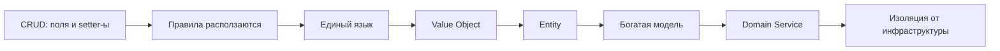
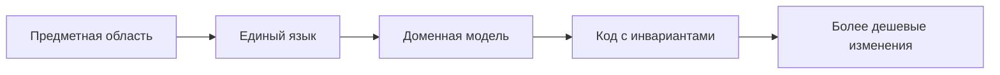
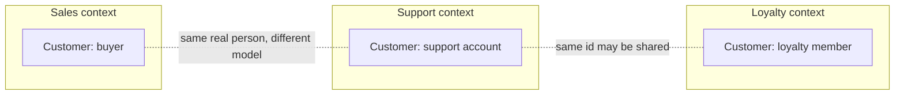
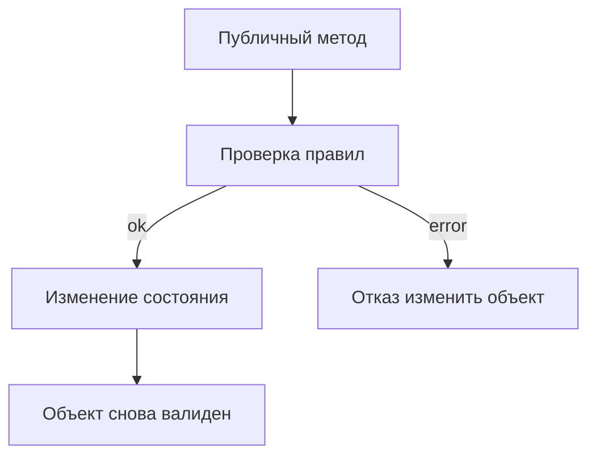
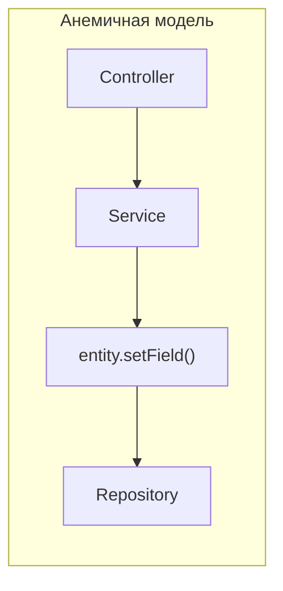
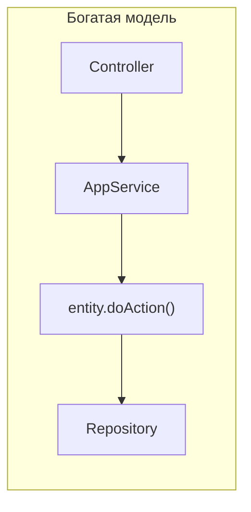
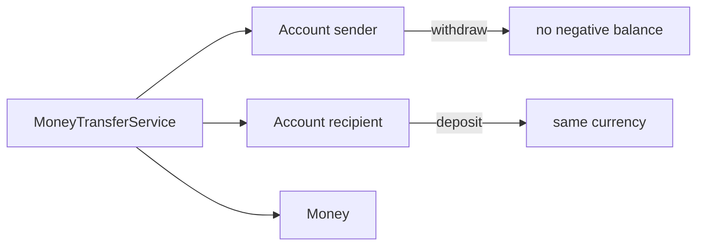
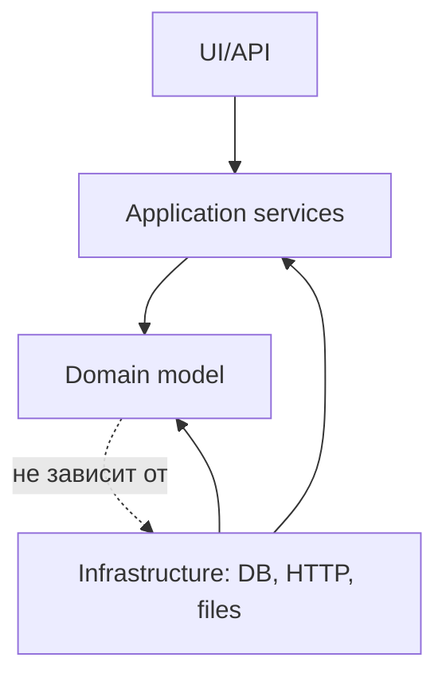
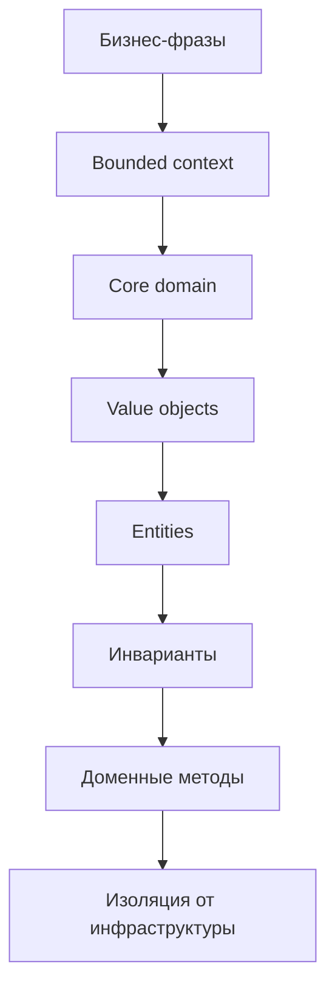

# Лекция 7. Предметно-ориентированное программирование

Domain-Driven Design, или **DDD**, - это подход к проектированию программ, в которых главная сложность находится не в
фреймворке, базе данных или UI, а в правилах предметной области. В таких системах недостаточно "сохранить поля в
таблицу": нужно выразить бизнес-смысл так, чтобы код помогал команде не нарушать правила.

Эта лекция не пытается заменить отдельный курс по DDD. Полный DDD включает стратегическое проектирование, карты
контекстов, события, агрегаты, процесс работы с экспертами и много организационных практик. Здесь нас интересует
практический минимум: как увидеть границы смысла, как назвать модель словами бизнеса и как написать доменные объекты,
которые защищают свои инварианты.

::: tip Главная идея лекции
DDD помогает выразить правила предметной области так, чтобы код не мог легко оказаться в недопустимом состоянии.
:::

::: tip Как работать с примерами
Примеры даны на Kotlin, C#, Java и Go. В Kotlin там, где это полезно, есть две версии: короткая для чтения и отдельная
запускаемая версия для Playground. В C#, Java и Go показан тот же дизайн в форме, естественной для языка.
:::

## Сквозной сценарий

Будем двигаться от обычного CRUD-сервиса лояльности. В первой версии есть таблица `customers`, поле `email`, поле
`discountPercent` и сервис, который просто меняет значения. Потом появляются правила: email должен быть валиден, скидка
не может быть отрицательной, VIP-статус зависит от истории заказов, а слово "клиент" в поддержке и продажах означает
разные вещи. С этого момента "просто поля в таблице" перестают защищать бизнес.



Эта лекция продолжает идеи [SOLID](/lectures/01#solid) и [DI](/lectures/02#dip-и-di), но меняет фокус. Раньше мы
спрашивали, от каких классов зависит код. Теперь спрашиваем, выражает ли код смысл предметной области и может ли он сам
защитить свои инварианты. Архитектурные границы, которые позволяют изолировать такую модель, подробно появятся в
[Лекции 8](/lectures/08#ports-and-adapters).

## Worked example: поле в таблице против доменного правила

### Ситуация

В программе лояльности у клиента есть email, число завершенных заказов, статус и скидка. Бизнес говорит: статус нельзя
назначить руками, он вычисляется из истории заказов.

### Наивное решение

Сделать CRUD-модель с публичными setter-ами: `email`, `completedOrders`, `status`, `discountPercent`. Controller или
service будет "аккуратно" выставлять правильные значения перед сохранением.

### Что ломается

Любой слой может записать `Gold` без нужного числа заказов или поставить скидку `200`. Правило существует в памяти
разработчика, а не в модели. Новый endpoint, импорт CSV или миграционный скрипт легко обходят инвариант.

### Улучшение

Выделить value objects для email и процента скидки, а entity `Customer` сделать единственным местом, где меняется число
завершенных заказов и пересчитывается статус. Application service координирует сценарий, но не назначает статус руками.

### Почему это работает

DDD переносит правило из "договоренности между слоями" в код, который невозможно обойти случайно. Модель не просто
хранит данные, а защищает смысл предметной области.

## Цели

После этой статьи вы должны уметь:

- объяснять разницу между данными, доменной моделью и бизнес-логикой;
- отличать анемичную модель от богатой доменной модели;
- выделять value object в обычных примитивах вроде строк и чисел;
- отличать entity от value object;
- формулировать инварианты доменного объекта;
- объяснять bounded context и ubiquitous language;
- понимать, почему доменная модель должна быть изолирована от инфраструктуры;
- выбирать место для логики: value object, entity, domain service или application service;
- видеть компромисс между инкапсуляцией, изоляцией и производительностью.

## Зачем DDD

Большинство приложений начинается одинаково: есть экран, форма, таблица в базе данных и несколько сервисов. Пока правила
простые, такой подход кажется достаточным. Проблемы появляются позже: скидка зависит от статуса, статус зависит от
истории заказов, email определяет принадлежность к компании, а разные отделы используют слово "клиент" в разных смыслах.

Если эти правила разложены по контроллерам, сервисам, хранимым процедурам и UI-валидации, разработчик не видит систему
целиком. Чтобы понять, почему у клиента скидка 15%, приходится искать все места, где кто-то мог изменить поле
`discount`.

DDD нужен не для красивых диаграмм. Он нужен, чтобы сделать бизнес-правила видимыми и проверяемыми.

| Мотив           | Что дает DDD                         | Что происходит без него                         |
|-----------------|--------------------------------------|-------------------------------------------------|
| Инженерный      | Правила рядом с моделью              | Логика размазана по сервисам, UI и базе данных  |
| Командный       | Единый язык с доменными экспертами   | Бизнес и разработчики говорят разными словами   |
| Архитектурный   | Границы контекстов и ответственности | Одна "универсальная" модель ломается от смыслов |



Важная мысль: DDD не говорит, что каждую задачу надо превращать в сложную объектную модель. Если модуль отправляет email,
импортирует CSV или вызывает стандартный платежный шлюз, часто достаточно обычного процедурного или сервисного кода.
DDD особенно полезен там, где бизнес отличается от конкурентов и где ошибка в правилах стоит дорого.

## Стратегия И Тактика

В DDD удобно разделять два уровня.

**Стратегический DDD** отвечает на вопросы: где границы модели, кто какими словами пользуется, какая часть бизнеса
является ядром, какие команды за что отвечают.

**Тактический DDD** отвечает на вопросы: какие типы писать, где держать инварианты, чем entity отличается от value
object, когда нужен domain service.

| Уровень   | Вопрос                       | Примеры                                      |
|-----------|------------------------------|----------------------------------------------|
| Стратегия | Где границы смысла?          | Sales, Support, Billing, Loyalty             |
| Тактика   | Как выразить правила в коде? | `Email`, `Money`, `Customer`, `TransferService` |

В расширенном DDD еще важны aggregates, aggregate roots, domain events, context mapping и event storming. В этой лекции
мы упомянем aggregate только как термин: агрегат - группа связанных доменных объектов, у которой есть корневой объект и
граница согласованности. Для текущей цели достаточно понять value object, entity, domain service и инварианты.

## Ограниченный Контекст

**Bounded context** - это граница, внутри которой модель и язык имеют один согласованный смысл. Один и тот же реальный
объект может выглядеть по-разному в разных контекстах.

Например, слово `Customer` кажется очевидным. Но в разных частях системы оно может означать разные вещи:

- в Sales это покупатель продукта;
- в Support это аккаунт с обращениями, SLA и историей поддержки;
- в Loyalty это участник программы лояльности со статусом и скидкой.



Плохое решение — создать один общий класс `Customer` и использовать его везде. Отдел продаж добавит `LTV`, поддержка —
`LastTicketDate`, бухгалтерия — `TaxId`, маркетинг — `MarketingConsent`. Через несколько месяцев класс вырастет до 47
полей и 12 зависимостей, а любое изменение будет затрагивать сразу несколько команд.

Хорошее решение - разрешить разным контекстам иметь свои модели. Они могут ссылаться на один и тот же `CustomerId`, но
должны явно договориться, кто этим идентификатором владеет, кто может его назначать и кто только читает.

::: warning Общая модель не всегда экономит код
Повторить маленький тип в двух bounded context часто дешевле, чем держать один общий тип, который вынужден обслуживать
несколько разных смыслов.
:::

## Core, Supporting, Generic Domain

Не все части системы одинаково важны для бизнеса. DDD предлагает различать домены по их роли.

| Вид домена       | Смысл                              | Как проектировать                                      |
|------------------|------------------------------------|--------------------------------------------------------|
| Core domain      | То, что отличает бизнес            | Вкладывать максимум внимания, DDD особенно полезен     |
| Supporting domain | Важен, но не уникален              | Проектировать аккуратно, без чрезмерной сложности      |
| Generic domain   | Стандартная задача                 | Можно купить, взять готовую библиотеку или SaaS        |

Для интернет-магазина уникальная программа лояльности может быть core domain. Отправка email, хранение файлов и
стандартная авторизация чаще являются generic domain. Внутренний каталог промокодов может быть supporting domain: он
важен для работы, но не обязательно делает бизнес уникальным.

Практическое следствие: богатую модель нужно в первую очередь строить там, где правила являются конкурентным преимуществом
или источником риска. Не обязательно проектировать одинаково глубоко все модули.

## Единый Язык

**Ubiquitous language** - единый язык команды, кода и доменных экспертов. Это не просто словарь в Confluence. Слова из
бизнес-разговора должны попадать в требования, тесты, имена классов, методы и события.

Если эксперт говорит "малооптовый клиент", код не должен внезапно называть его `SpecialCorporateUser`. Возможно, команда
договорится на термин `WholesaleCustomer`, возможно - на другой термин. Важно, чтобы один смысл не расползался по системе
под разными именами.

Рассмотрим фразу из медицинского домена:

> Медсестры назначают вакцины от гриппа в стандартных дозах.

Слабый код стирает смысл: непонятно, кто назначает, что назначает и почему количество именно такое. Код на едином языке
повторяет фразу предметной области.

::: multi-code "Единый язык в именах" {playground=off}

```kotlin
// Плохо: слова слишком общие.
process(person, item, amount)

// Лучше: код повторяет фразу доменного эксперта.
nurse.prescribe(fluVaccine, Dose.standard())
```

```csharp
// Плохо: слова слишком общие.
Process(person, item, amount);

// Лучше: код повторяет фразу доменного эксперта.
nurse.Prescribe(fluVaccine, Dose.Standard());
```

```java
// Плохо: слова слишком общие.
process(person, item, amount);

// Лучше: код повторяет фразу доменного эксперта.
nurse.prescribe(fluVaccine, Dose.standard());
```

```go
// Плохо: слова слишком общие.
Process(person, item, amount)

// Лучше: код повторяет фразу доменного эксперта.
nurse.Prescribe(fluVaccine, DoseStandard())
```

:::

Единый язык живой. Его нужно чистить: переименовывать неточные классы, исправлять устаревшие термины, договариваться о
словах между командами. Это особенно важно в core domain: там цена неправильного понимания выше.

## Анемичная Модель

Мы определили *где* границы (bounded context), *каким языком* говорим (ubiquitous language) и *что* является ядром бизнеса
(core domain). Теперь — *как* внутри bounded context строить модель, которая сама защищает свои правила. Начнём с того,
как выглядит модель, которая этого *не* делает.

**Anemic domain model** - модель, в которой объект хранит данные, но не защищает свои правила. Обычно у нее публичные
поля или сеттеры, а вся логика лежит во внешних сервисах.

Такую модель легко создать из таблицы базы данных: взяли колонки, сделали поля, добавили getters/setters. Но объект
получился пассивным. Он не знает, валиден ли он.

::: multi-code "Анемичная модель клиента" {playground=off}

```kotlin
data class Customer(
    var id: String,
    var email: String,
    var orders: Int,
    var discountPercent: Int,
    var status: String,
    var isEmployee: Boolean
)
```

```csharp
public sealed class Customer
{
    public string Id { get; set; } = "";
    public string Email { get; set; } = "";
    public int Orders { get; set; }
    public int DiscountPercent { get; set; }
    public string Status { get; set; } = "Bronze";
    public bool IsEmployee { get; set; }
}
```

```java
public class Customer {
    public String id;
    public String email;
    public int orders;
    public int discountPercent;
    public String status;
    public boolean employee;
}
```

```go
type Customer struct {
    ID              string
    Email           string
    Orders          int
    DiscountPercent int
    Status          string
    IsEmployee      bool
}
```

:::

Что здесь не так:

- `email` - просто строка, туда можно записать `hello`;
- `discountPercent` - любое число, включая `-10` и `150`;
- `status` можно назначить руками, не учитывая количество заказов;
- `isEmployee` может разойтись с доменом email;
- любой сервис может поменять поле и забыть одно из правил.

В такой системе нельзя посмотреть на `Customer` и понять, какие правила защищают клиента. Нужно искать все сервисы,
контроллеры, фоновые задачи и, возможно, хранимые процедуры.

## Инварианты

**Инвариант** - правило, которое должно оставаться истинным после создания объекта и после каждой операции над ним.

Примеры инвариантов:

- email должен быть валидным;
- скидка находится в диапазоне от 0 до 100;
- баланс счета не может стать отрицательным;
- статус клиента соответствует количеству завершенных заказов;
- employee определяется доменом корпоративной почты, а не отдельным флагом;
- перевод денег возможен только в одной валюте.



Главный прием богатой модели: внешний код не должен менять важные поля напрямую. Он должен вызвать метод предметной
области, а метод уже проверит инварианты и либо изменит объект, либо откажет.

::: warning Инвариант не должен жить только в голове
Если правило есть в требованиях, но не выражено в типах или методах, команда будет нарушать его случайно. Чем важнее
правило, тем ближе оно должно быть к доменному объекту.
:::

## Value Object

Email — не просто `String`. Money — не просто `Double`. Percentage — не просто `Int`. Когда вы храните скидку как `Int`,
ничто не мешает поставить `-50` или `300`. Когда email — строка, `"hello"` проходит компиляцию. Value Object делает
невалидное значение невозможным.

**Value object** - объект-значение. Он описывает значение в предметной области, не имеет собственной идентичности и
сравнивается по содержимому.

Типичные признаки value object:

- описывает или измеряет что-то в домене;
- обычно неизменяемый;
- валидирует себя при создании;
- сравнивается по значениям;
- может содержать поведение без побочных эффектов;
- при изменении заменяется целиком.

| Примитив | Value Object      | Почему                                                  |
|----------|-------------------|---------------------------------------------------------|
| `String` | `Email`           | Есть формат, локальная часть и доменная часть           |
| `Int`    | `DiscountPercent` | Есть диапазон и смысл процента                          |
| `Decimal` | `Money`          | Есть валюта, округление и запрет отрицательных значений |
| `String` | `CustomerId`      | Нельзя перепутать с `OrderId`                           |

Проблема, которую решает value object, часто называется **primitive obsession** или в контексте строк - "string typing".
Если все является строкой, компилятор не помогает отличить email от id заказа, а доменные проверки легко забыть.

::: only kotlin
В Kotlin для маленьких доменных значений хорошо подходят `value class` и `data class`. `value class` снижает runtime-цену
обертки, но все равно дает отдельный тип в API.
:::

::: only csharp
В C# value object часто делают через `record` или `readonly record struct`. Важно не только сгенерировать сравнение по
значению, но и не пропустить валидацию в момент создания.
:::

::: only java
В Java современный вариант для простых неизменяемых значений - `record`. Если нужна сложная валидация или инварианты,
ее лучше держать в каноническом конструкторе или фабрике, а не размазывать по сервисам.
:::

::: only go
В Go отдельный тип вроде `type Email string` уже защищает от случайной подстановки обычной строки в API. Если нужна
валидация, чаще используют конструктор `NewEmail`, потому что сам alias не может запретить некорректное значение.
:::

::: multi-code "Value Object: Email и DiscountPercent"

```kotlin
@JvmInline
value class Email(val value: String) {
    init {
        require(value.contains("@")) { "Invalid email: $value" }
    }

    fun domain(): String = value.substringAfter("@")
}

@JvmInline
value class DiscountPercent(val value: Int) {
    init {
        require(value in 0..100) { "Discount must be from 0 to 100" }
    }
}
```

```kotlin playground
@JvmInline
value class Email(val value: String) {
    init {
        require(value.contains("@")) { "Invalid email: $value" }
    }

    fun domain(): String = value.substringAfter("@")
}

@JvmInline
value class DiscountPercent(val value: Int) {
    init {
        require(value in 0..100) { "Discount must be from 0 to 100" }
    }
}

fun main() {
    val email = Email("ada@company.com")
    val discount = DiscountPercent(15)

    println("Email domain: ${email.domain()}")
    println("Discount: ${discount.value}%")

    val invalidEmail = runCatching { Email("not-an-email") }
    val invalidDiscount = runCatching { DiscountPercent(150) }

    println("Invalid email accepted: ${invalidEmail.isSuccess}")
    println("Invalid discount accepted: ${invalidDiscount.isSuccess}")
}
```

```csharp
public readonly record struct Email
{
    public string Value { get; }

    public Email(string value)
    {
        if (!value.Contains('@'))
            throw new ArgumentException($"Invalid email: {value}");

        Value = value;
    }

    public string Domain() => Value.Split('@')[1];
}

public readonly record struct DiscountPercent
{
    public int Value { get; }

    public DiscountPercent(int value)
    {
        if (value is < 0 or > 100)
            throw new ArgumentOutOfRangeException(nameof(value));

        Value = value;
    }
}
```

```java
public record Email(String value) {
    public Email {
        if (!value.contains("@")) {
            throw new IllegalArgumentException("Invalid email: " + value);
        }
    }

    public String domain() {
        return value.substring(value.indexOf('@') + 1);
    }
}

public record DiscountPercent(int value) {
    public DiscountPercent {
        if (value < 0 || value > 100) {
            throw new IllegalArgumentException("Discount must be from 0 to 100");
        }
    }
}
```

```go
package main

import (
    "fmt"
    "strings"
)

type Email struct {
    value string
}

func NewEmail(value string) (Email, error) {
    if !strings.Contains(value, "@") {
        return Email{}, fmt.Errorf("invalid email: %s", value)
    }
    return Email{value: value}, nil
}

func (email Email) Domain() string {
    parts := strings.SplitN(email.value, "@", 2)
    return parts[1]
}

type DiscountPercent struct {
    value int
}

func NewDiscountPercent(value int) (DiscountPercent, error) {
    if value < 0 || value > 100 {
        return DiscountPercent{}, fmt.Errorf("discount must be from 0 to 100")
    }
    return DiscountPercent{value: value}, nil
}
```

:::

Value object не обязан быть большим. Часто это маленький тип на 10-20 строк, который убирает десятки повторных проверок
по проекту.

::: only go
В Go нет конструкторов и private record-полей как в C# или Java, поэтому инвариант обычно защищают через private поля и
функции `New...`. Если поле экспортировано, внешний код снова может обойти проверку.
:::

## Entity

**Entity** - доменный объект с идентичностью. Его состояние может меняться, но он остается тем же объектом.

`Email("ada@company.com")` и еще один `Email("ada@company.com")` - это одно и то же значение. А `Customer` с тем же
`CustomerId`, но другим email, может быть тем же клиентом в другой момент времени.

| Признак           | Value Object                         | Entity                                      |
|-------------------|--------------------------------------|---------------------------------------------|
| Идентичность      | Нет собственной идентичности         | Есть id или другой устойчивый идентификатор |
| Изменяемость      | Обычно неизменяемый                  | Может менять состояние                      |
| Равенство         | По значениям                         | Обычно по идентичности                      |
| Главная задача    | Защитить смысл значения              | Защитить жизненный цикл и инварианты        |
| Пример            | `Email`, `Money`, `DiscountPercent`  | `Customer`, `Account`, `Order`              |

Entity не должна превращаться в объект с публичными сеттерами. Если состояние меняется, изменение должно проходить через
метод предметной области.

::: multi-code "Entity: Customer с идентичностью"

```kotlin
@JvmInline
value class CustomerId(val value: String)

class Customer(
    val id: CustomerId,
    val email: Email
) {
    var completedOrders: Int = 0
        private set

    val status: CustomerStatus
        get() = CustomerStatus.fromOrders(completedOrders)

    fun registerOrder() {
        completedOrders += 1
    }
}
```

```kotlin playground
@JvmInline
value class CustomerId(val value: String)

@JvmInline
value class Email(val value: String) {
    init {
        require(value.contains("@")) { "Invalid email: $value" }
    }
}

enum class CustomerStatus(val discountPercent: Int) {
    Bronze(0),
    Silver(10),
    Gold(20);

    companion object {
        fun fromOrders(orders: Int): CustomerStatus = when {
            orders >= 10 -> Gold
            orders >= 3 -> Silver
            else -> Bronze
        }
    }
}

class Customer(
    val id: CustomerId,
    val email: Email
) {
    var completedOrders: Int = 0
        private set

    val status: CustomerStatus
        get() = CustomerStatus.fromOrders(completedOrders)

    val discountPercent: Int
        get() = status.discountPercent

    fun registerOrder() {
        completedOrders += 1
    }
}

fun main() {
    val customer = Customer(CustomerId("c-1"), Email("ada@example.com"))

    repeat(4) { customer.registerOrder() }

    println("Customer id: ${customer.id.value}")
    println("Orders: ${customer.completedOrders}")
    println("Status: ${customer.status}")
    println("Discount: ${customer.discountPercent}%")
}
```

```csharp
public readonly record struct CustomerId(string Value);

public enum CustomerStatus
{
    Bronze,
    Silver,
    Gold
}

public sealed class Customer
{
    public CustomerId Id { get; }
    public Email Email { get; }
    public int CompletedOrders { get; private set; }

    public CustomerStatus Status => CompletedOrders switch
    {
        >= 10 => CustomerStatus.Gold,
        >= 3 => CustomerStatus.Silver,
        _ => CustomerStatus.Bronze
    };

    public int DiscountPercent => Status switch
    {
        CustomerStatus.Gold => 20,
        CustomerStatus.Silver => 10,
        _ => 0
    };

    public Customer(CustomerId id, Email email)
    {
        Id = id;
        Email = email;
    }

    public void RegisterOrder()
    {
        CompletedOrders++;
    }
}
```

```java
public record CustomerId(String value) {
}

public enum CustomerStatus {
    Bronze(0),
    Silver(10),
    Gold(20);

    private final int discountPercent;

    CustomerStatus(int discountPercent) {
        this.discountPercent = discountPercent;
    }

    public int discountPercent() {
        return discountPercent;
    }

    public static CustomerStatus fromOrders(int orders) {
        if (orders >= 10) return Gold;
        if (orders >= 3) return Silver;
        return Bronze;
    }
}

public final class Customer {
    private final CustomerId id;
    private final Email email;
    private int completedOrders;

    public Customer(CustomerId id, Email email) {
        this.id = id;
        this.email = email;
    }

    public CustomerId id() {
        return id;
    }

    public int completedOrders() {
        return completedOrders;
    }

    public CustomerStatus status() {
        return CustomerStatus.fromOrders(completedOrders);
    }

    public void registerOrder() {
        completedOrders++;
    }
}
```

```go
type CustomerID string

type CustomerStatus string

const (
    Bronze CustomerStatus = "Bronze"
    Silver CustomerStatus = "Silver"
    Gold   CustomerStatus = "Gold"
)

type Customer struct {
    id              CustomerID
    email           Email
    completedOrders int
}

func NewCustomer(id CustomerID, email Email) Customer {
    return Customer{id: id, email: email}
}

func (customer *Customer) RegisterOrder() {
    customer.completedOrders++
}

func (customer Customer) Status() CustomerStatus {
    switch {
    case customer.completedOrders >= 10:
        return Gold
    case customer.completedOrders >= 3:
        return Silver
    default:
        return Bronze
    }
}

func (customer Customer) CompletedOrders() int {
    return customer.completedOrders
}
```

:::

У entity есть жизненный цикл. Клиент создается, меняет email, делает заказы, получает новый статус. Но все эти изменения
должны проходить через доменные операции, иначе объект снова становится анемичным.

## Богатая Доменная Модель

**Rich domain model** - модель, где данные и операции, защищающие эти данные, находятся рядом. Это не значит, что вся
логика обязана быть внутри одного класса. Это значит, что изменение состояния не должно происходить в обход объекта,
который владеет этим состоянием.





Переход от анемичной модели к богатой обычно выглядит так:

| Было                         | Стало                                                |
|------------------------------|------------------------------------------------------|
| `customer.discount = 150`    | `DiscountPercent` не создастся                       |
| `customer.status = "Gold"`   | `customer.registerOrder()` сам пересчитает статус    |
| `service` меняет поля        | `service` вызывает доменный метод                    |
| `isEmployee` хранится отдельно | Вычисляется из `Email` и `CompanyDomain`             |
| `email` - строка             | `Email` валидирует формат и предоставляет `domain()` |

::: multi-code "Богатая модель: заказ меняет статус клиента"

```kotlin
class LoyaltyCustomer(
    val id: CustomerId,
    val email: Email
) {
    var completedOrders: Int = 0
        private set

    val status: CustomerStatus
        get() = CustomerStatus.fromOrders(completedOrders)

    val discount: DiscountPercent
        get() = DiscountPercent(status.discountPercent)

    fun registerCompletedOrder() {
        completedOrders += 1
    }
}
```

```kotlin playground
@JvmInline
value class CustomerId(val value: String)

@JvmInline
value class Email(val value: String) {
    init {
        require(value.contains("@")) { "Invalid email: $value" }
    }

    fun domain(): String = value.substringAfter("@")
}

@JvmInline
value class DiscountPercent(val value: Int) {
    init {
        require(value in 0..100) { "Discount must be from 0 to 100" }
    }
}

enum class CustomerStatus(val discountPercent: Int) {
    Bronze(0),
    Silver(10),
    Gold(20);

    companion object {
        fun fromOrders(orders: Int): CustomerStatus = when {
            orders >= 10 -> Gold
            orders >= 3 -> Silver
            else -> Bronze
        }
    }
}

class LoyaltyCustomer(
    val id: CustomerId,
    val email: Email
) {
    var completedOrders: Int = 0
        private set

    val status: CustomerStatus
        get() = CustomerStatus.fromOrders(completedOrders)

    val discount: DiscountPercent
        get() = DiscountPercent(status.discountPercent)

    val isEmployee: Boolean
        get() = email.domain() == "company.com"

    fun registerCompletedOrder() {
        completedOrders += 1
    }
}

fun main() {
    val customer = LoyaltyCustomer(CustomerId("c-7"), Email("ada@company.com"))

    println("${customer.status}: ${customer.discount.value}%")
    repeat(3) { customer.registerCompletedOrder() }
    println("${customer.status}: ${customer.discount.value}%")
    repeat(7) { customer.registerCompletedOrder() }
    println("${customer.status}: ${customer.discount.value}%")
    println("Employee: ${customer.isEmployee}")
}
```

```csharp
public sealed class LoyaltyCustomer
{
    public CustomerId Id { get; }
    public Email Email { get; }
    public int CompletedOrders { get; private set; }

    public CustomerStatus Status => CompletedOrders switch
    {
        >= 10 => CustomerStatus.Gold,
        >= 3 => CustomerStatus.Silver,
        _ => CustomerStatus.Bronze
    };

    public DiscountPercent Discount => new(Status switch
    {
        CustomerStatus.Gold => 20,
        CustomerStatus.Silver => 10,
        _ => 0
    });

    public bool IsEmployee => Email.Domain() == "company.com";

    public LoyaltyCustomer(CustomerId id, Email email)
    {
        Id = id;
        Email = email;
    }

    public void RegisterCompletedOrder()
    {
        CompletedOrders++;
    }
}
```

```java
public final class LoyaltyCustomer {
    private final CustomerId id;
    private final Email email;
    private int completedOrders;

    public LoyaltyCustomer(CustomerId id, Email email) {
        this.id = id;
        this.email = email;
    }

    public int completedOrders() {
        return completedOrders;
    }

    public CustomerStatus status() {
        return CustomerStatus.fromOrders(completedOrders);
    }

    public DiscountPercent discount() {
        return new DiscountPercent(status().discountPercent());
    }

    public boolean isEmployee() {
        return email.domain().equals("company.com");
    }

    public void registerCompletedOrder() {
        completedOrders++;
    }
}
```

```go
type LoyaltyCustomer struct {
    id              CustomerID
    email           Email
    completedOrders int
}

func NewLoyaltyCustomer(id CustomerID, email Email) LoyaltyCustomer {
    return LoyaltyCustomer{id: id, email: email}
}

func (customer *LoyaltyCustomer) RegisterCompletedOrder() {
    customer.completedOrders++
}

func (customer LoyaltyCustomer) Status() CustomerStatus {
    switch {
    case customer.completedOrders >= 10:
        return Gold
    case customer.completedOrders >= 3:
        return Silver
    default:
        return Bronze
    }
}

func (customer LoyaltyCustomer) Discount() (DiscountPercent, error) {
    switch customer.Status() {
    case Gold:
        return NewDiscountPercent(20)
    case Silver:
        return NewDiscountPercent(10)
    default:
        return NewDiscountPercent(0)
    }
}

func (customer LoyaltyCustomer) IsEmployee() bool {
    return customer.email.Domain() == "company.com"
}
```

:::

Обратите внимание: в примере нет метода `setStatus` и поля `discountPercent`, которое можно изменить снаружи. Статус и
скидка являются следствием количества завершенных заказов. Это и есть защита инварианта.

::: only kotlin
Kotlin `sealed interface` идеально подходит для моделирования состояний агрегата — *make illegal states
unrepresentable*:

```kotlin
sealed interface OrderState {
    data class Draft(val items: List<OrderItem>) : OrderState
    data class Confirmed(val items: List<OrderItem>, val confirmedAt: Instant) : OrderState
    data class Shipped(val trackingId: String) : OrderState
    data object Cancelled : OrderState
}
```

Компилятор заставит обработать все варианты в `when`, а невалидный переход (например, `Cancelled → Shipped`) просто не
будет иметь ветки.
:::

::: only go
В Go нет конструкторов — структурные литералы обходят валидацию. `NewEmail()` — единственная защита инварианта Value
Object. Это требует дисциплины, но делает точку валидации явной и легко находимой через grep.
:::

## Где Должна Жить Логика

Не вся логика должна быть внутри entity. Важно выбрать правильный уровень.

| Логика                         | Где держать                         | Почему                                      |
|--------------------------------|-------------------------------------|---------------------------------------------|
| Проверка email                 | `Email` value object                | Это правило значения                        |
| Добавление заказа клиенту      | `Customer` entity                   | Операция меняет состояние клиента           |
| Перевод между двумя счетами    | Domain service                      | Операция затрагивает несколько entity       |
| Загрузка клиента из БД         | Repository/application layer        | Это инфраструктура                          |
| Проверка прав пользователя     | Application service                 | Это сценарий приложения, а не свойство entity |
| Отрисовка ошибки               | UI/controller                       | Это представление                           |

**Application service** координирует сценарий приложения: загрузить данные, проверить права, открыть транзакцию,
вызвать доменную операцию, сохранить результат. Он не должен решать, какая скидка положена клиенту.

```kotlin
// ❌ Логика в AppService — решает за entity
class PromoteService(private val repo: CustomerRepository) {
    fun promote(id: CustomerId) {
        val c = repo.findById(id)
        if (c.completedOrders >= 10) c.status = "Gold"   // бизнес-правило снаружи
        if (c.status == "Gold") c.discountPercent = 15    // ещё одно
        repo.save(c)
    }
}

// ✅ Логика в entity — AppService только координирует
class PromoteService(private val repo: CustomerRepository) {
    fun onOrderCompleted(id: CustomerId) {
        val c = repo.findById(id)
        c.registerCompletedOrder()   // entity сама решает статус и скидку
        repo.save(c)
    }
}
```

**Domain service** выражает доменную операцию, которая не принадлежит естественно одному entity или value object.

## Domain Service

Не вся бизнес-логика помещается в одну entity. Перевод денег между двумя счетами — чья ответственность? Ни одного из
счетов. Для таких операций существует domain service.

Классический пример - перевод денег. Есть счет отправителя, счет получателя и сумма. Если поместить метод перевода в
счет отправителя, он начнет слишком много знать о получателе. Если поместить в счет получателя, проблема симметрична.
Поэтому сама координация может жить в domain service.

При этом инварианты баланса остаются внутри `Account`: нельзя списать больше, чем есть, и нельзя смешивать валюты.



::: multi-code "Domain Service: перевод денег"

```kotlin
class MoneyTransferService {
    fun transfer(from: Account, to: Account, amount: Money) {
        from.withdraw(amount)
        to.deposit(amount)
    }
}
```

```kotlin playground
data class Money(val amount: Int, val currency: String) {
    init {
        require(amount >= 0) { "Money cannot be negative" }
        require(currency.isNotBlank()) { "Currency is required" }
    }
}

class Account(
    val id: String,
    initialBalance: Money
) {
    private var balance: Money = initialBalance

    fun balance(): Money = balance

    fun withdraw(amount: Money) {
        require(amount.currency == balance.currency) { "Currency mismatch" }
        require(balance.amount >= amount.amount) { "Not enough money" }
        balance = Money(balance.amount - amount.amount, balance.currency)
    }

    fun deposit(amount: Money) {
        require(amount.currency == balance.currency) { "Currency mismatch" }
        balance = Money(balance.amount + amount.amount, balance.currency)
    }
}

class MoneyTransferService {
    fun transfer(from: Account, to: Account, amount: Money) {
        from.withdraw(amount)
        to.deposit(amount)
    }
}

fun main() {
    val sender = Account("a-1", Money(100, "USD"))
    val recipient = Account("a-2", Money(25, "USD"))
    val service = MoneyTransferService()

    service.transfer(sender, recipient, Money(40, "USD"))

    println("Sender: ${sender.balance().amount}")
    println("Recipient: ${recipient.balance().amount}")

    val overdraft = runCatching {
        service.transfer(sender, recipient, Money(1000, "USD"))
    }
    println("Overdraft accepted: ${overdraft.isSuccess}")
}
```

```csharp
public readonly record struct Money
{
    public decimal Amount { get; }
    public string Currency { get; }

    public Money(decimal amount, string currency)
    {
        if (amount < 0)
            throw new ArgumentOutOfRangeException(nameof(amount));
        if (string.IsNullOrWhiteSpace(currency))
            throw new ArgumentException("Currency is required");

        Amount = amount;
        Currency = currency;
    }
}

public sealed class Account
{
    public string Id { get; }
    public Money Balance { get; private set; }

    public Account(string id, Money initialBalance)
    {
        Id = id;
        Balance = initialBalance;
    }

    public void Withdraw(Money amount)
    {
        EnsureSameCurrency(amount);
        if (Balance.Amount < amount.Amount)
            throw new InvalidOperationException("Not enough money");

        Balance = new Money(Balance.Amount - amount.Amount, Balance.Currency);
    }

    public void Deposit(Money amount)
    {
        EnsureSameCurrency(amount);
        Balance = new Money(Balance.Amount + amount.Amount, Balance.Currency);
    }

    private void EnsureSameCurrency(Money amount)
    {
        if (amount.Currency != Balance.Currency)
            throw new InvalidOperationException("Currency mismatch");
    }
}

public sealed class MoneyTransferService
{
    public void Transfer(Account from, Account to, Money amount)
    {
        from.Withdraw(amount);
        to.Deposit(amount);
    }
}
```

```java
import java.math.BigDecimal;

public record Money(BigDecimal amount, String currency) {
    public Money {
        if (amount.signum() < 0) {
            throw new IllegalArgumentException("Money cannot be negative");
        }
        if (currency == null || currency.isBlank()) {
            throw new IllegalArgumentException("Currency is required");
        }
    }
}

public final class Account {
    private final String id;
    private Money balance;

    public Account(String id, Money initialBalance) {
        this.id = id;
        this.balance = initialBalance;
    }

    public Money balance() {
        return balance;
    }

    public void withdraw(Money amount) {
        ensureSameCurrency(amount);
        if (balance.amount().compareTo(amount.amount()) < 0) {
            throw new IllegalStateException("Not enough money");
        }
        balance = new Money(balance.amount().subtract(amount.amount()), balance.currency());
    }

    public void deposit(Money amount) {
        ensureSameCurrency(amount);
        balance = new Money(balance.amount().add(amount.amount()), balance.currency());
    }

    private void ensureSameCurrency(Money amount) {
        if (!balance.currency().equals(amount.currency())) {
            throw new IllegalArgumentException("Currency mismatch");
        }
    }
}

public final class MoneyTransferService {
    public void transfer(Account from, Account to, Money amount) {
        from.withdraw(amount);
        to.deposit(amount);
    }
}
```

```go
package main

import "fmt"

type Money struct {
    Amount   int
    Currency string
}

func NewMoney(amount int, currency string) (Money, error) {
    if amount < 0 {
        return Money{}, fmt.Errorf("money cannot be negative")
    }
    if currency == "" {
        return Money{}, fmt.Errorf("currency is required")
    }
    return Money{Amount: amount, Currency: currency}, nil
}

type Account struct {
    id      string
    balance Money
}

func NewAccount(id string, initialBalance Money) Account {
    return Account{id: id, balance: initialBalance}
}

func (account *Account) Withdraw(amount Money) error {
    if amount.Currency != account.balance.Currency {
        return fmt.Errorf("currency mismatch")
    }
    if account.balance.Amount < amount.Amount {
        return fmt.Errorf("not enough money")
    }
    account.balance.Amount -= amount.Amount
    return nil
}

func (account *Account) Deposit(amount Money) error {
    if amount.Currency != account.balance.Currency {
        return fmt.Errorf("currency mismatch")
    }
    account.balance.Amount += amount.Amount
    return nil
}

type MoneyTransferService struct{}

func (service MoneyTransferService) Transfer(from *Account, to *Account, amount Money) error {
    if err := from.Withdraw(amount); err != nil {
        return err
    }
    return to.Deposit(amount)
}
```

:::

Domain service не должен становиться "богатым сервисом", который забирает у entity все правила. Его роль - собрать
несколько доменных объектов в одну операцию, сохранив инварианты внутри объектов.

### Агрегатный корень

Aggregate root — единственная точка входа к группе связанных объектов. Внешний код не работает с дочерними entity
напрямую — только через корень, который гарантирует согласованность:

```kotlin
class Order(val id: OrderId) {
    private val _lines = mutableListOf<OrderLine>()
    val lines: List<OrderLine> get() = _lines

    fun addLine(product: ProductId, quantity: Int, price: Money) {
        require(quantity > 0)
        _lines += OrderLine(product, quantity, price)
    }

    fun removeLine(product: ProductId) {
        _lines.removeAll { it.product == product }
    }

    fun total(): Money = _lines.fold(Money.ZERO) { acc, line ->
        acc + line.price * line.quantity
    }
}

data class OrderLine(val product: ProductId, val quantity: Int, val price: Money)
```

`OrderLine` не имеет собственного репозитория — она живёт и умирает вместе с `Order`.

### Domain Events

Domain event фиксирует факт, который произошёл в предметной области. Это мостик к [асинхронному
взаимодействию](/lectures/11) и [отказоустойчивости](/lectures/12):

```kotlin
sealed interface DomainEvent

data class CustomerPromoted(
    val customerId: CustomerId,
    val newStatus: CustomerStatus,
    val at: Instant
) : DomainEvent
```

Entity *поднимает* события, а application service *публикует* их:

```kotlin
class LoyaltyCustomer(val id: CustomerId, val email: Email) {
    private val _events = mutableListOf<DomainEvent>()
    val domainEvents: List<DomainEvent> get() = _events

    fun registerCompletedOrder(now: Instant) {
        completedOrders += 1
        val newStatus = CustomerStatus.fromOrders(completedOrders)
        if (newStatus != previousStatus) {
            _events += CustomerPromoted(id, newStatus, now)
        }
    }
}
```

## Изоляция Доменной Модели

Доменная модель должна быть изолирована от внешнего мира: SQL, HTTP, ORM, контроллеров, файловой системы, текущего
времени и случайных чисел. Инфраструктура может зависеть от домена, но домен не должен зависеть от инфраструктуры.



Active Record удобен в маленьких приложениях: объект сам знает, как сохранить себя в базу. Но для сложного core domain
это смешивает бизнес-правила и persistence. Если `Customer.save()` содержит SQL, доменная модель уже знает про способ
хранения и хуже тестируется.

Отдельная ловушка - скрытые зависимости вроде `now()` внутри entity. Если метод сам берет текущее время, его результат
зависит от внешнего мира. В доменном коде лучше принимать время как значение.

::: multi-code "Время как значение, а не скрытая зависимость"

```kotlin
class Subscription {
    var activatedAt: Instant? = null
        private set

    fun activate(now: Instant) {
        require(activatedAt == null) { "Already activated" }
        activatedAt = now
    }
}
```

```kotlin playground
data class Moment(val value: String)

class Subscription {
    var activatedAt: Moment? = null
        private set

    fun activate(now: Moment) {
        require(activatedAt == null) { "Already activated" }
        activatedAt = now
    }
}

fun main() {
    val subscription = Subscription()
    subscription.activate(Moment("2026-07-05T12:00:00Z"))

    println("Activated at: ${subscription.activatedAt?.value}")

    val secondActivation = runCatching {
        subscription.activate(Moment("2026-07-06T12:00:00Z"))
    }
    println("Second activation accepted: ${secondActivation.isSuccess}")
}
```

```csharp
public sealed class Subscription
{
    public DateTimeOffset? ActivatedAt { get; private set; }

    public void Activate(DateTimeOffset now)
    {
        if (ActivatedAt is not null)
            throw new InvalidOperationException("Already activated");

        ActivatedAt = now;
    }
}
```

```java
import java.time.Instant;

public final class Subscription {
    private Instant activatedAt;

    public Instant activatedAt() {
        return activatedAt;
    }

    public void activate(Instant now) {
        if (activatedAt != null) {
            throw new IllegalStateException("Already activated");
        }
        activatedAt = now;
    }
}
```

```go
package main

import (
    "fmt"
    "time"
)

type Subscription struct {
    activatedAt *time.Time
}

func (subscription *Subscription) Activate(now time.Time) error {
    if subscription.activatedAt != nil {
        return fmt.Errorf("already activated")
    }
    subscription.activatedAt = &now
    return nil
}

func (subscription Subscription) ActivatedAt() *time.Time {
    return subscription.activatedAt
}
```

:::

Application service может вызвать системные часы, получить `now` и передать его в домен. Так доменная операция остается
детерминированной: одинаковые входные данные дают одинаковый результат.

## Трилемма DDD

Иногда правило нельзя проверить только локальным состоянием одного объекта. Например: "email клиента должен быть
уникален". Чтобы это узнать, нужно посмотреть на других клиентов или на индекс в базе данных.

Здесь возникает компромисс между тремя желаниями:

- полная инкапсуляция: решение принимает доменный объект;
- полная изоляция: доменный объект не знает про repository и базу;
- максимальная производительность: не загружать лишние данные.

| Подход                                             | Инкапсуляция | Изоляция       | Производительность | Минус                                      |
|----------------------------------------------------|--------------|----------------|--------------------|--------------------------------------------|
| Entity принимает repository                        | Высокая      | Низкая         | Высокая            | Домен зависит от инфраструктуры            |
| Application service проверяет repository           | Средняя      | Высокая        | Высокая            | Часть бизнес-решения находится снаружи     |
| Entity получает готовый набор доменных данных      | Высокая      | Высокая        | Ниже               | Нужно заранее загрузить данные             |
| Доменная политика получает минимальный read model  | Компромисс   | Средняя/высокая | Высокая            | Сложнее объяснить и поддерживать           |

В учебном коде часто выбирают идеальный с точки зрения домена вариант: передать в доменную операцию готовые доменные
данные. В промышленном коде чаще нужен компромисс: application service получает из repository минимальный факт, например
`emailAlreadyTaken`, и передает его в доменную операцию или доменную политику.

::: warning Не передавайте repository в entity по умолчанию
Repository - это граница с инфраструктурой. Если entity начинает вызывать repository, доменный объект становится зависим
от внешнего мира. Иногда команды сознательно идут на такой компромисс, но это должно быть инженерное решение, а не
случайность.
:::

Пример решения без repository внутри entity:

::: multi-code "Проверка уникальности через доменный факт" {playground=off}

```kotlin
class Customer(
    val id: CustomerId,
    email: Email
) {
    var email: Email = email
        private set

    fun changeEmail(newEmail: Email, uniqueness: EmailUniqueness) {
        require(uniqueness.isUnique) { "Email is already taken" }
        email = newEmail
    }
}

data class EmailUniqueness(val isUnique: Boolean)
```

```csharp
public readonly record struct EmailUniqueness(bool IsUnique);

public sealed class Customer
{
    public CustomerId Id { get; }
    public Email Email { get; private set; }

    public Customer(CustomerId id, Email email)
    {
        Id = id;
        Email = email;
    }

    public void ChangeEmail(Email newEmail, EmailUniqueness uniqueness)
    {
        if (!uniqueness.IsUnique)
            throw new InvalidOperationException("Email is already taken");

        Email = newEmail;
    }
}
```

```java
public record EmailUniqueness(boolean unique) {
}

public final class Customer {
    private final CustomerId id;
    private Email email;

    public Customer(CustomerId id, Email email) {
        this.id = id;
        this.email = email;
    }

    public void changeEmail(Email newEmail, EmailUniqueness uniqueness) {
        if (!uniqueness.unique()) {
            throw new IllegalStateException("Email is already taken");
        }
        email = newEmail;
    }
}
```

```go
type EmailUniqueness struct {
    IsUnique bool
}

func (customer *Customer) ChangeEmail(newEmail Email, uniqueness EmailUniqueness) error {
    if !uniqueness.IsUnique {
        return fmt.Errorf("email is already taken")
    }
    customer.email = newEmail
    return nil
}
```

:::

Application service в таком дизайне проверит repository, получит факт уникальности и передаст его в доменную модель.
Домен по-прежнему не знает, откуда пришел факт: из базы, кэша, внешнего сервиса или тестового набора данных.

## Практический Алгоритм Проектирования

Когда вы начинаете проектировать доменную модель, двигайтесь не от таблиц, а от смысла.

1. Выписать бизнес-фразы доменных экспертов.
2. Найти bounded context: где слова меняют смысл.
3. Определить core domain: где находится уникальность бизнеса.
4. Выделить value objects: email, деньги, проценты, идентификаторы, диапазоны.
5. Выделить entities: объекты с жизненным циклом и идентичностью.
6. Записать инварианты для каждого важного объекта.
7. Закрыть сеттеры и публичные mutable-поля.
8. Перенести операции, меняющие состояние, в entity.
9. Оставить сервисам координацию и сценарии приложения.
10. Проверить, не зависит ли домен от SQL, HTTP, ORM, часов и файловой системы.



Этот алгоритм не гарантирует идеальную модель с первого раза. Доменная модель почти всегда уточняется по мере разговора
с экспертами и появления новых сценариев. Но он помогает начать с правильного места: не с базы данных, а с правил.

## Антипаттерны

В контексте этой лекции особенно опасны:

- primitive obsession и string typing: все выражено строками, числами и bool;
- anemic domain model: объект хранит данные, но не защищает правила;
- business logic in controllers: контроллер начинает решать, какая скидка положена;
- business logic in stored procedures: ключевые правила спрятаны в базе;
- Active Record для сложного core domain: домен знает о persistence;
- универсальный `Customer` на все bounded context;
- флаги состояния, которые можно вычислить;
- публичные setters для полей с бизнес-смыслом;
- доменные методы, которые сами вызывают системное время или внешние сервисы.

::: details Когда анемичная модель допустима
Если модуль почти не содержит бизнес-правил и является CRUD-интерфейсом к справочнику, богатая модель может быть
избыточной. DDD не требует усложнять каждую таблицу. Важнее уметь отличить простой справочник от core domain, где правила
и инварианты действительно важны.
:::

## Резюме

- DDD начинается с языка и границ, а не с классов.
- Bounded context защищает модель от смешения разных смыслов.
- Core domain требует больше внимания, чем generic domain.
- Ubiquitous language связывает разговоры, требования, тесты и код.
- Value object убирает primitive obsession и валидирует значение при создании.
- Entity защищает идентичность, жизненный цикл и инварианты.
- Rich domain model не дает объекту легко перейти в невалидное состояние.
- Domain service координирует несколько доменных объектов, но не забирает у них инварианты.
- Инфраструктура должна зависеть от домена, а не домен от инфраструктуры.
- Иногда приходится выбирать компромисс между инкапсуляцией, изоляцией и производительностью.

Следующий шаг - защитить такую модель на уровне приложения. Если домен выражен хорошо, но контроллеры, ORM и HTTP-клиенты
все равно прорастают внутрь бизнес-правил, инварианты снова становятся хрупкими. Поэтому дальше мы переходим к
[enterprise-архитектурам](/lectures/08#поворот-ddd-domain-first): слоям, Ports and Adapters, Onion и Clean Architecture.

## Дополнительное чтение

Эти материалы помогают закрепить стратегические и тактические идеи DDD: язык, границы, моделирование и цену подхода.

### Основы DDD

- [Что такое DDD](https://www.youtube.com/watch?v=pMuiVlnGqjk) — вводное видео по предметно-ориентированному проектированию.
- [Ограниченные контексты](https://www.youtube.com/watch?v=am-HXycfalo) — видео о bounded contexts.
- [Пример моделирования DDD](https://www.youtube.com/watch?v=T29WzvaPNc8&t=1718s) — разбор моделирования на практическом примере.

### Статьи и заметки

- [Статьи на русском по основным принципам DDD, часть 1](https://habr.com/ru/post/316438/) — обзор базовых понятий DDD.
- [Статьи на русском по основным принципам DDD, часть 2](https://habr.com/ru/post/316890/) — продолжение обзора.
- [Что такое DDD?](https://blog-programmista.ru/post/132-ddd-what-is-it.html) — короткая заметка для первичного знакомства.
- [Почему вы должны заботиться о каком-то DDD?](https://habr.com/ru/post/497656/) — мотивация и практический смысл подхода.

## Вопросы для самопроверки

1. Чем value object отличается от entity?
2. Почему `Email` лучше, чем `String`, если в домене есть правила email?
3. Где должен проверяться диапазон скидки от 0 до 100?
4. Почему один общий `Customer` на Sales, Support и Loyalty может стать проблемой?
5. Когда логика должна жить в domain service?
6. Почему repository внутри entity ухудшает изоляцию доменной модели?
7. Что такое инвариант?
8. Чем rich domain model отличается от anemic domain model?
9. Что должно оставаться в application service?
10. В каком случае можно не строить богатую доменную модель?

## Мини-практика

Спроектируйте модель программы лояльности:

> Клиент получает статус Bronze, Silver или Gold по количеству завершенных заказов. Скидка зависит от статуса. Email
> должен быть валидным. Статус нельзя назначить руками.

Ожидаемые элементы решения:

- `CustomerId`;
- `Email`;
- `CompletedOrderCount`;
- `CustomerStatus`;
- `DiscountPercent`;
- `Customer.registerCompletedOrder(...)`;
- запрет публичного изменения `discount` и `status`;
- вычисление `status` и `discount` из состояния клиента.

Проверьте себя: если внешний сервис может написать `customer.status = Gold`, модель все еще анемична. Если статус
становится Gold только через доменную операцию и проверяемые правила, модель уже движется в сторону DDD.
