# Лекция 9. Сравнительный анализ СУБД в системном дизайне

Эта лекция посвящена одному из ключевых решений в системном дизайне: как выбрать базу данных. После архитектурных
паттернов из предыдущей лекции мы переходим к вопросу хранения состояния. Сервис, правильно спроектированный по
границам и зависимостям, все равно должен где-то сохранять данные. Выбор хранилища определяет производительность,
отказоустойчивость, стоимость эксплуатации и набор компромиссов, с которыми команда будет жить годами.

Обещание лекции конкретное: к концу статьи у вас будет методика, которая позволяет за 10 минут анализа нагрузки
назвать правильный **класс** СУБД для задачи - а не гадать на кофейной гуще и не выбирать то, что сейчас в моде.
Конкретный продукт внутри класса выбирается дольше, но самая дорогая ошибка происходит именно на уровне класса:
посадить аналитику в транзакционную базу или графовые запросы в документную.

Материал написан как самостоятельная статья. Если вы пропустили лекцию, начните отсюда: после чтения вы должны понимать,
почему одна БД не может быть лучшей во всем, как работает теорема CAP, по каким измерениям сравнивать СУБД, какие классы
баз данных существуют и когда каждый из них уместен, как выглядит polyglot persistence на практике и какие trade-offs
стоят за каждым выбором.

::: tip Главная идея лекции
Выбор СУБД - это не поиск "самой крутой" технологии. Это поиск наименее болезненного компромисса. Системный аналитик
отличается от программиста тем, что сознательно выбирает, с какой частью ограничений его команда готова мириться.
:::

::: tip Как работать с примерами
Примеры кода показывают прикладные решения на стороне приложения: как выбрать шард, как реализовать cache-aside, как
маршрутизировать запросы между primary и replica. Kotlin-вкладки там, где код можно запустить, имеют отдельную
Playground-версию с `main` и демонстрационным выводом.
:::

## Сквозной сценарий

Всю лекцию мы проживем вместе с одним проектом. Интернет-магазин электроники «Плата»: три разработчика, знакомый стек,
одна managed PostgreSQL. Название выбрано не случайно - каждый раз, когда магазин будет расти, нам придется отвечать
на главный вопрос лекции: чем мы готовы **платить** за следующий шаг.

История магазина - это лестница из четырех ступеней, и на каждой ступени база данных ломается по-новому:

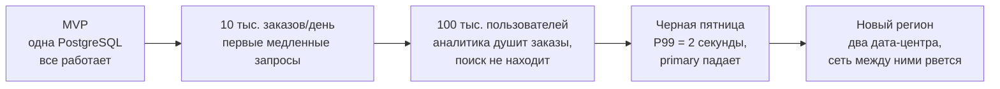

В начале все данные живут в одной базе: заказы, каталог товаров, сессии пользователей, корзины, клики для аналитики.
Потом магазин вырастает: каталог нужно искать полнотекстово, аналитические запросы начинают тормозить транзакции,
корзины и сессии требуют мгновенного отклика, а данные о кликах льются потоком в 100 тыс. событий в секунду. Шаг за
шагом магазин придет к polyglot persistence - архитектуре, где разные типы данных живут в разных хранилищах:

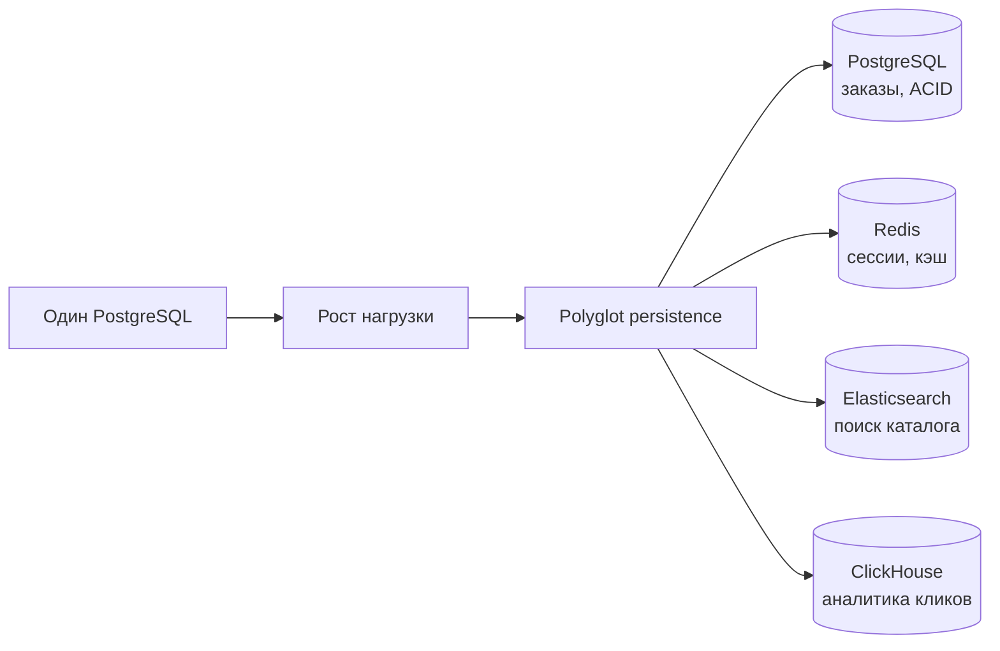

Этот путь стал типичным еще и потому, что изменилась форма самих приложений. В монолите одна база - естественное
решение. Но как только система делится на сервисы (каталог, заказы, платежи), каждый сервис становится владельцем
своих данных - паттерн database-per-service из [Лекции 8](/lectures/08). А раз у каждого сервиса своя база, ничто не
мешает выбрать для каждого ту, которая лучше подходит его нагрузке. Polyglot persistence - не мода, а прямое следствие
сервисных границ.

Каждое из этих хранилищ не бесплатно: нужно синхронизировать данные, мониторить несколько систем и понимать trade-offs
каждой из них. Разделы лекции будут возвращаться к «Плате» на разных ступенях роста: сначала мы разберем теорию,
которая объясняет, почему универсальной базы не существует, затем - 12 вопросов, которые надо задать своей нагрузке,
и наконец пройдемся по классам СУБД и соберем итоговую архитектуру.

## Worked example: одна БД на все задачи

### Ситуация

«Плата» на второй ступени роста: 10 тыс. заказов в день. Команда из трех разработчиков в свое время выбрала
PostgreSQL - надежную, знакомую, с хорошей экосистемой. В одной базе хранятся заказы, каталог товаров, сессии
пользователей, корзины, история кликов для аналитики и полнотекстовый индекс для поиска.

### Наивное решение

Все таблицы в одной PostgreSQL. Поиск по каталогу через `LIKE '%query%'` или `ts_vector`. Аналитика через тяжелые
`GROUP BY` по таблице кликов. Сессии в таблице с TTL через cron job. Корзина как JSON-колонка в таблице пользователей.

Маркетолог магазина открывает BI-инструмент и нажимает «Отчет за год». Под капотом выполняется примерно такой запрос:

```sql
SELECT date_trunc('week', clicked_at) AS week,
       utm_source,
       count(*) AS clicks,
       count(DISTINCT user_id) AS visitors
FROM clicks               -- 200 млн строк за год
WHERE clicked_at > now() - interval '1 year'
GROUP BY week, utm_source
ORDER BY week;
```

PostgreSQL хранит данные построчно, поэтому для этой агрегации ей придется прочитать с диска **все** колонки
всех 200 млн строк - хотя запросу нужны только три.

### Что ломается

При росте до 100 тыс. пользователей в день:

- запрос маркетолога работает 30 секунд и удерживает несколько соединений из connection pool - пула заранее открытых
  подключений к БД, который у приложения ограничен (обычно десятки). Пока аналитика держит соединения, оформление
  заказов ждет свободного - и таймаутит. Покупатель видит «попробуйте позже» из-за отчета, который смотрят раз в неделю;
- полнотекстовый поиск через `ts_vector` работает, но не дает того, что ждут пользователи интернет-магазина:
  толерантности к опечаткам, ранжирования по релевантности, фасетных фильтров (цвет, бренд, цена) из коробки;
- таблица сессий живет в режиме «вставили - через час удалили». PostgreSQL при удалении не освобождает место сразу,
  а помечает строки мертвыми; фоновый процесс VACUUM должен их вычищать. На миллионах короткоживущих строк он перестает
  успевать, и таблица раздувается мертвыми данными (это называют bloat);
- запись 100 тыс. кликов/сек проходит через WAL (write-ahead log - журнал, в который PostgreSQL пишет каждое изменение
  до фиксации). Клики и заказы стоят в одной очереди на запись в журнал, и лавина кликов тормозит транзакции заказов.

Обратите внимание на общий знаменатель: ни одна из проблем не решается «оптимизацией запросов». Это конфликты
*типов нагрузки* внутри одного хранилища.

### Улучшение

Разделить хранилища по типу нагрузки:
- заказы остаются в PostgreSQL (нужен ACID, сложные транзакции);
- сессии и корзины переезжают в Redis (нужна субмиллисекундная задержка, TTL);
- полнотекстовый поиск каталога уходит в Elasticsearch (синхронизация через CDC - Change Data Capture, механизм,
  который читает журнал изменений основной базы и доставляет их в другие системы);
- аналитика кликов уходит в ClickHouse (колоночное хранение, сжатие, быстрые агрегации).

### Почему это работает

Каждый класс СУБД оптимизирован под определенный тип нагрузки. PostgreSQL отлична для транзакций с ACID, но плоха
для append-only аналитики. Redis отличен для кэша и сессий, но не годится для сложных JOIN. ClickHouse хранит данные
по колонкам: тот самый отчет маркетолога прочитает с диска только `clicked_at`, `utm_source` и `user_id` - в десятки
раз меньше данных, к тому же сжатых, - и выполнится за секунды, не задев ни одного заказа. Выбирая правильный
инструмент для каждой задачи, мы получаем систему, где каждая часть работает в зоне своей оптимальности.

## Цели

После этой статьи вы должны уметь:

- объяснять, почему полиглотное хранение стало стандартом индустрии;
- формулировать теорему CAP и показывать, как она ограничивает выбор;
- различать ACID и BASE и объяснять, когда каждый подход уместен;
- применять 12 измерений фреймворка выбора СУБД к конкретной задаче;
- отличать OLTP от OLAP и объяснять, почему их нельзя эффективно совместить;
- объяснять на уровне механики хранения, почему B-Tree быстрее читает, а LSM-дерево быстрее пишет;
- различать репликацию, партицирование и шардирование;
- распознавать аномалии согласованности (read-your-writes) и выбирать уровень согласованности для операции;
- характеризовать основные классы СУБД: реляционные, key-value, документные, колоночные, графовые, временные ряды;
- объяснять сильные стороны и trade-offs конкретных представителей каждого класса;
- проектировать выбор хранилищ для типичных бизнес-сценариев;
- понимать роль managed services и инфраструктурного контекста в выборе БД;
- различать ops complexity разных решений и соотносить их с компетенциями команды;
- планировать первый шаг миграции хранилища без остановки сервиса и без потери пути отката;
- читать сводную матрицу trade-offs и применять её к новым задачам.

## Почему нельзя выбрать одну БД на все

### Эволюция подходов к хранению данных

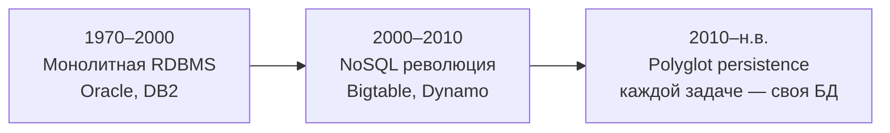

В эпоху монолитных приложений одна реляционная база действительно решала почти все задачи. Oracle или DB2 работали на
мощном сервере, масштабировались вертикально, а объемы данных и нагрузки были скромными по сегодняшним меркам.

Когда Google и Amazon столкнулись с масштабами, которые не помещались в одну реляционную БД, появились Bigtable (2006)
и Dynamo (2007). Они пожертвовали частью реляционной модели ради горизонтального масштабирования и доступности. Так
родилось движение NoSQL - не как замена SQL, а как ответ на конкретные ограничения.

Сегодня стандартом является polyglot persistence: в одной системе живут несколько хранилищ, каждое из которых оптимально
для своего класса задач. Это не усложнение ради моды - это инженерный ответ на то, что у каждой БД есть фундаментальные
ограничения, которые невозможно обойти.

### Теорема CAP

Заглянем в будущее «Платы» - на пятую ступень таймлайна. Магазин вышел в новый регион и развернул второй дата-центр.
Остатки товаров реплицируются между двумя ДЦ, покупатели ходят в ближайший. Однажды ночью экскаватор рвет магистраль
между городами. Оба ДЦ живы, но друг друга не видят. И именно в этот момент два покупателя - по одному в каждом
регионе - кладут в корзину последнюю механическую клавиатуру (остаток = 1) и нажимают «Купить».

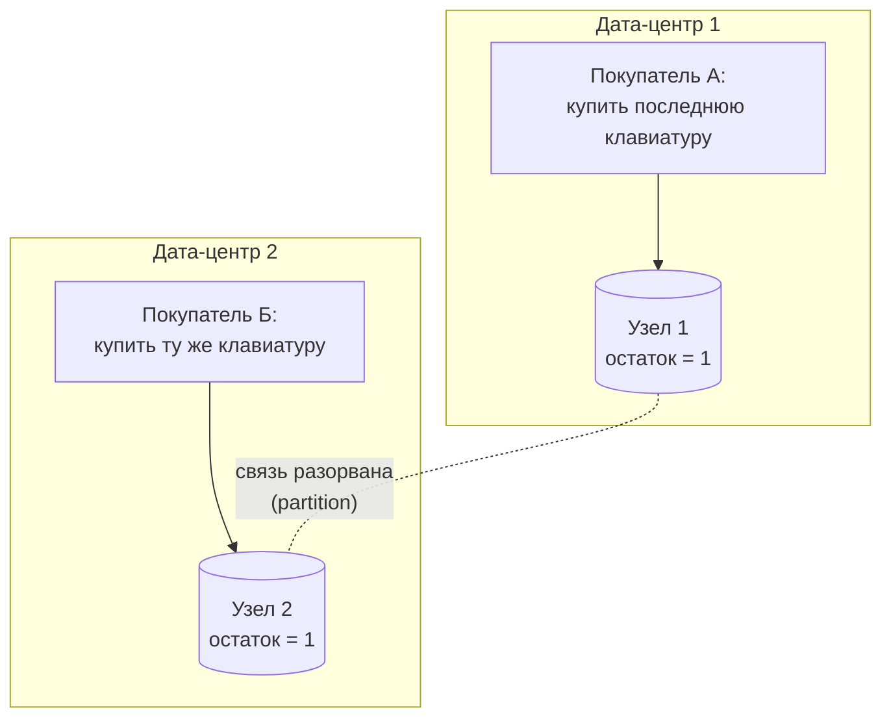

Узел 1 не может спросить узел 2, продан ли товар. Вариантов ровно два, и оба плохие:

1. **Отказать покупателю.** «Сервис временно недоступен, попробуйте позже». Мы сохранили согласованность данных -
   товар гарантированно не продан дважды, - но пожертвовали доступностью. Покупатель ушел к конкуренту.
2. **Продать обоим.** Оба заказа приняты, оба покупателя счастливы... до восстановления связи. Тогда система обнаружит:
   товар один, заказов два. Придется отменять заказ, извиняться и дарить промокод. Мы сохранили доступность, но
   пожертвовали согласованностью - какое-то время два узла жили в противоречащих друг другу реальностях.

Третьего варианта нет: нельзя одновременно ответить обоим покупателям *и* гарантировать согласованность, не имея
связи между узлами. Это и есть содержание теоремы CAP (Brewer, 2000): распределенная система не может одновременно
обеспечить все три свойства:

- **Consistency** (согласованность) - все узлы видят одинаковые данные в один момент времени;
- **Availability** (доступность) - каждый запрос получает ответ, даже если часть узлов недоступна;
- **Partition tolerance** (устойчивость к разделению) - система продолжает работать при потере связи между узлами.

Отказаться от partition tolerance невозможно - сеть рвется независимо от наших пожеланий. Поэтому реальный выбор
всегда между двумя стратегиями поведения *в момент разрыва*:

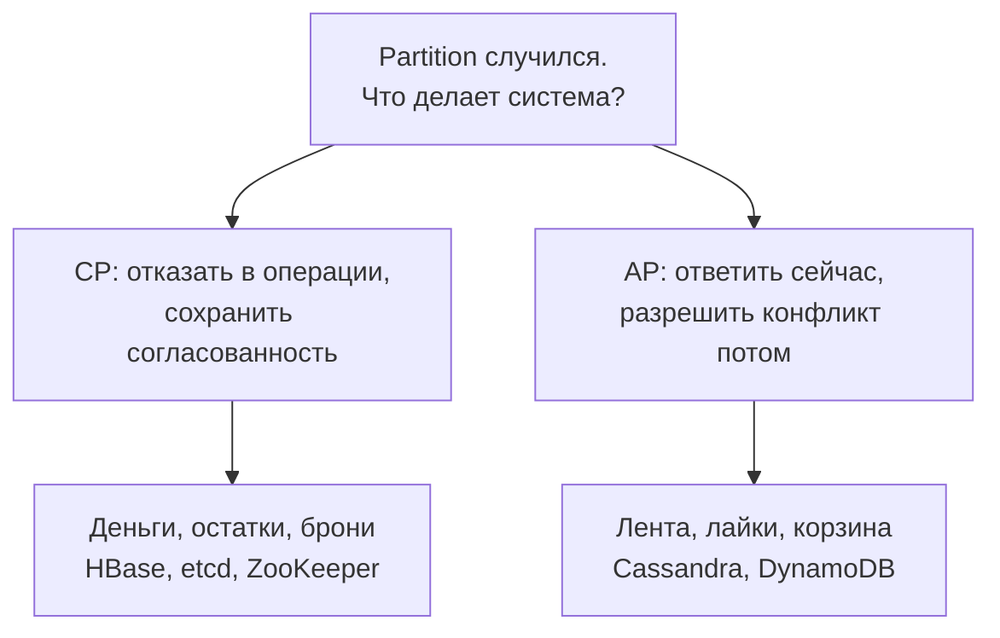

Банкомат должен быть CP: лучше отказать в выдаче, чем позволить снять один и тот же остаток дважды. Лента новостей
может быть AP: лучше показать пост с задержкой в 2 секунды, чем выдать ошибку.

::: details А как же «CA-системы»?
В старых классификациях встречается третий вариант - CA: согласованность и доступность без устойчивости к разделению.
Но это описание нераспределенной системы: у PostgreSQL на единственном сервере partition невозможен по определению.
Как только узлов становится два, разрыв сети - вопрос времени, и выбор CP/AP становится обязательным. Поэтому
корректнее говорить, что CAP - теорема о распределенных системах, а single-node база просто вне ее области действия.
:::

::: warning CAP - это не выбор из трех вариантов
Теорема CAP часто упрощается до "выбери два из трех". На практике компромисс более тонкий: система может быть
CP для критичных операций (платежи) и AP для некритичных (рекомендации) одновременно. Разные части одного
приложения могут иметь разные гарантии.

Расширение PACELC уточняет: даже без partition (нормальная работа) приходится выбирать между Latency и Consistency.
Cassandra, например, в нормальном режиме выбирает низкую задержку (EL), а DynamoDB позволяет настраивать
(strong reads дороже и медленнее, eventual reads дешевле и быстрее).
:::

### ACID vs BASE

Прежде чем говорить о гарантиях, зафиксируем ожидания. Для прикладного разработчика база данных должна быть скучной
в хорошем смысле: хранить данные между перезапусками, переживать сбои, обслуживать конкурентные чтения и записи,
сохранять инварианты вроде «остаток не ниже нуля» и давать транзакции. Внутри это сложнейшая инженерная система, но
бизнес-код не должен каждый день думать о страницах памяти и протоколах репликации. Вопрос лишь в том, *какой набор
гарантий* мы покупаем и по какой цене.

Вернемся в «Плату». Покупатель нажимает «Оформить заказ», и системе нужно сделать два изменения: списать товар с
остатка и создать заказ. Если между этими действиями процесс упадет - товар зарезервирован, а заказа нет. Деньги и
остатки разошлись, и таких «наполовину выполненных» операций при нагрузке будут сотни в день. Насколько страшно для
вашей системы такое промежуточное состояние - это и есть главный вопрос, разделяющий два мира гарантий.

Два подхода к гарантиям данных представляют спектр, а не бинарный выбор.

**ACID** - классические гарантии транзакционных БД:

- **Atomicity** - транзакция выполняется целиком или не выполняется вовсе;
- **Consistency** - данные переходят из одного допустимого состояния в другое;
- **Isolation** - параллельные транзакции не видят промежуточных состояний друг друга;
- **Durability** - после commit данные сохраняются даже при сбое.

**BASE** - подход распределенных систем:

- **Basically Available** - система почти всегда доступна;
- **Soft state** - состояние может меняться без внешнего воздействия (из-за синхронизации);
- **Eventually consistent** - через конечное время все узлы придут к согласованному состоянию.

| Свойство | ACID | BASE |
|---|---|---|
| Когда нужен | Финансы, инвентарь, критичные бизнес-операции | Социальные фичи, аналитика, кэш, рекомендации |
| Цена | Блокировки, координация, ограниченная масштабируемость | Сложность в коде приложения, возможные аномалии чтения |
| Пример БД | PostgreSQL, MySQL, Oracle | Cassandra, DynamoDB, Redis |
| Масштабирование | Сложнее горизонтально | Проще горизонтально |

::: multi-code "Транзакционная граница: Unit of Work"

```kotlin
interface UnitOfWork {
    fun <T> transaction(block: () -> T): T
}

class OrderService(
    private val unitOfWork: UnitOfWork,
    private val orders: OrderRepository,
    private val inventory: InventoryRepository
) {
    fun placeOrder(productId: String, quantity: Int) = unitOfWork.transaction {
        inventory.reserve(productId, quantity)
        orders.create(productId, quantity)
    }
}
```

```kotlin playground
interface UnitOfWork {
    fun <T> transaction(block: () -> T): T
}

class LoggingUnitOfWork : UnitOfWork {
    override fun <T> transaction(block: () -> T): T {
        println("BEGIN")
        return try {
            val result = block()
            println("COMMIT")
            result
        } catch (error: RuntimeException) {
            println("ROLLBACK: ${error.message}")
            throw error
        }
    }
}

class OrderRepository {
    fun create(productId: String, quantity: Int): String {
        println("  INSERT order: $productId x $quantity")
        return "order-1"
    }
}

class InventoryRepository {
    private val stock = mutableMapOf("keyboard" to 5)

    fun reserve(productId: String, quantity: Int) {
        val available = stock.getValue(productId)
        require(available >= quantity) { "not enough stock: $available < $quantity" }
        stock[productId] = available - quantity
        println("  UPDATE inventory: $productId reserved $quantity, left ${stock[productId]}")
    }
}

class OrderService(
    private val unitOfWork: UnitOfWork,
    private val orders: OrderRepository,
    private val inventory: InventoryRepository
) {
    fun placeOrder(productId: String, quantity: Int): String = unitOfWork.transaction {
        inventory.reserve(productId, quantity)
        orders.create(productId, quantity)
    }
}

fun main() {
    val service = OrderService(
        LoggingUnitOfWork(),
        OrderRepository(),
        InventoryRepository()
    )

    println("=== Successful order ===")
    println("Result: ${service.placeOrder("keyboard", 3)}")

    println("\n=== Failed order (not enough stock) ===")
    runCatching { service.placeOrder("keyboard", 5) }
}
```

```csharp
public interface IUnitOfWork
{
    T Transaction<T>(Func<T> block);
}

public sealed class OrderService
{
    private readonly IUnitOfWork _unitOfWork;
    private readonly OrderRepository _orders;
    private readonly InventoryRepository _inventory;

    public OrderService(
        IUnitOfWork unitOfWork,
        OrderRepository orders,
        InventoryRepository inventory)
    {
        _unitOfWork = unitOfWork;
        _orders = orders;
        _inventory = inventory;
    }

    public string PlaceOrder(string productId, int quantity) =>
        _unitOfWork.Transaction(() =>
        {
            _inventory.Reserve(productId, quantity);
            return _orders.Create(productId, quantity);
        });
}
```

```java
import java.util.function.Supplier;

interface UnitOfWork {
    <T> T transaction(Supplier<T> block);
}

final class OrderService {
    private final UnitOfWork unitOfWork;
    private final OrderRepository orders;
    private final InventoryRepository inventory;

    OrderService(UnitOfWork unitOfWork, OrderRepository orders, InventoryRepository inventory) {
        this.unitOfWork = unitOfWork;
        this.orders = orders;
        this.inventory = inventory;
    }

    String placeOrder(String productId, int quantity) {
        return unitOfWork.transaction(() -> {
            inventory.reserve(productId, quantity);
            return orders.create(productId, quantity);
        });
    }
}
```

```go
package main

type UnitOfWork interface {
    Transaction(fn func() (string, error)) (string, error)
}

type OrderService struct {
    UoW       UnitOfWork
    Orders    OrderRepository
    Inventory InventoryRepository
}

func (s OrderService) PlaceOrder(productID string, quantity int) (string, error) {
    return s.UoW.Transaction(func() (string, error) {
        if err := s.Inventory.Reserve(productID, quantity); err != nil {
            return "", err
        }
        return s.Orders.Create(productID, quantity)
    })
}
```

:::

Unit of Work гарантирует: если резервирование товара прошло, а создание заказа упало, все откатится. Без ACID-транзакции
пришлось бы писать компенсирующую логику в приложении - saga, outbox, retry. Это возможно, но значительно сложнее.

## Фреймворк выбора: 12 измерений архитектуры

Теперь методологическое ядро лекции - те самые «10 минут анализа» из обещания во введении. Это 12 вопросов, которые
надо задать своей нагрузке *до* того, как открывать сайты вендоров. Каждый параметр - ось компромисса. Ни одна СУБД
не побеждает по всем 12 осям одновременно. Задача архитектора - определить, какие 2-3 оси критичны для конкретного
проекта, и выбрать БД, которая оптимальна именно в этих измерениях.

Чтобы измерения не остались абстракциями, каждое из них мы откроем конкретной ситуацией из жизни «Платы» - моментом,
когда команде пришлось отвечать именно на этот вопрос.

| № | Критерий | Ключевой вопрос |
|---|---|---|
| 1 | Workload | Данные вставляются или агрегируются? |
| 2 | Read/Write Ratio | Что преобладает: чтение или запись? |
| 3 | Latency (P99) | Допустима ли хвостовая задержка > 100 мс? |
| 4 | Consistency | Допустимо ли прочитать устаревшую версию? |
| 5 | Transactions | Критичны ли атомарные многообъектные изменения? |
| 6 | Query Patterns | Какой тип запросов доминирует? |
| 7 | Data Model | Как структурированы бизнес-данные? |
| 8 | Scale | Будет ли рост в 10x-100x? |
| 9 | HA & Failover | Что страшнее: потеря данных или простой? |
| 10 | Ops Complexity | Есть ли в команде эксперты по этой БД? |
| 11 | Licensing & Lock-in | Сможете ли мигрировать к другому вендору? |
| 12 | Ecosystem | Как БД вписывается в текущий стек? |

### 1. Тип нагрузки (Workload) - OLTP vs OLAP vs HTAP

С этим измерением «Плата» уже столкнулась в worked example: отчет маркетолога и оформление заказов - два типа нагрузки,
которые физически конфликтуют за одни и те же ресурсы. Покупатель делает сотни мелких операций в секунду, аналитик -
один запрос, читающий двести миллионов строк. Первая развилка любого выбора БД: данные обрабатываются транзакционно
(по одной операции) или аналитически (массово)?

| Критерий | OLTP | OLAP |
|---|---|---|
| Пример | Оформить заказ, списать остаток | Отчет продаж за год, тренды по регионам |
| Данные | Актуальные, операционные | Исторические, агрегированные |
| Запросы | Короткие, точечные, много параллельных | Тяжелые, сканируют терабайты, мало параллельных |
| Индексы | B-Tree для точечного поиска | Колоночное хранение для быстрого сканирования |
| Главный риск | Потерять платеж или продать отсутствующий товар | Медленный отчет или устаревшая аналитика |
| Типичный выбор | PostgreSQL, MySQL, SQL Server | ClickHouse, BigQuery, Snowflake |

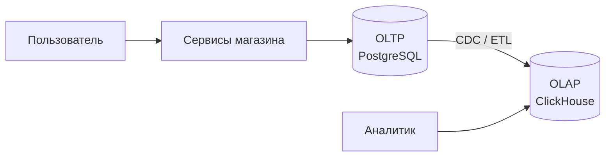

HTAP (Hybrid Transactional/Analytical Processing) пытается совместить оба типа нагрузки в одной системе. На практике
это сложно: транзакционная нагрузка требует строковых блокировок, а аналитическая - полного сканирования без блокировок.
Большинство проектов приходит к разделению: OLTP-база для операций и отдельное аналитическое хранилище, связанные через
CDC (Change Data Capture) или ETL.

::: multi-code "CQRS: разделение модели чтения и записи"

```kotlin
data class CreateOrderCommand(val productId: String, val quantity: Int, val customerId: String)
data class OrderSummaryQuery(val customerId: String)

data class OrderSummary(val orderId: String, val productName: String, val total: Int)

interface CommandHandler {
    fun handle(command: CreateOrderCommand): String
}

interface QueryHandler {
    fun handle(query: OrderSummaryQuery): List<OrderSummary>
}
```

```kotlin playground
data class CreateOrderCommand(val productId: String, val quantity: Int, val customerId: String)
data class OrderSummaryQuery(val customerId: String)
data class OrderSummary(val orderId: String, val productName: String, val total: Int)

interface CommandHandler {
    fun handle(command: CreateOrderCommand): String
}

interface QueryHandler {
    fun handle(query: OrderSummaryQuery): List<OrderSummary>
}

class InMemoryCommandHandler : CommandHandler {
    private var counter = 0
    override fun handle(command: CreateOrderCommand): String {
        val id = "order-${++counter}"
        println("WRITE to OLTP: $id for ${command.customerId}")
        return id
    }
}

class InMemoryQueryHandler : QueryHandler {
    override fun handle(query: OrderSummaryQuery): List<OrderSummary> {
        println("READ from OLAP: orders for ${query.customerId}")
        return listOf(OrderSummary("order-1", "Keyboard", 2))
    }
}

fun main() {
    val commands: CommandHandler = InMemoryCommandHandler()
    val queries: QueryHandler = InMemoryQueryHandler()

    val orderId = commands.handle(CreateOrderCommand("kb-1", 2, "customer-42"))
    println("Created: $orderId")

    val summary = queries.handle(OrderSummaryQuery("customer-42"))
    println("Summary: $summary")
}
```

```csharp
public sealed record CreateOrderCommand(string ProductId, int Quantity, string CustomerId);
public sealed record OrderSummaryQuery(string CustomerId);
public sealed record OrderSummary(string OrderId, string ProductName, int Total);

public interface ICommandHandler
{
    string Handle(CreateOrderCommand command);
}

public interface IQueryHandler
{
    IReadOnlyList<OrderSummary> Handle(OrderSummaryQuery query);
}
```

```java
record CreateOrderCommand(String productId, int quantity, String customerId) {}
record OrderSummaryQuery(String customerId) {}
record OrderSummary(String orderId, String productName, int total) {}

interface CommandHandler {
    String handle(CreateOrderCommand command);
}

interface QueryHandler {
    List<OrderSummary> handle(OrderSummaryQuery query);
}
```

```go
package main

type CreateOrderCommand struct {
    ProductID  string
    Quantity   int
    CustomerID string
}

type OrderSummaryQuery struct {
    CustomerID string
}

type OrderSummary struct {
    OrderID     string
    ProductName string
    Total       int
}

type CommandHandler interface {
    Handle(cmd CreateOrderCommand) (string, error)
}

type QueryHandler interface {
    Handle(q OrderSummaryQuery) ([]OrderSummary, error)
}
```

:::

CQRS (Command Query Responsibility Segregation) - архитектурное следствие разделения OLTP и OLAP. Команды пишут в
транзакционную БД, запросы читают из оптимизированной read-модели. Между ними - механизм синхронизации (CDC, events,
ETL).

### 2. Коэффициент чтения/записи (Read/Write Ratio)

В «Плате» живут две противоположности. Каталог товаров: 50 тыс. товаров, обновляются раз в день, читаются миллионы раз -
99% чтения. И поток кликов: 100 тыс. событий в секунду записываются, а читаются раз в неделю одним отчетом - 99% записи.
Требовать от одного хранилища оптимальности в обоих режимах - все равно что просить один автомобиль выигрывать и
«Формулу-1», и ралли по бездорожью.

- **Преобладает чтение** - подходят read replicas, кэш (Redis), CDN для статики. PostgreSQL с несколькими репликами
  справляется отлично.
- **Преобладает запись** - нужны хранилища, оптимизированные под append-only: LSM-деревья (Cassandra, ClickHouse,
  RocksDB).

Почему структура хранения так важна? Разберем механику - без нее таблица ниже остается магией.

**B-Tree** (PostgreSQL, MySQL) хранит данные в отсортированных страницах на диске. Чтобы записать строку, база находит
нужную страницу, читает ее, изменяет и пишет обратно. Записи в случайные места таблицы означают случайные чтения-записи
по всему диску (random I/O). Когда страница переполняется, ее приходится разрезать надвое (split) и обновлять
родительские страницы. Зато чтение предсказуемо быстрое: спуск по дереву за O(log n), данные уже отсортированы.

**LSM-Tree** (Log-Structured Merge Tree) идет другим путем: новые записи складываются в память (memtable), а когда ее
буфер заполняется - сбрасываются на диск одним последовательным куском (SSTable, отсортированный неизменяемый файл).
Диск никогда не получает случайных записей - только последовательные, которые на порядок быстрее. Фоновый процесс
(compaction) склеивает накопившиеся SSTable-файлы в более крупные, вычищая устаревшие версии.

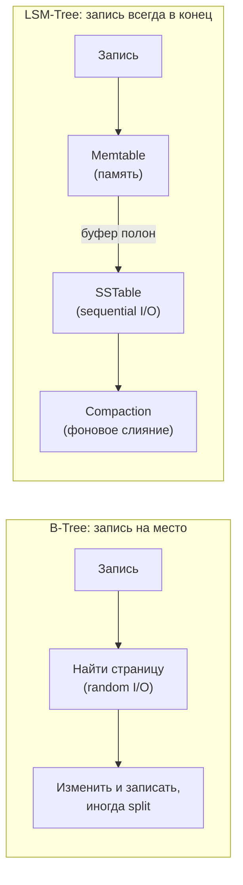

Цена LSM - чтение: искомый ключ может лежать в memtable или в любом из нескольких SSTable, и базе приходится проверять
их по очереди (merge read). Итог - зеркальный компромисс:

| Структура | Чтение | Запись | Где используется |
|---|---|---|---|
| B-Tree | Быстрое (O(log n), sorted) | Медленнее (random I/O, split) | PostgreSQL, MySQL, SQL Server |
| LSM-Tree | Медленнее (merge read) | Очень быстрое (sequential I/O) | Cassandra, ClickHouse, RocksDB, LevelDB |

Если система пишет данные значительно чаще, чем читает (логирование, IoT-телеметрия, clickstream), LSM-дерево выигрывает
за счет последовательной записи на диск. Если система преимущественно читает (каталог товаров, справочники), B-Tree дает
предсказуемо быстрый поиск по индексу.

### 3. Требования к задержке (Latency)

Черная пятница. Дашборд «Платы» показывает среднюю задержку запроса 5 мс - прекрасно. Но жалобы в поддержку растут:
«магазин висит». Команда открывает перцентили и видит: P99 = 2 секунды. Средняя врет: она смешивает тысячи быстрых
запросов с редкими катастрофически медленными. P99 - это задержка, в которую укладывается 99% запросов; оставшийся
1% ждет дольше.

Кажется, что 1% - мелочь. Но страница магазина собирается из десятка запросов к базе: товар, цены, остатки, отзывы,
рекомендации. Если каждый запрос попадает в «медленный хвост» с вероятностью 1%, то хотя бы один из десяти попадет
с вероятностью около 10%. Каждый десятый покупатель видит тормозящую страницу - при идеальной средней задержке.
Поэтому при проектировании SLA критична не средняя, а хвостовая задержка - P99 и P999.

Требование к задержке БД выводится из бюджета всего запроса. Если SLA страницы - 200 мс, то после сети, кода
приложения и сериализации ответа базе достается лишь часть:

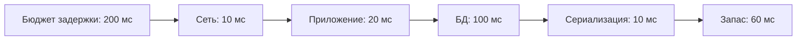

| Требование P99 | Подходящий класс | Пример |
|---|---|---|
| < 1 мс | In-memory (RAM only) | Redis, Memcached |
| 1-10 мс | In-memory с персистентностью или SSD | Redis с AOF, ScyllaDB |
| 10-100 мс | SSD-оптимизированные | PostgreSQL, MongoDB на NVMe |
| 100+ мс | Дисковые, distributed | BigQuery, HBase |

### 4. Модель согласованности (Consistency Model)

«Плата» добавила read replicas, чтобы разгрузить primary (мы разберем репликацию подробнее в измерении 8). И тут же
в поддержку пришел первый тикет: «Оформил заказ, открыл "Мои заказы" - пусто. Деньги списали?!» Что произошло: запись
заказа ушла в primary, а страницу «Мои заказы» приложение прочитало с реплики, до которой изменение еще не долетело -
репликация отстала на пару секунд. Заказ никуда не делся, но пользователь уже в панике.

Это классическая аномалия нарушенного **read-your-writes**: система не гарантирует, что вы прочитаете собственную
запись. Заметьте: для страницы каталога такое отставание безвредно - никто не заметит цену двухсекундной давности.
А для «Моих заказов» сразу после оформления - недопустимо. Согласованность - не свойство всей системы, а требование
конкретной операции. Спектр моделей выглядит так:

| Модель | Гарантия | Пример применения | Цена |
|---|---|---|---|
| Linearizability (сильная) | Все видят одно значение в каждый момент | Банковский баланс, бронирование | Высокая задержка, низкая доступность при partition |
| Sequential | Все видят операции в одном порядке | Чат-сообщения | Координация между узлами |
| Causal | Причинно-связанные операции видны в правильном порядке | Комментарии (ответ после оригинала) | Tracking dependencies |
| Eventual | Через конечное время все узлы сойдутся | Лайки, счетчики просмотров | Временные аномалии |

::: multi-code "Маршрутизация чтения: primary vs replica"

```kotlin
enum class ReadConsistency { STRONG, EVENTUAL }

class ConnectionRouter(
    private val primary: String,
    private val replicas: List<String>
) {
    private var roundRobin = 0

    fun route(consistency: ReadConsistency): String = when (consistency) {
        ReadConsistency.STRONG -> primary
        ReadConsistency.EVENTUAL -> {
            val replica = replicas[roundRobin % replicas.size]
            roundRobin++
            replica
        }
    }
}
```

```kotlin playground
enum class ReadConsistency { STRONG, EVENTUAL }

class ConnectionRouter(
    private val primary: String,
    private val replicas: List<String>
) {
    private var roundRobin = 0

    fun route(consistency: ReadConsistency): String = when (consistency) {
        ReadConsistency.STRONG -> primary
        ReadConsistency.EVENTUAL -> {
            val replica = replicas[roundRobin % replicas.size]
            roundRobin++
            replica
        }
    }
}

fun main() {
    val router = ConnectionRouter(
        primary = "pg-primary:5432",
        replicas = listOf("pg-replica-1:5432", "pg-replica-2:5432")
    )

    println("Balance check (strong): ${router.route(ReadConsistency.STRONG)}")
    println("Product catalog (eventual): ${router.route(ReadConsistency.EVENTUAL)}")
    println("Product catalog (eventual): ${router.route(ReadConsistency.EVENTUAL)}")
    println("Payment confirm (strong): ${router.route(ReadConsistency.STRONG)}")
}
```

```csharp
public enum ReadConsistency { Strong, Eventual }

public sealed class ConnectionRouter
{
    private readonly string _primary;
    private readonly IReadOnlyList<string> _replicas;
    private int _roundRobin;

    public ConnectionRouter(string primary, IReadOnlyList<string> replicas)
    {
        _primary = primary;
        _replicas = replicas;
    }

    public string Route(ReadConsistency consistency) => consistency switch
    {
        ReadConsistency.Strong => _primary,
        ReadConsistency.Eventual => _replicas[_roundRobin++ % _replicas.Count],
        _ => _primary
    };
}
```

```java
enum ReadConsistency { STRONG, EVENTUAL }

final class ConnectionRouter {
    private final String primary;
    private final List<String> replicas;
    private int roundRobin = 0;

    ConnectionRouter(String primary, List<String> replicas) {
        this.primary = primary;
        this.replicas = replicas;
    }

    String route(ReadConsistency consistency) {
        return switch (consistency) {
            case STRONG -> primary;
            case EVENTUAL -> replicas.get(roundRobin++ % replicas.size());
        };
    }
}
```

```go
package main

type ReadConsistency int

const (
    Strong ReadConsistency = iota
    Eventual
)

type ConnectionRouter struct {
    Primary    string
    Replicas   []string
    roundRobin int
}

func (r *ConnectionRouter) Route(consistency ReadConsistency) string {
    if consistency == Strong {
        return r.Primary
    }
    replica := r.Replicas[r.roundRobin%len(r.Replicas)]
    r.roundRobin++
    return replica
}
```

:::

Именно так «Плата» закрыла тикет из начала раздела: страница «Мои заказы» стала читать с primary (STRONG), а каталог
остался на репликах (EVENTUAL). Паттерн позволяет приложению явно выбирать уровень согласованности для каждой
операции, вместо того чтобы платить за строгую согласованность везде.

### 5. Транзакции (ACID vs BASE)

Оформление заказа в «Плате» - списание остатка плюс создание заказа - мы уже завернули в Unit of Work: пока обе
таблицы живут в одной PostgreSQL, локальная ACID-транзакция решает проблему целиком. Но магазин растет, и однажды
резервирование остатка уезжает в отдельный сервис склада со своей базой. Одна бизнес-операция - две базы. `BEGIN` и
`COMMIT` больше не могут накрыть обе. Варианты:

| Подход | Атомарность | Задержка | Доступность | Сложность |
|---|---|---|---|---|
| XA (двухфазный коммит) | Полная | Высокая (ждем все участники) | Падает (координатор = SPOF) | Протокол сложный, debug тяжелый |
| Saga | Eventual (компенсация) | Низкая (асинхронные шаги) | Высокая | Компенсирующая логика, idempotency |
| Transaction Outbox | Eventual (reliable) | Низкая | Высокая | Отдельный publisher, polling или CDC |

Для большинства CRUD-операций достаточно локального ACID (Unit of Work из примера выше). Распределенные транзакции -
тема [Лекции 10](/lectures/10) про межсервисное взаимодействие.

### 6. Паттерны запросов (Query Patterns)

Пройдитесь по экранам «Платы» глазами базы данных. Карточка товара - точечное чтение по идентификатору. «Мои заказы
за месяц» - выборка диапазона по дате. Страница заказа - соединение заказа, позиций, товаров и адреса доставки.
Строка поиска - полнотекстовый запрос с опечатками. Блок «с этим товаром покупают» - обход связей между товарами.
Отчет маркетолога - агрегация по миллионам строк. Один магазин - шесть принципиально разных паттернов запросов,
и для каждого паттерна существует класс БД, который исполняет его на порядки быстрее остальных:

| Паттерн запроса | Лучший класс БД | Пример |
|---|---|---|
| Точечный поиск по PK | Key-Value | `GET user:42` |
| Диапазонное сканирование | RDBMS, sorted KV | `WHERE created_at > '2024-01-01'` |
| Сложные JOIN (3+ таблиц) | RDBMS | `SELECT ... JOIN orders JOIN products JOIN customers` |
| Полнотекстовый поиск | Search engine | "красные кроссовки Nike размер 42" |
| Обход графа на 3-5 шагов | Graph DB | "друзья друзей, купившие X" |
| Агрегации по терабайтам | Columnar / OLAP | `SELECT region, SUM(revenue) GROUP BY region` |
| Временной ряд с окнами | Time-series DB | `SELECT avg(cpu) WHERE time > now() - 1h GROUP BY 5m` |

::: warning Если запрос содержит 3+ JOIN - NoSQL не подходит
Документные и key-value базы оптимизированы для чтения единого агрегата. Если бизнес-логика требует частых соединений
между коллекциями, реляционная модель будет значительно эффективнее. `$lookup` в MongoDB или ручное соединение в
приложении - это всегда медленнее и сложнее, чем нативный JOIN с оптимизатором.
:::

### 7. Модель данных (Data Model)

Команда «Платы» проектирует таблицу товаров и быстро упирается в неудобный факт: у ноутбука есть объем оперативной
памяти и диагональ, у клавиатуры - тип переключателей, у кабеля - длина. Пытаться уложить это в одну реляционную
таблицу - значит плодить десятки nullable-колонок; выносить в таблицу «атрибут-значение» - терять типы и простоту
запросов. А вот как JSON-документ каждый товар описывается естественно. Форма данных сопротивляется навязанной модели -
и это сигнал, что модель выбрана не та.

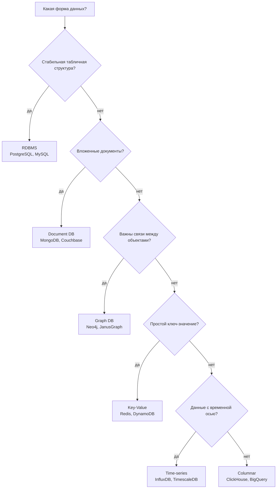

Модель данных - не про "что модно", а про то, как бизнес-данные реально организованы. При этом дерево выше - о
*преобладающей* форме данных: у «Платы» заказы останутся табличными и реляционными, даже если карточки товаров
станут документами. Разные агрегаты одной системы могут жить в разных моделях - это и есть polyglot persistence.

### 8. Масштабирование (Scaling)

К третьей ступени роста база «Платы» перестает справляться. Первая реакция - взять сервер побольше: это
**вертикальное масштабирование** (scale up): добавить CPU, RAM, SSD. Просто и без изменений в коде, но у него
есть физический потолок - и ценник, растущий быстрее мощности.

Когда потолок близко, остается **горизонтальное масштабирование** (scale out) - распределить нагрузку и данные по
нескольким серверам. Оно теоретически безгранично, но здесь важно не смешивать три разные техники, которые решают
три разные проблемы:

- **репликация** - те же данные копируются на несколько узлов. Решает отказоустойчивость (упал primary - есть копия)
  и разгрузку чтения (read replicas принимают SELECT-ы). Не решает объем: каждый узел хранит все данные целиком;
- **партицирование** - одна логическая таблица делится на части в пределах одного сервера. Вертикальное - по колонкам
  (горячие поля отдельно от холодных), горизонтальное - по строкам (заказы 2024 года в одной партиции, 2025 - в другой).
  Решает управляемость больших таблиц: индексы меньше, старые партиции легко удалять;
- **шардирование** - горизонтальное партицирование, разнесенное по разным серверам: клиенты 1-1М на одном узле,
  1М-2М на другом. Решает объем данных и пропускную способность записи - единственная из трех техник.

У «Платы» три разных симптома потребуют трех разных лекарств: реплики - когда чтение перегружает primary, партиции -
когда таблица кликов стала неуправляемой, шарды - когда заказы перестали помещаться на один сервер.

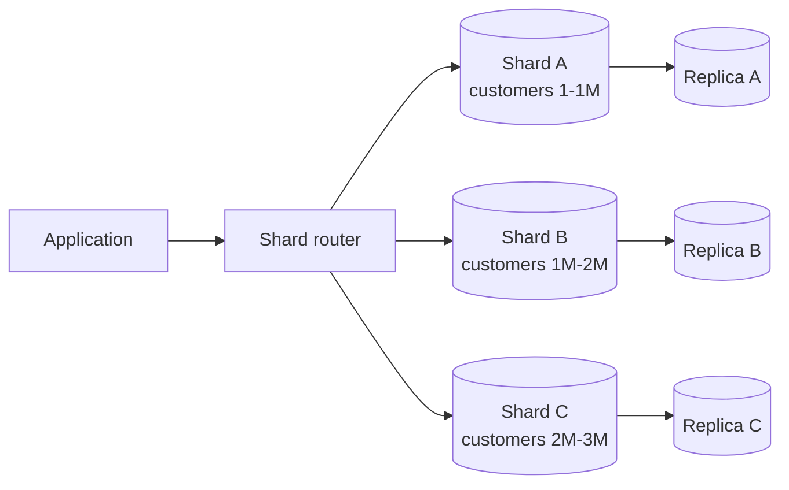

| СУБД | Горизонтальное масштабирование |
|---|---|
| PostgreSQL | Сложно (нужен Citus или ручное шардирование) |
| MySQL | Средне (Vitess, ProxySQL) |
| Cassandra | Из коробки (consistent hashing, vnodes) |
| MongoDB | Из коробки (config server + mongos router) |
| ClickHouse | Из коробки (distributed tables) |
| Redis | Cluster mode (hash slots) |

::: warning Цена шардирования
Шардирование усложняет JOIN между шардами, распределенные транзакции, миграции данных, бэкапы, rebalancing и
расследование инцидентов. Если проект можно надежно вести на одной PostgreSQL с индексами, репликами и мониторингом,
это часто лучше преждевременного распределения данных.
:::

::: details Connection pooling: масштабирование до шардирования
Прежде чем шардировать, стоит проверить, не упираетесь ли вы в лимит соединений. PostgreSQL создает отдельный
процесс на каждое соединение. При 1000 одновременных запросах это 1000 процессов и гигабайты RAM. Connection pooler
(PgBouncer, PgCat) держит пул из 20-50 реальных соединений и мультиплексирует тысячи клиентских.
Часто это снимает проблему производительности без шардирования.
:::

::: multi-code "Выбор шарда по идентификатору клиента"

```kotlin
data class Shard(val name: String, val endpoint: String)

class ShardRouter(private val shards: List<Shard>) {
    fun route(customerId: Long): Shard {
        val index = Math.floorMod(customerId.hashCode(), shards.size)
        return shards[index]
    }
}
```

```kotlin playground
data class Shard(val name: String, val endpoint: String)

class ShardRouter(private val shards: List<Shard>) {
    fun route(customerId: Long): Shard {
        val index = Math.floorMod(customerId.hashCode(), shards.size)
        return shards[index]
    }
}

fun main() {
    val router = ShardRouter(
        listOf(
            Shard("shard-a", "postgres-a:5432"),
            Shard("shard-b", "postgres-b:5432"),
            Shard("shard-c", "postgres-c:5432")
        )
    )

    for (id in listOf(101L, 102L, 103L, 204L, 305L, 999L)) {
        val shard = router.route(id)
        println("customer=$id -> ${shard.name} (${shard.endpoint})")
    }
}
```

```csharp
public sealed record Shard(string Name, string Endpoint);

public sealed class ShardRouter
{
    private readonly IReadOnlyList<Shard> _shards;

    public ShardRouter(IReadOnlyList<Shard> shards) => _shards = shards;

    public Shard Route(long customerId)
    {
        var index = (int)(Math.Abs(customerId.GetHashCode()) % _shards.Count);
        return _shards[index];
    }
}
```

```java
import java.util.List;

record Shard(String name, String endpoint) {}

final class ShardRouter {
    private final List<Shard> shards;

    ShardRouter(List<Shard> shards) {
        this.shards = shards;
    }

    Shard route(long customerId) {
        int index = Math.floorMod(Long.hashCode(customerId), shards.size());
        return shards.get(index);
    }
}
```

```go
package main

type Shard struct {
    Name     string
    Endpoint string
}

type ShardRouter struct {
    Shards []Shard
}

func (r ShardRouter) Route(customerID int64) Shard {
    index := int(customerID % int64(len(r.Shards)))
    if index < 0 {
        index = -index
    }
    return r.Shards[index]
}
```

:::

В реальном проекте вместо простого modulo используют consistent hashing (минимизирует перераспределение при добавлении
узлов) или lookup-таблицу размещения. Но идея та же: приложение или router должны одинаково решать, где лежит агрегат.

### 9. Высокая доступность (HA) и отказоустойчивость

Пятница, 19:40, пик заказов. У primary-сервера «Платы» умирает диск. Мониторинг красный, магазин не принимает заказы.
Инженер вручную повышает реплику до primary - на это уходит 40 минут. А когда все поднялось, обнаруживается вторая
беда: реплика отставала, и заказы за последние 15 секунд до падения пропали. Покупатели получили подтверждение
на экран - а заказа в базе нет.

В этой истории спрятаны два независимых вопроса, и у них есть имена:

- **RPO** (Recovery Point Objective) - сколько *данных* допустимо потерять при падении. Те самые 15 секунд заказов.
  RPO = 0 означает, что ни одна подтвержденная транзакция не может быть потеряна.
- **RTO** (Recovery Time Objective) - сколько *времени* система может быть недоступна. Те самые 40 минут простоя.

Ответы на них определяют архитектуру, и улучшение каждого стоит денег или задержки:

| Система | RPO | RTO | Как достигается |
|---|---|---|---|
| PostgreSQL (sync replica) | 0 | Секунды (failover) | Синхронная репликация |
| PostgreSQL (async replica) | Секунды | Секунды | Асинхронная репликация, возможна потеря |
| Redis (single master) | Секунды | Секунды | AOF каждую секунду, потеря при crash |
| Cassandra | 0 (quorum write) | 0 (masterless) | Кворумная запись на N узлов |
| Google Spanner | 0 | 0 | TrueTime, синхронная глобальная репликация |

Синхронная репликация дает RPO = 0, но увеличивает задержку каждой записи (ждем подтверждения от реплики). Асинхронная
репликация быстрее, но при падении master теряются неотправленные транзакции.

### 10. Сложность администрирования (Ops Complexity)

В «Плате» ClickHouse настраивал один увлеченный инженер. Через год он уволился - и выяснилось, что никто больше не
умеет обслуживать мержи, следить за репликацией через Keeper и восстанавливать бэкапы. Аналитика магазина теперь
держится на надежде, что ничего не сломается. База данных - это не решение «выбрал и забыл», а обязательство
эксплуатировать ее годами. И цена этого обязательства у разных уровней очень разная:

| Уровень | Пример | Что нужно знать | Когда оправдано |
|---|---|---|---|
| Managed (2 клика) | AWS RDS, Cloud SQL | Консоль облака, SQL | Стартап, малая команда |
| Semi-managed | Aiven Kafka, Atlas MongoDB | Базовое администрирование + специфика | Средняя команда |
| Self-hosted | PostgreSQL на bare metal | Linux, networking, backup, monitoring | Большая команда, compliance |
| Complex distributed | HBase, Cassandra cluster | Hadoop/HDFS, ZooKeeper, capacity planning | Только при реальных big data объемах |

::: warning Ops complexity должна соответствовать компетенциям команды
Если команда из 3 backend-разработчиков решает развернуть самостоятельный кластер Cassandra, стоимость поддержки
быстро превысит бюджет. Managed-сервис дороже в прямых затратах, но дешевле в человеко-часах и инцидентах.
:::

### 11. Лицензирование и вендор-лок (Licensing & Lock-in)

Это измерение обычно приносит не инженер, а юрист или финансовый директор. В «Плате» вопросы прозвучали в один месяц:
юрист спросил, можно ли на текущей лицензии Elasticsearch предоставлять поиск как часть платного API для партнеров
(SSPL это ограничивает), а финдиректор - во сколько обойдется переезд с DynamoDB, если облачный счет продолжит расти.
Ответ на второй вопрос оказался болезненным: не «сменить connection string», а «переписать схему данных и запросы».

| Тип | Примеры | Плюсы | Риски |
|---|---|---|---|
| Open Source (Apache 2.0, MIT) | PostgreSQL, ClickHouse | Свобода, нет лицензий, сообщество | Самоподдержка |
| AGPL / SSPL | MongoDB, Elasticsearch | Открытый код, ограничения на SaaS | Нельзя предоставлять как managed service |
| Enterprise | Oracle, MS SQL Server | SLA, поддержка, юридическая защита | Дорогие лицензии |
| Cloud-native | DynamoDB, BigQuery, Cosmos DB | Zero ops, автоскейлинг | Vendor lock: миграция = переписывание |

::: details Практический пример vendor lock
DynamoDB предоставляет отличный developer experience и автоскейлинг. Но его модель данных (partition key + sort key +
GSI) и SDK специфичны для AWS. Если через 3 года компания решит уйти из AWS, придется не просто сменить connection
string, а переписать схему данных, запросы и иногда бизнес-логику.
:::

### 12. Экосистема и интеграции

CEO «Платы» просит дашборд продаж в реальном времени. С ClickHouse задача заняла вечер: официальный плагин Grafana,
подключили - работает. Коллеги из соседнего стартапа с экзотической базой потратили на ту же задачу месяц: писали
собственный экспортер метрик и слой выгрузки. Сама база у них не хуже - хуже экосистема вокруг нее.

Перед выбором стоит проверить четыре группы интеграций:

- **Коннекторы данных**: интеграция с Kafka (CDC), Spark, Airflow, Flink;
- **Мониторинг**: Grafana dashboards, Prometheus exporters, встроенные метрики;
- **GUI и инструменты**: DataGrip, DBeaver, pgAdmin, Studio 3T;
- **ORM и драйверы**: зрелость драйверов для вашего стека (JDBC, Entity Framework, GORM).

| СУБД | Kafka-коннектор | Grafana dashboard | Зрелость драйверов (JVM / .NET / Go) |
|---|---|---|---|
| PostgreSQL | Debezium CDC | Да (плагин) | Отличная |
| ClickHouse | Kafka engine (встроен) | Да (плагин) | Хорошая (JDBC, clickhouse-go) |
| MongoDB | Kafka Connector (Confluent) | Community plugin | Отличная |
| Cassandra | Kafka Connector | Community plugin | Хорошая |
| Redis | Redis Streams / Pub-Sub | Да (плагин) | Отличная |
| Elasticsearch | Kafka Connector (Confluent) | Нативная интеграция | Хорошая |

При прочих равных выбирайте то, что проще подключить к существующей инфраструктуре. Apache Druid требует настройки
отдельных ETL-пайплайнов для загрузки данных, тогда как ClickHouse читает из Kafka "из коробки".

## Инфраструктурный контекст: где живет база данных

Мы выбрали *что* хранить и *в чем*. Остался вопрос, который команда «Платы» решала еще до первого коммита: *где*
это будет работать? Ставить PostgreSQL на собственный сервер? Крутить в Kubernetes рядом с сервисами? Взять managed
у облачного провайдера? Это спектр, где с каждым шагом вправо уменьшается контроль и объем ручной работы:

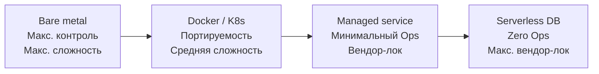

Заметьте: это тот же компромисс, что в измерениях 10 (Ops Complexity) и 11 (Lock-in), только для инфраструктуры.
Команда из трех человек без выделенного администратора закономерно выбрала managed - и до третьей ступени роста
ни разу об этом не пожалела.

**Docker для локальной разработки** - стандартная практика. PostgreSQL в контейнере стартует за секунды и дает всей
команде одинаковое окружение:

```yaml
services:
  postgres:
    image: postgres:16
    environment:
      POSTGRES_PASSWORD: dev
      POSTGRES_DB: shop
    ports:
      - "5432:5432"
    volumes:
      - pgdata:/var/lib/postgresql/data

volumes:
  pgdata:
```

Чтобы один и тот же код работал и с локальным контейнером, и с managed-базой в production, приложение не должно
зашивать адрес подключения в код. Строка подключения приходит из окружения - environment variable, секрет Kubernetes
или secret manager облака:

```kotlin
val connection = System.getenv("DATABASE_URL")
    ?: error("DATABASE_URL is required")
```

Локально Compose подставит `postgres://localhost:5432/shop`, в production придет адрес managed-кластера. Код не
меняется - меняется источник значения.

**Managed database** (AWS RDS, Cloud SQL, Yandex Managed PostgreSQL) берет на себя бэкапы, failover, обновления и
мониторинг. Команда платит деньгами, но экономит человеко-часы на администрирование.

**Kubernetes и StatefulSet** позволяют запустить БД в кластере с persistent volume. Подходит для сред, где managed
service недоступен или слишком дорог. Но stateful-workload в K8s требует понимания PersistentVolumeClaim, storage class
и backup-стратегий.

::: only go
Go компилируется в статический бинарник без runtime. Docker-образы для Go-сервисов получаются минимальными (`FROM
scratch`, ~10 MB). Но БД в контейнере все равно использует свой image (postgres:16 ~400 MB). Маленький бинарник сервиса
не влияет на размер БД.
:::

## Обзор классов СУБД

Фреймворк дал нам 12 вопросов. Теперь посмотрим на ответы - классы СУБД. Этот раздел устроен как продолжение истории:
каждый класс появляется тогда, когда у «Платы» возникает задача, с которой предыдущие хранилища справляются плохо.
В конце каждого класса - его профиль по фреймворку: в каких измерениях он выигрывает и какими платит. Не старайтесь
запомнить все продукты - важнее уловить, *какую задачу* решает каждый класс.

### Реляционные (RDBMS)

С этого класса «Плата» начиналась - и это был правильный выбор. Реляционные базы данных - самый зрелый и универсальный
класс. Строгая схема, SQL, ACID-транзакции, мощные оптимизаторы запросов и десятилетия проверенных практик делают их
default-выбором для большинства CRUD-приложений. Пока у магазина не было симптомов из worked example, одна PostgreSQL
закрывала все задачи - и для заказов она останется навсегда.

#### PostgreSQL

Самая функционально богатая open-source RDBMS.

| Сильная сторона | Что дает |
|---|---|
| Расширяемость (GiST, GIN, BRIN) | Индексы для геоданных, полнотекстового поиска, массивов |
| JSONB | Документная модель внутри реляционной БД |
| Оконные функции | Аналитика без отдельной OLAP-системы на малых объемах |
| MVCC | Читатели не блокируют писателей |
| Расширения | PostGIS (гео), TimescaleDB (time-series), pgvector (embeddings) |

**Trade-off**: автовакуум (VACUUM) создает нагрузку при массовых обновлениях. Для 1 млн INSERT/сек PostgreSQL не
оптимален - WAL pressure и bloat management становятся проблемой.

**Когда выбирать**: банковские ядра, ERP, e-commerce заказы, любой CRUD с транзакциями и сложными запросами.

#### MySQL (InnoDB)

Проще в репликации, быстрее на простых primary key lookups.

| Сильная сторона | Что дает |
|---|---|
| Простота репликации | Master-slave, Group Replication "из коробки" |
| Скорость чтения | Оптимизирован для simple reads по PK |
| Экосистема | Огромное количество инструментов и хостингов |

**Trade-off**: JSON-поддержка и аналитические функции слабее, чем в PostgreSQL. Блокировки на уровне строк при
большом конкурентном обновлении могут стать узким местом.

Кроме стандартного движка InnoDB (B-Tree), у MySQL есть сменные движки хранения - например, MyRocks на основе
LSM-дерева (см. измерение 2): та же SQL-обертка, но хранение оптимизировано под write-heavy нагрузку и лучшее сжатие.

**Когда выбирать**: read-heavy приложения, CMS, блоги, витрины данных.

**Профиль по фреймворку**: RDBMS выигрывают в транзакциях (5), сложных запросах и JOIN (6), экосистеме (12) и зрелости
Ops-практик (10); платят сложным горизонтальным масштабированием записи (8) и неоптимальностью для аналитики (1).

::: only kotlin
В Kotlin/JVM для PostgreSQL часто используют Exposed (type-safe SQL DSL) или jOOQ, для MySQL - тоже jOOQ или
Spring Data JPA. Выбор ORM/DSL влияет на то, насколько удобно работать с расширениями (JSONB, arrays).
:::

::: only csharp
В .NET для PostgreSQL используется Npgsql + Entity Framework Core (или Dapper для raw SQL). Для MySQL - Pomelo
или MySqlConnector. EF Core абстрагирует различия, но при тюнинге приходится работать с провайдер-специфичными API.
:::

::: only java
В Java для PostgreSQL и MySQL основные варианты: JDBC напрямую, Spring Data JPA (Hibernate), jOOQ или MyBatis.
Spring Data абстрагирует провайдер, но postgres-специфичные фичи (JSONB, arrays) требуют нативных запросов.
:::

::: only go
В Go стандартный `database/sql` работает с обоими через драйверы (`pgx` для PostgreSQL, `go-sql-driver/mysql`).
Для более высокоуровневой работы используют sqlc (генерация кода из SQL) или GORM (ORM).
:::

### In-Memory / Key-Value

Первой из PostgreSQL «Платы» съехала самая простая нагрузка - сессии и корзины. Вспомните worked example: таблица
сессий жила в режиме «вставили - удалили», душила VACUUM и раздувалась, хотя сами данные примитивны: ключ
`session:abc123` - значение-снапшот. Ни JOIN, ни транзакций, ни истории - идеальный кандидат для key-value хранилища
в оперативной памяти: доступ по ключу за доли миллисекунды, TTL из коробки, и Postgres больше не тратит ресурсы
на чужую работу.

#### Redis

In-memory система структур данных. Не просто кэш - полноценное хранилище с богатой моделью.

| Структура данных | Применение |
|---|---|
| Strings | Кэш, счетчики, токены |
| Hashes | Профили пользователей, сессии |
| Sets | Теги, уникальные посетители |
| Sorted Sets | Лидерборды, приоритетные очереди |
| Streams | Event log, pub/sub с историей |

**Персистентность**: RDB (периодические снимки) или AOF (журнал операций). При crash без AOF теряются данные с
последнего снимка.

**Trade-off**: ограничен объемом RAM. При рестарте без персистентности данные теряются. Cluster mode усложняет
операции с несколькими ключами (multi-key operations работают только в пределах одного hash slot).

**Когда выбирать**: сессии, кэш, распределенные блокировки (Redlock), rate limiting, real-time лидерборды.

#### KeyDB

Форк Redis с многопоточным ядром. Классический Redis обрабатывает команды в один поток - на многоядерном сервере
это упирается в одно ядро. KeyDB распараллеливает обработку и дает больший QPS на том же железе.

**Trade-off**: меньше зрелости и меньшее сообщество, чем у Redis. Выигрыш проявляется под пиковой нагрузкой;
если Redis не является узким местом, менять его не на что.

Вторая роль in-memory хранилищ в «Плате» - кэш перед основной базой: горячие карточки товаров читаются тысячи раз
в секунду, и дешевле отдать их из памяти, чем каждый раз ходить в PostgreSQL. Минимальный словарь кэширования:

- **cache hit** - данные найдены в кэше, БД не затронута;
- **cache miss** - данных нет, придется читать основную БД;
- **TTL** - время жизни записи, после которого она считается устаревшей;
- **инвалидирование** - принудительное удаление записи, когда оригинал изменился;
- **прогрев** - наполнение пустого кэша после старта, пока hit rate не вырос.

Самая распространенная схема - cache-aside: приложение само проверяет кэш и само кладет туда прочитанное из БД.

::: multi-code "Cache-aside для продукта"

```kotlin
data class Product(val id: String, val name: String, val price: Int)

class ProductService(
    private val cache: MutableMap<String, Product>,
    private val repository: ProductRepository
) {
    fun getProduct(id: String): Product =
        cache[id] ?: repository.findById(id).also { cache[id] = it }

    fun invalidate(id: String) {
        cache.remove(id)
    }
}
```

```kotlin playground
data class Product(val id: String, val name: String, val price: Int)

class ProductRepository {
    private var callCount = 0

    fun findById(id: String): Product {
        callCount++
        println("  DB query #$callCount for product=$id")
        return Product(id, "Mechanical Keyboard", 8900)
    }
}

class ProductService(
    private val cache: MutableMap<String, Product>,
    private val repository: ProductRepository
) {
    fun getProduct(id: String): Product {
        val cached = cache[id]
        if (cached != null) {
            println("  cache HIT for product=$id")
            return cached
        }
        println("  cache MISS for product=$id")
        val product = repository.findById(id)
        cache[id] = product
        return product
    }

    fun invalidate(id: String) {
        cache.remove(id)
        println("  cache INVALIDATED for product=$id")
    }
}

fun main() {
    val service = ProductService(mutableMapOf(), ProductRepository())

    println("First call:")
    println("  result: ${service.getProduct("kb-1")}")

    println("\nSecond call (cached):")
    println("  result: ${service.getProduct("kb-1")}")

    println("\nAfter invalidation:")
    service.invalidate("kb-1")
    println("  result: ${service.getProduct("kb-1")}")
}
```

```csharp
public sealed record Product(string Id, string Name, int Price);

public sealed class ProductService
{
    private readonly IDictionary<string, Product> _cache;
    private readonly ProductRepository _repository;

    public ProductService(IDictionary<string, Product> cache, ProductRepository repository)
    {
        _cache = cache;
        _repository = repository;
    }

    public Product GetProduct(string id)
    {
        if (_cache.TryGetValue(id, out var cached))
            return cached;

        var product = _repository.FindById(id);
        _cache[id] = product;
        return product;
    }

    public void Invalidate(string id) => _cache.Remove(id);
}
```

```java
import java.util.Map;

record Product(String id, String name, int price) {}

final class ProductService {
    private final Map<String, Product> cache;
    private final ProductRepository repository;

    ProductService(Map<String, Product> cache, ProductRepository repository) {
        this.cache = cache;
        this.repository = repository;
    }

    Product getProduct(String id) {
        var cached = cache.get(id);
        if (cached != null) return cached;

        var product = repository.findById(id);
        cache.put(id, product);
        return product;
    }

    void invalidate(String id) {
        cache.remove(id);
    }
}
```

```go
package main

type Product struct {
    ID    string
    Name  string
    Price int
}

type ProductRepository interface {
    FindByID(id string) Product
}

type ProductService struct {
    Cache      map[string]Product
    Repository ProductRepository
}

func (s ProductService) GetProduct(id string) Product {
    if p, ok := s.Cache[id]; ok {
        return p
    }
    p := s.Repository.FindByID(id)
    s.Cache[id] = p
    return p
}

func (s ProductService) Invalidate(id string) {
    delete(s.Cache, id)
}
```

:::

::: warning Инвалидирование кэша - самая сложная часть
Положить значение в кэш просто. Понять, когда оно устарело - сложно. Если пользователь обновил цену товара, а кэш
вернул старую цену другому пользователю, это бизнес-баг. Типичные стратегии: TTL (время жизни), write-through
(обновлять кэш при записи в БД), event-driven invalidation (слушать события об изменении).
:::

#### DynamoDB (AWS)

Полностью управляемый key-value / document store от AWS.

**Сильные стороны**: автоматическое партицирование, гарантированные single-digit миллисекундные задержки, нулевое
администрирование, автоскейлинг.

**Trade-off**: дорого при большой нагрузке. Модель данных жестко привязана к partition key + sort key: запросы «не по
ключу» требуют вторичных индексов (GSI/LSI), количество которых ограничено, а каждый GSI оплачивается отдельно.
Нет JOIN. Лимит 400 KB на item. Это та самая жесткая модель, из-за которой финдиректор «Платы» в измерении 11
получил неприятный ответ о стоимости переезда.

**Когда выбирать**: быстрое прототипирование на AWS, системы где key-value доступ покрывает 95% запросов.

**Профиль по фреймворку**: in-memory/KV хранилища выигрывают в задержке (3), простых точечных запросах (6) и
read/write-интенсивных сценариях (2); платят объемом RAM, отсутствием сложных запросов (6) и слабыми гарантиями
долговечности (9) - или деньгами и vendor lock (11) в managed-варианте.

### Документные (Document-oriented)

Помните дилемму из измерения 7: ноутбук с диагональю, клавиатура с переключателями, кабель с длиной - и десятки
nullable-колонок как цена реляционного ответа? Документные БД дают этой задаче естественную форму: каждый товар -
вложенный документ (JSON/BSON) со своим набором полей. Класс подходит, когда агрегат читается и пишется целиком,
а схема может различаться между документами.

#### MongoDB

Самая популярная документная БД. Гибкая схема, мощный агрегационный конвейер, встроенный шардинг.

| Сильная сторона | Что дает |
|---|---|
| Гибкая схема | Разные товары могут иметь разные поля |
| Вложенные документы (до 16 MB) | Агрегат хранится целиком, без JOIN |
| Aggregation Pipeline | Трансформации и аналитика внутри БД |
| Шардирование | Hash-based или range-based из коробки |

**Trade-off**: ACID-транзакции на нескольких документах есть с версии 4.0, но значительно медленнее, чем в RDBMS.
`$lookup` (аналог JOIN) исторически был сильно ограничен на шардированных коллекциях и до сих пор заметно медленнее
нативного JOIN реляционной базы - документная модель предполагает, что агрегат уже собран.

**Когда выбирать**: e-commerce каталог с гетерогенными товарами, CMS с гибким контентом, прототипы с часто
меняющейся схемой.

#### Couchbase

Архитектура "memory-first" с встроенным кэш-слоем и SQL-подобным языком N1QL.

**Сильные стороны**: данные сначала попадают в RAM (быстрый доступ), потом на диск. Поддержка мобильной
синхронизации через Couchbase Lite. N1QL для привычных SQL-запросов по документам.

**Trade-off**: меньшее сообщество, чем у MongoDB. Настройка кластера (Buckets, vBuckets, Rebalance) сложнее.

**Когда выбирать**: мобильные приложения с offline-режимом, профили пользователей с географией.

::: multi-code "Репозиторий: реляционный vs документный"

```kotlin
interface SqlClient {
    fun querySingle(sql: String, vararg args: Any): Map<String, Any>?
    fun execute(sql: String, vararg args: Any)
}

interface DocumentCollection {
    fun findOne(id: String): Map<String, Any>?
    fun replaceOne(id: String, document: Map<String, Any>)
}

interface ProductRepository {
    fun findById(id: String): Map<String, Any>?
    fun save(id: String, data: Map<String, Any>)
}

// Реляционная модель: агрегат разложен по таблицам, чтение собирает его через JOIN
class RelationalProductRepository(private val db: SqlClient) : ProductRepository {
    override fun findById(id: String) = db.querySingle(
        "SELECT p.*, s.key, s.value FROM products p " +
            "JOIN product_specs s ON s.product_id = p.id WHERE p.id = ?",
        id
    )

    override fun save(id: String, data: Map<String, Any>) {
        db.execute("INSERT INTO products (id, name) VALUES (?, ?)", id, data.getValue("name"))
        db.execute(
            "INSERT INTO product_specs (product_id, key, value) VALUES (?, ?, ?)",
            id, "voltage", "220V"
        )
    }
}

// Документная модель: агрегат хранится целиком, чтение - один запрос по ключу
class DocumentProductRepository(private val collection: DocumentCollection) : ProductRepository {
    override fun findById(id: String) = collection.findOne(id)

    override fun save(id: String, data: Map<String, Any>) {
        collection.replaceOne(id, data)
    }
}
```

```kotlin playground
interface ProductRepository {
    fun findById(id: String): Map<String, Any>?
    fun save(id: String, data: Map<String, Any>)
}

class RelationalProductRepository : ProductRepository {
    private val products = mutableMapOf<String, Map<String, Any>>()

    override fun findById(id: String): Map<String, Any>? {
        println("  SQL: SELECT p.*, ps.* FROM products p JOIN specs ps ON p.id = ps.product_id WHERE p.id = '$id'")
        return products[id]
    }

    override fun save(id: String, data: Map<String, Any>) {
        println("  SQL: INSERT INTO products ... + INSERT INTO product_specs ...")
        products[id] = data
    }
}

class DocumentProductRepository : ProductRepository {
    private val collection = mutableMapOf<String, Map<String, Any>>()

    override fun findById(id: String): Map<String, Any>? {
        println("  Mongo: db.products.findOne({ _id: '$id' })")
        return collection[id]
    }

    override fun save(id: String, data: Map<String, Any>) {
        println("  Mongo: db.products.replaceOne({ _id: '$id' }, data)")
        collection[id] = data
    }
}

fun main() {
    val electronics = mapOf(
        "name" to "Laptop",
        "voltage" to "220V",
        "specs" to mapOf("ram" to "16GB", "ssd" to "512GB")
    )

    println("=== Relational (normalized, JOIN needed) ===")
    val relational: ProductRepository = RelationalProductRepository()
    relational.save("laptop-1", electronics)
    relational.findById("laptop-1")

    println("\n=== Document (nested, no JOIN) ===")
    val document: ProductRepository = DocumentProductRepository()
    document.save("laptop-1", electronics)
    document.findById("laptop-1")
}
```

```csharp
public interface ISqlClient
{
    IDictionary<string, object>? QuerySingle(string sql, params object[] args);
    void Execute(string sql, params object[] args);
}

public interface IDocumentCollection
{
    IDictionary<string, object>? FindOne(string id);
    void ReplaceOne(string id, IDictionary<string, object> document);
}

public interface IProductRepository
{
    IDictionary<string, object>? FindById(string id);
    void Save(string id, IDictionary<string, object> data);
}

// Реляционная модель: агрегат разложен по таблицам, чтение собирает его через JOIN
public sealed class RelationalProductRepository : IProductRepository
{
    private readonly ISqlClient _db;

    public RelationalProductRepository(ISqlClient db) => _db = db;

    public IDictionary<string, object>? FindById(string id) => _db.QuerySingle(
        "SELECT p.*, s.key, s.value FROM products p " +
        "JOIN product_specs s ON s.product_id = p.id WHERE p.id = @id",
        id);

    public void Save(string id, IDictionary<string, object> data)
    {
        _db.Execute("INSERT INTO products (id, name) VALUES (@id, @name)", id, data["name"]);
        _db.Execute(
            "INSERT INTO product_specs (product_id, key, value) VALUES (@id, @key, @value)",
            id, "voltage", "220V");
    }
}

// Документная модель: агрегат хранится целиком, чтение - один запрос по ключу
public sealed class DocumentProductRepository : IProductRepository
{
    private readonly IDocumentCollection _collection;

    public DocumentProductRepository(IDocumentCollection collection) => _collection = collection;

    public IDictionary<string, object>? FindById(string id) => _collection.FindOne(id);

    public void Save(string id, IDictionary<string, object> data) => _collection.ReplaceOne(id, data);
}
```

```java
import java.util.Map;

interface SqlClient {
    Map<String, Object> querySingle(String sql, Object... args);
    void execute(String sql, Object... args);
}

interface DocumentCollection {
    Map<String, Object> findOne(String id);
    void replaceOne(String id, Map<String, Object> document);
}

interface ProductRepository {
    Map<String, Object> findById(String id);
    void save(String id, Map<String, Object> data);
}

// Реляционная модель: агрегат разложен по таблицам, чтение собирает его через JOIN
final class RelationalProductRepository implements ProductRepository {
    private final SqlClient db;

    RelationalProductRepository(SqlClient db) {
        this.db = db;
    }

    public Map<String, Object> findById(String id) {
        return db.querySingle(
            "SELECT p.*, s.key, s.value FROM products p "
                + "JOIN product_specs s ON s.product_id = p.id WHERE p.id = ?",
            id);
    }

    public void save(String id, Map<String, Object> data) {
        db.execute("INSERT INTO products (id, name) VALUES (?, ?)", id, data.get("name"));
        db.execute(
            "INSERT INTO product_specs (product_id, key, value) VALUES (?, ?, ?)",
            id, "voltage", "220V");
    }
}

// Документная модель: агрегат хранится целиком, чтение - один запрос по ключу
final class DocumentProductRepository implements ProductRepository {
    private final DocumentCollection collection;

    DocumentProductRepository(DocumentCollection collection) {
        this.collection = collection;
    }

    public Map<String, Object> findById(String id) {
        return collection.findOne(id);
    }

    public void save(String id, Map<String, Object> data) {
        collection.replaceOne(id, data);
    }
}
```

```go
package main

type SqlClient interface {
    QuerySingle(sql string, args ...any) (map[string]any, error)
    Execute(sql string, args ...any) error
}

type DocumentCollection interface {
    FindOne(id string) (map[string]any, error)
    ReplaceOne(id string, document map[string]any) error
}

type ProductRepository interface {
    FindByID(id string) (map[string]any, error)
    Save(id string, data map[string]any) error
}

// Реляционная модель: агрегат разложен по таблицам, чтение собирает его через JOIN.
type RelationalProductRepository struct {
    DB SqlClient
}

func (r RelationalProductRepository) FindByID(id string) (map[string]any, error) {
    return r.DB.QuerySingle(
        "SELECT p.*, s.key, s.value FROM products p "+
            "JOIN product_specs s ON s.product_id = p.id WHERE p.id = $1",
        id,
    )
}

func (r RelationalProductRepository) Save(id string, data map[string]any) error {
    err := r.DB.Execute("INSERT INTO products (id, name) VALUES ($1, $2)", id, data["name"])
    if err != nil {
        return err
    }
    return r.DB.Execute(
        "INSERT INTO product_specs (product_id, key, value) VALUES ($1, $2, $3)",
        id, "voltage", "220V",
    )
}

// Документная модель: агрегат хранится целиком, чтение - один запрос по ключу.
type DocumentProductRepository struct {
    Collection DocumentCollection
}

func (d DocumentProductRepository) FindByID(id string) (map[string]any, error) {
    return d.Collection.FindOne(id)
}

func (d DocumentProductRepository) Save(id string, data map[string]any) error {
    return d.Collection.ReplaceOne(id, data)
}
```

:::

Реляционная модель нормализует данные: товар в одной таблице, характеристики в другой, категории в третьей. Чтение
требует JOIN. Документная модель хранит агрегат целиком: товар со всеми характеристиками в одном документе. Чтение -
один запрос, но обновление связанных данных (переименование категории) требует обновления множества документов.

**Профиль по фреймворку**: документные БД выигрывают в гибкости модели данных (7), чтении агрегата целиком (6) и
горизонтальном масштабировании (8); платят слабыми межагрегатными транзакциями (5) и дорогими соединениями данных (6).

### Ширококолоночные (Wide-column)

«Плата» запустила собственную доставку, и курьерские трекеры начали слать GPS-координаты каждые пять секунд - сотни
тысяч записей в секунду, ни одна из которых не требует транзакций и JOIN. Зато запрос всегда один и тот же: «маршрут
курьера N за последний час». Для такой нагрузки существует отдельный класс: данные организуются не как строки, а как
семейства колонок с partition key, проектируются под конкретный паттерн запроса и масштабируются горизонтально
"из коробки".

#### Cassandra

Мастер-мастер архитектура и линейная масштабируемость записи.

| Сильная сторона | Что дает |
|---|---|
| Masterless (ring topology) | Нет единой точки отказа (SPOF), любой узел принимает запись |
| LSM-Tree | Очень быстрая запись (sequential I/O, см. измерение 2) |
| Линейное масштабирование | Пропускная способность растет почти линейно с числом узлов |
| Tunable consistency | Для каждого запроса можно выбрать ONE, QUORUM, ALL |

**Trade-off**: нет транзакций, нет JOIN, CQL сильно ограничен (нет GROUP BY, нет подзапросов). Эффективны только
точечные чтения и диапазоны в пределах одного partition key; произвольные диапазонные сканирования по кластеру -
антипаттерн. Модель данных проектируется "от запросов" - сначала определяете, какие запросы нужны, потом
проектируете таблицы.

**Когда выбирать**: IoT-телеметрия (миллионы записей/сек), трекинг (GPS-координаты), логирование, любая нагрузка
с предсказуемым паттерном записи и чтения по partition key.

#### ScyllaDB

Переписанная на C++ версия Cassandra с использованием фреймворка Seastar (шардирование по ядрам CPU внутри узла).

**Сильные стороны**: совместимость с Cassandra API (CQL), но кратно лучший P99 (по бенчмаркам вендора - до 10x)
за счет отсутствия GC-пауз JVM и жесткой привязки данных к ядрам.

**Trade-off**: дороже (Enterprise лицензия), требует тонкой настройки NUMA и CPU affinity.

#### HBase

Работает поверх HDFS (Hadoop Distributed File System). Хранит миллиарды строк на дешевых дисках.

**Trade-off**: высокая задержка при random reads (HDFS не оптимизирован для point lookups). Требует ZooKeeper.
Подходит для batch-обработки, а не для real-time. В real-time сценариях Cassandra значительно быстрее.

**Профиль по фреймворку**: wide-column выигрывают в пропускной способности записи (2), горизонтальном масштабировании
(8) и отказоустойчивости (9); платят отсутствием транзакций (5), бедным языком запросов (6) и жесткой привязкой
модели данных к запросам (7).

### Колоночные / OLAP

Пора закрыть долг перед маркетологом «Платы» - тот самый отчет за год, который в worked example клал магазин на
30 секунд. Колоночные БД созданы ровно для этого: данные хранятся по колонкам, а не по строкам. Запрос по трем
колонкам из двадцати читает с диска только эти три. Однотипные значения в колонке сжимаются в разы лучше пестрых
строк (феноменальное сжатие), а агрегации по колонке ложатся на векторные инструкции процессора.

#### ClickHouse

Open-source колоночная СУБД для аналитики. Создана в Яндексе.

| Сильная сторона | Что дает |
|---|---|
| Сжатие до 10:1 | Терабайты данных на дешевых дисках |
| Векторные вычисления (SIMD) | COUNT/SUM/AVG на миллиардах строк за секунды |
| MergeTree engine | Автоматическое слияние данных, партицирование по дате |
| SQL-совместимость | Привычный синтаксис для аналитиков |
| Kafka engine | Потоковая загрузка из Kafka |

**Trade-off**: UPDATE и DELETE очень тяжелые (через мержи). Администрирование непростое: ZooKeeper/Keeper для
репликации, ручное управление партициями, сложные бэкапы. Не подходит для точечных выборок - оптимизирован для
сканирования колонок.

**Когда выбирать**: хранилище событий, трекинг кликов, метрики производительности, аналитические дашборды.

#### BigQuery (Google Cloud)

Полностью бессерверный: нет кластеров, нет серверов, нет настройки. Платите за объем обработанных данных.

**Trade-off**: vendor lock (GCP). При частых ad-hoc запросах стоимость может превысить бюджет. Задержка первого
запроса выше, чем у ClickHouse (cold start).

**Когда выбирать**: аналитика без DevOps-ресурсов, нерегулярные тяжелые запросы, Data Science исследования.

#### Druid / Apache Pinot

Ориентированы на потоковые данные с sub-second латентностью запросов. Загружают данные из Kafka почти в реальном
времени.

**Когда выбирать**: real-time дашборды для мониторинга рекламных кампаний, gaming analytics.

**Trade-off**: требуют много RAM, сложны в настройке сегментов и TTL.

**Профиль по фреймворку**: колоночные БД выигрывают в аналитической нагрузке (1), скорости агрегаций (6) и цене
хранения больших объемов (8); платят тяжелыми UPDATE/DELETE, слабостью в точечных запросах (6) и заметной
Ops-сложностью (10) - либо ценой запросов и vendor lock (11) в serverless-варианте.

### Графовые (Graph)

«Плата» запустила реферальную программу - и мошенники тут же начали регистрировать сети фейковых аккаунтов, чтобы
собирать промокоды. Как их ловить? Признак мошенничества - не в самом аккаунте, а в *связях*: десять «разных»
пользователей делят один номер телефона, одну карту или один адрес доставки. В SQL запрос «аккаунты, связанные с
этим через 3-4 промежуточных звена» превращается в цепочку самосоединений с взрывающейся стоимостью. Графовые БД
оптимизированы ровно под это: вместо JOIN по foreign key - прямой обход ребер графа.

#### Neo4j

Нативная графовая БД с ACID-транзакциями.

| Сильная сторона | Что дает |
|---|---|
| Index-free adjacency | Обход соседей за O(1), не зависит от размера графа |
| Язык Cypher | Декларативный и читаемый язык запросов к графам |
| ACID-транзакции | Безопасная запись в граф |

**Trade-off**: горизонтальное масштабирование (Enterprise кластер) дорогое. Аналитика на графах с > 1 млрд
вершин становится медленной. Не подходит для обычного CRUD.

**Когда выбирать**: системы рекомендаций ("друзья друзей, купившие X"), антифрод (поиск связанных аккаунтов через
общие телефоны/карты), социальные сети, knowledge graphs.

#### JanusGraph

Распределенный граф поверх Cassandra или HBase. Масштабируется горизонтально.

**Trade-off**: нет ACID, нет нативного языка запросов (использует Apache Gremlin). Запросы медленнее, чем в Neo4j.
Но масштабируется там, где Neo4j упирается в лимиты одного узла.

**Профиль по фреймворку**: графовые БД выигрывают в запросах-обходах связей (6) и естественной модели для сетей
объектов (7); платят дорогим горизонтальным масштабированием (8), узкой специализацией (обычный CRUD в них неудобен)
и меньшей экосистемой (12).

### Временные ряды (Time-series)

Чем больше хранилищ появляется у «Платы», тем острее вопрос: а как следить за самой платформой? CPU каждого сервиса,
задержки каждой базы, ошибки 5xx - метрики снимаются каждые несколько секунд с сотен источников. У этих данных
особый характер: каждая точка привязана к моменту времени, данные почти никогда не обновляются, свежие читаются
постоянно, а старые нужны только в агрегированном виде. Под этот характер заточен отдельный класс - time-series БД:
метрики, телеметрия, IoT-показания, финансовые котировки.

#### InfluxDB

Push-модель: приложение отправляет метрики в InfluxDB.

**Сильные стороны**: TTL (автоматическое удаление старых данных), continuous queries (автоагрегация), удобный
query language (InfluxQL / Flux).

**Когда выбирать**: бизнес-метрики, статистика продаж по часам, IoT-данные с политикой хранения.

#### Prometheus / VictoriaMetrics

Pull-модель: Prometheus сам собирает метрики с endpoints приложений.

**Сильные стороны**: нативная интеграция с Kubernetes (service discovery), PromQL для запросов, алерты.
VictoriaMetrics - форк с лучшим сжатием и long-term storage.

**Когда выбирать**: мониторинг инфраструктуры (CPU, RAM, 5xx errors), Kubernetes-среды.

#### TimescaleDB

Расширение PostgreSQL для временных рядов. Полный SQL, JOIN между time-series и справочными таблицами.

**Сильные стороны**: привычный PostgreSQL + hypertables для автоматического партицирования по времени. Можно
писать: "Покажи среднюю температуру датчика по городам за неделю" одним SQL с JOIN на таблицу городов.

**Trade-off**: потребляет больше диска, чем InfluxDB. Зато не нужно учить новый язык запросов.

**Профиль по фреймворку**: time-series БД выигрывают в write-heavy нагрузке с временной осью (2, 7), автоматическом
устаревании данных (TTL) и агрегациях по времени (6); платят узкой специализацией - как основное хранилище
бизнес-данных они не подходят.

### Поисковые и векторные (Search & Vector)

Строка поиска - главный вход в каталог «Платы», и worked example показал, почему `ts_vector` перестал устраивать:
покупатель пишет «клавиатра механическая» и ждет, что магазин поймет опечатку, отранжирует результаты по релевантности
и предложит фильтры по бренду и цене. Это не SQL-запрос - это задача информационного поиска, и у нее свой класс систем.

#### Elasticsearch / OpenSearch

Распределенный поисковый движок на основе Apache Lucene. Инвертированный индекс позволяет находить документы по
словам за O(1) - в отличие от `LIKE '%query%'`, который сканирует все строки. OpenSearch - open-source форк
Elasticsearch после смены лицензии на SSPL.

| Возможность | Что дает |
|---|---|
| Инвертированный индекс | Полнотекстовый поиск за миллисекунды |
| Анализаторы (stemming, synonyms) | Поиск "кроссовки" находит "кроссовка", "кросс" |
| Фасетная фильтрация | Каталог товаров с фильтрами (цвет, размер, бренд) |
| Fuzzy search | Толерантность к опечаткам ("клавиатра" → "клавиатура") |

**Когда выбирать**: поиск по каталогу товаров, логи (ELK stack), автодополнение, fuzzy search.

**Trade-off**: не является primary database - нужна синхронизация с основным хранилищем (обычно через CDC).
Нет ACID-транзакций. Eventual consistency между шардами. Потребляет много RAM для индексов.

#### Vector databases (pgvector, Milvus, Qdrant)

Хранят эмбеддинги (числовые представления текста, изображений, аудио) и выполняют similarity search.

**Когда выбирать**: RAG (retrieval-augmented generation), рекомендации по похожести, semantic search.

**Trade-off**: молодая категория. pgvector удобен тем, что работает внутри PostgreSQL (не нужна отдельная система),
но менее производителен на больших объемах, чем специализированные решения.

**Профиль по фреймворку**: поисковые системы выигрывают в полнотекстовых и similarity-запросах (6) и read-heavy
нагрузке (2); платят ролью вторичного хранилища - обязательной синхронизацией с основной БД (12), отсутствием
транзакций (5) и eventual consistency (4).

### Embedded databases

У «Платы» появилось мобильное приложение, и требование продукта - корзина должна работать в метро без сети. Серверная
БД здесь не поможет: хранилище нужно *внутри* телефона. Embedded databases встраиваются в процесс приложения как
библиотека: нет отдельного сервера, нет сети, данные в локальном файле.

#### SQLite

Самая распространенная embedded БД в мире. Полный SQL, ACID, нулевое администрирование.

**Когда выбирать**:
- мобильные приложения (единственная доступная БД на устройстве);
- desktop-приложения (настройки, документы, локальные каталоги);
- тесты (поднять БД за миллисекунды без Docker);
- IoT и edge (автономная работа без сети);
- прототипы и CLI-утилиты.

**Не подходит**: как единственная БД для многопользовательского backend с высокой конкуренцией записей.

**Профиль по фреймворку**: embedded БД выигрывают в нулевой Ops-сложности (10), автономности и мгновенном старте;
платят однопользовательской природой - масштабирование (8) и высокая доступность (9) для них не определены.

### Distributed SQL (NewSQL)

Вернемся к пятой ступени таймлайна - той самой, где экскаватор рвал магистраль в разделе про CAP. «Плата» выходит во
второй регион, и заказы должны жить в двух дата-центрах одновременно. Шардировать PostgreSQL руками? Согласиться на
ограничения Cassandra? Есть класс, который обещает третий путь - SQL и ACID поверх автоматически распределенного
кластера: CockroachDB, YugabyteDB, Google Spanner, TiDB.

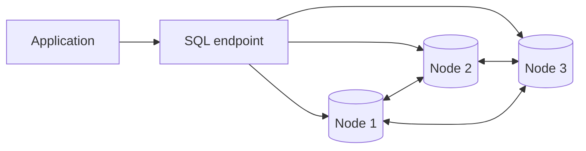

**Обещание**: SQL + ACID + горизонтальное масштабирование + автоматический failover.

**Реальность**: распределенные транзакции имеют цену (сетевые round-trips, консенсус). Latency выше, чем у
single-node PostgreSQL. Rebalancing при добавлении узлов нагружает кластер. Наблюдаемость и дебаг сложнее.

**Когда рассматривать**: географически распределенные приложения (пользователи на нескольких континентах),
объемы данных, которые не помещаются на один узел, требование zero-downtime при добавлении мощности. Не стоит
брать в маленький проект без реальных симптомов масштабирования.

**Профиль по фреймворку**: distributed SQL выигрывает в транзакциях (5) и SQL-запросах (6) при горизонтальном
масштабировании (8) и failover (9); платит повышенной задержкой каждой транзакции (3) из-за консенсуса между
узлами и сложной наблюдаемостью (10).

### Сводная матрица: классы против измерений

Соберем профили всех классов в одну таблицу. Обозначения: ✓✓ - сильная сторона класса, ✓ - справляется,
~ - с оговорками, ✗ - слабость или не поддерживается.

| Класс | Транзакции | JOIN и сложные запросы | Масштаб записи | Задержка чтения | Аналитика | Простота Ops |
|---|---|---|---|---|---|---|
| RDBMS | ✓✓ | ✓✓ | ✗ | ✓ | ~ | ✓ |
| In-Memory / KV | ~ | ✗ | ✓ | ✓✓ | ✗ | ✓ |
| Документные | ~ | ✗ | ✓✓ | ✓ | ~ | ✓ |
| Wide-column | ✗ | ✗ | ✓✓ | ✓ | ✗ | ~ |
| Колоночные / OLAP | ✗ | ~ | ✓✓ | ✗ | ✓✓ | ~ |
| Графовые | ✓ | ✓✓ (обход связей) | ✗ | ✓ | ~ | ~ |
| Time-series | ✗ | ~ | ✓✓ | ✓ | ✓ (по времени) | ✓ |
| Поисковые / Vector | ✗ | ~ | ✓ | ✓✓ | ~ | ~ |
| Embedded | ✓✓ | ✓✓ | ✗ | ✓✓ | ~ | ✓✓ |
| Distributed SQL | ✓✓ | ✓ | ✓✓ | ~ | ~ | ~ |

Матрица подтверждает тезис из начала лекции: ни одна строка не состоит из одних ✓✓. Каждый класс - это профиль
компромиссов, и выбор сводится к вопросу, какие колонки критичны для вашей задачи.

## Синтез: прикладные примеры и Trade-offs

Теперь применим фреймворк целиком - к пяти типовым системам. Первая из них - финал истории «Платы»: та самая
архитектура, к которой магазин пришел через все worked examples лекции. Обратите внимание на общий формат разбора:
анализ нагрузки → решение → **главный** trade-off. Не список плюсов, а честный ответ, чем платим.

### Интернет-магазин (E-commerce)

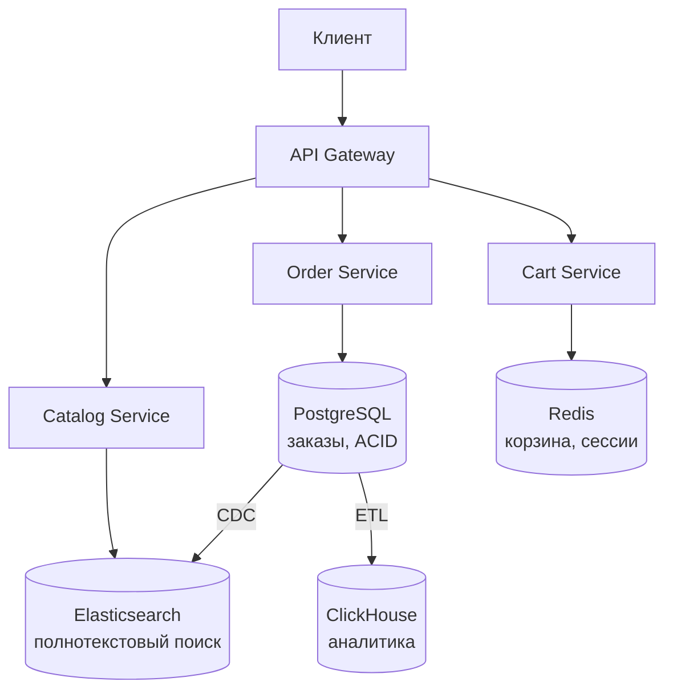

| Компонент | БД | Почему | Жертва |
|---|---|---|---|
| Заказы | PostgreSQL | ACID, транзакции, SERIALIZABLE | Сложность горизонтального масштабирования |
| Каталог (поиск) | Elasticsearch | Быстрый full-text, фасеты, ранжирование | Нет транзакций, eventual consistency |
| Сессии и корзина | Redis | Микросекундный доступ, TTL | Ограничен RAM, риск потери при crash |
| Аналитика | ClickHouse | Сжатие, агрегации за секунды | Сложный Ops, плохие UPDATE |

**Главный trade-off**: синхронизация между PostgreSQL и Elasticsearch. Если CDC задерживается, пользователь
ищет товар, которого уже нет, или не находит только что добавленный. Приходится мириться с eventual consistency
в поиске.

### Биллинг (Billing)

Строгий аудит, деньги, транзакции. Здесь компромиссов с согласованностью быть не может.

**Решение**: PostgreSQL с уровнем изоляции SERIALIZABLE.

**Главный trade-off**: жертвуем горизонтальным масштабированием. При росте до 100 млн пользователей придется
подключать шардирование (Citus) или переходить на distributed SQL - оба варианта добавляют сложность.

### IoT-платформа

Лавина данных: миллионы записей в секунду с датчиков. Потеря нескольких точек некритична.

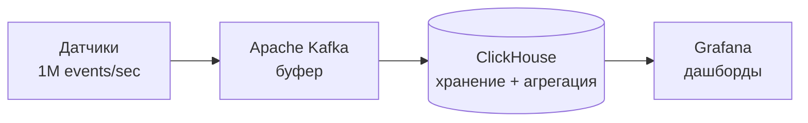

**Решение**: Kafka как буфер (принимает данные с любой скоростью) + ClickHouse для хранения и агрегации.

**Главный trade-off**: администрирование ClickHouse требует специалистов. Мержи, бэкапы, ZooKeeper/Keeper -
если команда не готова, лучше Managed ClickHouse или TimescaleDB (проще, но медленнее на больших объемах).

### Антифрод (Fraud Detection)

Запросы глубиной 3-5 связей: чей номер телефона, какие аккаунты, какие карты, какие еще операции.
Скорость критична: < 100 мс на решение.

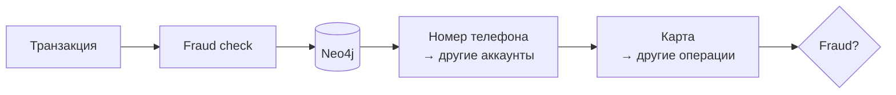

**Решение**: Neo4j для хранения связей в памяти. Cypher-запрос обходит граф за миллисекунды.

**Главный trade-off**: Neo4j не умеет автоматически перешардироваться. При 10 млрд транзакций придется
"разрезать" граф по временным окнам (старые данные в архив) или переходить на JanusGraph (медленнее, но
масштабируется).

### Аналитика кликов (Clickstream Analytics)

100 тыс. событий/сек. Глубокие срезы по датам, UTM-меткам, устройствам, регионам.

**Решение**: ClickHouse (self-hosted, если есть экспертиза) или BigQuery (если бюджет позволяет, а команда маленькая).

**Главный trade-off**: в ClickHouse нужно проектировать ORDER BY (сортировочный ключ) так, чтобы он покрывал
частые запросы. Неправильный ключ = полное сканирование вместо pruning. В BigQuery этой проблемы нет, но каждый
запрос стоит денег (плата за обработанные байты).

### Сводная таблица Trade-offs

| Бизнес-кейс | Основная БД | Где выигрываем | Чем платим |
|---|---|---|---|
| E-commerce заказы | PostgreSQL | Консистентность, ACID | Сложность шардирования |
| E-commerce каталог | Elasticsearch | Скорость full-text поиска | Eventual consistency |
| Биллинг | PostgreSQL | Финансовая безопасность | Ограниченный масштаб записи |
| IoT-логи | ClickHouse | Скорость агрегаций, сжатие | Ops complexity, плохие UPDATE |
| Антифрод (граф) | Neo4j | Скорость обхода связей | Дорогой горизонтальный скейлинг |
| Аналитика кликов | ClickHouse / BigQuery | Сжатие (CH) или Zero Ops (BQ) | Тюнинг (CH) или цена запросов (BQ) |
| Сессии и кэш | Redis | Микросекундные задержки | Ограничен RAM, риск потери |
| IoT на устройстве | SQLite | Нет сети, нет сервера | Не масштабируется на backend |
| Мониторинг | Prometheus + VictoriaMetrics | Pull-модель, K8s native | Не для бизнес-данных |

## Как начинать выбор

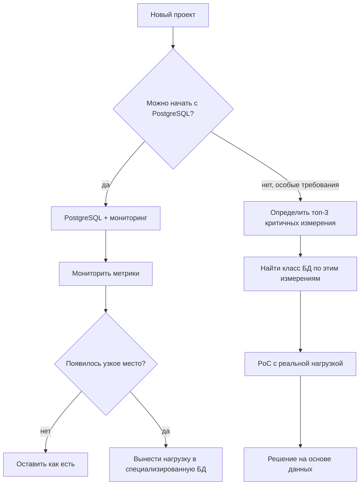

| Сценарий | Начальный выбор | Почему | Когда пересматривать |
|---|---|---|---|
| CRUD backend | PostgreSQL | Транзакции, SQL, зрелость, расширения | Чтение или запись стали узким местом |
| Быстрый кэш | Redis | TTL, микросекундный доступ | Проблемы консистентности или инвалидирования |
| Гибкие документы | MongoDB | Гибкая схема, агрегат целиком | Нужны JOIN и строгие транзакции |
| Мобильное приложение | SQLite | Встроенный файл, offline | Нужна синхронизация между устройствами |
| Аналитика | ClickHouse или BigQuery | Колоночное хранение, агрегации | Нужны UPDATE или point lookups |
| Граф связей | Neo4j | Обход на 3+ шагов за миллисекунды | Данные > 1 млрд вершин |
| Global high-load | Distributed SQL | Авто-распределение, failover | Только при реальных симптомах |

Главный инженерный принцип: начните просто. PostgreSQL - хороший default для большинства задач. Добавляйте
специализированные хранилища только когда появляются измеримые симптомы: latency, throughput, disk space или
ops burden превышают допустимое. До этого момента простая модель дешевле, надежнее и понятнее.

### Как выглядит первый шаг миграции

«Вынести нагрузку в специализированную БД» звучит просто, но данные нельзя переключить рубильником. Посмотрим,
как «Плата» выносила сессии из PostgreSQL в Redis - это типовой план любой миграции хранилища:

1. **Двойная запись.** Приложение начинает писать сессии и в старую таблицу, и в Redis. Чтение - по-прежнему из
   PostgreSQL. Если с Redis что-то не так, никто не пострадает.
2. **Сверка.** Несколько дней фоновая задача сравнивает содержимое двух хранилищ и логирует расхождения. Здесь
   всплывают сюрпризы: сериализация дат, кодировки, забытые пути записи.
3. **Переключение чтения.** Чтение переезжает на Redis - лучше постепенно, по проценту трафика (feature flag).
   PostgreSQL все еще получает записи и остается готовым путем отката.
4. **Отключение старого пути.** Когда метрики стабильны, двойная запись выключается, таблица сессий архивируется
   и удаляется.

::: warning Откат - часть плана, а не признак неудачи
На каждом шаге до четвертого у команды есть кнопка «вернуть как было». Миграция без пути отката - это не смелость,
а азартная игра с данными пользователей. Если для отката нужно «восстановить бэкап», план миграции не готов.
:::

## Резюме

- Полиглотное хранение (Polyglot Persistence) - стандарт индустрии: разным задачам - разные БД.
- Теорема CAP ограничивает распределенные системы: при разрыве сети приходится выбирать между отказом в операции (CP)
  и разрешением конфликтов постфактум (AP).
- ACID дает строгие транзакционные гарантии за счет координации. BASE дает доступность за счет eventual consistency.
- 12 измерений фреймворка позволяют системно оценить требования к хранилищу.
- OLTP (транзакции) и OLAP (аналитика) решают разные задачи и требуют разных архитектур.
- B-Tree оптимален для чтения (спуск по отсортированным страницам), LSM-Tree - для записи (memtable и
  последовательный сброс на диск).
- Хвостовая задержка (P99) критичнее средней при проектировании SLA: страница из десяти запросов попадает в
  «медленный хвост» гораздо чаще, чем один запрос.
- Согласованность - требование конкретной операции, а не всей системы: «Мои заказы» читаются с primary, каталог -
  с реплики.
- Репликация решает отказоустойчивость и разгрузку чтения. Партицирование - управляемость больших таблиц.
  Шардирование решает масштаб данных и записи.
- PostgreSQL - хороший default для большинства CRUD-задач.
- Redis - не просто кэш, а in-memory система структур данных для сессий, лидербордов и блокировок.
- Документные БД подходят, когда агрегат читается целиком и схема гетерогенна.
- Колоночные БД (ClickHouse, BigQuery) оптимальны для аналитических агрегаций.
- Графовые БД уместны при запросах на обход связей глубиной 3+ шагов.
- Time-series БД оптимизированы для данных с временной осью.
- Managed services снижают ops burden за счет vendor lock и прямых затрат.
- Миграция хранилища идет через двойную запись, сверку и постепенное переключение чтения - с путем отката на
  каждом шаге.
- Выбор СУБД - это осознанный компромисс, а не поиск "лучшей" технологии.

## Дополнительное чтение

### Фундаментальные концепции

- [Designing Data-Intensive Applications (Kleppmann)](https://dataintensive.net/) - библия проектирования систем хранения данных.
- [CAP theorem explained](https://habr.com/ru/articles/328792/) - разбор теоремы CAP с примерами.
- [Обзор типов СУБД](https://habr.com/ru/companies/amvera/articles/754702/) - карта основных типов баз данных.

### Масштабирование и репликация

- [Шардирование](https://yandex.cloud/ru/docs/glossary/sharding) - обзорное объяснение подхода.
- [Распределенный SQL: альтернатива шардированию](https://habr.com/ru/companies/ruvds/articles/714322/) - разбор NewSQL.

### Отдельные классы СУБД

- [ClickHouse: введение](https://clickhouse.com/docs/ru) - официальная документация на русском.
- [Redis data structures](https://redis.io/docs/data-types/) - структуры данных Redis с примерами.
- [Neo4j Graph Academy](https://graphacademy.neo4j.com/) - бесплатные курсы по графовым БД.

### Практические паттерны

- [CQRS Pattern](https://learn.microsoft.com/en-us/azure/architecture/patterns/cqrs) - Microsoft documentation.
- [Cache-aside pattern](https://learn.microsoft.com/en-us/azure/architecture/patterns/cache-aside) - описание паттерна.
- [Unit of Work и ORM](https://youtu.be/oP_OUiIK4Rc) - про связь Unit of Work с ORM.

### Инфраструктура (если хочется глубже, чем краткий блок лекции)

- [Docker для начинающих](https://www.youtube.com/watch?v=_uZQtRyF6Eg) - полный курс по Docker.
- [Kubernetes для начинающих](https://www.youtube.com/watch?v=hNLQ3tCP8jQ) - вводный курс по Kubernetes.

## Вопросы для самопроверки

1. Почему в 2010-х годах polyglot persistence стало стандартом вместо одной универсальной БД?
2. Что утверждает теорема CAP и почему на практике выбор сводится к CP или AP?
3. Чем ACID отличается от BASE? Когда уместен каждый подход?
4. Почему хвостовая задержка (P99) важнее средней при проектировании SLA?
5. Чем B-Tree отличается от LSM-Tree? Когда каждый оптимален?
6. Почему OLTP и OLAP нельзя эффективно совместить в одной БД?
7. Что такое CQRS и как он связан с разделением OLTP/OLAP?
8. Когда NoSQL (документная/key-value БД) уместнее реляционной? Когда наоборот?
9. Чем репликация отличается от шардирования? Какие проблемы решает каждый подход?
10. Почему cache invalidation сложнее, чем запись значения в кэш?
11. Что такое RPO и RTO? Как они влияют на выбор стратегии репликации?
12. Чем PostgreSQL лучше MySQL для сложных аналитических запросов? А MySQL лучше PostgreSQL?
13. Почему Redis ограничен объемом RAM и как это влияет на архитектуру?
14. Когда графовая БД дает реальное преимущество перед реляционной?
15. Чем ClickHouse плох для UPDATE/DELETE и почему это не всегда проблема?
16. Почему embedded БД (SQLite) не подходит для многопользовательского backend?
17. Когда Distributed SQL (CockroachDB, Spanner) оправдан, а когда это overengineering?
18. Как vendor lock проявляется при использовании DynamoDB или BigQuery?
19. Почему ops complexity должна соответствовать компетенциям команды?
20. Как начать выбор БД для нового проекта и когда стоит пересмотреть решение?
21. Пользователь оформил заказ, а страница «Мои заказы» пуста. Что произошло и как это чинится на уровне
    маршрутизации чтения?
22. Что уточняет PACELC по сравнению с CAP? Какой выбор система делает в отсутствие partition?
23. Опишите четыре шага миграции сессий из PostgreSQL в Redis. Почему нельзя просто «переключить чтение» сразу?

## Мини-практика

1. **Проектирование хранения для сервиса доставки еды.**
   У сервиса есть: заказы (платежи, статусы), каталог ресторанов с меню (поиск, фильтрация), позиция курьеров
   (GPS-координаты каждые 5 сек), сессии пользователей, аналитика (среднее время доставки по районам за месяц).
   Для каждого компонента выберите класс БД, объясните почему и укажите главный trade-off.

2. **Анализ узкого места.**
   Ваш PostgreSQL обслуживает и транзакции заказов, и поисковые запросы по каталогу. Средняя задержка запроса
   выросла с 10 мс до 200 мс. Аналитические запросы менеджеров блокируют connection pool. Предложите стратегию
   разделения нагрузки: что вынести, куда, как синхронизировать.

3. **Оценка по 12 измерениям.**
   Возьмите систему из вашего опыта (рабочую, учебную или вымышленную). Заполните таблицу 12 измерений для основного
   хранилища. Определите 3 самых критичных измерения. Проверьте, оптимальна ли текущая БД по этим трем осям. Если нет,
   предложите альтернативу с обоснованием.
