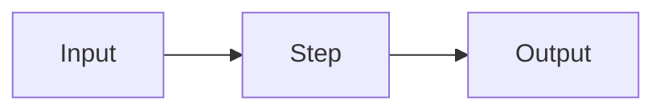

# Лекция NN. Название

## Сквозной сценарий

Опишите одну ситуацию, которая будет возвращаться в примерах лекции.

## Worked example: ...

### Ситуация

### Наивное решение

### Что ломается

### Улучшение

### Почему это работает

::: multi-code "Минимальный пример"

```kotlin
class Service
```

```csharp
public sealed class Service {}
```

```java
final class Service {}
```

```go
type Service struct{}
```

:::

::: only kotlin
Заметка, видимая только при выбранном Kotlin.
:::

::: only csharp
Заметка, видимая только при выбранном C#.
:::

::: only java
Заметка, видимая только при выбранной Java.
:::

::: only go
Заметка, видимая только при выбранном Go.
:::



| Вариант | Когда подходит | Риск |
|---------|----------------|------|
| A       | Простой случай | Рост связности |
| B       | Несколько правил | Лишний слой |

::: warning Важно
Коротко зафиксируйте типичную ошибку.
:::

::: details Подробнее
Дополнительное объяснение, которое не нужно в основном потоке.
:::

## Основной материал

## Резюме

## Вопросы для самопроверки

## Мини-практика
