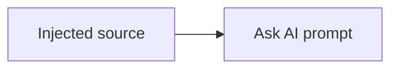

# Ask AI Contract Fixture

Stable context before the selected fixture paragraph.

This page is intentionally hidden from navigation.

```text
fixture context after selection
```

## Injected elements

| Element | Purpose |
| --- | --- |
| Table fixture | Preserve source Markdown for Ask AI |



```kotlin
val standaloneContext = "a semantic element"
```

## Multi-code projection

Context before the multi-code fixture.

::: multi-code "Language projection" {default=kotlin playground=off}
```kotlin
val selectedLanguage = "kotlin-visible-only"
```
```csharp
var selectedLanguage = "csharp-hidden-variant";
```
```java
var selectedLanguage = "java-hidden-variant";
```
```go
selectedLanguage := "go-hidden-variant"
```
:::

Context after the multi-code fixture.

::: multi-code "Playground snapshot" {default=kotlin playground=on}
```kotlin
fun main() {
    println("playground-snapshot-source")
}
```
:::

::: tip Injected container
Container source must remain one semantic element.
:::

## Selection boundaries

First boundary paragraph starts inside the learning content and must survive a range that begins before the document.

Middle boundary paragraph keeps enough ordinary text between the first and terminal paragraphs for block ordering checks.

Nested boundary phrase combines **bold boundary text** and `inline boundary code` inside one paragraph.

<p><span id="selection-whitespace">   </span></p>

Terminal boundary paragraph belongs only to the learning content and must open Ask AI when selected fully.
