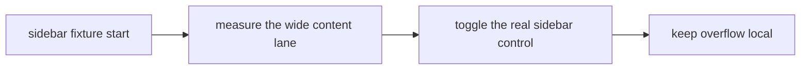

# Sidebar Contract Fixture

This internal page exists only to exercise layout transitions that require a real VitePress sidebar.

## Wide elements

| Scenario | Sidebar state | Content lane | Expected behavior |
|---|---|---|---|
| Initial fixture | visible | standard | prose remains readable |
| Focused fixture | hidden | expanded | wide blocks center against the viewport |

| C01 | C02 | C03 | C04 | C05 | C06 | C07 | C08 |
|---|---|---|---|---|---|---|---|
| value-01 | value-02 | value-03 | value-04 | value-05 | value-06 | value-07 | value-08 |

The prose width remains constrained while the wide lane changes.
