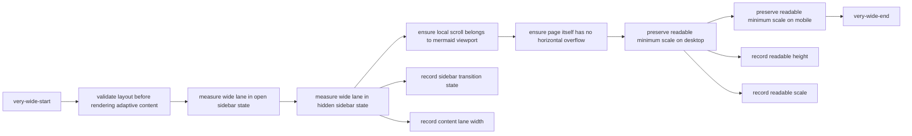
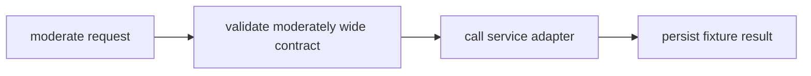
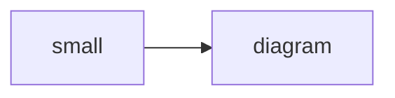
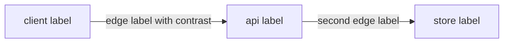

# UI Contract Fixtures

This page is intentionally hidden from navigation. It contains stable markup fixtures for layout, markdown extensions,
language switchers, Mermaid, tables, images and Kotlin Playground behavior.

## Code Switchers Without Author Defaults

:::: multi-code "Fixture switcher one"

```kotlin
val value = "one"
```

```csharp
var value = "one";
```

```java
var value = "one";
```

```go
value := "one"
```

::::

:::: multi-code "Fixture switcher two"

```kotlin
val value = "two"
```

```csharp
var value = "two";
```

```java
var value = "two";
```

```go
value := "two"
```

::::

:::: multi-code "Fixture switcher three"

```kotlin
val value = "three"
```

```csharp
var value = "three";
```

```java
var value = "three";
```

```go
value := "three"
```

::::

## Author Default

:::: multi-code "Fixture author default" {default=go}

```kotlin
val selected = "kotlin"
```

```csharp
var selected = "csharp";
```

```java
var selected = "java";
```

```go
selected := "go"
```

::::

## Playground

:::: multi-code "Fixture Kotlin Playground"

```kotlin
fun answer(): Int = 42
```

```kotlin playground
fun answer(): Int = 42

fun main() {
    println(answer())
}
```

```csharp
int Answer() => 42;
```

```java
int answer() {
    return 42;
}
```

```go
func answer() int {
    return 42
}
```

::::

:::: multi-code "Fixture playground off" {playground=off}

```kotlin
interface FixturePort {
    fun execute()
}
```

```csharp
public interface IFixturePort
{
    void Execute();
}
```

```java
interface FixturePort {
    void execute();
}
```

```go
type FixturePort interface {
    Execute()
}
```

::::

## Mermaid Fixtures









## Image Fixture


## Table Fixtures

| Key | Value |
|---|---|
| a | one |
| b | two |

| Scenario state | Contract description | Runtime observation | Expected behavior |
|---|---|---|---|
| active checkout request | This cell contains enough ordinary text to make the natural table wider than a mobile viewport. | The words are still readable after fixed layout wrapping. | The table should keep native table display and use wrapped cells. |
| repeated fixture request | Another long but readable text value keeps this table in the wrap category instead of the dense scroll category. | The adaptive controller should not need local horizontal scroll for four readable columns. | The adaptive table controller should mark it as wrap. |

| C01 | C02 | C03 | C04 | C05 | C06 | C07 | C08 | C09 | C10 |
|---|---|---|---|---|---|---|---|---|---|
| value-01 | value-02 | value-03 | value-04 | value-05 | value-06 | value-07 | value-08 | value-09 | value-10 |

## Standalone Code

```text
fixture:standalone-code:block:with:stable:content
```

```text
Пример функционального тестирования сохраняет coverage для длинного text-code блока: fixture_text_code_token_with_a_very_long_name_that_must_stay_viewport_contained_on_mobile_without_global_page_overflow
```

## Custom Blocks

::: tip Fixture tip
This block exists to test custom block layout.
:::

::: warning Fixture warning
This block exists to test warning layout.
:::

::: details Fixture details
This block exists to test details layout.
:::

> Fixture blockquote for viewport containment.

Inline code with a long token:
`fixture_inline_code_token_with_a_very_long_name_that_must_wrap_inside_the_viewport_without_page_overflow`.

## Extremely Long Heading Fixture For Mobile Viewport Containment And Overflow Guard

### Extremely Long Third Level Heading Fixture For Mobile Viewport Containment And Overflow Guard
