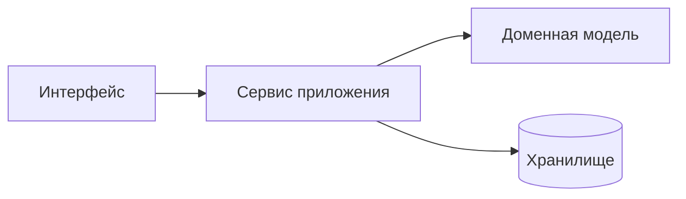

# Введение

Этот конспект — рабочие материалы по курсу «Конструирование программного обеспечения». Он связывает архитектурные принципы, практики проектирования и инженерные ограничения, которые появляются в реальных приложениях.

Эта страница знакомит не только с курсом, но и с возможностями сайта. Ниже собраны живые примеры: переключение языка, Kotlin Playground, Mermaid-диаграммы, адаптивные таблицы, блоки замечаний, тёмная тема и поведение широкого контента на мобильных экранах.

## Как пользоваться конспектом

Слева находится меню лекций и дополнений. В верхней панели есть основные разделы и поиск. Справа на широких экранах появляется локальное оглавление «На этой странице». Левый sidebar можно скрыть: обычный текст останется в читаемой колонке, а широкие блоки вроде диаграмм, таблиц и кода получат больше места.

Ниже показаны основные возможности сайта. Эти же приёмы используются в лекциях и дополнениях.

### Переключение языка примеров

Каждый пример кода может быть написан на нескольких языках: Kotlin, C#, Java и Go. Переключатель общий: выбрав C# в одном примере, вы увидите C# во всех совместимых примерах конспекта, и выбор сохранится между страницами и визитами.

Если в конкретном блоке выбранного языка нет, сайт использует авторский default, начальный язык или первый доступный язык блока.

В Kotlin-примерах есть важная деталь: статическая вкладка может быть коротким фрагментом для чтения, а интерактивный Playground получает отдельную запускаемую версию. Поэтому лекционный текст не засоряется `main`, тестовыми данными и демонстрационным выводом, но при включении Playground пример можно реально запустить.

::: multi-code "Один пример — четыре языка"

```kotlin
data class User(val id: Int, val name: String)
```

```kotlin playground
data class User(val id: Int, val name: String)

fun main() {
    val user = User(1, "Ада")
    println("Пользователь: ${user.name}")
    println("Можно менять имя и сразу запускать код снова.")
}
```

```csharp
record User(int Id, string Name);

var user = new User(1, "Ада");
Console.WriteLine($"Пользователь: {user.Name}");
```

```java
public class Main {
    record User(int id, String name) {}

    public static void main(String[] args) {
        var user = new User(1, "Ада");
        System.out.println("Пользователь: " + user.name());
    }
}
```

```go
package main

import "fmt"

type User struct {
    ID   int
    Name string
}

func main() {
    user := User{ID: 1, Name: "Ада"}
    fmt.Printf("Пользователь: %s\n", user.Name)
}
```

:::

### Kotlin Playground

Когда выбран Kotlin, на блоке появляется кнопка **Playground**: она превращает пример в интерактивный редактор — код можно менять и запускать прямо на странице. Кнопка выключает и включает режим сразу для всех примеров, состояние запоминается.

Для интерактивной версии можно добавить отдельный fence:

````md
::: multi-code "Пример"

```kotlin
data class User(val id: Int, val name: String)
```

```kotlin playground
data class User(val id: Int, val name: String)

fun main() {
    println(User(1, "Ада"))
}
```

```csharp
record User(int Id, string Name);
```

:::
````

Такой `kotlin playground` не появляется как отдельная вкладка. Он используется только интерактивным режимом. Если отдельного playground-блока нет, интерактивный режим возьмёт обычный Kotlin-код.

Если пример не рассчитан на запуск (фрагмент класса, псевдокод), playground можно отключить для конкретного блока — как здесь:

::: multi-code "Блок без playground" {playground=off}

```kotlin
interface PaymentGateway {
    fun charge(amount: Money): Result<Receipt>
}
```

```csharp
public interface IPaymentGateway
{
    Result<Receipt> Charge(Money amount);
}
```

:::

`playground=off` — жёсткое правило: даже если пользователь раньше включил Playground глобально, такой блок не покажет кнопку и не смонтирует интерактивный редактор.

### Авторский язык по умолчанию

Иногда пример лучше читать на конкретном языке. Тогда автор может указать `{default=go}` или другой язык. До первого клика в этом блоке авторский default сильнее сохранённого глобального выбора. После клика блок присоединяется к общему языку, а другие блоки с author default остаются защищёнными, пока пользователь не переключит именно их.

::: multi-code "Авторский default: Go" {default=go playground=off}

```kotlin
val names = listOf("Ada", "Grace")
println(names.joinToString())
```

```go
names := []string{"Ada", "Grace"}
fmt.Println(strings.Join(names, ", "))
```

:::

### Текст для конкретного языка

Иногда пояснение имеет смысл только для одного языка. Блок `::: only <язык>` показывается, лишь когда этот язык выбран — переключите язык в любом примере выше и абзац ниже поменяется:

::: only kotlin
> **Kotlin.** Для моделей данных используется `data class`: `equals`, `hashCode` и `copy` генерируются компилятором.
:::

::: only csharp
> **C#.** То же самое делает `record` — сравнение по значению и деконструкция генерируются компилятором.
:::

::: only java
> **Java.** Начиная с Java 16 используется `record`; в старых версиях аналог собирают через Lombok.
:::

::: only go
> **Go.** Структуры сравниваются по значению оператором `==`, если все их поля сравнимы; отдельной языковой конструкции не нужно.
:::

Работает и внутри предложения: программа завершается вызовом <LangOnly lang="kotlin">`exitProcess(0)`</LangOnly><LangOnly lang="csharp">`Environment.Exit(0)`</LangOnly><LangOnly lang="java">`System.exit(0)`</LangOnly><LangOnly lang="go">`os.Exit(0)`</LangOnly>.

### Диаграммы Mermaid

Диаграммы описываются текстом в блоках ` ```mermaid ` и рендерятся в тему сайта. Переключите светлую/тёмную тему — диаграмма будет перерисована с палитрой сайта.



Широкие диаграммы получают локальный scroll, а не расширяют всю страницу. Если диаграмма помещается, кнопки масштаба скрыты до hover/focus; если есть overflow, controls остаются видимыми.

### Обычные блоки кода

Одиночные блоки кода тоже подсвечиваются и нумеруются. Они участвуют в wide lane и не должны создавать горизонтальный scroll страницы.

```kotlin
fun fibonacci(n: Int): Long =
    if (n < 2) n.toLong()
    else fibonacci(n - 1) + fibonacci(n - 2)
```

### Таблицы

Markdown-таблицы адаптируются поэтапно. Сначала таблица пытается поместиться как есть. Если текст мог бы влезть за счёт переноса, включается режим переноса в ячейках. Если колонок слишком много, horizontal scroll появляется только внутри блока таблицы.

| Возможность | Что делает | Где полезно |
| --- | --- | --- |
| Adaptive table layout | Сначала переносит текст в ячейках, потом включает локальный scroll | На мобильных экранах и в wide lane |
| Wide lane | Даёт таблицам, диаграммам и коду больше места при скрытом sidebar | Для схем, сравнений и больших примеров |
| Overflow guard | Проверяет, что страница целиком не получает горизонтальный scroll | Для стабильного чтения на телефоне |

Компактные таблицы остаются простыми:

| Принцип | Расшифровка |
| --- | --- |
| SRP | Единственная ответственность |
| DIP | Инверсия зависимостей |

### Замечания, предупреждения и детали

Работают стандартные custom blocks VitePress. Они остаются в prose lane, поэтому длинный текст и inline-code внутри них переносятся и не расширяют страницу.

::: tip Совет
Используйте такие блоки для важных замечаний.
:::

::: warning Внимание
А такие — для предупреждений о типичных ошибках.
:::

::: details Подробнее
Скрываемый блок удобен для длинных пояснений, которые не должны перегружать основной поток чтения.
:::

> Цитаты оформляются с акцентной полосой — удобно для определений.

### Wide content и мобильная версия

У сайта есть общий layout contract: обычный текст остаётся в читаемой колонке, а широкие элементы получают свою полосу и локальный scroll. Это относится к Mermaid, `multi-code`, одиночным code blocks, таблицам, Playground и картинкам-слайдам.

На мобильных экранах страница целиком не должна прокручиваться по горизонтали. Если контент шире экрана, scroll появляется внутри конкретного блока.

### Тема

Переключатель темы меняет не только фон страницы. Статическая подсветка кода, Kotlin Playground и Mermaid используют общие токены палитры, поэтому светлая и тёмная темы выглядят согласованно.

## Структура курса

Курс состоит из 14 лекций, дополнений и заключения. Лекции идут от базовых принципов проектирования к тестируемости, паттернам, клиент-серверному взаимодействию, асинхронности, распределённым системам, CI/CD и эксплуатационным требованиям. Полное оглавление — в боковой панели.
