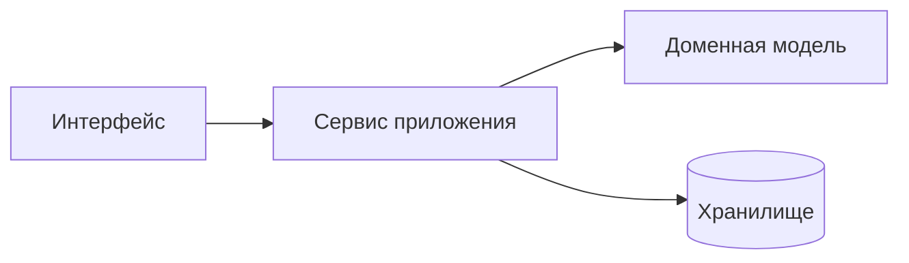

# Введение

Здесь будет вступительная лекция: о чём этот конспект, зачем нужна архитектура приложений и как устроен курс.

## Как пользоваться конспектом

Ниже — демонстрация всех возможностей конспекта. Эти же приёмы используются в шаблонах лекций.

### Переключение языка примеров

Каждый пример кода написан на нескольких языках. Переключатель общий: выбрав C# в одном примере, вы увидите C# во всех примерах конспекта, и выбор сохранится между страницами и визитами.

::: multi-code "Один пример — четыре языка"

```kotlin
data class User(val id: Int, val name: String)

fun main() {
    val user = User(1, "Ада")
    println("Пользователь: ${user.name}")
}
```

```csharp
record User(int Id, string Name);

var user = new User(1, "Ада");
Console.WriteLine($"Пользователь: {user.Name}");
```

```java
public class Main {
    record User(int id, String name) {}

    public static void main(String[] args) {
        var user = new User(1, "Ада");
        System.out.println("Пользователь: " + user.name());
    }
}
```

```go
package main

import "fmt"

type User struct {
    ID   int
    Name string
}

func main() {
    user := User{ID: 1, Name: "Ада"}
    fmt.Printf("Пользователь: %s\n", user.Name)
}
```

:::

### Kotlin Playground

Когда выбран Kotlin, на блоке появляется кнопка **Playground**: она превращает пример в интерактивный редактор — код можно менять и запускать прямо на странице. Кнопка выключает и включает режим сразу для всех примеров, состояние запоминается.

Если пример не рассчитан на запуск (фрагмент класса, псевдокод), playground можно отключить для конкретного блока — как здесь:

::: multi-code "Блок без playground" {playground=off}

```kotlin
interface PaymentGateway {
    fun charge(amount: Money): Result<Receipt>
}
```

```csharp
public interface IPaymentGateway
{
    Result<Receipt> Charge(Money amount);
}
```

:::

Обратите внимание: в этом примере только два языка — если глобально выбран Go, блок покажет язык по умолчанию. Так работает запасной вариант для примеров, где перевод на все языки не имеет смысла.

### Текст для конкретного языка

Иногда пояснение имеет смысл только для одного языка. Блок `::: only <язык>` показывается, лишь когда этот язык выбран — переключите язык в любом примере выше и абзац ниже поменяется:

::: only kotlin
> **Kotlin.** Для моделей данных используется `data class`: `equals`, `hashCode` и `copy` генерируются компилятором.
:::

::: only csharp
> **C#.** То же самое делает `record` — сравнение по значению и деконструкция генерируются компилятором.
:::

::: only java
> **Java.** Начиная с Java 16 используется `record`; в старых версиях аналог собирают через Lombok.
:::

::: only go
> **Go.** Структуры сравниваются по значению оператором `==`, если все их поля сравнимы; отдельной языковой конструкции не нужно.
:::

Работает и внутри предложения: программа завершается вызовом <LangOnly lang="kotlin">`exitProcess(0)`</LangOnly><LangOnly lang="csharp">`Environment.Exit(0)`</LangOnly><LangOnly lang="java">`System.exit(0)`</LangOnly><LangOnly lang="go">`os.Exit(0)`</LangOnly>.

### Диаграммы

Диаграммы описываются текстом в блоках ` ```mermaid ` и рендерятся в тему сайта (переключите тему — диаграмма перекрасится):



### Обычные блоки кода

Одиночные блоки кода тоже подсвечиваются и нумеруются:

```kotlin
fun fibonacci(n: Int): Long =
    if (n < 2) n.toLong()
    else fibonacci(n - 1) + fibonacci(n - 2)
```

### Оформление текста

Работают все стандартные возможности VitePress:

::: tip Совет
Используйте такие блоки для важных замечаний.
:::

::: warning Внимание
А такие — для предупреждений о типичных ошибках.
:::

> Цитаты оформляются с акцентной полосой — удобно для определений.

| Принцип | Расшифровка |
| --- | --- |
| SRP | Единственная ответственность |
| DIP | Инверсия зависимостей |

## Структура курса

Курс состоит из 14 лекций, дополнений и заключения. Полное оглавление — в боковой панели.
