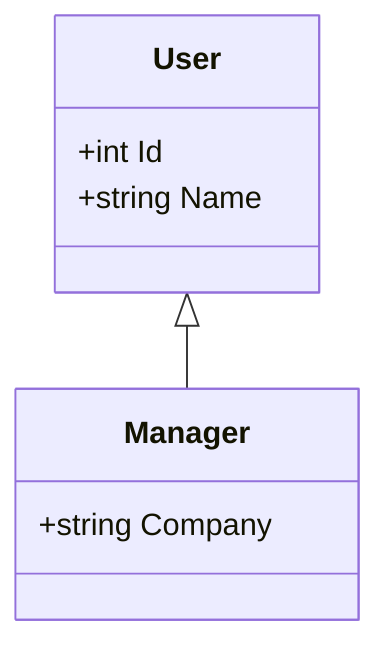
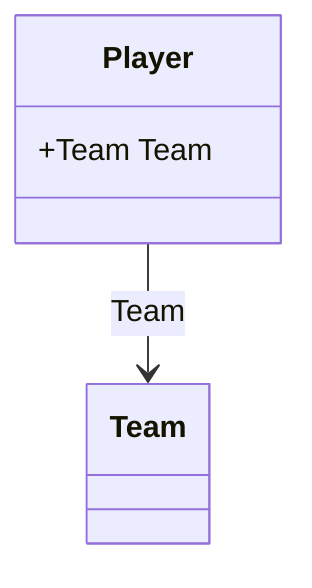
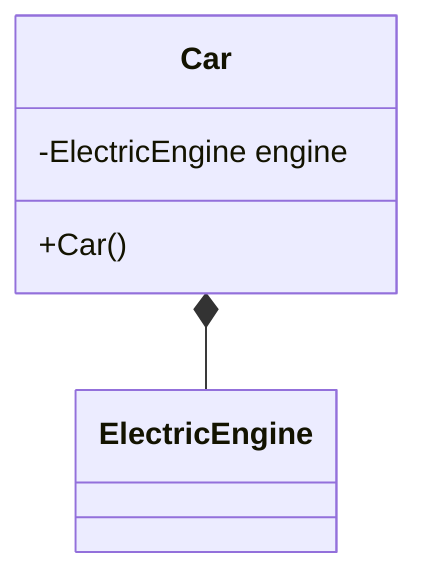
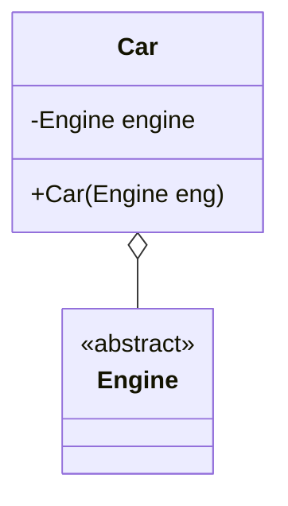
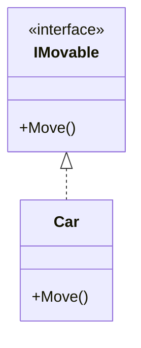
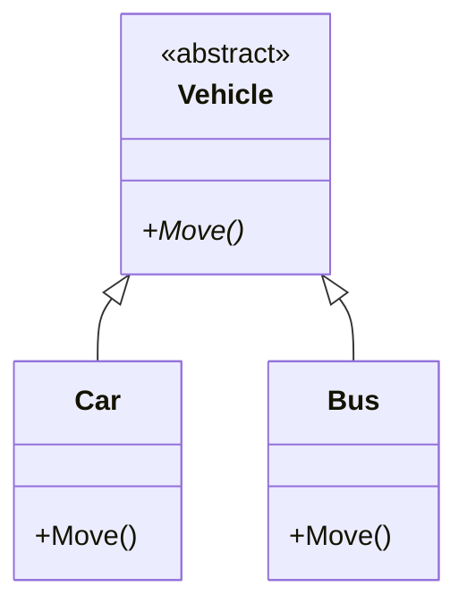
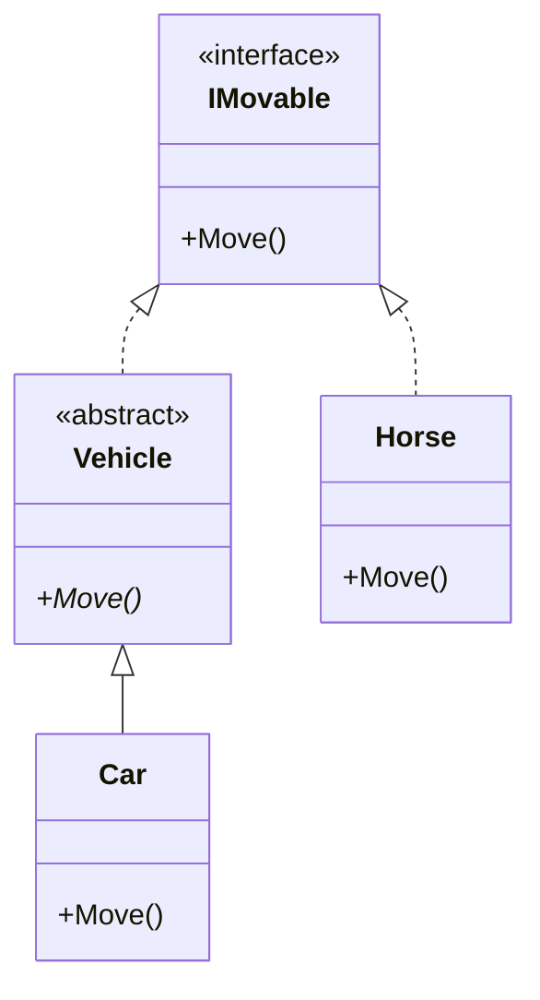
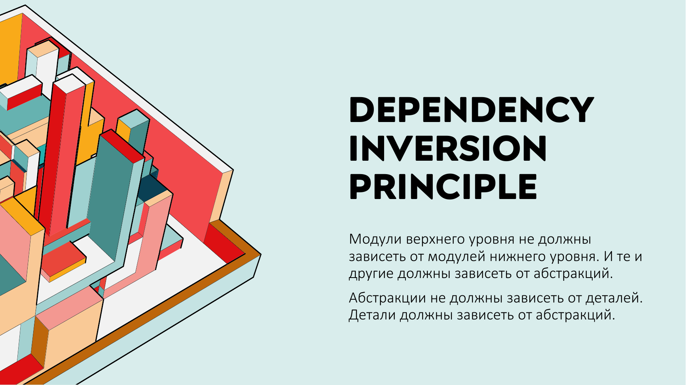
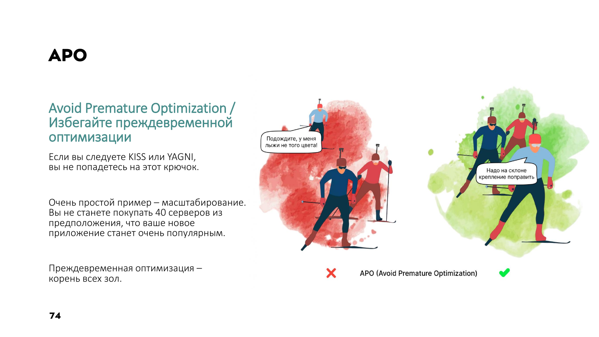

# Лекция 1. КПО. Введение

Меня зовут Ведеин Сергей Александрович. Мы как-то даже с вами виделись год назад, 1 сентября, на Дне Знаний. Вот, я тогда, по-моему, вам рассказывал, насколько важны фундаментальные знания. Сегодня мы с вами начнем курс конструирования программного обеспечения. И, наверное, важность или особенность этого курса, что он поможет вам увидеть, как идет процесс разработки от самого начала его проектирования. приложения до выхода в свет, до диплоя. Мы рассмотрим не просто отдельно взятые темы, а мы сможем увидеть действительно весь процесс проектирования от создания доменной модели до разработки высоконагруженных микросервисных систем. С одной стороны, курс маленький, 14 занятий, 14 лекций, 14 семинаров. Но цель этого курса...

С высоты птичьего полета показать вам, как идет процесс разработки, чтобы вы уже могли на курсовых проектах, которые у вас в третьем-четвертом модулях, применить эти знания. И вы не переживайте, в дальнейшем, на третьем курсе, на четвертом, у вас будут более глубинные погружения в некоторые темы. В базы данных, в разработку клиент-серверных приложений. То есть данный курс, он действительно как старт. такой вашей карьеры в программной инженерии. Можно было бы курс назвать «Системный дизайн», но это действительно так, но «Системный дизайн на минималках».

Значит, что мы сегодня с вами затронем?

### О курсе

Поговорим, ну, о курсе уже поговорили, немного поговорим про парадигмы программирования, остановимся больше на той парадигме, которую вы изучали в первом семестре, объектно-ориентированное программирование. И, наверное, приступим к изучению принципов правильного дизайна приложений. Рассмотрим принципы Solid, Grasp, ну и немного таких советов, как правильно спроектировать доменную модель, как правильно спроектировать взаимоотношения классов.

### Парадигмы программирования

Если говорить о парадигмах программирования, казалось бы, но объектно-ориентированное программирование есть, чего еще надо? Но на самом деле... Вряд ли вы задумывались, и, наверное, вы считаете, что объектно-ориентированное программирование – это эпогей всего, и появилось оно в самый последний момент. Точнее, в самый первый момент, потом появилось функциональное.

На самом деле, все было с точностью да наоборот. Функциональное программирование, которое сейчас достаточно популярно, оно появилось первым. И удивительно, что каждая парадигма, она нам… не дает что-то новое. Она у нас забирает некоторые возможности.

Если говорить о том, что, ну, когда появилось функциональное программирование, оно стало ограничивать нас, где и когда, ну, и вообще, что мы можем изменять переменные. Вот, функциональное программирование гласит или запрещает изменять переменные. Чуть позже функционального в 66-м. появилось объектно-ориентированное программирование. Оно тоже у нас забрало на самом деле некую возможность или стало диктовать, что объекты между собой должны быть зависимы, но эту зависимость необходимо инвертировать. Про это мы будем на второй лекции очень много говорить. Ну и, собственно, структурное программирование у нас забрало, надеюсь, никем не используемый GoTo.

И казалось бы, зачем мы сейчас говорим о столь большом количестве парадигм, если в принципе мы будем изучать ООП?

На самом деле нет. Дело в том, что в каждый момент или для каждой задачи, допустим, мы будем проектировать логику доменного объекта, ну куда там без структурного программирования, будем проектировать взаимоотношения слоев. Мы не сможем там без инверсии зависимости обойтись. Будем проектировать доменные модели по правилам **DDD**. Там мы не обойдемся без функционального программирования. Несмотря на то, что нам действительно необходимо знать множество парадигм, и мы их будем использовать, и все современные языки, они такие уже мультипарадигмальные, все-таки нам необходимо сконцентрироваться сегодня на объектно-ориентированной парадигме, потому что дальше курс будет отталкиваться именно от нее.

И я понимаю, что вы целый прошлый год изучали объектно-ориентированное программирование, поэтому я в целом... смог ужать все в один слайд. Все, что вы изучали, все, что вам нужно знать, что мы можем объявить какой-нибудь объект на основании созданного ранее типа.

## ООП и отношения между объектами

Да и в целом вот оно все ООП. Но нам даже важно не то, что мы можем создать свой тип и на основании этого типа несколько объектов. Нам для конструирования важно понимать, что этих типов много и каким-то образом они будут взаимодействовать. И выражаясь словами классиков, важно, как они взаимодействуют. Потому что способов взаимодействия достаточно много. Возможно, вы, скорее всего, изучали, но не дай бог вы фанатеете, я разочаруюсь в этом, от наследования.

### Наследование

**Слайд 8: НАСЛЕДОВАНИЕ**

::: multi-code "Наследование"
```kotlin
open class User(var id: Int, var name: String)

class Manager(id: Int, name: String, var company: String) : User(id, name)

fun main() {
    val manager = Manager(1, "Ада", "ACME")
    println("${manager.name}: ${manager.company}")
}
```
```csharp
class User
{
    public int Id { get; set; }
    public string Name { get; set; }
}

class Manager : User
{
    public string Company { get; set; }
}
```
```java
class User {
    public int id;
    public String name;
}

class Manager extends User {
    public String company;
}
```
```go
type User struct {
    ID   int
    Name string
}

type Manager struct {
    User
    Company string
}
```

:::



::: warning Текст слайда из PDF
НАСЛЕДОВАНИЕ

class User
{
    public int Id { get; set; }
    public string Name { get; set; }
}

class Manager : User
{
    public string Company { get; set; }
}

Мой нарколог говорил, что первый шаг — это признать,
что у тебя зависимость от наследования.
:::

Наследование – это большое-большое зло, и сегодня мы про это еще поговорим. И от наследования необходимо стараться отвыкать. Стараться переходить к реализации интерфейсов, мыслить более абстрактно. На данном экране мы видим, что действительно здесь **наследование** используется разумно. У нас менеджер расширяет возможности какого-то базового класса юзер, добавляя ему новый функционал. Но не всегда классы взаимодействуют с собой с помощью наследования. Игрок и команда. Но команда явно не наследует характеристики игрока, и игрок не наследует ничего от команды. Но тем не менее они каким-то образом взаимодействуют, а именно игрок, он знает частью какой команды он является.

Поэтому прежде чем у вас созреет мысль, а не применить ли здесь **наследование**, сразу говорите нет, не применить. И начинаете думать, а что? Может быть, это **ассоциация**? Может быть, частные случаи ассоциации, **композиция**, **агрегация**? Но если не то, не то, и все-таки хочется унаследоваться, то подумайте, может быть, это **реализация**?

### Ассоциация, композиция и агрегация

**Слайд 9: АССОЦИАЦИЯ**

::: multi-code "Ассоциация"
```kotlin
class Team

class Player(var team: Team)

fun main() {
    val team = Team()
    val player = Player(team)
    println(player.team)
}
```
```csharp
class Team
{

}
class Player
{
    public Team Team { get; set; }
}
```
```java
class Team {
}

class Player {
    public Team team;
}
```
```go
type Team struct{}

type Player struct {
    Team *Team
}
```

:::



**Слайд 10: КОМПОЗИЦИЯ**

::: multi-code "Композиция"
```kotlin
class ElectricEngine

class Car {
    private val engine = ElectricEngine()
}

fun main() {
    val car = Car()
    println(car)
}
```
```csharp
public class ElectricEngine
{}

public class Car
{
    ElectricEngine engine;
    public Car()
    {
        engine = new ElectricEngine();
    }
}
```
```java
class ElectricEngine {
}

class Car {
    private ElectricEngine engine;

    public Car() {
        engine = new ElectricEngine();
    }
}
```
```go
type ElectricEngine struct{}

type Car struct {
    engine ElectricEngine
}

func NewCar() Car {
    return Car{engine: ElectricEngine{}}
}
```

:::



**Слайд 11: АГРЕГАЦИЯ**

::: multi-code "Агрегация"
```kotlin
abstract class Engine

class Car(private val engine: Engine)

fun main() {
    val engine = object : Engine() {}
    val car = Car(engine)
    println(car)
}
```
```csharp
public abstract class Engine
{ }

public class Car
{
    Engine engine;
    public Car (Engine eng)
    {
        engine = eng;
    }
}
```
```java
abstract class Engine {
}

class Car {
    private Engine engine;

    public Car(Engine engine) {
        this.engine = engine;
    }
}
```
```go
type Engine interface{}

type Car struct {
    engine Engine
}
```

:::



С ассоциацией все понятно.

На самом деле очень распространенная связь между объектами. Есть более узкоспециализированная. Это **композиция**. Правила на самом деле здесь такие. Если вы понимаете, что... Класс точно не наследуется, а каким-то образом включает один в другой. О композиции вы должны подумать в последнюю очередь. Потому что композиция делает действительно очень сильную связь между двумя объектами. Потому что у вас объект внутренний создается вот в этой оболочке. И, соответственно, если класс Car у нас удаляется из памяти, со стека уходит переменная. и, соответственно, Garbage Collector, ну, если мы работаем в Java, либо C-Sharp, управляемых, то двигатель тоже будет удален рано или поздно, потому что ссылок со стека на него нет.

Вот, поэтому **композиция** достаточно жесткая, регламентирующая связь. Нельзя сказать, что ее совсем не бывает. Вот, мы с вами уже буквально на первом семинаре увидим варианты и композиции, и агрегации ассоциаций. Альтернатива композиция... Это **агрегация**.

На самом деле она максимально распространена, и мы до следующей уже лекции будем рассуждать о том, каким образом мы объект, который агрегируется, в данном случае двигатель, можем передать через конструктор, через свойства, и будем рассуждать о внедрении зависимых объектов. Если, да, я говорю, **наследование** это плохо, а какая альтернатива?

### Реализация и интерфейсы

**Слайд 12: РЕАЛИЗАЦИЯ**

::: multi-code "Реализация интерфейса"
```kotlin
interface IMovable {
    fun move()
}

class Car : IMovable {
    override fun move() {
        println("Машина едет")
    }
}

fun main() {
    val movable: IMovable = Car()
    movable.move()
}
```
```csharp
public interface IMovable
{
    void Move();
}

public class Car : IMovable
{
    public void Move()
    {
         Console.WriteLine ("Машина едет");
    }
}
```
```java
interface IMovable {
    void move();
}

class Car implements IMovable {
    public void move() {
        System.out.println("Машина едет");
    }
}
```
```go
type IMovable interface {
    Move()
}

type Car struct{}

func (Car) Move() {
    fmt.Println("Машина едет")
}
```

:::



Но одна из альтернатив – это **реализация**. Реализация абстрактного класса или реализация интерфейса сейчас пообсуждаем. Но давайте обратим внимание, что такое реализация. Это совсем не **наследование**. Реализация больше подходит как укол с суперсилой. Вот, к примеру, вы проектируете... систему для зоопарка. У вас есть базовый класс животное, травоядное, хищник. Оттуда пошли какие-то конкретные уже животные. А потом директор зоопарка говорит, слушайте, я хочу организовать контактный зоопарк. Мне нужно создать список из животных разных. Вот из хищника можно взять кошку, из травоядных он там свинью. А еще я купил... В Японии купил этого робота-пса электронного. И вот он тоже пусть играет с детьми в контактном зоопарке. Ну куда мы его по наследству?

Отдадим к хищникам травоядным? Нет. Это вообще какая-то вещь, которая инвентаризируется на предприятие, но она тоже умеет играть. И вот интерфейсы это как раз такая суперсила. Мы говорим, ты робот-кот, умеешь играть. Ты, свинья, умеешь играть, и ты, хорек, тоже умеешь играть. Ты реализуешь интерфейс, вы не родственники, но у вас один и тот же укол с суперсилой. Вот к реализации интерфейсов можно отнестись так же.

### Интерфейсы vs абстрактные классы

**Слайд 14: ОБЕЗЬЯНА**

::: multi-code "{" {playground=off}
```kotlin
interface Movable {
    fun move()
}

class Car : Movable {
    override fun move() = println("Машина едет")
}

class Bus : Movable {
    override fun move() = println("Автобус едет")
}
```
```csharp
{
               public abstract void Move();
           }

           public class Car : Vehicle                Car, наследуемый от класса
           {                                         Vehicle
               public override void Move()
               {
                   Console.WriteLine("Машина едет");
               }
           }

           public class Bus : Vehicle               Bus наследуемый от класса
           {                                        Vehicle
               public override void Move()
               {
                   Console.WriteLine("Автобус едет");
  14           }
           }
```
```java
interface Movable {
    void move();
}

class Car implements Movable {
    public void move() { System.out.println("Машина едет"); }
}

class Bus implements Movable {
    public void move() { System.out.println("Автобус едет"); }
}
```
```go
type Movable interface {
    Move()
}

type Car struct{}
func (Car) Move() { fmt.Println("Машина едет") }

type Bus struct{}
func (Bus) Move() { fmt.Println("Автобус едет") }
```

:::



**Слайд 15: ПРОГРАММИСТ**

::: multi-code "public interface IMovable" {playground=off}
```kotlin
interface Movable {
    fun move()
}

class Car : Movable {
    override fun move() = println("Машина едет")
}

class Bus : Movable {
    override fun move() = println("Автобус едет")
}
```
```csharp
public interface IMovable
              {
                  void Move();
              }

              public abstract class Vehicle : IMovable
              {
                  public abstract void Move();
              }

              public class Car : Vehicle
              {
                  public override void Move() => Console.WriteLine("Машина едет");
              }

              public class Horse : IMovable
              {
                  public void Move() => Console.WriteLine("Лошадь скачет");
              }
```
```java
interface Movable {
    void move();
}

class Car implements Movable {
    public void move() { System.out.println("Машина едет"); }
}

class Bus implements Movable {
    public void move() { System.out.println("Автобус едет"); }
}
```
```go
type Movable interface {
    Move()
}

type Car struct{}
func (Car) Move() { fmt.Println("Машина едет") }

type Bus struct{}
func (Bus) Move() { fmt.Println("Автобус едет") }
```

:::



Но ведь у нас есть абстрактные классы, а в C++ есть только абстрактные классы. И не знаю, плачут, не плачут программисты без интерфейсов. И вопрос, а тогда в чем же разница? Абстрактный класс или интерфейс? Я тоже ответа не знаю, как и Оракул. Но я знаю одну притчу, которая была. Однажды у разработчика языка C-Sharp спросили, почему вы запретили множественное **наследование**. Ну, тогда было очень много слухов, что в принципе наследование запретят. Он сказал, говорит, однажды я смотрел по BBC передачу, и там... Обезьянку посадили в клетку. В одном углу клетки поставили ведро с бумагой и поджигали. В другом углу поставили ведро с водой. Обезьянка додумалась, что можно потушить. В ведро с водой взять и потушить огонь. И ей давали банан.

Через месяц, она уже привыкла, а через месяц ей сделали бассейн с водой. Плот. На плоту ведро с водой, к которому она привыкла. Поставили ведро с песком, огнетушитель. Поставили пустое ведро. Разумный человек бы что взял? Либо огнетушитель, либо в конечном счете пустое ведро набрал бы с бассейна воду и потушил. Бедная обезьянка плыла по воде на этот плот, плыла обратно и тушила. И он сказал, что... Вы, если будете продолжать мыслить не абстрактно, то есть мыслить конкретными предметами, вот видели всю жизнь вы ведро с водой, видели этот тип данных, и не осознаете, что у ведра с песком есть свойство тушить, у пустого ведра, если набрать воду, есть свойство тушить, у огнетушителя есть свойство тушить, его можно применить над тем костром.

И он сказал, что если вы... будете продолжать мыслить максимально не абстрактно, то вы будете как та обезьяна. И к слову, вот код, который похоже, что могла бы написать обезьяна, либо чат GPT. У нас есть движущее средство. Это абстрактный класс. Вот к вопросу, где грань между использованием реализации абстрактного класса и интерфейса. Вроде бы это одно и то же. Но смотрите. Здесь абстрактный класс с абстрактным методом. Ну, в терминологии это полностью интерфейс, можно сказать. Но мы не используем интерфейс. Мы ограничились абстрактным классом. И здесь в автомобиле и в автобусе пишем реализацию. Все хорошо до тех пор, пока не появляется лошадь. Как только появляется лошадь, она явно не наследник транспортного средства. Но она тоже может двигаться.

И тогда... Ну, можно сказать, вы осуществили промах. И программист, который мыслит абстрактно, он должен был предусмотреть, что у нас действительно будут сущности, которые могут двигаться. Да, есть ряд сущностей, такие как автомобиль и автобус, которые являются транспортным средством. Но хорошо, тогда мы говорим суперсила движения, она будет у любого транспортного средства. и автомобиль будет реализовывать эту абстракцию. Но лошадь, она не является наследником транспортного средства. Она просто может обладать суперсилой перевозить груз. Вопрос?

### Принцип Лисков

Да, вот тут ответ будет скрываться в принципе Барбары Лисков.

Собственно, сводится он к тому, что либо вы должны обладать экстрасенсорными способностями, либо неким жизненным опытом именно в проектировании. Но другого, к сожалению, предусмотреть тут нельзя. Но есть некоторые решения. Вот как раз об этом, по сути, и вся оставшаяся лекция. А как же не сделать оверинжиниринг? Потому что действительно можно наколошматить кучу интерфейсов, а потом эта гибкость не нужна. И вот все правила, которые мы сегодня будем проходить, начиная от Solid, Grasp, Kiss, Dry, они все о том, как найти баланс между оверинжинирингом и каким-то разумным кодом. Поэтому я так сходу не отвечу, в какой момент нужно вводить очередной... Нет, отвечу.

Когда вы понимаете, что текущую задачу... нельзя решить уже без дополнительного слоя абстракции, тогда мы вводим новые интерфейсы. Ну вот, к примеру, у вас есть класс с бизнес-логикой, который работает с базой данных. Но вы же понимаете, что база данных может быть сегодня PostgreSQL, завтра MSSQL. Но, соответственно, нужен дополнительный слой абстракции iRepository, который будет предоставлять нам методы, а потом уже конкретные реализации разных репозиториев, которые работают с разной базой. То есть, внедряя дополнительный уровень абстракции, мы решаем назревшую проблему. Но с опытом вы начинаете видеть, что, как говорил доктор Хаус, все врут. И заказчик, который говорит, нет-нет, мне нужно только вот это, он явно врет.

Через месяц он придет и скажет, а еще надо вот это и вот это. Ну и вот обладая насмотренностью, вы будете более правильно подходить к выбору, а где же здесь интерфейс, а где же действительно можно выстраивать большую иерархию. Но сходу, наверное, этого не читая книги и не разбирая труды. которые мы будем сегодня рассматривать, достаточно сложно предугадать. Но все ошибаются. А, я, кстати, сделал небольшое... Но мои доводы, конечно, можно разбить в пух и прах. Но как отправная точка они действительно имеют право жить. Абстрактные классы мы используем, когда мы действительно видим какую-то взаимосвязь иерархическую, родственную. Ну вот животные, хищные, травоядные, лошади, коровы.

А интерфейсы, когда мы хотим спроектировать небольшой функционал, который может быть у разных иерархий. Вот, наверное, это отправная такая точка, которую нужно в голове держать.

Теперь мы действительно вспомнили все. И можно переходить к принципам дизайна. Мы разберем... Практически все самые важные, которые на слуху, solid grasp, ну и несколько еще вспомогательных таких правил, которые позволяют нам, которые, кстати, противоречат иногда предыдущим принципам, но тем не менее нужно всегда их тоже держать в голове. Но это не значит, что в любой программе необходимо реализовывать абсолютно все принципы. Иначе, реализуя все принципы, вы добьетесь лишь одного. Это overengineering. Если у вас будет мало абстракций, то есть действительно просто класс, который работает с другим конкретным классом с базой данных. Класс бизнес-логики работает с классом базы данных. Нет абстракций.

Это приведет к тому, что расширение проекта... дальнейшая его поддержка будет чревата. Вам придется выпиливать класс, писать другой, изменять тот класс, который пользовался тем, который вы удалили и переписали. То есть будет такой эффект бабочки. В одном месте подправили, все сломалось. Если у вас есть определенные уровни абстракции, которые разрывают связь между слоями, то замена одной реализации на другую будет менее болезненно. Но в то же время, если у вас уровень абстракции высокий, то эта чрезмерная сложность, эта гибкость, которая, возможно, вам и не нужна, ни к чему хорошему не приведет. Порог входа в проект будет тяжелый. У нас были проекты, где мы архитектору давали неделю, чтобы он просто начал понимать, что там происходит в этом проекте.

Это был оверинженеринг. То есть так не должно. Человек с опытом 10 лет не должен неделю разбираться в вашем коде, который вы там год писали. Поэтому мы должны всегда соблюдать баланс между низким уровнем абстракции и высоким уровнем абстракции.

Собственно, об этом и есть курс архитектуры. Вот здесь изображена матрица Эйзенхауэра, по-моему, 34-й президент США. Когда его спросили, как вы выстраиваете свой рабочий день, он говорит, я все задачи делю на два типа, которые важные и важные-неважные, срочные-несрочные. Ну, отсюда строю вот такую матрицу, и, понятное дело, что важно и срочно мне приходится делать в первую очередь. То, что неважно и несрочно я могу делегировать или не делать. Но вопрос всегда, а что делать в первую очередь? С или Б? И вот эта матрица идеально подходит. Ее в книжке «Чистая архитектура» объясняет дядюшка Боб, Роберт Мартин.

Он говорит, что для программиста, именно для того человека, который... пишет и создает архитектуру, которая отвечает за качество кода, не продакт-менеджер, который продает функциональность заказчику, которому нужно быстрее выпустить продукт, а вот именно для программиста всегда, если выбор между C и B, B необходимо делать в первую очередь, потому что подважна эта архитектура. Если архитектура в приложении есть, то вы любую ошибку, любое изменение требований сможете исправить моментально. Соответственно, если у вас выполнено важно, но в первую очередь, то что не срочно, но важно, то есть построена правильная архитектура, вы без проблем всегда выполните. какие-то неважные срочные задачи. Допиливание фич, изменения ТЗ.

Потому что ваша правильная архитектура способна выдержать любой такой долгосрочный проект с какими-то постоянными изменениями. Поэтому, будучи частью команды, архитектор всегда должен отстаивать квадрат B. И борьба в хорошем смысле должна быть с продакт-менеджером, отстаивать С и говорить, что надо запилить функционал. Нет, надо выстроить правильную архитектуру, и потом мы сможем быстрее запилить функционал. Но, конечно, нет таких точных, прям однозначных ответов, что делать в первую очередь, что во вторую, но и как, собственно, делать правильно. Но наш курс попытается на это ответить.

## Принципы дизайна SOLID и GRASP

А начнем мы с самых базовых таких дизайн-принципов. Которые как раз описал Роберт Мартин. И чуть раньше не то, что то же самое, но написал Лорман принципы ГРАСП. В целом эти принципы об одном и том же. Но про солид слышали наверняка, практически хотя бы видели аббревиатуру. Все про ГРАСП нет. Дело в том, что у Роберта Мартина, он же дядюшка Боб, хорошая способность объяснять все досконально и с простыми словами. И он, описывая принципы Солид, описал их очень доходчиво. В отличие от Грасп.

- Во-первых, в Солиде всего лишь, судя по анаграмме, пять принципов.

В Граспе их ближе к десяти. И они очень... слишком мелкие и описывают больше какие-то конкретные решения. Solid – это идеология, как правильно проектировать взаимоотношения классов. Это не архитектурные паттерны. Это действительно дизайнерские паттерны по проектированию, можно сказать, доменных объектов. А классические...

Давайте мы начнем с Solid. Классический вот Solid, его так и объясняют. Берут первый... букву из анаграммы, вторую, третью, четвертую, но проблема возникает, когда мы рассмотрим букву О, а потом будем рассматривать букву ДИ. Дело в том, что буква О, принцип открытости-закрытости, он реализуется через принцип ДИ. Поэтому мы рассмотрим немножко в другой последовательности. Принцип открытости-закрытости оставим напоследок, а начнем вот с таком. Конечно, не слишком звучно получилось, да, там солит глыба, но зато будет более понятно.

Начнем с принципа единой ответственности. Звучит он, в принципе, несложно. Класс должен иметь одну и только одну причину для изменения. Вопрос, что это за причина? Мне проще всегда относиться к причине. Как, ну, не знаю, человек, который к вам придет, допустим, бухгалтер, и скажет, сделай вот это, вот это. Вот он причина изменения этого класса. А если потом начальник отдела юридического придет и скажет, а мне надо еще вот это, вот это, и вы понимаете, блин, тот же самый класс. Получается, вот эти два человека, это и есть две причины для изменения вашего несчастного класса. Получается, что в чем проблема? Получается проблема в том, что когда вы хотелки юриста делаете, вы наверняка что-то повредите.

Как эффект бабочки это распространится на другие части. А потом еще вы начинаете этот же класс исправлять для хотелок бухгалтера. Ну вот к примеру возьмем, смотрите, какой-нибудь бухгалтер говорит.

Давайте вот к Новому году сделаем систему премирования. Нам необходимо, чтобы вы, товарищ программист, сформировали отчет. Буквально самый примитивный, потому что больше премий никогда не будет. Нам надо разово эту программу использовать. Деньги в конце года избавятся. Поэтому на коленке напиши код, который будет пускать в консоль, в черный экран, выводить фамилии тех, кому необходимо выписать премии. Вы так наивно спрашиваете. Точно там, но только на экран и всё? Да, да, да. Ну и, собственно, вам говорят, ну там навигацию небольшую сделай, чтобы мы могли вперёд, назад. Вы понимаете, вы верите, делаете самую главную ошибку, вы верите. Вот сколько вас не учил, да, но вот вы поверили. И сделали такой класс. Вроде бы всё шикарно.

Есть некоторые небольшие возможности по навигации. И есть метод print, который будет печатать этот отчет. Но потом прибегает директор и говорит, блин, я не буду в эту консоль смотреть, сделай нормально мне в pdf, чтобы сформировался pdf файл. И я буду там у себя на мобильном телефоне смотреть. Вы такие, ну ладно. И начинаете... к методу принт добавлять, печать в PDF. Потом еще, конечно, захотят люди печать в принтер, вы, возможно, сразу это делаете. То есть вот у вас одна причина, один человек, который заставил вас изменить класс. А потом приходит бухгалтер и говорит, слушайте, мне навигация неудобна, мне необходимо по четным страницам устроить навигацию. Вот такой вот я больной, буду смотреть только четных людей.

Смотрите, мы явно видим две причины для изменения, и это плохо. И принцип единой ответственности говорит о том, что если вы начинаете замечать, что у класса действительно много причин, то надо их разделять. Как вариант, можно было бы разделить отдельно на класс Report и отдельно на класс Printer. Но при этом нужно подумать, кто кого будет в себя внедрять. Но в данном случае принтер будет внедрять как зависимость репорт. Второй метод, честно, мы его не соблюдаем. Да его, в принципе, настолько сложно соблюдать, что его, по-моему, никто не соблюдает. Его даже понять сложно было, пока дядюшка Боб не написал нормальным человеческим языком принцип подстановки Барбары Лисков. Потому что Барбара, она великий математик. И она формулой написала этот принцип.

Там ни одного слова, там просто формула математическая, которая объясняет, что если ваш... Слово дядюшка Боб приводит такой пример. Берет резиновую уточку программистов и говорит, если у вас в руках утка, которая выглядит как утка, которая крякает как утка, Но для того, чтобы она крякала, ей нужны батарейки, значит, это не утка.

Значит, это не наследник реальной утки. Это какая-то другая сущность. Она не может быть такой же, как и настоящая утка. Ну, собственно, об этом-то и принцип. Ну вот, представим, тут будет у меня немножко серия из роботов. Робот-отец, робот-сын. Наследники, которые нарушают принцип подстановки Барбары Лискол. Если отец делает кофе, а сын может приносить только молоко, Но тоже приносить. Отец-робот приносит кофе. У сына-робота тоже есть метод приносить. Но он реализует этот метод иначе. Он реализует его, принося молоко. Поэтому если кто-то в кафе попросит робота-сына вместо отца принести кофе, а тот принесет молоко, вот с точки зрения Барбары Лискоу, идиоты те, кто так унаследовался. Но с другой стороны, а как? Смотрите, вот реальный пример.

Ну, он немножко заезженный. Прямоугольник. Высота, ширина. Все мы знаем, что квадрат – это частный случай прямоугольника. Почему бы нам не унаследоваться? Ведь логично было бы создать квадрат, который наследуется от прямоугольника, просто он переопределяет сеттер. Метод, который задает высоту и ширину. Но переопределяет его так, что у квадрата высота равна ширине. И поэтому, меняя ширину, меняется высота, меняя высоту, меняется ширина. Шикарный класс. Площадь по-прежнему, как и в базовом классе, мы даже ее не трогали, не переопределяли, да она и не виртуальная. Площадь работает, у квадрата все должно высчитаться. Но смотрите. А теперь добрый тестировщик пишет автотест. Он вызывает **тестирование**.

То есть он создает на стеке переменную прямоугольник, чтобы она смогла быть проброшена в метод на **тестирование**. Куча у нас квадрат. Ну, полиморфизм типов. На первом курсе вы проходили, да? Так, значит, двигаемся дальше. Так вот, с точки зрения тестировщика, Раз он работает с прямоугольником, тестировщик не должен думать о том, что ему прилетит. Если сказано, что у прямоугольника есть возможность высота, которая считает площадь, высота умноженная на ширину, он задает высоту, задает ширину и ожидает 5 умноженное на 10. И если это не будет 50, значит у нас проблемы. Разумеется, передав квадрат, у нас будут проблемы. Потому что, когда мы будем перебивать десяткой, высота тоже перебьется десяткой. И 10 на 10 мы получим 100, а не 50.

Но вы понимаете, к чему я. Барбара Лисков скажет, что кто дурак, программист, который спроектировал вот такое **наследование**. И в целом, да, в целом можно было бы сказать, что а давайте... расчет площади, это будет не базовой функциональностью, а будет возможностью. Какой-то интерфейс, который считаем, у которого есть метод GetArea. Вот. И этот интерфейс реализует квадрат, этот интерфейс реализует прямоугольник, круг тоже реализует этот интерфейс. И в целом, да, мы как бы могли бы сказать Барбаро Лиско, отстань от нас. Все. Мы не нарушаем твой принцип. Но в то же время наследование иногда полезно. И вот когда есть наследование, очень часто нарушается принцип Барбара Лискова.

Но у нас есть род, которым мы можем говорить, и мы можем подойти к тестировщику и сказать, слушай, аккуратней, если тебе в ректангл прилетит конкретно тип квадрат, то поступи вот так, а если это прямоугольник, то будет вот так. Окей? И вам не переписывать всю иерархию, и ему не сложно. И вроде бы мы нарушаем принцип Барбары Лискова, но она же не стоит, за спиной не видит. Поэтому ошибки в наследовании, они будут всегда. И вот отвечая на вопрос, а как? Ну, либо вангой быть и предугадывать что-то. Ну, либо просто иметь какую-то начитанность, насмотренность в проектной работе и примерно понимать, что... Да по сути у любого заказчика бизнес либо это купи-продай, в худшем случае, в лучшем что-то создай и продай.

Поэтому и выгорание через 10 лет у программистов случается, потому что надоедает. Поэтому в целом процессы очень часто одни и те же, и со временем начинаешь понимать, как будет развиваться проект. Но чтобы также мы можем программировать на основании контрактов, То есть реализовывать как можно больше интерфейсов и программировать через **тестирование**. Это у нас будет в курсе дальше. Возвращаемся к принципам. Принцип разделения интерфейсов. Но здесь на самом деле все просто. Еще Наполеон сказал разделяй и властвуй. Вот у нас то же самое. Если мы двум разным роботам скажем выполнить одну и ту же инструкцию, но в этой инструкции будет пункт, который один из роботов выполнить не может. Это плохо.

Но мы можем же взять эту большую инструкцию, разделить на две, и сказать, вот тебе, у которого нет антенн, делай эту инструкцию, а ты давай крути антеннами.

Давайте пример посмотрим. Ну, допустим, опять же, скоро там, ну, не скоро, но Новый год. И какой-то негодяй заказчик говорит, а давайте мы перед Новым годом сделаем систему... Спам-рассылки. Вот. И у вас все такое злоба, и вы говорите, конечно. И, ну, вы понимаете, что надо мыслить интерфейсами, потому что вдруг у нас будут разные реализаторы e-mail-месседжа. Вы вводите интерфейс, iMessage. Вы говорите, будет, но что делает почта? Она отправляет кому, от кого и тема письма и текст. Вот, все, мы это вынесли в интерфейс. Мы реализовали. Все шикарно. Но помните, да, все врут. И когда вы его даже спросили, ты только спамить будешь смс, емейл, он такой, да-да-да.

Потом появляется, он говорит, слушайте, у меня вот пользователи магазина динозавры, они еще и смс-ки читают.

Давайте мы еще и смс-ками будем спамить. Смотрите, что мы делаем. Мы в интерфейс. iMessage заложили изначально гораздо больше, чем нам надо. Но у смс-ок нет сабжекта. Поэтому, когда мы будем реализовывать у текстового сообщения тот большой интерфейс, который мы изначально заложили, не разделив его на маленькие, нам придется написать not implemented exception. Ну, как бы, один раз можно. Но потом он вернется и скажет, слушайте, Есть еще голосовые. Вы такие, блин, это я не предусмотрел в интерфейсе. Но я же буду упарываться дальше. Я не знаю принцип разделения интерфейсов. Я буду добавлять в интерфейс все новые и новые методы, все новые и новые API. Добавили.

Получается тогда в предыдущих классах, а именно в e-mail, нам придется опять кинуть not implemented exception. В то же время войсу не нужен текст и сабжект. Ну, вы понимаете, да? Так может продолжаться вечно, если вам когда-то не подсунут книжку дядюшки Боба и не скажут, не прочитай. Прочитав, вы поймете. Слушайте, ну, общее есть у всех. Это от кого кому и отправить. Делаем базовый интерфейс. Слава богу, интерфейсы могут наследоваться, еще и множественное **наследование** может быть. Поэтому дальше просто начинаем раскручивать базовый интерфейс, в зависимости от того, какой дополнительный функционал начинает предоставлять новый, и добавляем, добавляем, добавляем. Ну и таким образом в дальнейшем мы реализуем каждым классом соответствующий интерфейс.

С одной стороны они реализуют один интерфейс iMessage, потому что он базовый. И в случае, если нам нужно будет собрать объекты в коллекцию, без проблем соберем. Или пробросить в какой-то метод, пробросим на основании того, что они все являются реализаторами iMessage. Ну а дальше можно уточнить будет тип. А теперь самый важный, наверное, принцип. Это Dependency Inversal принцип. На следующей лекции мы будем разбирать... что же такое DIP, **DI-контейнер**, EOC-контейнер, но все это основано на принципе DIP.

Переходим к самому важному принципу, принцип Dependency Inversal Principle. Вся вторая наша лекция будет посвящена этому принципу. Но сейчас давайте попытаемся ухватить самую ключевую идею. Вернемся к нашим роботам. С одной стороны, есть робот, который умеет резать пиццу. А хотелось бы, чтобы у нас был робот, которому можно было бы поменять инструмент. Смотрите, принцип гласит, высокоуровневый класс не должен зависеть от низкоуровневого, а должен зависеть от его абстракции. То есть если у нас робот будет зависеть от инструмента, ну как бизнес-логика зависит от конкретного репозитория. И все, мы тогда уже не сможем их никогда разделить. не сможем подсунуть другую реализацию нашего репозитория, который работает с другой базой.

Мы должны проектировать так, чтобы робот должен зависеть от абстракции, от интерфейса, от абстрактного класса. А под эту абстракцию мы могли бы подсунуть любую реализацию. Поэтому вот эта формулировка, которая выглядела достаточно сложно. Модуль верхнего уровня не должен зависеть от модуля нижнего. Ну, верхний уровень это тот, кто работает с нижним. Если в слоистой архитектуре, то верхний слой не должен зависеть от более низкого слоя. Он должен зависеть от абстракции. Ну и, соответственно, нижний слой тоже должен зависеть от абстракции, а не от верхнего уровня.

Давайте на коде это будет чуть-чуть понятней. Возьмем пример. Библиотека. просит нас сделать информационную систему, которая бы выводила все наши книги на консоль. Мы верим. Говорим, на консоль? Они такие, да. Мы говорим, вообще мы не верим. Мы все-таки верим здесь. Мы действительно создали консольный принтер, который ассоциируется с классом Book. То есть класс Book включает в себя консольный принтер. Но все вроде бы шикарно. В этот консольный принтер, когда вызываем метод print, мы можем передать текст. Но рано или поздно заказчик придет и скажет. Слушайте, консольный принтер это странно.

Давайте куда-нибудь в формат PDF, HTML. Ну, HTML разумно. Вы говорите, хорошо, я сделаю еще один класс. Но теперь вы должны будете пересобрать. тот класс верхнего уровня, потому что вы хотите подсунуть более низкоуровневый класс, который включен в высокоуровневый класс. Здесь высокоуровневый – это тот, кто включает. Можно рассуждать, этот принцип применим не только к классам, но и к модулям.

Дальше мы будем рассуждать, когда будем переходить к архитектурным решениям, именно что модули должны тоже соблюдать этот принцип. И модуль верхнего уровня не должен зависеть от модуля нижнего. И тот и другой должны зависеть от абстракции. Но здесь проблема. Мы написали, но поменяли, перекомпилировали. Но мало того, что в принципе могла быть какой-то вот этот эффект бабочки, который повлияет на другие части программы. Но самое что плохое, мы не имеем возможности в динамике менять принтер. А хотелось бы. Хотелось бы, чтобы у человека, который выбрал книгу в информационной системе, мог сказать, распечатайся через этот принтер, либо подсунуть ей другую реализацию, прямо в рантайме, прямо в момент выполнения.

Это можно сделать через управление внедрением зависимостей. Смотрите, мы вводим интерфейс iPrinter. Наш консольный принтер и HTML принтер реализуют этот интерфейс. У нас теперь есть абстракция, и модуль верхнего уровня, книга, зависит теперь будет от абстракции. А раз он зависит от абстракции, а не от реализации, значит в эту абстракцию мы можем подсунуть любую реализацию. И вот мы это делаем. Мы создаем класс книга, а потом, прямо в момент создания, делаем внедрение зависимого объекта через конструктор. Это очень важно, потому что большинство DI-контейнеров, которые мы будем проходить на следующей лекции, и на следующем семинаре работают через внедрение через конструктор. Но ниже идет внедрение через свойства. Это тоже один из принципов DI.

Внедрять мы можем и через свойства. Внедрять можем и через методы.

На самом деле там 4 варианта внедрения зависимых объектов. Но это вынесем на следующую лекцию. Но принцип, я думаю, вы уяснили, что нельзя, чтобы ваш класс высокого уровня... содержал в себе какую-то конкретную реализацию. Высокий уровень должен зависеть от абстракции. Ну вот как у робота. Я могу работать с любым инструментом. Это **реализация**. Если я говорю, что ты умеешь работать с маркером, только я завишу от реализации. А я должен зависеть от абстракции. Некий пишущий инструмент. Могу взять ручку, могу взять маркер. А вот теперь помните, мы букву О вырвали из солида и в конец ее. Смотрите, звучит противоречиво. Класс должен быть открыт для того, чтобы вы его изменяли, ну, расширяли его возможности, но в то же время он должен быть закрыт.

Так вот, как открыт или закрыт? Вроде бы мы должны его сделать открытым, чтобы можно было его менять, но с другой стороны... мы должны запретить его менять. Но наращивать функциональность он должен. Выглядит все на самом деле страшно, но **реализация** примитивна и ее всегда желательно придерживаться. Вот здесь показано, что робот умел делать только одну функцию. Нам пришлось его аварийно ведутся работы остановить, переписать, перепрограммировать, чтобы он мог делать другую работу. Может быть, не совсем идеальная картинка. Принцип открытости-закрытости говорит о том, что если появляется новый инструмент, этот робот умеет и с ним работать.

Потому что робот за счет принципа Dependency Virtual Principle, он в принципе умеет работать с любой абстракцией под названием инструмент. Поэтому наш робот будет расширять свою функциональную возможность благодаря появлению новых инструментов. Но самого робота мы не перепрограммируем. Картинка не очень, в коде будет лучше.

Давайте рассмотрим такой пример. Памяти у вас, к примеру, из-за тяжелой учебы нет, чтобы запомнить, как готовить ужин. И вот вы решили написать, так как вы программисты, решили написать некую поварскую книжку, которая бы вам выдавала рецепт, инструкцию, как приготовить ужин. Но вбили вы картофельное пюре. Через недели две вам уже плохо от этого картофельного пюре, и вы понимаете... Что сделать? Надо еще один рецепт. И вы добавляете еще один метод. Вы нарушаете принцип открытости-закрытости. Вы модернизируете класс, чтобы он получил новую возможность. Это плохо. Как надо? Надо как-то научить класс видеть новые возможности, но не изменять себя. Реализуется это как раз за счет двух ранее пройденных принципов.

Давайте рассмотрим. Вот у нас есть... Все та же поварская книга, но теперь обратите внимание, поварская книга работает согласно принципу DIP, работает с абстракцией. Она принимает на вход некое блюдо IMU, блюдо, которое реализует этот интерфейс.

### Single Responsibility Principle

**Слайд 45: DEPENDENCY**



И, соответственно, вы создаете отдельные классы согласно принципу Single Responsibility. Вы создаете классы, которые отвечают за готовку пюре, которые отвечают за готовку салата. Они реализуют этот интерфейс, следовательно, вы можете подсунуть за счет dependency-inversal принцип, подсунуть его в кулинарную книгу. Ну а дальше, соответственно, вызвать определенный, ну, передав определенное блюдо, вы говорите, кулинарная книга, приготовь. И в зависимости от того, какое вы блюдо передали, картофельное пюре, салат, то и будет готовиться. И вы можете продолжать создавать все новые и новые классы, новые блюда, но тот класс вы трогать теперь никогда не будете, можете его скомпилировать и забыть.

Он закрыт для модификаций, но в то же время он продолжает быть открытым для наращивания своих функциональных возможностей за счет появления новых типов. Но на самом деле реализации... принципа открытости-закрытости очень много. И когда мы будем разбирать паттерны GOV, мы увидим, вот это на самом деле я уже демонстрирую паттерны GOV, но не буду сейчас акцентировать внимание. Еще один из вариантов. Да, мы прописываем метод, в котором есть определенные шаги. Они у нас абстрактны, а это значит, что тот, кто будет создавать класс и наследоваться, обязан будет реализовать. Вот тут, кстати... Один из тех случаев, когда интерфейс нам не поможет, нужен именно абстрактный класс.

Дальше мы создаем блюда, которые реализуют эту стратегию. Ну и, соответственно, в дальнейшем мы можем передать эти блюда в поварскую книгу, либо повару. Ну и он, соответственно, будет вызывать. Мы можем массив этих блюд передать, он вызывает. Ну и, соответственно, у нас блюдо готовится. Не то чтобы в противовес. Я бы сказал, что просто другими словами, пятью годами ранее Лорман описал другой набор принципов, принципы ГРАСП. Их много, но мы их будем проходить, и когда будем разбирать паттерны ГОВ, сейчас я бы хотел заострить внимание на самых двух важных этих идеологий принципов ГРАСП.

### GRASP: сцепленность и связанность

Это принцип... высокой сцепленности и низкой связанности. О чем они?

На самом деле они об одном и том же. Можно пример на мои руки посмотреть. Вот смотрите. С одной стороны у меня пальцы обладают высокой связанностью. Они приклеены к ладони. А между собой две ладони. обладают низкой сцепленностью. И получается, что я могу одну руку заменить на другую, и это не повлияет на левую.

Давайте в программировании это будет наглядней. Так, значит, с одной стороны, не нужно уходить в крайность, не нужно совсем стремиться обнулить связанность. Потому что, если уж возводить до абсолюта этот принцип, то тогда можно писать все в одном классе. Тогда действительно у нас будет низкая связанность, и мы никоим образом, одна рука не будет зависеть от второй, потому что у нас будет в принципе одна рука. Нет второй руки – нет проблем. Но все-таки ООП придумали, чтобы снизить уровень понимания. Поэтому нужна всегда грань.

И хороший класс – это тот, который внутри себя. реализуя какую-то бизнес-логику, обладает действительно высокой сцепленностью, ну вот рука, она удобна, чтобы взять ложку, выполнить задачу, но в то же время руки иногда приходится поздороваться с другой рукой или положить ложку в раковину, выполнить другую задачу, которую, ну или передать что-то, передать какие-то переменные другому классу, который выполняет, умеет это выполнить, эту задачу. Поэтому слева, ну вот вам цвет не виден, но вот тут зеленая точка, это публичный метод, который будет осуществлять связь с другими классами. Но приватные методы, они как бы нацелены решить какую-то задачу внутри класса, какой-то use case.

И вот правильно спроектированный класс, это тот, который обладает внутри себя хорошей связанностью, но между классами слабой сцепленностью. Ну вот на картинке видно. Вверху это правильно спроектированный класс. Принципы сцепленности и связанности соблюдены. А внизу, тут явно возможно это вообще был один класс и зря его разделили на два. И смотрите, в чем интересный нюанс я заметил. Что если смотреть на Grasp и Solid, то они в принципе об одном и том же. Высокая сцепленность и связанность. В солиде это тоже все говорится. Но единая ответственность это что? Нужно разделять классы, если они все-таки независимы друг от друга. Разделять интерфейсы для того, чтобы обеспечить низкую связанность. Ну и так далее.

Устойчивость к изменениям это открытость-закрытость. В Граспе об этом тоже говорится. Полиморфизм это принцип Лискоу. что нужно использовать как можно больше интерфейсов, чтобы соблюдать полиморфизм типов. И действительно, и Solid, и Grasp, у них такие общие постулаты есть, что мы должны создавать простые типы, мы должны, когда класс усложняется, мы должны его разделить на два. Точки соприкосновения классов должны быть, или модулей должны быть реализованы через интерфейсы. И это разумное, на самом деле, написание программ. Если посмотреть, а где в этой пирамиде находятся принципы GRASP и SOLID, ну, да, это некая надстройка над OOP. Но помимо этих принципов есть, конечно, еще и конкретные фреймверки для... Ну, есть более мелкие решения.

Это шаблоны GOV. И есть... Еще более мелкие решения для корпоративного сегмента, для параллельного программирования. Но принципы Solid и Grasp мы должны соблюдать независимо для чего и для каких систем мы пишем. Потому что это максимально абстрактный дизайн принципы, которые должны соблюдаться.

На самом деле это не все. Есть более мелкие решения. По ним пробегусь действительно максимально быстро, потому что это такие точечные... дизайнерские штрихи, которые даже не всегда вы сможете соблюдать, и иногда они будут идти во вред.

### KISS, DRY, YAGNI, BDUF

**Слайд 74: АРО**



Значит, один из принципов важных Янги, тут у меня биатлонисты, роботы кончились, переводится как «вам это не понадобится». Принцип гласит о том, что удаляйте всё. Если вы использовали какой-то метод, который вам не нужен, не надо его... беречь, комментировать в надежде, что через лет 5, когда вы уже 20 компаний смените, он кому-то там понадобится. Комментарии, которые уже не актуальны, удаляйте. Классы, которые не актуальны, удаляйте. Если что, репозиторий все хранит и можно восстановить. Поэтому, ну вот, пример. Проектируем класс биатлонист, у которого, ну, не знаю, куча методов, которые вам уже не нужны. Или еще не нужны. Но еще не нужны – это другой принцип, преждевременное усложнение, которые вам уже не нужны.

Не используются, не используются, не храните их, даже в комментированном виде. Удаляйте и очищайте класс. Вот об этом гласит принцип Янги. Принцип КИС говорит о том, что быть проще. Вообще изначально, по-моему, да, в МС придумали, изобретая технику, но в программировании то же самое. Если вам нужно, смотрите, у биатлониста подсчитать количество штрафных кругов, смотрели биатлон, как считаются штрафные круги? За промахи. Не надо, ни погода не влияет, ни выпил ли он кофе с утра, это не влияет на то, сколько штрафных кругов он будет получать. Поэтому даже не пытайтесь увидеть, что здесь, вот это. сила ветра, еще что-то. Но в конечном счете он просто отдает количество кругов, равное количеству промахов. Зачем делать сложную функцию, переусложнять?

Будьте проще. Если бизнес-правила говорят о том, что количество штрафных кругов равняется количеству промахов, ну и напишите соответствующий код. Будьте проще. Принцип dry. Не повторяйся. Но тут, я думаю, вы и так его соблюдаете. Если вы видите, что один и тот же функционал из метода в метод у вас копируется, ну... Рано или поздно не то, что рука отсохнет, Ctrl-C, Ctrl-V нажать, это несложно. Скорее всего, произойдет следующая беда. Вы в одном месте измените изменившиеся бизнес-правила, а туда, куда вы копировали второй, третий раз, вы забудете изменить. И таким образом у вас код будет в одном месте валидный, в другом невалидный.

Поэтому, если вы видите, что один и тот же... кусок кода дублируется в разных методах, то можно его вынести в отдельный метод и его вызывать уже в оставшихся методах. Принцип аппа. Он говорит о том, что не надо себе накручивать и делать изначально хорошо. создаете какой-то сервис которым возможно будет пользоваться ваша мама и папа и все не надо думать о том чтобы сделать какую-нибудь брокер сообщений для того чтобы потом произвести вертикальное масштабирование вот просто напишите обычное монолитное приложение монолитный backend без каких-либо архитектур то есть преждевременная какая-то оптимизация иногда может идти во вред ну к примеру Есть методы, которые кэшируют данные, которые оптимизируют там вывод строк. Зачем?

Наша задача сейчас просто протестить бизнес-идею. Если отправить на тренировку спортсмена, это просто отправить на тренировку, никаких там дополнительных нюансов нету, то и не надо этого пока писать. В разрез этому принципу идет принцип БДАВ. Он говорит о том, что в целом... Надо, прежде чем начать писать какой-то модуль, поставить глобальную цель. Но принцип предупреждает, что именно чрезмерное планирование всего приложения, это тоже плохо. Но видеть какую-то итоговую цель на этом этапе, на текущем этапе спринта, ее необходимо. Поэтому вот этот принцип не о том, что совсем ничего думать и планировать не надо. Он говорит о том, что не планируйте вы на 20 спринтов вперед, планируйте на текущий спринт, что вы сделаете, какую архитектуру реализуете.

Ну и, собственно, по коду тоже будет слишком мелко, но презентацию вы сможете посмотреть. Здесь есть классы. которые обладают очень сложной какой-то функциональностью, которая не нужна. Там рассадка VIP-гостей, старт видеотрансляции. Возможно, в проекте не будет на этапе первого спринта видеотрансляции. Не закладывайте это пока в архитектурное решение. Сделайте тот минимум, который заложен в спринте. Принцип бритвы Акама. Отсекать все лишнее. Джилет, да, это нарушение принципа. бритвой Акама, потому что достаточно одного лезвия, зачем кладить три. Но давайте вернемся к биатлонисту. Акама говорил, не следует множеству сущностей без необходимости.

Но если биатлонист начнет задумываться, почему он плохо стреляет, потому что там гороскоп ему сказал, это явно лишнее. Он плохо стреляет, но есть какая-то определенная причина. И вот принцип Акама, он как раз... Не надо создавать сущности, которые вам не понадобятся. Смотрите, можно было бы сделать, допустим, у нас спортсмен, который будет ездить на тренировки и на соревнования. Тут код весь плохой. Вот у нас есть спортсмен, который реализует интерфейсы тренировка соревнования. В свою очередь, тренировка и соревнования, для тренировки и соревнования используют сервисы, которые реализуют тренировку и соревнования. И сам класс спортсмен наследует два этих интерфейса, реализует два интерфейса. В этих методах он вызывает эти сервисы.

Нам просто нужно было сделать класс спортсмен, который тренируется и идет на соревнования. Будьте проще, не множьте вот эти вот сущности, которые, возможно, на этом этапе излишнее количество абстракций. приведет больше к путанице и недопониманию и усилению входного порога ваш проект. Если требуется простой биатлонист, который умеет тренироваться, просто сделайте это. Понятное дело, что в жизни все гораздо сложнее и противоречивее, и иногда одни принципы входят в противовес других принципов. Но в целом, если задуматься, то, ну вот я такую картинку попытался изобразить.

### Итоги

Пишем, отсекаем лишнее, упрощаем, группируем. Ну, используя вот эти принципы. Ну, и, конечно, если говорить о том, что важнее из всего, что мы рассмотрели, ну, лично для себя я всегда ориентируюсь на Solid. То есть я стараюсь соблюдать принципы Solid. А вот это интуитивно, я думаю, что после 2-3 лет программирования оно и так в головной мозг у вас вживляется. На сегодня все. Более подробную информацию можно будет почитать на этих ресурсах. Я вам продублирую в телеграм-канале. Спасибо вам за внимание.
