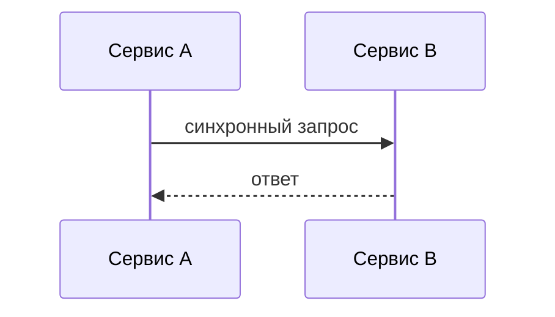
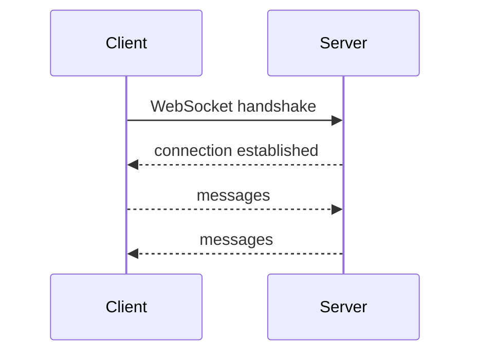
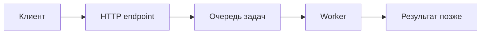
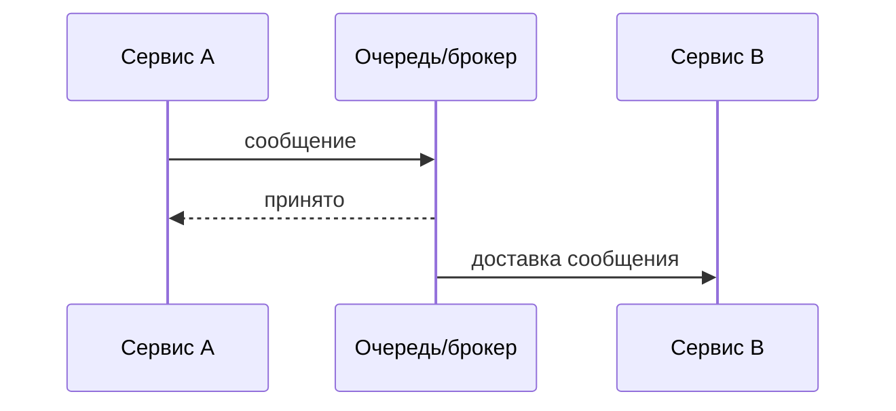
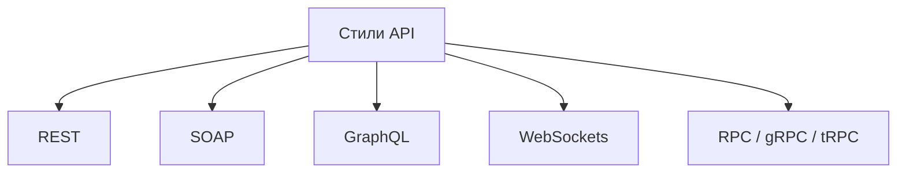
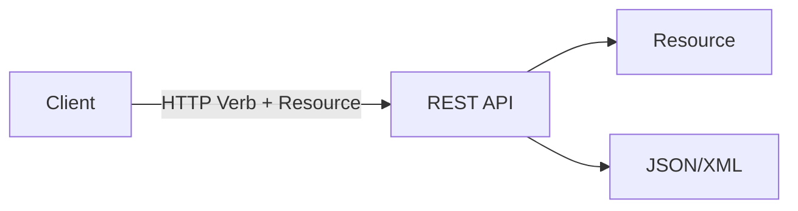
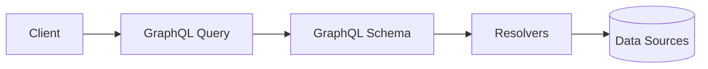

# Лекция 10. Семантика клиент-серверного и межсервисного обмена

У нас сегодня вроде бы тема небольшая, потому что мы ее клиент-сервисную разработку разобьем на целых три лекции.

## Синхронное и асинхронное взаимодействие

**Слайд 6: Пример использования.**

::: warning Текст слайда из PDF
Пример использования.
    Приложение электронной коммерции может
    синхронно вызывать микросервис для проверки
    наличия товара перед оформлением заказа.
    Клиентский микросервис блокируется,
    пока не получит ответ о наличии товара.
:::

**Слайд 94: WEBSOCKETS**

Сегодня разберем самые элементарные синхронные способы взаимодействия между сервисами и клиентом и сервисом, а потом будем рассматривать асинхронные способы взаимодействия. И достаточно одну лекцию выделим прямо на рассмотрение ряда паттернов асинхронного взаимодействия.

Значит, что мы разберем? Разберем, вот тут на самом деле намешано куча всего. И протоколы, и архитектурные стили. Вот надо разобраться с этими понятиями, чтобы вы четко понимали, ага, это HTTP это протокол, SOAP это протокол, REST API это архитектурный стиль, SOAP API это архитектурный стиль и так далее. И надо также... Сегодня будет подчеркнуть, что независимо от того, какой протокол вы используете, на самом деле вы можете реализовать абсолютно разные семантики. То есть, как бы, HTTP — это не приговор, что у вас будет синхронное взаимодействие. Вы можете выпендриться и сделать на HTTP-протоколе асинхронную семантику взаимодействия двух сервисов.

Как бы все покрутят у виска, скажут, блин, вот человек дает, есть же готовые фреймверки, есть же другие протоколы, но... Вот это попытаемся разобраться.

Давайте начнем с того, что ведем понятие синхронное-синхронное взаимодействие. Пока что на достаточно примитивном случае у нас есть клиент-сервер. Понятно, клиентом может быть другой какой-то микросервис, но чаще всего все-таки подразумевают, что если мы особенно говорим о синхронном взаимодействии, то это клиент и сервер. Пока без упоминания, на каком это протоколе, с помощью какого это стиля реализовано, какими фреймверками, пока просто введем понятие, что значит синхронно и асинхронно с точки зрения общения клиент-серверного. Есть клиент, который отправляет запрос, и клиент замирает. Замирает до тех пор, пока сервер не даст ему ответ. Неважно, это будет ошибка или успешный ответ. Он замирает и ничего не делает.

И когда он дожидается, когда отработал сервер, дожидается ответа, и дальше опять клиент начинает, радостно получивший ответ, делать какие-то задачи. Все элементарно и просто на самом деле. За это и любят синхронную разработку. Именно поэтому наше третье домашнее задание на синхронную разработку, а четвертое будет на синхронную. Там все гораздо сложнее, но интересней. А синхронная, видите, это как и разработка синхронная. Мы кидаем запрос, не дожидаясь ответа, мы на клиенте можем продолжить какое-то действие. Вот, допустим, вы осуществляете покупку, кидаете запрос купить то, что у вас сейчас лежит в корзине.

И пока сервер обрабатывает, хватает ли у вас денег для списания, списывает эти деньги, вы, в принципе, можете уже... продолжить выбирать другие вещи и кидать их дальше в корзины. И в какой-то момент сервер отдает ответ.

Давайте посмотрим плюсы и минусы, а потом перейдем уже к протоколам и к архитектурным стилям, которые помогают нам выстроить. Сегодня разберем синхронную разработку, которые помогают выстроить именно синхронное взаимодействие клиента и сервера. Говоря о плюсах. Ну, понятно, это два плюса. Вот этого вот.

## Плюсы и минусы синхронного подхода

**Слайд 5: Плюсы синхронного взаимодействия:**

| Сторона | Пункты |
|---|---|
| Плюсы синхронного взаимодействия | Простота в реализации и отладке; прозрачность, легко отслеживать и управлять последовательностью выполнения операций. |
| Минусы синхронного взаимодействия | Зависимость от доступности; узкое место. |

Простота и прозрачность. Вот это реально программируется достаточно просто. Вы, собственно, чего тут думать? Чего тут размышлять? Мы кидаем запрос, выбираем с помощью какого протокола, дальше, возможно, выбираем фреймверк архитектурной силы, кидаем запрос.

- Это достаточно, если еще и на современных фреймверках, достаточно просто.

- Это просто и... и прозрачно в плане отслеживания вот этого потока, то есть это легко дебажится.

То есть у нас нет каких-то скрытых процессов от нас. Мы понимаем четко, в какой последовательности это будет выполняться, и это действительно легко отлаживать.

- Из минусов, ну, есть здесь явные минусы, это зависим мы теперь от работы... сервера если сервер у нас недоступен то в принципе все наш клиент дальше двигаться не может он полон не дожидается ответа и без ответа от сервера выполнить какую-то работу он не может но и собственно это узкое место всей нашей системы потому что если но это это сложно масштабируется и соответственно если сервер перегружен то наши клиенты тоже будут ожидать ответа гораздо дольше, чем нам этого хотелось.

Пример, когда все-таки использовать стоит, это, ну, допустим, у нас сервер будет являться неким микросервисом по продаже каких-то вещей, которые мы хотим купить.

## Плюсы и минусы асинхронного подхода

**Слайд 7: Плюсы асинхронного взаимодействия:**

| Сторона | Пункты |
|---|---|
| Плюсы асинхронного взаимодействия | Отказоустойчивость, позволяет избежать блокировки клиентского микросервиса; масштабируемость, асинхронное взаимодействие может быть параллельным. |
| Минусы асинхронного взаимодействия | Сложность в разработке; усложнение отладки. |

И, разумеется, мы не можем продолжить дать возможность клиенту работать дальше, если не подтверждается наличие нужного количества заказов у поставщика. следовательно возможно нету смысла дальше клиенту чего-то выбирать какие-то еще сопутствующие товары если он основной товар не сможет приобрести то есть семантику смотрите выбираете чаще всего не вы выбирает можно сказать бизнес правило и выбор как раз я клоню к тому что выбор синхронно либо асинхронно нужно делать исходя из того, какая семантика вам необходима. То есть какие правила взаимодействия клиента и сервера вам действительно нужны. То есть только поняв, как клиент и сервер должны общаться, понять семантику этого общения, мы уже думаем, выстроить это синхронно или синхронно.

И лишь потом, когда даже мы решили, что это будет, возможно, асинхронно, не факт, что вам понадобятся какие-то протоколы, там, gRPC, возможно, вам... Будет проще по каким-то причинам выстроить асинхронные взаимодействия на синхронном HTTP протоколе. Вот сейчас к этому дойдем. Второй вариант – это асинхронные взаимодействия. Здесь, ну, конечно, плюсов больше. Или они весомее. Я их также написал два плюса.

- Это отказоустойчивость и масштабирование.

Ну, действительно, во-первых, если наш сервер недоступен, то клиенту ничего не мешает продолжить работу дальше. По другому сценарию, но опять же, видите, наша семантика взаимодействия клиента и сервера, то есть наша идеология, как мы общаемся с сервером, она должна быть к этому готова. То есть нельзя просто так взять, поменять протокол HTTP на какой-нибудь gRPC, и от этого ваше приложение не станет асинхронным. Клиент и сервер от этого не будут общаться теперь асинхронно. То есть вам именно нужно, прибегая к асинхронному взаимодействию, нужно подумать и о транзакционности, как минимум, и о масштабируемости.

Здесь я лишь хотел заострить внимание, что действительно при таком асинхронном взаимодействии у нас из плюсов самых важных – это клиент не блокируется, он продолжает работать, ну, собственно, как и при асинхронном программировании. И масштабируемость. Масштабируемость такого процесса.

- Из минусов это действительно сложный порог вхождения, потому что чаще всего придется, ну как минимум, изучить самый популярный фреймверк Kafka, который дает нам очередь сообщений.

То есть порог вхождения технологически в асинхронную разработку гораздо сложнее. Но глядя сейчас на требования к... джун плюс разработчикам, это уже становится нормой. То есть джуниор уже должен знать и уметь писать микросервисную архитектуру. То есть если где-то в начале 2000-х это было что-то нереально сложное, было действительно мало удобных и синтаксически приятных фреймворков, то сейчас это все гораздо проще. Так, отладка. Отладка просто немыслимо сложная. таких процессов, потому что вы теряете за счет этих брокеров сообщений и другого инструментария, вы теряете прямолинейность исполнения вот этого алгоритма. Но инструменты есть, и про них будем разговаривать и на семинарах, и в последующих лекциях.

Пример такого использования, ну, допустим, микросервис, который обрабатывает платеж. Вы можете действительно нажать кнопку «Оплатить». И работа на клиенте не замирает. Пока деньги спишутся с одного счета с другого, то есть начнут работать совершенно другие сервисы, даже не вашей системы, вы можете без проблем на клиенте продолжить работу, а потом получить ошибку, платеж не прошел. Но на одном запросе достаточно, может быть, не информативно, поэтому нашел... Более говорящую картинку, то есть мы должны понимать, что запросов от клиента к сервису или от одного сервиса к другому сервису, он, возможно, будет не один, точнее, невозможно, а чаще всего не один. И тогда это будет отображаться вот таким вот образом. С синхронной пока все понятно.

- У нас есть очередь каких-то сообщений, которые нужно выполнить одно последовательно, одно за другим, за второе.

После первого, третьего, после второго и так далее. Вот три запроса выполняем, сервер работает, мы ждем ответа.

Дальше мы, получив ответ от сервера, принимаем какие-то решения, и на основании этого решения происходит либо последующее обращение к серверу, выполни второй запрос, выполни третий и так далее.

- Если мы говорим о асинхронном взаимодействии, то здесь получается очередь вот этих запросов отправляется на сервер.

Там, скорее всего, у нас брокер сообщений, который складирует эти сообщения. Но вот эти паттерны асинхронного взаимодействия у нас уходят на следующую лекцию. Сейчас просто, чтобы вы в голове понимали, что есть вот такой мир и есть вот такой мир. И не надо их сопоставлять, что один лучше другого. Нужно понимать, когда вам подходит больше одна история, а когда другая. Так вот, асинхронно мы отправляем эти запросы на сервер. Они там в каком-то порядке, возможно, даже на разных микросервисах, если мы масштабировали вертикально, выполняются. И дальше мы просто начинаем ожидать, и в какой-то момент...

- Мы можем самостоятельно проверить, выполнилось или не выполнилось.

И получив положительный результат, мы поговорим, что продолжаем свою работу. Но помимо синхронной и асинхронной, сейчас в последнее время начинает продвигаться или уже продвинулась.

- Это реактивная.

По сути, это тоже асинхронная. стиль взаимодействия но он отличается тем что как реактивное программирование мы отправляем асинхронно очередь сообщений на сервер каких-то задач запросов команд и дальше сервер нас сам обратным колбеком говорит что я выполнил эту задачу вот то есть нам не нужно постоянно его опрашивать, выполнил, не выполнил, а мы как бы подписались и говорим, что мы ждем.

- Когда будешь готов, скажи, что выполнил.

А по синхронному всегда должны сами спрашивать в состоянии находить дальше? Нет.

На самом деле есть разные механизмы. И вот насчет реактивного идут большие споры. На форумах, на конференциях, что... Кто-то прямо не хочет его отдельно выносить в третий вариант. Они просто говорят, что это просто подмножество асинхронного взаимодействия. Но так как оно становится все популярнее и популярнее, я решил, ну, мне картинка, если честно, понравилась, что, ну, здесь это сложно отобразить. Просто я бы сказал, ладно, это реактивное асинхронное взаимодействие. Или асинхронное реактивное взаимодействие.

Но вы должны понимать, что есть два способа. организации можно запрашивать а можно как бы подписаться при этом если копошиться что там внутри то в целом вы можете и на http протоколе самом обычном который вообще был изначально до изобретен для передачи html страничек вы и там можете организовать нечто подобное и так если подытоживаем то у нас есть две глобальных семантики.

- Это request-response.

Спросили, получили ответ. И с ним мы ассоциируем синхронное взаимодействие. То есть мы спросили и ждем, пока он ответит. Он проще, но дольше ждать. Отзывчивость нашего приложения клиентского становится просто никаким. Мы не можем ничего сделать, пока сервер не даст ответ. И если мы используем один из популярных паттернов MessageBus, то мы можем получить асинхронное взаимодействие клиента и сервера, но и получить ряд проблем.

- Это сложность дебага, сложный порог вхождения в эту технологию клиент-серверного взаимодействия, но зато получаем более отзывчивое приложение, ну и масштабируемость, и за счет Kafka массовую отправку.

### Что выбрать

Что выбрать? Ну, ответ на самом деле... Неоднозначно и не вам индивидуально это решать. Есть даже вплоть до того, что советы, в чем у вас есть экспертность, в чем вы профессионал, если сроков на выполнение нет, то выбирайте то, что вам знакомо.

### HTTP и синхронная реализация

**Слайд 17: СИНХРОННАЯ РЕАЛИЗАЦИЯ ВЗАИМОДЕЙСТВИЯ**

**Слайд 21: ВАРИАНТ 1**

**Слайд 22: ВАРИАНТ 2**

В принципе, если даже вы знаете только HTTP протокол, вы даже на нем сможете сделать асинхронный сервис. Точнее, асинхронное взаимодействие клиента и сервиса. Хотя он как бы изначально не предназначен. Но если вы не знаете каких-то асинхронных паттернов, фреймворков, то и наш TTP, я сейчас картинку покажу, в принципе, без проблем можно тоже писать асинхронно.

Значит, на что обращаем внимание при выборе? Это время отклика. Если вам как бы важно... от сервера получить ответ и только после этого делать, то дорога в синхронную разработку клиента и сервера. Если вы действительно не привязаны к ответу здесь и сейчас, и когда-то вам важно получить, а возможно вообще не важно получить ответ от сервиса, то без проблем, синхронная разработка, очереди сообщений и вот все это. Надежность и отказоустойчивость. Если вам действительно нужно надежное клиент-серверное взаимодействие, то тут стоит обратить внимание на асинхронное взаимодействие, потому что сервер, если у вас упадет, то клиент останется работать и сможет как минимум либо на другой сервер отправить сообщение, либо еще повторно раз отправить на наш бэкэнд.

Ну и производительность повышается при асинхронном, тоже понятно, потому что клиент не замирает. Но нужно понимать, что в принципе одно другого не исключает. И у нас наш сервис может определить вещи, которые будет решать с помощью синхронного взаимодействия и какие-то процессы, которые он может решать асинхронно. То есть это не исключающие друг друга семантики, и они могут без проблем существовать друг с другом. Поэтому давайте сейчас перейдем к тому, что понятие семантика и понятие протокол – это разные вещи. Вообще понятие протокол вы, скорее всего, затрагиваете в курсе операционных систем или будете затрагивать.

Но если простыми словами, там есть ряд, несколько уровней протоколов в модели TCP-IP или в модели вот этой несбыточной модели OSI. где там 7 уровней протоколов, но из них на самом деле реализовано, по-моему, 4 в TCP-IP, и всем этого достаточно. И мы говорим с вами о именно прикладных протоколах. Это HTTP, это SOAP, сейчас на диаграмме увидите, под ними лежат транспортные протоколы. И говоря о том, что транспортный протокол... Он не равен семантике. То есть у вас на одном и том же HTTP протоколе, давайте к этому переходим, может быть реализовано абсолютно два разных мира. Синхронное и асинхронное взаимодействие. Поэтому тут нужно запомнить, протоколы это отдельно, это правило.

Семантика это тоже правило, но то, как будут взаимодействовать клиент и сервер. Как они будут взаимодействовать, не зависит от того, на чем они будут взаимодействовать. Почта, да, вы используете почту, это протокол. Но вы можете договориться с вашим получателем, что ты не будешь писать ответ, пока не получишь от меня письмо, а я тебе не буду писать второй раз, пока не получу от тебя письмо. А можете сказать, что да пофигу, пишем друг другу, не согласовывая. Но видите, протокол-то один и тот же, почта. Правила пересылки сообщений. А семантика совершенно разная. Синхронная либо асинхронная. Поэтому семантика это одно, протоколы это другое. А архитектурные стили, которые работают на протоколах, это вообще третье.

И вот в этом давайте сейчас будем разбираться. Что такое архитектурный стиль, что такое протокол, а что такое семантика. Так, но еще раз зафиксируем.

Значит, есть две семантики. Синхронная. Здесь вроде бы все понятно. Сервер А взаимодействует с сервером Б, и пока от Б не получит ответ, дальше продолжать свою работу не может. Ну и как одни из вариантов, вот, заказ не может продолжить свою работу, пока сервис не может продолжить свою работу, сервис заказов пока пользователь... Да, тут недописал я. Пользователь хочет удалить какой-то заказ, но, возможно, у него нет прав. И, следовательно... Сервер не сможет продолжить удаление, пока не получит подтверждение о том, что есть права на удаление. Когда А зависит от того, чему будет равно Б. И мы не можем продолжить выполнять А, пока не подтвердим какое-то дополнительное условие. Математическим языком выражается это функциональная зависимость.

Когда у нас результат одной функции нужен для того, чтобы запустить другую функцию. Асинхронная семантика, тоже уже подытожим, это работа сервиса А не зависит от того, что нам ответил сервис Б. Я приводил пример формирования отчетов. Мы можем запустить формирование отчетов, эта работа происходит на сервере, тем временем клиент может запустить еще какой-то отчет и отправить этот запрос на сервер. Вот это вот, наверное, мысль, которую я пытаюсь донести последние минут 10. То, что синхронное-синхронное взаимодействие, оно все-таки в первую очередь зависит не от выбранного протокола. Да, не от выбранного протокола. Архитектурный стиль все-таки влияет на то, как вы будете писать. Вот протокол без разницы какой.

Древний HTTP... или JRPC, который работает на HTTP 1, или JRPC, который на HTTP 2. То есть неважно, какой протокол транспортного уровня вы выбираете, все равно уровнем выше, на прикладном уровне, вы пишете алгоритмы, как он должен работать. Поэтому и заменив протокол, это не означает, что ваше клиент-серверное общение неожиданно стало асинхронным. Там нужно саму идеологию выстраивать иначе. И вот теперь давайте пример. Есть некий сервис, ну или клиент, неважно, и второй сервис. Пример может быть абсолютно любой. Вот заявка на кредит. И здесь показано стандартное синхронное взаимодействие. И работает оно по протоколу HTTP. Ну сейчас мы будем разбираться, чем HTTP отличается от SWAP, от gRPC. Я думаю, в целом вы примерно представляете.

Мы отправляем какой-то запрос и получаем какой-то ответ. Формат запроса, формат ответа мы сейчас будем тоже разбирать. А вот теперь смотрите. Тот же HTTP протокол мы можем построить общение совершенно иначе. Казалось бы, HTTP протокол это исключительно про синхронное взаимодействие. Отправили запрос. Все, ждем. Пока не получили ответ, не можем ничего делать. Но смотрите. Тот же HTTP протокол можно ручками запрограммировать таким образом. Это, конечно, будет странно, потому что есть и другие протоколы, есть другие, ну, есть фреймверки, которые вам позволят это сделать гораздо с меньшими усилиями. Возможно, без понимания того, что там происходит внутри, но как бы тяп-ляп и будет работать.

Мы можем. работать синхронно через HTTP протокол, то есть отправлять команду, замирать и ждать, пока он обработает и даст нам ответ. А можем сервер написать таким образом, который также на HTTP протоколе будет сразу отдавать нам ответ, но статус только там не окей, не 200, а 202, что типа да, мы приняли твой запрос, твою команду мы приняли, мы ее исполняем. И начинает обрабатывать. И в какой-то момент, когда он закончит обработку, тогда он уже отправит статус 200. Что ваше решение по кредитной заявке одобрено. Но он уже может на основании этого принять какое-то решение и сказать, хорошо, беру кредит. Это у нас уже получается асинхронное взаимодействие.

### Асинхронное взаимодействие через HTTP

**Слайд 8: Пример использования.**

::: warning Текст слайда из PDF
Пример использования.

Система обработки платежей может
асинхронно отправлять запрос на
обработку платежа, а затем получать ответ
о статусе платежа через сообщения.

Такой подход позволяет клиентскому
микросервису продолжать работу без
ожидания ответа платежного сервиса.
:::

И в целом можно еще более сложное написать асинхронное взаимодействие через HTTP протокол. когда мы, по сути, подписчик-издатель, когда мы будем постоянно через какое-то определенное время в цикле опрашивать, а не решил ли ты наш запрос, а не решил ли ты наш запрос. То есть вот смотрите, здесь можно не вдаваться в подробности, но идея в том, что протокол-то один и тот же, а способы написания сервера в одном случае были... в чистом виде синхронны. И HTTP на самом деле максимально к этому склоняет нас. Достаточно странно писать вот такие вот вещи на HTTP протоколе. Просто это уже реализовано в других протоколах, но если покопаться, как это реализовано, да практически так оно и реализовано. Поэтому...

Перед тем, как перейти к рассмотрению, что такое архитектурный стиль, что такое протокол и какие они бывают, и еще там язык запросов граф Келья в эту же кучу, хотя это совершенно третья уже история.

Давайте вот тут мысль закроем, что есть протоколы, это правило, как клиент с сервером взаимодействует. Иногда эти протоколы становятся слишком замороченными. HTTP протокол, он действительно требует так много всего соблюдать. Рой Филд, по-моему, в общем, в 2000 году защитил кандидатскую на тему «А давайте-ка мы сделаем архитектурный стиль».

### REST API

**Слайд 25: REST API,**

::: warning Текст слайда из PDF
REST API,
HTTP,
SOAP,
GRAPHQL,
WEBSOCKETS
RPC (GRPC, TRPC)
Что это всё такое?
:::

**Слайд 36: REST API**

И на фоне HTTP протокола появился REST API, ну или REST Full API. То есть сейчас будем разбираться, что такое стиль, а что такое протокол. Но! Вот эту мысль закрываем следующим образом.

### SOAP

**Слайд 71: SOAP**

Неважно, какой протокол у вас используется, HTTP протокол, GRPC, SOAP, понятие синхронно или асинхронно будет общаться клиент с сервером определяется семантикой написания этого взаимодействия. И вот мы видим, что даже на HTTP протоколе, который просто... живет, чтобы мы писали синхронно. Мы можем его использовать в асинхронной семантике.

Дальше, когда вы насмотритесь на протоколы, насмотритесь на фреймверки, у вас будет это прям интуитивно. Этот фреймверк предполагает, что мы будем писать асинхронно. Вот этот протокол предполагает, наталкивает или облегчает нам жизнь, если мы будем писать на нем асинхронно семантику. Из рекомендаций, которые... Помогли мне коллеги-семинаристы наши написать. Я говорю, как вы определяете. Очень часто сказали, не мы определяем, а как нам скажут. В плане, как видит заказчик этот бизнес-процесс. Поэтому из интересного, где-то тут про экспертизу. В чем есть экспертиза, на том лучше и писать. Сначала нужно определиться с семантикой, то есть как будет... выстраиваться общение клиента и сервера, одного микросервиса с другим микросервисом.

Когда вот это вы для себя поняли, тогда начинаем выбирать уже транспортный протокол, который максимально будет удобен для реализации вот этой семантики взаимодействия. Ну, да, если есть возможность, если никто не против, то лучше, конечно, попробовать спроектировать синхронную семантику. Мы с вами начнем на ближайших семинарах. Да и, собственно, вы уже многие группы, я смотрю, потрогали простой веб-аппе и попробовали как раз синхронное взаимодействие. Ну и третья наша домашняя работа, она на синхронное взаимодействие как клиента и сервера, что, в принципе, классически, так и микросервисов между собой. Смотрите, еще вот эта вся мысль, которую я доношу последние полчаса.

Для асинхронного взаимодействия чаще всего подходит месседж-бас, паттерн брокера сообщений, а для синхронного запрос-ответ. Но опять же, есть нюанс. Мы видели, что и для асинхронного без проблем можно воспользоваться request-reply. Просто все зависит от того, как вам сервер ответит, и как вы дальше этого сервера будете долбать, чтобы он вам ответил. То есть можно и реквест-реплаем добиться асинхронного взаимодействия. Типа, чтобы сервер вам сразу сказал, все нормально, работай, я пока подумаю над твоей задачей. И клиент будет работать асинхронно. А потом спросит, а теперь уже подумал? Или сервер скажет, все, я наконец-то подумал. Поэтому семантика не определяет, как вы будете писать сервер. На HTTP протоколе или другом.

Поэтому запрограммировать можно все как угодно. Единственное, что может быть неудобно, писать асинхронное взаимодействие на HTTP. Но на всякий случай, прям жалко было удалять, но решил напомнить, что мы будем говорить про именно программный интерфейс приложения, API, которая будет нам предоставлять сервер. Это по сути то, как с ним работать. И то, как с ним работать, реализуется на определенных... И вот теперь куча всего. И на самом деле здесь можно прямо меня обвинить, что я теплое с мягким перемешал. Потому что действительно здесь у меня идет REST API. Это архитектурный стиль. У меня есть SUAP. Это протокол. Но нет SUAP API, который архитектурный стиль. Я подумал, просто много чего перечислил.

### GraphQL

**Слайд 79: GRAPHQL**

Тут есть GraphQL. Это вообще не... Архитектурный стиль это не протокол, это язык запросов, который по замыслу должен был вытеснить REST, но вроде пока не вытесняет.

### RPC, gRPC и tRPC

HTTP протокол, RPC протокол, вебсобгит, короче тут перемешалось все. Я даже расписал. HTTP протокол, REST API это архитектурный стиль, который работает над HTTP протоколом. Вот почему это так получилось? Потому что все стали каждый по-своему работать согласно протоколу HTTP, иногда его нарушая, иногда не совсем понятны для других разработчиков.

И поэтому Рой, я не помню, фамилия Филд, по-моему, в общем, вот этот мужик, который занимался разработкой HTTP протокола, он придумал в рамках своей кандидатской диссертации или докторской в 2000 году, он придумал... архитектурный стиль и говорит давайте все будем на стиле будем правильно все писать одинаково и так появился rest api вот но сейчас мы до него дойдем до тут тут и намешал ну на самом деле опять было было желание показать многообразие как протоколов так и способов взаимодействия синхронного клиента и сервера потому что жизнь там реального разработчика Скучная неказиста. Он просто выбирает между микросервисами GRPC, между клиентом и сервисом HTTP. Соответственно, REST Full API реализует архитектурный стиль. И все. Можно выучить два.

Но хотелось чуть-чуть упомянуть и о каких-то старых забытых протоколах, которые сместились с REST. И о каких-то перспективных вещах. Уже у всех на слуху. Хотя сам RPC появился, по-моему, в начале 2000-х. А от Google **реализация** появилась в 2016 году. Поэтому намешал все в кучу. И ради чего? Ради расширения вашего кругозора. А на семинарах все будет чуть-чуть примитивней. Между клиентом и сервером HTTP. Согласно архитектурному стилю REST Full API. И между сервисами GRPC. А потом между сервисами еще будет Kafka, которая позволит нам сделать асинхронное взаимодействие микросервисов.

Начнем с самого базового. То, на чем строится REST API. Потому что REST API это не протокол, как мы видим. Это просто правило. Если люди... Люди могут нарушать, в принципе, эти правила. Они могут удалять объекты с помощью get-запроса, а не delay-запроса. Но они нарушат стиль, соответственно, их коллеги будут проклинать. Но, опять же, стиль — это всего лишь навсего то, как мы пишем. Поэтому писать мы можем криворуко. Но когда все-таки есть какой-то стиль, и он оглашен, на нем он кандидатскую защитили, то лучше, конечно, его придерживаться. HTTP – это действительно протокол. Что это за протокол? Их там уже куча протоколов-то на самом деле. Сколько в модели оси уровней этих протоколов? ОСА или как правильно? Семь. А вы видели, что такое протокол?

Это, по сути, правило. Правило, которое описывает… как должна быть изготовлена сетевая карточка, что у нее там должен быть MAC-адрес, IP-адрес, правила, как эта сетевая карточка работает с проводами. То есть это куча правил. Если все эти правила в виде А4 листочков сложить, есть картинка, она почти с меня ростом, это стопка правил. Модель OSI, она в принципе не реализована. Она на бумаге реализована. Это как сладкие мечты этого отдела ИИЕ, который институт стандартизации. Они его писали так долго, что к моменту, когда они его написали, разработчики сетевых карт сказали, типа, вы что, мы уже производство наладили, у нас все работает по протоколу TCPIP, там четыре уровня. И, собственно, на этом история закончилась. ОСА и модели нет. Зачем переписали?

Хотели. Хотели написать как надо. Ну, ладно, я немножко тут привираю. Приближенная Коэсай реализовал Apple. Сейчас приближенная Коэсай реализовал МТС. И, по-моему, Сбер для своей вот этой экосистемы. Ну да, оно, конечно, круче. Просто очень сложно, когда есть индустрия. Плоть до того, что есть институты, которые распределяют MAC-адреса, и есть целый бизнес, который изготавливает сетевые карты. И уже, в принципе, интернет работает лет, по-моему, уже 10 он работал, когда они дописали OSI. Уже было сложно что-то изменить. Поэтому весь интернет живет на TCP-IP протоколе. Ну, собственно, вот. Сетевой, межсетевой, транспортный уровень приложений. Уже все работало и так. В CERN, по-моему, использовался HTTP протокол, который над TCP и UDP.

TCP и UDP – это правило, это протокол. Протокол – это правило, чуть ли не на бумажке записанное. Его нужно соблюдать. Соответственно, его соблюдает транспортный уровень. Мы можем с помощью системных вызовов сказать, как мы хотим общаться с… Клиент хочет общаться с сервером. Один из них вариант TCP, другой UDP. В общем, аналог такой, когда вы пишете письмо и отправляете, и ждете ответа. То есть вы как бы отправили, дело закрыто, ждете ответа, получили, все, счастливы, читаете ответ. Это TCP. UDP это практически как телефон. Вы набираете, связь установилась. связь держится. То есть письмо-то, видите, связь разорвалась, вы написали, запечатали, отправили и забыли. Пока вам не придет ответ, вы там месяц как бы и не помните о том человеке.

А телефон — это вот UDP-протокол. Он говорит о том, что соединение нужно держать, и вы общаетесь, и у вас есть как бы подтверждение обратной связи. Там мычит что-то на другом конце труб телефона, получит там, слушаю тебя. Вот. То есть это правило, и они, конечно, Нам нужны. Потому что, допустим, HTTP протокол строится на... Их на самом деле больше чуть-чуть. Строится на одних транспортных. К примеру, gRPC, он строится на различных транспортных протоколах. Потому что у него есть разные варианты взаимоотношений микросервисов. Поэтому... Мы как бы немножко зависим от транспортного уровня, но мы как программные инженеры, нас все-таки интересует, когда мы работаем с фреймверками, допустим, ASP.NET Core.

Взяли фреймверк .NET, то мы работаем лишь на уровне приложений. То есть они запускают либо HTTP-клиент, создается класс. Объект этого класса и HTTP-клиента есть методы get, post, и мы общаемся с сервером и получаем от него ответы. То есть наши фреймверки работают с уровнем приложения, используя какие-то протоколы. Да, эти протоколы могут использовать разные транспортные уровни, но это прямо совершенно и другой предмет вне рамках программной инженерии. Это в рамках курса операционных систем. Я думаю, да еще на... Ноябрь и декабрь еще, чего вы? А что значит каждый вот этот уровень? То есть уровень приложения — это протокол, который содержит свои классы?

Ну, если я лезу на вотчину операционных систем, смотрите, когда вы изготавливаете, ну, совсем простыми словами, когда вы изготавливаете сетевую карточку, вам сказано, что она должна придерживаться стандарта Ethernet. Это означает, что на самом низком уровне Это вплоть до того, что уровень сетевого доступа определяет, как должна быть изготовлена витая пара. Прямо прописано, что должно быть столько-то проводов. По этим проводам идут. Сетевые карточки должны иметь такой RG45 разъем. То есть это протокол, он описывает то, как должно выглядеть именно вот этот сетевой. как канальный там, по-моему, еще в модели Саева называют уровень. Потом чуть выше идет прямо правило, как должна передаваться информация, биться на пакеты, какого размера эти пакеты.

Это из карточек. Да, да, да. То есть как сетевая карточка будет взаимодействовать с маршрутизаторами, как она будет находиться в интернет-пространстве, как вообще маршрутизатор будет понимать, какие у него внутри сетевые карточки, и говорить этот запрос мне, или давай-ка этот запрос дальше, пусть ищет, куда он отправлялся. То есть вот это вот все прописано в разных протоколах. По сути, каждый протокол, вот пока мы не дошли до сюда, каждый протокол — это правило, как изготовить железо. Как изготовить провода? Как заставить это железо общаться с другим железом? И по каким правилам? Нужно ли ждать ответа, если мы что-то спросили? Или нужно ждать, или не нужно ждать? Можно ли массово всем разослать, или не надо всем рассылать?

То есть это, соответственно, для этого у нас есть сисколы в операционной системе, в системе, которые могут организовать какой-нибудь там веб-сокет. который будет работать по определенным правилам. Но получается от прикладного разработчика это немножко все скрыто. Мы повышаем уровень абстракции, и мы работаем на HTTP протоколе. Что нам говорит HTTP протокол? А вот, собственно, следующие 10 слайдов. HTTP протокол говорит, раньше вообще, когда он только был изобретен для CERN, он был изобретен сугубо для отображения HTML страничек. Сейчас, конечно, он научился передавать и тексты, и файлы, и JSON, и XML, раньше только HTML-странички. Соответственно, клиент должен понимать, что ему прилетит, и сервер должен понимать, что ему прилетит.

То есть почему HTTP — это протокол? Потому что есть жесткие правила, в каком формате клиент должен что-то сказать серверу, и в каком формате сервер должен ответить. Даже есть коды, мы сейчас увидим, что там трехзначные коды. Но все вы знаете 404, да? Или сервер за 500, 500 ошибка. Или все окей, 200. Вот, то есть, видите, это тоже прописано в стандартах. То есть прописано в протоколах. То есть протокол общения. Кто должен первый сказать, нужно ли ждать, что в ответ прилетит. Но, к сожалению, правил стало так много, что... Их перестали соблюдать. И вот тогда Рой Филд то ли ради докторской, то ли... Ну, шучу, он, конечно, ради хороших побуждений придумал стиль. Но о стиле сейчас попозже.

Значит, поначалу протокол. Для чего? И как он выглядит? То есть мы что-то передаем сначала на сервер, да? Как мы передаем? Вот эту страшную вещь мы передаем. С помощью чего? Это мы на семинаре увидим. С помощью HTTP-клиентов. Мы можем... Создавая объект, вызывая соответствующий метод, мы можем сформировать запрос к серверу. Запрос к серверу состоит из нескольких частей. В зависимости, опять же, от фреймворка. Это может как-то визуально отличаться, но смысл все равно будет одинаковый. Здесь, sorry, ошибка. HTTP должно быть в версии. Здесь просто URL указывается, и он указывается как некий адрес к. к контроллеру, к которому мы хотим, ну или к той части сервера, к которой мы хотим обратиться. Тут аж TDP надо было вот здесь написать.

Так вот, у нас есть стартовая строка, есть заголовок, который, собственно, говорит, куда мы обращаемся и к какой именно части нашего сервера мы обращаемся. И дальше у нас есть еще и тело сообщения, если мы ему что-то передаем. Какие-то данные, которые, допустим, мы проходим аутентификацию на сервере, обращаемся к соответствующему методу, с помощью соответствующего метода к какой-то функциональности на сервере, передаем к какой-то функциональности, передаем какие-то данные.

Давайте основную идею зафиксируем, что обращаясь к клиенту или какой-то... Чаще всего клиент, потому что синхронное взаимодействие или HTTP-взаимодействие подразумевается между клиентом и сервером. Но он должен указать метод. Опять же, мы можем нарушать это правило. И так оно и получалось, что те, кто использовал HTTP-протоколы, они не соблюдали стилистику и могли передать метод POST. Но на самом деле под пост подразумевали get. И, конечно, сервер отработает, если он тоже так написан. Точнее, если сервер написан, который под методом get делает то, что должно делаться в методе post. Сейчас понятие get, post, put разберем. То есть вот это было настолько сложно, и правила так усложнялись, что это породило появление архитектурного стиля.

То, что вверху, это... То, что мы отправляем на сервер от клиента. А внизу, соответственно, так как это синхронное чаще всего взаимодействие, то сервер нам формирует ответ, который тоже выглядит в виде статуса. Версия протокола статус 200, что успешно выполнил. То есть каждый статус о чем-то говорит. Клиент может анализировать, может не анализировать, но протокол обязывает передать нам ответ. Методы, которые мы видели. который отправляет клиент серверу. Это некая, ну, такая, хороший стиль, который говорит о том, что данный запрос хочет. Хочет ли данный запрос удалить, или добавить, или получить.

И в зависимости от того, какой это метод клиент заявляет, соответствующий метод на сервере тоже, ну, либо атрибутом, либо очень многое зависит от... инструментальных средств. Допустим, в .NET мы увидим, это атрибутом помечается как метод, который должен отреагировать на запрос POST, а этот метод на запрос GET. Но опять же, видите, мы можем написать метод, который удаляет, но сказать, ты будешь реагировать на GET. И все будет работать. Если на клиент говорит, давай-ка вызови GET, а на сервере под GET будет происходить удаление, но это нарушение протокола. Но если обе стороны его нарушают, то почему бы и нет. Но когда этот проект будет дописываться кем-то, кто привык соблюдать, это будет странно.

Поэтому да, вы можете писать как угодно, но потом вас найдут. Чаще всего вот эти методы, они у нас реализуют так называемую CRUD-операции. Create, Update, Read, Delete. Только здесь есть еще мало редко используемый патч. Он обновляет так же, как и PUT, но он умеет обновлять часть частично. Но использует его редко, либо нарушает семантику, и там, где можно было бы воспользоваться патчей, делает это через PUT. Но это уже не так страшно. Как я и говорил, сервер отдает нам ответ. Ответы всегда должны содержать статус. И какую-то дополнительную информацию, возможно, какой-то JSON. Но статус тоже должен быть обязательно, потому что клиент должен понять, запрос выполнился, потому что как интерпретировать, что там дальше-то прилетело.

Статус в виде трехзначных чисел. Каждая из групп отвечает за определенные события. Все хорошо, все плохо, или там окей, мы получили от тебя информацию. Ну и видите, да, ошибки это четвертые и пятые, удачно это вторые, частично первые. Информационно мы говорим, что окей. Ну и возможно перенаправление. И вот смотрите, всякие методы, всякие ограничения на клиента, как он должен общаться с сервером, ограничения на сервера, как он должен отвечать клиенту. И там еще на самом деле куча-куча всевозможных ограничений, описанные в протоколе взаимодействия клиента и сервера согласно HTTP протоколу. Еще и как передавать JSON, как передавать файлы, тексты, XML. Это наложило на то, что все начали действительно нарушать.

И разработчик HTTP протокола накатил еще архитектурный стиль. И сказал, что давайте я опишу правила, и вот так все будем теперь делать. И если все так будут делать, программы друг друга будет проще смотреть. Между программами общение происходит через API. Мы уже понимаем, что одна из программ предоставляет свое API, говорит, что с ней можно делать. Получить курс валют, произвести конвертацию валют. Ну и, соответственно, она описывает, каким образом к ней можно обращаться, к клиенту или другому сервису. Она описывает методы, урлы, по которым можно обращаться, и описывает, что она отдаст. Это все описывается в API. Современные фреймверки, допустим, Swagger либо OpenAPI, а Swagger это всего лишь надстройка над OpenAPI, они могут это автоматизировать.

И, по сути, если вы пишете ваши микросервисы-сервисы согласно RESTful API, то подключаемое автоматом, с помощью билдера, когда вы запускаете... Backend, вы говорите, что еще подключить Swagger, то есть у вас автоматом документация формируется. Если вы пишете свой сервер согласно архитектурному стилю RESTful API. Что такое REST API? Это не протокол, это архитектурный стиль. То есть это еще жесткие правила, чтобы уже четко сказать, я работаю с HTTP протоколом, согласно RESTful API. И тогда все в мире понимают, что у вас делает метод GET, и что будет означать ответ сервера 200. Это просто уточнение после того, как HTTP просуществовал несколько десятков лет, бардака столько нахапал, и вот решили это все привести в порядок с помощью архитектурного стиля.

И есть пять основных концепций архитектурного стиля REST API. Это то, что... Это выстраивает он между клиентом и сервером, но под клиентом мы можем понимать все, что угодно, включая действительно каких-то клиентов в виде мобильных приложений, каких-то браузерных историй или другого сервиса. Поэтому REST не подразумевает конкретно, между кем происходит общение. REST API в своей второй концепции говорит также, что и у нас нету... Как бы информация о цепочке сообщений. Каждый написанный сервер согласно REST говорит о том, что да, вы ко мне обращаетесь, но дальше вы не будете знать, что происходит дальше. То есть всей цепочки мы не прослеживаем, и это тоже нужно учитывать. Stateless – это нормальная история для клиент-серверной разработки.

То есть мы не имеем состояния. Все, что прилетает... в сервис, как будто бы в первый раз. Вы не можете говорить, что «добавь мне в корзину еще такой-то товар». Вы должны ему все полностью прописывать. Какая корзина, кто вы. Единообразие интерфейса – это тоже одна из концепций REST. То есть каждый сервис должен соответствовать CRUD-операциям. Ну, как минимум. Добавить, удалить. Вот, допустим, тут сервис корзины. Добавить товар, удалить товар, обновить, получить все товары, получить информацию. Одна из этих концепций говорит о том, что разными методами мы можем обращаться к нашему бэкэнду. И в зависимости от того, каким методом мы обращаемся, желательно, чтобы веб-сервис под этими методами выполнял... соответствующее действие, на которое мы надеемся.

Конечно, это не факт, что будет именно так, но мы думаем, что с помощью GET мы получим данные. Достаточно будет странно, если ваш якобы RESTful API в методе GET начинает изменять или удалять данные. То есть так можно, и так даже делают, но это нехорошо. В смысле, нехорошо так делать. Еще одна из... концепции, что ряд запросов должны быть... Точнее, мы должны понимать, что ряд запросов, такие как PUT, они идемпатентны. То есть, давайте напомню, PUT — это у нас обновить информацию о товаре. Соответственно, идемпатентный запрос не меняет состояние сервера. Если мы три раза отправляем PUT в запрос, это не должно создавать дубликаты. То есть он обновляет.

Давайте вот, к примеру, пост, он не идемпатентный. Он будет изменять состояние сервера, добавлять новые и новые данные. А пуд, тот, который изменяет ранее сохраненные данные, сколько бы вы раз пуд не выполнили, он изменит внутреннее состояние какого-то объекта, но не изменит состояние в базе данных. То есть количество этих записей не будет увеличено. Еще одна из концепций – это кэширование как раз. Но тут важно понимать, какие запросы кэшируются, а какие нет. Мы можем кэшировать GET, но чаще всего GET, иногда POST, но чаще всего GET. Потому что если вы к серверу обращаетесь, и таких, как вы, еще миллион обращается за одной и той же информацией, то стоит подумать о кэшировании. Где вы сделаете это кэширование?

На сервере или на отдельной какой-то сущности? Это уже как бы вторично. Но тоже нужно понимать, что клиент, который будет обращаться к серверу, он может сказать, да, я готов взять из кэша эту информацию. То есть клиент тоже понимает, что данные могут кэшироваться, и мы можем отправлять соответствующие запросы. Формат обмена сообщениями. Если раньше был исключительно HTML, то сейчас это в большей степени JSON. Но в меньшей XML. У них есть свои недостатки. JSON очень плохо сжимается, XML вообще очень избыточный. Но это протокол. REST API строится на HTTP версии 1. На HTTP 2, который может передавать бинарные данные, соответственно, сериализовать ваши объекты в 0 и 1, там нужно уже использовать совершенно другой архитектурный стиль. Это RPC.

К примеру, версионирование. Мы понимаем, что наш сервер может быть переписан, у него могут появиться новые версии, хотя бы того же самого метода, но в другом формате он будет отдавать данные на клиента. Другой JSON будет прилетать, и мы понимаем, что клиенты там могут быть разные. Кто-то старовер не обновляет приложение уже год. Кто-то обновился, у кого-то один клиент, другой клиент. Поэтому мы должны соблюдать версионирование. И желательно его... А, это я к тому, что, возможно, какой-то метод может в новой версии быть удален. Поэтому версия... Ну, и как нам это понять? Поэтому старый он, может быть, останется. Вот, это проблема в том, что мы просто так не можем взять, удалить какой-то метод, взять его переименовать, переписать.

Нам нужно, соответственно... для новых клиентов писать новую версию того или иного метода. Put, Delay. И еще одна из важных концепций — это документирование своего API. Это плюс один балл в третьей домашней работе. Это очень важно. Но это делается автоматом. Вы можете подключить OpenAPI. На основании OpenAPI есть такой хороший инструмент. По сути, он уже как де-факто. стандарт, это Swagger, который строится, ну, это настройка на OpenAPI. Он автоматически строит нам, во-первых, документацию, а во-вторых, удобный интерфейс для тестирования. Возможно, он не всегда удобен для тестирования, есть Postman, более удобный инструмент для тестирования вашего бэкэнда, но этот и другой инструменты мы должны с вами на семинарах будем попробовать. И чего я...

Не успел, но просто хотя бы пролистаю. SUAP — это древний протокол. Он был, по-моему, до 1999 года. Он стал неудобен. Изначально, по-моему, Microsoft его изобрели. Его сместил REST. Почему? Потому что у SUAP это протокол. Это жесткие правила. Если вы их не соблюдаете, работать клиент с сервером не смогут. И там жесткие правила были именно в формате передачи данных. Вот это вот жуть swap.xml. XML-то жутко читать с его открывающимися, закрывающимися тегами. JSON гораздо проще к восприятию. А вот этот swap.xml это еще более жуткий XML. И если вы там что-то не так напишите, не в том формате с клиента передадите на сервер, сервер скажет, вообще не понимаю, что. И если вы клиента плохо напишите, клиент скажет, что это такое.

Поэтому пользоваться им было неудобно, он практически уже мертв, но кода написано много, поэтому, возможно, встретите. Тут еще раз говорю, что одно другому не противоречит, и ваша часть бизнес-логики может работать на swap, часть бизнес-логики может работать согласно архитектурному стилю REST. Но у SUAP есть преимущества. Если REST работает исключительно на HTTP, то SUAP может работать с FTP, с файлами, с почтовыми протоколами передачи. Но GRPC тоже это все может делать. Но на SUAP писали с каких-то древних времен, когда еще меня не было, и даже закончили, когда я еще не программировал. В 99-м, по-моему. Вот так выглядит жуткий формат передачи. клиента на сервер.

То есть, по сути, важно только вот буквально одна строчка, что мы отдаем, что мы получаем. Но, видите, сколько механизмов приходилось соблюдать, а еще и не было хороших фреймворков. Если кратко, вот REST API, это, по сути, когда у вас на бэкэнде как бы звоночки, и вы с клиента можете отправить вот сюда позвонить, выполнить что-то, вот сюда позвонить, вот сюда. Ну, или вот зайти в это окно, в это окно, в это окно. то SUAP, его плюс, он имел одну точку входа. То есть вам не надо было даже знать API. Вы просто знали, что достучаться до сервера можно только по одному единственному адресу. А уже дальше, как бы вот в этом теле запроса вы говорили, что вам надо. Не знаю, они говорят, что это плюс. Я с SOAP не работал, поэтому мне сложно это за плюс.

То есть, видите, как одно окно входа, а дальше что хотите, то и делаете. Но из-за этого сложно было в этой структуре объяснить, что вы хотите. Поэтому сравнить их можно, но все-таки REST это стиль, а SOAP это протокол. Ну, это еще раз, как он выглядел. REST это всего лишь рекомендации, но их желательно соблюдать. А вот если вы что-то нарушите в SUAP, работать не будет. А GraphQL это вообще запрос. И вот он должен был победить REST. Но пока не победил. Но все шансы есть. Вот REST, смотрите, GraphQL это язык запросов. Смотрите, что такое REST? У вас куча окон. Когда вы проектируете сервер, вы думаете, ага, спроектирую я вот этот endpoint, который даст данные в таком формате.

А еще спроектирую вот такой, он даст в более развернутом формате, если человеку надо. А еще дам порезанные по страничкам. А здесь каждый четный элемент дам. А здесь те, которые по четвергам создавали. То есть вы проектируете backend. вот этими рычагами или вот этими окошечками, в которые можно постучаться. А GraphQL, почему он как бы выстрелит и, возможно, все-таки действительно популярность растет? Это язык запросов. Вы на клиенте можете сказать, что вам надо. То есть вы можете серверу сказать, слушай, вот из всех твоего списка товаров я хочу видеть по каждому подробную информацию. А можете... То есть, видите, вы можете не переписывать сервер, а силами клиента сформировать запрос к данным.

И можете сформировать более малую информацию о каждом товаре. То есть вы на уровне написания фронта можете сформировать такой запрос к серверу и получить данные, которые вам нужны. И не надо переписывать сервер. Вот классический подход. Мы дергаем конкретные эндпойнты. GraphQL мы дергаем. Endpoint и формируем запрос. Ну и, соответственно, примеры запросов. Мы можем сказать, что нам надо, он нам это отдает. Можем сказать, дай нам перечислить меньше полей, он нам меньше полей вернет. Классический подход. Мы определяем схему на стороне бэкэнда. GraphQL-овский. Клиент запрашивает нужные ему данные. То есть это, по сути, как SQL, только GraphQL. Тут пример, можете потом посмотреть. Я очень хорошую подборку скинул, что почитать.

Это вот как запрос выглядит. Он тоже самодокументируется. Ну, его плюсы и минусы. Вебсокеты — это когда соединение установлено. Тут буквально один слайд про этот. Соединение установлено, и оно неразрывно. И вы можете передавать сюда, передавать обратно, и вам не надо каждый раз устанавливать соединение. То есть вы созвонились. клиент с сервером или два микросервиса, и все. Не надо каждый раз писать письмо, запечатывать, идти на почту. То есть вот этот процесс инициации начинать. А просто раз созвонились и общаетесь. Для чатов, для видеозвонков, то есть когда нужна непрерывная передача одного с другого, но это тяжеловесная штука. И вот последнее, чем хотел закончить, это RPC. Это, наверное, самая тема. Смотрите, когда вы вообще...

Даже не понимаете, что работаете с сервером. gRPC — это **реализация**, удаленный вызов процедур по-русски. А gRPC — это типа реализация от Google, но они же с прибабахом, они каждую версию расшифровывают G по-разному. Поэтому там можно посмотреть, ну, как в андроидах, да, там всякие есть у них версии печенюшки, зефирки, вот там то же самое G. Каждый новый релиз, буквы G, они придают новое значение. И они говорят, это не Google. Но это реализация от Google, это их внутренний проект, по-моему, в 2016 году вышел в свет. И смотрите, в чем там прикол. Вы пишете на их языке протобафе, как должен выглядеть сервер, какие он услуги вам предоставляет. И копируете это на клиента. Протобаф компилируете в нужный вам язык, допустим, в .NET, в Java, в JS.

И дальше клиент работает как будто бы вообще просто локально. За счет вот этого сгенерированного стаба, заглушки фейкового класса, у вас ощущение, что вы просто говорите, клиент, стаб, сделай что-то. Вы просто вызываете метод. И создается ощущение, что вы пишете что-то локальное, а на самом деле за счет автосгенерированного вот этого стаба здесь-то и кроется все. Вот это вот взаимодействие с сервером. То есть у вас создается ощущение, что вы просто пишете локальный вызов процедур. Но на самом деле процедура с таким же именем на сервере вызывается удаленно через какой протокол, да какой угодно. Она может работать на разных протоколах. А, в 2015 году. И чаще всего gRPC используется между микросервисами, потому что...

Это удобно, и там JRPG основан на HTTP2, и вы можете сериализовать объекты, то есть общаться не JSON, а общаться бинарно сериализованными файлами. А они очень сильно сжимаются, и общение между микросервисами можно выстроить гораздо быстрее, чем работа по HTTP. Это его основные плюсы, но самое важное — это HTTP2. Вот таким образом. Он может общаться, а эти нули и единицы можно сжать.

### Итоги

И формат передачи данных гораздо меньше, чем JSON. Все. Извините, что задержал, но слишком много было.
