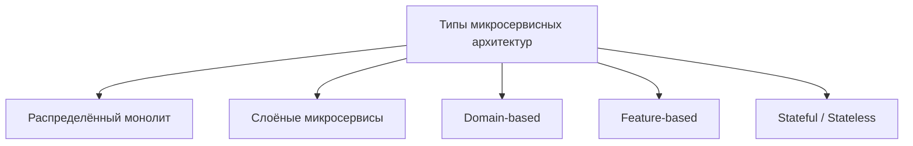
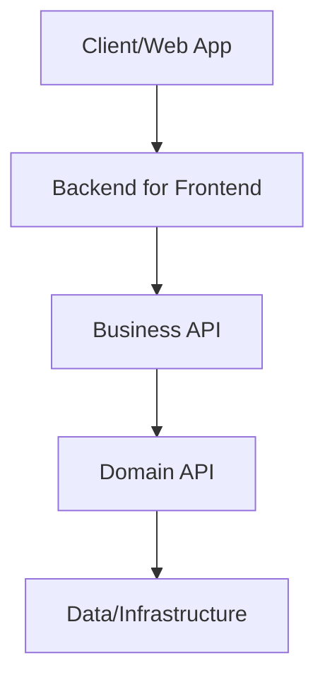
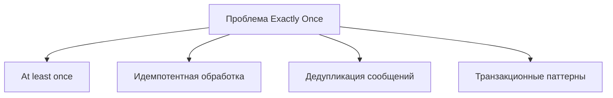
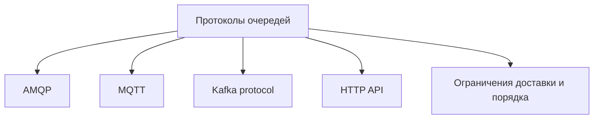
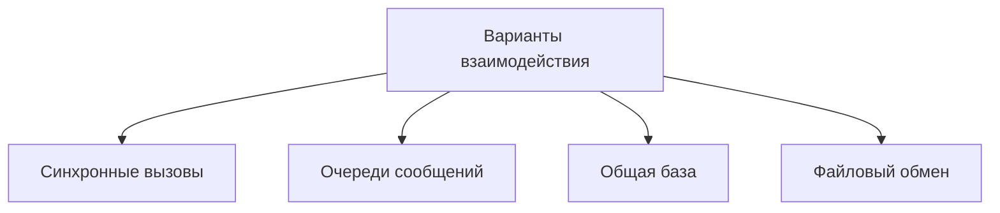
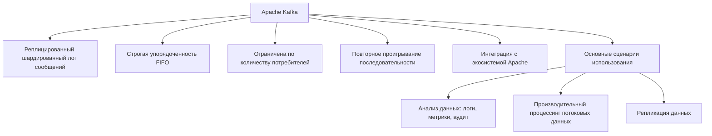

# Лекция 11. Асинхронное межсервисное взаимодействие

Данная лекция затронет тему, которая продолжится на следующей, а именно мы рассмотрим сегодня межсервисное взаимодействие с помощью MessageBus, а на следующей лекции мы посмотрим, а как... дать какую-то гарантию надежности доставки сообщений от одного микросервиса к другому. И там будем разбирать всевозможные паттерны отказоустойчивых взаимоотношений между микросервисами. Рассмотрим и оркестрацию, хореографию, ну и ряд на самом деле других аутбокс, инбокс паттерны. Но это будет на следующей лекции. И после этого вы сможете начать выполнять четвертую домашнюю работу. А сегодня мы рассмотрим самые основы межсервисного взаимодействия. Еще раз повторим о том, что есть разные нотации, семантики, синхронная, асинхронная.

И остановимся, а как же нам выстраивать асинхронную семантику. И еще раз напомню, что это не зависит от выбранных протоколов, хотя с помощью одних протоколов удобнее выстраивать все-таки синхронное взаимоотношение на основании MessageBus, а с помощью других протоколов синхронное взаимодействие с помощью таких, не знаю, архитектурных стилей, как RESTful.

Значит, сегодня мы будем с вами рассматривать... межсервисное взаимодействие с уклоном все-таки на асинхронное взаимодействие, потому что синхронное мы разобрали на прошлой лекции. Сегодня лишь повторим.

Рассмотрим более подробно идеологию MessageBus и, наверное, половину лекции уделим тому, а как выбрать из многообразия, на самом деле, готовых решений по организации брокера сообщений. выбрать ту самую очередь которая вам максимально подойдет поэтому начнем с того что а как вообще мы можем выстроить взаимоотношения между микросервисами сразу говорю здесь есть очень плохие решения очень спорные решения и далеко не все решения о том как можно выстроить взаимодействие между нашими микросервисами но я постарался в историческом таком В плане прописать, как у людей возникали какие мысли, какие идеи. Ведь изначально очень много было написано на монолите. Поэтому постепенно люди сначала переходили, переписывали монолитные приложения.

Ну вот забегая вперед, как Uber переписал свой монолит. По-моему, там было около трех тысяч неких сервисов, которые он думал, как это все переписать. В общем, давайте посмотрим. Первый вариант. Что вы можете сделать со своим монолитным приложением, которое работает, ну, собственно, как у нас было консольное приложение, несмотря на то, что мы там выстраивали чистую архитектуру, гексагональную, тем не менее, изначально она была все-таки консольным, в одном процессе работала и была действительно монолитным приложением, где, несмотря на всю нашу красоту разнесения по папкам, тем не менее, мы могли пользоваться отовсюду всем.

Но мы, конечно, соблюдали правила и старались, несмотря на то, что у нас была бы возможность дёрнуть из домена всё, что прямо на самом крайнем слое инфраструктуры. Тем не менее, мы старались выстраивать взаимоотношения условных слоёв максимально правильно. Но, ещё раз, это был монолит.

- Первое, что приходит в голову, когда хочется переписать монолит на микросервисы, это ужасная идея.

Его называют распределенный монолит, когда вы начинаете интуитивно каждый сервис выносить в отдельный физический микросервис, в отдельный процесс. И по сути вы ничего этим не улучшаете, а только ухудшаете. Потому что раньше у вас были взаимосвязанные сервисы в монолите, теперь у вас взаимосвязанные сервисы оформлены как микросервисы. То есть лучше вы не сделали, сделали только хуже, потому что порог вхождения у вас будет больше. Следующая картинка немножко визуализирует то, что я хочу донести. Смотрите, когда у вас модульное приложение, на самом деле это неплохо. И вот этот хайп вокруг микросервисов, и на самом деле уже падение идет этого хайпа. Сначала все стали уходить и смотреть в сторону модульного монолита, но это у нас будет в следующей лекции.

Сейчас уже и модульный монолит пошел на спад, поэтому не так часто на самом деле требуется людям масштабирование их систем. Они, конечно, верят, что их приложение будет востребованным, высоконагруженным, но в реальности все гораздо печальнее. Может быть, могли бы они выкрутиться и монолитом. Поэтому, смотрим, монолит — вот это распределенные микросервисы. Но на самом деле это всё ещё хоть и микросервисный, но монолит. Потому что взаимосвязь этих микросервисов настолько переплетена, и общение идёт так, что один микросервис общается с другим микросервисом. Он знает о нём всё, знает, как к нему обратиться, обращается к нему. И, следовательно, взяв что-то одно, вы тянете все эти зависимости, по сути, как и в монолите. К чему мы стремимся?

Ну, если мы нацелены на все-таки микросервисную архитектуру, то мы стремимся вот к такому взаимодействию микросервисов через очередь сообщений, о которой мы будем говорить половину оставшейся лекции. Где микросервисы не могут общаться друг с другом напрямую, а могут общаться только через брокер сообщений. Еще раз, да, значит, распределенный монолит, это, я бы сказал, чисто мое мнение, но это еще хуже, чем монолит. Потому что все, что было у вас в Monolith, теперь так же остается, только вы приобретаете, повышаете порог хождения для новых программистов, и на самом деле latency увеличивается, все становится медленнее, и это не масштабируется. То, ради чего запускают микросервисы, ради горизонтального масштабирования, здесь это не прокатит. Поэтому...

Как бы вот этот промежуточный шаг, точнее, это не является промежуточным шагом к микросервисам. Распределенный такой монолит – это первые попытки людей, которые начитались про микросервисы, думают, что сейчас мы сделаем распределенное приложение. От этого стоит уходить. Поэтому, допустим, кто ушел из монолита, минуя вот эту стадию, наверное, один из ярких примеров – это Uber. Они ввели такое понятие, как слои. По сути, если у вас приложение модульное было спроектировано как слоистая архитектура, пускай даже DB – базоцентричная архитектура, когда база данных, потом у нас Data Access Layer, потом бизнес-логика, потом UI. Вот каждый слой они на самом деле вынесли в отдельный микросервис. У них было порядка больше двух тысяч.

Таких сервисов, которые они переформатировали, по-моему, в 70 слоев, сгруппировали. И потом они сделали метрики. Это они с 2012 по 2015 год переносили. И даже когда они уже перенесли 50% своего приложения в такой вот слоеный микросервис, они смогли подытожить, что порог вхождения у них стал проще. Время жизни каждого выделенного слоя у них в районе полутора-двух лет. И это тоже уменьшило количество миграций, когда они переходили с одной бизнес-логики в другую, данные гораздо реже мигрировали из базы в базу. Классические, ну как классические, я еще раз повторяюсь, крупных примеров вот такой вот слоеной... Слоеных микросервисов, кроме Uber, я, честно, не отыскал. И на конференциях достаточно мало докладов. Книжек про это тоже нет.

Информации очень немного. Но, тем не менее, это такой промежуточный этап, когда люди пытались после хайпа микросервисов переписать свои монолиты на микросервисную архитектуру для горизонтального масштабирования. Картиночка как раз со статьи из Uber. Они примерно описывали это так, что у них есть ряд слоев, но обратите внимание, да, по слоям они как бы сгруппировали свои сервисы. Отдельно сервис доменный, отдельно сервис с бизнес-логикой, но видите, в отличие от микросервисной архитектуры, где каждый микросервис берет на себя какую-то... часть bounded контекста, и из него делается микросервис. Здесь все-таки микросервисы перекрестно лезут друг к другу. Поэтому это по-прежнему нельзя сказать, что чистый такой микросервис.

Вот третий подход, это уже более-менее до появления **DDD** многие проектировали микросервисы как future-based. Микросервисы, когда каждая фишка вашего бизнеса оформлялась как отдельный микросервис. Допустим, в большом приложении посмотреть историю заказов — отдельный микросервис, осуществить покупку — отдельный микросервис. И каждый микросервис оформлялся действительно в виде отдельного веб-сервиса, и дальше настраивалось взаимообщение этих сервисов. Но подход живой, и много чего на нем написано до сих пор, он популярный. Но более качественное и продуманное проектирование микросервисов, оно все-таки исходит и от DDD. Когда мы выбираем тот самый ограниченный контекст, он не ограничивается какой-то минимальной фишкой приложения, а он ограничивается идеей.

Допустим, идея постпродажного обслуживания, bounded context по постпродажному обслуживанию, bounded context по продажам. Ну, вспоминаем лекцию про **DDD**, и уже каждый вот этот bounded контекст выливается в микросервис.

Значит, domain-based — это подход, который появился с появлением **DDD**, ну и, собственно, он на этом и концентрируется. Но сейчас, в 2025-м, как бы из перспективных подходов к организации микросервисов еще выделяют stateless и stateful подходы. Разница... В том, что стейтлесс микросервисы, то есть тут как бы не то, чтобы это подход, а это идеология. То есть подход я бы больше назвал domain-based микросервисы, но они могут, сами микросервисы, быть в формате, которые хранят состояние, и в формате, которые не хранят свое состояние. Стейтлесс микросервисы, они как бы получили большую популярность, потому что... Под них уже много инфраструктурного кода написано. Кубернетис работает и обеспечивает при необходимости, работает с стоительствами, микросервисами.

Вся идеология веба и большинства... синхронных протоколов http она рассчитывает на то что обращение клиента или сервиса к микросервису не имеет состояния но мы это проходить разбирали что каждый раз как заново нужно все объяснять чего ты хочешь вот стоит full микросервисы до набирает популярность и для таких для ряда задач Допустим, обработка заказов, корзины заказов. Stateful микросервисы достаточно удобно использовать. Они сохраняют и кэшируют свое состояние на сервере, и сервер знает всю эту контекст ваших обращений. Это чуть медленнее, но зато количество передаваемых данных с клиента на сервере гораздо меньше.

Ну и вроде как заявлено, есть сайт, который показывает, Тренды перспективные на ближайший год, но в 2025 он показывал, что это будет прям развиваться, но используют, но не так часто пока. Подходы взаимодействия между этими микросервисами. В целом подходов тьма, но используют только, наверное, два. Но если так-то задуматься, то мы могли бы общаться... устроить взаимодействие в наших микросервисах с помощью обмена файлами. Но, конечно, это звучит странно, и, честно, я не встречал в продукте такого. Но в литературе, в принципе, немало примеров, что для передачи каких-то больших и нечасто передаваемых данных можно использовать файлы. Но странное решение.

### Архитектуры микросервисов и ограничения протоколов

#### Архитектуры микросервисов и ограничения протоколов

**Слайд 3: ТИПЫ МИКРОСЕРВИСНЫХ АРХИТЕКТУР**

**Слайд 6: «СЛОЁНЫЕ» МИКРОСЕРВИСЫ**

::: warning Текст слайда из PDF
«СЛОЁНЫЕ» МИКРОСЕРВИСЫ

Микросервисы организуются в домены и слои,             Uber классифицировал
аналогично принципам слоистых архитектур вроде         2200 сервисов в 70
Clean или **Onion Architecture**.                          доменов и сократил
                                                       onboarding на 25-50%.
Организует код в виде строго разделенных и             Подход эволюционировал
изолированных друг от друга модулей (слоев), которые   из монолита (2012) для
остаются внутри единого приложения:                    масштаба на тысячи
    • Слой domain API                                  инженеров
    • Слой business API
    • Слой backend for fronted
    • Слой клиентского web-app
:::

**Слайд 86: «РЕШЕНИЕ» ПРОБЛЕМЫ «EXACTLY ONCE»**

#### Протоколы очередей и ограничения

**Слайд 113: ПРОТОКОЛЫ ОЧЕРЕДЕЙ И ОГРАНИЧЕНИЯ**

::: warning Текст слайда из PDF
ПРОТОКОЛЫ ОЧЕРЕДЕЙ И ОГРАНИЧЕНИЯ
Состояние задачи
в соединении       Без состояния (HTTP/REST/SQS)
:::

**Слайд 114: ПРОТОКОЛЫ ОЧЕРЕДЕЙ И ОГРАНИЧЕНИЯ**

::: warning Текст слайда из PDF
ПРОТОКОЛЫ ОЧЕРЕДЕЙ И ОГРАНИЧЕНИЯ
Состояние задачи
в соединении              Без состояния (HTTP/REST/SQS)
• Низкая задержка
• Мгновенный возврат
• Сложно масштабировать
• Жизненный цикл
:::

**Слайд 115: ПРОТОКОЛЫ ОЧЕРЕДЕЙ И ОГРАНИЧЕНИЯ**

::: warning Текст слайда из PDF
ПРОТОКОЛЫ ОЧЕРЕДЕЙ И ОГРАНИЧЕНИЯ
Состояние задачи
в соединении              Без состояния (HTTP/REST/SQS)
• Низкая задержка         • Масштабирование
• Мгновенный возврат      • HTTP-балансировка
• Сложно масштабировать   • Нужен автовозврат
• Жизненный цикл
:::

Еще более странное, я бы сказал, даже антипаттерн, это выстраивать взаимоотношения между микросервисами с помощью базы данных. Хотя, разбирая, допустим, Тарантул, это делается.

### Очереди сообщений

**Слайд 52: КАКИЕ ЕСТЬ ВАРИАНТЫ?**

::: warning Текст слайда из PDF
КАКИЕ ЕСТЬ ВАРИАНТЫ?
• Облачные решения
  • Amazon SQS, Mail.ru Cloud Queues, Yandex MQ, CloudAMQP, …
• Специализированные брокеры
  • RabbitMQ, Apache Kafka, ActiveMQ, Tarantool Queue, NATS, NSQ,
    Beanstalkd, …
• Реализация очереди с помощью СУБД
  • PgQueue
  • Tarantool
  • Redis
  •…
:::

**Слайд 53: КАКИЕ ЕСТЬ ВАРИАНТЫ?**

::: warning Текст слайда из PDF
КАКИЕ ЕСТЬ ВАРИАНТЫ?
• Облачные решения
  • Amazon SQS, Mail.ru Cloud Queues, Yandex MQ, CloudAMQP, …
• Специализированные брокеры
  • RabbitMQ, Apache Kafka, ActiveMQ, Tarantool Queue, NATS, NSQ,
    Beanstalkd, …
• Реализация очереди с помощью СУБД
  • PgQueue, Tarantool, Redis, …
• «Сокеты на стероидах»
  • NATS, ZeroMQ
:::

**Слайд 59: APACHE KAFKA**

Сейчас доберемся до разбора, какие бывают очереди, и некоторые очереди выстраиваются на базах данных. Но все-таки... Там выстраивается именно очередь на базе данных, а не используется база данных для того, чтобы один что-то туда писал, другой оттуда что-то читал. Поэтому база данных принята, что у каждого микросервиса должна быть своя, и общих быть не должно. Поэтому это скорее антипаттерн. А вот два следующих взаимодействия микросервисов, синхронное и асинхронное, это то, про что мы уже говорили. И то, о чем мы сегодня поговорим, очередь сообщений, опять же, в целом здесь нет привязки к протоколам. И опять же, нет такого ограничения, что с помощью очереди сообщений вы организуете только асинхронное.

Есть примеры, что с помощью очереди можно организовать request-reply взаимоотношения. Это немножко выглядит как бы странно, кидать... в очередь какое-то сообщение, которое будет также другим сервисом прочитано и отдан ответ. Но, тем не менее, как бы еще раз подчеркну, что синхронные и асинхронные способы взаимоотношения — это не протоколы, а это именно семантика. Но есть разработанные протоколы, то есть правила, как передавать сообщения между микросервисами, которые будут использовать MessageBus. То есть это некая уже абстракция над протоколами. И, собственно, для фреймворков описаны вот эти вот правила, как нам выстраивать формат передачи данных и в каком порядке эти данные должны передаваться.

То есть протоколы для очереди сообщений есть, так же, как и протоколы HTTP для синхронной передачи данных. Напомню, если в синхронных вызовах мы пользовались идеологией request-triply, то есть давали наш какой-то микросервис или клиент удаленно вызывал, ну или делал запрос на вызов на отработку той или иной функции в другом микросервисе и ждал ответ. И это было все синхронно, он ждал определенное время, когда прилетит ответ и ничего не делал. то идеология и, собственно, используемые технологии протоколы, протокол HTTP, архитектурные стили RESTful, или язык запросов, либо немножко другой протокол gRPC, вот это все примеры синхронного взаимодействия клиент-серверов или межсервисные.

В противовес вот этому request-reply идет, неправильно называть его message-buzz протоколом, все-таки... Это абстракция над протоколом. Второй стиль взаимодействия, еще раз, да, но их очень часто называют MessageBus протоколы, но, повторюсь, протокол там, один из протоколов AMQP. На базе этого протокола есть готовые фреймверки. Ну, популярные это, наверное, Rabbit, Kafka, которые выстраивают взаимоотношения межсервисные следующим образом. Они формируют месседж, ну, Как формируется месседж, зависит от того, какую библиотеку мы используем. Это мы отработаем на семинарах. Они формируют сообщение, и это сообщение кидается брокеру, который предоставляет нам очередь. Вот эти очереди бывают разные, и для разных задач выбирают разную очередь.

Если очередь не подходит, можно... С помощью популярного тарантула организовать свою очередь, которая будет работать по вашим правилам. Но, конечно, в 99 случаях подойдет, конечно, Kafka. И этот брокер сообщений хранит эти сообщения, в то время как отправитель, клиент или микросервис может продолжать свою работу. Из этого брокера, опять же, есть разные подходы. Пул. Либо мы вытягиваем, либо нам этот брокер сообщений сам отдает сендеру. Сейчас это будем разбирать. Отсюда забираются сообщения и выполняются ресивером, ну или консюмером.

Если говорить о том, что лучше, то на самом деле нельзя так судить. И нельзя тоже говорить о том, что месседж-бас надо использовать везде. Дело в том, что очень много запросов должны выполняться в системах синхронно, и поэтому в чистом виде не бывает такого, что у вас все выстроено на месседж-басах, и все у вас работает асинхронно.

Если говорить о плюсах и минусах, синхронное взаимодействие или request-response взаимодействие, оно хотя бы дебажится, и у него есть свои плюсы. Из-за того, что нет посредников в виде брокера сообщений, отрабатывают они быстрее. У MessageBus сложнее дебаг. За счет того, что сообщение нужно положить в брокер сообщений, потом нужно считать, еще, возможно, брокер упадет. То есть latency все-таки больше. Зато у нас появляется возможность масштабирования сервисов, которые будут выдергивать сообщения из очереди сообщений и выполнять. Но говорить о том, что сделать все на MessageBus тоже не стоит. Почему?

Несмотря на большое количество плюсов, наверное, один из самых главных — это сервис Discovery, потому что при MessageBus действительно появляется разорванность наших микросервисов. Нам не нужно знать одному микросервису, где находится другой микросервис. Ему достаточно просто кинуть сообщение в брокер. И дальше уже брокер будет заниматься доставкой этого сообщения до нужного микросервиса.

На самом деле плюсы и минусы будем разбирать во второй части нашей лекции, поэтому тут быстро пробегусь, что есть и минусы. Это появляется единая точка отказа, и появляются, увеличиваются задержки, и все становится сложнее в дебаге. Поэтому в чистом виде использование прям только месседжбаса, это прям нереально. Как минимум у вас будет несколько микросервисов, доступ к которым вам нужно обеспечить в синхронном формате. Потому что для вас важно получить ответ, прежде чем продолжить свою работу. Даже не с точки зрения надежности, что это сообщение доставится. Количество паттернов надежности, которые гарантируют доставку одного микросервиса сообщения к другому, там просто тьма. И каждая дает вам определенные гарантии.

Все равно никуда не уйдете вы и я от синхронного взаимодействия между микросервисами. Но так как выбор между... Выбор внутри синхронного взаимодействия по сути невелик. Либо вы используете HTTP и пишете RESTful микросервисы, либо используете gRPC. То есть там сейчас на сегодняшний день не так много альтернатив. А вот какую очередь выбрать, по каким критериям, стоит об этом поговорить. Потому что навскидку можно перечислить, наверное, с десяток популярных очередей. У каждого свои плюсы, у каждого свои минусы.

- Плюс можно сделать свою собственную очередь.

И вот поэтому можно было бы выстроить лекцию «Сравнивать производительность». Кавка бы по пропускной способности выиграла, и ничего бы тут обсуждать, наверное, не стоило. У Рэббита очень интересные настройки есть. Но я текущую лекцию выстроил немножко иначе. Мы просто разберем. Какие есть проблемы и какие есть особенности?

Начнем с того, зачем в принципе нужны очереди. Не обязательно сейчас сконцентрироваться на обмене между микросервисами.

### Зачем нужны очереди

Хотя в нашем случае мы, конечно, будем концентрировать внимание, зачем нужны очереди в микросервисах. Но давайте представим, что у нас есть... Для распределения задач.

- У нас есть несколько серверов.

Один из них... Не знаю, короткое замыкание случилось и не работает в данный момент. У другого производительность RPC в секунду 6 230 операций, у другого чуть поменьше.

- Если мы не будем использовать очередь, а, знаете, как там, как будем, в какой-то сказке детской, как будем делить яблоко, честно или поровну.

Вот если делить поровну, то у нас будет следующее, что часть задач просто не будет выполняться. Часть месседжев не будет доходить до исполнителя. Один из серверов будет перегружен, другой будет недозагружен. Нам необходимо каким-то образом, не поровну, а честно делить наши задачи. Тогда сюда, на место прямолинейного распределителя, можно поставить очередь и скидывать месседжи. задачи для наших микросервисов в эту очередь, и каждый бы из консюмеров, который выполняет задачи, смог бы взять на себя столько, сколько смог. То есть один из вариантов – это распределение задач.

- Второе, зачем нужны очереди – это планирование исполнения.

Ну, допустим, у нас сервер по CLM-моделью, и в какие-то пики Во время экзаменов, во время зачетов обращений к нему больше. А в какие-то он простаивает. И если у нас пик нагрузки будет приходиться в определенное время, а в другие моменты он будет простаивать, то в целом мы можем купить, конечно, сервера по этому пику. И они будут справляться. Но нагружены они будут не все время, а лишь какую-то часть. Допустим, вот именно в определенные моменты. Но можно же сделать как?

- Можно спланировать эти задачи, то есть поставить эти задачи в очередь.

- Есть очереди с приоритетом, это, конечно, не кавка, но можно свою построить очередь на тарантуле и сделать очередь с приоритетом.

И, допустим, запросы, которые прилетают от студентов в момент экзамена, ставить их в какой приоритет? Немедленно, наоборот, после экзамена выполним. Тогда мы сможем купить железо ровно столько, сколько после того, как мы пронаблюдали за нашей нагрузкой, мы могли бы правильно подобрать и спроектировать алгоритм выполнения запросов в нашей очереди, таким образом, чтобы в тот пик, когда запросов поступает очень много в очередь, она их... складировала в этой очереди и выполняла, когда загрузки меньше. Тогда мы могли какой-то оптимум подобрать по нашему железу. Сейчас, конечно, об этом все меньше и меньше можно судить, потому что есть облачные решения.

И там вы просто можете в пик ваших нагрузок увеличить количество, масштабировать горизонтально ваши микросервисы. в пике какие-то временные, платить больше и повышать производительность ваших микросервисов путем масштабирования этих микросервисов. Но в целом очереди можно использовать его для этого, для таких отложенных, спланированных операций. Для чего еще? То есть таким образом это будет некое честное выделение ресурсов. Для репликации сообщений вы можете действительно склонировать одну очередь. создать реплику этой очереди, и в случае, если у вас идет отказ физически какого-то железа, где эта очередь была, то у вас реплика этих сообщений останется, вы не потеряете.

Собственно, тем самым гарантируете отказовую устойчивость и надежность. И гарантируете то, что несмотря на выход из строя сервера, где была эта очередь, у вас сохранилась реплика. Она может сохраняться не обязательно на другой машине.

- Есть реплики, которые в виде базы данных.

Работают как база данных и сохраняются в базу. Но, тем не менее, очереди могут действительно вам гарантировать то, что сообщение, отправленное от одного микросервиса, точно дойдет до второго микросервиса.

Таким образом повысит отказую ссойчивость. Ну и повысит коммуникацию самих микросервисов. Позволит... Очередь позволяет, или на основании месседж-баса спроектировали такие архитектурные стили, как event sourcing и потоковая архитектура.

- Это тоже благодаря применению очередей появились новые архитектурные стили разработки.

### Где применяются очереди

Где применяются очереди?

На самом деле везде, начиная от железа, то, что вы проходите в курсе операционных систем. Допустим, ARQ.

- Это очередь на уровне железа в ваши прерывания, которые, ну, допустим, прерывания работы центрального процессора.

На курсе эссемблера должно было быть нечто подобное. Там используется физическая очередь. На уровне центрального процессора скапливается информация о прерываниях, которые необходимо выполнить на... Уровни ядра центрального процессора. Очереди используются и на уровне операционных систем. Вот это E-POW, по-моему, для асинхронной работы ввода-вывода. То есть там тоже используются очереди на уровне операционных систем. Ближе нам, как программным инженерам, очереди, которые используются на уровне приложения. Тоже вы в курсе, наверное, операционных систем проходили, как два... Две программы могут через пайп общаться, выстраивать межпроцессорное взаимодействие.

На собеседованиях очень часто спрашивают, назовите 3-4 способа выстраивания межпроцессорного взаимодействия. Обычно называют файлы, пайпы вспоминают, и на этом все. Проходили еще? Общая память. Общая, да, отлично.

- Это уже процентов 10-20 вспоминает.

Но помимо приложений, также и для сетевого взаимодействия используется очередь, и для взаимодействия распределенных систем. По сути, это то, что нам интересно. Для взаимодействия бизнесов, когда есть несколько информационных систем, и они тоже могут выстраивать взаимоотношения. Разные совершенно операционные системы, два банкинга могут выстраивать свое взаимоотношение с помощью очередей. По сути, везде нужны очереди. Они как клей, который склеивают различные системы, части этих систем между собой на всех уровнях. Но нас больше интересует с точки зрения общения между микросервисами. Будем рассматривать очередь как средство коммуникации между микросервисами.

- Это означает, что у нас есть некая область памяти.

Как она организована, опять же, зависит от фреймверка. В эту область памяти мы можем отправить сообщения. Формат сообщения тоже зависит от используемого фреймверка. Но по сути он из двух частей состоит. Топик и сам месседж. В топике вся служебная информация, в месседже это само сообщение. Отправляется это сообщение в очередь, и опять же, в зависимости от того, какая это очередь, есть очередь с приоритетом, есть очередь, которая работает как стэк. В самом простом варианте, как в варианте с кавкой, это прямолинейная очередь, которая работает по алгоритму очереди. Первый пришел, первый ушел.

- Есть разные подходы работы с очередью.

Подход put-take, когда наш паблишер отправляет сообщение, и консюмер оттуда берет сообщение.

- Это подход put-take.

Опять же, в зависимости от того, какую очередь вы используете, бывают очереди, которые вам сделают и put-take, и pub-sub, паблишер-сабскрайбер, и другие варианты. То есть в зависимости от того, какую очередь вы выбираете, вам могут быть доступны либо все, либо какая-то одна из идеологий работы. Вторая идеология – это издатель-подписчик. Паблишер отправляет сообщение в одну из очередей, и у этой очереди может быть несколько подписчиков. Опять же, очень многое зависит от того, какую именно очередь мы используем. Но идея, как бы не все очереди могут реализовать PubSub. Ну и достаточно редкое. И вообще относится это к синхронному взаимодействию, но тем не менее есть подход, request-reply.

Еще раз, да, это не свойственно для асинхронного взаимодействия, когда у нас принято, что в очередь мы накидываем сообщения, и как бы нас не волнует, в какой момент эти сообщения будут выполнены. То есть идеология асинхронного, она в этом, да? Но тем не менее... С помощью очереди можно без проблем организовать и request-reply взаимоотношения. Ну, это идеология синхронного. Еще раз, но это прямо уже из диковинных вещей. Протоколы.

Давайте вспомним, что такое протокол.

- Это описание, начиная от того, что в каком формате мы должны подготовить сообщение, которое пойдет в брокер сообщений.

И правила отправки и считывания. То есть протоколы есть свои.

- Есть протоколы AMQP, есть MQTT, это больше на уровне железа протоколы.

То есть есть разные варианты протоколов, в зависимости от того, про какую очередь мы говорим. Для нас больше, наверное, будет интересен AMQP, NATS, ZRMQ. На основании этих протоколов выстраиваются... Различные брокеры сообщений. Какие есть варианты?

- Есть варианты облачных решений.

В целом, если вы и так пользуетесь облачными решениями для размещения ваших микросервисов, то второй шаг – это пользоваться облачными брокерами сообщений.

- Есть свои решения у Amazon, у Mail, у Яндекса.

Практически у всех, кто предоставляет облака для размещения микросервисов, есть инструменты, которые позволят. То есть там уже все настроено. Вы просто отправляете сообщение в брокер, и у вас появляются там, в зависимости от выбранного решения, появляются различные гарантии. Вообще легко. Прямо у них одни API, и это прямо подчеркивает каждый из... То есть все как бы клянутся, что используют API Амазона.

- Это пошла история, начиная с S3-хранилища амазоновского.

И когда Amazon прописал API, все, начиная с Яндекса и других, начали говорить, что они даже используют просто, мы поддерживаем API S3. То есть это такое нарицательное имя. И то же самое в облачных решениях по очередям. У них одни и те же API, переход с одного на другое практически не требует никаких усилий. Здесь они стараются соблюдать единый стандарт.

- Это, конечно, в интересах, в первую очередь, не Амазона, а сервисов поменьше, чтобы с Амазона было проще перейти.

Второй вариант – это специализированные брокеры. Наверное, из двух популярных – это RabbitMQ и Kafka. более популярна, потому что для большинства задач она проще в настройке и для большинства задач она самая производительная и хватает ее. Разницу между Apache Kafka Rabbit MQ и другими вариантами, которые там на Tarantula, либо прям Tarantula Q, либо выстраивание своей очереди на Tarantula, сейчас будем разбирать. Но в целом выбор всегда идет, наверное, между первыми двумя. Но если нужна какая-то диковинная логика слияния этих месседжев, какая-нибудь приоритизация месседжев, переложить месседж с первого места на последний, то можно написать и свою собственную, реализовать очередь. Вариантов множество.

- Есть еще один странный случай.

- Это даже сложно назвать очередью.

В моем любимом курсе операционных систем вы должны были проходить или будете проходить сокеты, взаимоотношения двух машин, основываясь на сокетах. И есть библиотеки, которые смогли преобразовать.

### Message Bus

Вообще сокеты — это когда основанные на протоколе, тут могу спутать TCP и UDP, UDP, по-моему, UDP устанавливает связь между двумя машинами, TCP, она... Больше как отправил и забыл. UDP, они созваниваются. Вы можете поднять сокеты на двух машинах, выстроить вот такую связь. И вот это не очередь. Но ряд библиотек, ZeroMQ, они позволяют на основе сокетов работать как будто бы это с очередью. То есть кидать эти сообщения, которые будут доставлены консюмеру. Но это прямо редкая история. Я редко видел в продукте использования NAS и ZRMQ. Все-таки чаще основными кандидатами являются Apache Kafka и RabbitMQ. Apache Kafka у нас позволяет вести распределенный лог сообщений для стриминга.

В общем, когда ваши сообщения действительно выстраиваются в такую прямолинейную очередь, и их состояние, оно неизменно. То есть вы не можете месседжи пересортировать, выстроить им какие-то приоритеты. Вот как месседжи были помещены в очередь Kafka, так они там и хранятся, и неизменны. Поэтому их хорошо использовать для стриминга. А RabbitMQ, наверное, второй популярный кандидат, он чуть сложнее в настройке, но предоставляет чуть больше возможностей. Он такой классический традиционный брокер, который позволяет вплоть до того, что возвращать необработанное сообщение обратно в очередь. Но сейчас будем смотреть про каждый из них. Есть еще ряд облачных решений, там они все практически одинаковые.

Если говорить о взаимодействии на сокетах, то там NAS более популярный, чем ZRMQ. Но, как я говорил, есть еще и платформа, на которой вы можете построить свою собственную очередь. Одно из самых, наверное, популярных – это Tarantul. У них есть и своя очередь Tarantul Q, но можно и с помощью Tarantul создать свою очередь со своими правилами. Чуть более подробнее про каждую. Kafka предоставляет нам строгую упорядоченность. То есть это классическое FIFA. То есть первый пришел, первый ушел. Первые отправили сообщение, консюмер это сообщение первое прочитает. Никакой приоритизации сообщений нет, ничего нет. Ограничения по количеству потребителей. То есть у каждой очереди есть строго определенные консюмеры. И больше их там быть не может.

Так как прочитанные сообщения из очереди, выстроенной на Кавка, они как бы не исчезают. у нас появляется возможность второго проигрывания вот этой очереди все заново. То есть они, в отличие от RabbitMQ, оно как бы не уходит, это сообщение, оно остается в очереди. Поэтому есть возможность сказать, как бы, а давай все заново начнем эту очередь прочитывать. Так как это продукт Apache Kafka, интеграция с сервисами Apache, где используется... Там, где действительно не важны какие-то сложные сценарии обработки очереди, но важна производительность. Kafka по производительности своей работы прям в миллионах операций в секунду они заявляют. Позволяет обработать вот этих миллион месседжей. Честно, не помню количество, но прям гораздо больше, чем тот же Rabbit.

RabbitMQ. Они позволяют, в отличие от Kafka, задавать приоритеты. Могут давать отложенные и фоновые задачи. То есть порядок уже тут не полностью FIFO, а более настраиваемый. В отличие от Kafka, у нас здесь проще с консюмерами на одну очередь. Тоже дают нам чуть более расширенные возможности репликации кворума. Но о кворуме чуть попозже еще поговорим. В целом Kafka, Rabbit достаточно... Порог вхождения у них несложный. Организовать очереди с помощью этих брокеров несложно. Сценарии немножко разные. Это и традиционный PubSub, Publisher, Subscriber, Broker. И можно сделать шимы сообщений на них. Taranto. С одной стороны, есть Taranto Queue. Это готовый инструмент, предоставляющий нам очередь.

Но он также дает нам платформу, которая позволяет написать свой брокер сообщений по... абсолютно уникальной какой-то своей логике обработки этих сообщений в очереди. То есть того, что даже там, не знаю, никому кроме вас не надо, и вы не сможете найти готовое решение с помощью уже популярных, да, Рэббит и Кавки, то, пожалуйста, на Тарантуле можете написать свою собственную очередь. Это потратите, конечно, время, но... В докладе Mail.ru они приводили свои показатели производительности. И несмотря на то, что Кавка считается признанным лидером по скорости обработки месседж, они показывали сценарии, где их решение на Тарантуле превосходит на порядок Кавку. Проблемы. Могут ли быть проблемы в очередях?

На самом деле тьма. Алгоритмы. То есть, в целом, вам могут не подойти заложенные алгоритмы в ту или иную очередь. Есть очереди, такие как Kafka, да, которые реализует FIFA, а вам, допустим, нужна лифа, типа стека. Ну, тогда можно Rabbit настроить, можно на Tarantula что-то еще написать. Возможно, вам нужно будет, что, опять же, не позволяет Kafka, это очередь с приоритетами. Рэббит это позволяет сделать. А возможно, вам необходимо возвращать невыполненный какой-то задачку на место, опять вот, в самое начало по стеку. То есть в какой-то свой сценарий. То есть, в общем, проблема в том, что вы можете не состыковаться с теми алгоритмами, которые заложены в очередь, которую вы хотели бы использовать.

Значит, опять же, не везде есть приоритизация сообщений. Не везде можно организовать под очереди. Не везде есть повтор и повтор с задержкой. Не везде есть упорядочивание очереди. Очень редко, точнее, Рэббит, по-моему, позволяет сделать созависимые задачи. То есть, когда вы выполняете один... Месседж в очереди, то, возможно, это спровоцирует выполнение каких-то упорядоченных других месседжей, которые лежат не в том порядке, как... Не в порядке к инфо. Поэтому тоже достаточно... Не все очереди это позволяют. Не все очереди позволяют выполнить put-back, то есть положить задачу обратно.

Приоритизация, пропускная способность. производительность но это все связано с алгоритмами то есть это то о чем вы должны думать подбирая выбирая очередь производительность масштабируемость как она достигается за счет чего за счет репликации какой репликации ограниченности как очередь себя поведет когда она себя исчерпает как бы все хорошее рано или поздно заканчивается если вы не занимаетесь наблюдением СРЕ практиками, то рано или поздно вы можете... Плохо, что очередь в принципе растет. Но если вы не задумываетесь, почему она растет, вы должны понимать, как она себя поведет, когда очередь закончится, память под сообщение закончится. Не все очереди поддерживают сохранность сообщения в момент, когда ложится сервер.

Собственно, когда мы... говорим о том, что очереди используются в общении между микросервисами, то там у нас очередь на уровне железа, там все понятно. Очередь, которая используется на центральном процессоре, которая отлавливает системные прерывания, или очередь, которая отлавливает... события операционной системы, чтобы потом вот вы долбите мышкой, да, много раз, а операционная система не может это обработать, она это складывает в очередь, потом схлапывает и дает как одну операцию, чтобы много операций ваших психованных несколько раз не выполнять. Вот. А в сети все гораздо сложнее. И в сети есть такая проблема, проблема двух генералов. Вот она как бы...

Вообще не из сети эта проблема двух генералов, но суть такова, что есть две армии, руководят два генерала. Но они могут победить врага, который между ними, но только в том случае, если одновременно нападут. И вот эта задача в очередях не решена. У вас нет гарантии, стопроцентной гарантии. что ваше сообщение, отправленное от одного микросервиса, было доставлено один раз, не два раза. И то, что вы еще получили достоверный ответ, тоже не факт. Потому что пока ответ шел, гонца могли убить. Отправлять не второй раз, а вдруг уже гонец, просто мы не дождались. То есть вот эта проблема двух генералов в очередях, она не решена. Проблема вот этого «доставка строго один раз» — это достаточно очень серьёзная проблема.

Есть варианты решения этой проблемы, но очень часто это прямо человеческое решение. То есть нужно поставить человека, который будет осматривать, какие задачи висят. Частая проблема, допустим, у вас очередь с приоритетами, Высокие приоритеты выполняются, а задачи с низким приоритетом, до них не доходит очередь. И вот, собственно, вы глазками должны наблюдать, какие зависли у вас месседжи в вашей очереди. Ну и в то же время вот эта вот задача двух генералов, она тоже решается вот этим вот сверхчеловеком, который может посмотреть на эту систему извне. Ну иногда это, чаще всего, точнее, это можно сделать просто... Тупо, не автоматизировано, а своими глазами. Проблемы, которые связаны с сетью и дисками.

Действительно, у вас может быть низкая пропускная способность сети, может быть задержки в обработке. Вот это то, с чем вы столкнетесь при переходе на очередь. У вас могут быть отказы. Отказы жесткого диска хоста, и тогда нужно понимать, как ваша очередь на это отреагирует. У вас могут быть временные отказы. Тут включилось питание, кабель. Крысы перегрызли сплитбрейн, когда делятся ваши микросервисы на две части, которые теперь связаться не могут. Может быть, отказ навсегда. Казалось бы, это парадоксально, но посмотреть историю, сколько за последние лет 10 сгорело дата-центров в Москве, ни один, ни два, ни три, а там гораздо больше. Хотя там уровень безопасности просто колоссальный. Но горят.

И это вы тоже должны продумывать, что ваша очередь может просто пропасть. И вы должны понимать, как вы ее будете реплицировать. Реплицировать, наверное, на какой-то другой сервер, где-то на другом континенте, чтобы два пожара одновременно не убили ваши очереди. Ну, если они для вас важны. Может быть, они не так важны, и проще какую-то компенсацию дать человеку или просто перезагрузить страницу, мы потеряли все данные. Это тоже нужно учитывать.

Теперь, что касается технологий очередей и их репликации. Есть самый элементарный вариант очереди, это single instance, когда у вас одна очередь, вы кидаете сообщение, и консюмер оттуда считывает. В принципе, масштабируемости здесь нет, потому что у той же Kafka достаточно... Она за одной очередь следит ограниченное количество консюмеров.

Доступность низкая, надежность низкая, потому что, ну, грохнется ваше, застопорится. ваша очередь все как бы вы ее потеряли поэтому один из вариантов это сделать мульти инстанс тогда но это по-прежнему это уже масштабируется то есть вы сможете сделать но все зависит от того какие вы задачи кидаете да если вы кидаете разные то это достаточно хорошо масштабируется вы правда имеете низкую надежность потому что В случае, если одна из очередей ложится, ну или сервер, где эта очередь хранится, умирает, то вы теряете сообщения, потому что они были разные. То есть надежность по-прежнему низкая, но зато доступность высокая. То есть у вас один лёг, и остается всё-таки вторая очередь, через неё можно будет всё направлять вашим консюмерам.

Но мы можем, в принципе, реплицировать данные. Тогда у вас повысится надежность. Если даже какой-то один из очередей умрет, то у вас повысится надежность. Но, правда, тут нужно высчитывать, сколько у вас будет таких очередей. И не обязательно, что все очереди будут реплицировать данные. То есть, возможно, одна очередь для репликации, а вторая уже просто будет брать другие сообщения, менее важные, которые не стоит реплицировать. Репликация бывает разная. Тоже мы это посмотрим еще на следующей лекции. Но, в принципе, как реплицируются данные в базе? Делается просто лид-база и вторичная база. И данные туда копируются. То же самое можно сделать и в очередях. Можно сделать в очередях, но если опять же ложится этот сервер, то вы опять все теряете.

Но если сделать репликацию... внутри одного сервера и еще и несколько серверов, то вы повышаете надежность в разы. Есть варианты не реплицировать данные целиком, из одной очереди делать клон. Есть варианты, как и в базе, делать репликацию на основе кворума, когда часть сообщения у вас кидается в одну базу, часть в другую, и консюмеры из разных источников могут оттуда считывать. То есть разные варианты вот этой репликации у нас присутствуют. С кворумом надо быть осторожным, потому что если произойдет нарушение связи между этими базами, какая-то часть станет недоступной, то, возможно, прекратит работу вся очередь целиком. Поэтому с кворумной репликацией нужно быть осторожным.

Тут прямо тема, ребята, нужно отдельно будет вникать в сложности с кворумной репликацией. Но это уже настройки достаточно... Достаточно серьезное, что не предполагает среднестатистическое использование Кавки.

Теперь хочу подытожить тем, что выбирать. Есть разные очереди, и очереди строятся на разных протоколах. И в зависимости от того, какие это протоколы, с состоянием, без состояния, мы получаем разные преимущества и недостатки. Об этом тоже стоит думать. Также всегда стоит думать и о мониторинге. Очередь когда-то заканчивается, и вы должны понимать, в какие периоды она заканчивается. Вы должны понимать, сколько потребовалось время, в какое время происходили пики. То есть нельзя просто взять, внедрить очередь и забыть. После внедрения очереди начинается второй этап — это наблюдение. Вы должны понимать... Когда у вас максимальные нагрузки, когда у вас отказы очередей, когда у вас максимальный поток сообщений идет.

Вы должны логировать эти сообщения, потом постоянно анализировать. То есть очередь иногда вам только лишь доставит кучу дополнительных проблем, решая какие-то проблемы масштабируемости. Вы должны всегда планировать отказы. Вы должны понимать, что произойдет, если эта очередь ляжет. Запустится там, ну, как бы, будет перенаправление по другим очередям. Или у вас поднимется очередь, и данные восстановятся. Что вы будете делать, когда очередь легла, с теми, кто отправляет сообщение? То есть вы должны планировать падение и должны, вот как говорил Конфуций, велик не тот, да, кто не падал, а как вы себя будете проявлять, как ваша очередь будет проявлять после того, как она поднимется.

И теперь... финализируем что же взять если вам пофигу на потери если вам нужна такая прямолинейная передача непрерывное состояние высокая пропускная способность то есть это по сути сокеты и очереди которые построены на сокетах это наверное над самая популярная если просто попробовать Соединить несколько микросервисов, которые, возможно, дирижируются кубернетисом. Возможно, если у вас это работает в облаке, то можно попробовать просто одно из облачных решений. То есть вам не надо будет настраивать брокер, вы просто берете готовый брокер, который в облаке, и пользуетесь им.

Но не обязательно, что у вас прямо уже ваши микросервисы в облаке, возможно, ваши микросервисы на ваших ресурсах, но вы просто хотите попробовать, не поднимая, не заморачиваясь самостоятельно, то можно попробовать CQS. Они все поддерживают одни и те же протоколы. Если вам нужна такая... стриминговая архитектура, высокая сохранность и строгая FIFA, то есть первый пришел, первый ушел, то это стандартная очередь Kafka. Есть еще ряд, но менее популярные. Если вам нужны сложные сценарии, какие-то очереди с приоритетом, зависимые сценарии, собственные алгоритмы, то... Либо пишите сами на тарантуле, либо пробуйте настроить очередь RabbitMQ.

В следующий раз мы уже будем говорить о том, какие паттерны нужно использовать для того, чтобы добиться отказоустойчивости. Это **Saga**, хореография и оркестрация, это двухфазный коммит, это Inbox, Outbox более популярные. Про них, наверное, становимся подробнее. Двухфазный коммит просто упомянем как то, что нежелательно использовать.

### Итоги

А так поговорим больше про аутбокс и инбокс. Так, все тогда на сегодня. Спасибо.
