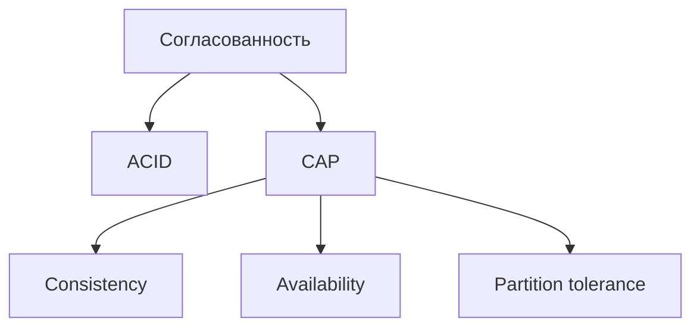
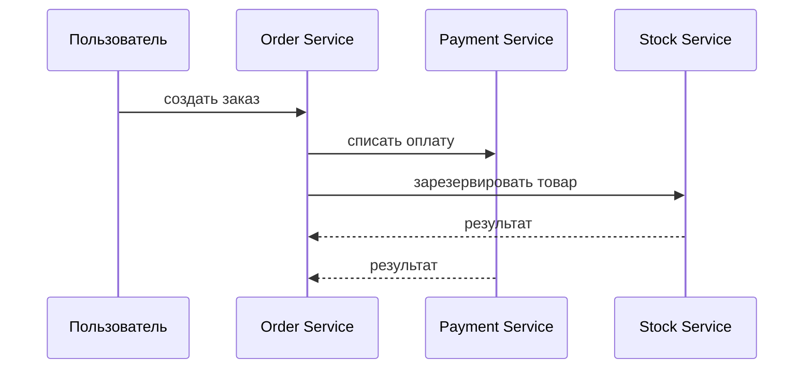
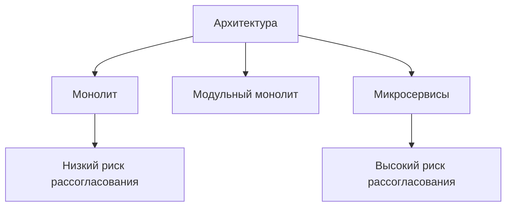
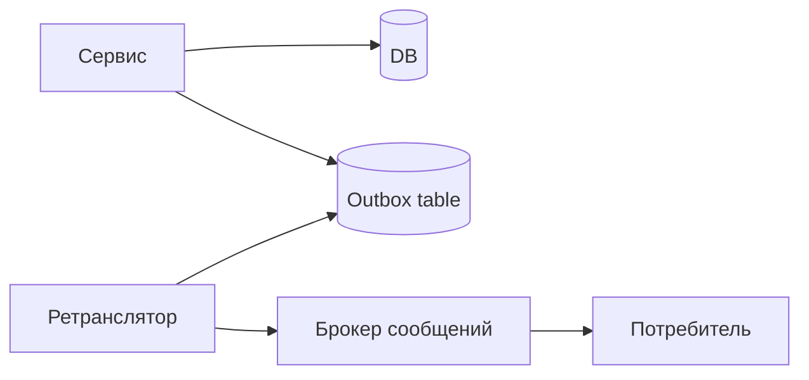
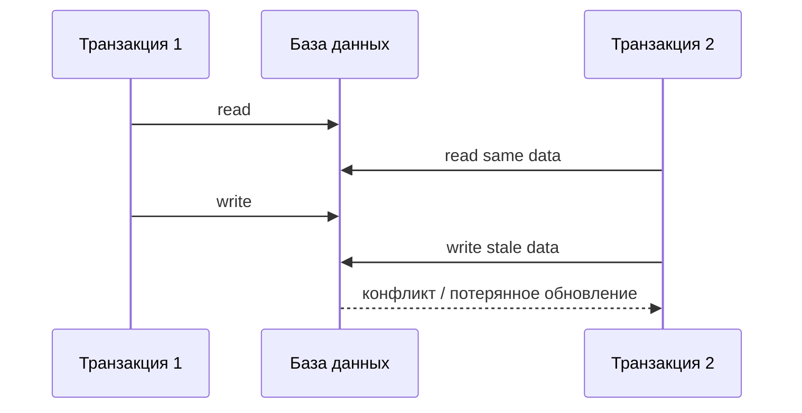
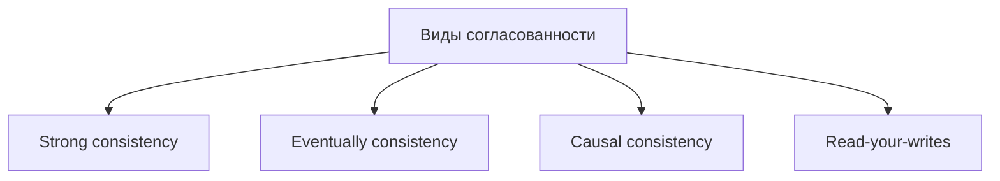
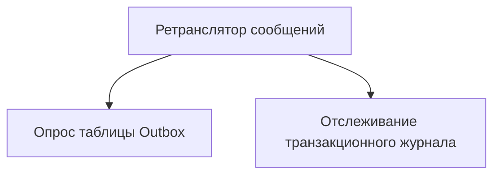
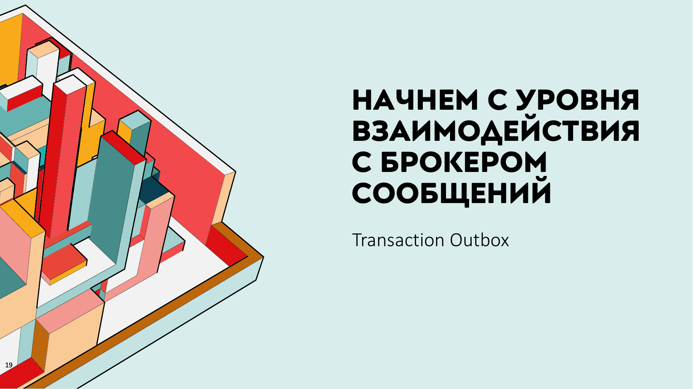
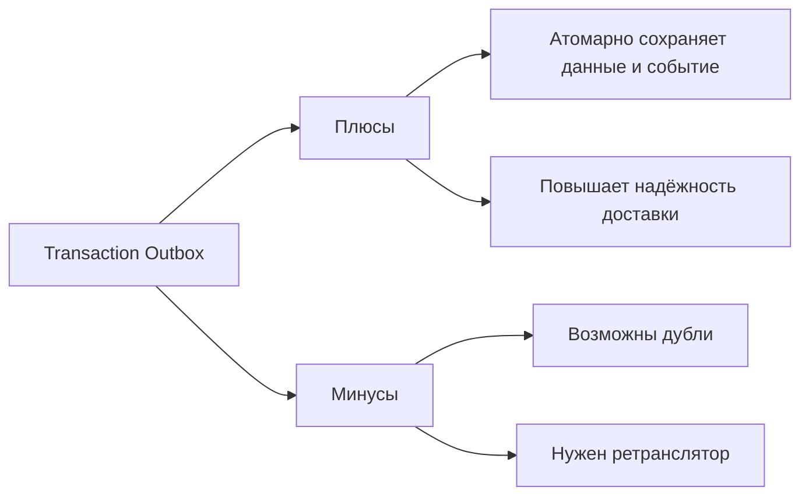

# Лекция 12. Паттерны отказоустойчивости при межсервисном взаимодействии

Наша сегодняшняя задача – посмотреть, а какие в принципе могут быть проблемы, какие самые часто используемые паттерны для решения этих проблем, в каких местах эти проблемы могут случиться, и где какой паттерн правильнее применять. Но пробежимся опять по самым азам. Нужно ли вообще какие-то паттерны применять, если у нас монолитная архитектура, когда… Все приложение является одним процессом и работает с одной базой данных. Здесь проблем вообще никаких быть не может. И даже если они возникают, то все эти проблемы решаются на уровне транзакции базы данных. И в целом вы можете взаимосвязанные какие-то... участки логики обернуть в одну транзакцию на уровне базы.

К примеру, вы регистрируете заказ продажи какой-нибудь бытовой техники в магазине и сразу же делаете в этой же транзакции списание денег. Если что-то из этих двух операций пойдет не так, то делаете откат транзакции и делаете это действительно на уровне систем управления базами данных.

## Согласованность в разных архитектурах

#### ACID, CAP и согласованность

**Слайд 7: СОГЛАСОВАННОСТЬ В РАЗНЫХ КОНТЕКСТАХ**

::: warning Текст слайда из PDF
СОГЛАСОВАННОСТЬ В РАЗНЫХ КОНТЕКСТАХ

• ACID — набор требований к транзакционной системе, обеспечивающий
  наиболее надёжную и предсказуемую её работу — атомарность,
  согласованность, изоляцию, устойчивость; сформулированы в конце 1970-х
  годов Джимом Греем

• Теорема CAP — эвристическое утверждение о том, что в любой реализации
  распределённых вычислений возможно обеспечить не более двух из трёх :
    • согласованность данных;
    • доступность;
    • устойчивость к фрагментации.
:::

**Слайд 9: ПРИМЕР**

**Слайд 11: РИСК РАЗЛИЧНЫХ АРХИТЕКТУР**

#### Отказоустойчивость и распределенная согласованность

**Слайд 26: СХЕМА РАБОТЫ**

**Слайд 52: ПРИМЕР ПРОБЛЕМЫ ИЗОЛЯЦИИ ТРАНЗАКЦИЙ**

Поэтому никакой здесь несогласованности быть не может, и в принципе никаких проблем при монолитной такой архитектуре у нас возникнуть не должно. Но мы понимаем, что жизнь на самом деле гораздо сложнее, чем монолит, и монолит удобен. И я уверен даже, что, наверное, в 50% всех стартапов достаточно монолита, потому что... Эта половина стартапов не доживет до какой-то роста популярности своего сервиса, когда им нужно будет задуматься о масштабируемости. Поэтому, возможно, Monolith был бы и лучшим решением, не так много бы времени потратили на разработку, прежде чем сворачивать бизнес. Но есть и модульный Monolith, о котором мы поговорим на самой уже последней лекции, потому что на эту тему семинар мы давать...

Точнее, контрольную работу на эту тему мы давать не будем, поэтому модульный монолит как альтернатива, некое промежуточное явление между микросервисной архитектурой и монолитной архитектурой, мы об этом еще поговорим. Но, конечно, говорить о надежности транзакций наших, межсервисного взаимодействия стоит, когда речь заходит о микросервисной архитектуре. Потому что здесь каждый сервис изолирован. У каждого микросервиса своя база данных. Да, каждый микросервис сможет обеспечить надежность транзакций на уровне своей логики. Но между этими микросервисами единой какой-то гарантии того, что все части были выполнены, а если какая-то из них не выполнена, то нужно отменить все. Вот такую транзакцию на ряд микросервисов мы можем дать.

Но не на уровне базы данных, а на уровне архитектурных паттернов. И вот об этом мы будем говорить. Поэтому что хорошего в микросервисе? Хорошо, что это действительно масштабируется. Масштабируется горизонтально. Это отлично, но плохо, что действительно повышается порог вхождения и повышается завязанность либо нас, разработчиков на DevOps, либо нанимать девопсов вот ну что это немножко все сложнее в развертывании ну и как я говорил про это будет правда еще отдельная лекция модульный монолит вот в целом физически он монолит это один процесс и более правильно по все-таки иметь одну базу данных хотя есть веяния или Евангелисты того, что на каждый сервис, на каждый модуль можно прикручивать свою базу.

Но изначально все-таки модульный монолит такой зарождалась движение архитектура, которое говорило о том, что да, каждый из модулей нужно проектировать так, как будто бы он не зависит от другого модуля, как будто бы он микросервис. Но на самом деле это один запускаемый процесс, то есть один инстанс. И так как это все-таки физически ближе к... Поэтому одна база. Вот с нее гораздо проще перейти на микросервисную архитектуру, если изначально спроектировать свой монолит именно по принципу модульности.

На самом деле есть куча еще решений. Это вы будете проходить чуть позже на третьем курсе в предмете архитектуры информационных систем. Поэтому тоже тут время тратить не буду. А перейду к тому, что вообще я уже несколько раз употребил слово «согласованность данных». Согласованность данных, в зависимости от того, в каком контексте мы употребляем эту фразу, этот термин, она может быть согласованность на уровне какого-то модуля, приложения или базы данных.

### ACID и CAP

**Слайд 51: ИТОГ ПО РАСПРЕДЕЛЕННЫМ ТРАНЗАКЦИЯМ**

| Свойство ACID | Формулировка | Итог для распределенных транзакций |
|---|---|---|
| Atomicity | либо применится целиком, либо нет | eventually да - ставим |
| Consistency | система останется консистентной | eventually да - ставим |
| Isolation | транзакции не влияют друг на друга | нет |
| Durability | если что-то сохранили - оно сохранилось | да |

Так называемые ACID-требования. которые говорят о том, что наша система должна быть, ну или наши операции в системе должны быть атомарны. То есть вот выполняются, и наша система говорит, что если мы начали выполнение, то мы либо его закончим, либо его не закончим. Они должны быть согласованы, изолированы. Ну, тут больше изолированы нас будет волновать, потому что этого мы обеспечить не сможем в распределенных системах. К сожалению, это сложно достижимо. Но это не так страшно, и об этом мы поговорим. Изолированность – это когда процессы, происходящие в одном модуле, в одном микросервисе, не влияют на другой микросервис. Это если, к примеру, мы начали в одном микросервисе оформлять заказ и отправили сообщение.

Неважно, другому микросервису через шину, либо синхронно по REST отправили сообщение, что мы начали оформлять заказ, он начнет списывать деньги, а у нас произойдет на уровне нашего микросервиса, согласно ACID, произойдет откат транзакции. То есть в базе данных... Что произойдет? Да просто он не сможет выполнить по каким-то причинам коммит нашей операции и произойдет обратный... как бы rollback транзакции, и товар не будет продан, а деньги списали. Это как раз про изолированность процессов. Мы ее должны гарантировать. Но запомните, мы ее не сможем гарантировать, и тут это не страшно. Главное, правильно уже спроектировать систему так, чтобы наша невозможность гарантировать изолированность не вышла нам боком уж совсем отрицательно.

А как-то с минимальными потерями из этой ситуации надо будет уйти. В общем, это достаточно старая такая теорема. Есть более современные трактовки, которые относятся больше к нам, к распределенным вычислениям, к микросервисам. Это каптеорема, которая говорит о том, что надо бы обеспечить согласованность, доступность и устойчивость, но как... Вот эта вот трилемма говорит о том, что, к сожалению, на трех стулах вы не усидите. И необходимо выбирать только два пункта из трех. Соответственно, мы будем чаще всего выбирать из согласованности и доступности. Но вот про эту трилемму мы еще поговорим, когда будем рассматривать как раз паттерны отказоустойчивого взаимодействия микросерфисов.

### Виды согласованности

**Слайд 8: ВИДЫ СОГЛАСОВАННОСТИ**

**Слайд 28: ВИДЫ РЕТРАНСЛЯТОРОВ**

- Если говорить про виды согласованности в целом, не завязываясь на какую-то пока архитектуру.

Хотя, конечно, каждый вид согласованности проще обеспечивается в том или ином архитектурном решении. Но давайте заострим внимание на трех видах согласованности. Сильная согласованность, когда у нас изменения в одном узле сразу же видны в другом узле.

- Это сейчас не про базу, а в принципе про модули либо про микросервисы.

Второй вариант, когда у нас изменения в одном узле рано или поздно будут видны во втором узле. И третий вариант нам менее интересен, но тем не менее он тоже привязан к определенному архитектурному решению. События связаны причинно-следственными изменениями. Некий сервис А и некий сервис Б. Два узла, необязательные микросервисы, два модуля. Мы обновляем запись в первом узле, то есть в какой-то таблице или в базе данных отдельной. И хотим, чтобы в узле Б появилось соответствующее действие, появилась соответствующая запись. Мы производим продажу товара. у нас должен произойти оплата счета.

- Если в зависимости от того, какие модели согласованности мы используем, то это выглядит так, что при Strong у нас B сразу увидит обновление, при Eventual у нас он увидит с каким-то запозданием, но увидит.

Вариант третий в событийно-архитектурном паттерне используется. Он увидит изменения в узле B, если увидит сопутствующие какие-то изменения в этом же узле. строгое соответствие через уровень транзакций базы данных. Ну, потому что вы либо обновляете узел А и обновляете узел Б, либо производите откат транзакции. Поэтому изменения в А точно сразу же будут известны в узле Б.

### Риски микросервисной архитектуры

Да, и есть риски, что он, в принципе, к другому процессу не придет никогда. И поэтому не факт, что изменения в B вообще произойдут. Поэтому теоретически им ничего не мешает произойти, если процесс дойдет до модуля B, но он может туда не дойти, по каким-то причинам свет отключили. Поэтому это, на самом деле, не так-то уж все тут и сладко. Но, тем не менее, это немножко проще лечится, нежели в eventual согласованности в микросервисной архитектуре. Но действительно, здесь как бы действительно очень серьезные могут быть проблемы, если до модуля B мы не дойдем. В микросервисах мы чаще всего сталкиваемся с eventual и в событийной архитектуре. А, ну да, тоже чаще всего с eventual, что рано или поздно изменения в микросервисе A дойдут до микросервиса B.

Есть ли какие-то риски? Ну, если не учитывать того, что у нас до процесса, до модуля B, до функционала части B мы можем по каким-то причинам не дойти, то в целом у Monolith никаких рисков о несогласованности не может быть. Но тут в целом, если мы не дошли до модуля B, то какие-то проблемы у нас. В модульном монолите, да в принципе, только если модули имеют отдельные хранилища, то тогда у нас вариант несогласованности между модулями чуть выше, чем в монолите. А в микросервисах, да, всегда будут проблемы, и как раз об этом мы и будем разговаривать, а как эти проблемы минимизировать или как сделать их управляемыми. Ну и в других архитектурах есть свои проблемы. Да, здесь я привел не совсем архитектуру, а скорее нотацию, паттерны.

Поэтому не имеет отношения. У нас каждый микросервис может быть построен по гексагональной или чистой архитектуре. Но здесь, для примера, если это монолит, то... Нет, проблем никаких по согласованности нет. Или если это отдельный микросервис, в каждом отдельном микросервисе мы тоже можем дать гарантию осид транзакций. Почему в принципе согласованность это сложно, особенно в микросервисной архитектуре? Потому что куча проблем. Проблемы могут быть в сети, проблемы могут быть в отказе каких-то узлов, проблемы в том, что мы не можем дать гарантию выполнения... Глобальные транзакции, которая распределена по нескольким микросервисам, какого-то готового механизма его нет. Поэтому проблемы действительно куча.

Давайте рассмотрим на примере работы интернет-магазина, где есть ордер-сервис и сервис оплаты. Если бы это был монолит, как один бэкэнд, с этими сервисами, то мы бы могли дать гарантию обычным механизмам транзакций. То есть у нас в Monolith нет никаких проблем, мы открываем транзакцию, прописываем в таблице, делаем изменения, что товар продан такому-то человеку, и делаем изменения, что списываем деньги с такого-то счета. Ну или фиксируем, что этот счет не оплачен. Если где-то произошел сбой либо в первом, либо в втором действии, то мы делаем полный откат этих операций и как будто бы ничего нет. Потом просто ретраим второй раз, пробуем выполнить эту операцию. На уровне монолита согласованность данных обеспечивается уровнем базы данных.

А в варианте микросервисной архитектуры... Здесь у нас куча вариантов, куча проблем, которые могут произойти. Проблема первая. У нас в ордер-сервисе происходит создание заказа, ну и одновременная отправка сообщения, допустим, в брокер сообщений, либо по синхронным образом по REST мы отправляем события в другой микросервис, что необходимо произвести оплату. Событие, в принципе, может не улететь. Кто тут выиграет? Покупатель выиграет. У нас, по сути, заказ будет оформлен, но оплата не будет произведена. Скорее всего, это легко вылечится, и мы просто увидим, что оплата не прошла, позиция не оплачена, и товар ему не отдадут, но, тем не менее, проблема может случиться. Поэтому деньги могут не списаться. Точнее, они не спишутся.

Вторая проблема, что все-таки сообщение ушло, и это уже хуже. Заказ у нас создается, но он отправляет сообщение другому микросервису, что необходимо списать деньги. Деньги списываются, а здесь происходит откат транзакции. По каким-то причинам база не смогла создать, ID-шники кончились, или память на сервере кончилась. Происходит, в общем, rollback. И заказ отменяется, а деньги списали. Это уже неприятно. Третий вариант тоже ничего хорошего, даже еще хуже. По каким-то причинам у нас происходит отправка двух сообщений от сервиса ордер о том, что необходимо списать деньги. И, соответственно, два таких сообщения пеймента. получает два сообщения от ордер-сервиса, получает payment-сервис и, соответственно, два раза списывает.

Да, это лечится, лечится патентностью, когда мы делаем такие операции, ну или настраиваем наш payment-сервис таким образом, что он понимает, что это прилетел еще один такой же, такой же месседж с таким же ID-шником. Про определенный заказ. Вот ноутбук мы купили, ему уже прилетело, что такой-то человек должен заплатить за ноутбук. А потом еще по каким-то причинам отправляется еще одно такое сообщение. И если мы настроим патентность, то у нас проблем не будет, и Payment Service это переживет. Но к чему это я? К тому, что у нас с одной стороны мы должны дать гарантию, что сообщение в принципе туда улетело. Мы должны дать гарантию, что, а если туда улетело с одного микросервиса два сообщения, чтобы тот второй микросервис не списал два раза.

Мы должны дать гарантию, что если на втором микросервисе оплата не прошла, то он должен каким-то образом первому сказать, слушай, отменяй заказ, на карте денег нет. И вот это вот, видите, три вещи я назвал, и это три совершенно разных паттерна. Ну, один из них, ладно, не совсем паттерн, вот эта патентность наших мессенджей, которые прилетают на второй сервис, то есть он их не должен, ну, их выполнение не должно изменить состояние. Два, три или четыре раза он выполнит это все должно быть как один. Либо он пусть не выполняет второй, третий, четвертый раз. А то, что... У нас есть гарантия, что сообщение от одного микросервиса, ордер, улетит в пеймент. Это, соответственно, паттерн Outbox.

А гарантия, которая обеспечит вот эту распределенную транзакцию, это чаще всего **Saga**. Поэтому плавненько переходим к тому, какие в принципе гарантии мы можем дать. Если мы совсем не будем париться, то мы как бы... по умолчанию наш брокер сообщений, допустим, Kafka, но, правда, там совсем вообще ничего делать не надо, то у нас будет гарантия at most once. Тут нехорошая фраза, что используется в большинстве случаев, на самом деле так никто не делает. Просто если ничего не делать, это из коробки так работает. Но это совершенно, да, сейчас я понял, что звучит, используется в большинстве случаев, как будто все это используют. Конференцию DotNext, которую я смотрел, там как бы из полного зала, где-то человек 200, никто руку не поднял, что он такое делает.

То есть так делать нельзя. Так оно получится, если вы ничего делать не будете. Потому что, ну, блин, это отсутствие, в принципе, каких-то гарантий. Мы отправили, да и фиг с ним. Получил он, не получил, мы не знаем. Ну, либо у вас действительно... по каким-то причинам вам нет необходимости гарантировать доставку сообщений, и у вас бизнес-процесс построен так, что да и пофигу. Один микросервис отправил второму, дошло сообщение, до второго микросервиса не дошло, это никак не повлияет на работу. Но в реальности такое редко бывает, поэтому, конечно, так нельзя, так не надо. Второй вариант – это гарантия того, что сообщение будет доставлено хотя бы один раз. Но, к сожалению, оно может быть доставлено два и более раз.

И вы должны это понимать и, как один из вариантов, настраивать второй микросервис, чтобы он либо дедупликацию делал. убивал повторные сообщения, либо эти сообщения должны поддерживать, быть патентны, то есть не изменять состояние второго микросервиса при втором получении. Ну и третий вариант, он недостижим, это как бы без человеческого участия и зрительного наблюдения и разгребания очередей, то есть прямо запрограммировать логику exactly once практически Сколько бы я не искал каких-то вариантов, все равно. А вот в таких-то исключительных ситуациях этот вариант не даст вам гарантию exactly once. Как мы можем дать гарантии? Понятно, одним решением дать гарантии в целом невозможно.

Мы можем дать гарантию того, что отправляемое сообщение точно будет доставлено другому микросервису. Это у нас один паттерн. Мы можем гарантировать... что он не будет исполнять повторные сообщения, наш второй микросервис, это совершенно другими вариантами мы можем добиться. И мы можем добиться вот этой распределенной транзакции совершенно как бы третьими способами или другими паттернами.

Начнем с уровня взаимодействия с брокером сообщений.

### Transaction Outbox

**Слайд 19: НАЧНЕМ С УРОВНЯ**

**Слайд 24: TRANSACTION OUTBOX**

**Слайд 31: ПЛЮСЫ И МИНУСЫ TRANSACTION OUTBOX**

**Transaction Outbox**. Есть еще его частное решение Transaction Inbox, но это просто в какую сторону смотреть. В сторону, что мы отдаем, наш микросервис отдает в брокер сообщение, либо с другой стороны, что мы сообщение принимаем. Идея реализации одна и та же. Что может пойти не так при общении с брокером сообщений? Для примера возьмем с Кавкой. Мы можем из сервиса А отправить сообщение, и оно просто не доходит до микросервиса Б. Оно не доходит до брокера. Здесь, не применяя паттерна Outbox, что мы можем сделать? Мы можем настроить на стороне брокера о том, чтобы он нам отчитывался, получил ли он сообщение, либо не получил.

- Из минусов, во-первых, у нас может брокер этого не поддерживать, в зависимости от того, какой брокер.

- Во-вторых, получаем увеличенное время отправки таких сообщений.

То есть на каждое сообщение, которое даже то, что он получил, он будет нам обязан отчитаться, что он получил. Если он не отчитывается, мы понимаем, что он не получил. То есть это задержка работы. Второй вариант, что брокер получил и упал. Решение. Но мы опять же можем настроить отправку реплики сообщений, но минус этого решения – опять у нас увеличивается расход памяти, необходимый для обмена этими сообщениями. Второй вариант – это дублирование сообщений. Что у нас может быть на брокер отправлено два раза одно и то же сообщение. Это приведет к двойному списанию денег, как вариант. Как с этим бороться?

Ну, придется настраивать дедупликацию на брокере, либо решать вопрос идемпотентности вот этих команд, чтобы брокер понимал, что это прилетело второй месседж, абсолютно такой же, как который прилетел там секундой раньше. Уникальный идентификатор ему давать. Ну, то есть это, во-первых, опять же, не все брокеры могут позволить. И, ну, как бы часто используемый окей, усложняется разработка на стороне. поставщика сообщений. И еще одна проблема, которая может случиться, это то, что поставщик не уверен в порядке тех событий, которые он отправляет. И здесь, опять же, мы можем научить брокера, если он поддерживает очередь с приоритетом, мы можем научить брокера разбирать месседжи в нужном порядке и настроить их обработку.

Но получаем опять кучу проблем, что либо придется писать свой брокер на тарантуле или настраивать готовый, и увеличиваем нагрузку на брокер. Но в целом это все можно было бы, все эти проблемы, которые я описал, можно было бы решить, используя паттерн Outbox. В самом таком простом приближении он выглядит следующим образом. Мы на микросервисе, допустим, разбираем заказ, микросервис-заказ и микросервис-оплата. Мы на стороне микросервиса с заказом прописываем в базе данных. Ну, сейчас пока попроще. Чуть позже разберем, что можно и не в базе, можно и в логах это делать. Ну, самый простой вариант. Прописываем в базе микросервиса о том, что создается заказ. И в той же транзакции, то есть вот эти две операции, либо они выполнятся, либо они не выполнятся.

В той же транзакции записываем события в дополнительную таблицу. Если это реляционная база, если это Монго, то возможно это просто еще одно поле будет в нашем документе. Но мы записываем сообщение о том, что надо бы отправить. письмецо нашему брокеру, месседж нашему брокеру, чтобы он отнес это в другой микросервис. Если это зафиксировать в отдельной таблице, то есть в базе, если вот это действие зафиксируется, то брокер не отвертится. Даже если он лежит, он поднимется и считает оттуда это сообщение, поставит флаг, что он считал. Как он считает, сейчас тоже там есть два механизма. Но общая идея. Мы записали, что заказ создан, и записали, надо бы произвести оплату. И это сделали мы одной транзакцией.

То есть если посмотреть здесь пример, то вот мы видим в одной транзакции на нашем микросервисе Order Service произошло две вещи. Вставили в таблицу Order информацию о том, что заказ создан, и вставили в таблицу Outbox. типа исходящие письма о том, что необходимо бы отправить сообщение в брокер сообщений, и чтобы он нам это отправил в микросервис оплаты. И только потом, если эта транзакция выполнилась, то потом мы каким-то образом, сейчас поговорим, какие есть варианты, каким-то образом... Это либо отдельный процесс, либо отдельный микросервис. Мы читаем эту таблицу. Опять же, не факт, что это таблица. Потому что, допустим, PostgreSQL дает нам возможность читать логи.

Таким образом, мы не напрягаем таблицу, а смотрим логи. Но об этом тоже чуть попозже. Какой-то процесс вытягивает данные из вот этой таблицы Outbox. И только лишь после того, как он вытянул и отправил в соответствующий брокер, только после этого он фиксирует, что помечает, что данное сообщение было отправлено. Он не удаляет, а делает отметку, что оно было отправлено. Вопрос, кто это использует, это все используют. Сначала начал гуглить. Реально паттерн используется практически везде, кто пишет на микросервисах. Очень многие используют вместе с Kafka такой фреймворк, который позволяет... А сейчас мы посмотрим на примере вот этого механизма, каким образом мы можем из аутбокса вытаскивать или нам как-то аутбокс будет отправлять.

Письма, которые необходимо кинуть в брокер.

Давайте посмотрим схему работы. Общая схема выглядит следующим образом. Есть микросервис продаж, который работает с базой данных. Единственное, что в стандартную таблицу, ну, он имеет стандартную таблицу ордеров, где создаются ордеры, ну, информация о продажах. И он имеет еще одну таблицу. работающие на insert, которая служит для хранения этих мессенджей, которые должны будут позже улететь в брокер сообщений. Если это реляционная база. Еще раз, если это не реляционная, то это, возможно, просто добавленное поле в документ, который вы сохраняете. Вот этот вот, который здесь бы лежал в таблице ордер.

Дальше у нас появляется дополнительное звено.

### Ретранслятор сообщений

Ретранслятор сообщений. который, как я и говорил, мы можем писать сами, но это достаточно сложно, и есть решения, и они хорошие. Как где-то на предыдущих слайдах, но это одно из самых популярных. Кибизиум.

Давайте посмотрим, что он делает, этот ретранслятор сообщений. Суть ретранслятора, он может быть двух вариантов. Первый вариант, он опрашивает издателя, работает как пулинг. Второй вариант, он отслеживает транзакционный журнал базы данных. Но об этом сейчас давайте подробнее о двух и поговорим. Первый вариант нашего ретранслятора, это постоянно, раз в три секунды, если можем позволить, раз в минуту мы настраиваем наш ретранслятор, чтобы он... с какой-то периодичностью проверял табличку аутбокса. Есть или нет там мессенджи, которые необходимо отправить нашему брокеру. Если брокеру он отправляет, то он помечает, так как таблица работает только на обновление, добавление, он помечает, что данное сообщение отправлено.

А здесь, соответственно, данные уже есть. Второй вариант ретранслятора, если база данных это позволяет, то ретранслятор может работать по следующему механизму. База данных в момент добавления в таблицу Outbox ведет соответствующий лог.

Если база данных поддерживает такой механизм, то тогда при изменении Outbox у нас изменяется таблица логов, и механизм базы, определенный процесс в базе данных, уведомляет этот ретранслятор о том, таблице логах появилась новая запись о сообщении которое необходимо отправить брокеру сообщений и получается что при таком варианте мы не засоряем таблицу аутбокса в базе данных частыми запросами там каждую секунду допустим а происходит только наоборот автоматическое уведомление нашего ретранслятора о том что появился новый лог Но, еще раз повторюсь, база данных должна это поддерживать и предоставлять такой механизм. Ну и, соответственно, ретранслятор должен уметь слушать и уведомлять брокер сообщений.

Ну, как я и говорил, связка, при которой Dbizium и Kafka, ну и PostgreSQL, вот это легко обеспечивается. Плюсы и минусы данного паттерна. Но в целом больше, конечно, положительных моментов.

- Из минусов, наверное, только усложняется процесс разработки, потому что появляются новые прослойки, и, соответственно, замедляется отправка этих сообщений.

Это может не быть заметно на тысячи операций в секунду, но может быть уже заметно на десяти тысячах операций в секунду. То есть мы можем немножко увеличить отзывчивость наших микросервисов. Зато повышаем гарантию доставки. То есть, ну, по сути, у нас стопроцентная гарантия. Если мы зафиксировали это в базе, то неважно, вырубится у вас микросервис ордер, который хранит уже в базе данных информацию о том, что ордер был создан, но сообщение пейменту не было отправлено. Поэтому, когда он поднимется, рано или поздно ретранслятор вытащит оттуда ранее неисполненное сообщение и выполнит его. Ну, а если брокер сообщения упал, да без разницы. Когда брокер поднимется, ретранслятор вытащит и кинет брокеру.

И зафиксирует, что все, я отправил это сообщение из аутбокса, оно ушло. Поэтому у нас появляется стопроцентная гарантия общения сервиса с брокером сообщений. Это мы поговорили про гарантии общения микросервиса с брокером сообщений. За счет аутбокса, действительно популярный паттерн и используется практически всеми, у нас появляется стопроцентная гарантия того, что все, что мы хотим отправить в другой микросервис, это точно дойдет до брокера. Вопрос только остается уровень. межсервисного взаимодействия, когда мы хотим получить такую глобальную транзакцию. Допустим, у нас происходит бронирование номера, на втором этапе идет бронирование автомобиля в каршеринге, в путешествии, на третьем этапе билет покупаем. И в целом это всего одного оператора.

Если что-то из этих шагов не выполнится, то мы не хотим, чтобы вообще это закоммитилось. Половина этого действия. Нам либо все, либо ничего. И получается, мы начинаем рассуждать о неких гарантиях глобальной транзакции, которая теперь раньше в монолите, она была в монолите и обеспечивалась ACID-гарантиями на уровне базы данных. То сейчас... У нас нет. Но каким-то образом мы должны дать с помощью паттернов гарантию, вот эту глобальную ACID-гарантию, что если какое-то из действий не будет выполнено, то надо откатить все.

Значит, чего мы хотим гарантировать? Допустим, у нас есть несколько микросервисов. Конкретно в каждом микросервисе у нас есть транзакционная гарантия. Мы либо можем что-то начать обновлять в таблице, если она не обновится, мы можем сделать rollback транзакции. На уровне каждого микросервиса мы можем дать так называемую ACID гарантию.

### Распределённые транзакции

А на уровне всех микросервисов мы такой распределенной гарантии дать не можем. не выполняет свою транзакцию, то есть происходит ошибка сохранения в базе или ошибка какого-то действия, не можем списать деньги со счета, то, соответственно, нам нужно каким-то образом компенсировать произведенную транзакцию в предыдущем микросервисе. Вот это как раз делается средствами либо хореографии, либо регистрации. Общее название это...

Значит, как мы можем это гарантировать? На примере есть распределенная система, которая написана так, что один микросервис отвечает за бронирование билетов на самолет, второй отвечает за бронирование номера в отеле, и третий отвечает за бронирование автомобиля. Ну и понятно, если мы купили билеты, но не смогли найти номер, нужный нам, или нашли номер, но не смогли найти автомобиль, взять в аренду, то мы говорим, да блин, пошло оно все к черту, отпуск отменяется. И нам должны вернуть деньги за отель, вернуть деньги за купленный билет. Ну или, точнее, даже если не списали, то отменить закоммиченную транзакцию, которая в конкретном микросервисе произошла, в этом микросервисе произошла, нам надо как-то ее отменить. Вариантов есть. Несколько.

Один из них, как бы, сейчас я скажу, опять все запрещают, не рекомендуют использовать за счет того, что да, там стопроцентная гарантия, но это работает очень медленно. Двухфазный коммит. Его действительно называют, ну, сокращенное название 2PC. Суть двухфазного коммита заключается в том, что появляется некий координатор. который в виде отдельного процесса, в виде отдельного сервиса. Этот координатор пытается осуществить продажу билета на самолет. И смотрит этот сервис, который занимается продажами билета ОК. Если он говорит ОК, то тогда тот пытается закоммитить операцию бронирования отелей.

Если бронирование отелей ОК, то только после этого мы говорим, координатор говорит, слушай, ну я проверил, первый готов, второй готов, давай-ка быстренько первый комить и потом быстренько второй комить. Плюсы этого решения – это реально просто реализовать, это легко наблюдать и доказуемо, что оно либо работает, либо не работает. Никаких подводных камней здесь нет.

### Saga

В отличие от **Saga**, которая нам не гарантирует буковку I из ACID. Сейчас мы поразбираем. Минусы. Ну, у нас единая точка отказа — это, собственно, вот этот координатор. И второй минус. Если у нас очень много микросервисов участвуют в такой цепочке, то придется клиенту ждать самого медленного микросервиса. Пока он не скажет, что он готов, ну окей, будем. Ну а пока он скажет, может произойти такое, что в принципе уже и первый закоммититься не сможет, потому что все билеты там разобрали на самолет. Поэтому паттерн не рекомендован к использованию из-за того, что он реально очень медленный. Вариант номер два, его можно поделить на две части. Это сага. заключается в том, что каждый из микросервисов может запустить компенсационную транзакцию.

То есть сказать, что, слушай, я не смог выполнить свое действие, допустим, я не смог найти отель. Тогда надо бы предыдущее действие, которое было успешно, транзакция прошла, мы продали билеты на самолет, надо бы отменить. И по сути он отправляет месседж предыдущему микросервису, что отмени транзакцию. Делает компенсационную транзакцию, то есть обратное действие. И вот эта **реализация** с компенсационными транзакциями бывает двух видов. За счет САГИ мы обеспечиваем глобальную транзакцию. Потому что каждый из микросервисов может обеспечить локальную транзакцию, либо применить, либо не применить ничего, либо применить все.

А в общей сумме **Saga** позволяет локальные примененные транзакции либо зафиксировать, что да, все окей, либо запустить обратный конвейер по отмене за счет вот этих компенсационных транзакций. Два варианта есть. Хореография. Ну, собственно, она здесь и нарисована. Это когда каждый микросервис знает, как ему общаться с предыдущим и с следующим. И в целом, если у вас бизнес-процессы утверждены, не слишком-то часто меняются, и в принципе логика взаимоотношения самого бизнес-процесса не слишком распределена по микросервисам, и вы как бы способны это контролировать, и в целом это не часто, еще раз повторюсь, меняется, то хореография достаточно будет правильным выбором, когда вы просто каждому микросервису объясняете, как сообщить другому микросервису и что.

И каждый микросервис знает, какую компенсационную транзакцию отправить и кому ее отправить, если его транзакция не закоммитилась. Второй вариант построения саги — это артистрация, когда выделяется отдельный сервис, который контролирует повествование, эту сагу. В «Монолите» почему «Монолит» связанный? Пинаем этот метод. А в микросервисах мы дергаем API. Тут смотрите, что использовать. Если у нас бизнес-процессы не такие уж и сложные, то не страшно, что... Проблема же в переписывании. Я два или три раза сказал, что если вы уверены, что ваши микросервисы, бизнес-сценарий не переписывается, то в целом не так страшно завязать один микросервис на другой. Если, конечно, появится четвертый шаг и пятый шаг, это неудобно.

Придется переписать микросервисы и объяснить им, куда они должны отправлять. Поэтому да, возможно, хореография не самый лучший вариант, если процесс еще только выстраивается. Он, скорее всего, если вы с модульного монолита переходите на микросервисную, то хореография будет идеальна. У вас уже в модульном монолите все отработано. Вы понимаете, что вы уже с заказчиком все утрясли, он уже не меняет требования, и вы просто переписываете, пишете сагу по хореографии.

Ну а если действительно количество микросервисов, участвующих в этой распределенной транзакции, велико, вы постоянно меняете, ну не вы, а заказчик постоянно меняет правила. добавляет новые какие-то этапы то лучше рассмотреть но чуть более сложную в реализации сагу через оркестрацию когда у вас вот в этом оркестраторе как бы он определяет какой микро сервисы ему сейчас дернуть там продажа билетов на самолет дожидаясь ответа потом он определяет какой микро сервис последующую очередь дернуть но и контролирует что если какой-то из микросервисов не дал ему ответа то соответственно запускает компенсационные транзакции которые откатывают все что было сделано предыдущими микро сервисами ну собственно теперь попытаясь это собрать воедино как раз на основании того доклада от с конференции где яндекс рассказывал как это Реализовано у них этот модуль.

Сейчас будет такое краткое повторение, но просто под другим соусом. Если у вас монолит, то проблем никаких быть не может. Все проблемы решаются тем, что вы даете ACID гарантии на уровне базы данных, и у вас либо все применяется, вы коммитите, либо делаете rollback транзакции, и все действия отменяются. Поэтому, да, в Monolith данный сценарий реализовать легко. Вы можете без проблем забронировать билеты, номер в отеле, автомобиль и потом одной командой закоммитить это все в базе. Либо отменить, если какого-то автомобиля нет. Если это все-таки микросервисная архитектура, то на уровне микросервиса вы можете дать... вот эти ACID гарантии транзакционные, что забронировали билет, забронировали, но не получилось забронировать отель.

И возникает вопрос, как дать гарантию распределенной транзакции. Как я говорил, есть решение двухфазного коммита, который достаточно медленно работает, замедляет работу, особенно если у вас количество микросервисов не два, а гораздо больше. Получается, нужно будет дождаться, пока самый последний микросервис ответит, и только после этого пытаться дать приказы на коммит. При этом они могут уже не закоммитить действия, потому что какие-то реальности изменились. Поэтому не рекомендован. Несмотря на его железобетонность и... правильности, никаких скрытых проблем здесь нет. Из-за его медленности именно, из-за его вот такого многораундного общения с микросервисами координатора, он не рекомендован в современных таких архитектурных решениях распределённых.

Поэтому альтернатива двухфазному коммиту — это сага, в которой каждый из микросервисов в случае невыполнения ACID транзакций, может отдать приказ на компенсационную транзакцию предыдущему микросервису. Ну и, соответственно, если на каком-то этапе мы не можем выполнить действия, мы отдаем приказ на отмену предыдущего действия предыдущим микросервисом, ну и в конечном счете либо действие будет применено целиком, либо не применено в принципе. Как сага, поддерживает принципы атомарности, согласованности, изоляции и надежности. То есть вот эти ACID-принципы. Да в целом практически идеально, кроме изоляции. Атомарность **Saga** гарантирует на 100%. Либо мы все сделаем, либо не сделаем ничего.

За счет компенсационных транзакций она либо может все откатить, работу предыдущих микросервисов, либо, если оно дойдет до финиша, будет атомарность. Согласованность, да. После успешных всех действий мы получаем базы в различных микросервисах в согласованном состоянии. Про изоляцию у меня будет отдельно несколько слайдов. Положительно негативные и негативно отрицательные. Изоляции, плохо это или хорошо, точнее, это в любом случае плохо, но с этим придется жить. Поэтому изоляцию мы не можем гарантировать. То есть параллельно начатые процессы в одном микросервисе, ну вот смотрите, сейчас, двухфазный коммит, да, он гарантирует нам изоляцию, потому что мы сначала опросили все сервисы, могут они, не могут, а потом мы приказываем закоммить.

Он говорит, закоммитил. Мы говорим, ты теперь закомитил. То есть там выполняется это хоть и медленно, но последовательно. Но есть некая гарантия изоляции. В саге нет вообще гарантии изоляции. Есть у нас два параллельных процесса. Допустим, Петя бронирует автомобиль, и Вася бронирует автомобиль. Но Вася уже не может забронировать автомобиль, потому что Петя начал его бронировать. Поэтому Васе дают другой автомобиль. Но потом у Пети идет обратная компенсационная транзакция, потому что он вообще сказал, я не полечу в отпуск, если мне там, не знаю, пятизвездочный отель не дали, и к черту тут забронированный майбах, и он отменяет.

И получается, второй Петя не получит тот же майбах, который Вася изначально бронировал, но потом отработала компенсационная транзакция. Но вопрос как бы... Плохо, но немножко погрустит, но не критично. Поэтому изоляция – это не страшно, с ней можно жить. Надежность мы получаем.

Давайте, можно ли жить с изоляцией, с нарушением изоляции? Когда как раз тот сценарий. Василий пытается забронировать Майбах, но параллельно Петя тоже пытается забронировать Майбах. Но Майбах один, ауросов много. Получается, Петя не может забронировать Майбах, но бронирует Аурус. Потом запускается компенсационная транзакция у Васи, потому что какой-то из следующих микросервисов понял, что денег-то у него нет, и начинает отменять. И, соответственно, Майбах опять доступный. Но Петя не получил Майбах, получил Аурус. Плохо, но терпимо. Второй вариант. Это хуже. Когда Вася бронирует Майбах. И как бы уходит сценарий дальше. Ну, то есть закоммитилась транзакция. Но в этот момент параллельно и Петя успевает тоже забронировать Maybach.

То есть они оба успевают забронировать, потому что в базе они еще доступны. Но не закоммитилась еще транзакция у Васи. Но на сервисе оплаты Васина транзакция уже улетела, и он, соответственно, заплатил. И Вася... считает и по праву считает, что Майбах за ним. А Петя только считает, что Майбах за ним, но на самом деле, когда он прилетит, Майбаха на складе не будет. И он получит Аурус. Ну, тогда произойдет какой-то возврат частично денег, но ошибка, тем не менее, получилась. Поэтому, как я говорю, изоляция не конец света.

### Итоги

Надо свести всю логику, вот как раз то, что вы сказали, что всю логику нужно свести приложение к false negative, что лучше уж пусть он получит не то, о чем мечтал, но зато не будет такого, что он уже прилетел в другую страну и получил не тот автомобиль. Лучше пусть он на этапе саги поймет, что то, что обломался, только Аурус. Чем он летел с мыслью, что получит сейчас Майбах, а получит Аурус. Поэтому все нужно свести. бизнес-сценарий, или как это, пользовательский опыт к тому, чтобы получались вот false negative сценарии, есть, как-то эмпирически доказано, что любой сценарий можно свести к false negative. Ну, когда вот мы могли бы забронировать что-то лучшее, но забронировали хотя бы это.

Но это, соответственно, на совести разработчика, который и пишет взаимодействие микросервисов. Ну, получаем мы... как бы не самый идеальный вариант, да, человек может быть с грустью и не воспользоваться нашим вторым сервисом, но все-таки шансов чуть больше, что он воспользуется повторно нашим сервисом, нежели бы он приехал в надежде, что сейчас ему дадут майбах, а дали ему аурус, а потом какую-то компенсацию. Вообще, как мошенничество, извините. Ну, кстати, да. Получается, с Сагой мы в целом можем... обеспечить вот эту вот распределенную транзакцию, но без изоляции. Но за счет того, что мы можем всю изоляцию свести к false negative, в целом жить терпимо. Так, и это лучше, чем двухфазный коммит.

Ну, и, соответственно, возникает вопрос, как взаимодействуют микросервисы. А синхронно это лучше. Но при синхронном общении микросервисов может возникнуть проблема, что один микросервис может не отдать другому микросервису. То есть один микросервис зафиксировал что-то в базе, что произошло, зафиксировал, что там билет продали, а в кавку это, может быть, не уйдет. Ну и, как мы говорили ранее, вот на этом этапе применяется паттерн Outbox, который как раз и гарантирует, что все, что один микросервис хотел бы сказать, Второму микросервису через брокер сообщений это все записывается в Outbox-таблицу и вытягивается ретранслятором.

Ну, короче, отдельным процессом вытягиваются из Outbox-таблицы те месседжи, которые необходимо было бы отправить в брокер сообщений, чтобы это ушло другому микросервису. Итого, распределенные транзакции можно выполнить. С помощью **Saga**. Но единственное, что у нас не будет гарантировано, что транзакции все-таки будут влиять на друг друга. Но эти проблемы изоляции можно решить таким образом, что все сценарии свести к false negative. Это не идеально, но терпимо. Есть на самом деле отдельное доказательство, оно больше эмпирически, есть статьи в интернете, что любой бизнес-сценарий можно свести, чтобы не было у вас false positive, а был false negative идеология. Да, это все.
