# Лекция 13. Паттерны работы с данными

Так, ребята, мы приступаем уже к таким темам, которые связаны с эффективностью. И мы с вами разобрали паттерны эффективного межсервисного взаимодействия, паттерны надежности. И сегодня рассмотрим паттерны по работе с данными.

## Кэширование и предпосылки CQRS

#### CQRS: разрастание репозиториев

**Слайд 64: public class UserRepository: IUserRepository {**

::: multi-code "UserRepository" {playground=off}
```kotlin
class UserRepository : IUserRepository {
    ...

    fun create(user: User) { ... }
    fun update(user: User) { ... }
    fun delete(user: User) { ... }

    fun getById(id: Guid): User { ... }
    fun getRecentActive(): User { ... }
    fun tryFind(searchString: String): User? { ... }
    fun getAllOnFreePlan(): Array<User> { ... }
    fun getAllWithoutBillingInformation(): Array<User> { ... }
    ...
    fun getWhoCommentedArticleInProject(projectId: Guid): Array<User> { ... }
}
```
```csharp
public class UserRepository: IUserRepository {
    ...

    public void Create(User user) {...}
    public void Update(User user) {...}
    public void Delete(User user) {...}

    public User GetById(Guid id) {...}
    public User GetRecentActive() {...}
    public User? TryFind(string searchString) {...}
    public User[] GetAllOnFreePlan() {...}
    public User[] GetAllWithoutBillingInformation() {...}
    ...
    // 100500 methods later
    public User[] GetWhoCommentedArticleInProject(Guid projectId) {...}
}
```
```java
class UserRepository implements IUserRepository {
    ...

    public void create(User user) {...}
    public void update(User user) {...}
    public void delete(User user) {...}

    public User getById(UUID id) {...}
    public User getRecentActive() {...}
    public User tryFind(String searchString) {...}
    public User[] getAllOnFreePlan() {...}
    public User[] getAllWithoutBillingInformation() {...}
    ...
    public User[] getWhoCommentedArticleInProject(UUID projectId) {...}
}
```
```go
type UserRepository struct{}

func (r UserRepository) Create(user User) {}
func (r UserRepository) Update(user User) {}
func (r UserRepository) Delete(user User) {}

func (r UserRepository) GetByID(id uuid.UUID) User { ... }
func (r UserRepository) GetRecentActive() User { ... }
func (r UserRepository) TryFind(searchString string) *User { ... }
func (r UserRepository) GetAllOnFreePlan() []User { ... }
func (r UserRepository) GetAllWithoutBillingInformation() []User { ... }
func (r UserRepository) GetWhoCommentedArticleInProject(projectID uuid.UUID) []User { ... }
```

:::


**Слайд 70: CREATE TABLE o r d e r s (**
```sql
CREATE TABLE orders (
    id UUID PRIMARY KEY DEFAULT gen_random_uuid(),
    ...
);

CREATE TABLE order_lines (
    id UUID PRIMARY KEY DEFAULT gen_random_uuid(),
    order_id UUID NOT NULL,
    ...
    CONSTRAINT fk_order FOREIGN KEY(order_id)
        REFERENCES orders(id)
);
```
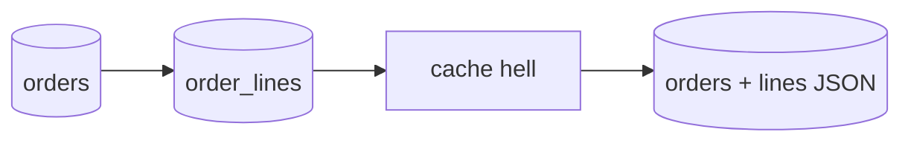

#### CQRS: обработчики команд и обновление read model

**Слайд 91: p u b l i c s e a l e d c l a s s ChangeUserNameCommandHandler: ICommandHandler<ChangeUser**

::: multi-code "ChangeUserNameCommandHandler" {playground=off}

```kotlin
data class ChangeUserNameCommand(val userId: Guid, val newName: String) : ICommand

class ChangeUserNameCommandHandler(
    private val userRepository: IUserRepository,
    private val changeNotifier: IChangeNotifier
) : ICommandHandler<ChangeUserNameCommand, Result> {
    override fun handle(command: ChangeUserNameCommand): Result {
        val user = userRepository.getById(command.userId)

        if (!user.canChangeName() || !isValidNewName(command.newName)) {
            return Result.error(...)
        }

        user.name = command.newName
        changeNotifier.notify(UserChangeNotification(command.userId))
        return Result.ok()
    }
}
```

```csharp
public sealed class ChangeUserNameCommandHandler: ICommandHandler<ChangeUserNameCommand, Result>
{
    private readonly IUserRepository _userRepository;
    private readonly IChangeNotifier _changeNotifier;

    ...

    public Result Handle(ChangeUserNameCommand command)
    {
        var user = _userRepository.GetById(command.UserId);

        if (!user.CanChangeName() || !IsValidNewName(command.NewName))
        {
            return Result.Error(...);
        }

        user.Name = command.NewName;
        _changeNotifier.Notify(new UserChangeNotification(command.UserId));

        return Result.Ok();
    }
}
```

```java
record ChangeUserNameCommand(UUID userId, String newName) implements ICommand {}

class ChangeUserNameCommandHandler implements ICommandHandler<ChangeUserNameCommand, Result> {
    private final IUserRepository userRepository;
    private final IChangeNotifier changeNotifier;

    public Result handle(ChangeUserNameCommand command) {
        var user = userRepository.getById(command.userId());

        if (!user.canChangeName() || !isValidNewName(command.newName())) {
            return Result.error(...);
        }

        user.name = command.newName();
        changeNotifier.notify(new UserChangeNotification(command.userId()));
        return Result.ok();
    }
}
```

```go
type ChangeUserNameCommand struct {
    UserID  uuid.UUID
    NewName string
}

type ChangeUserNameCommandHandler struct {
    userRepository IUserRepository
    changeNotifier IChangeNotifier
}

func (h ChangeUserNameCommandHandler) Handle(command ChangeUserNameCommand) Result {
    user := h.userRepository.GetByID(command.UserID)
    if !user.CanChangeName() || !IsValidNewName(command.NewName) {
        return ResultError(...)
    }
    user.Name = command.NewName
    h.changeNotifier.Notify(UserChangeNotification{UserID: command.UserID})
    return ResultOK()
}
```

:::

**Слайд 92: p u b l i c s e a l e d c l a s s ReadModelUpdateDecorator<TCommand, T R e s u l t > : ICo**

::: multi-code "ReadModelUpdateDecorator" {playground=off}

```kotlin
class ReadModelUpdateDecorator<TCommand, TResult>(
    private val decoratedHandler: ICommandHandler<TCommand, TResult>,
    private val notificationsProvider: IChangeNotificationsProvider,
    private val dispatcher: IChangeNotificationDispatcher
) : ICommandHandler<TCommand, TResult> {
    override fun handle(command: TCommand): TResult {
        val transaction = TransactionScope()
        val result = decoratedHandler.handle(command)
        for (notification in notificationsProvider.getNotifications()) {
            dispatcher.handle(notification)
        }
        transaction.complete()
        return result
    }
}
```

```csharp
public sealed class ReadModelUpdateDecorator<TCommand, TResult>: ICommandHandler<TCommand, TResult>
{
    private readonly ICommandHandler<TCommand, TResult> _decoratedHandler;
    private readonly IChangeNotificationsProvider _notificationsProvider;
    private readonly IChangeNotificationDispatcher _dispatcher;

    ...

    public TResult Handle(TCommand command)
    {
        using var transaction = new TransactionScope();

        var result = _decoratedHandler.Handle(command);
        foreach (var notification in _notificationsProvider.GetNotifications())
        {
            _dispatcher.Handle(notification);
        }

        transaction.Complete();
        return result;
    }
}
```

```java
class ReadModelUpdateDecorator<TCommand, TResult> implements ICommandHandler<TCommand, TResult> {
    private final ICommandHandler<TCommand, TResult> decoratedHandler;
    private final IChangeNotificationsProvider notificationsProvider;
    private final IChangeNotificationDispatcher dispatcher;

    public TResult handle(TCommand command) {
        var transaction = new TransactionScope();
        var result = decoratedHandler.handle(command);
        for (var notification : notificationsProvider.getNotifications()) {
            dispatcher.handle(notification);
        }
        transaction.complete();
        return result;
    }
}
```

```go
type ReadModelUpdateDecorator[TCommand any, TResult any] struct {
    decoratedHandler      ICommandHandler[TCommand, TResult]
    notificationsProvider IChangeNotificationsProvider
    dispatcher            IChangeNotificationDispatcher
}

func (d ReadModelUpdateDecorator[TCommand, TResult]) Handle(command TCommand) TResult {
    transaction := NewTransactionScope()
    result := d.decoratedHandler.Handle(command)
    for _, notification := range d.notificationsProvider.GetNotifications() {
        d.dispatcher.Handle(notification)
    }
    transaction.Complete()
    return result
}
```

:::

**Слайд 94: _dbContext**

::: multi-code "Сбор уведомлений из ChangeTracker" {playground=off}

```kotlin
dbContext
    .changeTracker
    .entries()
    .filter { it is IAggregate }
    .map { (it as IAggregate).toChangedNotification() }
    .toList()
    .forEach { dispatcher.handle(it) }
```

```csharp
_dbContext
    .ChangeTracker
    .Entries()
    .Where(e => e is IAggregate)
    .Select(e => (e as IAggregate).ToChangedNotification())
    .ToList()
    .ForEach(cn => _dispatcher.Handle(cn));
```

```java
dbContext
    .changeTracker()
    .entries()
    .stream()
    .filter(e -> e instanceof IAggregate)
    .map(e -> ((IAggregate)e).toChangedNotification())
    .toList()
    .forEach(cn -> dispatcher.handle(cn));
```

```go
for _, entry := range dbContext.ChangeTracker().Entries() {
    aggregate, ok := entry.(IAggregate)
    if !ok {
        continue
    }
    dispatcher.Handle(aggregate.ToChangedNotification())
}
```

:::

#### CQRS: команда, репозиторий и Unit of Work

**Слайд 108: p u b l i c s e a l e d r e c o r d ChangeUserNameCommand(Guid U s e r I d , s t r i n g N**

::: multi-code "ChangeUserNameCommandHandler" {playground=off}

```kotlin
data class ChangeUserNameCommand(val userId: Guid, val newName: String) : ICommand

class ChangeUserNameCommandHandler(
    private val userRepository: IUserRepository,
    private val changeNotifier: IChangeNotifier
) : ICommandHandler<ChangeUserNameCommand, Result> {
    override fun handle(command: ChangeUserNameCommand): Result {
        val user = userRepository.getById(command.userId)

        if (!user.canChangeName() || !isValidNewName(command.newName)) {
            return Result.error(...)
        }

        user.name = command.newName
        changeNotifier.notify(UserChangeNotification(command.userId))
        return Result.ok()
    }
}
```

```csharp
public sealed record ChangeUserNameCommand(Guid UserId, string NewName) : ICommand;

...

public sealed class ChangeUserNameCommandHandler: ICommandHandler<ChangeUserNameCommand, Result>
{
    ...

    public Result Handle(ChangeUserNameCommand command)
    {
        var user = _userRepository.GetById(command.UserId);

        if (!user.CanChangeName() || !IsValidNewName(command.NewName))
        {
            return Result.Error(...);
        }

        user.Name = command.NewName;
        _changeNotifier.Notify(new UserChangeNotification(command.UserId));

        return Result.Ok();
    }
}
```

```java
record ChangeUserNameCommand(UUID userId, String newName) implements ICommand {}

class ChangeUserNameCommandHandler implements ICommandHandler<ChangeUserNameCommand, Result> {
    private final IUserRepository userRepository;
    private final IChangeNotifier changeNotifier;

    public Result handle(ChangeUserNameCommand command) {
        var user = userRepository.getById(command.userId());

        if (!user.canChangeName() || !isValidNewName(command.newName())) {
            return Result.error(...);
        }

        user.name = command.newName();
        changeNotifier.notify(new UserChangeNotification(command.userId()));
        return Result.ok();
    }
}
```

```go
type ChangeUserNameCommand struct {
    UserID  uuid.UUID
    NewName string
}

type ChangeUserNameCommandHandler struct {
    userRepository IUserRepository
    changeNotifier IChangeNotifier
}

func (h ChangeUserNameCommandHandler) Handle(command ChangeUserNameCommand) Result {
    user := h.userRepository.GetByID(command.UserID)
    if !user.CanChangeName() || !IsValidNewName(command.NewName) {
        return ResultError(...)
    }
    user.Name = command.NewName
    h.changeNotifier.Notify(UserChangeNotification{UserID: command.UserID})
    return ResultOK()
}
```

:::

**Слайд 113: public class UserRepository: IUserRepository {**

::: multi-code "UserRepository" {playground=off}
```kotlin
class UserRepository : IUserRepository {
    ...

    fun create(user: User) { ... }
    fun update(user: User) { ... }
    fun delete(user: User) { ... }

    fun getById(id: Guid): User { ... }
    fun getRecentActive(): User { ... }
    fun tryFind(searchString: String): User? { ... }
    fun getAllOnFreePlan(): Array<User> { ... }
    fun getAllWithoutBillingInformation(): Array<User> { ... }
    ...
    fun getWhoCommentedArticleInProject(projectId: Guid): Array<User> { ... }
}
```
```csharp
public class UserRepository: IUserRepository {
    ...

    public void Create(User user) {...}
    public void Update(User user) {...}
    public void Delete(User user) {...}

    public User GetById(Guid id) {...}
    public User GetRecentActive() {...}
    public User? TryFind(string searchString) {...}
    public User[] GetAllOnFreePlan() {...}
    public User[] GetAllWithoutBillingInformation() {...}
    ...
    // 100500 methods later
    public User[] GetWhoCommentedArticleInProject(Guid projectId) {...}
}
```
```java
class UserRepository implements IUserRepository {
    ...

    public void create(User user) {...}
    public void update(User user) {...}
    public void delete(User user) {...}

    public User getById(UUID id) {...}
    public User getRecentActive() {...}
    public User tryFind(String searchString) {...}
    public User[] getAllOnFreePlan() {...}
    public User[] getAllWithoutBillingInformation() {...}
    ...
    public User[] getWhoCommentedArticleInProject(UUID projectId) {...}
}
```
```go
type UserRepository struct{}

func (r UserRepository) Create(user User) {}
func (r UserRepository) Update(user User) {}
func (r UserRepository) Delete(user User) {}

func (r UserRepository) GetByID(id uuid.UUID) User { ... }
func (r UserRepository) GetRecentActive() User { ... }
func (r UserRepository) TryFind(searchString string) *User { ... }
func (r UserRepository) GetAllOnFreePlan() []User { ... }
func (r UserRepository) GetAllWithoutBillingInformation() []User { ... }
func (r UserRepository) GetWhoCommentedArticleInProject(projectID uuid.UUID) []User { ... }
```

:::


**Слайд 118: USER t4: read**
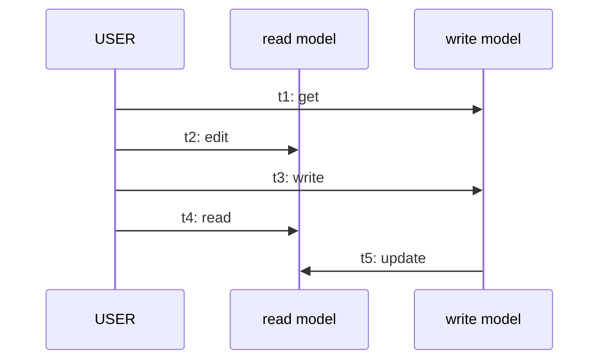

::: warning Текст слайда из PDF
USER                          t4: read

                                            new
                              t2: edit
            t1: get

                                         t3: write                           new
read
model

                                            new
write                                                           t5: update
model
pragmatic **CQRS**   • analysis                                                        73
:::

Один из таких достаточно простых и эффективных паттернов — это паттерны кэширования. Но, разумеется, там не все так просто и куча инструментов. Второй паттерн, который чуть-чуть сложнее в реализации, архитектурный паттерн, архитектурные решения — это **CQRS**. На практике мы с вами сможем отработать ближайшую практику — это кэширование на Redis. А CQRS останется только в виде реализованных примеров, ссылки на которые потом скину в конце лекции. План на сегодня — это действительно познакомиться, что такое кэширование и... какие там могут быть проблемы и какие решения этих проблем. А потом вторая часть лекции — это архитектурный паттерн с QRS, когда наша система делится на две модели. Одна модель для чтения, другая модель для записи.

И что мы можем с этого выжать для производительности, тоже разберём.

Начнём с каширования. В общих чертах это, по сути, процесс. как бы сохранение данных из хранилища в оперативную память. Потому что по производительности у нас оперативная память на порядке превышает по скорости обращения к русскому диску. И поэтому здесь на самом деле скрывается очень много-много-много эффективности, перформанса, который мы можем получить. Отсюда основная цель, зачем мы кэшируем, это сократить отклик обращения к хранилищу. Ну и в шутку и не в шутку, если есть возможность избежать работы с кэшированием, то лучше в эту историю не лезть. Если вам действительно не так важна высокая отзывчивость ваших сервисов по отдаче данных, то, возможно, и не стоит заморачиваться с кэшированием.

Потому что сейчас мы увидим, что есть ряд проблем, которые, конечно, с современными фреймверками решаются на раз, но, тем не менее, это все-таки дополнительная сложность, которая, может быть, принесет вам 5-10% производительности, которые вы бы могли просто достичь вертикальным масштабированием, увеличив какой-нибудь, купив новый SSD-диск. Как работает кэширование? В самом примитивном случае у нас есть пользователь, который обращается к приложению, и приложение должно отдать ему ответ в виде данных.

## In-process и out-process cache

Если у приложения, мы сейчас не говорим о том, что есть кэширование на уровне приложения, in-process есть кэширование на уровне базы, есть кэширование на уровне прокси, чуть попозже. Пока что в самом простом варианте, самый такой элементарный процесс. который показывает идею кэширования, пользователь обращается к приложению, у приложения кэш пустой, ничего пока еще не сохранилось, и, следовательно, приложение идет в базу, оттуда забирает данные, эти данные поступают обратно в приложение, кэшируются, сохраняются в оперативной памяти в виде какого-нибудь мапа. ключ значения и ответ пользователю. Вот такой вот сквозной вариант кэширования. При повторном запросе приложение уже видит данные в кэше, не обращается к базе и отдает ответ.

Но тут куча, на самом деле, недосказанного. Потому что что, если данные протухнут? А что, если данные будут невалидные? А что, если вообще у нас изначально прилетели какие-то ошибочные данные? Вот про все это надо сейчас проговорить, прежде чем на семинаре попробовать использовать Redis, который все это на самом деле скрывает. И в таких стандартных ситуациях пользоваться им достаточно легко.

Значит, чтобы сказать, а вот эта вот вообще схема нормальная ли, нужно понимать, как мы можем классифицировать, ну или вообще оценить. Правильность кэширования. То есть нам нужны метрики, по которым мы можем судить. Это хорошо, это плохо, здесь потянет, здесь нужно чуть быстрее, чуть больше, чуть меньше. Используются следующие метрики кэша. Мы можем судить о кэше в зависимости от того, сколько памяти он потребляет. Потому что это уже не SSD, это уже оперативная память, соответственно, ее физически меньше. В последнее время так вообще ажиотаж. Мы можем судить по РПС, сколько операций чтения записи у нас происходит в одну единицу времени. Количество элементов, количество ошибочных обращений, промахов. То есть мы говорим, дай мне данные, их нет.

Почему их нет? Почему кэш не прогрет был? Почему аналитически не продумали, какие данные стоило загрузить? Или это какая-то ленивая должна была загрузка? Сейчас вот эти вот стратегии проговорим, обсудим. К слову, Redis их все поддерживает. Почему я говорю Redis? Можно подумать, что одна у нас база, которая обеспечивает кэширование, она одна из самых популярных. И она популярна тем, что, во-первых, разные варианты хранения данных может обеспечить, а во-вторых, она разные сценарии кэширования может обеспечить, разные... варианты проверок. В общем, просто достаточно действительно хороший продукт. Поэтому очень часто буду говорить, это в Redis есть, это реализовано, этого нету, придется руками на уровне приложения сделать.

Поэтому часто буду сравнивать с Redis, но повторюсь, я там список из, по-моему, 20 решений популярных тоже привожу. Нужно оценивать промахи, когда мы обращаемся и не получаем данные.

### Инвалидация и TTL

Нужно оценивать количество которые отваливаются, ну или протухают из-за TTL, Time to Live. Об этих двух показателях чуть более подробно дальше пойдет речь, да и хитрейте. Поэтому тут я пропущу и перейду лучше к разбору, что мы можем кэшировать. Заголовок, может быть, не совсем отражает идею слайда. Здесь хотел сказать, на что нужно обращать внимание. когда мы выбираем, какие данные будут идти в кэш. Статичные или динамичные? Лучше, конечно, уносить в кэш статичные данные, которые реже меняются. В кэш нужно уносить данные, которые трудно масштабируются.

Если мы не можем обеспечить шардирование, то есть несколько экземпляров нашей базы, то возможно увеличить отзывчивость. базы можно через кэширование нужно обращать внимание на вот это вот самое время жизни данных потому что данные которые быстро становятся невалидными большого как бы большого эффекта от того что вы их за кэшируете вы не получите отдельно чуть позже проговорим еще про риски инвалидации потому что опять же кэш может хранить невалидные данные и Как с этим быть? То есть у вас в кэше могут быть данные неактуальные, и они могут отдаваться на клиент. Либо у вас база может отвалиться, недоступна, но кэш доступен, но с протухшими данными.

И иногда все-таки стоит отдать клиенту протухшие данные, не совсем валидные, не совсем актуальные. потом дать актуальные, нежели сказать, что, извини, сервер упал, база недоступна. Это все разные стратегии, про которые мы сейчас проговорим. Но опять же, нужно учитывать стоимость вычислений и запросов к кэшу или к базе данных, насколько это будет эффективней, ну и частота доступа к базе данных. Если кэш не прогрет, то как часто это провоцирует обращение к базе. Про эти метрики тоже сейчас нужно будет обсудить.

Давайте поговорим сначала про типы кэширования, потому что принципиально можно выделить два разных типа кэширования. С одной стороны, кэширование может быть встроено, то есть встроено в процесс. Ну, так же, как и... Встраиваемая база данных, SQLite, которая являлась частью нашего процесса, по сути, файлом, то же самое, и встраиваемый кэш, он крутится на уровне приложения. То есть это обычный мэп, который реализован просто стандартными средствами языка, ключ значения, и вы объявляете коллекцию каких-то объектов, ну и изначально, возможно, он... Вопрос, пустой ли он изначально, это на самом деле зависит от выбранной стратегии. Поэтому про стратегии чуть-чуть вынесем дальше.

Сейчас пока принципиально, что наш кэш может быть на уровне приложения, а может быть и отдельным процессом, отдельным микросервисом. Но давайте поговорим про варианты реализации. Либо использовать самый стандартный мэк, либо немножко более продвинутый. для автоматического удаления элементов, которые мы можем настраивать, чтобы он автоматически удалял элементы по time-to-live, по времени жизни. Можем использовать библиотеки, в которых на самом деле тьма тьмущая. И есть еще один из вариантов — использовать аспектно-ориентированное программирование, когда вы на какое-то действие вешаете аспект, что если произошла, отработала такая-то функция, вы вешаете аспект, что вам нужно обновить в вашем кэше вот такие-такие-такие данные.

Но помимо того, что вы можете реализовать кэширование на стороне вашего приложения, вы можете реализовать и кэширование как отдельный процесс, который работает вне рамках вашей базы. потому что есть и практически большинство баз данных предоставляют элементы кэширования. Но мы сейчас говорим о том, что можно поднять кэш как прям отдельный процесс, как отдельный сервис, который берет на себя обращение от клиента, прежде чем этот запрос пойдет дальше к базе данных. Но, как бы, несмотря на то, что есть... In-process и out-process кэширования есть еще и как бы под множество. У нас может быть кэширование на стороне браузера. Это вот тот самый внутренний кэш, который реализован в виде мапа. У нас может быть кэширование на уровне базы данных.

У нас может быть кэширование in-memory на уровне нашего сервиса. У нас может быть распределенное кэширование в виде Redis. отдельно запущенного, ну или какой-то другой базы данных, обеспечивающей кэширование. Ну и, собственно, у нас может быть кэширование на уровне прокси. У каждого есть свои плюсы и минусы. Кто-то работает быстрее, что-то реализовать проще. Но на самом деле они друг друга не исключают. И просто нужно понимать, во что вы готовы вложиться, или что больше вам подходит под вашу инфраструктуру.

Значит, такая вот сравнительная табличка, если что, можно будет ее потом еще посмотреть. Стратегии работы. Стратегии работы с кэшем. Разберем часть из них.

Начнем со сквозного кэширования, которое подразумевает логику работы двух сервисов, клиента и сервиса, неважно, одного элемента нашей системы, которому нужны данные, и он запрашивает эти данные у другого. Сквозное кэширование, в реализации оно самое элементарное. Наш клиент отправляет запрос приложению, дай мне данные, выборку. Опять же, сейчас в этой стратегии не так принципиально, где у нас реализуется само кэширование, в in-process либо в out-process. На диаграмме это out-process кэширования, то есть отдельная база, допустим, Redis. Но на самом деле кэш мог бы быть и внутри приложения. Реализованная стратегия не зависит от того кэша, который мы используем. Внутри процесса, либо в out-процесс. Идет запрос, попытка читать данные из кэша.

Если они есть, то отдаем, если нет, то мы эти данные читаем из базы. И обратно, вот поэтому оно и сквозное, обратно, проходя через кэш, эти данные остаются в кэше, чтобы при втором прочтении они были. Ну и таким образом кэш прогревается, и мы отдаем данные в приложение. Это сквозное прочтение данных, но и запись сквозная, она выглядит абсолютно так же, за исключением того, что запись все-таки в любом случае доберется до базы данных. Если у нас сквозное... прочтение может остановиться на третьем пункте, если эти данные есть, они отдаются клиенту, то сквозная запись пройдет до конца, чтобы данные обновить в базе. И на обратном пути эти данные она обновит в кэше.

Таким образом, данные в кэше будут оставаться актуальными. Следующее — это чтение на стороне. Там алгоритм работает такой, что идет обращение в приложение, дальше попытка. То есть наше приложение на стороне принимает решение.

На самом деле это может быть нами настраиваемый алгоритм, и при каких-то сценариях он может спрогнозировать, что в кэше все равно этого нет, и пойти сразу читать из базы. Но тут все-таки схема нарисована общая, поэтому в общем случае, когда говорят о чтении на стороне, то идет попытка прочтения из кэша. Если данных нет в кэше, то идет попытка прочтения из... Базы данных, потом, возможно, какая-то предобработка, чтобы обратно сохранить данные в кэш. Почему предобработка? Вот наша вторая часть с QRS, она будет заключаться в том, что у нас будет две базы. Одна на чтение, одна на запись. И если база на запись у нас должна быть нормализованной, доведенной до третьей нормальной формы, то запись на чтение может быть денормализованной.

И там данные могут храниться в предобработанном виде, возможно, где-то с дублированием, возможно, где-то с уже сделанным join, соединенным, для того, чтобы операция прощения была бы быстрее. Поэтому... Данные, которые читаем из базы, мы можем предварительно предобработать, прежде чем положить в кэш. Кэш, видите, он тоже может быть реализован в виде различных баз данных, которые сильны либо Elasticsearch, а может быть реализован Redis. А может быть и комбинация, тоже сейчас это рассмотрим.

Значит, это было у нас чтение на стороне, ну и, соответственно, есть стратегия запись на стороне. Но она сводится к тому, что мы в любом случае при запросе на запись сохраняем данные в базу, и потом данные идут на сохранение в кэш. При этом это можно сделать в рамках одной транзакции, если у нас это один микросервис, допустим. Есть еще ряд таких более продвинутых стратегий, опережающие кэширование. Там наш кэш не дожидается, когда мы у него запросим данные, а он прогревается заранее по каким-то заданным алгоритмам, на основании аналитики, на основании того, что он знает, что вечером в основном люди просматривают такую-то новостную ленту, и он подготавливает нам, прогревает кэш заранее.

То есть здесь, видите, акцент идет на то, что запрос приложения... Но данные читаются из кэша, возможно, отдаются. Но также периодически кэш подгружает данные в зависимости от какого-то сценария. И если мы понимаем, что по утрам люди читают новостную ленту, то запросы будут более частые к базе, то мы можем к утру прогреть наш кэш, поместив туда определенные записи. Если мы понимаем, что там прошла какая-то маркетинговая акция по определенному товару, в маркетплейсе, то мы тоже можем прогреть кэш этими данными, потому что сейчас на него пойдет спрос. Отдельно стоит проговорить про инвалидацию данных, потому что данные в кэше могут устаревать и быть невалидными.

Это действительно отдельная важная тема, и в общих словах инвалидация – это процесс удаления данных из кэша, которые являются недействительными. Ну, либо у вас уже в кэше нет места, И вы не можете продолжать его раздувать до бесконечности. Поэтому вам необходимо выбрать стратегию. Стратегий много, две основных. Это удаление по time to live, по времени жизни. И инвалидация по событию. Инвалидация по событию, ну, по времени жизни это понятно. Мы можем настроить тот же Redis, чтобы он... Удалял данные, которые хранятся на сервере в кэше больше определенного времени. Инвалидация по событию. Мы с вами не рассматривали событийную архитектуру, но чем-то она напоминает работу с очередью сообщений.

В событийной архитектуре каждое действие может приводить к возникновению ивента. Возникновение этого события может быть связано с тем, что после какого-то определенного события люди начнут потреблять определенный тип данных. И мы можем специальным сервисом анализировать очередь событий, которые возникают в нашем приложении, и вычитывать эти события, и реагировать, изменять наш кэш. У меня будет сейчас схема, сейчас покажу, как это выглядит. Проди на Amazon Web Service. Помимо того, что данные мы можем удалять либо по времени жизни, либо по определенному событию, данные мы можем еще и вытеснять. Есть абсолютно в лоб реализуемый алгоритм. Просто рандомно принимаем решение, какие данные вытеснить, если нам не хватает места. Но два других...

Time-to-leave – это стратегия, которая вытесняет данные на основании времени, которое они там находятся. Второй вариант – это стратегия вытеснения в кэше, при которой удаляются данные не по времени, сколько они там находятся, а по тому времени, сколько их не используют. Идет анализ тех объектов, которые долго не использовались, и их в первую очередь вытесняют. И есть еще стратегия вытеснения кэша, при котором удаляются не так часто, но, возможно, они использовались совсем недавно, но перед этим несколько минут назад.

### Проблемы кэширования

Поэтому, согласно ЛФУ, это будут редко используемые данные, и он их без проблем вытеснит. А при ЛРУ он, может быть, не использовался 5 минут, а потом буквально секунду назад использовался, значит, он удален не будет. как стэк, что последний пришел, следом уйдешь. Она не совсем очевидная, но в некоторых сценариях разумно, что если он только что был, мы его использовали, вряд ли он там понадобится. Самое примитивное — это очереди, когда тот, кто раньше всех пришел, первый будет вытеснен из кэша. То есть этих стратегий много. Опять... кто это делает. Если мы используем готовую базу Redis, в Redis все это есть. Нам лишь нужно настроить, выбрать, выбрать стратегию, по которой будет работать кэш.

Но опять же нужно немножко разбираться, понимать, какие в принципе варианты у вас есть. Отдельно нужно задумываться о кэшировании ошибок. Потому что в вашей системе может произойти, да просто может произойти... Атака на... Ну, хакерская атака на получение данных. На получение однотипных данных. Ну, то есть вас пытаются... DDoS-атака. И ваш кэш может как бы отслеживать вот это вот частое обращение за несуществующими данными, которые могут просто забить базу данных. И, собственно, фиксировать это как ошибка и не реагировать на второе, третье, четвертое, ну и последующие сообщения. Но есть варианты ошибок, которые стоит кэшировать.

К примеру, у вас могла действительно отвалиться база, и можно незамедлительно пользователям по какому-то тайм-ауту завести в кэше вот эту ошибку и отвечать, что сейчас база недоступна, попробуйте позже. Незачем каждый запрос отправлять и проверять. Потом через какое-то время можно проверить и обновить кэш. Поэтому есть вещи, которые можно кэшировать, а есть вещи, допустим, непроведенная транзакция с оплатой. Вы попытались оплатить, база недоступна. Как бы смысл кэшировать, за кэшом скрывать какие-то серьезные проблемы. Поэтому нужно очень внимательно думать, что мы кэшируем, что не кэшируем. Ну а сейчас давайте чуть подробнее проговорим про вот эти вот проблемы. Паттерны, которыми решаются эти проблемы.

Опять же, в зависимости от базы, от используемой базы, вам это, может быть, не придется писать вручную, но тем не менее вы должны понимать, какие паттерны реализуются при использовании кэша. Проблема. Первая проблема, с которой мы можем столкнуться, это действительно дублирование запросов к базе. Диаграммка мелкая, но тут главное уловить идею. У нас есть приложение, то есть клиент, который делает запрос к базе на получение данных. Он делает первый запрос и в кэше этого не обнаруживает. Соответственно, идет обращение к базе. Но в этот момент происходит абсолютно такой же запрос на получение тех же данных. Но обратите внимание, у нас... Пока база не вернулась с ответом, кэш не анализирует этой проблемы. То есть здесь не применен паттерн single flight.

То есть на уровне кэша этого паттерна нет. И, соответственно, кэш отправляет запрос к базе. Там идет третий запрос на получение тех же данных. Опять эти данные еще не прилетели с базы. Он опять дергает базу, тем самым нагружая базу данных. Потом данные, конечно, прилетают, но прилетают еще и несколько раз. С базы данных на кэш. одни и те же данные. Поэтому вот в этой ситуации можно применить паттерн single flight.

На самом деле достаточно стандартная ситуация, когда кэш видит запрос и понимает, что этих данных нет, он сохраняет этот запрос для того, чтобы увидеть, что Возможно, это DDoS-атака, и увидеть, что такой запрос уже был, чтобы не спровоцировать второе обращение к базе. Вот он сохранил этот запрос, потом идет, запрашивает данные. Все запросы, которые прилетают и которые соответствуют самому первому, они остаются в таком подвешенном состоянии, пока база не даст ответ. И потом уже он отдает этот прилетевший ответ в кэш, отдает потребителям. Второй вариант – это недоступность базы данных. У нас может сложиться такая ситуация, что идет запрос, данных в кэше нет, мы лезем в базу, база отвечает очень долго.

Но она по каким-то причинам действительно недоступна. Но она рано или поздно все равно поднимется и ответит. Но тут возникает ситуация, что нашему пользователю полетел ответ-эррор. Один из вариантов – это на тот случай, ну, тут, правда, нужно продумывать. Если база у вас отваливается, в кэше данных нет, потому что он еще не прогрет, но у вас может быть отдельный долгоживущий кэш, в котором данные могут быть, ну, там, однодневной данности, трехдневной данности. И тут важно понять, это нормально ли будет отдать клиенту вот такие вот, ну, может быть, они не протухшие. Они просто могут быть неактуальными, но, возможно, в какой-то ситуации лучше отдать не самые актуальные данные, чем сказать, что сервер упал.

### Fallback

Поэтому решение такой проблемы — это воспользоваться fallback кэшем, у которого настраиваемый time-to-leave данных чуть больше, чем у основного кэша. И если у нас, допустим, у основного кэша нет данных, он лезет в базу, база недоступна, Мы сообщаем клиенту, что доступа к актуальным данным сейчас нет. Мы вам предоставим данные, закэшированные от такого-то числа. Вы можете с ними работать, если вас это устраивает. Мы отправляем его на fallback кэш, где данные у нас, возможно, трехдневной давности, но тем не менее он получает данные. Он с ними работает. Потом, если при необходимости, он сможет обновить свой запрос и получить актуальные данные. Еще одна проблема, которую мы можем поймать, это таймауты, которые мешают наполнению кэша.

Здесь ситуация в следующем. Аппликейшн идет с запросом, мы не находим в кэше, отправляем в базу, и база может реагировать на наш реквест больше, чем мы на это закладываем время. То есть мы уже клиенту говорим, что по таймауту мы отвалились. А данные прилетают, но они уже никому не нужны. В таком варианте можно сделать два кэша. Делаем запрос. В кэше данные не находим. Отправляемся на бэкэнд в базу. База может нам действительно... По определенному таймауту мы от нее не дожидаемся ответа, но мы у нее таймаут увеличиваем на гораздо большее время.

То есть мы клиенту можем сказать, что извини, данных нет, но для того, чтобы не получилось, что вот как здесь мы зря отработали, и респонс прилетел в никуда, и в кэше его уже не ждут, мы можем на уровне базы сказать, что работай дольше, мы от тебя будем ждать столько, сколько потребуется, там минута-две, данные твои мы в кэш все равно прилетят, мы их сохраним. То есть работа будет выполнена не зря. И уже при втором обращении с тем же запросом данные будут храниться в кэше, чего не было бы вот здесь и привело бы к повторному обращению в базу. И, возможно, опять к повторному падению. Здесь мы эти данные сохраним и уже при повторном обращении сможем отдать. Какой из паттернов использовать?

На самом деле нужно продумать все. И есть прекрасная диаграммка. которая говорит о том, что происходит в вашей системе, с какими проблемами вы сталкиваетесь. И, собственно, каскад применяемых паттернов — это нормально. Опять же, не факт, что вам придется это настраивать вручную, потому что различные варианты стратегии могут быть уже реализованы на уровне программного обеспечения. Важный нюанс — это прогрев кэша. Прогрев кэша. Кэша. сводится к тому, что мы заранее подготавливаем, или мы подготавливаем в момент работы нашего приложения с базой наш кэш, постепенно приобретает те данные, которые часто запрашиваются. И это такая хорошая практика, которая чаще всего подразумевает предварительную подготовку кэша какими-то данными. Но как прогревать?

В принципе... Вариантов много. Ручной, автоматизированный. Можно вообще оставить ленивый прогрев, когда ваше приложение обращается к кэшу, там данных нет, идет в базу. Вот это сквозное чтение. И на обратном пути данные оставляет в кэше и потом отдает клиенту. При втором запросе, при втором чтении данные там уже будут. Поэтому вариантов достаточно много.

Давайте пробежимся по основным. Ручной прогрев. Это, собственно, разработчики вручную могут заранее заполнить кэш. Ну, отсюда плюсы — это простота, минусы — требуется ручное вмешательство.

На самом деле, варианты прогрева несложно разобраться.

### CQRS

#### CQRS как паттерн

**Слайд 51: CQRS**
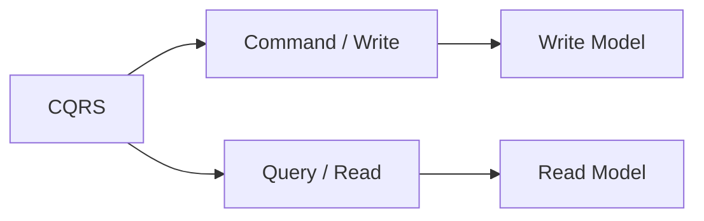

**Слайд 52: CQRS — это pattern?**
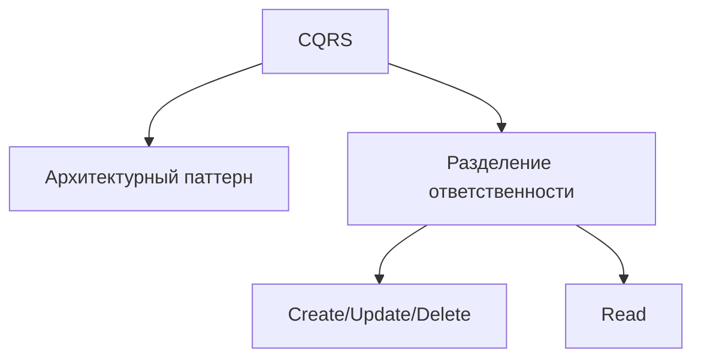

**Слайд 53: pattern**

| Этап | Смысл |
|---|---|
| context | Контекст проблемы. |
| solution | Решение. |
| analysis | Анализ последствий и компромиссов. |

#### Данные и операции

**Слайд 55: software =**

| Software | Составляющие |
|---|---|
| software | data + operations |

**Слайд 56: operations**

| Операция CRUD |
|---|
| create |
| read |
| update |
| delete |

**Слайд 57: operations**

| Операция CRUD |
|---|
| create |
| read |
| update |
| delete |

#### CRUD как cRud

**Слайд 58: CRUD → cRud**

| Было | Акцент |
|---|---|
| CRUD | cRud |

**Слайд 59: ~49% акаунтов**

| Метрика |
|---|
| ~49% акаунтов публикуют < 5 твитов в месяц. |
| ~30.4 минуты в день на пользователя. |

**Слайд 60: eCom**

| eCom-сценарий | Тип операции |
|---|---|
| полистали каталог | READ |
| посмотрели товар | READ |
| добавили в корзину | READ / WRITE |
| наконец купили | WRITE |

#### Разделение CUD и R

**Слайд 61: CRUD → cRud**

| Было | Акцент |
|---|---|
| CRUD | cRud |

**Слайд 63: CUD vs R**
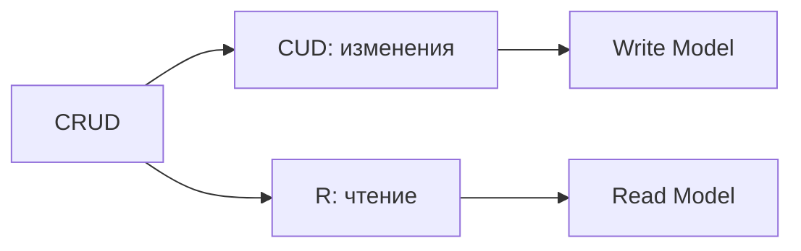

**Слайд 65: p u b l i c U s e r [ ] GetWhoCommentedArticleInProject(Guid p r o j e c t I d )**
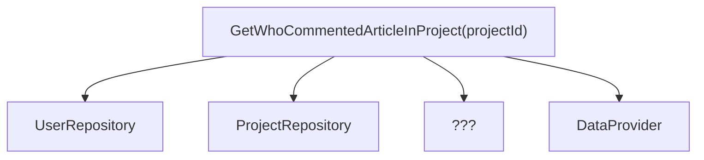

#### Маппинг и сложность чтения

**Слайд 66: mapping**

::: multi-code "UserToShortViewMapper" {playground=off}
```kotlin
class UserToShortViewMapper : IMapper<User, UserShortView> {
    override fun map(obj: User): UserShortView { ... }
}
```
```csharp
public class UserToShortViewMapper: IMapper<User, UserShortView>
{
    public UserShortView Map(User obj) { ... }
}
```
```java
class UserToShortViewMapper implements IMapper<User, UserShortView> {
    public UserShortView map(User obj) { ... }
}
```
```go
type UserToShortViewMapper struct{}

func (m UserToShortViewMapper) Map(obj User) UserShortView { ... }
```

:::

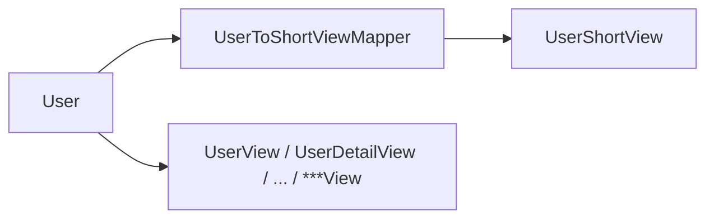

**Слайд 67: complexity**

| Характеристика |
|---|
| complexity |

**Слайд 68: сложная**

| Причина сложности |
|---|
| сложная предметная область |

#### Сложность и производительность read model

**Слайд 71: complexity**

| Характеристики |
|---|
| complexity |
| performance |

#### Разделение read/write моделей

**Слайд 73: CUD vs R**

| Разделение |
|---|
| CUD vs R |

**Слайд 75: CUD vs R**

| До разделения |
|---|
| CUD & R |

**Слайд 76: RW Model →**

| Трансформация модели |
|---|
| RW Model -> R Model ∪ W Model |

#### Read/Write backend

**Слайд 77: USER APP Frontend APP Backend DB**
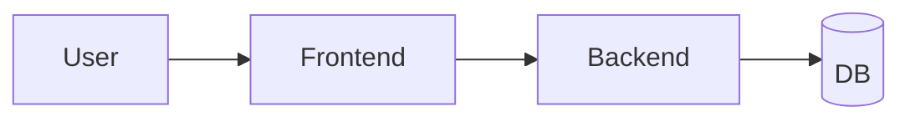

**Слайд 78: WriteModel**
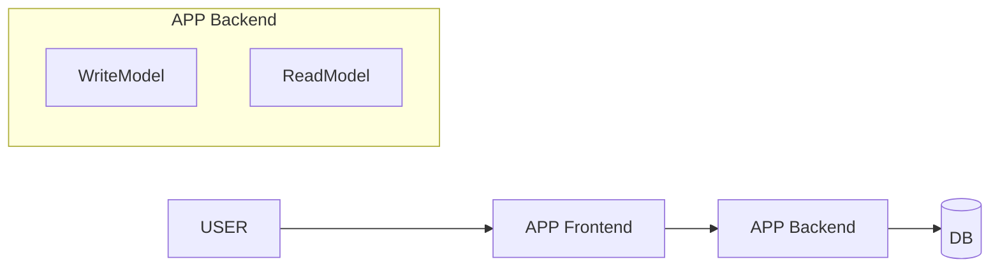

**Слайд 79: CQRS v1.0 #1**
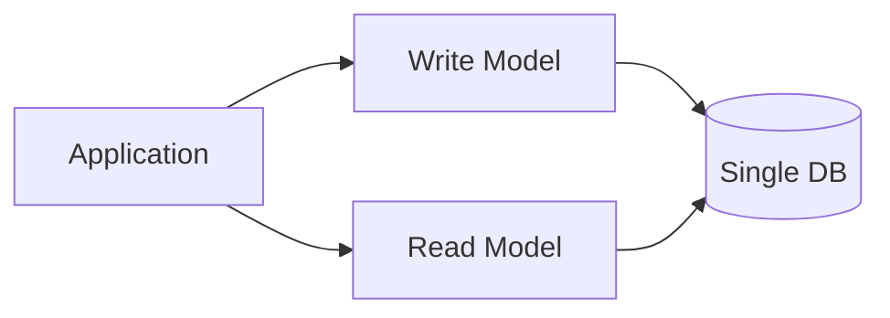

#### Варианты реализации CQRS

**Слайд 81: complexity**

| Характеристики |
|---|
| complexity |
| performance |

**Слайд 82: WriteModel**


**Слайд 83: W Backend**
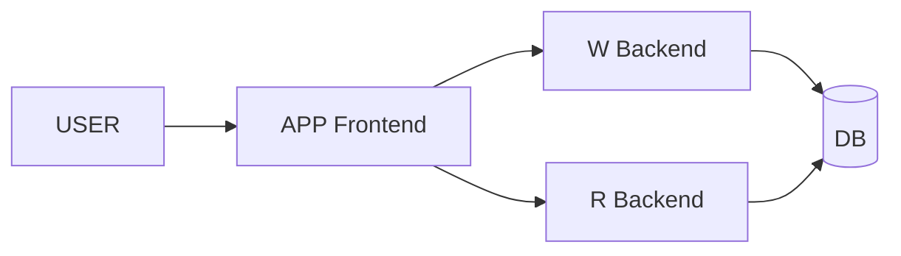

#### Обновление read model по событиям

**Слайд 93: p u b l i c s e a l e d c l a s s UserShortViewUpdater : I Ch a n g eNot if ica t ionHa nd**

::: multi-code "UserShortViewUpdater" {playground=off}
```kotlin
class UserShortViewUpdater : IChangeNotificationHandler<UserChangeNotification> {
    override fun handle(notification: UserChangeNotification) {
        // update read model here
        ...
    }
}
```
```csharp
public sealed class UserShortViewUpdater : IChangeNotificationHandler<UserChangeNotification>
{
    ...

    public void Handle(UserChangeNotification notification)
    {
        // update read model here
        ...
    }
}
```
```java
class UserShortViewUpdater implements IChangeNotificationHandler<UserChangeNotification> {
    public void handle(UserChangeNotification notification) {
        // update read model here
        ...
    }
}
```
```go
type UserShortViewUpdater struct{}

func (u UserShortViewUpdater) Handle(notification UserChangeNotification) {
    // update read model here
    ...
}
```

:::


::: warning Текст слайда из PDF
p u b l i c s e a l e d c l a s s UserShortViewUpdater : I Ch a n g eNot if ica t ionHa nd ler < U s er Cha n geNoti fic a tio n >
      {
             ...

           p u b l i c v o i d H a n d l e ( U s e r Ch a n g e N o t if i ca t i o n n o t i f i c a t i o n )
           {
                  / / update r e a d model here
                  ...
           }
      }

pragmatic **CQRS**        • solution                                                                                                           46
:::

Я немножко спешу, потому что **CQRS** гораздо сложнее. Автоматический прогрев — это когда мы... Пишем планировщики, которые будут регулярно загружать данные на основании каких-то правил из хранилища в кэш. Плюсы — это автоматизация, и минусы — это если поведение пользователей не совсем предсказуемо, то мы можем неправильно настроить прогрев. Но прогрев на основании аналитики, тот как бы само подразумевает, что у вас будет все-таки некий анализ данных. Вы смотрите, анализируете историю обращения к вашей базе на протяжении предыдущего года, понимаете, в какие дни, в какие праздники, что пользователи чаще ищут, и на основании этих можете аналитически предположить.

Ленивый прогрев, это реально для ленивых, когда вы ничего не думаете, оно заполняется постепенно автоматически само, на основании запросов частых и ответов. Прогрев по событиям, это больше относится к Event Drive дизайну, событийной архитектуре. Когда действительно у вас может произойти какое-то событие, вы фиксируете, что событие произошло, и запускаете обновление кэша. То есть вы понимаете, что, ага, была продана, не знаю, вышел новый автомобиль. И вот как там в новостях про китайские автомобили, там 80 тысяч предзаказов. Вы можете спрогнозировать, что вышел новый автомобиль, сейчас у вас вот эта новостная... Эта новость будет востребована. То есть по событию вы обновляете совершенно как бы...

Не то чтобы несвязанные данные, но напрямую, может быть, несвязанные данные. То есть событие просто, что какая-то новость произошла, а вы у себя в базе автомобилей кэш-пихаете автомобили этой марки, про которые была новость. Иерархический прогрев — это когда у вас денег нет, а прогреваться надо. Когда действительно кэш маленький, и вы понимаете, какие данные у вас в иерархии стоят более значимые, вы их кидаете в кэш, а другие не кидаете.

Одно из правил — вы действительно можете при инициализации кэша, когда поднялся у вас кэш, вы можете заполнить его какими-то данными, прогрева кэша то есть чтобы там данные уже какие-то лежали пускай они потом будут обновляться протухать заменяться но изначально чтобы там уже что-то было то что вы сделали кэш это как бы не делает из вас суперзвезду вам надо постоянно снимать метрики смотреть правильно ли вы подбираете немного ли промахов дает ваш кэш ну потому что смысл хранить в кэше данные которые Они будут только ухудшать ситуацию. Пользователь запрашивает данные в кэше, в кэше не находит, идет в базу. Это промах. То есть это увеличение отзывчивости приложения. Поэтому использование кэша тут даже во вред идет. Поэтому постоянные метрики, графана.

Есть инструментарий, который позволяет анализировать кэши. Графана. Ну и использовать машинное обучение для того, чтобы все-таки в кэш пихать не лениво инициализировать, а пихать данные более актуальные. Есть определенная взаимосвязь в зависимости от сценария вашей информационной системы и какие рекомендации использовать.

Если у вас стабильные паттерны поведения, то просто по расписанию, допустим, в обед все смотрят. там что купить поесть в вашем приложении утром все ничего не смотрят поэтому там кэш может отдохнуть вечером все думают чего бы купить пошопиться вот поэтому вы можете по расписанию просто либо вручную в кэш закидывать данные либо по расписанию подсовывать нужные данные то есть по расписанию это не то же самое что аналитика все-таки аналитика она как бы анализирует текущие происходящие действия в информационной системе и смотрит, как подготовить кэш. Поэтому аналитика — это немножко другое, это не по расписанию. По расписанию это не обязательно, что вы там чего-то аналитически проанализировали.

Вы просто знаете, что если человек в пятницу, нужно определённый ему товар показывать. Так, непредсказуемый трафик, тогда... Выдумать тут просто невозможно, считать паттерны поведения человека. Просто тогда ленивая инициализация, кэш заполнится сам. Ну либо попробовать все-таки проанализировать.

### Очереди и обновление моделей

Событийная архитектура, там сразу из вариантов анализируем очередь событий, которые происходят, вытаскиваем оттуда события и на основании этих событий меняем кэш. Ограниченные ресурсы используем иерархически. Примеры. Ну, наверное, один из популярных решений, который мы на семинаре решили с вами рассмотреть, это Redis. Но, опять же, это не обязательно, что только Redis. Вы можете использовать Redis и настроить. Ну, он такой популярный, на самом деле, еще и потому, что позволяет разные варианты данных хранить. Он может хранить мэп, может хранить строки, кучу вариантов, на самом деле, того, как он хранит данные. Но вы можете совместно с Redis использовать и графану для мониторинга.

То есть это не исключает, это просто набор инструментов, которые можно было бы использовать.

Если говорить о кэшировании данных в микросервисе, то есть два возможных подхода. Кэширование по требованию и упреждающее кэширование. Опять же, роль... Кэша в микросервисах такая же, как и роль кэширования в монолитной системе. Увеличить отзывчивость ваших микросервисов.

Давайте посмотрим два варианта кэширования по требованию. Здесь показано, как это могло бы быть использовано. У нас есть два микросервиса. Выставление счета, оплата счета. И вот идет реквест на один микросервис. Тот, в свою очередь, смотрит в кэше, если данных не находит. Not found. Ну, либо если находит, то отдает. Если данных не находит, то идет обращение в базу данных. Из базы данных идет ответ в данный микросервис, к которому был запрос. И отсюда по требованию он уже обновляет кэш. Если там произошла какая-то оплата, то опять же идет изменение. В базу данных, но, допустим, данная архитектура выстроена у нас событийно.

Происходит событие, что данные изменились, и вот мы видим, что некий кэш-менеджер, микросервис, выдергивает из очереди событий, недавнее событие, которое возникло, обрабатывает это событие и принимает решение о том, что необходимо обновить определенные данные в нашем кэше. То есть это вот... Это один из вариантов реализации обновления кэша по требованию.

Если говорить о инструментальных средствах, то здесь просто показан пример с сайта Amazon, где они свои сервлесор-решения пиарят. То есть можно все это развернуть в облаке. Есть API Gateway, который отправляет в микросервис Build. Тот, в свою очередь, либо отдает из кэша, либо лезет в базу. Допустим, счет на оплату, происходит изменение в базу и происходит сохранение в очередь событий. И у того же Амазона есть кэш-менеджер, который анализирует. Но это не отдельный микросервис, это, в принципе, их решение облачное. Но они его позиционируют как отдельный модуль, который анализирует данную. Очередь событий и в зависимости от того, что за событие, может обновить кэш. Ну и второе, это упреждающее кэширование.

Там это как раз тот сценарий, когда кэш обновляется с какой-то периодичностью без нашего на то приказа. То есть, конечно, это не исключает, что опять же произошла оплата, произошло событие, кэш-менеджер узнал о событии и обновил соответствующий объект в кэше, но и постепенно еще и наше приложение самостоятельно обновляет кэш по определенному сценарию, по определенному плану. Инструменты кэширования не одним рейдисом как бы все живут, но он один из самых популярных, но решений гораздо больше. И перехожу ко второй части, про которую мои коллеги говорят, не заикайся, это невозможно будет рассказать на семинаре. Это реально очень сложный архитектурный паттерн. И как им пользоваться, мы покажем, дадим ссылки на какие-то реальные примеры.

Но на семинаре, к сожалению, мы с этим проработать не сможем, это секирес. Но я хочу, чтобы вы все-таки задумались о том, что можно писать приложение кардинально иначе. Почему **CQRS** это паттерн?

На самом деле кто-то говорит, что это архитектурный стиль, но если подумать, что такое паттерн, мы с вами целых три лекции изучали паттерны, то у паттерна есть контекст, где он применяется, у паттерна есть предлагаемое решение, оно может быть реализовано не всегда канонически правильно, вот так, вот так и вот так, но тем не менее какое-то решение предлагается из коробки. И есть анализ. По сути, мы сейчас попробуем пробежаться по **CQRS** по такому сценарию. Рассмотрим, где он применяется, какие есть три варианта популярных решения, как применить этот паттерн, и анализ, что он нам дает. Где применяется? Если образно говорить, то вообще, что такое программирование? Данные и операции над этими данными. Можно сказать, что это объект.

Но по сути-то все наше программирование сводится к тому, что мы изменяем операции. Что такое операция? Вообще это создание операции, прочтение, удаление изменения. Кто-то еще выдумывает некую пятую мифическую составляющую, типа бизнес-логика. Но по сути, что такое бизнес-логика? Это что-то... Да, это и есть бизнес-логика, поэтому можно не выпендриваться. Любая операция, это, правильно говорить, крат, но все говорят крут. Крут операции. Но, да, апдейт, наверное, крат. Но все говорят крут, поэтому я тоже буду крут. Но проблема в том, что крут не совсем крут. В реальной жизни крут, он крут. Потому что... Потому что... В любой на самом деле социальной сети люди чаще всего потребляют контент. Да даже не обязательно социальная сеть.

Взять какой-нибудь Амазон, Озон. Там что люди? Смотрят товары, иногда заходят, листают карточки. И лишь по статистике что-то около 20% добавляют в корзину и еще меньше осуществляют покупку. Покупка — это... Это уже какое-то изменение. Ну ладно, да, вот, это в райд. Мы изменяем состояние. Но все остальное — это ритм. Поэтому я и говорю, что крут, он как бы неравноценен. И стоит взглянуть на наш крут, как на две отдельные сущности. Куд и р. И вот, смотрите, куд — это реально... Бизнес-логика. Это какие-то агрегаты, если мы говорим про **DDD**. То есть один объект может затрагивать ряд других. Это очень сложная валидация данных. Мы с вами value-object изучали и проверяли на валидность. Это транзакционность, недопустимость разрыва операций. А RID?

Там совершенно другие требования. Там дай нам много и дай нам быстро. Ну, какие-то сложные запросы, производительность, несколько представлений одних и тех же данных. Допустим, у вас карточка товара может быть краткой, полной, и там как бы с полным, при полном описании еще и отзывами. Данные вроде бы одни и те же, а разные представления. Пересекаемость границ, это чуть отдельно поговорим. То есть получается борьба вот этого мира куд и эр. В конечном счете это может вылиться вот в такой вот репозиторий, где у нас куд операции, ну, по юзеру у нас create, update, delete, что еще с ним делать? А вот вычитывать юзеров из базы, поверьте, там еще 100-500 методов через год добавится. А может быть еще хуже ситуация.

Может быть вам нужно сделать запрос, что кто прокомментировал определенный артикль. Это куда? В какой репозитории? Это в репозитории пользователя? Ведь кто же его прокомментировал? Или это в артикль какой-то проект? Или это вообще отдельно сделать какой-то дата-провайдер искусственный? Или еще куда-то? Конечно, куда-то вы его точно определите, потому что фантазия работает хорошо. Но осадочек останется, что как-то не в своем месте вот этот вот запрос оказался, не в своем репозитории. Это тоже проблема.

Проблема маппингов, потому что действительно придется передавать, ну если у нас будут разрастаться вот такие вот репозитории с странными методами, которые с другими моделями работают, у нас и будет маппинг разрастаться, который мы будем использовать в операциях. Поэтому первое, с чем мы сталкиваемся, это сложность. При большой доменной модели эта сложность будет очень большой. И запросы, которые вы будете писать к такой доменной модели, это еще маленький запрос. Здесь идут join, join, join, объединение многих таблиц, чтобы получить какие-то данные. Что вы можете сделать? Вы можете продолжать мучиться с такими запросами. У нас была ситуация, что нам не хватило... Не то что ума, но ума не хватило.

У нас был запрос на 6 страниц А4, мы его не смогли написать, а **Entity** Framework тоже не смог сделать его эффективным. То есть мы искали человека, специализирующего по написанию эффективных запросов. Смысл. Могли бы сделать паттерн **CQRS**. Мы не могли, потому что мы на аутсорсе работали. Но если бы мы проектировали систему, то мы бы от такой задумки писать запросы на, по сути, в райд модель. Для хранения это хорошо нормализованная база. Но для прочтения можно сделать немножко денормализованную базу. И вот как раз CQRS это в первую очередь про разделение. нашего мира данных на два мира. Мир для записи и мир для прочтения.

И вот если бы мы сделали денормализацию, то, возможно, наши бы запросы были немножко проще, потому что данные хранились бы не согласно нормальной форме в разных таблицах, исключая транзитивность и так далее. Охранились бы в одной таблице. Да, была бы избыточность, была бы денормализация, но зато прочтение из этих данных сводилось бы к элементарному запросу. Ну, а еще и данные можно кэшировать. Поэтому у нас две проблемы. Это, с одной стороны, сложность, а с другой – производительность, которую может решить паттерн с QRS. А в комбинации с кэшом, редисом, Это может быть как бы двойной удар над производительностью, повышение производительности. Солюшен, решение.

Собственно, если мы не будем сопоставлять вот этих два мира и говорить, что вы враждуете между собой, просто, как бы скажем, вы два мира, и вы друг о друге не знаете. Вы два мира, и вы не против друг друга, а вы работаете в паре и знаете друг о друге все. И тогда у нас будет... Не классическая read-write модель данных, предметная область, а две разных модели. Одна модель данных будет работать на чтение, другая на запись.

Давайте на примере посмотрим. Вот у нас классическое приложение, где юзер работает с фронтом, фронт лезет на бэкэнд, бэкэнд лезет в базу. Без привязки к какой-либо архитектуре, как мы можем... Повысить производительность. Мы можем на уровне нашего бэкэнда... Как мы можем снизить сложность?

Давайте пока про сложность. Потому что первое решение, которое я разбираю, согласно **CQRS**, оно не повысит производительность, перформанса не даст. Оно зато снизит сложность у разработчика. Это, возможно, даже ухудшит производительность, но сложность бэкэнда... оно понизит в разы. Потому что, еще раз, в чем была сложность? Помните те гигантские запросы, те сложные модели, которые вынуждены работать с базой, которая сделана по нормальной форме. И сложность работы заключается именно не на запись, а на прочтение, на выборку данных из этой базы, которая идеальна, но идеальна для хранения данных, для создания. апдейт, изменения и удаления. Но не для прочтения она идеальна.

Поэтому первое, что мы можем сделать, да и сами наши классы предметной области настроены на ту базу. Поэтому первое, что приходит в голову, давайте мы разобьем и сделаем пока еще в рамках одного монолита просто две папки. В одной будут у нас сущности, там, юзер. но адаптирован для хранения данных денормализованных, а в другой, соответственно, в RAID-модели, будет та же модель, но которая будет адаптирована для куд-операций. И вот это вот и есть, на самом деле, не самое популярное и, может быть, порой бессмысленно, потому что она не увеличивает производительность, а **CQRS** начинает все-таки употреблять в контексте увеличения производительности по работе с данными. Данное, это тоже CQRS, мы разделили на уровни приложения наши backend на две модели.

Не на два микросервиса, пока на две модели. Можно назвать это... Секьюрест – вариант один. Не версия один, потому что под версией сразу подразумевается версия 2 лучше, а версия 3 еще лучше. Это не лучше, это просто один из способов реализации. Он не решает проблему перформанса, но решает проблему сложности. К чему будет сводиться тогда в райд-модель? Что мы там можем сделать? В райд-модель это… та, которая не читает, которая не лит. Соответственно, вот тут мы можем показать всю нашу образованность, что мы знаем **DDD**, что мы знаем гексагональную архитектуру или чистую архитектуру, rich объекты, value objects, там выстроить красивые репозитории и все, что с репозиториями идет, **unit of work**, **entity**, и все вот эти паттерны.

Ну и использовать автомаперы, ORM-системы, **Entity** Framework. То есть то, как мы с вами, собственно, и делаем на семинарах. А RIT-модель, сделать в ней, может быть, в принципе отказаться от ORM-систем и писать на чистом SQL, на чистом ADO. Может быть, использовать какие-то минималистические ORM-ки, которые позволяют SQL писать нам, а они только преобразуют результат в объекты, да, это дапперы. точнее, даппер. Там, скорее всего, будут анимичные модельки, не rich domain, анимичные модельки, которые как бы уже в том виде, в котором и денормализованная база. Но это даст лишь, уменьшит сложность. Перформанса это все равно нам не даст. Как получить перформанс?

Значит, у нас сейчас вот такое состояние проекта. И в целом, Мы можем, пока напомню, это один монолит. И первое, что приходит на ум, разделить этот монолит на два микросервиса. Ведь если мы поделим на два микросервиса, то у нас есть возможность поднять несколько инстансов вот этого бэкэнда, который будет на прочтение. Потому что читают чаще, чем пишут. Мы по статистике это увидели. Вот, тогда мы сможем действительно повысить наш перформанс. над базой данных. Но и это, на самом деле, как бы затык будет в базе теперь. Туда будет очень много запросов на прочтение, и база будет достаточно долго реагировать. Поэтому, как бы сказали A, разделили нашу доменную модель на read модель и write модель, нужно сказать B.

И тогда нашу базу, пока речь не идет о двух базах, пока в рамках одной базы просто создать две разных схемы. Очень многие базы, в том числе PostgreSQL, Microsoft SQL, они позволяют сделать разные схемы для хранения на одной и той же базе данных. И у нас будет одна схема для read денормализованной, то есть там будет нарушение нормальных форм, то есть данные будут дублироваться из-за того, что... Допустим, если у нас есть книжка, и автор у нее Пушкин, то автора мы храним в отдельной таблице, а книга связана реляционной связью с другой таблицей, с авторами. Это нормализованная база. Денормализованная – это когда, по сути, база, которая не находится ни в одной нормальной форме, это когда данные просто в одной таблице все.

Книжка 1, автор Иванов, книжка 2, автор Иванов. То есть дублирование, но зато вычетка примитивная. Никаких джойнов, никаких перемножений таблиц, выборки из двух таблиц. Вот просто работаем с денормализованной схемой базы. А здесь нормализованная схема базы. И это на самом деле **CQRS** вариант 2. Когда у нас есть две схемы. Одна нормализована и куча ограничений, другая денормализована и на самом деле куча повторяющейся информации. Но при таком варианте возникает вопрос, а как эти схемы держать в консистентном состоянии, чтобы данные были актуальны и там, и там. Есть два варианта – синхронно и асинхронно. Синхронный вариант – это когда наше приложение, которое изменяет схему в RAID, Она автоматом и обновляет схему для read.

И здесь данные будут в правильном состоянии, потому что это в рамках одной транзакции. По сути, можно добиться в момент write обновляем и вторую схему с данными. Ну и тут пример, как это могло бы выглядеть в коде. Просто если в двух словах, то пишем запрос и туда, и в другую схему. Можно это доверить ORM-системе. которая автоматом, то есть у нее есть возможности, в данном случае ORM-система **Entity** Framework, у нее есть вариант для каждого изменения положить в диспатчер, и в дальнейшем это приведет к обновлению Read-модели. Изменяя в Write-модель, мы можем доверить ORM-ке изменить Read-модель. Это у нас был вариант синхронный. Плюсы очевидные. Минусы очевидные, да? В Write становится медленнее, потому что ему нужно, по сути, обновить две таблицы.

Увеличивается сложность для программиста, потому что ему в Write модели приходится еще писать логику для обновления второй нашей схемы. Но плюс в Write и Read модели они в согласованном состоянии. Никаких разночтений, что, ну, типа... У тебя данные не валидны, быть не может. Потому что они становятся валидными сразу в двух схемах. Второй вариант – это асинхронное обновление второй схемы. Когда у нас используется какая-то очередь, и наш бэкэнд, помимо того, что самостоятельно правит бэкэнд, который содержит в Riot модель, правит, соответственно, в Riot схему. Но он также отправляет события в очередь. И вот здесь отдельно запущенный сервис анализирует эти события, вытягивает из очереди и, соответственно, меняет рид-схему.

Меняет рид-схему, запрашивая у врайта актуальное состояние. И вот здесь мы можем получить так называемое eventually consistency, которое говорит о том, что, ну, вроде бы, приложение... Консистентно, валидные данные, но не факт, что прямо в эту секунду. Возможно, через секунду оно будет в валидном состоянии. Почему? Потому что у нас в Riot модель могла изменить данные, но это пока дойдет событие в очередь, пока сервис из очереди считает и потом посмотрит, а какие данные были изменены, и начнет изменять ритм-схему. Соответственно, вот в этот период... Наши данные будут в eventually consistency. Но зато мы получаем высокую производительность в write-модели, потому что она теперь пишет данные без оглядки на read-схему.

Мы по-прежнему усиливаем сложность в write-модели, потому что разработчику надо будет думать, как отправить события в очередь. Дополнительная иерархическая сложность. Есть еще и точки отказа, но мы знаем, как с ними бороться. Это outbox-паттерн. Так как что-то отправляется в очередь, поэтому, чтобы иметь стопроцентную гарантию, мы должны использовать какие-то паттерны надежности. Ну и мы получаем eventually consistency. Это страшно, но многие говорят, с этим можно жить, но на самом деле не надо с этим жить. Есть варианты, как с этим можно бороться.

Поэтому вот этот второй вариант. реализации да по сути он дает нам и уменьшает сложность и увеличивает производительность но перформанса много не бывает поэтому можно двинуться дальше у нас уже вот такая схема мы уже нагородили разную микросервис для в райт модели микросервис для чтения сделали в базе разные схемы настроили обновление этих схем Ну, по сути, это две базы просто в одной. Но данные, соответственно, дублируются. И мы должны при изменении здесь изменить здесь. Только смысл в том, что в read модели они хранятся в удобном состоянии для того, чтобы мы оттуда с легкостью считывали. Так вот, какое решение напрашивается? Ну, раз мы смогли разорвать связь kud и read между моделью, то и это надо разрывать. И, соответственно, вводить...

Две базы для каждого микросервиса. Не две схемы в одной базе, а две разные базы. Конечно, это можно сделать, эти две базы, обе PostgreSQL. Но, зная предыдущую тему, сюда бы вы что поставили, как вариант? Нарид-модель? Ну, на самом деле, очень часто ставят эластик, потому что люди любят изощренные запросы на чтение. И Elastic достаточно хорошо делает полнотекстовый поиск. В общем, хорошо высчитывает данные. Но можно поставить сюда и Redis для кэширования данных для Read модели. Тогда у нас повысится производительность чтения. То есть у нас, видите, в принципе нас никто не ограничивает. Какая база будет на Read модель, какая будет на Write. На Write модель, скорее всего, реляционная, либо... Либо PostgreSQL, которая поддерживает много стандартов.

Ну а здесь мы можем сделать удобное для нас решение. И это, можно сказать, решение номер три. Оно действительно дает нам высокую производительность и уменьшает сложность. Но что касается поддержания данных в консистентном состоянии между этими двумя базами. Мы можем, конечно, воспользоваться синхронным обновлением, но это нереалистично. В микросервисах с их очередями, с их асинхронностью, поэтому это прям нереализуемо. И нам придется тогда работать с асинхронным обновлением и вроде бы смириться с данностью, проблемой, но на самом деле нет.

На самом деле нет, и есть. Сейчас быстренькое решение скажу. Но прежде вы скажете, вы что тут говорите про какие-то read и write модели? Паттерн-то называется segregate **command** query responsibility, да, по-моему? То есть где тут команды и запросы?

На самом деле, **CQRS** это больше даже не про команды и запросы. Дело в том, что есть архитектурные стили разработки, которые позволяют нам писать с помощью команд и обработки этих команд, этих запросов, не разделяя модель на read и write. В то же время мы можем писать микросервисы, разделяя их на read и write модель, но не прибегая к архитектурному стилю команды и запросы. Поэтому CQRS, несмотря на то, что собрали аббревиатуру команды и запросы, это не главное в паттерне. Но это я тоже подчеркиваю. Просто, конечно, удобней совмещать два архитектурных стиля, проектируя приложение, что есть команда и есть хендлер, который ее исполнит. Ну и наши куд-операции отнести к командам. а read операцию к query, к запросам.

Ну, и вот таким образом выстроить архитектуру. Но это, как бы еще раз повторюсь, это не основная идея **CQRS**, команды и запросы. Основная идея CQRS это все-таки разделение на read и в write модель. Ну, и в заключении, раз уж мы разбираем CQRS как паттерн, то тут говорим о том, что нужно подвести анализ. Чего мы увидели? Что есть три реализации. Как бы одна лучше другой. Ну, на самом деле, да, одна быстрее, чем вторая, вторая быстрее, чем третья, но, соответственно, мы приобретаем определенные сложности. И при третьей реализации у нас как бы без вариантов мы столкнемся с eventually consistency, и нужно с этим как-то жить.

Но прежде мы также должны понимать, что какой бы из вариантов вы не выбрали, В любом случае мы разбиваем на read и write нашу доменную модель. А в совокупности read и write, она всегда будет сложнее, чем просто read-write модель. Но команда у вас же все-таки одна будет работать с одним микросервисом, другая с другим микросервисом. Поэтому можно относиться к этому как к тому, что по отдельности read модель будет проще, чем read-write. И, соответственно, write модель будет проще, чем read-write. И, соответственно, команде будет работать все-таки проще, если вы разделите вашу модель на Read-Write модели. Вашу Read-Write модель отдельно на Read, отдельно на Write. И возникает вопрос.

Помимо того, что мы еще получим, казалось бы, Read-модель не так просто обновить. Потому что в Read-модели мы можем хранить данные, нарушая денормализацию. Если мы обновляем какой-то очень крупный агрегат, который содержит другие объекты, то это действительно может быть достаточно сложный процесс обновления. И финализируем. И вот говоря о Eventually Consistency, то мы видим такую проблему. Она может возникнуть как бы... Да, к слову, смотрите, я приведу такой пример. Можно, конечно, сделать вариант со схемами, что вот кто-то взял, прочитал файл, пока он его редактировал, кто-то другой его тоже считал. Как быть, когда первый уже сохранил, второй сохраняет тот объект, который...

Ну, все это, конечно, красиво, но с жизнью можно столкнуться даже с положительным эффектом. Я один раз в жизни летал бизнес-классом вот из-за такой проблемы. Нет, меня посадили в бизнес-класс, хотя я купил эконом. В аэропортах, вот в этих агрегаторах есть такая проблема, что, ну, овербукинг вам знаком, да? Я вот всегда, кстати, думал, вот эти вот странные люди, которые до посадки еще часа, они уже в очереди стоят. Сейчас я тоже начинаю бояться, потому что из-за eventually consistency может случиться что? Ну, допустим, ладно, какой-нибудь агрегатор, который крутится на хорошем, с хорошей связью. И вы покупаете билет, и это быстро обновляется.

Но ведь может быть ситуация, что где-то глубоко в деревне, где бронь подтверждает факсом, то есть этот процесс может быть очень сильно растянут. И вы можете начать бронировать билет, и к тому моменту, когда факс дойдет до, как его назвать, поставщика аэрокомпании, как бы ваш билет уже продан. Но к чему этот пример? К тому, что... Жить с вот этой проблемой не стоит. Есть два примитивных решения.

- Первое – это просто пользователю сказать, слушай, да, мы как бы приняли твои данные.

Ну, допустим, человек на озоне заводит карточку, обновил ее и лезет сразу посмотреть, что там получилось, и видит старую. Почему? Да потому что еще ритмодель не обновилась. Мы просто можем ему сказать, слушай, данные получили, ты сразу не ломись, подожди пару минут, магия произойдет, и ты увидишь обновление. То есть просто, возможно, выстроить правильный пользовательский опыт, чтобы после добавления данных сразу не лезли проверять. Сказать, две минуты подожди, за две минуты у нас произойдет обновление ритмодели, и он... Через микросервис ReadModel получит свежие данные.

- Второе — это, возможно, придется прибегать к каким-то...

Ну, может быть, пример с самолетом. И действительно, я неверно воспринимаю. Может быть, это и не overbooking был. Ой, точнее, не eventually consistency, а просто реально преднамеренно overbooking. Но о таком способе решения проблемы, а именно найти... убедить бизнес, что, слушайте, давайте с этим бороться не будем, то есть есть риски, но вы должны как бы взять какую-то ответственность на себя, что вот если произойдет лаг временной, что у нас данные в оврайт-модели обновились, а в ритмодели не обновились, но их кто-то считал, то давайте это будем решать вот какими-то средствами бизнес-процессов. То есть, когда человек придет на посадку, а у него не будет места, то решаем этот баг, возвращаем деньги или посадим его в бизнес-класс. Вот.

Так, ну вот, поэтому Секьюрес – это очень мощный, набирающий популярность паттерн, но нужно с осторожностью его использовать. Вот.

### Итоги

Все, ребята, спасибо.
