# Лекция 13. Паттерны работы с данными

Эта лекция про два семейства решений, которые появляются, когда обычная работа с базой данных становится слишком
медленной, слишком сложной или слишком неудобной для развития: кэширование и CQRS.

Кэширование помогает не выполнять одну и ту же дорогую операцию снова и снова. CQRS помогает разделить модель, которой
удобно менять данные, и модель, из которой удобно быстро читать данные. Оба подхода дают выигрыш только тогда, когда
есть понятная причина платить за дополнительную сложность.

::: tip Главная идея лекции
Кэш и CQRS не делают данные проще. Они покупают скорость, устойчивость или удобную форму чтения ценой новой задачи:
данные теперь надо согласовывать, инвалидировать, обновлять и наблюдать.
:::

::: tip Как работать с примерами
Kotlin-примеры в небольших блоках часто имеют две версии: короткую статическую для чтения и отдельную запускаемую
версию для Playground. Архитектурные фрагменты с интерфейсами, транзакциями и обработчиками помечены
`playground=off`, потому что они показывают форму решения, а не готовую программу.
:::

## Сквозной сценарий

Представьте экран карточки товара в интернет-магазине. Сначала backend каждый раз идет в базу, делает несколько join-ов,
считает рейтинг, наличие, цену и промо-статус. Потом этот экран становится популярным, база начинает тратить ресурсы на
одинаковые запросы, а команда добавляет кэш. Позже экрану нужны поля, которых нет в удобной доменной форме: готовый
поисковый документ, агрегированные отзывы, персональная цена. Тогда простого кэша уже мало и появляется read model.

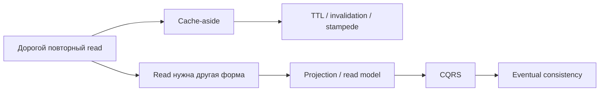

Разница важна: кэш обычно хранит копию ответа, который можно восстановить из источника истины. Read model - это
специально спроектированное представление для чтения. Она тоже может перестраиваться, но ее схема уже является частью
архитектуры приложения, а не просто ускорителем.

## Worked example: кэш ускорил карточку, но сломал смысл

### Ситуация

Карточка товара стала медленной: цена, остаток, рейтинг и промо-статус собираются из нескольких таблиц и внешних
источников. Команда добавила cache-aside на готовый ответ.

### Наивное решение

Положить весь JSON карточки в Redis на час и считать проблему решенной. Если цена изменилась, дождаться TTL. Если товар
пропал, тоже дождаться TTL. Если кэш пустой, каждый запрос сам идет в базу и заново собирает карточку.

### Что ломается

Кэш начинает вести себя как источник истины, хотя он им не является. Пользователь видит старую цену. При cache miss сто
одинаковых запросов одновременно бьют в базу. Когда экрану нужны поисковые поля и персональная цена, простой кэш ответа
перестает быть удобной моделью чтения.

### Улучшение

Разделить задачи: cache-aside ускоряет восстановимый ответ, single flight защищает miss, TTL/invalidation описывают
допустимую stale data, а отдельная read model появляется только когда чтению нужна другая форма данных.

### Почему это работает

Кэш и CQRS решают разные проблемы. Кэш уменьшает стоимость повторного чтения. Read model проектирует форму чтения. В
обоих случаях сложность должна покупаться метрикой: hit rate, latency, projection lag или снижение нагрузки.

## Цели

После этой статьи вы должны уметь:

- объяснять, зачем кэширование добавляют в систему и почему его не стоит добавлять заранее;
- различать cache hit, cache miss, TTL, инвалидацию и вытеснение;
- выбирать между in-process и out-of-process кэшем;
- узнавать cache-aside, read-through, write-through, write-behind и refresh-ahead;
- объяснять cache stampede и идею single flight;
- понимать, когда можно отдавать stale data через fallback cache;
- описывать роль Redis без привязки к конкретному API Redis;
- объяснять, почему CRUD-нагрузка обычно неравномерна;
- видеть признаки разрастания репозиториев и read-мапперов;
- объяснять CQRS как разделение read model и write model;
- сравнивать варианты реализации CQRS;
- понимать synchronous update, asynchronous update и eventual consistency;
- видеть, когда CQRS является overengineering.

## Карта лекции

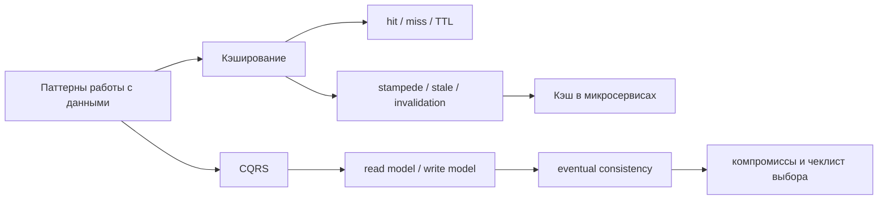

## Почему работа с данными становится узким местом

Пока приложение маленькое, запрос к базе часто выглядит как простая деталь реализации: вызвали репозиторий, получили
объект, вернули ответ. В реальной системе стоимость такого запроса складывается из нескольких факторов:

- сетевой round trip от приложения до хранилища;
- время выполнения запроса;
- блокировки и конкуренция за одни и те же строки;
- join по нескольким таблицам;
- маппинг строк базы в доменные объекты и DTO;
- сериализация ответа;
- повторение одного и того же запроса тысячами пользователей.

Нормализация базы помогает хранить данные без лишнего дублирования и защищать инварианты. Но чтение часто хочет другое:
один готовый документ, одну карточку товара, один список с уже посчитанными полями, один результат поиска без сложной
сборки из десяти таблиц.

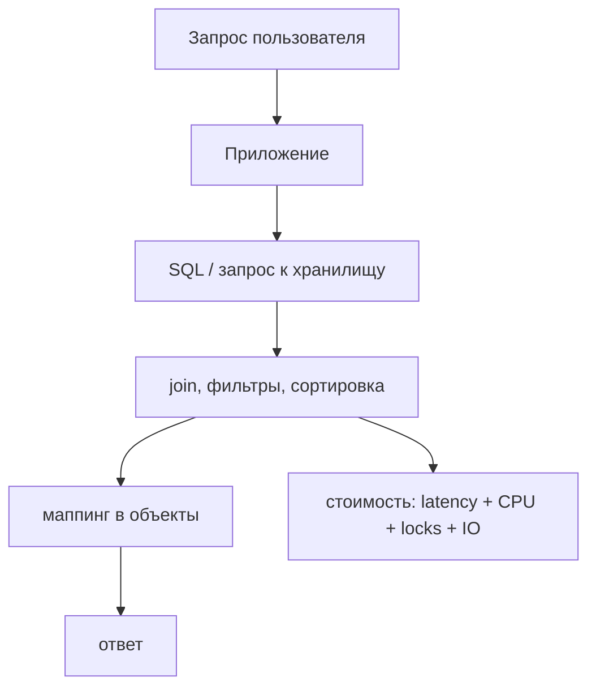

Паттерны работы с данными появляются там, где эта стоимость становится заметной и измеримой.

## Кэширование

Кэш - это быстрое хранилище копий данных или результатов вычислений. Обычно кэш стоит ближе к приложению, чем основная
база, и отвечает быстрее. При первом запросе данных в кэше может не быть. Это cache miss. Приложение идет в источник
истины, получает данные, кладет их в кэш и отвечает пользователю. При следующем запросе происходит cache hit: ответ
возвращается из кэша без обращения к основной базе.

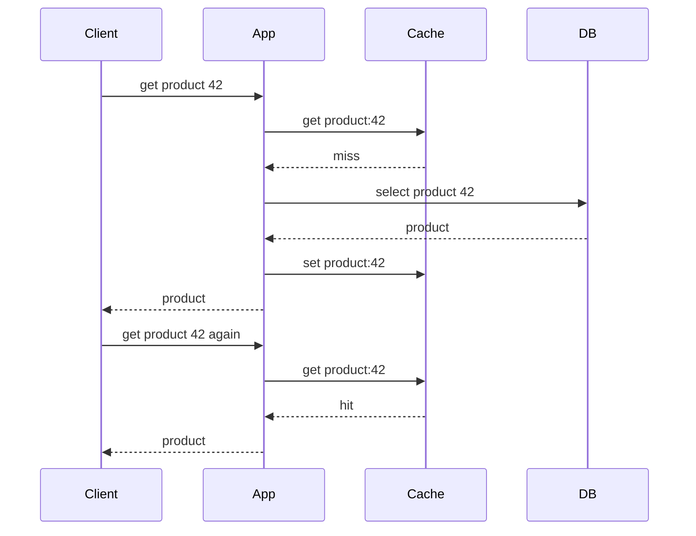

::: warning Не добавляйте кэш без измеримой проблемы
Кэширование почти всегда ускоряет удачный повторный read, но добавляет новые классы ошибок: устаревшие данные,
инвалидацию, дополнительные настройки, метрики и сценарии отказа. Если проблему можно решить индексом, оптимизацией
запроса или нормальным масштабированием базы, кэш может быть лишним.
:::

## Цена кэша

| Что выигрываем                         | Чем платим                                                        |
|----------------------------------------|-------------------------------------------------------------------|
| Меньше обращений к основной базе       | Нужно решать, когда копия становится недействительной             |
| Меньше latency на частых запросах      | Появляется риск stale data                                        |
| Меньше нагрузки при всплесках чтения   | Нужны eviction policy, лимиты памяти и мониторинг                 |
| Возможность пережить деградацию базы   | Нужно понимать, какие устаревшие данные допустимо показывать      |
| Быстрая отдача дорогих вычислений      | Нужно обновлять результат при изменении входных данных            |

::: warning Кэш не является источником истины
Источник истины - это хранилище, где данные считаются окончательными для бизнес-операций. Кэш можно потерять, очистить,
перестроить и прогреть заново. Если потеря кэша ломает бизнес-данные, это уже не кэш, а часть основной модели хранения.
:::

## Где может жить кэш

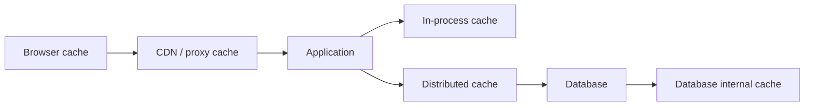

| Уровень                         | Что обычно кэширует                         | Плюсы                                      | Ограничения                                      |
|---------------------------------|---------------------------------------------|--------------------------------------------|--------------------------------------------------|
| Browser                         | статические файлы, HTTP-ответы              | бесплатно для сервера, близко к клиенту    | сложно принудительно обновлять                   |
| CDN / proxy                     | публичные страницы, изображения, API GET    | хорошо держит массовый трафик              | плохо подходит для персональных данных           |
| Application in-process          | справочники, настройки, горячие объекты     | очень быстро, просто начать                | каждый экземпляр приложения имеет свой кэш       |
| Distributed cache               | сессии, результаты запросов, rate limits    | общий кэш для нескольких экземпляров       | сеть, сериализация, отдельная точка эксплуатации |
| Database internal cache         | страницы данных, планы запросов             | встроен в СУБД                              | приложение почти не управляет политиками         |

::: only kotlin
В Kotlin/JVM in-process cache часто опирается на JVM-библиотеки вроде Caffeine или обычные коллекции с синхронизацией.
Но при нескольких экземплярах сервиса локальные кэши расходятся, поэтому для общих данных обычно нужен Redis или другой
out-of-process cache.
:::

::: only csharp
В .NET есть `IMemoryCache` для локального кэша и `IDistributedCache` для внешнего. Названия хорошо отражают
архитектурную разницу: первый ускоряет конкретный процесс, второй разделяется между экземплярами приложения.
:::

::: only java
В Java часто встречаются Caffeine, Ehcache, Spring Cache и Redis. Аннотации вроде `@Cacheable` удобны, но опасны, если
команда не договорилась о ключах, TTL, invalidation и допустимой stale data.
:::

::: only go
В Go локальный кэш обычно выглядит как библиотека или структура с `map`, mutex и TTL. Простота реализации не отменяет
сложность инвалидации, особенно если сервис запущен в нескольких репликах.
:::

## In-process и out-of-process cache

In-process cache живет внутри процесса приложения: например, `Map`, `ConcurrentHashMap`, `MemoryCache` или библиотека
на уровне языка. Out-of-process cache живет отдельно: Redis, Memcached или другой сервис.

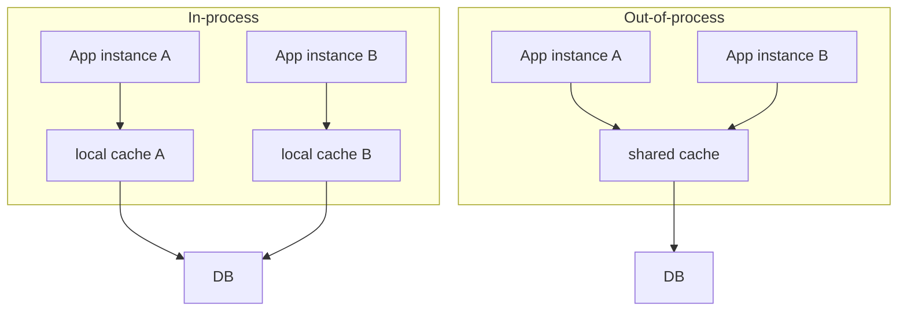

| Вопрос                         | In-process cache                         | Out-of-process cache                           |
|--------------------------------|------------------------------------------|------------------------------------------------|
| Скорость                       | максимальная, без сети                   | быстрая, но есть сетевой вызов                 |
| Простота старта                | высокая                                  | нужен отдельный сервис                         |
| Несколько экземпляров сервиса  | у каждого своя копия                     | общий кэш                                      |
| Инвалидация                    | сложнее синхронизировать между инстансами | проще централизовать                           |
| Потеря процесса приложения     | кэш теряется вместе с процессом          | кэш живет отдельно                             |
| Типичные данные                | локальные настройки, маленькие справочники | сессии, карточки, результаты дорогих запросов |

## Cache-aside: базовый паттерн

Cache-aside, или lazy loading, - самый частый прикладной вариант. Приложение само решает, когда идти в кэш, когда идти в
базу и когда записывать результат обратно в кэш.

Алгоритм:

1. Сначала читаем из кэша.
2. Если запись найдена и не протухла, возвращаем ее.
3. Если записи нет, читаем из основного хранилища.
4. Кладем результат в кэш.
5. Возвращаем результат клиенту.

::: multi-code "Cache-aside: чтение товара" {default=kotlin}

```kotlin
class ProductService(
    private val repository: ProductRepository,
    private val cache: MutableMap<String, Product>
) {
    fun getProduct(id: String): Product {
        return cache.getOrPut(id) {
            repository.findById(id)
        }
    }
}
```

```kotlin playground
data class Product(val id: String, val title: String)

class ProductRepository {
    var dbCalls = 0

    fun findById(id: String): Product {
        dbCalls += 1
        println("DB: loading product $id")
        return Product(id, "Mechanical keyboard")
    }
}

class ProductService(
    private val repository: ProductRepository,
    private val cache: MutableMap<String, Product>
) {
    fun getProduct(id: String): Product {
        val cached = cache[id]
        if (cached != null) {
            println("CACHE: hit for $id")
            return cached
        }

        println("CACHE: miss for $id")
        val product = repository.findById(id)
        cache[id] = product
        return product
    }
}

fun main() {
    val repository = ProductRepository()
    val service = ProductService(repository, mutableMapOf())

    println(service.getProduct("p-42"))
    println(service.getProduct("p-42"))
    println("DB calls: ${repository.dbCalls}")
}
```

```csharp
public sealed class ProductService
{
    private readonly ProductRepository _repository;
    private readonly Dictionary<string, Product> _cache = new();

    public ProductService(ProductRepository repository)
    {
        _repository = repository;
    }

    public Product GetProduct(string id)
    {
        if (_cache.TryGetValue(id, out var cached))
            return cached;

        var product = _repository.FindById(id);
        _cache[id] = product;
        return product;
    }
}
```

```java
class ProductService {
    private final ProductRepository repository;
    private final Map<String, Product> cache = new HashMap<>();

    ProductService(ProductRepository repository) {
        this.repository = repository;
    }

    Product getProduct(String id) {
        var cached = cache.get(id);
        if (cached != null) {
            return cached;
        }

        var product = repository.findById(id);
        cache.put(id, product);
        return product;
    }
}
```

```go
type ProductService struct {
    repository ProductRepository
    cache      map[string]Product
}

func NewProductService(repository ProductRepository) ProductService {
    return ProductService{
        repository: repository,
        cache:      map[string]Product{},
    }
}

func (s ProductService) GetProduct(id string) Product {
    if product, ok := s.cache[id]; ok {
        return product
    }

    product := s.repository.FindByID(id)
    s.cache[id] = product
    return product
}
```

:::

Cache-aside прост, но именно приложение отвечает за все детали: ключи, TTL, инвалидацию, сериализацию, обработку ошибок
и метрики.

## Метрики кэша

Кэш без метрик легко становится источником случайной сложности. Минимальный набор наблюдения:

| Метрика                     | Что означает                                      | Что диагностирует                                      |
|-----------------------------|---------------------------------------------------|--------------------------------------------------------|
| Hit rate                    | доля запросов, найденных в кэше                   | насколько кэш вообще полезен                           |
| Miss rate                   | доля запросов, ушедших в источник истины          | непрогретый кэш, плохие ключи, слишком короткий TTL    |
| Latency                     | время ответа кэша                                 | сетевые проблемы, перегрузку кэш-сервиса               |
| Memory usage                | занятая память                                    | приближение к лимиту, риск агрессивного вытеснения     |
| Eviction rate               | частота удаления из-за нехватки памяти            | слишком маленький кэш или неверная eviction policy     |
| Staleness                   | насколько данные отстают от источника истины      | риск неверных ответов пользователю                     |
| Error rate                  | ошибки чтения и записи кэша                       | деградацию Redis/Memcached/сети                        |
| Backend load after misses   | нагрузка на базу после промахов                   | cache stampede и неудачный прогрев                     |

::: tip Начинайте с cache-aside и метрик
Для большинства учебных и прикладных систем разумный первый шаг - cache-aside для дорогого read-сценария, TTL, лимит
памяти и графики hit rate/miss rate. Более сложные стратегии должны появляться после наблюдения, а не вместо него.
:::

## Что стоит кэшировать

Хороший кандидат для кэша обычно имеет несколько признаков:

- часто читается;
- редко меняется;
- дорого вычисляется или дорого читается из базы;
- допускает небольшое отставание;
- имеет понятный ключ;
- не содержит данных, которые опасно показать после изменения прав доступа;
- не является единственным источником бизнес-решения.

| Стоит кэшировать                             | Обычно не стоит кэшировать                              |
|----------------------------------------------|---------------------------------------------------------|
| карточку товара                              | результат проведения платежа                            |
| справочник стран или валют                   | факт списания денег                                     |
| публичный профиль с коротким TTL             | данные с мгновенно меняющимися правами доступа          |
| результат дорогого поиска                    | объект, который меняется чаще, чем читается             |
| агрегированную статистику за прошлый день    | уникальный ответ, который почти никогда не повторяется  |

## TTL, инвалидация и вытеснение

Эти три термина часто смешивают, но они отвечают на разные вопросы.

| Механизм      | Вопрос                                            | Пример                                                       |
|---------------|---------------------------------------------------|--------------------------------------------------------------|
| TTL           | когда запись считается устаревшей по времени      | хранить карточку товара 5 минут                              |
| Инвалидация   | какое событие делает запись неверной              | удалить `product:42`, когда изменили цену                    |
| Вытеснение    | что удалить, когда кэшу не хватает памяти         | удалить давно неиспользуемые записи по LRU                   |

TTL не гарантирует мгновенную актуальность. Если цена товара изменилась через 10 секунд после записи в кэш, а TTL равен
5 минутам, пользователь может увидеть старую цену еще почти 5 минут. Инвалидация по событию решает именно эту проблему:
после изменения товара приложение или отдельный обработчик удаляет/обновляет связанные ключи.

::: multi-code "TTL cache: запись с временем жизни" {default=kotlin}

```kotlin
data class CacheEntry<T>(
    val value: T,
    val expiresAtMillis: Long
)

class TtlCache<T> {
    private val values = mutableMapOf<String, CacheEntry<T>>()

    fun get(key: String, nowMillis: Long): T? {
        val entry = values[key] ?: return null
        return if (entry.expiresAtMillis > nowMillis) entry.value else null
    }

    fun put(key: String, value: T, nowMillis: Long, ttlMillis: Long) {
        values[key] = CacheEntry(value, nowMillis + ttlMillis)
    }
}
```

```kotlin playground
data class CacheEntry<T>(
    val value: T,
    val expiresAtMillis: Long
)

class TtlCache<T> {
    private val values = mutableMapOf<String, CacheEntry<T>>()

    fun get(key: String, nowMillis: Long): T? {
        val entry = values[key] ?: return null
        if (entry.expiresAtMillis <= nowMillis) {
            values.remove(key)
            return null
        }
        return entry.value
    }

    fun put(key: String, value: T, nowMillis: Long, ttlMillis: Long) {
        values[key] = CacheEntry(value, nowMillis + ttlMillis)
    }
}

fun main() {
    val cache = TtlCache<String>()
    cache.put("product:42", "Keyboard", nowMillis = 1_000, ttlMillis = 500)

    println(cache.get("product:42", nowMillis = 1_200))
    println(cache.get("product:42", nowMillis = 1_600))
}
```

```csharp
public sealed record CacheEntry<T>(T Value, long ExpiresAtMillis);

public sealed class TtlCache<T>
{
    private readonly Dictionary<string, CacheEntry<T>> _values = new();

    public T? Get(string key, long nowMillis)
    {
        if (!_values.TryGetValue(key, out var entry))
            return default;

        return entry.ExpiresAtMillis > nowMillis ? entry.Value : default;
    }

    public void Put(string key, T value, long nowMillis, long ttlMillis)
    {
        _values[key] = new CacheEntry<T>(value, nowMillis + ttlMillis);
    }
}
```

```java
record CacheEntry<T>(T value, long expiresAtMillis) {}

class TtlCache<T> {
    private final Map<String, CacheEntry<T>> values = new HashMap<>();

    T get(String key, long nowMillis) {
        var entry = values.get(key);
        if (entry == null || entry.expiresAtMillis() <= nowMillis) {
            return null;
        }
        return entry.value();
    }

    void put(String key, T value, long nowMillis, long ttlMillis) {
        values.put(key, new CacheEntry<>(value, nowMillis + ttlMillis));
    }
}
```

```go
type CacheEntry[T any] struct {
    Value           T
    ExpiresAtMillis int64
}

type TtlCache[T any] struct {
    values map[string]CacheEntry[T]
}

func (c TtlCache[T]) Get(key string, nowMillis int64) (T, bool) {
    entry, ok := c.values[key]
    var zero T
    if !ok || entry.ExpiresAtMillis <= nowMillis {
        return zero, false
    }
    return entry.Value, true
}

func (c TtlCache[T]) Put(key string, value T, nowMillis int64, ttlMillis int64) {
    c.values[key] = CacheEntry[T]{Value: value, ExpiresAtMillis: nowMillis + ttlMillis}
}
```

:::

## Стратегии вытеснения

Когда кэш ограничен по памяти, он должен удалять часть записей. Это не то же самое, что инвалидация: запись может быть
актуальной, но кэшу все равно нужно освободить место.

| Стратегия       | Что удаляет                                      | Где уместна                                               |
|-----------------|--------------------------------------------------|-----------------------------------------------------------|
| Random          | случайную запись                                 | простая деградация, когда точность не важна               |
| FIFO            | то, что было добавлено раньше всех               | простые очереди, предсказуемый поток данных               |
| LRU             | то, чем дольше всего не пользовались             | пользовательские карточки, справочники, типичный web read |
| LFU             | то, чем пользовались реже всего                  | устойчивые hot keys, повторяющиеся популярные запросы     |
| TTL-based       | то, у чего истек срок жизни                      | данные с понятной временной актуальностью                 |

LRU и LFU отвечают на разные вопросы. LRU смотрит на давность последнего обращения. LFU смотрит на частоту обращений.
Если объект использовали много раз утром и один раз только что, LFU и LRU могут принять разные решения.

## Кэширование ошибок и negative caching

Negative caching - это кэширование отрицательного результата: например, "товар не найден" или "такого пользователя нет".
Оно защищает базу от повторяющихся запросов к заведомо отсутствующим данным.

::: multi-code "Negative caching: NotFound на короткий TTL" {default=kotlin}

```kotlin
sealed interface CachedProduct
data class Found(val product: Product) : CachedProduct
data object NotFound : CachedProduct

fun findProduct(id: String): Product? {
    return when (val cached = cache.get(id, nowMillis())) {
        is Found -> cached.product
        NotFound -> null
        null -> loadAndCache(id)
    }
}
```

```kotlin playground
data class Product(val id: String, val title: String)

sealed interface CachedProduct
data class Found(val product: Product) : CachedProduct
data object NotFound : CachedProduct

class Repository {
    var calls = 0

    fun findById(id: String): Product? {
        calls += 1
        println("DB call for $id")
        return null
    }
}

class ProductLookup(private val repository: Repository) {
    private val cache = mutableMapOf<String, CachedProduct>()

    fun findProduct(id: String): Product? {
        return when (val cached = cache[id]) {
            is Found -> cached.product
            NotFound -> null
            null -> {
                val product = repository.findById(id)
                cache[id] = if (product == null) NotFound else Found(product)
                product
            }
        }
    }
}

fun main() {
    val repository = Repository()
    val lookup = ProductLookup(repository)

    println(lookup.findProduct("missing"))
    println(lookup.findProduct("missing"))
    println("DB calls: ${repository.calls}")
}
```

```csharp
public abstract record CachedProduct;
public sealed record Found(Product Product) : CachedProduct;
public sealed record NotFound : CachedProduct;

public Product? FindProduct(string id)
{
    var cached = _cache.Get(id);
    return cached switch
    {
        Found found => found.Product,
        NotFound => null,
        null => LoadAndCache(id)
    };
}
```

```java
sealed interface CachedProduct permits Found, NotFound {}
record Found(Product product) implements CachedProduct {}
record NotFound() implements CachedProduct {}

Product findProduct(String id) {
    var cached = cache.get(id);
    if (cached instanceof Found found) {
        return found.product();
    }
    if (cached instanceof NotFound) {
        return null;
    }
    return loadAndCache(id);
}
```

```go
type CachedProduct struct {
    Product *Product
    Found   bool
}

func (s ProductService) FindProduct(id string) *Product {
    if cached, ok := s.cache.Get(id); ok {
        if !cached.Found {
            return nil
        }
        return cached.Product
    }
    return s.loadAndCache(id)
}
```

:::

::: warning Не кэшируйте опасные write-ошибки
Можно на короткое время кэшировать `NotFound` или "внешний сервис временно недоступен" для read-сценария. Нельзя
прятать за кэшем неопределенный результат платежа, списания, бронирования или изменения прав. Для write-операций нужна
явная надежность, идемпотентность и проверяемое состояние.
:::

## Прогрев кэша

Прогрев - это заполнение кэша до того, как пользовательский запрос столкнется с промахом.

| Подход              | Как работает                                                        | Риск                                                    |
|---------------------|---------------------------------------------------------------------|---------------------------------------------------------|
| Ручной              | разработчик или оператор заранее загружает набор ключей             | забыли обновить, человеческий фактор                    |
| Автоматический      | scheduler регулярно загружает данные по расписанию                  | расписание не совпало с реальным поведением             |
| Ленивый             | кэш заполняется при первом miss                                     | первый пользователь платит полной latency               |
| По событиям         | событие в системе запускает обновление связанных ключей              | нужна очередь, обработчики и наблюдаемость               |
| Иерархический       | при малой памяти сначала прогреваются самые важные уровни данных     | сложно выбрать приоритеты                               |
| На основе аналитики | исторические данные подсказывают, что загрузить перед пиком спроса   | модель поведения может измениться                       |

Пример: маркетплейс знает, что вечером перед распродажей резко вырастет интерес к конкретной категории. Можно заранее
прогреть карточки товаров, цены и остатки для этой категории. Но если спрос пойдет не туда, кэш будет занят
малополезными данными, а miss rate останется высоким.

## Паттерны чтения и записи кэша

| Паттерн       | Кто работает с кэшем                          | Когда запись попадает в источник истины          | Компромисс                                             |
|---------------|-----------------------------------------------|--------------------------------------------------|--------------------------------------------------------|
| Cache-aside   | приложение                                    | приложение само читает DB и пишет cache          | просто, но вся логика в приложении                     |
| Read-through  | кэш сам загружает из источника при miss        | при read miss                                    | приложение проще, кэш сложнее                         |
| Write-through | запись идет в кэш и сразу в основное хранилище | синхронно                                        | актуальнее, но write медленнее                         |
| Write-behind  | запись идет в кэш, потом асинхронно в DB       | позже, через очередь/буфер                       | write быстрый, но есть риск потери/лага                |
| Refresh-ahead | кэш заранее обновляет горячие записи           | до истечения TTL или перед ожидаемым спросом     | меньше miss, но можно обновлять ненужные данные        |

Read-through, write-through и write-behind часто требуют поддержки со стороны кэш-платформы или отдельного слоя доступа
к данным. Cache-aside проще всего увидеть и реализовать в учебном коде.

## Проблемы кэширования

Кэширование редко ломается на happy path. Основные проблемы появляются при высокой конкуренции, отказах и изменении
данных.

### Cache stampede

Cache stampede возникает, когда популярный ключ исчезает из кэша, и множество одинаковых запросов одновременно идут в
основную базу.

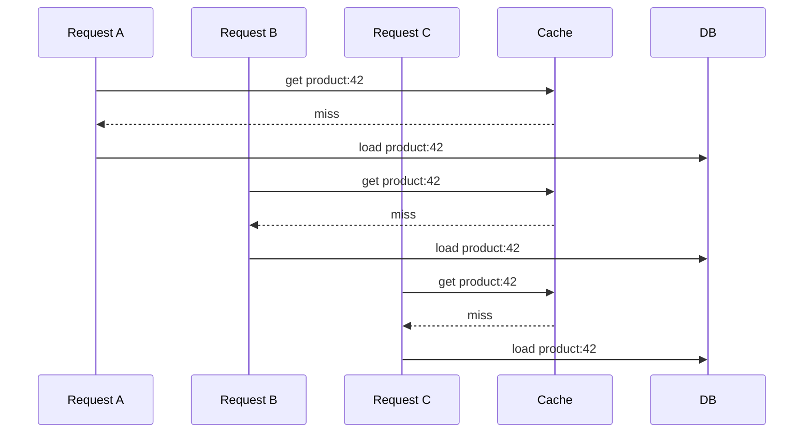

В итоге кэш должен был защищать базу, но в момент истечения TTL сам создал пик нагрузки.

### Single flight

Single flight, или request coalescing, объединяет одинаковые параллельные запросы. Первый запрос идет в базу, остальные
ждут тот же результат.

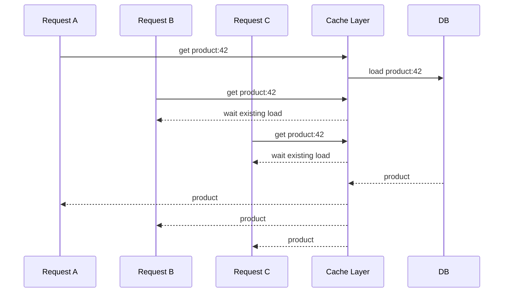

::: multi-code "Single flight: один загрузчик на ключ" {playground=off}

```kotlin
class SingleFlightCache<T>(
    private val repository: Repository<T>
) {
    private val cache = mutableMapOf<String, T>()
    private val inFlight = mutableMapOf<String, Deferred<T>>()

    suspend fun get(key: String): T {
        cache[key]?.let { return it }

        val load = inFlight.getOrPut(key) {
            async {
                repository.load(key).also { cache[key] = it }
            }
        }

        return load.await().also {
            inFlight.remove(key)
        }
    }
}
```

```csharp
public sealed class SingleFlightCache<T>
{
    private readonly Dictionary<string, T> _cache = new();
    private readonly Dictionary<string, Task<T>> _inFlight = new();
    private readonly Repository<T> _repository;

    public async Task<T> Get(string key)
    {
        if (_cache.TryGetValue(key, out var cached))
            return cached;

        if (!_inFlight.TryGetValue(key, out var load))
        {
            load = _repository.Load(key);
            _inFlight[key] = load;
        }

        var value = await load;
        _cache[key] = value;
        _inFlight.Remove(key);
        return value;
    }
}
```

```java
class SingleFlightCache<T> {
    private final Map<String, T> cache = new HashMap<>();
    private final Map<String, CompletableFuture<T>> inFlight = new HashMap<>();
    private final Repository<T> repository;

    CompletableFuture<T> get(String key) {
        if (cache.containsKey(key)) {
            return CompletableFuture.completedFuture(cache.get(key));
        }

        return inFlight.computeIfAbsent(key, missing ->
            repository.load(missing).thenApply(value -> {
                cache.put(missing, value);
                inFlight.remove(missing);
                return value;
            })
        );
    }
}
```

```go
type SingleFlightCache[T any] struct {
    cache      map[string]T
    inFlight   map[string]chan struct{}
    repository Repository[T]
}

func (c *SingleFlightCache[T]) Get(key string) T {
    if value, ok := c.cache[key]; ok {
        return value
    }

    if done, ok := c.inFlight[key]; ok {
        <-done
        return c.cache[key]
    }

    done := make(chan struct{})
    c.inFlight[key] = done
    value := c.repository.Load(key)
    c.cache[key] = value
    delete(c.inFlight, key)
    close(done)
    return value
}
```

:::

В промышленном коде для single flight нужны блокировки, очистка `inFlight` при ошибке и аккуратная работа с timeout.
Идея остается простой: один ключ - одна загрузка.

### Fallback и stale data

Иногда лучше отдать устаревшие данные, чем не отдать ничего. Например, новостная лента или каталог товаров могут
показать данные пятиминутной давности, если база временно недоступна. Но платежный баланс или статус посадочного места
так показывать опасно.

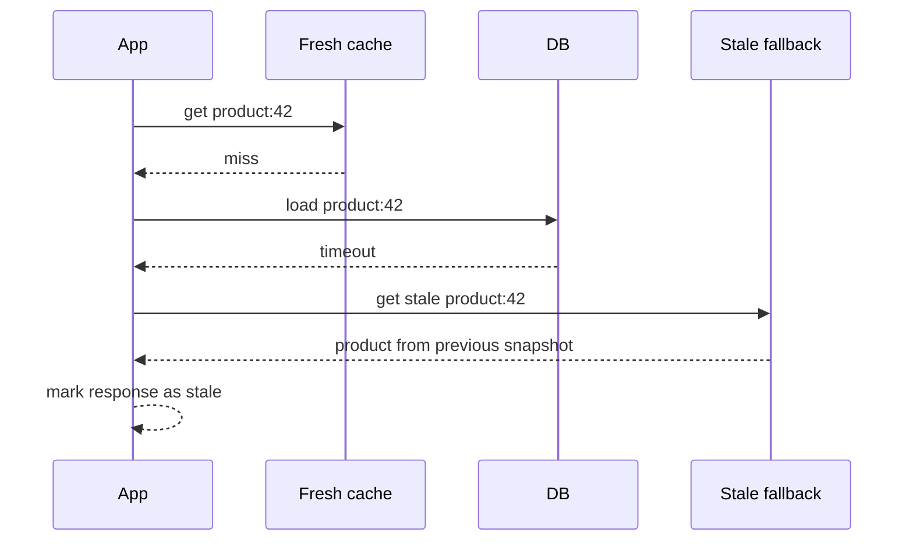

Fallback cache часто имеет более длинный TTL и используется только при деградации основного пути. Ответ должен явно
помечаться как устаревший, если это важно для пользователя.

### Таймауты и заполнение кэша после ответа клиенту

Бывает так: пользовательский запрос уже получил timeout, но база все-таки вернула результат позже. Если этот результат
просто отбросить, следующий пользователь снова попадет в ту же дорогую операцию. Один из вариантов - разделить timeout
клиента и timeout фоновой загрузки:

- клиенту отвечаем быстро: "данные пока недоступны";
- загрузку из базы не всегда отменяем сразу;
- если данные пришли позже, кладем их в кэш;
- следующий запрос получает ответ из кэша.

Это полезно для дорогих read-операций, но опасно для write-операций: нельзя silently продолжать платеж после того, как
пользователь получил неопределенный статус.

## Кэширование в микросервисах

В микросервисной системе кэш может находиться внутри конкретного сервиса, быть общим distributed cache или обновляться
через события.

On-demand вариант похож на обычный cache-aside:

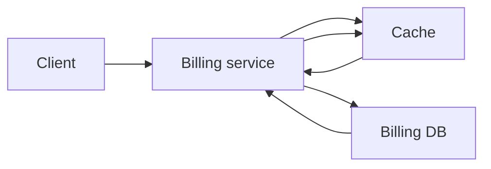

Event-driven вариант использует события, чтобы обновлять или инвалидировать кэш после изменений.

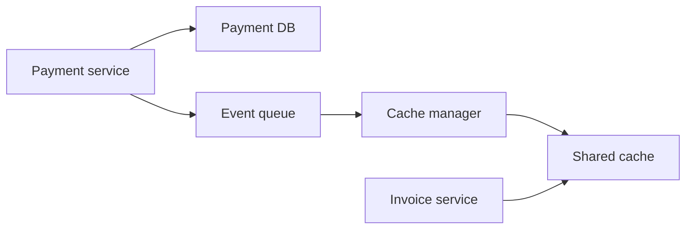

Важно, что очередь событий не делает кэш магически консистентным. Она просто дает место, где можно надежно передать
факт изменения и обработать его отдельным компонентом.

## Redis как инструмент

Redis часто используют как out-of-process cache, потому что он быстрый, держит данные в памяти, поддерживает TTL,
несколько структур данных и удобен как общий кэш для нескольких экземпляров приложения. Но паттерны важнее продукта:
cache-aside, TTL, invalidation, single flight, fallback и метрики нужны независимо от того, используете вы Redis,
Memcached, локальный `Map` или managed cache в облаке.

::: details Почему Redis часто выбирают для кэша
Redis умеет хранить строки, hash, list, set, sorted set и другие структуры, поддерживает expiration для ключей и хорошо
вписывается в web-нагрузку с большим количеством коротких операций. При этом Redis не отменяет проектных решений:
ключи, TTL, инвалидация, сериализация, retry и наблюдаемость остаются задачей системы.
:::

## От кэша к CQRS

Кэш помогает, когда проблема в повторной стоимости чтения. Но иногда проблема глубже: форма данных, удобная для записи,
плохо подходит для чтения.

Например, write model заказа может быть нормализованной:

- `orders`;
- `order_lines`;
- `products`;
- `users`;
- `payments`;
- `shipments`.

А экран "история заказов" хочет один готовый список: дата, номер, статус, сумма, 3 первых товара, адрес доставки и
кнопка повторить заказ. Можно каждый раз собирать это join и мапперами. А можно заранее поддерживать read model,
специально подготовленную для этого экрана.

## CRUD почти всегда неравномерен

CRUD выглядит симметрично: create, read, update, delete. В реальных приложениях нагрузка часто асимметрична: чтений
гораздо больше, чем изменений.

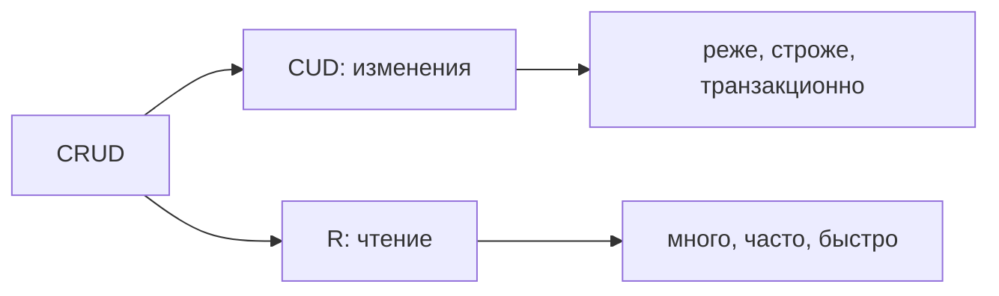

В социальной сети большинство пользователей читает ленту чаще, чем публикует. В маркетплейсе люди смотрят каталог и
карточки товаров чаще, чем покупают. В учебной системе студенты читают расписание чаще, чем администратор его меняет.

## Разные требования к CUD и R

| Сторона                    | Главные требования                                      | Типичная сложность                                      |
|----------------------------|----------------------------------------------------------|---------------------------------------------------------|
| Write side: create/update/delete | инварианты, транзакции, валидация, права, доменная логика | сложные агрегаты, правила, Unit of Work                 |
| Read side: query/read      | скорость, фильтры, сортировка, поиск, разные представления | проекции, денормализация, индексы, полнотекстовый поиск |

Write side должна защищать корректность. Read side должна быстро отвечать на вопросы. Попытка сделать одну модель
одинаково удобной для обеих сторон часто приводит к разрастанию репозиториев и мапперов.

## Как разрастается репозиторий

Сначала репозиторий выглядит аккуратно: создать пользователя, обновить, удалить, получить по id. Потом появляются
экранные запросы, отчеты, фильтры и связи с другими агрегатами. Через некоторое время `UserRepository` начинает знать о
планах оплаты, комментариях, проектах, биллинге и аналитике.

::: multi-code "Разросшийся UserRepository" {playground=off}

```kotlin
interface UserRepository {
    fun create(user: User)
    fun update(user: User)
    fun delete(id: UserId)

    fun getById(id: UserId): User
    fun findRecentActive(): List<User>
    fun findBySearchString(search: String): List<User>
    fun findAllOnFreePlan(): List<User>
    fun findAllWithoutBillingInformation(): List<User>
    fun findWhoCommentedArticleInProject(projectId: ProjectId): List<User>
}
```

```csharp
public interface IUserRepository
{
    void Create(User user);
    void Update(User user);
    void Delete(UserId id);

    User GetById(UserId id);
    User[] FindRecentActive();
    User[] FindBySearchString(string search);
    User[] FindAllOnFreePlan();
    User[] FindAllWithoutBillingInformation();
    User[] FindWhoCommentedArticleInProject(ProjectId projectId);
}
```

```java
interface UserRepository {
    void create(User user);
    void update(User user);
    void delete(UserId id);

    User getById(UserId id);
    List<User> findRecentActive();
    List<User> findBySearchString(String search);
    List<User> findAllOnFreePlan();
    List<User> findAllWithoutBillingInformation();
    List<User> findWhoCommentedArticleInProject(ProjectId projectId);
}
```

```go
type UserRepository interface {
    Create(user User)
    Update(user User)
    Delete(id UserID)

    GetByID(id UserID) User
    FindRecentActive() []User
    FindBySearchString(search string) []User
    FindAllOnFreePlan() []User
    FindAllWithoutBillingInformation() []User
    FindWhoCommentedArticleInProject(projectID ProjectID) []User
}
```

:::

Проблема не в количестве методов как таковом. Проблема в смешении смыслов. Методы для изменения агрегата и методы для
экранных выборок начинают жить в одном интерфейсе, хотя меняются по разным причинам.

## Маппинг и сложность чтения

Даже если репозиторий не разрастается, часто разрастается слой маппинга. Один и тот же доменный объект нужен в разных
представлениях:

- краткая карточка пользователя;
- профиль;
- автор комментария;
- участник проекта;
- строка отчета;
- результат поиска.

::: multi-code "Маппинг доменной модели в read view" {playground=off}

```kotlin
class UserToShortViewMapper : Mapper<User, UserShortView> {
    override fun map(user: User): UserShortView {
        return UserShortView(
            id = user.id.value,
            displayName = user.profile.displayName,
            avatarUrl = user.profile.avatarUrl
        )
    }
}
```

```csharp
public sealed class UserToShortViewMapper : IMapper<User, UserShortView>
{
    public UserShortView Map(User user)
    {
        return new UserShortView(
            user.Id.Value,
            user.Profile.DisplayName,
            user.Profile.AvatarUrl);
    }
}
```

```java
class UserToShortViewMapper implements Mapper<User, UserShortView> {
    public UserShortView map(User user) {
        return new UserShortView(
            user.id().value(),
            user.profile().displayName(),
            user.profile().avatarUrl()
        );
    }
}
```

```go
type UserToShortViewMapper struct{}

func (m UserToShortViewMapper) Map(user User) UserShortView {
    return UserShortView{
        ID:          user.ID.Value,
        DisplayName: user.Profile.DisplayName,
        AvatarURL:   user.Profile.AvatarURL,
    }
}
```

:::

Если таких преобразований становится много, возникает вопрос: может быть, read side должна хранить данные сразу в форме,
удобной для чтения?

## CQRS

CQRS - Command Query Responsibility Segregation. В практическом смысле это разделение ответственности между моделью
записи и моделью чтения.

- Command меняет состояние системы.
- Query читает состояние системы.
- Write model защищает бизнес-инварианты.
- Read model отвечает быстро и в удобной форме.

CQRS не обязан означать микросервисы, разные базы и Event Sourcing. Минимальная идея проще: не заставлять одну модель
одновременно быть идеальной для записи и идеальной для чтения.

::: warning CQRS не равен микросервисам
Можно использовать CQRS внутри одного монолита и одной базы. Можно иметь микросервисы без CQRS. Можно разделить read и
write код, но оставить одну схему хранения. Название паттерна не требует сразу строить распределенную систему.
:::

## CQRS как паттерн

| Часть паттерна | Для CQRS                                                        |
|----------------|-----------------------------------------------------------------|
| Context        | чтений больше, чем записей; read и write требуют разной модели  |
| Solution       | разделить command/write side и query/read side                  |
| Analysis       | чтение становится проще и быстрее, но появляется синхронизация  |

CQRS полезен не потому, что команды и запросы звучат красиво. Он полезен, когда разные стороны системы действительно
меняются и масштабируются по-разному.

## Read model и write model

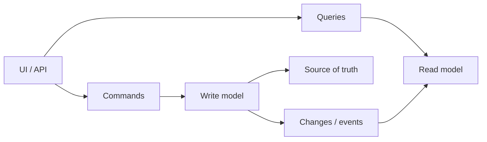

Write model может быть нормализованной, объектной и богатой бизнес-правилами. Read model может быть денормализованной:
например, одна таблица или документ уже содержит все поля, которые нужны экрану.

| Write model                              | Read model                                      |
|------------------------------------------|-------------------------------------------------|
| защищает инварианты                      | отдает готовые представления                    |
| использует агрегаты и транзакции         | использует проекции и индексы                   |
| нормализует данные                       | часто денормализует данные                      |
| оптимизирована под корректные изменения  | оптимизирована под быстрые query                |
| обычно является источником истины        | может быть перестроена из write side            |

## Вариант 1: одна база, две модели в коде

Самый мягкий вариант CQRS: приложение разделяет command handlers и query handlers, но использует одну базу и одну
схему.

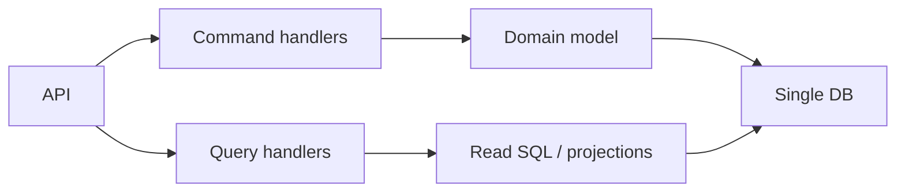

Плюсы:

- проще внедрить;
- не появляется отдельное хранилище;
- read и write код уже разделены;
- можно постепенно выделять горячие read-сценарии.

Минусы:

- база остается общей точкой нагрузки;
- read model еще не хранится отдельно;
- сложные запросы могут по-прежнему быть дорогими.

## Вариант 2: одна база, разные схемы

Второй вариант: write side пишет в нормализованные таблицы, а read side читает из денормализованных read-таблиц или
materialized views в той же базе.

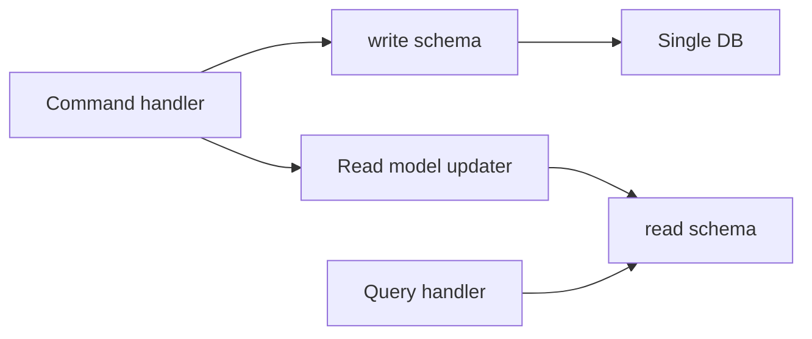

Плюсы:

- read-запросы становятся проще;
- можно подготовить данные под конкретные экраны;
- эксплуатационно это еще одна база, а не несколько сервисов хранения.

Минусы:

- данные дублируются;
- нужно обновлять read schema;
- write может стать медленнее, если read schema обновляется синхронно.

## Вариант 3: разные сервисы и разные хранилища

Третий вариант: write side и read side могут быть разными сервисами с разными хранилищами. Например, write side хранит
заказы в PostgreSQL, а read side держит поисковую модель в Elasticsearch или быстрые карточки в Redis.

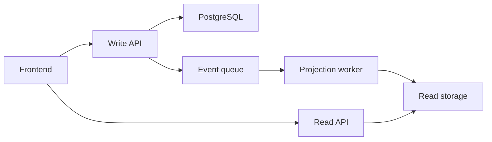

Плюсы:

- read и write масштабируются независимо;
- можно выбрать разные технологии хранения;
- сложные read-сценарии не давят на write database.

Минусы:

- выше эксплуатационная сложность;
- почти неизбежна eventual consistency;
- нужны очереди, retry, outbox, мониторинг lag;
- сложнее локальная разработка и тестирование.

## Как обновлять read model

Есть два базовых варианта.

Синхронное обновление: command handler меняет write model и read model в одной операции или транзакции.

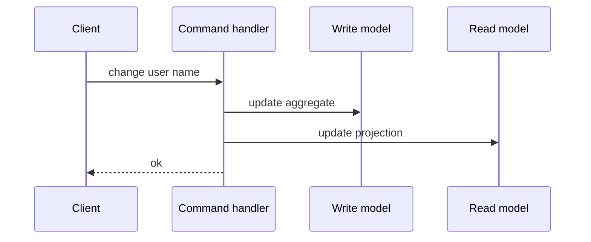

Асинхронное обновление: command handler меняет write model и публикует событие. Отдельный обработчик позже обновляет
read model.

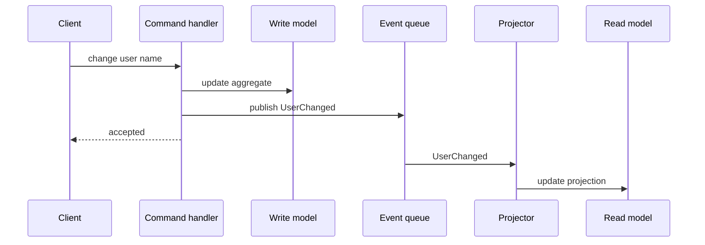

| Подход       | Плюсы                                      | Минусы                                                  |
|--------------|--------------------------------------------|---------------------------------------------------------|
| Синхронный   | read model сразу актуальна                 | write медленнее, больше связность                       |
| Асинхронный  | write быстрее, read side можно масштабировать | появляется lag и eventual consistency                   |

## Команды, запросы и обработчики

Команда выражает намерение изменить систему. Handler загружает агрегат, проверяет бизнес-правила, меняет write model и
фиксирует факт изменения.

::: multi-code "Command handler: смена имени пользователя" {playground=off}

```kotlin
data class ChangeUserNameCommand(
    val userId: UserId,
    val newName: String
)

class ChangeUserNameCommandHandler(
    private val users: UserRepository,
    private val events: DomainEvents
) {
    fun handle(command: ChangeUserNameCommand): Result {
        val user = users.getById(command.userId)

        if (!user.canChangeNameTo(command.newName)) {
            return Result.error("Name cannot be changed")
        }

        user.changeName(command.newName)
        users.save(user)
        events.add(UserChanged(command.userId))
        return Result.ok()
    }
}
```

```csharp
public sealed record ChangeUserNameCommand(UserId UserId, string NewName);

public sealed class ChangeUserNameCommandHandler
{
    private readonly IUserRepository _users;
    private readonly IDomainEvents _events;

    public Result Handle(ChangeUserNameCommand command)
    {
        var user = _users.GetById(command.UserId);

        if (!user.CanChangeNameTo(command.NewName))
            return Result.Error("Name cannot be changed");

        user.ChangeName(command.NewName);
        _users.Save(user);
        _events.Add(new UserChanged(command.UserId));
        return Result.Ok();
    }
}
```

```java
record ChangeUserNameCommand(UserId userId, String newName) {}

class ChangeUserNameCommandHandler {
    private final UserRepository users;
    private final DomainEvents events;

    Result handle(ChangeUserNameCommand command) {
        var user = users.getById(command.userId());

        if (!user.canChangeNameTo(command.newName())) {
            return Result.error("Name cannot be changed");
        }

        user.changeName(command.newName());
        users.save(user);
        events.add(new UserChanged(command.userId()));
        return Result.ok();
    }
}
```

```go
type ChangeUserNameCommand struct {
    UserID  UserID
    NewName string
}

type ChangeUserNameCommandHandler struct {
    users  UserRepository
    events DomainEvents
}

func (h ChangeUserNameCommandHandler) Handle(command ChangeUserNameCommand) Result {
    user := h.users.GetByID(command.UserID)

    if !user.CanChangeNameTo(command.NewName) {
        return ResultError("name cannot be changed")
    }

    user.ChangeName(command.NewName)
    h.users.Save(user)
    h.events.Add(UserChanged{UserID: command.UserID})
    return ResultOK()
}
```

:::

Query handler, наоборот, не должен менять состояние. Он читает подготовленную модель и возвращает DTO.

::: multi-code "Read query: готовая read model" {playground=off}

```kotlin
data class UserShortView(
    val id: String,
    val displayName: String,
    val avatarUrl: String?
)

class UserQueries(private val readDb: UserReadDb) {
    fun findProjectCommenters(projectId: String): List<UserShortView> {
        return readDb.findCommenters(projectId)
    }
}
```

```csharp
public sealed record UserShortView(
    string Id,
    string DisplayName,
    string? AvatarUrl);

public sealed class UserQueries
{
    private readonly IUserReadDb _readDb;

    public UserShortView[] FindProjectCommenters(string projectId)
    {
        return _readDb.FindCommenters(projectId);
    }
}
```

```java
record UserShortView(String id, String displayName, String avatarUrl) {}

class UserQueries {
    private final UserReadDb readDb;

    List<UserShortView> findProjectCommenters(String projectId) {
        return readDb.findCommenters(projectId);
    }
}
```

```go
type UserShortView struct {
    ID          string
    DisplayName string
    AvatarURL   *string
}

type UserQueries struct {
    readDB UserReadDB
}

func (q UserQueries) FindProjectCommenters(projectID string) []UserShortView {
    return q.readDB.FindCommenters(projectID)
}
```

:::

## Обновление read model по событию

Projection handler принимает событие и обновляет read model. Он не принимает бизнес-решение заново: решение уже принято
write side. Его задача - привести read representation к новому состоянию.

::: multi-code "Read model updater: UserChanged" {playground=off}

```kotlin
data class UserChanged(val userId: UserId)

class UserShortViewUpdater(
    private val users: UserRepository,
    private val readDb: UserReadDb
) : EventHandler<UserChanged> {
    override fun handle(event: UserChanged) {
        val user = users.getById(event.userId)
        readDb.upsert(
            UserShortView(
                id = user.id.value,
                displayName = user.profile.displayName,
                avatarUrl = user.profile.avatarUrl
            )
        )
    }
}
```

```csharp
public sealed record UserChanged(UserId UserId);

public sealed class UserShortViewUpdater : IEventHandler<UserChanged>
{
    private readonly IUserRepository _users;
    private readonly IUserReadDb _readDb;

    public void Handle(UserChanged @event)
    {
        var user = _users.GetById(@event.UserId);
        _readDb.Upsert(new UserShortView(
            user.Id.Value,
            user.Profile.DisplayName,
            user.Profile.AvatarUrl));
    }
}
```

```java
record UserChanged(UserId userId) {}

class UserShortViewUpdater implements EventHandler<UserChanged> {
    private final UserRepository users;
    private final UserReadDb readDb;

    public void handle(UserChanged event) {
        var user = users.getById(event.userId());
        readDb.upsert(new UserShortView(
            user.id().value(),
            user.profile().displayName(),
            user.profile().avatarUrl()
        ));
    }
}
```

```go
type UserChanged struct {
    UserID UserID
}

type UserShortViewUpdater struct {
    users  UserRepository
    readDB UserReadDB
}

func (u UserShortViewUpdater) Handle(event UserChanged) {
    user := u.users.GetByID(event.UserID)
    u.readDB.Upsert(UserShortView{
        ID:          user.ID.Value,
        DisplayName: user.Profile.DisplayName,
        AvatarURL:   user.Profile.AvatarURL,
    })
}
```

:::

## Unit of Work, ChangeTracker и уведомления

Если приложение использует Unit of Work, изменения агрегатов можно собрать в одном месте и после успешного сохранения
передать их dispatcher. В ORM это часто связывают с change tracker: он знает, какие сущности изменились в текущей
транзакции.

::: multi-code "Decorator: сохранение и рассылка изменений" {playground=off}

```kotlin
class ReadModelUpdateDecorator<TCommand>(
    private val inner: CommandHandler<TCommand>,
    private val unitOfWork: UnitOfWork,
    private val dispatcher: ChangeDispatcher
) : CommandHandler<TCommand> {
    override fun handle(command: TCommand): Result {
        val result = inner.handle(command)
        unitOfWork.commit()

        unitOfWork.collectChanges()
            .forEach { dispatcher.dispatch(it) }

        return result
    }
}
```

```csharp
public sealed class ReadModelUpdateDecorator<TCommand> : ICommandHandler<TCommand>
{
    private readonly ICommandHandler<TCommand> _inner;
    private readonly IUnitOfWork _unitOfWork;
    private readonly IChangeDispatcher _dispatcher;

    public Result Handle(TCommand command)
    {
        var result = _inner.Handle(command);
        _unitOfWork.Commit();

        foreach (var change in _unitOfWork.CollectChanges())
            _dispatcher.Dispatch(change);

        return result;
    }
}
```

```java
class ReadModelUpdateDecorator<TCommand> implements CommandHandler<TCommand> {
    private final CommandHandler<TCommand> inner;
    private final UnitOfWork unitOfWork;
    private final ChangeDispatcher dispatcher;

    public Result handle(TCommand command) {
        var result = inner.handle(command);
        unitOfWork.commit();

        for (var change : unitOfWork.collectChanges()) {
            dispatcher.dispatch(change);
        }

        return result;
    }
}
```

```go
type ReadModelUpdateDecorator[TCommand any] struct {
    inner      CommandHandler[TCommand]
    unitOfWork UnitOfWork
    dispatcher ChangeDispatcher
}

func (d ReadModelUpdateDecorator[TCommand]) Handle(command TCommand) Result {
    result := d.inner.Handle(command)
    d.unitOfWork.Commit()

    for _, change := range d.unitOfWork.CollectChanges() {
        d.dispatcher.Dispatch(change)
    }

    return result
}
```

:::

Важная деталь: если событие публикуется во внешнюю очередь, одной транзакции базы уже недостаточно. Тогда нужен outbox.

::: details Где появляется outbox
Проблема outbox такая: command handler успешно изменил базу, но приложение упало до публикации события в очередь. Read
model не обновится. Outbox решает это через запись события в таблицу той же транзакцией, что и бизнес-изменение.
Отдельный worker потом читает outbox-таблицу и публикует события в очередь с retry.
:::

## Eventual consistency

Eventual consistency означает, что система станет согласованной не мгновенно, а через некоторое время. Write model уже
обновлена, а read model еще нет.

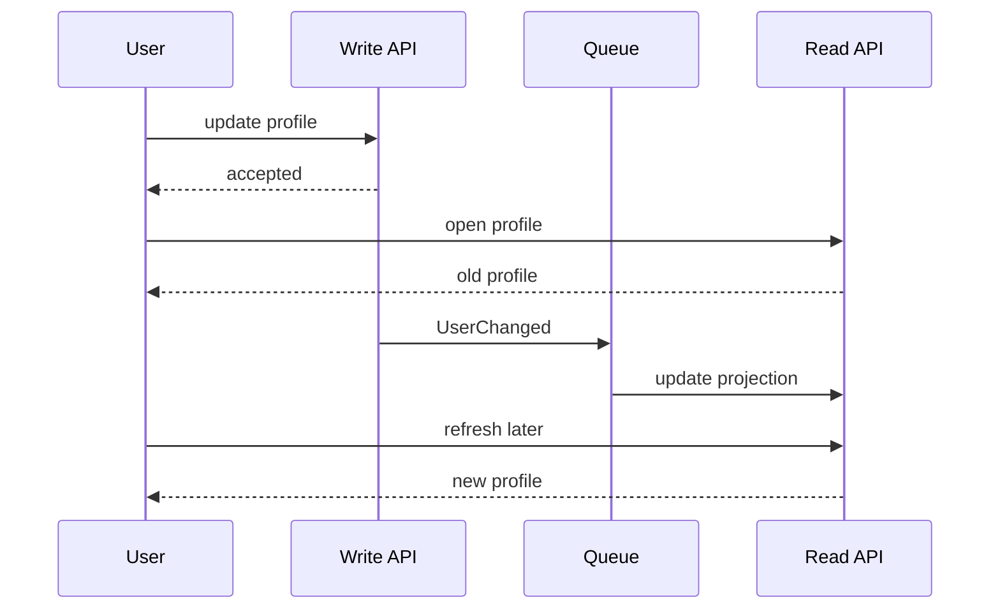

::: details Что такое eventual consistency простыми словами
Если пользователь изменил имя и сразу открыл страницу профиля, он может на секунду увидеть старое имя. Это не значит,
что запись потерялась. Это значит, что read model еще не догнала write model. Для одних сценариев это нормально, для
других недопустимо.
:::

Eventual consistency приемлема только тогда, когда бизнес и пользовательский опыт выдерживают задержку. В банковском
балансе, продаже последнего билета или управлении доступом требования обычно строже, чем в обновлении публичного
профиля или поискового индекса.

## Как жить с eventual consistency

Есть несколько практических приемов:

- показать пользователю статус "изменения приняты, обновление появится через несколько секунд";
- после write читать свежие данные напрямую из write side для этого пользователя, если нужен read-your-writes;
- блокировать повторное действие до завершения projection;
- показывать `lastUpdatedAt` или "данные актуальны на";
- использовать outbox и retry, чтобы событие не потерялось;
- мониторить projection lag;
- договориться с бизнесом о компенсациях, если редкий конфликт дешевле, чем строгая синхронизация.

Бизнес-компенсация - это не техническая ошибка, а осознанное решение. Например, если из-за задержки два пользователя
видели один товар доступным, бизнес может отменить один заказ, предложить замену или дать бонус. Но такое решение должно
быть явным, а не случайным последствием архитектуры.

## Кэш vs CQRS read model

Кэш и read model похожи тем, что оба ускоряют чтение. Но смысл у них разный.

| Вопрос                    | Кэш                                             | CQRS read model                                      |
|---------------------------|--------------------------------------------------|------------------------------------------------------|
| Что хранит                | копию ответа или объекта                         | специально спроектированное представление            |
| Источник истины           | основная база                                    | write model                                          |
| Можно ли очистить         | обычно да, кэш восстановится                     | можно, но часто нужен процесс перестроения projection |
| Главная цель              | не повторять дорогую операцию                    | читать данные в форме, удобной для query             |
| Обновление                | TTL, invalidation, refresh                       | события, projector, синхронное обновление            |
| Типичный риск             | stale cache                                      | eventual consistency                                 |

Если у вас уже есть удобная query, но она часто повторяется, нужен кэш. Если query каждый раз собирает неудобную форму
из сложной write model, стоит рассмотреть read model.

## Когда CQRS не нужен

CQRS не должен быть реакцией на любой CRUD-контроллер. Он не нужен, если:

- нагрузка небольшая и не создает проблем;
- одна модель достаточно проста для чтения и записи;
- команда не готова поддерживать события, projection и eventual consistency;
- read-сценарии не требуют другой формы данных;
- все операции требуют строгой синхронной консистентности;
- систему проще ускорить индексом, SQL-view или локальным refactoring.

::: warning CQRS может быть overengineering
Разделение read/write моделей почти всегда увеличивает суммарную сложность системы. Оно окупается, когда каждая сторона
по отдельности становится заметно проще, быстрее или независимее. Если выгода не измерима, лучше не усложнять.
:::

## Чеклист выбора решения

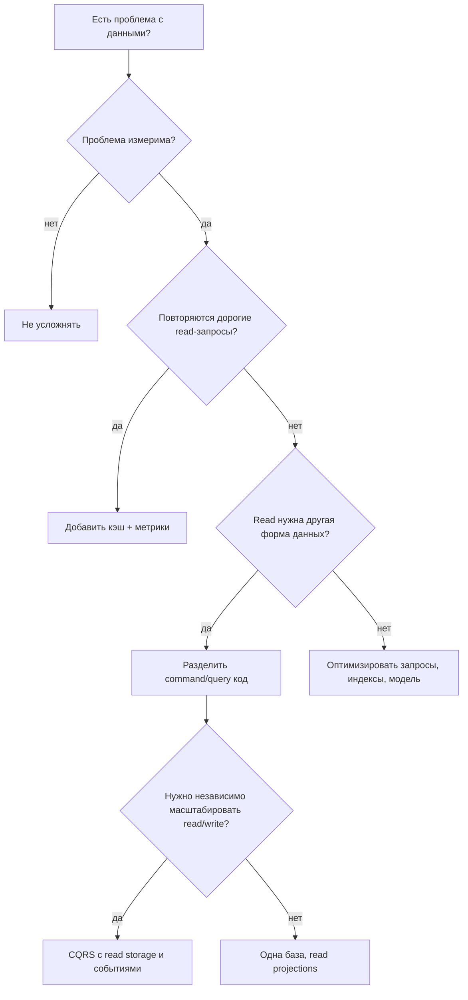

Практический порядок обычно такой:

1. Измерить проблему.
2. Проверить индексы, запросы и простую модель.
3. Добавить cache-aside для дорогого повторного чтения.
4. Ввести отдельные query handlers, если read и write код начинают мешать друг другу.
5. Выделять read model только для конкретных сценариев.
6. Переходить к отдельному read storage только при реальной потребности в масштабировании или другой технологии поиска.

## Резюме

Кэширование - это способ сократить повторную стоимость чтения или вычисления. Оно требует ключей, TTL, инвалидации,
eviction policy, метрик и ясного понимания stale data. Начинать стоит с простых решений: cache-aside, короткий TTL,
наблюдение за hit rate и miss rate.

CQRS - это способ разделить модель записи и модель чтения. Он полезен, когда write side должна защищать сложные
инварианты, а read side должна быстро отдавать разные представления данных. CQRS можно применять постепенно: сначала
разделить command/query код, потом добавить read projections, и только при необходимости выделять отдельные хранилища.

Главный критерий для обоих подходов один: сложность должна покупаться измеримой пользой.

Эта измеримость ведет к финальной лекции. Кэш без hit/miss-rate, CQRS без lag projection, read model без алертов и
runbook-ов быстро превращаются в невидимый риск. В [Лекции 14](/lectures/14#observability) эти решения попадут в
production-контур: метрики, логи, трейсы, SLO и incident response.

## Вопросы для самопроверки

1. Чем cache miss отличается от cache hit?
2. Почему кэш не должен быть источником истины?
3. Чем TTL отличается от инвалидации?
4. Когда LRU может быть лучше FIFO?
5. Какие ошибки можно кэшировать, а какие нельзя?
6. Что такое cache stampede?
7. Как single flight снижает нагрузку на базу?
8. Когда можно отдавать stale data через fallback cache?
9. Почему CRUD в реальных системах часто превращается в cRud?
10. Какие требования обычно важны для write model?
11. Какие требования обычно важны для read model?
12. Чем CQRS read model отличается от обычного кэша?
13. Почему асинхронное обновление read model приводит к eventual consistency?
14. Где в такой архитектуре нужен outbox?
15. Какие признаки говорят, что CQRS пока не нужен?

## Мини-практика

1. Возьмите любой read-сценарий из своего проекта и опишите ключ кэша, TTL и условие инвалидации.
2. Нарисуйте, что произойдет при cache miss, если одновременно придут 100 одинаковых запросов.
3. Предложите single flight или другой способ защиты от stampede для этого сценария.
4. Выберите один экран приложения и выпишите, какие поля ему нужны. Сравните это с доменной/write моделью.
5. Решите, достаточно ли для экрана SQL-запроса и кэша, или нужна отдельная read model.
6. Для выбранной read model опишите событие, которое должно ее обновлять, и что произойдет, если обработчик события
   задержится на 30 секунд.
