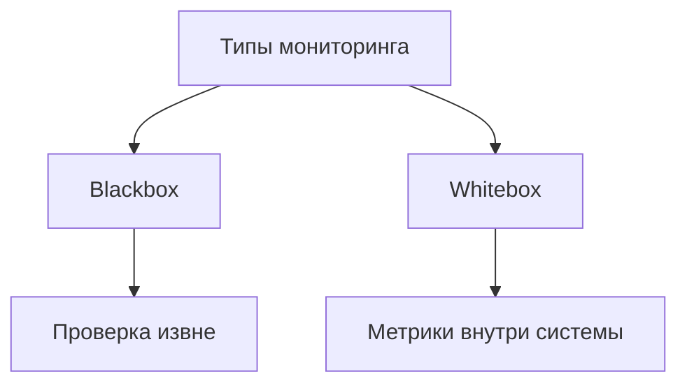
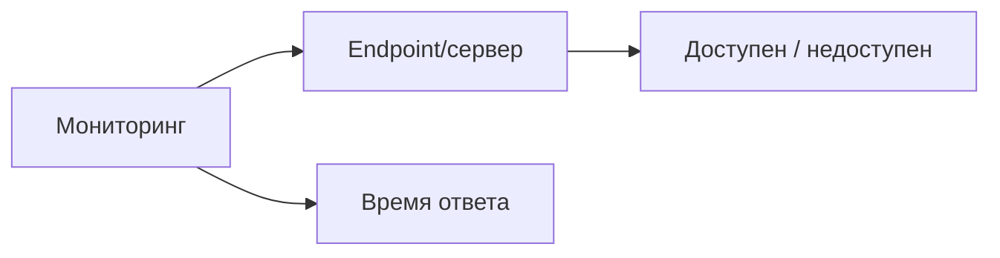
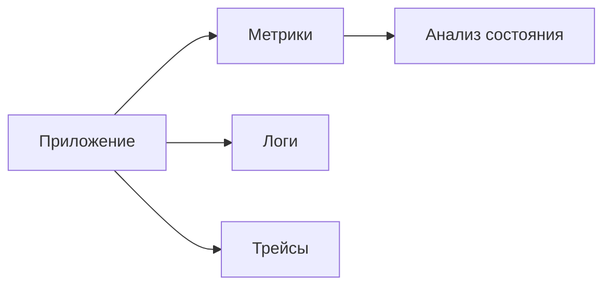
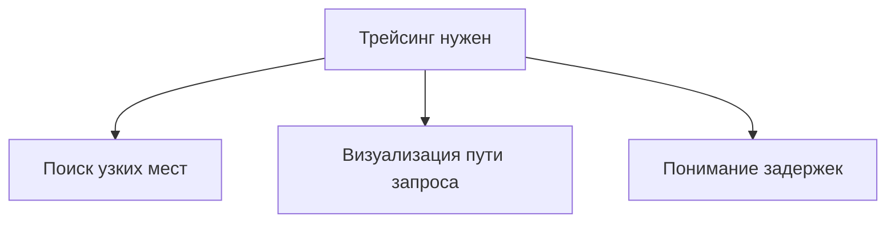
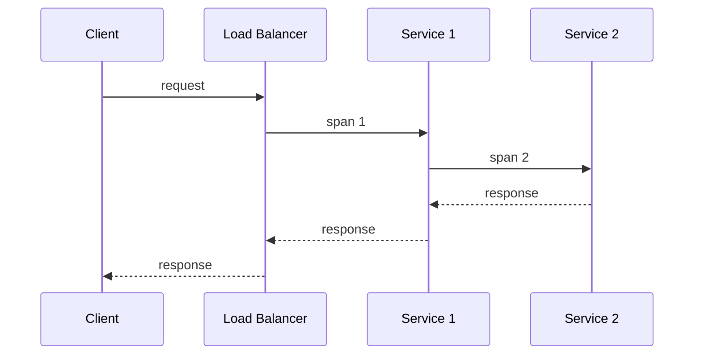
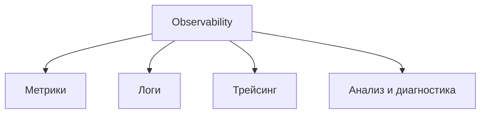
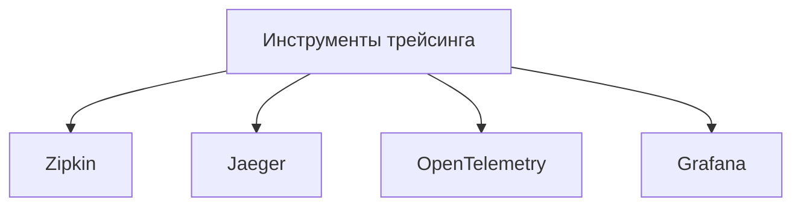
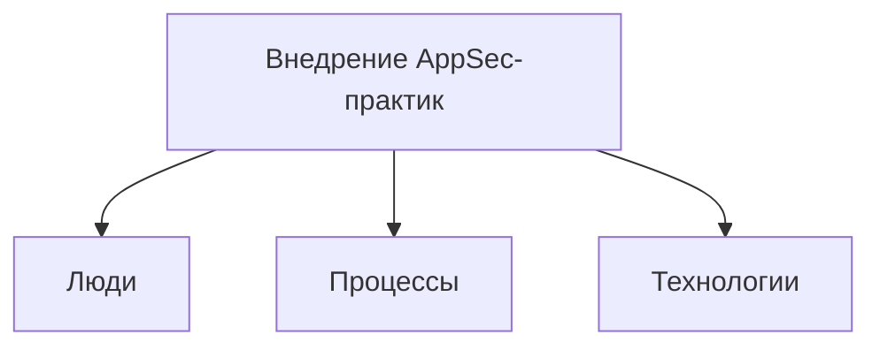

# Лекция 14. DevOps и Observability в современной разработке

Друзья, мы приступаем к заключительной лекции нашего курса. И сегодня хочется познакомить вас с другими областями, которые, наверное, будут смежные специальности программы инженеров. В этих областях меньше занимаются разработкой, хотя в некоторых позициях на Fair Country я видел вакансию на того же среде инженера. что не меньше чем middle разработчик вроде бы все равно эти специальности являются смежными но так или иначе сталкиваться вам как программным инженером с ними придется с этими людьми и с этими философиями разработки поэтому мы решили что как заключительная лекция данная тема имеет право на жизнь вот и сегодня мы разберем постараемся сделать такую экскурсную лекцию которая покажет Чем занимается та или иная профессия?

Попытался сравнить ряд профессий, сопоставить. Где-то попытался своей мыслью высказать, есть ли одна профессия, другую профессию, или все-таки тот же DevOps-инженер останется, или сейчас просто идет большая миграция с DevOps-инженера в DevSecurity Operation. Идет размытие, точнее, перегрузка DevOps. Есть MLOps, GitOps. И куча-куча-куча всего появляется в связи с усложнением самого процесса разработки. Затронем это, но и в отдельный блок еще вынесем консервабилити как принципы наблюдаемости за вашей системой. Это немножко отличается от классического мониторинга, потому что спросил коллегу Сергея Инженера, я говорю, Он говорит, что всю жизнь был мониторинг, что-то нового придумали в **Observability**.

Он говорит, что если у тебя дата-центр, снимаешь ты с него метрики, такой мониторинг, но загорелся твой дата-центр, ты уже метрики не снимешь, а наблюдать можешь. Это говорит **Observability**. Метрики кончаются в тот момент, когда мы их уже не получаем, мониторинг. Все, конец. А в Observability... Это чуть больше, чем просто снятие метрик. Это в том числе и зрительный анализ происходящего. И поговорим про это.

## DevOps

Начнем с Deluxe. Действительно, эта профессия становится все больше и больше актуальной, но современный классический Deluxe-инженер, если можно его так назвать, не знаю, то, что мы с вами... Судили до лекции, что DevOps — это философия, и про это тоже поговорим. Но хочется сказать, что, наверное, в современных реалиях с появлением сервис-услуг и вообще появление облаков, появление ML, появление или широкое использование кита, она размывает границы с DevOps. И поэтому, спрашивая, кто он такой, раньше про... Программиста можно было пошутить, да? Ты же программист, чинишь там все от холодильника до лыж. Вот сейчас, наверное, ну, сейчас, наверное, уже четкое понимание стало появляться.

А вот лет 10-15 назад к девопсам относились действительно достаточно скептически, потому что их... Откуда их брали? Их переименовывали. Коллега был админ в компании, он был админом, он говорит, мне надоело быть админом, и пошел изучать, на самом деле, Java Rush, Java. Вот получилось, я говорю, кем ты работаешь? Он говорит, я программистом стал. Он говорит, нет, я теперь не программист, я админом остался. Нет, я не админ, что ты, я DevOps-инженер. Но это реально не админы, давайте посмотрим, что это и с чем вообще столкнуться придется, если вдруг. Вы, закончив программную инженерию, решите все-таки через какое-то время или сразу, или, возможно, не решите, хотите в DevOps.

Это в большинстве маленьких компаний все-таки действительно до сих пор есть непонимание, кто это. Потому что если повезет маленьким компаниям, но у них хорошие разработчики, то в целом ряд задач разработчик может взять на себя. Проблемы, с которыми вы можете столкнуться, придя, возможно, в небольшую компанию, это действительно ситуация, что руководство может даже и не осознавать, кто такой Delops-инженер и зачем он нужен. Либо чуть более лучшая ситуация, они могут взять админа, переименовать штатную единицу в трудовую, и ему предоставить, что ты теперь Delops. У нас все теперь будет хорошо, и, собственно, ничего не изменится. И самое, что ужасное, это...

Из-за богатого разнообразия стека технологий у DevOps-инженера, то есть если вы думаете, что у программного инженера, у программистов большой стек разработки, который можно по пальцам пересчитать, то у DevOps-инженера это просто целая таблица Менделеева, причем реально и есть. Создали таблицу Менделеева по аналогии, точнее, таблицу Менделеева создали инструментальные средства, которые должен знать DevOps-инженер. выразительно отличаться, но учитывая, что DevOps это все-таки в первую очередь действительно идеология, стиль разработки программного обеспечения, то не так страшно, что все разное. Вот если говорить, за что отвечает инженер, можно поначалу испугаться. Но посмотрите, за что он не отвечает.

Это по сути все то, что мы изучали в предыдущие 13 лекциях и семинарах. Создание архитектуры, разработка. Только мы битую пару не прокладывали, но и DevOps-инженеры тоже не прокладывали. Есть монтажники. А за что отвечает? Действительно большая область задач. Но, повторюсь, в современных реалиях есть подвиды DevOps-инженеров. Это GitOps, NLOps, но об этом чуть попозже поговорим. Но в целом это, по сути, обеспечить... Непрерывный процесс разработки и непрерывную поставку продукта стекхолдерам, да и в целом всем участникам процесса разработки. Если вообще говорить о процессе разработки, то что он из себя включает? Классическая такая водопадная модель, неважно, как она реализована.

Возможно, это у вас всевозможная непрерывная разработка, канбан. скрам, неважно, какую методологию вы используете, в целом этапы, они примерно будут у вас такие, что вы проектируете, разрабатываете, потом приемо-сдаточные испытания, **тестирование**, интеграционные тестирования, ввод в пробу. Но в реальности это приводит к тому, что срыв сроков, то, что не устраивает бизнес, это разрыв. Все мы знаем, да, эту картинку с деревом, ожидание, реальность. Но самое, на самом деле, ужасное, это второй раз эту команду уже не соберешь, потому что она полностью будет... Коллеги все разругаются, админы разругаются с разработчиками, разработчики разругаются с продакт-менеджерами, и продакт-менеджер потеряет все доверие стейкхолдеров.

В общем, вряд ли второй раз они соберутся, чтобы выполнить какой-то проект, и вот это вот ужаснее всего. Ну и, соответственно, что в этом процессе? беспокоило именно разработчиков, участников разработки. Это непрекращающие дедлайны выполнения того или иного этапа. Это отчасти недоговороспособность других участников всего процесса. Это непредсказуемые релизные циклы, но это практически беспокоило всех участников такой команды без философии DevOps. Ну и тоже отчасти непонимание практик и инструментариев, которые используются другими участниками процесса, в том числе и тестировщиков, в том числе и АМИН. Администрацию беспокоила сложность поддержки и возможность воспроизведения окружения. То, что работал локально, не факт, что заработает у заказчика.

Непонимание специфики инструментальных средств и, опять же, предсказуемый релиз. И куча-куча всего. В последнее время в этот процесс стали вмешиваться еще и отделы безопасности. Их в основном беспокоило то, что их считали палкой в колеса. Потому что их подключали обычно в самый последний момент перед приемо-сдаточными испытаниями. И они не участвовали в процессе разработки. Их, соответственно, это тоже беспокоило. Они не понимали, как устроена работа перед ними, всех участников. Они, может быть, преувеличивали, но их высказанные замечания в конце разработки, уже на этапе сдачи, очень часто некритические замечания игнорируются. То есть они не имели никакого влияния на процесс разработки.

В классическом DevOps их тоже там упоминания нет, но в DevSecurity Operation там уже, конечно, появляется отдел инфобеза, который участвует на всех этапах бесконечного разработки и поставки картинку бесконечности, которую наверняка все видели. Да, их еще не устраивало, что все проблемы, которые они, даже если найдут, но не устранят, все равно потом будут сваливать на отдел информационной безопасности. Но важнее всего, для кого мы пишем? Для бизнеса. Что беспокоило бизнеса? Это, по сути, непонятно, когда программа допишется. Это непременное увеличение стоимости проекта в связи с размышлением сроков и какой-то раздрайв команды, который может привести к неразбеленности.

Но если мы увидели какой-то... логические этапы разработки, мы все понимаем, что в реальности этого нет. В реальности со стороны это выглядит таким образом, что да, идет проектирование, разработка архитектуры, потом какая-то неизвестность, какой-то год-два разработчики пропадают, и в конце выкладывается то, что, возможно, никому не нужно. И это, разумеется, все неэффективно. Уже давным-давно пришли к выводу, что нужно что-то менять. Появление новых методологий, да, но новые методологии должны были поддерживаться какими-то инструментальными средствами. Поэтому все это было неэффективным, потому что процесс разработки был частично непонятен для стейкхолдеров. Это действительно приводило к негативу.

Ошибки накапливались до того момента, пока заказчик ничего не увидит. Точнее, что-то увидит, то, что ему, возможно, уже не нужно. Ну и, собственно, ошибки мы правили в конце, что тоже крайне неверно, потому что в конце их достаточно уже сложно и невозможно исправить. Страдали все. Бизнес страдал, потому что он не мог использовать... Проект хотя бы частично или начать его аплодировать. Разработчик хотел писать код и не думать в целом об инфраструктуре, и не думать о других участниках, как им это поставить свои написанные модули, как заказчику сейчас может посмотреть. Администраторы тоже хотели понять и увидеть. четкие требования к той инфраструктуре, которую нужно настроить.

Безопасники хотели, чтобы их слушали раньше, а не на прием издаточных испытаний. Все это породило три таких больших проблемы и одно хорошее решение под названием DevOps в практике. Проблема номер один – это отсутствие постоянного или когда-то своевременного взаимодействия всех участников процесса разработки. Вторая проблема, она родилась из-за того, что постоянно не прекращается в IT усложнение технологий. Усложнение технологий – это не только плюсы, это на самом деле инструменты, которые могут воскресить старые баги или каких-то старых технологий. И, собственно, развитие технологий – это увеличение количества технологий, которые тому же админу нужно учитывать при развертывании.

Третья проблема – это все друг на друга перекладывали ответственность, в том числе и на отделы информационной безопасности, на тестировщиков. Потому что найденная проблема в конце разработки, мало того, что уже никем не хотелось, никто не хотел брать на себя ответственность и никто не хотел ее решить. И таким образом нужно было что-то менять. И эволюционно поменялся процесс разработки. Да, изменились методологии. Давно, наверное, кроме как... Где у нас? Да уже и в банках не используют. Где не важна строгость, точнее, где не важна выкладка готового продукта целиком, то шли уже от методологии каскадной и перешли к гибким методологиям.

На данном слайде мы видим предпосылки, что появление... такой методологии активного взаимодействия между всеми участниками под названием DevOps. То есть говоря о том, что такое DevOps, наверное, можно сказать, философия, методология, стиль написания программного обеспечения. То есть это действительно не профессия, это века идеи. Идея, как создавать DevOps, где это процесс, при котором... Люди, по крайней мере, в идеале, работают дружно и создают такой счастливый коллектив, который каждая вакансия упоминает. DevOps не стоит на месте. Если еще некоторое время назад можно было сказать, что DevOps перерос в Data Security Operations, то сегодня мы поговорим о том, что это уже не актуально. Там появились совершенно... новые профессии, есть вакансии уже.

Самое последнее, что стало появляться, это DevOps-платформе, но о его обязанности когда-то говорили еще.

Если говорить о том, чем он занимается, DevOps-инженер, и какие у него инструментальные средства. DevOps-инженер должен целиком и полностью принять эту философию. Если у него, в принципе, должно быть, наверное, одна самая главная цель, это... стараться все автоматизировать. Все, что можно автоматизировать, он должен автоматизировать. Все, что требуется для разработчиков, для своевременной поставки бизнесу, все вот эти процессы миграционной разработки и поставки, они должны быть максимально в pipeline занесены и работать безотказно. Ну и еще один важный нюанс для DevOps-инженера – это Для него инфраструктура – это код. То есть он описывает декларативно то, как должно разворачиваться приложение. Он это описывает в документации, можно сказать.

И воспринимает окружение как задокументированное, задекларированное, как задекларированный процесс. Помимо этого, помимо того, что он описывает, как должно разворачиваться. Он также инженер и управляет непрерывной сборкой и доставкой приложений. Работает с контейнеризацией. В последнее время, соответственно, раз есть контейнеризация, то и микросервисы, и он должен обеспечить CICD, желательно еще и с интеграцией в один из репозиториев. И вероятнее всего, либо ему придется взаимодействовать с Death Security Operation идеологией, либо ему это придется заниматься, либо ему взаимодействовать с отделом безопасности.

Отдельно стоит упомянуть, что да, возможно, мониторинг, логирование, трассировка, но редко ложится на самом деле в последнее время на DevOps-инженеров, она уходит на SRE-инженеров. которые занимаются отдельно наблюдаемостью и за системами. Но тоже, возможно, DevOps-инженеру придется заниматься и данными. Но, по крайней мере, как минимум, мониторингом, а не взаимодействием заниматься ему, может быть, и придется.

Если говорить о инструментальных средствах, то их действительно очень много. Их больше приближается к сотне. Но самый популярный степь технологий... Можно характеризовать то, что я вынес на слайд. Но чуть позже появился QR-код, который показывает актуальные всевозможные инструменты DevOps-инженера. Там интересно представлены периодические данные.

Если говорить о том, кто такой DevOps-инженер сейчас, то на самом деле размывается граница, как я и говорил. Приходится работать с Git-репозиториями и частенько возникает вакансия. Не частенько, но бывают вакансии в компаниях, либо на них переходит текущий DevOps-инженер. Особенно в DevOps Security Operation очень часто текущие DevOps-инженеры компании, расширяя, повышая свой уровень квалификации, уходят в эту ситуацию. Отдельно начали говорить про ML, Ops инженеров, которые занимаются как раз теми же абсолютно вопросами для того, чтобы разрабатываемые ML-модели выходили в прод раньше. Все то же самое, что для программных инженеров. ML, Ops инженер делает это для, соответственно, ML-щиков. Из-за большого появления данных.

Перехода всех на микросервисную архитектуру, либо сервис, либо сервисные технологии Амазона, либо Милан, тоже размывается, опять же, сфера границ нашего бедного и так уже перегруженного DevOps-инженера. Что тут стоит отметить? Стоит отметить, что половину из этих инструментальных средств, да больше, наверное, половины, должен брать и программист, программный инженер. То есть, видите, грань между, как раньше было, что был админ и был программист. Наверное, программист приближается к DevOps и в каких-то небольших компаниях выполняет DevOps-инженер. Интересно, я нашел на просторах таблицу периодической системы инструментальных средств DevOps-инженера. Код рабочий, там постоянно актуализируют инструментальные средства.

Интересный нюанс, что действительно все инструментальные средства, те или иные инструментальные средства используются на определенном этапе разработки программного обеспечения. При релизе это одни, при тестировании другие инструментальные средства. Для каждого этапа разработки у DevOps-инженера для каждого этапа есть свои инструментальные средства. Но очень часто DevOps-инженеров путают с новыми появившимися специальностями. И сравнивают иногда DevOps и DevOps и Cloud-инженера. Хотя общие они есть между DevOps и Cloud-инженером, но тем не менее давайте попробуем расширить наш горизонт специальностей, попробовать сравнить DevOps-инженера с другими достаточно смежными специальностями.

Если говорить о DevOps и SRE, то про SRE мы еще поговорили. У SRE-инженеров идет фокус на надежность. И на такие метрики, как сколько приложений наш сервис не был доступен, такие метрики, как сколько времени сервис гипотетически мог бы быть недоступен, и это бы не повлияло на бизнес. Для SRE-инженера важно это. В то же время для DevOps-инженера ему важно именно автоматизировать процесс, весь процесс разработки и до поставки продукта. и написать pipeline, который делает непрерывно, и, собственно, организует эту непрерывную разработку и поставку. И пример, если все-таки говорить, кто чем занимается, то SRE-инженер. Он отвечает за стабильность работы приложения и его мониторинг, наблюдаемость.

DevOps-инженер отвечает за CIS, за непрерывную поставку и разработку. Если сравнивать DevOps-инженера с новой, набирающей популярность в профессии платформенной инженерной, это, ну, вообще платформа, это, ну, чтобы новое веяние, но не все компании позволяют себе сделать свою собственную платформу. Это, по сути, когда у вас есть возможность в компании, чуть ли не в Telegram-боте. заказать определенный сервис с определенными настройками. И это снижает порог входа нанимаемых разработчиков. То есть они, по сути, уже не могут неправильно воспользоваться инфраструктурой. И ускоряет их скорость вхождения в проект. И, соответственно, платформенный инженер, он больше создает... настраивает внутреннюю платформу для разработчиков определенной компании.

Используя те, применяя те инструменты, которые используются разработчиками в этой компании. А DevOps обеспечивает настройку инструментов для таких платформ. Коджус есть на самом деле между всеми этими специальностями, но все-таки... Вот схожесть максимальная, наверное, DevOps-инженера и Cloud-инженера, потому что здесь действительно DevOps-инженер все чаще и чаще работает с облаками, поэтому просто у Cloud-инженера специализация, наверное, на облачных сервисах, у DevOps интеграция облачных сервисов в CIS. Но, тем не менее, вот эти вот две специальности практически идентичны. Все пересекаются. если использует K8S. И ради чего? Ради того, чтобы снизить затраты с помощью повышенной скорости отдачи нашего продукта.

Значит, с DevOps все понятно. У него сотрудничество между командами разработки, если это микросервисная архитектура, у него метрики успеха. частота развертывания, и, собственно, он используется и в работе, и в связи с идеологией. СРЕ инженеры — это основная цель — управлять надежностью системы. То есть выстроить дашборды, наблюдаемость, трейсинг, анализ. Потому что многие разработчики говорят, что вроде бы у нас куча микросервисов как-то взаимодействует, мы перешли на новое АБИ, а все равно какой-то... сервис не перешел. Понимаем тоже, как было. И вот этот анализ трейсинга позволяет управлять в том числе и надежностью системы. Доступность и масштабирование. Ну и, соответственно, у сырья инженера есть такие метрики, как СЛО, СЛА.

Но если так, объединить все в кучу, в том числе и бюджет ошибки, это СЛА. Некая метрика, которую он ставит, сколько, допустим, разрабатываем мы какой-нибудь интернет-магазин, и одна из метрик — это сколько сайт будет доступен по времени. Допустим, он говорит, 99% за указанный месяц сайт будет доступен. Если сайт доступен 95%, метрика не выполняется. Можно предъявить Сергея Инженера. Бюджет ошибки — это сколько... Компания теряет, если какой-то период времени сервис недоступен. И у платформенного инженера это создать и управлять той платформой, на которой ведется разработка продукта. Метрики успеха – это, собственно, время, выход на рынок. Ну и масштабируемость этой платформы на количество разработчиков.

И подход слова подобрал автоматизацию. процесса развертывания платформы. Все это на самом деле достаточно сугубо личная оценка, но если так делить очень грубо подход к культуре, то у DevOps-инженера это ориентация на сотрудничество, у SRE в свою очередь ориентация на надежность продукта, у платформенного инженера ориентация в целом на продукт. Ну и отсюда разные подходы к ценностям и в принципе, подход к структуре команды. Но сильно это все вылезло, на самом деле, из-за лосса. Поэтому все вот эти культуры и ценности, наверное, у них общие должны быть. Просто где-то с какой-то утрируя попытался это выписать в виде сравнения. Можно еще поделить по инфраструктуре и конфигурации.

Как мы говорили, у DevOps-инженера это конфигурация как код, как код и инфраструктура как код. То есть для него это описание декларации, как должна выглядеть инфраструктура. У SRE это индикаторы уровня сервиса. Сколько сервис работал, сколько сервис не работал, сколько бизнес потерял, пока сервис не работал. И, соответственно, они также подход к управлению конфигурациями, это версионирование конфигурации. Но на самом деле про SRE мы еще будем подробно говорить, про версионирование конфигурации тоже оставлю на потом. Ну и у платформенного инженера это автоматизация инфраструктуры. Ну да, сейчас сравнивать закончим и перейдем уже к... Но вот еще попытался прописать план развития той или иной специальности или шаги.

То есть, наверное, из интересного, это у СРЕ инженеров есть такая практика по возникновению прецедента. Идет анализ данного прецедента. разбирается, почему он произошел, но не с целью выявить, кто виноват, хотя разбирается, кто виноват, но без каких-либо последующих санкций, наказаний, просто обсуждается, как эту проблему исправить. То есть достаточно хорошая практика, особенно инженеров. То есть они не ищут крайних, хотя это их KPI, и, соответственно, влияет на плену, если они не прецеденты. Нам брать к ключевым задачам именно DevOps-инженера автоматизация всего. Все, что не автоматизировано, должен стараться произвести автоматизацию любого процесса. Должен следить за элементами безопасности, за элементами security.

И security на самом деле в современной разработке встраивается во все процессы, и, соответственно, он это должен тоже обеспечить. Если есть в проекте EMF, то соответственно взаимодействие с EMF-инженером и интеграция этих практик в его рекламе. Есть мнение, что современные инструментарии и современные требования к разработчику в принципе могут убрать такую профессию как DevOps-инженер. Часть перейдет в SRE-инженеры. часть перейдет в платформенные инженеры. В DevOps обязанность может остаться на программистах. Но другие говорят, что нет. DevOps — это, в первую очередь, нос между разными командами, между технологиями, между процессами. И даже не страшны никакие AI-агенты, не страшны то, что разработчики на себя берут этот функционал. Поэтому...

В целом, профессия должна только... востребованность профессии будет, думаю, возрастать. Но, скорее всего, чисто DevOps-инженеров будет сильно становиться меньше, если будет выходить про расширение их обязанностей. Есть такая шутка, что админов переименовали в DevOps, но поняли, что на самом деле не так. И админы и DevOps-инженеры — это всегда разные, прямо идеологически. И в целом... Переименовав, если относиться к этому как к шутке, что все стало хорошо. Но разработчики, да и в целом, была такая тенденция, что не сильно любили заниматься мониторингом работы сервисов. Мониторингом работы, в принципе, серверов железа и сервисов, которые там с вами. Ну и вот, согласно...

## Типы мониторинга

**Слайд 42: ТИПЫ МОНИТОРИНГА**

### Black Box мониторинг

**Слайд 43: BLACKBOX МОНИТОРИНГ**

**Слайд 44: WHITEBOX МОНИТОРИНГ**

Если это сработало на админах, переименовав админов в DevOps-инженеров, все получилось, то, продолжая эту шутку, можно сказать, что если мы DevOps-им мониторинг и превратим его в красивый ребрендинг, сделаем что-то в Zerolite, то это тоже станет популярным, не таким уж скучным, и не стыдно будет говорить, что я занимаюсь мониторингом систем, я занимаюсь Zerolite. Есть два типа. Мониторинга – это Black Box и White Box, как и у тестирования. Один из них – Black Box. Это, по сути, мониторинг показателей, которые выдает нам тот или иной сервер. Мы можем посмотреть его пропускную способность, можем посмотреть, сколько он выполнял запросы, посмотреть. работает или не работает.

И в целом такой мониторинг имеет место жить, но в современных реалиях он ничего не даст. У вас может быть приложение действительно по Black Box мониторингу и бы пинговаться сервер, но по каким-то причинам конечный пользователь не может зайти на сайт. При Black Box мониторинге вы можете промониторить балансировщик Nginx. Вы можете промониторить, что у вас доступна API вашего заканда, но толку от этого нет. Приложение конечному пользователю все равно недоступно. Почему недоступно? Классический мониторинг, Black Box мониторинг, он не ответит на этот вопрос.

### White Box мониторинг

В то же время White Box мониторинг, он нацелен на то, что помимо того, что вы можете также мониторить доступность того или иного сервера, вы на самом деле можете мониторить и происходящие вам процессы внутри системы. Если сравнивать в целом старый добрый мониторинг с обзоровом билдинге, то это не одно и то же. Мониторинг – это действительно сбор информации, которую вы можете получить, если у вас… Как пример я привел с дата-центром, что пока дата-центр отдает какие-то метрики, вы можете его мониторить. Высвечился свет, загорелся дата-центр, вы не можете его мониторить. Если уходить от разработки, а в Zero Ability вы можете стоять, продолжать и наблюдать.

## Observability

Поэтому в Zero Ability у него именно акцент на понимание процессов внутри. происходящий в вашей микросервисной архитектуре. Но в то же время **observability** – это логи, метрики и трассировку. Но сейчас поговорим про логи, метрики и трассировку отдельно. И observability – это все-таки получение этих метрик и анализ. Но в то же время observability без мониторинга никуда. То есть часть данных мы все равно можем сыграть исключительно в мониторинге сервиса.

Таким образом, SRE-инженер… обязанность которого входит в Zero Ability, он улучшает диагностику проблем, позволяет понять, что случилось, таким образом повышает надежность и ускоряет сам процесс разработки и разработки. Ну и давайте посмотрим, что можно сделать нам на этапе Zero Ability.

### Алерты

**Слайд 47: АЛЕРТЫ**

| Алерты |
|---|
| Все что требует действий. |
| Обязательно разделение по важности. |

**Слайд 48: АЛЕРТЫ**

| Алерты |
|---|
| Все что требует действий. |
| Обязательно разделение по важности. |
| Все остальное решает визуализация и регламент ее обработки. |

Мы можем уловить алерты и их анализировать. Но вот здесь на самом деле... к этому вопросу спорное отношение. Какие алерты нам нужно в целом ловить? Вот если инженер небольшой компании скажет, да что, давайте все алерты, которые кидает наша система, неважно, на любое, мы будем ловить и анализировать. Но взять какой-нибудь... На конференции выступали из Т-банка, у них в... Они сказали, что в минуту несколько тысяч алертов приходит. Или в час. В общем, такое количество, на которое они уже в целом не реагируют. Но возникает вопрос, а если ты не можешь отреагировать на алерт, то стоит ли вообще его тогда посылать? Вот допустим. Мы реально не собираемся его отрабатывать. Его можно затюнить просто. Там же есть какой-то траш-фолд.

Там метрика приходит, ставится какой-то траш-фолд, если в течение минуты потребления CPU больше, чем 90%. Нечто подобное в статье Google спрашивали, как у родоначальников этой практики. Их спросили, а где грань? Остается у нас... 10% на SSD диски. Или там процессор перегружен на 98%. То есть, в принципе, для нас 98% еще не критично. 99% критично. Нужно ли кидать алерт, что процессор перегрузился на 98%? Это решается разными статусами. Да. Но они сказали либо... Их первое действие. Они говорят, что... Они не кидают алерты, допустим, на такие вещи, они визуализируют на дашбордах. Второй вариант, мы заводим несколько приоритетов у алертов и приоритизации отрабатываем.

Но сказали, что в первую очередь мы стараемся это визуализировать на дашборде, чтобы SRE-инженер с утра подошел, посмотрел на дашборд, увидел, в какое время. как себя система вела.

### Логи

#### Логи: парсинг, хранение и визуализация

**Слайд 49: ЛОГИ**

| Парсить |
|---|
| Fluentd[bit] |
| Logstash |
| ... |

**Слайд 50: ЛОГИ**

| Парсить | Хранить |
|---|---|
| Fluentd[bit] | ElasticSearch |
| Logstash | ClickHouse |
| ... | Loki |
|  | ... |

**Слайд 51: ЛОГИ**

| Парсить | Хранить | Строить визуализацию |
|---|---|---|
| Fluentd[bit] | ElasticSearch | Grafana (можно интегрировать с метриками) |
| Logstash | ClickHouse | Kibana |
| ... | Loki |  |
|  | ... |  |

#### Логи: алерты и полный контур обработки

**Слайд 52: ЛОГИ**

| Парсить | Хранить | Строить визуализацию | Алертить |
|---|---|---|---|
| Fluentd[bit] | ElasticSearch | Grafana (можно интегрировать с метриками) | Kibana |
| Logstash | ClickHouse | Kibana | Grafana |
| ... | Loki |  | Elastalert |
|  | ... |  |  |

Некоторые дешборды еще и позволяют посмотреть сразу влог событий в этот момент. И, в общем, они не кидают алерты, которые действительно в час ночи не будут отработаны. Но, тем не менее, они эти алерты не игнорят, но стараются некритические алерты визуализировать. Если только алерт, который уже влияет на работу. Приложение должно быть обязательно кинуты и по почте, и по телеграму, и какой-то командой, дежурной командой должен быть обработан. Помимо алертов у нас есть логи. Логи, которые нам необходимо сохранять и необходимо анализировать. Чтобы анализировать их, надо парсить. Один из самых популярных инструментов, чтобы сохранять. Один из самых популярных – это Elasticsearch база.

Она для хранения логов, так как Elasticsearch позволяет делать достаточно хороший поиск. Для сохранения логов, наверное, самый идеальный такой. Помимо того, что мы их парсим, сохраняем, мы должны их визуализировать. Ряд инструментов. Самый популярный – это графана. Сам не видел, только читал, на проектах не использовал. Помимо того, что мы лобби парсим, храним и по ним визуализируем, мы также можем их аллергить. И есть та же графана, позволяет нам… применить анализ логов и в необходимости кинуть алерт.

### Трейсинг

#### Трейсинг: зачем и как

**Слайд 53: ТРЕЙСИНГ - ЗАЧЕМ**

**Слайд 54: ТРЕЙСИНГ – КАК**

**Слайд 55: ТРЕЙСИНГ – КАК**

#### Трейсинг: построение трассы

**Слайд 56: ТРЕЙСИНГ – КАК**

**Слайд 57: ТРЕЙСИНГ – КАК**

**Слайд 58: ТРЕЙСИНГ - ЧТО**

#### Трейсинг: инструменты

**Слайд 59: ТРЕЙСИНГ - ЧЕМ**

Помимо алертов, логов, на самом деле в последнее время приобретает популярность трейсинг. И, наверное, вот об этом стоит поговорить, а лучше, наверное, показать. Трейсинг очень важен для поиска узких мест систем. Он важен для визуализации пути выполнения работ, потому что иногда... Даже сама команда разработчиков не может понять, почему тот или иной сервис выполнялся чрезвычайно долго. Трассировка позволяет визуализировать выполнение, построить таймлайн, сколько выполнялся. сервис 1, но он вызывал у себя сервис 2, посмотреть, сколько тот выполнялся, ну и после этого уже судить о том, какой именно сервис у нас выполняется дольше, и вывез человек в время отклика.

Значит, как это происходит? Допустим, у нас идет обращение клиента к балансировщику, мы отмечаем старт этого обращения. Добавляем к этому обращению SPAN ID. Это уникальный сертификатор этого обращения, поэтому с SPAN ID в дальнейшем будет происходить анализ трейсинга. После того, как мы присвоили обращение SPAN ID, и оно ушло у нас на бэкэнд, там опять же идет замер таттаймера и фиксируется, сколько отрабатывает этот сервис. Идет отработка сервиса, возможно, в базу. Возвращается ответ, мы останавливаем таймер, чтобы зафиксировать, сколько у нас отработал конкретно этот сервис. Это идет в трейсинг-сервис, ну и, наверное, один из самых популярных инструментов трейсинга – это зимки.

Дальше. Основной сервис мог вызывать какие-то подсервисы. В общем, каждый подсервис фиксировал эту задачу. В конечном счете, когда основной сервис завершает свою работу, Мы фиксируем остановку нашего главного сервиса. И после этого мы можем построить с помощью трейсинга сервера, увидеть работу, как происходил вызов с первого сервиса, который отработал секунду с лишним. Но он так работал долго не потому, что он долгий, а потому что произошел вызов сервиса старого. Сервис второй, в свою очередь, тоже на самом деле работал недолго, но он передал свое управление сервис третьему и четвертому. Как раз они-то и составили практически большую часть работы. Ну и после этого можно уже SRE-инженеру проводить анализ, почему это так происходит.

Помимо Зимкина еще видел, но не пользовался, это Джаггер. И вот это вот все вместе, мониторинг, логирование и трейсинг. И это и есть **Observability**. Но сейчас пошла тенденция во многих конференциях, ее называют Observability 2.0, VM 2.0. Это, по сути, все тоже Observability, но с элементами автоматизации. Ничего нового, просто сделан акцент на то, что... Появляются разные типы данных, которые нужно анализировать, появляются элементы автоматизации. И, собственно, вот эту эру обозвали как рождение новой профессии, рождение нового вида наблюдения за системами. Ну и есть, опять же, инструментарии, усиливают AI-моделями. И включают ее в Observability. Это тоже уже такая новая эра Observability. Ее называют Observability 2.0.

Ну а отсюда тренды **Observability**. Это как раз добавление AI для анализа данных, увеличение значимости автоматизации и переход к проактивному мониторингу. То есть появляются уже инструменты, которые могут предсказать появление пика нагрузки. в зависимости от анализа предыдущих локаций.

Дальше шли такие... Думаю, не хватит времени, надо играть.

### DevSecOps: предпосылки, цели и области внедрения

#### Предпосылки и цели DevSecOps

**Слайд 63: ПРЕДПОСЫЛКИ**

**Слайд 75: COMPLIANCE**

| Цель DevSecOps | Пункты |
|---|---|
| Compliance | Обеспечить контроль соответствия индустриальным стандартам; обеспечить соответствие ПО регуляторным требованиям; обеспечить лицензионную чистоту используемых OpenSource-компонентов. |

#### DevSecOps: предпосылки, цели и области внедрения: maturity и области внедрения

**Слайд 77: Ц е л и DevSecOps**

| Цель DevSecOps | Пункты |
|---|---|
| Development Maturity | Повысить продуктивность разработчиков; интегрировать непрерывный анализ защищенности в конвейер разработки ПО; повысить уровень экспертизы разработчиков в ИБ. |

**Слайд 79: DEVSECOPS ЗАТРАГИВАЕТ ВСЕ ОБЛАСТИ РАЗРАБОТКИ**

Если вы этим не встать, то предпосылки появления DevSecurity Operations. Я вам как раз сказал, что количество багов из проблем в безопасности на самом деле с каждым годом все растет. Но вот количество... Соотношение разработчиков и DevOps Security, может, примерно в среднем по рынку 1 к 100. Но это в лучшем случае. Это западные компании анализировались, российских не во всех есть даже позиции для Security Operations. Ну и, собственно, все это большие проблемы, но только три года назад увидел в университетах появление дисциплин, и пока специально не появилась такая. Ну, собственно, DevSecurity Operations стали возрождать, точнее, завреждать, стали строить. И дальше, куда вмешивается DevSecurity Operations? Да, по сути, во все сферы.

И в бизнес-процессы, и в разработку ПО, и то, куда им надо в кибербезопасности. И тоже на слайде будет плохо видно, но можете потом в презентации посмотреть. Так же, как и DevOps-инженер принимал участие во всех процессах, так же и DevSecurity Operation. Они теперь не на приемах сдаточных приступают к проверке безопасности, а они изначально анализируют, какие в принципе могут быть угрозы, анализируют сам процесс разработки. И на каждом этапе у них есть план работ, где они могут привлекаться.

### Цели DevSecOps

**Слайд 73: ЦЕЛИ DEVSECOPS**

Цели у них очень схожи на самом деле с DevOps-инженерами, но все-таки акцент идет на то, чтобы сделать каждую поставку более безопасной с точки зрения инвестиций. В заключении, наверное, третьим слайдом закончу, что действительно в философии DevOps должны балансировать и участвовать не только разработчики, а также... и безопасники, и DevOps-инженеры, и SRE-инженеры.

### Платформенная разработка

Ну и если вы разрабатываете на своих платформах, то Forms-инженеры.

### Итоги

И если у вас много ML, то ML-Vox-инженеры. Но, по-моему, Git-Vox не нужен, потому что, в принципе, все разработчики с этим скрываются сами.
