# Лекция 2. Принципы внедрения зависимостей

Еще раз здравствуйте! Сегодня мы с вами продолжим разбираться с зависимостями. В хорошем смысле, с зависимостями в коде. Вот, и эта тема будет преследовать нас на протяжении, наверное, ближайших 10 лекций и семинаров. Но построим мы нашу лекцию таким следующим образом. Вспомним один из принципов SOLID, а именно инверсия зависимостей. И дальше будем от этого принципа отталкиваться и разбираться, что же такое внедрение зависимостей, что такое **DI-контейнер** и OK-контейнер, какую роль сыграл сервис-локатор, жив он, популярен или уже считается антипаттерном. То есть разберемся во всех этих терминах. Терминов много, но по сути они будут об одном и том же. О зависимостях, о том, как их внедрять, как не стоит внедрять. о принципах внедрения. Ну погнали!

## Dependency Inversion Principle

#### DIP и связь с DI

**Слайд 3: DEPENDENCY**

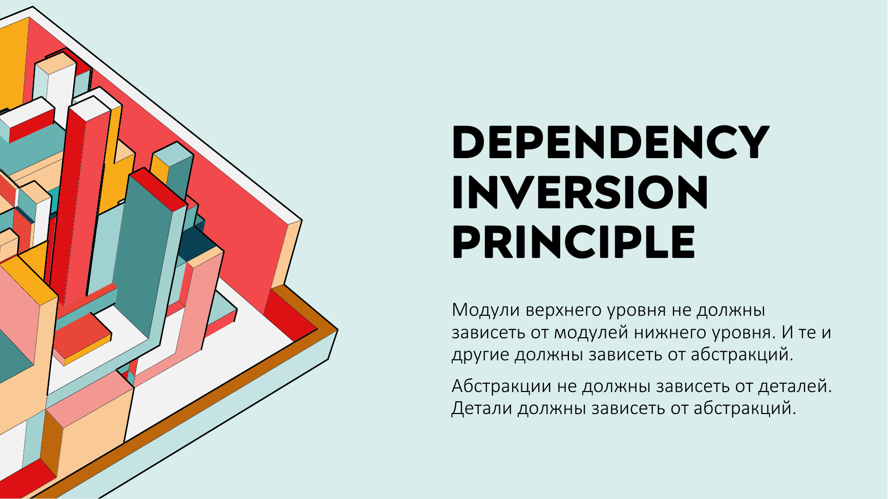

**Слайд 16: РАЗНИЦА МЕЖДУ DIP И DI**

| Понятие | Что задаёт |
|---|---|
| Dependency Inversion Principle | Общий принцип инвертирования зависимости. |
| Dependency Injection | Конкретные способы внедрения зависимости. |

**Слайд 28: ПЛЮСЫ DI-КОНТЕЙНЕРОВ**
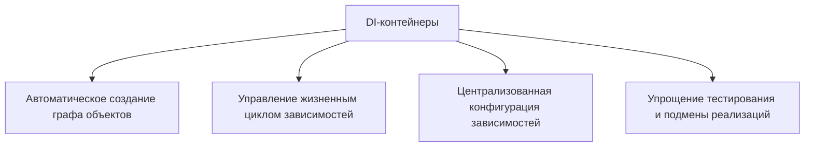

#### Переход к теме тестирования

**Слайд 44: ВИДЫ**
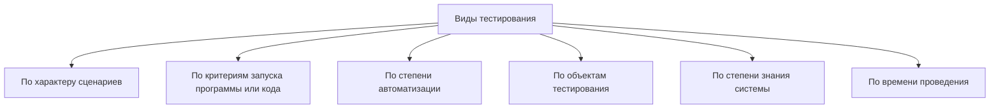

**Слайд 48: ПО ОБЪЕКТАМ ТЕСТИРОВАНИЯ**

| Критерий | Описание |
|---|---|
| По объектам тестирования | Эта группа объединяет виды, которые предполагают определение того, какие части программы или системы подвергаются тестированию. |

**Слайд 49: ПО СТЕПЕНИ ЗНАНИЯ СИСТЕМЫ**

| Критерий | Описание |
|---|---|
| По степени знания системы | Эта группа объединяет виды, которые используются в зависимости от того, насколько тестировщик знаком с тестируемым продуктом. |

#### Классификация и примеры тестирования

**Слайд 50: ПО ВРЕМЕНИ ПРОВЕДЕНИЯ**

| Критерий | Описание |
|---|---|
| По времени проведения тестирования | В эту группу попадают виды тестирования, которое проводят в разные моменты разработки продукта: например, до выкатки на прод и после. |

**Слайд 51: ПРИМЕРЫ ТЕСТИРОВАНИЯ ПО**
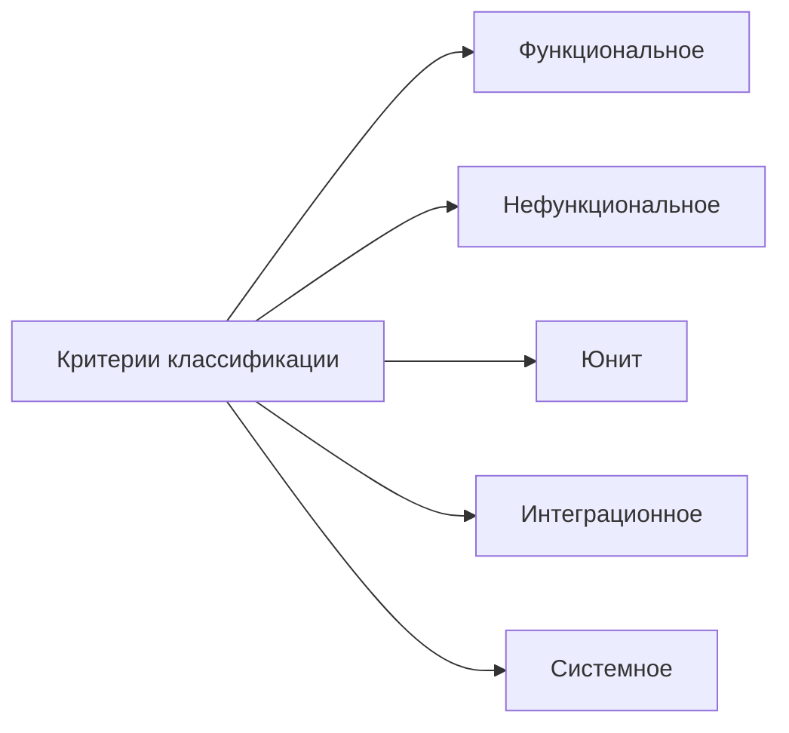

::: warning Текст слайда из PDF
ПРИМЕРЫ ТЕСТИРОВАНИЯ ПО

    Пример функционального тестирования: проверим, корректно ли работает
функция вычисления квадратного корня. Введем число 9, ожидаемый результат — 3.
Если результат соответствует ожидаемому, функция работает корректно.
     Пример нефункционального тестирования: оценим производительность
программы, выполняющей сложные математические расчеты. Замерим время
выполнения задачи и сравним с требуемым значением.
    Пример автоматизированного тестирования: напишем скрипт, который будет
автоматически проверять корректность работы функций программы путем сравнения
ожидаемых результатов с фактическими.
    Пример ручного тестирования: проверим, насколько удобно и понятно
пользователю интерфейс программы, выполнив все основные операции вручную.
    Пример тестирования с использованием группы пользователей: пригласим
группу пользователей для тестирования новой версии сайта и соберем их отзывы и
предложения по улучшению.
:::

Вспоминаем, что такое Dependency Inversal Principle и постепенно перейдем к **Dependency Injection**.

На самом деле, даже авторы созвучны. Один из них это дядюшка Боб, которого по-настоящему-то зовут Роберт Мартин. А второй Мартин Фаулер, который прописал... о инверсии зависимостей вот они вроде бы об одном но как я говорил дядюшка боб он всегда пишет максимально просто для но такой лайтовой аудитории и он описал именно фундаментальную концепцию как надо как надо теоретически не зависеть от реализации до зависит от абстракции как надо, чтобы класс низкоуровневый не зависел от высокоуровневого, а высокоуровневый зависел от абстракции, а не от реализации. Он это сказал и все, а он никогда не говорит, как делать.

Он описал чистая архитектура, описал принципы, а в конце его спрашивают, а можно конкретно, как создать папки, как все это по папкам распихать теперь, все ваши концепции. Но он обычно говорит, это все сложно, обращайтесь ко мне в консалдинговое агентство. Соответственно, он считается родоначальником Dependency in Virtual Principle. Напомню его суть. Помните, мы рассматривали пример с книгами и принтер, который может выводить содержание данной книги. У нас есть заказчик, допустим, библиотека, которая говорит о том, что давайте мы сделаем так, чтобы любая наша книга могла распечататься на черный экран монитора на консоли. Вы понимаете, что, наверное... Не, в этот момент вы еще не понимаете, что люди обычно врут.

И прямо доверчиво реализуете и сам класс книга, и консольный принтер, который выводит данную текст на экран консоли. И, собственно, у вас получается класс высокого уровня книга зависит от реализации, от конкретного класса, не от абстракции, а от класса принтер. Ну, вот, консольный принтер. И когда... Из библиотеки вам звонок в 9 утра, вы подпрыгиваете в надежде, что вас похвалят, вам говорят, слушайте, круто, но давайте еще вот так.

Давайте еще сделаем, чтобы принтер был не только консольный, но и в HTML-формат, и в PDF, и вообще сразу на принтер отправляло в печать. И вы говорите, блин, все придется переписывать. Вспоминаете Роберта Мартина, который говорил о том, что класс высокого уровня не должен зависеть от реализации, вводите абстракцию. Где? А, тут пока еще нет. Здесь по-прежнему вы еще пытаетесь жить в этом бардаке. И вместо того, чтобы сразу убить программу, пытаетесь чего-то с ней сделать. Пишите второй HTML принтер. И в надежде, что теперь-то они успокоятся, теперь будем печатать веб-странички, книгу выводить. Они говорят, да нет, мы хотим, чтобы это прямо на ходу. Галочку ставят, выводится в консоль, галочку, радиобаттон другой выбирает, выводится в HTML.

То есть зависимость должна меняться в момент выполнения программы. Здесь вы понимаете, что ваша зависимость, она такая статична. Вам приходится перекомпилировать, пересобирать класс книга, чтобы поменять у него зависимость. Ну и вот здесь наконец-то вы вспоминаете. Дядюшку Боба, который говорил о том, что вы не должны зависеть от реализации. И вы вводите абстракцию, вот, наверху, которая описывает, ну, общее поведение ваших будущих конкретных классов. Айпринтер, ну, с примитивным методом print. Вот, фантазии-то больше у нас не хватило, да и не надо.

Дальше идет **реализация**. Есть. Консольный принтер, реализующий данную абстракцию, и HTML-принтер, который реализует данную абстракцию. И ваш класс высокого уровня книга теперь не зависит от той или иной реализации, а зависит от абстракции. Все шикарно. Но смотрите, сколько свободы, или сколько не договаривает дядюшка Боб, а как в дальнейшем-то с этим жить? Как внедрять? И мы можем внедрить... Пропихнув через конструктор, мы можем внедрить зависимый объект через свойства, а есть еще, можем через сеттер метода, можем внедрить его, он как бы неофициальный, не во всех языках есть понятие свойства, property, можем через property внедрить зависимый объект. То есть дядюшка Боб, он говорит о том, что в целом нужно инвертировать зависимость, чтобы...

Высокоуровневый класс не зависел от конкретики, а зависел от абстракции. Ну и абстракция, соответственно, не зависела тоже от того, куда она внедряется. Вот, он описал это и все. В свою очередь, DI, **Dependency Injection**, принцип внедрения, это о том, а как? Как мы можем сделать? Через конструктор, через свойства, как надо. И если действительно принцип... Deep от дядюшки Боба – это такая философия, как надо жить, то DI – это прямо какое-то реальное воплощение, какой-нибудь фреймверк. Не знаю, в Java, Symfony у нас DI от Microsoft, там MEV. Их множество. Можете свой написать. Раньше очень часто, когда стали популярны и ок-контейнеры, и DI-контейнеры.

Тестовые задания тогда еще выполняли и на должность архитектора часто задавали, напишите свой контейнер. Так вот, их множество. И вот DI, **Dependency Injection**, это уже больше о каких-то реальных воплощениях этого принципа. Можно себе пока для начала так зафиксировать, чтобы пока между этими двумя понятиями не путаться. Сейчас будем их сравнивать более подробно.

Собственно, давайте перейдем. Вот примитивная задачка. У нас есть класс высокого уровня, и он обладает зависимостью, обладает другим классом. То есть машине нужен двигатель. Ну и мы вспоминаем принцип dependency-inversal принцип, инвертировать зависимость, как бы развернуть зависимость. Дип-принцип, он не только про классы. Когда мы будем разбирать слоистую архитектуру, чистую архитектуру, он про то, что раньше, Все зависимости шли от UI к бизнес-логике, от бизнес-логики к Data Access Layer, то в свою очередь в базу данных. А дядюшка Боб в своей чистой архитектуре, он говорит, надо развернуть зависимость, надо, чтобы все теперь зависели от доменного объекта.

Вот, ну и он в свою очередь уже мог в обратную сторону управлять сервисами, ну и какими-то сторонними. сторонними микросервисами вот то есть мы еще вернемся к инверсии зависимости не только на уровне классов но и на уровне модулей а сейчас мы смотрим вот на эти два класса и думаем что здесь явно не то потому что машина не может быть несколько реализации двигателей но даже в нашем семинарском занятия мы увидим что у нас двигатель 1 2 и в зависимости от покупателя мы будем подставлять ту или иную реализацию. Дизельные, бензиновые, электро. И мы вспоминаем принцип дядюшки Боба и рисуем вот такую диаграмму и говорим, как там, мама, я создал dependency-inversal принцип. И на самом деле и да, и нет.

Вот взглянув на код, мы только сможем понять, действительно ли у нас получилось. инвертировать зависимости от конкретной реализации какой-то двигатель и уйти в зависимости от абстракции вот мы смотрим код давайте его прокомментируем смотрите у нас есть соответственно **реализация** интерфейса вверху этот двигатель который может запуститься все вроде бы соответствует у нас есть сам двигатель конкретная реализация данного интерфейса Есть двигатель, который реализует данный интерфейс. И есть автомобиль. И вот теперь смотрите. Вот вообще, изначально, с зарождения объектно-ориентированного программирования, все боролись с тем, что один класс создавал второй. И было множество вариантов, вплоть до того, что создать какую-нибудь статичную...

Фабрику, которая обладала уже статичными методами и созданными экземплярами класса и могла бы нам отдать. То есть, как только вы видите оператор new в другом классе, это признак того, что вы зависите от какой-то конкретной реализации. И да, у нас вроде бы схема действительно олицетворяет dependency-inversal принцип, но по факту... Мы его не соблюдаем. По факту у нас не такая диаграмма, а вот такая диаграмма. Потому что у нас класс внутри своих методов в конструкторе работает с конкретной реализацией.

Поэтому вы можете сколько угодно создавать интерфейсов, но пока вы не проникнетесь в философии, что вы действительно не должны зависеть от реализации в вашем коде, или ваш высокоуровневый класс должен как бы... вырвать создание зависимости, куда-то вынести вовне, пусть она там создается, а потом вернется в виде какого-то реального объекта. Но высокоуровневому классу должно быть абсолютно без разницы, кто там вернется. Главное, реализатор абстракции.

### Dependency Injection

**Слайд 11: ВОТ И ВСЕ!**

Концепция **Dependency Injection** состоит в том, чтобы перенести ответственность за создание экземпляра объекта за пределы класса и передать уже созданный экземпляр объекта обратно.

::: multi-code "Внедрение через конструктор"
```kotlin
val car = Car(CarEngine())

fun main() {
    println(car)
}
```
```csharp
Car car = new Car(new CarEngine());
```
```java
Car car = new Car(new CarEngine());
```
```go
car := NewCar(NewCarEngine())
```

:::


::: multi-code "Внедрение через setter"
```kotlin
val car = Car()
car.setEngine(CarEngine())

fun main() {
    println(car)
}
```
```csharp
Car car = new Car();
car.SetEngine(new CarEngine());
```
```java
Car car = new Car();
car.setEngine(new CarEngine());
```
```go
car := NewCar()
car.SetEngine(NewCarEngine())
```

:::


::: multi-code "Создание зависимости внутри класса" {playground=off}
```kotlin
class Car {
    private val engine: Engine = CarEngine()
    ...
}
```
```csharp
class Car
{
    private Engine engine = new CarEngine();
    ...
}
```
```java
class Car {
    private Engine engine = new CarEngine();
    ...
}
```
```go
type Car struct {
    engine Engine
}

func NewCar() Car {
    return Car{engine: NewCarEngine()}
}
```

:::


::: multi-code "Класс получает зависимость извне" {playground=off}
```kotlin
class Car(private val engine: Engine) {
    fun start() {
        if (engine.isStart()) {
            println("Start!")
        }
    }
}
```
```csharp
class Car
{
    private Engine engine;

    public Car(Engine engine)
    {
        this.engine = engine;
    }

    public void Start()
    {
        if (engine.IsStart())
        {
            Console.WriteLine("Start!");
        }
    }
}
```
```java
class Car {
    private Engine engine;

    public Car(Engine engine) {
        this.engine = engine;
    }

    public void start() {
        if (engine.isStart()) {
            System.out.println("Start!");
        }
    }
}
```
```go
type Car struct {
    engine Engine
}

func NewCar(engine Engine) Car {
    return Car{engine: engine}
}

func (c Car) Start() {
    if c.engine.IsStart() {
        fmt.Println("Start!")
    }
}
```

:::


**Слайд 12: DEPENDENCY INJECTION**
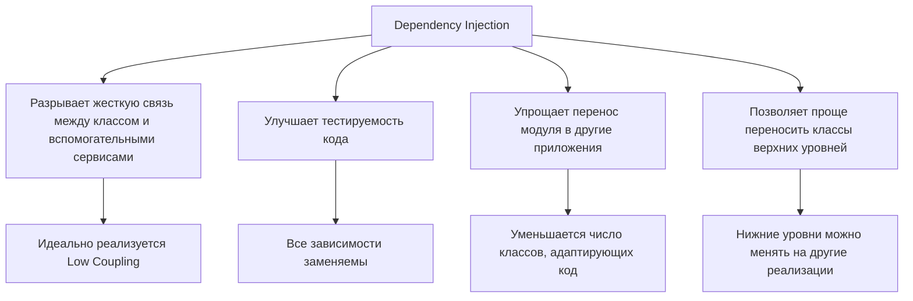

И вот DI, внедрение зависимости, она больше про то, что мы действительно... Точнее, гип-принцип. Он про то, что мы должны вырвать создание объекта из высокоуровневого класса, где-то там его создать и получить обратно созданный экземпляр нашей абстракции. А DI – это про то, как вот это все будет делаться, где оно там будет создаваться, как оно будет потом нам внедряться. И вот эти вот DI, они есть DI-контейнеры, сервис-локаторы, которые уже запрещено с 2010 года произносить вслух, но мы про них поговорим. Потому что сервис-локатор, если вы используете его более-менее правильно, то это не совсем антипаттерн. А можно и DI, который мы сейчас будем разбирать, использовать как сервис-локатор.

Поэтому вот это внедрение зависимости – это о том, как надо сделать. Да, современные фреймверки, скорее всего, не дадут вам сделать неправильно. Сейчас мы тоже увидим, любой **DI-контейнер** внутри себя содержит сервис-локатор, который сейчас запрещен к использованию. Но слишком вперед убежал.

Давайте посмотрим, а как тогда не допустить вот этой вот зловещей связи, когда высокоуровневый класс знает о реализации. Что такое внедрение зависимости? Это, по сути, как я и сказал, каким-то образом... Вне класса высокоуровневого объект должен создастся и внедриться обратно туда. Если мы теперь посмотрим на код, то мы видим, что у нас автомобиль зависит от абстракции.

### Внедрение через конструктор

#### Базовый пример внедрения зависимости

**Слайд 7: НАЗАД К ОСНОВАМ:**
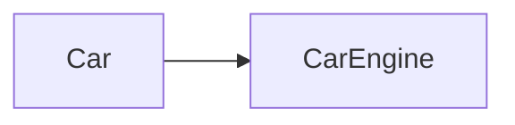

**Слайд 8: НАЗАД К ОСНОВАМ:**
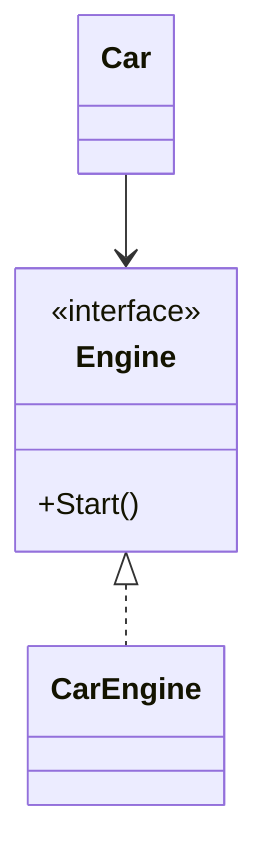

**Слайд 9: НАЗАД К ОСНОВАМ:**


#### Создание зависимости и способы внедрения

**Слайд 10: НАЗАД К ОСНОВАМ:**
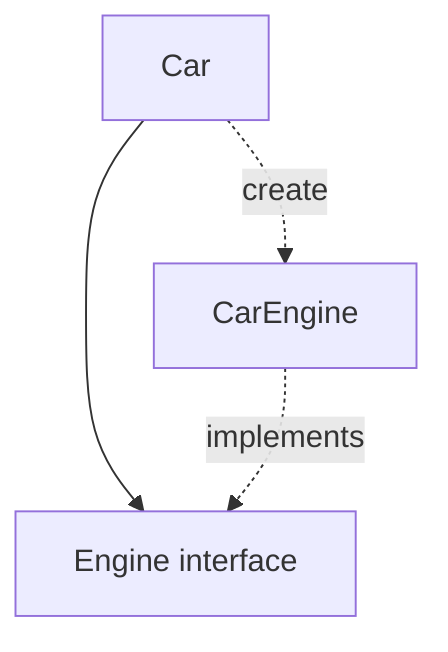

**Слайд 13: ВНЕДРЕНИЕ ЧЕРЕЗ**
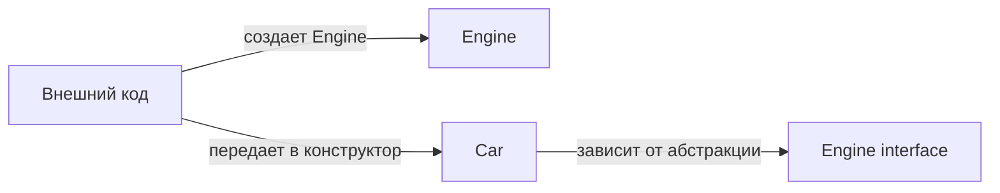

**Слайд 14: ВНЕДРЕНИЕ ЧЕРЕЗ**
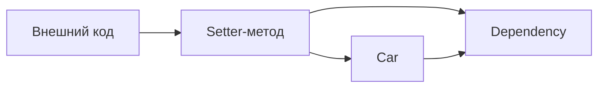

И через конструктор, это один из четырех способов внедрения зависимостей, внедряется зависимый объект. То есть у нас нет инстанцирования вот этого зависимого объекта, сервиса. Внутри большого класса автомобиль у нас не создается двигатель. Мы получаем двигатель. Тогда возникает вопрос, а кто его создает и кто внедряет? И вот за это отвечает DI. **DI-контейнер**, если мы скачиваем какой-то готовый фреймворк в виде уже готовой реализации принципа **dependency injection**. То есть DI – это принцип, а DI-контейнер – это **реализация** данного принципа. Но любой DI принцип проповедует философию dependency-inversal принцип.

Видите, вроде бы все об одном, просто кто-то из них, **DI-контейнер** – это **реализация** DI, а DI – это более конкретная трактовка вот этого философского подхода дядюшки Боба. Вот, и что мы здесь видим?

Значит, написанный действительно правильный класс согласно dependency-inversal принципу. И мы видим... Один из вариантов создания на более внешнем коде, то есть не внутри класса Car, а вне его, ну прям в конструкторе создается двигатель. Но вопрос, он мог создаваться прям в конструкторе, мог взяться откуда-то, из какого-то места, из какого-то места, которое знает... какому интерфейсу какую реализацию подставлять. Вот, и это уже как раз будет такой шаг к автоматизированному внедрению зависимости через DI-контейнеры.

Давайте, значит, подытожим показ **Dependency Injection**. Их основная задача данного принципа – разорвать связь между объектами. То есть соблюдать принцип GRASP. а именно **low coupling**. То есть сцепленность между классами должна быть минимальная. Ну и действительно, сцепленность между классом car и двигателем, она минимальная у нас через интерфейс. Не вот таким образом.

Таким образом мы как бы на бумаге действительно реализовали интерфейс. наш класс зависит от интерфейса но потом в коде появляется такое что создается автомобиль здесь он действительно работает этот принцип и автомобиль подсовывается через конструктор значит таким образом **dependency injection** в первую очередь реализует идеологию **low coupling** что классы между собой практически не сцеплены они связаны через интерфейс Сегодня, может быть, дойдем или нет, но в любом случае на следующей лекции будем говорить про **тестирование**. Когда нам необходимо будет одни классы мокать, заменять фейковыми объектами. И вот DI injection это, можно сказать, основной или единственный путь для того, чтобы...

Наше приложение можно было протестировать с помощью юнит-тестов, и именно заменяя какие-то реальные объекты фейковыми объектами, ну, mock-объектами. Ну, и бывает, конечно, редко, когда вы переносите один модуль, ну, все об этом говорят, что OOP, SSD нам дает возможность повторно использовать код, ну, редко, конечно, все равно он используется, но, тем не менее, DI injection — это... скорее позволит вам повторно переиспользовать модули в другом вашем приложении. Потому что в целом вы тащите высокоуровневый модуль, который зависит от каких-то реализаций. Но вам ничего не стоит под другой проект написать другие реализации. Поэтому действительно, DI позволяет нам это реализовать. Ну и переносить классы в другие проекты.

Но мы говорили о том, что, вспоминайте этот пример, когда мы принтер внедряли и через конструктор, и через свойства. Поэтому у DI есть тоже несколько вариантов внедрения. Если так грубо говорить, то официально три. Четвертый он такой, не во всех языках присутствует. А если еще более откровенно, то один. Способ внедрения зависимости считается максимально удачным. И большинство DI-контейнеров реализуют несколько вариантов. Но на практике используется внедрение зависимости через конструктор. Почему? Ну, во-первых, здесь нет никаких подводных камней. Вы смотрите на класс. пытаетесь его инициализировать, и вы сразу понимаете, какие зависимости вам нужно подставить, чтобы этот класс нормально работал.

И один из авторов, не помню кто, но тоже из архитекторов знаменитых, он сказал, что если ваш класс действительно очень сложный, то чего ж тут стыдиться?

### Setter-методы

Не надо... позволять внедрять зависимости скрытым образом, через интерфейсы, через методы, через сеттеры ваших property. Покажите явно через конструктор, что для нормальной, адекватной работы данного класса вам потребуются такие следующие зависимости. И вот конструктор позволяет это сделать. Более того, конструктор... не позволит вам не внедрить какие-то зависимости. Это, с одной стороны, и плюс, и минус.

- Плюс, ну, вы как бы точно уверены, что ваш класс высокого уровня не скомпилируется, если вы не передадите, ну, или тот, кто использует ваш класс, не передаст туда все зависимости.

Но это и минус, потому что в рантайме вы не сможете подменить одну реализацию на другую, как это было в принтере. Нас подсунули в конструктор консольный принтер, потом на следующей строчке команды заменили консольный принтер на другую реализацию HTML. Получается, это его и такой скрытый минус. Видите, тут как инь-янь. С одной стороны плюс, с другой стороны минус. Все зависимости обязательны. Наш, получается, класс уверен в том, что мы получим все эти зависимости. Но это и минус, потому что подменить в рантайме уже нельзя. В прошлой лекции был вопрос, сколько нормально, а сколько ненормально иметь зависимости. Опять мы к этому и подходим.

Ответа так и нет, но действительно **реализация** может быть сложной, если вашему классу требуется пару десятков зависимостей. Это уже тоже, наверное, не норма. Второй вариант – это внедрение зависимости через Сеттер-метод. То есть вы прописываете метод, который позволяет вам в любой момент, публичный метод позволяет вам в любой момент получить зависимости. При этом на самом деле почему-то принято считать, что DI это про ООП. Но если посмотреть на обычную функцию, которая принимает два инта и складывает, что она делает? Она принимает зависимости, она принимает два аргумента. И это ее зависимости, с которыми она работает. И получается, что функция тоже идеология **dependency injection**. Мы внедряем зависимости через метод.

Поэтому не обязательно DI это про ООП. Плюсы внедрения через CETR у нас есть возможность внедрять или не внедрять. Но, как я говорил, этот метод не то чтобы не рекомендован, но он менее популярен. Потому что если у вас зависимости не обязательны, Значит, кто-то когда-то по неосторожности их явно не внедрит. Но тогда вы должны позаботиться о том, чтобы ваш код проверял на now любую зависимость. Если вы понимаете, что она попадает не через конструктор, следовательно, ее могли забыть или каким-то образом не предусмотреть, не передать. Или метод, который использует зависимость, почему-то отработал раньше, чем метр-сеттер, который эту зависимость назначит.

В общем, действительно способ рабочий, и большинство DI-контейнеров позволяют вам реализовать практически все вариации. Но, тем не менее, по умолчанию чаще всего используют конструктор. Есть еще третий и даже четвертый вариант внедрения зависимостей. Это через интерфейс и через свойства. Но через свойства это... Уже не в книгах прописано, а просто на просторах интернета, где-нибудь на Stack Overflow. Потому что он не во всех языках есть свойства. Но давайте начнем через внедрение зависимости, через интерфейсы. В принципе, идея хорошая. И она была достаточно, наверное, популярна, потому что в 2009 году мы действительно внедряли зависимости через интерфейсы. Минусы были... таковы, что у вас должен быть исключительно один класс, реализующий интерфейс.

Иначе **DI-контейнер** скажет, собственно, вот в этот интерфейс что подставлять. У вас два класса, которые имплементируют данный интерфейс. Какую именно реализацию подставлять сюда? Ну, приходится за этим следить. Да, вот зависимость должна быть один к одному на одну. На один интерфейс одна **реализация**. В общем, мороки здесь больше, чем, наверное, преимуществ. И опять же, достаточно скрытое, получается, внедрение зависимостей. Вы можете смотреть класс, не видеть конструктор. Или, представьте, вообще не можете смотреть класс. Он скомпилирован, у вас есть только его описание. Ну, или вы можете посмотреть, ну, такое API. что в конструктор нужно передать. Ничего. У вас может создаться иллюзия, что опа, класснее, от чего не зависит.

А на самом деле он тянет в себя скрыто множество зависимостей через **DI-контейнер**. А когда вы видите конструктор со всеми прописанными зависимостями, вы можете примерно масштаб бедствия понять. что капец этот класс, лучше не трогать. В нём там 20 зависимых объектов прилетает, ну и каким-то образом переписывая его, там эффект бабочки получится такой, что придётся потом всю программу переписывать. А здесь, когда зависимость прилетает через интерфейс, можно не заметить. Достаточно опасно. Вот ещё хуже внедрение зависимости через свойства. Здесь совсем. Если он чем-то может быть напоминает, Внедрение зависимостей через setter-метод, но в setter-методе вы можете написать бизнес-логику, какую-то логику.

А внедрение через property объекта, через его setter, не подразумевает написание логики. Следовательно, когда-то вам может понадобиться бизнес-логика, вы ее не напишете в setter, будете переписывать на setter-методы. я сделал пометку не рекомендованы к использованию но и вообще официально он как бы нигде этот метод не прописан просто нет в некоторых проектах иногда встречается попробуем финализировать значит разницу между тем что говорил роберт мартин и мартин фаулер роберт мартин который говорил о том что Класс высокого уровня не должен зависеть от реализации, а должен зависеть от абстракции. Абстракция, в свою очередь, не должна зависеть от высокого уровня. Ну, все должны зависеть от интерфейсов, в общем.

И получается, что это общий принцип, как бы, развернуть зависимость в обратную сторону. А **Dependency Injection** это то, каким образом все-таки... Высокоуровневый класс будет обратно получать свою зависимость через конструктор, свойства, интерфейс или метод. А вот это что? С одной стороны, это то, что нужно забыть раз и навсегда. С другой стороны, без понимания прошлого сложно двигаться дальше.

### Service Locator

#### Service Locator: идея и проблема

**Слайд 18: SERVICE LOCATOR**
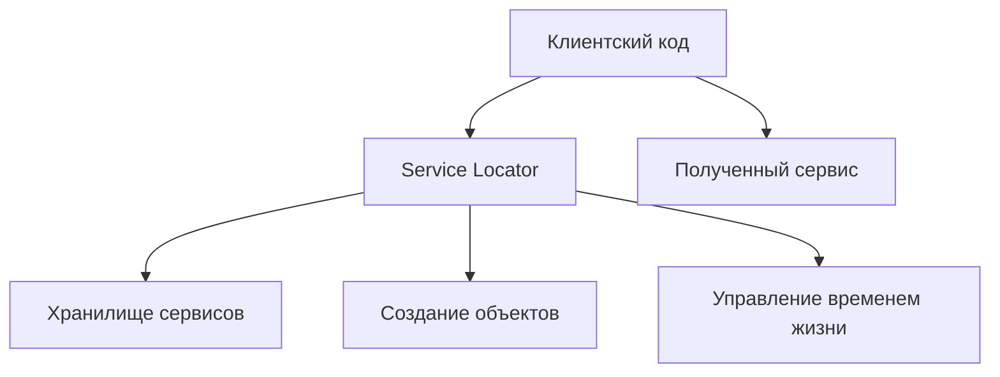

**Слайд 19: ЧЕМ ЖЕ ПЛОХ**


**Слайд 21: SERVICE LOCATOR –**
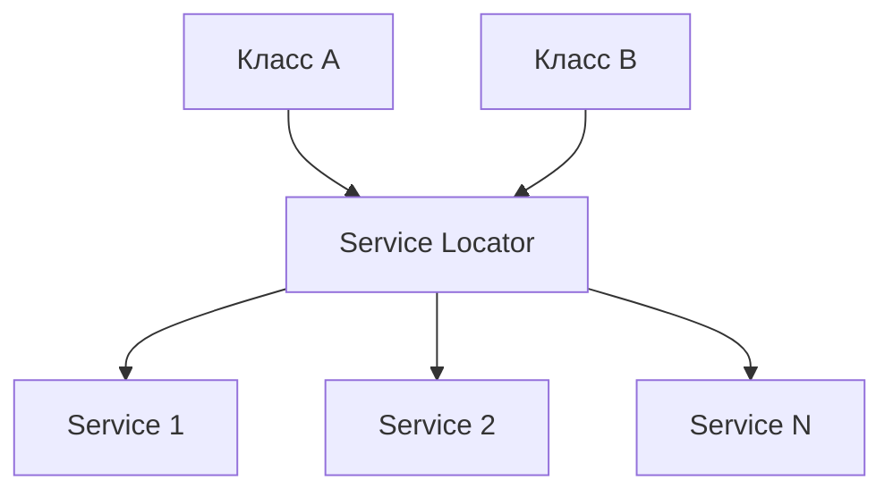

::: warning Текст слайда из PDF
**SERVICE LOCATOR** –
АНТИПАТТЕРН?

К 2010 году популярность паттерна упала к минимуму, появились более
продвинутые практики. **Service Locator** стал считаться антипаттерном, рекомендуем
не использовать его в своих приложениях. К такому решению подталкивает то, что
он является аналогом глобального объекта, к которому обращаются из всех частей
приложения.
:::

#### Service Locator, DI и DI-контейнер

**Слайд 23: РАЗЛИЧИЯ МЕЖДУ**

| Подход | Как работает с зависимостями |
|---|---|
| Service Locator | Конечные классы зависят от локатора. |
| Service Locator | Конечные классы знают о существовании Service Locator и зависят от него. |
| Dependency Injection | Зависимость внедряется на верхних уровнях. |
| Dependency Injection | Зависимость внедряется на верхних уровнях или в отдельной абстракции, а конечные классы ничего не знают о DI. |

Вот это сервис-локатор.

Давайте попробуем разобраться, чем же он так плох. Действительно ли он плох?

### DI-контейнер

**Слайд 26: DI-КОНТЕЙНЕР**
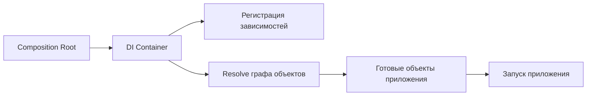

И на самом деле, действительно ли он считается, что в 2010 году, когда пошел бум на программирование через DI-контейнеры, все как бы сказали, фу-фу-фу, сервис-локатор никогда. Но на самом деле, я повторяюсь, в DI-контейнере лежит сервис-локатор. Просто **DI-контейнер**, он его закрывает от вас, и вы не сможете им пользоваться. Ну, нормальным легальным способом. Мы, конечно, разберем. С помощью одной и той же библиотеки мы воспользуемся DI-контейнером как сервис-локатором, в то же время сервис-локатором мы воспользуемся как DI-контейнером. Дело в том, что, смотрите, вот так, любой DI-контейнер можно использовать как DI-контейнер, но достаточно сложно его использовать как сервис-локатор. Поэтому DI-контейнер, он безопасен.

Но, тем не менее, вы можете в каком-то... в безумном состоянии и DI-контейнером воспользоваться как сервис-локатором. Поэтому тут не то, что золотая пуля, что используйте **DI-контейнер** и все будет хорошо. Вопрос, как правильно пользоваться. И можно и сервис-локатором правильно воспользоваться, и он будет работать как DI-контейнер. Поэтому давайте разберем, что такое сервис-локатор, что это за паттерн. Потому что в любом DI-контейнере он существует. Что мы видим? Это их множество реализаций, самая примитивная **реализация**. Сервис-локатор. Он каким-то образом, возможно, это статичный класс со статичными методами, где каждый метод создает соответствующий экземпляр какого-то класса. Он может быть синглтоновский.

Это объект, который доступен отовсюду, и это его минус. Представляете, вы пишете малосвязное приложение, у вас все ваши модули зависят через интерфейсы, появляется сервис-локатор, который доступен из любой точки, он знает обо всех, программисты в вашей команде начинают отовсюду к нему обращаться, и то, что вы проектировали там год, это может все разрушиться сервис-локатором. все ваши малосвязанные классы начинают дергать статичный класс, по сути глобальная переменная, из всех вот этих малосвязанных мест. И таким образом они связываются. Потому что так как теперь сервис-локатор знает обо всех, а все о нем знают, изменение одного класса приведет к изменению всего проекта. Это и есть основной минус сервис-локатора.

Это то узкое место, которое позволяет им воспользоваться неправильно. То есть люди начинают сервис-локатор использовать как такой ящик, который знает все обо всем и решит любую проблему. Вам просто нужно взять из одного класса, через конструктор передать в другой класс, и другому классу станет легче. А то, что другой класс передаст это в третий, а третий в четвертый, вы-то этого не понимаете на этапе проектирования. Как там программисты начнут пользоваться сервис-локатором. И вот это его как бы минус. То, что он статичный, и то, что он дает возможность из любого места к себе обратиться.

Если бы все программисты были аккуратнее и продолжали работать с сервис-локатором в root-композиции, то есть в той точке запуска приложения, где нужно реализовать все зависимости.

Давайте сейчас на коде посмотрим. Тогда бы было все нормально. Вот **DI-контейнер** вам просто не даст. И DI-контейнером вы можете написать фигню, вы можете его создать и также в конструктор куда-то кидать. Тогда он ничем не будет отличаться от сервис-локатора. Просто DI-контейнер принято использовать в точке запуска приложений. Допустим, если вебовое приложение, то перед тем, как запустить веб, вы резолвите все зависимости. Или вообще неважно, любой проект вы сначала резолвите зависимости, чтобы все объекты получили, а потом вы начинаете запускать приложение.

Давайте посмотрим. Вот здесь как бы ничего страшного нет. Класс, а? использует сервис-локатор. Почему? Потому что он статичный, потому что класс А может это сделать. Вот, сервис-локатор знает о всех зависимостях, о всех сервисах, которые нужны классу А. Прекрасно! Ну, действительно прекрасно. У нас класс А как бы формально не зависит от сервис-1 и сервис-2. Все эти знания прописаны в сервис-локаторе. Класс А лишь зависит от сервис-локатора. Но по идее мы можем написать другие реализации, подставить их в сервис-локатор, и класс А будет зависеть уже от других сервисов. Все шикарно. Только проблема в том, что им стали слишком злоупотреблять.

Значит, что он нам позволяет? В принципе, он позволяет реализовать инъекцию зависимостей. Он выносит... Ну, смотрите, помните Dependency Inversal Principle? Не создавай класс внутри высокоуровневого, где-то его создай, верни нам реализацию. Вот сервис-локатор это делает. Он, получается, все объекты создает в отдельном слое у себя. Ну, реализации сервис-локатора много. Допустим, это статичная фабрика, она нам просто дает объекты. Но сервис-локатор это паттерн, это не **реализация** какого-то конкретного... Это просто идея, шаблон. То есть он действительно нам позволяет абстрагировать создание объекта зависимости в одном каком-то месте.

То есть мы не создаем двигатель внутри автомобиля, мы говорим сервис-локатор, дай нам реализацию интерфейса, дай нам реализацию двигателя. И он нам ее отдает. То есть основная задача сервис-локатора это обеспечить... хранения этих объектов. Еще и правила жизни или время жизни этих объектов. Должен ли двигатель быть один и просто отдавать его то одной машине, то второй? Или все-таки каждый раз, когда мы будем обращаться к сервис-локатору, сервис-локатор будет давать нам новый инстанс? То есть на тебе двигатель, на тебе другой двигатель, сейчас создам третий, на тебе третий. Это делает и **DI-контейнер**, потому что DI-контейнер внутри содержит сервис-локатор.

Как я и говорил, сервис-локатор это не какой-то конкретный класс, это просто идея внедрения зависимостей в наши высокоуровневые классы. Ну и благодаря этому у нас действительно, благодаря сервис-локатору обеспечивается **low coupling**. У нас класс А не знает о своих реализациях, сервис 1 и сервис 2. Он знает лишь о сервис-локаторе, который... Себе собрал все коллекции сервисов. И класс А может сказать, сервис-локатор, верни мне сервис 1. Или дай мне зависимость в виде сервис 2. Чем тогда он плох? Плох он тем, что слишком скрытый способ внедрения зависимостей. Вот смотрите. Пример. Некая архитектура, реализующая паттерн **MVVM**. То есть она содержит логику по правке сотрудников.

Данная логика, бизнес-логика. содержит сервис-локатор, который внедряется через конструктор. Но в целом, тут хотя бы даже он внедряется через конструктор, но в целом сервис-локатор это чаще какой-нибудь статичный класс, и мы бы могли даже не внедрять его, просто обращаться. Но здесь все-таки он реализован в виде класса, который внедряется через конструктор. То есть на этом этапе все прекрасно. Мы как бы... Смотрим на некую бизнес-логику и понимаем, что она тащит в себе сервис-локатор, который знает обо всем. Мы понимаем всю серьезность данного класса и работаем с ним максимально аккуратно. Но смотрите, где-то в коде наш Edit Employee View модель обращается к Dialog Edit View модель, которая тоже цепляет сервис-локатор.

И в свою очередь... требует реализацию репозитория, который в свою очередь тоже возможно будет цеплять сервис-локатор. И глядя на такой код, который потерял точку внедрения всех зависимостей, получается теперь каждый класс как захочет, так и внедряет. Или в том месте, где захочет, в том и внедряет. И вы не сможете это проследить. Вот в этом его минус. То есть если **DI-контейнер**, вы как бы врут в самом главном старте приложения, в высоком уровне, создаете классы и говорите «реализуй за резолви все зависимости», то при сервис-локаторе код превращается в такую ерунду, что вы размазываете точку внедрения всех зависимостей по всему вашему коду. И это отслеживается, ну и с каждым днем это все хуже, хуже и хуже.

То есть у вас появляется возможность этот сервис-локатор передавать из одного класса в конструктор другого. Вот здесь в EditViewModel будет создаваться DialogEditViewModel, и туда вы прокинете сервис-локатор, который получили сами. А он еще и может быть статичным, вы даже не прокинете. И вы, получается, глядя на код, сразу и не поймете, где у вас внедряются зависимости. в какие классы. И, следовательно, поддерживать такой проект достаточно тяжело. Но сейчас я покажу нормальный код, который использует сервис Locator адекватно. То есть, с одной стороны, я говорю, что в 2010 году он стал терять популярность.

Его стали называть антипаттерном и как бы не рекомендовано к использованию, потому что он слишком... развязывает руки по инициализации объектов, мы из любого места можем получить любую зависимость. И, следовательно, теряется фокус, кто от кого зависит.

Значит, все-таки плюсы у него есть, потому что сервис-локатор – это тот же **DI-контейнер**. Плюсы – это он нам дал возможность производить инстанцирование классов вне высокоуровневого класса. То есть то, что дядюшка Боб и говорил. Типа не создавайте внутри высокого уровня класса зависимость, пусть она где-то будет создана и нам возвращена как уже созданный объект. То есть сервис-локатор это нам позволяет сделать. Но из минусов получается, мы вместо зависимости от автомобиля у нас начинает зависеть не от двигателя, а автомобиль теперь начинает зависеть от сервиса-локатора. То есть мы как бы на самом деле просто... Все классы теперь зависят от одного класса.

Но так как этот сервис-локатор знает о всех других классах, то получается, что мы можем добиться эффекта, что все классы нашего приложения друг от друга знают. И вот мы вроде бы разделяли их на какие-то модули, делали low-coupling между модулями, а потом появился сервис-локатор.

Один класс от него зависит. сервис локатор зависит от всех классов и получается что у нас все друг от друга зависят но собственно вот тут попытался я подытожить чем же они отличаются диай контейнер от сервис локатора случае сервис локатора который по сути владеет этим графом зависимости все наши конечные классы чтобы получить зависимость должны зависеть от сервис локатора но к нему обращаться либо его получать через конструктор либо если он статичный то к нему обращаться в диай это смотрите всего лишь навсего как бы правильное использование сервис локатора в диай при использовании диай контейнера Вот вспомните, как мы создавали двигатель у автомобиля. Мы где-то создали двигатель, где-то на верхнем уровне, а потом в машину передали двигатель.

А при сервис-локаторе было бы как? Машина получает сервис-локатор и внутри у себя в коде, где-то там в конструкторе, говорит сервис-локатор, дай-ка мне двигатель. То есть, видите, разница где сервис-локатор. Там, где мы поймаем сервис-локатор и заберем у него нужный нам сервис. А DI четко говорит, нет, не имеете ли вы права в машине... Нет, вы, конечно, можете, если вы совсем никаких границ не видите, вы можете передать в машину **DI-контейнер** и сказать, DI-контейнер, давай мне двигатель. Но все фреймверки будут этому противиться. Они будут вас наталкивать на то, чтобы вы в высоком уровне, где-то на старте приложения, резоловили все свои зависимости. То есть физически это об одном и том же, но вот здесь можно воспользоваться как попало.

Здесь четко говорится, что зависимость должна быть внедрена на верхнем уровне. В сервис-локаторе все классы знают о сервис-локаторе. Это плохо. При DI... Все зависимости внедряются вот в этой рутовой точке. И, следовательно, конечные классы не знают о том, что DI существует. Мы эти конечные классы на самом верхнем уровне создали через **DI-контейнер**. Взяли объект, окунули его в этот контейнер, он все зависимости впитал, получили этот объект. Этот объект ничего не знает о DI. Он как бы создался, и всё. А в сервис-локатор как работает? Мы говорим, объект, на тебе сервис-локатор, что хочешь, то и вытаскивай. Что он там повытаскивает, мы не знаем. От нас это как бы начинает скрыто.

То есть, когда мы окунаем объект в **DI-контейнер**, мы четко понимаем, что он впитает, ну, мы сами настраиваем DI-контейнеры, мы понимаем, какие реализации каких интерфейсов через конструктор DI-контейнер ему внедрит. То есть это нами контролируется. При запуске приложения мы создаем этот класс на самом верхнем уровне. Класс со всеми внедренными зависимостями. Но еще раз, да? Взяли объект, кинули его в контейнер, он как губка впитал все зависимости, которые мы контролируем. Объект с зависимостями, о которых мы знаем. Сервис-локатор, мы взяли объект. кинули ему сервис-локатор, или этот объект ещё и сам может обратиться к сервис-локатору, что он там будет выдёргивать из сервис-локатора, мы не контролируем. И вот в этом его антипаттерность.

Но физически это всё-таки об одном и том же, это о внедрении зависимостей. Так как **DI-контейнер**, если посмотреть реализацию, допустим, даже... На практике, вот мы будем майкрософтовский какой-нибудь смотреть, ну то, что в .NET зашито. Посмотрев его реализацию, мы там увидим классы, поля, которые называются сервис-локатор. Это лишь, ну если посмотреть реализацию, то реально мы увидим, что DI-контейнер от Microsoft в .NET, он реализует внутри себя сервис-локатор. Просто нам DI-контейнер... не позволит явным образом воспользоваться этим сервис-локатором. Но, тем не менее, мы напишем на семинаре код, который будет использовать DI-контейнер как сервис-локатор.

То есть мы будем брать **DI-контейнер** и кидать его в объект, чтобы объект вытянул все зависимости нужные. То есть это неправильное использование DI-контейнера. Вот, смотрите. Что здесь плохого? У нас есть... Класс, описывающий процесс, видимо, заказа или чего-то такого. Он реализует интерфейс. И вот смотрите, локатор, который статичный класс, мы имеем право к нему обратиться и просим зарезолвить зависимости, реализующие вот этот интерфейс. И, собственно, получить данный объект. То есть мы вытаскиваем из локатора некий сервис, валидатор. То есть из локатора тянем зависимость для нашего класса. Все прекрасно? Нет.

Вы этого видеть вообще, возможно, вы этого не увидите, потому что у вас будет скомпилированный код, и то, что он тянет какую-то зависимость, вы этого не узнаете. И вот это кошмар. Или даже если есть код... Ну, вы по диагонали его читаете невнимательно, вы этого можете не увидеть, что у вас резолвится зависимость внутри какого-то жалкого метода. Но могу ли я воспользоваться сервис-локатором по-человечески? Вот если немножко ума приложить, без проблем. И он не антипаттерном сразу становится. И в принципе иногда, если только вот слово локатор его выдаст... то это будет признаком того, что это действительно какой-то сервис-локатор, а не **DI-контейнер**. Вот на следующем слайде я тем же самым сервис-локатором пользуюсь правильно.

Как правильно воспользоваться? Что нам говорит Dependency In Virtual Principle? Не надо здесь ничего создавать. Где-то там создавайте, а возвращайте реальный объект. И теперь смотрите, я тот же сервис-локатор. использую но класс процесс ордер процесс у меня остался правильный то есть смотрите он требует зависимости но эти зависимости внедряются ему через конструктор а реализуются эти зависимости где-то на уровне выше то есть я получается использую сервис locator но согласно принципу дядюшки Боба, который говорит о том, что создавай объект не внутри большого контейнера, а вовне этого контейнера, и возвращай в этот контейнер уже созданную зависимость. Здесь уже сервис-локатор не антипаттерн.

То есть я по-прежнему, так же он у меня статичный, я говорю, зарезовывай у меня зависимость, вытащи вот эту зависимость для этого интерфейса. И вот эта зависимость для этого интерфейса. Две зависимости из локатора вытащил. И создаю процесс, и внедряю эти зависимости. Но видите, теперь у меня зависимости создаются не здесь. Соответственно, вот этот класс, он стал действительно более low-coupling. То есть он разорвал связь с какими-то конкретными реализациями.

Теперь мы можем подсунуть абсолютно... любые ему зависимости, переписав здесь. И этот класс у нас, получается, соблюдает принцип открытости-закрытости. Нам не надо его переписывать, если мы захотим внедрять другие зависимости. Вот. То есть, ну, уже более человеческий код.

Давайте теперь попробуем навести порядок в терминологии между DI, **DI-контейнер** и... Что у нас? И OK. Ну, на самом деле, IOC-контейнер и DI-контейнер – это одно и то же. Вот. Ну и уже в сотый раз инверсия контроля – это DIP. Это то, что дядюшка Боб. Это всего лишь навсего общий принцип, который говорит о том, что высокоуровневый класс не должен зависеть от реализации, а должен зависеть от абстракции. А DI-контейнер – это реально какая-то библиотека, которая реализует этот принцип, эту концепцию. Внедрение зависимостей. Тут я еще раз хочу напомнить, что на самом деле в реализации любого DI-контейнера лежит сервис-локатор. Просто так как он нам недоступен напрямую, у нас нет возможности к нему обратиться откуда угодно. Нет возможности его передавать.

И поэтому **DI-контейнер** немножко имеет больше плюсов. А именно, ну здесь опять, что он соблюдает принцип low-coupling. У нас действительно получается такое универсальное средство сборки проекта. И мы можем вытащить одни модули и без проблем, без труда переложить их в другой проект. А в другом проекте просто будут внедряться другие реализации этих зависимостей. Не позволяя пользоваться им неправильно, он нам гораздо больше дает возможности писать приложения менее сцепленные. которые менее сцеплены друг с другом, модули которого менее сцеплены друг с другом.

И так как классы не знают, что они работают с DI-контейнером, в отличие от того, когда классы работают с сервис-локатором, потому что, да, еще раз, при сервис-локаторе наши классы говорят, сервис-локатор, дай нам зависимость. То есть наш класс знает о сервис-локаторе. При DI нет. Мы говорим, класс, ныряй в **DI-контейнер**, выплывая оттуда со всеми уже внедренными зависимостями. Да, мы можем сервис-локатор, как я показал, использовать более правильно. Но это и есть практически **реализация** DI-контейнера. Просто DI-контейнер – это фреймверк, который вот так вам и говорит, надо работать с сервис-локатором. Поэтому он как бы не умер, сервис-локатор, он просто, можно сказать, реинкарнировался в виде DI-контейнера. И практически в завершение.

Хочется сказать, что **DI-контейнер** это не только **реализация** зависимостей. Любой DI-контейнер делает еще и вторую вещь. Он контролирует время жизни внедряемого объекта. Есть три вариации внедряемых объектов. На семинаре мы разберем все три. Небольшой пример, который... Код, смотрите, я вам его продиктую. У нас есть некий класс, который генерирует случайное число. Вот внизу, давайте его посмотрим. Вот RandomCounter генерирует случайное число и реализует интерфейс iCounter, что позволяет нам внедрять этот RandomCounter как зависимость через интерфейс. У нас есть вверху, ну здесь реализация на дутнете, может быть непонятно, но давайте общую идею.

Мы создаем вот эту вот коллекцию зависимостей, то есть по сути мы наполняем сервис-локатор, кто от кого зависит. Вот, создали.

Дальше, собственно, мы ему приказываем построить зависимости у себя внутри контейнера.

Дальше мы оттуда будем вытаскивать. Дай нам сервис, который реализует iCounter, дай нам сервис. То есть вот процесс, где мы тащим из контейнера реализацию iCounter.

### Жизненный цикл зависимостей

Но так как мы добавляли эти зависимости в виде AdTransient, она каждый раз будет отдавать нам новый... инстанс нашей реализации интерфейса. И вот поэтому мы видим, что счетчик такой, такой, такой, такой. Каждый раз случайное число. Но если бы мы вот здесь добавляли наши зависимости в контейнер как **singleton**, вот здесь я подправил, то есть я добавляю их по правилу singleton, то время, получается, жизни объекта, ну, он один для всех. Контейнер будет вживлять. одну и ту же ссылку в любой объект, в который мы попросим его вживить. Вот, допустим, мы кидаем, ага, вижу, мы кидаем какой-нибудь класс, вот, говорим, контейнер, дай нам вот эту зависимость интерфейса. Он смотрит, ага, я еще ни разу не создавал.

Сейчас я создам instance этого объекта, реализующего этот интерфейс, и отдам вам. А вот когда ты второй раз меня попросишь, я посмотрю, у меня уже в контейнере лежит инстанс. Я отдам тебе ссылку, ранее созданную. И поэтому мы на экране видим одно и то же. Потому что каждый раз, внедряя объект, у нас внедряется первый раз созданный объект.

### Юнит-тестирование

**Слайд 35: 1. Тестирование ПО**
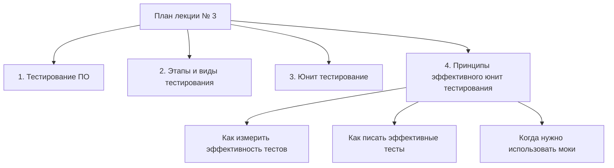

Тогда мы действительно не будем уже 5 минут тратить на юнит-**тестирование**. Это будет отдельная лекция. На нашем первом семинаре, который у многих состоится завтра, Нам придется достаточно много разобрать. Мы быстренько разберем идею Solid и посмотрим, каким образом, потому что в нашем проекте про автомобили внедряются двигатели в автомобили. И мы сделаем внедрение двигателей через сервис-локатор и внедрение двигателей через **DI-контейнер**. И так, и так попробуем. Все, ребят, до завтра. Спасибо.
