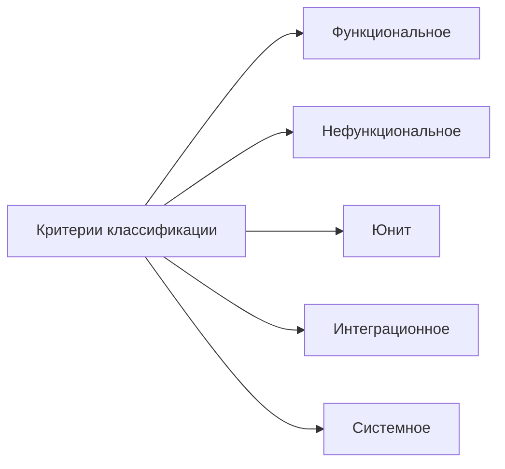
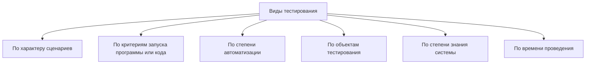
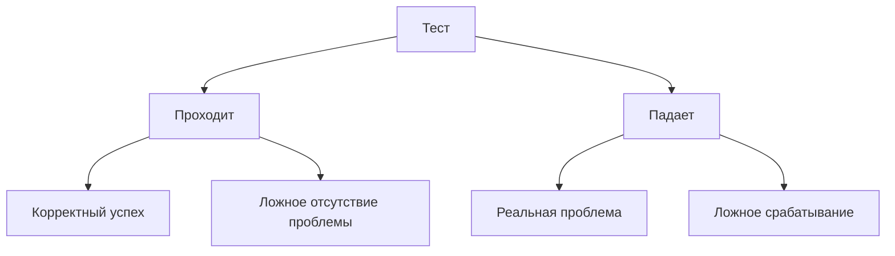

# Лекция 3. Принципы эффективного юнит тестирования

Наша цель сегодня это разобрать отдельно взятые как бы тесты, а именно юнит-тесты. Но чтобы сразу вас не кидать в юнит-тесты, мы немножко пробежимся по истории, рассмотрим как происходило становление тестирования и поговорим уже в дальнейшем о первом бастионе в тестировании о юнит-тестах.

Значит, наш план на сегодня действительно посмотреть историческую ретроспективу. и поговорить о том, что такое качественный юнит-тест, что такое хороший, что такое плохой юнит-тест.

## Что такое тестирование

**Слайд 44: НЕСКОЛЬКО ПРИНЦИПОВ,**

| Принцип | Пояснение |
|---|---|
| Мыслите интерфейсами, а не классами | Тогда вы всегда сможете легко подменять настоящие реализации подделками в тестовом коде. |
| Избегайте прямого инстанцирования объектов внутри методов с логикой | Используйте фабрики или dependency injection. |
| Избегайте конструкторов, которые содержат логику | Вам сложно будет это протестировать. |
| Не относитесь к своим тестам как к второсортному коду | DRY, KISS и все остальное - это для продакшна. Тесты - такой же код. |

Начнем мы с того, что, в принципе, что такое **тестирование**. И должен ли программист программировать, а тестировщик тестировать. Но на самом деле грань эта размывается, и в вопросах юнит-тестов, ну, она вообще перекладывается все-таки на разработчика. А, собственно, чего мы ожидаем? от теста, что он нам покажет, что программа не работает, или покажет, что программа удовлетворяет требованиям заказчика.

На самом деле, в разные времена по-разному относились к тестированию программного обеспечения. В принципе, я думаю, что если вы когда-либо писали в визуальном программировании кнопочку, и по нажатию на кнопочку выводилось то, что вам нужно, ну и вы... в своем роде тоже были тестировщиками. Или в консоли, в каких-то методах вы выводили на экран результат работы метода и смотрели, то ли выводится или нет. То есть в каком-то смысле действительно любой программист, даже, не знаю, писал он юнит-тесты, не писал, но он испытывал желание протестировать свое программное обеспечение.

Ну, хороший программист должен испытывать хоть через боль, но хоть притворяясь, но должен испытывать желание протестировать свое ПО. конечно в большинстве случаев это невозможно и на каком-то интуитивном уровне программист не лезет туда где его код явно может дать слабину и неправильно работать но на это есть уже профессиональные тестировщики исторически можно сказать что точка отсчета в тестировании является Первый обнаруженный баг, ну, в реальном смысле, да, жучок, наверное, все это слышали, что на перфокарте, по-моему, он мертвый жучок, а может, он умер как раз в момент запуска программы. Он залип на перфокарту, и, соответственно, программа, которая была нанесена выбитыми кружками в перфокарте, давала сбой.

Да, он даже вот в музее представлен как первый найденный баг в программном обеспечении. Но в дальнейшем к тестированию стали относиться... Все серьезней и серьезней. Начиная от того, что в начале, до 60-х годов, к тестированию относились с такой математическим подходом, что нужно покрыть все возможные варианты использования программного обеспечения и доказать, что программное обеспечение удовлетворяет всем требованиям. То есть на все входные данные получаются ожидаемые выходные данные. Но, понятное дело, что ближе... К 60-м годам, когда программное обеспечение становилось всё сложнее и сложнее, вариантов входных данных всё больше и больше, этот подход оказался нерабочим. И в целом 60-е и 70-е года такой парадокс тестирования возник.

С одной стороны, тестировщики должны доказывать, что программное обеспечение работает. С другой стороны, тестировщики должны доказать, что... В программном обеспечении есть ряд ошибок. Считалось, что... Изначально считалось, что доказать, что в программном обеспечении есть определенные ошибки, это правильный путь. Но, к сожалению... Нет. К счастью, или история показала, что это все-таки неверное осуждение. И в современных бизнес-процессах, в современной цифровизации... бизнес-процессов подход немножко уже изменился. Сейчас мы посмотрим, в какую сторону. Поэтому вот это вот инь-янь, но оно до сих пор существует. До сих пор тестировщики должны найти ошибку, тестировщики должны доказать, что программное обеспечение удовлетворяет требованию заказчика.

Вот, как они живут с этим раздвоением личности, ну, станете тестировщиками, узнаете.

### История тестирования

**Слайд 18: ПРИМЕРЫ ТЕСТИРОВАНИЯ ПО**

::: warning Текст слайда из PDF
ПРИМЕРЫ ТЕСТИРОВАНИЯ ПО

    Пример функционального тестирования: проверим, корректно ли работает
функция вычисления квадратного корня. Введем число 9, ожидаемый результат — 3.
Если результат соответствует ожидаемому, функция работает корректно.
     Пример нефункционального тестирования: оценим производительность
программы, выполняющей сложные математические расчеты. Замерим время
выполнения задачи и сравним с требуемым значением.
    Пример автоматизированного тестирования: напишем скрипт, который будет
автоматически проверять корректность работы функций программы путем сравнения
ожидаемых результатов с фактическими.
    Пример ручного тестирования: проверим, насколько удобно и понятно
пользователю интерфейс программы, выполнив все основные операции вручную.
    Пример тестирования с использованием группы пользователей: пригласим
группу пользователей для тестирования новой версии сайта и соберем их отзывы и
предложения по улучшению.
:::

Значит, в 80-е можно сказать, что... Это время охарактеризовалось первым появлением различных методик тестирования. К тестированию действительно стали подходить более серьезно, начали понимать, что **тестирование** должно быть не только на приемо-сдаточных испытаниях. И в целом в середине 80-х появились первые инструментарии, позволяющие... проводить тестирование, в том числе автоматическое, автоматизированное. В 90-е эта тенденция продолжается. Единственное, что более усугубляется. К тестированию стали относиться даже не просто как к тестированию, а как к обеспечению качества программного обеспечения. Начинают появляться, опять же, различные инструментарии и фреймверки, в том числе и по автоматизированному тестированию, как я сказал. В 2000-е...

Кардинально ничего не меняют. Единственное, что начиная с 2000-х годов к тестированию теперь относятся как не просто показать, что программное обеспечение выполнит ожидания заказчика, а доказать, что на каждом этапе разработки каждый заплаченный рубль был заплачен не просто так. Тестирование внедряется во все этапы. И на каждом этапе, с развитием методологик agile, соответственно, и итерации по сдаче программного обеспечения становятся все чаще и чаще. И **тестирование** должно доказать эффективность разработки программного обеспечения на каждом этапе, на каждой стадии. Но в целом тенденция идет все к тому, что чем раньше мы найдем ошибку, тем дешевле она будет для бизнеса.

И ошибка, найденная действительно на этапе разработки, правится без привлечения отдела тестирования. Ошибка, найденная на этапе тестирования, задействует... Смотрите, когда ваш автотест, юнит-тест находит ошибку, вы берете на себя всю ответственность, правите. Когда отдел тестирования находит ошибку, это занесение в баг-репорт. Это назначение, кто будет править, потом отчет. То есть теряется куча времени. Если ошибку найдут на приемо-сдаточных испытаниях или в продакшене, это, конечно, цикл еще увеличивается на несколько порядков. Этапы тестирования бывают разные. Нас, на самом деле, в данном курсе будет интересовать конкретно юнит-**тестирование**, модульное тестирование. И оно происходит в процессе создания программного обеспечения.

### Виды тестирования

**Слайд 11: ВИДЫ**

**Слайд 15: ПО ОБЪЕКТАМ ТЕСТИРОВАНИЯ**

| Критерий | Описание |
|---|---|
| По объектам тестирования | Эта группа объединяет виды, которые предполагают определение того, какие части программы или системы подвергаются тестированию. |

**Слайд 16: ПО СТЕПЕНИ ЗНАНИЯ СИСТЕМЫ**

| Критерий | Описание |
|---|---|
| По степени знания системы | Эта группа объединяет виды, которые используются в зависимости от того, насколько тестировщик знаком с тестируемым продуктом. |

#### Этапы, уровни и признаки тестирования

**Слайд 17: ПО ВРЕМЕНИ ПРОВЕДЕНИЯ**

| Критерий | Описание |
|---|---|
| По времени проведения тестирования | В эту группу попадают виды тестирования, которое проводят в разные моменты разработки продукта: например, до выкатки на прод и после. |

Виды тестирования пробежимся, чтобы, опять же, их на самом деле по различным способам классификации можно достигать более 30 видов.

### Юнит-тестирование

**Слайд 52: ЛОЖНЫЕ**

Мы основные разберем, чтобы просто показать, что юнит-тесты – это всего лишь навсего хоть и самый основной инструмент тестирования, если так сравнивать, из 100% всех тестов. 50% времени и ресурсов должно потрачено быть на юнит-тесты. Но, тем не менее, юнит-тесты – это всего лишь небольшая роль во всех видах существующих на сегодняшний момент тестирования. По характеру сценария. У нас есть позитивное и негативное. Позитивный сценарий – это когда мы на веб-сайте… Пытаемся протестировать систему логирования, систему продажи товара. Негативный сценарий, когда мы пытаемся протестировать, а что будет, если оборвется соединение, а что будет, если мы введем неправильный логин и пароль.

По критерию запуска программы мы можем смотреть соответствие технического задания и полученного кода, анализируя код. Мы можем его запускать и смотреть, что получается в результате запуска. По степени автоматизации тут все просто. Есть возможность протестировать, ну, или так, нет возможности отказаться от ручного тестирования. Не все можно протестировать юнит-тестами или... интеграционными тестами, все-таки без ручного тестирования пока никуда. Ну, соответственно, отсюда делят ручное и автоматизированное **тестирование**. Наши юнит-тесты, которые важны для нас в нашем курсе, они будут относиться к автоматизированному тестированию. По объектам тестирования можно тестировать согласно функциональным требованиям, которые прописаны в ТЗ.

И если сказано, что на функцию подается два числа, 5 и 10. Должна получиться их сумма. 15. Тестируем функциональные требования. Или тестируем неявные функциональные требования. Нефункциональные требования. Это как система себя ведет при высокой нагрузке. Как она отрабатывает системы безопасности. В принципе, как... UI дружелюбный или не дружелюбный к пользователю. То есть это функциональность не прописать в ТЗ, но тем не менее учитывать при тестировании ее тоже необходимо. По степени знания о системе. Мы можем ничего не знать. Ну, собственно, так мы обычно делаем с новыми вещами. Покупаем что-то, инструкция, кому она нужна, начинаем тестировать.

После подозрений, что что-то там ломается, мы начинаем, наконец-то, изучать документацию, как это должно работать, и, собственно, она для нас становится белым ящиком. А до этого система, с которой мы работаем, черный ящик. Есть промежуточный этап, когда мы знаем API какой-то системы или знаем, в принципе, как она должна работать, но внутренности реализации не знаем, то есть не видим каких-то исходных кодов. по времени проведения тестирования. Ну, тут вы все знаете лучше меня. Альфа-тесты, бета-тестеры, ну, в зависимости от того, на каких этапах происходит **тестирование**. Соответственно, они тоже разные. Ну, и с точки зрения несколько примеров привести. Ну, вот функциональное тестирование. Проверяем корректность входных данных, что получится на выходе.

Нефункциональное **тестирование**. Проверяем время выполнения при высоких нагрузках. время выполнения, если сценарий пошел не по плану. Автоматизированное тестирование. Пишем скрипт. Это то, чем мы будем заниматься на семинаре. Писать юнит-тесты. Ручное тестирование. Проверяем, насколько удобно пользователю работать с полученной информационной системой. И пример тестирования с использованием группы пользователей. Тоже проверяем, насколько им приглянулся или нет наш продукт. Ну и, собственно, теперь переходим к тому, что важно для нас. как разработчиков, как прикладных разработчиков, это юнит-тесты. Это действительно такая первая преграда или первый инструмент, который встречает баги и позволяет нам с ними купировать их на самых ранних этапах разработки.

Если рассматривать все способы тестирования, ну здесь у меня нарисованы не все, но...

### Какими должны быть тесты

Главная идея в том, что юнит-тесты должны составлять основу всего вашего подхода в тестировании данного программного обеспечения. То есть, действительно, это более 50%. Относиться можно по-разному. Ресурсов, времени, количество. Но от всего тестирования, которое вы потратили на продукт, должно быть уделено внимание именно юнит-тестам. Да, некоторые участки кода... могут быть дублированы, протестированы и в юнит-тестах, и, соответственно, в более высокоуровневых интеграционных или тестирования UI. Но с этим не то, чтобы надо смириться, но к этому можно быть готовым. В больших системах это часто так происходит.

Но, тем не менее, это не означает, что вы отказываетесь от юнит-теста какой-то функциональности, думая, что это будет протестировано где-то в более высокоуровневых тестах. Нет. Так нельзя. Можно ли не писать тесты? Можно не писать. Можно не писать, если вы пишете сайт-визитку, это статический сайт с статичной информацией, там нет никакой логики, нет бизнес-логики, чего там тестировать.

Если вы пишете, ну опять же, рекламный сайт, который не предполагает... интерактива с пользователем там тоже все статично и все предсказуемо или вы делаете действительно программное обеспечение которое будет работать буквально там но и либо это **mvp** проект который потом выкинется и напишется уже реальная версия продукта или это просто выставка конкурс но действительно через неделю-две он вам не понадобится развитие его не будет предполагаться и собственно зачем тратить время на **тестирование** такого продукта который пойдет в мусорку либо вы супер крутой программист который пишет код без ошибок и как бы обладаете просто экстрасенсорными способностями и не допускаете багов но говорят от Он может так, мы вряд ли.

Поэтому в нашем случае тесты нужны, но есть определенные грани или определенные виды проектов. Вот в аутсорсе сталкиваешься постоянно с тремя такими типами проектов. Проекты, которые совсем не покрыты тестом, это плохо. в 2-3 слоя покрыты юнит-тестами, но никто их не запускает, их актуальность не поддерживается, и думаешь, лучше бы в принципе не было этих юнит-тестов. Был плохой код, появился плохой юнит-тест, стало еще в 2 раза все хуже. Но есть такие маниакальные люди, архитектора, которые вот из-под палки заставляют писать юнит-тесты своих подчиненных, но... Хорошего из этого ничего не выходит.

Лучше в таком случае, если команда не готова и пишет их из-под палки, и дальнейшая актуализация и сопровождение этих тестов не подразумевается, то смысл тратить на это время, наверное, и нет. Но есть идеальные, конечно, проекты, где действительно большая часть кода покрыта юнит-тестами. Они все в актуальном состоянии. И все действительно поддерживаются и постоянно, перманентно запускаются. Не обязательно они все проходят идеально. Во многих компаниях большие проекты до 5-10% незакрытых юнит-тестов считаются нормой. Потому что у вас могла поменяться либо бизнес-логика, либо вы провели рефакторинг. Сейчас об этом поговорим. Как сделать юнит-тесты надежными на длительное продолжение развития проекта.

Лучше не писать юнит-тесты, чем писать их бездумно и потом не поддерживать. Поэтому тоже нужно подходить с умом даже к юнит-тестам. Не надо относиться к юнит-тестам как к второсортному программному обеспечению. Если вы думаете, что принципы KISS, DRY это только для бизнес-логики, для каких-то умных вещей. Юнит-тесты — это так, на отвали, написал, чтобы от меня начальник отстал, и всё. Нет, надо переломить свой стиль мышления и относиться к написанию юнит-тестов как к своей основной, ну, как к обычной работе написания программного обеспечения. И там действуют абсолютно те же правила. Ну, сейчас мы посмотрим правила написания хорошего юнит-теста. Что мы ожидаем от модульного тестирования, от юнит-теста? Ну или вообще от теста? Очень много.

Настолько много, что можно сказать, это недостижимый идеал, но к этому идеалу нужно стремиться. Можем ли мы протестировать любую часть проекта или любой уровень сложности проекта?

На самом деле нет. Если относиться к проекту... как к коду, где есть простой код без зависимостей. Ну, допустим, класс User и все. Так, класс User с зависимостью – это юзер, у которого есть ассоциативный объект Company. Тогда между ними есть зависимость, и это уже не простой класс. Если посмотреть простой код без зависимостей, сложный код с большим количеством зависимостей, сложный код... но без зависимостей, и легкий код, но с большим количеством зависимостей. Все ли надо тестировать?

На самом деле нет.

Давайте экстремальные случаи рассмотрим. Это простой код без зависимостей и сложный код с большим количеством зависимостей. Простой код без зависимости – смысл тестировать. Это, скорее всего, статичный класс, в котором нет никакой бизнес-логики, и тестировать там ничего не надо. сказали да что простой код без зависимости смысла тестировать нету но парадоксально сложный код с большим количеством зависимостей его тоже бессмысленно тестировать потому что тесты будут постоянно давать ложные ложные баги или будут постоянно давать баги Несмотря на то, что у вас код правильный, вы просто провели рефакторинг в какой-то из зависимостей, но ваш юнит-тест надо переписывать. Но покрывать такой божественный класс, его бессмысленно.

Это признак того, что здесь необходимо провести рефакторинг. Есть определенные паттерны, про них чуть позже поговорим. Каким образом вот эту часть кода... сложную алгоритмически со сложными зависимостями мы можем разделить но один из паттернов наверное у вас на слуху это примитивно модель view controller в модель вынести логику в контроллер собственно вынести логику по вызову сложных каких-то вещей и тестировать уже вот этот божественный класс разделив его тестировать по отдельности заменяя какие-то куски бизнес-логики как раз фейковыми объектами. Но про этот паттерн поговорим чуть позже. Получается, у нас остается сложный код без зависимостей. Это действительно некая бизнес-логика, и ее необходимо покрывать юнит-тестами.

И не сложный код, но с большим количеством зависимостей. Этот код тоже необходимо тестировать, потому что 26 лет назад... Буквально в сентябре потерпел крушение один из спутников, потому что две команды, участвующие в разработке, не протестировали два своих модуля. Ну, в общем, у одних были сантиметры, у других дюймы. И вот один из спутников потерпел крушение из-за того, что просто два модуля... работающие идеально каждый сам по себе, но имеющие зависимости между собой, не были протестированы. Но это ладно. Я лично столкнулся со случаем, когда беспилотник ни с того ни с сего переворачивался. Просто летел и переворачивался, потому что каким-то чудом у него появлялась отрицательная высота. Но он не был под землей.

Просто разработчики не знают, что отрицательная высота у летающего средства может быть и в полете, потому что ниже уровня воды. И там, соответственно, происходил переворот беспилотника. Поэтому разные модули, которые интегрируются между собой, необходимо тестировать и проверять их взаимную работу. Некоторые советы, рекомендации или правила, правило, наверное, будет более правильно. Написание хороших юнит-тестов. Это придерживание единого стиля. Стиль называется 3А, потому что любой юнит-тест желательно разделять, ну, не всегда, конечно, получится на три части, но идея в следующем. Вы должны сначала подготовить. необходимый набор данных, необходимые зависимости, которые будут участвовать в тесте.

Дальше произвести действие, которым вы собираетесь протестировать, и проверить результат. Соответствует ли результат, вот тут сложение 2 и 5, получим ли мы семерку в результате. И вот любой тест, даже если вам язык позволяет синтаксически написать это в одну строчку, Не рекомендуется, потому что прочтение этого теста будет сложно, и не все эти этапы прям напрямую просматриваются. Поэтому стараться придерживаться вот этого стиля 3А – это прям первая рекомендация. Вторая рекомендация – это тестировать одну вещь за раз. Тогда вы будете понимать, в случае падения теста, будет сразу понятно, какой участок бизнес-логики дает сбой. стилей тестирования можно разделить все **тестирование** на три вида. Это проверка входных и выходных данных.

Точнее, проверка выходных данных на основании поступивших входных данных. Ну, здесь все, в принципе, примитивно. Мы пишем unit test, знаем, что подаем на вход, знаем, что должны получить на выход. Второй вариант – это проверка состояния. когда мы после проведения теста проверяем, в каком состоянии, мы знаем, в каком состоянии объекты должны быть, и проверяем, действительно ли они пребывают в этом состоянии. Это второй вариант написания тестов. Третий вариант, еще более сложный, это проверка взаимодействия компонентов в момент выполнения теста. И вот здесь как раз мы не можем уже обойтись без так называемых подделок, моков, фейковых объектов. Потому что проверить взаимодействие кода с большим количеством зависимостей достаточно сложно.

И анализировать результат такого теста, даже если вы его напишите, будет тоже достаточно сложно. Но самое отвратительное, его поддерживать практически невозможно. Потому что какая-то из зависимостей будет... подвержены рефакторингу, и тест, в принципе, будет падать. Поэтому проверка взаимодействия разных зависимостей достигается за счет введения вот этих вот моковских объектов, поведение которых мы можем предсказать. Но тут возникает вопрос, а как эти моковские объекты тогда подсовывать в наш класс с большим количеством зависимостей? Ответ вы, на самом деле, уже знаете, и мы две предыдущих лекции про это говорили.

Если наш код будет внутри, если наш класс будет внутри вытаскивать эту зависимость, либо создавать, протестировать или замокать такую зависимость, нам будет невозможно. Вспомните паттерн ServiceLocator. Здесь как раз он у нас и реализован. Мы из конфигурационного файла дергаем экземпляр. который соответствует интерфейсу iAccountData. И все.

Собственно, при запуске проекта у нас этот класс участвует в дальнейшем в бизнес-логике, а он, собственно, работает с базой. И проверить условно класс, отвечающий, ну вот контроллер, который в себе содержит несколько зависимостей, а одна из зависимостей еще и работает с базой данных, протестировать такой класс. не представляется возможным. Но если мы вспомним DI и вынесем создание этого класса, который мы вытаскиваем по интерфейсу на более высокий уровень, то тогда в конструктор мы сможем подсунуть моковский объект вместо реального. И поэтому борьба с зависимостями и... в том числе помогает и при написании юнит-тестов.

Ну и здесь показан пример, что теперь у нас данная зависимость поступает в конструктор этого класса, и, соответственно, раз она поступает в конструктор, то мы можем написать юнит-тест, который будет подставлять туда фейковый объект, который нам нужен, который работает по заданному нам сценарию, ну и, собственно, не затрагивает даже обращение к базе, а имитирует работу с базой. Отсюда еще раз рекомендовано подходить к разработке программного обеспечения с мыслями об интерфейсах. Что мы не должны зависеть никогда от реализации, а должны зависеть от абстракции. И внутри сложного класса не должны создаваться конкретные экземпляры. Они должны туда поступать с помощью внедрения зависимостей. Что касаемо вот этих двойников. Есть несколько видов.

На самом деле многие в момент разработки не отличают моковские объекты и не делят. Мок, стаб. Просто говорят, давай замокаем. данную логику. Но на самом деле есть небольшие отличия стаба от мока. И отличаются они, наверное, тем, что один стаб тестирует именно состояние объекта. Допустим, вы поливаете огород. Стаб будет тестировать, огород полит или нет. А мок будет тестировать, сколько раз вы сходили за водой, какова влажность. как быстро вода впиталась, что там еще, какие параметры есть, ну и так далее. То есть получается стаб, он тестирует состояние, а мок тестирует взаимодействие нескольких вот этих зависимостей. Из рекомендаций в одном тесте желательно, чтобы был один мок-объект. Визуально можно это представить следующим образом.

Стаб – это один из вариантов замокать. Стаб, он просто проверяет, равна ли строка пустоте или не равна, ну, после каких-то действий. Ну, или равна ли, равен ли результат отработки функции сумм, там, 5, 2, 7 или нет. Это будет стаб. По коду, ну, в зависимости, конечно, от библиотеки, но по коду вы как бы этого и не заметите. Стаб или мог, это больше идеологически. Потому что классы могут использоваться одни. А MOOC будет проверять. В данном случае создаем контроллер. Ну и дальше мы можем проверить, единожды ли он выполнился, сколько времени он выполнялся, какое количество раз его вызвали, эту функцию и так далее. То есть он проверяет именно взаимодействие некоторых частей тестируемого модуля. Что касаемо, где их взять, эти моки.

Можем написать самостоятельно, а можем использовать готовые фреймверки. Но, поверьте, с 80-х годов пишутся библиотеки, создаются различные инструменты для автоматизации тестирования. Поэтому изобретать свой велосипед, это может быть опасно. Там все-таки, несмотря на то, что это возможно, но смысл тратить время и потом получить риски, что ваши вот эти вот подделки, ваши моковские двойники тоже могут иметь код, тоже могут иметь баги. Ну и получается такой важный код будет тестировать код на присутствие багов. Это сомнительное удовольствие. Поэтому на семинарах мы как раз будем разбирать библиотеки по... написанию юнит-тестов, которые позволяют потом сделать проект и автоматически его запускать.

Ну а уже в последних семинарских занятиях, разбирая CICD, будем смотреть, как этот процесс автоматизировать.

Значит, некоторые рекомендации сводятся к тому, что мы не то что должны, мы обязаны мыслить интерфейсами для того, чтобы иметь возможность с помощью DI подсовывать mock-объекты. Следовательно, мы должны избегать прямого инстанцирования в объектах с сложной композицией, для того, чтобы иметь возможность тестировать не один божественный класс, а эти зависимости, которые внедряются через конструктор, попробовать поочередно подсовывать туда МОК-объекты. В конструкторе лучше избегать какой-либо бизнес-логики, потому что, опять же, ее сложно достаточно протестировать. Такая философская мысль не относится к тестам как к вторичному коду. Это тоже код, который не то что имеет право на жизнь, а он дает качественную жизнь вашему основному коду.

Ну и теперь, наверное, самое важное и интересное. Это как померить эффективность написанных вами юнит-тестов. И, к сожалению, можно в принципе... одним слайдом все это охарактеризовать? Никак. Нельзя просто измерить качество юнит-тестов в целом. Нельзя сказать, что процент покрытия юнит-тестов говорит о качестве ваших тестов.

Скорее, наоборот, процент покрытия может сказать о некачестве. то есть если у вас условно меньше 40 процентов кода покрыта юнит тестами это точно плохо но то что у вас 80 90 процентов покрыта кода юнит тестами это еще не означает что вы молодец вот потому что необходимо измерять качество каждого юнит теста по отдельности к сожалению поэтому покрытие это в принципе один из вариантов убедиться, что у вас в принципе не все так плохо, но процент покрытия вашего кода юнит-тестами не скажет о том, что вы супер молодец, у вас там 90% покрыто. Каждый тест необходимо оценить в отдельности. Ну или не то, чтобы прям сидеть и оценивать, просто при написании теста вы должны об этом задумываться.

Какие критерии есть, которые могут сказать хороший юнит-тест или плохой? Их 4. Первый и второй достаточно примитивные, и мы их чуть-чуть отложим на потом, потому что действительно это не так сложно. А вот третий и четвертый, начнем давайте с них. Скорость обратной связи. Ну, это мы уже с вами говорили о том, что чем быстрее вы получите результат теста, ну, соответственно, юнит-тест вы получите уже на утро, если он у вас ночью был запущен. Чем быстрее вы от юнит-теста будете получать результат, тем быстрее вы сможете подправить баг. Потому что, как я и говорил, результат, полученный от отдела качества, он уже будет настолько позже получен, что придется возвращаться к написанному коду, который уже с чем-то зависит. Или на что-то уже другое подвязался.

А если вы получите от... После... Введение в продакшн баг, ну это совершенно уже никуда не годится, исправление такого бага будет еще дороже. Поэтому о качестве теста можно судить вот по такой примитивной метрике, как скорость обратной связи. Вот здесь все примитивно, чем быстрее, тем лучше. Второй примитивный критерий, который скажет хороший тест, нехороший, это простота его поддержки.

Собственно, если вы соблюдаете правило 3А, он легко читабельный и легко запускаемый, то есть вам не нужно тянуть кучу каких-то сторонних зависимостей, возможно, внешних библиотек для того, чтобы протестировать тест. Можно говорить о том, что да, действительно, тест легко прочитать, легко запустить, это тест хороший. Первые два критерия, с ними немножко всё сложнее. Первый. Это защита от багов. Чем тест больше выполняет кода, тем, соответственно, он большее количество багов может обнаружить. Это хорошо. Важность и сложность выполняемого кода тоже. Чем более сложную бизнес-логику тестирует юнит-тест, тем это тоже важнее для результата. Тем, соответственно, вы в более серьезных кусках бизнес-логики найдете какую-то уязвимость.

Собственно, один из критериев, первый, по-моему, был, это затрагивает ли он внешние библиотеки, потому что они тоже могут давать сбой и влиять на появление багов. Он должен тестировать действительно важные и сложные участки кода и тестировать как можно больший объем. А вот второй критерий, устойчивость к рефакторингу, это самый, наверное, важный и... то, на что не обращают разработчики внимания при разработке юнит-тестов. А это действительно важно, потому что тест, который у вас работает сегодня, после произведенного рефакторинга может не заработать завтра. Но это плохой тест, если он себя так ведет. Хорошие тесты... Почему тест может не заработать завтра? Потому что он зависел от какой-то реализации. И... С этим нужно бороться.

Как бороться, мы сейчас посмотрим. Поговорим о ложном срабатывании юнит-тестов. Но вот это ложное срабатывание после рефакторинга, оно на самом деле достаточно критически важно на всех этапах разработки.

Давайте про это посмотрим пример. Когда мы можем получить от юнит-теста ложное срабатывание? Идея в следующем. У нас есть сообщение, которое мы хотим рендерить в виде HTML-кода и показывать его в браузере. Как мы можем протестировать, какой юнит-тест мы можем написать, который проверит правильность рендеринга этого сообщения в HTML-код? Вариантов много, и очень много неправильных вариантов. Первый вариант, давайте посмотрим этот код. Смотрите, есть сообщение, которое состоит из заголовка, тела и подвала. То есть стандартная такая HTML-страничка. Есть интерфейс рендеринга этого сообщения и, соответственно, несколько реализаций, которые будут делать заголовок, основное тело сообщения курсивом его делать.

То есть различные варианты рендеринга нашего сообщения для подвала, для тела, для заголовка. и сам класс MessageRender, который будет выводить заголовок, тело и подвал. И вот как протестировать, собственно, метод Render? С одной стороны, мы можем протестировать, так как он возвращает строку, можем протестировать правильность заполнения вот этой вот коллекции. Это не совсем будет верный тест, но он как бы... данный юнит-тест будет плохо сопротивляться рефакторингу. Почему? Как мог бы выглядеть тест, если бы мы собрались тестировать действительно правильность заполнения данной коллекции? Он бы мог выглядеть следующим образом. Мы бы могли проверять количество этих месседжей и последовательность.

Но опять же, в случае малейшего произведенного рефакторинга наш тест может выдать уже... ошибку, потому что, возможно, у нас будет количество изменено месседжей на странице. Может быть, их последовательность вряд ли, но опять же, кто сказал, что лишь подвал будет в одном экземпляре. То есть вот такие вот тесты, которые пытаются...

Да, собственно, вот если данный пример возвести в абсолют, то, по сути, мы тестируем соответствие тестовых данных вот какому-то жесткому набору то есть еще хуже можно было бы сделать так проверить что наш метод рендеринга дал вот такой абсолютный кусок текста но вы понимаете что там малейшее добавление пробела в нашем классе которые мы тестируем уже даст неполное соответствие вот этому куску текста поэтому тест должен привязываться не к имплементации вот что такое конкретно должен быть результат а должен привязываться к проверке конечного результата сейчас попытаюсь на примере показать значит еще раз плохо тестировать куски которые скорее всего будут рефакториться и не факт что у нас будет количество в нашем тестируемом классе равняться 3 и их последовательность будет вот абсолютно в таком варианте плохо тестировать какие-то конкретные результаты более правильно тестировать полученный результат но и смотрите значит раз у нас метод рендер возвращает строку то более правильный тест который не будет будет хорошо отрабатывать любой рефакторинг он должен проверять в конечном счете, у нас строка появилась, строка, которая после рендеринга соответствует вот такому стилю или нет.

То есть, смотрите, мы не проверяем количество, какое количество раз он вызвал ту или иную часть нашей бизнес-логики. В какой последовательности он вызывал ту или иную часть. Сначала header, потом body. Нам это не так важно. Нам важнее, что мы получили действительно вот такой вариант в виде такого HTML-кода, нежели в какой последовательности он вызывал, чтобы это получить. Хороший тест должен ответить на вопрос, конечный результат мы получили нужный, а плохой тест он... будет тестировать процесс. Поэтому если из двух зол выбирать, то более правильно подходить к написанию юнит-теста с позиции, что верен ли конечный результат, а не верно ли происходил процесс получения этого конечного результата.

Потому что процесс получения – это внутренняя **реализация**, которая, скорее всего, будет постоянно меняться в процессе разработки. а итоговый результат изначально заложен в техническом задании, поэтому он вряд ли будет так быстро меняться, как способ получения этого результата. Отсюда и подход к тесту, что лучше тестировать получаемый результат, нежели процесс получения этого результата. Точность теста – это всегда грань между двумя параметрами – сигналом и шумом. То есть он не всегда будет адекватен. И вот есть такой один из критериев, который манипулирует вот этим соотношением двух параметров. Сигнал – это сколько багов он нашел, и шум – сколько из этих найденных багов дали ложное срабатывание.

Есть вообще два варианта – ложно-отрицательное срабатывание и ложное срабатывание. Ложно-отрицательное срабатывание – это когда... Тест не находит ошибку. А ложное срабатывание – это когда тест находит ошибку, но ее на самом деле нет. И вот здесь эти два параметра на самом деле разработчиками не все параметры учитываются. Разработчикам часто учитываются именно ложно-отрицательные срабатывания. Но это правильно. Он должен писать юнит-тесты, которые ищут ошибки. Плохой юнит-тест, который явно не найдет какую-то ошибку. И на старте проекта действительно такого вида ошибок будет больше. Но разработчики концентрируются только на таких тестах, которые будут отлавливать ошибку.

И они не уделяют должного внимания на написание тестов, которые не тратят время. на написание тестов, которые подвержены рефакторингу и не будут давать ложных срабатываний через какое-то время. То есть вот эти тесты действительно не дают ложных срабатываний, потому что код на каких-то начальных этапах стабилен, но через три месяца производится рефакторинг кода, и эти тесты, которые на самом деле выдают ошибку, Но программа-то написана правильно, потому что просто произошел рефакторинг. Вот это вот тоже плохо. И проблема в том, что вот эти четыре критерия нельзя никогда соблюсти. Максимум только в юнит-тесте у вас будет два. А какие, ну тут уже выбираете сами, и как бы недостижимого результата, такой идеала не существует. И вот...

Если говорить о том, что у нас есть разные тесты, юнит-тесты, функциональные тесты, то функциональные тесты – это наилучшая защита от багов, потому что функциональные тесты тестируют несколько зависимостей и могут найти максимальное количество багов. Они устойчивы к рефакторингу, потому что функциональные тесты не тестируют реализацию, а тестируют сам процесс работы программы. Но медленная обратная связь, потому что функциональные тесты нельзя применять сразу на этапе разработки той же доменной модели. Поэтому функциональные тесты будут из вот этих трех критериев бить сюда. Они защищают от багов и устойчивы к рефакторингу, но быстрой обратной связи они не дадут. Тривиальные тесты, допустим, для тестирования элементарного доменного объекта.

Мы задаем имя и должны проверить фамилию и имя. Быстрая обратная связь, потому что можно написать такой юнит-тест, получить результат сразу в случае какого-то сбоя. Устойчивость к рефакторингу тоже у них высокая, потому что тут редко что-то будет происходить и рефакториться. Но они не показывают большого количества багов, потому что они тривиальны и не покрывают какой-то серьезной бизнес-логики. Получается, вот эти тривиальные тесты бьют сюда. То есть они не защищают от багов, их даже редко пишут, но они зато быстры и устойчивы к рефакторингу. Хрупкие тесты, которые, допустим, у нас есть класс репозиторий, который обращается к базе и способен нам отдать последний выполненный запрос.

Казалось бы, мы можем такое протестировать, но мы пишем тест, который будет... выполнять выборку из таблицы определенного юзера. Но опять же, каким образом та или иная ОРМ-система выполнит этот запрос, или каким образом **реализация** репозитория его выполнит, куча вариантов. Можно сделать выборку, да и, наверное, еще придумать несколько вариантов, как мог быть выполнен данный запрос на уровне базы данных. И, соответственно... Верить такому тесту, да, он быстрый, но он неустойчив к рефакторингу, потому что реализация нашего репозитория может выполнить запрос GetById различными вариантами. На доске их 4. И какой из них в текущей реализации был написан, нам неизвестно. Поэтому вот такой вот хрупкий тест, он бьет, получается... в два параметра.

Да, он защищает, он быстрый, он защищает от багов, потому что тестирует логику, но он неустойчив к рефакторингу. И вот идеального такого результата, который бы обеспечил, удовлетворил всем трем критериям, его практически нереально достичь. Четвертый там... Четвертый даже учитывать не стал. Четвертый у нас... Ну, да, простота поддержки это в принципе... аксиома, мы должны это соблюдать. А, ну здесь, собственно, опять о том же, что у нас есть тривиальный код, который действительно можно не тестировать. У нас есть модель предметной области доменной классы, которая идеально тестируется юнит-тестами. У нас есть переусложненный код, который необходимо отрефакторить, его бессмысленно тестировать. И у нас есть контроллеры.

Это та область, которая тестируется как раз уже интеграционными тестами, но не юнит-тестами. И, собственно, а что делать, если у нас вот такой вот... Как быть с переусложненным кодом? Каким образом его можно отрефакторить, чтобы в дальнейшем протестировать? Просто забивать на него, разумеется, нельзя. Что такое переусложненный код? Это код, у которого... сложная бизнес-логика и большое количество зависимых объектов. Можно применить паттерн Humble Object, который сводится к тому, что мы должны разбить этот код на несколько отдельно работающих частей. Выглядит это примерно так. Допустим, как мы можем разбить этот божественный класс?

Самое примитивное это применить паттерн ModelViewController. оставить контроллер, у которого много зависимостей, но легкая бизнес-логика. Протестировать такой класс мы сможем. Вынести отдельно компоненты зависимости в отдельные классы, с которыми будет работать контроллер. Их по отдельности мы тоже сможем протестировать, несмотря на то, что у них сложная логика, но у них малое количество зависимостей. Получается, что этот паттерн... Самая известная его **реализация**, это разделить этот божественный класс на модель ViewController.

Таким образом, модель будет содержать логику, контроллер как раз и превратится в этот Humble Object, ну и View будет содержать класс, который имеет множество зависимостей. И последнее, когда использовать моки, ну в принципе мы тоже уже разобрались. Когда нам необходимо протестировать класс с большим количеством зависимостей, но мы не можем написать такой юнит-тест, который действительно протестирует всю нашу систему. Достаточно сложно, и порой нам не нужно. Нам нужно протестировать определенную часть системы, не затрагивая другие части. Мы можем подставить моки. Но что, собственно, можно мочить? И вот здесь какие зависимости... существуют и какие зависимости нужно мокать. Есть разные подходы, как я говорил.

Есть подход лондонская школа, она говорит о том, что надо мокать любые изменяемые зависимости, то есть те, которые меняются в момент выполнения программы. Их точно нужно мокать, и не важно, относятся они к вашему процессу, то есть это какая-то логика взаимодействия классов, или они относятся к внешнему процессу, допустим, это база данных или какой-то API. Есть второй подход, это классическая школа, она говорит о том, что не надо мокать внутренние процессы какого-то класса, их надо тестировать. Мокать надо только внешние процессы, допустим, подключение к стороннему апик, подключение к базе. Но на самом деле, что такое внутренние зависимости, которые кто-то говорит надо мокать, кто-то говорит не надо. И опять же, что такое внешние?

Ну вот внешние это возможно какой-то месседж баз или сторонний апик, ну другой микросервис, к которому мы обращаемся. Но на самом деле существует вот здесь. Внешние процессы тоже могут быть разные. Потому что внешние процессы могут быть какой-то файловой системой. Или внешние процессы может быть какая-нибудь in-memory база данных, которая работает в нашем процессе, в нашей программе. И, собственно, есть еще одна точка зрения, что нужно все-таки разделять изменяемые зависимости. внешней изменяемой зависимости на управляемые и неуправляемые.

Как раз Владимир Хоринов, который написал, наверное, самую знаменитую книжку по юнит-тестам, он как раз говорит, что ни те, ни другие, ни классика, ни лондонская школа не правы, что нельзя просто относиться к внешним изменяемым зависимостям, надо их тоже классифицировать. и классифицировать как на те, которые управляются и не управляются. Ну, не управляются – это, опять же, сторонние сервисы, на которые мы не влияем, которые не относятся к нашей программе. И внешние изменяемые зависимости, которые управляются. То есть это наша база данных, наша файловая система. Вот их как раз он не сторонник мокать. То есть управляемое – это действительно, когда наша логика, наша бизнес-логика лезет в эту управляемую зависимость.

И только мы знаем, что мы туда полезли. А внешние неуправляемые – это действительно месседж-бас, когда мы сообщаем, и вся система знает, что мы отправили сообщение вот такому-то сервису. То есть это действительно нужно мокать. внешнюю неуправляемую зависимость, а внешнюю управляемую, то есть нашу, ее мокать не надо. Ее надо тестировать по полной и нормальными тестами, но не заменять фейковыми объектами. Вот, это его точка зрения, но тоже рекомендую принципы юнит-тестирования Владимира посмотреть. Есть несколько выступлений на конференции, он эту точку зрения отстаивает. что ни те, ни другие не правы, а нужно более разумно подходить к моканию объектов. На семинаре мы как раз завтра, кто-то в понедельник, разберём написание юнит-тестов.

### Итоги

И, наверное, после завтрашнего семинара мы вам выдадим первую контрольную работу. Всё, ребят, спасибо.
