# Лекция 4. Паттерны проектирования (GoF)： порождающие паттерны

Мы с вами начинаем сегодня такой цикл занятий по паттернам GOV. Это будет три лекции, после этого у нас будет вторая домашняя работа, которая пойдет в вашу накопительную систему. На данной лекции мы сегодня с вами разберем саму идею паттернов, что это такое. Это какое-то шаблонное, всем известное решение, или это алгоритм, или это вообще нечто иное. Рассмотрим в целом, какие есть... Паттерны, на какие группы они бьются. И приступим к изучению первой группы, которая отвечает за создание объекта. У всех этих паттернов, которые входят в эти порождающую группу, есть нечто общее. Они отвечают все за создание объекта, но на самом деле и процесс создания тоже у них общий. Они пытаются избавиться от конструкции new, вытеснив ее на уровень выше.

Давайте начнем с того, что же такое в целом паттерн. Вообще, когда написали книжку, изначально слово паттерн переводили как шаблон. Но шаблон в русском языке, он больше чем-то напоминает трафарет. И тогда у разработчиков, ну и вообще тех, кто читал книгу, складывалось ощущение, что это шаблонные решения, значит их нужно применять вот ровно так, как это написано в книге. Но это не так.

На самом деле невозможно взять академический пример из книжки и в чистом виде переложить на вашу какую-то проблему и надеяться, что проблема решится сама собой из-за того, что вы догадались, какой паттерн применить. Догадаться, какой паттерн применить – это одна задача, а как его правильно применить – это другая. Относиться к паттернам как к алгоритмам – это тоже неверно. Это не готовые решения, это не пошаговая инструкция. В целом, если вы знакомитесь с паттернами впервые, то я бы даже относился при первом знакомстве к паттернам как к возможности в целом увидеть, какие есть проблемы при разработке программного обеспечения. Они как бы общеизвестны, эти проблемы. сотнями миллионов проектами решения.

И вот при первом знакомстве давайте даже будем стараться не зацикливаться на том, как решается та или иная проблема, а постарайтесь зафиксировать, ага, при разработке может возникнуть вот такая проблема. И потом, когда действительно начнем работать на практике, мы будем делать отсылки. Ага, вот здесь проблема, с помощью какого паттерна ее можно решить. Впервые книжку про шаблоны, ну в русском переводе шаблоны, в англоязычном она называлась тоже паттерны, написал на самом деле совсем не программист, а архитектор, который описывал стандартные решения для городов. Для города с населением до миллиона человек, как необходимо проектировать районы, кварталы и так далее. Для города, где более миллиона человек. То есть он описал такие шаблонные решения.

Ну, программистам это зашло. Это идея, что давайте и мы опишем книжку. Нельзя сказать, что до 1994 года о паттернах никто не знал. Они, разумеется, начали писаться, можно сказать, кровью программистов на ошибках, начиная с самого первого дня, когда начали разрабатывать программное обеспечение. Но впервые их классифицировали, дали имена, описали некий алгоритм. реализации каких-то примитивных, возможно, решений с помощью этих паттернов, это вот данные авторы. Сами они себя называли «Банда четырёх». И вследствие этого и книжку, которую они написали, никто по-настоящему, как она называется, никто её так не произносит, все говорят «Книжка Банды четырёх» или «Паттерны ГОФ Гэнкофор».

То есть они, ещё раз, да, они не изобрели какую-то... не сделали какой-то революции. Они классифицировали и описали все паттерны в одной книжке. Проделали колоссальную работу. Их оригинальная книжка читается достаточно сложно, потому что рассматривая даже самый первый паттерн, идут перекрестные ссылки на другие паттерны. То есть понять их книжку с первого раза просто невозможно. И даже я не рекомендую читать ее первым. В первую очередь, есть ряд других уже переизданных книжек в другом формате изложения. Лучше начать с них, а потом уже посмотреть оригинал. Но оригинал тоже очень сильная книга, оригинальная, потому что действительно она показывает взаимосвязь этих паттернов.

Паттерны не могут, ну, не обязательно применяются прям один для решения какой-то проблемы. Сегодня мы будем рассматривать порождающие паттерны, к которым относятся билдер, абстрактная фабрика, шаблонный метод.

На самом деле эти три паттерна чаще всего используются совместно и порождают таким образом еще один паттерн, который не описан в книжке, но на форумах и в общении между разработчиками часто слышится «здесь фабрика». Но такого паттерна нет. Но под фабрикой подразумевает совокупность других трех паттернов. Зачем вообще их знать? С одной стороны, у вас будет понимание сленга внутри команды. Вы будете понимать, если вам говорят, что в данном модуле используется абстрактная фабрика, или в данном месте применяется билдер, вы будете понимать, как устроено. С другой стороны, это некая стандартизация кода. Если мы все будем действительно решать общепринятые проблемы с помощью определенных наработанных решений, всем будет проще.

Если мы не начнем изобретать какой-то свой велосипед, потом этот велосипед придется понимать вашему коллеге, как вы решили ту или иную проблему. Если есть проблема, и она уже действительно была сотни раз до вас, и есть описанное решение, другим разработчикам будет... проще понять ваш ход мыслей, если они поймут, какой паттерн вы здесь пытались или у вас даже получилось применить. Ну и, собственно, общий словарь, как я и сказал, для того, чтобы общаться в коллективе. Паттерны критикуют и, на самом деле, я бы сказал, безосновательно, просто не разобравшись в некоторых нюансах, начинают к ним приписывать такие вещи, которые в 1994 году и раньше, когда паттерны появлялись, Их просто не было.

Вот, допустим, говорят, что ваши паттерны – это из-за недостатка языка программирования, с которым вы работаете. Вот в моем языке есть класс **Builder**, в моем языке есть реализованное лямбда-выражение, которые, по сути, являются возможностью написать шаблонный метод. У вас этого нету, поэтому вы тут придумываете паттерны. Действительно, так произошло, что общепринятые решения уже воплощены во многих фреймверках. И когда мы перейдем к клиент-серверной разработке, мы будем с помощью билдера стартовать наш сервер. Наш бэкэнд. И в то же время паттерн как прототип. он тоже реализован во многих языках. В Python он, допустим, реализован, по-моему, командой copy.

В .NET и в Java это тоже есть соответствующие команды, которые клонируют, создают прототип объекта. Поэтому, действительно, паттерны можно критиковать, но нужно все-таки понимать, что когда создавались, еще раз, да, и писались книги, вот, то эти паттерны не были в языках.

Если говорить о том, что они дают неэффективное решение, то, скорее всего, это попытка бездумного или необдуманного применения паттернов. Отсюда возникает и их третья проблема. Вот когда, знаете, у вас молоток в руках, вы начинаете видеть везде гвозди. Вот то же самое. Очень часто в тестовых заданиях кандидаты хотят показать знание паттернов. И начинают прикручивать все 23 паттерна в проекте, где вообще они не нужны были. Но в жизни действительно не так часто приходится применять паттерны. И большую часть порождающих паттернов, они применяются в момент создания архитектуры. Не бывает так, что вы уже пятый год пишете, и ни с того ни с сего вы решили применить паттерн. Они закладываются тоже очень часто изначально.

### Виды паттернов

**Слайд 3: ЧТО ТАКОЕ ПАТТЕРН**


**Слайд 7: ВИДЫ ПАТТЕРНОВ**
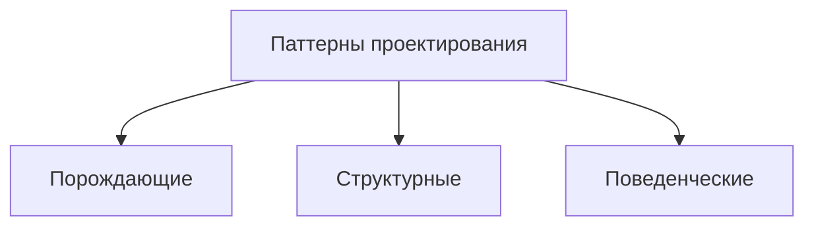

::: warning Текст слайда из PDF
ВИДЫ ПАТТЕРНОВ

• Порождающие паттерны беспокоятся о гибком
  создании объектов без внесения в программу
  лишних зависимостей.

• Структурные паттерны показывают различные
  способы построения связей между объектами.

• Поведенческие паттерны заботятся об эффективной
  коммуникации между объектами.
:::

Виды паттернов.

На самом деле есть множество классификаций, как их делить. Но авторы, вот как раз банда четырех, разделила паттерны на три группы. Они не равны между собой.

### Порождающие паттерны

**Слайд 10: ПАТТЕРНЫ**
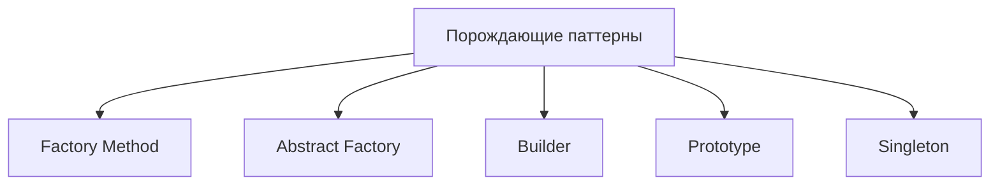

Из них самая небольшая – это порождающие и структурные. Наверное, структурные даже меньше. Самая большая – это поведенческие паттерны. Разделили их условно. И на самом деле здесь можно поспорить, потому что не в чистом виде не все. порождающие паттерны описывает только создание объекта там есть и взаимосвязи объектов но все-таки большого слона легче есть по кускам поэтому нам такая классификация будет удобно мы разобьем данную тему на три лекции и собственно сегодня мы рассмотрим именно порождающие паттерны но вот схематично я изобразил их общее количество Мы сегодня разберем, собственно, все порождающие паттерны, несмотря на то, что среди них есть и антипаттерн, синглтон. Но все равно посмотрим, посмотрим, в чем его проблема, почему его критикуют.

Но сконцентрируем внимание все-таки на основной тройке.

### Factory Method

#### Factory Method: решение и структура

**Слайд 12: РЕШЕНИЕ**
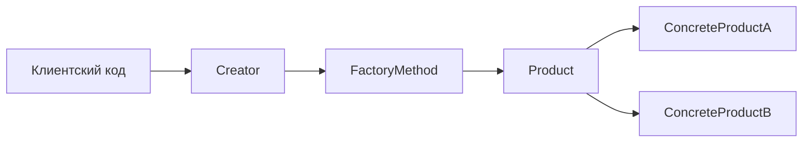

::: warning Текст слайда из PDF
РЕШЕНИЕ

Мы просто переместили вызов конструктора
   из одного конца программы в другой

                                           Чтобы эта система заработала, все возвращаемые
                                              объекты должны иметь общий интерфейс.
:::

**Слайд 14: СТРУКТУРА**
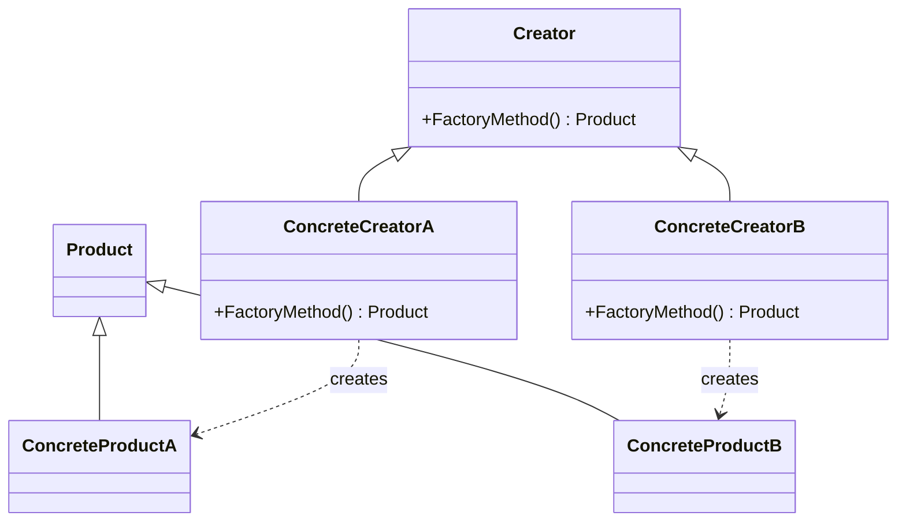

::: warning Текст слайда из PDF
СТРУКТУРА

1. Продукт определяет общий интерфейс.
2. Конкретные продукты содержат код
различных продуктов.
3. Создатель объявляет фабричный метод,
который должен возвращать новые
объекты продуктов.
     Зачастую фабричный метод объявляют
     абстрактным, чтобы заставить все
     подклассы реализовать его по-своему.
     Несмотря на название, важно понимать,
     что создание продуктов
     не является его единственной функцией.
4. Конкретные создатели по-своему
реализуют фабричный метод.
:::

**Слайд 15: ФОРМАЛЬНОЕ ОПРЕДЕЛЕНИЕ ПАТТЕРНА**

::: multi-code "Factory Method: формальное определение" {playground=off}
```kotlin
abstract class Product
class ConcreteProductA : Product()
class ConcreteProductB : Product()

abstract class Creator {
    abstract fun factoryMethod(): Product
}

class ConcreteCreatorA : Creator() {
    override fun factoryMethod(): Product = ConcreteProductA()
}

class ConcreteCreatorB : Creator() {
    override fun factoryMethod(): Product = ConcreteProductB()
}
```
```csharp
abstract class Product {}
     class ConcreteProductA : Product
     {}
     class ConcreteProductB : Product
     {}

     abstract class Creator
     {
       public abstract Product FactoryMethod();
     }

     class ConcreteCreatorA : Creator
     {
        public override Product FactoryMethod() { return new ConcreteProductA(); }
     }
     class ConcreteCreatorB : Creator
     {
        public override Product FactoryMethod() { return new ConcreteProductB(); }
     }
```
```java
abstract class Product {}
class ConcreteProductA extends Product {}
class ConcreteProductB extends Product {}

abstract class Creator {
    public abstract Product factoryMethod();
}

class ConcreteCreatorA extends Creator {
    public Product factoryMethod() { return new ConcreteProductA(); }
}

class ConcreteCreatorB extends Creator {
    public Product factoryMethod() { return new ConcreteProductB(); }
}
```
```go
type Product interface{}

type ConcreteProductA struct{}
type ConcreteProductB struct{}

type Creator interface {
    FactoryMethod() Product
}

type ConcreteCreatorA struct{}
func (ConcreteCreatorA) FactoryMethod() Product { return ConcreteProductA{} }

type ConcreteCreatorB struct{}
func (ConcreteCreatorB) FactoryMethod() Product { return ConcreteProductB{} }
```

:::


#### Factory Method: пример с застройщиками

**Слайд 17: // абстрактный класс строительной компании**

::: multi-code "Factory Method: абстрактный создатель" {playground=off}
```kotlin
abstract class Developer(val name: String) {
    abstract fun create(): House
}
```
```csharp
// абстрактный класс строительной компании
     abstract class Developer
     {
       public string Name { get; set; }
         public Developer (string n)
         {
           Name = n;
         }
         // фабричный метод
         abstract public House Create();
     }
```
```java
abstract class Developer {
    public String name;

    public Developer(String name) {
        this.name = name;
    }

    public abstract House create();
}
```
```go
type Developer interface {
    Create() House
}

type BaseDeveloper struct {
    Name string
}
```

:::


**Слайд 18: // строит панельные дома**

::: multi-code "Factory Method: конкретные создатели" {playground=off}
```kotlin
class PanelDeveloper(name: String) : Developer(name) {
    override fun create(): House = PanelHouse()
}

class WoodDeveloper(name: String) : Developer(name) {
    override fun create(): House = WoodHouse()
}
```
```csharp
// строит панельные дома
     class PanelDeveloper : Developer
     {
        public PanelDeveloper(string n) : base(n)
        {}
         public override House Create()
         {
           return new PanelHouse();
         }
     }
     // строит деревянные дома
     class WoodDeveloper : Developer
     {
        public WoodDeveloper(string n) : base(n)
        {}
         public override House Create()
         {
           return new WoodHouse();
         }
     }
```
```java
class PanelDeveloper extends Developer {
    public PanelDeveloper(String name) { super(name); }
    public House create() { return new PanelHouse(); }
}

class WoodDeveloper extends Developer {
    public WoodDeveloper(String name) { super(name); }
    public House create() { return new WoodHouse(); }
}
```
```go
type PanelDeveloper struct{ BaseDeveloper }
func (PanelDeveloper) Create() House { return PanelHouse{} }

type WoodDeveloper struct{ BaseDeveloper }
func (WoodDeveloper) Create() House { return WoodHouse{} }
```

:::


**Слайд 19: abstract class House**

::: multi-code "Factory Method: продукты" {playground=off}
```kotlin
abstract class House

class PanelHouse : House() {
    init { println("Панельный дом построен") }
}

class WoodHouse : House() {
    init { println("Деревянный дом построен") }
}
```
```csharp
abstract class House
     {}
     class PanelHouse : House
     {
        public PanelHouse()
        {
          Console.WriteLine("Панельный дом построен");
        }
     }
     class WoodHouse : House
     {
        public WoodHouse()
        {
          Console.WriteLine("Деревянный дом построен");
        }
     }
```
```java
abstract class House {}

class PanelHouse extends House {
    public PanelHouse() { System.out.println("Панельный дом построен"); }
}

class WoodHouse extends House {
    public WoodHouse() { System.out.println("Деревянный дом построен"); }
}
```
```go
type House interface{}

type PanelHouse struct{}
type WoodHouse struct{}
```

:::


#### Factory Method: использование, применимость и оценки

**Слайд 20: Developer dev = new PanelDeveloper("ООО КирпичСтрой");**

::: multi-code "Factory Method: конкретные создатели" {playground=off}
```kotlin
class PanelDeveloper(name: String) : Developer(name) {
    override fun create(): House = PanelHouse()
}

class WoodDeveloper(name: String) : Developer(name) {
    override fun create(): House = WoodHouse()
}
```
```csharp
Developer dev = new PanelDeveloper("ООО КирпичСтрой");
     House house2 = dev.Create();
     dev = new WoodDeveloper("Частный застройщик");
     House house = dev.Create();
     Console.ReadLine();
```
```java
class PanelDeveloper extends Developer {
    public PanelDeveloper(String name) { super(name); }
    public House create() { return new PanelHouse(); }
}

class WoodDeveloper extends Developer {
    public WoodDeveloper(String name) { super(name); }
    public House create() { return new WoodHouse(); }
}
```
```go
type PanelDeveloper struct{ BaseDeveloper }
func (PanelDeveloper) Create() House { return PanelHouse{} }

type WoodDeveloper struct{ BaseDeveloper }
func (WoodDeveloper) Create() House { return WoodHouse{} }
```

:::


**Слайд 21: ПРИМЕНИМОСТЬ**
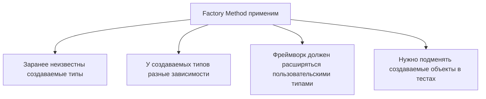

::: warning Текст слайда из PDF
ПРИМЕНИМОСТЬ

 1. Когда заранее неизвестны типы и зависимости объектов, с
    которыми должен работать ваш код.

 2. Когда вы хотите дать возможность пользователям расширять
    части вашего фреймворка или библиотеки.

 3. Когда вы хотите экономить системные ресурсы, повторно
    используя уже созданные объекты, вместо порождения новых.
:::

**Слайд 22: ПРЕИМУЩЕСТВА И НЕДОСТАТКИ**
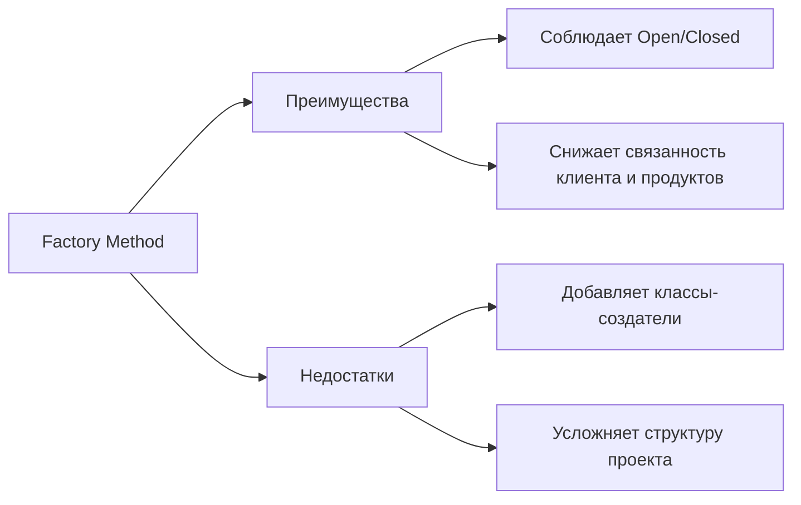

::: warning Текст слайда из PDF
ПРЕИМУЩЕСТВА И НЕДОСТАТКИ

       Избавляет класс от привязки к конкретным классам
       продуктов.
       Выделяет код производства продуктов в одно место,
       упрощая поддержку кода.
       Упрощает добавление новых продуктов в программу.
       Реализует принцип открытости/закрытости.

                               Может привести к созданию больших параллельных
                               иерархий классов, так как для каждого класса продукта
                               надо создать свой подкласс создателя.
:::

Это абстрактная фабрика, фабричный метод и строитель.

### Abstract Factory

#### Abstract Factory: решение и структура

**Слайд 25: РЕШЕНИЕ**
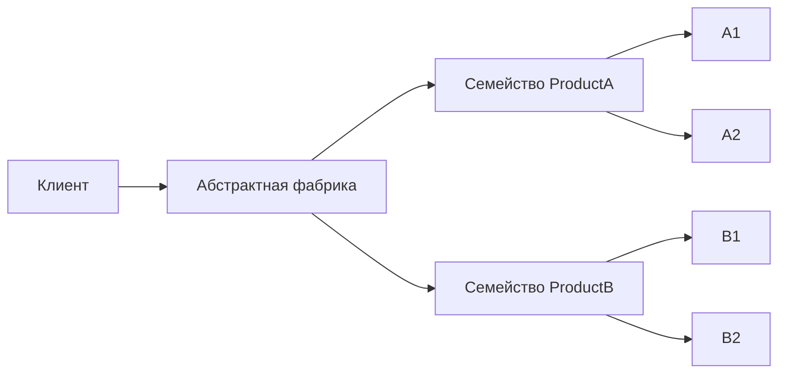

::: warning Текст слайда из PDF
РЕШЕНИЕ
 Все вариации одного и того же объекта
 должны жить в одной иерархии классов.

                                         Конкретные фабрики соответствуют определённой
25
                                                 вариации семейства продуктов.
:::

**Слайд 27: СТРУКТУРА**
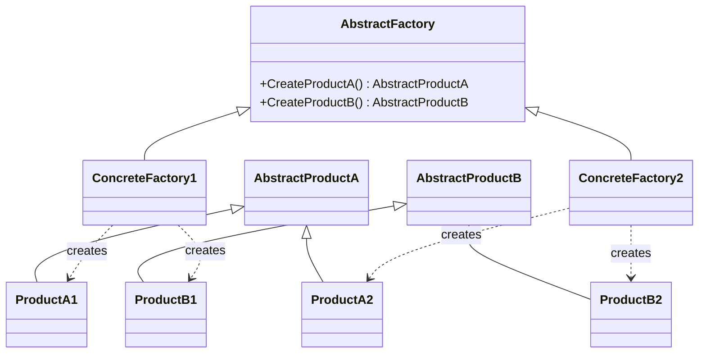

::: warning Текст слайда из PDF
СТРУКТУРА
1. Абстрактные продукты объявляют интерфейсы
продуктов, которые связаны друг с другом по
смыслу, но выполняют разные функции.

2. Конкретные продукты — большой набор классов,
которые относятся к различным абстрактным
продуктам (кресло/столик), но имеют одни и те же
вариации (Викторианский/Модерн).

3. Абстрактная фабрика объявляет методы создания
различных абстрактных продуктов (кресло/столик).

4. Конкретные фабрики относятся каждая к своей
вариации продуктов (Викторианский/Модерн).

5. Несмотря на то, что конкретные фабрики
порождают конкретные продукты, сигнатуры их
методов должны возвращать соответствующие
абстрактные продукты.
:::

**Слайд 28: ФОРМАЛЬНОЕ ОПРЕДЕЛЕНИЕ ПАТТЕРНА**

::: multi-code "Abstract Factory" {playground=off}
```kotlin
abstract class AbstractProductA
abstract class AbstractProductB

class ProductA1 : AbstractProductA()
class ProductA2 : AbstractProductA()
class ProductB1 : AbstractProductB()
class ProductB2 : AbstractProductB()

abstract class AbstractFactory {
    abstract fun createProductA(): AbstractProductA
    abstract fun createProductB(): AbstractProductB
}
```
```csharp
abstract class AbstractProductA
     {}
     abstract class AbstractProductB
     {}

     class ProductA1: AbstractProductA
     {}
     class ProductB1: AbstractProductB
     {}

     class ProductA2: AbstractProductA
     {}
     class ProductB2: AbstractProductB
     {}
```
```java
abstract class AbstractProductA {}
abstract class AbstractProductB {}

class ProductA1 extends AbstractProductA {}
class ProductA2 extends AbstractProductA {}
class ProductB1 extends AbstractProductB {}
class ProductB2 extends AbstractProductB {}

abstract class AbstractFactory {
    public abstract AbstractProductA createProductA();
    public abstract AbstractProductB createProductB();
}
```
```go
type AbstractProductA interface{}
type AbstractProductB interface{}

type ProductA1 struct{}
type ProductA2 struct{}
type ProductB1 struct{}
type ProductB2 struct{}

type AbstractFactory interface {
    CreateProductA() AbstractProductA
    CreateProductB() AbstractProductB
}
```

:::


#### Abstract Factory: кодовая форма

**Слайд 29: abstract class AbstractFactory**

::: multi-code "Abstract Factory" {playground=off}
```kotlin
abstract class AbstractProductA
abstract class AbstractProductB

class ProductA1 : AbstractProductA()
class ProductA2 : AbstractProductA()
class ProductB1 : AbstractProductB()
class ProductB2 : AbstractProductB()

abstract class AbstractFactory {
    abstract fun createProductA(): AbstractProductA
    abstract fun createProductB(): AbstractProductB
}
```
```csharp
abstract class AbstractFactory
     abstract class AbstractProductA     {
     {}                                    public abstract AbstractProductA CreateProductA();
     abstract class AbstractProductB       public abstract AbstractProductB CreateProductB();
     {}                                  }
                                         class ConcreteFactory1: AbstractFactory
     class ProductA1: AbstractProductA   {
     {}                                     public override AbstractProductA CreateProductA()
     class ProductB1: AbstractProductB      {
     {}                                       return new ProductA1();
                                            }
     class ProductA2: AbstractProductA       public override AbstractProductB CreateProductB()
     {}                                      {
     class ProductB2: AbstractProductB         return new ProductB1();
     {}                                      }
                                         }
                                         class ConcreteFactory2: AbstractFactory
                                         {
                                            public override AbstractProductA CreateProductA()
                                            {
                                              return new ProductA2();
                                            }
                                             public override AbstractProductB CreateProductB()
                                             {
                                               return new ProductB2();
                                             }
29                                       }
```
```java
abstract class AbstractProductA {}
abstract class AbstractProductB {}

class ProductA1 extends AbstractProductA {}
class ProductA2 extends AbstractProductA {}
class ProductB1 extends AbstractProductB {}
class ProductB2 extends AbstractProductB {}

abstract class AbstractFactory {
    public abstract AbstractProductA createProductA();
    public abstract AbstractProductB createProductB();
}
```
```go
type AbstractProductA interface{}
type AbstractProductB interface{}

type ProductA1 struct{}
type ProductA2 struct{}
type ProductB1 struct{}
type ProductB2 struct{}

type AbstractFactory interface {
    CreateProductA() AbstractProductA
    CreateProductB() AbstractProductB
}
```

:::

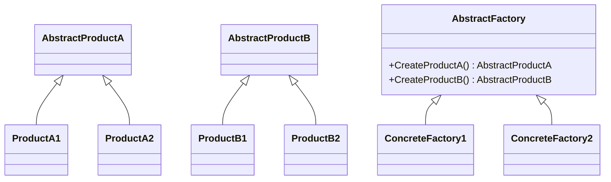

**Слайд 30: abstract class AbstractProductA abstract class AbstractFactory**

::: multi-code "Abstract Factory" {playground=off}
```kotlin
abstract class AbstractProductA
abstract class AbstractProductB

class ProductA1 : AbstractProductA()
class ProductA2 : AbstractProductA()
class ProductB1 : AbstractProductB()
class ProductB2 : AbstractProductB()

abstract class AbstractFactory {
    abstract fun createProductA(): AbstractProductA
    abstract fun createProductB(): AbstractProductB
}
```
```csharp
abstract class AbstractProductA                      abstract class AbstractFactory
     {}                                                   {
     abstract class AbstractProductB                        public abstract AbstractProductA CreateProductA();
     {}                                                     public abstract AbstractProductB CreateProductB();
                                                          }
     class ProductA1: AbstractProductA                    class ConcreteFactory1: AbstractFactory
     {}                                                   {
     class ProductB1: AbstractProductB                       public override AbstractProductA CreateProductA()
     {}                                                      {
                                                               return new ProductA1();
                                                             }
     class ProductA2: AbstractProductA
     {}                                                       public override AbstractProductB CreateProductB()
     class ProductB2: AbstractProductB                        {
     {}                                                         return new ProductB1();
                                                              }
                                                          }
     class Client
     {                                                    class ConcreteFactory2: AbstractFactory
        private AbstractProductA abstractProductA;        {
        private AbstractProductB abstractProductB;           public override AbstractProductA CreateProductA()
                                                             {
         public Client(AbstractFactory factory)                return new ProductA2();
         {                                                   }
           abstractProductB = factory.CreateProductB();
           abstractProductA = factory.CreateProductA();       public override AbstractProductB CreateProductB()
         }                                                    {
                                                                return new ProductB2();
         public void Run() { }                                }
30   }                                                    }
```
```java
abstract class AbstractProductA {}
abstract class AbstractProductB {}

class ProductA1 extends AbstractProductA {}
class ProductA2 extends AbstractProductA {}
class ProductB1 extends AbstractProductB {}
class ProductB2 extends AbstractProductB {}

abstract class AbstractFactory {
    public abstract AbstractProductA createProductA();
    public abstract AbstractProductB createProductB();
}
```
```go
type AbstractProductA interface{}
type AbstractProductB interface{}

type ProductA1 struct{}
type ProductA2 struct{}
type ProductB1 struct{}
type ProductB2 struct{}

type AbstractFactory interface {
    CreateProductA() AbstractProductA
    CreateProductB() AbstractProductB
}
```

:::

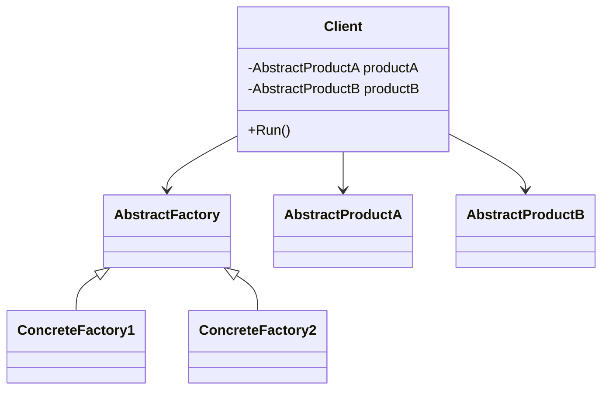

#### Abstract Factory: применимость и оценки

**Слайд 36: ПРИМЕНИМОСТЬ**
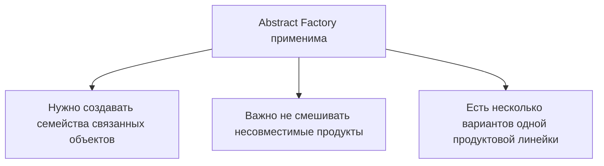

::: warning Текст слайда из PDF
ПРИМЕНИМОСТЬ

• Когда бизнес-логика программы должна работать с разными
  видами связанных друг с другом продуктов, не завися от
  конкретных классов продуктов.

• Когда в программе уже используется Фабричный метод, но
  очередные изменения предполагают введение новых типов
  продуктов.
:::

**Слайд 37: ПРЕИМУЩЕСТВА И НЕДОСТАТКИ**
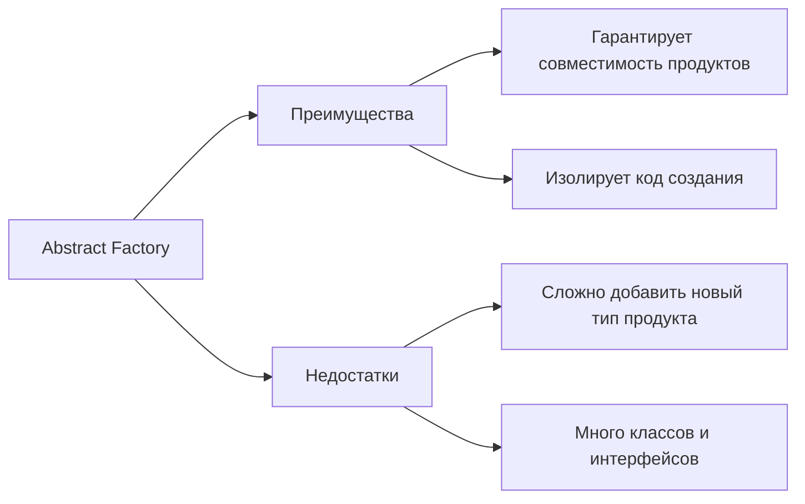

::: warning Текст слайда из PDF
ПРЕИМУЩЕСТВА И НЕДОСТАТКИ
       Гарантирует сочетаемость создаваемых продуктов.
       Избавляет клиентский код от привязки к конкретным
       классам продуктов.
       Выделяет код производства продуктов в одно место,
       упрощая поддержку кода.
       Упрощает добавление новых продуктов в программу.
       Реализует принцип открытости/закрытости.

                               Усложняет код программы.
                               Требует наличия всех типов продуктов
                               в каждой вариации.
:::

Вот это такая, можно сказать, неразрывная группа паттернов, которые порождают... четвертый паттерн просто называемой фабрика и разумеется у них есть некая популярность или частота использования или как бы логическое следование сначала вы начинаете работать с шаблонным методом потом вашей усложняющейся бизнес-логике этого становится мало, и шаблонный метод не справляется, вам нужно порождать не просто какой-то класс, а группу классов, вы начинаете прибегать к абстрактной фабрике. Ну, в общем, они на самом деле действительно очень часто взаимосвязаны друг с другом.

Начнем, наверное, мы с самого простого из них. Это шаблонный метод. Мы с ним даже уже сталкивались на самом деле. Шаблонный метод позволяет нам... Обеспечить принцип открытости-закрытости. И если вспомните наш пример с поваром, который получал свой шаблонный метод сторонний класс, рецепт, и начинал готовить то, что ему прилетало. Это одна из вариаций реализации шаблонного метода.

Переходим к шаблонному методу.

Давайте посмотрим. Помните, я говорил, к паттернам будем стараться относиться как к... знакомству с какой-то проблемой, которая может быть в нашем коде. Представим такую ситуацию, что мы разрабатываем логистическое предприятие по доставке грузов, и изначально наши грузы начинают доставляться исключительно с помощью наземных грузоперевозок. Но со временем наша компания становится все популярнее и популярнее, наши стейкхолдеры, учредители пытаются диверсифицировать свой бизнес и приходят к вам в IT-отдел с желанием, чтобы вы расширили информационную систему, чтобы она позволяла нам доставлять грузы не только с помощью автомобилей, но и с помощью водного транспорта, а потом, может быть, воздушного транспорта, а потом, может быть, и на грузовых полосках.

Поэтому возникает вопрос, что нам делать? Либо в нашем приложении. вставить кучу условных операторов, что если тебе прилетел объект данного класса, то осуществляй грузоперевозку вот таким образом. Если прилетел объект другого класса, то совершенно другим образом. Но с появлением все новых и новых сущностей наше приложение будет постоянно переписываться. То есть мы нарушим для нашего самого... кор, такого ядра информационной системы, мы нарушим принцип открытости-закрытости. Постоянно туда будем вмешиваться. Как быть? Нужно, чтобы нашему приложению было неважно, с каким транспортным средством оно работает.

Таким образом, нам необходимо вырвать создание транспортного средства из самого вот этого центра. и поручить какому-то другому классу. А наше приложение будет просто работать с абстракцией. Ну, собственно, мы попытаемся, опять же, реализовать Dependency Inversal принцип, но с помощью шаблонного решения через абстрактную фабрику. И, к слову, это один из плюсов абстрактной фабрики.

Она позволяет замокать, вы уже знаете, да, что это замокать. доменный объект для того чтобы осуществить юнит тестирования даже если вы не заложили в вашу систему работу с диай контейнером то есть даже если вы не заложили диай контейнер и у вас как бы якобы есть оправдание почему вы не пишите автотесты Да, вы можете сказать, ну, тут DI-контейнера нету, к сожалению, мы не можем замокать объект и юнит тестирования провести не можем, поэтому не пишем. Но вот этот паттерн решает и эту проблему. Даже если в вашем приложении не используется **DI-контейнер**, вы можете применить шаблонный метод и позволить вынести создание объекта из... корни приложения в другой класс.

Ну и, соответственно, потом вы можете создать моковский класс, который будет создавать моковский объект и использовать его.

Давайте посмотрим пример. Какое решение можно предложить нашей проблеме? Мы можем переместить конструктор из одной части программы, вынести его на уровень выше. Ну или перенести его в другой класс, который будет отвечать за создание объекта. И тогда у нас будет несколько таких создателей, которые будут реализовывать один и тот же интерфейс. И у нас будет несколько транспортных средств, которые будут реализовывать один и тот же интерфейс. И в таком случае нашему приложению логистической перевозки грузов будет совершенно без разницы, с каким конкретным типом она работает. То ли это грузовик, то ли это... Катер, то ли это самолет, то ли это гужевая повозка.

Вот сейчас давайте сконцентрируемся на ОМЛ-диаграмме, потом посмотрим шаблонное решение на абстрактных классах, и потом попробуем рассмотреть конкретное решение. Но еще раз, конкретное решение в каждом случае может быть абсолютно практически не похоже друг на друга. Поэтому не удивляйтесь. что у нас на семинарах будет немножко совершенно другой код, что у нас там проект более реалистичный, чем примеры короткие, которые рассматриваем на лекции. И действительно, каждая **реализация** паттерна может быть уникальной.

Значит, в таком каноническом варианте структура данного паттерна выглядит следующим образом. У нас есть тот продукт, которым мы оперируем. Это автомобиль, лодка. Это то, что нам необходимо создавать для нашего приложения. У нас есть интерфейс и несколько реализаций этих продуктов. У нас есть класс, который описывает процесс создания данных конкретных продуктов. Но он, опять же, у нас абстрактный. И у него есть как раз заложенный шаблонный метод «Создать продукт». И необходимое количество конкретных реализаций данной абстракции Конкретный создатель продукта А, конкретный создатель продукта Б. Соответственно, один будет создавать продукт А, другой будет создавать продукт Б.

И клиент, наше логистическое приложение, будет пользоваться конкретным создателем. Ну а каким конкретным создателем, будет как раз определяться где-то в рутовом месте приложения. Либо это будет из конфигурации, возможно, браться, что какой конкретный создатель нужен сейчас для работы. Либо мы будем при необходимости создать определенное количество транспортных средств, будем их создавать с помощью определенного конкретного создателя. Ну а у него будет, соответственно, шаблонный метод, который будет создавать конкретные продукты. абстрактном примере это выглядит достаточно примитивно. Ну, реально несложный паттерн. Смотрите, у нас есть абстрактный класс продукт, ну, или интерфейс, то есть это автомобиль или лодка.

У нас есть, ну, собственно, **реализация** данного продукта. Автомобиль, лодка. Есть абстрактный класс создатель с описанным интерфейсом шаблонного метода. Есть конкретные создатели. которые переопределяют этот шаблонный метод и возвращают соответствующий продукт. Один создатель возвращает реальный продукт А, другой создатель возвращает реальный продукт Б. Вопрос только в том, каким образом клиент, или клиентский код, примет решение создавать объекты одним креатором, либо вторым креатором. Но на конкретном примере мы сейчас попробуем разобрать.

Давайте рассмотрим такой пример.

### Builder

#### Builder: решение, директор и структура

**Слайд 40: РЕШЕНИЕ**
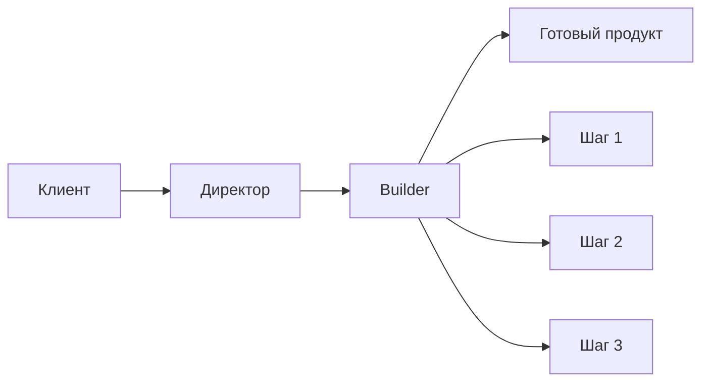

::: warning Текст слайда из PDF
РЕШЕНИЕ
          Создав кучу подклассов
          для всех конфигураций
          объектов

               Конструктор со
               множеством параметров
               имеет свой недостаток

                                         Строитель позволяет создавать сложные
                                       объекты пошагово. Промежуточный результат
                                                всегда остаётся защищён.
:::

**Слайд 42: ДИРЕКТОР**
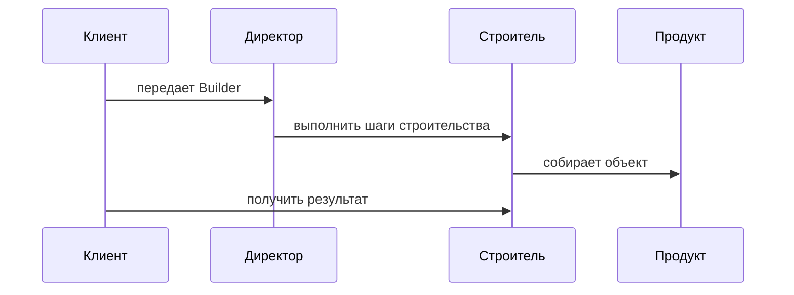

::: warning Текст слайда из PDF
ДИРЕКТОР

Директор знает, какие шаги должен
выполнить объект-строитель, чтобы
произвести продукт.
Такая структура классов полностью
скроет от клиентского кода процесс
конструирования объектов.
Клиенту останется только привязать
желаемого строителя к директору, а
затем получить у строителя готовый
результат.
:::

**Слайд 43: СТРУКТУРА**
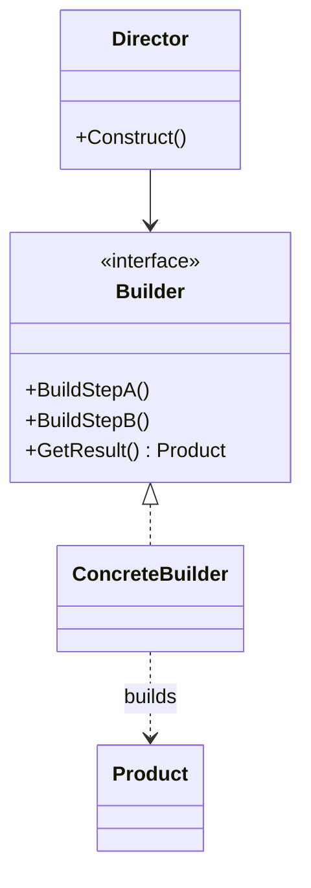

::: warning Текст слайда из PDF
СТРУКТУРА

1. Интерфейс строителя объявляет шаги
конструирования продуктов, общие для всех
видов строителей.
2. Конкретные строители реализуют
строительные шаги, каждый по-своему.
3. Продукт — создаваемый объект. Продукты,
сделанные разными строителями, не обязаны
иметь общий интерфейс.
4. Директор определяет порядок вызова
строительных шагов для производства той или
иной конфигурации продуктов.
5. Клиент подаёт в конструктор директора уже
готовый объект-строитель, и в дальнейшем
данный директор использует только его.
:::

#### Builder: применимость и оценки

**Слайд 52: ПРИМЕНИМОСТЬ**
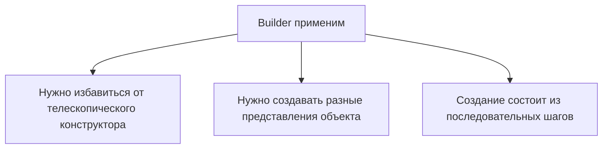

::: warning Текст слайда из PDF
ПРИМЕНИМОСТЬ

• Когда вы хотите избавиться от «телескопического конструктора».
• Когда ваш код должен создавать разные представления какого-то
  объекта. Например, деревянные и железобетонные дома.
:::

**Слайд 53: ПРЕИМУЩЕСТВА И НЕДОСТАТКИ**
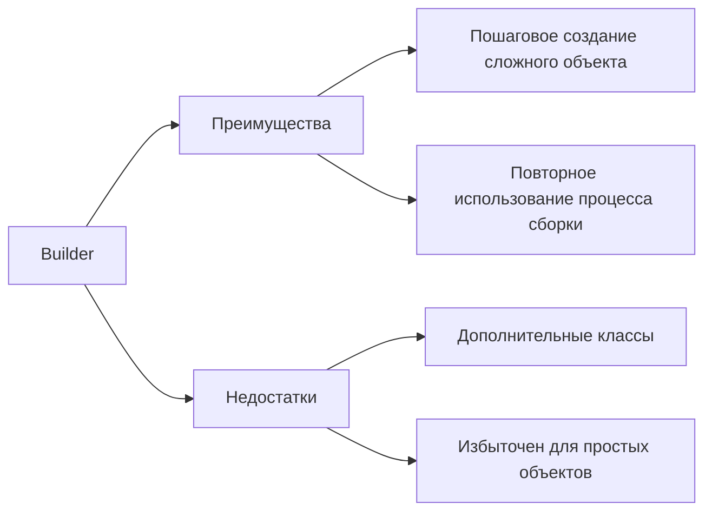

::: warning Текст слайда из PDF
ПРЕИМУЩЕСТВА И НЕДОСТАТКИ

       Позволяет создавать продукты пошагово.
       Позволяет использовать один и тот же код для
       создания различных продуктов.
       Изолирует сложный код сборки продукта от его
       основной бизнес-логики.

                                Усложняет код программы из-за введения
                                дополнительных классов.
                                Клиент будет привязан к конкретным классам
                                строителей, так как в интерфейсе директора
53
                                может не быть метода получения результата.
:::

Сфера строительства. Нам необходимо будет строить дом, но при этом мы будем строить дом либо кирпичный, из камня, либо из дерева. Получается, что у нас два продукта. Каменный дом и деревянный дом. Будет два создателя. Застройщик, который строит каменные дома, и застройщик, который строит деревянные дома. И будет, соответственно, некий абстрактный класс Developer, который будет описывать шаблонный метод.

Давайте посмотрим.

Начнем с... Весь код вы не увидите, но то, что в рамке обозначено красным, будет в центре появляться.

Начнем с этого абстрактного создателя с его шаблонным методом. Это класс Застройщик, который... может возвращать нам в методе Create наш продукт. Абстрактный продукт. Дом. У дома, напомню, две будет реализации. Панельный дом и деревянный дом. Ну, каменный дом и деревянный дом.

Давайте перейдем к нашим конкретным создателям. То есть конкретный застройщик, который делает панельные дома, и конкретный застройщик, который делает деревянные дома. То есть реализуем... Ну или унаследуемся, если это был бы интерфейс, то реализуем данный интерфейс. Следующие вот эти два класса это как раз наши создатели. Один из них переопределяет шаблонный метод и возвращает нам реальный класс панельный дом, а другой переопределяет шаблонный метод и возвращает нам деревянный дом. Ну и следовательно у нас есть абстрактный класс продукта и две реализации. Это абстрактный класс дом и две реализации, которые реализуют все, что заложено в абстрактном классе. В нашем случае просто выводят информацию о себе.

И тут самый важный вопрос, а как этим пользоваться? Где определяется, какой создатель, конкретный создатель будет изготавливать нам продукты? Это клиентский код. Ну, какой-нибудь метод main класса program, который может выглядеть следующим образом. Мы определяем конкретного создателя, ну и все, и дальше этим конкретным создателем начинаем создавать объекты. Но так как объекты являются представителями абстрактного класса, следовательно, клиентский код работает с ними абсолютно одинаковым образом. Мы их можем собрать в коллекцию, можем передать в какой-то метод, который обрабатывает дома, передать коллекцию в UI-интерфейс.

Ну и следовательно, смотрите, если нам действительно необходимо протестить приложение, но мы хотим замокать вот этот дом, мы можем создать еще один креатор, который будет возвращать нам фейковые объекты. И таким образом мы, используя данный паттерн, можем все равно продолжать тестировать наше приложение, даже если в нем не заложен **DI-контейнер**. Применимость. Ну, наверное, один из таких явных. Явная цель, когда вы можете применять, когда вам заранее неизвестны создаваемые типы. Вы не знали, что у вас будет сегодня автомобиль, завтра лодка, а потом, возможно, какие-нибудь авиаперевозки. Еще вы можете не знать, какие зависимости будут у этих типов, которые будут создаваться завтра.

Возможно, у них совершенно другие зависимости, и вы без проблем в очередном креаторе, который появится для вновь создаваемого типа, вы там эти зависимости можете реализовать у него. Второй неявной причина применить... Допустим, вы пишете фреймворк. И хотите, чтобы пользователи вашего фреймверка могли расширить его с помощью своих типов. Но хорошо, допустим, они смогут унаследоваться от вашего продукта и создать свой тип. К примеру, у вас есть какой-то UI-фреймверк, и вы хотите позволить, чтобы пользователь написал свои элементы управления.

Но унаследуется он от вашей... кнопки там base button и сделает my button но фреймверк который вы пишете он не будет использовать вновь созданный объект потому что он ничего о нем не знает но если вы заложили в ваш фреймверк шаблонный метод то у разработчика который хочет расширить ваш фреймверк своими собственными типами у него появляется возможность унаследовать не только продукт, но и унаследовать еще и креатор. А уже ваш фреймверк умеет работать с креатором. И тогда он просто будет подсовывать вновь созданный креатор вашему фреймверку. Креатор будет создавать ранее неизвестные элементы управления. Ну, вот такой достаточно, на самом деле, серьезный путь. Ну, или серьезная причина использовать шаблонный метод.

Ну и еще одна такая скрытая причина, это то, что можно сэкономить ресурсы, потому что сейчас вы вынесли создание объекта из самого объекта, поручили это креатору. И у креатора есть метод create, который отдает объекты. Ну а соответственно, раз это метод, можно туда написать логику, которую вы не можете написать в конструктор, потому что конструктор, он уже создает объект, а вы... В методе create вашего креатора можете сделать условие, что если объект ранее был создан, то отдаю ранее созданный объект. Или если какие-то зависимости, которые были необходимы этому объекту, у меня присутствуют, потому что вы уже их создавали, чтобы внедрить в другие объекты, вам их не придется создавать, просто создадите новый объект, а зависимости внедрите старые.

Такая небольшая экономия ресурсов может быть применена. Плюсы и минусы.

На самом деле минусы у всех паттернов одни и те же. Это код становится сложнее. Или код становится перенагруженным, потому что у вас тут вместо того, чтобы вы создали просто какой-то новый продукт, вы создаете целую иерархию. У вас абстрактный класс продукт, вам необходимо создать абстрактный класс создатель со своим шаблонным методом, реальных каких-то классов создателей.

- Из минусов у всех паттернов это перегружается конструкция вашего приложения.

- Из плюсов, но плюсов на самом деле достаточно.

Ваш клиентский код, который раньше работал с каким-то конкретным продуктом, теперь он в принципе не зависит от этого конкретного продукта. Потому что он работает с некой абстракцией, которую получает с помощью шаблонного метода. работает с ней действительно как с некой абстракцией. А сколько будет у вас конкретных реализаций у данной абстракции, клиентскому коду уже без разницы. Несмотря на то, что усложняется сама кодовая база, кода становится больше, классов становится больше, зато мы получаем отдельное место, где у нас происходит создание объектов. То есть это шаблонный метод, и его гораздо проще проанализировать. Вы понимаете, что создание объекта происходит вот здесь, в шаблонном методе. Наверное, один из самых важных принципов.

Вот таким вот образом мы начинаем соблюдать принцип открытости-закрытости. То есть тот класс, который начинает создавать объекты через шаблонный метод. Вспоминайте, повар, который получал рецепты с помощью как раз свой шаблонный метод и начинал их готовить, потому что рецепты были реализованы не у самого повара, а в тех объектах, которые он получал. И таким образом повар у нас становился, начинал соблюдать принцип открытости-закрытости. Второй паттерн, он на самом деле визуально кажется гораздо сложнее. Это абстрактная фабрика. Используется он гораздо реже и не так часто, как шаблонный метод.

И чаще всего используется, когда уже шаблонного метода вам начинает не хватать, Потому что, представьте ситуацию, пишете игру, и у вас шаблонный метод создавал каких-то разных супергероев. Но когда логика усложняется, и вам действительно нужно повысить абстракцию, у вас супергерой начинает состоять из атаки, метод передвижения, броня, еще чего-то. запрашиваете, вам необходимо создать несколько объектов. Броня, оружие, способ передвижения. И эти объекты разные, разных типов. Но, с одной стороны, они все собраны по какой-то смысловой нагрузке. Потому что если у нас будет эльф, кто-то гном и кто-то еще, это, с одной стороны, группа объектов, которые... Супергерой, да. Супергерой тоже. Еще супергерой.

Но они состоят из совокупных каких-то логических или не то что даже по коду, а просто логически связанных друг с другом типов. И смотрите, уже несколько. А шаблонный метод, он нас возвращал всего лишь на всего один тип. Поэтому вот в абстрактную фабрику уходят как бы... Это уже следующий шаг зависимости, когда вам мало шаблонного метода, вы хотите больше-больше, уходят в сракную фабрику. Но все-таки это примеры менее частые, чем шаблонный метод.

Давайте попробуем рассмотреть такую проблему. Пишите вы интернет-магазин по продаже мебели. И вам действительно необходимо на рекламных... буклетах, на лендинге показывать мебель производства какой-то одной фабрики. Или, как здесь в примере, мебель одного стиля. Классическая, арт-декор, модерн. И вроде бы эти объекты, кресло, диван и столик, это совершенно разные объекты, но они связаны логически по стилю. И вам хочется написать приложение, чтобы клиентов не разочаровывать, которые заказывают сразу кресло, диван и столик, но заказывают они одного типа. Или вам необходимо на экранную форму выводить кресло, диван и столик, но одного типа. Или от одного производителя.

Таким образом, вам необходим действительно некий механизм, который будет уметь создавать... объекты разного типа, но логически связанные между собой какой-то смысловой нагрузкой. Ну, вот как супергерой-эльф. У него лук, что там, кожаная броня, и он умеет прыгать по деревьям. Вот, гном у него молоток. Что, шлем какой-нибудь? Борода. Так, вот. Поэтому какое здесь может быть решение? Ещё раз предупреждаю. вспомогательных классов, у абстрактной фабрики просто тьма. Поэтому не пугайтесь. С одной стороны мы создаем абстракцию, ну давайте для конкретно нашей мебели, абстракцию стул и несколько реализаций для каждого типа. И мы создаем абстрактную фабрику, которая умеет изготавливать эти продукты, связанные между собой.

Продукт А, продукт Б, продукт С, ну или кресло, диван, кровать. И создаем конкретные фабрики, которые как раз создают кресло, диван, кровать, но от одного производителя. Ну или одного стиля разных производителей. И тогда для клиентского кода становится абсолютно неважно, с какой фабрикой ему работать. Потому что он будет говорить, дай мне супергероя, или дай мне кресло, кровать, диван одного типа. Я знаю, что ты это умеешь, у тебя это зашито. То есть нам на клиентском коде нужно лишь определиться, какой конкретной фабрикой мы хотим работать.

Давайте взглянем по такой же логике. Сначала рассмотрим структуру с помощью ML-диаграммы. Потом посмотрим пример абстрактный и пример конкретный. Структура. Из чего она состоит? Нам необходимо объявить абстрактные продукты. Но если вспомните предыдущий пример, это абстрактный продукт А, абстрактный продукт Б. Это может быть абстрактное кресло, абстрактный диван. В дальнейшем нам необходимо уже определиться с конкретными продуктами. Это, возможно, хай-тек кресло, хай-тек диван. Или классическое кресло, классический диван. Все, мы определились с конкретными продуктами.

Теперь нам необходимо определиться... с механизмом, который будет создавать не просто какой-то диван, а если уж его просят, то он будет создавать диван, кресло и кровать, вот все одного типа. Тогда мы описываем интерфейс, либо абстрактный класс, который говорит, что он может создавать вот эти вот продукт А, продукт Б, кресло и диван. Но это абстрактный класс, с которым будет работать клиент. Но все равно клиенту рано или поздно, клиентскому коду, придется подсунуть какую-то конкретную реализацию. Поэтому у нас есть **реализация** этого интерфейса. Вот конкретная фабрика 1, конкретная фабрика 2. Ну и, соответственно, конкретная фабрика 1 изготавливает конкретные продукты А, Б. И конкретная фабрика 2 тоже изготавливает конкретные продукты, но уже другие.

И есть клиентский код. который работает с абстрактной фабрикой. Но опять же, нужно будет ему подсовывать какую-то реальную фабрику, через которую он будет работать. Формальное определение.

Давайте посмотрим.

Начнем с того, что у нас есть абстрактные продукты и какие-то конкретные реализации. Выглядит это может следующим образом. Есть абстрактный продукт А, продукт Б. И **реализация** номер 1, реализация номер 2. все это ушло у нас в левую часть экрана в правой части экрана мы наблюдаем как раз реализацию фабрики у нас есть описание абстрактной фабрики с которой будет работать клиент но каким-то образом Опять же, через внедрение зависимости ему будет подсунута какая-то конкретная фабрика. Если у нас используется DI, то мы можем сказать, что ты работаешь с интерфейсом абстрактной фабрики, но вот конкретно через DI ты получишь реализацию сейчас вот этой фабрики.

Значит, у нас есть абстрактная фабрика и две реализации конкретных. Внутри этих конкретных реализаций методы уже определены, и они возвращают соответствующие объекты. То есть конкретная фабрика А будет уметь возвращать продукт А1 и продукт Б1. То есть кресло классическое, диван классический. А конкретная фабрика 2 будет реализовывать эти методы уже по-своему. То есть возвращать диван модерн и кресло модерн. То есть, еще раз, каждая фабрика знает, как изготавливать свою... коллекцию объектов, которые вообще никак не связаны, но идеологически все же связаны. Еще раз. Вряд ли мы увидим гнома с луком. Все-таки лук связан с эльфами. То же самое мы бы не хотели увидеть среди классической мебели какой-то один элемент из стиля модерн.

А как тогда этим пользоваться? Этим пользоваться будет клиент. И вот здесь в клиентском коде, который появился слева внизу, жестко задано, что будет использоваться через внедрение зависимости через конструктор, конкретному клиенту попадает какая-то фабрика. Ну а какая фабрика, это будет определено где-то на уровень выше, где с помощью DI-контейнера мы будем создавать этот класс под названием клиент. То есть где-то в рутовом месте мы создаем класс клиент через **DI-контейнер**, а DI-контейнер знает, что в эту абстракцию я должен подсунуть реализацию сейчас вот этой конкретной фабрики.

Давайте перейдем и попробуем на примере разобрать. Вот как раз наша игра с супергероями. Нам придется создавать различных супергероев, но эти супергерои состоят из... совокупности объектов. Инструмент атаки, средства передвижения, средства защиты, вид брони. И мы должны получить сущность, и при этом сущность не абы какую. Если уж мы говорим «создай эльфа» с помощью конкретной фабрики по изготовлению эльфов, то в этой фабрике заложено дать этому эльфу лук и способ передвижения вот такой. А если мы будем создавать супергероя через другую фабрику по изготовлению рыцарей, то дать меч и дать ему латы. С чего начнем?

Начнем с того, что опишем...

Давайте еще раз схему покажу, чтобы вспомнить.

Значит, у нас есть... Вот еще раз, минус этого паттерна – это чрезвычайно большое количество создания вспомогательных объектов. Получается, мы создаем вспомогательные объекты, которые описывают абстрактно, из чего будет состоять наш супергерой. Потом мы создадим конкретные реализации. Лук в одном случае и защита кожаная броня. Это продукт B. Здесь будет меч и какие-то рыцарские доспехи. И будет абстрактная фабрика, которая сможет создавать нашего героя, но... описывать лишь процесс на самом деле создания нашего героя, а конкретные фабрики будут описывать уже из каких частей создать этого конкретного героя. Так, давайте перейдем к примеру.

Вверху мы наблюдаем как раз вот эти два вспомогательных абстрактных класса, которые описывают оружие и средства передвижения, средства как он будет двигаться. Больше я не стал лепить. Так, дальше. Если есть две абстракции, Это те продукты, которые мы производить будем с помощью конкретных фабрик. Фабрика по производству эльфов и по производству гномов. Арбалет и меч – это **реализация** для двух разных коллекций нашего абстрактного продукта оружия. И дальше средства передвижения. Летает и бегает. Это реализация нашего второго абстрактного продукта в двух вариациях.

Дальше нам потребуется описать абстрактную фабрику, которая умеет изготавливать конкретного, полноценного супергероя. Абстрактная фабрика будет понимать, что она должна создать и средства передвижения, и средства оружия. И потом две реализации. Справа мы видим описание абстрактной фабрики. которая возвращает нам два наших абстрактных продукта, но уже конкретные реализации. Вот здесь полностью написано «фабрика по изготовлению эльфов», и я свернул фабрику по изготовлению героя с мечом. И вопрос возникает, кто будет здесь клиентом. Как я и говорил, вариации, кто клиент, всё будет зависеть от контекста, от конкретной проблемы.

Если... в абстрактном примере клиентским кодом являлась какой-то метод main, в котором мы решили создавать конкретные продукты, то здесь немножко необычно.

Здесь клиентом будет сам герой, и он будет принимать в конструктор себя, фабрику, и в зависимости от того, какую фабрику он внутрь конструктора себя примет, вот с помощью этой фабрики он себя и создаст. поэтому здесь видите такое немножко нестандартное использование фабрики вот тут клиента будет являться сам герой то есть мы фабрику кидаем в героя и он как бы создается на этой фабрике в конструктор мы передаем эту зависимость опять же мы героя можем сказать что создавайся через диай контейнер а диай контейнер прокинет в эту абстракцию необходимую реализацию И здесь уже с помощью этой реализации он получает механизм передвижения, механизм атаки.

Ну и его методы реализуют, соответственно, те механизмы передвижения и те механизмы атаки, которые он получил от конкретной фабрики. Так, ну и уже клиентский код где-то в методе main будет выглядеть таким образом. Мы создаем эльфа, но здесь мы руками передаем... реализацию фабрики но если бы использовали диай контейнер то мы бы создавали эльфа через диай контейнер но в диай контейнер бы говорил что вот в этом модуле данную абстракцию реализует вот этот интерфейс то есть ключевой минус этого паттерна вот как раз та проблема которую вы озвучили что у нового героя даже если у него нет атаки он обязан это имплементировать. То есть он обязан унаследоваться от базового класса, где эта атака была.

И получается, что действительно это большая-большая проблема, что абстрактная фабрика может изготавливать... Если у какого-то героя заложено три характеристики, то и у всех других героев должны быть заложены по три характеристики. Если у вас в какой-то коллекции мебели не хватает дивана, то здесь будут большие сложности или какие-то костыли от классической реализации. Так, ну а из плюсов, давайте сначала применимость посмотрим.

Когда бизнес-логика настолько усложняется, что уже шаблонный метод, который вы использовали ранее по созданию лодки, самолета для перевозки грузов, уже шаблонный метод не справляется, потому что необходимо отдавать не просто... а необходимо отдавать лодку и капитана для этой лодки, и еще какие-то наборы документов по грузосопровождению, тогда уже действительно стоит задуматься о том, чтобы ваш шаблонный метод повзрослел и стал абстрактной фабрикой. То есть в связи с усложнением бизнес-логики. Ну и вот второй тезис, что действительно у вас уже есть фабричный метод, но... Предполагается, что фабричный метод изготавливает один продукт. У вас уже нужно изготовить совокупность продуктов. Поэтому шаблонный метод может не справиться с возложенными задачами.

Но и отсюда плюсы и минусы. С минусами код слишком усложняется. И код прямо будет расти очень масштабно с появлением каждого продукта. Будет появляться новый вот этот вот... новый конкретный создатель по созданию этих конкретных коллекций вашего продукта. Но, опять же, принцип открытости-закрытости данный паттерн позволяет соблюсти, что очень важно. **Builder**. Вот Builder – это как раз тот пример, когда его вообще уже, по-моему, никто не пишет, потому что он во многих фреймверках присутствует. И мы с ним столкнемся, когда перейдем на клиент-серверную разработку и будем создавать серверную часть нашего приложения. Мы там с помощью билдера будем конструировать наш объект. В чем проблема? Проблема в том, почему появился билдер.

Представьте, вам необходимо создать UI-ное приложение. При этом кому-то потребуется... подключить новые шрифты, подключить библиотеку по использованию определенных элементов управления. Кому-то нужно подключить логирование в системе, а кому-то не нужно. И нам тогда либо идти по пути создания кучи конструкторов, что в районе 20 конструкторов, потому что наше приложение может характеризоваться... 20 параметрами. Кому-то нужно 19, кому-то нужно 5, кому-то 7, кому-то все 20. И тогда будет 20 конструкторов, это безумие. Либо делать через **наследование**, это еще худшее безумие. А если мы создадим механизм, который скажет, сделай это, это, вот это, потом еще вот это, вот это и вот это, давай создай теперь объект.

А в другом месте мы скажем только первое и второе. Нужно при инициализации учесть. Давай создавай. В целом мы можем даже так сказать. Вот здесь создаем объект, а где-то в другом месте добавляем в него еще какие-то характеристики. И это явно вы не сможете сделать через конструктор. **Builder** – это паттерн, который вот эту вещь позволяет сделать.

Значит, идея. Он позволяет нам создать сложные объекты пошагово. То есть мы можем сказать, вот создавая строитель, Можно сказать, какие шаги необходимо. Нет, какие шаги в принципе можно сделать, создавая этот объект. Не обязательно, что они все будут сделаны клиентским кодом. Потому что, как я и сказал, кому-то потребуется создать объект с такими проинициализированными полями, а кому-то создать объект... Вообще не нужно ничего инициализировать. Когда объект настолько сложный, что процесс его создания для... даже в одном приложении может отличаться в разных местах. Вот, к примеру, пишем приложение, которое будет строить дом.

Но дом, хотя он и состоит из стен и крыш, возможно, кому-то потребуется дом с гаражом, кому-то дом с статуями, кому-то с бассейном, кому-то с деревьями. Что мы можем? Мы можем сделать базовый класс «Дом» и начинать наследоваться. Но мы помним, что это плохо. Тогда мы как бы сразу себя бьём по голове, говорим, нет, наследования мы не будем идти в эту историю. Тогда мы делаем один класс дом и кучу параметров. Но вы же понимаете, что когда-то появится заказчик и скажет, блин, а я ещё буду продавать дом с чем? Вам придется опять переписывать классы. То есть вы нарушаете принцип открытости-закрытости. И вы явно что-то там сломаете, меняя этот класс. Да и в принципе вы не сможете предугадать. Ладно, если дом.

А если, смотрите, создание дома зависит не от того, что там заказчик хотел, а от какой-то сценария текущего процесса. Ну, покупатель. проставляет там чекбоксы. И в зависимости от того, какие чекбоксы он проставил, такой дом необходимо, такой объект необходимо создать. С такими полями, да, он поставил статуи, поставил лес. А у вас нет такого. Вот он хочет и то, и другое. А у вас только либо статуи, либо лес. А если вы пошли в конструкторы, да вы всех комбинаций просто не сможете учесть. Комбинаторику лучше меня знаете. Поэтому... Безумие и первый вариант, и второй вариант это просто путь в никуда. Решение это создать класс строитель, который будет учитывать в принципе все возможные составляющие данного объекта.

А уже в зависимости от того, как вам по сценарию нужно будет составлять, то есть сам программист будет решать в клиентском коде, создавая ваш объект, он будет говорить, мне нужно в этот объект вот это, вот это и вот это. Но мы понимаем, что у нас дом может быть разный. И прелесть этого паттерна, что мы можем создать несколько разных билдеров, которые будут создавать разные дома.

И в целом, хоть и еще сейчас одна такая... надстройка над билдером она не относится к билдеру но очень часто с билдером используется это класс директор потому что все таки часто бывает так что вы знаете какие шаги необходимо сделать как минимум в стандартном варианте чтобы получить дом и поэтому помимо билдера рядышком с ним ходит еще один класс это директор которому мы отдаем конкретного строителя ну а этот Прораб, этот директор, он знает, как заставить работать этого строителя. То есть сказать, выполняй вот это, это и вот это действие. Можно сказать, что прораб, директор, это такая пресейв, предварительная сохраненная последовательность действий. Мы можем это просто написать в коде, а можем это сохранить в директоре.

А потом просто сказать, директор, создай мне дом. Структура данного класса выглядит следующим образом.

У нас есть первое. интерфейс этого строителя там описаны все возможные методы которые нам можно использовать но не обязательно захотим создать дом только из стен будем создавать только из стен дальше у нас есть конкретные строители их опять же не обязательно может быть много он может быть один но чаще бывает так что действительно когда сталкиваешься с задачей понимаешь что создаваемые объекты ну допустим там для разных платформ могут разную логику использовать поэтому очень часто все-таки конкретных строителей несколько и конкретные строители отдают конкретные продукты а директор это тот кто управляет получает с клиентского кода Мы говорим, директор, с помощью вот этого строителя создай объект класса дом.

То есть директор – это такой вспомогательный класс, который манипулирует строителями.

Давайте по традиции шаблонное решение и потом конкретный пример. Шаблонное решение. У нас есть продукт, но здесь, может быть, не совсем красиво. Я сокращал. То есть вот здесь набор частей. Это просто коллекция неких объектов. Но, по сути, если говорить про дом, то там могут быть деталь 1, деталь 2, деталь 3. Класс-продукт, который состоит из нескольких частей. Есть метатет, который добавляет очередную часть. И кому-то, возможно, понадобятся две части, кому-то все четыре, все пять частей. Мы этого не знаем. Это будет определять клиент, который будет, собственно, говорить директору. Директоров тоже может быть несколько. Один директор создает полноценный дом, а другой директор создает минималистический дом.

Значит, наш билдер позволяет создать всевозможные части. А, Б и С. Не факт, что все мы будем использовать. И конкретный билдер, который внутри себя создает этот конкретный продукт и начинает накидывать туда конкретные части. Соответственно, этих... Конкретных билдеров может быть несколько, но в этом примере он один. Как этим всем пользоваться? Можно пользоваться прямо в клиентском коде. Но многие накручивают еще сверху директора. Директор принимает в конструктор какой-то конкретного строителя. В нашем случае у нас один строитель. И в нем прописаны шаги, которые умеет делать этот директор. То есть еще раз, директор это просто... предварительно сохраненка какая-то, которая по результату своей работы отдаст нам определенный продукт.

И этих директоров может быть несколько. Если мы не хотим мучить программиста, который будет пользоваться нашим билдером, мы можем ему сказать, слушай, вот я сделал тебе трех директоров, каждый возвращает вот разный тип объектов. Вряд ли тебе понадобится какой-то четвертый вариант. Вот тебе три директора, пользуйся каким тебе необходимо. Ну и как он может воспользоваться? В клиентском коде он может создать билдера, создать директора и передать директору определенный билдер. Ну и дальше все, директора вызываем, говорим создавай, а у директора уже заложен алгоритм, какие методы билдера он будет дергать. Вообще вся идея всех порождающих паттернов это как бы сместить точку создания объекта из самого объекта куда-то вовне.

Где-то за это отвечает шаблонный метод, где-то конкретная фабрика, где-то билдер отвечает за инициализацию объекта. Поэтому тут суть всех паттернов, в принципе, избавиться от создания объекта внутри объекта и просто делегировать это куда-то вовне. Ну а как только мы делегируем это вовне, у нас появляются инструменты манипулирования.

Давайте попробуем пример конкретный просмотреть.

Значит, мы будем готовить хлеб. Хлеб бывает разный. Ржаной, он там будет без добавок. Не знаю, хлеб первого сорта, там будет хорошая мука, и будут дрожжи, и будут какие-то разрыхлители.

Значит, наш хлеб будет состоять из вот этих частей, мука, соль и пищевые добавки. То есть, возможно, это те части, которые, возможно, не попадут в конструктор. То есть, смотрите, тогда бы нам пришлось создать один класс хлеб и куча конструкторов. Один бы принимал все, соль, муку и добавки пищевые, другой бы только соль и муку, и был бы ржаной какой-то хлеб. И вот количество этих конструкторов было бы чрезмерно большое. Мы же делаем вот эти части и описываем хлеб. При этом здесь у него нет конструктора ни с какими параметрами, потому что инициализировать данный хлеб будет строитель.

Теперь рассмотрим строителя. Абстрактный класс строитель у нас наверху. Он будет изготавливать хлеб. Он имеет следующие шаги. Создать экземпляр этого хлеба. И потом какие-то методы, которые возможно в данный экземпляр добавят соль, муку, а возможно не добавят соли, муку. В зависимости от того, как будет работать клиентский код. Это директор получается, потому что ему приводят конкретного строителя. И он знает, что... С этого строителя необходимо выжать следующие шаги. Создай заготовку, добавь туда муку, добавь туда соль, добавь ингредиенты и верни мне хлеб. То есть этот получается пекарь, это директор, который делает хлеб, но не ржаной, а обычный.

Собственно, это директор, который получает конкретного строителя, и теперь нам нужны конкретные строители, потому что каждый строитель... Возможно, где-то будет пересоленый хлеб, кто-то будет делать, не знаю, хлеб не на воде, а на молоке. То есть у нас теперь нужны конкретные строители, которые будут поступать вот сюда к директору. Вот конкретный строитель, допустим, ржаного хлеба. Он просто не использует никаких добавок. Он не добавляет в хлеб, не инициализирует его поле. Ну или параметр не добавляет. Как этим пользоваться? Создаем. Пекаря конкретного строителя и пекарю кидаем этого строителя. Ну, директору кидаем строителя. И говорим, пеки, и получаем хлеб.

Можем кинуть другого конкретного строителя, нашему директору, и он будет изготавливать другой хлеб. Ладно, уже плюсы и минусы посмотрите дома. Просто хотя бы проговорим.

### Prototype

#### Prototype: решение, пример и структура

**Слайд 56: РЕШЕНИЕ**
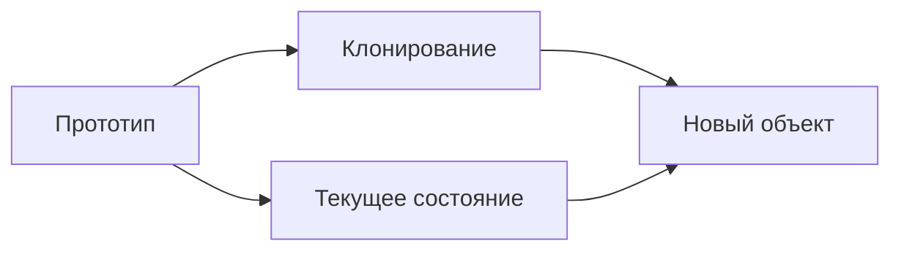

::: warning Текст слайда из PDF
РЕШЕНИЕ

                                     Предварительно заготовленные прототипы
                                          могут стать заменой подклассам.

     Копирование «извне» не всегда
        возможно в реальности.
:::

**Слайд 57: ПРИМЕР ДЕЛЕНИЯ КЛЕТКИ.**
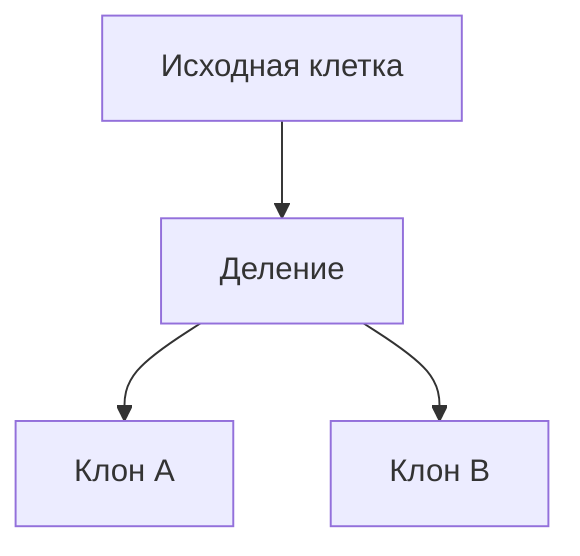

::: warning Текст слайда из PDF
ПРИМЕР ДЕЛЕНИЯ КЛЕТКИ.

После митозного деления клеток
образуются две совершенно
идентичные клетки.
Оригинальная клетка отыгрывает роль
прототипа, принимая активное участие в
создании нового объекта.
:::

**Слайд 58: СТРУКТУРА**
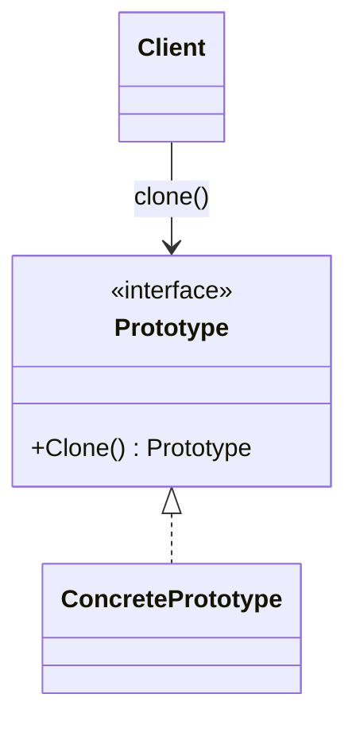

::: warning Текст слайда из PDF
СТРУКТУРА

1. Интерфейс прототипов описывает
операции клонирования.
2. Конкретный прототип реализует
операцию клонирования самого себя.
Помимо банального копирования
значений всех полей, здесь могут быть
спрятаны различные сложности, о
которых не нужно знать клиенту.
3. Клиент создаёт копию объекта,
обращаясь к нему через общий
интерфейс прототипов.
:::

#### Prototype: оценки, применимость и Singleton

**Слайд 60: ПРЕИМУЩЕСТВА И НЕДОСТАТКИ**
```mermaid
flowchart LR
    Prototype[Prototype] --> Pros[Преимущества]
    Prototype --> Cons[Недостатки]
    Pros --> Faster[Можно ускорить создание объектов]
    Pros --> Runtime[Можно копировать состояние runtime-объекта]
    Cons --> DeepCopy[Сложность глубокого копирования]
    Cons --> Cycles[Проблемы с циклическими ссылками]
```

::: warning Текст слайда из PDF
ПРЕИМУЩЕСТВА И НЕДОСТАТКИ

       Позволяет клонировать объекты, не привязываясь к их
       конкретным классам.
       Меньше повторяющегося кода инициализации объектов.
       Ускоряет создание объектов.
       Альтернатива созданию подклассов для конструирования
       сложных объектов.

                               Сложно клонировать составные объекты,
                               имеющие ссылки на другие объекты.
:::

**Слайд 61: ПРИМЕНИМОСТЬ**
```mermaid
flowchart TD
    Use[Prototype применим] --> Expensive[Создание объекта дорогое]
    Use --> Similar[Нужны похожие объекты с разным состоянием]
    Use --> UnknownClass[Код не должен зависеть от конкретного класса]
```

::: warning Текст слайда из PDF
ПРИМЕНИМОСТЬ

• Когда ваш код не должен зависеть от классов копируемых
  объектов.
• Когда вы имеете уйму подклассов, которые отличаются
  начальными значениями полей. Кто-то мог создать все эти классы,
  чтобы иметь возможность легко порождать объекты с
  определённой конфигурацией.
:::

Прототип и синглтон. Прототип – это паттерн, который позволяет нам получить клон объекта. Ну, мы знаем, что если мы будем просто создавать две переменные на ссылочный тип данных, то эти две переменные будут ссылаться на один объект. А иногда нам, допустим, необходимо создать экранную форму, в которую передать объект для редактирования. А потом, возможно, человек нажмет cancel, а объект у нас уже изменился, а исходного состояния нет. Поэтому разумно передавать туда клон объекта, прототип. который соответствует реальному, но все-таки лежит в другой области памяти. И если мы на редактируемой форме нажимаем Cancel, то мы просто про этот созданный прототип забываем, а реальный остается неизменным.

Поэтому иногда возникает необходимость создавать действительно клоны объектов. Прототип — это тот паттерн, который во многих языках, по-моему, частично реализован. Потому что клонировать значимые типы — это легко, а клонировать ссылочные типы — нелегко. Потому что мы не знаем, до какого колена необходимо клонировать ссылочные типы. Возможно, у вас объект содержит коллекцию других объектов, а тот, в свою очередь, содержит... Каждый из них содержит другой объект. И вот эта вложенность может быть слишком большой.

Поэтому можно создавать самостоятельно, а можно посмотреть в интернете реализацию какого-нибудь клон-хелпера, который рефлексивно анализирует ваш класс, смотрит, что этот ссылочный объект содержит другую ссылку на другой объект, и он тоже ссылочный, и рефлексивно обходит, рекурсивно обходит все вложенности вашего... объектов и создает их клон. Вот, но еще раз, это различные варианты реализации прототипа. В самом простом случае прототип может выглядеть таким образом, что мы просто выделяем память для нового объекта и туда переносим все поля. В Python есть метод копии. В Java, в .NET тоже есть методы, которые уже реализуют данный паттерн. Важно здесь, давайте плюс подчеркнем.

Главный плюс прототипа, В том, что он может сэкономить ресурсное время на создание объекта. Потому что иногда создаваемый объект тащит очень серьезные зависимости. А если вы не создаете его заново, а создаете за счет прототипа, то у вас есть возможность ранее созданные зависимости просто притянуть в этот создаваемый прототип. Поэтому действительно ускоряет создание объекта и частенько используется. Но если ваш прототип имеет большую вложенность в ссылочных объектов, то такой прототип достаточно сложно создать. И код, который будет создавать такой прототип, очень сложный. Он будет, скорее всего, рефлексивный, который будет обходить.

То есть вы будете брать объект. говорить, какие у тебя есть поля, get all properties, заходить в каждое поле и рекурсивно опять спрашивать. А ты ссылочный тип, какие у тебя есть поля, заходить туда и опять спрашивать. И когда-то уже потом начать создавать копию. Так, ну и последнее.

### Singleton

**Слайд 64: СТРУКТУРА**
```mermaid
classDiagram
    class Singleton {
        -static instance
        -Singleton()
        +GetInstance() Singleton
    }
    Singleton --> Singleton : returns same instance
```

::: warning Текст слайда из PDF
СТРУКТУРА

1. Одиночка определяет статический
метод getInstance, который возвращает
единственный экземпляр своего класса.

Конструктор одиночки должен быть
скрыт от клиентов. Вызов метода
getInstance должен стать единственным
способом получить объект этого класса.
.
:::

Синглтон. Синглтон тот паттерн, который сейчас редко где используется. Но опять же, если вообще как бы... Он хотел сделать мир лучше, этот паттерн. Не получилось у него, но зато он дал жизнь другим инструментам. Сейчас не используют **Singleton**, сейчас используют **DI-контейнер**, который контролирует время жизни объекта. Вы можете сказать, что DI-контейнер, этот объект у тебя должен быть в Singleton формате лежать. И в принципе DI-контейнер появился после того, как книжку издали. И DI-контейнер не описан в паттернах GOV, потому что его тогда не было. Но был синглтон. Хорошо ли это или плохо? Плохо. Это однозначно плохо. Хуже синглтона только, наверное, глобальная переменная в языке C++. Реализация примитивна.

У вас есть класс, у которого заблокирован конструктор. То есть вы не можете создать экземпляр через конструктор. Но у вас есть статичный метод, который позволяет проинстанцировать статичное поле. Если он уже проинстанцировал его раньше, то на второй запрос клиентского кода он отдает ранее созданный объект. Вообще про паттерн есть целая книжка. Про один только паттерн. Потому что вариация создания этого синглтона – тьма. Вот эта конструкция ломается на раз с помощью рефлексии. Вы можете рефлексивно спросить у типа, какие у него есть методы, и знаете, что рефлексивно вы можете вызвать и приватный метод.

Поэтому вот этот конструктор, конечно, можно через рефлексию вызвать, и вот этот паттерн можно обойти с помощью рефлексивного кода, создать сколько угодно экземпляров. Второй минус – это просто смерть над... вашим многопоточным программированием. Потому что вот вы видите сейчас, вы будете в курсе операционных систем изучать Mutex и другие возможные блокировки потоков, но вот здесь не используются никакие блокировки. И кажется, что все должно быть предельно понятно. Мы имеем компьютер с операционной системой, при этом операционная система это **Singleton**. Получается, что если мы будем создавать один компьютер, второй компьютер, то тот, кто создастся первым, якобы и определит синглтоновский объект.

Но на самом деле код непредсказуемый, если я использую многопоточку. Смотрите, я в одном потоке создаю компьютер номер 2, он инстанцирует Windows 10. Запускаю поток. В основном потоке я создаю компьютер с операционной системой Windows 8. Что у меня будет создано? Вообще непонятно и неизвестно. Если так задуматься, если у нас, допустим, все-таки одноядерный компьютер, то, вероятно, всего будет создан... Да нет, предсказать сложно, потому что, смотрите, допустим, повезет, давайте, два ядра. Одно ядро очень занято, и вот этому треду повезло, его отправили на второе ядро. Создание треда – это очень долгая операция, примерно, по-моему, сотня миллисекунд.

Тогда он будет только на создание треда тратить время, при этом по основному потоку повезет, ядро освободится, и он начнет выполнять эту задачу. Тогда он успеет проинстанцировать. Объекты и операционная система будет 8.1. А этот зайдет в GetInstance чуть позже. И ему скажут, оно уже проинстанцировано. На, возьми 8.1. Никакую десятку я инстанцировать не буду. Но опять же, а может быть так, что данный поток выбросится с ядра, и этот тренд будет выполняться. Тогда он проинстанцирует Windows 10.

А возможно такое, что они одновременно... попадут в условный оператор, и пока один тред будет инстанцировать операционную систему, еще не изменит состояние instance, оно будет null, второй тред тоже сюда зайдет и тоже будет инстанцировать, и тогда будет и 8, и 10. Это достаточно редкое явление, нужно ухитриться, раз 50 запустить данное приложение, чтобы два потока успели пройти вот эту ловушку. Но чтобы этого не было, в курсе операционных систем вы будете проходить... Mutex, семафоры, мониторы. В .NET это у нас оператор lock, по-моему. Он может заблокировать и не пускать второй поток. Ни в коем случае пока первый не пропустит этот код.

### Итоги

Источники вам скинул в чате. Все, на этом все, ребят. Спасибо, до практики.
