# Лекция 5. Поведенческие паттерны проектирования

Значит, сегодня мы с вами начинаем вторую группу паттернов. Они будут относиться к поведению между, ну, описанию поведения между объектами.

## Поведенческие паттерны

#### Обзор поведенческих паттернов и Strategy

**Слайд 3: ВИДЫ ПАТТЕРНОВ**
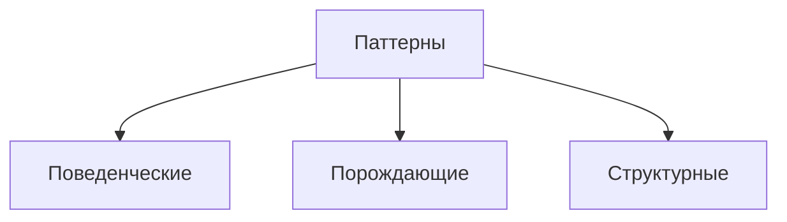

::: warning Текст слайда из PDF
ВИДЫ ПАТТЕРНОВ

• Поведенческие паттерны заботятся об
  эффективной коммуникации между
  объектами.

• Порождающие паттерны беспокоятся о гибком создании объектов без
  внесения в программу лишних зависимостей.

• Структурные паттерны показывают различные способы построения
  связей между объектами.
:::

**Слайд 10: РЕШЕНИЕ**
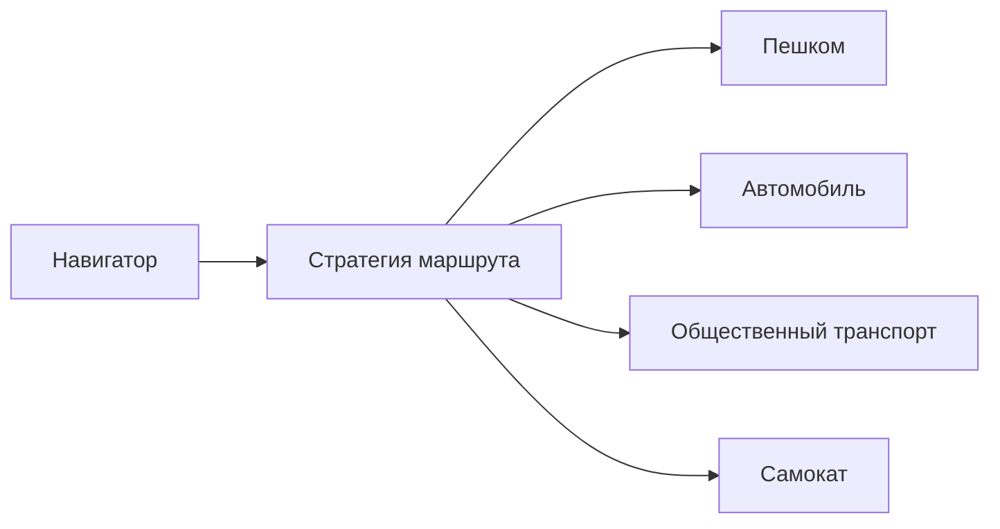

::: warning Текст слайда из PDF
РЕШЕНИЕ

Вместо того, чтобы изначальный класс сам
выполнял тот или иной алгоритм, он будет
играть роль контекста, ссылаясь на одну из   Стратегии построения пути.
стратегий и делегируя ей выполнение
работы.

Чтобы сменить алгоритм, вам будет
достаточно подставить в контекст другой
объект-стратегию.
:::

**Слайд 17: ПРЕИМУЩЕСТВА И НЕДОСТАТКИ**
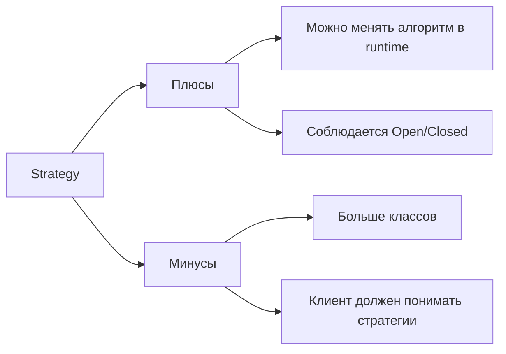

::: warning Текст слайда из PDF
ПРЕИМУЩЕСТВА И НЕДОСТАТКИ

       Горячая замена алгоритмов на лету.
       Изолирует код и данные алгоритмов от остальных классов.
       Уход от наследования к делегированию.
       Реализует принцип открытости/закрытости.

                               Усложняет программу за счёт дополнительных классов.
                               Клиент должен знать, в чём состоит разница между
                               стратегиями, чтобы выбрать подходящую.
:::

#### State: решение и оценки

**Слайд 21: РЕШЕНИЕ**
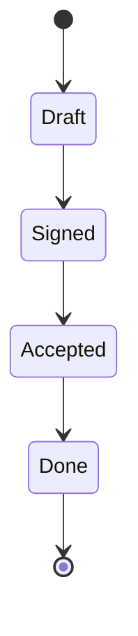

::: warning Текст слайда из PDF
РЕШЕНИЕ

                                         Вместо того, чтобы хранить код всех
                                         состояний, первоначальный объект,
                                         называемый контекстом, будет
                                         содержать ссылку на один из объектов-
                                         состояний и делегировать ему работу,
                                         зависящую от состояния.

     Документ делегирует работу своему
       активному объекту-состоянию.
:::

**Слайд 32: ПРЕИМУЩЕСТВА И НЕДОСТАТКИ**
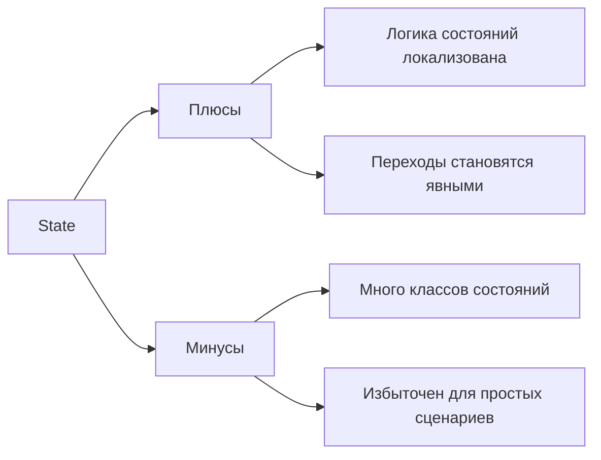

::: warning Текст слайда из PDF
ПРЕИМУЩЕСТВА И НЕДОСТАТКИ

        Избавляет от множества больших условных
        операторов
        Концентрирует в одном месте код, связанный
        с определённым состоянием.
        Упрощает код контекста.

                           Может неоправданно усложнить код, если
                           состояний мало и они редко меняются.
:::

#### Template Method: решение и пример

**Слайд 36: РЕШЕНИЕ**
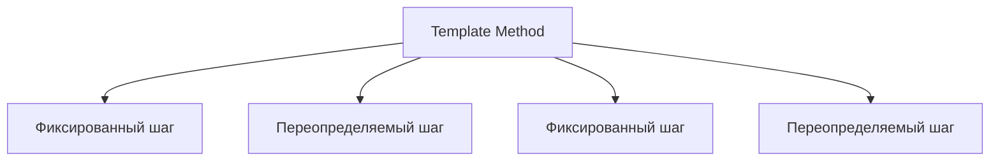

::: warning Текст слайда из PDF
РЕШЕНИЕ
                                                            Мы можем создать общий базовый класс
                                                            для всех трёх алгоритмов. Этот класс
                                                            будет состоять из шаблонного метода,
                                                            который последовательно вызывает
                                                            шаги разбора документов.

                                                            Для начала шаги шаблонного метода
                                                            можно сделать абстрактными.

                                                            В последующем мы можем определить
                                                            общее для всех классов поведение и
                                                            вынести его в суперкласс.

     Шаблонный метод разбивает алгоритм на шаги, позволяя
         подклассам переопределить некоторые из них.
:::

**Слайд 40: РАССМОТРИМ НА ПРИМЕРЕ**

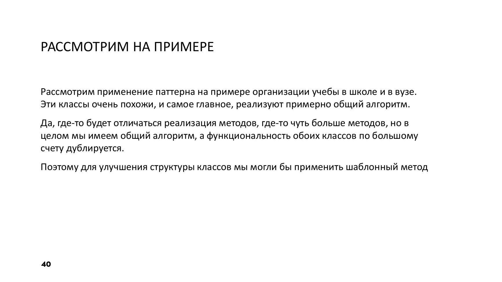

**Слайд 45: ПРЕИМУЩЕСТВА И НЕДОСТАТКИ**
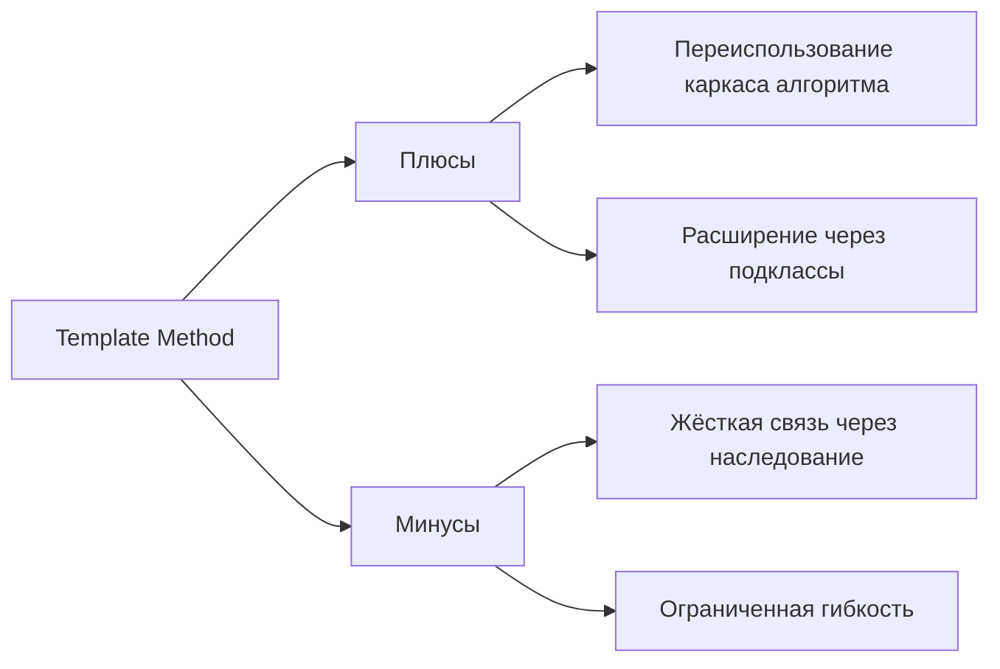

::: warning Текст слайда из PDF
ПРЕИМУЩЕСТВА И НЕДОСТАТКИ

       Облегчает повторное использование кода.

                         Вы жёстко ограничены скелетом
                         существующего алгоритма.
                         Вы можете нарушить принцип подстановки
                         Лисков, изменяя базовое поведение одного
                         из шагов алгоритма через подкласс.
                         С ростом количества шагов шаблонный метод
                         становится слишком сложно поддерживать.
:::

#### Observer: подписка и оценки

**Слайд 49: РЕШЕНИЕ**
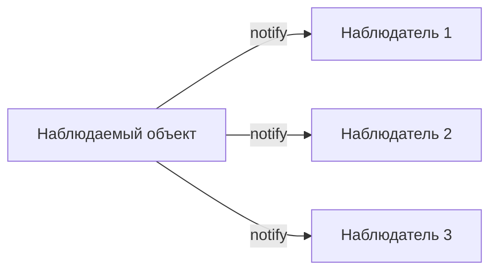

::: warning Текст слайда из PDF
РЕШЕНИЕ

             Подписка на события.

Когда в издателе будет происходить важное
событие, он будет проходиться по списку
подписчиков и оповещать их об этом, вызывая
определённый метод объектов-подписчиков.

49                                            Оповещения о событиях.
:::

**Слайд 59: ПРЕИМУЩЕСТВА И НЕДОСТАТКИ**
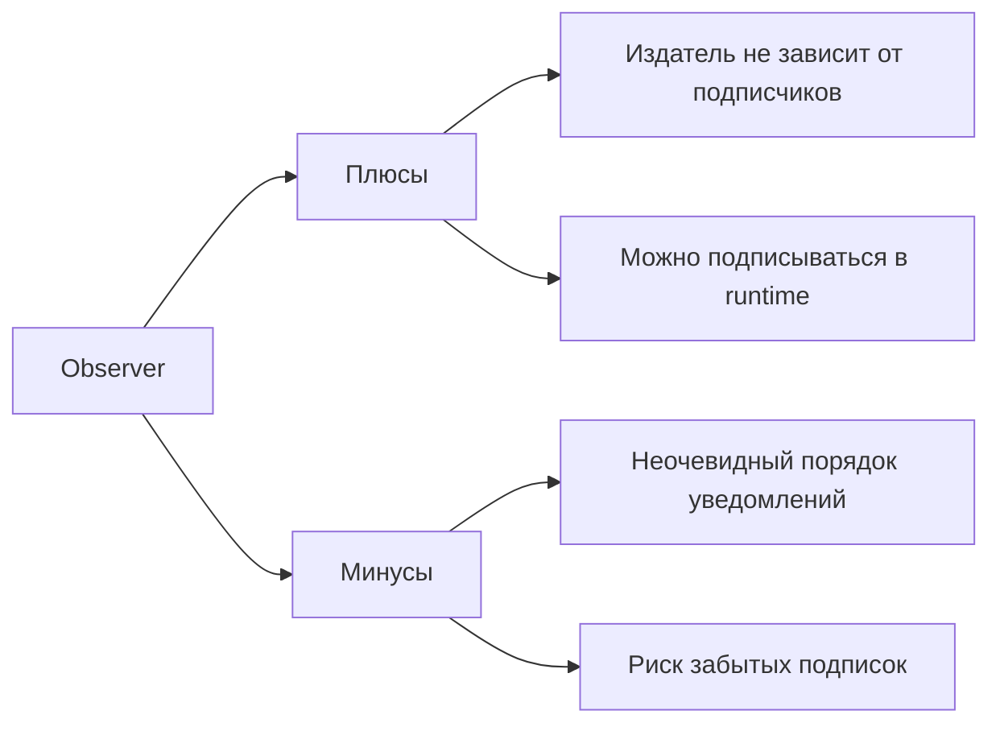

::: warning Текст слайда из PDF
ПРЕИМУЩЕСТВА И НЕДОСТАТКИ

       Издатели не зависят от конкретных классов подписчиков и
       наоборот.
       Вы можете подписывать и отписывать получателей на лету.
       Реализует принцип открытости/закрытости.

                         Подписчики оповещаются в случайном порядке.
:::

#### Command: команда как объект

**Слайд 63: РЕШЕНИЕ**
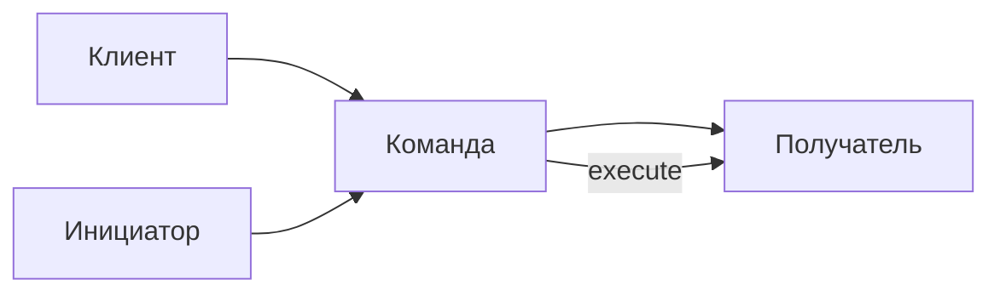

::: warning Текст слайда из PDF
РЕШЕНИЕ

 Прямой доступ из UI в бизнес-логику.

                                        Каждый вызов следует завернуть в собственный
                                        класс с единственным методом, который и будет
                                        осуществлять вызов.

Паттерн Команда предлагает больше не
отправлять такие вызовы напрямую.

63                                          Доступ из UI в бизнес-логику через команду.
:::

#### Visitor: обход операций и оценки

**Слайд 77: РЕШЕНИЕ**
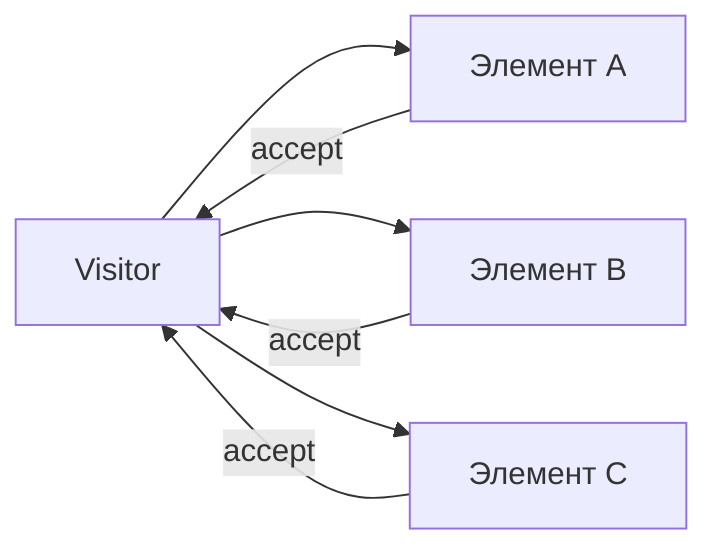

::: warning Текст слайда из PDF
РЕШЕНИЕ

Вместо того, чтобы самим искать нужный
метод, мы можем поручить это объектам,      Как видите, изменить классы узлов всё-
которые передаём в параметрах посетителю.   таки придётся – это минус, но есть нюанс…
                                            Если придётся добавить в программу
     77                                     новое поведение, вы просто создадите
                                            новый класс посетителей.
:::

**Слайд 82: РАССМОТРИМ НА ПРИМЕРЕ**

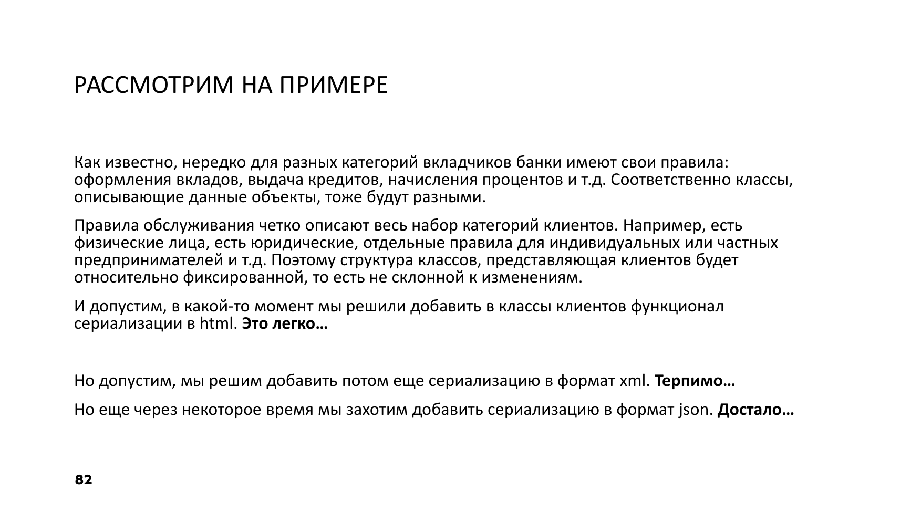

**Слайд 83: ПРЕИМУЩЕСТВА И НЕДОСТАТКИ**
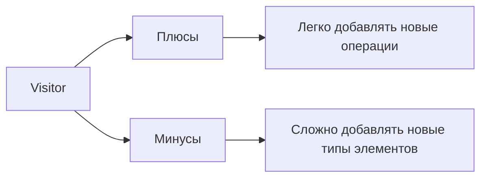

::: warning Текст слайда из PDF
ПРЕИМУЩЕСТВА И НЕДОСТАТКИ

       Упрощает добавление операций, работающих со сложными
       структурами объектов.
       Объединяет родственные операции в одном классе.
       Посетитель может накапливать состояние при обходе
       структуры элементов.

                             Паттерн не оправдан, если иерархия
                             элементов часто меняется.
                             Может привести к нарушению
                             инкапсуляции элементов.
:::

И эта группа, собственно, и называется поведенческая. Напомню, что мы с вами уже изучили такую группу паттернов, как порождающие. Они описывали именно... как создаются объекты по заданным критериям, по заданным правилам или решающие ту или иную задачу. Поведенческая группа паттернов, она относится к той группе, которая решает проблему сложного взаимодействия объектов. Общение этих объектов между собой, пересылка информации, данных и так далее. Это самая крупная группа, наверное, самая часто используемая группа паттернов.

### Strategy

Мы рассмотрим не все из этой группы, но постараемся рассмотреть самые важные, а именно рассмотрим паттерн команда, стратегия, визитер, состояние и наблюдатель. И попробуем потом применить эти паттерны уже на практике. Ряд паттернов мы пропустим, потому что есть паттерны, которые реализованы практически во всех языках. Итератор. И рассматривать его сейчас в современных языках программирования может быть бессмысленно, но тем не менее почитать про те паттерны, которые мы не успеем разобрать в лекционном материале и не разберем на семинарах для общего такого вашего развития рекомендую.

Начнем, наверное, с самого популярного, с самого часто используемого паттерна. Это стратегия. Представим такую ситуацию, что мы разрабатываем... Навигатор. Устроились еще в несуществующий Яндекс и решили сделать такой стартап. Написать навигатор, который будет строить маршрут из точки А в точку Б. Изначально вы просто хотели прокладывать пеший маршрут, но со временем, прям как в Яндексе, со временем появились маршруты на самокате, маршруты на общественном транспорте. Выход у вас какой?

Ну, отрицать. вообще существование паттерна стратегия делать вид что его нет и пытаться в классе вашего навигатора добавлять все новые и новые методы забыть что есть такой принцип открытости закрытости как бы рисковать каждый раз изменяя класс что где-то собьется и как эффект бабочки сломается другая часть проекта то есть через годик вы получите такой комок грязи Спагетти-код, как угодно его назовите, в любом случае это плохо, то, что вы получите. Класс будет просто неподдерживаемый, он будет очень сложной, запутанной логикой. И, собственно, поддержка такого проекта в большой, такой длительной перспективе, она просто чревата тем, что рано или поздно это все упадет, и каждое малейшее изменение будет рушить весь проект. Вариантов на самом деле немного.

Самый, наверное, лучший вариант – это воспользоваться паттерном стратегия. Когда вы алгоритм, который определяет построение, ну давайте на примере навигатора, когда вы алгоритм того или иного построения маршрута, маршрут для самокатчиков, маршрут для личного транспорта, для общественного транспорта, вы носите это не в какую-то там отдельную ветку условного оператора, что если человек захотел то-то, то-то, у вас класс-навигатор. Остается open-close, то есть открыт для расширения своих возможностей, но закрыт для модификации. Но эти алгоритмы вы подсовываете как объекты, как стратегии, которые будут реализовывать построение именно маршрута.

### Структуры поведенческих паттернов

#### Strategy и State: структура

**Слайд 11: СТРУКТУРА**
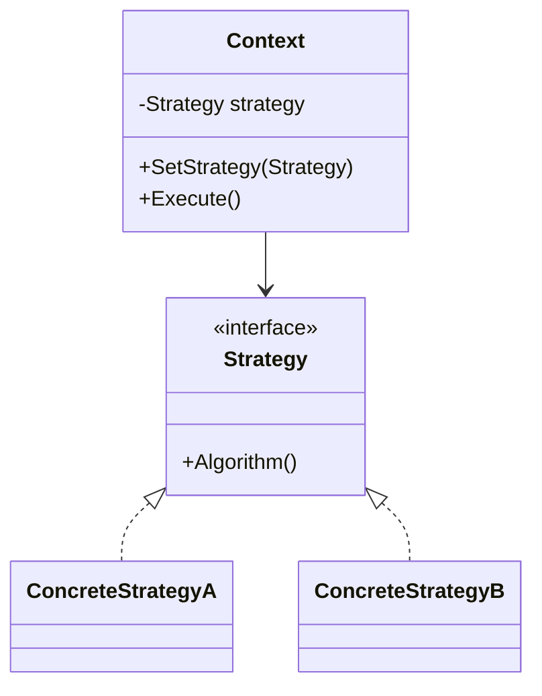

::: warning Текст слайда из PDF
СТРУКТУРА
1.   Контекст хранит ссылку на объект
     конкретной стратегии.
2.   Стратегия определяет интерфейс,
     общий для всех вариаций алгоритма.
3.   Конкретные стратегии реализуют
     различные вариации алгоритма.
4.   Во время выполнения программы
     контекст получает вызовы от клиента
     и делегирует их объекту конкретной
     стратегии.
5.   Клиент должен создать объект
     конкретной стратегии и передать его в
     конструктор контекста. Кроме этого,
     клиент должен иметь возможность
     заменить стратегию на лету, используя
     сеттер.
:::

**Слайд 22: СТРУКТУРА**
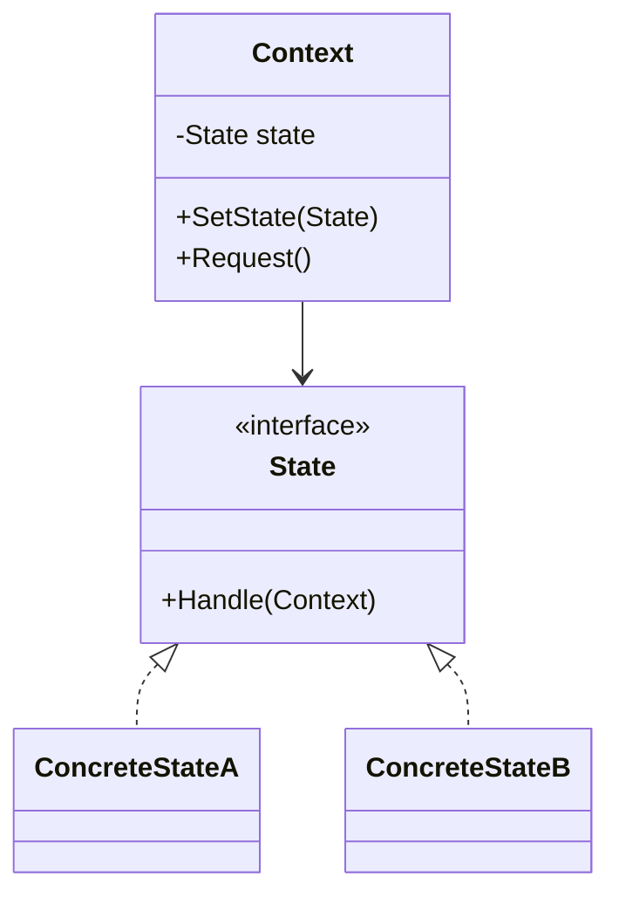

::: warning Текст слайда из PDF
СТРУКТУРА

1.   Контекст хранит ссылку на объект
     состояния и делегирует ему часть
     работы, зависящей от состояний.
2.   Состояние описывает общий
     интерфейс для всех конкретных
     состояний.
3.   Конкретные состояния реализуют
     поведения, связанные с
     определённым состоянием
     контекста.
4.   И контекст, и объекты конкретных
     состояний могут решать, когда и
     какое следующее состояние будет
     выбрано.
:::

#### Template Method и Observer: структура

**Слайд 38: СТРУКТУРА**
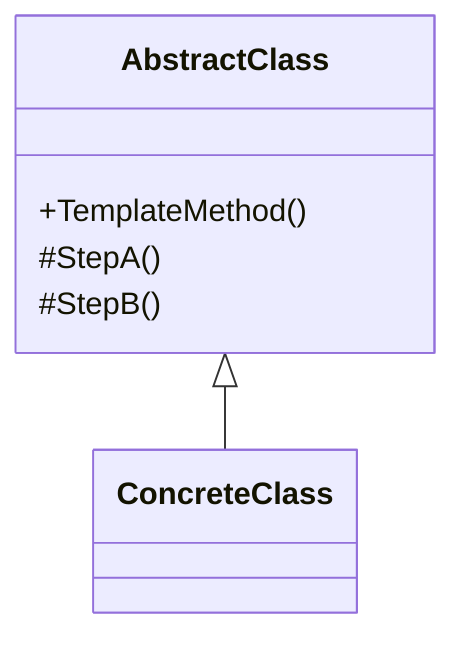

::: warning Текст слайда из PDF
СТРУКТУРА

1.   Абстрактный класс определяет шаги
     алгоритма и содержит шаблонный метод,
     состоящий из вызовов этих шагов. Шаги
     могут быть как абстрактными, так и
     содержать реализацию по умолчанию.
2.   Конкретный класс переопределяет
     некоторые (или все) шаги алгоритма.
     Конкретные классы не переопределяют
     сам шаблонный метод.
:::

**Слайд 50: СТРУКТУРА**
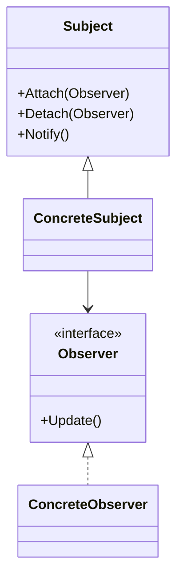

::: warning Текст слайда из PDF
СТРУКТУРА
1. Издатель владеет внутренним состоянием,
изменение которого интересно отслеживать
подписчикам.
2. Когда внутреннее состояние издателя меняется, он
оповещает своих подписчиков.
3. Подписчик определяет интерфейс, которым
пользуется издатель для отправки оповещения.
4. Конкретные подписчики выполняют что-то
в ответ на оповещение, пришедшее от издателя.
5. По приходу оповещения подписчику нужно получить
обновлённое состояние издателя.
6. Клиент создаёт объекты издателей и подписчиков, а
затем регистрирует подписчиков
на обновления в издателях.
:::

#### Command и Visitor: структура

**Слайд 65: СТРУКТУРА**
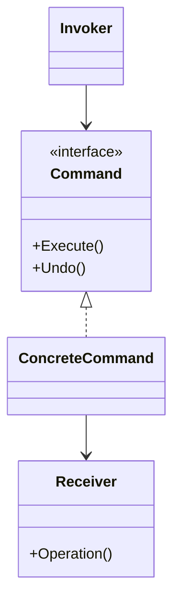

::: warning Текст слайда из PDF
СТРУКТУРА

1. Отправитель хранит ссылку на объект команды и
   обращается к нему, когда нужно выполнить какое-
   то действие..
2. Команда описывает общий для всех конкретных
   команд интерфейс.
3. Конкретные команды реализуют различные
   запросы, следуя общему интерфейсу команд.
   Обычно команда передаёт вызов получателю,
   которым является один из объектов бизнес-логики.
4. Получатель содержит бизнес-логику программы, вы
   можете избавиться от получателей, «слив» их код в
   классы команд.
5. Клиент создаёт объекты конкретных команд,
   передавая в них ссылки на объекты получателей.
   После этого клиент связывает объекты
   отправителей с созданными командами.
:::

**Слайд 78: СТРУКТУРА**
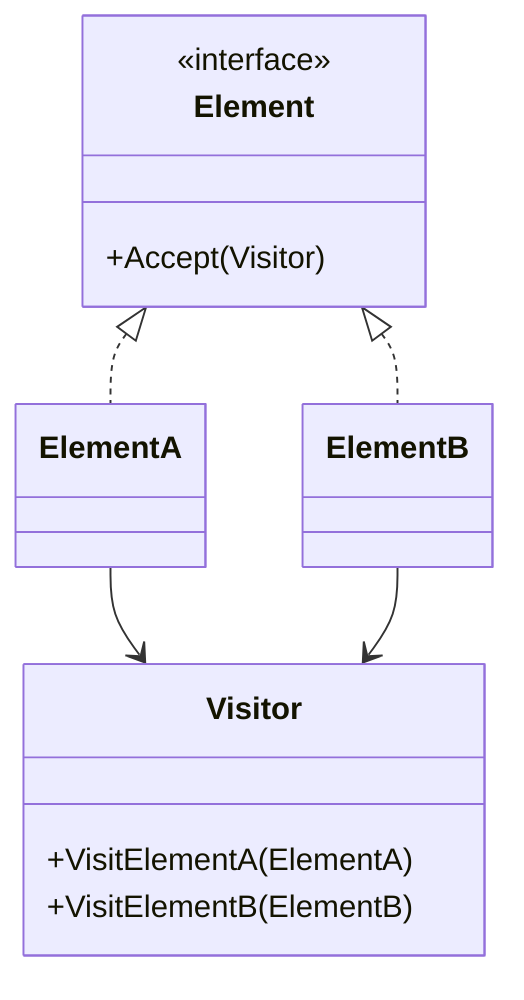

::: warning Текст слайда из PDF
СТРУКТУРА
1.Посетитель описывает общий интерфейс для всех
типов посетителей. Он объявляет набор методов,
отличающихся типом входящего параметра.
2.Конкретные посетители реализуют какое-то
особенное поведение для всех типов элементов,
которые можно подать через методы интерфейса
посетителя.
3.Элемент описывает метод принятия посетителя.
Этот метод должен иметь единственный параметр,
объявленный с типом интерфейса посетителя.
4.Конкретные элементы реализуют методы
принятия посетителя. Цель этого метода — вызвать
тот метод посещения, который соответствует типу
этого элемента. Так посетитель узнает, с каким
именно элементом он работает.
5.Клиентом зачастую выступает коллекция или
сложный составной объект
:::

Структурно паттерн выглядит на самом деле несложно. Есть целевой класс, навигатор, который будет в себе содержать интерфейс той или иной стратегии. А **реализация** этих стратегий, то есть вот этих алгоритмов, они будут оформлены в виде отдельных классов. И тогда вы можете при инициализации вашего навигатора подсунуть ему стратегию. Но самое что прекрасное, вы можете на лету сменить одну стратегию на другую стратегию, не пересоздавая инстанс навигатора. Вы можете просто на экране телефона кликнуть «Построй маршрут мне на общественном транспорте», «Построй мне на автомобиле». Участники данного паттерна у нас следующие.

Это контекст, который хранит ссылку на интерфейс стратегии, но дальше этот интерфейс реализует уже конкретные стратегии с теми или иными алгоритмами. Ну и во время выполнения программы контекст получает от клиентского кода, от основной программы мейна, от клиентского кода получает уже конкретную стратегию. Но самое прекрасное, что клиент может и в момент рантайма заменить у контекста одну стратегию на другую. Концептуальный пример может выглядеть следующим образом. У нас с вами есть интерфейс, который описывает методы стратегии. Потому что наш контекст должен знать о... интерфейсе данной стратегии, чтобы потом в дальнейшем вызвать тот или иной алгоритм.

И, собственно, контекст может получать стратегию либо при инициализации, но чаще всего это поле оставляют открытым, чтобы уже в runtime можно было у контекста поменять стратегию, не пересоздавая сам класс контекста. И, собственно, метод, который заставит выполниться алгоритм, полученного либо при инициализации, либо в дальнейшем, той или иной стратегии. Количество стратегий может быть каким угодно, сколько угодно.

Давайте теперь посмотрим, после вот такого концептуального примера, давайте попробуем на более-менее реалистичном примере рассмотреть, где бы мы могли применить стратегию. Ну и вот наш излюбленный пример с автомобилями. У нас есть автомобиль, но автомобиль может... Гибридный автомобиль может передвигаться на бензине, на электротяге двигателя, на дизеле. И при этом мы можем из мультимедиа меню нашего автомобиля поменять способ передвижения. В момент движения даже. Применим здесь стратегию. Нам понадобится интерфейс стратегии. В данном случае это у нас будет iMovable. И мы говорим, что у любой стратегии... будет метод Move.

Дальше, собственно, в зависимости от того, на чем будет передвигаться, на каком виде топлива, бензин, дизель, электро, мы реализуем конкретные стратегии, и он реализует тот самый метод, который был заложен в интерфейсе стратегии. Ну а дальше, создавая автомобиль, мы либо при его создании определяем стратегию передвижения, либо в дальнейшем можем при создании... мы можем сразу заложить способ передвижения и выполнить ту или иную стратегию, которая в него была передана в момент создания. Но нам ничего не мешает в дальнейшем подменить стратегию передвижения автомобиля на другую.

### Применимость поведенческих паттернов

#### Strategy и State: применимость

**Слайд 16: ПРИМЕНИМОСТЬ**
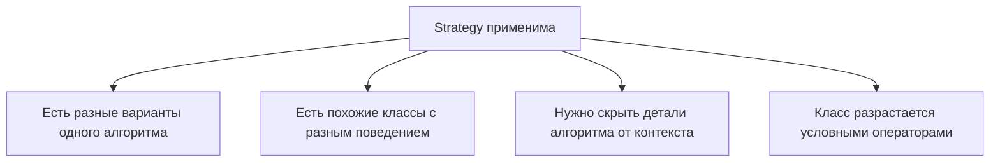

::: warning Текст слайда из PDF
ПРИМЕНИМОСТЬ

• Когда вам нужно использовать разные вариации какого-то
  алгоритма внутри одного объекта.
• Когда у вас есть множество похожих классов, отличающихся
  только некоторым поведением.
• Когда вы не хотите обнажать детали реализации алгоритмов для
  других классов.
• Когда различные вариации алгоритмов реализованы в виде
  развесистого условного оператора. Каждая ветка такого
  оператора представляет собой вариацию алгоритма.
:::

**Слайд 31: ПРИМЕНИМОСТЬ**
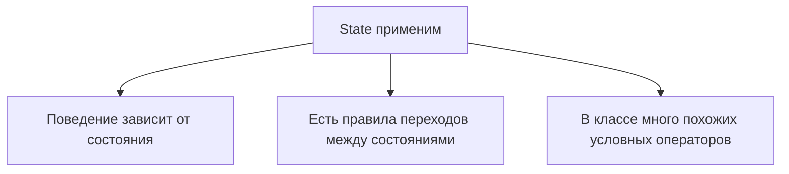

::: warning Текст слайда из PDF
ПРИМЕНИМОСТЬ

• Когда у вас есть объект, поведение которого кардинально
  меняется в зависимости от внутреннего состояния.
• Когда код класса содержит множество больших, похожих друг на
  друга, условных операторов, которые выбирают поведения в
  зависимости от текущих значений полей класса.
• Когда вы сознательно используете табличную машину состояний,
  построенную на условных операторах, но вынуждены мириться с
  дублированием кода для похожих состояний и переходов.
:::

#### Template Method и Observer: применимость

**Слайд 44: ПРИМЕНИМОСТЬ**
```mermaid
flowchart TD
    TM[Template Method применим] --> Base[Есть общий алгоритм]
    TM --> Steps[Подклассы меняют отдельные шаги]
    TM --> Duplication[Несколько классов делают одно и то же с отличиями]
```

::: warning Текст слайда из PDF
ПРИМЕНИМОСТЬ

• Когда подклассы должны расширять базовый алгоритм, не меняя
  его структуры.
• Когда у вас есть несколько классов, делающих одно и то же с
  незначительными отличиями. Если вы редактируете один класс,
  то приходится вносить такие же правки и в остальные классы.
:::

**Слайд 58: ПРИМЕНИМОСТЬ**
```mermaid
flowchart TD
    Observer[Observer применим] --> UI[UI наблюдает за моделью]
    Observer --> Unknown[Заранее неизвестно, кто будет реагировать]
    Observer --> Runtime[Подписка и отписка нужны в runtime]
```

::: warning Текст слайда из PDF
ПРИМЕНИМОСТЬ

• Когда после изменения состояния одного объекта требуется что-
  то сделать в других, но вы не знаете наперёд, какие именно
  объекты должны отреагировать.
• Когда одни объекты должны наблюдать за другими, но только в
  определённых случаях.
:::

#### Visitor: применимость

**Слайд 81: ПРИМЕНИМОСТЬ**
```mermaid
flowchart TD
    Visitor[Visitor применим] --> ManyElements[Нужно выполнить операцию над многими объектами]
    Visitor --> Structure[Есть сложная структура объектов]
    Visitor --> Some[Поведение нужно только части элементов]
```

::: warning Текст слайда из PDF
ПРИМЕНИМОСТЬ

• Когда вам нужно выполнить какую-то операцию над всеми
  элементами сложной структуры объектов, например, деревом.
• Когда над объектами сложной структуры объектов надо
  выполнять некоторые не связанные между собой операции, но
  вы не хотите «засорять» классы такими операциями.
• Когда новое поведение имеет смысл только для некоторых
  классов из существующей иерархии.
:::

Наверное, очень часто используемый паттерн, когда мы можем его применить.

- Когда необходимо использовать разные вариации какого-то алгоритма внутри одного объекта.

- У нас есть множество похожих классов.

Ну, опять же, бензиновый автомобиль, дизельный автомобиль, электроавтомобиль с разными типами передвижения. Но и нам не хочется именно создавать вот эту большую иерархию наследования, где действительно будет переопределяться всего лишь навсего стратегия поведения объекта. Поэтому мы сам алгоритм выносим в отдельный класс, в стратегию, ну а дальше уже в контекст передаем эту стратегию как входной параметр, либо через метод.

- Есть еще варианты, что, возможно, у вас есть какая-то очень серьезная бизнес-логика в этих стратегиях, и вы просто не хотите ее отдавать в контекст и, собственно, светить эту логику.

Возможно, она у вас будет где-то в отдельном месте. Вы готовы просто передать инстанс с данной стратегией. Но код, чтобы он вживлялся в какой-то контекст, вам этого не нужно. А возможно, тому классу, в который вы собираетесь вживить стратегию, просто там не место этой большой бизнес-логики. Ну и если действительно вы видите, что ваш класс превращается уже в такую развесистые условные операторы, если был выбран... способ построения маршрута общественный транспорт, то выполни вот эту стратегию. Иначе, если был выбран способ передвижения пешей, то построй вот такой алгоритм, используй такой алгоритм для построения маршрута.

- Если вы начинаете замечать, что класс разрастается вот этой кучей условных операторов, и, собственно, уже тяжело поддерживается, тяжело читается, тоже нужно задуматься о стратегии.

### Итоги по Strategy

- Из плюсов-минусов.

Ну, минус, как обычно. Все, на самом деле, становится сложнее. Усложняется программа за счет дополнительных классов.

- Это, собственно, вы заметили, минус любого паттерна, только иногда он прямо чрезмерно явный, иногда не такой явный.

- Из плюсов, наверное, очень важный плюс, в отличие от DI, который, конечно, тоже может на лету менять зависимость, но DI все-таки, его иногда сопоставляют с паттерном стратегия, но DI идеологически...

Ну, во-первых, он позже появился, и он идеологически настроен на то, что определить зависимость в момент инстанцирования объекта, в момент запуска приложения. А стратегия, она нацелена на то, что действительно мы на лету можем поменять одну стратегию на другую стратегию в рамках нашего контекста, где эта стратегия используется. Вот. Ну, изолирует код алгоритма от контекста, где он используется. Избавляемся от наследования. Ну, пример с нашим автомобилем.

- У нас нет автомобиля, там отдельно автомобиль бензиновый, дизельный, электро.

- У нас просто есть автомобиль и разные стратегии, которые он может, не используя **наследование**, а именно делегирование.

Делегировать это свой алгоритм передвижения отдельному классу. Ну и таким образом мы добиваемся заветного принципа. Открытости и закрытости. По сути, мы теперь тот же контекст, который потребляет различные алгоритмы в виде отдельно созданных классов, мы контекст теперь не перезаписываем, но если нам нужен другой алгоритм, другой способ передвижения, другой способ построения маршрута, мы просто создаем новый алгоритм в виде отдельного класса и передаем в контекст.

Таким образом, принцип открытости и закрытости соблюден.

Переходим к следующему паттерну. Паттерн легкий, мне почему-то его часто приходится использовать, но на самом деле посмотрел по статистике, такой средней популярности паттерн. У меня как-то проекты складывали, сейчас расскажу, почти в каждом.

### State

**State**, состояние. Ну, смотрите, где мне приходилось сталкиваться, может быть из-за специфики. Мы очень много делали... Программного обеспечения для заводов, где есть станки и производство, ну и производимый продукт очень часто переходил из одного состояния в другое состояние. И, разумеется, он не мог перескочить какое-то второе состояние и с первого перейти сразу в третье. Были определенные правила, и это и составляло основу бизнес-процесса. Поэтому стейт мы использовали очень часто. Ну и давайте рассмотрим такое. Пример. Подписание документа. Документ не может быть исполнен, ну или приказ не может быть исполнен, если сначала не был создан черновик, потом его подписали и назначили, кто будет исполнять этот приказ.

Потом тот, кто исполняет, принял, выполнил, отметил, что... Данный приказ исполнен, ну и документ там завершает свою работу. То есть определенные стадии документопроизводства, они тоже присутствуют. И если этих стадий не так много, если эти стадии действительно четко определены и не меняются в ходе жизни проекта, то паттерн не нужен. Можно написать наши любимые if-else, if-else, если ты сейчас в таком состоянии, то перейдешь в такое состояние. Ну, допустим, вода. Если ты жидкая, при нагревании ты станешь паром. Если ты лед, при нагревании ты станешь жидкостью, при дальнейшем нагревании ты станешь паром. При заморозке пар станет жидкостью, жидкость перейдет в лед. Лед при дальнейшей заморозке опять останется льдом.

Вот если у вас действительно... немного состояния, и они определены и вряд ли будут меняться, то с вероятностью большой вам стоять не понадобится. Но в жизни так не бывает. В жизни всегда что-то меняется. Да даже где-то считал статью, что лет пять назад, что в школе меня учили, что у воды есть три состояния в жид. Жидкая пар лед. А там какой-то еще, грубо скажу, нашли еще одно состояние, супер лед. С определенной кристаллической решеткой. То есть вроде бы столетиями жили, но даже в таких устоявшихся законах физических, видите, тоже может поменяться и появиться новое состояние. Поэтому паттерн на самом деле годный.

Давайте посмотрим, что предлагает нам... Проблему мы видим. Некая сущность может находиться в разных состояниях, и его следующее состояние зависит от предыдущего. Ну и, разумеется, его текущее состояние будет определять последующее состояние. **State** предлагает нам не писать в самом классе, который имеет различные состояния. Вот эту вот развесистую с условными операторами вот эти ветки, если состояние такое, то станет таким. А если вот такое, будет таким. Он предлагает каждое состояние оформить в виде отдельной сущности, отдельного класса. Ну, чем-то, видите, на стратегию напоминает, да? Но только стратегия как бы сама определяет алгоритм, а стейт больше меняет тот объект, состояние которого он описывает. То есть есть нечто похожее.

Ну, собственно, у всех этих поведенческих паттернов есть нечто похожее. Они действия оборачивают очень часто в какой-то объект.

Давайте посмотрим на вот этот пример с документами, как можно было бы решить. Мы могли бы создать документ, который обладает знанием о состоянии, описанное в виде интерфейса. И данное состояние определяется конкретными состояниями, в котором может пребывать документ. Черновик. Подписанный вариант, исполненный вариант. И дальше уже клиент и тот код, который создает документ, определяет, в каком состоянии создается первоначальный документ. И в дальнейшем воздействие на данный документ с помощью его методов, в зависимости от того, какой конкретный стейт был передан документу, этот метод отработает так, как ему нужно.

Давайте попробуем рассмотреть структуру и потом, как обычно, пример такой канонической реализации и более-менее реалистичной.

Значит, паттерн состоит из контекста, это то, что мы собираемся менять. Вода, которая имеет несколько состояний, документ, который мы создаем, подписываем, финализируем.

Дальше, сам интерфейс состояния, потому что контексту необходимо понимать. понимать, как он может воздействовать на этот стейт. И конкретные реализации состояния. Ну и клиент, который, собственно, оперирует контекстом, определяет, какое у него будет изначальное состояние, и в дальнейшем работает с этим контекстом, воздействуя на него, переводит из одного состояния в другое состояние. Но чем прекрасно это все? Тем, что сам контекст будет open-close, он будет... закрыт для изменений, но мы его можем постоянно расширять и модифицировать даже вот эти вот стейты, что из одного состояния у нас появится какое-то промежуточное состояние, которое изначально не было учтено заказчикам. Мы без проблем изменим конкретные стейты, объясним им, что ты сейчас...

При подписании переходишь не в финальную стадию, а переходишь в стадию на ревизию управляющему директору. А лишь только новое состояние на ревизию управляющего директора переведет уже в финальную. То есть нам гораздо проще будет менять вот этот вот... Ну, если бы у нас не было стейта, у нас был бы условный оператор. И постоянные изменения, когда... наш контекст переходит из одного состояния в другое, а возможно не в другое, а во вновь появившееся, нам бы пришлось этот if постоянно переписывать. Он бы был достаточно сложным, и действительно постоянно бы менялся. И неизвестно, как бы это отражалось на том коде, который использует контекст. Здесь же у нас это состояние нужно будет... Допустим, была у нас цепочка из пяти состояний между...

Четвертым и пятым появилось 4А состояние. Мы правим четвертое состояние, объясняем, что оно переходит в 4А, ну и, соответственно, из 4А, говорим, переходишь в 5. То есть гораздо меньше придется затратить усилий по изменению вот этих переходов из одного состояния в другое.

Давайте рассмотрим такой классический пример, абстрактный, и потом более-менее реалистичный.

Значит, абстрактный пример. может у нас описывать данным паттерном следующим образом. Есть абстракция либо интерфейс состояния и метод, который определяет контекст, то, на что это состояние будет влиять. Ну, если пример с водой, то здесь у нас состояние жидкое и будет передаваться конкретный контекст или конкретный документ, на который мы будем влиять.

Дальше описано несколько состояний. Ну и разумеется, из состояния А он переходит в состояние Б. Ну а здесь по аналогии только из состояния Б он переходит обратно в состояние А. Ну и для нас, наверное, важно, это контекст, это то, на что мы воздействуем, и то, что будет менять свое состояние. У него есть состояние, он получает его при инициализации, и в дальнейшем мы можем... воздействовать на наш контекст, меняя его состояние. Ну и код программы, который клиентский, мог бы выглядеть следующим образом. Мы создаем контекст, определяя начальное состояние, и воздействуем на этот контекст. Реквест. Напомню, что реквест у нас в зависимости от того, какое сейчас состояние, переведет в другое состояние.

Ну, возможно, не просто, не только переведет. в определенное состояние, изменит еще какие-то поля контекста. Очень часто бывает необходимо изменить поля контекста.

Таким образом, у нас он был в состоянии А. Здесь он перейдет при вызове реквест в состояние Б, но при повторном вызове реквест перейдет опять в состояние А. Но давайте пример посмотрим как раз про воду. Это более будет понятно. Вода у нас будет иметь три состояния. Жидкость, пар, лед. И, ну, понимаете, да, при воздействии, воздействовать мы сможем двумя способами. Нагревать воду и охлаждать воду. Если бы у нас не было стейта, то выглядело бы примерно следующим образом.

Давайте, то есть показываю, как можно было бы, да, наплевав на общеизвестный паттерн, испытывая, наверное, колоссальную любовь к условным операторам, написать вот такую вот ерунду. При этом вы понимаете, что три всего лишь навсего состояния и два метода воздействия. Но даже при таком варианте, вот мне пришлось сворачивать код, потому что, ну, иначе это было бы в каждом условном операторе, происходила бы какая-то небольшая логика, ну, в моем случае это просто вывод информации, в какое состояние оно переходит, ну и дальше изменение этого состояния.

Значит, что у меня есть? У меня есть некий Enum, который содержит различные состояния, чтобы мне не перепутать. И этот Enum определяет у контекста состояние. Правда, сейчас я решаю данную проблему. Не с помощью паттерна, поэтому давайте я так дальше рассуждать не буду, что вот это контекст, а это у меня состояние. Ну вот примитивно. Вода имеет некое состояние, и дальше при нагреве я начинаю вот эти вот развесистые ветки условных операторов городить. Если у меня есть заморозка, то там всё то же самое. В зависимости от его текущего состояния он будет переходить в другое состояние.

А теперь представьте, что если у меня появляется четвертое, пятое состояние, мне придется вот эти достаточно замудренные условные операторы куда-то внедрять if-else, ну и все это еще потом тестировать. Альтернатива, да? Но. Как бы мы это могли использовать? В основной программе мы бы создали воду и могли бы переводить ее, вызывая определенные методы, в разное состояние.

На самом деле прекрасно.

Давайте посмотрим, как ту же самую задачу можно было бы решить более элегантно, используя PatternState. Так, все, этот пример останавливается.

Теперь пишем более качественный код. Хотел сказать, более лаконичный. Но на тех небольших примерах, на которых мы рассматриваем, вам может показаться, что напротив. Кода становится больше. Но дело в том, что сложность решаемых примеров гораздо меньше, чем в реальной жизни. Поэтому использовать паттерны на небольших примерах может показаться абсурдным. Поэтому просто смотрим элегантный код. Не такой может быть лаконичный, как бы мог быть.

Значит, справа у нас описан класс вода, все то же самое. При этом никакой логики, никаких условных операторов в методе нагревания и заморозка. Мы просто говорим, что у тебя есть некий стейт, и при нагревании ты воздействуешь на этот стейт, нагреваешь и передаем туда ZIS, текущий объект. Ну, то же самое при заморозке. Мы говорим, что ты у текущего состояния. Будешь вызывать метод. То есть, видите, мы опять алгоритм по изменению объекта выносим в отдельный класс. Это было и в двух предыдущих паттернах. Что стратегия, когда мы заменяли алгоритм, опять же, отдельными классами. Что здесь у стейта? Мы опять вынесли заморозку в отдельный класс.

Давайте посмотрим, куда.

Значит, слева теперь у нас описан... Интерфейс будущих возможных состояний. Это нужно для того, чтобы контекст, который будет использовать эти состояния, понимал, как можно воздействовать. У нас сказано, можно нагревать, можно охлаждать. С документом можно его подписать, отклонить, перевести в предыдущее состояние. Интерфейс состояния описывает, как в принципе можно воздействовать из контекста, из этого класса вода, на наше состояние. Ну, мы договорились, что воду можно нагревать, охлаждать.

Дальше мы описываем не то, что все возможные, а все известные на данный момент. Они потом пусть добавляются, изменяются. Самое главное, что мы теперь не будем трогать воду в контекст. Он теперь у нас open-close. Он закрыт для модификации, но расширять количество его состояний мы можем через появление новых конкретных состояний. Лед. При нагревании он переходит в жидкое состояние. То есть мы переопределяем текущее состояние. А здесь у нас поступает контекст. Это вода. Так, вода поступила. И мы говорим, да, при нагревании, если ты сейчас был льдом, то ты перейдешь в жидкость. А если ты уже при заморозке, если ты сейчас лед, то ты останешься быть льдом.

Ну и также, тоже у меня не влезло, но по аналогии, если жидкость мы нагреваем, она переходит в пар, если охлаждаем, она переходит в лёд, ну и то же самое с газом, при охлаждении она в жидкость. То есть прописали все эти сценарии. При этом, если добавится новое состояние, там лёд будет переходить в супер лёд, добавляем новое состояние, изменяем переход у льда, что при заморозке ты переходишь в новое четвертое состояние. При этом класс контекста, который обладает состоянием, мы трогать не будем. Этим всем пользоваться можно абсолютно так же, как и в предыдущей программе. Создать воду с текущим состоянием. Ну и дальше воздействовать на текущее состояние у контекста. Охлаждать, нагревать. Код абсолютно тот же самый. Но еще раз повторюсь.

При варианте не используя **state** мы постоянно будем мучиться с этими условными операторами. При использовании state нам достаточно описать новое состояние и подправить предыдущее, которое переведет его в это новое состояние. Подправить предыдущий класс. Не алгоритм всего контекста, а предыдущий класс только. Применимость. Когда у нас есть объект. документ или вода поведение которого меняется в зависимости от состояния и когда этих состояний но достаточно много понятное дело применять стоит где у вас действительно два три состояния нет когда там речь о 70 и они постоянно меняется может быть порядок их меняется либо появляется новое но тогда это разумно из минусов если состоянии немного то, возможно, это все будет напрасно.

То есть у вас значительно увеличится количество классов и повысится архитектурная сложность проекта. Ну и ради чего? Ради двух состояний. Из состояния А в Б, а из Б в А. Тут, конечно, проще обойтись условным оператором. Там вы точно не запутаетесь. Но если таких состояний много, то вы можете разгрузить класс контекста. Вот это вода. Не писать там кучу условных операторов. а просто сделать методы, что мы можем делать с водой. Нагревать, охлаждать. То есть упростить класс контекста с помощью этого паттерна можно. Контекст в данном случае тот класс, который подвержен изменению состояния. Ну и можно таким образом еще сконцентрировать в одном месте логику по изменению состояния.

Переходим к следующему. Он вам уже будет знаком.

### Template Method

Мы его рассматривали при... прохождение solid принципов это шаблонный метод представим такую ситуацию когда у нас есть сложный алгоритм который реализован в большом количестве классов и в целом он реализован практически у всех одинаково но с небольшими отличиями допустим допустим вот мы рассмотрим пример Обучение. Вроде бы обучение в школе, обучение в ВУЗе, обучение на курсах ДПО, в целом одинаково. Нужно поступить, учиться, сдать экзамены, получить диплом. Но только где-то сдать экзамены, это сдать экзамены и закрыть производственную практику в университете. Где-то поступить, это просто прийти в школу, а в ВУЗ сдать вступительные экзамены.

Но в целом... определенные шаги есть у всех более того чаще всего определенные шаги повторяются повторяет одну и ту же реализацию но возможно в каких-то конкретных случаях реализации нужно будет изменить но если вспомните пример с поваром который у нас умел готовить все что угодно для абсолютно любое блюдо мы говорили без проблем сначала Сделаешь предварительную готовку, готовку и финальную подачу. Все, у нас был шикарный повар. То, что он принимал во входной параметр себе рецепт, ему было сказано. Предварительная готовка, подменялся метод и так далее. Финальная подача.

Давайте смотрим, какая проблема. Мы пишем программу по анализу больших данных, и данные необходимо извлекать из разного набора, ну, из разного формата документов. Это, возможно, PDF, DOC файл, XML, JSON. И способ анализа данных, он один и тот же. Но мы понимаем, что в каких-то моментах анализ PDF документа, анализ JSON, он может отличаться. Именно распознавание данных. Но последующий анализ, когда данные уже оттуда получены, метод будет один и тот же, с базовой какой-то реализацией. Вот при таком варианте шаблонный метод может определить ключевые этапы. Если мы понимаем, что базовая **реализация** у всех будет одинакова, то можем прямо в шаблонном методе прописать базовую реализацию.

И здесь, к слову, один из тех случаев, когда интерфейс нам явно не подойдет. Потому что, напомню, в интерфейсе мы можем переопределить все. Ну, хотя, да, сейчас стали появляться, тенденция пошла в сторону, что интерфейс может иметь реализацию по умолчанию, и мы можем не переопределять ее. Но, тем не менее, как бы в классике считается, что данный паттерн реализуется через абстрактный класс, а не интерфейс.

Значит, что мы имеем? Для решения той задачи с анализом документов мы можем написать класс, у которого будет публичный шаблонный метод, но в этом шаблонном публичном методе будут выполняться определенные шаги. При этом часть шагов мы способны будем переопределить, если захотим. Часть шагов мы должны обязательно переопределить, если они были помечены как абстрактные, а часть можем использовать с реализацией по умолчанию. Есть конкретные классы, которые наследуются от абстрактного класса и реализуют эти конкретные шаги, которые действительно необходимо переопределить, реализуют их по-своему. Пример жизни – это стройка дома. У нас есть основные шаги – поставить стены, двери, окна, крышу и получить дом.

Это шаблонное решение. либо со вторым этажом, либо с окном на крыше, мы можем часть конкретных шагов в шаблонном методе заменить на нашу реализацию, которая нам нужна в том или ином случае. Структура паттерна будет выглядеть таким образом. Есть абстрактный класс с шаблонным методом, который будет состоять из нескольких шагов. И есть конкретные классы, которые... будут переопределять эти конкретные шаги. Классическая **реализация** несложная. Выглядит следующим образом. У нас есть абстрактный класс с шаблонным методом, который вызывает определенные шаги. И эти определенные шаги отмечены как абстрактные, то есть мы заставляем, провоцируем их определить в классах-наследниках. И вот конкретный наследник переопределяет эти конкретные шаги по-своему.

Теперь давайте на конкретном примере. Процесс обучения, как я и говорил, в принципе очень схож, где бы мы ни учились, в школе, в университете, на курсах ДПО. Есть такие этапы, как поступление, обучение, сдать экзамены, получить документ об образовании. При этом, вероятно, сдача экзаменов в большинстве образовательных учреждений происходит одинаково, что на курсах ДПО, что в университете, что в школе. Поэтому мы можем написать даже реализацию по умолчанию. Сделать ее виртуальной, потому что если вдруг где-то своеобразно проходит сдача выпускных экзаменов, то тогда для этого случая можно будет перезаписать данный шаг. Но если устраивает **реализация** по умолчанию, то ради бога, давайте так и оставим.

Как мог бы выглядеть **реализация** данной задачи с помощью шаблонного метода? Мы создаем абстрактный класс Education. с шаблонным методом обучения, где говорим, какие шаги необходимо выполнить в данном шаблонном методе. И дальше идут эти шаблонные методы, объявленные либо как 100% виртуальные, то есть абстрактные, для того, чтобы мы обязаны были определить, либо виртуальные, с какой-то реализацией по умолчанию. И тогда каждый из конкретных уже... которые будет реализовывать данный шаблонный метод, будет по-своему переопределять эти абстрактные классы и, если нужно, то и этот виртуальный метод. Справа код, который показывает процесс обучения и переопределение тех методов, которые были абстрактны. Это поступление в школу и, собственно...

А, ну да, здесь я свернул. Процесс обучения, процесс получения диплома. В университете тоже данные шаги шаблонного метода реализуются по-своему. Возможно, там, где сдача выпускных экзаменов, будет дополнительный пункт пройти еще производственную практику. И тогда процесс использования данного кода, клиент, который будет использовать данные классы, с реализованными шаблонными методами выглядит следующим образом. Есть школа, университет, два класса, в которых заложены шаблонные методы. Ну и дальше мы просто запускаем этот шаблонный метод, и каждый класс будет реализовывать его по-своему. Мы с вами видели, что на самом деле вот сейчас клиентам данного... класса с шаблонным методом или двух объектов с шаблонным методом является метод main.

Но если вспомнить пример про повара, когда мы повару передавали блюдо, а у блюда были переопределенные шаги шаблонного метода, и повар просто получал это блюдо и начинал согласно шаблонному методу выполнять определенные шаги. И в повара мы могли передать... Любые реализации шаблонных методов, готовка салата, готовка второго, и получается повар у нас из-за этого начинал приобретать свойства открытости-закрытости. Мы его никогда не переписывали, но за счет того, что он принимал класс, реализующий шаблонный метод, вызывал у него, соответственно, исполнение этого шаблонного метода. И таким образом мог работать с любыми еще ранее... недавно неизвестными нам рецептами. То есть плюс этого паттерна помогает нам реализовать принцип открытости-закрытости.

При этом, обратите внимание, сами классы, которые наследуются от абстрактного класса, они расширяют базовый алгоритм, при этом не меняя его какой-либо структуры. То есть у нас есть шаблонный метод, выполни первое, пятое, десятое. Но при этом первое, пятое, десятое остается, но реализуя конкретные шаги шаблонного метода, мы начинаем расширять стандартный алгоритм. Ну вот это одна из причин применить данный паттерн. Ну и вторая причина. Если мы видим, что у нас начинает разрастаться иерархия, Чуть-чуть меняется алгоритм, но базовые вещи делаются одни и те же в методе, то есть смысл разделить метод на части. Шаблонный метод будет вызывать эти части, а наследники будут переопределять лишь те места, где действительно есть различия.

Ну и тогда у нас, если произойдет изменение какой-то базовой части, мы в абстрактном классе поменяем этот шаг. И у всех наследников он тоже изменится. А так бы пришлось лезть в каждый класс и менять. При этом это не просто **наследование**, где мы все бы прописали в одном методе. А это именно шаблонный метод, который по частям, шаг за шагом может вызвать части какого-то большого алгоритма. А в дальнейшем уже наследники могут переопределить именно определенные кусочки этого алгоритма. Но тут на самом деле почему так много минусов? Потому что им легко воспользоваться неправильно. В зависимости от языка мы можем перекрыть какой-то метод.

С помощью, допустим, в .NET, с помощью оператора new мы можем перекрыть метод в наследнике, и он будет с таким же именем, но будет перекрывать тот базовый. И таким образом непонятно, ну, точнее... испортим заложенный алгоритм. Мы нарушаем принцип подстановки Барбары Лискоу, потому что наши наследники за счет неизвестного нам переопределения могут работать не так, как базовая **реализация** данного класса. Мы, к сожалению, себя сами ограничиваем таким жестким скелетом, и очень плохо иногда бывает спустя время, когда... Появляется какой-то новый класс, которому половина шагов вообще не нужна. Или необходима другая последовательность. А мы себя уже ограничили вот таким жестким шаблонным методом. Но зато мы получаем тот единственный плюс от наследования.

Повторное использование кода из базового класса. Следующий паттерн во многих языках реализован уже из коробки. Очень часто в виде коллекций, допустим, коллекция, за которой мы можем наблюдать, и она может уведомлять о том, что она изменилась. Если до этого вы изучали .NET, то, может быть, встречались с Observable Collection. Это та коллекция, которая уведомит подписчика о том, что в ней произошли изменения. Но на самом деле паттерн очень популярен на UI. Потому что очень часто, ну, при архитектуре мы будем рассматривать архитектуру **MVVM**, очень часто элементы управления на UI хотят знать о том, что произошли изменения в каком-то классе из бизнес-логики, из view-модели. И получается, что у нас есть тот, за кем наблюдают, и тот, кто наблюдает.

При этом, в принципе, они могут за другом наблюдать. Если меняется что-то в бизнес-логике, меняется на UI. Если мы что-то на UI делаем, это может изменить данные, которые лежат в бизнес-логике.

### Observer

Паттерн-наблюдатель. Ну и, как я сказал, давайте рассмотрим такой пример. Допустим, у нас есть магазин и есть покупатель, который ждет поступления товара. И время от времени он каждый час ходит в магазин и спрашивает, Есть товар, пришел мой товар, пришел мой заказ. Вот у нас две стратегии, причем обе они неправильны. Мы можем заставить человека вот так вот бегать, чтобы он проверял, ему же надо. А можем в принципе сказать, слушайте, ну вот у нас тут граммофон в магазине, мы сейчас будем каждые пять минут кричать, пришел такой-то товар. Но тот, кому он пришел, он реально обрадуется, а все остальные скажут, что за фигня. Получается, что мы как бы перегружаем. излишней информации объекты, которые этого не хотят знать.

Поэтому идея паттерна наблюдатель уведомлять только тех, кто об этом попросил. Решение нашей проблемы с уведомлением покупателей могла бы свестись к тому, что есть тот, кто публикует событие, говорит о том, что вот произошла такая вещь. И он оповещает только тех, кто на это событие подписывался. И когда это событие происходит, Когда меняется состояние паблишера, он запускает цикл уведомления своих подписчиков. Структура данного паттерна будет выглядеть следующим образом. У нас есть паблишер, это тот, у которого есть состояние, которое может меняться, и это состояние волнует подписчиков. Допустим, у нас в бизнес-логике может быть на View-модели коллекция юзеров.

И если мы из базы данных считали в эту коллекцию новых юзеров или кого-то удалили, согласно заданной бизнес-логике, то у этой коллекции есть подписчики. Какой-то листбокс, который отображает данную коллекцию на экране. И он, разумеется, захочет об этом узнать. У издателя, тот, кто будет генерировать, что произошло событие, Есть состояние. И, собственно, когда состояние меняется, он начинает говорить о том, что моё состояние изменилось. Но только не всем говорить, а только тем подписчикам, которые подписались. Когда внутреннее состояние меняется, он об этом говорит. Подписчики должны определить интерфейс, о котором должен знать издатель. Потому что издатель будет дергать те методы, которые объявлены в интерфейсе подписчика.

Ну и конкретные подписчики реализуют этот интерфейс, реакцию на это информирование. Вам пришла посылка, ура! Или коллекция изменилась, сейчас я это все перерисую. Ну и, собственно, клиент это тот, кто будет создавать объекты нашего издателя и будет регистрировать подписчиков. у данного издателя на его обновление.

Давайте рассмотрим классический пример и потом посмотрим на более-менее реальную реализацию. Классический пример можно представить следующим образом. Есть интерфейс наблюдателя, который может позволить зарегистрировать тех слушателей, которые хотят наблюдать за этим объектом. Это метод добавить наблюдателя. Это интерфейс наблюдаемого объекта. Мы можем удалить. То есть тот, кто раньше следил за объектом. Ну, допустим, мы на UI следили за определенной коллекцией. Но, возможно, по каким-то причинам нам нужно перестать обновлять UI и не зависеть от изменения этой коллекции. И есть метод у наблюдаемого объекта, у паблишера. Это метод, который говорит о том, что... необходимо уведомить о том, что мое состояние изменилось.

Собственно, конкретный объект, за которым можно наблюдать. У него есть коллекция тех, кто за ним наблюдает. Потому что как только в нем произойдут изменения, ему надо пробежаться будет по этой коллекции и уведомить всех тех, кто на него подписывался. Ну и есть методы. Это добавить и удалить. То есть подписаться на этот паблишер, либо отписаться от него. И метод notify — уведомить все те объекты, которые подписались на наблюдаемый объект, уведомить о том, что произошли изменения. Да, здесь пока не объявлен интерфейс iObserver. Сейчас он появится на экране. Данный интерфейс iObserver говорит о том, какой метод необходимо запустить. в случае, если произошли изменения.

Поэтому наш паблишер, в котором произошли изменения, уведомляя всех наблюдателей, знает, какой у них метод необходимо дернуть, чтобы сказать, чтобы они могли адекватно отреагировать на произошедшие изменения.

Таким образом, нам нужен интерфейс наблюдателя. Он нужен паблишеру, который будет говорить о том, что событие произошло. Апдейтни себя. Очень часто... В момент, когда происходит событие, в метод Update передают еще дополнительную информацию о том, какое именно событие произошло у того объекта, за которым наблюдают. Допустим, если мы из бизнес-логики наблюдаем за листбоксом, который отображает элементы, возможно, в этом листбоксе что-то удалили. Или нет, давайте наоборот. Наш листбокс наблюдает за коллекцией юзеров. Возможно, сейчас коллекция юзеров была изменена в ходе бизнес-логики, удалили кого-то. Листбокс должен получить информацию, что коллекция, за которой он наблюдал, там было 5 юзеров, сейчас она изменилась.

Он говорит, а что именно произошло? Удаление. А какой объект именно удалили? Все это ему приходит в качестве параметров. И он, анализируя эти параметры, перерисовывает UI. Ну и таким образом, да, мы, кстати... Избавили UI-разработчиков от написания вот этого, ну, такого не слишком-то умного кода, но который занимал очень много времени по перерисовке. Контроллы это взяли на себя за счет того, что появился такой прекрасный интерфейс в .NET, как inetify-collection-changed, inetify-property-changed. В .NET этот паттерн используется повсеместно в разработке UI. Особенно в фреймверке WPF, MAUI используются вот эти коллекции. И контроллы умеют работать с этим интерфейсом. И с интерфейсом этих коллекций. Мы остановились, что есть интерфейс Eye **Observer**.

И конкретный наблюдатель, который будет реализовывать данный интерфейс. То есть конкретный наблюдатель прописывает метод реакции на действие. При этом есть разные реализации этого паттерна. Pull и Push. В одном случае, когда возникает изменение состояния у паблишера, мы можем самостоятельно передать информацию в метод Update. И тогда наблюдатель получит эту информацию и сделает свою реакцию. А возможно наоборот, что наблюдаемый объект, паблишер, говорит, что изменения произошли, может передать себя. И наш наблюдатель может... потом вытягивать из него какие конкретные поля. Его интересует и просматривать их, а что там у него изменилось.

Но чаще всего все-таки тот объект, за которым наблюдают, он в момент возникновения события, когда Notified уведомляет тех, кто наблюдает, передает как раз дополнительный набор аргументов, чтобы показать, что с ним произошло.

Давайте посмотрим пример. Биржевая торговля. У нас будет с вами Биржа, на которой будут происходить сделки, ну и в ходе которых будет изменяться стоимость валют. И будут наблюдатели, это наши брокеры и банки. Потому что банкам нужно тоже обновить стоимость валют, а брокерам нужно понять, стоит ли продавать или покупать валюту. Поэтому, кто у нас здесь будет? Паблишером будет биржа. Она будет генерировать события, подписываться на нее будут наблюдатели, это банк и брокер. Но банк, давайте, он не имеет права отписаться, а брокер, в принципе, рабочий день закончился, он наблюдать за биржей не обязан. Так, смотрим, как это могло выглядеть. Слева у нас описан интерфейс. того, за кем наблюдают.

Он позволяет зарегистрировать наблюдателя, отписать наблюдателя от себя и уведомить всех наблюдателей.

Дальше у нас есть сама биржа, которая имплементирует данный интерфейс. У нее есть список тех, кто за ней наблюдает. Методы, которые могут зарегистрировать наблюдателя и отписать наблюдателя. Ну и в Notify мы запускаем цикл. И так как мы понимаем, что любой наблюдатель реализует интерфейс iObserver, я наблюдатель, и мы понимаем, что у него есть метод Update. И мы, запуская уведомления всех наблюдателей, говорим о том, что Update, Update, Update. И видите, здесь мы передаем как раз ту информацию, необходимую для наблюдателя, а именно структуру. Стокинфо, которая содержит курс валют доллар и евро. Здесь я ее на презентацию не стал выносить. Там просто два поля. Стоимость доллара, стоимость евро. И у биржи есть метод, который меняет состояние.

Как раз меняет состояние стоимости валют. Это торговля. Получается, время от времени будет происходить. Вызываться метод. Торговля будет обновляться, ну в нашем случае имитация идет, обновляется стоимость валют случайным образом, банки и брокеры получают эту информацию, как подписчики, и принимают решение, будут ли они реагировать и каким образом будут реагировать, продавать, покупать или просто игнорировать данное событие. Тогда справа у нас появляются обзерверы, наблюдатели. Они задают свой интерфейс. Этот интерфейс нужен паблишеру, потому что в момент, когда он оповещает о своих изменениях, он должен понимать, какой метод запустить у наблюдателей. Он понимает, что наблюдатели имплементируют интерфейс iObserver.

Соответственно, у нас два наблюдателя. Здесь у меня один брокер. Он получает информацию, ссылку на биржу. Он у биржи вызывает, зарегистрируй меня как наблюдателя. И когда метод апдейт биржа вызовет, в связи с тем, что она хочет уведомить наблюдателей, он скажет, что да, я произведу анализ входного параметра. Если входной параметр – это информация. Но видите, здесь object, потому что биржа могла сделать апдейт по разным причинам. в ней могли измениться стоимость валют, или она просто могла сказать, что на бирже пожар. Поэтому здесь мы получаем object, начинаем приводить к типу, если это информация о валютах, то тогда брокер начинает реагировать. И в зависимости от того, какое там состояние валют, делает то или иное действие.

При этом он может прекратить наблюдать, то есть отписаться от биржи. У банка... У него тоже есть свой метод update, но он реагирует только на евро и опять же при определенных стоимости. Тогда клиентский код мог бы выглядеть следующим образом. Мы создаем тот объект, за которым наблюдает, это наша биржа. Мы создаем двух наблюдателей, банк и брокер. Биржа, за которой наблюдают, изменяет свое состояние. И в момент изменения своего состояния она говорит наблюдателям, что, собственно, произошло изменение состояния. И наблюдатели уже на это подписано начинают реагировать. Здесь мы показываем, что брокер может отписаться от биржи, в которой он был подписан.

Ну и вторая торговля, если бы мы запустили эту программу, то она бы показала, что брокер больше не реагирует.

Значит, когда мы применяем? Ну, когда нам действительно необходимо, чтобы... Один объект, допустим, на UI элементы управления наблюдали за другими объектами, которые находятся в другом классе. Допустим, у нас UI и ViewModel, то есть бизнес-логика, которая обеспечивает этот UI. Но они разнесены на два класса, и UI знает, что... Эта ViewModel обеспечивает ее данными. И она подписывается. Но механизмы подписки будем смотреть. Допустим, те же биндинги обеспечивают подписку на определенные объекты. У нас есть наблюдаемые объекты и наблюдатель. Когда наблюдаемый объект меняет свое состояние, коллекция изменилась, кидается событие, и UI об этом узнает, ловит это событие и перерисовывается.

Это стандартная... **реализация** уже заложенная в дотнете данного паттерна ну и когда у нас есть объект который меняет состояние но вы пока не знаете кто в принципе будет реагировать на это состояние и каким образом будут реагировать на это состояние поэтому хороший задел наперед реализовать этот паттерн что в дальнейшем будут появляться наблюдатели из плюсов это Тот, кто публикует события о том, что он изменился, он вообще не зависит от того, кто за ним наблюдает. Мы можем в рантайме подписаться на какое-то событие, тоже важно, и также в рантайме отписаться. То есть это не статически заданное. На этапе компиляции в рантайме можем сказать, сейчас наблюдаем, сейчас прекращаем наблюдать.

### Command

И опять же, если мы хотим сделать класс закрытым для изменений, но открытым для расширений, можем... сколько угодно делать новых наблюдателей главное чтобы они имплементировали интерфейс я наблюдатель и таким образом добиваемся принципа открытости закрытости паттерн команда сложный паттерн давайте с такого примера зайду не знаю когда вы в ресторане делаете заказ вот если бы не было официанта который фиксирует ваш заказ но сейчас в мобильных приложениях но допустим на бумажке то ваш заказ, он бы остался в виде фразы. Или, не знаю, в армии генерал даёт приказ, вот этот приказ, он в виде фразы, он нигде не остаётся. Ваш заказ, озвученный официанту, он тоже мог бы нигде не остаться. Но официант ваш заказ записывает.

То есть он действие, которое вы произнесли, он оформляет его в виде объекта. А если действие оформленное в виде объекта, вот этот заказ в виде бумажки, то это можно положить на стол повару, и у него может быть копиться эти бумажки, эти приказы, но они никуда не денутся. Он через какое-то время сможет взять эту бумажку и увидеть, какой был заказ.

То есть команда – это способ. обернуть алгоритм который нужно выполнить да приготовь мне обед обернуть этот алгоритм в объект а если он обернут в объект его можно сериализовать в строку в джейсон передать с клиента с одного сервиса в другой сервис можно сохранить в базу можно потом выполнить а можно выполнить а потом отменить выполненные действия Потому что теперь у вас действие, оно как бы записано на бумажке в виде команды. И их можно фиксировать, потом эту транзакцию, эти действия взять и отменить. Потом опять выполнить. Или отложить, а потом выполнить. То есть этот паттерн на самом деле очень мощный. Мы с ним столкнемся не раз. На нем как бы реализованы и механизмы очереди сообщений. Но реализовать можно разными вариантами.

Но команда – это, наверное, один из самых популярных паттернов, который позволяет нам как-то осязательно увидеть действия в виде объекта. А если он в виде объекта, вот это вот действие представлено в виде переменной, то есть какой-то алгоритм, то вы можете передать его в функцию. Вы можете его сохранить, отменить и так далее.

Значит, погнали. Ну вот пример с официантом. Разобрали, что по сути здесь произнесенная команда клиентам, который пришел в ресторан, она становится командой. И вот официант с бумажкой – это и есть команда. И эту команду он может отнести повару. И повар может ее выполнить сейчас или позже. То есть он может ее сохранить, а потом выполнить. Представим такую ситуацию, что у нас есть меню какого-нибудь визуального, не знаю, редактор. Пишем мы визуальный редактор. И мы сделали красивую кнопку. Но при нажатии на этой кнопке должно происходить, допустим, сохранение данных. Как бы все круто. Мы сделали кнопку, при ее нажатии должно произойти сохранение документа. Но все портится, когда у вас разные кнопки.

Допустим, можно в меню файл сохранить, где-нибудь еще контекстное меню сохранить. Может быть, в принципе, Ctrl-S, комбинация клавиш, это тоже выполнение команды. То есть, видите, когда действие, которое необходимо выполнить, оно может быть оторвано от самой кнопки. И нам, получается, необходимо вот это вот действие сохранить, оформить в виде команды. И как раз этот паттерн это и позволяет сделать.

Давайте вот на таком еще примере.

Значит, у нас с UI при нажатии на кнопку, но при этом кнопок тьма, есть контекстное меню, по которому необходимо произвести захоронение в базу, есть выпадающее меню, есть комбинация клавиш. И вот при каждом этом действии необходимо выполнить одно и то же. Либо мы начинаем дублировать, делать в одном объекте, прописывать алгоритм, в другом объекте тот же самый алгоритм, в третьем объекте тот же самый алгоритм. А можно алгоритм оформить в виде команды и дальше передавать эту команду на сервер. И эта команда будет выполняться. И тогда эта команда, она не зависит... от какого-то конкретного класса. Она самостоятельный объект. Если она самостоятельный объект, можно ее передавать. Структура класса сложновата, но на примере должно проясниться.

Значит, у нас будет команда, которую мы будем передавать от источника получателю.

Давайте посмотрим абстрактный пример.

Значит, есть команда. У команды, это абстрактный класс, либо интерфейс, обычно минимальный набор действий определяется... выполнить команду и отменить команду. Иногда бывает плюс-минус еще пару действий. Есть конкретная команда, которая реализует данный интерфейс. Конкретная команда знает о ресивере, то есть на кого она направлена, кто будет ее получатель. Конкретная команда получает этот ресивер в конструкторе. И когда происходит момент execute, она обращается к ресиверу. И говорит, выполни операцию. Ну и, соответственно, при отмене мы можем написать, что отмени это действие, но здесь я не реализовал. Ресивер, в свою очередь, определяет то действие, которое должно быть выполненным в момент возникновения команды.

Потому что команда, она, собственно, ресивером управляет. И говорит, выполни операцию.

Значит, у ресивера должен быть метод operation. Ну, когда официант приносит команду, повар выполняет эту команду, начинает готовить. Ну, в зависимости, возможно, от каких-то параметров, да, ресивер может по-разному делать оперейшн. Инвокер – это тот, кто провоцирует запуск всего этого процесса. Инвокер знает о команде, он принимает эту команду, и, собственно, в какой-то момент он ее запускает командой run. Либо командой cancel он говорит, что все, прекрати выполнение. Код, который бы использовал данный паттерн, следующий. Создаем вот этого инвокатора, который будет запускать весь процесс. Создаем ресивера, тот, кто будет выполнять команду. Создаем конкретную команду и знакомим ее с ресивером. То есть кто ее исполнит, когда она произойдет.

И вот этот инвокатор в какой-то момент говорит команда, выполняйся. В UI это было бы либо нажатие на кнопку, либо нажатие комбинации клавиш. И вот когда кнопка нажимается, мы отдаем приказ инвокатору о том, чтобы он запустил команду на выполнение. Так, ну вот последний пример.

Значит, пульт от телевизора. Тоже может быть ярким примером о том, что есть команда включить-выключить телевизор. Есть телевизор, который выполняет эту команду. Есть, собственно... Пульт управления это тот, кто инвочит, провоцирует запуск этой команды. Тогда код мог бы выглядеть следующим образом. У нас есть телевизор как получатель. У него есть две реакции. Он может выполнить команду on, команду off. Соответственно, команда должна понимать, на какую реакцию она воздействует. У нас есть инвокатор. Это пульт, который будет отправлять команды в виде объектов. Наш инвокатор получает команду, которую необходимо будет направить на телевизор. И в зависимости, когда происходит нажатие кнопки, он заставляет команду исполниться.

Ну и сама команда реализует интерфейс «Выполни и отмени». И команда TV-ON знает, на кого она направлена на телевизор. Когда ее инвокатор, то есть пульт, заставит выполниться, она выполнится, сделает у телевизора, выполнит операцию ON. Ну а когда ее скажут, сделай отмену, она сделает у телевизора операцию OFF. И последний, как мы этим можем воспользоваться. Создаем инвокатор, создаем приемник нашей команды, пульту назначаем команду, которую он должен выполнить, и, собственно, в какой-то момент времени пульт выполняет команду. Когда использовать мы будем? Допустим, когда нам в системе необходимо действительно добиться некой транзакционности.

Допустим, мы делаем операцию, операцию, операцию, но если не дошли до третьей операции, до финальной, надо необходимо отменить все предыдущие. То есть очень удобно, опять же, фиксировать в системе все команды, чтобы потом можно было сделать их откат.

- Из плюсов.

Мы убираем зависимость между тем, кто вызывает операцию, и тем, кто ее будет выполнять. Мы можем реализовать отложенный запуск выполнения команд. То есть мы можем сделать ряд команд создать, сохранить в базу, через какое-то время, на следующий запуск или через сутки, вытащить эти команды. То есть мы можем команду, раз это объект, сериализовать. И вот это вот сериализованное состояние, бинарное или строковое, и там JSON, сохранить в базу, потом из базы считать и выполнить через день эти команды. Или можем, в принципе, сериализованный вариант отправить в другой микросервис и там выполнить эти команды. Так, ну и с минусов, да, достаточно сложный паттерн.

### Visitor

Значит, из нерассмотренных паттернов, которые нужно будет разобрать самостоятельно, у нас остается визитер. Если в двух словах, то у вас есть объект, в который вы хотите внедрить новый кусок алгоритма. При этом этот кусок алгоритма у вас описан в совершенно другом объекте, в визитёре. У вас визитёр, в данном случае какой-нибудь страховой агент, имеет алгоритм, и в зависимости от того, куда он приходит, в частный дом, он предлагает страховку жизни. Приходит на фабрику, предлагает страховку от пожара. Приходит в банк, предлагает страховку от банкротства. То есть, смотрите, у нас, получается, есть некие классы, не имеющие определенных алгоритмов, но мы можем с помощью визитера этот алгоритм в них внедрить.

Только в данном случае визитер будет содержать тот алгоритм, который необходимо выполнить. Правда, минус этого паттерна вы должны заранее предполагать, что он вам понадобится. Потому что вам придется заложить в вашу архитектуру возможность принимать этого визитера. В ваш класс, функциональность которого вы хотите расширить. То есть изначально проектируя класс, вы должны заложить возможность принять визитера со своим алгоритмом. Но достаточно тоже интересный паттерн. Его мы будем разбирать на семинаре.

### Итоги

Так, источники. Всё, ребят, задержал вас. Спасибо.
