# Лекция 6. Структурные  паттерны проектирования

Сегодня мы поставим такую точку в рассмотрении паттернов GOV. В дальнейшем мы перейдем уже к архитектурным решениям, рассмотрим **DDD** и приступим к изучению слоистых архитектур. Гексагональную, луговую архитектуру, чистую архитектуру. Ну и перейдем к разработке клиент-серверных приложений, потом синхронное-синхронное взаимодействие. Но это все впереди.

## Структурные паттерны

#### Обзор структурных паттернов

**Слайд 3: ВИДЫ ПАТТЕРНОВ**
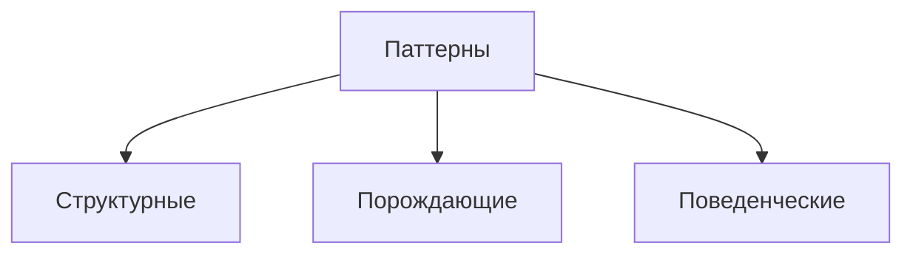

::: warning Текст слайда из PDF
ВИДЫ ПАТТЕРНОВ

• Структурные паттерны
  показывают различные способы
  построения связей между объектами.

• Поведенческие паттерны заботятся об эффективной коммуникации
  между объектами.
• Порождающие паттерны беспокоятся о гибком создании объектов без
  внесения в программу лишних зависимостей.
:::

**Слайд 6: ПАТТЕРНЫ**

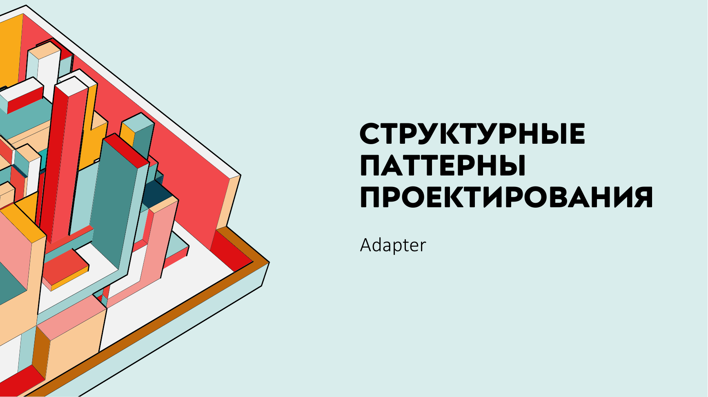

#### Adapter: решение, структура и применимость

**Слайд 9: РЕШЕНИЕ**
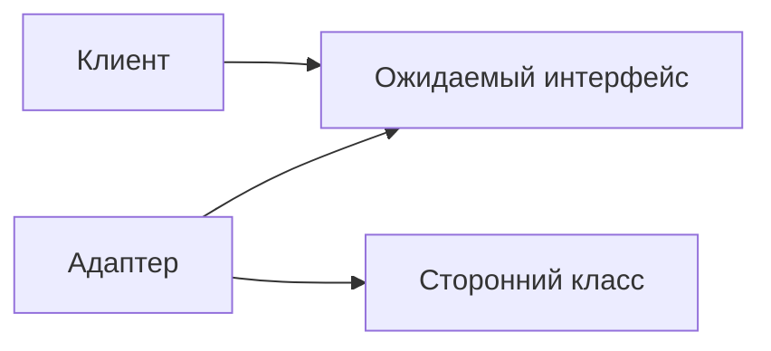

::: warning Текст слайда из PDF
РЕШЕНИЕ
Адаптеры могут не только переводить
данные из одного формата в другой, но и
помогать объектам с разными
интерфейсами работать сообща.

Это работает так:
1. Адаптер имеет интерфейс, который
   совместим с одним из объектов.
2. Поэтому этот объект может свободно
   вызывать методы адаптера.
3. Адаптер получает эти вызовы и          Иногда возможно создать даже двухсторонний
   перенаправляет их второму объекту.     адаптер, который работал бы в обе стороны
:::

**Слайд 10: СТРУКТУРА**
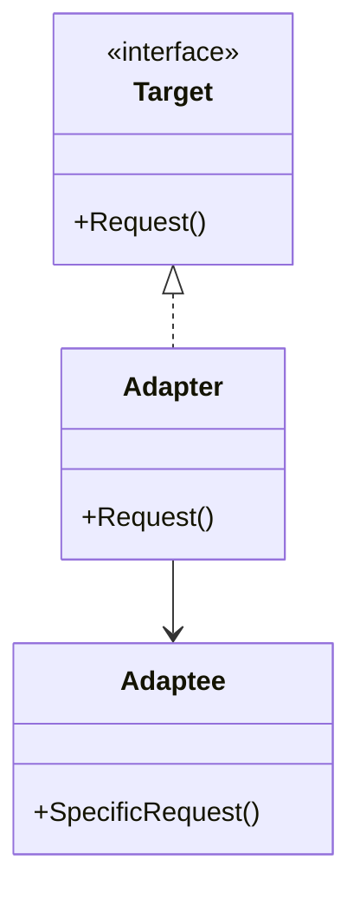

::: warning Текст слайда из PDF
СТРУКТУРА
1. Клиент — содержит существующую
бизнес-логику программы.
2. Клиентский интерфейс описывает
протокол, через который клиент может
работать с другими классами.
3. Сервис — сторонний класс, который
мы не можем использовать.
4. Адаптер — это класс, который может
одновременно работать и с клиентом,
и с сервисом. Он реализует клиентский
интерфейс и содержит ссылку на объект
сервиса
5. Работая с адаптером через интерфейс,   Эта **реализация** использует агрегацию:
клиент не привязывается к конкретному     объект адаптера «оборачивает»,
классу адаптера.                          то есть содержит ссылку на служебный объект.
:::

**Слайд 16: ПРИМЕНИМОСТЬ**
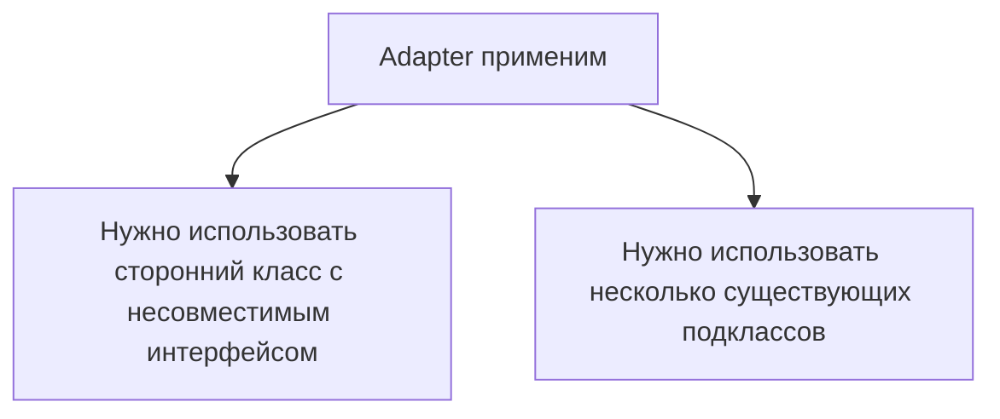

::: warning Текст слайда из PDF
ПРИМЕНИМОСТЬ

• Когда вы хотите использовать сторонний класс, но его интерфейс
  не соответствует остальному коду приложения.

• Когда вам нужно использовать несколько существующих
  подклассов, но в них не хватает какой-то общей
  функциональности, причём расширить суперкласс вы не можете.
:::

#### Adapter: оценки и переход к Facade

**Слайд 17: ПРЕИМУЩЕСТВА И НЕДОСТАТКИ**
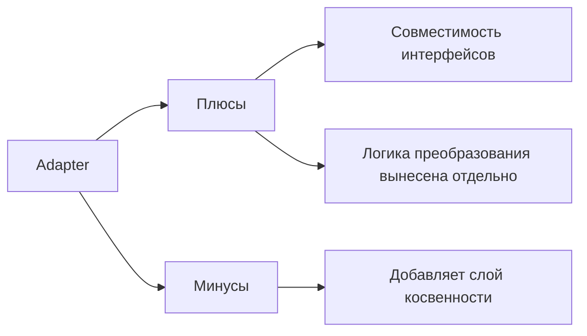

::: warning Текст слайда из PDF
ПРЕИМУЩЕСТВА И НЕДОСТАТКИ

       Отделяет и скрывает от клиента подробности
       преобразования различных интерфейсов.

                         Усложняет программу за счёт
                         дополнительных классов.
:::

**Слайд 18: ПАТТЕРНЫ**


#### Facade: пример, структура и применимость

**Слайд 21: ПРИМЕР ТЕЛЕФОННОГО ЗАКАЗА**
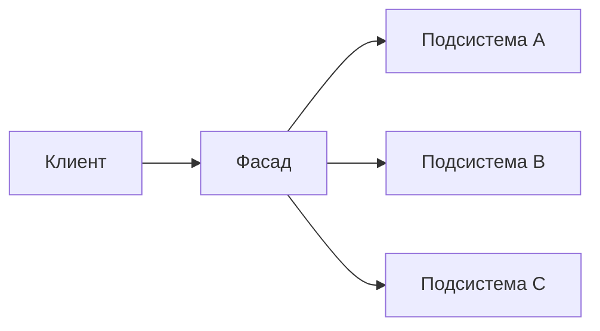

::: warning Текст слайда из PDF
ПРИМЕР ТЕЛЕФОННОГО ЗАКАЗА

                            Фасад полезен, если вы
                            используете какую-то
                            сложную библиотеку со
                            множеством подвижных
                            частей, но вам нужна только
                            часть её возможностей.
:::

**Слайд 22: СТРУКТУРА**
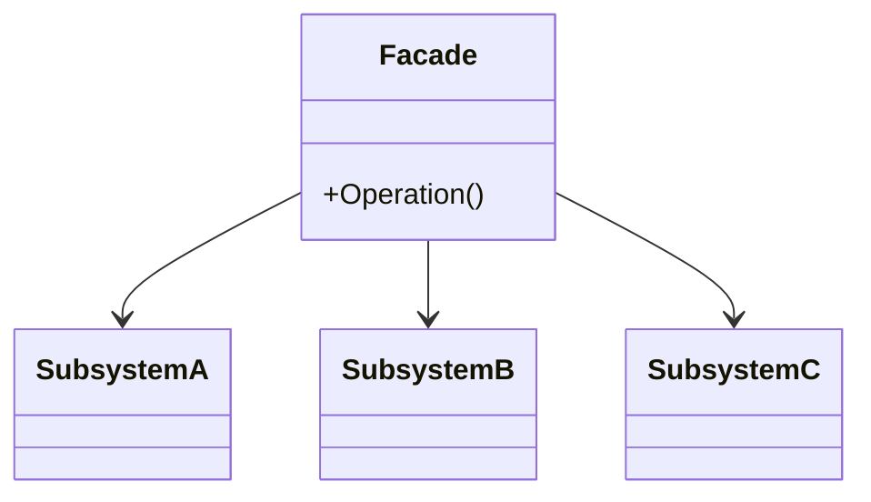

::: warning Текст слайда из PDF
СТРУКТУРА
1. Фасад предоставляет быстрый доступ к
определённой функциональности подсистемы.
2. Дополнительный фасад можно ввести,
чтобы не «захламлять» единственный фасад.
3. Сложная подсистема – сложная, нечего
добавить.
Классы подсистемы не знают о
существовании фасада и работают друг с
другом напрямую.
4. Клиент использует фасад вместо прямой
работы с объектами сложной подсистемы.
:::

**Слайд 29: ПРИМЕНИМОСТЬ**
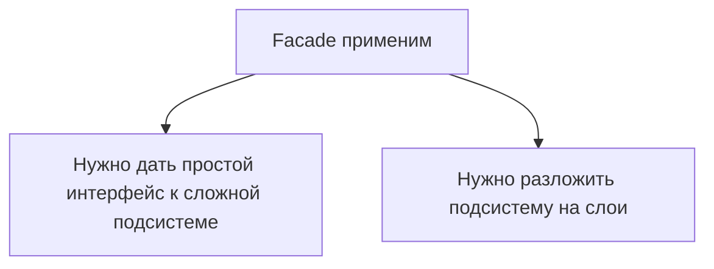

::: warning Текст слайда из PDF
ПРИМЕНИМОСТЬ

• Когда вам нужно представить простой или урезанный интерфейс к
  сложной подсистеме.
• Когда вы хотите разложить подсистему на отдельные слои.
:::

#### Facade и Proxy: оценки и структура

**Слайд 30: ПРЕИМУЩЕСТВА И НЕДОСТАТКИ**
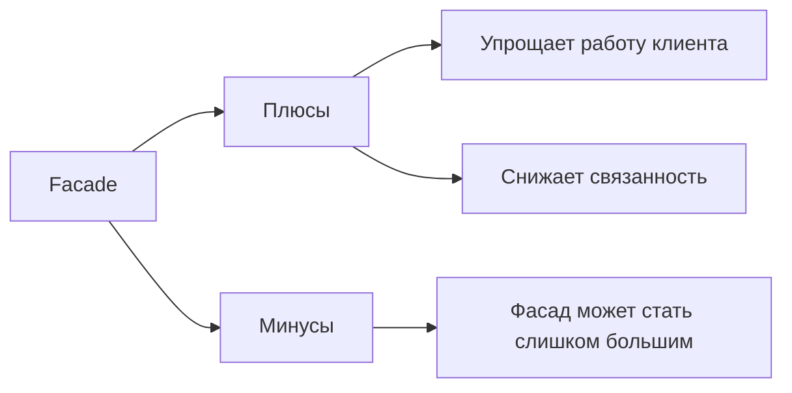

::: warning Текст слайда из PDF
ПРЕИМУЩЕСТВА И НЕДОСТАТКИ

        Изолирует клиентов от компонентов
        сложной подсистемы.

                         Фасад рискует стать божественным объектом,
                         привязанным ко всем классам программы.
:::

**Слайд 34: СТРУКТУРА**
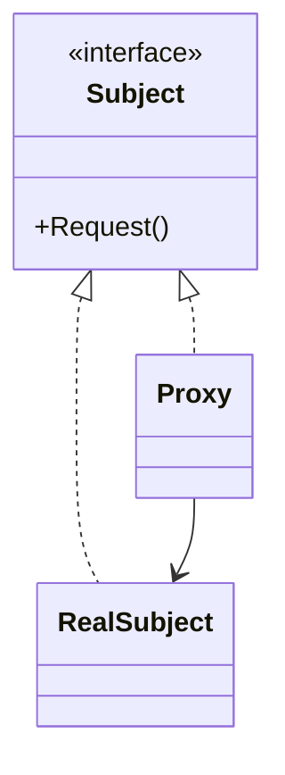

::: warning Текст слайда из PDF
СТРУКТУРА

1. Интерфейс сервиса определяет общий
интерфейс для сервиса и заместителя.
2. Сервис содержит полезную бизнес-
логику.
3. Заместитель хранит ссылку на объект
сервиса.
После того как заместитель заканчивает
свою работу, он передаёт вызовы
вложенному сервису. Заместитель
может сам отвечать за создание и
удаление объекта сервиса.
4. Клиент работает с объектами через
интерфейс сервиса.
:::

#### Proxy: применимость, оценки и переход к Decorator

**Слайд 40: ПРИМЕНИМОСТЬ**
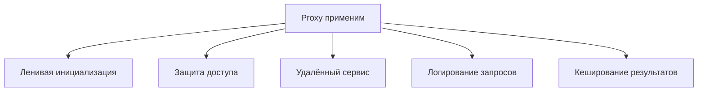

::: warning Текст слайда из PDF
ПРИМЕНИМОСТЬ

• Ленивая инициализация (виртуальный прокси). Когда у вас есть тяжёлый объект,
  грузящий данные из файловой системы или базы данных.
• Защита доступа (защищающий прокси). Когда в программе есть разные типы
  пользователей, и вам хочется защищать объект от неавторизованного доступа.
  Например, если ваши объекты — это важная часть операционной системы, а
  пользователи — сторонние программы (хорошие или вредоносные).
• Локальный запуск сервиса (удалённый прокси). Когда настоящий сервисный объект
  находится на удалённом сервере.
• Логирование запросов (логирующий прокси). Когда требуется хранить историю
  обращений к сервисному объекту.
• Кеширование объектов («умная» ссылка). Когда нужно кешировать результаты
  запросов клиентов и управлять их жизненным циклом.
:::

**Слайд 41: ПРЕИМУЩЕСТВА И НЕДОСТАТКИ**
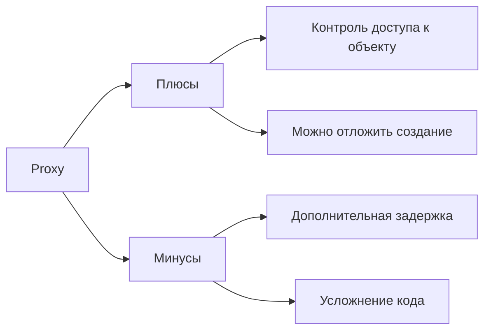

::: warning Текст слайда из PDF
ПРЕИМУЩЕСТВА И НЕДОСТАТКИ

       Позволяет контролировать сервисный объект незаметно для клиента.
       Может работать, даже если сервисный объект ещё не создан.
       Может контролировать жизненный цикл служебного объекта.

                             Усложняет код программы из-за введения
                             дополнительных классов.
                             Увеличивает время отклика от сервиса.
:::

#### Decorator: решение и структура

**Слайд 45: РЕШЕНИЕ**


::: warning Текст слайда из PDF
РЕШЕНИЕ

Наследование — первое, что приходит в голову.

Механизм наследования:
• Статичен. Вы не можете изменить поведение существующего объекта.
• Не разрешает наследовать поведение нескольких классов одновременно.

Обойти эти проблемы можно агрегацией либо композицией
:::

**Слайд 46: РЕШЕНИЕ**
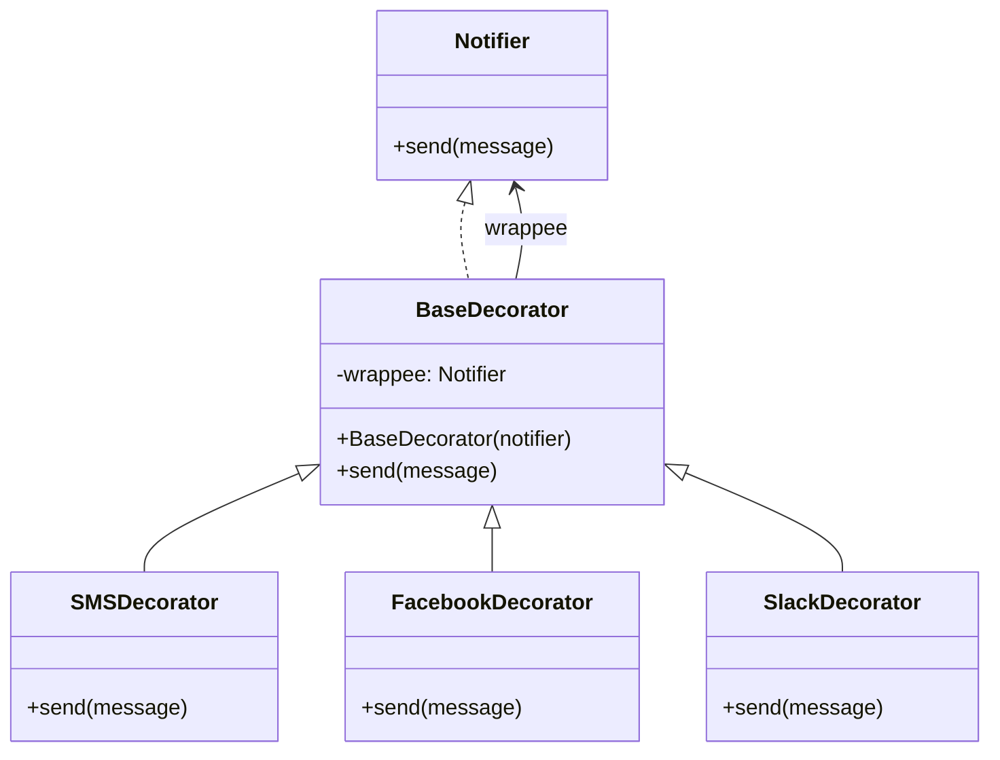

::: warning Текст слайда из PDF
РЕШЕНИЕ

Оба объекта имеют общий интерфейс, поэтому
для пользователя нет никакой разницы, с каким
объектом работать — чистым или обёрнутым.
:::

**Слайд 47: СТРУКТУРА**
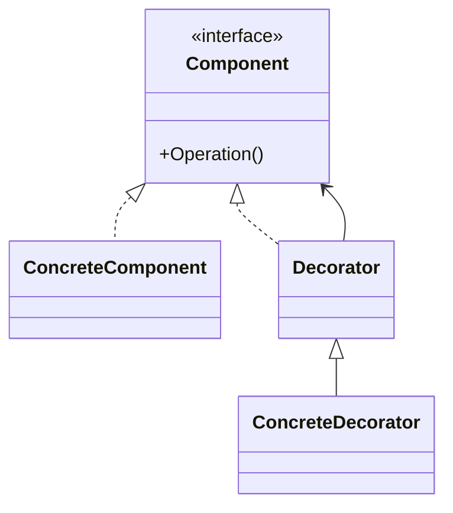

::: warning Текст слайда из PDF
СТРУКТУРА
1. Компонент задаёт общий интерфейс обёрток
и оборачиваемых объектов.
2. Конкретный компонент определяет класс
оборачиваемых объектов. Он содержит какое-то
базовое поведение, которое потом изменяют
декораторы.
3. Базовый декоратор хранит ссылку на вложенный
объект-компонент..
4. Конкретные декораторы — это различные вариации
декораторов, которые содержат добавочное
поведение. Оно выполняется до или после вызова
аналогичного поведения обёрнутого объекта.
5. Клиент может оборачивать простые компоненты и
декораторы в другие декораторы, работая со всеми
объектами через общий интерфейс компонентов.
:::

#### Decorator: пример, применимость и оценки

**Слайд 49: РАССМОТРИМ НА ПРИМЕРЕ**

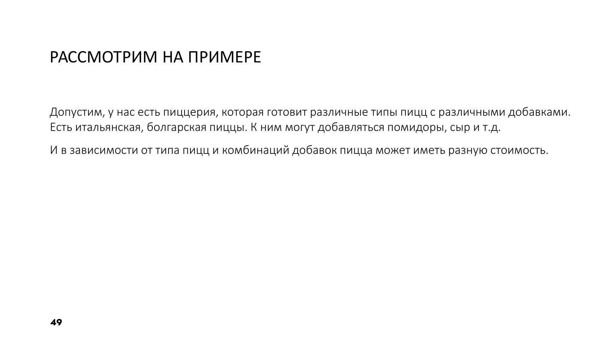

**Слайд 53: ПРИМЕНИМОСТЬ**
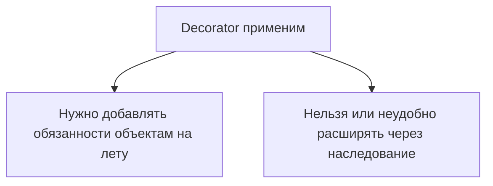

::: warning Текст слайда из PDF
ПРИМЕНИМОСТЬ

• Когда вам нужно добавлять обязанности объектам на лету,
  незаметно для кода, который их использует.
• Когда нельзя расширить обязанности объекта с помощью
  наследования.
:::

**Слайд 54: ПРЕИМУЩЕСТВА И НЕДОСТАТКИ**
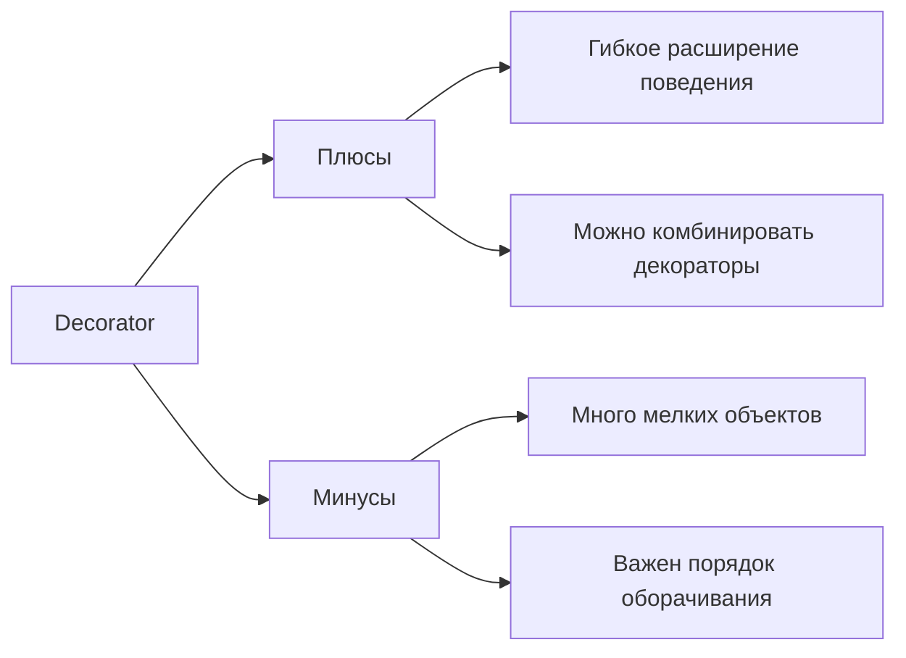

::: warning Текст слайда из PDF
ПРЕИМУЩЕСТВА И НЕДОСТАТКИ

       Большая гибкость, чем у наследования.
       Позволяет добавлять обязанности на лету.
       Можно добавлять несколько новых обязанностей сразу.
       Позволяет иметь несколько мелких объектов вместо
       одного объекта на все случаи жизни.

                            Трудно конфигурировать многократно
                            обёрнутые объекты.
                            Обилие крошечных классов
:::

#### Flyweight: решение, структура и оценки

**Слайд 58: РЕШЕНИЕ**
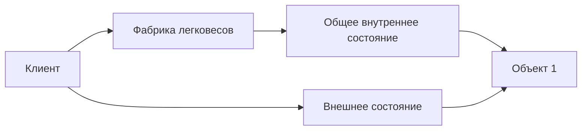

::: warning Текст слайда из PDF
РЕШЕНИЕ

Паттерн Легковес предлагает не
хранить в классе внешнее состояние,
а передавать его в те или иные
методы через параметры.

Таким образом, одни и те же объекты
можно будет повторно использовать
в различных контекстах.

         В нашем примере с частицами достаточно
         будет оставить всего три объекта с
         отличающимися спрайтами и цветом —
         для пуль, снарядов и осколков
:::

**Слайд 59: СТРУКТУРА**
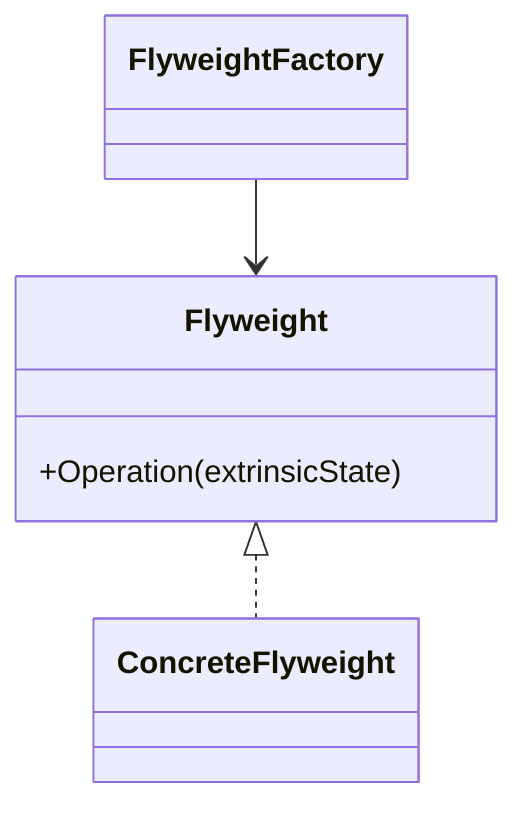

::: warning Текст слайда из PDF
СТРУКТУРА
1. Вы всегда должны помнить о том, что
Легковес применяется в программе, имеющей
громадное количество одинаковых объектов
2. Легковес содержит состояние, которое
повторялось во множестве первоначальных
объектов.
3. Контекст содержит «внешнюю» часть
состояния, уникальную для каждого объекта.
4. Поведение оригинального объекта чаще всего
оставляют в Легковесе, передавая значения
контекста через параметры методов.
5. Клиент вычисляет или хранит контекст, то есть
внешнее состояние легковесов.
6. Фабрика легковесов управляет созданием и
повторным использованием легковесов.
:::

**Слайд 60: ПРИМЕНИМОСТЬ**
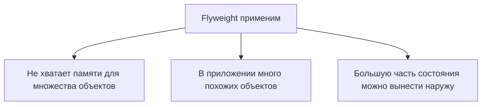

::: warning Текст слайда из PDF
ПРИМЕНИМОСТЬ

• Когда не хватает оперативной памяти для поддержки всех нужных
  объектов.
• Эффективность паттерна Легковес во многом зависит от того, как и где
  он используется. Применяйте этот паттерн, когда выполнены все
  перечисленные условия:
     • в приложении используется большое число объектов;
     • из-за этого высоки расходы оперативной памяти;
     • большую часть состояния объектов можно вынести за пределы их классов;
     • большие группы объектов можно заменить относительно небольшим
       количеством разделяемых объектов, поскольку внешнее состояние вынесено.
:::

#### Flyweight: применимость и оценки

**Слайд 61: ПРЕИМУЩЕСТВА И НЕДОСТАТКИ**
```mermaid
flowchart LR
    Flyweight[Flyweight] --> Pros[Плюсы]
    Flyweight --> Cons[Минусы]
    Pros --> Memory[Экономия памяти]
    Cons --> Complexity[Сложнее разделять внутреннее и внешнее состояние]
```

::: warning Текст слайда из PDF
ПРЕИМУЩЕСТВА И НЕДОСТАТКИ

       Экономит оперативную память

                         Расходует процессорное время на
                         поиск/вычисление контекста.
                         Усложняет код программы из-за введения
                         множества дополнительных классов.
:::

Сегодня ставим точку на паттернах проектирования и рассматриваем структурные паттерны. Роль всех структурных паттернов на самом деле показать различные способы взаимодействия объектов между собой. Некоторые паттерны будут достаточно похожими друг на друга. Но как мы будем их отличать?

На самом деле, у ML-диаграммы иногда даже паттернов совпадают. Но помните, как-то я сказал, что к паттернам надо относиться как не к способу решения какой-то проблемы. А чтобы запомнить все эти паттерны, лучше смотреть, а какую в принципе проблему мы можем получить. И в дальнейшем вы уже вспомните, ага, я где-то о такой-то проблеме слышал, давайте-ка я почитаю книжку про паттерны, посмотрю, где эта проблема и каким паттерном она закрывается. Сегодня мы прямо будем видеть одинаковые паттерны, но я буду постоянно напоминать, а помните, какая проблема решалась этим паттерном и какая проблема решается данным паттерном, несмотря на то, что они могут быть похожи как минимум по ОМЛ-диаграммам.

Мы сегодня не успеем рассмотреть все паттерны, потому что не все они популярны на самом деле. И некоторые паттерны, которые экономят память, легковес, они уже действительно в современных реалиях не так необходимы, как это было 50 лет назад, да? Ну и ладно, как 30 лет назад. Вот, поэтому часть паттернов мы оставим за пределами этой лекции, но ссылки на рекомендуемые литературы я вам скину. Так, как я и сказал... Идея всех структурных паттернов – это сделать из нескольких классов более сложные конструкции. Или позволить некоторым разным объектам, допустим, объектам, реализующим разный интерфейс, взаимодействовать друг с другом. То есть выстраивать из простых структур более сложные структуры.

По этой идеологии их объединили в группу структурных паттернов. Есть, правда, такие небольшие нюансы. Допустим, паттерн-декоратор. Там к нему есть вопросы, как он оказался в структурных паттернах, а не порождающих. Но доберемся до декоратора, увидим, в чем его особенность. Останавливаться на описание всех паттернов мы не будем, потому что сейчас мы их по отдельности будем разбирать. И, как я говорил, три останутся за скобками.

### Adapter

Ну, начнем с самого, наверное, легкого, примитивного паттерна **Adapter**. Он настолько на самом деле прост, что даже можно было бы не разбирать пример, а просто показать вам картинку, и вы бы сказали, о, мы это делали.

Давайте представим такую ситуацию. Мы пишем информационную систему, которая получает с биржи... некую информацию, но получает в XML-формате. И наша информационная система по поступившим данным на основании их анализа начинает строить графики. Графики курса валют, графики стоимости ценных бумаг и так далее. У нас, в принципе, хорошая информационная система, но через какое-то время мы увидели, что есть хорошие аналоги. Они строят более красочные дашборды, и в целом стоит библиотека недорого. Но вот проблема. Мы получаем данные в XML-формате, и наша информационная система готова работать с этим XML-форматом, а то, что мы готовы купить, только принимает JSON. И видите, в чем проблема? Проблема не в том, что нам сложно переписать... данную библиотеку.

Она в принципе закрыта. То есть это же не проблема, это невозможно. Казалось бы, ну давайте тогда мы будем запрашивать данные в другом формате. Ну, данные в другом формате тоже нам не подвластны. Вот. API биржи выдает именно XML. Вариант решения это прибегнуть к паттерну адаптер. Но вам может показаться, что адаптер служит только для того, чтобы Переделать один формат, то есть один формат данных в другой формат данных. Ну или говоря о классах, можно подумать, что адаптер нам позволит нашему клиентскому коду, который работал с объектами одного интерфейса, взять и начать работать с объектами, которые реализует другой интерфейс. Но в примитивном случае это действительно так.

То есть можно посмотреть на картинку, и мы видим, что наша программа была готова работать с XML-документом. И по каким-то причинам мы не готовы переписывать нашу программу. Мы хотим, чтобы она продолжала работать с XML-документом. Но мы понимаем, что также нам необходимо будет подключаться к библиотеке, которая потребляет данные в JSON. Мы пишем адаптер. Но на самом деле... У адаптера есть и дополнительные возможности. Он может не просто... Ну, давайте, такая ситуация. Смотрите, у нас есть класс автомобиль, который имплементирует интерфейс, там, не знаю, iCar. И в нем есть метод Drive. Есть другой прямо мир. Там есть животные, и они имплементируют интерфейс iMove. Вот, с методом Move. И вот у нас две разные иерархии. Есть водитель.

И водителю надо бы работать, но как бы водитель, он все-таки управляет автомобилем. Но время от времени он должен пересаживаться на гужевые повозки, которые на лошадях. И можно подумать, что нам надо адаптировать. Этот интерфейс. Ну, это действительно так. Адаптировать его под наш клиентский код. Но в момент адаптации мы можем добавить дополнительные функции. Мы можем объединить ряд функций того интерфейса в какой-то один наш метод, который нам необходим. То есть скрытая возможность адаптера, это на самом деле еще и использовать его там, где невозможно расширить функциональность какого-то класса за счет... Применение наследования. Представьте, у вас есть базовый класс. Вы бы хотели его использовать, но для того, чтобы добавить пару своих методов.

Но он запечатан. Он запрещен для наследования. Вы можете написать адаптер, который будет реализовывать тот интерфейс. И, собственно, сейчас мы увидим. Точнее, вы можете написать адаптер, который будет... композировать с тем классом, который нам нужно расширить, и дополнять его какими-то функциями. То есть, несмотря на то, что он называется просто адаптер, это не означает, что он используется только для того, чтобы садаптировать неподходящий нам тип для нашей системы. Еще иногда его можно использовать для того, чтобы воспользоваться как альтернативой наследования.

Давайте посмотрим механизм, как это реализуется внутри, в диаграмме классов.

Давайте обратим внимание на то, что у нас есть клиентский код. Это тот код, который готов работать с известными нам интерфейсами. Соответственно, у нас есть интерфейс клиента. То есть это тот набор методов, ну или те типы данных, которые будут реализовывать данный интерфейс. Клиент с ними готов работать. Но есть еще и некий сервис, который мы хотим использовать, но он реализует набор совершенно других интерфейсов. Либо вообще он из другой библиотеки, и мы о нем ничего не знаем. И, соответственно, мы не можем уже переписать клиентский код по каким-то причинам, потому что он уже используется и другими модулями. То есть мы не можем переписать методы клиентского кода, чтобы они научились работать с нужным нам новым сервисом.

Мы должны оставить клиентский код и работать с новыми подключаемыми типами, как будто бы это старые типы. И тогда у нас должен появиться вот этот класс **Adapter**, который каким-то ассоциативным способом, либо **агрегация**, либо **композиция**, имеет ссылку на тот класс сервис, которым он хочет пользоваться. Но в то же время Adapter реализует интерфейс, который знаком нашей системе. И таким образом мы для нашей системы, для этого клиента, готовы предоставить класс Adapter, который будет знакомого интерфейса для клиента. То есть он будет реализовывать тот интерфейс, с которым клиент может работать. И в то же время Adapter хранит ссылку на тот объект, который нам необходимо адаптировать.

И таким образом клиент даже не понимает, что он работает. с каким-то совершенно незнакомым ранее ему сервисом, каким-то незнакомым ранее классом, который, возможно, реализует совершенно другие интерфейсы. Но он скрывается внутри адаптера, и адаптер просто делегирует вызовы вот этого вот метода. Этот метод делегирует работу методом того класса, который нужно адаптировать. В коде это, на самом деле, видно гораздо более явно. Смотрите, есть клиентский код. Он работает с объектом целевым, но с тем, с кем умеет таргет. Этот класс таргет имеет какой-то реквест. Метод совершенно здесь как бы нам сейчас не важный. Но смотрите, у нас также есть класс, который необходимо садаптировать. У него метод совершенно называется иначе.

Но проблема в том, что мы клиентский код переписать не можем. Здесь необходимо принимать таргет и вызывать метод реквест. Казалось бы, можно было бы принимать адаптируемый объект, вот этот вот, и вызывать специфичный метод реквеста. Но еще раз повторюсь, в ситуации, когда клиентский код уже утвержден и изменить его нельзя, но хочется пользоваться новым классом, вы можете его садаптировать к вашему интерфейсу. Пишите адаптер, который либо реализует интерфейс, либо наследуется от того класса, с которым умеет работать клиент. Все, он сохранит ссылку на этот класс, на объект этого класса. И дальше уже реализуя метод request, он вызывает метод того класса, который он адаптирует, то есть делегирует управление тому методу. Здесь, конечно, все достаточно...

В примере банально. Я говорю, что в реальной жизни чаще всего либо метод, который понятен для клиента, он может вызывать несколько специфичных методов адаптируемого класса. Он может дополнять какие-то методы, которых у специфичного класса нет. Ну и в связи с этим как раз дополнительная возможность. То есть, по сути, мы не унаследовались от того объекта, который необходимо адаптировать. А мы его внутрь адаптера расположили. Какие-то методы, возможно, напрямую просто вызываем, делегируем. Адаптер делегирует адаптируемому объекту. А, возможно, очень часто бывает, что у адаптера появляются еще дополнительные функции.

Таким образом, получается, мы сделали альтернативу наследования. У нас вроде бы это... И адаптер, правда, он не наследник, а он за счет композиции может работать с адаптируемым объектом. Но мы еще за счет адаптера можем добавить какой-то функционал.

Давайте пример посмотрим более реалистичный. Чуть-чуть больше объектов у нас будет. Пример тот, который я сказал. Есть водитель, который передвигается на автомобиле. И когда на автомобиле он доезжает до пустыни, нам необходимо отдать ему верблюда. Но верблюд, он как бы совершенно из другой иерархии. Он реализует совершенно другие интерфейсы. Автомобиль реализует свой интерфейс, верблюд свой интерфейс. Водитель изначально работал с классом автомобиль. Но ему теперь необходимо пересесть на верблюда. То есть у нас получается два разных мира с разными интерфейсами. И мы должны... Работали раньше с одним миром.

Теперь наш клиентский код должен научиться работать и с миром животных. И тут важно понять, что у нас нет возможности изменить клиентский код, и у нас нет возможности изменить ту библиотеку, которую мы приобретаем.

Давайте рассмотрим. Слева у нас есть мир, который был. То есть это то изначально, с кем работал класс Driver. Driver здесь является, в терминологии данного паттерна, он является... То есть с точки зрения того, что драйвер использует класс интерфейса iTransport. То есть у нас изначально был интерфейс iTransport с методом drive. И, соответственно, машина его имплементировала, и клиентский код мог работать с объектами этого интерфейса. Возможно, были разные у нас автомобили, лодки. Главное, что они все были транспорт. Но потом мы покупаем стороннюю библиотеку. где реализованы верблюды, лошади и так далее. Но они не стыкуются. Они по смыслу стыкуются. То есть мы понимаем, что да, там есть методы, которые нам нужны. Но по интерфейсам они не стыкуются.

Их там назвали интерфейс iAnimal и метод Move. Но мы понимаем, что это Drive. Но наш клиентский код мы трогать не можем. Мы не можем сказать, что ты теперь принимаешь iAnimal, потому что есть другие модули. которые работают с драйвером и передают ему все-таки автомобили. А у нас еще появляется новый модуль с возможностью пересесть на верблюда. Поэтому выход какой? Мы должны взять нашего верблюда, преобразовать его в транспорт. Но здесь опять будет достаточно примитивное и банальное делегирование метода drive, методу move у верблюда. Но еще раз вы должны понимать, что в реальности... Скорее всего, класс **Adapter**, возможно, добавит какие-то недостающие методы верблюду.

Возможно, все-таки будет так, что у того класса, который мы приобретаем, у верблюда два метода, которые необходимо вызвать в методе Drive. Поэтому отнеситесь к этому как к примеру, а на семинарах будем разбирать уже более подробно на чуть больших задачах. Смотрите, адаптер, который садаптирует верблюда к транспортному средству. Мы говорим, что адаптер реализует интерфейс, с которым готов работать клиентский код, то есть с которым работает драйвер. И адаптер знает о том объекте, который он должен адаптировать, то есть о верблюде. И единственное, что такого важного делает адаптер, ну или обязательно, точнее, что он должен делать, он должен делегировать метод интерфейса iTransport, это тот метод, который знаком клиенту, то есть драйверу.

Он должен его делегировать к соответствующему методу адаптируемого объекта, который мы меняем. Вот и все. Да, кстати, это проговорить надо. Адаптер строится... Либо на композиции, либо на агрегации. Это мы посмотрели пример агрегации, а предыдущий формальный был с композиции. То есть вот этот адаптируемый объект попадает в адаптер, либо попадает, либо создается внутри. Все зависит от того, от логики программы. Ну и, собственно, основная программа. Был водитель, был автомобиль, он отправился в путешествие. И в какой-то момент времени ему необходимо пересесть на другой вид транспорта. Другой вид транспорта перед ним уже стоит, и он его начинает адаптировать. Говорит, что, слушай, вот я создам такой объект, с которым может работать клиент.

Клиентский код. Мы создали этот Camel Transport, кинули в наш адаптер верблюда. И дальше наш клиентский код продолжает работать с этим объектом, как будто бы это обычный транспорт, такой же, как и автомобиль. Когда мы его применяем? Когда сторонний класс Camel реализует совершенно другие интерфейсы или, в принципе, не подходит своим типам для работы клиентского кода. Второй вариант, когда мы можем также реализовать, когда необходимо... Когда необходимо разные классы соединить во что-то одно цельное. И добавить им определенную функциональность дополнительную. Тоже, в принципе, неплохо воспользоваться адаптером. Плюсы и минусы.

- Минус, как всегда.

Усложняется инфраструктура. И, возможно, это будет, я бы не сказал, неоправданно. Вариантов, если вам уж нужно использовать адаптер, то придется его использовать. Либо переписывать ту библиотеку, которую вы хотите адаптировать, либо все-таки писать адаптер. Плюсы он отделяет и скрывает у нас от клиентского кода, то есть от драйвера. Скрывает особенности того класса, который мы хотим адаптировать. И получается, что клиентский код вообще не понимает про тот интерфейс ничего. И работает с новым объектом, который мы садаптировали уже к известному интерфейсу для клиента. Ну и таким образом от клиента скрывается вся эта переработка одного типа в другой тип. Второй паттерн структурный. 100% вы его наверняка где-то доиспользовали.

Он просто прям интуитивно понятный. Он настолько понятный, что это единственный паттерн, для которого не нарисовали умель диаграмму. Даже для синглтона нарисовали диаграмму из одного класса, а здесь, в принципе, ее не существует. Но, конечно, можно так образно изобразить. Я нашел подходящую картинку.

Давайте посмотрим.

### Facade

Значит, основная идея фасада. Представьте, у вас пару десятков объектов очень сложных типов. У каждого объекта по 20-30 методов. И для того, чтобы выполнить какой-то функционал, да вот, смотрите, IDE-шка, да? Казалось бы, мы запускаем просто зелененькую кнопочку, да? Ну, в лучшем случае, знаете, там F5, да? Но в реальности что происходит? IDE-шка — это текстовый редактор, это компилятор, это CLR, которая выполняет код, если это .NET, ну, или там JVM для любителей. То есть это... Три компонента, которые работают. При этом вряд ли кто-то, ну, я думаю, меньшинство из нас сможет написать в обычном блокноте, вызвать компилятор, а потом еще и запустить это все в CLR. То есть для нас предоставлен фасад.

И ДЕшка это фасад, который позволяет работать со сложными системами. Вот то же самое и этот паттерн. То есть он нам дает фасад для клиентского кода, оберегая от всей этой жути. С одной стороны, можно писать плохой, ужасный код, не соблюдать принципы солид, вообще писать, как будто у вас пальцы переломаны, и спрятать это все за фасадом. И показывать только пару методов. Это был это, серия вредные советы, так не надо делать. Но, по сути, действительно многие фреймверки предоставляют нам просто фасад. Что там происходит внутри, иногда, наверное, лучше и не знать. Так, значит, еще раз. Идея паттерна – предоставить простой понятный интерфейс клиентскому коду, который будет скрывать сложность работы с кучей подсистем.

Один-единственный минус у этого паттерна, забегая вперед на 7 слайдов. Он может раздуться до суперкласса и будет нечитаемым. То есть мы будем не понимать, что в реальности, с какими подсистемами он работает, и он превратится в божественный класс. Вот, это реально плохо. Но, кстати, фасад может иметь действительно урезанный функционал. То есть подсистемы могут гораздо больше, чем предоставляет нам фасад. Фасад нужен для такого легкого программирования на клиенте. чтобы не перегружать клиентский код и не мучить тех программистов, которые пишут вот этот код, используя ваш фасад. То есть, представляете, либо погрузить человека в кучу, большое количество подсистем, либо просто сказать, не парься, создай экземпляр фасада, вызови вот этот метод один.

Если будет плохо, еще метод два вызови. А то, что там происходит внутри... Работа там 30 каких-то модулей. Ну, ты типа не переживай. Но если нам нужно, мы можем всегда работать и с подсистемами. То есть фасад очень часто не ограничивает доступ к подсистемам. Он говорит, что окей, вы можете работать и с фасадом, но если вы сильно умный или вам сильно надо, вы можете и с подсистемами напрямую работать. То есть фасад не запрещает очень часто. Но мы не говорим сейчас про фреймверки, которые вот запечатаны и дают нам... Там какой-нибудь **entity** framework, который дает нам возможность работать с базами данных через идеологию ORM. Там все, у нас нет возможности, есть только DB-контекст, с которым мы работаем.

Но если мы сами пишем, то чаще всего мы пишем фасад для упрощения. Но классы публичные остаются, и клиентский код может и с ними тоже работать. А какие-то очень часто используемые методы... или очень часто используемый функционал, мы реально делаем усеченный фасад с небольшим количеством методов, часто используемых, и предоставляем уже на клиента. Примером из жизни может служить покупка в интернет-магазине, в каком-нибудь маркете. Вы нажимаете просто кнопочку «Купить», а чего там в реальности происходит после того, как вы нажали кнопочку «Купить»? Там банковская операция, уплата налогов. Склады сразу начинают работать и искать, с какого склада вам это отправить. То есть это тоже фасад.

Ну, IDE-шка, да, это тоже для вас, наверное, более понятный фасад.

Значит, как я говорил, диаграммы, она есть, да, мы можем посмотреть ее. Но она образная, он совершенно по-разному реализуется. Здесь я показал, что есть некий клиентский код, который бы хотел работать с кучей подсистем. Ну, как бы... ума не хватает, ну или времени нету разбираться. Или мы в принципе можем опасаться, что с нашим вот этим болотом достаточно можно, если неосторожно работать, то чего-нибудь сломать. Поэтому мы говорим, слушайте, не лезьте сюда, мы вам создадим фасад, в нем будет пару методов. Один сделать все, другой сделать хорошо. И вот пользуйтесь ими. Но для того, чтобы фасад не стал божественным классом, который соберет в себе знания о всей системе. Иногда еще выделяют подфасады.

Усеченные фасады, которые делают определенный функционал. Но это как бы тоже уже не часть данного паттерна. То есть это даже не паттерн, это идея. Спрятать кучу всякого непонятного за стеной и оставить только пару дверей.

Давайте примерчик. Есть несколько подсистем. Подсистема А, подсистема Б, С. У каждого свои методы. А, Б, С. Есть класс фасад, который через DI, ну или каким-то образом, или через композицию, или через внедрение зависимости, получает подсистемы. И дает нам, как нам необходимо. Нужно нам два метода. Один сделать все, другой сделать часть. Получается, что программисту клиентскому коду, ну давайте клиентский код, вот он справа, клиентскому коду достаточно просто создать фасад, передать все подсистемы, ну или с помощью DI-контейнера их забрать к себе, и дальше программист, если мы еще методы хорошо назовем, хочешь это, сделай метод, соответственно, говорящий, то он будет вызывать этот метод.

Давайте рассмотрим на примере, ну пример как раз связанный с IDE. То есть у нас будет текстовый редактор, будет компилятор и будет CLR. Ну, конечно, в режиме имитации. Так, три класса. Текстовый редактор имеет свои методы. Позволяет нам печатать код и сохранять код. Компилятор компилирует тот код, который написал текстовый редактор. CLR может запустить и остановить. выполнения программы. И вот теперь смотрите, программисту, который будет являться клиентом в этом случае, клиентом этих сложных подсистем, ему необходимо понимать, чтобы написать Hello World, он должен обратиться к текстовому редактору Create Save. Только потом он должен скомпилировать и потом запустить. А этот метод вызывать только в том случае, если необходимо остановить программу.

То есть, видите, ему необходимо знать... в какой последовательности подсистемы должны отработать и какие методы вызвать у этой подсистемы. Но это может быть достаточно трудозатратно. Поэтому мы пишем фасадный класс IDE, которая будет агрегировать в себе через внедрение зависимости эти объекты и, собственно, определять методы старт и стоп. То есть кнопочка зеленая, кнопочка красная. И мы просто прописываем методы, которые необходимо выполнить в нужный нам момент. Ну и теперь мы можем посмотреть. Создадим еще класс «Программист», который будет принимать IDE-шку и, соответственно, время от времени запускать и останавливать. В основном методе создаем IDE-шку и передаем программисту в метод «Создай приложение». Когда применять?

Когда мы хотим облегчить жизнь вот этих людей, которые пишут две строчки кода. Они просто хотят создать... Точнее, они просто хотят, чтобы программа заработала. И для этого они должны создать наш фасад. Если еще и повезет, то в **DI-контейнер** сам передаст зависимости фасаду. Ну а дальше он просто передает уже клиентскому коду этот фасад. Все. И второе. Ну, здесь так звучит, когда мы хотим разложить подсистемы на отдельные слои. Но действительно у нас получается будет слой фасада и отдельно слой подсистем. Ну а если у нас еще и фасады, несколько фасадов, фасад под фасад, то действительно можно добиться некого такого расслоения. Плюсы и минусы. Мы оберегаем клиентский код от кучи подсистем.

А минус, как я и говорил, это то, что рано или поздно, если все пихать в один фасад, то, по сути, чего вы добьетесь? Что ваш основной код main — это будет создание одного класса, и у этого класса 100-500 методов, и фиг пойми, какие за что отвечают. Но для этого можно создавать подфасады. Но вообще лучше более обдуманно. То есть, действительно, если вы видите, что это часто используемый функционал, доступ к подсистемам вы не запрещаете, Часто используем функционал, оборачиваете в фасад и на клиента даете более такой облегченный урезанный интерфейс ваших подсистем. Структурные паттерны.

### Proxy

Прокси. Сейчас вам может показаться, что прокси похож на адаптера. Но давайте вспомним, что такое адаптер. Адаптер все-таки, он какую проблему решал? Он решал проблему, что есть один мир, в нем свои интерфейсы, и наш клиентский код... работал с этими интерфейсами. И мы не можем менять клиентский код. Он должен работать с этими интерфейсами. И появляется другой мир со своими типами данных, со своими интерфейсами. Наш клиентский код не может их изменить, потому что это закрытая библиотека. Но нам надо с ними работать. Но мы не можем себя переписать. Свои привычки мы уже не изменяем. Поэтому мы говорим, что вы адаптируйтесь к этому интерфейсу. Вот я создам класс. Он будет реализовывать этот интерфейс, а вы будете в этот класс включены.

Агрегации либо композиции. И я буду с вами работать через адаптер. В **Proxy** вам может сейчас показаться, что то же самое. Но физически он даже реализуется практически так же. Но смысл у него такой. У вас есть какой-то объект, который возможно очень долго создавать. Или если вы его создадите, он будет очень долго... Много весить. А шанс, что он вам в принципе понадобится, мизерный. Один на миллион. Есть ли смысл его создавать? Вы скажете, ну зачем тогда создавать, есть ленивая инициализация. А если она не разрешена? Допустим, вы не можете сделать отложенную инициализацию, потому что вам нужно экземпляр этого объекта внедрить как зависимость в какой-то класс. То есть вам его тогда придется создавать.

Не факт, что он потребуется к классу, куда вы внедряете, но создать-то надо. И вот тогда мы можем использовать прокси. То есть, вот смотрите, у адаптера была **композиция** с тем объектом, который он адаптирует. И у прокси есть композиция либо **агрегация** с тем, кого он адаптирует. Но вот тут, как я говорю, нужно включить правило, а какую проблему решает. Адаптер решает... проблему несовместимости двух миров, а прокси решает проблему, что у нас есть тяжеловесный класс, или в принципе это какой-то сервис удаленный, но мы можем создать на клиенте его прокси, и в случае необходимости он как бы создаст. Обратиться к удаленному реальному объекту. То есть кто такой прокси?

Это вот бедный... несчастный человек который работает а тот кого он замещает отдыхает и клиенты то есть код которому нужен этот реальный объект он работает с прокси возможно прокси часть проблем будет решать посмотрите к примеру загрузка фотографий у нас прокси может хранить фотографии урезанного качества это будет быстрее показывать клиенту фотографии урезанного качества Но если клиент скажет «увеличь» или «хочу более хорошее качество», то тогда мы начнем у реального объекта, возможно, это база данных, запрашивать картинку более хорошего качества. Но чтобы сразу не грузить картинку хорошего качества, мы в проксе передаем картинки плохого качества.

Ну, он изначально их хранит. перенаправлять к тяжеловесному объекту или к объекту, который долго создается, и, возможно, он в большинстве случаев-то и не нужен. Ну, вы можете сказать, да, давайте тогда отложенную инициализацию, типа вот lazy load какой-нибудь. Но еще раз, да, lazy load не всегда отрабатывает, не всегда он нам подходит. Иногда нам нужен объект. для того, чтобы создать другой объект, чтобы этот внедрить как зависимость, потому что второй не создадим. Но со вторым мы работаем, но не факт, что второй пользуется тем, что мы внедрили. Поэтому вариант какой? Создать заместителя, и клиенты будут работать с заместителем. Если заместитель не может решить проблему, то тогда он отдает приказ этому реальному объекту. Ну вот вы говорите фасад.

Допустим, мы на заместителя можем положить, возложить, точнее, обязанности логирования. Можем возложить обязанности инфобеза, он, допустим, будет проверять, а этому клиенту доступ, допустим, к этому объекту разрешен, не разрешен. Мы можем расширить какими-то функциональными возможностями. То есть, допустим, у реального объекта их не хватает, ну, так же, как у адаптера. Мы можем заместить, ну, заместителю, чтобы он предварительно что-то делал, потом работа реального объекта, потом по финализации еще что-то сделал. В целом, вообще, как бы грань между паттернами, она иногда может истираться. Так, значит, структура паттерна, в принципе, несложная.

Значит, смотрите, наверное, начнем мы с интерфейса. Интерфейс — это те методы, с которыми работает наш клиент, то есть клиентский код. Он, допустим, обращается к какому-нибудь репозиторию. И клиент знает, что он работает с интерфейсом репозитория, с хранилищем. У него есть набор CRUD-операций. Вот этот набор CRUD-операций описан в интерфейсе. И этот интерфейс реализует и реальный сервис, к которому доступ сразу мы не даем, потому что он ресурсоемкий, тяжелый. Он, возможно, где-то на удаленном другом микросервисе находится. То есть мы даем доступ вот к этому прокси. Он тоже реализует этот интерфейс. И имеет агрегацию, либо композицию с реальным объектом. Но он может сделать какие-то дополнительные операции, дополнительные проверки.

Ну, реальные операции, дополнительные проверки. Там, имеет ли доступ данный клиент к этому функционалу. Или нужно ему какую-нибудь фейковые данные отправить. А еще можно сделать кэш. Вот, мы, допустим, храним... У нас книжный магазин. И покупатели, что они смотрят? Картинку. Предисловие и что-нибудь еще. Зачем нам изначально в наш репозиторий скачивать всю книгу нашу? Мы можем сказать, что прокси, ты будешь изначально пустым, ни одной страницы ты хранить не будешь. Когда кто-нибудь зайдет в наш интернет-магазин и скажет, покажи первую страницу и оглавление. У тебя, разумеется, ничего не будет. У тебя даже будет просто ссылка на нул, а не на реальный объект. Ты тогда создашь реальный объект, скажешь, слушай, там запрашивают титул и оглавление.

Реальный объект слазит в базу, ну или реальный объект и будет базой, он вернет вам эти две страницы, и вы их закэшируете у себя. В оперативной памяти где-нибудь в коллекции будете хранить. А теперь представьте, когда кэш прогреется, Второй клиент, третий клиент. И большинство будут заказывать просмотр первой страницы и оглавление. И вы тогда будете... Ваш прокси не будет лазить каждый раз к реальному объекту и беспокоить его. Пусть он отдыхает. Он будет у себя в кэше проверять. И если будет находить данные страницы, будет сразу отдавать. То есть представьте, раз, сразу отдал. А не так, что раз... Вы запрос на другой микросервис, в базу удаленную, и ждете, пока вам вернется. То есть вот дополнительная возможность – это еще кэширование.

Но будет и просадка, конечно. То есть представьте, после тысячного раза у вас, допустим, было тысяча запросов, и в принципе из книжки в 100 страниц тысяча клиентов запрашивали с первой по 99-ю. А вот тысяча первый запрос упал на… Сотую страницу. Вы сначала начнете анализировать кэш, потратите время, ничего там не найдете. Потом обратитесь к базе данных, она вам вернет эту сотую страницу. То есть иногда будут провалы по времени. Но тут надо разумно подходить. Нужен, не нужен. Или иногда просто он необходим. Реализация. Так, значит, **реализация**. Сначала смотрим формальную, потом чуть-чуть реалистичнее, как раз на примере книга. Формальная реализация.

У нас есть некий интерфейс, ну либо абстрактный класс, который будут имплементировать и реальный объект, и прокси-объект. К реальному у нас в принципе вопросов нет, он работает. А вот прокси, смотрите. Реальный объект, он просто может выполнять запросы. А прокси, ну здесь примитивная **реализация**, она ничего не добавляет, никаких проверок, ничего не кэширует. Здесь формальный пример, отнеситесь к нему просто, чтобы разобраться в первом приближении.

Значит, прокси реализует тот же интерфейс, что и реальный объект. Для клиента эти объекты будут как бы идентичны. И у нас override-ится метод. Ну и он смотрит, если это первое обращение, то я передаю.

Собственно, обращаясь и создаю реальный объект, и от него требую этот метод. Второй раз мне уже не надо будет создавать реальный объект, я буду просто сразу к нему обращаться. Но, как я и говорю, что смысл заместителя – это все-таки не прямолинейное. Услышал – передал, услышал – передал. Все-таки заместитель должен чем-то уникальным выделяться. Либо кэшировать, либо делать проверку, либо логирование делать, либо удаленное. Удаленное создание сервиса, то есть он создался, ну а если нужно, слазит на другой микросервис. Так, ну и всем этим пользоваться мы можем как? Да вот, создаем объект типа subject, который имплементирует интерфейс, но в реальности будет там лежать прокси. Но если прокси не справится, он отправит запрос к реальному объекту.

Давайте чуть-чуть на более серьезном примере разберем. Пример про книжку. Вот интернет-магазин, который торгует книгами. Нам необходимо, мы понимаем, что у нас есть доменный объект книга, и будет, мы пока с вами не проходили понятие ORM-системы, но это будет буквально через 2 лекции, по-моему, работа с базами начнется.

Давайте пока представим, что есть такая идеология работы с базами через Objective Relation Map, когда мы работаем с объектами, которые... трансформируется в реляционный мир и сохраняется в реляционную базу. А мы можем также сказать, отдай нам объект user, он из реляционного мира, из таблицы его формирует и отдает нам уже объект. И вот эта вот трансформация объектно-ориентированную в реляционную и из реляционной в объектно-ориентированную выполняет ORM-системы.

Значит, у нас будет задача такая. Есть доменный объект страница и будет у нас db-контекст. Это ORM. Библиотека, которая может обращаться к базе. Но мы не будем постоянно работать с DB-контекстом. Зачем? Он будет постоянно лезть в базу. Мы создадим прокси, который будет кэшировать результаты обращения к базе. То есть прокси его будут запрашивать, дай страницу. Он скажет, у меня нет. Точнее, он не скажет. Он скажет, блин, нету. Он пойдет к реальному объекту, возьмет, сохранит к себе. Даст. Если у него такую же страницу запросят, он сразу даст. Он не будет лезть на удаленный сервер. Что у нас есть? У нас есть класс страница и dbContext. Они, в принципе, не участники паттерна. Просто паттерн должен работать с какими-то доменными объектами.

Поэтому их посмотрим так. Условно. Есть некая страница, которая хранит номер и текст. Все. Это мы будем хранить в базе. И именно эта страница будет отдавать наш реальный объект, но обращаясь к базе, и наш прокси-объект. Сначала проверяю в кэше, если нет, то реального объекта будет спрашивать, давай быстрее и отдавать клиенту. Это интерфейс, который должен реализован быть и реальным объектом, и прокси-объектом. Интерфейс книга. Там есть один единственный метод, это верни мне страницу. И теперь смотрите, интерфейс есть, реальный объект. Так. Да, я для большей понятности удалил DB-контекст. Думаю, не все пока знают ОРМ-системы. Ладно. Тогда смотрите, немножко...

Ну, давайте вот здесь предположим, что Bookstore — это реальный объект, который лезет в базу данных. Несмотря на то, что у нас нет здесь никакого DB-контекста. Но мы можем представить, что это достаточно ресурсоемкая операция. В то время как **Proxy**... Он, во-первых, он знает о реальном объекте. Если он не сможет справиться, он скажет, реальный объект, давай ты. Но он имеет кэш, который будет хранить те страницы, которые реальный объект уже отдавал. Реальный объект, напомню, лезет в базу данных за реальными страницами. Прокси хранит кэш, прокси знает о реальном объекте. И вот смотрите, как работает GetPage.

Он не находит в кэше нужную страницу, он смотрит, если ну, если не получилось найти, то тогда он залазит, если еще не был создан, залазит в Bookstore, создает Bookstore, залазит туда и просит Bookstore отдать страницу. Ну и, собственно, Bookstore, разумеется, отдаст, потому что он реально полезет в базу и заберет эту страницу. А мы быстро кэшируем, а потом только отдаем.

Значит, еще раз, участники паттерна. Это интерфейс, который реализуется и реальным объектом, и интерфейсом. И тогда на клиенте мы создаем объект прокси. Ну и дальше у него просим, дай мне страницу, дай мне страницу. И вот когда второй раз будут спросить первую страницу, прокси отработает быстрее. Когда применять?

На самом деле мы уже кучу раз проговорили. Кэширование. Без проблем только что увидели пример. Логирование. когда необходимо вести лог того, что происходит. Кто обращался, какие запросы делали, когда делали. Защита доступа. Тоже говорил, что, возможно, нельзя предоставлять доступ именно в определенное время определенному человеку. Ленивые инициализации тоже увидели на примере. Прокси, он, смотрите, сам создался, и он реально, как реальный объект. Но он легкий, в нем нету... Он быстро создается, у него нет каких-то реально создаваемых сущностей тяжеловесных. Он быстро создался, инстанс есть, мы его можем использовать, передавать как зависимость куда-то в другое место. Но потом, в нужный момент времени, он все-таки обратится к реальному.

Я читал, что сапер использует прокси. Он создает вот эти... как бы минное поле, вот эти квадратики, это прокси. И когда уже на квадратик нажимают, он как-то вам вычисляет, будет ли там мина или нет, и подтягивает реальный объект. То есть, видите, он как бы много объектов создает, но потом реальный объект уже в момент игры... То есть, зачем создавать изначально сетку там... Я не играл в Сапера, но большие, по-моему, там есть. Зачем изначально создавать много тяжеловесных объектов, которые будут... содержать себе картинку взрыва или чего там. Если можно просто создать кучу прокси, на которые в принципе могут не кликнуть туда. Если уж кликнули, то тогда будем подтягивать реальный объект. А может быть он в принципе кликнет на первую кнопку и взорвется.

Не знаю, можно там нельзя так. Ну или на вторую кликнет и взорвется. Смысл было изначально тянуть для него кучу реальных объектов. Гораздо было проще создать кучу прокси. Отсюда плюсы и минусы.

Начнем с того, что позволяет контролировать жизненный цикл. Но действительно, он может сконтролировать, когда создать... Тут реальный объект, фраза служебный объект обозначается. Он может работать, пока реальный объект еще и не создан. Тоже хороший плюс. И может контролировать сервисный объект. То есть это такое удаленное создание. То есть мы на клиенте можем создать, но в реальности сервисный объект будет создан позже.

- Из минусов.

Я первый бы не сказал, что он у всех минус этот. То есть переинжиниринг может случиться, если паттерн применяется необдуманно. Если он все-таки нужен, то нельзя его обвинять, что он добавляет вам какую-то сложность в инфраструктуре. А вот увеличивает время работ, время отклика, здесь надо быть готовым. Еще один. Смотрите.

### Decorator

Декоратор. Вот я вам говорил, что если вы хотите... наследоваться, то сначала нужно сходить в психиатр и посмотреть, нет ли у вас зависимости от наследования. Наследование плохо. Мы научились избегать наследования как? Композиции и агрегации. Реализация интерфейса. Декоратор это, можно сказать, еще один способ или альтернатива, еще одна альтернатива наследованию. Но она более мощная. Приведу такой пример. Делаем мы интернет-кафешку, где можно заказать пиццу. Но чтобы как-то отличаться от конкурентов, хотя сейчас уже у всех такое, по-моему, есть, мы делаем пиццу не какую-то всем известную, а мы конструктор пицц предлагаем. Ну а теперь представьте, если у вас... У вас есть комбинаторика? Была? Ну вот сейчас вы даже лучше меня подскажете. Если у нас 5.

Ингредиентов. Колбаса, сыр. Сколько мы можем комбинаций сделать? Положили? Это сколько? То есть представьте, либо мы сейчас создадим 32 класса, а при появлении шестого это будет 2 в 6. То есть это комбинаторный взрыв. Мы не сможем создать такое количество комбинаций в виде классов. Определить, сколько мы сможем... Сколько мы могли бы создать пицц. Может быть, поэтому в известной нам пиццерии нельзя положить два раза пепперони-пепперони. Не, я пробовал. У меня просто сын ест только пепперони с пиццей. Я хотел много пепперони. Добавить нельзя больше одной. Потому что... Не потому что, я думаю, у них, наверное, декоратор там используется. Наверное, там другие маркетинговые причины. Но я к тому, что...

Представьте, какое количество типов данных нам бы пришлось создать, если бы мы могли каким угодно количеством способов комбинировать создаваемую пиццу. Декоратор делает нам альтернативу. Он позволяет нам получить динамическое **наследование**. Вот так назовем его. Смотрите, по сути матрешка. У нас есть исходный объект, та матрешка, которая не разламывается пополам. Но эту матрешку мы можем декорировать. То есть помещать ее в другую матрешку, еще в одну матрешку. Матрешка, которая обернута в три матрешки, она же все равно матрешка. С точки зрения человека, который покупает. И которая в два слоя, это тоже матрешка. Человек, который мерзнет и потом жарко ему, это все равно человек. То есть на нем просто декорирована одежда, одежда, какие-то...

Он получает дополнительные функциональные возможности.

- Плюс у него стоимость постоянно одежды может возрастает.

То же самое и у пиццы. У нас было тесто тонкое, тесто толстое. Мы обернули сначала в сыр, потом тут в томаты, еще и в колбасу. А здесь оставили только сыр. Стоимость разная. Название поменялось. Но не только могло название поменяться. Могли бы еще и функции, методы добавить в класс. Смотрите, идея еще аналог. Мы пишем систему, библиотеку, фреймверк для каких-то наших клиентов, которая уведомляет через Gmail рассылку о произошедших событиях в информационной системе. Допускает даже наша информационная система. А нам сейчас поставлена задача написать модуль, который будет уведомлять руководство. через e-mail, что произошло большое списание средств. Или Иванов получил почему-то в 10 раз больше, чем обычно.

И это должно прилетать в виде e-mail руководству. Но руководство говорит, давайте мы еще в мессенджер Макс, в ЭК и в СМС. И вы такие, ну ладно, три класса-то я создам. Но вот представьте теперь... А если кто-то захочет из руководства получать только e-mail, а кто-то в e-mail и в какой-то из мессенджеров, а кто-то все подряд, то есть даже здесь при 2 в 3, то есть комбинация возможных вариантов, то есть сколько бы мы могли, сколько бы мы должны были создать классов, тьму, и при появлении новой возможности оно прям будет расти достаточно быстро. То есть здесь война, либо мы выбираем **наследование**. что на самом деле здесь непригодно. Либо мы вспоминаем, что есть **агрегация** и **композиция**.

И паттерн-декоратор как раз о том, что необходимо от наследования уйти, потому что это тупиковая вещь, когда у вас будет много вариаций какого-то базового класса. Ну, вспоминайте, да, пицца, которая декорируется сколько угодно слоями, накладывается, накладывается, количество может быть бесконечным. Минусы наследования в чем? Это **наследование**, оно статично. То есть вы определяете набор типов, и он у вас есть. Все. И в ходе выполнения программы в рантайне вы не можете откуда-то взять новый тип. Если у вас была заложена пицца сырная и мясная, все, больше два типа и другую вы не создадите. Вы не создадите сырное с мясной. Такого типа у вас нет.

А если бы у вас был применен механизм декоратор, вы бы могли сказать, ну вот в этот изначальный объект, эту матрешку, оберни еще во что-нибудь. Ну и плюс еще некоторые языки, практически все, кроме C++, не разрешают множественное **наследование**. Поэтому это тоже будет сложно реализовывать. И обойти можно с помощью декоратора. Смотрите, какое решение мы можем применить касаемо нашей вот этой проблемы нотификации. Вверху у нас есть изначальный компонент. Это вот матрешка, которая самая первоначальная. Ее надо как-то научиться оборачивать. Вот, вдекорировать. Мы говорим, слушай, матрешка, вот будет некий класс абстрактный. Он будет... Учить вот эти другие обертки тебя декорировать. Вот этот бейс-декоратор, он знает, он внутри хранит изначальный объект.

И дальше позволяет нам писать небольшие декораторы. Они реально очень часто прям мелкие классы, которые добавляют небольшую функциональность, изменяют какую-то старую функциональность. Что предлагается для решения проблем с нотификацией? Был изначальный класс, никакого наследования. Мы пишем базовый декоратор, который знает правила, как обернуть. Но на самом деле, как обернуть? Он просто знает ссылку на предыдущий. И так как конкретные декораторы наследуются от этого базового декоратора, то мы можем один декоратор поместить в другой декоратор. Сейчас в коде увидите. И в третий декоратор, и так далее. И, во-первых, все они будут являться вот этим изначальным объектом.

Давайте на реальном примерчике посмотрим.

Значит, вот диаграмма.

Начнем с чего? Что у нас есть вот эта вот не матрешка для начала, а для начала интерфейс, который описывает, как матрешка выглядит. Потому что нам необходимо, чтобы человек, который будет смотреть на матрешку, он понимал, что цельная матрешка и та, которая из двух частей, что это, в принципе, одно и то же. Поэтому у нас есть интерфейс, который описывает компонент. А потом у нас есть конкретный компонент. Это первоначальная матрешка. Или, если пример с пиццей, то у нас есть, возможно, два конкретных компонента. Тонкое тесто, толстое тесто. Если пример с нотификатором, то есть интерфейс, который описывает класс iNotify, а потом конкретный email-нотификатор.

И тогда получится, что мы будем e-mail-нотификатор оборачивать, и у нас все равно все будут получать e-mail и что-то еще. Но с матрешкой будет проще.

Значит, есть клиент, смотрит на образ матрешки, у него есть знание, понимание, что такое матрешка. Есть первоначальная матрешка, которую мы будем декорировать. Декоратор, он тоже реализует этот интерфейс. Поэтому любой декоратор для клиента будет... Он будет понимать, что это, в принципе, какая разница. Уже пятикратно обернутая наша первоначальная матрешка, так как все равно интерфейс мы реализуем вот этот, который понятен для клиента, тогда она все равно будет являться для клиента матрешкой. Но это абстрактный класс. Есть конкретные декораторы, которые позволят обернуть нашу первоначальную матрешку в матрешку побольше, побольше, побольше. Но в матрешке тут минус примера это в том, что там есть последовательность, да?

Она должна быть все больше и больше. В декораторе такого нет. Мы не определяем, в какой последовательности мы должны оборачивать. В какой хотим, в такой и будем оборачивать. То есть они все равнозначны. Вот, поэтому здесь пример с матрешкой проигрывает в пояснении. Но посмотрите, в чем идея вот этого базового декоратора? Он хранит... Он не **наследование** здесь, а здесь **композиция** либо **агрегация**. То есть он содержит в себе вот этот вот компонент и имеет возможность добавить какие-то методы. Ну, если в каждом конкретном декораторе, возможно, будут прописаны дополнительные методы.

Но сейчас нужно будет в примере посмотреть, как мы пятикратно обернутую матрешку можем рекурсивно... достучаться до самой первоначальной но оно понятно потому что мы сможем потому что каждый оборачиваемый или каждый декоратор когда декорирует он знает ссылку на то что он декорирует у него это заложено и таким образом даже уже там в третий раз обернутая матрешка мы сможем посмотреть допустим пицца давайте с пиццей вот декорируем уже В 25 раз добавляем пепперони. Нам нужно узнать стоимость. Мы стоимость можем узнать каким образом? Рекурсивно сказать, вот текущая добавка 80 рублей, лезем туда, лезем внутрь компонента у декоратора, у этого декоратора внутрь другого компонента. У каждого была стоимость, каждый накидывал по 80 рублей.

Сейчас мы в примере это и увидим.

Давайте посмотрим на реализацию. Ну, давайте с пиццей дальше, потому что следующий пример будет на пиццу. У нас есть интерфейс, который описывает пиццу. Есть конкретная пицца. Она делает какую-то операцию. Возможно, она сколько-то стоит.

Дальше у нас есть декоратор. Он абстрактный, он задает правила игры. Он будет знать, кто находится, кого он декорирует. И каждый последующий декоратор будет знать, кого он декорировал. И у нас есть переопределенный оператор. Видите, он говорит, мое действие. будет зависеть от действия того, кого я декорировал. То есть он рекурсивно сможет обратиться к предыдущему своему компоненту. И есть конкретные декораторы, которые реализуют эту абстракцию. И они, смотрите, делают свою операцию на основании предыдущей операции. Сейчас с пиццей будет понятнее. Мы будем высчитывать стоимость пиццы, будем высчитывать, какие компоненты уже... набросаны на пиццу, наброшены на пиццу.

Значит, давайте рассмотрим на примере пример как раз про пиццу. Есть класс пицца. Это абстракция. Мы описываем, как будет выглядеть конкретный компонент и все последующие. То есть клиент будет работать с пиццей. Есть две заготовки, два конкретных компонента. Итальянская и болгарская пиццы. У каждой своя стоимость. Это базовые компоненты, в которые мы сможем добавлять добавки. То есть добавлять конкретные декораторы.

Теперь мы описываем декоратор. Он говорит, да, я буду знать о базовом компоненте. Либо болгарская пицца, либо итальянская будет во мне. Мое название будет формироваться от базового компонента плюс название декоратора. То есть будет итальянская пицца с помидорами. Итальянская пицца с колбасой там. И стоимость будет также основываться на том, сколько стоил декоратор. И плюс та, сколько стоило то, что я обернул. Если мы в десятый раз оборачиваем колбасой, то, соответственно, 10 раз будет вот это пепперони браться. А вот теперь смотрите. Мы пишем конкретный декоратор. Он наследуется от абстрактного декоратора. И он переопределяет, что его цена будет равна цена того, что он оборачивает, плюс новая цена декоратора. А название в конструкторе он формирует...

То, что было, то, что он оборачивает. Допустим, итальянская пицца плюс с томатами. Если мы два раза обернем в томаты, будет итальянская пицца с томатами, с томатами. А стоимость будет базовая цена плюс 3, плюс 3. И, соответственно, таких декораторов может быть сколько угодно. Тогда как мы пишем? Ну, вот два декоратора. Раз декоратор, два декоратор. Вот использование уже этого паттерна. Мы сразу уже заготовку... Ну, клиент на самом деле может работать с заготовками, это вот конкретные пиццы, а может сразу сказать, конкретную пиццу оберни в декоратор. Ну, ему без разницы, потому что это в любом случае и конкретная пицца, и конкретная пицца, обернутая в декоратор, для него это пицца.

Потому что все они реализуют интерфейс, вот эта вот пицца, что конкретная пицца, что... Декораторы, они все отдают пиццу, поэтому с точки зрения клиента ему без разницы с кем работать. Не обязательно он должен работать сразу с декоратором, он может работать просто с базовой пиццей. Ну и дальше, смотрите, мы берем третью пиццу и оборачиваем ее несколько раз. Видите, мы говорим, будет болгарская, обернуты автоматы и сыр. Применимость. Когда нам необходимо добавить обязанности? На лету. Вот это получается такое динамическое **наследование**. Не статическое, когда мы определяем типы. Мы можем сформировать типы, о которых вы даже не думали. 200 раз оберните пиццу в томаты. Вот такой никто не делал. Когда нельзя расширить.

Ну и еще декорировать можно то, что по наследству. Мы не можем наследоваться от кого-то. Класс запечатан. Но мы можем тогда его декорировать. Вот, накидывая новые и новые возможности. Здесь в примере было, мы просто меняем стоимость, а могли добавлять еще и функциональность. Вот, не просто менять функциональность, а могли добавлять новые методы. Ну, чуть больше гибкости, чем у наследования, но не так часто используется на самом деле декоратор, потому что достаточно сложная **реализация**, и есть минусы, он очень быстро разрастается вот этими крошечными декораторами. То есть принято конкретные декораторы писать максимально минималистичные, добавить один метод, изменить какое-то свойство на какое-то значение.

То есть они реально очень маленькие конкретные декораторы, и они очень сильно расширяют вот эту модель. Но зато плюсов гораздо больше. Смотрите, последний, который я хотел показать, точнее так, я его оставлю на самостоятельное изучение, потому что он не используется сейчас вообще. Вообще практически не используется. Один раз в жизни я хотел его применить, но был такой случай. Мы делали автоматизацию работы станка, и нужно было строить прогресс-бар, как он работал. Работал, не работал, перегрелся. То есть создавалось очень много ректанглов. Так много, что за три дня сжиралась полностью память 16 гигабайт оперативки.

### Flyweight

Я говорю, давайте применим паттерн легковес. Потому что ректангл, он по сути, да, у нас их там несколько десятков тысяч создавалось, но ведь у каждого ректангла были повторяющиеся вещи. Этот свет, допустим, машина выдавала каждую секунду какой-нибудь ректангл. Ну и вот она работала несколько дней, выдавала, выдавала. Да, мы, допустим, говорили, следи за неделю. То есть какой-то уходил, но когда машина начинала чаще давать данные... В этот недельный период создавалось очень много ректанглов. Я говорю, давайте воспользуемся легковесом, суть которого вынести одинаковые для всех объектов данные в отдельный класс, а уникальные данные в сам класс.

И тогда у нас из 10 тысяч элементов, возможно, какие-то данные все время повторяются в одном и том же элементе. Вот пример здесь с пулей. Ну вот мы делаем какую-нибудь игру, где стрелялки, взрывы, и вот это вот разлетающиеся взрывы, они, обратите внимание, практически отличаются только координатами, скоростью, а цвет и какие-то эффекты, ну цвет, допустим, даже возьмем, он одинаковый у всех этих элементов. И можно было бы как раз и воспользоваться паттерном легковес, разделив, что вот... Этот набор данных одинаков для 10 тысяч, но у каждого элемента есть свой уникальный набор. Ну и тогда мы бы действительно смогли сэкономить память.

Но когда я сказал, что давайте вот в этом примере, который мы делали, давайте применим легковес, в общем, у меня получил ответ, что падало это у клиентов, у которых были машины, по-моему, то ли 2 гига оперативки, то ли 4. Это было в 2000... В 2012 году. Это уже было неприлично мало. И руководство сказало, как бы нет. Нам проще... Ну, короче, мы этим несчастным клиентам купили новые машины. Это было дешевле, чем тратить там мое время, хотя я был джуном. Но это было все равно дешевле. Мы купили оперативки на радиорынок. Пошли, потому что такой оперативки уже не продавалось. Старая была какая-то там. В общем, они сказали, нет, вы что. Купили им оперативки, и все работало. Ну а так можно было применить паттерн легковес.

Потом больше я нигде не встречал, и у коллег спросил, они говорят, кооперативная память, да что там. Но вот, знаете, почитайте про легковес, он достаточно сложный. Там есть сложная фабрика по созданию легковесов, и применимость у него минимальна. Вы должны прямо точно быть уверенными, что... У вас реально большое количество, десятки тысяч объектов, и вы действительно можете сохранить какие-то гигабайты оперативной памяти.

### Итоги

Все, ребята, спасибо, задержал вас.
