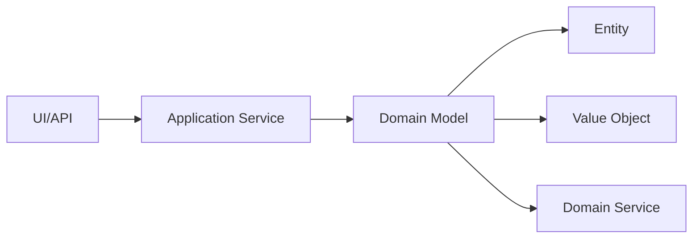
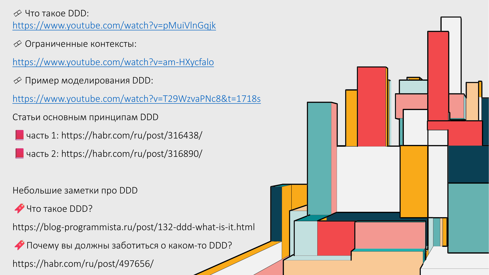
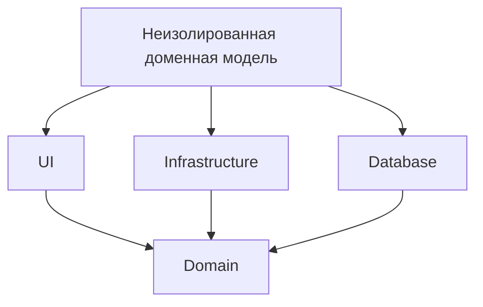
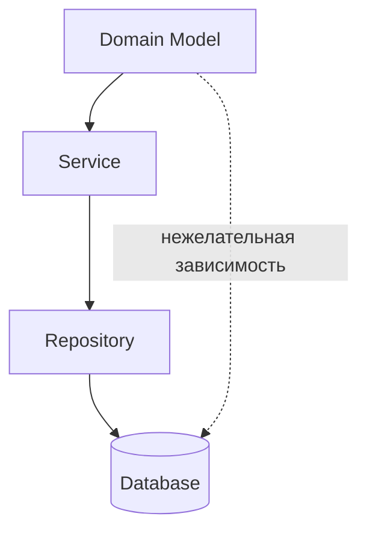
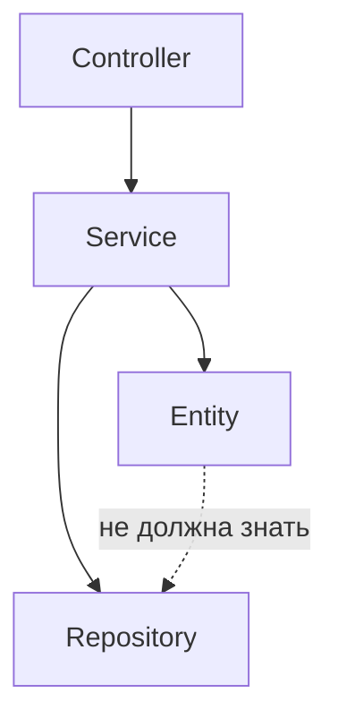
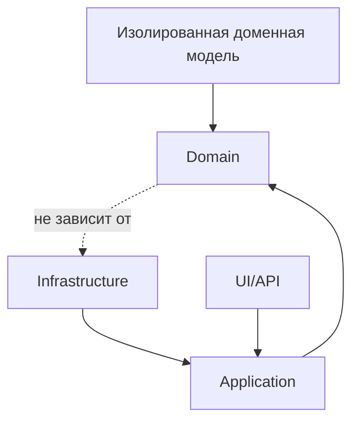
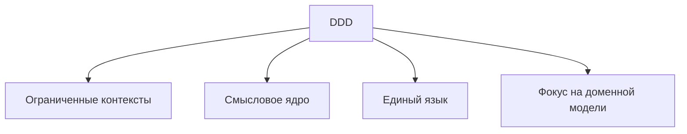
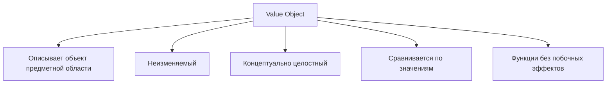

# Лекция 7. Предметно-ориентированное программирование

Сегодняшняя лекция ознаменует переход от каких-то мелких тактических решений к более крупным стратегическим решениям.

## Зачем изучать DDD

**Слайд 49: ПРИМЕР**

::: warning Текст слайда из PDF
ПРИМЕР

Для примера можно взять службу
перевода денег с одного счета
плательщика в счет получателя.
Совершенно неясно, в каком
объекте хранить метод перевода,
поэтому используется служба
:::

Начнем разбирать подход проектирования доменной области, доменного слоя, это **DDD**, и потом уже перейдем к более масштабным архитектурным решениям, рассмотрим эволюцию MV-паттернов. Рассмотрим, как происходила эволюция на бэкэнде, как на фронтэнде. Там тоже есть архитектура, кто бы что ни говорил. И потом уже перейдем к построению микросервисной архитектуры и так далее. Но сегодня сделаем первый шаг к тому, как проектировать доменную модель. Казалось бы, чего там рассуждать? Создали сущность, определили, какие у нее будут поля. Объявили, если это есть в языке свойства, гетеры и сеттеры. Всё. И у нас получится анимичная модель, от которой сейчас все на самом деле стараются отойти. Поэтому про DDD можно говорить...

Знаете, считается, что можно смотреть вечно на огонь, воду, как человек работает, ну и, собственно, как человек пытается освоить **DDD**. Потому что... Вынести это все в одну лекцию невозможно. Строить полноценный курс, ну, может быть, когда-нибудь спецкурс у вас появится, пока я не видел. Но на самом деле, если к DDD подойти с каким-то здравым смыслом и выбрать все самое нужное и эффективное, то, по сути, всего лишь 2-3 вещи, которые мы сегодня как раз и разберем. Это по времени занимает, можно сказать, 20% от всего DDD. Это такие тактические шаги. Но зато это закроет 80% самых важных вещей. То, что есть в DDD. Все остальное, то, что можно изучать действительно годами и вести команду к красивому, идеальному доменному слою, это будет долго.

Профит отдаст гораздо меньше.

### Основные принципы

Поэтому мы сегодня с вами рассмотрим прям основные принципы.

### Ограниченные контексты

**Слайд 64: Что такое DDD:**

Это **value object**, единый язык и ограниченный контекст. Посмотрим самое важное, вот, трилему **DDD**. То, что у нас есть три главных вещи, выбрать придется только две, потому что три соблюсти никоим образом не получится. Если, ну, действительно, когда мы думали, добавлять ли данное занятие в курс, Споры были жесткие, что все равно за одну лекцию всю философию DDD не рассмотреть. Давать какие-то сжато не получится. Но, в общем, мы решили действительно, так как сам автор знаменитой синей-красной книг, он сказал, что да, все можно разделить на стратегию и тактику, и стратегией заниматься можно бесконечно, выстраивая идеологический подход к проектированию по DDD. Domain-driven design. А тактические шаги, они несложные.

Именно с них рекомендовано на самом деле стартовать при переходе. Ну, если вы начинаете работать с проектом, где не применялось **DDD**, вас кинули в какой-то Legacy-код, то сразу прийти и сказать, все, прекращаем писать криво, давайте будем писать согласно идеологии DDD. Вас как бы... туда же, откуда вы пришли, и еще дальше пошлют. Поэтому необходимо начинать с каких-то небольших тактических решений, вот мы их как раз и рассмотрим. И независимо от того, фанаты вы DDD станете ли вы фанатами или не станете, вот эти вот вещи, которые мы сегодня разберем, их в любом случае хотя бы нужно с отголоской на них проектировать ваши энтити, ваши сущности, вот эти вот центральные объекты вашей предметной области.

Начнем с того, что ради чего учить **DDD**? Ну, можно ради учить того, чтобы где-нибудь на конференции с кем-нибудь поспорить или попиариться, а в нашей компании применяют DDD, либо ради маркетинга, либо ради инжиниринга. Ну, давайте, если говорить ради холивара, ну, можно. В целом все спорят, да? Раньше спорили, нужны ли микросервисы, сейчас от них уже начинают отходить. Уже смотрят на модульные монолиты, да уже и модульные монолиты уходят в прошлое. То есть и DDD тоже. Несмотря на то, что на Западе это, наверное, был расцвет еще до 2010 года, до нас это докатилось чуть попозже. Но, тем не менее, сейчас это, можно сказать, не то чтобы набирает популярность уже популярно, просто не все еще пользуются. Вот, поэтому похалеварить можно.

Но не ради этого, разумеется, стоить... Стоит гробить несколько бессонных ночей, читая все эти книги. А вот ради маркетинга, казалось бы, какая нам, программистам, разница, будет рад ли отдел маркетинга или не будет.

### Единый язык

Но на самом деле, если вы переходите в позицию от разработчика чуть выше к техническому лидеру о сумме проекта, то как минимум заказчик, который работал в идеологии **DDD** и понимает, какие бонусы это ему даст, а как минимум он начнет понимать, что же происходит в системе, потому что у нас появится единый язык общения, сейчас мы его разберем, он будет... Да в целом, даже если он не будет вникать, разработчики, которые работают и выстраивают... Информационную систему, согласно этой парадигме DDD, они не упустят каких-то особенностей бизнеса, которые на самом деле в проектах с бедной доменной моделью, которая не является идеологией DDD, она наоборот. DDD говорит о том, что доменный объект должен быть богатый и самодостаточный.

В нем должна быть сконцентрирована самая важная core логика этого бизнеса. Когда разработчик действительно создает доменные объекты с функциональностью, которая важна для заказчика, он видит ее в доменном объекте, она не размазана по всему проекту, где-то в сервисах, где-то, не дай бог, в хранимых процедурах базы данных. Она сосредоточена в доменном объекте. Программист смотрит доменный объект, видит ключевые моменты. или ключевые особенности бизнеса и сосредоточен именно на них. Он не упустит ничего. Но вот сейчас мы как раз и будем смотреть, а как сделать такую рич-модель, которая не позволит забыть про особенности бизнеса.

Поэтому для маркетинга это действительно важно, и это повышает стоимость, особенно если заказчик уже в курсе, как будет происходить работа, и понимает, что значит его бизнес, построенный по... С использованием анимичных моделей и его бизнес, который будет построен с помощью рич-моделей, где и он сможет влиять, общаться практически на равных с разработчиками за счет единого языка. И даже, в принципе, сможет, наверное, понимать то, что вы пишете. И сможет контролировать процесс разработки. Для него это на самом деле важно. Ну и ради инжиниринга это действительно тоже важно, потому что это позволит нам Знаете, вот **DDD** было непопулярным, и никто не понимал, ну а с чем смысл? До тех пор, пока не появились микросервисы.

Дело в том, что микросервисы позволяют нам сложную задачу, или объемную задачу, или высоконагруженную задачу разбить на несколько частей. И каждая эта часть, каждый микросервис, по сути, становится независимым каким-то отдельным модулем большой-большой-большой системы. Вы удивитесь, но в **DDD**, независимо от микросервисов, развивалась такая теория, что необходимо весь проблем-сет всей большой-большой системы разбить на небольшие части. В каждой этой части ее называли ограниченный контекст. И вот очень долгое время никто не понимал, что за ограниченный контекст, что за bounded context. как его вообще применить, как вообще определить, что вот в большом проекте у нас два или три bounded контекста.

И как бы это было таким камнем преткновения, и никто сильно не вникал. А на самом деле это ключевая фишка, одна из ключевых стратегических фишек **DDD**. Разбить проект на несколько небольших ограниченных контекстов, в них создать свои собственные языковые словари. чтобы общаться с заказчиком, у каждой команды будет решать свою ограниченную задачу. И когда появились микросервисы, все увидели, о, микросервис, отдельная задача, о, bounded контекст, ограниченный контекст. Это все состыковалось, и вот тогда-то был бум на такую незаметную... идеологию проектирования предметной области, которая развивалась, на самом деле, еще до 2010 года, еще до всех этих микросервисов.

Но вот бум как раз пришелся, когда появились микросервисы, и нужны были новые идеологии разработки предметной области. Поэтому действительно это поможет нам создавать правильные, хорошие приложения, которые легко будет поддерживать, их выстраивать будет сложно. Потому что это дополнительные умственные ресурсы на проектирование богатой доменной модели. Гораздо проще сделать класс, где прописать все характеристики. Посмотрели, если еще, не дай бог, мы ведем разработку от базы данных, посмотрели на базу, увидели ее таблицы, воплотили это в класс.

Собственно, так было, когда проектировали. проектировали информационные системы в начале 2000-х, когда действительно база данных была базоцентричной информационной системой, где база была первичной, и потом для базы создавались уже доменные объекты. Тогда был, собственно, и рассвет Active Record, таких паттернов, когда у вас объект описывал все необходимые ему поля для сохранения в базу, еще и там и методы хранились, которые отправляли все это в базу и считывали с базы. Вот это яркий пример не **DDD**.

Давайте сейчас будем разбирать, что такое **DDD**, из каких основных трех принципов он состоит.

На самом деле первые два принципа – это стратегия. Это единый язык, это ограниченный контекст.

### Фокус на доменной модели

#### Единый язык и модель предметной области

**Слайд 52: ПРИМЕР НЕ ИЗОЛИРОВАННОЙ ДОМЕННОЙ МОДЕЛИ**

**Слайд 53: ПРИМЕР НЕ ИЗОЛИРОВАННОЙ ДОМЕННОЙ МОДЕЛИ**

**Слайд 54: ПРИМЕР НЕ ИЗОЛИРОВАННОЙ ДОМЕННОЙ МОДЕЛИ**

#### Границы модели и DDD

**Слайд 55: ПРИМЕР НЕ ИЗОЛИРОВАННОЙ ДОМЕННОЙ МОДЕЛИ**

И третий принцип – фокус на модели, именно фокус на проектировании правильного доменного объекта.

Давайте начнем с первых стратегических вещей. Это действительно то, что делается долго, то, что не делается вот так вот по щелчку пальца. Это нужно прорабатывать и взращивать, не знаю, умы команды. То есть, чтобы они наконец-то начали мыслить и принимать вот эту идеологию. Ну, честно, спрашивали на одной из конференций у евангелистов **DDD**, спрашивали, а как вот мы не можем свою команду... Взять и заставить. Они мыслят уже 20 лет по старинке, они создают вот эти бедные доменные модели, которые просто содержат описание характеристик каких-то сущностей без какой-либо логики, без какой-либо проверки. И как их теперь заставить?

На самом деле вопрос открытый, практически заставить невозможно. И каких-то лайфхаков, как команду перевести на новый... Тип мышления, чтобы они начали проектировать модели своей предметной области не то, что вижу, то и переношу в класс, а продумывать все возможные соблюдения инвариантов. Сейчас разберем, что такое. Рассматривать, чтобы доменный объект сам себя контролировал, что он состоит в валидном состоянии. Это очень важно с точки зрения подхода **DDD**. Но начнем со сложных стратегических вещей. Это ограниченный контекст, это то, что как раз и никому не понятно, и на самом деле начинает проясняться, когда уже проектируешь микросервисную архитектуру, потому что там удобно джанглировать вот этими bounded контекстами.

По сути, вся наша работа по информатизации – это взять большой проект и найти какие-то отдельно взятые сферы, которые необходимо информатизировать. Приложение для торговой площадки какой-нибудь, интернет. У нас там будет и бухгалтерия, будет и склад. То есть как минимум два сабдомейна, с терминологией DD называют их. То есть две такие большие подзадачи, для которых как раз и необходимо создавать ограниченные контексты. И вот каждый в идеале, то есть, смотрите, слева у нас это как бы жизнь, это то, что нам нужно решить для того, чтобы заказчик был доволен. Справа это наша программа. Если мы видим, что для заказчика важны два каких-то совершенно, ну, с одной стороны, в одной связке они работают, это все его бизнес.

Но с другой стороны, они максимально оторваны друг от друга, то и, соответственно... Код нужно писать такой же, чтобы у нас в каждой ограниченном контексте были свои модели предметной области, то есть свои доменные модели. При этом совершенно нормальным будет, если у нас в одной доменной модели будет кастомер, и в другой доменной модели будет еще один кастомер. И это будет абсолютно два. очень похожих между собой классов, но они будут реально созданы два класса. Не так, что мы храним ссылку из одного какой-нибудь DLL-библиотеки, ссылаемся на кастомера, который объявлен в другой DLL-библиотеке.

Если кастомер для одной проблемы служит, ну, представим, что мы продаем программное обеспечение, и у нас здесь кастомер, будет действительно рассматриваться как наш клиент, которому мы продали ПО, то здесь кастомер, а это модуль послепродажного обслуживания. То есть здесь у него формируется скидка или лояльность к нему. Здесь тоже будет кастомер, но он совершенно другую роль играет для вот этого бизнеса. И вот с точки зрения **DDD**, Domain Objects, должны быть действительно вот такими ограниченными, которые служат для решения какой-то проблемы. И не страшно, если у нас и здесь, и вот здесь присутствуют два практически одинаковых доменных объекта.

Единственное, что нужно определить, кто для этого доменного объекта кастомер будет главной моделью, главным сабдомейном. Но сейчас до этого еще дойдем. Смотрите, то есть в идеале наш код, наши доменные объекты группируются таким образом, что они служат для решения какой-то определенной функциональной задачи. Но это лишь в идеале, что на каждую функциональную задачу у нас своя доменная модель. В реальности бывает все-таки не один к одному. Бывает один ко многим, что bounded context может решать несколько каких-то функциональных задач для клиента. Но хуже, когда связь многие ко многим, что несколько ограниченных контекстов решают несколько функциональных задач, и несколько функциональных задач решаются несколькими ограниченными контекстами.

Вот это вот уже плохо. Стремиться нужно к идеальности, что мы создаем доменную модель для решения конкретной функциональной задачи. При этом не страшно, если у нас, смотрите, это картинка от Мартина Фаулера, все ее копируют. Он показал, что на примере как раз классов Customer, покупатель, который покупает продукт, он показал, что да, эти... Два класса могут существовать дважды. То есть и здесь мы можем создать кастомера в саппорт-контексте, и мы можем создать еще один такой же, по смыслу такой же, но внутри он будет все-таки отличаться, кастомера в другом ограниченном контексте.

Только нужно определиться, если у нас идентификатор этого кастомера, его ID-шник, будет все-таки присутствовать. в контексте продаж и в контексте поддержки, то нужно четко определить между двумя командами. Разумеется, каждый сабдомейн пишет отдельная команда. По сути, это, можно сказать, два микросервиса. Нужно определиться, что если у нас есть ID здесь и ID здесь, то кто его создает, кто его изменяет, кто его назначает. А второй, соответственно, сабконтекст может только пользоваться этой ID, не меняя и не... не назначая и не изменяя эту ID. Ну и так нужно будет поступить со всеми полями, которые дублируются в классе для одного сабконтекста.

И если эти поля есть в другом сабконтексте, то тоже необходимо навести порядок и разграничить, какой сабконтекст может только пользоваться этими данными, а какой может менять. Ну и мы понимаем, что роль кастомера в отделе продаж, она одна. И там важны будут определенные бизнес-правила. А роль кастомера здесь, в поддержке, она совершенно другая. Здесь в поддержке будет важно менять его статус, дисконт его, в зависимости от количества купленных товаров. То есть дисконт будет определяться, наверное, в саб-контексте поддержка. В то время как функционал по продаже... или регистрация купленного продукта на этого кастомера будет осуществляться в сабдомейне Sales.

Поэтому единственное, что точно не нужно делать, это создавать один класс и клонировать его, ну или ссылаться на него из другого сабдомейна. Это совершенно уже путь в никуда, и это противоречит идеологии **DDD**. То есть у нас, еще раз, каждая доменная модель, которую мы проектируем, она служит для решения определенной задачи.

### Анемичная и богатая модель

**Слайд 17: ПРИМЕР**

::: warning Текст слайда из PDF
ПРИМЕР

В команде, обсуждая модель применения вакцины от гриппа в виде кода,
произносят фразу:
«Медсестры назначают вакцины от гриппа в стандартных дозах».
:::

И для каждой решаемой задачи у нас должна быть своя ограниченная модель, свой ограниченный контекст, в котором существует своя богатая доменная модель, rich domain object. При этом ни в коем случае, если вы видите, что в разных сабдомейнах у вас Требуется создать вроде бы одни и те же доменные объекты. Не страшно, создаем их и там, и там. Просто определяем зону ответственности, кто какие поля может менять, а кто может просто пользоваться этими полями, которые там считаны были из базы, и не изменять. При этом мы не обязательно должны использовать богатую доменную модель. или проектировать доменную модель по идеологии **DDD** для каждого bounded-контекста.

То есть, если вы понимаете, что какой-то bounded-контекст имеет такую примитивную задачу, допустим, бухгалтерский учет. Это не примитивная задача, но она решена. Там нет никакого ключевого бизнес-кейса. то, что делает этот бизнес уникальным. Поэтому на таких ограниченных контекстах можно не акцентировать прям внимание и не проектировать rich domain object. Но мы сейчас будем говорить, в принципе, что для **DDD** идеально подходят не для всех задач. Нет смысла какие-то такие дженериковские задачи, которые можно закрыть. Купив коробочный продукт, не знаю, AXAP, TASAP, 1S, и там уже все предопределено. Бери, пользуйся, я не хочу, там все запрограммировано, и стандартные задачи такими коробочными решениями закрываются идеально.

**DDD** в свою очередь все-таки принято применять именно для какого-то уникального, не то что бизнеса, а для уникальной части вашего бизнеса. который действительно дает прибыль. Если у вас уникальным является расчет скидки, какой-то супер уникальный алгоритм, и все прям радуются и к вам бегут только из-за того, что у вас прям, не знаю, удобно и эффективно высчитывается программа лояльности, то вот этот модуль должен стать ядром вашей системы, и именно он должен в первую очередь проектироваться идеологически. Вот по этому пути Domain Driven Design. Так, значит, это вот такая вот действительно стратегическая задача определить, на какие части бьется ваша система, и определить важные части, которые составляют ядро вашей системы, его называют Core Domain.

И вот Core Domain в первую очередь покрывается, ну или пишется за счет идеологии **DDD**. На другие части, где действительно нет какой-то сложной бизнес-логики, или где это уже сто раз всеми решалось, и можно действительно применить шаблонные коробочные решения, то там нет, наверное, смысла большого вкладываться в эту идею.

Значит, это первая составляющая идеологии **DDD** под названием «ограниченный контекст». Так, финализирую. Бьем приложение на модуле, ищем. Core, тот самый главный модуль, его в первую очередь начинаем проектировать по идеологии DDD. Второй стратегический элемент подхода DDD, он заключается в том, что у нас должен появиться для вот этого bounded контекста свой язык, который в идеале должен быть понятен доменным экспертам. Это те, кто работает в этой области. Чаще всего это заказчик, который заказал продукт. И этот же язык должен быть понятен разработчикам. Этого, в принципе, невозможно добиться в коробочных решениях. Потому что взять, допустим, ту же SAP, и для доменного эксперта будет такой термин, как малооптовый клиент. Но в SAP такого не будет.

Там будет... скорее всего, созданный уже готовый доменный объект, который будет называться особый корпоративный клиент. Ну и он примерно будет подходить под клиент, малоавтовый клиент. И вот это совершенно как раз не идеология единого языка. Вы будете общаться в терминологии корпоративный клиент, заказчик. будет постоянно употреблять термин «малооптовый клиент», и вы друг друга будете не понимать или будете сбиваться. Идея **DDD** – это то, что вы должны сесть и совместно с экспертами, которые делают заказ, прийти к какому-то единому термину, к единым терминам, вплоть до того, что ввести словарь, который будет помогать вам. В дальнейшем общаться. При этом этот словарь должен постоянно чиститься. Посмотрите, это как сленг. Сленг в небольшой группе.

И даже были попытки понять, а сколько человек должно максимально быть в этом едином языке, чтобы он мог эффективно поддерживаться. Были попытки сказать, что 7, 10, когда-то может 20. Достаточно сложно в таком большом коллективе. Общаться на одном языке. Будут появляться термины, то есть вы можете создать, не знаю, для вас это будет юзер, для доменного эксперта это будет кастомер. И тут вы, как технический лидер проекта, который всем сердцем за **DDD**, должны выступить таким судьей и сказать, что ребята, давайте будем переименовывать нашего юзера, который... в базе данных уже как юзер, доменный объект как юзер.

Давайте все-таки это действительно в терминологиях бизнеса это кастомер.

Давайте приведем к какому-то единому знаменателю и назовем его кастомер, либо все-таки юзер. И в дальнейшем следить, чтобы во всех проектах, в дальнейшем в проекте это был действительно либо кастомер, либо юзер. А не так, что одни говорят, а давайте это юзер, таблица юзер, класс юзер. Во всех бизнес юзкейсах это встречается переменный юзер, а заказчик, приходя к нам, говорит кастомер. Это тоже важное стратегическое явление, которое нужно соблюдать. Как его соблюдать? Рисовать, вести словарь, либо электронный, либо в стикерах на доске в команде. постоянно проговаривать с доменными экспертами, какие фразы они используют в бизнесе, чтобы также и мы называли методы в своем классе.

Казалось бы, это ерунда, но какая разница, как он в бизнесе это произносит и как мы пишем в классе.

Давайте посмотрим следующий пример. Представим, что у нас есть заказ для медицинской компании, где достаточно специфичные термины. И что может пойти не так? В команде, которая вообще не слышала про **DDD**, на такую фразу, как медсестры назначают вакцины от гриппа в стандартных дозах, то есть это фраза, произнесенная заказчиком. Он ее конкретно понимает. Он понимает, что такое вакцина, что такое стандартная доза, что или кто такая медсестра. Для него это конкретная фраза. В команде, где, да какая разница, пиши как-нибудь, спиши что-то там с базы данных, зафиксируй, что вот этому человеку услуга была оказана, то это может выглядеть сказано вот так, типа к черту подробности. Вот заказчик что-то сказал, почитает документацию, почитает ЭЗ, как-нибудь напиши.

Возможно, он даже напишет, что это будет работать правильно. Но сможет ли через полгода... Сам потом понять, что он написал. Если у нас, начиная от того, что классы нечитабельные, методы неговорящие, да и в принципе непонятно, что здесь происходит. Непонятные типы, непонятные дозы, непонятно кто ставит непонятно кому. Второй и третий случай уже немножко лучше. Но даже сравнить второй и третий. Смотрите. В третьем случае мы точно понимаем, что когда наш технический лидер говорит, медсестра назначает вакцины от гриппа в стандартных дозах, и у нас есть соответствующий класс медсестра, есть соответствующий метод, есть понятие вакцина, и у нее есть определение, что значит стандартная доза, или взрослая доза, детская доза.

Мы, в принципе, как бы... без даже прочтения какой-то документации к классам, за счет говорящих имен и за счет говорящих методов сможем написать этот алгоритм. При этом при условии, что заказчик и мы разговариваем на одном языке. И вот как раз вот этот вот единый язык позволяет заказчику быть включенным в процесс. Он даже, возможно, сможет прочитать код разработчика и понять, правильно ли происходит бизнес-логика, которую он написал. И смотрите, еще раз, почему **DDD** желательно, конечно, соблюдать на всем проекте, но самое важное DDD соблюдать на core-сабдомене. То есть на том сабдомене, который и осуществляет самые важные... бизнес-фиши нашего процесса или нашего бизнеса.

Потому что именно это дает прибыль, именно этим мы отличаемся от другого бизнеса похожего. И для нас важно, чтобы вот этот процесс, который отличает нас от всего остального мира, делался максимально правильно и корректно. Там ни в коем случае не должно произойти никакой ошибки. И сейчас мы увидим, как богатая доменная модель позволяет не просто написать эффективный код, который легко сопровождать, а как доменная модель позволяет сделать так, чтобы он не мог оказаться не в валидном состоянии. Разумеется, единый язык постоянно приходится чистить, То есть это не такая работа, что вы сели, проговорили 20 терминов с доменными экспертами, просто в приказном характере это отдали в отдел разработки.

### Entity

Вот так называйте все доменные ваши сущности. Это все-таки живой процесс, как и любой язык. Естественный язык – живой процесс. То же самое и вот здесь, в разработке, это тоже живой процесс. И он помогает как раз сделать так, чтобы то, что мы… программируем те доменные классы и методы были и нам понятны и в то же время мы понимали наших заказчиков если тут этот связь будет работать то действительно меньше будет каких-то неправильно проговоренных заданий от наших доменных экспертов что они сказали одно мы поняли это по-своему и еще и у нас какое-то неправильное В принципе, наложение доменных классов на их словарный запас. И пока мы дошли до компьютера, уже совсем непонятно, что писать.

Понятно, что единый язык должен быть, или может быть уникальным для определенной доменной модели. Это не хорошо и не плохо, это не обязательно так. Но очень часто все-таки конкретный bounded контекст пишет отдельная команда. Там 7, 10, 12 человек. Они решают конкретную проблему, и они общаются с определенной группой доменных экспертов. И у них действительно складывается некий сленг, который специфичен для этой предметной области, и он накладывается на наши доменные модели. У другой команды может быть совершенно иное именование.

Но здесь нужно, конечно, стейкхолдеру, стейковнеру следить, Продактов не расследить за тем, чтобы сущности, которые используются и там, и там, допустим, product, customer, все-таки чтобы они в разных ограниченных контекстах назывались одинаково. Иначе будет все-таки путаница. Очень часто единый язык сравнивают с domain-specific language.

Есть у них нечто общее, но DSL это все-таки язык, который создается для конкретной... специфичной области допустим для строительства там действительно это прям можно сказать что DSL это возведенная не знаю доведенная до идеала единый язык потому что все таки в едином языке хоть он и понятен всем и доменным экспертам и программистам единый язык используют или строятся на основании того языка, на котором вы программируете. И даже если вы называете Customer, вы все равно должны перед Customer написать слово Class, поставить модификаторы доступа. То есть он немножко перегружен спецификой того языка, на котором вы пишете. DSL – это все-таки немножко иное.

Это специально созданный язык, который понимается компилятором, и там вы действительно можете писать, как будто бы описываете какую-то предметную область. Но, соответственно, DSL – это, можно сказать, путь в один конец. То есть, если вы уходите в какой-то DSL, то дальше оттуда, из этой специфичной области, сложно будет выбраться. То есть, если вы уходите в DSL, который был создан там, ну, не знаю, тот же SAP. Потом из SAP в Enterprise обратно прыгнуть сложнее, потому что вы уже привыкаете на какое-то специфичное именование классов и так далее. Мы переходим к самому важному и интересному. Это каким образом... Третья важная составляющая **DDD** – это доменная модель.

Это как раз те тактические решения, которые можно применять, даже если вы против. идеологического, если вы идеологически против **DDD** и говорите, да к черту, это стратегия, я не буду вводить единый язык, я не буду бить приложение на сабдомейны, как минимум фокус на доменную модель желательно соблюдать. Проектировать доменную модель, особенно core сабдомейна, вот самого важного сабдомейна, стоит. И как минимум, даже если вы против богатой рич модели две вещи, ну или хотя бы одну вещь вы обязаны соблюдать.

### Value Object

**Слайд 46: ОБЪЕКТ-ЗНАЧЕНИЕ (VALUE OBJECT)**

::: warning Текст слайда из PDF
ОБЪЕКТ-ЗНАЧЕНИЕ (**VALUE OBJECT**)

Обладает большинством из следующих характеристик:
• Оно измеряет, оценивает или описывает объект предметной области;
• Его можно считать неизменяемым;
• Оно моделирует нечто концептуально целостное, объединяя связанные
  атрибуты в одно целое;
• При изменении способа измерения или описания его можно полностью
  заменить;
• Его можно сравнивать с другими объектами с помощью отношения
  равенства значений;
• Оно предоставляет связанным с ним объектам функцию без побочных
  эффектов.
:::

Это value objects, которые мы сейчас пройдем. Вот это прям, не знаю, можно сказать, аксиома, уже доказанная, что string typing, который мы сейчас увидим, Это очень плохо, когда вы все называете строкой. E-mail — строка, дата рождения — строка, чего там еще, не знаю, age — строка. Вот это вот стринг-тайпинг — это прям ужасу подобно. И **DDD** говорит, как бы, ну, приказывает, забудьте про стринг-тайпинг. Это игра слов. Есть стронг-тайпинг, строгая типизация, но вот... Это типа стринг-тайпинг. И вот DDD высмеивает эти стринг-тайпинги и говорит, что их надо заменять на value-object. И вот value-object – это прям 1% сложности всего DDD, но он, можно сказать, 90% важности в DDD.

То есть как минимум value-object вы должны отыскивать в своей системе и заменять ваши стринг-тайпинги в ваших доменных моделях на value-object.

Давайте начнем. Есть несколько подходов к разработке. Почему как раз совсем недавно, можно сказать, выстрелили, почему не так давно люди стали фокусироваться на проектировании правильной доменной модели. Дело в том, что раньше, собственно, мое первое тестовое задание, компанию, я проектировал вот таким вот образом.

То есть где-то примерно до 2005 года был совершенно нормальным подход к разработке, называемый Inside-Out Development, когда у вас базоцентрическая разработка, когда у вас DB-first, то есть первичная база, доведенная до третьей нормальной формы, собственноручно спроектированные таблицы, действительно эффективно. без избыточности, без каких-то коллизий, выдавили базу данных до третьей нормальной формы, и потом начинаете проектировать доменные модели. У вас появляется слой, его по-разному называют, слой Data Access Layer, или могли даже назвать Domain Layer, ну, в общем, какой-то слой, который содержал доменные объекты. Эти доменные объекты были... практически всегда максимально анимичны, то есть бедны.

Или еще проще, содержали абсолютную копию один в один. Вот как база данных, допустим, описывала кастомера, username, age, discount, так и в вашем доменном объекте появлялись просто эти поля. При этом, несмотря на то, что содержался так называемый инвариант, То есть это некое жесткое правило, которое должно быть соблюдено. Допустим, в жизни автомобилиста инвариант красный свет, нужно остановиться. Это инвариант. Ты не должен ехать, или пешеход не должен идти на красный свет. Вот это инвариант для объекта автомобилист, для объекта пешеход. Допустим, инвариант для кастомера может служить такой, что дисконт, 10% нужно устанавливать кастомерам, которые совершили 5 покупок.

Как программист, который не видит ничего в доменном классе, должен вообще понять, где этот инвариант соблюдается? То есть, если сам доменный класс его не контролирует, кто тогда будет контролировать этот инвариант? Какой-то джун, которому доверили писать сервис, Поставит там условный оператор, если количество покупок 10, то дай-ка я изменю доменный класс. А если он забудет? А это ключевая фишка вашего бизнеса. И заказчик это не сможет прочитать. Поэтому от этого, от подхода, где процесс разработки идет от базы данных все выше и выше, и бизнес-логика размазывается, в современных реалиях это уже не прокатит. Потому что действительно все имеют информационную систему.

Если это можно было удивить в 2000-х годах и сказать, что у меня бизнес информатизации подвержен, у меня все на сайте, все электронный документооборот. Сейчас у всех это есть. А если ваш бизнес не гарантирует какой-то... Действительно не дает гарантию. что ваши доменные объекты всегда в правильном состоянии. Был такой случай. Печальный случай. Заказчик от нас ушел. Мы писали софт для западной компании. Разница в часовая была 12 часов. Мы спали, они, соответственно, показывали инвесторам. Мы спали. Модель была спроектирована вот таким вот образом. То есть у нас кастомер был анимичен. Он мог позволить... изменять себя из внешнего мира как угодно. И он не понимал, объект в валидном ли он состоянии или не в валидном.

И теперь представьте, идет демонстрация **MVP** заказчику, инвестору. Соответственно, там был админ, который развернул это все, но не было разработчиков, которые это писали. Инвестор... Пытается залогиниться, там, смс-ка ему не приходит подтвердить логин и пароль. Админ, как бы, ну, до нас не дозваниваются, мы спим. Кто демонстрирует, звонит админу, говорит, сделай что-нибудь. Он говорит, ну, сейчас я в базе подправлю, флаг поставлю, что пользователь зареган. Ставит флаг, то есть меняет из внешнего мира наш доменный объект. Наш доменный объект анимичен, он не способен понять, как бы он вообще в валидном состоянии или не в валидном.

Анимичный объект начинает, то есть регистрация прошла, он заходит дальше на сайт, а наш объект просто не может ужиться со всей бизнес-логикой, потому что у нас-то процесс создания был один. Мы там в сервисах где-то проверили, что да, вот такие-то поля у кастомера назначены, и он там зареган. А тут просто из внешнего мира ему изменили. Даже не из бизнес-логики, а из внешнего мира. И наш объект не понял, в валидном ли он состоянии. Он позволил запустить приложение, а потом просто оно склопнулось и упало на глазах инвестора. Ну и, собственно, наутро мы потеряли заказчика. Понятно, кто тут виноват. Ну, админ, который... Да нет, виноваты мы. Мы создали такую доменную модель, которая просто от любого дурака не защищена была.

Собственно, давайте подумаем, что мы могли сделать и как мы могли спроектировать нашу доменную модель, чтобы она, в принципе, хотя бы выдала сообщение, как бы я не в валином состоянии, вы что-то сделали извне. было какое-то вмешательство, я не буду продолжать работать. Это лучше, чем она просто упала на глазах инвестора. Сейчас все эти идеологии, луковая архитектура, гексагональная архитектура, слоистая архитектура, чистая архитектура, как вы их ни называйте, это все об одном. Это все сводится к тому, что вся ваша система живет ради доменных объектов. Она воспринимает доменный объект как **entity**. Их даже называют сущности. Это теперь не просто объекты, это сущности. Это теперь не юзер один, юзер два, а это конкретно Иванов, Петров и Сидоров.

У каждого из них есть свое уникальное состояние. И по этому уникальному состоянию можно понять, это Иванов или Петров. Это не просто теперь какие-то объекты, которые хранят состояние. Они могут еще и сказать. А у меня правильное состояние или нет? Они могут сказать, я не буду принимать это состояние, потому что это противоречит моей бизнес-логике. Программист теперь, глядя на доменный объект, просто глядя на один доменный объект, сможет понять, ага, все инварианты, то есть все ключевые бизнес-правила в этом доменном объекте соблюдены. Типа, все правильно, все круто. А не так, что я вижу доменный объект, который анимичен, в нём просто объявлены поля. И я теперь думаю, сколько мне понадобится?

День, два, неделя, чтобы отыскать все места, все сервисы, которые влияют на моё состояние, чтобы проверить соблюдение всех инвариантов. А этих сервисов может быть тьма. Поэтому... Но вот здесь мы видим, что доменная модель, она, ну и смотрите, почему называется middle-out development, потому что разработка идет теперь от центра.

Теперь мы сначала проектируем правильную доменную модель, которая ни от кого не зависит. От нее, ей все пользуются. Пользуются сервисы, инфраструктура, какие-то другие микросервисы через контроллеры, какие-то клиенты. Но доменная модель, она центрична. Но если видели картинку чистой архитектуры, луковой архитектуры, замечали, в центре всегда доменная модель. И дядюшка Боб, описывая чистую архитектуру, он показывает, что тот же репозиторий, который уходит в слой инфраструктуры, он зависит от доменного объекта, а доменный объект не зависит от репозитория. А как он с ним работает? Через dependency-inversal принцип. Когда мы инвертируем зависимость, мы говорим, что мы не зависим от базы, мы зависим от интерфейса. Интерфейс в доменном объекте.

Вот здесь в центре объявлен интерфейс. Мы работаем с интерфейсом, а то, что база имплементирует данный интерфейс, это она от нас зависит. Слой инфраструктуры зависит от доменного моделя, от доменного слоя. Но вот этот мы еще будем разбирать. Принцип инверсии зависимости, как его... трактует Роберт Мартин в своей чистой архитектуре. Это чуть позже будем разбирать. Но сейчас сконцентрируемся, что вот все начинается с самого центра, с доменной модели. В зависимости от архитектуры, если это гексагональная архитектура, там порты, адаптеры, если это луковая архитектура, то какие-то application сервисы, domain сервисы, в которые войдет логика. Но вопрос, какая логика, которой не нашлось места в доменном объекте?

Скорее всего, это та логика, которая не меняет состояние. Допустим, у вас есть класс деньги, класс счет отправителя, счет получателя. У них свои бизнес-правила внутри, которые проверяют инварианты, чтобы не было отрицательного счета, чтобы были соблюдены правила перевода. А логика перевода? Куда? Сюда или сюда? Да нет, в отдельный domain-сервис. Сейчас про это тоже проговорим. То есть могут быть классы, которые содержат просто логику, но эта логика не меняет состояние объекта. Она просто позволяет состыковать перевод из одного счета в другой счет. Но счета меняются в классах все-таки доменных. А domain-сервис – это то вспомогательная логика, которая не меняет состояние доменного объекта.

Потому что если кто-то будет менять состояние доменного объекта из внешнего мира, вы теряете контроль. Вы теперь не можете взглянуть на доменный объект и убедиться, да, все инварианты проверены, все правила соблюдены.

Давайте попробуем двинуться дальше. То есть вот такая вот вещь, когда вы… Ну, это, собственно, я сделал тоже в своем первом. тестовом задании, я часть бизнес-логики додумался написать в хранимых процедурах. Это было уже не нормально. Меня приняли на работу, но сказали, что это уже странно. Я говорю, что так в интернете написано. Они говорят, что это, может быть, в начале 2000-х было нормально. Сейчас уже не нормально писать бизнес-логику в хранимых процедурах, потому что кто тебе потом даст доступ до этой хранимки.

Но еще, ладно, это же совсем был крайний случай, но потом все равно многое, там, десятилетие 2015 года было нормальным, вот такое вот размазывание бизнес-логики, именно ключевой бизнес-логики, которая является особенностью бизнеса, вот ее все равно размазывали по всем слоям. Немножечко на UI проверка, немножечко в сервисах бизнес-логики, немножечко в самом доменном объекте. Отсюда и споры пошли. Архитектурный паттерн МВЦ. Куда пихать бизнес-логику? В модель или в контроллер? И вот как бы ответа-то такого и не было. До тех пор, пока не написали книжку про **DDD** и как бы не растолковали, что вся бизнес-логика исключительно в доменных объектах. Да, это сложно. Сейчас мы увидим. Это реально сложно написать такой доменный класс.

Но в дальнейшем его поддержка просто гораздо приятнее. Вот. Вот как я говорил, сюда можно еще российского приписать, лендера 1С. То есть вот это не про **DDD**. То есть использование коробочных решений – это хорошая практика для стандартных, не примитивных, а именно стандартных задач. Когда вы не можете… Уплата налогов у компании А и уплата налогов у компании Б это не компаниями решается, а государством. Поэтому используем коробочное решение. И для таких generic сабдомейнов, которые общие у всех, у каждого бизнеса это одинаковый был бы алгоритм. Без проблем такие вещи можно использовать. А для core сабдомейна, вот того, сабдомейна, который делает бизнес, который делает ваш бизнес уникальным. Коробочные решения не подходят.

Это, в принципе, нельзя отдавать на аутсорс, это желательно писать внутри компании. Это то, как бы, ноу-хау, которое вы боитесь потерять. Разница между богатой и анимичной моделью, но она проявляется со временем. Вы, смотрите, когда придет какое-то... Да вы на проект приходите, и вам говорят... Надо убедиться, что у пользователя правильный дискаунт. Правильный дискаунт у него должен... Правильное – это значит количество купленных покупок равно количеству процентов, которые мы даем ему скидку. Как вы это найдете? Ну, вам придется полпроекта перелопатить, чтобы вы найдете. Не факт, что вы нашли все. Возможно, где-то кто-то когда-то дописал еще немножко логики на контроллере, а кто-то в сервисе. И меняет этот дискаунт. А вы нашли только в сервисе.

А баг остается. Вы продолжаете искать. Нашли контроллер. Но на самом деле кто-то еще успел, пока вы пять дней искали, в третьем сервисе написать изменение дискаунта. То есть вы вроде пофиксили здесь-здесь, а появилось здесь. Почему? А потому что команда против **DDD**, потому что никто не настоял, что все инварианты, все законы должны быть в доменном объекте. Вот яркий пример анимичной модели. Мы здесь видим просто примитивное описание. Да, собственно, мы так с вами делали в нашем проекте, да и в целом наверняка.

- Первое, что придет вам в голову при описании персона, это просто перечислить данные поля.

А что если я скажу, что пользователь такой вот invariant задам? То есть по ТЗ сказано invariant. Пользователь должен считаться сотрудником, если его доменное имя и его почта совпадает с доменным именем компании. Я могу это вообще понять здесь? Кто соблюдает этот invariant? Сервис? Дай бог. а второй сервис, а третий, а если их куча, а если какой-то еще сервис, который работает с Person, меняет почту сотрудника и забывает поменять и с Employee. То есть этих сервисов может быть много. И считать, что это точно... То есть у нас нет в нашем доменном классе, нет ограничений по его изменению.

То есть любой, да вот как это произошло у нас, по звонку... сисадмину, который имел доступ к базе, поменяли свойства доменного объекта, просто поменяли почту, а ISMPLOY не поменяли. Потому что откуда ему знать? Откуда знать человеку, который пишет какой-то сервис? Ну, он должен знать. Он должен был прочитать ТЗ. Ну, блин, а где гарантия, что он прочитал ТЗ? Вы пишете ТЗ в курсовом проекте? Вот. А также их и читают. Вы не пишете, и никто их и не считает. А если бы мы все инварианты соблюдали в одном едином месте в rich domain object, это другое дело. У нас не было бы вариантов ошибиться. Можно сказать, что тогда как определить, богатая модель или нет? Свойство OOP. Одно из свойств OOP – это инкапсуляция.

Казалось бы, про него как-то не принято вспоминать. Все говорят, **наследование**, полиморфизм – шикарная вещь. А вот **DDD** говорит, что самое главное в ООП – это инкапсуляция. Богатая rich domain object – это инкапсулированный объект. То есть тогда богатая модель равно инкапсулированная модель. Как добиться инкапсуляции? Две вещи. Скрыть информацию. То есть убрать сеттеры и не дать возможность сторонним сервисам лезть в наш доменный объект напрямую через сеттеры, трогая методы, которые должны быть подвержены инвариантам. То есть нельзя разрешать из внешнего сервиса изменять наш e-mail, потому что наш e-mail влияет на состояние, это сотрудник или не сотрудник. Нельзя внешнему сервису позволять менять, допустим, количество продаж, потому что у нас...

Бизнес-правило наше ключевое. Если 10 продаж, даем ему подарок. Где это в сервисе, мы отследим.

- Второе – это группировка данных и операций.

То есть это свойство инкапсуляции. И мы это благополучно забыли, когда появились ОРМ-системы. Потому что там все прекрасно было. Есть таблица в базе данных, есть доменный объект, которые накладываются один к одному, а бизнес-логика уходит куда-то. куда-то размазывается по всем другим слоям. Но когда это был 2000-й, 2003-й год, 2005-й, 2007-й рассвет УРН, наверное, то это было нормально, бизнес не был таким сложным. Заказчики не были такими требовательными и дотошными к мелочам. Сейчас это уже не прокатывает. Сейчас нужно сосредотачиваться именно на ключевых особенностях заказчика, в чём его сила. в чем его уникальность бизнеса, и это нужно беречь.

И это нужно прямо соблюдать, чтобы не было вот таких вот странных вещей, в одном месте поменяли e-mail и забыли поменять, что он теперь не сотрудник. Этого в принципе не должно было случиться в жизни. Даже если кто-то там залез в базу и поменял, приложение должно было сразу остановиться. А оно у нас продолжило работать. Ну, это как бы, ладно, не мой бизнес, не я деньги потерял, но... Как бы вину все равно чувствуем до сих пор. Но тогда еще не было... Тогда в России не было **DDD**. В России это пришло лет на 8 позже, чем на Западе стали об этом говорить. Поэтому на Западе, да, это немножко все быстрее. Это начали конференции там раньше, об этом стали говорить раньше.

Но у нас книжку перевели, первую вот эту синюю книжку Верона перевели, по-моему, спустя 8 лет, как он ее написал.

Давайте посмотрим, как превратить анимичную модель. У нас есть кастомер. Вот он, смотрите, он содержит хоть одно бизнес-правило, хоть одну проверочку? Нет. А количество инвариантов здесь накидать можно колоссальное. Но вот как я говорил, у нас current discount может зависеть от количества продаж. Статус тоже зависит от текущей скидки. Или текущая скидка зависит от статуса, а статус зависит от количества продаж. Где это всё написано? Где-то в голове заказчика и где-то в ТЗ отображено. И, возможно, тот человек, который писал сервис по продажам, он соблюдал этот вариант. Но потом появился какой-то альтернативный вариант продаж, там, не знаю, возврат товара, сервис по возвратам.

Количество покупок стало меньше, а статус не изменился, потому что человек, который писал логику во втором сервисе, вообще не знал про инварианты, потому что их никто в ТЗ не отразил. А вот смотрите, вот здесь вы удивитесь, но здесь не соблюдается внутри доменного класса инвариант, но тем не менее в каком-то сервисе идут расчеты. И вот здесь на самом деле можно сказать, что модель анимична, но если приглядеться, здесь есть... Read-only property, то есть property, доступное только для чтения. Это я к чему? К тому, что стиль разработки, если вы пользуетесь не объектно-ориентированным стилем, а функциональным подходом, а помните фишка функционального подхода в чем? Это неизменяемость объекта, то есть там unmutable объекты, которые пересоздаются.

Получается, что в функциональном стиле программирования из коробки у вас модель становится чуть богаче. ООП дает нам возможность писать богатые модели за счет инкапсуляции, а функциональное программирование дает нам писать богатые модели за счет уменьшения количества подвижных частей, которые могут изменить состояние доменного объекта. Поэтому, говоря о функциональном стиле, там немножко **DDD** проще реализовать, чем в объектно-ориентированном. Как можно произвести рефакторинг анемичной модели?

- Первое, что нужно сделать, это соблюдать строгую типизацию.

Мы привыкли верить людям. Мы привыкли, что нам со стороннего сервиса прилетает правильный e-mail. Мы почему-то склонны верить, что если мы e-mail будем принимать как строка, то там будет e-mail. а не какая-то там совершенно бредятина. Мы почему-то думаем, что кто-то там наверняка уже проверил. Или если мы принимаем возраст, мы думаем, ну, наверное, это валидный возраст. Я же написал программисту, что я принимаю age. Он же наверняка, прежде чем создавать мой доменный объект, в конструктор не будет всякую фигню передавать.

Если я пишу конструктор с 20 параметрами, я думаю, ну, человек, который будет создавать мой объект, Он же наверняка внимательно посмотрит, что у меня из 20 моих параметров, пусть они все string, string, string, string, но он же читает, он же смотрит, что первый string это age, а второй string это email, и он ни в коем случае их не перепутает. Так вот, первое, что мы должны соблюдать, это строгую типизацию. И второе, это уменьшение количества методов.

Давайте их посмотрим. То есть это такие, это вот те тактические вещи, которые вы должны делать, даже если вы в принципе против **DDD**. Строгая типизация. То есть вы должны забыть про нелепое использование стринг-тайпинга. То есть везде, где вы видите стринг-тайпинг, начинайте задумываться, а это реально строка или это все-таки **value object**? То есть вот decimal, но даже не важно, стринг-тайпинг относится не только к строкам. Децимал, текущий дискаунт. Валидное значение для децимала какое? Он может быть как положительным, так и отрицательным. А current discount не может быть отрицательным по нашим бизнес-правилам. Что еще? E-mail. Строка? Да какая это строка? Там есть явно доменная часть, есть имя пользователя.

При этом доменная часть участвует в бизнес-логике. Она определяет, будет ли он сотрудником или не будет сотрудником. А если нам передадут просто имя без доменной части? Как мы это поймем? То есть это явно не простые типы. Это value objects. Самое ключевое, то, что я сказал в **DDD**, это самый основной кирпич. Сначала определяются value-objects, потом определяются **entity**, то есть доменные объекты, и лишь потом пишутся сервисы. То есть основное проектирование начинается с определения value-objects. То есть мы могли бы создать не string, а отдельный тип email, который будет описывать email. Он бы состоял из чего? Из имени и домена, как минимум. Возможно, еще там дата создания, если это важно. Или дата истечения, до какого срока ему дали этот e-mail.

И вот проанализировав этот, казалось бы, примитивный кастомер, мы могли бы дойти до того, что куча вещей, e-mail, статус — это отдельный тип. Там золотой клиент, серебряный клиент и так далее. Дискаунт — это отдельный тип, который не позволяет сделать отрицательное число. Более того, мы можем пойти дальше. Мы можем сказать, что дискаунт определяется, и прямо здесь написать логику, он определяется в зависимости от статуса. То есть мы берем значение статуса и назначаем его в дискаунт. У статуса есть метод, который в зависимости от состояния статуса делает дискаунт. Допустим, золотой, даем 50% скидку. Все, у нас поле закрыто для изменения, оно просто только read-only, и мы всегда отдаем правильное значение. То есть мы соблюдаем invariant.

И никто не сможет в сервисе подправить discount, потому что discount зависит от статуса. Статус по-прежнему еще могут подправить, потому что он у нас с открытым сеттером. Поэтому надо что-то думать, уменьшать количество методов.

- Во-первых, избавляемся от всех сеттеров. чтобы не позволять сторонним сервисам вносить изменения в ваш доменный объект.

Потому что сторонние сервисы не будут соблюдать инварианты. Вот эти вот законы существования вашего объекта. Избавились от сеттера, который меняет количество ордеров. Смотрите, у нас есть кастомер, и меняется его количество покупок в отдельном сервисе. Это не по **DDD**. У нас что здесь происходит? У нас в методе addOrder, ну то есть какой-то сервис, который осуществляет заказ у данного кастомера. Он берет у этого кастомера и добавляет ордер. Казалось бы, но в чем проблема? Мы можем здесь сделать проверочку, если больше 10, то изменить статус. В целом нормально, но как бы мы потеряли контроль. Мы можем смотреть на доменный объект и не понимать, где кроется эта логика.

Поэтому по **DDD** будет уменьшать количество методов во внешнем мире, в сервисах, которые меняют состояние нашего доменного объекта. То есть домейн-сервисы, которые работают с нашими доменными объектами, не должны ни в коем случае содержать такую бизнес-логику, которая меняет состояние объекта. Вот эта логика меняет состояние доменного объекта. Она не должна присутствовать в бизнес-логике. Метод может присутствовать, логика нет. Логика, которая меняет состояние объекта, должна присутствовать в доменном объекте. То есть согласно DDD у нас должен появиться в кастомере метод addOrder. Вот мы видим его addOrder. Он делает проверку инварианта. То есть он смотрит. И, соответственно, в методе service просто мы вызываем у нашего кастомера addOrder.

Просто вызвали, передали туда нужные параметры. Логики никакой. То есть в доменных сервисах, ну или в сервисах, которые работают с доменными объектами, может присутствовать подобие логики, но без изменения доменного объекта. Само изменение доменного объекта должно быть исключительно в reachDomain. в полноценном доменном объекте. То есть вот в нашем самом кастомере, то есть вот этот метод переродился сюда. И в самом AdCustomer появился вот этот вот метод, который содержит проверку инварианта. То есть теперь он полноценный. Я смотрю на доменный объект, и я вижу, ага, инвариант соблюден. Если кто-то извне сделает продажу, у меня будет проверка. Поэтому... Проектирование начинается не с доменных объектов.

Проектирование начинается с вычленения этих value objects, которые являются составными кирпичиками для ваших доменных объектов. И уже после того, как вы всю логику прописали, которая изменяет состояние доменного объекта в самом доменном объекте, но дальше уже какой-то сервис, с которым будет работать контроллер. Ну или какой-то клиент, он будет дергать сервис, сервис просто вызывает примитивный метод, ну просто метод у доменного объекта, но все проворачивается в доменном объекте. Тогда доменный объект становится как бы middle внутри, и вы просто смотрите на доменные объекты, и вы можете понять, что происходит в вашей системе. Вам нет необходимости смотреть 50 сервисов и еще и паниковать, когда кто-то будет новый сервис добавлять.

А не появится ли там логика, а не забудет ли он соблюсти правила, инвариант? Да какая разница, он просто будет вызывать методы вашего доменного объекта, который соблюдает все инварианты. Вот отсюда и это понятие сущность, что это не просто теперь объект, это сущность, которая уникально сама себя контролирует. Ну и еще, что тогда остается в сервисах? В сервисах остается действительно та логика, которая не меняет состояние. Если у нас есть одна сущность, это тот, кто платит, вторая сущность, которая принимает платеж, то в сервисе может быть логика, которая делает этот транш, перевод денег с одного счета на другой счет. Она просто говорит, кто из них, какое количество денег переходит от покупателя к плательщику.

Таким образом, наша доменная модель, она замыкается. Она становится самодостаточной. Она ни от кого не зависит, а все только зависят от нее. Она способна сама себя проверить на валидность, и она способна общаться с внешним миром. Внешний мир может тоже с ней общаться, но через какие-то сервисы. Сервисы не содержат бизнес-логику, поэтому нам не страшно. Нашу доменную модель будут вызывать через сервисы. Но сервисы не способны привести... в неправильную кондицию наш объект. Потому что наш объект соблюдает все инварианты. Но возникает ситуация. Вот, кстати, это тоже то, что было у меня в первом тестовом задании.

Я сделал доменные объекты, которые описывали какую-то сущность и еще и обладали методами, которые сохраняли эту сущность в базу и считывали из базы. Это нарушение **DDD**, потому что... Мой доменный объект знал о слое, который лежал выше. Он знал о базе данных. Он работал с зависимостью. Он работал с SQL-кодом, который сохранял состояние моего объекта в базу. Сейчас ActiveRecord считается антипаттерном для больших проектов. Для маленьких проектов это нормально. И последняя мысль, которую я хочу донести.

### Изоляция доменной модели

Модель должна быть изолирована от внешнего мира. ActiveRecord, которая лезла в базу, она не была изолирована. А теперь смотрите, какой-то метод AddOrder в конструкторе принимает DateTimeNow или принимает какой-то метод, который, возможно, вызывает DateTimeNow. Это считается противоречит правилам **DDD**, потому что модель не изолирована от внешнего мира. То есть исход вызова этих конструкторов будет разным. в зависимости от того, что возвращает метод. DDD говорит о том, что независимо от того, с какими параметрами вы вызываете конструктор, он должен быть стабилен. Вот смотрите, мы должны были передать просто, now, не зависеть от какой-то функции. А теперь, как это вообще, этот пример, как он соотносится с идеологией DDD.

Вот у нас есть контроллер, суть которого – изменить e-mail нашего клиента. Казалось бы, что здесь сложного? Мы берем из репозитория, ищем нужного нам кастомера, и у кастомера вызываем метод changeEmail и новый e-mail передаем. И сохраняем в базу. Что здесь могло пойти не так? Здесь нет проверки, а вдруг такой e-mail уже есть? Ну, вы такие, ну не проблема, берете и добавляете в этот... по-прежнему контроллер, проверочку. То есть кусочек бизнес-логики. Вы говорите, что ну хорошо, тогда, кастомер, ты сначала проверь. Как бы нет такого e-mail. Если такой e-mail есть, мы менять не будем. А если такого e-mail не было, то меняем. В чем здесь проблема? Проблема в том, что мы нарушили инкапсуляцию. Наша доменная модель позволила вызвать себя извне. Вот она.

Вот я ее выделил. То есть мы из контроллера вызвали метод и поменяли. Проверка есть, но она здесь. Она не в доменном объекте. И проблема в том, что идеального решения вы здесь не найдете. Либо будет идеально, но долго, либо будет фигня, но быстро отрабатывать, либо будет фигня, но зависит от внешней инфраструктуры. В любом случае, в двух случаях будет фигня. Смотрите, как можно было бы поступить? Еще раз, правильного варианта нет. Тут нужно думать, что для вас важнее. Скорость, зависимость от внешней инфраструктуры. Вот один из вариантов. Мы могли бы Customer Controller вызывать метод ChangeEmail, передавая ему...

Ссылку на репозиторий, то есть на внешнюю инфраструктуру, то есть наш доменный объект, который внутри нашей системы, начинает получать зависимость из внешнего мира. Даже если вы будете передавать интерфейс, все равно вы будете передавать какую-то реализацию. То есть вы зависите от реализации. Даже если она опосредована через интерфейс, ваш доменный объект внутрь получил репозиторий, который лезет в базу. Тогда ваш доменный объект получает этот репозиторий. Вроде бы круто, он инкапсулирует логику в себе. Вот, он проверяет и даёт да-нет. То есть всё у нас, казалось бы, объект инкапсулирован, но он зависит от внешней ерунды, от базы данных. Вы уже не сможете туда передать ни базу, вы не сможете передать туда какие-то коллекции объектов.

Вы зависите от конкретной штуки. Наша доменная модель не изолирована, то есть она зависит от внешнего мира. Второй вариант, что мы могли сделать, мы бы могли передать вот сюда коллекцию пользователей. Это идеальный вариант, но представьте, сколько это памяти. То есть если мы сюда начнем передавать лист заранее считанных всех кастомеров, потом здесь проверять этих кастомеров, принимать коллекцию. Можно было бы вместо этого репозитория передать коллекцию объектов. И тогда мы бы действительно смогли сделать идеальную доменную модель. Но она потребляла бы очень много памяти. Поэтому из трех зол вы сможете соблюдать только два. Вы не сможете соблюсти никогда три.

Если вы будете соблюдать инкапсулированную модель, которая будет внутри себя проверять бизнес-правила. И тогда вы еще сможете соблюсти быстродействие, потому что вы будете передавать ей ссылку на репозиторий. Но тогда вы, получается, зависите, ваша доменная модель зависит от внешнего слоя. Вы можете пойти по правилу, что проверять это все где-то в контроллере. Тогда вы сможете изолировать вашу доменную модель. Она не будет зависеть от каких-то внешних ресурсов, потому что контроллер сам обратится к репозиторию, просто уведомит доменную модель о том, что она изменилась. Тогда вы нарушаете изолированность, но зато у вас будет инкапсулированная доменная модель. Ну а можете разделить процесс принятия решений между доменной моделью и контроллером.

То есть передать ей. все вот эти данные из репозитория. Тогда вы потеряете быстродействие, но зато приобретете изолированную модель. И возникает вопрос, что из двух зол выбрать? Есть такое правило, что в идеале. Быстрота на самом деле это фигня в корпоративном мире.

- Плюс-минус несколько секунд ничего не решит.

Поэтому если вы можете пожертвовать скоростью работы, то нужно выбирать... В первую очередь, чтобы ваш доменный объект был изолирован, то есть не передавать ему репозиторий, а передать коллекцию юзеров. И пусть он работает не с какой-то внешней зависимостью, а просто с коллекцией своих доменных объектов. И тогда он будет изолирован от внешнего мира. То есть в первую очередь изоляция. Затем нужно соблюдать инкапсуляцию, чтобы все методы находились внутри доменного объекта, не в контроллере. В идеале мы должны были выбрать такой способ решения, чтобы вот сюда передалась коллекция наших кастомеров, и логика проверки находилась здесь же, в доменном объекте у кастомера. Это был бы идеальный вариант.

Он был бы медленный, но зато наша доменная модель не зависела бы от внешнего репозитория, и наша доменная модель была бы полностью инкапсулирована. Вот.

### Итоги

Это как бы идеология **DDD**. Материалы, как обычно, можно посмотреть будет на презентации. Всё, извините, задержал.
