# Лекция 8. Эволюция Enterprise-архитектур

Эта лекция начинает архитектурный блок курса. До этого мы в основном разбирали локальные решения: как связать два
класса, как спрятать создание объекта, как подменить зависимость, как организовать поведение внутри небольшого участка
кода. Архитектурные паттерны работают на другом масштабе: они задают форму приложения целиком, направление зависимостей,
границы модулей и правила общения с внешним миром.

Цель этой статьи - не выучить все архитектуры и не запомнить картинки с кругами, слоями и шестиугольниками. Важно
увидеть причинно-следственную цепочку: какая боль возникала в разработке, почему старого решения переставало хватать и
какую новую границу пыталась провести следующая архитектура.

Материал написан как самостоятельный компаньон к лекции. Если вы пропустили занятие, начните отсюда: после чтения вы
должны понимать, зачем появились слоистая архитектура, Ports and Adapters, Onion, Clean Architecture и MV-паттерны
клиентского слоя.

::: tip Главная идея лекции
Архитектуры развивались не ради новых картинок, а ради управления зависимостями. Чем сложнее бизнес и дольше живет
приложение, тем важнее отделить доменную логику от UI, базы данных, фреймворков и внешних сервисов.
:::

::: tip Как работать с примерами
Сквозной пример лекции - кафе, которое принимает заказ кофе. Kotlin-примеры там, где это уместно, имеют две версии:
короткий статический фрагмент для чтения и отдельный `kotlin playground` с `main`, тестовыми данными и выводом. C#, Java
и Go показывают те же архитектурные идеи через привычные интерфейсы и типы.
:::

## Маршрут лекции

Эта страница - мост между локальным дизайном и системной архитектурой. До нее мы уже умеем выделять интерфейсы, внедрять
зависимости, тестировать код, выражать доменные правила и применять паттерны. Теперь нужно решить, как все это
расположить в приложении так, чтобы UI, база данных, HTTP-клиенты и фреймворки не диктовали бизнес-правилам форму.

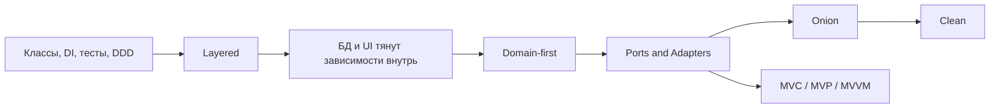

Сквозная история про кафе нужна не ради предметной области кофе. Она показывает один и тот же use case в разных
архитектурных формах: принять заказ, проверить правила, сохранить результат и сообщить внешнему миру. Меняется не
бизнес-сценарий, а то, кто от кого зависит.

## Worked example: controller начинает управлять всем

### Ситуация

В первой версии кафе HTTP controller принимает заказ, проверяет напиток, считает цену, пишет строку в базу и дергает
платежный SDK. Это быстрее, чем строить архитектуру, и для демо действительно работает.

### Наивное решение

Оставить controller главным местом бизнес-логики. Когда появляется скидка, новый способ оплаты и тестовый storage,
добавить еще несколько зависимостей прямо туда.

### Что ломается

UI/API слой начинает диктовать форму домена. Бизнес-правило нельзя проверить без HTTP, базы и SDK. Замена хранилища или
фреймворка превращается в изменение use case. Controller становится и adapter, и application service, и domain model.

### Улучшение

Вынести use case в application layer, доменные правила - в domain model, а базу, HTTP и платежи подключить через ports
and adapters. Controller остается primary adapter: он переводит HTTP-запрос в команду приложения.

### Почему это работает

Архитектура здесь не добавляет круги ради кругов. Она проводит dependency rule: бизнес-сценарий не зависит от формы
HTTP, ORM или платежного SDK. Поэтому его можно тестировать, развивать и переносить между runtime-деталями.

## Цели

После этой статьи вы должны уметь:

- объяснять разницу между локальным design pattern и architectural pattern;
- различать `layer` и `tier`;
- объяснять задачу архитектуры через стоимость изменений;
- понимать разницу между database-first и domain-first;
- объяснять слоистую архитектуру, закрытые и открытые слои;
- объяснять Ports and Adapters: core, port, adapter, primary adapter и secondary adapter;
- понимать, как DDD повлиял на Hexagonal, Onion и Clean Architecture;
- различать Onion и Clean без механического заучивания картинок;
- объяснять, почему микросервисы не являются "следующей чистой архитектурой";
- различать MVC, MVP, MVVM и Presentation Model;
- выбирать архитектурный подход по сложности задачи, а не по модности названия.

## Карта эволюции

Историю архитектур удобно читать как историю повышения уровня абстракции. Сначала код разделяли хотя бы на модель,
представление и обработку ввода. Потом приложения стали серверными, базоцентричными и слоистыми. Затем бизнес стал
сложнее, DDD перенес внимание в домен, а Ports and Adapters, Onion и Clean начали защищать этот домен от технических
деталей.

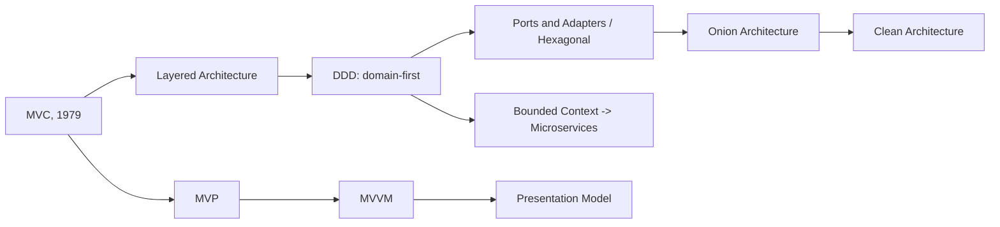

Эта схема - учебная карта, а не строгая историческая шкала всех архитектур. Многие идеи развивались параллельно, а
термины в разных командах используются по-разному. Для курса важнее не дата, а сдвиг мышления: от "куда положить код" к
"от чего мой код имеет право зависеть".

## Зачем вообще архитектура

Архитектура появляется там, где простого работающего кода уже мало. Пока программа маленькая, можно держать все в одном
файле и помнить связи в голове. Когда появляются годы сопровождения, несколько команд, внешние интеграции, разные UI и
тесты, случайные зависимости становятся дорогими.

Архитектура решает четыре связанные задачи:

- снижает стоимость изменений;
- дает команде общий язык;
- ограничивает направления зависимостей;
- повышает уровень абстракции после языков, парадигм и локальных паттернов.

| Боль | Архитектурный ответ |
|---|---|
| UI меняется чаще бизнес-правил | Отделить представление от модели. |
| БД или ORM меняются и мешают тестам | Зависеть от интерфейса, а не от драйвера. |
| Бизнес-правила размазаны по сервисам | Вынести доменную модель и use cases. |
| Приложение растет по командам | Выделять bounded contexts и модули. |
| Тесты требуют реальной БД или HTTP | Заменить адаптер fake-реализацией. |

Главный критерий качества архитектуры - не красота диаграммы. Вопрос практичнее: что нужно поменять, если завтра UI
станет мобильным, PostgreSQL заменится на другое хранилище, появится второй способ оплаты или команда разделит систему
на несколько модулей?

::: only kotlin
В Kotlin-серверах архитектурные границы часто видны не по фреймворку, а по пакетам и конструкторам: `domain` не должен
импортировать Ktor/Spring/SQL-клиенты, а application/use case получает порты через DI.
:::

::: only csharp
В C# типичная Clean/Onion-структура разделяет проекты вроде `Domain`, `Application`, `Infrastructure`, `Web`. Это не
магия .NET, а способ заставить компилятор помогать с направлением зависимостей.
:::

::: only java
В Java/Spring легко случайно превратить архитектуру в набор аннотаций. Для курса важнее другое: доменная модель и use
case не должны зависеть от `JpaRepository`, `RestTemplate` или web-аннотаций, даже если Spring собирает приложение.
:::

::: only go
В Go архитектурные границы часто выражают пакетами и интерфейсами на стороне потребителя. Простота языка не отменяет
правило: бизнес-пакет не должен знать о SQL-драйвере, HTTP-router-е или конкретном брокере.
:::

## Layer и Tier

В архитектурных разговорах часто смешивают два разных слова.

**Layer** - логический слой в коде. Например, `Presentation`, `Application`, `Domain`, `Data Access`. Слой задает
ответственность и направление зависимостей внутри программы.

**Tier** - физическое размещение. Например, браузер пользователя, application server, database server, контейнер,
виртуальная машина или отдельный процесс.

Трехслойное приложение может быть одно-tier, если все запускается локально в одном процессе. И наоборот: один логический
слой может быть развернут на нескольких серверах или контейнерах.

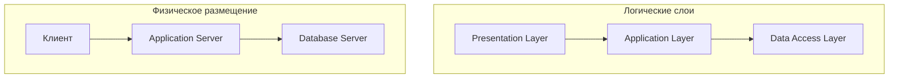

В этой лекции мы в основном обсуждаем `layer`: как код логически организован и кто от кого зависит. Физическое
размещение пригодится позже, когда речь пойдет о контейнерах, Kubernetes и микросервисах.

## Слоистая архитектура

Слоистая архитектура - один из самых простых способов навести порядок в приложении. Вместо общего комка кода мы
выделяем уровни ответственности:

- `Presentation` принимает действия пользователя или HTTP-запросы;
- `Application` или `Business` выполняет сценарии приложения;
- `Data Access` знает, как читать и сохранять данные;
- `Database` хранит состояние.

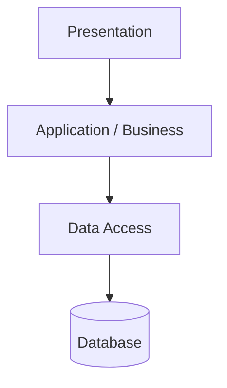

Классическое правило закрытых слоев: верхний слой знает только ближайший нижний. `Presentation` вызывает
`Application`, `Application` вызывает `Data Access`, а `Presentation` не прыгает напрямую в базу.

| Подход | Правило | Когда полезно | Цена |
|---|---|---|---|
| Закрытые слои | Слой обращается только к ближайшему нижнему слою. | Когда нужно жестко удерживать границы и не размазывать ответственность. | Простые операции приходится прокидывать через несколько слоев. |
| Открытые слои | Некоторые слои можно осознанно пропускать. | Когда сценарий технически простой и лишний посредник ничего не добавляет. | Исключения нужно документировать, иначе границы быстро исчезнут. |

Слоистая архитектура хороша простотой. Она понятна новичкам, быстро запускается и часто достаточна для CRUD-приложения,
админки, прототипа или учебного проекта. Но у нее есть риск: если команда думает от базы данных, доменные объекты легко
становятся анемичными структурами, а бизнес-логика начинает жить в сервисах, SQL, контроллерах и обработчиках.

## Сквозной пример: заказ кофе

Дальше будем использовать один домен: кафе принимает заказ кофе. Минимальная модель:

- `Order` - заказ;
- `Money` - сумма;
- `CreateOrder` - сценарий создания заказа;
- `OrderRepository` - контракт сохранения заказа;
- `PaymentGateway` - контракт оплаты.

Это маленький пример, но он показывает важную эволюцию. Сначала можно написать обычный слоистый сервис. Потом становится
заметно, что сервис слишком много знает о базе и платежах. Тогда мы вводим порты, адаптеры и use case, чтобы бизнесовое
решение "создать заказ" не зависело от PostgreSQL, HTTP-клиента или конкретного UI.

## Прямая зависимость от инфраструктуры

В плохой версии `OrderService` сам знает, как собрать SQL, куда отправить платеж и как сохранить данные. Такой код может
работать, но его трудно тестировать: unit-тест внезапно требует базу, сеть, платежный сервис и реальные настройки.

::: multi-code "Проблема прямой зависимости от инфраструктуры" {default=kotlin playground=off}

```kotlin
data class Money(val cents: Int)
data class Order(val id: String, val drink: String, val total: Money)

class SqlClient {
    fun execute(sql: String) {}
}

class HttpPaymentClient {
    fun charge(cents: Int) {}
}

class OrderService(
    private val sql: SqlClient,
    private val payments: HttpPaymentClient
) {
    fun createOrder(id: String, drink: String, total: Money): Order {
        payments.charge(total.cents)
        sql.execute(
            "insert into orders(id, drink, total_cents) values ('$id', '$drink', ${total.cents})"
        )
        return Order(id, drink, total)
    }
}
```

```csharp
public sealed record Money(int Cents);
public sealed record Order(string Id, string Drink, Money Total);

public sealed class SqlClient
{
    public void Execute(string sql) { }
}

public sealed class HttpPaymentClient
{
    public void Charge(int cents) { }
}

public sealed class OrderService
{
    private readonly SqlClient _sql;
    private readonly HttpPaymentClient _payments;

    public OrderService(SqlClient sql, HttpPaymentClient payments)
    {
        _sql = sql;
        _payments = payments;
    }

    public Order CreateOrder(string id, string drink, Money total)
    {
        _payments.Charge(total.Cents);
        _sql.Execute(
            $"insert into orders(id, drink, total_cents) values ('{id}', '{drink}', {total.Cents})");
        return new Order(id, drink, total);
    }
}
```

```java
record Money(int cents) {}
record Order(String id, String drink, Money total) {}

final class SqlClient {
    void execute(String sql) {}
}

final class HttpPaymentClient {
    void charge(int cents) {}
}

final class OrderService {
    private final SqlClient sql;
    private final HttpPaymentClient payments;

    OrderService(SqlClient sql, HttpPaymentClient payments) {
        this.sql = sql;
        this.payments = payments;
    }

    Order createOrder(String id, String drink, Money total) {
        payments.charge(total.cents());
        sql.execute(
            "insert into orders(id, drink, total_cents) values ('%s', '%s', %d)"
                .formatted(id, drink, total.cents()));
        return new Order(id, drink, total);
    }
}
```

```go
package cafe

import "fmt"

type Money struct {
    Cents int
}

type Order struct {
    ID    string
    Drink string
    Total Money
}

type SQLClient struct{}

func (c SQLClient) Execute(sql string) {}

type HTTPPaymentClient struct{}

func (c HTTPPaymentClient) Charge(cents int) {}

type OrderService struct {
    sql      SQLClient
    payments HTTPPaymentClient
}

func (s OrderService) CreateOrder(id, drink string, total Money) Order {
    s.payments.Charge(total.Cents)
    s.sql.Execute(fmt.Sprintf(
        "insert into orders(id, drink, total_cents) values ('%s', '%s', %d)",
        id, drink, total.Cents,
    ))
    return Order{ID: id, Drink: drink, Total: total}
}
```

:::

Проблема не в том, что здесь есть SQL или HTTP. Проблема в направлении зависимости: сценарий создания заказа зависит от
технических деталей. Если завтра понадобится тест без БД, другая база или другой платежный провайдер, придется менять
или обходить бизнесовый код.

## Поворот DDD: domain-first

DDD не является архитектурой приложения. Это подход к проектированию предметной области. Но именно DDD сильно повлиял на
архитектуры, которые появились после: Hexagonal, Onion и Clean строятся вокруг идеи, что доменная модель должна быть в
центре, а технические детали должны вращаться вокруг нее.

Ключевой сдвиг: не база данных определяет модель, а бизнесовые понятия. Таблицы важны, но они не обязаны диктовать имена
классов, границы модулей и место бизнес-правил.

| Database-first | Domain-first |
|---|---|
| Сначала таблицы. | Сначала бизнес-понятия. |
| Объект часто повторяет строку таблицы. | Объект защищает инварианты. |
| Логика уходит в сервисы, SQL или хранимые процедуры. | Логика ближе к домену. |
| Тесты часто требуют инфраструктуры. | Домен можно тестировать отдельно. |

Важные идеи DDD для этой лекции:

- **bounded context** задает границу языка и модели: `Order` в контексте продаж и `Order` в контексте доставки могут быть
  разными понятиями;
- **ubiquitous language** помогает коду говорить теми же словами, что и бизнес;
- **anti-corruption layer** защищает модель от чужих форматов, терминов и legacy-кода;
- **rich domain model** полезна там, где есть сложные бизнес-правила, а не только хранение полей.

::: warning DDD не нужно применять везде одинаково
Если часть системы является стандартным CRUD без уникальных правил, полная доменная модель может быть лишней. DDD
особенно полезен в core domain: там, где бизнес отличается от конкурентов и ошибка в правилах стоит дорого.
:::

## Ports and Adapters

Ports and Adapters, или Hexagonal Architecture, формулирует следующий шаг: ядро приложения не должно зависеть от UI,
HTTP, ORM, базы данных, очередей, файловой системы и внешних сервисов. Все эти вещи должны подключаться через порты и
адаптеры.

**Port** описывает контракт. Это может быть интерфейс, протокол, функция, сокет или другой способ определить правила
общения. В прикладном коде порт чаще всего выражается интерфейсом.

**Adapter** связывает порт с конкретной технологией. Web controller адаптирует HTTP-запрос к вызову use case.
PostgreSQL repository адаптирует интерфейс `OrderRepository` к SQL и драйверу базы данных.

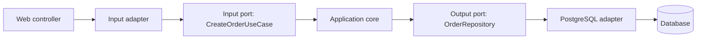

В этой схеме есть два вида адаптеров:

- **primary/input adapter** вызывает приложение: HTTP controller, CLI command, UI handler, test;
- **secondary/output adapter** вызывается приложением через порт: repository, payment gateway, file storage, message
  publisher.

Dependency Inversion Principle здесь работает на архитектурном уровне. Домен и use cases зависят от абстракций, а
инфраструктура реализует эти абстракции. Поэтому зависимость исходного кода направлена внутрь, хотя данные во время
выполнения могут идти в обе стороны.

## Порты приложения

Теперь перепишем заказ кофе так, чтобы сценарий создания заказа зависел от портов. Use case знает, что заказ нужно
сохранить и оплатить, но не знает, кто именно это сделает: PostgreSQL, in-memory fake, HTTP-клиент или тестовая заглушка.

::: multi-code "Порты приложения: создать заказ" {default=kotlin}

```kotlin
data class Money(val cents: Int)
data class Order(val id: String, val drink: String, val total: Money)
data class CreateOrder(val id: String, val drink: String, val total: Money)

interface CreateOrderUseCase {
    fun create(command: CreateOrder): Order
}

interface OrderRepository {
    fun save(order: Order)
}

interface PaymentGateway {
    fun charge(amount: Money)
}

class CreateOrderService(
    private val orders: OrderRepository,
    private val payments: PaymentGateway
) : CreateOrderUseCase {
    override fun create(command: CreateOrder): Order {
        val order = Order(command.id, command.drink, command.total)
        payments.charge(order.total)
        orders.save(order)
        return order
    }
}
```

```kotlin playground
data class Money(val cents: Int) {
    override fun toString(): String = "${cents / 100}.${(cents % 100).toString().padStart(2, '0')}"
}

data class Order(val id: String, val drink: String, val total: Money)
data class CreateOrder(val id: String, val drink: String, val total: Money)

interface CreateOrderUseCase {
    fun create(command: CreateOrder): Order
}

interface OrderRepository {
    fun save(order: Order)
    fun all(): List<Order>
}

interface PaymentGateway {
    fun charge(amount: Money)
}

class CreateOrderService(
    private val orders: OrderRepository,
    private val payments: PaymentGateway
) : CreateOrderUseCase {
    override fun create(command: CreateOrder): Order {
        val order = Order(command.id, command.drink, command.total)
        payments.charge(order.total)
        orders.save(order)
        return order
    }
}

class InMemoryOrderRepository : OrderRepository {
    private val items = mutableListOf<Order>()

    override fun save(order: Order) {
        items += order
    }

    override fun all(): List<Order> = items.toList()
}

class FakePaymentGateway : PaymentGateway {
    override fun charge(amount: Money) {
        println("Charged $amount")
    }
}

fun main() {
    val repository = InMemoryOrderRepository()
    val useCase = CreateOrderService(repository, FakePaymentGateway())

    val order = useCase.create(CreateOrder("o-1", "latte", Money(250)))

    println("Created: $order")
    println("Saved orders: ${repository.all().size}")
}
```

```csharp
public sealed record Money(int Cents);
public sealed record Order(string Id, string Drink, Money Total);
public sealed record CreateOrder(string Id, string Drink, Money Total);

public interface ICreateOrderUseCase
{
    Order Create(CreateOrder command);
}

public interface IOrderRepository
{
    void Save(Order order);
}

public interface IPaymentGateway
{
    void Charge(Money amount);
}

public sealed class CreateOrderService : ICreateOrderUseCase
{
    private readonly IOrderRepository _orders;
    private readonly IPaymentGateway _payments;

    public CreateOrderService(IOrderRepository orders, IPaymentGateway payments)
    {
        _orders = orders;
        _payments = payments;
    }

    public Order Create(CreateOrder command)
    {
        var order = new Order(command.Id, command.Drink, command.Total);
        _payments.Charge(order.Total);
        _orders.Save(order);
        return order;
    }
}
```

```java
record Money(int cents) {}
record Order(String id, String drink, Money total) {}
record CreateOrder(String id, String drink, Money total) {}

interface CreateOrderUseCase {
    Order create(CreateOrder command);
}

interface OrderRepository {
    void save(Order order);
}

interface PaymentGateway {
    void charge(Money amount);
}

final class CreateOrderService implements CreateOrderUseCase {
    private final OrderRepository orders;
    private final PaymentGateway payments;

    CreateOrderService(OrderRepository orders, PaymentGateway payments) {
        this.orders = orders;
        this.payments = payments;
    }

    public Order create(CreateOrder command) {
        var order = new Order(command.id(), command.drink(), command.total());
        payments.charge(order.total());
        orders.save(order);
        return order;
    }
}
```

```go
package cafe

type Money struct {
    Cents int
}

type Order struct {
    ID    string
    Drink string
    Total Money
}

type CreateOrder struct {
    ID    string
    Drink string
    Total Money
}

type CreateOrderUseCase interface {
    Create(command CreateOrder) Order
}

type OrderRepository interface {
    Save(order Order)
}

type PaymentGateway interface {
    Charge(amount Money)
}

type CreateOrderService struct {
    orders   OrderRepository
    payments PaymentGateway
}

func NewCreateOrderService(orders OrderRepository, payments PaymentGateway) CreateOrderService {
    return CreateOrderService{orders: orders, payments: payments}
}

func (s CreateOrderService) Create(command CreateOrder) Order {
    order := Order{ID: command.ID, Drink: command.Drink, Total: command.Total}
    s.payments.Charge(order.Total)
    s.orders.Save(order)
    return order
}
```

:::

Теперь use case можно протестировать без реальной базы и без реального платежного провайдера. Это не делает приложение
автоматически "идеальным", но дает точку замены инфраструктуры.

## Адаптеры

Порт сам ничего не сохраняет и не отправляет. Он только задает форму общения. Реальная работа живет в адаптере.

Input adapter преобразует внешний запрос в команду приложения: HTTP JSON в `CreateOrder`, CLI-аргументы в команду,
нажатие кнопки в вызов use case.

Output adapter реализует порт через конкретную технологию: PostgreSQL, Redis, файловую систему, внешний HTTP API,
message broker. Именно в адаптерах уместны DTO, SQL, JSON, HTTP status codes, retries, mapping и детали драйверов.

::: multi-code "Адаптер хранилища" {default=kotlin playground=off}

```kotlin
interface OrderRepository {
    fun save(order: Order)
}

class InMemoryOrderRepository : OrderRepository {
    private val items = mutableMapOf<String, Order>()

    override fun save(order: Order) {
        items[order.id] = order
    }
}

class PostgresOrderRepository(
    private val sql: SqlClient
) : OrderRepository {
    override fun save(order: Order) {
        sql.execute(
            "insert into orders(id, drink, total_cents) values (?, ?, ?)",
            order.id,
            order.drink,
            order.total.cents
        )
    }
}
```

```csharp
public interface IOrderRepository
{
    void Save(Order order);
}

public sealed class InMemoryOrderRepository : IOrderRepository
{
    private readonly Dictionary<string, Order> _items = new();

    public void Save(Order order)
    {
        _items[order.Id] = order;
    }
}

public sealed class PostgresOrderRepository : IOrderRepository
{
    private readonly SqlClient _sql;

    public PostgresOrderRepository(SqlClient sql)
    {
        _sql = sql;
    }

    public void Save(Order order)
    {
        _sql.Execute(
            "insert into orders(id, drink, total_cents) values (@id, @drink, @total)",
            order.Id,
            order.Drink,
            order.Total.Cents);
    }
}
```

```java
interface OrderRepository {
    void save(Order order);
}

final class InMemoryOrderRepository implements OrderRepository {
    private final Map<String, Order> items = new HashMap<>();

    public void save(Order order) {
        items.put(order.id(), order);
    }
}

final class PostgresOrderRepository implements OrderRepository {
    private final SqlClient sql;

    PostgresOrderRepository(SqlClient sql) {
        this.sql = sql;
    }

    public void save(Order order) {
        sql.execute(
            "insert into orders(id, drink, total_cents) values (?, ?, ?)",
            order.id(),
            order.drink(),
            order.total().cents());
    }
}
```

```go
package cafe

type OrderRepository interface {
    Save(order Order)
}

type InMemoryOrderRepository struct {
    items map[string]Order
}

func NewInMemoryOrderRepository() *InMemoryOrderRepository {
    return &InMemoryOrderRepository{items: map[string]Order{}}
}

func (r *InMemoryOrderRepository) Save(order Order) {
    r.items[order.ID] = order
}

type SQLClient interface {
    Execute(query string, args ...any)
}

type PostgresOrderRepository struct {
    sql SQLClient
}

func (r PostgresOrderRepository) Save(order Order) {
    r.sql.Execute(
        "insert into orders(id, drink, total_cents) values ($1, $2, $3)",
        order.ID,
        order.Drink,
        order.Total.Cents,
    )
}
```

:::

В учебном примере `InMemoryOrderRepository` выглядит почти игрушечно, но архитектурно он важен: use case не отличает
его от PostgreSQL-адаптера. Значит, тесты могут запускаться быстро и без внешней инфраструктуры.

## Onion Architecture

Onion Architecture выросла из идей DDD и Ports and Adapters. Ее часто рисуют как луковицу, но смысл не в форме. Важное
уточнение Onion - внутреннее ядро не однослойное: в нем можно различать доменную модель, доменные сервисы и
application-сервисы.

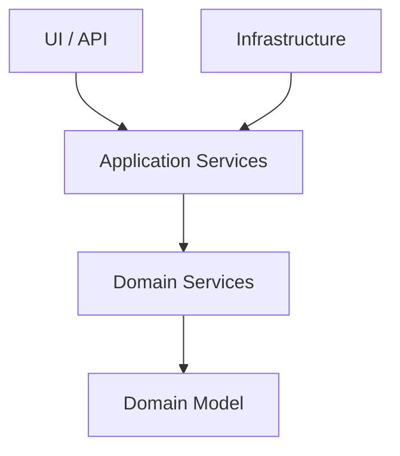

Типичная логика слоев:

- **Domain Model** хранит бизнесовые понятия и инварианты;
- **Domain Service** содержит доменную операцию, которая не принадлежит естественно одному entity или value object;
- **Application Service** организует сценарий приложения: транзакция, вызов домена, сохранение, публикация события;
- **Infrastructure** реализует технические детали: база, ORM, HTTP, файлы, очереди;
- **UI/API** является внешним способом вызвать приложение.

`Domain Service` не должен становиться мусорной корзиной для всей логики. Его используют, когда операция действительно
доменная, но ее нельзя честно положить внутрь одного объекта. Например, перевод денег между двумя счетами или расчет
скидки, зависящий от нескольких агрегатов.

## Clean Architecture

Clean Architecture закрепляет те же идеи более строго и педагогично. В центре находятся entities: самые устойчивые
бизнесовые правила. Вокруг них - use cases, то есть сценарии приложения. Еще дальше - interface adapters, которые
переводят данные между внешним миром и use cases. Самый внешний слой - frameworks and drivers: UI, web framework, DB,
устройства, внешние сервисы.

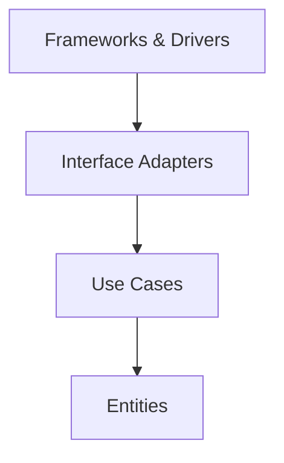

Главное правило Clean Architecture: зависимости исходного кода направлены внутрь. Use case не импортирует web framework.
Entity не знает про ORM. Adapter может знать про use case, но use case не должен знать про конкретный adapter.

Данные при выполнении могут идти в любую сторону: пользователь отправляет запрос внутрь, приложение сохраняет данные
наружу, база возвращает результат. Но типы и зависимости должны быть устроены так, чтобы внутренние слои не зависели от
внешних.

| Hexagonal | Onion | Clean |
|---|---|---|
| Core | Domain/Application core | Entities + Use Cases |
| Input port | Application service/use case boundary | Input boundary |
| Output port | Repository/service interface | Output boundary |
| Adapter | Infrastructure/UI | Interface Adapter / Framework driver |

Onion и Clean не отменяют Ports and Adapters. Скорее они по-разному уточняют внутреннюю структуру ядра и словарь вокруг
него.

## Когда Clean будет лишней

::: warning Clean Architecture не должна быть рефлексом
Если приложение маленькое, живет недолго и почти не содержит уникальной бизнес-логики, полная Clean-структура может
стоить дороже, чем сэкономит. Архитектура должна соответствовать сложности задачи.
:::

| Ситуация | Подход |
|---|---|
| Учебный CRUD или прототип | Простая слоистая архитектура. |
| Бизнес-логика есть, но проект небольшой | Hexagonal / Ports and Adapters. |
| Много сценариев, сложный домен, тесты важны | Clean или Onion. |
| Несколько команд и разные языки бизнеса | Bounded contexts, затем возможные сервисы. |
| Нужна независимая поставка и масштабирование частей | Микросервисы, но после проработки границ. |

Архитектору платят не за то, чтобы он всегда выбирал самую сложную схему. Его задача - оценить вероятные изменения и
поставить границы там, где они окупятся.

## Микросервисы и границы

Микросервис не равен Clean Architecture и не является "следующей стадией" Hexagonal. Микросервис - это способ разделить
систему на независимо разрабатываемые и разворачиваемые сервисы. Внутри конкретного микросервиса можно использовать
слоистую архитектуру, Ports and Adapters, Onion или Clean.

DDD помогает искать границы микросервисов через bounded contexts. Если в разных частях бизнеса разные правила, разные
слова и разные модели, это кандидат на отдельный модуль или сервис. Но физически разносить его по сети нужно только
после оценки цены.

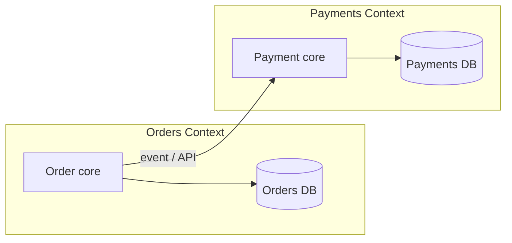

Цена микросервисов:

- сетевые ошибки вместо обычных вызовов методов;
- сложнее транзакционная консистентность;
- нужны observability, tracing, централизованные логи и метрики;
- сложнее локальная разработка;
- появляются отдельные pipeline, deployment и versioning API.

Поэтому хороший bounded context не обязан сразу становиться микросервисом. Часто правильный первый шаг - модульный
монолит с четкими границами.

## MV-паттерны на клиенте

До этого мы говорили в основном о бэкенде: как отделить домен от базы, HTTP, ORM и внешних сервисов. На клиенте боль
похожая: нужно отделить отображение от состояния и логики интерфейса.

MV* - семейство паттернов презентационного слоя. `Model` и `View` почти всегда присутствуют. Третий участник меняется:
`Controller`, `Presenter`, `ViewModel` или `Presentation Model`.

Model на клиенте часто не является богатой доменной моделью как на сервере. Это может быть DTO, состояние экрана,
результат запроса или данные, подготовленные для отображения. View отвечает за визуализацию и пользовательские действия.
Остальная часть паттерна решает, кто именно обрабатывает ввод, хранит состояние экрана и связывает View с Model.

## MVC

MVC появился в конце 1970-х как способ отделить модель от отображения и управления вводом. В классическом объяснении:

- **Model** хранит данные и правила;
- **View** отображает состояние модели;
- **Controller** обрабатывает действия пользователя и управляет изменениями.

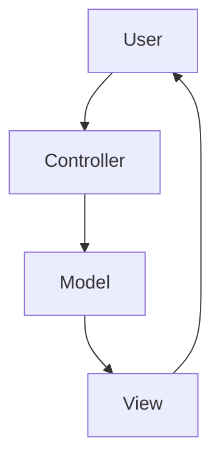

У MVC много вариантов. В активной View представление может напрямую наблюдать модель. В пассивной View контроллер
активнее управляет обновлением экрана. Из-за этого слово `MVC` в разных фреймворках может означать разные детали.

Главная историческая идея остается простой: UI-код, состояние и обработка ввода не должны быть одним неразделимым
комком.

## MVP

MVP появился как ответ на изменение UI-платформ. Современные элементы управления уже умеют многое делать сами: кнопка
сама реагирует на hover, поле ввода само принимает текст, список сам умеет отрисовываться. Поэтому классический
Controller, который буквально управлял вводом и отрисовкой, стал менее естественным.

В MVP View принимает пользовательские действия и передает значимые события Presenter-у. Presenter общается с моделью и
обновляет View. Важная деталь: Presenter обычно знает View через интерфейс, а не через конкретное окно или страницу.

::: multi-code "Presenter зависит от интерфейса View" {default=kotlin playground=off}

```kotlin
interface OrderView {
    fun showTotal(text: String)
    fun showError(message: String)
}

class OrderPresenter(private val view: OrderView) {
    fun onDrinkSelected(drink: String) {
        if (drink.isBlank()) {
            view.showError("Choose a drink")
            return
        }

        val price = if (drink == "latte") "2.50" else "2.00"
        view.showTotal("Total: $price")
    }
}
```

```csharp
public interface IOrderView
{
    void ShowTotal(string text);
    void ShowError(string message);
}

public sealed class OrderPresenter
{
    private readonly IOrderView _view;

    public OrderPresenter(IOrderView view)
    {
        _view = view;
    }

    public void OnDrinkSelected(string drink)
    {
        if (string.IsNullOrWhiteSpace(drink))
        {
            _view.ShowError("Choose a drink");
            return;
        }

        var price = drink == "latte" ? "2.50" : "2.00";
        _view.ShowTotal($"Total: {price}");
    }
}
```

```java
interface OrderView {
    void showTotal(String text);
    void showError(String message);
}

final class OrderPresenter {
    private final OrderView view;

    OrderPresenter(OrderView view) {
        this.view = view;
    }

    void onDrinkSelected(String drink) {
        if (drink == null || drink.isBlank()) {
            view.showError("Choose a drink");
            return;
        }

        var price = drink.equals("latte") ? "2.50" : "2.00";
        view.showTotal("Total: " + price);
    }
}
```

```go
package cafe

type OrderView interface {
    ShowTotal(text string)
    ShowError(message string)
}

type OrderPresenter struct {
    view OrderView
}

func NewOrderPresenter(view OrderView) OrderPresenter {
    return OrderPresenter{view: view}
}

func (p OrderPresenter) OnDrinkSelected(drink string) {
    if drink == "" {
        p.view.ShowError("Choose a drink")
        return
    }

    price := "2.00"
    if drink == "latte" {
        price = "2.50"
    }

    p.view.ShowTotal("Total: " + price)
}
```

:::

Такой Presenter можно тестировать без реального окна: достаточно fake View, который запомнит вызовы `showTotal` и
`showError`.

## MVVM

MVVM доводит разделение еще дальше. ViewModel хранит состояние экрана и команды, а View связывается с ней через
data binding или похожий механизм. ViewModel не должна знать конкретную View: она не вызывает `button.setText`, а меняет
состояние, на которое View подписана.

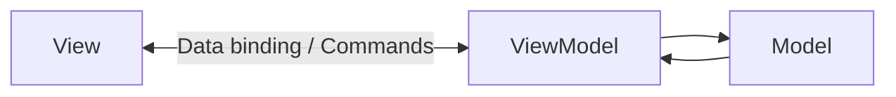

MVVM особенно естественна там, где фреймворк поддерживает observable state, commands и автоматическую перерисовку:
WPF, Xamarin/MAUI, Android-подходы с ViewModel, многие frontend-фреймворки с реактивным состоянием.

::: multi-code "ViewModel как состояние экрана" {default=kotlin}

```kotlin
data class OrderViewState(
    val selectedDrink: String = "",
    val totalText: String = "Total: 0.00",
    val error: String? = null
)

class OrderViewModel {
    var state = OrderViewState()
        private set

    fun selectDrink(drink: String) {
        state = if (drink.isBlank()) {
            state.copy(error = "Choose a drink")
        } else {
            val price = if (drink == "latte") "2.50" else "2.00"
            OrderViewState(drink, "Total: $price")
        }
    }
}
```

```kotlin playground
data class OrderViewState(
    val selectedDrink: String = "",
    val totalText: String = "Total: 0.00",
    val error: String? = null
)

class OrderViewModel {
    var state = OrderViewState()
        private set

    fun selectDrink(drink: String) {
        state = if (drink.isBlank()) {
            state.copy(error = "Choose a drink")
        } else {
            val price = if (drink == "latte") "2.50" else "2.00"
            OrderViewState(
                selectedDrink = drink,
                totalText = "Total: $price",
                error = null
            )
        }
    }
}

fun main() {
    val viewModel = OrderViewModel()

    println(viewModel.state)
    viewModel.selectDrink("latte")
    println(viewModel.state)
    viewModel.selectDrink("")
    println(viewModel.state)
}
```

```csharp
public sealed record OrderViewState(
    string SelectedDrink = "",
    string TotalText = "Total: 0.00",
    string? Error = null);

public sealed class OrderViewModel
{
    public OrderViewState State { get; private set; } = new();

    public void SelectDrink(string drink)
    {
        if (string.IsNullOrWhiteSpace(drink))
        {
            State = State with { Error = "Choose a drink" };
            return;
        }

        var price = drink == "latte" ? "2.50" : "2.00";
        State = new OrderViewState(drink, $"Total: {price}", null);
    }
}
```

```java
record OrderViewState(String selectedDrink, String totalText, String error) {
    static OrderViewState initial() {
        return new OrderViewState("", "Total: 0.00", null);
    }
}

final class OrderViewModel {
    private OrderViewState state = OrderViewState.initial();

    OrderViewState state() {
        return state;
    }

    void selectDrink(String drink) {
        if (drink == null || drink.isBlank()) {
            state = new OrderViewState(state.selectedDrink(), state.totalText(), "Choose a drink");
            return;
        }

        var price = drink.equals("latte") ? "2.50" : "2.00";
        state = new OrderViewState(drink, "Total: " + price, null);
    }
}
```

```go
package cafe

type OrderViewState struct {
    SelectedDrink string
    TotalText     string
    Error         string
}

type OrderViewModel struct {
    State OrderViewState
}

func NewOrderViewModel() OrderViewModel {
    return OrderViewModel{
        State: OrderViewState{TotalText: "Total: 0.00"},
    }
}

func (vm *OrderViewModel) SelectDrink(drink string) {
    if drink == "" {
        vm.State.Error = "Choose a drink"
        return
    }

    price := "2.00"
    if drink == "latte" {
        price = "2.50"
    }

    vm.State = OrderViewState{
        SelectedDrink: drink,
        TotalText:     "Total: " + price,
        Error:         "",
    }
}
```

:::

В реальном MVVM фреймворк еще уведомляет View об изменении состояния. В примере это опущено, чтобы не привязывать идею к
конкретной библиотеке.

## Presentation Model

Presentation Model похожа на MVVM по цели: вынести состояние и логику представления из View. Отличие практическое:
если нет готового data binding, связывание приходится писать вручную.

Этот подход полезен в UI, где фреймворк не дает полноценной MVVM-инфраструктуры, но команда все равно хочет тестировать
логику экрана отдельно от виджетов. Presentation Model хранит данные для отображения, выбранные фильтры, флаги,
ошибки, доступность кнопок и другие вещи, которые относятся не к домену, а к экрану.

| Паттерн | Кто обрабатывает ввод | Кто хранит состояние экрана | Чем хорош | Цена |
|---|---|---|---|---|
| MVC | Controller | Model/View, зависит от варианта | Исторически простое разделение. | Много вариантов, термин перегружен. |
| MVP | View + Presenter | Presenter/View | Тестируемость Presenter. | Много ручного кода. |
| MVVM | View + binding commands | ViewModel | Меньше glue-кода при наличии binding. | Нужна поддержка фреймворка. |
| Presentation Model | View + ручное связывание | Presentation Model | Работает без binding-фреймворка. | Binding пишется вручную. |

## Итоговая карта выбора

Архитектуры отличаются не картинкой, а направлением зависимостей и ценой изменений. Чем сложнее домен, тем ближе к
центру должна быть бизнес-логика. UI, база данных и фреймворки должны быть заменяемыми деталями там, где такая
заменяемость экономически оправдана.

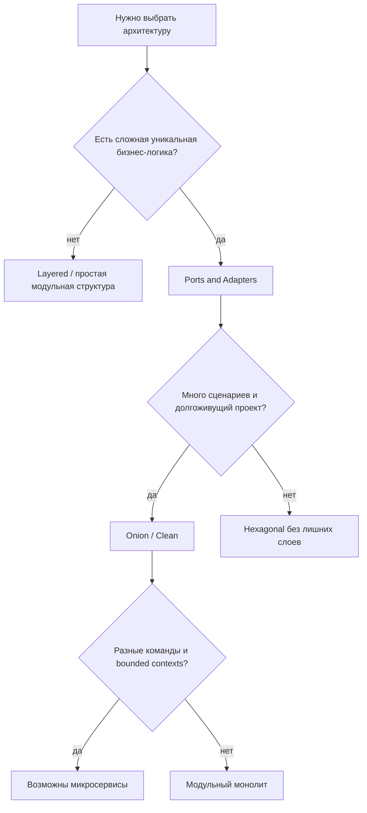

Практические выводы:

- слоистая архитектура нормально подходит для простых приложений;
- Ports and Adapters полезны, когда домен нужно защитить от инфраструктуры;
- Onion и Clean помогают структурировать сложное ядро и большое количество use cases;
- микросервисы требуют хороших границ до физического разделения;
- MV-паттерны решают похожую задачу на клиенте: отделяют UI от состояния и логики представления.

## Самопроверка

Ответьте на вопросы без подсказок:

- Почему архитектура появилась как способ повышения уровня абстракции?
- Чем `layer` отличается от `tier`?
- Почему database-first плохо сочетается с rich domain model?
- Что такое порт и почему он часто выражается интерфейсом?
- Чем adapter отличается от port?
- Почему Clean Architecture не обязана быть лучше Hexagonal?
- Почему микросервисы не спасают плохие границы?
- Чем Presenter отличается от Controller?
- Что делает ViewModel в MVVM?

## Резюме

Ключевые идеи лекции:

- архитектурные паттерны работают на масштабе приложения, а не отдельного класса;
- история архитектур нужна, чтобы понимать причины выбора, а не спорить о датах;
- architecture layer отличается от deployment tier;
- слоистая архитектура проста, но может тянуть систему к database-first;
- DDD переносит фокус на домен, bounded context и единый язык;
- Ports and Adapters защищает core через порты и адаптеры;
- DIP разворачивает зависимость от инфраструктуры к абстракции;
- Onion уточняет внутреннее ядро: Domain Model, Domain Services, Application Services;
- Clean Architecture выделяет Entities, Use Cases, Interface Adapters, Frameworks & Drivers;
- микросервисы являются способом физического и организационного разделения, а не заменой архитектуры внутри сервиса;
- MVC, MVP, MVVM и Presentation Model отделяют View, Model и логику представления разными способами;
- архитектуру выбирают по сложности, сроку жизни и вероятным изменениям системы.

Дальше архитектура выходит из кода в runtime. Сервис с хорошими слоями все равно нужно запустить, сконфигурировать,
масштабировать и связать с хранилищем. Поэтому следующая тема - [виртуализация, контейнеры и эволюция баз данных](/lectures/09#карта-эволюции).

## Мини-практика

Возьмите сценарий заказа кофе из лекции и выберите архитектурную форму для трех вариантов продукта.

| Вариант | Контекст | Что выбрать |
|---|---|---|
| Учебный MVP на один месяц | два экрана, одна база, простые правила | простая layered-структура или модульный монолит |
| Сервис заказов в растущей сети кофеен | правила скидок, статусы, интеграции оплаты и склада | domain-first + Ports and Adapters |
| Платформа для нескольких команд | разные bounded contexts, независимые релизы, наблюдаемость | модульный монолит с четкими границами или микросервисы после проверки границ |

Для каждого варианта ответьте:

1. Где находится доменная логика?
2. От чего зависит application layer?
3. Что является портом, а что адаптером?
4. Где появится первый integration test?
5. Что станет дороже, если выбрать Clean Architecture слишком рано?

Цель упражнения - не выбрать "самую правильную" архитектуру, а увидеть цену каждого уровня защиты домена.
