# Лекция 8. Эволюция Enterprise-архитектур

Итак, с сегодняшнего занятия мы с вами начинаем разбирать вопросы, связанные с архитектурными решениями. Если до этого мы разбирали паттерны, которые были направлены и нацелены на решение какой-то конкретной задачи, мелкой, возможно, задачи, то архитектурные паттерны — это те паттерны, которые говорят о том, как нужно выстраивать приложение, как нужно настраивать работу модулей в этом приложении между собой. Также о том, будет ли приложение монолитное или разделенное на микросервисы. В общем, об этом всем мы будем говорить долго и много, но сегодня поговорим про историю развития, становления этих паттернов, начиная от архитектурного решения. наверное, всем вам известного МВЦ, до популярного нынче архитектурного паттерна чистая архитектура.

Казалось бы, разобрать слоистую порты-адаптеры, луковую, гексагональную, ну, она же и порты-адаптеры, чистую архитектуру на одном занятии, ну, нереально, честно, нереально. Поэтому мы пробежимся... По верхам. И главная цель занятия будет не углубиться в каждую из архитектур. Для этого у вас будут семинары и в дальнейшем ряд дисциплин на третьем, на четвертом курсах, которые будут погружать вас в разработку веб или микросервисов. И там соответствующую архитектуру вы будете использовать. Цель нашего сегодняшнего занятия это попробовать уловить... те идеи, которые двигали программистами, когда они разрабатывали то или иное новое решение. Вот так.

Поэтому наша сегодняшняя цель – это действительно пробежаться по верхам архитектурных решений, начиная с конца 70-х, когда появилось первое архитектурное решение МВЦ, и до сегодняшнего момента. Но мы увидим, что архитектура, которая появилась в 79-м году, МВЦ, она на самом деле сейчас как бы живет двумя раздельными жизнями. Это архитектура на бэкэнде и архитектура на клиентской части, на фронтэнде.

### MV*-паттерны: цели и модели представления

#### Цели MV*-паттернов и MVVM

**Слайд 41: ЦЕЛИ MV*-ПАТТЕРНОВ**

| Цель MV*-паттернов | Смысл |
|---|---|
| Отделить UI-код | View отделяется от кода логики. |
| Разделить ответственность | Каждый слой развивается самостоятельно. |
| Упростить изменения | Например, можно изменить внешний вид и стиль приложения, не затрагивая логику и данные. |

::: warning Текст слайда из PDF
ЦЕЛИ MV*-ПАТТЕРНОВ

Отделить UI-код (View)                                         Одним из самых первых
   от кода логики (Presenter, Controller, ViewModel и т. д.)   паттернов для отделения
                                                               представления от логики
         и кода обработки данных (Model).
                                                               и модели стал Model-
                                                               View-Controller (**MVC**).
Это позволяет каждому из них развиваться самостоятельно.
                                                               Эта концепция была
                                                               описана Трюгве
Например, вы сможете изменить внешний вид и стиль              Реенскаугом в 1979 году!
приложения, не затрагивая логику и данные.
:::

**Слайд 51: MODEL-VIEW-VIEWMODEL**
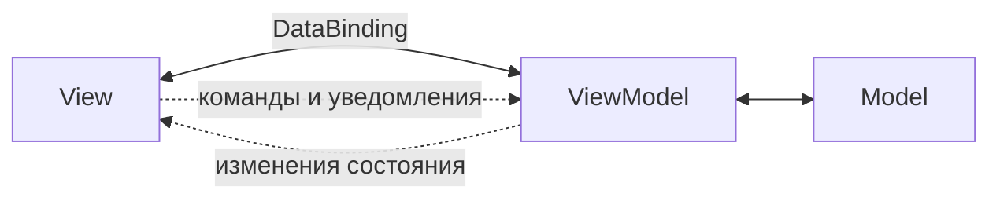

::: warning Текст слайда из PDF
MODEL-VIEW-VIEWMODEL

                       Здесь нет прямого общения
                       между ViewModel и View, оно
                       происходит посредством
                       команд.
                       ViewModel — совмещение
                       Model и Controller
                       Главные преимущества
                       **MVVM** в лёгком
                       проектировании
                       интерфейсов, независимом
                       тестировании и сокращении
                       кода для View.
:::

#### Presentation Model

**Слайд 53: PRESENTATION MODEL**
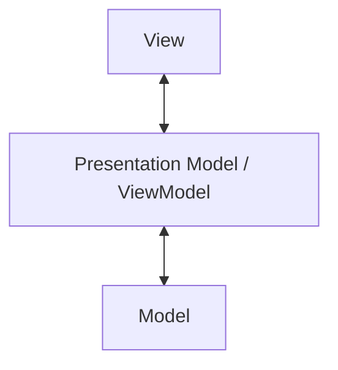

::: warning Текст слайда из PDF
PRESENTATION MODEL
ХОРОШАЯ АЛЬТЕРНАТИВА **MVVM**

                            Полезна там, где нет
                            автоматического
                            связывания.
                            Но придется писать код
                            связывания самостоятельно
:::

**Слайд 54: PRESENTATION MODEL**

::: warning Текст слайда из PDF
PRESENTATION MODEL
ХОРОШАЯ АЛЬТЕРНАТИВА **MVVM**

                            PresentationModel:

                            1. Содержит логику
                            пользовательского интерфейса:

                            2. Предоставляет данные из
                            модели для отображения на
                            экране
                            3. Хранит состояние
                            пользовательского интерфейса
:::

Кто-то мог еще раньше, в начале 2000-х, говорить, что какая там архитектура на фронтенде, то сейчас я бы сказал, что фронтенд-архитектура сравнима со сложностью бэкэнд-архитектуры, и действительно там есть, где применять архитектурные решения. Кто бы что ни говорил, фронтенд-архитектура тоже переживает достаточно бурную революцию.

## Зачем знать историю архитектур

**Слайд 4: ЧЕГО НЕ БУДЕТ**

1. Всех архитектур
2. Топологии
3. Хирургической точности

Может быть, не так она эволюционировала, как архитектура на бэкэнде, но тем не менее, MV-паттерны там продолжают развиваться и улучшаться. поэтому я разделил текущую лекцию как бы на две части это история развития архитектурных решений на бэкэнде и такая историческая ретроспектива как mv паттерны развивались на фронтенде вот как я говорил зачем учить историю ну любимая фраза это без понимания прошлого трудно двигаться вперед действительно когда вы понимаете почему раньше было так а сейчас вот так На самом деле вы можете, ну не то что стать предсказателями и ванговать, а что будет дальше, но вы сможете более адекватно выбирать архитектурное решение, если вы понимаете, допустим, что у вас бизнес-процессы не такие уникальные, не такие сложные, вам никакого дидиди не нужно, вам...

Тогда, возможно, и будет достаточно элементарной, слоистой архитектуры, где вы сконцентрируетесь над базой данных, над хранилищем, построите сверху слой доступа к данным, еще сверху немножко бизнес-логики и какой-то UI. И будете радоваться, что самая примитивная элементарная архитектура вам подошла. Потому что через полгода ваш стартап загнется, и, собственно, закрывать надо будет бизнес. И не так хорошо, что вы не вложились в какую-то... серьезное архитектурное решение. Вот, поэтому, о чем мы сегодня не будем говорить. Мы не сможем разобрать всех архитектур. Мы затронем только действительно самые важные такие вехи, которые прямо, ну, могут сказать вот...

## Domain Driven Design

В 2003 году произошло акцент, что нужно разрабатывать не отталкиваясь от базы, а отталкиваясь от доменной модели. Появилось **DDD**. После DDD появились сразу же порты-адаптеры, архитектура. А потом почему-то не устроили порты-адаптеры. Почему появилась луковая? Почему дядюшка Боб... Ради того, чтобы книгу написать, или все-таки что-то произошло, что он написал чистую архитектуру, которая от Луковой там практически ничем не отличается. Поэтому мы разберем действительно самые важные такие вехи исторические. Также мы не затронем топологию. То есть мы не будем разбирать досконально. как строится, ну, по сути, как разносится код по папкам в той или иной архитектуре. Для этого у нас будет семинар.

На семинаре мы построим и гексагональную, и чистую архитектуры, и там действительно растусуем код по папкам, чтобы вы понимали, как выстраивать инфраструктурно такие проекты. Но сегодня в лекционной части мы не будем закапываться в топологию и говорить о том, как наши архитектуры... размещается на конкретном железе на сервере application на сервере баз данных то есть в это лезть не будем и также мы не сможем досконально погрузиться в какие-то хирургические тонкости потому что говоря о том же фронт-энд архитектуре про МВЦ, у нас та же МВЦ имеет несколько реализаций с активной вьюхой, с пассивной вьюхой. И там несколько еще модификаций было сверху придумано, написано. Поэтому в такие тонкости лезть тоже не будем. Сконцентрируемся на вопросе, а зачем?

Чего людям не хватало? Да вот, собственно, чего людям не хватало? Были же перфокарты, и жили все нормально, пробивали чем-то, гвоздиком эти дырочки. В какой-то момент стало сложно. Вот вы говорите, что эссемблер сложно, а эссемблер – это абстракция над машинным кодом. В свою очередь, машинный код – это, можно сказать, абстракция над перфокартами. Поэтому почему появляются архитектуры? Потому что люди хотят упростить жизнь. А как упростить себе жизнь? Абстрагироваться, повысить уровень абстракции. Вы не хотите разбираться… в каких-то деталях, да, там, железо, которое в вашем компьютере. Ну, зачем? Вот у вас есть ноутбук, все, нажимаем кнопочки, то есть мы повысили уровень абстракции. То же самое и взялась откуда архитектура, давайте подумаем.

У нас изначально, да, ну, перфокарты, эссемблер, потом низкоуровневые языки, потом, помните, на первой лекции я говорил о том, что каждая парадигма у нас что-то забирает. Процедурная парадигма, которая появилась последняя, где Дейкстра математически доказал, что любой алгоритм можно написать без GoTo, используя основные алгоритмические конструкции. Операторы и циклы.

Собственно, он забрал у нас такого оператора безусловного перехода. Функциональное программирование заложило идею... неизменяемости переменных. ООП заставило нас инкапсулировать данные, скрывать от внешнего мира доступ к каким-то методам, к каким-то данным. В общем, нас, собственно, уже все забрали. И повышать дальше уровень абстракции можно было, исключительно создавая архитектурные решения в нашем проекте. Вот и все. Архитектура взялась из-за того, что в целом уже парадигму новую принципиально не изобрести. Но есть на самом деле попытки, есть новые парадигмы. Но так вот кардинально все, три этапа уже было. И дальше уже забрать у нас нечего, новых парадигм уже кардинально не появляется.

И поэтому надо повышать уровень абстракции через архитектурные решения. Вот. И, собственно, сегодня мы посмотрим... Почему людям, разработчикам, приходилось повышать вот этот вот градус абстракции? Чего им не хватало? Ну, забегая вперед, даже вспоминая прошлое занятие про domain-driven design, мы говорили, что бизнес усложняется. У каждого клиента свои какие-то уникальные хотелки, и нужно сконцентрировать свое внимание на бизнесе, не на том, как данные в базе лежат. Там уже базы сами разберутся, уже написаны фреймверки, которые и базу до третьей нормальной формы доведут лучше, чем вы. Поэтому мы должны сконцентрироваться на бизнесе.

Собственно, вот это и есть драйвер появления всех архитектур. Чтобы выдержать появляющуюся в бизнесе сложность, мы должны от каких-то деталей абстрагироваться. Об этом мы поговорим. К слову, о перфокартах. Мы с вами очень часто подключаем до сторонней библиотеки. Задумывались, как это происходило здесь. В целом, примерно так же. Подшивались. Одна перфокарта склеивалась с другой перфокартой. А чтобы получить нужную референс, вот это мы сейчас с вами через облако подключаем нужную DLL. Раньше вот такие библиотеки были. с перфокартами, и, соответственно, если хотите воспользоваться ранее написанным кодом, идете в библиотеку и ищете. То есть было реально сложно.

Ну и, как я говорил, чтобы упростить сложность, первое, можно воспользоваться действительно каталогизацией, упорядочиванием и повышением уровня абстракции.

## Задача архитектуры

Таким образом, задача любой архитектуры – это, с одной стороны, избавиться от той сложности, с которой сейчас мы уже не справляемся. Это сделать наше приложение устойчивым к изменениям. И некий общий язык внутри команды. Ну, еще и в идеале с заказчиками, если мы говорим о той же методологии ведения проекта **DDD**, то у нас и с доменными экспертами, и с разработчиками появляется единый язык. Да и в целом, даже если не появляется единый язык, хотя бы внутри команды вы понимаете, как у вас устроено общение с инфраструктурными слоями. как у вас устроено общение с другими микросервисами или внутри вашей системы. То есть хотя бы такой единый язык. И давайте еще будем иметь в виду, что такое хорошая архитектура.

Может быть, хорошая архитектура сложна, а вот что такое плохая архитектура, ответить, наверное, можно. Это когда вот все вот так. Все переплетено, и фиг пойми, откуда чего там у вас берется. Ну, соответственно, хорошая архитектура – это принцип из Граспа. Какой? Низкая, **low coupling**. Вот если у вас действительно модули между собой слабо связаны, то это хорошо. Если вы не повторяете одно и то же, это хорошо. И всегда нужно как бы это. Маниакально не надо преследовать в каком-нибудь Hello World. выстраивать архитектуру, чистую архитектуру, где у вас слой, ну, всей этой создаваемой инфраструктуры будет превышать в разы сложность системы.

В целом, я не помню, где это, на какой именно работе нам так архитектор мне говорил, что мы не создаем никакой архитектуры на проектах меньше трех человека лет. То есть, если, ну, про человека лет... Есть хорошая книжка «Мифический человеком месяц». Она, конечно, уже старая, но до сих пор всем рекомендую ее прочитать. Там и говорится об оценке проекта. Так вот, в целом, действительно, те проекты, которые делаются командой из трех-пяти человек меньше, чем за год, если у вас нет каких-то заготовок... то, возможно, и не стоит делать какую-то серьезную архитектуру. Потому что вы на архитектуру потратите 3-4 месяца, а потом на проект полгода. А вероятность, что вы будете модернизировать данную программу, невелика.

А если есть такая, появится вероятность, может быть, проще будет выкинуть и заново все написать. Поэтому нужно всегда отдавать отчет соотношения того, чего вам нужно. и того, чего хочется. Сейчас, конечно, появилась мода, HR, когда они даже это, в общем, именуют, когда разработчик начинает использовать ту или иную современную технологию для того, чтобы улучшить свое резюме. Это тоже плохо. Это вычисляется легко по резюме, сейчас действительно HR достаточно хорошо научены. архитекторами, техлидами выцеплять таких кандидатов и не приглашать их на собеседование, когда видно прям по резюме, что человек гнался за технологиями, неоправданно применяя какие-то новые фреймворки на проекте, либо их меняя очень часто. 79-й год.

Появилось, наверное, всем известно, и даже мы ее сильно-то и разбирать не будем, архитектурное решение модель ViewController.

Давайте поймем, почему оно появилось. По-моему, это была компания Bell, и делали они что-то на смолтелке. Очень часто задействовали пользовательский интерфейс, который постоянно менялся. И как раз автор данного архитектурного решения понял, что надо как-то разделять бизнес-логику от UI. Но тут надо понимать, что UI в те годы его в принципе не было. Это вы сейчас можете взять какой-нибудь Windows Form или любой другой фреймверк и взять уже созданный контроллер, кнопку движения мышки нарисовать. Раньше этого не было, и за это, за все отвечал контроллер. Но пока давайте про это промолчим, потому что про UI-ные архитектурные решения это будет во второй части.

Вот сейчас хочется поговорить... почему, в принципе, фронт-энд и бэк-энд пошли развиваться как бы разными путями. Вот если сейчас говорить вот об МВЦ как об общей архитектуре, которая действительно затрагивала и UI, и бизнес-логику, и хранение данных, пока давайте не рассуждать про фронт-энд, бэк-энд, то как вот это превратилось в два разных мира? Что у нас теперь отдельно учатся на фронтендеров, отдельно на бэкэндеров. Дело в том, что со временем сложность модели возрастала и продолжает возрастать. Если бы сейчас МВЦ архитектуру и квадраты рисовали бы соразмерно со сложностью, которая в этом модуле заложена, то это выглядело бы примерно так.

Здоровенная модель, которая содержит все бизнес-процессы. ради которого вам платят деньги, чтобы вы писали софт. И она постоянно расширяется, она постоянно изменяется, ее надо сопровождать. И там сложность, ну, она не константная. В отличие от контроллера, где сложность должна быть действительно константной и не зависеть ни от какой бизнес-логики, ну и, согласно вам, теории алгоритмов, сложность единиц. Неважно, что у вас происходит в бизнес-логике, как бы UI. Какое-то действие на UI происходит, это приводит к дерганию, к пинанию контроллера. Контроллер просто, а что, ты работай. Отработал, давай я отрисую, ты отрисовывай. Поэтому в современном мире действительно модель стала больше.

И в самой теперь, можно сказать, модели стали происходить и... процессы, стала эволюционировать сама модель. И она именно стала порождать сначала слоистую архитектуру, потом гексагональную, юнион-архитектуру чистую. Это все будет происходить на бэкэнде. Но в 79-м году, какой там клиент-сервер, сама МВЦ родилась просто как такая идея, а давайте мы эту кучу кода... как-то начнем делить, чтобы кто-то отвечал за бизнес-логику, кто-то отвечал за отрисовку. Поэтому мы сейчас немножко оставим в покое архитектурный паттерн МВЦ, и дальше мы к нему еще вернемся, когда перейдем к эволюции МВ-паттернов на клиенте. А сейчас сконцентрируемся, а что же там происходило на модели, что это потребовало... своей собственной архитектуры.

И, наверное, пик популярности такой трехслойной архитектуры пришелся на 2002 год. И есть такая даже уже шутка, что дай программисту проект, как бы не трогай его. И через полгода у тебя получится слоистая архитектура. Потому что если программист, как бы не фанатик каких-то архитектурных новых решений. Она естественна. И если вспоминать... Вспоминать... А вы в каком году родились? В 2002. А я в 2002. Я устраивался на работу. И там только была... Это все фанатели от слоистой архитектуры. И как... происходил процесс. Он был дата, я вам рассказывал, он был дата-центричен.

То есть, ну ладно, когда я устраивался, это уже было таким сомнительным решением, но в целом написать хранимую процедуру, создать базу, написать бизнес-логику в хранимых процедурах, это когда SQL, синтаксисом SQL пишешь алгоритм, ну, логику. Вот, и все это хранится. В базе данных и вызывается по каким-то триггерам обновление, там произошло удаление, и функция начинает работать. Это было действительно популярно, и это был 2002 год. Это расцвет трехслойной архитектуры. Как проектировалось? Слева мы видим, что у нас есть база данных, создавалась база. То есть не так, как сейчас создаете вы **entity** со своими... богатыми возможностями, который соблюдает все свои инварианты и в правильном состоянии себя содержит полностью весь жизненный цикл.

Тогда нет, нужно было спроектировать базу, довести ее до третьей нормальной формы, потом написать обертку над этой базой в виде доменного слоя. И этот доменный слой был анимичен, а вся логика уходила чуть выше, в бизнес-леер. К этой бизнес-логике работал UI.

На самом деле легко. И казалось бы, чего еще надо? Но сейчас будем думать. А между этими двумя понятиями, вот entire и enlayer, есть все-таки небольшая разница. Мы говорим именно, и сегодня будем рассуждать про enlayer. Это именно логическое распределение приложения нашего софта на какие-то слои. Entire это уже про то, как... наше приложение будет накладываться на какое-то реальное железо. В целом у нас может быть трехслойное, но однозвенное решение. Когда мы на ноутбуке пишем трехслойную архитектуру, выделяем отдельно все эти слои, но все это находится у нас монолитно на нашей машине. Можем разбивать приложение на несколько модулей. И, соответственно, каждый модуль выносить на отдельный application сервер или сервер баз данных.

Но, как я и говорил, про топологию мы сегодня разговаривать не будем. Поэтому абстрактно будем обсуждать архитектурные решения. Как их развернуть на том или ином сервере, это мы будем разбирать на семинарских занятиях, когда будем поднимать... На докере какой-нибудь запускать микросервис, работающий с PostgreSQL. На втором докер-контейнере будет кружиться наше основное приложение. Это мы разберем уже на семинарах.

Давайте вернемся к нашей трехслойной архитектуре. Она на самом деле прекрасна. Тут думать вообще не приходилось. Каждый слой отвечает за четкий набор задач. И важный нюанс. что по-хорошему, этот нюанс, кстати, породил антипаттерн, по-хорошему каждый верхний слой должен знать о ниже лежащем слое. И перепрыгивать он не должен. То есть все слои должны быть закрытыми. Ну, как это выглядело?

Допустим, у нас на слое презентации мы что-то кликаем по кнопке, информация о том, что мы кликнули по кнопке, переходит в бизнес-логику. вызывая определенную функцию бизнес-логика, взаимодействуя с доменными объектами, которые очень часто в Data Access лежали либо в отдельном слое с помощью доменных объектов, прокручивала эту бизнес-логику и результат сохраняла в базу, либо обратно отдавала на презентейшн уровень. И слои должны были быть изолированы. И хорошая, казалось бы, практика... Но почему слои изолированы? Потому что должны были быть. Потому что если мы меняем какой-то слой презентации, какой слой придется подправить? Только бизнес левер. Больше ничего. Мы же знаем, что слои изолированы и верхний слой общается только с нижележащим.

И на самом деле достаточно такое строгое правило позволяло четко понимать, что если мы вносим изменения в один слой, то правим только нижележащий. Но... Это же и породило такое антирешение, как его называют, антипаттерн. Переводится на русский, по-моему, архитектурная воронка. Смотрите, дело в том, что очень часто, как бы мы ни говорили, наши приложения крутые, уникальные, очень часто бизнес все-таки иногда бывает примитивен. И действия, которые делает пользователь, ну, допустим, рассмотрим такой пример. Что у нас здесь? У нас есть бизнес-логика по получению страницы. То есть человек кликает на экране кнопку «Покажи мне вторую страницу книги». Ну, какая здесь бизнес-логика? Она обратится просто к репозиторию и скажет «Покажи вторую страницу».

Мне там выше сказали показать вторую страницу. «Покажи вторую страницу». Ну, очень гениальная бизнес-логика. Прям гордость берет. Это, по сути, обертка. Ну что, нельзя было что-ли с Presentation Layer разрешить на сразу уровень репозитория отправить запрос? И вот здесь на самом деле, согласно правилу изолированности слоев, нет, нельзя. Но потом все-таки, когда люди стали замечать, что слишком... Код разрастается из-за такой ерунды, когда мы начинаем по всем слоям, а их не обязательно три, его так условно называют трехслойное, но слоев иногда больше. Мы начинаем прокидывать элементарные вещи просто по слоям, где ничего умного не происходит. Ну вот как в данном примере, здесь просто идет перенаправление с клиентской части.

Мы говорим, ну репозиторий дай нам страницу. И репозиторий берет страницу. Можно было сразу на клиенте это сделать. И тогда жесткого правила нет. Но хочется же оправдать как-то по-умному свои действия. И поэтому сказали, а давайте по правилу Паретта. Если мы начинаем замечать, что у нас до 20% вот такой ерунды, ну, как бы все нормально. Но как только наоборот 80% нашего кода начинает быть вот таким примитивным и просто оборачивает... логику другого слоя в свой вызов, тогда нужно уже что-то делать. И тогда сказали, что вот эту архитектурную воронку надо как-то прекращать и в документации писать, какие слои у вас открыты.

И потом хорошим правилом, ну, или исключением из архитектуры, слоистой, которая говорит о том, что верхний слой должен знать только о нижележащем, можно... В документации желательно отмечать, какие слои у вас являются открытыми. То есть какие слои вы можете перепрыгивать и обращаться из Presentation сразу в Data Access Layer. Это не хорошо, это не плохо, это просто как исключение из правил.

Собственно, я бы вообще не сказал, что на текущий момент слоистая архитектура может удовлетворить текущим требованиям бизнеса. и то, как пишется программное обеспечение. Вот, поэтому со временем слоистая архитектура видоизменялась, но грандиозно она изменилась с появлением, наверное, инверсии, dependency in virtual принципа.

Давайте сейчас до этого дойдем. Но как бы нельзя сказать, что слоистая архитектура ушла от нас навсегда.

На самом деле она трансформировалась.

На самом деле, на последнем слайде я нарисовал чистую архитектуру, просто не так красиво, как в виде луковицы. Я ее нарисовал просто линиями, и та же самая слоистая, ничего не изменилось. Изменилось только то, как слои общаются друг с другом. А то, что гексагональное в виде гексагона, луковое в виде колец, все это, на самом деле, мне кажется, одно и то же. Просто меняется способ общения одного слоя с другим и направление этого общения. Но вот смотрите, здесь просто интересная мысль прокидывается, что разные архитектурные решения не исключают взаимоиспользование. И вот мы видим, что future slice с архитектурой, которая говорит о том, что надо как бы отдельный use case оформлять в виде слоистой архитектуры.

Ну а потом это все еще и переродилось. прямо в микросервисную архитектуру, когда вот каждый этот юзкейс еще в ограниченном контексте начинает работать и, собственно, представлять из себя микросервисную архитектуру. Поэтому вот эта вот картинка, хочу, чтобы осталось у вас в памяти, что ничто не проходит бесследно, как в какой-то песне, да, прям. Ничто не проходит бесследно, и все это на самом деле имеет отголоски в современных реалиях. И вот когда дойдем до чистой архитектуры... Я сказал, что покажу слайдик, который, раскрывая эту луковицу, показывает, что всё так же и осталось, всё та же слоистая архитектура и осталась. Так, двигаемся дальше. В 2003 году выходит книга, к сожалению, не у нас, а на Западе.

У нас она выходит лет через 7 только, становится популярной. Ну, вы уже понимаете, о чём я. Это «Ди-ди-ди». И что преподносит нам «Ди-ди-ди»? Она говорит о том, что важность теперь... Не в базе данных, а важность именно в **entity**, в доменной модели. Она также говорит нам и о том, что база это не главное. Нужно сконцентрировать свое внимание на доменной модели. Нужно сконцентрировать на ограниченных контекстах. что нельзя одним целым решить всю проблему, создав одно какое-то большое решение. Должны быть ограниченные контексты для решения той или иной задачи. Должны быть антикоррупционные лейеры. Это фасады, которые защищают беспорядочный код и наружу отдают только какую-то часть методов, которым можно пользоваться. В общем, идей **DDD** принесло много.

И на самом деле это не архитектурное решение. Но к чему я? Оно сыграло ключевую роль на все последующие архитектурные решения, которые появлялись после. Начиная от 2005 год порты и адаптеры, которые потом просто расширили до юнион-архитектуры, а потом юнион-архитектуру расширили до чистой архитектуры. Но все они питались идеями друг друга. А начали с того, что с появления **DDD**. Если Domain Driven Design говорит о том, что доменный слой – это самое важное, то вспомните, как происходила разработка при слоистой архитектуре. База, все внимание на базу.

Собственно, в университете тогда, я помню, у нас тогда было... 5 нормальных форм, да, сейчас уже 6 преподают. То есть все эти нормальные формы нужно было изучать, проектировать базу. Потом проектируем уже ООП, доменный слой, и потом рисуем картинку. Вот сейчас мы с вами, даже как выстраиваем работу, мы даже еще с базой не работали, а проектируем пока доменный слой. Вот. И смотрите, что происходит в идеологии разработки не с появлением портов и адаптеров. а с появлением **DDD**, что теперь у нас разработка не базоцентрична, а разработка идет от domain layer.

То есть domain layer работает сама по себе, и ей вообще по барабану до UI, до базы данных, до других микросервисов она сконцентрирована на себе, она максимум, если два reach объекта. каким-то образом должны взаимодействовать, то вот эту логику взаимодействия мы не можем поместить ни в этот доменный объект, ни в этот, но тогда в юзкейс мы выносим его, который сам состояние не имеет, а помогает общаться с двум доменным объектом. Но это максимум, юзкейсы и все. А так, по сути, вся логика в доменных объектах. И, соответственно, архитектурные решения начинают меняться. Как вы теперь будете проектировать слоистую архитектуру, если теперь не слои, а теперь вот есть центр, а потом все наращивается вот это вот мясо вокруг этого центра.

Но на самом деле это всего лишь навсего картинки. Я еще раз повторяю, если мы ту же слоистую Union архитектуру как бы разрежем и вот так вот развернем, то она будет похожа на слоистую. Смысл не в том, как нарисована архитектура, а как кто в центре и кто кого видит. И кто с кем как общается. И вот как раз архитектура гексагональная, порты и адаптеры одна и та же. Она заключается в следующем. У нас есть... Опять же, нарисовать ее можно по-разному. Но смотрите, в центре бизнес-логика. Можно ее рисовать действительно как шестиугольник, но от этого ничего не меняется. Главное, что у нас есть бизнес-логика, которая должна общаться с внешним миром. И не так, что слой презентационный, слой бизнес-логики, база данных.

А наоборот, вот бизнес-логика, и все в нее теперь смотрят. Но проблема в том, что, а как сделать так, чтобы... Как сделать вот эту... инверсию зависимостей как развернуть зависимость как бы смотрели в одну сторону а теперь нужно смотреть в ту сторону бизнес нашей базе данных вот так вот чтобы развернуть эту зависимость да у нас есть dependency reversal принцип который разворачивает зависимость за счет чего за счет того что мы начинаем зависеть не от реализации а от абстракции и получается что Порты и адаптеры. Кто такие порты, кто такие адаптеры? По сути, порты, если так конкретно говорить, на каком-то конкретном примере, допустим, на языке Java, Sharp, это, возможно, будут интерфейсы.

Но как такового физического олицетворения в идеологии архитектуры порты и адаптеры порты не имеют. Физически их как бы нет. Порты это некая абстракция. Можно представлять, что это интерфейс. В конечном счете, программируя сейчас гексагональную архитектуру, под портами все понимают интерфейсы. Но на самом деле портом может быть и сокет. То есть это некая точка... через которую ваша бизнес-логика может взаимодействовать с внешней средой, с операционной системой, с файловой системой, с какой-то серверной базой данных или с другим микросервисом. Но давайте более тогда приземленно. Порты – это интерфейсы, это точки входа, это, по сути, правила, по которым некие сторонние вещи могут работать с вашей системой. сторонняя вещь. Она же...

И вы можете через эти порты работать с сторонними вещами. То есть вы можете и сохранить базу, и считать из базы. И в вашу программу другой микросервис или клиент будет как-то обращаться. Как? Через вот эти точки входа. То есть через интерфейсы. Но другие системы работают по другим правилам. Даже просто формат передачи данных может быть не согласован между двумя системами. У вас JSON, а там XAML. Тогда нам нужны адаптеры, которые... Вот адаптеры — это нечто уже реально физическое. Это какие-то классы, которые, по сути, знают об интерфейсе. И они адаптируют способ обращения к вашей системе под тот формат, который ваша система понимает.

Давайте я вот тут выписал. Мы можем тогда говорить о том, что кор. К сожалению, сейчас во многих статьях, которые разбирают гексагональную архитектуру, рисуют ее какой-то гибридной, как будто бы она луковая. Но сам автор изначально, он не... не описывал то, что core состоит из нескольких частей. Это уже луковая архитектура расширила понимание ядра вот этого гексагона. Он лишь говорил о том, что действительно должен быть некий core, то есть начитавшись книжек про **DDD**, он говорил, вот, доменная модель – это core. Но с этой доменной моделью должен взаимодействовать внешний мир, да и наша доменная модель должна взаимодействовать с той же базой данных. Но как? Ведь мы же хотим, чтобы доменная модель была самодостаточной.

Ну, тогда у нас есть dependency on virtual принцип. Тогда мы будем общаться через интерфейсы, которые лежат в нашем окружении, в нашем коре. И вот интерфейсы. Но кто-то должен будет, опять же, адаптировать формат нашей системы к формату внешнему. Ну, к примеру, вот смотрите, у нас есть некое приложение, Ну, не знаю, допустим, кафе, где можно заказать чашку кофе. Соответственно, вот в аппликейшене это наш слой доменной логики, где наши, согласно **DDD**, рич-объекты объявлены, и они прокручивают всю логику, которая необходима. Но нам, с одной стороны, к этой бизнес-логике нужно как-то достучаться с какого-то клиента, с мобильного приложения, с сайта. А с другой стороны, наша логика... Она же должна сохранить что-то в базу.

Или если она самостоятельно не может выполнить что-то, ей нужно прогноз погоды узнать, чтобы рецепт кофе придумать. И она обращается к какому-то внешнему стороннему сервису. И посмотрите, где с точки зрения архитектуры порты и адаптера, где тут порт, а где адаптер.

Давайте вот на этой картинке мы видим, что некое веб-приложение обращается... к оконечной точке, ну, к некому API. Это у нас будет, на самом деле, следующая лекция. Мы будем разбирать стили и протоколы работы с клиентами сервера. Ну, пока что давайте относиться к REST-адаптеру как к некому, к некой endpoint на сервере, к которому мы можем обратиться по HTTP-протоколу. То есть к некой... которая лежит где-то, до которой мы можем достучаться через HTTP. Вот.

Значит, это у нас будет адаптер. Он адаптирует неизвестный нам, как бы неизвестной нашей системе запрос. Наша система вообще не понимает, ей не надо знать, с мобилки к ней ломятся или с консольного приложения, или с веб-приложения. Наша система как бы... Можно ее назвать пофигистической, но правильно говорить, самодостаточной. Она просто сама живет. Ей без разницы, кто к ней ломится. Так вот, почему это можно назвать адаптером с точки зрения архитектуры портов-адаптеров? Потому что мы сторонний HTTP-запрос адаптируем. Адаптируем под что? Под понятный нашей системе формат. А понятный нашей системе формат описан интерфейсом, портом.

Но потом, смотрите, наша система рассчитала стоимость, ей необходимо сохранить заказ или просто о том, что кофе она продала в базе данных. Это наша уже система будет вызывать сторонний какой-то код. Поэтому во многих архитектурах, во многих книжках рисует, сейчас я назад отмотаю, смотрите, input и output порты. которые, ну, одни порты служат для того, чтобы адаптировать сторонний запрос к нашей системе, а output порты, их еще называют вторичные, а те первичные, output порты для того, чтобы адаптировать запрос нашей системы к тому сервису, к которому она обращается. Ну и вот здесь у нас, соответственно, мы понимаем, что взаимодействие с базой данных будет происходить через какой-нибудь интерфейс iRepository.

А выше, уже вне нашем доменном слое, уже в отдельной DLL-библиотеке, возможно, просто в папке, будет лежать database-адаптер, который уже будет, собственно, преобразовывать соответствующие, ну, писать реализацию соответствующего интерфейса для конкретной базы данных, там, PostgreSQL. При этом адаптеры для разных баз могут спокойно жить друг с другом, все зависит от того, ну... какой сейчас адаптер был с помощью DI внедрен в нашу систему. Как я сказал, основная логика Core.

Дальше у нас есть порты. Можно их назвать, что это, в конечном счете, это чаще всего интерфейсы. Почему я говорю чаще всего? Потому что иногда, если мы взаимодействуем с другими микросервисами через сокеты, Сокет — это не ваши порты, сокет — это понятие уровня операционной системы. Поэтому не факт, что именно это интерфейсы. То есть сам автор портов-адаптеров не прописывал о том, что такое порты. Он сказал, что это некая абстракция, которая реально воплощена в адаптерах.

Адаптеры — это реально какая-то сущность, какие-то классы, позволяют адаптировать сторонний запрос к нашей системе или адаптировать запрос нашей системы к сторонней вещи отсюда и возникает ситуация что если на тогда еще этого как бы не было когда автор портов адаптеров прописывал но если наложить идею ограниченного контекста **ddd** на гексагональную архитектуру и для каждой bounded контекста сделать свой гексагон, свое ядро бизнес-логики, то вот мы в чистом виде получаем микросервисную архитектуру. Поэтому неважно, микросервисная архитектура строится на чистой архитектуре, на юнион, на гексагональной. Микросервисная архитектура – это уже… Просто идея, как несколько приложений будут взаимодействовать друг с другом.

## Слоистые архитектуры: Onion и Clean

#### Слоистые архитектуры: Onion и Clean: слои

**Слайд 31: ONION**
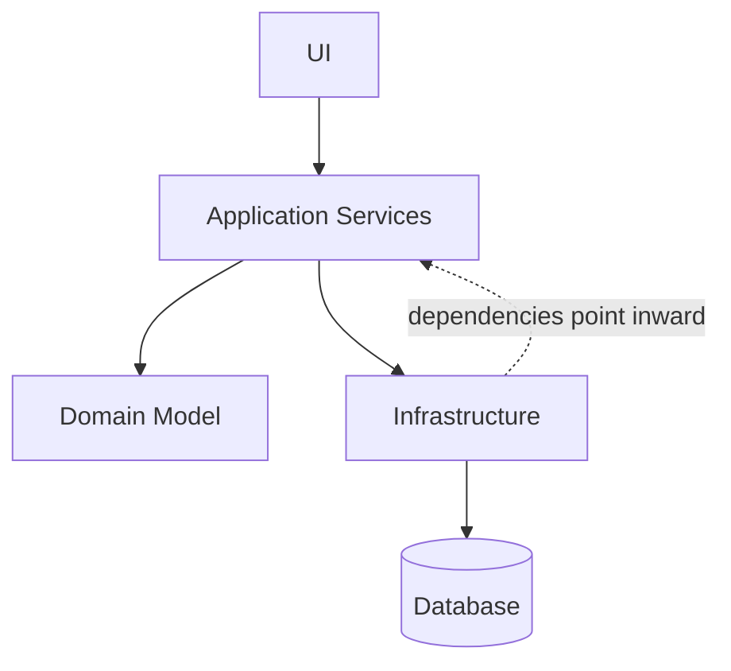

**Слайд 32: ONION ARCHITECTURE**

::: warning Текст слайда из PDF
**ONION ARCHITECTURE**

Деление ядра системы на три
отдельных слоя

Зависимости только внутрь

**Dependency Inversion Principle** –
архитектурный принцип

Бизнес логика работоспособна
даже без внешних слоев
:::

#### Clean Architecture: границы

**Слайд 35: CLEAN**
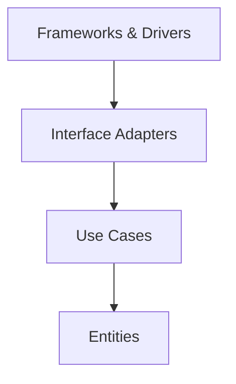

**Слайд 36: CLEAN ARCHITECTURE**

::: warning Текст слайда из PDF
**CLEAN ARCHITECTURE**

Деление и «горизонтально»
и «вертикально» (SRP)

Направление зависимостей
по уровню компонента

Закрепление базовых принципов
(DI, SRP, OCP)
:::

Но сейчас в чистом виде идеологию портов-адаптеров в небольших приложениях используют. И мы один из семинаров построим таким образом и даже разрешим в контрольной работе. по-моему, в последней четвертой, как бы забить на чистую архитектуру, потому что это слишком ресурсозатратно ради небольшого проекта выстраивать чистую архитектуру. Мы скажем, без проблем, пользуйтесь гексагональной архитектурой. Поэтому я не могу сказать, что популярно. Хотя есть статистика, что популярно, но, по-моему, гексагональная популярнее, чем чистая по количеству проектов. Появление юнион-архитектуры. Буквально через пять лет. сложность вот этого кора у гексагональной архитектуры. Почему? Ну, стал бизнес сложнее.

Как я говорил, если в 80-е, какие там, 90-е года только РЖД и АвтоВАЗ имел информационные системы, то в 2008-м уже все хотели, частный бизнес стал производить информатизацию своих своего бизнеса. У каждого уникальный бизнес, каждый хочет чем-то выделиться. И поэтому идея **DDD** зашла, и, собственно, ядро стало усложняться. И поэтому Union Architecture выстраивает, автор пишет, что я свои идеи строил, разумеется, на гексагональной архитектуре, которая и сейчас популярной самой, наверное, является. И тогда. И что он сделал? Он просто вместо гексагона нарисовал луковицу, но это на самом деле не в этом только идея. Он расширил вот этот кор до трех слоев. Но мы, изучая DDD, слой Domain Service уже немножко знаем.

Domain Service это та логика, которая не вошла ни в один Domain Rich Object. Потому что, ну блин, она вроде бы и в этом доменном объекте должна быть, и вроде бы в этом доменном объекте. Куда ее пихать? Чтобы эти два доменных объекта не подрались, они оба rich, нужно куда-то выносить. Тем более эта логика, она еще и не имеет своего собственного уникального состояния. То есть мы не можем сказать, что это третий доменный объект. Поэтому он уходит в domain-сервисы. И вот эти вот domain-сервисы, здесь еще нет такого понятия, как use-кейсы, которые... дядюшка Боб в своей чистой архитектуре описал. Но уже появляется application service. Потому что этих domain-сервисов становится очень много. И нужен какой-то дирижер.

Какой-то фасад, который знает, как работать с этими... Еще не было use-кейсов, понятия. Это в чистой архитектуре уже они появились. Нужно было каким-то образом... дирижировать вот этими всеми доменными сервисами. И эту роль на себя берет Application Service. А выше и выше у нас может быть какие-то сторонние юнит-тесты, которые через те же порты, то есть Union архитектура не исключает. Она строится на идеологии портов и адаптеров. Просто здесь это в явном виде уже не указывается, но подразумевается. что, ну, так как, смотрите, зависимость направлена вовнутрь, а как это сделать? Ну, исключительно через Dependency Inversal принцип, который был реализован в портах-адаптерах.

То есть мы через порты, с помощью адаптеров, внешние запросы, возможно, с какого-то UI, возможно, с другого микросервиса нам будет прилетать, или наши юнит-тесты будут дергать application-сервисы, которые знают, какие юзкейсы, но их так прямо не называли в юнион-архитектуре, какие юзкейсы дернуть, чтобы те провернули ту или иную бизнес-логику. А если нашей бизнес-логике нужно что-то сохранить, она также через application-сервисы, в которых находятся адаптеры, обращается к инфраструктурному слою, который из себя может представлять базу, файловую систему или другие веб-сервисы. То есть... Как бы вы там ни рисовали, вот я такую хорошую нашел картинку. Смотрите. Казалось бы, вот это луковая архитектура. Но вот это тоже луковая архитектура.

Просто она не так красиво нарисована. У нас есть доменный слой. У нас есть некие сторонние, допустим, юнит-тесты. Некие сторонние веб-апи, через которые к нам могут попасть. Вот синий – это, возможно, какие-то ОРМ-системы, базы данных, либо файловые системы, или другие микросервисы, к которым мы хотим попасть. Весь смысл, да, вот я говорю, перевернулся в 2002 году, когда люди стали думать, что нужно, ну, или понимать, что нужно проектировать не от доменных, не от базы данных, а от доменных объектов. Поэтому если вот это вот растусовать все, вот оно получается. Union архитектура. Это не гексагональная, потому что в гексагональной как бы не было вот этих вот... Да на самом деле были.

Вот это вот серенькие, это и есть порты, через которые мы получаем доступ, внешний мир получает доступ к нашей системе. А если вот так их еще и растусовать, и вот так поставить черточки, вот, то у нас получается гексагональная.

## MV-паттерны на фронтенде

Собственно... Мысль такова, что нужно выбирать соответствующую архитектуру, которая соответствует сложности разрабатываемого проекта. И в этом есть опыт за то, что платят архитекторам. У них начитанность, насмотренность, и они понимают, куда все может уйти через 2-3-5 лет. Осталась тема, на самом деле, легкая. Пробежаться по трем MV-паттернам клиентского уровня. И тут сконцентрируйте свое внимание, а почему МВЦ перерос в МВБ. Многие, кстати, уважаемые такие позиции занимают в серьезных компаниях, но у меня спрашивают, ты студентам рассказываешь, а он, посмотри, что у нас. У нас МВИ что-то там, но мы не понимаем уже, что. А в чем разница МВЦ и МВП?

Ну, на самом деле, я понял потом, раз пять, когда объяснял одно и то же, понял, почему такое недопонимание. Дело в том, что, вот сейчас я постараюсь это донести, исторически МВЦ было тогда, когда не было элементов управления. И контроллер реально должен был сам это все отрисовать на UI. А теперь, когда есть элемент управления, какой-нибудь фреймворк, Приобретаем или пользуемся стандартным. Да даже элементы управления в Windows форме, которая пользуется из System32 папки, вытаскивает кнопочки виндовые. То есть там сам элемент управления уже сам мог себя отрисовать. Это раз. А отреагировать на действия пользователя два, там и контроллер нафиг не нужен. Поэтому и появилось следующее эволюционное решение. МВЦ перерос в **MVP**. И вот тут нужно пробежаться.

Потому что в том году я вот эти оставшиеся 10 слайдов вынес в отдельную лекцию, но там было 20 лекций, а у вас 14. Поэтому если кому-то нужно будет убежать, бегите, а я минут на 5-7 задержу. Так, значит, MV. Казалось бы, если вот реально в 2002... ты куда пойдешь работать, фронтендером или бэкэндером? Я что, дурак какой-то фронтендером? Что, думать не надо? Вот сейчас такого уже сказать нельзя, потому что реально сложность фронтенда иногда превышает сложность бэкэнда. И говорить о том, что да какая у вас там архитектура, если без шуток, но... В шуточном формате, но мы там говорили, я не пойду в чайную, там у нас фронтендеры чай пьют. Вот доходило до такого прикола, что типа какая-то не та каста, чтобы чай еще пить в одной.

Ну тогда было нам сколько там, по 18-19 лет. Сейчас такое, конечно, не пройдет. Да и фронтендеры стали гораздо даже круче иногда бэкэндеров. Вот, поэтому зачем нужна архитектура на фронте? Ну, во-первых, постоянно усложняется логика. клиентской части, и она должна также тестироваться, она должна также переиспользоваться. То есть мы действительно не можем обладать каким-то куском кода. на клиентской части и радоваться. Поэтому там тоже все те же боли. Нужно отделить UI от логики. Да, может быть, там логика иногда не такая серьезная. Там нет, может быть, доменных объектов, но там все равно есть DTO-шки. Эти анимичные объекты, которые с помощью JSON перелетели к нам с бэкэнда на фронтэнд. Там все равно есть это все.

И логика, да, пускай она может быть не связана с бизнесом, но она связана с UI. Как это все отобразить, как сгруппировать, как отфильтровать. И поэтому там действительно очень сложные вещи. Чаще всего, почему говорят MV-паттерны? Ну, есть две вещи, которые всегда присутствуют. Это view и модель.

Значит, еще раз, цели, да? Отделить UI, картинку, от кода. Логики – это не бизнес-логика. Это чаще всего логика интерфейса. Группировки, сортировки, фильтрации. Вот это вот все составляет… Ну, ее можно назвать бизнес-логикой, но все-таки логика интерфейса более правильна. И код обработки данных. То есть данные нужно подготовить к отображению на UI, данные нужно подготовить к сохранению на бэкэнде. Что у нас есть? MV. MV-паттерны, как я и сказал, модель и view всегда одинаковы. Практически во всех архитектурах, может быть, где-то частично что-то видоизменяется, но цель у них одна. View для того, чтобы визуализировать, как ни странно, а модель для того, чтобы представить наши речи, объекты, которые на сервере.

Здесь они представляются в виде модельных объектов. Чаще всего это анимичные объекты, которые не имеют какой-то бизнес-логики, потому что все равно она там прокручивается. Но на клиенте это анимичные модельки, которые содержат основные поля, необходимые для показа на вьюхе. Так, и что у нас пошло? Помните, исторически в 79-м году у нас появляется... Ну, тогда это еще не говорили.

### MVC

#### MVC и эволюция ролей

**Слайд 11: MVC**
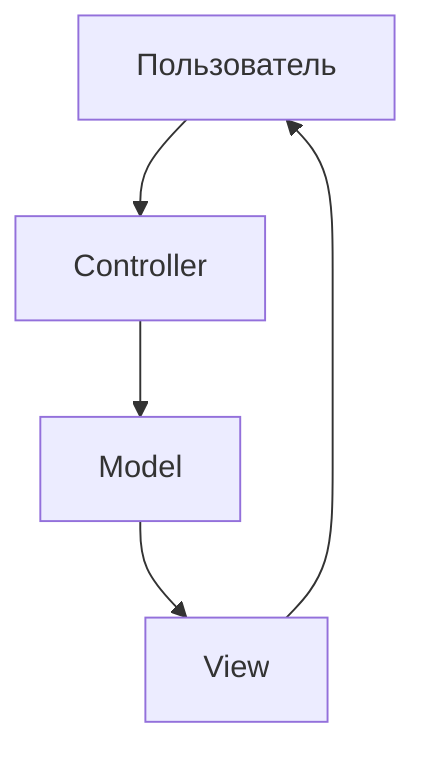

::: warning Текст слайда из PDF
**MVC**

Отделяет бизнес-логику
от представления

Множество вариаций
по логике взаимодействия

Множество вариаций
под конкретные среды
:::

**Слайд 46: ПРИНЦИП РАБОТЫ ПАТТЕРНА MVC**

::: warning Текст слайда из PDF
ПРИНЦИП РАБОТЫ ПАТТЕРНА **MVC**

Controller обрабатывает действия пользователя —
клики мышкой, нажатие клавиш клавиатуры или
входящие http-запросы.

Обработанные изменения Controller передаёт в Model
и отрисовывает на View (пассивный режим), или в
модель попадают изменения напрямую из View
(активный режим).

Главная задача View — отобразить данные из Model с
помощью Controller.
:::

**Слайд 48: ВМЕСТО CONTROLLER ПОЯВИЛСЯ PRESENTER И ВСЁ?**
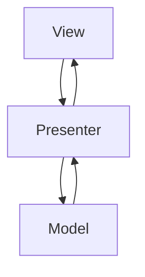

::: warning Текст слайда из PDF
ВМЕСТО CONTROLLER ПОЯВИЛСЯ PRESENTER И ВСЁ?

Если сравнивать с **MVC**,
то Model не изменилась.

View теперь сам обрабатывает действия
пользователей (с помощью виджетов,
например), а если это действие что-то
меняет в логике интерфейса, то оно
передаётся в Presenter.
:::

#### Выводы по MV*-паттернам

**Слайд 52: ОСНОВНЫЕ ВЫВОДЫ**
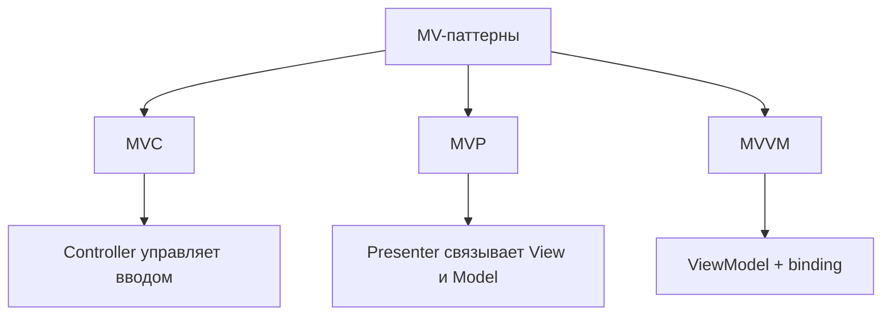

::: warning Текст слайда из PDF
ОСНОВНЫЕ ВЫВОДЫ
1.   Модель во всех паттернах выглядит одинаково и имеет одну и ту же цель –
     получение, обработка, а также сохранение данных.
2.   В классическом **MVC** пользовательский ввод обрабатывает Controller, а не View.
3.   Современные ОС и библиотеки виджетов берут на себя обработку
     пользовательского ввода, поэтому больше нет нужды в контроллере из **MVC**.
4.   Цель MV*-паттернов: отделить друг от друга отображение UI, логику интерфейса
     и данные (их получение и обработку).
5.   Используя MV*-паттерн в своем приложении, вы упрощаете его поддержку и
     **тестирование**, отделяете данные от способа их визуализации.
6.   **MVP** достаточно универсальный паттерн и подойдет во многих случаях (это мое
     личное мнение). Какой вариант использовать: Passive View или Supervising
     Controller – решать вам. Руководствуйтесь тем, что вам нужно: больше контроля
     и тестируемости либо лаконичности и краткости кода. Лавируйте между
     задачами и применяйте тот или другой подход.
7.   Если в системе присутствует хорошая **реализация** автоматического связывания
     данных (databinding), то **MVVM** – это ваш выбор.
:::

**MVC**-паттерн на клиенте. Тогда, в принципе, было приложение разделено впервые на модель, view и контроллер. Сейчас мы будем больше рассуждать о том, что вот эти MV-паттерны презентационного слоя, то есть они живут на клиентской машине, либо на локальной машине, и каким-то образом... взаимодействует в конечном счете через http либо другие протоколы с нашим бэкэндом где мы уже договорились либо гексагональная либо чистая архитектура но вот это вот mv на клиенте и что на себя берет каждый слой давайте начнем с модель самая элементарная она просто описывает данные нашего приложения чаще всего эти данные прилетают из бэкэнда Ну, либо там с базы, если мы напрямую обращаемся. И эти данные редко прям в чистом виде можно показывать на экран.

Чаще всего это такие raw, сырые данные, необработанные, которые надо отфильтровать, сгруппировать, как-то действительно, может быть, что-то откинуть. И их необходимо будет показать на вьюхе. Вьюха – это интерфейс, который, собственно, нужен для того, чтобы отрисовывать какие-то данные, которые хранятся в модели. Контроллер, вот казалось бы, а что он делает? Ведь вьюха может сейчас многое сама. Но еще раз, это было в конце 70-х годов. Тогда не было никаких элементов управления. Вы не могли сказать, нарисуй-ка мне кнопочку. Нарисуй-ка мне кнопочку, это на две недели программисту идет рисовать кнопочку. Ну и писать контроллер, который будет отрисовывать кнопочку на UI. То есть тогда не было никаких даже виндовых элементов управления.

Поэтому контроллер брал на себя действия вот такого не просто посредника, а он получал информацию от вьюхи, он понимал, что нужно сделать, заставлял модели работать, модель отрабатывала, говорила контроллеру, что вот она отработала, и контроллер отрисовывал это все на вьюхе. Причем сам отрисовывал, в нем было очень много кода. То есть помните, раньше я говорил, МВЦ, можно сказать, разносторонние квадраты, даже контроллер был жирнее всех, потому что он обязан был отрисовать вьюху. Принцип работы, да? Я думаю, примерно понимаете. Мы обращаемся, мы делаем что-то на вьюхе. Есть разные разновидности МВЦ. Active View и Passive View. Если Active View, то она сама может воздействовать на модель.

Если вьюха пассивная, то есть более классический вариант, то вьюха говорит, слушай, там нажали такую кнопку, контроллер, сейчас все разберусь, идет к модели, модель прокручивает бизнес-логику, говорит, ну все, что дальше? И контроллер говорит, ну я дальше буду перерисовывать вьюху. Вот. Но смотрите, а потом начал появляться, какие года, в общем, где-то лет через... 5-7, по-моему, модель ViewPresenter. Почему? Потому что, не потому что кто-то докторскую хотел защитить или написать ВКР, а потому что произошла революция на UI. Появились элементы управления, которые все, что раньше делал контроллер, теперь сама кнопочка это может делать. Она может при надении мышки подсветиться. И это не делает презентер. Это раньше делал контроллер.

Вот когда вы мышкой проводите по кнопке, она там немножко, с ней что-то происходит, подсвечивается. Раньше это делал контроллер. А теперь нет.

Теперь это все зашито в самом элементе управления. Нафига контроллер? Он и не нужен. Но вы же хотите как-то разделить UI от кода. Код в модели, UI здесь. Нужно что-то. Презентер берет на себя эту роль. он становится теперь просто дирижером но зато он разрывает вот такую вот циклическую связь которая была в мвц что вьюха дергает контроллер контроллер меняет модель модели обратно провоцировала изменения вьюхи здесь немножко связь разрывается за счет появления вот это вот шарика интерфейса то есть смотрите презентер берет на себя роль дирижера он ловит которые происходят на UI, если UI ему это дает. Потому что UI может сказать, да я теперь, собственно, сама контроллер.

Теперь мои элементы управления являются контроллером, которые раньше были логика в контроллере. Поэтому часть действий UI отрабатывает сама за счет того, что элементы управления взяли на себя роль контроллера. А часть действий, которые чаще всего связаны с бизнесом, она передает презентеру. А презентер, он теперь действительно как дирижер. Он говорит, хорошо, это сделает вот этот метод в модели. Модель отрабатывает, дает результат презентеру. Презентер, и вот тут самая сильная вещь, которая меняет идеологию разработки. Презентер не знает о вьюхе. Если в МВЦ контроллер знал о вьюхе, почему? Потому что контроллер рисовал вьюху. Он должен был знать о вьюхе. А теперь презентеру не надо знать о вьюхе. И что мы имеем? Мы теперь имеем разорванную связь.

То, про что и говорит любая архитектура, что нужно отделять все и делать независимыми.

Теперь презентер знает об интерфейсе вьюхи. То есть он знает, что у него есть ряд определенных методов, с которыми он может работать. А этот вьюха реализует данные интерфейсы. А это значит, что у нас вьюха может быть консолью. Вьюха может быть Windows-формой или каким-то мобильным приложением. То есть главное, чтобы все они имплементировали этот интерфейс, о котором знает презентер. И получается у нас действительно мы разорвали вот эту связь, которая была в МВЦ, и теперь у нас вот это независимо.

Теперь мы можем вьюхи писать разные, и презентер будет с ними со всеми работать, потому что все они реализуют интерфейс, о котором знает презентер. Иногда еще бывает, здесь строят тоже интерфейс. ай-модели, чтобы мы еще и не зависели от конкретной реализации модели.

### Ports and Adapters

#### Ports and Adapters: идея

**Слайд 23: PORTS AND**
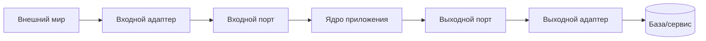

**Слайд 25: PORTS AND ADAPTERS**

::: warning Текст слайда из PDF
**PORTS AND ADAPTERS**

Domain это ключевое ядро системы в
полной изоляции от технических деталей

Последовательность вызова
вместо иерархии

Разворот зависимости
Data Access --> Domain

Работа с Presentation (Infrastructure)
через порты
:::

**Слайд 26: ОСНОВНАЯ ИДЕЯ**
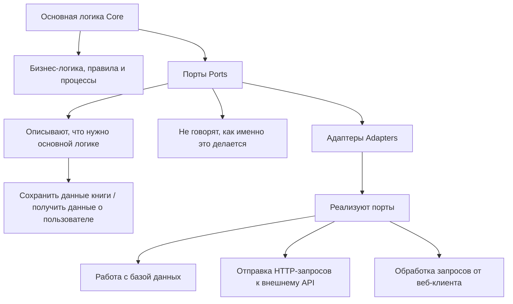

#### Ports and Adapters: схема и родственные формы

**Слайд 27: PORTS AND ADAPTERS**
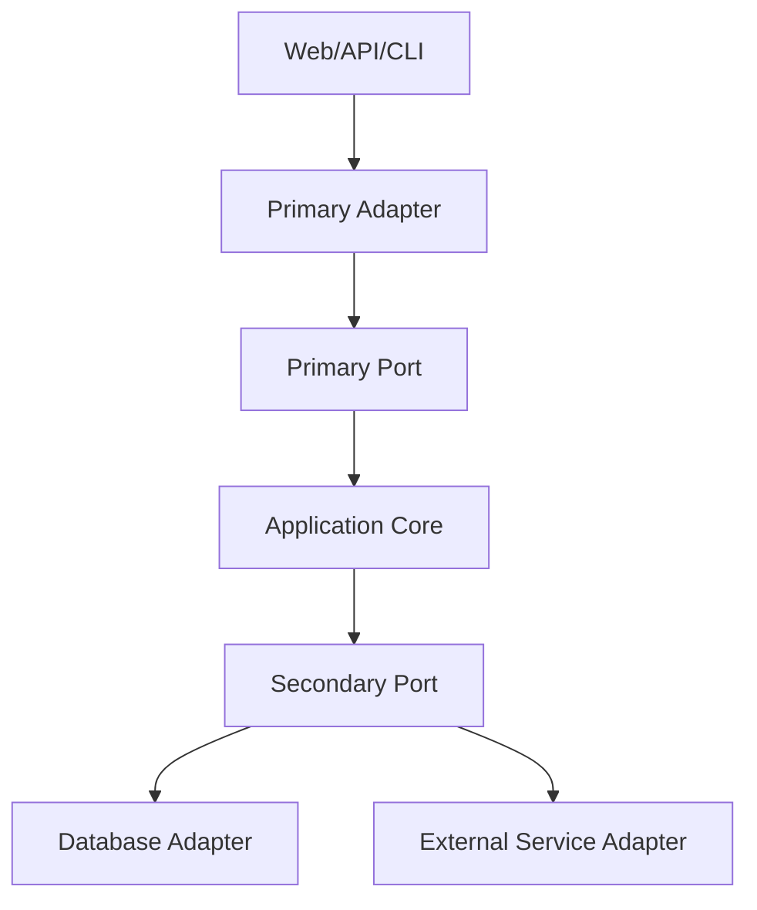

::: warning Текст слайда из PDF
**PORTS AND ADAPTERS**

Domain это ключевое ядро системы в
полной изоляции от технических деталей

Последовательность вызова
вместо иерархии

Разворот зависимости
Data Access --> Domain

Работа с Presentation (Infrastructure)
через порты
:::

**Слайд 28: ЭТО ТОЖЕ**
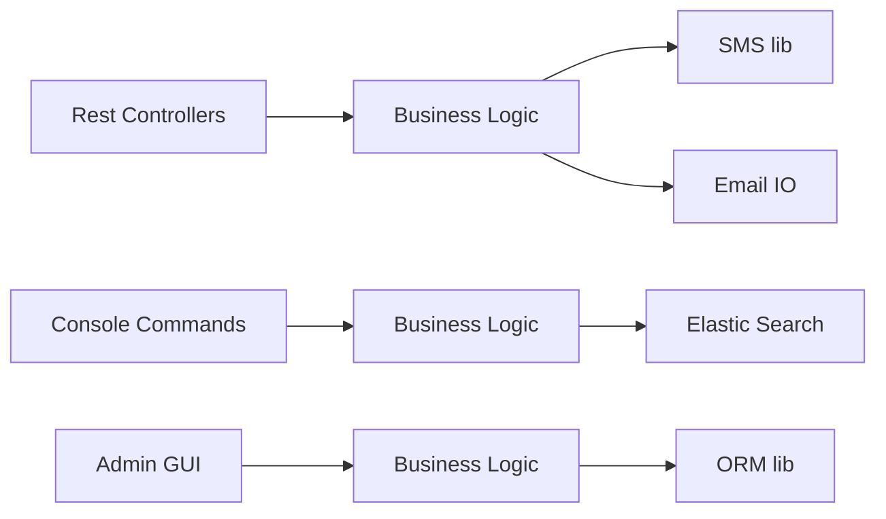

Ну и тогда у нас вот три независимых слоя, но это уже и есть как бы вот эти вот внедрения интерфейсов, это по сути порты. Отсюда модель не изменилась, вьюха, вот то, что я говорил, вьюха теперь сама обрабатывает действия, то есть она взяла на себя роль контроллера, а презентер стал таким дирижером, и он не знает, кем он дирижирует на стороне вьюхи, он знает о модели чаще всего. А иногда даже и о модели. Он просто стоит и понимает, что есть какая-то модель, есть какая-то вьюха. Но конкретных реализаций он не знает, потому что он работает с интерфейсами. Но и этого стало мало. И дошли до архитектуры. Опять же, несколько разновидностей есть **MVP**. Про них можно будет прочитать в материале, который я скину.

А закончим мы тем, что появилась архитектура **MVVM**. Да, она есть не везде. Но есть альтернативные решения данной архитектуре. В чем здесь идея? Здесь как бы довели до совершенства разорванность слоев. Тут вообще каждый слой только знает о нижележащем слое. А нижележащий не знает ни о ком. А нижележащий слой – это модель. И получается, что у нас модель самодостаточна. Она ни о ком ничего не знает. Она прокручивает какую-то, возможно, бизнес-логику. Она общается, возможно, с бэкэндом для того, чтобы данные получить. View-модель – это, по сути, логика представления. То есть она знает все, что сейчас происходит на UI. Если вы на UI выбираете какую-то галочку, ставите, здесь логический флаг из чекет становится истиной.

То есть это, по сути, олицетворение UI. Но весь смысл **MVVM** в том, что появилась технология привязки. То есть появился инструмент через паттерны команда, через интерфейсы уведомления. Если это Windows, то через события появилась возможность вьюхуе уведомлять о том, что что-то произошло на ней вьюмодель, и вьюмодель умеет уведомлять то, что в ней произошло, чтобы вьюха сама перерисовалась. То есть архитектура просто так не рождалась, под нее написали очень много фреймворков, которые, собственно, берут на себя обязанность перерисовки вьюхи, если тут какая-то коллекция изменилась. То есть появляются новые виды коллекции, Observable Collection, которая умеет кидать события о том, что она изменилась.

Это событие ловится вьюхой, и вьюха имеет специально обученные контроллы, которые умеют перерисовываться, если что-то во вью-модели изменилось. Да, это специфичная архитектура, скажете вы. Но на самом деле она стала так, специфична для Windows. А конкретно для таких решений, как WPF, на котором написан Windows, Office, Visual Studio, ну и собственно все, что под Windows сейчас пишется, красивое пишется на WPF. Даже года три назад видел вакансию, первый канал наконец-то переписывал свои приложения с Delphi на... WPF, требовался им программист.

Так вот, вы скажете, что это тогда как-то приэтарная архитектура, но нет, она как бы стала настолько популярна, что там, где... нет событий, там, где нет технологий привязки, где не было этих фреймверков, то есть там, где языки программирования не поспешили за этим новым архитектурным решением, появилась немножко другая архитектура, презентейшн модель. По сути, это альтернатива **MVVM**-архитектуре, но придется вот эти вот вещи, которые в MVVM-архитектуре от Майкрософта реализованы были в таком фреймверке, как... Windows Presentation Foundation, либо Xamarin, либо сейчас MAUI, тут придется это делать самостоятельно. То есть придется писать код, который связывает логику UI с вот этим вот UI.

А так в целом этот паттерн **MVVM** реинкарнировал в архитектуре Presentation Model. Поэтому если пишете не под Windows, то присмотритесь к данному паттерну. Он достаточно популярен в мобилках. Да, собственно, все. Ставим на этом точку. И переходим с этого дня. У нас большинство таких лекций будет в формате исторических ретроспектив. То есть, смотрите, чтобы вы не разочаровывались и понимали. С одной стороны, нам надо сейчас работать с базами. Все, буквально 10 секунд. Но вы можете собираться уже. Смотрите, нам надо работать с базами. У вас курс баз данных. С января, да, начнется? Но я быстро расскажу историческую ретроспективу, как мы дошли до S3-хранилищ, и как мы, ну, и будем работать дальше уже просто с S3-хранилищем.

Нам надо, по идее, поднять контейнер, чтобы там базу запустить. Не самостоятельно же устанавливать нам базу на компьютер. Поэтому мы быстро пройдем докер, ну, вообще виртуализацию от VMware до докер контейнеров, для того, чтобы понять потом, кого... 8S, **Kubernetes**, который будет дирижировать нашими контейнерами. В общем, большая часть последующих лекций будет выстроена по такому сценарию исторических ретроспектив. Я надеюсь, что это будет полезно, чтобы вы выучите базы на отдельном курсе. Вы выучите, скорее всего, DevOps на отдельном курсе.

Но вряд ли за одну лекцию вы... сможете взглянуть на историческую ретроспективу, чтобы понять, а почему вы сейчас изучаете докер, почему там за 10 лет до этого была виртуализация другая, а за 30 лет вообще не было виртуализации. Но я постараюсь вот так же, в таком же формате, как вот сегодня мы исторически рассматривали, почему модернизировались архитектуры, вот дальше так же буду это выстраивать. Все, спасибо, ребята.
