# Лекция 9. Виртуализация и эволюция баз данных

Эта тема на самом деле, каждая из тем является дисциплиной. Мы разберем базы, разберем виртуализацию. Но с другой стороны, как я и говорил, нам надо понять ход мыслей. Почему базы развивались так, а не иначе? Почему виртуализация дошла от 60-х годов, от каких-то программного обеспечения, которое устанавливалось на серверные... Машина дошла до K8S. С целью, с одной стороны, попробовать на семинаре, потому что дальше нас ждет разработка микросервисной архитектуры, где в одном из микросервисов будет подниматься контейнер по докер-образу с PostgreSQL.

И нам необходимо, с одной стороны... понимать в виртуализации с другой стороны еще и в базах данных но напомню что в дальнейшем у вас буквально уже после нового года будет курс баз данных и я уверен что кто-то когда-то выберет низ связанный с devops и вы погрузите все свое внимание на виртуализацию вот поэтому напомню наша цель не то что по верхам пробежаться а понять саму идеологию развития, что произошло за последние 50 лет. И это поможет вам на самом деле в дальнейшем разбираться уже в современных тенденциях. Ну, не то что предсказывать, что будет, но хотя бы понимать, а почему это реализовали именно таким образом, а не иначе.

## Виртуализация, контейнеризация и путь к облакам

#### ЦОД и первые варианты виртуализации

**Слайд 9: ТИПОВАЯ АРХИТЕКТУРА ЦОД-А**
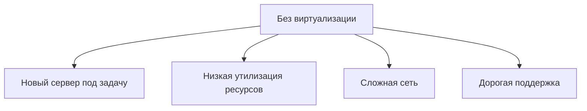

::: warning Текст слайда из PDF
ТИПОВАЯ АРХИТЕКТУРА ЦОД-А

                            Если бы не было виртуализации:
                            •   Покупка нового сервера под
                                каждый новый сервис;
                            •   Повышенное
                                энергопотребление;
                            •   Сложная сетевая
                                инфраструктура;
                            •   Сложная и дорогая система
                                резервного копирования;
                            •   Выше вероятность
                                отказа оборудования.
:::

**Слайд 12: ВИДЫ АППАРАТНОЙ ВИРТУАЛИЗАЦИИ**
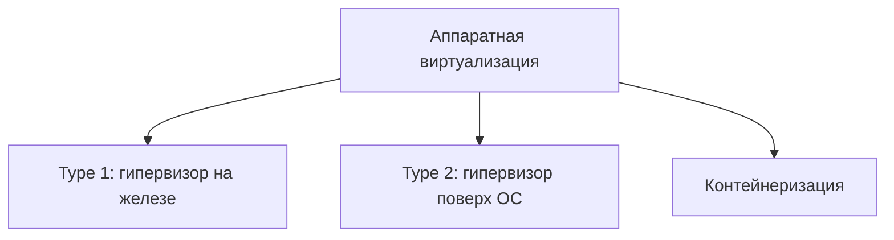

::: warning Текст слайда из PDF
ВИДЫ АППАРАТНОЙ ВИРТУАЛИЗАЦИИ

Обычная работа ПК
•    Физическое “железо”
•    Операционная система
•    Приложение под эту ОС
:::

**Слайд 13: ВИДЫ АППАРАТНОЙ ВИРТУАЛИЗАЦИИ**
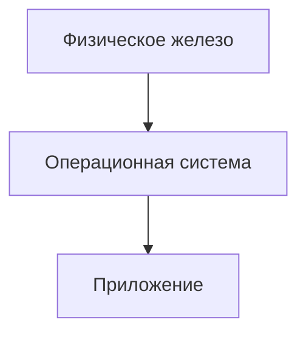

::: warning Текст слайда из PDF
ВИДЫ АППАРАТНОЙ ВИРТУАЛИЗАЦИИ

Обычная работа ПК            Виртуализация (Type 2)
•    Физическое “железо”     •   Физическое “железо”
•    Операционная система    •   Операционная система
•    Приложение под эту ОС   •   Гипервизор
:::

#### Аппаратная виртуализация и гипервизоры

**Слайд 14: ВИДЫ АППАРАТНОЙ ВИРТУАЛИЗАЦИИ**
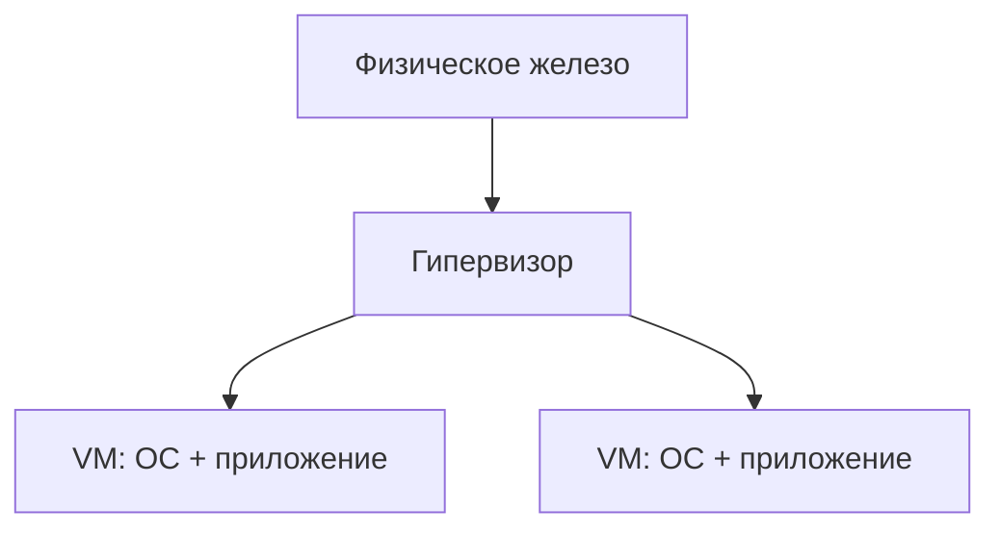

::: warning Текст слайда из PDF
ВИДЫ АППАРАТНОЙ ВИРТУАЛИЗАЦИИ

Обычная работа ПК            Виртуализация (Type 2)     Виртуализация (Type 1)
•    Физическое “железо”     •   Физическое “железо”    •   Физическое “железо”
•    Операционная система    •   Операционная система   •   Гипервизор
•    Приложение под эту ОС   •   Гипервизор
:::

**Слайд 15: ВИДЫ АППАРАТНОЙ ВИРТУАЛИЗАЦИИ**
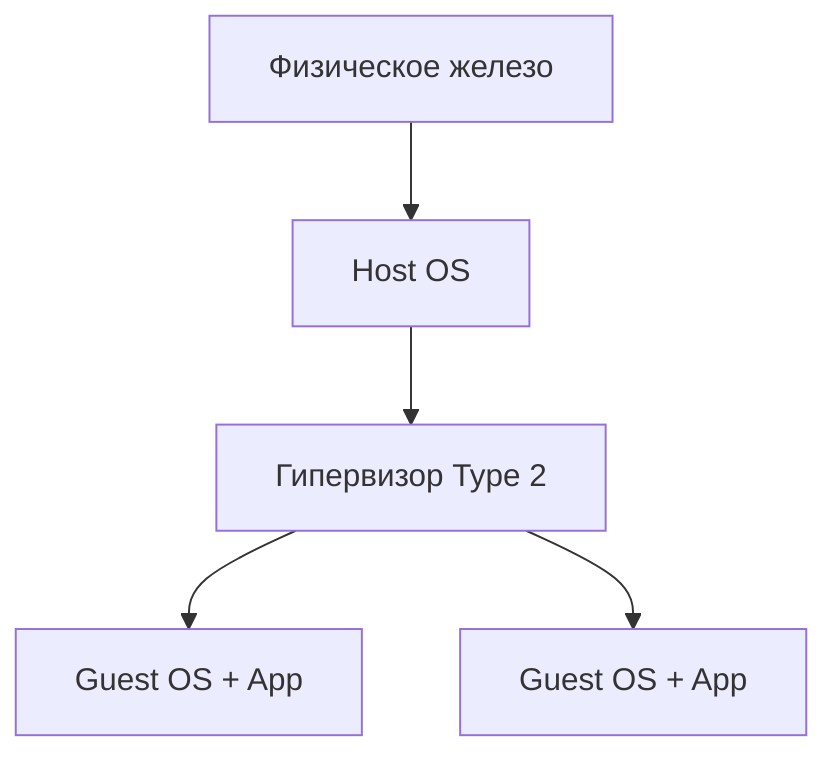

::: warning Текст слайда из PDF
ВИДЫ АППАРАТНОЙ ВИРТУАЛИЗАЦИИ

                             Intel VT-x                              Intel VT-x
                             AMD-V                                   AMD-V

Обычная работа ПК                         Виртуализация (Type 2)                  Виртуализация (Type 1)
•    Физическое “железо”                  •   Физическое “железо”                 •   Физическое “железо”
•    Операционная система                 •   Операционная система                •   Гипервизор
•    Приложение под эту ОС                •   Гипервизор
:::

**Слайд 16: ВИРТУАЛИЗАЦИЯ (TYPE 1)**
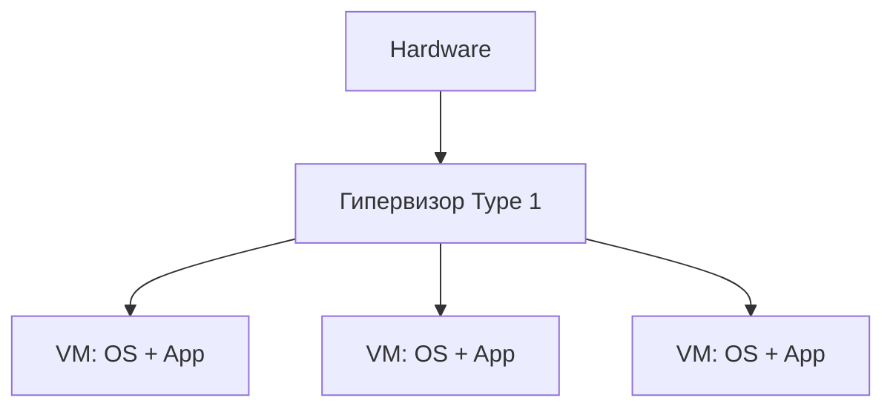

| Блок | Роль |
|---|---|
| Hardware | Физические ресурсы сервера. |
| Гипервизор Type 1 | Управляет аппаратными ресурсами и виртуальными машинами. |
| VM | Изолированная ОС с приложениями. |

::: warning Текст слайда из PDF
ВИРТУАЛИЗАЦИЯ (TYPE 1)

Ключевые задачи гипервизора
1. Эмуляция аппаратных ресурсов
2. Изоляция среды
3. Распределение ресурсов

Ключевые достоинства аппаратной виртуализации
1. Оптимальное использование
   вычислительных ресурсов;
2. Экономическая выгода;
3. Скорость внедрения новых приложений;
4. Проще администрирование.
:::

#### Плюсы и минусы гипервизоров

**Слайд 22: ПЛЮСЫ / МИНУСЫ**

| Сторона | Пункты |
|---|---|
| Преимущества гипервизора 2-го типа | Доступность; удобство; наличие бесплатного софта. |
| Недостатки | Зависимость от работы своего ПК; низкая плотность виртуальных машин. |

**Слайд 29: ПЛЮСЫ / МИНУСЫ**

| Сторона | Пункты |
|---|---|
| Преимущества гипервизора 1-го типа | Высокая плотность ВМ; возможность миграции между серверам; наличие бесплатного софта. |
| Недостатки | Зависимость от работы своего ПК; низкая плотность виртуальных машин. |

#### Контейнеры и ограничения монолита

**Слайд 31: КОНТЕЙНЕРЫ**
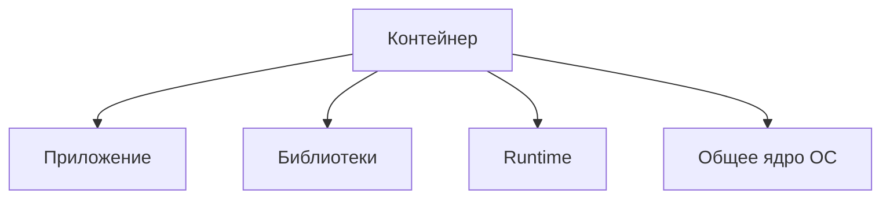

**Слайд 32: КОНТЕЙНЕРЫ**

| Подход | Слои |
|---|---|
| Виртуализация ОС | Hardware; Host OS; Container Engine; контейнеры с App и зависимостями. |
| Виртуализация приложений | Hardware; Host OS; Container Engine; контейнеры с App и зависимостями. |
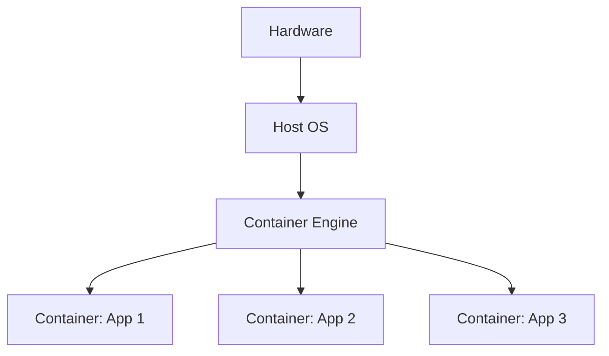

::: warning Текст слайда из PDF
КОНТЕЙНЕРЫ

Виды аппаратной виртуализации   Виртуализация приложений

                                 Контейнеризация
                                 •   Изоляция программных ресурсов
                                 •   Container Engine вместо гипервизора
:::

**Слайд 38: НЕДОСТАТКИ МОНОЛИТА**
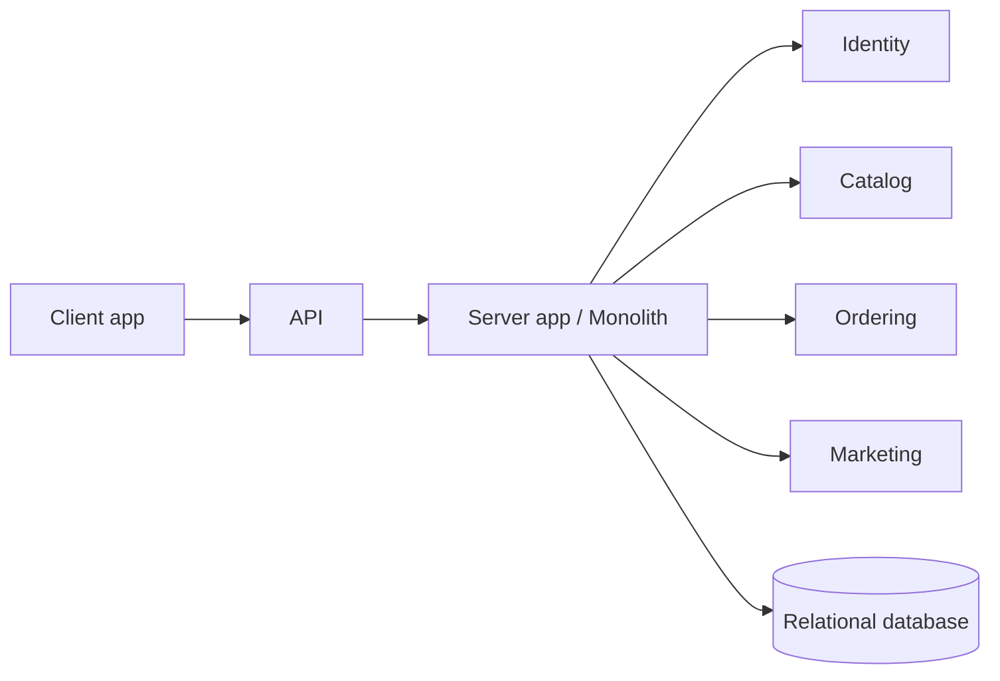

::: warning Текст слайда из PDF
НЕДОСТАТКИ МОНОЛИТА

1. Сложно вносить изменения
2. Высокая цена ошибки
3. Сложно искать проблемы
4. Невозможно выборочное масштабирование
:::

#### Микросервисы и облачная инфраструктура

**Слайд 39: МИКРОСЕРВИСНАЯ АРХИТЕКТУРА**
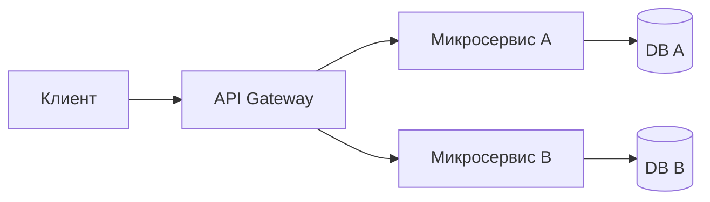

::: warning Текст слайда из PDF
МИКРОСЕРВИСНАЯ АРХИТЕКТУРА
“Выживает тот, кто быстрее адаптируется” .

Преимущества
1. Простота и скорость изменений
2. Оптимальное масштабирование
3. Свобода выбора технологий
4. Небольшие команды разработки

Недостатки
1. Усложнение инфраструктуры
2. Изменение процесса разработки
3. Сложнее обеспечить безопасность
4. Высокая стоимость специалистов
:::

**Слайд 54: ОБЛАЧНЫЕ ПРОВАЙДЕРЫ**

| В чем преимущества облаков и почему они так популярны? | Лидеры российского рынка |
|---|---|
| Облако это быстро | Yandex Cloud |
| Переход к концепту IaC (Infrastructure as Code) | РТК облако |
| Переход к микросервисной архитектуре | КРОК |
| Переход от CapEx к OpEx | Selectel |
|  | Cloud MTS |
|  | Sber Cloud |
|  | VK Cloud Solutions |

Значит, по плану у нас с вами рассмотреть именно историю виртуализации.

Начнем с нее. Долго думал, что сначала показать историю развития баз данных, но так как мы будем говорить про шардирование, про разбиение базы на несколько узлов, нам надо все-таки понять, что это за узел и из чего, как он может выглядеть, как он может появиться. Поэтому сначала разберем виртуализацию, а потом уже посмотрим исторические аспекты развития баз данных. Но долго тоже думал, как рассказывать про базы данных за 45 минут. Можно было бы сравнить одну базу с другой базой, посмотреть, что лучше, и про лучшую рассказывать. Но таких обзоров в интернете тьма, поэтому будем рассматривать именно исторические аспекты, самые важные, которые помогали базу данных всегда сделать скучной. Скучной для разработчика. Потому что чего там веселого?

Мы должны отправить... данные в базу база должна их сохранить все для разработчика базы это должна быть действительно скучно это как не знаю пассажир самолета он сел самолет самолет взлетел самолет приземлился доставил его вот самолет это база данных для пассажира вот разумеется для того кто разрабатывает базы все должно быть интересно сложно и увлекательно но это другие уже специальности погнали значит история виртуализации все началось Можно сказать, конечно, бум начался в 2000-х, но на самом деле уже с 60-х годов в том или ином виде виртуализация появлялась. Но да, она совершенно была отличная от того, что мы видим сейчас.

Но тем не менее люди понимали, что купить два сервера – это гораздо дороже, и они не будут загружены на 100%, и нужно каким-то образом на одной физической машине. попробовать запустить совершенно разные, возможно, операционные системы для разных нужд. Поэтому всё началось с того, что изначально были действительно серверы, дата-центры.

### Виртуальные машины

Мы исторически рассмотрим их, потом посмотрим, что стали появляться виртуальные машины. Но на этом ход мысли человечества не остановился. Те же самые виртуальные машины, они перешли в облако. Не то, что они ушли совсем. Я бы сказал так, появились облака, и мы можем пользоваться теперь виртуальной машиной как услуга, как сервис. Разумеется, если вам необходимо поставить на свое собственное железо, вы также можете остаться на своем собственном железе и установить виртуальную машину. Вот. Но этого тоже стало мало. Люди поняли, что а смысл поднимать целую виртуальную машину? ради того, чтобы запустить одно отдельно взятое приложение.

Этому приложению, возможно, нужно 20-30 тех мощных, ну не мощных серий, а того софта, которое будет у вас установлено на виртуальной машине. Поэтому смысл виртуализировать всю аппаратную часть, если можно виртуализировать работу самой программы. Ну и поговорим про контейнеры, собственно. Но и на этом как бы не остановилось. И сейчас популярно, наверное, лидером, ну не наверное, а лидером третий рынка занимает Amazon. Это, собственно, бессерверные вычисления, когда вам даются ресурсы, которые могут выполнить вашу задачу. Многие спрашивают, при чем тут Half-Life. Это AVS? Да, это AVS, ага. Ну, я логотип как бы лидеров поставил, да, наверное, безоговорочный лидер виртуализации, либо Кубер, Каос МС, Кубернетис, одно и то же, либо Докер.

Ну, решил поставить Докера, а тут решил поставить знак Амазона.

Если говорить про серверные дата-центры, то типовая архитектура могла бы выглядеть следующим образом. У нас есть действительно такие массивные стойки. на которых установлен физический сервер, они каким-то образом соединены с сетью, и мы можем такой себе купить под наш какой-нибудь стартап. Но проблема в том, что, я думаю, на Авито такое даже не продать, когда стартап развалится. И вот тут возникает вопрос, а стоило ли вкладывать деньги в такое железо? Это, конечно, все... Круто, но дорого-богато. Работает быстро, но нужен соответствующий человек, который это будет обслуживать. Да и, собственно, дата-центр — это даже не один человек, а целая армия людей. Поэтому от этого стали отходить.

Если еще, наверное, в 2000-2005 годах... действительно в компаниях были такие серьезные стойки, я наблюдал, то сейчас уже достаточно редко и достаточно в специфичных компаниях, где есть ряд задач, связанных с секретностью какой-то, то это можно наблюдать. Но в большинстве IT-компаниях все ушло, конечно, в... в покупку одного мощного сервера и с поднятием там виртуальных машин, либо ушло все в облака.

Собственно, виртуальные машины. Ключевые тезисы – это выделение ресурсов под изолированную среду. Но изоляция, она может быть либо программной, либо… Что мы виртуализируем? Виртуализируем железо, поэтому ее и называют аппаратная виртуализация. что все, что у нас было установлено, жесткий диск, сетевая карта, видеокарта, все это подвержено виртуализации. И в стандартном виде, если стандартный компьютер выглядит таким образом, у нас есть некое железо, на которое устанавливается операционная система, способная работать с этим железом на системном уровне, и дальше уже устанавливается на этой операционной системе... работает наше прикладное программное обеспечение, которое пользуется сервисами операционной системы, чтобы взаимодействовать с железом.

Все вроде бы прекрасно, но возникает иногда необходимость, как у вас в курсе, скорее всего, это было в архитектуре компьютера и операционной системы, вам потребовалось наверняка поставить вторую операционную систему, если вы сидели не на Linux и не на Mac. то как это сделать? Вы воспользовались на самом деле виртуализацией второго типа. Сисадмины вообще это не называют виртуализацией, это так, фу. Вы можете сказать, что да, я пользовался виртуальной машиной, я знаю виртуализацию, но на самом деле это виртуализация второго типа для админов это вообще просто игрушка.

Это когда у вас на вашей родной операционной системе, поверх вашей операционной системы ставится соответствующее программное обеспечение. которая позволяет вам виртуализировать аппаратную часть, которая, виртуализируя аппаратную часть, на самом деле эмулирует работу аппаратной части. То есть вы можете сказать, какая там будет сетевая карта, какая видеокарта, какой процессор, но у вас от этого в компьютере больше-то не станет процессоров. Наоборот, это будет всё жутко тормозить, потому что работать это будет всё на вашем родном железе. Плотность. Такой термин виртуализация – это количество виртуальных машин, которые вы можете установить на одну физическую станцию. При виртуализации второго типа оно на самом деле очень-очень мало. Плотность мала.

Потому что ваши установленные виртуальные машины работают все равно через родную хостовую операционную систему. И все это на самом деле замедляется. Но для чего это нужно? Для того, чтобы... А для чего это нужно? В современных реалиях это вообще не нужно. Потому что раньше вы действительно, разрабатывая какое-то ПО, могли попробовать протестировать его на другой операционной системе, в другом окружении. То сейчас для этого есть действительно контейнеры, к которым мы чуть позже перейдем. Компания, занимающаяся разработкой своего продукта или заказной разработкой, ей необходимо несколько поднять виртуальных машин, то она использует виртуализацию первого типа. Это действительно то, чем занимаются сисадмины в компаниях.

Они устанавливают на... серверные станции, специальную операционную систему, которая чаще всего не имеет визуального интерфейса. В лучшем случае она имеет API, вы можете подключаться с любого другого устройства, либо можно через командную строку управлять данной операционной системой. Она в себе содержит как раз...

### Гипервизоры

Тот гипервизор, который необходимо было устанавливать вам, допустим, в M-Vari, когда вы хотите воспользоваться вашей родной операционной системой, поставить другую виртуальную машину и туда другую операционную систему, вы ставили в M-Vari, либо, наверное, самое распространенное в M-Vari. То здесь в M-Vari она как бы встроена уже в саму операционную систему.

И, соответственно, она позволяет вам развернуть... на себе несколько операционных систем, ну а так как она оптимизирована именно под работу с виртуальными машинами, она изначально затачивалась и писалась под эти задачи, то взаимодействие этих установленных операционных систем на специальную хостовую виртуальную операционную систему она позволяет быстрее и эффективнее настроить взаимодействие с аппаратным железом. В общем, они быстрее, плотность их больше, количество установленных виртуальных машин при такой архитектуре значительно превышает, чем вы можете поставить на обычной пользовательской операционной системе. При этом при первом и при втором варианте у вас... Должен процессор поддерживать виртуализацию.

Они по-разному, эти технологии, называются у AMD, у Intel, но и чаще всего они по умолчанию уже в современных компьютерах есть. Плюсы и минусы.

## Type 1 и Type 2

Плюсы виртуализации первого типа – это быстрее, это, в конце концов, экономически выгоднее. Потому что, купив один большой сервер, количество виртуальных машин, которые он может поднять, превышает, чем вы будете... покупать даже слабенькие серверные станции, выстраивать стойку, то дешевле купить один мощный сервер и на нем поднять несколько виртуальных машин.

Теперь, говоря о виртуализации второго типа, это та детская виртуализация, которой мы можем сами с вами поиграться, установив... программное обеспечение VirtualBox либо VMware. Это два, на самом деле, лидера, которые имеют и бесплатные, и платные версии. Есть также и... Ну, я их написал как бы меньшим шрифтом, потому что тот же Microsoft Hyper-V, Xen, они являются и гипервизорами первого типа. И они ушли уже в гипервизоры второго типа, как это не основная их задача. Поэтому если говорить именно о виртуальных машинах для обычных пользовательских компьютеров, то это VirtualBox и VMware. Плюсы и минусы. Доступность. Действительно, наличие бесплатных версий у многих вендоров. И простота.

- Из минусов это...

Низкая плотность, то есть количество поднимаемых виртуальных машин, на самом деле, невелико, потому что каждый из них жрет очень много ресурсов. И еще и ваша собственная операционная система должна запустить эту виртуальную машину, но тоже тратятся ресурсы. Поэтому, если вы действительно занимаетесь, ну, в компании, компания занимается разработкой софта, то, скорее всего, у нее будет мощный сервер с виртуализацией первого типа. Это яркие представители тот же VMware и его бесплатная версия SXE, но сам VMware платный. У Microsoft тоже платный, но как минимум вы должны купить операционную систему, где установлен Hyper-V.

И на самом деле Microsoft, по-моему, лет 5 назад заявил, что доходность от виртуализации облачной у него превысила доходность от продажи ПО. Но, тем не менее, Microsoft делает ставку на виртуализацию, но на облачную. Но и на Hyper-V тоже не забивает. Xen и KVM, наверное, не так, может быть, популярны. Но у KVM платная, у нее есть бесплатная версия Red Hat. В общем, несмотря на то, что само количество... гипервизоров настолько велико, одно радует, что они все придерживаются практически двух-трех форматов, и они взаимозаменяемы. Ну и тон задает VMware, которая, наверное, одна из первых прогрессивных таких гипервизорных операционных систем. Плюсы-минусы можно сделать, что это высокая плотность виртуальных машин на железе. Ну, на одном сервере.

Ну, а из минусов это сложность поднятия и администрирования такой виртуальной машины. Но для нас, как программных инженеров, это на самом деле не так интересно, как следующие этапы. По сути, когда админы спихнули все на программистов. И сказали, что сами варюйте, сами себе разворачивайте, и все.

### Контейнеры

**Слайд 62: ПЕРЕМЕННЫЕ КОМПОНЕНТЫ**

| Компонент | Описание |
|---|---|
| Docker образ | Шаблон, из которого создаются Docker-контейнеры. Образ хранит код, среду выполнения, библиотеки, переменные окружения и конфигурационные файлы. |
| Dockerfile | Файл с командами и опциями создания образа, а также настройками будущего контейнера: порты, переменные окружения и другие опции. |

::: warning Текст слайда из PDF
ПЕРЕМЕННЫЕ КОМПОНЕНТЫ

**Docker** образ — это шаблон, из которого создаются Docker-
контейнеры. Образ хранит в себе всё необходимое для
запуска приложения, помещенного в контейнер: код, среду
выполнения, библиотеки, переменные окружения и
конфигурационные файлы.

В Dockerfile записываются команды и опции создания образа,
а также некоторые настройки будущего контейнера, такие как
порты, переменные окружения и другие опции.
:::

Вот, и появились контейнеры. Как и почему они появились? Смотрите, если поднимая операционную систему, допустим, Linux на операционной системе Windows для того, чтобы продемонстрировать работу программного обеспечения, которое под Linux, вам действительно приходилось поднять Linux целиком. Из чего состоит Linux? User Space – это те библиотеки, которые нужны для того или иного прикладного программного обеспечения. И смысл поднимать всю операционную систему целиком, если можно виртуализировать именно среду выполнения. То есть оставить ядро операционной системы и виртуализировать именно User Space. То есть тот набор библиотек… который нужен для общения с ядром операционной системы. Вот так у людей появились мысли о контейнерах.

Разумеется, докер сразу не появился. И докер появился гораздо, несколько десятилетий позже. Но контейнеры были и до докер. Просто собиралось это все не по нажатию одной кнопочки, а собиралось это энтузиастами. Докер – это внутренний проект одной из компаний по виртуализации, который вылез в нечто большое, масштабное.

Давайте вернемся к контейнерам. В чем идея? Смотрите, здесь у нас то, что мы уже прошли, это аппаратная виртуализация первого и второго уровня, а вот справа от них – это контейнеризация. Когда у нас вместо гипервизора, ну или вот здесь, наверное, будем рассматривать, вместо гипервизора какой-нибудь VMware, который ставится на операционную систему, здесь у нас на операционную систему, ну важно иметь в виду, что операционную систему Linux подобную, ставится один из контейнеров. Это не обязательно, да? Докер, я тут привел Крио. Докер Ди, их множество, одно какое-то программное обеспечение, которое обеспечивает нам виртуализацию. И смотрите, что она делает, контейнер.

Он заменяет не всю, то есть он не делает аппаратную виртуализацию железа и не эмулирует какую-то операционную систему, а он добавляет, создает... User Space снова, сейчас я на другой картинке покажу. Вот операционная система Linux. Она состоит из формально двух модулей. Модуль ядра операционной системы, Kernel. С ядром операционной системы мы общаемся через системные вызовы. Это вы проходите сейчас в курсе операционных систем. Но помимо ядра операционной системы у нас есть еще и Application User. Слой, который модифицирует каждый пользователь операционной системы под себя в зависимости от того, какое прикладное программное обеспечение он хочет установить.

И, соответственно, чтобы запустить тот же PostgreSQL или какой-нибудь Nginx сервер, нам необходимо установить соответствующие модули, соответствующее программное обеспечение. И вот виртуализация или контейнеризация, которая строится по идее контейнеризация, она строится на основании того, что у нас есть на компьютере операционная система, основанная на Kernel Space и User Space. Это либо Linux, либо... Ну, вариантов нет на самом деле. Либо на Windows необходимо ставить соответствующую утилиту. Так вот, виртуализация позволяет нам изменить юзерспейс, не трогая ядро операционной системы.

И таким образом вы можете на одной операционной системе, на своей родной операционной системе, поднять множество таких... контейнеров, которые будут модифицировать именно юзерспейс. Но работать они будут на самом деле на вашей реальной, родной операционной системе. Только, да, для того, чтобы позволить подсовывать вот эти юзерспейсы в kernel space, вам необходимо все-таки установить программное обеспечение, допустим, докер. Либо его аналог. К слову, мы можем в один из контейнеров установить полноценную виртуальную машину. Это тоже позволительно. Это вопрос, правда, зачем, но так можно. Что мы получаем, какие преимущества?

- Во-первых, объем каждого контейнера, который содержит исключительно только те библиотеки, которые необходимы для запуска вашего прикладного программного обеспечения.

Эти библиотеки весят не так много, как вся полноценная операционная система. Соответственно, как минимум, чем меньше весит контейнер, тем интеграция его в операционную основную систему быстрее.

Таким образом, гораздо проще стартануть контейнер с необходимым ПО, чем запустить виртуальную машину, в которой запустится все необходимое ПО. Они легко мигрируются, легко запускаются, загружаются тоже гораздо быстрее. И они изолированы на уровне операционной системы. Но если вы думаете, что на этом все закончилось, на самом деле нет. Дело в том, что одних контейнеров стало мало. И с появлением... Вот этой популярной методологии разработки микросервисной, когда наше монолитное приложение распиливается на несколько микросервисов, каждый из этих сервисов необходимо запустить в своем контейнере, и возникают вопросы оркестрации этих контейнеров. То есть нужны механизмы, желательно не ручные, а автоматизированные, которые на себя возьмут...

Ответственность по балансировке нагрузки, по созданию, по масштабированию ваших микросервисов вертикально. Было у вас один микросервис запущен, а вам нужно несколько инстансов. И к этим должен кто-то управлять. Следить за нагрузкой, запускать, удалять, опять создавать. И вот такой вот оркестратор, сейчас, наверное, один из самых популярных, это Кубернетис. Он взял на себя вот эту вот ответственность. Конечно, можно обойтись и докер-композом, который есть у докера, но его роль чуть более локальна. Он не занимается именно... Он способен дирижировать контейнерами, мы это увидим на семинаре, но он не занимается именно такой оркестрацией сетевой, что может K8S. Какая роль кубернетиса? Если у нас есть монолитное приложение, вот на ближайшем семинаре...

Через один семинар мы начнем с вами наше монолитное приложение распиливать на два или три микросервиса. В чем преимущество микросервисов перед монолитами?

На самом деле вопрос такой халеварный, и последнее время вот такой вот ажиотаж вокруг микросервисов стихает, и люди начинают говорить, что да не надо на каждый пчик делать микросервис, а уходят в модульные монолиты. уходят в другие виды архитектур, потому что у микросервисов куча своих проблем. Но все-таки нужно отдать должное. Микросервис позволяет нам вести разработку более локально, разрабатывать отдельный микросервис командой и не зависеть от других микросервисов.

Потому что если в монолите, даже если вы разобьете их на библиотеке, и у вас будет казаться вроде бы... низкая связанность между библиотеками тем не менее все равно это все в одной машине если вы правите что-то есть риск что по эффекту бабочки это сломает что-то другое поэтому с недостатками монолита можно действительно признать их и что то что сделать распилить наше приложение на ряд отдельно взятых задач но это может быть сервер продаж сервер постгарантийного обслуживания и так далее.

Таким образом, у нас появляется, что наше монолитное приложение бьется на несколько частей. У каждой этой части будет своя база данных, свое API по доступу к нему. И, соответственно, поддержка таких микросервисов гораздо будет проще и разумней. чтобы каждый из микросервисов поднимался в отдельном контейнере. Тогда возникает вопрос, что этими всеми созданными контейнерами и их вертикальное масштабирование должен кто-то на себя взять. То есть когда возрастает роль на какой-то один из микросервисов, у нас какие есть варианты? Создать несколько инстансов, чтобы разбалансировать нагрузку от одного микросервиса, чтобы половина запросов шла в один, половина в другой. И вот этим как раз и должен заниматься какой-либо оркестратор.

Сейчас один из самых популярных – это **Kubernetes**. Количество микросервисов. Мы сегодня не будем проходить микросервисную архитектуру. Для этого у нас будет… Следующая лекция, когда мы будем разбирать межсервисное взаимодействие синхронного и асинхронного типа. Это будет следующая лекция. Сегодня просто проговорим, что действительно это один из вариантов увеличения производительности нашей системы. До каких пор, допустим, если рисовать диаграммами, три года назад картинку нашел, у того же АВС было более 500 микросервисов. Часть из них, правда, уже не работает, но продолжает тестироваться. Но все боятся их отключить. Был разговор с техническим директором Озона.

Он говорит, что да, у нас есть подозрение, что определенная часть микросервисов не используется, но отключить мы боимся. Потому что мало ли. Это как раз один из недостатков микросервисной архитектуры. Порог вхождения в систему становится очень сложный и сложно понять, этот микросервис где-то интегрирован или уже нигде не интегрирован. Он физически может быть интегрирован, но логически может быть не нужен. Понятное дело, что таким большим количеством микросервисов должен кто-то управлять. Ну вот как вариант K8S.

Собственно, чего тут сказать, что **Kubernetes** это абстракция. И главное, что дает нам Kubernetes, это переход от... Мы отказываемся от управления сетями, узлами в этих сетях, то есть контейнерами, от управления серверами и уходим к управлению сервисами. Что мы воспринимаем каждый сервер, микросервис, как сервис, как услугу. И мы, по сути, мы можем общаться с K8S в целом скриптами, говорить ему, что сделай то-то и то-то, и меня как бы не волнует, как это происходит. Очень много логики скрывается от нас как раз в самом K8S. Он берет на себя задачи отказа устойчивости, масштабирования, экстренного восстановления. То есть, по сути, он является действительно дирижером по созданию и уничтожению вот этих вот контейнеров, которые создаются для чего?

Для того, чтобы моментально разбалансировать нагрузку на тот микросервис, на котором она возрастает. Сама структура Кубера выглядит следующим образом. Есть мастер-нода, которая будет создавать и масштабировать ноды. В каждой ноде есть у нас какой-либо докер, контейнер, в котором установлено одно либо несколько приложений. И, собственно, **Kubernetes** управляет вот этими нодами, масштабируя их. Происходит примерно так. В каждой ноде есть так называемый термин под, который... на котором может быть развернуто необходимое нам программное обеспечение. И есть у нас под, которым пользуются какие-то запросы извне. Но мы можем поднять второй под, третий под, произвести тем самым вертикальное масштабирование нашего сервиса.

И нагрузка будет балансироваться между этими тремя сущностями. Средствами кубернетиса. Но, если думаете, что на этом остановилась идеология виртуализации, нет. Люди пошли дальше. Потому что поднять свой кубернетис достаточно сложно. Настроить мастер-ноду, ноды, настроить балансировщик. Это действительно достаточно сложно. И поэтому люди стали пользоваться просто облачными провайдерами услуг. Облачные провайдеры. Мы можем пользоваться принципиально разными подходами. Можем пользоваться как IaaS, то есть сервис, дающий нам инфраструктуру. Мы можем купить сервер и самостоятельно установить необходимое программное обеспечение. а можем купить сервис как пасс, то есть платформу как сервис, где сказать, что нам необходим **Kubernetes** на покупаемой платформе.

Ну и, можно сказать, третий есть вариант, это SaaS, когда мы покупаем уже в облаке необходимое программное обеспечение, но это уже не про разработку. Рынок поделили, наверное, три основных. Ну ладно, если мы говорим про западные вендоры, то это три основных вендора – Amazon, Microsoft и Google. Но при этом говорю, что доля дохода от облачных технологий у Microsoft через Asia растет, и они делают на это ставку.

Если говорить о российских лидерах, то это, наверное, Яндекс и, может быть, Selectel. сейчас сделали такие достаточно хорошие, удобные, понятные облачные сервисы. Так как работать на семинаре мы будем с докером, давайте быстро пробежимся. Основные задачи и идеи докера.

Значит, появился он действительно раньше, чем 2013 год. Он был как внутренний проект, но в 2013 году вышел первый релиз. И сейчас количество... Наверное, все, кто занимается разработкой, используют докер для того, чтобы самостоятельно как минимум не разворачивать требуемое программное обеспечение для того, чтобы поднять базу. То есть гораздо проще в современной разработке не производить инсталляцию того же Postgres, а просто скачать с официального хаба образ и запустить. При этом, скорее всего, официальный образ даже будет работать быстрее, чем вы сами там чего-то наустанавливаете. Визуально можно докер изобразить вот таким вот образом, что у нас появляется действительно некий контейнер, который стандартизирует работу с ним.

То есть если раньше без контейнера нам под каждую задачу требовалось бы свой инструмент, свой инструмент для решения задачи, то с появлением контейнера от этого мы можем уйти. Еще раз. Сейчас, конечно, докер стал нарицательным именем, и процесс контейнеризации отождествляет с докером. Но на самом деле до докера тоже были у каждой компании свои собственные подходы. чтобы виртуализировать именно не аппаратную часть, а некий процесс, виртуализировать именно юзер-спейс нашей операционной системы.

### Docker

#### Docker: назначение и сценарии

**Слайд 55: DOCKER**
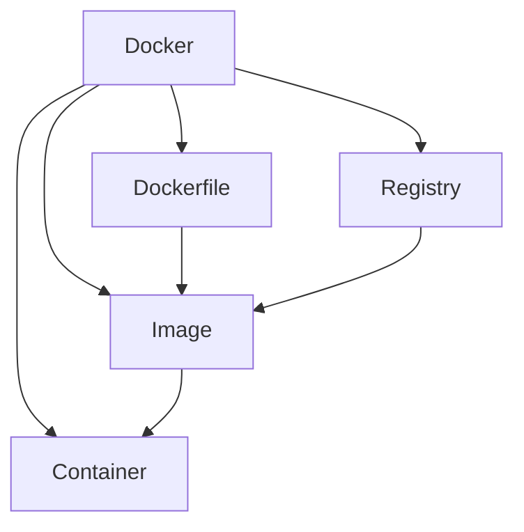

**Слайд 56: ЧТО ТАКОЕ DOCKER?**


::: warning Текст слайда из PDF
ЧТО ТАКОЕ **DOCKER**?

**Docker** — это средство или система упаковки,           История DOCKER
доставки и запуска приложений.
                                                      Первый коммит
1.   Изолированный запуск приложений в контейнерах.
                                                      January 18, 2013
2.   Упрощение разработки, тестирования
     и деплоя приложений.                             **Docker** 0.1.0
                                                      Marh 25, 2013
3.   Отсутствие необходимости конфигурировать
     среду для запуска — она поставляется вместе      18,600+ github stars,
     с приложением — в контейнере.                    3800+ forks,740
4.   Упрощает масштабируемость приложений
     и управление их работой с помощью систем
     оркестрации контейнеров.
:::

**Слайд 57: КОГДА DOCKER ПОЛЕЗЕН**

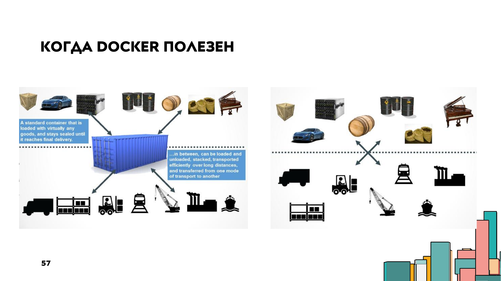

#### Docker: жизнь до Docker и переход к экосистеме

**Слайд 58: БЫЛА ЛИ ЖИЗНЬ ДО DOCKER**

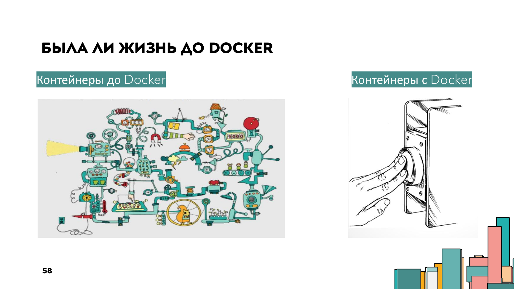

#### Docker: компоненты экосистемы

**Слайд 60: КОМПОНЕНТЫ ЭКОСИСТЕМЫ DOCKER**
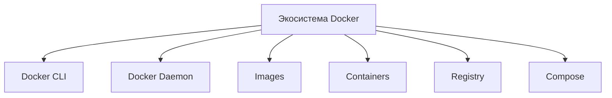

::: warning Текст слайда из PDF
КОМПОНЕНТЫ ЭКОСИСТЕМЫ **DOCKER**

                               Как работает?
                               Следуя специальным
                               инструкциям в
                               конфигурационных файлах,
                               собирает всё необходимое
                               для запуска приложения
                               в одно место — в образ.
                               **Docker**-образ можно сравнить
                               с CD-диском, с которого
                               в будущем будет установлен
                               и запущен некий софт.
                               Контейнер в свою очередь —
                               это запущенная копия образа.
:::

**Слайд 61: СИСТЕМНЫЕ КОМПОНЕНТЫ**

| Компонент | Описание |
|---|---|
| Docker host | Компьютер или виртуальный сервер, на котором установлен Docker. |
| Docker daemon | Центральный системный компонент, который управляет процессами Docker: создание образов, запуск и остановка контейнеров, скачивание образов. |
| Docker client | Утилита, предоставляющая API к Docker daemon. Клиент может быть консольным (*nix-системы) или графическим (Windows). |

#### Docker: образы, контейнеры и сравнение с Compose

**Слайд 63: ЧТО НУЖНО ЗНАТЬ О DOCKER-ОБРАЗАХ**

| Что нужно знать о Docker-образах |
|---|
| Образ - шаблон для создания контейнеров. |
| В основе любого образа лежит родительский образ. |
| Образ состоит из слоев. |
| Каждая команда в Dockerfile создаёт новый слой. |
| Образы можно переиспользовать. |
| Образы можно загружать в удаленный репозиторий. |

**Слайд 64: DOCKER-КОНТЕЙНЕР**
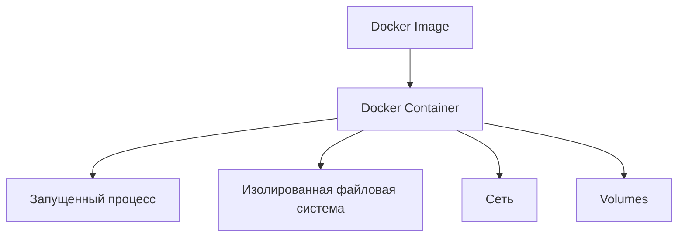

::: warning Текст слайда из PDF
**DOCKER**-КОНТЕЙНЕР

Контейнер — это запущенный и изолированный
образ с возможностью временного сохранения
данных. Данные записываются в специальный
слой «сверху» контейнера и при удалении
контейнера данные также удаляются.
:::

**Слайд 65: ЧТО ЖЕ ТАКОЕ DOCKER?**

| Компонент / сущность | Роль |
|---|---|
| Docker host | Узел, на котором работает Docker. |
| Docker daemon | Центральный системный элемент инфраструктуры; создаёт образы и контейнеры, следит за их состоянием, управляет сетевым окружением контейнеров и работает с локальным и удалённым репозиторием. |
| Docker client | Клиент для взаимодействия с Docker daemon. |
| Docker-compose | Инструмент для описания и запуска набора контейнеров. |
| Образ | Одна из двух основных сущностей Docker. |
| Контейнер | Одна из двух основных сущностей Docker. |

::: warning Текст слайда из PDF
ЧТО ЖЕ ТАКОЕ **DOCKER**?

**Docker** — это система упаковки, доставки и
развертывания приложений
**Docker** состоит из следующих компонентов:
• **Docker** host
• **Docker** daemon
• **Docker** client
• **Docker**-compose
Центральный системный элемент инфраструктуры —
**Docker** daemon. Именно он создаёт образы и
контейнеры, следит за их состоянием, управляет сетевым
окружением контейнеров и работает с локальным и
удалённым репозиторием.
Двумя основными сущностями, которыми оперирует
**Docker** являются: образ и контейнер.
:::

#### Docker Compose и Kubernetes

**Слайд 66: РАЗЛИЧИЯ МЕЖДУ KUBERNETES И DOCKER COMPOSE**
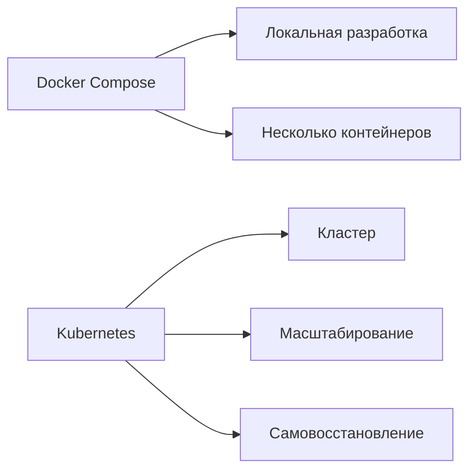

::: warning Текст слайда из PDF
РАЗЛИЧИЯ МЕЖДУ **KUBERNETES** И **DOCKER** COMPOSE

В то время как **Docker** Compose предназначен для создания и запуска
одного или нескольких контейнеров, **Kubernetes** больше служит
платформой для создания сети, в которой мы можем оркестровать
контейнеры.

**Docker** Compose может настроить все сервисные зависимости приложения,
чтобы приступить к работе, например, с нашими автоматическими тестами.
Таким образом, это мощный инструмент для местного развития.
:::

Вот, **Docker** просто сделал это максимально удобно, действительно, по запуску одной кнопки.

Значит, из чего состоит **Docker**? Docker состоит из клиентской части, которую мы можем установить на свою операционную систему. Docker позволяет нам скачать с Docker Hub готовые образы, на которых уже есть необходимое нам программное обеспечение. Допустим, мы на семинаре скачаем образ докера PostgreSQL, последняя версия, и, собственно, поднимем этот контейнер, и к нему удаленно будем подключаться для того, чтобы сохранить наши данные непосредственно в базу. Есть Docker Hub официальные, есть ваши, можете сделать и локальные. Эти образы, на основании этих образов, создаются уже конкретно контейнеры, которые как бы и проигрываются вот этим вот докером.

Собственно, докер-образ — это то, что вы скачиваете откуда-то, либо вы его сами создаете. Но я не видел людей, которые сами создают докер-образ. Сейчас их вот так тьма, поэтому проще скачать образ. Допустим, сейчас у меня даже есть картинка, как он выглядит, этот образ. нужные библиотеки наслаиваются друг на друга но сейчас увидите то есть еще раз докер образ это по сути инсталляционный файл который можно запустить на основании образа можно запустить несколько контейнеров то есть по сути докер образ это класс а контейнер это объект то есть докер образ описывает как будет выглядеть запущенный контейнер вот так значит Процесс формирования докер-образа, он достаточно интересен.

Вы можете скачать докер-образ, какой-то минимальный, который действительно вам нужен, ну, к примеру, с Apache сервером. И туда доустановить требуемое уже конкретно вам набор библиотек, либо каких-то фреймверков, либо каких-то других, другое программное обеспечение. Оно реально просто доустанавливается как дополнительная библиотека. И еще. Здесь нет ядра операционной системы, но он понимает, что данный контейнер будет запускаться на операционной системе Linux, у которой есть Kernel Space. То есть это как раз, помните, картинка, где верхушка — это User Space, и основная часть операционной системы — это Kernel Space. И, по сути, мы меняем именно область операционной системы, которая юзерспейс.

То есть это набор библиотек, требуемый для работы прикладного программного обеспечения. Сами по себе они работать не будут. Нам нужен некий как раз такой провайдер, который позволит вот эти вот измененные юзерспейс. наложить на Kernel Space операционные системы. Этим провайдером или посредником является **Docker**. На основании Docker образа создается Docker контейнер. То есть это уже действительно запущенный и изолированный образ, который взаимодействует с Kernel Space. По сути, тогда говоря о том, что же такое Docker, то это совокупность нескольких вещей. которые позволяют нам доставить и развернуть приложение в этом Docker-контейнере.

### Kubernetes

#### Kubernetes: зачем он нужен

**Слайд 36: KUBERNETES**
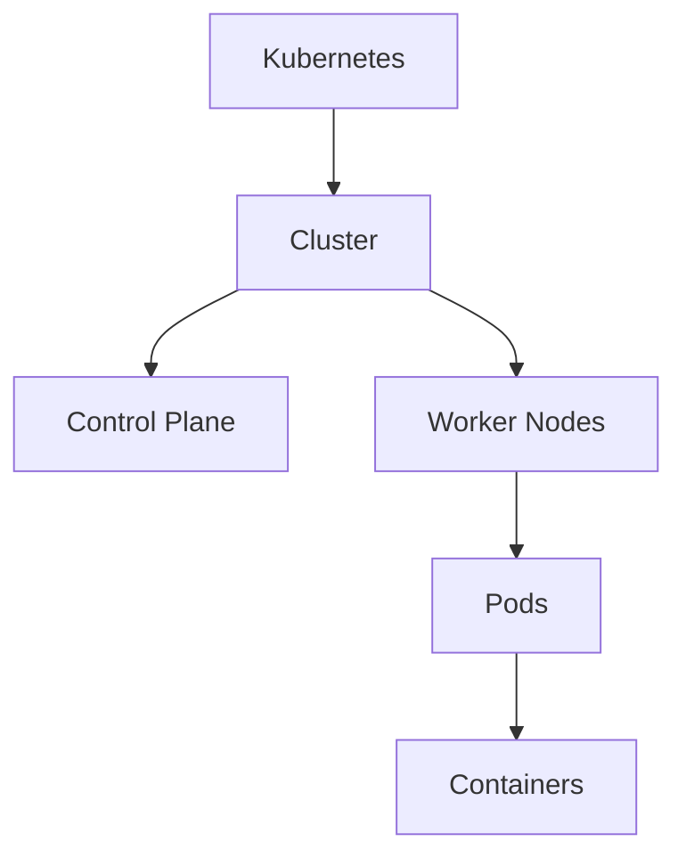

**Слайд 40: KUBERNETES**


::: warning Текст слайда из PDF
**KUBERNETES**
Почему контейнеры стали популярны?       Какие проблемы принесли микросервисы?
1. Скорость и простота создания образа   1. Усложнение инфраструктуры
2. Легкие и универсальные                2. Изменение процесса разработки
3. Быстрое изменение и откат             3. Сложнее обеспечить безопасность
4. Экономное использование ресурсов      4. Высокая стоимость специалистов
:::

**Слайд 41: KUBERNETES (K8S)**
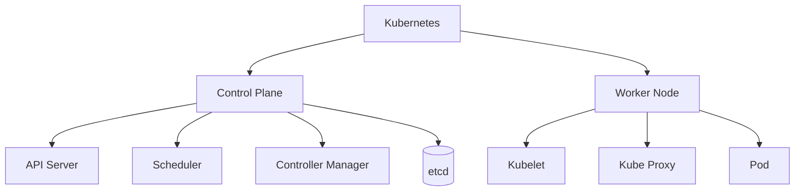

::: warning Текст слайда из PDF
**KUBERNETES** (K8S)

**Kubernetes** как решение                        Ключевые этапы развития проекта:
                                              1. Разработка началась инженерами Google,
**Kubernetes** - утилита оркестрации                 которые хотели сделать публичный аналог
контейнерами с открытым исходным кодом.          Google Borg (управление кластерами).
                                              2. Исходный код был опубликован в 2014 году.
Помогает управлять контейнеризированными      3. Версия 1.0 опубликована в 2015 году.
приложениями в любой среде: физические        4. Организован фонд Cloud Native Computing
серверы, виртуальные машины, публичные           Foundation (CNCF)
облака.

Ключевой тезис - K8s это не одна программа,
это фреймворк, т.е. набор технологий
:::

#### Kubernetes: функции и архитектура

**Слайд 42: KUBERNETES (K8S)**


::: warning Текст слайда из PDF
**KUBERNETES** (K8S)

Что делает **Kubernetes**?

K8s это абстракция.
Вы переходите от управления сетями, узлами,
серверами к управлению сервисами.

“Говорите что вам нужно сделать и вас не
интересует как это происходит”

K8s автоматизирует рутинные задачи:
• High Availability
• Scalability
• Disaster Recovery
:::

**Слайд 43: KUBERNETES (K8S)**
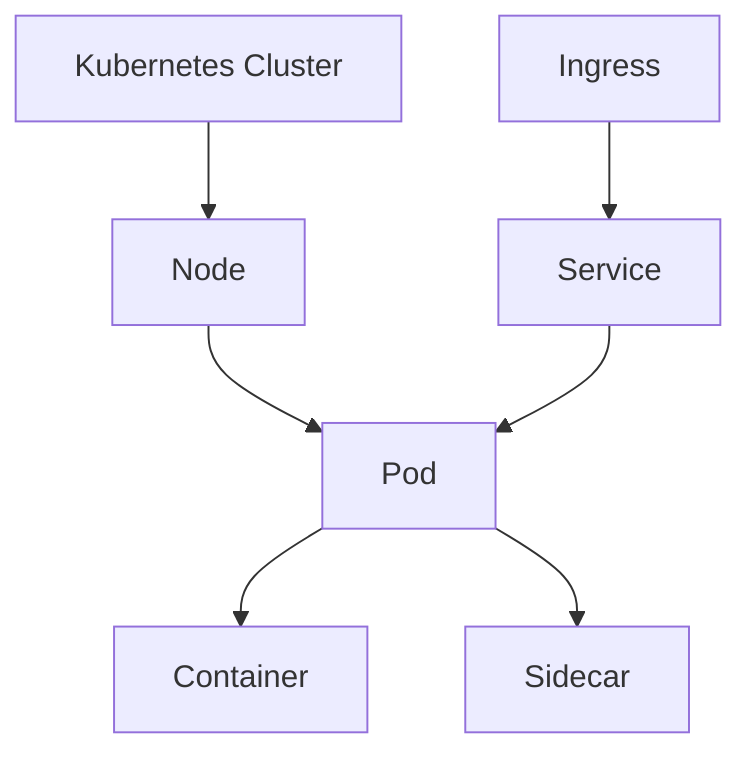

::: warning Текст слайда из PDF
**KUBERNETES** (K8S)

                   Архитектура **Kubernetes**

                   • Pod - самый маленький юнит
                     (абстракция контейнера);
                   • Pod обычно состоит из одного
                     контейнера;
                   • Один pod - одно приложение;
                   • Каждый Pod имеет свой ip-адрес.
:::

Наверное, для нас самое важное, если у **Docker** один из компонентов является Docker Compose, который очень часто сравнивают или противопоставляют **Kubernetes**. Но все-таки Docker Compose... Это инструмент, который служит для создания и запуска одного нескольких контейнеров. А Kubernetes, он служит для того, чтобы действительно дирижировать этими контейнерами, позволяя их масштабировать вертикально, то есть создавать несколько инстансов и в нужный момент схлапывать опять до одного.

Поэтому все-таки **Docker** Compose это такое более... локальное решение каких-то небольших задач но если вы действительно идете в high load то там уже docker compose не справится необходимо будет рассматривать инструменты помощнее но сейчас наверное про стандартом является кубер нетис но зачем нам просто докер нам он нафиг не нужен нам нужно в докере поднять базу данных чтобы не устанавливать базу на свой компьютер Поэтому наша следующая, вторая часть такой экспресс-лекции – это познакомиться с ходом развития баз данных.

И понять, а когда же нам необходимо использовать реляционную базу, а действительно ли есть сейчас в чистом виде реляционные, либо они уже стали платформенными, которые дают решение и… документальной, реляционной и, не знаю, in-memory баз данных. То есть попробовать проследить ход мыслей разработчиков баз данных, что же им не сидится на месте? Казалось бы, ну что там можно вообще менять? Но мы наблюдаем, что последние 20 лет происходит прямо реальный бурный процесс изменения баз данных. И, не знаю, когда мне в университете говорили, что мы тогда, ну, как раз примерно 20 лет назад, мне говорили, да вот, когда вы закончите университет, реляционных баз данных не будет, сейчас начинается прогресс.

Но вот, когда я закончил университет, реляционные базы были, и еще потом лет 5 были. Но последние лет 10 действительно происходит большая революция. И вот хочется... с вами вместе задуматься, а почему это так происходит. Напомню, цель не рассказать вам про весь предмет СУБД. Это у вас будет следующий курс, и два модуля вы будете изучать СУБД.

### Базы данных и контейнеризация

**Слайд 118: ПАТТЕРН UNIT OF WORK**
```mermaid
flowchart TD
    Service[Бизнес-операция] --> UoW[Unit of Work]
    UoW --> Track[Отслеживает измененные объекты]
    UoW --> Repo1[Repository A]
    UoW --> Repo2[Repository B]
    UoW --> Commit[Commit одной транзакцией]
    Commit --> DB[(Database)]
```

::: warning Текст слайда из PDF
ПАТТЕРН **UNIT OF WORK**

**Unit of Work** - ведёт список объектов, затронутых
бизнес- транзакцией, и координирует запись
изменений и решение проблем параллелизма.

Другими словами, **Unit of Work** - отслеживает всё,
что вы делаете во время бизнес- транзакции,
которая может повлиять на базу данных. Когда вы
закончите, он выяснит все, что нужно сделать,
чтобы изменить базу данных в результате вашей
работы.
:::

Цель расширить ваш кругозор, чтобы вы понимали, а когда стоит воспользоваться in-memory базами данных, когда стоит воспользоваться... революционными, когда объектными, а когда вообще серверными, а когда нам хватит встраиваемой базы данных, которая встраивается в наш процесс. В общем, я не стал строить доклад именно сравнивать те или иные базы данных, а решил построить именно эволюционно. И исходя из того, какие требования предъявляются постоянно к базе, что она должна видоизменяться. Вот, казалось бы, среднестатистический кластер, работающий, ну, тут в целом я даже не написал, на какой базе данных, ну, допустим, на PostgreSQL. Как он мог бы выглядеть? У нас есть некоторый интернет-магазин, который мы разбили на ряд микросервисов.

Каждый из микросервисов отвечает за свою задачу. Интернет-магазин, учет товара и планировщик маршрутов. У каждого микросервиса есть своя база данных. И, собственно, уровень хранения данных отдается под OLTP-базы. Это базы, которые обеспечивают действительно хороший механизм транзакций. Это обычные базы, реляционные чаще всего. Ну, примером может являться PostgreSQL. С другой стороны, чем характерен этот слой или эти базы? Тем, что к ним... Происходит очень большое количество одновременных запросов, большое количество на чтение, изменение данных. И, собственно, думать-то там особо не надо. Нужно дать надежность и быстроту для большого количества подключений. С другой стороны, есть Алаб. Там совершенно другие механизмы. Там те накопленные данные.

Необходимо каким-то образом сопоставлять, анализировать и так далее. С этими данными работает гораздо меньшее количество людей, чаще всего один-два аналитика, и совершенно другие требования предъявляются к этим базам. Если у нас к OLTP, это которые PostgreSQL, допустим, реляционные базы, к ним действительно там должны быть актуальные данные, потому что если мы дадим пользователю какие-то... устаревшие данные, то есть вероятность, что он произведет покупку товара, которого уже нет. То есть это актуальные данные, это чаще всего работа с небольшими кусочками данных. То есть какому-то пользователю нужно отдать товар, какой-то пользователь хочет изменить товар и так далее.

Но зато много конкурентных пользователей, которые могут ломиться к одной и той же строчке. И вот это все должно разруливаться LTP-базами. У лаб-базы они не так нуждаются в актуальных данных. То есть, если вы анализируете 5-летний период, то для вас данные, которые изменились за последние сутки, уже не так принципиально. Но зато там обработка больших данных. И с другой стороны, хоть одно радует, там нет большого количества одновременных подключенных клиентов. Так вот, как можно было бы построить кластер... А, вот на следующей картинке я, по-моему, да, скопировал его с ресурсов Postgres. Как бы мог выглядеть кластер, построенный на базе данных PostgreSQL? Ну, PostgreSQL, действительно, она сейчас уже платформенная база.

Она не только считается революционной, она и документальная, она и предоставляет инструменты для анализа. Поэтому в целом нам действительно достаточно воспользоваться PostgreSQL и как бы мы могли построить этот кластер. У нас будут read-write запросы на добавление, на чтение данных. У нас будет некий балансировщик, который будет заниматься репликацией данных, то есть для того, чтобы она масштабировалась. И снизить нагрузку, особенно на чтение, чтобы нашим 10 тысячам пользователей в одну секунду не позволять читать данные с одной базы, мы можем разделить эту базу на две и реплицировать данные. Ну и вот какой-нибудь балансировщик реплицирует базы на две базы, одну из них делает резервную копию с одной из них, потому что все равно они две одинаковые.

Ну а рид запросы обращает, опять же, через балансировщик либо к одной, либо к другой базе. Вот, казалось бы, достаточно такой хороший, типичный кластер, который обеспечит надежность и высокую скорость работы. Но на самом деле здесь возникают вопросы, связанные с масштабированием. Как мы можем произвести масштабирование такого кластера? Один из вариантов – мы можем выделить разные подходы. Можем выделить сервер BD, разделить BD по ролям. Одна база будет на чтение, одна база будет на запись. Можем перейти на микросервисы. Тогда у каждой ограниченного контекста будет своя база, что тоже должно снизить нагрузку.

Например, микросервис по продажам будет работать с таблицей продажи. можем произвести шардирование. И вот эти все хотелки, вот именно они заставляют системных программистов создавать все новые и новые базы, чтобы для прикладных разработчиков, для программных инженеров базы оставались скучными. Вы действительно не должны думать, как и что там происходит. В то же время жизнь системных разработчиков, которые пишут эти базы, у них жизнь Для них она не скучная, а веселая. Что мы можем сделать для повышения эффективности работы? Можем произвести горизонтальное масштабирование. То есть, когда у нас несколько серверов объединяются в одну логическую базу, и есть некий маршрутизатор, балансировщик, который определяет, к какой части...

Баз данных необходимо отправить в запрос. Есть разные варианты такого масштабирования. Как мы распределим нашу базу на несколько баз данных? Можно произвести вертикальное партицирование. Допустим, у нас есть одна таблица, и мы разбиваем эту таблицу на несколько значений. Вероятность ошибиться велика. Вы можете не спрогнозировать рост, ну или вы не сможете на начальном этапе вашей разработки спрогнозировать, на какую именно из таблиц будет более высокий рост, и правильно ли вы разбили таблицу. Можно произвести не вертикальное партицирование, а горизонтальное партицирование. Там тоже несколько подходов, но смысл такой, что, к примеру, мы можем разбить данные, То есть не по их колонкам, а по строкам.

Допустим, в одной таблице, которая, ну не знаю, у нас будет сервер где-нибудь на одном из континентов расположен, и, соответственно, там имеет смысл хранить данные тех пользователей, которые, скорее всего, к этим данным будут чаще обращаться. То есть немножко так разбить данные горизонтально и поделить их на несколько серверов. Можем поделить их по периодам. можем поделить их на основании хэш-функций. То есть тогда балансировщик будет высчитывать хэш-функцию и определять, что с вероятностью высокой данные находятся именно на этом сервере баз данных. Как выглядит горизонтальное партицирование? Либо мы бьем пользователей на несколько групп, либо мы пишем какую-нибудь хэш-функцию, которая подскажет, на каком из серверов находятся данные.

Тогда типичное приложение будет выглядеть следующим образом. У нас есть балансировщик, который будет балансировать нагрузку на те или иные микросервисы, ну или перенаправлять. Но теперь у нас не одна база, а две базы, соответственно, нам тоже необходим какой-то программный роутер, который будет балансировать нагрузку на наши кластеры. И действительно такие роутеры появились. Они способны выполнять такую балансировку. Этих роутеров сейчас достаточно. Количество есть решений от Яндекса. Есть решения и от других вендоров. Все они хороши по-своему. Но смотрите, получается, что на текущий момент в целом любая серьезная реляционная база данных, ну, лидеров там, наверное, три. Это PostgreSQL, Mongo и MySQL по количеству пользователей.

Любая из этих баз на текущий момент действительно стала таким платформенным решением. И они позволяют работать. То есть любая из перечисленных баз, давайте на PostgreSQL возьмем, она и документальная, она и OLTP база, то есть реляционная с транзакциями, она и OLAP. Она и частично GIS-база. То есть это платформенное решение, которое в целом дает вам все, что нужно. Она позволяет произвести, используя вот эти вот роутеры, вашу базу можно разбить на несколько кластеров, и роутеры будут нормально работать с несколькими кластерами. И, казалось бы, чего еще надо? Но на самом деле человеческий... энтузиазм не стоит на месте, и стали появляться in-memory базы. В целом оно другому не противоречит.

И когда мы говорили про масштабирование, то есть наряду с шардированием и партицированием, можно также воспользоваться и кэшированием. То есть без проблем вы можете добавить... Ну, либо in-memory базу, либо просто добавить кэш, который будет в оперативной памяти кэшировать часто используемые базы. Но в чем преимущество баз данных, которые кэшируют? Ну, во-первых, у них нет чтения с диска.

- Во-вторых, у них кэшу нет необходимости кэшироваться, потому что он и так является кэшем.

Если LTP базы кэшируют данные для доступа к ним, то... In-memory база, которая и так в кэше, ей это делать не нужно. Минусы. Обычным базам приходится работать с вводом-выводом, то есть записывать, считывать. Многопоточность, там требуются блокировки. Работа с диском тоже требует определенных ресурсов. То есть стандартные базы, которые действительно не предоставляют элементы кэширования, достаточно сейчас сложно уже обойтись только такими базами. Поэтому один из вариантов увеличить производительность ваших OLTP баз, это добавить кэш. Но вопрос есть, вы можете просто добавить кэш, а можете использовать in-memory базы. То есть дело в том, что со временем базы, которые кэшировали данные, они как бы тоже трансформировались.

И они сейчас называются даже, я бы сказал, in-memory базами. Почему in-memory база данных? Это не то же самое, что база данных с кэшем. Смотрите, если у нас есть application, который работает с базой, то все прекрасно. Что мы можем сделать? Мы можем добавить, ну, он, допустим, обрабатывает 10 тысяч операций в секунду. И в целом нас это может не устраивать. Тогда мы можем часто используемые данные вынести в оперативную память. где действительно доступ к этой оперативной памяти гораздо быстрее, ну и примерно будет увеличение производительности в 10 раз. Потому что нам действительно не придется работать с вводом вывода, записывать что-то на диск, а современные серверные машины позволяют оперативную память уже исчислять достаточно большим объемом.

То есть мы в целом могли бы все данные записать в оперативную память. И вот так-то и родилась мысль. Потому что, смотрите, чем плох просто кэш? Когда он прогретый, то есть когда вы со временем часто используемые данные действительно уже закэшировались и лежат в оперативной памяти, вроде бы все прекрасно. Но представьте, перезагружается, не дай бог, сервер. И весь ваш ранее наработанный кэш стирается и опять придется... Тратить время. Сначала доступ к кэшу, потом там ничего не находится, доступ в СУБД, ну и так прогревается кэш. Со временем вот эта идеология работы с кэшом, она трансформировалась вот в такую вот идею, что теперь базы данных, которые раньше давали только кэш, они стали теперь in-memory базами.

То есть они также сохраняют свое состояние на жесткий диск. Но предоставляет работу все-таки с данными, которые находятся в оперативной памяти. И получается, мы имеем все преимущества стандартных OLTP баз данных, но также у нас еще и добавляется преимущество скорости и производительности. Но, правда, это все происходит. За счет того, что у нас все время вся база, которая может занимать кучу терабайт или сотни гигабайт, она все время находится в оперативной памяти. Но зато мы получаем очень серьезную производительность. Поэтому нужно тут продумывать аккуратно и, может быть, не все данные использовать в in-memory базах данных. Но SQL на самом деле очень странно называется. Не знаю. Лучше бы эти базы как-то назвали.

Может быть, маркетингово это некрасиво звучало. Просто новые типы данных, новые связи. То есть там не то, чтобы нет SQL. Просто там нет схем привычных к нам, которые мы привыкли видеть в реляционных базах данных. Потому что новый SQL хранит данные немножко иначе. Хранит их списком документально. Поэтому из плюсов. Они гораздо проще масштабируются. Проще масштабируется, потому что, смотрите, когда вы реализационную базу данных производите масштабирование, то у вас кросс-запросы, которые… Есть вероятность, что получится запрос, которому нужны данные из этой таблицы и из таблицы с другого кластера. И здесь будет прям колоссальная просадка по производительности, потому что придется выполнять запрос, который полезет к двум кластерам. Здесь у них...

У NoSQL баз практически отсутствуют связи между таблицами, потому что там списки документов, списки документов. И, соответственно, масштабировать такую базу гораздо проще по разным кластерам, потому что низка вероятность того, что вам потребуется выполнять такие кросс-запросы к двум кластерам.

Собственно, вот особенности я все прописал. Бурное развитие, наверное, приходится... на 2018 год, когда как раз MongoDB становится ярким представителем NoSQL документальной базы данных. Потом, кстати, со временем, Mongo также становится и распределенной базой данных.

Собственно, к этому мы сейчас и перейдем. Есть ряд проблем у NoSQL баз данных. Это отсутствие стандартов. общепринятых. То есть если у вас действительно не было каких-то проблем при работе с OLTP-базой, если одна база меняется на другую, потому что все OLTP-базы придерживаются плюс-минус одного стандарта. Мы понимаем реализационную структуру данных, и она в одной реализации будет равняться другой реализации. В то время как... стандартов к NoSQL-базам, их нет. И каждый городит там, что хочет. Как ему придет в голову, так он и сохраняет. Следовательно, работа с одной NoSQL-базой не будет похожа на работу с другой NoSQL-базой. Это прям большой минус.

Но со временем, на самом деле, это уходит, и современные NoSQL-базы стараются соблюдать одни и те же стандарты хранения. Но, казалось бы, все. То есть OLTP-базы дают нам стабильность и предсказуемое масштабирование. Если не хватает скорости, добавляем in-memory, либо добавляем кэш. Чего еще надо? Но на смену на самом деле приходят ближе к 2020 году распределенные SQL-базы. По сути, это все те же OLTP-базы, только которые избавляют вас или делают вашу работу с базами опять скучной и предсказуемой.

То есть вот этот весь зоопарк, что мы сами занимаемся шардированием, мы сами занимаемся партицированием данных, сами вводим кэш данных, это все на самом деле делает жизнь разработчика... нифига не скучной, сложной и, если это прикладной разработчик, то не интересной. А все-таки базы должны оставаться действительно скучным инструментом. Это как, согласно чистой архитектуре, это некий сторонний сервис, с которым нам приходится работать, чтобы он чего-то там сохранял. То есть это не сама цель разработки. Это всего лишь дополнительный сервис. Он должен работать стабильно, как-то сам по себе. И, собственно, появляются распределенные SQL. Это, можно сказать, альтернатива шардированию.

Ну, или можно сказать, что это шардирование, которое происходит как-то там само за счет программного обеспечения. Смотрите, это у нас обычное шардирование, когда мы нашу базу разбили на несколько нот. Как именно организованы ноды внутри, мы решаем сами. Какое именно партицирование там выбрано. Но что из себя представляет распределенная база данных? Как она работает? Представим, что у нас есть один инстанс, то есть одна база с какой-то таблицей, которая имеет 9 записей. Мы можем их условно разделить на 3 группы. Эти 3 группы мы можем разбить на несколько нод.

Собственно, это ручное шардирование. Это то, как мы могли сделать с обычными OLTP, реализационными базами данных, транзакционными. Сделать это так. Но еще раз, роль распределенной базы данных в том, что как раз вот этот ручной труд автоматизировать. То есть предоставить либо сервис, то есть как услугу. либо просто вот этот вот роутер, который будет распределять вашу базу и заниматься вот этой вот репликацией, разложением базы на несколько кусочков. И в зависимости от того, на какой из кусочков идет сейчас нагрузка, тот кусочек опять разбивать на несколько кусочков.

То есть это в реальном времени происходит вот такое вот управление масштабированием, вертикальное масштабирование вот этих вот... созданных инстансов но давайте рассмотрим как это могло выглядеть на примере xpeng от базы maria db так вот что из себя представляет одна из распределенных баз данных собственно можно было быть более этим поддержать отечественного производителя у яндекса на самом деле получилось не хуже а может быть даже где-то лучше чем у maria db Поэтому у Яндекса тоже есть распределенная база данных, и в 2023 году они вышли в Open Source. И, собственно, это свободно распространяемое ПО по лицензии Apache 2.

Значит, смотрите, что из себя представляет MariaDB. Она делает шардирование, но на основании текущей работы с базой. Она распределяет таблицу на несколько частей. Но так как она понимает, что какая-то из частей в любой момент может выйти из строя, она делает резервные копии, реплики. Но, разумеется, не самой себя. Иначе, если бы первая таблица вышла из строя, то реплика бы вышла из строя. То есть реплики она перемешивает.

Таким образом, если у вас выходит из строя какой-либо узел, допустим, первый, то данные на самом деле не пропадают, просто возрастает нагрузка на третий узел, где была реплика первого узла. Но, тем не менее, она моментально пропадает, то есть возрастает, точнее, нагрузка. Но когда роутер, который, собственно, в MariaDB и является вот этим, даёт эту распределённость, он видит, что этот узел отвалился, на этот возросла нагрузка, он данный узел начинает шардировать на несколько узлов. То есть вот этим и занимается утилита, ну, в AriaDB она называется Max Scale. То есть она занимается распределением нагрузки и созданием вот этих узлов. Вот. Но, разумеется, вещь мощная, но нужна ли она всем?

На самом деле нет. Если у вас меньше 10 тысяч запросов в секунду, то она вам точно не нужна. То есть поднятие распределенной базы данных, да и вообще работа с распределенной базой данных на проектах, где в секунду меньше 10 тысяч запросов, она просто бессмысленна. Потому что тут должен быть механизм кэширования, он должен понимать, где сейчас находятся те или иные данные. Могут быть элементы ложные. Поэтому на запросах, где действительно меньше 10К в секунду, оно просто бессмысленно. Вы только получите просадку. Когда не стоит. Когда мало. Когда базы данных состоят из небольших таблиц. Там тоже не имеет смысла их использовать. И когда у вас присутствуют еще операции записи, но не только чтения, и в равной степени. Но третий вариант это уже так.

На самом деле, по желанию. Что будет дальше?

Дальше, скорее всего, open source будет побеждать. Но в какой-то момент он даже выигрывал, сейчас он сравнялся. Open-source базы, наверное, все-таки вытеснят преприоритарные ПО. И, судя по текущим тенденциям, базы данных становятся платформами. То есть теперь база, она не просто реляционная, она тот же Postgres взял на себя обязанности и OLAP, и OLTP. И он документальный, он графовый, векторный. То есть всё будет идти в ту сторону, что каждая база будет каким-то таким Франкенштейном. Всё уйдёт, скорее всего, в облака. Потому что уже всё уходит в облака. И облака будут предоставлять, видимо... Сейчас дистрибутивные базы данных не совсем ещё зрелые. То есть это буквально история последних пяти лет.

Но есть тенденция, что... все будет уходить в дистрибутивные базы данных, которые с каждым днем все будут более серьезным и зрелым продуктом. И если сейчас еще действительно можно как-то посидеть, подумать, или точнее так, не думая выбрать PostgreSQL, чтобы не утруждать себя, не засорять голову, и все, то, скорее всего, лет через пять базы превратятся в такой швейцарский нож, и выбрать вообще что-то будет просто нереально. На семинаре мы рассмотрим и встраиваемую базу, и PostgreSQL. Так вот, что такое встраиваемые базы? Куда они встраиваются? Дело в том, что есть ряд задач, которым не нужен отдельный сервер баз данных. То есть сервер баз данных – это отдельный процесс. Что такое процесс, вы с курсе операционных систем, скорее всего, познакомились.

Так вот, не нужно иногда обращаться к другому процессу, ведь межпроцессорное взаимодействие достаточно ресурсоемкое. Гораздо иногда удобнее, чтобы база была внутри вашего основной программы, внутри вашего основного процесса. И вот отсюда появилась еще одна ветка развития – это встраиваемые базы. Куда они встраиваются? В ваш процесс. То есть, по сути, встраиваемые базы – это просто DLL, которой вы пользуетесь из вашей основной программы. А сама база – это, скорее всего, какой-то текстовый документ. Который там хранит данные. А DLL позволяет вам с этим текстовым документом работать как будто бы это база данных. То есть она позволяет SQL писать нотацию и делать SQL-запросы к файлу. Хотя там реально лежит просто файл.

Но работать с ним вы сможете только исключительно через вот это вот подключение. в ваш процесс, да и лить библиотеку. И получается, что она встраивается в ваш процесс. И у нее есть ряд преимуществ. Где и когда ее стоит использовать? Для мобильных приложений, когда вы не хотите какие-то данные, клиентские данные, которые нужны тому клиенту, который установил мобильное приложение. Зачем ему свои данные отправлять на сервер? Возможно, это какие-то сохраненки UI. Ну, какие-то, не знаю, там, тема, там, темная тема и какие-то еще сохраненные вещи, которые нужны только ему. Ну, можно хранить в каком-нибудь текстовом файле, но тогда с ним работать придется неудобно.

А так можно работать с тем же текстовым файлом только через соответствующие запросы, как будто бы это база данных.

### Итоги

Если это какое-нибудь интернет-устройство, если это какое-то десктоп-приложение, которое работает с базой. Все.
